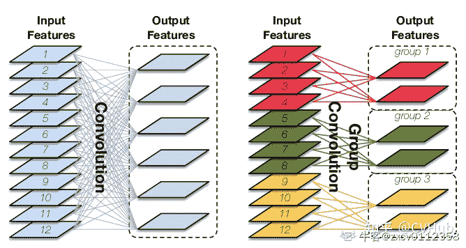
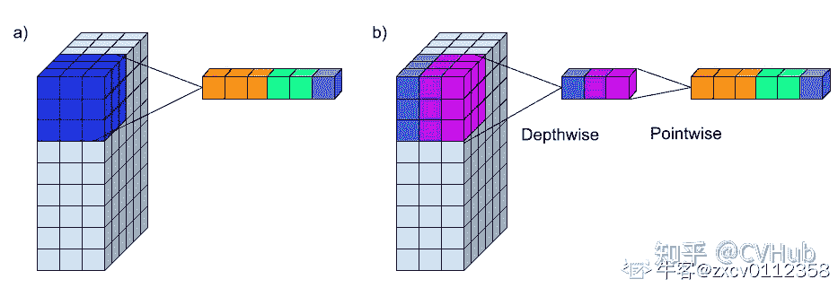
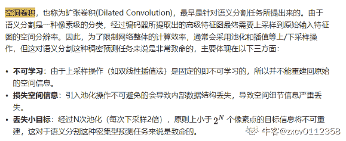
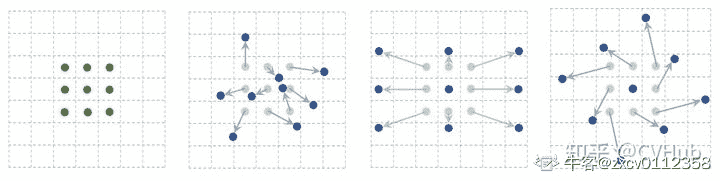
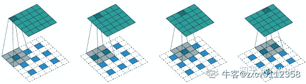

# 网易 2021 校招笔试-计算机视觉算法工程师（正式第二批）

## 1

请挑选以下卷积方式中的 2 种，通过公式、画图或者简单文字描述，阐述计算过程，分析各自的应用特点。 （1）组卷积 (Group Convolution) （2）深度可分离卷积 (Depthwise Separable Convolution) （3）空洞卷积 (Dilated Convolution) （4）可变形卷积 (Deformable Convolution) （5）反卷积 (Deconvolution\Transposed Convolution)

你的答案

本题知识点

算法工程师 网易 2021

讨论

[zxcv0112358](https://www.nowcoder.com/profile/473856205)

有个空洞卷积的 gif 挂了，我不修了
图片挂了在新标签页中查看
以下所有内容来自 [`zhuanlan.zhihu.com/p/381839221`](https://zhuanlan.zhihu.com/p/381839221)
本人只负责整理。

（1）组卷积 (Group Convolution)
原始卷积操作中每一个输出通道都与输入的每一个通道相连接，通道之间是以稠密方式进行连接。而组卷积中输入和输出的通道会被划分为多个组，每个组的输出通道只和对应组内的输入通道相连接，而与其它组的通道无关。这种分组(split)的思想随后被绝大多数的新晋卷积所应用。


（2）深度可分离卷积 (Depthwise Separable Convolution)
标准的卷积过程中对应图像区域中的所有通道均被同时考虑，而深度可分离卷积打破了这层瓶颈，将通道和空间区域分开考虑，对不同的输入通道采取不同的卷积核进行卷积，

（3）空洞卷积 (Dilated Convolution)



（4）可变形卷积 (Deformable Convolution)
在计算机视觉领域，同一物体在不同场景，角度中未知的几何变换是任务的一大挑战，通常来说要么通过充足的数据增强，扩充足够多的样本去增强模型适应尺度变换的能力，要么设置一些针对几何变换不变的特征或者算法，比如 SIFT 或者滑动窗口等。然而传统 CNNs 固定的几何结构无法对未知的物体形变进行有效建模，因此可变形卷积的提出便是用于解决此问题。


（5）反卷积 (Deconvolution\Transposed Convolution)
由于数字信号处理中也有反卷积的概念，所以一般为了不造成歧义，大多数框架的 API 都会定义为转置卷积。
转置卷积是一种一对多的映射关系


编辑于 2022-02-02 20:27:08

* * *

## 2

在日常深度学习模型训练的过程中，有时会出现机器 GPU 利用率较低的现象，请问出现这种现象时可以排查哪些可能的原因？在数据规模较大的情况下，通过哪些方法可能可以提升机器训练效率（可利用相关工具）？

你的答案

本题知识点

算法工程师 网易 2021

讨论

[秋名山怎么走啊](https://www.nowcoder.com/profile/758265121)

GPU 利用率低可能出现的原因有几点：1.数据加载导致：GPU 绝大部分时间在等待 CPU 加载数据 2.数据预处理：数据预处理逻辑复杂 3.模型保存过于频繁（可能性低）4.Loss 计算复杂导致 CPU 计算时间太长从而阻塞 GPU 主要排除数据加载和处理的部分，数据规模较大的情况下可以尝试数据并行的方式训练模型

发表于 2021-10-10 15:39:36

* * *

## 3

A 公司和 B 公司有 n 个合作的子项目，每个子项目由 A 公司和 B 公司各一名员工参与。一名员工可以参与多个子项目。一个员工如果担任了该项目的项目经理，它需要对所参与的该项目负责。一个员工也可以负责多个项目。A 公司和 B 公司需要保证所有子项目都能有人负责，问最少需要指定几名项目经理？

本题知识点

Java 工程师 网易 2021 游戏研发工程师 算法工程师

讨论

[人类的本质是人类的本质是人类的本质是](https://www.nowcoder.com/profile/1583436)

这道题看起来应该是 **二分图最小点覆盖**由 Konig 定理可知，最小点覆盖数=最大匹配边数转换为**二分图的最大匹配问题**(虽然这是一道板子题，但还是有点离谱

发表于 2021-01-16 20:03:13

* * *

[LancelotLT](https://www.nowcoder.com/profile/173277400)

思路是：基于二分图最小点覆盖进行求解，由 koing 定理二分图中的最小点覆盖数=最大匹配数。想吐槽的是：这个试题输出的 用例数据都不分行，完全没办法用于本地调试，简直是 XXXXXX。Python 代码如下：

```cpp
if __name__ == '__main__':
    def dfs(x, graph_dict, visited, left):
        b_members = graph_dict[x]
        for b_m in b_members:  # 同一次 增广路寻找中，若 v 曾经被达到过，则跳过。
            if visited[b_m] == 0:  # 若 x 能到达的 右部结点 b_m 为非匹配点，则找到了一条长度为 1 的增广路，记：left[b_m] = x
                visited[b_m] = 1
                if b_m not in left.keys():
                    left[b_m] = x
                    return True
                else:
                    # 若 b_m 为匹配点，则递归的从 left[b_m]出发寻找增广路，回溯时记：left[b_m] = x
                    dfs(left[b_m], graph_dict, visited, left)
                    left[b_m] = x
                    return True
        return False

    # a_company = list(map(int, input().split(' ')))
    # b_company = list(map(int, input().split(' ')))
    # n = int(input())
    # projects = []
    # for _ in range(n):
    #     temp = list(map(int, input().split(' ')))
    #     projects.append(temp)
    a_company = [0, 1, 2]
    b_company = [3, 4, 5]
    projects = [[0, 4], [0, 3], [1, 3], [1, 4], [2, 5], [2, 4]]
    graph_dict = {}
    for p in projects:
        if p[0] not in graph_dict.keys():
            graph_dict[p[0]] = []
        graph_dict[p[0]].append(p[1])
    # 根据建立的二分图，寻找 最大匹配数 = 最小点覆盖数
    visited = {}  # 记录右部节点是否被匹配过
    for b_m in b_company:
        visited[b_m] = 0
    left = {}  # 匹配右部 i 点的左部节点
    ans = 0
    for a_m in a_company:  # 从 a 公司的任一节点出发，依次寻找增广路，并查找返回结果
        if dfs(a_m, graph_dict, visited, left):
            ans += 1
    print(ans)

```

发表于 2021-04-03 21:08:56

* * *

[Soccer,soccer,soccer!](https://www.nowcoder.com/profile/396822396)

import java.util.*;

public class Main
{

public static void main(String[] args)
{
Scanner sc = new Scanner(System.in);
String left = sc.nextLine();
String right = sc.nextLine();
int n = sc.nextInt();
String[] l = left.split(" ");
String[] r = right.split(" ");
int[] a = new int[l.length];
int[] b = new int[r.length];
HashMap<Integer, Integer> num = new HashMap<Integer, Integer>();
int count = 0;
int length = a.length + b.length;
int[][] map = new int[length][length];
int[] match = new int[length];
Boolean[] used = new Boolean[length];
for (int i = 0; i < length; i++)
{
Arrays.fill(used, false);
Arrays.fill(map[i], -1);
Arrays.fill(match, -1);
}

for (int i = 0; i < a.length; i++)
{
a[i] = Integer.valueOf(l[i]);
num.put(a[i], i);
}
for (int i = 0; i < b.length; i++)
{
b[i] = Integer.valueOf(r[i]);
num.put(b[i], i + a.length);
}
for (int i = 0; i < n; i++)
{
int xx = sc.nextInt();
int yy = sc.nextInt();
map[num.get(xx)][num.get(yy)] = 1;
map[num.get(yy)][num.get(xx)] = 1;
}
search(num, a, b, map, match, used, length);
for (int i = 0; i < length; i++)
{
if(match[i] != -1)
{
count++;
}
}
System.out.println(count/2);
}
public static Boolean findPath(HashMap<Integer, Integer> num, int[][] map, int x, Boolean[] used, int[] match, int length)
{
for (int i = 0; i < length; i++)
{
if(map[x][i] == 1)
{
if(used[i] == false)
{
used[i] = true;
if(match[i] == -1 || findPath(num, map, match[i], used, match, length))
{
match[x] = i;
match[i] = x;
return true;
}
}
}

}
return false;
}
public static void setUsed(Boolean[] used)
{
for (int i = 0; i < used.length; i++)
{
used[i] = false;
}
}
public static void search(HashMap<Integer, Integer> num, int[] a, int[] b, int[][] map, int[] match, Boolean[] used, int length)
{
for (int i = 0; i < a.length; i++)
{
if(match[num.get(a[i])] == -1)
{
setUsed(used);
findPath(num, map, num.get(a[i]), used, match, length);
}
}
for (int i = 0; i < b.length; i++)
{
if(match[num.get(b[i])] == -1)
{
setUsed(used);
findPath(num, map, num.get(b[i]), used, match, length);
}
}
}

}
代码参考[匈牙利算法的 Java 语言实现 _bluespacezero 的博客-CSDN 博客](https://blog.csdn.net/Q_AN1314/article/details/79488562?spm=1001.2014.3001.5506)

编辑于 2021-04-29 00:39:25

* * *

## 4

疫情逐步缓和后，电影院终于开业了，但是由于当前仍处于疫情期间，应尽量保持人群不聚集的原则。
所以当小易来电影院选定一排后，尽量需要选择一个远离人群的位置。
已知由 0 和 1 组成的数组表示当前排的座位情况,其中 1 表示已被选座，0 表示空座
请问小易所选座位和最近人的距离座位数最大是多少？
有如下假设：至少有一个人已选座，至少有一个空座位，且座位数限制为

本题知识点

Java 工程师 网易 2021 游戏研发工程师 算法工程师 前端工程师 运维工程师 安卓工程师 iOS 工程师

讨论

[ccbbs](https://www.nowcoder.com/profile/688123147)

js 解法：分割 1，首尾单独判断

```cpp
let _str=readline();
_str = _str.replace(/ /g, '');
let _arr = _str.split('1');
_arr = _arr.map((v, i) => {
    if (i === 0 || i === _arr.length - 1) {
        return v.length;
    }
    return Math.ceil(v.length / 2);
})
console.log(Math.max.apply(null, _arr));
```

发表于 2021-02-22 14:15:27

* * *

[零葬](https://www.nowcoder.com/profile/75718849)

假设数组有 n 个元素，则有两种情况：第一种是买边上的座位，如果边上的座位都是空的，买最左边或者最右边的座位，那最大的距离就是索引 0 和 n-1 分别与离自己最近的 1 的距离的最大值。第二种是买中间的座位，即从第一个 1 到最后一个 1 之间的某个座位，这时候需要寻找两个隔得最远的 1，这时候这两个 1 距离的一半就是中间位置的最大距离。综上两种情况，选择更大的那个距离，就是我们要求的最大距离

```cpp
seats = list(map(int, input().strip().split()))
n = len(seats)
# 先找到左边第一个 1 出现的索引
edge = seats.index(1)
l_bound = edge
r_bound = n - 1
# 再找右边第一个 1 出现的索引，两者选大的作为边缘最大的距离
for i in range(n - 1, -1, -1):
    if seats[i] == 1:
        edge = max(edge, n - 1 - i)
        right = i
        break
# 对于从 left~right 的子数组，寻找其中两个相邻 1 最大的距离即可
distance = 0
ones_idx = [l_bound]
for i in range(l_bound + 1, r_bound + 1):
    if seats[i] == 1:
        distance = max(distance, i - ones_idx[-1])
        ones_idx.append(i)
print(max(edge, distance // 2))
```

发表于 2021-01-19 10:18:23

* * *

[Pekin](https://www.nowcoder.com/profile/610410428)

```cpp
java，时间 O(n)的解法，双指针实现

```
import java.util.Scanner;
public class Main {
    public static void main(String[] args) {
        Scanner scan = new Scanner(System.in);
        String[] s1 = scan.nextLine().split(" ");
        scan.close();
        int[] nums = new int[s1.length];
        for (int i = 0; i < nums.length; i++)
            nums[i] = Integer.parseInt(s1[i]);

        int res = 0;
        int left, right;
        for (int i = 0; i < nums.length; i++) {
            if (nums[i] == 1) continue;
            left = i-1;
            right = i+1;
            int tmpRes = 1;
            while (left >= 0 || right < nums.length) {
                if ((left >= 0 && nums[left] == 1) || (right < nums.length && nums[right] == 1)) {
                    res = Math.max(res, tmpRes);
                    break;
                }
                if (left >= 0) left--;
                if (right < nums.length) right++;
                tmpRes++;
            }
            if (left < 0 && right >= nums.length) 
                res = Math.max(res, tmpRes);
        }
        System.out.println(res);
    }
}
```cpp

```

 发表于 2021-09-16 16:17:07

* * *

## 5

小选线下店最近准备新上架一批长度不等的商品, 用一个数组表示商品的长度，已知货架每一层的长度固定为 X。

小选线下店是一个追求生活美学的店铺，为了摆放美观，每一层至多摆放两个商品，而且商品的总长度不能比货架长度长（已知单个商品的长度都不会比货架长）

请问至少需要多少层的货架，才能漂亮的摆放这些商品呢？

本题知识点

测试开发工程师 测试工程师 网易 2021 大数据开发工程师 算法工程师

讨论

[零葬](https://www.nowcoder.com/profile/75718849)

```cpp
X = int(input())
goods_len = sorted(list(map(int, input().strip().split())))
n = len(goods_len)
count = 0
# 先考虑一层货架放两个商品的情况，要想尽可能少用货架，就用一大搭一小
for i in range(n):
    for j in range(n - 1, -1, -1):
        if goods_len[i] and goods_len[j] and goods_len[i] + goods_len[j] <= X:
            # i 和 j 两个商品能够摆在一层货架上
            count += 1          # 使用货架数自增
            # 这两个商品清除
            goods_len[i] = 0
            goods_len[j] = 0
# 再加上落单的商品，每个商品占一层货架
print(count + len([1 for item in goods_len if item]))
```

发表于 2021-01-19 13:01:32

* * *

[牛客 606997114 号](https://www.nowcoder.com/profile/606997114)

X = int(input())arr = sorted(list(map(int, input().split(" "))), reverse = True) n = 0while len(arr)>1:    if X>=arr[0]+arr[-1]:        arr.pop(0) #放个大的        arr.pop(-1) #放个小的    else:        arr.pop(0) #只能放一个大的    n+=1if len(arr)==1:    n+=1 #就一个或剩一个，独放一层 print(n)

发表于 2021-09-18 00:59:46

* * *

[废柴 SAMA](https://www.nowcoder.com/profile/100744156)

```cpp
import java.util.*;

public class Main {

    public static void main(String[] args) {
        Scanner sc = new Scanner(System.in);
        String n = sc.nextLine();
        int q = Integer.parseInt(n);
        String s = sc.nextLine();
        String[] ss = s.split(" ");
        int[] arr = new int[ss.length];
        int i = 0;
        for(String num: ss){
            arr[i++] = Integer.parseInt(num);
        }
        Arrays.sort(arr);
        int count = 0;
        int m = arr.length-1;
        int k = 0;
        while (m >= 0 && k <= arr.length - 1 && m >= k){
            if(arr[m] == q){
                m--;
                count++;
            }else{
                if(arr[m] + arr[k] <= q){
                    count++;
                    m--;
                    k++;
                }else{
                    count++;
                    m--;
                }
            }
        }
        System.out.println(count);
    }
}
```

发表于 2021-07-08 05:23:43

* * *

## 6

和谐连续序列是指一个连续序列中元素的最大值和最小值之间的差值正好是 1。现在，给定一个整数数组，你需要在所有可能的连续子序列中找到最长的和谐连续子序列的长度。

本题知识点

大数据开发工程师 网易 2021 算法工程师 前端工程师 数据库工程师 运维工程师 安卓工程师 iOS 工程师

讨论

[零葬](https://www.nowcoder.com/profile/75718849)

1.穷举所有的连续子序列 2.用线性复杂度求取各个连续子序列的最大最小值 3.遇到和谐序列时更新和谐序列的最大长度

```cpp
def judge(arr):
    # 使用 O(n)的复杂度同时找出最大和最小值
    n = len(arr)
    if n <= 1:
        return False
    # 初始化最大最小值
    maximum, minimum = arr[0], arr[1]
    if maximum < minimum:
        maximum, minimum = minimum, maximum
    # 遍历数组更新最大和最小值
    for i in range(2, n):
        if arr[i] > maximum:
            maximum = arr[i]
        elif arr[i] < minimum:
            minimum = arr[i]
    return maximum - minimum == 1

if __name__ == "__main__":
    arr = list(map(int, input().strip().split()))
    n = len(arr)
    maxLen = 0
    # 遍历所有的连续子序列，如果满足和谐连续子序列的特征则更新长度
    for left in range(n):
        for right in range(left + 1, n + 1):
            if judge(arr[left: right]):
                maxLen = max(maxLen, right - left)
    print(maxLen)
```

编辑于 2021-01-19 13:04:58

* * *

[牛客 722390216 号](https://www.nowcoder.com/profile/722390216)

```cpp
//滑动窗口
let arr = readline();
arr = arr.split(' ');
let maxLen=0, queue=[], curr=[];
arr.forEach(val => {
    queue[val]=queue[val] ? queue[val]+1 : 1;
    curr.push(val);

    let max=val, min=null;
    queue.forEach((v, index) => {
        if (min==null) min = index;
        if (max < index) max = index; 
    })

    while (max - min > 1 && curr.length>1) {
        let queueVal = curr.shift();
        if (queue[queueVal] == 1) delete queue[queueVal];
        else queue[queueVal]--;

       max=val, min=null;
        queue.forEach((v, index) => {
            if (min==null) min = index;
            if (max < index) max = index; 
        })
    }
    if (maxLen < curr.length && max-min==1) {
        maxLen = curr.length;
    }
})
console.log(maxLen);

```

发表于 2021-02-14 09:16:17

* * *

[DreamYao-66](https://www.nowcoder.com/profile/994369449)

从第二个数开始，遍历数组，每次都放入当前队列，同时找出当前队列的最大值与最小值之后进行判断，只有两种情况才进行操作：1\. max-min>1，出队列，并重新计算最大值与最小值 2\. max-min== 1 计算长度

```cpp
//滑动窗口
const arr = readline().split(" ").map(item => parseInt(item))
const queue = []

if(arr.length <= 1) console.log(0)
else{
    let res = 0
    let min = arr[0], max = arr[0];
    queue.push(arr[0])
    for(let i = 1;i<arr.length;i++){
        queue.push(arr[i])
        if(arr[i]>max) max = arr[i]
        if(arr[i]<min) min = arr[i]
        while(max - min > 1){
            queue.shift();
            min = Math.min(...queue)
            max = Math.max(...queue)
        }
        if(max - min === 1){
            res = Math.max(res,queue.length)
        }
    }
    console.log(res)
}
```

发表于 2021-08-31 13:28:32

* * *