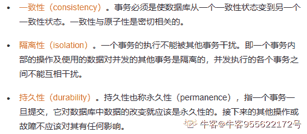

# 网易 2021 校招笔试-数据库管理工程师-杭研（正式第二批）

## 1

如果只提交事务中的部分更新操作，这违背了事务的（  ）

正确答案: A   你的答案: 空 (错误)

```cpp
原子性
```

```cpp
一致性
```

```cpp
隔离性
```

```cpp
持久性
```

本题知识点

数据库工程师 网易 2021

讨论

[牛客 955622172 号](https://www.nowcoder.com/profile/955622172)



发表于 2021-06-21 15:25:29

* * *

## 2

若一本书只能有一个作者出版，一个作者可以出版多本书，则书和作者这两个实体之间的联系是（ ）

正确答案: D   你的答案: 空 (错误)

```cpp
一对一
```

```cpp
多对多
```

```cpp
一对多
```

```cpp
多对一
```

本题知识点

数据库工程师 网易 2021

## 3

在数据库物理设计阶段，建立索引的目的是为了提高数据的（  ）

正确答案: C   你的答案: 空 (错误)

```cpp
更改效率
```

```cpp
插入效率
```

```cpp
查询效率
```

```cpp
删除效率
```

本题知识点

数据库工程师 网易 2021

讨论

[牛客 620107136 号](https://www.nowcoder.com/profile/620107136)

索引只可以提高查询效率

发表于 2021-03-29 23:44:55

* * *

## 4

当数据对象 A 被事务加上排它锁，则其他事务对 A（  ）

正确答案: B   你的答案: 空 (错误)

```cpp
加排它式封锁
```

```cpp
加保护式锁
```

```cpp
可以加排它式封锁和保护式锁
```

```cpp
不能再加任何类型的锁
```

本题知识点

数据库工程师 网易 2021

讨论

[hjj1871984569](https://www.nowcoder.com/profile/4660088)

为什么这题正确答案会是 B 加保护式锁啊，加了排他锁不是不能加其他锁嘛。、[`wenku.baidu.com/view/2d78ca4ff6ec4afe04a1b0717fd5360cba1a8d91.html`](https://wenku.baidu.com/view/2d78ca4ff6ec4afe04a1b0717fd5360cba1a8d91.html)

发表于 2021-03-15 18:04:44

* * *

## 5

下面不会启动触发器操作的是（  ）

正确答案: D   你的答案: 空 (错误)

```cpp
UPDATE
```

```cpp
DELETE
```

```cpp
INSERT
```

```cpp
SELECT
```

本题知识点

数据库工程师 网易 2021

## 6

下面关于存储过程的描述中，不正确的是（  ）

正确答案: B   你的答案: 空 (错误)

```cpp
存储过程实际上是一组 SQL 语句
```

```cpp
存储过程无法用来更新数据库，只能用来查询
```

```cpp
存储过程不能独立于数据库而存在
```

```cpp
存储过程可以完成某一特定的业务逻辑
```

本题知识点

数据库工程师 网易 2021

## 7

在 UML 模型中，用于表达一系列的对象、对象之间的联系以及对象间发送和接收消息的图是（  ）

正确答案: A   你的答案: 空 (错误)

```cpp
协作图
```

```cpp
状态图
```

```cpp
顺序图
```

```cpp
部署图
```

本题知识点

数据库工程师 网易 2021

讨论

[牛客 550334703 号白羊](https://www.nowcoder.com/profile/550334703)

答案 A

*   ```cpp
    协作图
    ```

协作图是交互图中的一种，图中包含一组对象，并展示了这些对象之间的联系以及对象间发送和接收消息。状态图主要是描述一个实体在发生一些事件时的状态变化情况，显示了该实体在某一状态时对不同的事件做出的不同反应。顺序图主要用于描述系统内对象之间的消息发送和接受序列。部署图描述环境元素的配置，并把实现系统的元素映射到配置上。

发表于 2021-04-03 16:23:01

* * *

[小小娃爱吃甜食](https://www.nowcoder.com/profile/215652)

B

发表于 2021-03-24 15:08:38

* * *

## 8

MySQL 将查询 test 库 stu 表的权限授予用户 dev，但不允许该用户将此权限授予其他用户。实现该功能的 SQL 语句是（  ）

正确答案: B   你的答案: 空 (错误)

```cpp
grant select on dev TO test.stu;
```

```cpp
grant select on test.stu to dev;
```

```cpp
grant select to test.stu on dev WITH GRANT OPTION;
```

```cpp
grant select on dev TO test.stu WITH GRANT OPTION;
```

本题知识点

数据库工程师 网易 2021

## 9

若要删除数据库中已经存在的表 stu，下列 SQL 语句中，可以实现的是（  ）

正确答案: C   你的答案: 空 (错误)

```cpp
DELETE TABLE stu
```

```cpp
DELETE stu
```

```cpp
DROP TABLE stu
```

```cpp
DROP stu
```

本题知识点

数据库工程师 网易 2021

## 10

数据库系统如果不进行并发控制，不会导致哪个问题：

正确答案: D   你的答案: 空 (错误)

```cpp
脏读
```

```cpp
丢失修改
```

```cpp
不可重复读
```

```cpp
死锁
```

本题知识点

数据库工程师 网易 2021

## 11

操作系统中不可以用作并发控制的是：

正确答案: A   你的答案: 空 (错误)

```cpp
管道
```

```cpp
自旋锁
```

```cpp
信号量
```

```cpp
原子操作
```

本题知识点

数据库工程师 网易 2021

## 12

一个入栈序列为{A,B,C,D,E},下面哪个可能是出栈序列：

正确答案: C   你的答案: 空 (错误)

```cpp
{A,B,E,C,D}
```

```cpp
{A,D,B,E,C}
```

```cpp
{A,B,C,D,E}
```

```cpp
{A,D,B,C,E}
```

本题知识点

数据库工程师 网易 2021

## 13

对于 IP 地址  198.10.6.4，属于（  ）类地址。

正确答案: C   你的答案: 空 (错误)

```cpp
A
```

```cpp
B
```

```cpp
C
```

```cpp
D
```

本题知识点

数据库工程师 网易 2021

## 14

以下可以查看 Linux 系统负载的命令有

正确答案: A   你的答案: 空 (错误)

```cpp
top
```

```cpp
iostat
```

```cpp
chmod
```

```cpp
du -hs
```

本题知识点

数据库工程师 网易 2021

## 15

以下关于进程与线程的描述，错误的是：

正确答案: D   你的答案: 空 (错误)

```cpp
进程和线程都有运行、就绪、阻塞等状态
```

```cpp
多进程的程序往往比单进程多线程的程序更加健壮
```

```cpp
进程拥有独立的内存地址空间，而线程没有
```

```cpp
线程是组织资源的最小单位，而进程是安排 CPU 执行的最小单位
```

本题知识点

数据库工程师 网易 2021

讨论

[Liebesleid_zjl](https://www.nowcoder.com/profile/57084335)

答题的时候看不到健壮😥

发表于 2021-03-10 16:09:15

* * *

## 16

数据库事务故障恢复只需要正向扫描日志文件

正确答案: B   你的答案: 空 (错误)

```cpp
正确
```

```cpp
错误
```

本题知识点

数据库工程师 网易 2021

## 17

TCP/IP 协议断开连接，当服务端发起断开连接请求时客户端先发送 ACK 报文到服务端，之后才会发送 FIN 报文到服务端

正确答案: A   你的答案: 空 (错误)

```cpp
正确
```

```cpp
错误
```

本题知识点

数据库工程师 网易 2021

## 18

数据库位图索引适用于列的基数少，可枚举，重复值多的场景

正确答案: A   你的答案: 空 (错误)

```cpp
正确
```

```cpp
错误
```

本题知识点

数据库工程师 网易 2021

## 19

使用 RC 隔离级别事务中不会发生死锁

正确答案: B   你的答案: 空 (错误)

```cpp
正确
```

```cpp
错误
```

本题知识点

数据库工程师 网易 2021

## 20

一个表中可以建立多个普通索引，一个唯一索引，多个主键索引

正确答案: B   你的答案: 空 (错误)

```cpp
正确
```

```cpp
错误
```

本题知识点

数据库工程师 网易 2021

## 21

简述索引的用途和优缺点，并谈谈给表加索引的时候可依据哪些规则？

你的答案

本题知识点

数据库工程师 网易 2021

讨论

[默默的 coder](https://www.nowcoder.com/profile/378496699)

索引的用途：

1.  本质：索引是一种满足快速查询算法的数据结构，在 mysql 中采用 B+tree，是采用平衡二叉树的基础上，在叶子节点之间增加了链表，能够更加高效的提升查询效率
2.  用途：提升查询效率，提升用户体验

索引的优缺点：

优点：

1.  提升检索效率，从而降低磁盘 IO 成本；
2.  索引已经是经过排序后的数据结构，通过索引列进行排序，降低排序带来的 CPU 消耗

缺点：

1.  索引的存在形式，存储在物理磁盘上的文件，会增加物理磁盘的开销
2.  降低更新表的速度：在 update、insert、delete 操作时，mysql 不仅要维护数据文件，也同样要更新索引信息

给表加索引的几个原则：

1.  经常出现在 where、order by、group by 条件中的字段，需要在此字段上建立索引
2.  每张表必须建立主键索引，原则：最好是无用的整型列，作为主键，如果不手动添加主键，mysql 也会自己默认创建主键
3.  最左前缀匹配原则：适用于建立联合索引
4.  尽量建立联合索引，而不是建立较多的单列索引
5.  索引不是建的越多越好
6.  尽量使用数据量小的列做索引
7.  尽量使用前缀索引

发表于 2021-01-19 23:43:01

* * *

[fillywang](https://www.nowcoder.com/profile/1802020)

索引的用途是为了加快查找速度，索引一般使用 hash 索引或者 B+树索引，在索引上进行查找，避免了对表进行顺序扫描，节省了时间。索引的优点：根据某一列进行查询的速度很快；缺点：索引会占用内存空间，选择不适合的索引会增加扫描时间。加索引的依据：SQL 语句的查找条件，范围查找使用 B+树索引比较好，单值查找或者 group by/distinct 等小组形式的查询使用哈希索引比较好。

发表于 2021-01-10 20:39:09

* * *

## 22

请谈一谈对 DBA 岗位的职责理解，工作内容及核心目标，为达成目标最需要具备的因素有哪些？ 结合自身对数据库的理解，谈谈其对管理运维工作的挑战和机遇。

你的答案

本题知识点

数据库工程师 网易 2021

## 23

和谐连续序列是指一个连续序列中元素的最大值和最小值之间的差值正好是 1。现在，给定一个整数数组，你需要在所有可能的连续子序列中找到最长的和谐连续子序列的长度。

本题知识点

大数据开发工程师 网易 2021 算法工程师 前端工程师 数据库工程师 运维工程师 安卓工程师 iOS 工程师

讨论

[零葬](https://www.nowcoder.com/profile/75718849)

1.穷举所有的连续子序列 2.用线性复杂度求取各个连续子序列的最大最小值 3.遇到和谐序列时更新和谐序列的最大长度

```cpp
def judge(arr):
    # 使用 O(n)的复杂度同时找出最大和最小值
    n = len(arr)
    if n <= 1:
        return False
    # 初始化最大最小值
    maximum, minimum = arr[0], arr[1]
    if maximum < minimum:
        maximum, minimum = minimum, maximum
    # 遍历数组更新最大和最小值
    for i in range(2, n):
        if arr[i] > maximum:
            maximum = arr[i]
        elif arr[i] < minimum:
            minimum = arr[i]
    return maximum - minimum == 1

if __name__ == "__main__":
    arr = list(map(int, input().strip().split()))
    n = len(arr)
    maxLen = 0
    # 遍历所有的连续子序列，如果满足和谐连续子序列的特征则更新长度
    for left in range(n):
        for right in range(left + 1, n + 1):
            if judge(arr[left: right]):
                maxLen = max(maxLen, right - left)
    print(maxLen)
```

编辑于 2021-01-19 13:04:58

* * *

[牛客 722390216 号](https://www.nowcoder.com/profile/722390216)

```cpp
//滑动窗口
let arr = readline();
arr = arr.split(' ');
let maxLen=0, queue=[], curr=[];
arr.forEach(val => {
    queue[val]=queue[val] ? queue[val]+1 : 1;
    curr.push(val);

    let max=val, min=null;
    queue.forEach((v, index) => {
        if (min==null) min = index;
        if (max < index) max = index; 
    })

    while (max - min > 1 && curr.length>1) {
        let queueVal = curr.shift();
        if (queue[queueVal] == 1) delete queue[queueVal];
        else queue[queueVal]--;

       max=val, min=null;
        queue.forEach((v, index) => {
            if (min==null) min = index;
            if (max < index) max = index; 
        })
    }
    if (maxLen < curr.length && max-min==1) {
        maxLen = curr.length;
    }
})
console.log(maxLen);

```

发表于 2021-02-14 09:16:17

* * *

[DreamYao-66](https://www.nowcoder.com/profile/994369449)

从第二个数开始，遍历数组，每次都放入当前队列，同时找出当前队列的最大值与最小值之后进行判断，只有两种情况才进行操作：1\. max-min>1，出队列，并重新计算最大值与最小值 2\. max-min== 1 计算长度

```cpp
//滑动窗口
const arr = readline().split(" ").map(item => parseInt(item))
const queue = []

if(arr.length <= 1) console.log(0)
else{
    let res = 0
    let min = arr[0], max = arr[0];
    queue.push(arr[0])
    for(let i = 1;i<arr.length;i++){
        queue.push(arr[i])
        if(arr[i]>max) max = arr[i]
        if(arr[i]<min) min = arr[i]
        while(max - min > 1){
            queue.shift();
            min = Math.min(...queue)
            max = Math.max(...queue)
        }
        if(max - min === 1){
            res = Math.max(res,queue.length)
        }
    }
    console.log(res)
}
```

发表于 2021-08-31 13:28:32

* * *