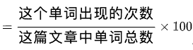

# 网易 2021 校招笔试-测试工程师（有道）（提前批）

## 1

若一个输入框最多可以输入 100 个字符，则下列选项中设计的测试用例最优的是：（ ）

正确答案: D   你的答案: 空 (错误)

```cpp
分别输入 1、49、50、51、100 条记录
```

```cpp
分别输入 0、1、50、99、100 条记录
```

```cpp
分别输入 0、1、99、100、101 条记录
```

```cpp
分别输入 0、1、50、99、100、101 条记录
```

本题知识点

测试工程师 网易 2021

讨论

[可乐星](https://www.nowcoder.com/profile/938722766)

请问写 50 这个测试用例有什么说法吗

发表于 2021-02-09 20:19:34

* * *

[牛客 807838840 号](https://www.nowcoder.com/profile/807838840)

有效等价类和无效等价类，内点上点离点

发表于 2022-03-03 21:50:01

* * *

[牛大红](https://www.nowcoder.com/profile/983392387)

java 版
import java.util.*;
public class Main {

    public static void main(String[] args) {
        // TODO Auto-generated method stub
        Scanner cin=new Scanner(System.in);
        String s=cin.nextLine();
        int len=s.length();
        int l=0,r=len-1;
        int mark=-1;//记录回文串的开始的部分
        while(l<=r){
            if(s.charAt(l)==s.charAt(r)){
                if(mark==-1){
                    mark=l;
                }
                l++;
                r--;
                continue;
            }
            if(mark!=-1){
                l=mark+1;
                mark=-1;
                r=len-1;
            }else{
                l+=1;
            }

        }
        //System.out.println("mark--:"+mark);
        if(mark>=0){
            String s1=s.substring(0,mark);
            String reverse = new StringBuffer(s1).reverse().toString();
            s+=reverse;
        }else{
            String s1=s.substring(0,len-1);
            String reverse = new StringBuffer(s1).reverse().toString();
            s+=reverse;
        }
        System.out.println(s);
    }

}

发表于 2021-08-21 11:33:54

* * *

## 2

下列关于软件性能测试的说法中，正确的是：（ ）

正确答案: C   你的答案: 空 (错误)

```cpp
性能测试的目的不是为了发现软件缺陷
```

```cpp
压力测试与负载测试的目的都是为了探测软件在满足预定性能需求的情况下所能负担的最大压力
```

```cpp
性能测试通常要对测试结果进行分析才能获得测试结论
```

```cpp
在性能下降曲线上，最大建议用户数通常处于性能轻微下降区与性能急剧下降区的交界处
```

本题知识点

测试工程师 网易 2021

讨论

[牛客 437896676 号](https://www.nowcoder.com/profile/437896676)

性能下降曲线分析实际上描述的是性能随用户数增长而出现下降趋势的曲线。 而这里的“性能”可以指响应时间，也可以是吞吐量或单击数/秒的数据，一般主要指响应时间。 其中有几个区间和拐点是性能测试的重要依据，包括单用户区域、性能平坦区、压力区域、性能拐点。

发表于 2021-02-03 09:33:20

* * *

[橙子红了](https://www.nowcoder.com/profile/253453173)

B：
负载测试强调系统正常工作情况下的性能指标
压力测试的目的是发现在什么条件下系统的性能变得不可接受，发现应用程序性能下降的拐点。

发表于 2021-03-23 17:02:11

* * *

[牛客 692346598 号](https://www.nowcoder.com/profile/692346598)

B

发表于 2021-03-15 23:57:03

* * *

## 3

以下哪个状态码代表“服务器拒绝请求”：（ ）

正确答案: C   你的答案: 空 (错误)

```cpp
301
```

```cpp
401
```

```cpp
403
```

```cpp
503
```

本题知识点

测试工程师 网易 2021

讨论

[牛客 562698409 号](https://www.nowcoder.com/profile/562698409)

301 状态码：被请求的资源已永久移动到新位置

401:请求要求身份验证

403:服务器已经理解请求，但拒绝他

404､请求失败，请求所希望得到的资源未被在服务器上发现

503:由于临时的服务器维护或者过载，服务器无法处理请求。

编辑于 2021-03-14 12:07:16

* * *

[法式委屈](https://www.nowcoder.com/profile/164019518)

301 资源（网页等）被永久转移到其他 URL 401 要求用户的身份认证 503 由于超载或系统维护，服务器暂时的无法处理客户端的请求

发表于 2021-01-13 10:38:27

* * *

[小杨斗志昂扬](https://www.nowcoder.com/profile/972091268)

301 状态码：被请求的资源已永久移动到新位置

401:请求要求身份验证

403:服务器已经理解请求，但拒绝他

404､请求失败，请求所希望得到的资源未被在服务器上发现

503:由于临时的服务器维护或者过载，服务器无法处理请求。

发表于 2021-04-10 13:00:49

* * *

## 4

在给定文件中查找与设定条件相符字符串的命令为：（ ）

正确答案: A   你的答案: 空 (错误)

```cpp
grep
```

```cpp
gzip
```

```cpp
find
```

```cpp
sort
```

本题知识点

测试工程师 网易 2021

讨论

[番茄红](https://www.nowcoder.com/profile/402688547)

gzip  用于压缩文件 find  指定目录下查找文件 sort  好像是排序

发表于 2021-02-24 14:50:58

* * *

[牛客 933351651 号](https://www.nowcoder.com/profile/933351651)

python 可以 find

发表于 2022-01-20 10:22:28

* * *

## 5

Linux 文件权限 755，代表以下哪种意思：（ ）

正确答案: B   你的答案: 空 (错误)

```cpp
所有者、同组用户、其他用户都具有读取、写入、执行权限
```

```cpp
所有者具有读取、写入、执行权限；同组用户具有读取、执行权限但没有写入权限；其他用户具有读取、执行权限但没有写入权限
```

```cpp
所有者具有读取、执行权限但没有写入权限；同组用户具有读取、写入、执行权限；其他用户具有读取、写入、执行权限
```

```cpp
所有者具有读取、写入、执行权限；同组用户具有读取权限但没有写入和执行权限；其他用户具有读取权限但没有写入和执行权限
```

本题知识点

测试工程师 网易 2021

讨论

[BlackAtao](https://www.nowcoder.com/profile/995149722)

权限项       读   写   执行   读   写   执行   读   写   执行字符表示    r     w     x        r     w      x       r     w     x       数字表示    4     2    1        4     2      1       4     2     1 权限分配       owner            group                 other

发表于 2021-07-03 09:20:46

* * *

[牛客 992784638 号](https://www.nowcoder.com/profile/992784638)

所有者 同组者 其他组 执行权限 写权限 读权限

发表于 2021-02-09 14:47:15

* * *

## 6

要查询表 user 中 name 字段中，第 2 个字母为 A 的所有数据，请选择正确的查询语句。（ ）

正确答案: A   你的答案: 空 (错误)

```cpp
select *  from user where name like ’_A%’;
```

```cpp
select *  from user where name=’_A%’;
```

```cpp
select *  from user where name like as ’_A%’;
```

```cpp
select *  from user where name like ’?A*’;
```

本题知识点

测试工程师 网易 2021

讨论

[牛客 972490534 号](https://www.nowcoder.com/profile/972490534)

模糊查询 like

发表于 2021-03-12 15:18:59

* * *

[牛客 30244093 号](https://www.nowcoder.com/profile/30244093)

select * from user where name like '_A%' 从 user 表中查询 name 字段中第二个字为 A 的名字的用户 _ 和%都表示通配符 _ 匹配一个字符串 %不限

发表于 2021-10-11 18:56:07

* * *

[singless](https://www.nowcoder.com/profile/68994313)

“-”表示一个字符 “%”表示 0~n 个字符

发表于 2021-02-15 17:50:35

* * *

## 7

图 N 是有 7 个顶点的强连通图，那么 N 是有向图，那么 N 最少有（）条边?如 N 为无向图，N 最少有（）条边？

正确答案: D   你的答案: 空 (错误)

```cpp
21,21
```

```cpp
21,20
```

```cpp
7,7
```

```cpp
7,6
```

```cpp
8,7
```

本题知识点

C++工程师 网易 Java 工程师 测试工程师 测试开发工程师 算法工程师 2020 2021

讨论

[猫仔面](https://www.nowcoder.com/profile/4548438)

强连通图：在 G 中，如果对于每一对 vi、vj（vi≠vj），从 vi 到 vj 和从 vj 到 vi 都存在路径。n 个顶点的有向强连通图：至少 n 条边（形成一个环）；至多 n(n-1)条边 n 个顶点的无向强连通图：至少 n-1 条边（形成一条直线）；至多 n(n-1)/2 条边

发表于 2020-08-06 13:04:57

* * *

[牛客 142348115 号](https://www.nowcoder.com/profile/142348115)

N 为有向图则为一个环，N 为无向图则为一条线

发表于 2019-12-13 16:37:42

* * *

[牛客 221048556 号](https://www.nowcoder.com/profile/221048556)

如果是无向图，可以是 7 个顶点连成一条直线，也可以是 1 个中心顶点与周围 6 个顶点分别连接。

发表于 2020-08-07 12:59:44

* * *

## 8

十进制 102 转换为二进制是：（ ）

正确答案: B   你的答案: 空 (错误)

```cpp
1100111
```

```cpp
1100110
```

```cpp
1100001
```

```cpp
101111
```

本题知识点

测试工程师 网易 2021

讨论

[磨刀有误砍柴工](https://www.nowcoder.com/profile/218234683)

102/2=51.............0
51/2=25..............1
25/2=12..............1
12/2=6...............0
6/2=3................0
3/2=1................1
1/2=0................1

逆向排序：1100110

发表于 2021-01-24 09:35:16

* * *

[singless](https://www.nowcoder.com/profile/68994313)

102 的二进制最后一位不可能为 1，直接排除三个

发表于 2021-02-15 17:53:49

* * *

## 9

若某算法的计算时间表示为递推关系式：T(N)=2T(N/2)+NlogN 且 T(1)=1，则该算法的时间复杂度为：( )

正确答案: C   你的答案: 空 (错误)

```cpp
O(Nsqrt(N))
```

```cpp
O(NlogN)
```

```cpp
O(N(logN)²)
```

```cpp
O(N²logN)
```

本题知识点

测试工程师 网易 2021

讨论

[李承鑫](https://www.nowcoder.com/profile/383654935)

 一共有 logn 层， 每一层的时间复杂度是 nlogn, 故总的时间复杂度为：O（nlogn*logn） = O(n(logn)²) 

发表于 2021-01-16 23:07:30

* * *

## 10

将 50 个红球和 50 个白球放到两个盒子中，从中抽出一个球，那么抽到的是红球的最大概率是：（ ）

正确答案: D   你的答案: 空 (错误)

```cpp
1/2
```

```cpp
2/3
```

```cpp
13/18
```

```cpp
74/99
```

本题知识点

测试工程师 网易 2021

讨论

[Opithecus](https://www.nowcoder.com/profile/974701575)

一个红球放在一个箱子里，其余求全部放到另一个箱子。这样放的概率为：0.5+0.5*(49/99) 约等于 0.75（74/99）此时取到红球的概率最大。

发表于 2021-01-08 17:58:27

* * *

[牛客 969270763 号](https://www.nowcoder.com/profile/969270763)

题目不清： 1\. 分配球者和取球者是不是同一个人？ 2\. 取球者是否知道哪个盒子里放哪些球？ 以上两个选项不同组合至少可以衍生 4 个题目。 在这里必须吐槽和标准答案一致的解题思路，如下： 一个红球放在一个箱子里，其余求全部放到另一个箱子。 这样放的概率为：0.5+0.5*(49/99) 约等于 0.75（74/99） 此时取到红球的概率最大。 解题思路中公式中出现了 49 数字，应该可以说明取球者就是分配球着或者制造球的分配情况，那么他应该只在有红球的盒子里去取球就可以，这时的概率应该是 100%。

发表于 2021-04-11 23:07:06

* * *

[欧贝土](https://www.nowcoder.com/profile/927314825)

把一号箱子的球设为（k）个，其中红球（r）个。二号箱子球数量为（100-k）个，其中红球（50-r）个。 所以抽到红球概率为 0.5*（r/k+（（50-r）/（100-k）） 最大情况是 r/k=1 时，即 0.5*（1+49/99）=74/99

发表于 2022-03-16 15:31:35

* * *

## 11

软件测试的目的是尽可能多的找出软件的缺陷。（ ）

正确答案: A   你的答案: 空 (错误)

```cpp
对
```

```cpp
错
```

本题知识点

测试工程师 网易 2021

讨论

[牛客 699667949 号](https://www.nowcoder.com/profile/699667949)

软件测试的意义为什么不是保证软件质量呢

发表于 2021-03-15 20:15:30

* * *

## 12

测试人员要坚持原则，缺陷未修复完坚决不能上线。( )

正确答案: B   你的答案: 空 (错误)

```cpp
对
```

```cpp
错
```

本题知识点

测试工程师 网易 2021

讨论

[默默鱼 2000](https://www.nowcoder.com/profile/520764234)

如果是影响严重的缺陷，测试人员需要坚持原则（否组上线后可能引发现网事故或客户投诉）；如果是小缺陷或经过专家组评估对现网无影响或风险可控，又基于版本发布的压力（外部压力如客户侧压力等），可适当灵活处理。

发表于 2021-02-02 16:38:22

* * *

## 13

自动化测试能比手工测试发现更多的缺陷。( )

正确答案: B   你的答案: 空 (错误)

```cpp
对
```

```cpp
错
```

本题知识点

测试工程师 网易 2021

讨论

[暴躁廉颇](https://www.nowcoder.com/profile/292653982)

自动化测试只是提高了测试的效率，并不会因为用了自动化就会发现更多的 bug。

发表于 2021-03-27 00:26:22

* * *

[牛客 807838840 号](https://www.nowcoder.com/profile/807838840)

自动化是为了证明软件可用，并不是找 bug

发表于 2022-03-03 22:03:48

* * *

## 14

白盒测试侧重于程序结构，黑盒测试侧重于功能，其中白盒测试需要程序员参与，黑盒测试不需要。( )

正确答案: B   你的答案: 空 (错误)

```cpp
对
```

```cpp
错
```

本题知识点

测试工程师 网易 2021

讨论

[jiang000](https://www.nowcoder.com/profile/496454035)

不管是白盒还是黑河，都需要测试人员的参与 

发表于 2021-03-27 10:27:31

* * *

## 15

有 100 张彩票，最后 1 张一定会中奖，两个人拿彩票，一次最少拿 1 张最多拿 5 张，你先拿，你一定可以中奖。（ ）

正确答案: A   你的答案: 空 (错误)

```cpp
对
```

```cpp
错
```

本题知识点

测试工程师 网易 2021

讨论

[Shaloc](https://www.nowcoder.com/profile/840402462)

先拿四张，然后每次补到 6 张，最后一张一定是自己拿

发表于 2021-01-17 15:53:39

* * *

[jiang000](https://www.nowcoder.com/profile/496454035)

只要不是六的倍数，先拿的都稳赢，这个是 leetcode 上的一道题~ 剩下一章，稳赢

两张，稳赢

三张，稳赢

四张，稳赢

五张，稳赢

如果剩下六张，你拿 输了

剩下七章，你拿一定中奖 1 1 -5

剩下 8 章，你拿 2 张，它那一张，你一定中奖

剩下九章，你拿三张，它那一章，你一定中奖

剩下十章，你拿四张，他拿一章，你一定中奖

剩下十一章，你拿五张，他拿一章，你一定中奖

剩下十二章，你肯定输~

发表于 2021-03-27 10:28:28

* * *

[晓 wu-木子兮](https://www.nowcoder.com/profile/173593866)

这里面有一个前提，先拿的确实是可以控制结果，让自己拿到最后一张。但是如果她本身没有拿最后一张的欲望，不按照每次去跟别人凑 6 的倍数，那么她也是可能拿不到最后一张的。所以答案应该是不一定哦。一定的前提是她想拿。

发表于 2021-03-14 08:36:15

* * *

## 16

下面关于软件测试，描述正确的是：（）

正确答案: A B C   你的答案: 空 (错误)

```cpp
软件测试是使用人工操作或者软件自动运行的方式来检验它是否满足规定的需求或弄清预期结果与实际结果之间的差别的过程
```

```cpp
软件测试的测试目标是发现-些可以通过测试避免的开发风险
```

```cpp
软件测试的原则之-是测试应该尽早进行， 最好在需求阶段就开始介入
```

```cpp
软件测试主要工作内容是验证问题
```

本题知识点

测试工程师 网易 2021

讨论

[牛客 320667907 号](https://www.nowcoder.com/profile/320667907)

😑问题是不是问反了

发表于 2021-01-11 09:52:48

* * *

[牛客 746327783 号](https://www.nowcoder.com/profile/746327783)

```cpp
软件测试主要工作内容是验证和确认
```

发表于 2021-04-07 15:37:28

* * *

[卡莎](https://www.nowcoder.com/profile/430233191)

goacpaoaaa xaayc 欧陆 za Zvdr oxaved

发表于 2021-07-30 08:44:39

* * *

## 17

关于回归测试的策略，以下描述正确的是：（）

正确答案: A B C   你的答案: 空 (错误)

```cpp
要从原基线测试用例库中找出并更新有效的测试用例。
```

```cpp
需要识别出哪些是软件中被修改的部分。
```

```cpp
需要判断当前修改的代码是否破坏了原有的功能。
```

```cpp
回归测试只测和修改工作本身有关的功能。
```

本题知识点

测试工程师 网易 2021

讨论

[牛客 341953326 号](https://www.nowcoder.com/profile/341953326)

有了测试用例库的维护方法和回归测试包的选择策略，回归测试可遵循下述基本过程进行: (1). 识别出软件中被修改的部分； (2). 从原基线测试用例库 T 中，排除所有不再适用的测试用例，确定那些对新的软件版本依然有效的测试用例，其结果是建立一个新的基线测试用例库 T0。 (3). 依据一定的策略从 T0 中选择测试用例测试被修改的软件。 (4). 如果必要，生成新的测试用例集 T1，用于测试 T0 无法充分测试的软件部分。 (5). 用 T1 执行修改后的软件。 第(2)和第(3)步测试验证修改是否破坏了现有的功能，第(4)和第(5)步测试验证 修改工作本身。

发表于 2021-07-04 15:11:01

* * *

## 18

编写测试计划的目的是：（）

正确答案: C D   你的答案: 空 (错误)

```cpp
控制软件质量
```

```cpp
软件测试中必须的一步
```

```cpp
使测试工作顺利进行
```

```cpp
使测试工作更加系统化
```

本题知识点

测试工程师 网易 2021

讨论

[牛客 173866088 号](https://www.nowcoder.com/profile/173866088)

A：测试计划和控制软件质量没有关系 B：测试计划是在测试之前完成的，所以不会是测试中必须的一步 C 和 D 是对的

发表于 2021-02-18 18:00:22

* * *

## 19

以下命令中，可以用于查看日志文件内容的有：（）

正确答案: A B D   你的答案: 空 (错误)

```cpp
tail
```

```cpp
cat
```

```cpp
ls
```

```cpp
tac
```

本题知识点

测试工程师 网易 2021

讨论

[oo33997oo](https://www.nowcoder.com/profile/523794852)

*   cat  由第一行开始显示文件内容
*   tac  从最后一行开始显示，可以看出 tac 是 cat 的倒着写！
*   nl   显示的时候，顺道输出行号！
*   more 一页一页的显示文件内容
*   less 与 more 类似，但是比 more 更好的是，他可以往前翻页！
*   head 只看头几行
*   tail 只看尾巴几行

发表于 2021-04-17 10:09:16

* * *

[IMAGINECAT](https://www.nowcoder.com/profile/484805904)

tac 和 cat 的显示结果相反

发表于 2021-02-17 17:57:31

* * *

[LiDream](https://www.nowcoder.com/profile/832876559)

head 查看前 n 行

发表于 2021-02-13 22:13:45

* * *

## 20

以下说法中，关于 HTTP 与 HTTPS 说法不正确的有：（）

正确答案: A C D   你的答案: 空 (错误)

```cpp
HTTP 比 HTTPS 更安全
```

```cpp
HTTP 比 HTTPS 页面响应速度更快
```

```cpp
HTTP 比 HTTPS 要更耗费服务器资源
```

```cpp
HTTP 与 HTTPS 使用的连接方式相同
```

本题知识点

测试工程师 网易 2021

讨论

[彗星之踵](https://www.nowcoder.com/profile/884454921)

ACD。HTTPS 更安全也更耗费服务器资源，而这连接方式不一样，端口号也不同。

发表于 2021-01-26 18:27:03

* * *

[泤泷](https://www.nowcoder.com/profile/185593725)

HTTP 以明文发送，HTTPS 增加了 SSL/TLS 协议，更加耗费资源、更安全；两者连接方式不同。

发表于 2021-03-26 16:54:53

* * *

[Jʚɞ](https://www.nowcoder.com/profile/6938949)

连接方式是啥，不都是 TCP 吗

发表于 2021-09-18 19:48:31

* * *

## 21

小易今天读了一篇英语文章，他现在想从里面找出一个单词作为这篇文章的关键词，一个单词可以作为关键词当且仅当它在这篇文章中出现的频率不低于 1% ，现在他想知道有多少个不同的单词可以作为关键词。
一个单词出现的频率%

本题知识点

算法工程师 网易 2021 安卓工程师 iOS 工程师 游戏研发工程师 前端工程师 C++工程师 运维工程师 Java 工程师 安全工程师 测试工程师 数据库工程师

讨论

[零葬](https://www.nowcoder.com/profile/75718849)

非常简单，直接统计词频，然后看哪些词的词频达到了关键词的标准即可

```cpp
n = int(input())
wc = dict()
for _ in range(n):
    word = input().strip()
    if word not in wc:
        wc[word] = 1
    else:
        wc[word] += 1
count = 0
for w in wc:
    if wc[w] / n >= 0.01:
        count += 1
print(count)
```

发表于 2021-01-17 23:12:17

* * *

[八首翻唱](https://www.nowcoder.com/profile/7830670)

```cpp
class num_nn(): def __init__(self): self.num_n = [] self.count_m = 0  def play(self): self.n = input("请输入单词数: ") for i in range(0,int(self.n)):
            num = input("请输入单词: ") self.num_n.append(num) self.num_n_set = set(self.num_n) for item in self.num_n_set: print("the %s has found %s" %(item,self.num_n.count(item))) if int(self.num_n.count(item))/int(self.n) >= 0.01: self.count_m = self.count_m + 1  print(self.count_m) if __name__ == '__main__':
    numnn = num_nn()
    numnn.play()
```

发表于 2021-02-28 15:14:28

* * *

[＆liu](https://www.nowcoder.com/profile/942232363)

```cpp
import java.util.HashMap;
import java.util.Scanner;

public class Main {
    public static void main(String args[]) {
        HashMap<String,Integer> hm=new HashMap<String,Integer>();
        Scanner sc=new Scanner(System.in);
        int n=sc.nextInt();
        sc.nextLine();
        int res=0;
        for(int i=0;i<n;i++){
            String tmp=sc.nextLine();
            if(hm.get(tmp)==null){
                hm.put(tmp,1);
            }else{
                hm.put(tmp,hm.get(tmp)+1);
            }
        }
        for(String key:hm.keySet()){
            if((hm.get(key)*100)>=n){
                res++;
            }
        }
        System.out.println(res);
    }
}

```

发表于 2021-01-21 00:16:25

* * *

## 22

小易得到了一个仅包含大小写英文字符的字符串，该字符串可能不是回文串。（“回文串”是一个正读和反读都一样的字符串，比如“level”或者“noon”等等就是回文串，“asds”就不是回文串。）

小易可以在字符串尾部加入任意数量的任意字符，使其字符串变成回文串。

现在请你编写一个程序，程序要能计算出小易可以得到的最短回文串。

本题知识点

C++工程师 网易 2021 游戏研发工程师 Java 工程师 测试工程师 测试开发工程师 算法工程师 数据库工程师 运维工程师

讨论

[应笑](https://www.nowcoder.com/profile/894875376)

#include <bits>using namespace std;

const int MAXL = 3000;
int main()
{
    string s;
    cin>>s;
    int l = s.size();
    for (int i = 0; i < l; i++)
    {
        string temp = s;
        reverse(temp.begin(), temp.end());
        if (s == temp) break;
        s.insert(s.begin()+l, s[i]);
    }
    cout<<s;
    return 0;
}

发表于 2021-01-14 21:36:00

* * *

[loveling](https://www.nowcoder.com/profile/7237115)

直接暴力搜索以右边界为结束点的回文子串的最大长度

```cpp
#include<iostream>
#include<stdio.h>
#include<string.h>
using namespace std;

bool judge(string& s, int l, int r)
{
    bool ret = true;
    while(l<r)
    {
        if(s[l]!=s[r])
        {
            ret = false;
            break;
        }
        l++;
        r--;
    }
    return ret;
}

int main()
{
    string s;
    int n,t;
    cin>>s;
    n=s.size();
    t=n-1;
    for(int i=n-1;i>=0;i--)
    {
        if(judge(s,i,n-1))
        {
            t=i;
        }
    }
    for(int i=t-1;i>=0;i--)
        s+=s[i];
    cout<<s<<endl;
    return 0;
}
```

发表于 2021-03-04 10:26:33

* * *

[零葬](https://www.nowcoder.com/profile/75718849)

寻找原始字符串中回文部分开始的索引

```cpp
s = input().strip()
# 左右边界
l, r = 0, len(s) - 1
# mark 记录回文部分的开始位置
mark = -1
while l <= r:
    # 从两端开始检查，如果两端的字符相等，则 l 指针向右移动，r 指针向左移动
    if s[l] == s[r]:
        mark = l if mark == -1 else mark
        l += 1
        r -= 1
        continue
    # 否则原始字符串不是回文串
    if mark != -1:
        l = mark + 1
        mark = -1
        r = len(s) - 1
    else:
        l += 1
# 如果 mark 是 0，表示原来的字符串就是回文串(回文串从索引 0 开始)
if mark >= 0:
    # mark 大于 0 的时候就要将 0~mark-1 的部分反转后拼接在原始字符串后面
    s += s[:mark][::-1]
else:
    # 如果 mark 是-1，则表示原始字符串完全没有回文的部分，直接将原始字符串反转拼接在后面
    s += s[:-1][::-1]
print(s)
```

 编辑于 2021-01-22 14:12:14

* * *</bits>