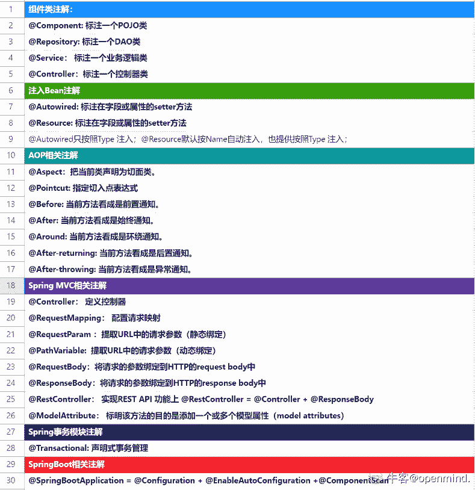
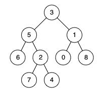
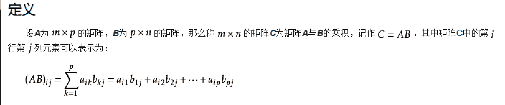
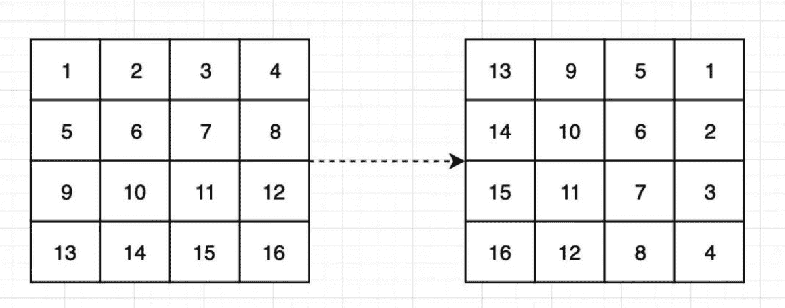

# 二千零二十一、届阅文 Java 方向笔试卷

## 1

详细描述 ThreadPoolExecutor 的各个参数的含义，介绍一个任务提交到线程池后的执行流程。

你的答案

本题知识点

Java 工程师 阅文集团 2021

讨论

[牛客 242160513 号](https://www.nowcoder.com/profile/242160513)

ThreadPoolExecutor(int corePoolSize,int maximumPoolSize,long keepAliveTime,TimeUnit unit,BlockingQueue<Runnable> workQueue ,ThreadFactory threadFactory,RejectedExecutionHandler handler)1.corePoolSize:核心线程池大小 2.maximumPoolSize:最大线程池大小 3.keepAliveTime:线程最大空闲时间 4.unit:时间单位 5.workQueue:线程等待队列 6.threadFactory:线程创建工厂 7handler:拒绝策略执行流程：当在 execute(Runnable)方法中提交新任务并且少于 corePoolSize 线程正在运行时，即使其他工作线程处于空闲状态，会创建一个新线程来处理该请求。如果有多于 corePoolSize 但小于 maximumPoolSize 线程正在运行，则仅当队列已满时才会创建新线程。如果 maximumPoolSize 达到最大值会执行拒绝策略。

发表于 2021-01-29 10:46:16

* * *

[Ariessss](https://www.nowcoder.com/profile/7643966)

核心线程数 表示线程池的常驻核心线程数。刚提交任务的时候，每来一个任务就会创建一个线程，直到达到核心线程数。最大线程数 用于表示线程池最大能维护的线程数量过期时间 非核心线程的过期时间过期单位 非核心线程的过期单位线程工厂 用来方便标记所使用的线程任务队列 用来存放未执行的任务拒绝策略 如果当前线程数达到最大线程数，那么后面的任务将没有可以执行的线程，会根据这个参数执行策略来处理这个任务   4 种策略 1.报错                  2.让启动线程池的线程执行
                   3.丢掉
                    4.丢掉最早的任务
任务提交的流程：首先判断当前线程池里的线程是否大于核心线程数，如果小于，则创建新线程执行任务，如果大于，则看任务队列中能否放下，如果放得下，就放入任务队列中等待被执行，如果放不下，就看是否大于最大线程数，如果小于则继续创建线程执行任务，如果大于了最大线程数，则执行拒绝策略。

发表于 2021-02-17 21:03:26

* * *

[哩哩弟弟](https://www.nowcoder.com/profile/372111038)

```cpp
public ThreadPoolExecutor(int CorePoolSize, int MaximumPoolSize, long unit, BlockingQueue<Runnable> workQueue, ThreadFactory threadFactory, RejectedExecutionHandler handler){ //functions }
```

```cpp
序号          名称                      类型                        含义
1          corePoolSize                int                    核心线程池大小
2          maximumPoolSize              int                    最大线程池大小
3          keepAliveTime                long            线程最大空闲时间
4             unit                   TimeUnit                       时间单位
5           workQueue          BlockingQueue<Runnable>     线程等待队列
6         threadFactory            ThreadFactory             线程创建工厂

		7            handler         RejectedExecutionHandler      拒绝策略

```
新线程加入的三种情况 -> 空闲             ->      执行;
                       都在工作          ->       排队;
                       都在工作&队排满了  ->      new 线程，执行
                       池子满了&队排满了  ->      do nothing

1\. if current thread count < corePoolSize，                            Run

2\. if current thread count = corePoolSize,                             Wait(Add to workQueue)

3\. if current thread count = corePoolSize & workQueue is full,         Add New Thread and Run(count <maxPoolSize)

4\. if current thread count = maxiumPoolSize & workQueue is full,       Do nothing
```cpp

```

发表于 2021-07-05 18:45:52

* * *

## 2

请简要说明 Servlet 中的生命周期

你的答案

本题知识点

Java 工程师 阅文集团 2021

讨论

[kaboombub](https://www.nowcoder.com/profile/170648310)

web 容器加载 servlet，首先调用 servlet 的 init()方法进行 servlet 初始化，然后通过调用 service()方法实现，根据不同的请求方式调用 doGet 或 doPost()，结束服务，web 容器会通过调用 servlet 的 destroy()方法

发表于 2021-10-01 13:06:50

* * *

[我素 e 控维爱](https://www.nowcoder.com/profile/905845745)

1）初始化阶段： 调用 init()方法

2）响应客户请求阶段：调用 service()方法

3）终止阶段：调用 destroy()方法

发表于 2021-06-28 15:39:51

* * *

[牛客 206916676 号](https://www.nowcoder.com/profile/206916676)

创建 servlet 实列 初始化 提供服务 销毁

发表于 2021-06-08 02:38:17

* * *

## 3

开启两个线程 A、B，打印 1 到 10，线程 A 打印奇数（1、3、5、7、9），线程 B 打印偶数（2、4、6、8、10）。

你的答案

本题知识点

Java 工程师 阅文集团 2021

讨论

[专吃想飞的鱼](https://www.nowcoder.com/profile/6549165)

```cpp
import java.util.concurrent.locks.LockSupport;

/**
 * 开启两个线程 A、B，打印 1 到 10，线程 A 打印奇数（1、3、5、7、9），线程 B 打印偶数（2、4、6、8、10）。
 */
public class LockSupportDemo {

    static Thread thread1;
    static Thread thread2;

    public static void main(String[] args) {
        thread1 = new Thread(() -> {
            for (int i = 1; i <= 9; i += 2) {
                System.out.println(i);
                LockSupport.unpark(thread2);
                LockSupport.park();
            }
        });
        thread2 = new Thread(() -> {
            for (int i = 2; i <= 10; i = i + 2) {
                LockSupport.park();
                System.out.println(i);
                LockSupport.unpark(thread1);
            }
        });
        thread1.start();
        thread2.start();
    }
}

```

发表于 2021-02-05 08:58:36

* * *

[dxzmpk](https://www.nowcoder.com/profile/415472899)

```cpp
package com.company.multi_thread.PrintOddEvenWN;

class TaskEvenOdd implements Runnable {
    private int max;
    private Printer print;
    private boolean isEvenNumber;

    public TaskEvenOdd(Printer print, int max, boolean isEvenNumber) {
        this.max = max;
        this.print = print;
        this.isEvenNumber = isEvenNumber;
    }

    // standard constructors

    @Override
    public void run() {
        int number = isEvenNumber ? 2 : 1;
        while (number <= max) {
            if (isEvenNumber) {
                print.printEven(number);
            } else {
                print.printOdd(number);
            }
            number += 2;
        }
    }

    static class Printer {
        private volatile boolean isOdd;

        synchronized void printEven(int number) {
            while (!isOdd) {
                try {
                    wait();
                } catch (InterruptedException e) {
                    Thread.currentThread().interrupt();
                }
            }
            System.out.println(Thread.currentThread().getName() + ":" + number);
            isOdd = false;
            notify();
        }

        synchronized void printOdd(int number) {
            while (isOdd) {
                try {
                    wait();
                } catch (InterruptedException e) {
                    Thread.currentThread().interrupt();
                }
            }
            System.out.println(Thread.currentThread().getName() + ":" + number);
            isOdd = true;
            notify();
        }
    }

    public static void main(String... args) {
        Printer print = new Printer();
        Thread t1 = new Thread(new TaskEvenOdd(print, 10, false),"Odd");
        Thread t2 = new Thread(new TaskEvenOdd(print, 10, true),"Even");
        t1.start();
        t2.start();
    }
}

```

发表于 2021-01-15 23:04:00

* * *

[我素 e 控维爱](https://www.nowcoder.com/profile/905845745)

```cpp
new Thread(()->{
    for(int i=1;i<=10;i++) {
        if(i%2!=0) {
            system.out.println(i);
        }
    }
}, A).start();
new Thread(()->{
    for(int i=1;i<=10;i++) {
        if(i%2==0) {
            system.out.println(i);
        }
    }
}, B).start();
```

发表于 2021-06-28 15:43:02

* * *

## 4

请编写代码实现单例模式 ，类名为 Singleton

你的答案

本题知识点

Java 工程师 阅文集团 2021

讨论

[清香的茉莉](https://www.nowcoder.com/profile/934893715)

```cpp
class Singleton{
    private Singleton(){}
    //饿汉式
    static private Singleton instance=new Singleton();//因为无法实例化，所以必须是静态的
    static public Singleton getInstance(){
        return instance;
    }
    //懒汉线程安全
    private static volatile Singleton instance2;
    public static Singleton getInstance2(){//双锁检查，线程安全
        if(instance2==null){
            synchronized (Singleton.class){
                if(instance2==null)
                    instance2=new Singleton();
            }
        }
        return instance2;
    }
}

```

发表于 2021-01-18 12:48:28

* * *

## 5

写一个 Map 转换成 JavaBean 的工具类方法，实现如下 mapToObject 方法（使用 Java 反射，不允许使用第三方类库）

public static <T> T mapToObject(Map<String, Object> map, Class<T> beanClass){ 

}

你的答案

本题知识点

Java 工程师 阅文集团 2021

讨论

[txsg](https://www.nowcoder.com/profile/8601261)

参考答案中 field.set(obj, map.get(field.getName()));直接拿出来设置得时候，如果字段为基本类型，而 map 中没有这个字段的值 就会报错 java.lang.IllegalArgumentException: Can not set int field People.id to null value 

发表于 2021-02-02 11:25:19

* * *

[牛客 871810064 号](https://www.nowcoder.com/profile/871810064)

```cpp

```
/**
     *  写一个 Map 转换成 JavaBean 的工具类方法，实现如下 mapToObject 方法（使用 Java 反射，不允许使用第三方类库）
     */
    public static <T> T mapToObject(Map<String, Object> map, Class<T> beanClass) throws IllegalAccessException {
       if (null == map){
           return null;
       }
        try {
            T object = beanClass.newInstance();
            Field[] fields = object.getClass().getDeclaredFields();
            if (null != fields && fields.length > 0){
                for (Field field : fields){
                    // 不能是静态类型或 final 类型
                    int mod = field.getModifiers();
                    if (Modifier.isStatic(mod) || Modifier.isFinal(mod)){
                        System.out.println("===========");
                        continue;
                    }
                    field.setAccessible(true);// 访问私有属性
                    field.set(object, map.get(field.getName()));
                }
            }
            return object;
        } catch (InstantiationException e) {
            e.printStackTrace();
        }
        return null;
    }
```cpp

```

编辑于 2021-08-02 17:44:13

* * *

## 6

数据库操作是我们经常使用的一个技能， 请你完成一个简单的用户密码验证过程 ，给定的条件如下：数据库中存在个用户表:users ,表结构如下：

```cpp
CREATE TABLE `users` (
  `uid` bigint(20) NOT NULL COMMENT '用户 ID',
  `user_name` varchar(32) NOT NULL  COMMENT '用户账号',
  `password` varchar(64) NOT NULL  COMMENT '用户混淆密码',
  PRIMARY KEY (`uid`),
  UNIQUE KEY `u_user_name` (`user_name`)
) ENGINE=InnoDB DEFAULT CHARSET=utf8mb4 COMMENT='用户表'

```

完善以下方法 public boolean verifyPassword(String username,String password) {
      Connection con = getConnection () ;// getConnection（） 方法是个已有的方法可以获取到数据库连接 ，

      // here is your code
}

> 可以不用写 Import 语句，只需要补充关键步骤即可

你的答案

本题知识点

Java 工程师 阅文集团 2021

讨论

[黄天后土](https://www.nowcoder.com/profile/916909936)

```cpp
public boolean verifyPassword(String username,String password){
        Connection con=getConnection;
        String sql="SELECT password FROM users WHERE user_name=?";
        PreparedStatement pst=null;
        ResultSet rs=null;
        boolean flag=false;
        try{
            pst=con.prepareStatement(sql);
            pst.setObject(1,username);
            rs=pst.executeQuery();
            while(rs.next()){
                if(rs.getString("password").equals(password)){
                    flag=true;
                }
            }
        }catch(ClassNotFoundException e){
            e.printStackTrace();
        }catch (SQLException e){
            e.printStackTrace();
        }finally {
            try{
                if(rs!=null) rs.close();
                if(pst!=null) pst.close();
                if(con!=null) con.close();
            }catch(SQLException e){
                e.printStackTrace();
            }
        }
        return flag;
    }

```

发表于 2021-02-10 10:35:05

* * *

[牛客 678058082 号](https://www.nowcoder.com/profile/678058082)

public boolean verifyPassword(String username,String password){
        Connection con=getConnection;
        String sql="SELECT password FROM users WHERE user_name=?";
        PreparedStatement pst=null;
        ResultSet rs=null;
        boolean flag=false;
        try{
            pst=con.prepareStatement(sql);
            pst.setObject(1,username);
            rs=pst.executeQuery();
            while(rs.next()){
                if(rs.getString("password").equals(password)){
                    flag=true;
                }
            }
        }catch(ClassNotFoundException e){
            e.printStackTrace();
        }catch (SQLException e){
            e.printStackTrace();
        }finally {
            try{
                if(rs!=null) rs.close();
                if(pst!=null) pst.close();
                if(con!=null) con.close();
            }catch(SQLException e){
                e.printStackTrace();
            }
        }
        return flag;
    }

发表于 2021-09-29 08:55:16

* * *

[牛客 974302848 号](https://www.nowcoder.com/profile/974302848)

public boolean verifyPassword(String username,String password){
        Connection con=getConnection;
        String sql="SELECT password FROM users WHERE user_name=?";
        PreparedStatement pst=null;
        ResultSet rs=null;
        boolean flag=false;
        try{
            pst=con.prepareStatement(sql);
            pst.setObject(1,username);
            rs=pst.executeQuery();
            while(rs.next()){
                if(rs.getString("password").equals(password)){
                    flag=true;
                }
            }
        }catch(ClassNotFoundException e){
            e.printStackTrace();
        }catch (SQLException e){
            e.printStackTrace();
        }finally {
            try{
                if(rs!=null) rs.close();
                if(pst!=null) pst.close();
                if(con!=null) con.close();
            }catch(SQLException e){
                e.printStackTrace();
            }
        }
        return flag;
    }

发表于 2021-04-21 15:05:44

* * *

## 7

介绍 HashMap 的数据结构、扩容机制，HashMap 与 Hashtable 的区别，是否是线程安全的，并介绍 ConcurrentHashMap 的实现机制。

你的答案

本题知识点

Java 工程师 阅文集团 2021

讨论

[牛客 568491799 号](https://www.nowcoder.com/profile/568491799)

HashMap 的数据结构：数组+链表+红黑树，当链表的值大于 8 的时候，就会转成红黑树存储。HashMap 默认初始容量 16，加载因子 0.75，当存储容量大于 16*0.75 的时候，扩容两倍，并将原数据复制到新的数组上。HashMap 是线程不安全的，性能高，用迭代器遍历索引从小到大，初始容量 16，扩容是容量*2，HashTable 线程安全，性能低，用迭代器遍历索引从大到小，初始容量 11，扩容是容量*2 +1；ConCurrentHashMap 是线程安全的，通过进行数据的分段加锁，避免了锁的竞争。

发表于 2021-01-22 10:06:17

* * *

[牛客 365227200 号](https://www.nowcoder.com/profile/365227200)

HashMap    1）数据结构：数组+链表（红黑树），数组用于存储内容，链表（红黑树）用于解决 hash 冲突。如果链表长度大于阈值 8，但是当前数组长度小于树化阈值 64，则进行数组扩容操作；如果数组长度大于树化阈值 64，则进行链表树化操作，将单向链表转化为红黑树结构。
    2）扩容机制：如果不指定容量，则初始容量默认为 16。如果指定容量，则初始容量设置为大于指定容量的最小 2 的幂数。当当前容量大于容量*负载因子（默认为 0.75）时进行扩容操作，扩容为原容量的 2 倍。
HashMap 与 HashTable 的区别
    1）数据结构区别：HashMap 为数组+链表（红黑树），HashTable 为数组+链表，HashTable 没有树化操作。
    2）扩容机制区别：未指定容量情况下，HashMap 容量默认 16，每次扩容为 2n（n：原容量）。HashTable 容量默认为 11，每次扩容为 2n+1（n：原容量）。指定容量情况下，HashMap 将保证容量为 2 的幂数，HashTable 将直接使用指定容量。    3）数据插入方式的区别：当发生 hash 冲突时，HashMap 使用尾插法插入链表，HashTable 使用头插法插入链表。
    4）线程安全区别：HashMap 是非线程安全的，HashTable 因为使用 synchronized 修饰方法，所以 HashTable 是线程安全的。
ConcurrentHashMap 的实现机制    1）ConcurrentHashMap 通过 synchronized 关键字和 CAS 操作实现线程安全，若插入的槽没有数据，使用 CAS 操作执行插入操作，若插入的槽有数据，通过 synchronized 锁住链表的头节点，从而实现效率与线程安全的平衡。

发表于 2021-03-03 16:28:14

* * *

## 8

介绍数据库连接池的实现方式。如何从连接池中获取连接、将连接放回连接池？使用连接池的优势是什么？列举一下自己用过的连接池。

你的答案

本题知识点

Java 工程师 阅文集团 2021

## 9

什么是死锁？JAVA 程序中什么情况下回出现死锁？如何避免出现死锁？

你的答案

本题知识点

Java 工程师 阅文集团 2021

讨论

[牛客 563171150 号](https://www.nowcoder.com/profile/563171150)

死锁是一种特定的程序状态，在实体之间，由于循环依赖导致彼此一直处于等待之中，没有任何个体可以继续前进。死锁不仅仅会发生在线程之间，存在资源独占的进程之间同样也可能出现死锁。通常来说，我们大多是聚焦在多线程场景中的死锁，指两个或多个线程之间，由于互相持有对方需要的锁，而永久处于阻塞的状态。 基本上死锁的发生是因为：

*   互斥条件，类似 Java 中 Monitor 都是独占的，要么是我用，要么是你用。
*   互斥条件是长期持有的，在使用结束之前，自己不会释放，也不能被其它线程抢占。
*   循环依赖关系，两个或者多个个体之间出现了锁的链条环。

**免死锁的思路和方法。**

**1、**如果可能的话，尽量避免使用多个锁，并且只有需要时才持有锁。

**2、**如果必须使用多个锁，尽量设计好锁的获取顺序。3、使用带超时的方法，为程序带来更多可控性来源——[`blog.csdn.net/qweqwruio/article/details/81359744`](https://blog.csdn.net/qweqwruio/article/details/81359744) 

发表于 2021-02-24 14:32:44

* * *

[牛客 316136920 号](https://www.nowcoder.com/profile/316136920)

死锁是指多个线程因竞争资源而造成的一种僵局（互相等待），若无外力作用，这些进程都将无法向前推进。

发表于 2021-01-17 23:50:59

* * *

## 10

分布式锁有几种实现方式，并介绍每种方式的优缺点。

你的答案

本题知识点

Java 工程师 阅文集团 2021

讨论

[牛客 402046893 号](https://www.nowcoder.com/profile/402046893)

分布式锁解决并发的三种实现方式

在很多场景中，我们为了保证数据的最终一致性，需要很多的技术方案来支持，比如分布式事务、分布式锁等。有的时候，我们需要保证一个方法在同 一时间内只能被同一个线程执行。在单机环境中，Java 中其实提供了很多并发处理相关的 API，但是这些 API 在分布式场景中就无能为力了。也就是说单纯的 Java Api 并不能提供分布式锁的能力。所以针对分布式锁的实现目前有多种方案：
分布式锁一般有三种实现方式：
1、 数据库锁
2、基于 Redis 的分布式锁
3、基于 ZooKeeper 的分布式锁

发表于 2021-07-07 14:27:59

* * *

## 11

什么是 TCP 粘包拆包？为什么会出现粘包拆包？如何在应用层面解决此问题？

你的答案

本题知识点

Java 工程师 阅文集团 2021

讨论

[牛客 563171150 号](https://www.nowcoder.com/profile/563171150)

如果客户端连续不断的向服务端发送数据包时，服务端接收的数据会出现两个数据包粘在一起的情况，这就是 TCP 协议中经常会遇到的粘包以及拆包的问题。

1、TCP 是基于字节流的，虽然应用层和传输层之间的数据交互是大小不等的数据块，但是 TCP 把这些数据块仅仅看成一连串无结构的字节流，没有边界；

2、在 TCP 的首部没有表示数据长度的字段，基于上面两点，在使用 TCP 传输数据时，才有粘包或者拆包现象发生的可能。解决
1、发送端给每个数据包添加包首部，首部中应该至少包含数据包的长度，这样接收端在接收到数据后，通过读取包首部的长度字段，便知道每一个数据包的实际长度了。
2、发送端将每个数据包封装为固定长度（不够的可以通过补 0 填充），这样接收端每次从接收缓冲区中读取固定长度的数据就自然而然的把每个数据包拆分开来。
3、可以在数据包之间设置边界，如添加特殊符号，这样，接收端通过这个边界就可以将不同的数据包拆分开。来源——[`www.cnblogs.com/yaochunhui/p/14175396.html`](https://www.cnblogs.com/yaochunhui/p/14175396.html)

发表于 2021-02-23 17:05:22

* * *

[牛客 141152905 号](https://www.nowcoder.com/profile/141152905)

TCP 是流式传输协议，数据传输时候没有边界，就如同在 Linux 下进行 socket 网络通信编程时，创建套接字使用函数 socket（）时候，有一个参数我们选用流式传输时候，系统就会默认是 TCP 协议。而流式传时，因为数据之间是没有边界的，所以会出现粘包现象。

发表于 2021-12-25 20:50:21

* * *

[陈宇慧 powell](https://www.nowcoder.com/profile/311812161)

TCP 是面向字节流的传输层协议，他可能会组合或者拆分应用层协议的数据 应用层协议没有定义消息的边界，导致数据接收方无法拼接解析数据 因此要解决 tcp 粘包拆包，需要在应用层定义数据的边界，使用基于长度（如 http 协议使用的）或终止符的规则，或特定符号（如 json）

发表于 2021-02-22 10:40:28

* * *

## 12

请大致描述一下 BIO，AIO 和 NIO 的区别？ 

你的答案

本题知识点

Java 工程师 阅文集团 2021

## 13

在 JAVA 语法中加载类的的方式有哪些？

你的答案

本题知识点

Java 工程师 阅文集团 2021

讨论

[EASTking201906191645789](https://www.nowcoder.com/profile/592123003)

1、创建类的实例（开辟地址空间）

2、访问某个静态类或接口的静态常量，或者对该静态变量赋值（类初始化）

3、调用类的静态访问（new，也会占用空间）

4、反射（类初始化）

5、初始化一个类的子类（继承）

6、JAVA 虚拟机启动被称标明为启动类的类

7、调用某个 ClassLoader 实例的 loadClass() 方法（类不会初始化）

发表于 2022-01-21 15:19:59

* * *

[东 201803301729810](https://www.nowcoder.com/profile/2631298)

静态加载即通过 new，动态加载通过 classLoader，我不太清楚通过反序列化获得一个类是不是算一种方式，希望大家指正

发表于 2021-04-02 17:27:24

* * *

## 14

建立三个线程 A、B、C，A 线程打印 10 次字母 A，B 线程打印 10 次字母 B,C 线程打印 10 次字母 C，但是要求三个线程同时运行，并且实现交替打印，即按照 ABCABCABC 的顺序打印。

你的答案

本题知识点

Java 工程师 阅文集团 2021

讨论

[dominic_z](https://www.nowcoder.com/profile/941090148)

```cpp

```
package concurrent;

import java.util.concurrent.locks.LockSupport;

public class LockSupportDemo2 {

    static Thread A,B,C;

    public static void main(String[] args) {
        A = new Thread(()->{
            for (int i = 0; i < 10; i++) {
                LockSupport.park();
                System.out.print("A");
                LockSupport.unpark(B);
            }
        });
        B = new Thread(()->{
            for (int i = 0; i < 10; i++) {
                LockSupport.park();
                System.out.print("B");
                LockSupport.unpark(C);
            }
        });
        C = new Thread(()->{
            for (int i = 0; i < 10; i++) {
                LockSupport.unpark(A);
                LockSupport.park();
                System.out.print("C");
            }
        });
        A.start();
        B.start();
        C.start();
    }
}

```cpp

```

发表于 2021-02-23 15:56:50

* * *

[牛客 696708385 号](https://www.nowcoder.com/profile/696708385)

```cpp
public void test() { for (int x = 1; x <= 10; x++) { CompletableFuture.runAsync(() -> { System.out.println("线程 A" );
        }).thenRunAsync(() -> { System.out.println("线程 B");
        }).thenRunAsync(() -> { System.out.println("线程 C");
        }); try { TimeUnit.SECONDS.sleep(1);
      }catch (Exception e) { e.printStackTrace();
      }
    }
}
```

发表于 2021-02-18 17:35:47

* * *

[清香的茉莉](https://www.nowcoder.com/profile/934893715)

自旋锁解法，不加同步块和 JDK 锁（线程启动部分没贴出来）

```cpp
class Task3{
    private volatile boolean firstDone;
    private volatile boolean secondDone;
    private volatile boolean thirdDone = true;
    volatile int sum =0;
    void first(){
        while (true){
            while (!thirdDone){
                //等待第三个线程的完成
            }
            sum++;
            System.out.println(Thread.currentThread().getName()+" :  A  计数："+sum);
            thirdDone=false;
            firstDone=true;
            if(sum==28)return;
        }
    }
    void second(){
        while (true){
            while (!firstDone){
                //等待一个线程完成
            }
            sum++;
            System.out.println(Thread.currentThread().getName()+" :  B  计数："+sum);
            secondDone=true;
            firstDone=false;
            if(sum==29)return;
        }
    }
    void third(){
        while (true){
            while (!secondDone){
                //等待第二线程完成
            }
            sum++;
            System.out.println(Thread.currentThread().getName()+" :  C  计数："+sum);
            System.out.println("===================================================");
            secondDone=false;
            thirdDone=true;
            if(sum==30)return;
        }
    }
}
```

编辑于 2021-02-24 14:01:45

* * *

## 15

请列举 5 个 spring 框架中的注解，并说明注解的用法以及使用场景

你的答案

本题知识点

Java 工程师 阅文集团 2021

讨论

[openmind.](https://www.nowcoder.com/profile/539390139)



发表于 2021-09-11 15:45:27

* * *

[--只是个过客](https://www.nowcoder.com/profile/846758336)

1.controller(restcontroller) 2.component 3.service 4.configuration 5.requestmapping

发表于 2021-02-24 18:15:59

* * *

## 16

```cpp
给定一组自然数，数字的值有可能会大于 2⁶⁴ ，要求计算出所有数字的和
```

本题知识点

Java 工程师 阅文集团 2021

讨论

[神奇的小马](https://www.nowcoder.com/profile/990151)

```cpp
import org.junit.Test;

import java.util.ArrayList;

public class Solution {

    /**
     * 计算一组数字的和
     * @param numbers string 字符串 ArrayList 一组自然数
     * @return string 字符串
     */
    public String sum (ArrayList<String> numbers) {
        // write code here

        String result="0";
        for (String number : numbers) {

            if(number==null||number.length()==0){
                continue;
            }
            int resultLen = result.length();
            int curNumLen = number.length();
            int sum=0;
            int remain;
            StringBuilder stringBuilder = new StringBuilder();
            while (resultLen>0||curNumLen>0){

                int resultNum=0;
                if(resultLen>0){
                    resultNum = result.charAt(--resultLen) - '0';
                }

                int curNum=0;
                if(curNumLen>0){
                    curNum = number.charAt(--curNumLen) - '0';
                }

                sum=sum+resultNum+curNum;
                remain=sum%10;
                stringBuilder.append(remain);
                sum/=10;
            }

            if(sum!=0){
                stringBuilder.append(sum);
            }
            result=stringBuilder.reverse().toString();

        }

        return result;
    }

    @Test
    public void test(){

        String num1="123456";
        String num2="123456789";
        String num3="123456789123";
        ArrayList<String> strings = new ArrayList<>();
        strings.add(num1);
        strings.add(num2);
        strings.add(num3);
        System.out.println(sum(strings));
    }
}

```

发表于 2021-04-14 19:36:20

* * *

[黄天后土](https://www.nowcoder.com/profile/916909936)

```cpp
package top.handsomecoder;

import java.math.BigDecimal;
import java.util.ArrayList;

public class Solution {
    /**
     * 计算一组数字的和
     * @param numbers string 字符串 ArrayList 一组自然数
     * @return string 字符串
     */
    public String sum (ArrayList<String> numbers) {
        BigDecimal initN = new BigDecimal("0");
        for (String str :
                numbers) {
            BigDecimal bd1 = new BigDecimal(str);
            initN=initN.add(bd1);

        }
        return initN.toString();
    }
}

```

发表于 2021-02-15 18:03:20

* * *

[李厘里](https://www.nowcoder.com/profile/345993406)

```cpp
    public static String sum(List<String> numList) {
        numList = numList.stream()
                .filter(num -> StringUtils.isNotBlank(num))
                .map(num -> num.replaceAll(" ", ""))
                .collect(Collectors.toList());
        if (CollectionUtils.isEmpty(numList)) {
            return "0";
        }
        StringBuffer sum = new StringBuffer(numList.get(0));
        for (int i = 1; i < numList.size(); i++) {
            StringBuffer next = new StringBuffer(numList.get(i));
            Integer sumLength = sum.length();
            Integer nextLength = next.length();

            Stack<Character> stack = new Stack<>();
            boolean hasCarry = false;

            while (sumLength > 0 || nextLength > 0 || hasCarry) {
                Integer sumNum = 0;
                Integer nextNum = 0;

                if (sumLength > 0) {
                    String sumLast = sum.substring(sumLength - 1, sumLength);
                    sumNum = Integer.parseInt(sumLast);
                }

                if (nextLength > 0) {
                    String nextLast = next.substring(nextLength - 1, nextLength);
                    nextNum = Integer.parseInt(nextLast);
                }

                Integer thisTurnInt = sumNum + nextNum + (hasCarry ? 1 : 0);
                Character thisTurn = 
                        new Character(thisTurnInt.toString().charAt(thisTurnInt.toString().length() - 1));
                stack.push(new Character(thisTurn));

                if (thisTurnInt > 9) {
                    hasCarry = true;
                } else {
                    hasCarry = false;
                }

                sumLength--;
                nextLength--;
            }

            sum = new StringBuffer();
            while (stack.size() > 0) {
                sum.append(stack.pop());
            }
        }

        return sum.toString();
    }
```

发表于 2021-01-28 14:39:36

* * *

## 17

给定一个 int 数字，要求计算出 int 数字对应的二进制中 1 的个数

本题知识点

Java 工程师 阅文集团 2021

讨论

[李厘里](https://www.nowcoder.com/profile/345993406)

```cpp
public static int get1Num(Integer i) {
        int sum = 0;
        if (i != null) {
            while (i > 0) {
                sum += (i % 2);
                i >>= 1;
            }
        }
        return sum;
    }
```

发表于 2021-01-28 17:22:03

* * *

[Gnight_Jump](https://www.nowcoder.com/profile/485877170)

最简单的一个个位数判断

```cpp
public int count(int n){
    int count = 0;
    while(n != 0){
        count += n & 1;
        n >>>= 1;
    }
    return count;
}
```

换一种思维，每次都获取到一个 1 然后删去

```cpp
public int count(int n){
    int count = 0;
    while(n != 0){
        n = n & (n-1);
        count++;
    }
    return count;
}
```

原理：每次-1 会将这个数改变得到一个新的数：右边第一个`1`右边的`0`变为`1`，然后右边第一个的`1`变`0`。
将这个新得到数和原本的数相与就能将右边第一个`1`变`0`

> 例子： n = 100100
> 则 n - 1 = 100011
> 二者相与得到 100000
> 然后 count++ 成功统计到一个 1
> 直到全为 0 停止

发表于 2021-01-29 11:48:25

* * *

## 18

```cpp
根据产品策略某本书可以设置包月到期时间，需要计算指定时间到包月到期时间还有多少分钟,不足 60S 的不计入。

```

本题知识点

Java 工程师 阅文集团 2021

讨论

[wonderson](https://www.nowcoder.com/profile/319767782)

```cpp
    public static String dateSub(String a, String b) {
        try {
            SimpleDateFormat sdf = new SimpleDateFormat("yyyy-MM-dd HH:mm:ss");
            sdf.parse(a);
            LocalDateTime t1 =  LocalDateTime.parse(a, DateTimeFormatter.ofPattern("yyyy-MM-dd HH:mm:ss")),
            t2 = LocalDateTime.parse(b, DateTimeFormatter.ofPattern("yyyy-MM-dd HH:mm:ss"));
            long pass = t1.until(t2, ChronoUnit.MINUTES);
            return String.valueOf(Math.abs(pass));
        } catch (Exception e) {
            System.out.println(String.format("格式转化错误：%s, 检查是否格式输入错误", e.getMessage()));
        }
        return "0";
    }

    public static void main(String[] args) {
        System.out.println("请输入指定的两个日期【小者在前，大者在后，格式：yyyy-MM-dd hh:mm:ss】:");
        Scanner sc = new Scanner(System.in);
        String a = sc.nextLine(), b = sc.nextLine();
        sc.close();
        System.out.println(dateSub(a, b));
    }
```

发表于 2022-03-09 14:00:23

* * *

[牛客 895929235 号](https://www.nowcoder.com/profile/895929235)

```cpp
package com.dume.server.face;

import javax.xml.crypto.Data;
import java.text.SimpleDateFormat;
import java.util.Date;
import java.util.Scanner;

/**
 * 根据产品策略某本书可以设置包月到期时间，
 * 需要计算指定时间到包月到期时间还有多少分钟,不足 60S 的不计入。
 */

public class ExpireDate {

    public static void main(String[] args) {
        System.out.println("请输入产品到期时间，格式为“yyyy-MM-dd HH:mm:ss” :");
        SimpleDateFormat simpleDateFormat = new SimpleDateFormat("yyyy-MM-dd HH:mm:ss");
        Scanner scanner = new Scanner(System.in);
        String string = scanner.nextLine();

        Date end = new Date();
        try{
            end = simpleDateFormat.parse(string);   
        }catch(Exception e){
            System.out.println("时间格式错误！");
        }

        long endTime = end.getTime();
        long nowTime = System.currentTimeMillis();

        if(endTime<nowTime){
            System.out.println("到期时间不能在此刻之前！");
        }else{
            System.out.println("到期时间剩余" +(endTime-nowTime)/(60*1000)+"分钟");
        }
    }
}

```

发表于 2021-02-24 14:41:05

* * *

[FrankKong](https://www.nowcoder.com/profile/760359200)

```cpp
import java.text.ParseException;
import java.text.SimpleDateFormat;
import java.util.Date;
import java.util.Scanner;

public class Main {

    public static void main(String[] args) throws ParseException {
        SimpleDateFormat simpleDateFormat = new SimpleDateFormat("yyyy-MM-dd HH:mm:ss");
        Scanner scanner = new Scanner(System.in);
        String strBegin = scanner.nextLine();
        String strEnd = scanner.nextLine();
        Date begin = simpleDateFormat.parse(strBegin);
        Date end = simpleDateFormat.parse(strEnd);
        long res = end.getTime() - begin.getTime();
        System.out.println(res / 1000 / 60);
    }

}
```

 发表于 2021-02-23 10:49:41

* * *

## 19

map 是一种开发过程中经常使用的 k-v 数据结构，有个 map 保存了书名和书字数的关系，编写代码对 map 里面的书按照字数进行升序排序

本题知识点

Java 工程师 阅文集团 2021

讨论

[李厘里](https://www.nowcoder.com/profile/345993406)

```cpp

```
    public static Map<String, Integer> sortMap(Map<String, Integer> map) {
        TreeMap<Integer, List<String>> treeMap = new TreeMap<>();
        map.entrySet().forEach(entry -> {
            List<String> indexList = treeMap.computeIfAbsent(entry.getValue(), k -> new ArrayList<>());
            indexList.add(entry.getKey());
        });
        Map<String, Integer> result = new ListOrderedMap();
        treeMap.entrySet().forEach(entry -> {
            entry.getValue().forEach(key -> result.put(key, map.get(key)));
        });
        return result;
    }

    public static Map<String, Integer> sortMap2(Map<String, Integer> map) {
        Map result = new ListOrderedMap();
        map.entrySet().stream().
                sorted(Map.Entry.comparingByValue()).
                forEachOrdered(entry -> result.put(entry.getKey(), entry.getValue()));

        return result;
    }
```cpp

```

原本用 tree 写，写一半发现 Java8 有工具方法🤯

编辑于 2021-01-29 20:36:23

* * *

## 20

起点 APP 上允许用户对作品进行评论，为了防止用户恶意评论，发表不当内容，需要对用户发布的内容进行过滤，请写程序过滤用户发布内容中带有的 QQ 号（6~10 位数字组成）允许对内容严格操作，如用户发表了 **作者大大 666666，为你点赞** ，经过过滤后也可以为**作者大大****，为你点赞** ，将 666666 过滤掉了。

本题知识点

Java 工程师 阅文集团 2021

讨论

[李厘里](https://www.nowcoder.com/profile/345993406)

```cpp
    public static String filterQQ(String s) {
        return s.replaceAll("\\d{6,10}","");
    }
```

发表于 2021-01-29 20:19:03

* * *

[FrankKong](https://www.nowcoder.com/profile/760359200)

```cpp
public String filterContent (String content) {
        // write code here
        return content.replaceAll("[1-9]\\d{5,9}","");
    }
```

发表于 2021-02-23 11:01:13

* * *

## 21

质数(又称素数),是指在大于 1 的自然数中,除了 1 和它本身外,不能被其他自然数整除(除 0 以外)的数称之为素数(质数)。请写个程序判断输入的数字是否是质数，如果是素数请输出：true，不是请输出 false

本题知识点

Java 工程师 阅文集团 2021

讨论

[dominic_z](https://www.nowcoder.com/profile/941090148)

```cpp
package leecode;

public class IsPrimeDemo {
    public static boolean isPrime(int n){
        if (n < 1){
            return false;
        }
        int i = 2;
        int end = (int) Math.sqrt(n);
        while (i <= end ){
            if (n % i == 0){
                return false;
            }
            ++i;
        }
        return true;
    }

    public static void main(String[] args) {
        int n = 7;
        System.out.println(isPrime(n));
    }
}

```

发表于 2021-02-24 15:46:25

* * *

[牛客夜谈](https://www.nowcoder.com/profile/779057833)

```cpp
public static void main(String[] args) {
    while (true) {
        Scanner scanner = new Scanner(System.in);
        System.out.println("请输入数字");
        int num = scanner.nextInt();
        if (num > 1) {
          if (num == 2 || num == 3) {
              System.out.println(true);
          }
          int i = 2;
          int end = (int) Math.sqrt(num);
          while (i <= end) {
             if (num % i == 0) {
               System.out.println(false);
               break;
             }else{
               System.out.println(true);
               break;
             }
          }
        }else {
           System.out.println("输入数字不合规,请输入大于 1 的数字");
        }
    }
}
```

发表于 2021-02-07 14:05:59

* * *

[李厘里](https://www.nowcoder.com/profile/345993406)

```cpp

```
    public static Boolean isPrimeNum(Integer num) {
        if (num != null && num > 1) {
            if (num == 2 || num == 3) {
                return true;
            }
            int i = 2;
            int end = (int) Math.sqrt(num);
            while (i++ <= end) {
                if (num % i == 0) {
                    return false;
                }
            }
            return true;
        }
        return true;
    }
```cpp

```

编辑于 2021-02-24 20:04:13

* * *

## 22

有 n 个台阶，你一次能走 1 个或者 2 个台阶，那么请问，走完这 n 个台阶共有几种方式？

本题知识点

Java 工程师 阅文集团 2021

讨论

[牛客夜谈](https://www.nowcoder.com/profile/779057833)

```cpp
public static void main(String[] args) {
   Scanner sc = new Scanner(System.in);
   System.out.println("请输入台阶数:");
   int num = sc.nextInt();
   Integer i = judge(num);
   if (i==0){
       System.out.println("有点正事吧,台阶要大于 0");
   }else {
       System.out.println(num+"个台阶共"+i+"种方式能走完");
   }
}
public static Integer judge(int num){
   while (num>0){
       if (num<=2){
           return num;
       }else{
           return judge(num - 1) + judge(num - 2);
       }
   }
   return 0;
}
```

发表于 2021-02-07 14:58:07

* * *

[李厘里](https://www.nowcoder.com/profile/345993406)

经典斐波那契数列的迭代/递归调用

```cpp
    public static Integer steps(Integer n) {
        if (n != null && n > 0) {
            if (n < 2) {
                return n;
            } else {
                return steps(n - 1) + steps(n - 2);
            }
        }
        return 0;
    }
```

发表于 2021-01-30 10:19:59

* * *

## 23

给定一个字符串，返回这个字符串中有多少个回文子串。两个相同的回文子串出现在不同的位置，认为是 2 个回文子串。a、aa、aaa、aba、aabaa、abcba 均认为是回文子串。

本题知识点

Java 工程师 阅文集团 2021

讨论

[wonderson](https://www.nowcoder.com/profile/319767782)

```cpp
import java.util.*;

public class Solution {
    /**
     * 
     * @param str string 字符串 
     * @return int 整型
     */
    public int palindromeCount (String str) {
        char[] cs = str.toCharArray();
        int res = 0;
        int n = str.length();
        boolean[][] f = new boolean[n][n];
        for (int j = 0; j < n; j++) {
            for (int i = 0; i <= j; i++) {
                if (i == j) {
                    f[i][j] = true; 
                } else if (i + 1 == j) {
                    f[i][j] = cs[i] == cs[j];
                } else {
                    f[i][j] = f[i + 1][j - 1] && cs[i] == cs[j];
                }
                if (f[i][j]) {
                    res++;
                }
            }
        }
        return res;
    }
}
```

发表于 2022-03-09 14:13:03

* * *

[牛客 910234405 号](https://www.nowcoder.com/profile/910234405)

```cpp

```

```cpp
   public static int getHuiWenNumber(String str){
        int number=0;
        for(int i=0;i<str.length();i++){
            for(int left=i,right =i;left>=0 &&right<str.length();left--,right++){
                if(str.charAt(left)!=str.charAt(right)){
                    break;
                }
                number++;
            }
        }
        return number;
    }
```

```cpp

```

编辑于 2021-03-15 00:43:51

* * *

[Soccer,soccer,soccer!](https://www.nowcoder.com/profile/396822396)

import java.util.*;

public class Solution {
    /**
     * 
     * @param str string 字符串 
     * @return int 整型
     */
    public int palindromeCount (String str) {        int count = 0;
        for (int i = 0; i < str.length(); i++) 
        {
            count += count_c(i,str);
        }
        return count;
    }
    public  int count_c(int begin, String s)
    {
        int count = 1;
        char c = s.charAt(begin);
        int end = s.lastIndexOf(c);
        while(end != -1 && end != begin)
        {
            Boolean flag = true;
            for(int l = begin, r = end; l <= r; l++, r--)
                {
                    if(s.charAt(l) != s.charAt(r))
                    {
                        flag = false;
                        break;
                    }
                }
            if(flag == true)
                count++;
            end = s.lastIndexOf(c, end - 1);
        }
        return count;

    }
}

编辑于 2021-03-09 21:41:11

* * *

## 24

将一个给定的单链表反转，例：1-2-3-4-5，反转为 5-4-3-2-1

本题知识点

Java 工程师 阅文集团 2021

讨论

[wonderson](https://www.nowcoder.com/profile/319767782)

```cpp
import java.util.*;

/*
 * public class ListNode {
 *   int val;
 *   ListNode next = null;
 * }
 */

public class Solution {
    /**
     * 
     * @param head ListNode 类 
     * @return ListNode 类
     */
    public ListNode reverseList (ListNode head) {
       ListNode pre = null, post = head, tmp;
        while (post != null) {
            tmp = post.next;
            post.next = pre;
            pre = post;
            post = tmp;
        }
        return pre;
    }
}
```

发表于 2022-03-09 14:15:52

* * *

[阿邱](https://www.nowcoder.com/profile/732343422)

使用头插法解决此问题，每次新插入的节点都放在最前面，以此实现翻转链表。

```cpp
public class Solution {
    /**
     * 
     * @param head ListNode 类 
     * @return ListNode 类
     */
    public ListNode reverseList (ListNode head) {
        // write code here
        ListNode dummyHead = new ListNode(0);
        ListNode tail = null;
        dummyHead.next = tail;
        // 采用头插法解决此问题
        while(head != null){
            ListNode node = new ListNode(head.val);
            node.next = dummyHead.next;
            dummyHead.next = node;
            head = head.next;
        }
        return dummyHead.next;
    }
}
```

 发表于 2021-09-11 17:24:59

* * *

[openmind.](https://www.nowcoder.com/profile/539390139)

[`blog.csdn.net/weixin_42322309/article/details/104611424`](https://blog.csdn.net/weixin_42322309/article/details/104611424)

发表于 2021-09-11 15:52:12

* * *

## 25

给定一个二叉树, 找到该树中两个指定节点的最近公共祖先。例：图中给定树 {3,5,1,6,2,0,8,#,#,7,4} 中，节点 6、节点 4 的最近公共祖先为 5。 

本题知识点

Java 工程师 阅文集团 2021

讨论

[张先生－您好](https://www.nowcoder.com/profile/894972709)

```cpp
class Solution:
    def nearestCommonAncestor(self , root , p , q ):
        # write code here
        if not root&nbs***bsp;root.val == q.val&nbs***bsp;root.val == p.val:
            return root

        left = self.nearestCommonAncestor(root.left, p, q)
        right = self.nearestCommonAncestor(root.right, p, q)
        if not left: return right
        if not right: return left

        return root
```

发表于 2021-08-31 09:29:58

* * *

[空灵树叶归尘心随叶动](https://www.nowcoder.com/profile/588315029)

```cpp
public class Solution {
    /**
     * 
     * @param root TreeNode 类 
     * @param p TreeNode 类 
     * @param q TreeNode 类 
     * @return TreeNode 类
     */
    public TreeNode nearestCommonAncestor (TreeNode root, TreeNode p, TreeNode q) {
        // write code here
        return helper(root, p, q);
    }

    public TreeNode helper(TreeNode root, TreeNode p, TreeNode q) {
        if (root == null)
            return null;
        if (root.val == p.val || root.val == q.val)
            return root;
        TreeNode left = helper(root.left, p, q), right = helper(root.right, p, q);
        if (left == null && right == null)
            return null;
        else if (left != null && right != null)
            return root;
        else
            return left == null ? right : left;
    }
}
```

发表于 2021-08-31 13:59:58

* * *

## 26

给定一个递增排序的数组，查找某个数字是否在数组中，如果在数组中，则返回该数字在数组中第一次出现的位置（从 0 开始）；如果不在数组中，返回-1 。不需要考虑给定的数组不是递增的情况。务必使用二分查找的方式。

本题知识点

Java 工程师 阅文集团 2021

讨论

[wonderson](https://www.nowcoder.com/profile/319767782)

public int binarySearch (int[] arr, int a) { int lo = 0, hi = arr.length - 1; while (lo < hi) { int m = (hi - lo) / 2 + lo; if (arr[m] < a) { lo = m + 1; } else { hi = m; } } return arr[lo] == a ? lo : -1; }

发表于 2022-03-09 14:20:04

* * *

[牛客 617355593 号](https://www.nowcoder.com/profile/617355593)

import java.util.*;

public class Solution {
    /**
     * 
     * @param arr int 整型一维数组 
     * @param a int 整型 要查找的数字
     * @return int 整型
     */
    public int binarySearch (int[] arr, int a) {
        // write code here
        int left = 0,right = arr.length-1;
        while(left<= right){
            int middle = left +(right-left)/2;
            if(arr[middle]<a){
                left = middle+1;
            }
            if(arr[middle]>=a){
                right = middle-1;
            }
        }
        if(left == arr.length){
            return -1;
        }
        return left ;
    }
}

发表于 2021-11-09 12:00:27

* * *

[牛客 660361465 号](https://www.nowcoder.com/profile/660361465)

```cpp
 int binarySearch(int* arr, int arrLen, int a) {
        // write code here
        int left = 0;
        int right = arrLen-1;
        int mid = 0;
        while(left<=right)
        {
            mid = (left+right)/2;
            if(arr[mid]==a)
            {
                if(arr[mid-1]!=a)
                    return mid;
                else
                    return mid-1;
            }        
            else if(arr[mid]>a)
                right = mid - 1;
            else
                left = mid + 1;
        }  
        return -1;
    }
```

发表于 2021-09-07 20:23:17

* * *

## 27

请编写程序实现矩阵的乘法

本题知识点

Java 工程师 阅文集团 2021

讨论

[wonderson](https://www.nowcoder.com/profile/319767782)

```cpp
import java.util.*;
public class Main {
        private static int[][] matrixMuilty(int[][] a, int[][] b) {
            int m = a.length, p = b.length, n = b[0].length;
            int[][] res = new int[m][n];
            for (int i = 0; i < m; i++) {
                for (int j = 0; j < n; j++) {
                    for (int k = 0; k < p; k++) {
                        res[i][j] += a[i][k] * b[k][j];
                    }
                }
            }
            return res;
        }

        //输入三个整数，分别表示：第一个矩阵的 行 列【也就是第二个矩阵的行】 第二个矩阵的列
        public static void main(String[] args) {
            Scanner sc = new Scanner(System.in);
            String s = sc.nextLine();
            String[] ss = s.split(",");
            int m = Integer.parseInt(ss[0]), p = Integer.parseInt(ss[1]), n = Integer.parseInt(ss[2]);
            if (m == 0 || p == 0 || n == 0) {
                sc.close();
                return;
            }
            int[][] a = new int[m][p];
            int[][] b = new int[p][n];
            for (int i = 0; i < m; i++) {
                s = sc.nextLine();
                ss = s.split(",");
                for (int j = 0; j < p; j++) {
                    a[i][j] = Integer.parseInt(ss[j]);
                }
            }
            for (int i = 0; i < p; i++) {
                s = sc.nextLine();
                ss = s.split(",");
                for (int j = 0; j < n; j++) {
                    b[i][j] = Integer.parseInt(ss[j]);
                }
            }
            sc.close();
            int[][] res = matrixMuilty(a, b);
            for (int i = 0; i < m; i++) {
                StringBuilder sb = new StringBuilder();
                for (int j = 0; j < n; j++) {
                    sb.append(res[i][j]).append(",");
                }
                System.out.println(sb.substring(0, sb.length() - 1));
            }
        }
    }
```

发表于 2022-03-09 14:41:26

* * *

[挥着牛鞭的男孩](https://www.nowcoder.com/profile/825762)

```cpp
#include<bits/stdc++.h>
int main()
{
    int m, p, n,a[100][100] = { 0 }, b[100][100] = { 0 }, c[100][100] = {0};
	while(scanf("%d,%d,%d",&m,&p,&n)!=EOF) {
		for (int i = 0; i < m; i++)
			for (int j = 0; j < p; j++)
				scanf("%d%*c", &a[i][j]);
		for (int i = 0; i < p; i++)
			for (int j = 0; j < n; j++)
				scanf("%d%*c", &b[i][j]);		
		for (int i = 0; i < m; i++)
			for (int j = 0; j < n; j++)
				for (int k = 0; k < p; k++)
					c[i][j] += a[i][k] * b[k][j];
		for (int i = 0; i < m; i++) {
			for (int j = 0; j < n; j++) {
				printf("%d", c[i][j]);
				if (j != n - 1)
					printf(",");
				else
					printf("\n");
			}
		}
	}
}
```

发表于 2021-03-18 13:56:55

* * *

[加油冲冲冲冲*10086](https://www.nowcoder.com/profile/546216234)

建一个 fun 做 dot product，然后对 B 矩阵做 transpose，然后用 dot product 求最终矩阵乘法的点的结果

```cpp
def dot_product(x, y):
    sum = 0
    for i in range(len(x)):
        sum += x[i] * y[i]
    return sum

def transpose(x):
    i = len(x)
    j = len(x[0])
    res = []
    for k in range(j):
        temp = []
        for ele in x:
            temp.append(ele[k])
        res.append(temp)
    return res

while True:
    try:
        s = list(map(int,input().split(',')))
        x,y,z = s[0],s[1],s[2]
        A = []
        B = []
        for i in range(x):
            A.append(list(map(int, input().split(','))))
        for j in range(y):
            B.append(list(map(int, input().split(','))))
        for k in range(x):
            result = []
            for l in range(len(transpose(B))):
                result.append(dot_product(A[k], transpose(B)[l]))
            word = ','.join(list(map(str, result)))
            print(word)
    except:
        break
```

发表于 2021-02-05 10:27:03

* * *

## 28

求出一个正整数转换成二进制后的数字“1”的个数。例：数字 23 转为二进制为 10111，其中 1 的个数为 4

本题知识点

Java 工程师 阅文集团 2021

讨论

[一生万物九九归一](https://www.nowcoder.com/profile/233412366)

```cpp
public static int binaryTo(int num) { int sum = 0; while (num > 0) {
        sum += num % 2;
        num = num / 2;
    } return sum;
}
```

发表于 2021-02-28 23:39:50

* * *

[专吃想飞的鱼](https://www.nowcoder.com/profile/6549165)

```cpp
import java.io.BufferedReader;
import java.io.InputStreamReader;

public class Main {
    public static void main(String[] args) throws Exception {
        BufferedReader bf = new BufferedReader(new InputStreamReader(System.in));
        String str;
        while ((str = bf.readLine()) != null) {
            int temp = Integer.parseInt(str);
            String s = Integer.toBinaryString(temp);
            char[] chars = s.toCharArray();
            int count = 0;
            for (char aChar : chars) {
                if (aChar == '1') {
                    count++;
                }
            }
            System.out.println(count);
        }
    }
}
```

发表于 2021-02-05 10:06:19

* * *

## 29

去除字符串中的重复字符，对于出现超过 2 次（包含 2 次）的字符，只保留第一个。例：输入 abcbdde，输出 abcde。

本题知识点

Java 工程师 阅文集团 2021

讨论

[FrankKong](https://www.nowcoder.com/profile/760359200)

```cpp
import java.util.*;

public class Solution {
    /**
     * 
     * @param str string 字符串 
     * @return string 字符串
     */
    public String removeDuplicatedChars (String str) {
        // write code here
        boolean[] isExistChar = new boolean[26];
        boolean[] isExistNum = new boolean[10];
        char[] chars = str.toCharArray();
        StringBuilder sb = new StringBuilder();
        for (char c : chars) {
            //是字母
            if(c >= 'a' && c <= 'z'){
                if(!isExistChar[c - 'a']){
                    sb.append(c);
                    isExistChar[c - 'a'] = true;
                }    
            }
            //是数字
            if(c >= '0' && c <= '9'){
                if(!isExistNum[c - '0']){
                    sb.append(c);
                    isExistNum[c - '0'] = true;
                }
            }
        }
        return sb.toString();
    }
}
```

发表于 2021-02-24 09:40:28

* * *

[wonderson](https://www.nowcoder.com/profile/319767782)

```cpp
    public String removeDuplicatedChars(String str) {
        StringBuilder sb = new StringBuilder();
        int[] map = new int[128];
        for (char c: str.toCharArray()) {
            if (map[c] > 0) {
                continue;
            } else {
                map[c]++;
                sb.append(c);
            }
        }
        return sb.toString();
    }
```

发表于 2022-03-09 15:08:39

* * *

[阳光刺破心脏](https://www.nowcoder.com/profile/854937576)

不使用集合类、字符串 contains 等功能，那我用 replace 总可以吧？用一个新串保存。 ```cpp
import java.util.*;

public class Solution {
    /**
     * 
     * @param str string 字符串 
     * @return string 字符串
     */
    public String removeDuplicatedChars (String str) {
        // write code here
        String newStr = "";
        while (str.length() > 0) {
            newStr += String.valueOf(str.charAt(0));
            str = str.replace(String.valueOf(str.charAt(0)), "");
        }
        return newStr;
    }
}
``` 

发表于 2021-09-26 16:39:26

* * *

## 30

给定一个整型数组，移除数组的某个元素使其剩下的元素乘积最大，如果数组出现相同的元素 ，请输出第一次出现的元素

本题知识点

Java 工程师 阅文集团 2021

讨论

[wonderson](https://www.nowcoder.com/profile/319767782)

```cpp
分三种情况讨论

import java.util.*; 
import java.math.*;
public class Main {
//移调数组一个元素使得数组乘积最大
        private static int maxRemove(int[] nums) {
            BigInteger mlt = new BigInteger("1");
            for (int n: nums) {
                if (n == 0) {
                    continue;
                }
               mlt = mlt.multiply(BigInteger.valueOf(n));
            }
            int res = -1;
            BigInteger max = BigInteger.valueOf((Integer.MIN_VALUE));
            for (int i = 0; i < nums.length; i++) {
                BigInteger cur = mlt.divide(BigInteger.valueOf(nums[i]));
                if (cur.compareTo(max) > 0) {
                    res = i;
                    max = cur;
                }
            }
            return res;
        }

        public static void main(String[] args) {
            Scanner sc = new Scanner(System.in);
            String s = sc.nextLine();
            String[] ss = s.split(",");
            int n = ss.length;
            int[] nums = new int[n];
            boolean hasZero = false;
            int cntZero = 0;
            for (int i = 0; i < n; i++) {
                nums[i] = Integer.parseInt(ss[i]);
                if (nums[i] == 0) {
                    hasZero = true;
                    cntZero++;
                }
            }
            sc.close();
            if (cntZero > 1) {
                System.out.println(0); //随便移除谁都是 0
            } else if (cntZero == 1) {
                BigInteger mlt = new BigInteger("1");
                int zeroIdx = -1;
                for (int i = 0; i < n; i++) {
                    if (nums[i] != 0) {
                        mlt = mlt.multiply(BigInteger.valueOf(n));
                    } else {
                        zeroIdx = i;
                    }
                }
                System.out.println(mlt.compareTo(BigInteger.valueOf(0)) > 0 ? zeroIdx : 0);
            } else {
                System.out.println(maxRemove(nums));
            }
            // int[] nums = {4,3,5,-7,-21,9,-1,-5,6,0};
        }
    }
```

发表于 2022-03-09 15:45:02

* * *

[一生万物九九归一](https://www.nowcoder.com/profile/233412366)

```cpp

```
public static String removeMin(List<Integer> list) {
        int min = list.get(0);
        HashSet<Integer> set = new HashSet<>();
        int num=0,index=0;
        for (int i = 0; i < list.size(); i++) {
            if (!set.add(list.get(i))) {
                num=list.get(i);
            }
            if (list.get(i) - min < 0) {
                min = list.get(i);
                index=i;
            }
        }
        return "移除的元素为"+min+",下标是"+index+",相同元素第一次出现的是"+num;
    }
```cpp

            发表于 2021-03-01 00:43:23

            [李厘里](https://www.nowcoder.com/profile/345993406)

```
    public static Integer removeElement(List<Integer> list) {
        if (CollectionUtils.isNotEmpty(list)) {
            int index = 0;
            int min = list.get(0);
            for (int i = 1; i < list.size(); i++) {
                if (list.get(i) - min < 0) {
                    min = list.get(i);
                    index = i;
                }
            }
            list.remove(index);
            return index;
        }
        return null;
    }
```cpp

            发表于 2021-02-02 10:45:26

        31
          给定一个整型正方形矩阵 Matrix，请把该矩阵调整成顺时针旋转 90 度的样子。 
   

            本题知识点

                                                            Java 工程师 
                                                阅文集团 
                                                2021 

        讨论
            [李厘里](https://www.nowcoder.com/profile/345993406)

```
    public static int[][] rotationMatrix(int[][] matrix) {
        if (matrix != null && matrix.length > 0 && matrix.length == matrix[0].length) {
            int[][] result = new int[matrix.length][matrix.length];
            for (int i = 0; i < matrix.length; i++) {
                for (int j = 0; j < matrix[i].length; j++) {
                    result[i][j] = matrix[matrix.length - j - 1][i];
                }
            }
            return result;
        }
        return null;
    }
```cpp

   矩阵下标变换：ij → j(length - i) 

   也即新的下标: mn = (length - n)m 

            编辑于 2021-02-02 11:32:29

            [wonderson](https://www.nowcoder.com/profile/319767782)

                                                                      import java.util.*; 
   public class Main { 
               private static void revote(int[][] matrix) { 
                   int n = matrix.length; 
                   int l = 0, r = n - 1, u = 0, b = n - 1; 
                   while (l < r && u < b) { 
                       for (int i = l; i < r; i++) { 
                           int tmp = matrix[u][i]; 
                           matrix[u][i] = matrix[n - 1 - i][l]; 
                           matrix[n - 1 - i][l] = matrix[b][n - 1 - i]; 
                           matrix[b][n - 1 - i] = matrix[i][r]; 
                           matrix[i][r] = tmp; 
                       } 
                       l++; 
                       r--; 
                       u++; 
                       b--; 
                   } 
               } 
               public static void main(String[] args) { 
                   Scanner sc = new Scanner(System.in); 
                   String s = sc.nextLine(); 
                   int n = Integer.parseInt(s); 
                   int[][] matrix = new int[n][n]; 
                   for (int i = 0; i < n; i++) { 
                       s = sc.nextLine(); 
                       String[] ss = s.split(","); 
                       for (int j = 0; j < n; j++) { 
                           matrix[i][j] = Integer.parseInt(ss[j]); 
                       } 
                   } 
                   revote(matrix); 
                   StringBuilder sb = new StringBuilder(); 
                   for (int i = 0; i < n; i++) { 
                       for (int j = 0; j < n; j++) { 
                           sb.append(matrix[i][j]).append(","); 
                       } 
                   } 
                   System.out.println(sb.substring(0, sb.length() - 1)); 
                   sc.close(); 
               } 

           } 
 发表于 2022-03-09 16:48:45

* * *

## 32

          在字符串中找到第一个不重复的字符。 
   例：对于字符串“hellohehe”，第一个不重复的字符是“o”。 
   如果每个字符都有重复，则抛出运行时异常。 

本题知识点

                                                            Java 工程师 
                                                阅文集团 
                                                2021 

讨论

[wonderson](https://www.nowcoder.com/profile/319767782)

```
public char findFirstNonRepeatChar (String str) {
        int[] map = new int[128];
        for (char c: str.toCharArray()) {
            map[c]++;
        }
        for (char c: str.toCharArray()) {
            if (map[c] == 1) {
                return c;
            }
        }
        throw new RuntimeException("没有只有一个的字符");
    }
```cpp

发表于 2022-03-09 16:54:28

* * *

[牛客 851789740 号](https://www.nowcoder.com/profile/851789740)

```
class Solution {
public:
    /**
     * 
     * @param str string 字符串 
     * @return char 字符型
     */
    char findFirstNonRepeatChar(string str) {
        // write code here
        string s2;
        int k=0;
        double len=str.length();
        for(int i=0;i<len;i++)
        {
            int j=0;
            for(;j<len;j++)
            {
                if(str[i]==str[j] && i!=j)
                    break;
            }
            if (j==len)
            {
                s2[k++]=str[i];
            }
        }
         return s2[0];
        }
};
```cpp

发表于 2021-04-14 01:08:20

* * *

[FrankKong](https://www.nowcoder.com/profile/760359200)

```
public char findFirstNonRepeatChar (String str) throws Exception {
        // write code here
        Map<Character, Integer> map = new LinkedHashMap<>();
        char[] chars = str.toCharArray();
        for (char c : chars) {
            if(!map.containsKey(c)){
                map.put(c, 1);
            }else{
                map.put(c, map.get(c) + 1);
            }
        }
        Set<Map.Entry<Character, Integer>> entries = map.entrySet();
        for (Map.Entry<Character, Integer> entry : entries) {
            if(entry.getValue() == 1){
                return entry.getKey();
            }
        }
        throw new Exception("每个字符都有重复");
    }
```cpp

发表于 2021-02-24 10:46:32

* * *

## 33

             假设有 N 个用户，其中有些人是朋友，有些则不是。A 和 B 是朋友，B 和 C 是朋友，这样 ABC 就是一个朋友圈，请计算给定的朋友关系的朋友圈数。  
     给定一个 N * N 的矩阵 M，表示用户之间的朋友关系。如果 M[i][j] = 1，表示已知第 i 个和 j 个人互为朋友关系，否则为不知道。你必须输出所有用户中的已知的朋友圈总数。

本题知识点

                                                            Java 工程师 
                                                阅文集团 
                                                2021 

讨论

[Ruoji55555](https://www.nowcoder.com/profile/1981658)

                                                                      并查集裸题  写得啰里啰嗦.... 

```
import java.io.*;
import java.util.*;

public class Main{

    public static void main(String[] args)throws Exception{
        BufferedReader br = new BufferedReader(new InputStreamReader(System.in));
        int n = Integer.parseInt(br.readLine());
        int[][] arr = new int[n][n];
        for(int i=0;i<n;++i){
            String[] arg = br.readLine().split(",");
            for(int j=0;j<n;++j){
                arr[i][j] = Integer.parseInt(arg[j]);
            }
        }

        int[] f = new int[n];
        for(int i=0;i<n;++i){
            f[i]=i;
        }

        for(int i=0;i<n;++i){
            for(int j=0;j<n;++j){
                if(arr[i][j] == 1){
                    union(f,i,j);
                }
            }
        }
        int ans =0;
        for(int i=0;i<n;++i){
            if(f[i]==i){
                ans++;
            }
        }
        System.out.println(ans);
    }

    public static int find(int[] f, int a){
        if(f[a]==a){
            return a;
        }
        return f[a] = find(f,f[a]);
    }
    public static void union(int[] f, int a,int b){
        int fa = find(f,a);
        int fb = find(f,b);
        f[fa]=fb;
    }
}
```cpp

发表于 2021-02-16 23:41:53

* * *

[wonderson](https://www.nowcoder.com/profile/319767782)

```
import java.util.*;
public class Main {

        public static void main(String[] args) {
            Scanner sc = new Scanner(System.in);
            String s = sc.nextLine();
            int n = Integer.parseInt(s);
            UnionFindSet ufs = new UnionFindSet(n);
            int res = n;
            for (int i = 0; i < n; i++) {
                s = sc.nextLine();
                String[] ss = s.split(",");
                for (int j = 0; j < i; j++) {
                    int cur = Integer.parseInt(ss[j]);
                    if (cur == 1) {
                        res = ufs.union(i, j);
                    }
                }
            }
            sc.close();
            System.out.println(res);
        }

        static class UnionFindSet {
            int[] parent;
            int size;

            UnionFindSet(int n) {
                this.parent = new int[n];
                for (int i = 0; i < n; i++) {
                    parent[i] = i;
                }
                this.size = n;
            }

            int find(int n) {
                if (n == parent[n]) {
                    return n;
                }
                int r = find(parent[n]);
                parent[n] = r;
                return r;
            }

            int union(int n1, int n2) {
                int r1 = find(n1), r2 = find(n2);
                if (r1 == r2) {
                    return size;
                } else {
                    if (r1 < r2) {
                        parent[r2] = r1;
                    } else {
                        parent[r1] = r2;
                    }
                    return --size;
                }
            }

        }

    }

```cpp

发表于 2022-03-09 17:14:52

* * *

[IUN_2930](https://www.nowcoder.com/profile/681480486)

```
#include <iostream>
#include <vector>
using namespace std;

// 并查集
class UnionFind
{
public:
    UnionFind(size_t n)
        :_v(n, -1)
    {}

    int FindIdx(int index)
    {
        while(_v[index] >= 0)
        {
            index = _v[index];
        }
        return index;
    }

    bool Merge(int idx1, int idx2)
    {
        int root1 = FindIdx(idx1);
        int root2 = FindIdx(idx2);
        if(root1 == root2)
            return false;
        _v[root1] += _v[root2];
        _v[root2] = root1;
        return true;
    }

    size_t Count() const
    {
        size_t count = 0;
        for(const auto& e : _v)
        {
            if(e < 0)
                count++;
        }
        return count;
    }

    vector<int> _v;
};

int main()
{
    int n;
    while(cin >> n)
    {
        vector<vector<int>> v(n, vector<int>(n, 0));
        UnionFind uni(n);
        for(int i = 0; i < n; i++)
        {
            string str;
            cin >> str;
            for(int j = 0, k = 0; j < n; j++, k += 2)
                v[i][j] = str[k] - '0';
        }
        for(int i = 0; i < n; i++)
        {
            for(int j = 0; j < n; j++)
            {
                if(i == j)
                    continue;
                if (v[i][j] == 1)
                    uni.Merge(i, j);
            }
        }

        cout << uni.Count() << endl;

    }
    return 0;
} 
```cpp

编辑于 2022-03-13 10:19:11

* * *

## 34

          假设有个文件，文件的每一行是书信息数据，分 4 个部分用逗号（,）进行分割,格式如下 

   id,category,words,updatetime

   id 表示书 id，long 类型，id 不重复； 
   category 表示书的分类，int 类型，请注意全部数据的分类只有几个 
   words 表示书的字数，int 类型 
   updatetime 表示书的更新时间 ，格式为 2020-02-01 23:00:00  

   请编写程序对文件数据进行排序后输出 id，排序优先级为： **category>updatetime > words  > id , 增序排序**  

本题知识点

                                                            Java 工程师 
                                                阅文集团 
                                                2021 

讨论

[wonderson](https://www.nowcoder.com/profile/319767782)

                                                                    我的想法是先重写一下 comapareTo(),然后再用归并排序

发表于 2021-09-07 14:36:59

* * *

## 35

          请使用堆栈这**一个**数据结构实现简单 FIFO（先入先出）队列，队列要实现两个方法： push、pop。 
   为自动测试方便，使用每行输入模拟操作： 
   1） push 1 表明向队列里面新增一个元素 1 , push  和元素之间用空格表示； 
   2） pop 表明输出当前队列里面的第一个元素，如果当前队列为空请输出 null 

   请将每个输出以英文逗号拼接到一个字符串中。 

本题知识点

                                                            Java 工程师 
                                                阅文集团 
                                                2021 

讨论

[wonderson](https://www.nowcoder.com/profile/319767782)

```
    static class MyQueue {
        int[] queue;
        int lo, hi, size, capacity;

        public MyQueue(int n) {
            this.lo = this.hi = this.size = 0;
            this.capacity = n;
            this.queue = new int[n];
        }

        public MyQueue() {
            this(10);
        }

        public void push(int val) {
            if (hi == capacity) {
                if (lo > 0) {
                    int idx = 0;
                    for (int i = lo; i < hi; i++) {
                        queue[idx++] = queue[i];
                    }
                    lo = 0;
                    hi = idx;
                } else {
                    //扩容
                    int[] newQueue = new int[capacity * 2];
                    System.arraycopy(queue, 0, newQueue, 0, capacity);
                    this.queue = newQueue;
                }
            }
            this.queue[hi++] = val;
        }

        public int pop() {
            if (lo == hi) return -1;
            else {
                return this.queue[lo++];
            }
        }

    }

    public static void main(String[] args) {
        Scanner scanner = new Scanner(System.in);
        // int[] nums = Arrays.stream().mapToInt(Integer::parseInt).toArray();
        String[] ss = scanner.nextLine().split(",");
        YuewenJavaTest.MyQueue myQueue = new YuewenJavaTest.MyQueue();
        for (String s: ss) {
            if (s.startsWith("push")) {
                myQueue.push(Integer.parseInt(s.split(" ")[1]));
            } else {
                System.out.println(myQueue.pop());
            }
        }

        scanner.close();
    }
```cpp

发表于 2021-09-07 15:03:24

* * *

## 36

          在和外部公司联调 HTTP 接口时，对方要求调用的接口需要计算 token，给到的规则如下： 
   1） 所有的参数值必须经过 urlencode,编码为 utf-8； 
   2） 对编码后数据按照 key 值进行字典升序排序； 
   3）将所有的参数按照排序的顺序拼接成字符串 ，格式如下: k1=v1&k2=v2&k3=v3; 
   4)  将第三步的算出的值计算 md5 值，md5 加密的值小写 

   请你编写一段方法计算 token 值 

本题知识点

                                                            Java 工程师 
                                                阅文集团 
                                                2021 

讨论

[wonderson](https://www.nowcoder.com/profile/319767782)

```
    public String getToken(Map<String, String> params) {
        List<String> ss = params.keySet().stream().sorted().map(
            k -> {
                String v = params.get(k);
                String kv = null;
                try {
                    kv = k + "=" + URLEncoder.encode(v, "utf-8");
                } catch (Exception e) {

                }
                return kv;
            }
        ).collect(Collectors.toList());
        String token = null;
        try {
            token = new String(MessageDigest.getInstance("md5").digest(String.join("&", ss).getBytes()));
        } catch (Exception e) {
        }
        return token;
    }
```cpp

发表于 2021-09-07 15:25:45

* * * 
```