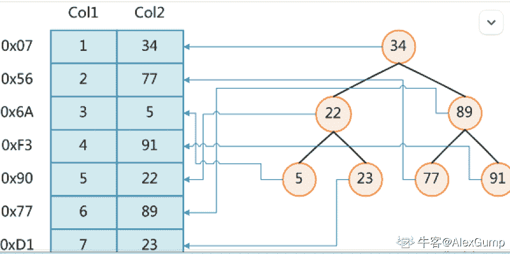
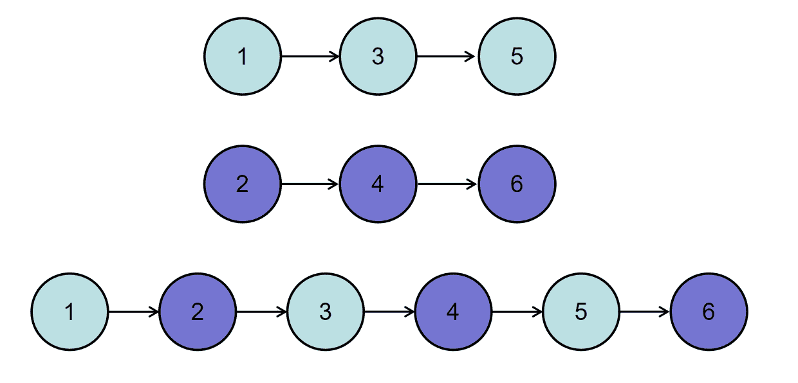
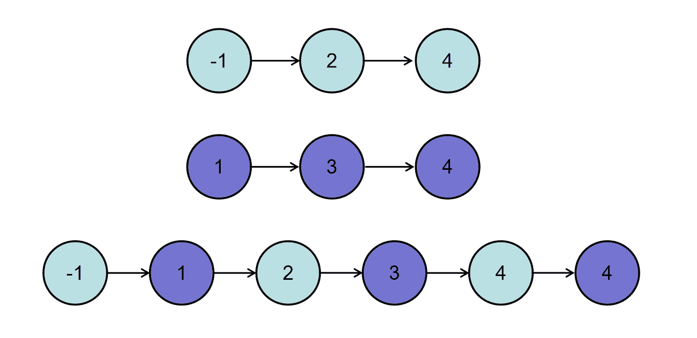

# 二千零二十一、届阅文测试开发方向笔试卷

## 1

```cpp
1.试说明是否存在这样的二叉树，可以实现后序线索树进行后序遍历时不使用栈？
2.对前序线索二叉树进行前序遍历时，什么样的二叉树可不实用栈？
```

你的答案

本题知识点

测试开发工程师 阅文集团 2021

## 2

```cpp
设有 5000 个无序的元素，希望用最快速度挑选出其中前 10 个最大的元素，在以下的排序方法中，采用哪种方法最好？为什么？
1.快速排序
2.堆排序
3.归并排序
4.基数排序
```

你的答案

本题知识点

测试开发工程师 阅文集团 2021

## 3

```cpp
何谓队列的上溢现象和假溢出现象？解决他们有哪些方法？
```

你的答案

本题知识点

测试开发工程师 阅文集团 2021

## 4

```cpp
请详细描述进程（Process）和线程（Thread）有什么区别。
```

你的答案

本题知识点

测试开发工程师 阅文集团 2021

讨论

[牛客 820349319 号](https://www.nowcoder.com/profile/820349319)

链接：[`ac.nowcoder.com/questionTerminal/0cd5a9bfee894f1a846797f860de205a?trackId=404_page`](https://ac.nowcoder.com/questionTerminal/0cd5a9bfee894f1a846797f860de205a?trackId=404_page)
来源：牛客网
Definition 定义
-------------
Process
进程是应用程序的一次运行活动；从操作系统核心角度来说，进程是操作系统分配和调度系统内存资源、cpu 时间片等资源的基本单位，为正在运行的应用程序提供运行环境。
Thread
线程是程序内部有并发性的顺序代码流。是 cpu 调度资源的最小单元。

Units 单位大小
------------
Process
进程是操作系统分配和调度系统内存资源、cpu 时间片 等资源的基本单位；一个进程至少包括一个线程。
进程是操作系统资源管理的实体。
Thread
线程是 cpu 调度资源的最小单元。
线程是进程的实体。

Resource 系统资源分配上
-------------
Process
每个进程都有自己的内存地址空间。
Thread
线程没有自己独立的内存资源，它只有自己的执行堆栈和局部变量。但是在同属一个进程的多个线程中他们可以共享进程的内存资源。
Running 执行过程中
-------------
执行过程中，进程有内存单元的初始入口点，在存活阶段里拥有独立的地址空间。
A process has the initial entrance of Memory Units and room of address.
进程是应用程序的一次运行活动，独立地执行；所以某一个进程崩溃以后，在保护模式下不会影响其他的进程，
健壮性好。
A process is activity of application.
父进程与子进程 的关系待研究深入中……
每个已创建的进程都可以创建进程，创建进程的进程称为父进程，被创建的新进程为子进程，这样便形成一个进程树。父进程与子进程可并行执行；父进程等待子进程终止执行。父进程终止后，所有的子进程也都必须要终止。
Thread
而线程不能独立地执行，它必须依附在一个运行中的应用程序上。
但是，同一个进程中的多个线程可以并发地执行，并发性高，系统在数据交换上花费的资源少，运行效率高。
主线程与其他线程 的关系待研究深入中……
每个进程里都会有一个主线程，由它创建其他线程。
======================================================
知识延伸：
进程(Process)和线程(Thread)
1.Process 特点
(1)进程在执行过程中有内存单元的初始入口点，并且进程存活过程中始终拥有独立的内存地址空间；
(2)进程的生存期状态包括创建、就绪、运行、阻塞和死亡等类型；
(3)从应用程序进程在执行过程中向 CPU 发出的运行指令形式不同，可以将进程的状态分为用户态和核心态。处于用户态下的进程执行的是应用程序指令、处于核心态下的应用程序进程执行的是操作系统指令。
2.引入 Thread 目的：在串行程序基础上引入线程和进程是为了提高程序的并发度，从而提高程序运行效率和响应时间。
3.相同点：都是按特定顺序执行的指令序列/有自己的执行控制块-->拥有自己的寄存器、状态及调度策略等。
4.关系以及不同点
(1)进程存在于操作系统内，并对应于用户可看作为程序或应用程序的事物。另一方面，线程存在于进程内。因此，线程有时也称作“轻量进程”。一个进程至少包括一个线程，通常将该线程称为主线程，一个进程从主线程的执行开始进而创建一个或多个附加线程，就是所谓的多线程。
(2)多个进程的存在使得计算机能够一次执行多个任务。而多个线程的存在使得进程能够分解工作以便并行执行。在多处理器计算机上，进程或线程可以在不同的处理器中运行。这使得真正的并行处理成为可能。
(3)并行处理处理并不总是能够成功。有时候必须要同步线程。一个线程可能必须等待另一个线程的结果，或者一个线程可能需要独占访问另一个线程正在使用的资源。同步问题是多线程应用程序中出现 bug 的一个常见原因。有时候线程可能最终等待的是永远不会变得可用的资源。这导致了一种称为“死锁”的状况。
(4)进程有独立的地址空间，一个进程崩溃后，在保护模式下不会对其它进程产生影响；线程有自己的堆栈和局部变量，但线程之间没有单独的地址空间，一个线程死掉就等于整个进程死掉。所以多进程的程序要比多线程的程序健壮，但在进程切换时，耗费资源大效率差，不适合并发。
5.实际应用：
(1)例如有一个 Web 服务器要进程的方式并发地处理来自不同用户的网页访问请求的话，可以创建父进程和多个子进程的方式来进行处理，但是创建一个进程要花费较大的系统开销和占用较多的资源。除外，这些不同的用户子进程在执行的时候涉及到进程上下文切换，上下文切换是一个复杂的过程。所以，为了减少进程切换和创建的开销，提高执行效率和节省资源，人们在操作系统中引入了"线程 thread"的概念。
(2)对开发人员来说，线程之间的数据共享比进程之间的容易得多。在 unix 上，进程间数据共享是通过管道、SOCKET、共享内存、信号灯等通信机制实现的，在 windows 上也有一套类似的机制。而线程间数据共享只需要共享全局变量即可。多进程无疑比多线程程序更健壮一些，但是代价也是比较大的，特别在进程数或者线程数较多的情况下。
6.举例
例子 1：进程就好比淮海战役，而线程就好比淮海战役中的某一次战斗。
(1)进程只是一个资源的集合体，拥有地址空间、寄存器、调度策略等，而线程是(利用这些资源)真正的执行单元；就好像淮海战役只是资源集合体，它拥有作战地点、兵营、作战策略等资源，而战斗才是这次战役真正的执行者。
(2)进程在执行过程中拥有独立的内存单元，多个线程共享内存(只能共享所在进程中的内存)；就好像淮海战役拥有自己独立的武器和士兵(平津战役是不可以使用这些资源的)，而淮海战役的每次战斗却可以共享这些武器和士兵。补充①：对于某一火炮 or 特种兵(暂用 cache 表示)的使用，物不能复制人不能分身，a 战斗(a 线程)在使用这一 cache 时，b 战斗(b 线程)就要排队等候 a 战斗执行完毕才可以使用这个 cache，如果 a 战斗打的昏天黑地，b 战斗就等不到这一 cache，后面的战斗也无法进行，这样就形成了"死锁"。补充②：进程之间可以共享内存，但它却拥有自己的栈空间和独立的执行序列，即线程自己基本上不拥有系统资源，只拥有一点在运行中必不可少的资源(如程序计数器,一组寄存器和栈)。铁打的兵营流动的兵，兵营是不可以共享的。
(3)每个独立线程都包含程序运行的入口、顺序执行序列和程序的出口，正因为如此多线程才可以在应用程序中使多个部分并发执行。但这并不意味着线程能够独立应用，线程必须依靠进程的调度控制才可以使用；就好像淮海战役的每次战斗都可形成一个独立的单元，都拥有进攻、防御、行军都动作，也正因为如此，多个战斗可以并发执行。但一次战役必须统一调度控制才会取得胜利，否则就会被敌人击破，从而是整个战役(整个进程)崩溃。
(4)从用户角度来看，进程是应用程序的一个执行过程。从操作系统核心角度来看，进程代表的是操作系统分配的内存、CPU 时间片等资源的基本单位，是为正在运行的程序提供的运行环境；就好像淮海战役，从我们角度看，淮海战役就是一个战斗执行过程，从将军角度看，淮海战役代表为每个战区分配多少兵力，多长时间必须攻下山头，是在为整个战役提供一个执行环境。
例子 2：线程指的是你的 CPU 运行时能开的几个通道，就像公路上有几条车道，原来的 CPU 能开一个线程，也就是只能同时做一个事情，走一辆车子；现在的 CPU 就先进多了，INTEL 的双线程技术，就是能开两条路来走车子，所以比单车道要先进！而进程是针对你的系统来说的，进程就是在运行的程序，就好像一条公路，这条公路可以有一个通道(单线程的进程)、也可以有多个通道(多线程的进程)。
例子 3：在 Windows 3.x 下，进程是最小运行单位，你每启动一个程序，就启动了一个进程；在 Windows 3.x 以后，线程是最小单位，每个进程可以启动多个线程(它们彼此共享所在进程中的虚拟空间，所以会出现多个线程操作一片内存的情况)，比如每下载一个文件可以单独开一个线程。
7.进程与程序的区别
程序是一组指令的集合，它是存储在计算机系统的硬盘中的静态文件，没有执行的含义。而进程是一个动态的实体，有自己的生命周期。一般说来，一个进程肯定与一个程序相对应，并且只有一个，但是一个程序可以有多个进程，或者一个进程都没有。简单地说，进程是程序的一部分，程序运行的时候会产生进程。
8.总结：线程是进程的一部分，进程是程序的一部分。
源自：[`blog.csdn.net/forwayfarer/article/details/2918924`](http://blog.csdn.net/forwayfarer/article/details/2918924)

————————————————
版权声明：本文为 CSDN 博主「华子任」的原创文章，遵循 CC 4.0 BY-SA 版权协议，转载请附上原文出处链接及本声明。
原文链接：[`blog.csdn.net/honglin_ren/article/details/35839979`](https://blog.csdn.net/honglin_ren/article/details/35839979)

发表于 2021-12-10 09:47:37

* * *

[牛客 71456703 号](https://www.nowcoder.com/profile/71456703)

不知道

发表于 2021-12-09 23:54:01

* * *

## 5

```cpp
什么是多线程？简述多线程的优点和缺点。
```

你的答案

本题知识点

测试开发工程师 阅文集团 2021

讨论

[西电霸王花](https://www.nowcoder.com/profile/4391380)

多线程可以理解为一个进程中的多任务执行者，从程序角度来看，代码的执行和计算执行者为线程，从虚拟机来看，执行者为执行引擎（即 cpu），线程的运行需要获取 cpu 资源，如果不同线程之间有联系就需要通过线程通信来进行线程状态的控制。线程的优点是可提高程序并发执行的效率，当然效率的提高也受 cpu 核数、并发策略等的制约；缺点是增加了编程的复杂性，多线程编程需考虑死锁、操作原子性和不确定异常的处理，例如并发下的数据不一致、使用通信方式不合理导致的不稳定数据状态或异常、未释放资源导致 OOM 等问题……

发表于 2021-05-09 10:29:15

* * *

## 6

```cpp
可通过哪些方式预防死锁？ 请详细说明。
```

你的答案

本题知识点

测试开发工程师 阅文集团 2021

讨论

[牛客 962075879 号](https://www.nowcoder.com/profile/962075879)

死锁是指两个或两个以上的进程在执行过程中，由于竞争资源或者由于彼此通信而造成的一种阻塞的现象，若无外力作用，它们都将无法推进下去。 此时称系统处于死锁状态或系统产生了死锁，这些永远在互相等待的进程称为死锁进程。

发表于 2021-02-26 02:42:38

* * *

## 7

请详细描述数据库索引的工作原理，并阐述索引的好处和不足

你的答案

本题知识点

测试开发工程师 阅文集团 2021

讨论

[网友小王](https://www.nowcoder.com/profile/926244771)

常直观的好处是降低查询时间，降低排序的成本，减少对 CPU 的消耗。坏处也非常直观，首先需要额外的空间来存储索引，其次其更新和维护需要消耗资源（例如插入或删除了值，索引就得跟着调整）。

发表于 2022-03-11 17:04:39

* * *

[牛客 408956483 号](https://www.nowcoder.com/profile/408956483)

数据库索引是为了增加查询速度而对表字段附加的一种标识。DB 在执行一条 Sql 语句的时候，默认的方式是根据搜索条件进行全表扫描，遇到匹配条件的就加入搜索结果集合。

发表于 2022-03-11 02:02:05

* * *

[AlexGump](https://www.nowcoder.com/profile/184739658)

一句话概括就是——索引是为优化查询效率而维护的数据结构，例如 mysql 的 Innodb 存储引擎就是通过平衡二叉树来维护索引结构的，将查询复杂性从 O(n)降低到了 O(log(n))。
如图所示，为了加快 col2 的查找，构建的平衡二叉树将查找比对此时降低到了 3 次。索引的非常直观的好处是降低查询时间，降低排序的成本，减少对 CPU 的消耗。坏处也非常直观，首先需要额外的空间来存储索引，其次其更新和维护需要消耗资源（例如插入或删除了值，索引就得跟着调整）。所以索引是有利有弊的。

编辑于 2022-02-22 22:17:31

* * *

## 8

```cpp
数据库索引，是数据库管理系统中一个排序的数据结构，以协助快速查询、更新数据库表中数据。那么哪些情况下不应该创建索引？
```

你的答案

本题知识点

测试开发工程师 阅文集团 2021

讨论

[想要上海的 offer](https://www.nowcoder.com/profile/421636743)

频繁更新的字段不适合创建索引；数据重复其分布均匀的不适合创建索引，如性别。

发表于 2021-03-07 11:35:39

* * *

[沉默的图书馆](https://www.nowcoder.com/profile/749545076)

业务需求中所使用的表在增删改方面使用多，查询使用少

发表于 2021-03-05 13:58:35

* * *

## 9

```cpp
某市新建了一个体育场馆，每日人流量信息被记录在三列信息中：
序号(id)、日期(visit_date)、 人流量(people)。
请编写一个查询语句，找出人流量的高峰期。高峰期时，至少连续三行记录中的人流量不少于 100。
例如，表 stadium：
+------+------------+-----------+
| id   | visit_date | people    |
+------+------------+-----------+
| 1    | 2020-01-01 | 981        |
| 2    | 2020-01-02 | 98       |
| 3    | 2020-01-03 | 150       |
| 4    | 2020-01-04 | 99        |
| 5    | 2020-01-05 | 145       |
| 6    | 2020-01-06 | 1455      |
| 7    | 2020-01-07 | 199       |
| 8    | 2020-01-08 | 188       |
+------+------------+-----------+
对于上面的示例数据，输出为：
+------+------------+-----------+
| id   | visit_date | people    |
+------+------------+-----------+
| 5    | 2020-01-05 | 145       |
| 6    | 2020-01-06 | 1455      |
| 7    | 2020-01-07 | 199       |
| 8    | 2020-01-08 | 188       |
+------+------------+-----------+

```
提示：
每天只有一行记录，日期随着 id 增加而增加。
```cpp

```

你的答案

本题知识点

测试开发工程师 阅文集团 2021

## 10

A 公司打算搭建一个 Android 应用包下载的 Web 站点，计划将内测 App 包存放在这个网站上并提供下载，初期下载量很小，技术部门仅使用了 1 台服务器，
随着业务增长，使用该内部站点下载测试包的同事越来越多，用户量和下载量呈指数级上升，要求技术部门马上改造。
请问：怎么改造这个站点以满足逐渐增长的高负载需求？不修改代码的前提下，给出快速解决办法。请描述详细设计方案

你的答案

本题知识点

测试开发工程师 阅文集团 2021

讨论

[Caliany](https://www.nowcoder.com/profile/505705286)

回答：主要用到重定向的方法 1）HTTP 重定向增加 N 台内部服务器，组成一个局域网，将 APP 复制 N 份放到内部服务器中，原来的服务器作为与因特网通信的接口。当原服务器收到客户端请求后，服务器选择一个负载最小的内部服务器，将客户端的请求重定向到该服务器 2）DNS 重定向原服务器 IP 对应的域名解析到多个 IP，用 DNS 轮转法选择合适的 IP3）IP 地址转发另外还可以进行代理的重定向（1、应用服务器与数据库分离 2、使用缓存改善性能 3、使用应用服务集群，增加服务器数量，使用负载均衡调度服务器 4、使用反向代理和 CDN 服务 5、使用分布式文件系统，将数据站点做成分布式架构）

发表于 2021-02-22 18:27:59

* * *

[星 click](https://www.nowcoder.com/profile/954011800)

小弟才疏学浅，只能憋出两个字：异步

发表于 2021-01-13 21:25:15

* * *

## 11

```cpp
软件系统项目的研发过程中，在正式发布给终端用户使用前，需要测试人员在测试环境进行验证，符合上线标准才能发布。
测试环境（Testing environment）是指为了完成软件测试工作所必需的计算机硬件、软件、网络设备、历史数据的总称。
测试环境是研发和测试人员最常用功能，其稳定性直接影响研发效率，环境不稳定主要表现在：接口服务不可用、数据丢失等方面。

Y 公司打算搭建一套完全独立的测试环境，公司产品和项目涉及客户端、web、小程序、后端服务、数据库等，搭建测试环境分别需要哪些环境？
怎么样的测试环境算一个好的测试环境？如果你是负责人，会如何规划搭建一个稳健可复用的测试环境？
请简述思路和方法，给出设计方案。
```

你的答案

本题知识点

测试开发工程师 阅文集团 2021

讨论

[星 click](https://www.nowcoder.com/profile/954011800)

首先硬件上，要是公司啥也没有的话，那就先申请下预算先租个阿里云服务器（实体的没碰过，太贵），一台差不多的测试机，网线，AJ45 水晶头，网线钳子等等，软件上，阿里云服务器选择 Linux 操作系统（乌班图，红帽），测试机 windows 系统（7,10），然后用 CRT 工具连接上服务器，配置下 IP 地址啥的，先装个 jdk1.8,tomcat8，然后再装下 mysql(url 记不起来，不过网上教程那么多...)，把项目包下载到 webapps 里，tomcat 会自己解析（虽然不懂原理），然后这就算完成测试环境的搭建了吧个人觉得越接近生产环境的测试环境越算好测试环境，没有经验所以不能很负责的说怎么搭建稳健复用的测试环境。。。（大佬们轻喷，喷完记得纠正补充）

发表于 2021-01-13 21:47:03

* * *

## 12

```cpp
问题：
软件项目的整个流程需求-设计-开发-测试，开发阶段开发人员单元测试过程中会用到数据初始化，测试阶段的系统测试（验证功能、接口、UI 自动化测试及性能测试）和集成测试过程中都需要测试数据构造，
如果测试数据准备不充分，有些测试数据较难准备，这样不仅影响测试结果，而且增加测试工作量，导致整个项目延期，所以测试数据准备工作非常关键。
目前数据准备，一般由熟悉业务逻辑的测试人员操作，新手准备难度会很大且容易出错。准备数据会用到大量脚本，由于业务经常变动，为了适应变化，需要修改相应脚本，维护也困难。有些数据需要通过手工和自动化联合创建，流程长，错误率极高。

为了把数据准备的经验和复杂的流程沉淀下来，转化成可以操作的数据内容，让一个普通测试人员或开发人员都能自己构造数据，如何搭建一个工具平台来做支撑？
请简述思路和方法，给出设计方案。
```

你的答案

本题知识点

测试开发工程师 阅文集团 2021

讨论

[牛客 144432079 号](https://www.nowcoder.com/profile/144432079)

可以设计一个测试数据 GUI 相互交互  想要什么测试数据  自己进行选择  并执行

发表于 2021-01-15 14:14:49

* * *

[星 click](https://www.nowcoder.com/profile/954011800)

emmm,SVN 吧😅

发表于 2021-01-13 21:49:31

* * *

## 13

```cpp
IPv4 与 IPv6 的最大区别是什么？目前 IPv6 地址格式有哪几种表示？

```

你的答案

本题知识点

测试开发工程师 阅文集团 2021

## 14

```cpp
什么是 HTTP 协议？什么是 HTTPS？请简述访问一个 HTTPS 网站的流程。
```

你的答案

本题知识点

测试开发工程师 阅文集团 2021

## 15

```cpp
什么是 Cookie？什么是 Session? 请简述 cookies 机制和 session 机制的区别。

```

你的答案

本题知识点

测试开发工程师 阅文集团 2021

讨论

[牛客 381390882 号](https://www.nowcoder.com/profile/381390882)

1、cookie 存在客户端(浏览器)、用户来保存用户的基本信息、存储的方式是 k-v 形式、可以设置失效时间、cookie 的作用域、cookie 的大小以及个数取决去客户端(浏览器)2、session 存在于服务器、也可以用来存储用户的数据、但是不易存放垃圾数据、因为会消耗服务器内存、他的失效时间默认为 30 分钟。3、cookie 机制和 session 机制的区别：

*   cookie 创建由服务器创建、发送由服务器发送、存在客户端
*   session 创建由服务器、不发送、存在服务器端
*   他们两个都是用来跟踪浏览器访问用户身份的会话方式、只是使用的场景不一样

个人理解以及网上资料查询。

发表于 2021-02-10 14:01:51

* * *

## 16

```cpp
起点客户端上允许用户对作品进行评论，为了防止用户恶意评论，发表不当内容，需要对用户发布的内容进行过滤，请写程序过滤用户发布内容中带有的 QQ 号（6~10 位数字组成）
允许对内容严格操作，如用户发表了 作者大大 666666，为你点赞 ，经过过滤后也可以为作者大大，为你点赞 ，将 666666 过滤掉了。

```

本题知识点

测试开发工程师 阅文集团 2021

讨论

[刘禅挥泪斩孔明](https://www.nowcoder.com/profile/1263929)

go 语言，用正则表达式

```cpp
package main

import "regexp"

var re = regexp.MustCompile(`[1-9]\d{5,9}`)

/**
  * 过滤内容中出现的 QQ 号
  * @param content string 字符串 待过滤内容
  * @return string 字符串
*/
func filterContent(content string) string {
    // write code here
    return re.ReplaceAllString(content, "")
}
```

发表于 2021-02-05 15:47:22

* * *

[肥猪追飞机](https://www.nowcoder.com/profile/8607851)

python 字符串处理：class Solution:
def filterContent(self , content ):
# write code here
import re
r='[1-9]\d{5,9}'
s1=re.split(r,content)
if re.findall(r,content)==[]:
    return content
else:
    return (""''.join(s1))

编辑于 2021-02-24 21:54:09

* * *

[好难 QAQ](https://www.nowcoder.com/profile/998064951)

```cpp
没有控制多个 qq 号重复情况

```

```cpp
public static String filterContent (String content) {
        // write code here
        StringBuilder str = new StringBuilder();
        String c = content;
        for(int i = 0;i<content.length();i++){
            if(Character.isDigit(content.charAt(i))){
                if(str.length() ==0&& Integer.valueOf(content.substring(i,i+1))==0){
                    continue;
                }

                str.append(content.substring(i,i+1));
                if(i == content.length()-1){
                    if(str.length()<=10&&str.length()>=6){
                        c = c.replace(new String(str),"");
                    }
                }

            }else{
                if(str.length()<=10&&str.length()>=6){

                    c = c.replace(new String(str),"");
                }
                    str.delete(0,str.length());

            }

        }
        return c;
    }
```

```cpp

```

编辑于 2021-01-24 14:04:47

* * *

## 17

```cpp
如果一个数字序列逆置之后跟原序列是一样的，称这样的数字序列为回文序列。例如：
{1, 2, 1}, {16, 82, 82, 16} , {113} 是回文序列, {1, 2, 2}, {16, 82, 82, 61} ,{113, 3, 11} 不是回文序列。

现在给出一个数字序列，允许使用一种转换操作：
选择任意两个相邻的数，然后从序列移除这两个数，并用这两个数字的和插入到这两个数之前的位置，对于所给序列要求出最少需要多少次操作可以将其变成回文序列？

```

本题知识点

测试开发工程师 阅文集团 2021

讨论

[werdenwissen](https://www.nowcoder.com/profile/569541192)

import java.util.Scanner;
public class Main{
    public static void main(String[] args){
        Scanner input=new Scanner(System.in);
        int n=input.nextInt();
        int[] a=new int[n];
        int res=0;
        for(int i=0;i<n;i++) a[i]=input.nextInt();
        int i=0,j=n-1;
        while(i<j){
            if(a[i]==a[j]){
                i++;
                j--;
            }
            else if(a[i]<a[j]){
                a[i+1]+=a[i];
                i++;
                res++;
            }
            else{
                a[j-1]+=a[j];
                j--;
                res++;
            }
        }
        System.out.println(res);
    }
}

发表于 2021-04-20 19:06:32

* * *

## 18

```cpp
阅小文得到一个神奇的数列: 1, 12, 123,...12345678910,1234567891011...。特别想知道是否能被 3 整除。
阅小文现在希望你能帮他计算一下从数列的第 y 个到第 w 个(包含端点)有多少个数可以被 3 整除?

```

本题知识点

测试开发工程师 阅文集团 2021

讨论

[零葬](https://www.nowcoder.com/profile/75718849)

这个题跟 18 年网易的题“被 3 整除”一样，可以在名企校招刷题的网易板块找到。唯一不同的是，这里输入参数中间的空格数量竟然不确定

```cpp
import java.io.BufferedReader;
import java.io.InputStreamReader;
import java.io.IOException;

public class Main {
    public static void main(String[] args) throws IOException {
        BufferedReader br = new BufferedReader(new InputStreamReader(System.in));
        String[] params = br.readLine().split(" ");
        int l = Integer.parseInt(params[0]), r = Integer.parseInt(params[params.length - 1]);
        int count = 0;
        for(int num = l; num <= r; num++){
            long sum = ((1L + num) * num) >> 1;
            if(sum % 3 == 0) count++;
        }
        System.out.println(count);
    }
}
```

编辑于 2021-11-28 11:27:46

* * *

[肥猪追飞机](https://www.nowcoder.com/profile/8607851)

import re
a=raw_input()
y=int(re.findall(r'^\d{1,}',a)[0])
w=int(re.findall(r'\d{1,}$',a)[0])
def fun(y,w):
    count=0
    for i in range(y,w+1):
        count1=0
        for j in range (i+1):
            count1=j+count1  
        if (count1%3==0):
            count+=1
    return count
print fun(y,w)

发表于 2021-02-27 23:01:08

* * *

## 19

输入两个递增的链表，单个链表的长度为 n，合并这两个链表并使新链表中的节点仍然是递增排序的。
数据范围： ，
要求：空间复杂度 ，时间复杂度 
如输入{1,3,5},{2,4,6}时，合并后的链表为{1,2,3,4,5,6}，所以对应的输出为{1,2,3,4,5,6}，转换过程如下图所示：
或输入{-1,2,4},{1,3,4}时，合并后的链表为{-1,1,2,3,4,4}，所以对应的输出为{-1,1,2,3,4,4}，转换过程如下图所示：

本题知识点

链表 *2021* *讨论

[披萨大叔](https://www.nowcoder.com/profile/841505)

递归版本：

```cpp
 public ListNode Merge(ListNode list1,ListNode list2) {
        if(list1 == null){
            return list2;
        }
        if(list2 == null){
            return list1;
        }
        if(list1.val <= list2.val){
            list1.next = Merge(list1.next, list2);
            return list1;
        }else{
            list2.next = Merge(list1, list2.next);
            return list2;
        }        
    }

```

非递归版本：

```cpp
if(list1 == null){
            return list2;
        }
        if(list2 == null){
            return list1;
        }
        ListNode mergeHead = null;
        ListNode current = null;      
        while(list1!=null && list2!=null){
            if(list1.val <= list2.val){
                if(mergeHead == null){
                   mergeHead = current = list1;
                }else{
                   current.next = list1;
                   current = current.next;
                }
                list1 = list1.next;
            }else{
                if(mergeHead == null){
                   mergeHead = current = list2;
                }else{
                   current.next = list2;
                   current = current.next;
                }
                list2 = list2.next;
            }
        }
        if(list1 == null){
            current.next = list2;
        }else{
            current.next = list1;
        }
        return mergeHead;

```

发表于 2016-07-20 22:26:55

* * *

[Dejack](https://www.nowcoder.com/profile/4156235)

**Python 写法**1\. 非递归版本

```cpp
class Solution:
    # 返回合并后列表
    def Merge(self, pHead1, pHead2):
        # write code here
        #初始化
        tmp = ListNode(0)
        pHead = tmp        
        while pHead1 and pHead2:
            if pHead1.val < pHead2.val:
                tmp.next = pHead1
                pHead1 = pHead1.next
            else:
                tmp.next = pHead2
                pHead2 = pHead2.next
            tmp = tmp.next
        if not pHead1:
            tmp.next = pHead2
        if not pHead2:
            tmp.next = pHead1
        return pHead.next

```

2\. 递归版本

```cpp
class Solution:
    # 返回合并后列表
    def Merge(self, pHead1, pHead2):
        # write code here
        if pHead1 is None:
            return pHead2
        if pHead2 is None:
            return pHead1
        if pHead1.val < pHead2.val:
            pHead1.next = self.Merge(pHead1.next,pHead2)
            return pHead1
        else:
            pHead2.next = self.Merge(pHead1,pHead2.next)
            return pHead2

```

编辑于 2018-09-04 16:24:41

* * *

[ZhanHeng](https://www.nowcoder.com/profile/778759)

```cpp
public class Solution {
    public ListNode Merge(ListNode list1,ListNode list2) {
        //新建一个头节点，用来存合并的链表。
        ListNode head=new ListNode(-1);
        head.next=null;
        ListNode root=head;
        while(list1!=null&&list2!=null){
            if(list1.val<list2.val){
                head.next=list1;
                head=list1;
                list1=list1.next;
            }else{
                head.next=list2;
                head=list2;
                list2=list2.next;
            }
        }
        //把未结束的链表连接到合并后的链表尾部
        if(list1!=null){
            head.next=list1;
        }
        if(list2!=null){
            head.next=list2;
        }
        return root.next;
    }
}
```

发表于 2016-04-04 14:00:00

* * *

## 20

```cpp
阅小文有一个长度为 n 的序列，他想移除掉里面的重复元素，对于每种元素保留最后出现的那个。

```

本题知识点

测试开发工程师 阅文集团 2021

## 21

```cpp
一个由小写字母组成的字符串可以看成一些同一字母的最大碎片组成的。例如,"aaabbaaac"是由下面碎片组成的:'aaa','bb','c'。
给定一个字符串,请计算这个字符串的所有碎片的平均长度是多少。

```

本题知识点

测试开发工程师 阅文集团 2021

讨论

[牛客 299576888 号](https://www.nowcoder.com/profile/299576888)

#include <stdio.h>#include<string.h>
#define MAXNUM 100

void main(){
char s[MAXNUM]={0};
int arr[MAXNUM]={0};  //计数数组
printf("Please input the array:");
gets(s);
int length=strlen(s);
printf("Length:%d\n",length);
if(length>50||length<1)
{
    printf("Error");
    return;
}
int i=0,j=0;  //j 记录碎片个数
char ch=s[0];
for(i=0;i<length;i++)
{
    if(ch==s[i])
        ;
    else
    {
        j++;
        ch=s[i];
        i--;
    }
}
j++;
printf("%.2f",1.0*length/j);
return;
}

发表于 2021-01-23 10:28:16

* * *</stdio.h>*