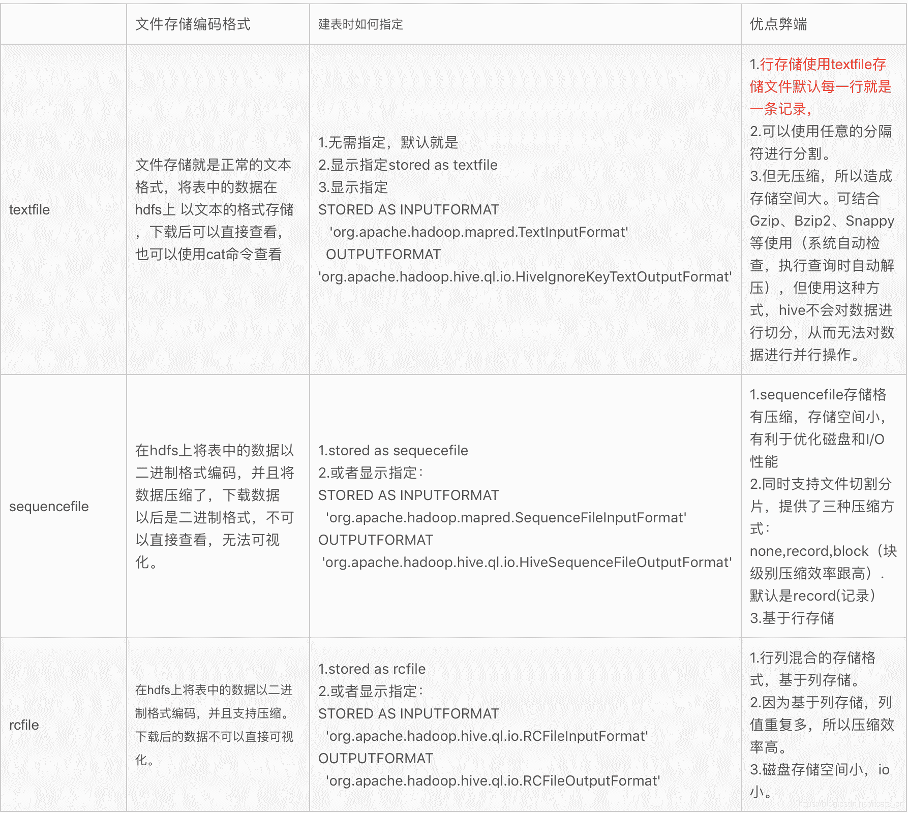

# 二千零二十一、届阅文大数据方向笔试卷

## 1

在 Linux 环境下，用 Linux 基本命令完成如下操作：1、重命名/home/qqbook/script/下的 aa.txt 文件名为：cc.txt ；2、清空/home/qqbook/script 目录下的所有内容。

你的答案

本题知识点

大数据开发工程师 阅文集团 2021

讨论

[零葬](https://www.nowcoder.com/profile/75718849)

1.mv /home/qqbook/script/aa.txt /home/qqbook/script/cc.txt2.rm -rf /home/qqbook/script

发表于 2021-01-14 09:39:14

* * *

[牛客 874908345 号](https://www.nowcoder.com/profile/874908345)

mv /home/qqbook/script/aa.txt /home/qqbook/script/cc.txtrm -rf /home/qqbook/script/* 

发表于 2021-09-21 21:40:58

* * *

[牛客 998782686 号](https://www.nowcoder.com/profile/998782686)

mv /home/qqbook/script/aa.txt /home/qqbook/script/cc.txtrm -rf /home/qqbook/script

发表于 2021-09-21 16:27:53

* * *

## 2

在 Linux 环境下，用 Linux 基本命令完成如下操作：1、切换到/home/qqbook/script 目录下 ；2、在该目录下，查找包含有“feidu”文本内容的所有文件名。

你的答案

本题知识点

大数据开发工程师 阅文集团 2021

讨论

[零葬](https://www.nowcoder.com/profile/75718849)

1.cd /home/qqbook/script2.find .|xargs grep -rl 'feidu'

发表于 2021-01-14 09:44:53

* * *

[牛客 101168418 号](https://www.nowcoder.com/profile/101168418)

```cpp
cd /home/qqbook/script
grep feidu *
```

发表于 2021-01-16 21:08:21

* * *

## 3

有两个文件，分别有 20 亿个 QQ 号（bigint 类型，8 字节），我们只有 2G 内存，如何找到两个文件交集？

你的答案

本题知识点

大数据开发工程师 阅文集团 2021

讨论

[牛客 840735377 号](https://www.nowcoder.com/profile/840735377)

步骤 1:使用 hash 函数将第一个文件的所有整数映射到 1000 个文件中，每个文件有 2000 万个整数，大约 160M 内存，2G 的内存就可以放下了，把 1000 个文件记为 a1,a2....a10000;步骤 2：用同样的 hash 函数映射第二个文件到 1000 个文件中，这 1000 个文件记为 b1,b2,b3......b1000；
步骤 3：由于使用的是相同的 hash 函数，所以两个文件中一样的数字会被分配到文件下标一致的文件中，分别对 a1 和 b1 求交集，a2 和 b2 求交集，ai 和 bi 求交集 l；步骤 4：最后将步骤 3 的结果汇总，即为两个文件的交集。

发表于 2021-01-23 20:47:32

* * *

[牛客 6107965 号](https://www.nowcoder.com/profile/6107965)

使用 bitmap

发表于 2021-01-22 23:01:08

* * *

## 4

QQ 阅读的阅读行为日志的文件/home/log/aa.txt，占用存储 1.5T，在 Linux 环境下，用 Linux 基本命令完成如下操作：1、统计该文件具体有多少行记录；2、查看第 12 行到第 15 行这四行记录。【提示：有非常多种方法：①使用管道；②使用 awk；③使用 sed。总之请 1 行搞定。】

你的答案

本题知识点

大数据开发工程师 阅文集团 2021

讨论

[零葬](https://www.nowcoder.com/profile/75718849)

1.wc -l /home/log/aa.txt2.head -n 15 /home/log/aa.txt | tail -n 4

编辑于 2021-01-14 10:51:57

* * *

[牛客 840735377 号](https://www.nowcoder.com/profile/840735377)

1, wc -l /home/log/aa.txt2,head -n 15 /hom/log/aa.txt |tail -n 4

发表于 2021-01-23 20:52:39

* * *

## 5

我们知道 Kimball 的维度建模里面将事实表按粒度划分成了三种主要的事实表，包括：事务事实表，周期快照事实表和累积快照事实表。请问这三种事实表有什么区别？【提示：可从定义、粒度、用途、事实表更新机制、使用场景等多个角度进行比较】

你的答案

本题知识点

大数据开发工程师 阅文集团 2021

## 6

谈谈数据倾斜是如何发生的？并给出优化方案

你的答案

本题知识点

大数据开发工程师 阅文集团 2021

讨论

[牛客 6107965 号](https://www.nowcoder.com/profile/6107965)

大表 join 小表

发表于 2021-01-22 23:03:35

* * *

## 7

hdfs 存储机制是怎样的？

你的答案

本题知识点

大数据开发工程师 阅文集团 2021

讨论

[零葬](https://www.nowcoder.com/profile/75718849)

HDFS 存储机制，包括 HDFS 的写入过程和读取过程两个部分：
1、写入过程：

1）客户端向 namenode 请求上传文件，namenode 检查目标文件是否已存在，父目录是否存在。2）namenode 返回是否可以上传。3）客户端请求第一个 block 上传到哪几个 datanode 服务器上。4）namenode 返回 3 个 datanode 节点，分别为 dn1、dn2、dn3。5）客户端请求 dn1 上传数据，dn1 收到请求会继续调用 dn2，然后 dn2 调用 dn3，将这个通信管道建立完成 6）dn1、dn2、dn3 逐级应答客户端 7）客户端开始往 dn1 上传第一个 block（先从磁盘读取数据放到一个本地内存缓存），以 packet 为单位，dn1 收到一个 packet 就会传给 dn2，dn2 传给 dn3；dn1 每传一个 packet 会放入一个应答队列等待应答 8）当一个 block 传输完成之后，客户端再次请求 namenode 上传第二个 block 的服务器。（重复执行 3-7 步）2、读取过程：1）客户端向 namenode 请求下载文件，namenode 通过查询元数据，找到文件块所在的 datanode 地址。2）挑选一台 datanode（就近原则，然后随机）服务器，请求读取数据。3）datanode 开始传输数据给客户端（从磁盘里面读取数据放入流，以 packet 为单位来做校验）。4）客户端以 packet 为单位接收，先在本地缓存，然后写入目标文件。

发表于 2021-01-14 09:54:25

* * *

## 8

请列出你所知道的 hadoop 调度器，并简要说明其工作方法

你的答案

本题知识点

大数据开发工程师 爱奇艺 2018 阅文集团 2021

讨论

[Mowar](https://www.nowcoder.com/profile/9730423)

FIFO:先来先服务. 公平调度算法: 选择占用资源小,优先级别高的先执行计算能力调度算法:同一队列中的任务公平的共享队列中的所有资源

发表于 2018-10-11 20:24:51

* * *

[零葬](https://www.nowcoder.com/profile/75718849)

1.先进先出调度器（FIFO）Hadoop 中默认的调度器，也是一种批处理调度器。它先按照作业的优先级高低，再按照到达时间的先后选择被执行的作业。2.容量调度器（Capacity Scheduler) 支持多个队列，每个队列可配置一定的资源量，每个队列采用 FIFO 调度策略，为了防止同一个用户的作业独占队列中的资源，该调度器会对同一用户提交的作业所占资源量进行限定。调度时，首先按以下策略选择一个合适队列：计算每个队列中正在运行的任务数与其应该分得的计算资源之间的比值，选择一个该比值最小的队列；然后按以下策略选择该队列中一个作业：按照作业优先级和提交时间顺序选择，同时考虑用户资源量限制和内存限制。3.公平调度器（Fair Scheduler）公平调度是一种赋予作业（job）资源的方法，它的目的是让所有的作业随着时间的推移，都能平均的获取等同的共享资源。所有的 job 具有相同的资源,当单独一个作业在运行时，它将使用整个集群。当有其它作业被提交上来时，系统会将任务（task）空闲资源（container）赋给这些新的作业，以使得每一个作业都大概获取到等量的 CPU 时间。与 Hadoop 默认调度器维护一个作业队列不同，这个特性让小作业在合理的时间内完成的同时又不"饿"到消耗较长时间的大作业。公平调度可以和作业优先权搭配使用——优先权像权重一样用作为决定每个作业所能获取的整体计算时间的比例。同计算能力调度器类似，支持多队列多用户，每个队列中的资源量可以配置， 同一队列中的作业公平共享队列中所有资源。 发表于 2021-01-14 09:58:08

* * *

[我就是腿长](https://www.nowcoder.com/profile/580123138)

三种调度器分别是 FIFO（先入先出调度器），hadoop1.x 默认用的就是 FIFO。FIFO 采用队列的方式将一个一个 job 任务按照时间先后顺序进行服务。capacity scheduler（容量调度器），hadoop2.x 默认使用的是容量调度器。支持多个队列，，每个队列配备一定的资源。每个队列采用 FIFO 方式调度。公平调度器，支持多个队列，每个队列配备一定的资源，每个队列内部 job 公平共享队列内部的所有资源。

发表于 2021-03-27 13:18:12

* * *

## 9

```cpp

		Hive 中两大表连接，发生了数据倾斜，有一个 reduce 无法完成，检查发现 t1 中 guid=''的记录有很多，其他 guid 都不重复，这条语句该怎样优化？

		select t1.*

		,nvl(t2.x,1)

		from t1

		left join t2

		on t1.guid = t2.guid

```

你的答案

本题知识点

大数据开发工程师 阅文集团 2021

讨论

[零葬](https://www.nowcoder.com/profile/75718849)

对 guid 字段中的空串加随机数，打散到其他的 reducer 中，避免这个 reducer 的压力太大

```cpp
select t1.*, nvl(t2.x,1)
from t1
left join t2
on (case when t1.guid='' then concat('yuewen', rand()) else t1.guid end)=t2.guid;
```

编辑于 2021-01-14 10:46:38

* * *

[牛客 840735377 号](https://www.nowcoder.com/profile/840735377)

select t1.*,nvl(t2.x,1)from t1left join t2on (case when t1.guid=' ' then concat('yuewen',rand()) else t1.guid end)=t2.guid;

发表于 2021-01-23 21:39:20

* * *

## 10

某种产品中,合格品率为 0.96.一个合格品被检查成次品的概率是 0.02,一个次品被检查成合格品的概率为 0.05\.问题：求一个被检查成合格品的产品确实为合格品的概率.

你的答案

本题知识点

大数据开发工程师 阅文集团 2021

讨论

[零葬](https://www.nowcoder.com/profile/75718849)

P(确实为合格品|被检查成合格品) = P(合格品被检查成合格品)/P(被检查成合格品)=P(被检查成合格品|合格品)P(合格品)/P(被检查成合格品)=P(被检查成合格品|合格品)P(合格品)/[P(被检查成合格品|合格品)*P(合格品) + P(被检查成合格品|次品)*P(次品)] =0.98*0.96/(0.98*0.96+0.05*0.04)=0.9978786593126856

发表于 2021-01-14 10:04:51

* * *

[maysCP](https://www.nowcoder.com/profile/642422879)

简单点就是检查为合格且确实为合格的（0.96*0.98）/检查为合格+实际为合格检查为次品的（0.96*0.98+0.04*0.05）

发表于 2021-02-14 15:26:43

* * *

## 11

有一个 1G 大小的一个文件，里面每一行是一个词，词的大小不超过 16 字节，内存限制大小是 1M，要求返回频数最高的 100 个词

你的答案

本题知识点

大数据开发工程师 阅文集团 2021

讨论

[零葬](https://www.nowcoder.com/profile/75718849)

先用 hash 进行分文件，每个文件不超过 1M，对每个文件进行 wordcount，最后再对结果文件进行汇总，得到词频最高的 top100

发表于 2021-01-14 10:06:14

* * *

[铁离子](https://www.nowcoder.com/profile/4638016)

如果一个词的出现次数超过了 1MB 大小，比如某个词出现了 2¹⁷ 次，总次数乘以单词大小 2⁴ 为 2MB，那这个词再怎么 hash 取余也会放到同一个文件里分不开，这种情况怎么办

发表于 2022-03-08 17:56:13

* * *

## 12

hive 中的压缩格式 RCFile、TextFile、SequenceFile 各有什么区别？

你的答案

本题知识点

大数据开发工程师 阅文集团 2021

讨论

[零葬](https://www.nowcoder.com/profile/75718849)



发表于 2021-01-14 10:15:07

* * *

## 13

```cpp
写出下面各逻辑表达式的值（真：1，假：0）。设 a=3，b=4，c=5。
（1）a+b>c && b==c
（2）a || b+c && b-c
（3）!(a>b) && ! c || 1
（4）!(x=a) && (y=b) && 0

```

你的答案

本题知识点

大数据开发工程师 阅文集团 2021

讨论

[零葬](https://www.nowcoder.com/profile/75718849)

(1) False(2) True(3) True(4) False

发表于 2021-01-14 10:18:46

* * *

[QUST_21_ 邵志成](https://www.nowcoder.com/profile/576148036)

0110

发表于 2022-01-16 16:49:46

* * *

[牛客 177157203 号](https://www.nowcoder.com/profile/177157203)

（1）false  (2) true  (3)true  (4)false

发表于 2021-12-03 15:48:59

* * *

## 14

hive 内部表和外部表的区别？

你的答案

本题知识点

大数据开发工程师 阅文集团 2021 浩鲸云 2020

讨论

[零葬](https://www.nowcoder.com/profile/75718849)

未被 external 修饰的是内部表（managed table），被 external 修饰的为外部表（external table）；区别：
1.内部表数据由 Hive 自身管理，外部表数据由 HDFS 管理；
2.内部表数据存储的位置是 hive.metastore.warehouse.dir（默认：/user/hive/warehouse），外部表数据的存储位置由自己指定；
3.删除内部表会直接删除元数据（metadata）及存储数据；删除外部表仅仅会删除元数据，HDFS 上的文件并不会被删除；
4.对内部表的修改会将修改直接同步给元数据，而对外部表的表结构和分区进行修改，则需要修复（MSCK REPAIR TABLE table_name;）
5.Hive 创建内部表时，会将数据移动到数据仓库指向的路径；若创建外部表，仅记录数据所在的路径，不对数据的位置做任何改变。在删除表的时候，内部表的元数据和数据会被一起删除，而外部表只删除元数据，不删除数据。这样外部表相对来说更加安全些，数据组织也更加灵活，方便共享源数据。

发表于 2021-01-14 10:22:38

* * *

## 15

Hive 的 sort by 和 order by 的区别？

你的答案

本题知识点

大数据开发工程师 阅文集团 2021

讨论

[零葬](https://www.nowcoder.com/profile/75718849)

order by 会引发全局排序，数据全局有序；sort by 一般和 distribute by 一起使用，进行分组排序，数据局部有序、全局无序。

发表于 2021-01-14 10:25:21

* * *

[牛客 449519244 号](https://www.nowcoder.com/profile/449519244)

order by 会引发全局排序，数据全局有序；sort by 一般和 distribute by 一起使用，进行分组排序，数据局部有序、全局无序。

发表于 2021-09-22 11:06:11

* * *

## 16

常见的聚类算法可以分为几类？

你的答案

本题知识点

大数据开发工程师 阅文集团 2021

讨论

[零葬](https://www.nowcoder.com/profile/75718849)

聚类分析的算法可以分为划分法、层次法、基于密度的方法、基于网格的方法、基于模型的方法。
1、划分法，给定一个有 N 个元组或者纪录的数据集，分裂法将构造 K 个分组，每一个分组就代表一个聚类，K<N。
2、层次法，这种方法对给定的数据集进行层次似的分解，直到某种条件满足为止。
3、基于密度的方法，基于密度的方法与其它方法的一个根本区别是：它不是基于各种各样的距离的，而是基于密度的。这样就能克服基于距离的算法只能发现“类圆形”的聚类的缺点。
4、图论聚类方法解决的第一步是建立与问题相适应的图，图的节点对应于被分析数据的最小单元，图的边（或弧）对应于最小处理单元数据之间的相似性度量。
5、基于网格的方法，这种方法首先将数据空间划分成为有限个单元的网格结构,所有的处理都是以单个的单元为对象的。
6、基于模型的方法，基于模型的方法给每一个聚类假定一个模型，然后去寻找能够很好的满足这个模型的数据集。

发表于 2021-01-14 10:27:31

* * *

## 17

常见分类算法有哪些？

你的答案

本题知识点

大数据开发工程师 阅文集团 2021

讨论

[零葬](https://www.nowcoder.com/profile/75718849)

树模型：决策树、随机森林、GBDT、XGBoost、LightGBM、CatBoost（广义）线性模型：逻辑回归、SVM、MLP 近邻：KNN 概率模型：朴素贝叶斯深度学习：DNN、FM、FFM、FNN、PNN、ONN、AFM、DCN、DeepFM、xDeepFM 等

发表于 2021-01-14 10:31:49

* * *

## 18

起点 APP 每天访问数据存放在表 wsd.t_sd_qidain_access_log 里面，该表总共有 98 个字段，其中包含日期字段 ds（格式：YYYY-MM-DD，如：2020-01-28），用户类型 user_type，用户账号 user_id，用户访问时间 log_time，请问在 2020 年 2 月份里：【脚本书写整齐很关键！】
1、输出每天每个类型访问的 pv，uv，最早访问时间和最晚访问时间；2、输出每天访问用户数最高的用户类型的 top100（按照访问次数降序）用户，输出的字段有：日期，用户类型，用户账号，访问次数

你的答案

本题知识点

大数据开发工程师 阅文集团 2021

讨论

[江小虾米](https://www.nowcoder.com/profile/634590012)

第一题的参考答案似乎,貌似，大概，少了一个 group by

```cpp
select ds
,user_type
,count(1) as pv
,count(distinct user_id) as uv
,min(log_time) as min_log_time
,max(log_time) as max_log_time
from wsd.t_sd_qidain_access_log
where ds>='2020-02-01'
and ds<'2020-03-01'
group by ds,user_type
```

发表于 2021-01-31 00:08:21

* * *

## 19

红袖 APP 付费记录中间表 u_wsd.t_od_qidian_pay_hx，该表仅有 3 个字段，包含日期字段 ds(格式：YYYY-MM-DD，如：2020-02-28)，用户登录账号 qq_no，用户当天的总付费金额 hx_amt(单位：分)，请问在 2020 年 2 月份里：1、累计总付费金额大于等于 100 元的用户及其付费总金额并按照付费金额降序排列（只取 top100）；2、连续付费 4 天及以上的用户，同时输出该连续付费的起止日期。输出字段： qq_no, 起始日期，结束日期【建议：脚本书写整齐很关键！利用 with 语法子查询，分步骤写清注释】

你的答案

本题知识点

大数据开发工程师 阅文集团 2021

讨论

[江小虾米](https://www.nowcoder.com/profile/634590012)

第二题我认为最后的那里应该改成这样才是对的：

```cpp
datediff(end_date,start_date)>= 3 
```

这样才表示连续 4 天及 4 天以上--假如 end_date=2020-02-04,start_date=2020-02-01

```cpp
datediff(end_date, start_date)
```

--那最终的结果就是 3，虽然不满足>=4,但是 2020-02-01 至 2020-02-04 确实已经是连续四天了，答案似乎有些不严谨我的解析如下：

with....as....用法:

> 在本例子中相当于建了个名字为 base,aa,res_pre 的临时表，放在 with ... as 的括号()里面的 sql 语句执行后的结果就是临时表的数据，with...as()中 as 前的那一个就是别名，
> 
> with...as()，...as(),...as()多个临时表用逗号连接，后面的查询就可以用它，这样对于大批量的 sql 语句起到一个优化的作用，而且清楚明了。详细解释和用法可以自行去搜索了解一下

row_number() over(partition by qq_no order by ds) as row_num:

> 按照 qq_no 分组，按照日期 ds 组内分别升序排序得到 row_num

date_sub:函数从日期减去指定的时间间隔,例如

--假如 ds=2020-02-04 row_num=3

```cpp
date_sub(ds,row_num) as date_rank 
```

--最终结果就是 date_rank=2020-02-01
date_add():函数在日期中添加或减去指定的时间间隔，*第一个*参数是合法的日期表达式。*第二个参数*是您希望添加的间隔数；对于未来的时间，此数是正数，对于过去的时间，此数是负数。例如：--假如 date_rank=2020-02-25

```cpp
date_add(date_rank,1) as start_date 

```

--最终的结果就是 start_date=2020-02-26

datediff() 函数:返回两个日期之间的时间，例如：

--假如 end_date=2020-02-07,start_date=2020-02-01

```cpp
datediff(end_date, start_date)
```

--那最终的结果就是 6 --假如 end_date=2020-02-07,start_date=2020-02-09

```cpp
datediff(end_date, start_date)
```

--那最终的结果就是 -2
为了更直观理解答案的 sql 执行，模拟一下 base,aa,res_pre 每个的临时表大致会变成什么样子

**step01**

```cpp
with base as (
select qq_no, ds,row_number() over(partition by qq_no order by ds) as row_num 
from u_wsd.t_od_qidian_pay_hx 
where ds>='2020-02-01' and ds<'2020-03-01' 
),
```

base 表

| qq_no | ds | row_num |
| **QQ 号 01** | **2020-02-01** | **1** |
| **QQ 号 01** | **2020-02-02**  | **2** |
| **QQ 号 01** | **2020-02-03**  | **3** |
| **QQ 号 01** | **2020-02-04**  | **4** |
| **QQ 号 01** | **2020-02-05**  | **5** |
| **QQ 号 02** | **2020-02-01**  | **1** |
| **QQ 号 02** | **2020-02-05**  | **2** |
| **QQ 号 02** | **2020-02-06**  | **3** |
| **QQ 号 02** | **2020-02-07**  | **4** |
| **QQ 号 03**  | **2020-02-15**  | **1** |
| **QQ 号 03**  | **2020-02-16**  | **2** |
| **QQ 号 03**  | **2020-02-17**  | **3** |
| **QQ 号 03**  | **2020-02-18**  | **4** |
| **QQ 号 04**  | **2020-02-13** | **1** |

 **step02** --用日期减去其所在的排序值 row_num，获取一个"差值"日期，同一个 qq_no 下该日期相同的则为连续。

```cpp
aa as (
select qq_no,ds,row_num,date_sub(ds, row_num) as date_rank from base
),
```

aa 表

| qq_no | ds | row_num | date_rank |
| QQ 号 01 | 2020-02-01 | 1 | **2020-01-31**  |
| QQ 号 01 | 2020-02-02 | 2 | **2020-01-31** |
| QQ 号 01 | 2020-02-03 | 3 | **2020-01-31**  |
| QQ 号 01 | 2020-02-04 | 4 | **2020-01-31**  |
| QQ 号 01 | 2020-02-05 | 5 | **2020-01-31**  |
| QQ 号 02 | 2020-02-01 | 1 | **2020-01-31** |
| QQ 号 02 | 2020-02-05 | 2 | **2020-02-03**  |
| QQ 号 02 | 2020-02-06 | 3 | **2020-02-03**  |
| QQ 号 02 | 2020-02-07 | 4 | **2020-02-03**  |
| QQ 号 03 | 2020-02-15 | 1 | **2020-02-14**  |
| QQ 号 03 | 2020-02-16 | 2 | **2020-02-14**  |
| QQ 号 03 | 2020-02-17 | 3 | **2020-02-14**  |
| QQ 号 03 | 2020-02-18 | 4 | **2020-02-14**  |
| QQ 号 04 | 2020-02-13 | 1 | 2020-02-12  |

同一个 QQ 号下 date_rank 相同才表示连续，QQ 号 02 的第一个 date_rank 跟其余三个不一样，所以只有三个连续

| QQ 号 02 | 2020-02-01 | 1 | **2020-01-31** |

 **step03**

--若连续则"差值"日期的前一天为起始日期，再根据"差值"日期分组按照排序值 row_num 降序排序为获取结束日期做准备。

```cpp
res_pre as (
select qq_no,ds,date_add(date_rank,1) as start_date,row_number() over(partition by date_rank order by row_num desc) as rn from aa
) 
```

res_pre 表

| qq_no | ds | start_date(date_rank+1) | rn |
| QQ 号 01 | 2020-02-05 | 2020-02-01(**2020-01-31 + 1**) | **1** |
| QQ 号 01 | 2020-02-04 | 2020-02-01 | **2** |
| QQ 号 01 | 2020-02-03 | 2020-02-01 | **3** |
| QQ 号 01 | 2020-02-02 | 2020-02-01 | **4** |
| QQ 号 01 | 2020-02-01 | 2020-02-01 | **5** |
| QQ 号 02 | 2020-02-07 | 2020-02-04 (**2020-02-03 + 1**) | **1** |
| QQ 号 02 | 2020-02-06 | 2020-02-04 | **2** |
| QQ 号 02 | 2020-02-05 | 2020-02-04 | **3** |
| QQ 号 02 | 2020-02-01 | 2020-02-01 (**2020-01-31 + 1**) | **4** |
| QQ 号 03 | 2020-02-18 | 2020-02-15 (**2020-02-14 + 1**) | **1** |
| QQ 号 03 | 2020-02-17 | 2020-02-15 | **2** |
| QQ 号 03 | 2020-02-16 | 2020-02-15 | **3** |
| QQ 号 03 | 2020-02-15 | 2020-02-15 | **4** |
| QQ 号 04 | 2020-02-13 | 2020-02-13 | 1 |

**step04**

```cpp
select qq_no as qq_no,start_date as start_date,ds as end_date
from res_pre
where rn=1 and datediff(end_date, start_date)>= 3 --连续 4 天及以上
```

结果

| qq_no | start_date | end_date |
| QQ 号 01 | 2020-02-01  | 2020-02-05  |
| QQ 号 03  | 2020-02-15  | 2020-02-18  |

编辑于 2021-01-30 23:39:39

* * *

## 20

Hive 中表 t_od_qqbook_coin_account 是用户在 QQ 阅读看书时的章节订阅明细表，主要有以下字段：statis_day(日期),qq_no(qq 号),bookid(书籍 id),cid(章节 id),fee(该章节订阅费用，单位：分).表 t_rd_qqbook_all_book 是书籍属性表(每个分区都是截止当时历史全量数据)，主要有以下字段：bookid(书籍 id),bookname(书名),two_level(书籍所属二级分类).请问在 2020 年 1 月里：1、输出每天每本书的阅读人数及其订阅费用（仅保留订阅费用大于 10 元的记录）并按照订阅费用降序排列；2、输出每天每个书籍二级分类付费总金额 Top5 的 qq 号及对应的金额，输出的字段有：日期、书籍二级分类、qq_no、金额.

你的答案

本题知识点

大数据开发工程师 阅文集团 2021

## 21

Hive 中表 t_od_qqbook_coin_account 是用户在 QQ 阅读看书时的章节订阅明细表，主要有以下字段：statis_day(日期),qq_no(qq 号),bookid(书籍 id),cid(章节 id),fee(该章节订阅费用，单位：分).用户订阅章节时支持多章同时订阅，此时表中的 cid 会把多个章节 id 通过*连接合并存储。例如表中，一条订阅流水如下：例如表 a 中，一条订阅流水如下：20200102,905781969,273561,50*51*52*53*54*55,10 请问在 2020 年 1 月里：1、输出每天每本书的阅读人数及其订阅费用（仅保留订阅费用大于 10 元的记录）并按照订阅费用降序排列；2、输出每天每本书每个章节订阅的人数。

你的答案

本题知识点

大数据开发工程师 阅文集团 2021

讨论

[2020zzx](https://www.nowcoder.com/profile/356728926)

select statis_day,bookid,num,money
from(
    select 
        statis_day,bookid,count(qq_no) as num,
        sum(fee)/100 as money
    from
        t_od_qqbook_coin_account
    where substr(statis_day,1,6)='202001'
    group by statis_day,bookid
)t
where money>10
order by money desc;

发表于 2021-01-21 12:58:14

* * *

## 22

冒泡排序（Bubble Sort）算法步骤 1、比较相邻的元素。如果第一个比第二个大，就交换他们两个。2、对每一对相邻元素作同样的工作，从开始第一对到结尾的最后一对。这步做完后，最后的元素会是最大的数。3、针对所有的元素重复以上的步骤，除了最后一个。4、持续每次对越来越少的元素重复上面的步骤，直到没有任何一对数字需要比较。

本题知识点

大数据开发工程师 阅文集团 2021

讨论

[shengwei](https://www.nowcoder.com/profile/762637308)

```cpp
#include <stdio.h>
void BubbleSort(int k[],int n)
{
    int i,j,temp;
    for(i=0;i<n-1;i++)
    {
        for(j=i+1;j<n;j++)
        {
            if(k[i]>k[j])
            {
                temp=k[j];
                k[j]=k[i];
                k[i]=temp;    
            }
        }     
     }
}
int main()
{
    int i;
    int a[7]={20,413,3,53,90,324,1};
    BubbleSort(a,7);
    printf("排序后结果：");
    for(i=0;i<7;i++)
    {
        printf("%d \,",a[i]);
    }
    printf("\n\n");
    return 0;
}

```

发表于 2021-01-18 17:05:12

* * *

[零葬](https://www.nowcoder.com/profile/75718849)

```cpp
def bubble_sort(alist):
    """冒泡排序"""
    n = len(alist)
    for j in range(n - 1, 0, -1):
        flag = 0
        for i in range(j):
            if alist[i] > alist[i + 1]:
                alist[i], alist[i + 1] = alist[i + 1], alist[i]
                flag += 1
        if flag == 0:
            break

if __name__ == "__main__":
    data = list(map(int, input().strip().split(',')))
    bubble_sort(data)
    print(data)
```

 发表于 2021-01-14 10:35:44

* * *

[呼噜噜~](https://www.nowcoder.com/profile/780650352)

let a = function bubble(nums){
   const len  = nums.length - 1;
    let temp;
    for(let i =0;i<len;i++){
        for(let j=0;j<len-i;j++){  
            if(nums[j]>nums[j+1]){
                temp = nums[j+1];
                nums[j+1] = nums[j];
                nums[j] = temp;
            }
        }
    }
    return nums;
}
var nums = readline().split(',').map(item=>parseInt(item));
print(a(nums))

发表于 2021-07-15 17:41:26

* * *

## 23

快速排序快速排序又是一种分而治之思想在排序算法上的典型应用。算法步骤 1、从数列中挑出一个元素，称为 “基准”（pivot）。2、重新排序数列，所有元素比基准值小的摆放在基准前面，所有元素比基准值大的摆在基准的后面（相同的数可以到任一边）。在这个分区退出之后，该基准就处于数列的中间位置。这个称为分区（partition）操作。3、递归地（recursive）把小于基准值元素的子数列和大于基准值元素的子数列排序。4、递归的最底部情形，是数列的大小是零或一，也就是永远都已经被排序好了。虽然一直递归下去，但是这个算法总会退出，因为在每次的迭代（iteration）中，它至少会把一个元素摆到它最后的位置去。

本题知识点

大数据开发工程师 阅文集团 2021

讨论

[零葬](https://www.nowcoder.com/profile/75718849)

```cpp
def quick_sort(alist, first, last):
    """快速排序"""
    if first >= last:     # 递归头
        return
    mid_value = alist[first]
    low = first
    high = last
    while low < high:
        while low < high and alist[high] >= mid_value:
            high -= 1
        alist[low] = alist[high]
        while low < high and alist[low] < mid_value:
            low += 1
        alist[high] = alist[low]
    # 从循环退出时，low == high
    alist[low] = mid_value
    # 递归体
    # 对 low 左边的列表执行快速排序
    quick_sort(alist, first, low-1)
    # 对 low 右边的列表执行快速排序
    quick_sort(alist, low+1, last)

if __name__ == "__main__":
    data = list(map(int, input().strip().split(',')))
    quick_sort(data, 0, len(data) - 1)
    print(data)
```

发表于 2021-01-14 10:35:13

* * *

[扶澜](https://www.nowcoder.com/profile/881060060)

```cpp
#include<iostream>
using namespace std;
int Find(int* arr, int L, int R)//查找 pivot 数所在位置
{
	int temp = arr[L];
	while (L < R)
	{
		while (L<R && arr[R]>temp)R--;
		if (L < R)
		{
			arr[L] = arr[R];
			L++;
		}
		while (L < R && arr[L] < temp)L++;
		if (L < R)
		{
			arr[R] = arr[L];
			R--;
		}
	}
	arr[L] = temp;
	return L;
}
void qSort(int* arr, int L, int R)//使用递归进行快速排序
{
	int i;
	if (L < R)
	{
		i = Find(arr, L, R);
		qSort(arr, L, i - 1);
		qSort(arr, i + 1, R);
	}
}

int a[100];
int main()
{
	int n =0,i=0;
	char c;
	while ((cin >> a[i]).get(c))//从键盘输入数组，当识别到回车的时候退出循环
	{

		i++;
		n++;
        if (c == '\n')
			break;

	}
	qSort(a, 0, n - 1);
	cout << "[";
	for (int i = 0; i < n; i++)
	{
		if (i == n - 1)
		{
			cout << a[i];
			break;
		}
		cout << a[i] << ", ";

	}
	cout << "]";
	return 0;
}
```

初学者，就硬做

发表于 2021-09-05 20:35:49

* * *

[牛客 891988436 号](https://www.nowcoder.com/profile/891988436)

```cpp
import java.util.*;

public class Main{
    public static int[] array;
    //找基准值
    public static int Pivot(int start,int end){
        int tmp = array[start];
        while(start < end){
            //从右边找比 tmp 小的
            while(start < end && array[end] >= tmp){
                end--;
            }
            if(start >= end){
                array[start] = tmp;
                break;
            }else{
                array[start] = array[end];
            }

            //从左边找比 tmp 大的
            while(start < end && array[start] <= tmp){
                start++;
            }
            if(start >= end){
                array[end] = tmp;
                break;
            }else{
                array[end] = array[start];
            }
        }
        return start;
    }
    //递归
    public static void quickRec(int start,int end){
        if(start > end)return;

        int pivot = Pivot(start,end);
        quickRec(start,pivot-1);
        quickRec(pivot+1,end);
    }
    //快排
    public static void quickSort(){
        quickRec(0,array.length-1);
    }

    public static void main(String[] args){
        Scanner scan = new Scanner(System.in);
        while(scan.hasNext()){
            String str = scan.nextLine();
            String[] ret = str.split(",");
            array = new int[ret.length];
            for(int i = 0;i < ret.length;i++){
                array[i] = Integer.parseInt(ret[i]);
            }
            quickSort();
            System.out.print("[" + array[0]);
            for(int i = 1;i < array.length;i++){
                System.out.print(", " + array[i]);
            }
            System.out.print("]");
        }
    }
}
```

发表于 2021-08-08 09:18:26

* * *