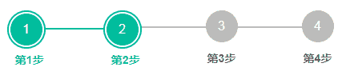

# 二千零二十一、届阅文设计前端方向笔试卷

## 1

1\. 请生成一个 16 位的随机数字；2\. 已知一个非空字符串变量 str，请基于 str 生成一个 16 位的随机数字，也就是不同的 str 值随机数字不同，但是相同的 str 值生成的随机数是一样的。

你的答案

本题知识点

前端工程师 阅文集团 2021

讨论

[QiMingjun](https://www.nowcoder.com/profile/290165687)

  console.log(        String(Math.random()).split(".")[1].slice(0, 16)      );上面的打印结果有时候会出现，数字不足的状况所以需要 padstart，加个保障  console.log(        String(Math.random()).split(".")[1].slice(0, 16).padStart(16, "1")      );

发表于 2021-02-20 13:44:54

* * *

[三角函数](https://www.nowcoder.com/profile/132878365)

const random = function(str){    let num = str.split('').map(char => char.charCodeAt()).join('')    return Math.sin(num).toString().split('.')[1].slice(0,16)}
console.log(random("abcd"));console.log(random("abcd"));console.log(random("ddde"));// 不理解 Math.sin(num).toString().split('.')[1].slice(0,16)

发表于 2021-02-23 16:43:34

* * *

[牛客 159663514 号](https://www.nowcoder.com/profile/159663514)

1、Math.random().toString().slice(-16); 2、

发表于 2021-02-22 11:36:43

* * *

## 2

有如下字符串：
var str = 'CanvasRenderingContext2D';

1. 字符串去重，返回新的不重复字符串，假设变量名是 str2。

2. 字符串反向排列，返回 str2 的反向排列字符串，假设变量名是 str3。

3. 返回 str3 字符串中大写字母的个数。

你的答案

本题知识点

前端工程师 阅文集团 2021

讨论

[ZY_J](https://www.nowcoder.com/profile/315753432)

```cpp
var str = 'CanvasRenderingContext2D';
var str2 = f1(str)
var str3 = f2(str2)
var number = f3(str3);
console.log("str2=" + str2)
console.log("str3=" + str3)
console.log("number="+ number)

// 字符串去重
function f1 (str) {
    let arr = str.split("");
    arr = Array.from(new Set(arr))
    return arr.join("");
}

// 字符串反转
function f2 (str) {
    let arr = str.split("");
    arr.reverse();
    return arr.join("");
}

// 返回 str3 字符串中大写字母的个数
function f3 (str3) {
   let number = 0;
   for (let i = 0; i < str3.length; i++) {
      if (str3[i] >= 'A' && str3[i] <= 'Z') number++;
   }
   return number;
}
```

发表于 2021-01-18 14:43:17

* * *

[菜鸟练习中](https://www.nowcoder.com/profile/217759462)

var str = 'CanvasRenderingContext2D';
            // 字符串去重，返回新的不重复字符串，假设变量名是 str2
            var strArr = str.split("");
            console.log(strArr);
            var flag = [];
            var str2 = "";
            for (var i = 0; i < strArr.length; i++) {
                if (flag[strArr[i]] != 1) {
                    flag[strArr[i]] = 1;
                } else {
                    strArr[i] = "";
                }
            }
            for (var i = 0; i < strArr.length; i++) {
                str2 += strArr[i];
            }
            console.log(str2);

            // 字符串反向排列，返回 str2 的反向排列字符串，假设变量名是 str3
            var strArr2 = str2.split("");
            console.log(strArr2.length);
            var str3 = "";
            var l = 0,
                r = strArr2.length - 1;
            while (l < r) {
                var temp = strArr2[l];
                strArr2[l] = strArr2[r];
                strArr2[r] = temp;
                l++;
                r--;
            }
            for (var i = 0; i < strArr2.length; i++) {
                str3 += strArr2[i];
            }
            console.log(str3);

            // 返回 str3 字符串中大写字母的个数。
            var reg = /[A-Z]/;
            var count = 0;
            for (var i = 0; i < strArr.length; i++) {
                if (reg.test(strArr[i])) {
                    count++;
                }
            }
            console.log(count);

发表于 2021-01-26 16:01:09

* * *

[牛客 183232053 号](https://www.nowcoder.com/profile/183232053)

```cpp
var str = 'CanvasRenderingContext2D';
var str2 = f1(str)
var str3 = f2(str2)
var number = f3(str3);
console.log("str2=" + str2)
console.log("str3=" + str3)
console.log("number="+ number)

// 字符串去重
function f1 (str) {
    var arr  =  [].filter.call(str,(s,i,o)=>o.indexOf(s)==i).join('');
    return arr;
}

// 字符串反转
function f2 (str) {
    let arr = str.split("").reverse().join("");
    return arr;
}

// 返回 str3 字符串中大写字母的个数
function f3 (str3) {
    let number = 0;
    for (let i = 0; i < str3.length; i++) {
        if (str3[i] >= 'A' && str3[i] <= 'Z') number++;
    }
    return number;
}
```

发表于 2021-04-10 15:56:36

* * *

## 3

所有题目公用一个上下文，已知数组：
let arr = [1,2,,3];

1. arr 的长度是多少？
2. 去除 arr 中的空数组项;

3. arr2 = arr.map(parseInt)，请写下 arr2 的内容;
4. arr 和 arr2 合并成数组 arr3。

5. 去除数组 arr3 中重复内容

你的答案

本题知识点

前端工程师 阅文集团 2021

讨论

[三角函数](https://www.nowcoder.com/profile/132878365)

// 3. 数组相关 let arr = [1,2,,3];// 1.arr 长度 console.log(arr.length);// 2.去除空数组项 function f1(arr){    for (var i = 0; i < arr.length; i++){        if(arr[i] == '' || typeof(arr[i]) == "undefined"){            arr.splice(i, 1); // 剔除这个，并重构数组            i = i - 1; // 防止接下来的数组项也是空的        }    }    return arr;}console.log(f1(arr));// 3.arr2 = arr.map(parseInt)的结果 ??arr2 = arr.map(parseInt);console.log(arr2); // 1 NaN NaN/*     解析    arr.map(parseInt)实际上是 arr.map((val, index, arr)=> parseInt(val, index))的一个缩写    3 个参数    parseInt("1", 0) //0 为 10 进制 1    parseInt("2", 1) //radix 中没有 1 进制一说 NaN    parseInt("3", 2) //2 进制中超过 1 的值不存在 NaN*/// 4.arr 和 arr2 合并成 arr3var arr3 = arr.concat(arr2);console.log(arr3);// 5.去除 arr3 中重复内容 function outre(str){    arr = Array.from(new Set(arr));    return arr;}console.log('去重：', outre(arr3));

发表于 2021-02-23 17:41:18

* * *

[Swest-Sweet-love](https://www.nowcoder.com/profile/2469994)

1.长度是 42.  let newArr =  arr.map(v=> v!=="")3.第一次 parseInt(1, 0, [1,2,,3]) = 1
   第二次 parseInt(2, 1, [1,2,,3]) = NaN
   第三次 parseInt('', 2, [1,2,,3]) = NaN
   第四次 parseInt(3, 3, [1,2,,3]) = NaN
   let arr2 = [1, NaN, NaN, NaN]4\. let arr3 = arr.concat(arr2)5. let arr4 =[...new Set(arr3)] 
    console.log(arr4,"vdde")

发表于 2021-03-10 13:01:46

* * *

[牛雪碧](https://www.nowcoder.com/profile/569802555)

亲测，[1,2,3].map(parseInt)得到[1,NaN,NaN];[1,2,,3].map(parseInt)得到[1,NaN,,NaN],map 会迭代 empty

发表于 2021-03-27 20:02:49

* * *

## 4

用户使用 <input type="file"> 上传了一个文件，假设这个文件对象是 file，代码如下所示。input.addEventListener('change', function () {    let file = event.target.files[0]});请问：1\. 如何返回这个文件的尺寸大小？2\. 假设文件支持大小变量是 filesize，filesize 这个数值的表示文件大小的字节书，例如 2837475 字节，哎呀，眼睛又疼了，根本看不出来究竟文件多大，请把字节为单位的尺寸全部使用 K, M, G 单位表示，规则如下，无论文件多小，都使用 K 表示，超过 1M 使用 M 单位表示，超过 1G 使用 G 单位表示，再大的尺寸本题不考虑。// filesize 就是字节单位的文件尺寸// 请继续处理...

你的答案

本题知识点

前端工程师 阅文集团 2021

讨论

[菜鸟练习中](https://www.nowcoder.com/profile/217759462)

var filesize = 0;
                let inputId = document.getElementById("inputId");
                inputId.addEventListener('change', function() {
                    console.log("zhixing");
                    let file = event.target.files[0]

                    // 1\. 如何返回这个文件的尺寸大小？
                    filesize = file.size;
                    console.log(file.size); // 返回大小单位为 字节

                    // 2\. 假设文件支持大小变量是 filesize，filesize 这个数值的表示文件大小的字节书，
                    // 例如 2837475 字节，哎呀，眼睛又疼了，根本看不出来究竟文件多大，
                    // 请把字节为单位的尺寸全部使用 K, M, G 单位表示，规则如下，无论文件多小，都使用 K 表示，
                    // 超过 1M 使用 M 单位表示，超过 1G 使用 G 单位表示，再大的尺寸本题不考虑。
                    let k = filesize / 1024;
                    let m = k / 1024;
                    let g = m / 1024;
                    if (g > 1) {
                        console.log("文件大小为：" + parseInt(g) + "G");
                    } else if (m > 1) {
                        console.log("文件大小为：" + parseInt(m) + "M");
                    } else {
                        console.log("文件大小为：" + parseInt(k) + "K");
                        s
                    }
                    // filesize 就是字节单位的文件尺寸
                    // 请继续处理...

发表于 2021-01-26 18:01:31

* * *

[🌸🌸弟弟](https://www.nowcoder.com/profile/558721556)

```cpp
let input = document.getElementById("fileInput");
input.addEventListener("change", () => {
  let file = event.target.files[0];
  let filesize = file.size;
  console.log("文件尺寸", filesize + "字节(B)");
  console.log(formatSize(filesize));
});
function formatSize(size) {
  let KB = 1024;
  let MB = 1024 ** 2;
  let GB = 1024 ** 3;
  if (size < MB) {
    return (size / KB).toFixed(2) + "K";
  }
  if (size >= MB && size <= GB) {
    return (size / MB).toFixed(2) + "M";
  }
  if (size >= GB) {
    return (size / GB).toFixed(2) + "G";
  }
}
```

发表于 2021-03-08 22:36:27

* * *

[三角函数](https://www.nowcoder.com/profile/132878365)

<!DOCTYPE html><html lang="en">
<head>    <meta charset="UTF-8">    <meta http-equiv="X-UA-Compatible" content="IE=edge">    <meta name="viewport" content="width=device-width, initial-scale=1.0">    <title>Document</title></head>
<body>    <input type="file" id="fs" onchange="getFileSize()"/>    <script>        // input.addEventListener('change', function () {        //     let file = event.target.files[0]        // });        function getFileSize(){            var file =document.getElementById("fs");            var sizebyte = file.files[0].size;            console.log(sizebyte,'B');            console.log((sizebyte/1024).toFixed(2)+'K');            console.log(1024**2&&(sizebyte/1024**2).toFixed(2)+'M');            console.log(1024**3&&(sizebyte/1024**3).toFixed(2)+'G')        }    </script></body>
</html>

发表于 2021-02-23 19:05:00

* * *

## 5

关于字符串处理：

1. 写一个名为 toCamelCase 的方法，实现把类似'abc-def-ghi'的字符转换成'abcDefGhi'。

2. 写一个名为 toDashJoin 的方法，实现把驼峰形式字符串'abcDefGhi'转换成'abc-def-ghi'。

3. 写一个名为 toCapitalize 的方法，实现首字母大写功能（原来字母就是大写的不处理），如'i like css'转换成'I Like Css'。

4. 写一个名为 toBetterUrl 的方法，实现把类似'CSS value type'转换成'css-value-type'（只需考虑空格和大小写处理）。

你的答案

本题知识点

前端工程师 阅文集团 2021

讨论

[Swest-Sweet-love](https://www.nowcoder.com/profile/2469994)

1\. function toCamelCase(str){
         return str.split("-").join("")
     }2.function toDashJoin (str) {
                let newStrArr = []
                let newStr = ""
                for(let i=0;i<str.length; i++) {                
                    if(str[i]===str[i].toUpperCase()) {
                        newStrArr.push("_"+str[i].toLowerCase())
                    } else {
                        newStrArr.push(str[i])
                    }

                }
                return newStr = newStrArr.join("")
            }
3\. function  toCapitalize (str) {
           let newSrr = str.split(" ")
           let newstr = newSrr.map(v=>v[0].toUpperCase()+v.substring(1)).join(" ")
           return newstr  
    }
4.function   toBetterUrl(str){
                let newStr = ''
                for(let i=0; i<str.length; i++) {
                    if(str[i]===str[i].toUpperCase()&&str[i]!==" ") {
                        newStr+=str[i].toLowerCase()
                    }else if(str[i]==" "){
                        newStr+="-"
                    }else{
                        newStr+=str[i]    
                    }                            
                }
                return newStr
            }

发表于 2021-03-10 14:31:44

* * *

[🌸🌸弟弟](https://www.nowcoder.com/profile/558721556)

```cpp
let s1 = "abc-def-ghi";
let s2 = "abcDefGhi";
let s3 = "i like css";
let s4 = "CSS value type";
console.log(toCamelCase(s1));
console.log(toDashJoin(s2));
console.log(toCapitalize(s3));
console.log(toBetterUrl(s4));
function toCamelCase(s) {
  let arr = s.split("-");
  for (let i = 1; i < arr.length; i++) {
    let tempArr = arr[i].split("");
    tempArr[0] = tempArr[0].toUpperCase();
    arr[i] = tempArr.join("");
  }
  return arr.join("");
}
function toDashJoin(s) {
  // 寻找大写字母
  s = s.split("");
  let indexArr = [];
  s.forEach((item, index) => {
    if (item.charCodeAt() >= 65 && item.charCodeAt() <= 90) {
      indexArr.push(index);
    }
  });
  // 替换
  indexArr.forEach(i => {
    s[i] = "-" + s[i].toLowerCase();
  });
  return s.join("");
}
function toCapitalize(s) {
  let arr = s.split(" ");
  arr = arr.map(item => {
    return (item = item[0].toUpperCase() + item.substr(1));
  });
  return arr.join(" ");
}
function toBetterUrl(s) {
  s = s.toLowerCase();
  return s.replaceAll(" ", "-");
}
```

发表于 2021-03-08 23:17:53

* * *

## 6

请使用纯 CSS 实现下图所示的布局效果（手写 HTML 代码和 CSS 代码），不考虑兼容性：
绿色色值是：#00BC9B，灰色色值是：#BCBCBC 注意 HTML 的语义化、内容的扩展性以及尺寸的自适应性。

你的答案

本题知识点

前端工程师 阅文集团 2021

讨论

[牛客 110216331 号](https://www.nowcoder.com/profile/110216331)

```cpp
<ul class="process">
    <li class="finished">
      <div class="line"></div>
      <div class="circle">
        <div class="num"></div>
      </div>
      <div class="text"></div>
    </li>
    <li class="finished">
      <div class="line"></div>
      <div class="circle">
        <div class="num"></div>
      </div>
      <div class="text"></div>
    </li>
    <li>
      <div class="line"></div>
      <div class="circle">

        <div class="num"></div>
      </div>
      <div class="text"></div>
    </li>
    <li>
      <div class="line"></div>
      <div class="circle">

        <div class="num"></div>
      </div>
      <div class="text"></div>
    </li>
  </ul>
```

```cpp
    body {
      counter-reset: process;
    }

    .process {
      display: flex;
      list-style: none;
      width: 100%;
      padding: 0;
    }

    .process li {
      counter-increment: process;
      flex-grow: 1;
      position: relative;
    }

    .process li .circle {

      width: 40px;
      height: 40px;
      border-radius: 50%;
      background-color: #bcbcbc;
      display: flex;
      align-items: center;
      justify-content: center;
    }

    .process li .circle .num {
      width: 32px;
      height: 32px;
      border-radius: 50%;
      line-height: 32px;
      text-align: center;
      color: #ffffff;
    }

    .process .line {
      position: absolute;
      top: 20px;
      left: 0;
      width: 100%;
      height: 2px;
      background-color: #bcbcbc;
      z-index: -1;
    }

    .process li:last-child .line {
      display: none;
    }

    .process li:last-child {
      flex-grow: 0
    }

    .process li .circle .num::before {
      content: counter(process)
    }

    .process li .text::before {
      content: "第"counter(process)"步";
    }

    .process li.finished .circle {
      background-color: #00BC9B;
    }

    .process li.finished .num {
      border: 1px solid #ffffff;
    }

    .process li.finished .line {
      background-color: #00bc9b;
    }
```

发表于 2021-02-06 14:58:20

* * *

[三角函数](https://www.nowcoder.com/profile/132878365)

<!DOCTYPE html><html lang="en">
<head>    <meta charset="UTF-8">    <meta http-equiv="X-UA-Compatible" content="IE=edge">    <meta name="viewport" content="width=device-width, initial-scale=1.0">    <title>Document</title>    <style>        .container {            display: flex;            align-items: center;            width: 100%;        }
        .donecir {            width: 50px;            height: 50px;            border: solid 3px #00bc9b;            float: left;            border-radius: 50%;            display: flex;            align-items: center;            justify-content: center;        }
        .indonecir {            width: 40px;            height: 40px;            border: solid 1px #00bc9b;            border-radius: 50%;            background-color: #00bc9b;            display: flex;            align-items: center;            justify-content: center;        }
        .doneline {            width: 100px;            height: 3px;            float: left;            background-color: #00bc9b;            margin-bottom: 19px;        }
        .line {            width: 100px;            height: 3px;            float: left;            background-color: #BCBCBC;            margin-bottom: 19px;        }
        .cir {            width: 50px;            height: 50px;            display: flex;            align-items: center;            justify-content: center;        }
        .incir {            width: 40px;            height: 40px;            border: solid 1px #BCBCBC;            border-radius: 50%;            background-color: #BCBCBC;            display: flex;            align-items: center;            justify-content: center;        }
        .text {            display: block;            text-align: center;        }    </style></head>
<body>    <div class="container">        <div class="area">            <div class="donecir">                <div class="indonecir" style="color: #fff">1</div>            </div>            <div class="text">第 1 步</div>        </div>        <div class="area">            <div class="doneline"></div>        </div>        <div class="area">            <div class="donecir">                <div class="indonecir" style="color: #fff">2</div>            </div>            <div class="text">第 2 步</div>        </div>        <div class="line"></div>        <div class="area">            <div class="cir">                <div class="incir" style="color: white;">3</div>            </div>            <div class="text">第 3 步</div>        </div>        <div class="line"></div>        <div class="area">            <div class="cir">                <div class="incir" style="color: white;">4</div>            </div>            <div class="text">第 4 步</div>        </div>    </div></body>
</html> 

发表于 2021-02-23 21:01:22

* * *

[Swest-Sweet-love](https://www.nowcoder.com/profile/2469994)

        <!-- 纯 css 实现步骤条 -->
        <div class="step">            
            <!-- 第一步 圆形 1 -->
            <div class="lagre_circle">
                <div class="mid_circle">
                    <div class="small_circle">
                        1
                    </div>
                </div>
            </div>
            <!-- 第一步 圆形 2 -->
            <div class="lagre_circle circleTwo">
                <div class="mid_circle">
                    <div class="small_circle">
                        2
                    </div>
                </div>
            </div>

            <!-- 第一步 圆形 3 -->
            <div class="circleThree">3</div>
            <!-- 第一步 圆形 4 -->
            <div class="circlefour">4</div>                
        </div><style>
.step {
    display: flex; 
    flex-column: row;
    justify-content:center;
    align-items: center;
}
.lagre_circle {
    position: relative;
    background-color: #00BC9B;
    width: 2.7em;
    height:2.7em;
    border-radius: 50%;
    display: flex;    
    justify-content: center;    
    align-items: center;
    margin-right: 5em;
}
.mid_circle {
    background-color: white;
    width: 2.3em;
    height:2.3em;
    border-radius: 50%;
    display: flex;
    justify-content: center;    
    align-items: center;
}
.small_circle {
    background-color: #00BC9B;
    width: 2.1em;
    height: 2.1em;
    line-height: 2.1em;
    border-radius: 50%;
    color: white;
    text-align: center;
}
.lagre_circle::after {
     content: ''; 
     position: absolute;
     top: 50%;
     left:2.7em ;
     background-color: #00BC9B;
     width: 5em;
     height: 2px;
}
.circleTwo::after,.circleThree::after {
     content: ''; 
     position: absolute;
     top: 50%;
     left:2.7em ;
     background-color: #ccc;
     width: 5em;
     height: 2px;    
}
.circleThree::after {
    left:2.1em ;
}
.circleThree, .circlefour {
    position: relative;
    background-color: #ccc;
    width: 2.1em;
    height: 2.1em;
    line-height: 2.1em;
    border-radius: 50%;
    color: white;
    text-align: center;
}
.circlefour {
    margin-left: 5em;
}
</style>

发表于 2021-03-10 15:06:21

* * *

## 7

请手写一个 SVG 效果，SVG 大小是 300*150，然后：1\. 已 SVG 元素的中心为圆心绘制出一个圆形，圆形的半径是 60px，填充色是 deepskyblue;2\. 在圆形的中心位置绘制文字“阅文集团”，字号大小是 14px，文字颜色是白色；请写出满足上述要求的 SVG 代码。

你的答案

本题知识点

前端工程师 阅文集团 2021

讨论

[三角函数](https://www.nowcoder.com/profile/132878365)

<!DOCTYPE html><html lang="en"><head>    <meta charset="UTF-8">    <meta http-equiv="X-UA-Compatible" content="IE=edge">    <meta name="viewport" content="width=device-width, initial-scale=1.0">    <title>Document</title></head><body>    <svg>        <circle cx="150" cy="75" r="60" fill="deepskyblue"></circle>        <text x="50%" y="50%" font-size="14" fill="white" text-anchor="middle" dominant-baseline="middle">阿爸吧啊</text>    </svg></body></html>

发表于 2021-02-23 23:18:09

* * *

## 8

Canvas 基础测试，请实现：1\. 在页面中创建一个 300*150 大小的 Canvas 画布；2\. 以画布中心点为圆心绘制一个圆，圆的半径大小是 60，圆的填充色是 deepskyblue;3\. 在上述圆的中心绘制文字“阅文集团”，字号大小是 14px，字体任意，文字颜色是白色。

你的答案

本题知识点

前端工程师 阅文集团 2021

讨论

[三角函数](https://www.nowcoder.com/profile/132878365)

<!DOCTYPE html><html lang="en">
<head>    <meta charset="UTF-8">    <meta http-equiv="X-UA-Compatible" content="IE=edge">    <meta name="viewport" content="width=device-width, initial-scale=1.0">    <title>Document</title></head>
<body>    <script>        var canvas = document.createElement('canvas');        document.body.append(canvas);        // 2. 圆形        var context = canvas.getContext('2d');
        context.fillStyle = 'deepskyblue';        context.arc(150, 75, 60, 0, 2 * Math.PI);        // 也可以使用下面的椭圆函数        // context.ellipse(150, 75, 60, 60, 0, 0, 2 * Math.PI);        context.fill();
        // 3. 文字        context.fillStyle = 'white';        context.font = '14px sans-serif';        context.textAlign = 'center';        context.textBaseline = 'middle';        context.fillText('阅文 ffff 集团', 150, 75);    </script></body>
</html>

发表于 2021-02-23 23:17:54

* * *

## 9

在一个 Web 页面中有很多的链接和图片，例如：<a href="../some.html">链接 1</a><a href="/home/aside/search.html">链接 2</a><a href="./docs/yuewen.pdf">链接 1</a>
……等。请实现，使用原生 JavaScript 把页面中所有的<a>元素的链接地址和元素的图片地址都替换成当前完整的绝对地址。
例如，假设此时的页面地址是 [`www.yuewen.com/path/`](https://www.yuewen.com/path/)，则元素<a href="../some.html">链接 1</a>替换成<a href="[`www.yuewen.com/`](https://www.yuewen.com/)some.html">链接 1</a>，元素<a href="/home/aside/search.html">链接 2</a>替换成<a href="[`www.yuewen.com/`](https://www.yuewen.com/)/home/aside/search.html">链接 2</a>

你的答案

本题知识点

前端工程师 阅文集团 2021

讨论

[三角函数](https://www.nowcoder.com/profile/132878365)

<!DOCTYPE html><html lang="en">
<head>    <meta charset="UTF-8">    <meta http-equiv="X-UA-Compatible" content="IE=edge">    <meta name="viewport" content="width=device-width, initial-scale=1.0">    <title>Document</title></head>
<body>    <a href="../some.html">链接 1</a>    <a href="/home/aside/search.html">链接 2</a>    <a href="./docs/yuewen.pdf">链接 1</a>        
    <script>        document.querySelectorAll('a, img').forEach(ele => {            if(ele.href){                ele.href = ele.href;            }else if(ele.src){                ele.src = ele.src;            }        });    </script></body>
</html>

发表于 2021-02-23 23:17:40

* * *

## 10

本题关于 URL 地址的处理。
需求如下：
请实现给当前页面的 URL 地址增加或替换 uid=1 的查询内容。即：

*   如果当前 URL 地址是：[`www.yuewen.com`](https://www.yuewen.com)#aaa，则处理后的 URL 地址是：[`www.yuewen.com?uid=1`](https://www.yuewen.com?uid=1)#aaa
*   如果当前 URL 地址是：[`www.yuewen.com?f=qidian`](https://www.yuewen.com?f=qidian) ，则处理后的 URL 地址是：[`www.yuewen.com`](https://www.yuewen.com)?f=qidian&uid=1
*   如果当前 URL 地址是：[`www.yuewen.com?uid=2`](https://www.yuewen.com?uid=2) ，则处理后的 URL 地址是：[`www.yuewen.com?uid=1`](https://www.yuewen.com?uid=1) 

你的答案

本题知识点

前端工程师 阅文集团 2021

讨论

[牛客 190420722 号](https://www.nowcoder.com/profile/190420722)

这个答案 location.href.split('?')[0] 会把 query 前后都挂上锚点了吧 console.log(location.origin + '?' + params.toString() + hash);

发表于 2021-04-26 11:03:52

* * *

## 11

已知用户输入手机号的时候可能是通过粘贴输入，此时就会带上不需要的信息，例如：let tel ='132 0803 3621';
或者是短横线：
let tel ='132-0803-3621';
或是其他的连接字符。然后空格或短横线的位置也不固定，例如可能是下面这样：let tel ='132 080 33621';
请实现，无论变量 tel 使用什么字符分隔，无论分隔位置在哪里，都过滤成连续的 11 位数字，类似'13208033621'。

你的答案

本题知识点

前端工程师 阅文集团 2021

讨论

[牛客 320599610 号](https://www.nowcoder.com/profile/320599610)

正则匹配，把非数字替换为空字符串即可。

```cpp
tel.replace(/\D/g, '')
```

发表于 2021-03-16 10:52:55

* * *

[🌸🌸弟弟](https://www.nowcoder.com/profile/558721556)

```cpp
function filter(phone) {
  phone = phone.replaceAll("-", "");
  phone = phone.replaceAll(" ", "");
  return phone;
}
```

 发表于 2021-03-10 19:11:10

* * *

[牛客 266353859 号](https://www.nowcoder.com/profile/266353859)

```cpp
return [].filter.call(mobile,function(value){
					if(value!=' '){
						return !isNaN(Number(value))
					}					
				}).join('')
```

发表于 2021-02-23 21:05:33

* * *

## 12

已知一段表示用户信息的数组数据，结构如下所示：let data = [{    userId: '001',    userName: '张三(zhangsan)'}, {    userId: '002',    userName: '李四(lisi)'}, {    userId: '003',    userName: '王二(wanger)'}, {    userId: '004',    userName: '麻子(mazi)'}];请实现数组按照数组项中 userName 中的姓名拼音排序。

你的答案

本题知识点

前端工程师 阅文集团 2021

讨论

[🌸🌸弟弟](https://www.nowcoder.com/profile/558721556)

```cpp
data.sort((objA, objB) => {
  const codeA = objA.userName.split("(")[1][0].charCodeAt();
  const codeB = objB.userName.split("(")[1][0].charCodeAt();
  if (codeA > codeB) {
    return 1;
  } else {
    return -1;
  }
});
console.log(data);
```

```cpp
data.sort((objA, objB) => {
  const codeA = objA.userName.split("(")[1][0].charCodeAt();
  const codeB = objB.userName.split("(")[1][0].charCodeAt();
  if (codeA > codeB) {
    return 1;
  } else {
    return -1;
  }
});
console.log(data);
```

```cpp
data.sort((objA, objB) => {
  const codeA = objA.userName.split("(")[1][0].charCodeAt();
  const codeB = objB.userName.split("(")[1][0].charCodeAt();
  if (codeA > codeB) {
    return 1;
  } else {
    return -1;
  }
});
console.log(data);
```

发表于 2021-03-10 19:18:48

* * *

## 13

已知有一串用户数据是这样的：
let data = [{  id: '1',  username: '张三'}, {  id: '2',  username: '李四'}, {  id: '3',  username: '王二'},...];请实现，如果数组中有 id 值是'233'的数据项，则将此数组项在数组中置顶（数组第 1 位），如果没有匹配的数组项，则数组顺序不变。

你的答案

本题知识点

前端工程师 阅文集团 2021

讨论

[牛客 110216331 号](https://www.nowcoder.com/profile/110216331)

```cpp
data.unshift(data.splice(data.findIndex((value) => value.id === "233"), 1)[0])
console.log(data);
```

发表于 2021-02-06 16:21:40

* * *

[小猫咪能有什么坏心思呢](https://www.nowcoder.com/profile/315631556)

const fun = data = > {    data.forEach((item, index) => {        if(item.id === '233' ) {            data.unshift(item);//也可以 data.splice(0, 0, item)             data.splice(index+1, 1) ；        }    })      return data;
}

发表于 2021-01-22 18:15:27

* * *

[SuLi-97](https://www.nowcoder.com/profile/803876765)

```cpp
function top233(data){
    var index = data.findIndex((item)=>item.userId == "233");
    data.unshift(data.splice(index,1)[0]);
}
```

发表于 2021-01-21 02:21:56

* * *

## 14

请实现纯 CSS 实现如下图所示的弹性布局效果，也就是随着设备的宽度不断变化，布局需要符合下图所示的效果，无需考虑兼容性问题，无需关注样式细节，主要考验大家的布局功力。
**再使用文字描述下布局：**手写 HTML 结构和 CSS 代码，注意是一套 HTML 和 CSS 完成上述的各种宽度下的弹性布局效果，不用考虑浏览器的兼容性、**描述：**整个网站是最大宽度 980px 的布局效果，因此，在页面的尺寸足够的时候，导航和搜索在一个 980px 的范围内两端对齐，整体居中显示。然后用户信息页面右对齐（见上图①和②）。但是，不同用户的浏览器宽度是不一样的，如果用户宽度不是很宽，例如是 1200px，笔记本常见的宽度，那么上面这种布局就会有问题，右侧的用户信息就会和搜索框重叠，布局就会出问题。所以希望，当用户信息和搜索框靠的足够近的时候，整体的 980px 宽度自动减小，同时左侧至少保留 190px 的距离（见上图③和④）。**提示：**本题布局有一定难度，但是实际上代码量很少，需要大家对 CSS 弹性布局有比较深入的了解。

你的答案

本题知识点

前端工程师 阅文集团 2021

讨论

[huang 小 yu](https://www.nowcoder.com/profile/53823471)

<!DOCTYPE html><html lang="en"><head>    <meta charset="UTF-8">    <meta name="viewport" content="width=device-width, initial-scale=1.0">    <title>Document</title>    <style>        .main{            display: flex;            flex-direction: row;            background-color: aquamarine;            justify-content: space-around;        }        .left{            min-width: 190px;        }        .nav{            flex-basis: 980px;            display: flex;            flex-direction: row;            justify-content: space-between;        }        .userInfo{            float: right;            margin-left: 20px;            white-space: nowrap;        }    </style></head><body>    <div class="main">        <div class="left"></div>        <div class="nav">            <div class="txt">                <span>导航元素 1</span>                <span>导航元素 1</span>            </div>            <input type="text">        </div>        <div class="userInfo">            <span>用户名</span>            <span>导出</span>        </div>    </div></body></html>

编辑于 2021-01-17 00:13:13

* * *

## 15

已知 HTML 如下：<style>a { display: block; }h1 { background: url(logo.png); }</style><header><a href="./" class="logo"><h1>hr 门户系统</h1></a><nav><a href accesskey="1">导航 1</a><a href class="active" accesskey="2">导航 2</a><a href accesskey="3">导航 3</a></nav></header>1\. 请使用 JS 代码获得<h1>标签里面的文字内容;2\. 请使用 JS 代码获得类名为.active 元素的 accesskey 属性值;3\. 请使用 JS 代码获得<header>元素的高度（包括 border 大小）;4\. 请使用 JS 代码获得<h1>元素的背景图片;5\. 请使用 JS 判断<header>元素是否在浏览器窗口内;6\. 请使用 JS 在<nav>元素后面插入<a href accesskey="4">导航 4</a>结构;7\. 请使用 JS 删除.logo 类名对应的 DOM 元素;8\. 请使用 JS 实现点击页面上任意链接都不刷新;

你的答案

本题知识点

前端工程师 阅文集团 2021

讨论

[ASusie](https://www.nowcoder.com/profile/220926962)

5\. 请使用 JS 判断<header>元素是否在浏览器窗口内这里没有说的很清楚欸？应该是可视区域的窗口吧？那答案应该是这样的：

```cpp
var top = document.querySelector('header').getBoundingClientRect().top
if (top>0&&top<window.innerHeight) return true
else return false
```

编辑于 2021-03-18 22:20:35

* * *