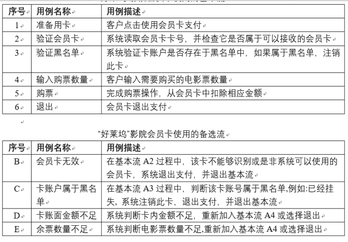
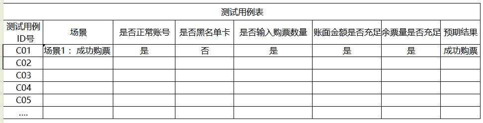
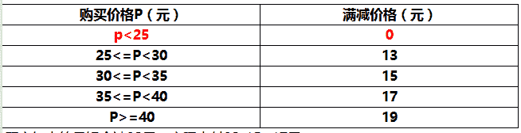

# 美团 2021 校招测试-简答题(第 3/4 批)

## 1

测试需求：
软件系统几乎都是用事件触发来控制流程的，事件触发时的情景便形成了场景，而同一事件不同的触发顺序和处理结果就形成事件流。场景法就是通过用例场景描述业务操作流程，从用例开始到结束遍历应用流程上所有基本流(基本事件)和备选流(分支事件)。下面是对某城市“好莱坞”影院 APP 购票系统中会员卡使用的基本流和备选流的描述。会员卡分为储值型会员卡和现金型会员卡两种，会员必须持本卡在本影城内进行刷卡消费，才能享受影城提供的会员购票折扣、积分优惠、积分兑奖、会员专享、会员升级等一系列的会员优惠和服务。

会员种类： 1、现金消费会员卡：6 个月内累计观影 6 次或购影票消费达到 200 元者，可凭票带有效证件免费 100 元现金消费会员卡。
2、储值会员卡：分为 200 元、300 元、600 元、1000 元四种卡。其中：200 元为会员卡、300 元为银卡会员、600 元为金卡会员、1000 元为 VIP 尊贵会员。
问题 1：使用场景法设计测试用例，指出场景涉及到的基本流和备选流，基本流用字母 A 表示，备选流用题干中描述的相应字母表示。问题 2：场景中的每一个场景都需要确定测试用例，一般采用矩阵来确定和管理测试用例。如下表所示是一种通用格式，其中行代表各个测试用例，列代表测试用例的信息。本例中的测试用例包含测试用例、ID、场景条件、测试用例中涉及的所有数据元素和预期结果等项目。首先确定执行用例场景所需的数据元素(本例中包括账号、是否黑名单卡、输入购票数量、账面金额、余票量)，然后构建矩阵，最后要确定包含执行场景所需的适当条件的测试用例。在下面的矩阵中，是表示有效数据元素，否表示无效数据元素，n/a 表示不适用。例如 C01 表示“成功购票”基本流。请按上述规定为其它应用场景设计用例矩阵。问题 3：假如每张票 20 元人民币，用户的账户金额为 600 元，余票量充足，那么在 A4 输入购票数量的过程中，
请运用边界值分析方法为 A4 选取合适的输入数据(即电影票数量，单位：张)。

你的答案

本题知识点

测试工程师 美团 2021

讨论

[牛明明](https://www.nowcoder.com/profile/9995501)

A 和 B 不是异常流程吗？

发表于 2021-03-16 14:02:36

* * *

## 2

测试需求：满减策略是外卖平台推出的一种为了让商家与顾客实惠，平台给予商家补贴，通过这样的营销活动来实现用户高速增长的一种模式。以某城市外卖平台设计的麻辣香锅或麻辣烫的满减策略为例子，蔬菜成本 0.5 元，肉类 0.8 元，在设计满减的时候，可以 5 元一个档，例：25-13，30-15，35-17……，蔬菜定价 3 元，荤菜定价 5 元，这样，每 5 元一个满减档，用户就会拉高自己的客单价。报价规则如下表所示。

顾客如点的香锅合计 32 元，实际支付 32-15=17 元。现在该商家开发一个软件，输入为实际价格 P(1<P<100)，输出为满减后价格 D。问题 1：请采用等价类划分法为该软件设计测试用例(不考虑 P 为非整数的情况）问题 2：请采用边界值分析法为该软件设计测试用例(不考虑健壮性测试,既不考虑 P 不在 1 到 100 之间或者是非整数的情况)
问题 3：列举除了等价类划分法和边界值分析法以外的三种常见的黑盒测试用例设计方法。

你的答案

本题知识点

测试工程师 美团 2021