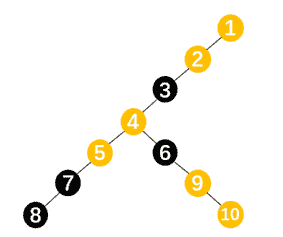
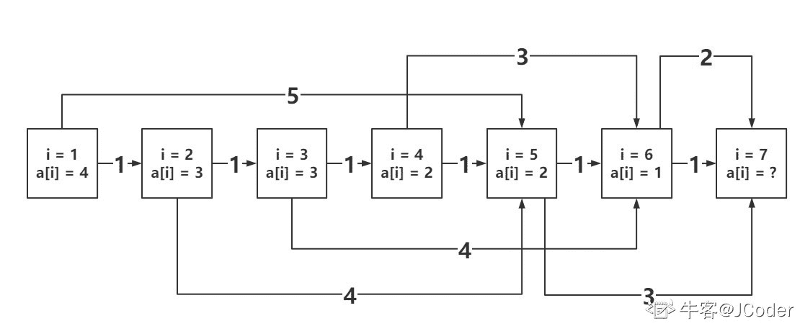

# 美团 2021 校招笔试-编程题（算法编程题）

## 1

小美最近发现了一种有趣的游戏，给定一个队列 q，小美会按照以下规则进行游戏：

每次从队列中取出一个数，如果这个数是当前队列中最小的值，那么小美就会丢掉这个数。否则小美就会把这个数重新加入队列。

小美会一直进行游戏直到队列变空为止，但是小美并没有多少耐心，因此她想知道她最多需要进行多少次操作才能结束游戏。

本题知识点

Java 工程师 C++工程师 前端工程师 安卓工程师 iOS 工程师 算法工程师 大数据开发工程师 美团 2021

讨论

[不偷不抢安度因 _](https://www.nowcoder.com/profile/275523507)

```cpp
#include <bits/stdc++.h>

using namespace std;

int main() {
    int n;
    cin >> n;
    int cnt = n;
    vector<int> sorted(n), que(n);
    for (int i = 0; i < n; ++i) {
        int num;
        cin >> num;
        sorted[i] = que[i] = num;
    }
    sort(sorted.begin(), sorted.end(), & {
        return u < v;
    });
    int idx = 0, start = 0;
    while (idx < n) {
        //auto it = find(que.begin() + start, que.end(), sorted[idx]);
        //if (it == que.end()) {
        //    it = find(que.begin(), que.begin() + start, sorted[idx]);
        //}
        int it_idx;
        for (it_idx = start; it_idx < que.size(); ++it_idx) {
            if (que[it_idx] == sorted[idx]) {
                break;
            }
        }
        if (it_idx == que.size()) {
            for (it_idx = 0; it_idx < start; ++it_idx) {
                if (que[it_idx] == sorted[idx]) {
                    break;
                }
            }
        }
        //cnt += (it - que.begin() + 1);
        //int it_idx = it - que.begin();
        //if (it_idx < start) {
        //    cnt += (n - idx - start + it_idx);
        //} else {
        //    cnt += (it_idx - start);
        //}
        cnt += ((it_idx - start + (int)que.size()) % (int)que.size());

        start = it_idx;
        que.erase(it_idx + que.begin());
        //que.erase(it);
        ++idx;
    }
    printf("%d\n", cnt);
}

```

发表于 2021-03-03 14:51:49

* * *

[听心 zx](https://www.nowcoder.com/profile/62555182)

基本上所有模拟游戏过程的方法（有 pop 和 push 操作）的都会超时。看了一楼大佬的代码，可以将序列想象成一个环，根据队列中最小值的位置与队列长度取模，得到的就是这个值需要几步才能从队列中移除，这样根据排好序的序列遍历一遍就可以把所有数需要移动的次数计算出来，不需要移动，或者说是只移动指针（改变索引）并不进行 pop/push 操作。

发表于 2021-03-19 10:04:35

* * *

[SuLi-97](https://www.nowcoder.com/profile/803876765)

```cpp
#include<iostream>
#include<vector>
#include<algorithm>
using namespace std;
int main(){
    int n;cin>>n;
    vector<vector<int>> a(n,vector<int>(2));
    for(int i=0;i<n;i++){
        cin>>a[i][0];
        a[i][1] = i;
    }
    stable_sort(a.begin(),a.end());
    vector<int> dp;
    int pre_index = 2000000000;

    for(int i=0;i<n;){
        int j=i,k=-1;
        while(j<n && a[j][0]==a[i][0]){
            if(a[j][1]<pre_index)
                k = j;
            j++;
        }
        if (k==-1){
            dp.back() += j-i;
            pre_index = a[j-1][1];
        }else{
            if(dp.size()) dp.back() += j-(k+1);
            dp.push_back(k-i+1);
            pre_index = a[k][1];
        }
        i = j;
    }

    int length = dp.size();
    int res = n*length--;
    for (auto x :dp)
        res -= x*length--;
    cout<< res;
}
```

发表于 2021-03-07 01:25:38

* * *

## 2

小团作为一名美团骑手，最喜欢的颜色就是黄和黑，因此对包含这两种颜色的事物都格外留意。

这天他发现有一棵树，树上的每个节点都是黄的或者黑的。现在小团想知道对于这棵树中的每个节点，在以其为根的子树中，所有与其颜色不同的节点的深度之和是多少。子树中节点的深度被定义为该节点与该子树根节点之间的最短路径的边数。



本题知识点

Java 工程师 C++工程师 前端工程师 安卓工程师 iOS 工程师 算法工程师 大数据开发工程师 美团 2021

讨论

[牛客 474721145 号](https://www.nowcoder.com/profile/474721145)

```cpp
#include <iostream>
#include <vector>
#include <map>
#include <queue>
using namespace std;
vector<long long> handle(vector<int>& colors, map<int, vector<int>>& edges) {
    int n = colors.size() - 1;
    vector<long long> ret(n);
    vector<vector<int>> tree;
    queue<int> q;
    q.push(1);
    //构建树并记录每一层的节点
    while(!q.empty()) {
        int sz = q.size();
        vector<int> floor;
        for(int i = 0; i< sz; i++) {
            int node = q.front();
            q.pop();
            floor.push_back(node);
            for(auto j : edges[node]) {
                q.push(j);
            }
        }
        tree.push_back(floor);
    }
    vector<vector<int>> data(n+1, vector<int>(4));
    int m = tree.size();
    // 从最后一层开始遍历，更新每个节点包含的红黑节点数量及其深度之和
    for(int i = m-1; i >= 0; i--) {
        for(auto j : tree[i]) {
            if(edges[j].empty()) {
                if(colors[j]) {
                    data[j] = {0, 0, 1, 0};
                } else {
                    data[j] = {1, 0, 0, 0};
                }
            } else {
                for(auto k : edges[j]){
                    data[j][0] += data[k][0];
                    data[j][1] += data[k][0] + data[k][1];
                    data[j][2] += data[k][2];
                    data[j][3] += data[k][2] + data[k][3];
                }
                if(colors[j]) {
                    data[j][2] += 1;
                    ret[j-1] = data[j][1];
                } else {
                    data[j][0] += 1;
                    ret[j-1] = data[j][3];
                }
            }
        }
    }
    return ret;
}
int main() {
    int n;
    cin >> n;
    vector<int> colors(n+1);
    map<int, vector<int>> edges;
    for(int i = 1; i <= n; i++) {
        cin >> colors[i];
    }
    int node;
    for(int i = 1; i <= n-1; i++) {
        cin >> node;
        edges[node].push_back(i+1);
    }
    for(auto i : handle(colors, edges)) {
        cout << i << " ";
    }
    return 0;
}

```

发表于 2021-08-24 00:17:31

* * *

[JCoder](https://www.nowcoder.com/profile/1405380)

java 和 python 常规 DFS 会爆栈

发表于 2021-08-24 21:27:40

* * *

## 3

孙悟空现在正在天宫偷吃蟠桃，时间有限，王母娘娘一会儿就会回来，孙悟空要在王母娘娘回来之前尽可能多偷吃一点蟠桃。

你的任务是帮助孙悟空决定怎么吃蟠桃才能尽可能多吃。输出孙悟空最多可以吃掉的蟠桃数量。

特别说明：本题中不能直接使用排序库函数，如您使用了排序库函数，即便运行通过也会被判为 0 分。

本题知识点

Java 工程师 C++工程师 前端工程师 安卓工程师 iOS 工程师 算法工程师 大数据开发工程师 美团 2021

讨论

[零葬](https://www.nowcoder.com/profile/75718849)

贪心思想：优先吃耗时少的蟠桃。对 N 个蟠桃的耗时进行排序（写个快排就行），然后模拟吃桃过程，没时间了或者没桃了就退出循环。

```cpp
def quick_sort(alist, first, last):
    if first >= last:
        return
    mid_value = alist[first]
    low = first
    high = last
    while low < high:
        while low < high and alist[high] >= mid_value:
            high -= 1
        alist[low] = alist[high]
        while low < high and alist[low] < mid_value:
            low += 1
        alist[high] = alist[low]
    alist[low] = mid_value
    # 对 low 左边的列表执行快速排序
    quick_sort(alist, first, low - 1)
    # 对 low 右边的列表执行快速排序
    quick_sort(alist, low + 1, last)

if __name__ == "__main__":
    n, p = map(int, input().strip().split())
    # 将耗时少的蟠桃排在前面
    time_consume = list(map(int, input().strip().split()))
    quick_sort(time_consume, 0, n - 1)
    # 模拟吃桃过程
    count = 0
    for i in range(n):
        if n > 0 and p >= time_consume[i]:
            p -= time_consume[i]
            n -= 1
            count += 1
        else:
            # 没时间或者没桃了
            break
    print(count)
```

编辑于 2021-03-08 16:35:22

* * *

[牛客 843191783 号](https://www.nowcoder.com/profile/843191783)

算法就是贪心排序加上从小累减 q，略。在第四卡了很久，检查算法没问题，检查数据发现，这题并没有给定数据限制，将 int 改为 long long 后，可运行。

发表于 2021-09-14 18:02:33

* * *

[牛客 986821314 号](https://www.nowcoder.com/profile/986821314)

```cpp
l1=list(map(int,input().strip().split()))
l2=list(map(int,input().strip().split()))
def partition(arr,low,high):
    i=low-1
    pivot=arr[high]
    for j in range(low,high):
        if arr[j]<=pivot:
            i=i+1
            arr[i],arr[j]=arr[j],arr[i]
    arr[i+1],arr[high]=arr[high],arr[i+1]
    return i+1
def quickSort(arr,low,high):
    if low<high:
        pi=partition(arr,low,high)
        quickSort(arr,low,pi-1)
        quickSort(arr,pi+1,high)
quickSort(l2,0,l1[0]-1)

res=0
res1=0
for i in range(l1[0]):
    if res<l1[1]:
        res+=l2[i]
        res1=i+1
    else:
        res-=l2[i-1]
        res1=i-1
        break

print(res1)

```

这题真的简单，直接快排就行了

发表于 2021-04-22 20:01:47

* * *

## 4

小团正在装饰自己的书桌，他的书桌上从左到右有 m 个空位需要放上装饰物。商店中每个整数价格的装饰物恰好有一种，且每种装饰物的数量无限多。

小团去商店的时候，想到了一个购买方案，他要让右边的装饰物价格是左边的倍数。用数学语言来说，假设小团的 m 个装饰物价格为，那么对于任意的 1≤i≤j≤m，是的倍数。

小团是一个节约的人，他希望最贵的装饰物不超过 n 元。现在，请你计算小团有多少种购买的方案？

本题知识点

Java 工程师 C++工程师 前端工程师 安卓工程师 iOS 工程师 算法工程师 大数据开发工程师 美团 2021

讨论

[零葬](https://www.nowcoder.com/profile/75718849)

动态规划，**dp[i][j]**表示第**i**个物品房价格为**j**的装饰品时有多少种方案。当我们在确定第**i**个装饰物时，其实它的价格是有限制的，如果第**i-1**个装饰物价格为**j**，那么第**i**个装饰物的价格只能是**j**的整数倍，且不能超过**n**。而第**i**个装饰物对于任意确定的价格**k=j*times**，可能存在多组(**j**, **times)**乘积相同，把这些方案数全部加起来才能得到**dp[i][k]**，因此状态转移方程为：                **dp[i][j*times] = ****dp[i][j*times] + dp[i - 1][j]          times**为整数，满足**j*times<=n**最后将第 m 个装饰物的所有价格的方案数加起来就是我们要求的方案总数

```cpp
import java.io.BufferedReader;
import java.io.InputStreamReader;
import java.io.IOException;

public class Main {
    public static void main(String[] args) throws IOException {
        BufferedReader br = new BufferedReader(new InputStreamReader(System.in));
        String[] params = br.readLine().trim().split(" ");
        int n = Integer.parseInt(params[0]);
        int m = Integer.parseInt(params[1]);
        // dp[i][j]表示第 i 个装饰物价格为 j 时的方案数
        int[][] dp = new int[m + 1][n + 1];
        // 第一个装饰物在价格确定时只有一种方案
        for(int j = 1; j <= n; j++)
            dp[1][j] = 1;
        for(int i = 2; i <= m; i++){
            for(int j = 1; j <= n; j++){
                // 在 n 以内尝试各种倍数
                for(int times = 1; j*times <= n; times++){
                    dp[i][j*times] += dp[i - 1][j];
                    dp[i][j*times] %= 998244353;
                }
            }
        }
        int count = 0;
        // 第 m 个装饰物价格为 1~n 的所有方案都要加起来
        for(int j = 1; j <= n; j++) {
            count += dp[m][j];
            count %= 998244353;
        }
        System.out.println(count);
    }
}
```

发表于 2021-03-14 23:15:37

* * *

[SuLi-97](https://www.nowcoder.com/profile/803876765)

```cpp
#include<iostream>
using namespace std;
int main(){
    int n,m;
    cin >> n>>m;
    int dp[n+1][m+1];
    for(int i=1;i<=n;i++)
        dp[i][1] = n / i;
    for(int j=2;j<=m;j++){
        for(int i = 1;i<=n;i++){
            dp[i][j] = 0;
            int times = i;
            while(times <= n){
                dp[i][j] = (dp[i][j]+dp[times][j-1]) % 998244353;
                times += i;
            }
        }
    }
    cout<<dp[1][m];
}
```

发表于 2021-03-07 03:28:24

* * *

[不偷不抢安度因 _](https://www.nowcoder.com/profile/275523507)

```cpp
#include <bits/stdc++.h>

using namespace std;

int main() {
    const int mod = 998244353;
    int n, m;
    cin >> n >> m;
    vector<vector<int>> dp(m + 1, vector<int>(n + 1, 0));
    for (int i = 1; i <= n; ++i) {
        dp[1][i] = 1;
    }
    for (int i = 1; i < m; ++i) {
        for (int j = 1; j <= n; ++j) {
            for (int k = 1; k * j <= n; ++k) {
                dp[i + 1][j * k] = (dp[i][j] + dp[i + 1][j * k]) % mod;
            }
        }
    }
    int res = 0;
    for (int i = 1; i <= n; ++i) {
        res = (res + dp[m][i]) % mod;
    }
    cout << res;
    return 0;
}

```

发表于 2021-03-03 14:52:42

* * *

## 5

小团要组织一只队伍参加 MT 杯竞赛，某媒体赛前要对各参赛队伍实力进行评估，已知这个比赛要求每一个参赛方组织一支由 x 个人组成的 A 队，和 y 个人组成的 B 队，这个媒体在评估时会把 A 队的人员的平均实力值和 B 队人员的平均实力值相加，从而得到一个参赛方的综合实力评估。

  小团可选的人手有限，只有 x+y 个人可以供他选择，但是显然不同的人员安排会有不同的综合实力评估，他希望他的综合实力评估尽可能高，请你帮助他完成分队。

本题知识点

Java 工程师 C++工程师 前端工程师 安卓工程师 iOS 工程师 算法工程师 大数据开发工程师 美团 2021

讨论

[牛客 404270893 号](https://www.nowcoder.com/profile/404270893)

理论分析

设选到`x`队的人为，选到`y`队的人为，那么综合实力为 。

由于，带入上式得到 ，提取公因式得到 

由于由输入数据决定，其值可认为是常数`C`，那么综合实力为 

*   当 时，显然  越大综合实力越大。

*   当 时，显然随变怎么分综合实力都是`C`，但是需要输出字典序最小，因此前面`x`个`A`，后面`y`个`B`就是最小字典序。

*   当 时，显然  越小综合实力越大。

代码

```cpp
x, y = map(int, input().split())

nums = list(map(int, input().split()))

cntX, cntY = x, y

sort = sorted(range(x + y), key=nums.__getitem__, reverse=True)

if y > x:

    ans = ['B'] * (x + y)

    for i in range(x):

        ans[sort[i]] = 'A'

elif y == x:

    ans = ['A'] * x + ['B'] * y

else:

    ans = ['B'] * (x + y)

    for i in range(x):

        ans[sort[~i]] = 'A'

print(''.join(ans))

```

**复杂度分析**：设`n = x + y`

*   **时间复杂度**：。

*   **空间复杂度**：。

发表于 2021-08-17 10:33:17

* * *

[Asiim0v](https://www.nowcoder.com/profile/929467439)

```cpp
// 数学题：公式化简后需要对 x, y 的大小关系进行分类讨论
// x == y 时: w = (a + b)/ x, 任意选取结果都没有影响, 直接输出最小字典序
// x < y 时: w = (y - x)/xy * a + s / y (s = a + b), w 随 a 单调递增, 所以把实力最高的 x 个人分给 a
// x > y 时, w = (x - y)/xy * b + s / y, 同理把实力最高的 y 个人分给 b
#include <iostream>
#include <vector>
#include <algorithm>
#include <string>
#include <unordered_map>

using namespace std;

const int N = 2e4 + 10, M = 2 * N;
int x, y;

int main()
{
    cin >> x >> y;
    vector<int> num(x + y);
    unordered_map<int, int> Hash;
    string ans;
    for(int i = 0; i < x + y; ++i) cin >> num[i], Hash[num[i]] = i;
    sort(num.begin(), num.end(), greater<int>());

    if(x == y){
        ans.append(x, 'A');
        ans.append(y, 'B');
        cout << ans << endl;
    }
    else if(x < y){
        vector<char> vec(x + y, 'B');
        for(int i = 0; i < x; ++i){
            int pos = Hash[num[i]];
            vec[pos] = 'A';
        }
        for(auto ch : vec) ans += ch;
        cout << ans << endl;
    }
    else{
        vector<char> vec(x + y, 'A');
        for(int i = 0; i < y; ++i){
            int pos = Hash[num[i]];
            vec[pos] = 'B';
        }
        for(auto ch : vec) ans += ch;
        cout << ans << endl;
    }

    return 0;
}
```

发表于 2021-08-20 14:10:43

* * *

[Ordi](https://www.nowcoder.com/profile/299431922)

```cpp
import java.util.Arrays;
import java.util.Comparator;
import java.util.Scanner;

public class Main {
    public static void main(String[] args) {
        Scanner in = new Scanner(System.in);
        int x = in.nextInt();
        int y = in.nextInt();
        int N = x + y;
        Pair[] pairs = new Pair[N];
        for (int i = 0; i < N; i++) {
            int val = in.nextInt();
            pairs[i] = new Pair(val, i);
        }
        Arrays.sort(pairs, new Comparator<Pair>() {
            @Override
            public int compare(Pair o1, Pair o2) {
                return o1.val - o2.val;
            }
        });
        boolean[] A = new boolean[N];

        if(x<y){
            //挑分高的
            for(int i=N-1; i>N-1-x; i--){
                A[pairs[i].idx] = true;
            }

        }else if(x>y){
            for(int i=0; i<x; i++){
                A[pairs[i].idx] = true;
            }
        }else{
            for(int i=0; i<x; i++){
                A[i] =true;
            }
        }

        for (int i = 0; i < N; i++) {
            if(A[i]){
                System.out.print("A");
            }else{
                System.out.print("B");
            }
        }
    }

    static class Pair {
        int val;
        int idx;

        public Pair(int val, int idx) {
            this.val = val;
            this.idx = idx;
        }
    }
}

```

发表于 2021-03-21 16:58:33

* * *

## 6

小美要将 N 名员工分成若干组，且每组至少要有一名员工。每个组都会产生一个单位的收益，且对于第 i 名员工，如果其所在的组包含至少 A[i]名员工（包括第 i 名员工自身），则该员工会额外贡献一个单位的收益。现在，小美请小团将 N 名员工分组，使得总收益最大。

本题知识点

Java 工程师 C++工程师 前端工程师 安卓工程师 iOS 工程师 算法工程师 大数据开发工程师 美团 2021

讨论

[零葬](https://www.nowcoder.com/profile/75718849)

由于员工**i**所在的组至少要有**A[i]**人才能获得额外的一个收益，而不管**A[i]**是多少，达到这个人数后额外收益也只会是一个单位，因此为了获得额外的那个收益，应该尽可能先满足**A[i]**小的，这样获得额外收益的门槛更低。先对**A**进行升序排列，然后利用动态规划求解，因为每人自成一组的情况下可以获得**n**个收益，因此初始化收益为**n**，**dp[0] = n，**用**dp[i+1]**表示**0~i**号员工分配到一组时的收益。易知**i+1**为第一组员工的人数，当**i+1>=A[i]**时，相较于**0~i-A[i]**号员工分在一组，会产生一个额外的收益，因此得到状态转移方程：            **dp[i + 1] = dp[i + 1 - A[i]] + 1         (i + 1 >= A[i])**
**dp**数组中的最大值就是所有方案中的最大收益。

```cpp
import java.io.BufferedReader;
import java.io.InputStreamReader;
import java.io.IOException;
import java.util.Arrays;

public class Main {
    public static void main(String[] args) throws IOException {
        BufferedReader br = new BufferedReader(new InputStreamReader(System.in));
        int T = Integer.parseInt(br.readLine().trim());
        while(T-- > 0){
            int n = Integer.parseInt(br.readLine().trim());
            String[] strA = br.readLine().trim().split(" ");
            int[] A = new int[n];
            for(int i = 0; i < n; i++) A[i] = Integer.parseInt(strA[i]);
            // 对产生额外收益的“门槛”进行排序，先满足门槛低的员工
            Arrays.sort(A);
            int[] dp = new int[n + 1];
            // 初始化，每人一组至少有 n 的收益
            dp[0] = n;
            int maxIncome = dp[0];
            for(int i = 0; i < n; i++){
                // 如果将 i 分配到前面的组能使得这个组人数至少为 A[i]，就会产生额外的 1 个单位收益
                if(i + 1 >= A[i]) dp[i + 1] = dp[i + 1 - A[i]] + 1;
                maxIncome = Math.max(maxIncome, dp[i + 1]);
            }
            System.out.println(maxIncome);
        }
    }
}
```

发表于 2021-03-14 19:11:31

* * *

[JCoder](https://www.nowcoder.com/profile/1405380)

来个图上 DP 的解法吧将整个数组倒排(降序排序)，然后遍历：我的目的要么就是更大的单独分组，例如 {100} {1} 。要么就是尽量满足更大的，例如 {4, 4, 4, 4} {1} 。如果大的单独分组，则相当于大的没得到满足，贡献只增加了 1，也就是这一组的组贡献。如果大的不单独分组，则相当于大的满足了，大的都满足了，同组内小的也能满足，也就是说贡献变成了组的大小+组贡献，组的大小就是大的数字的值，组贡献是 1，即总贡献为 a[i] + 1 以下用样例 {2 3 4 1 3 2} 进行解释：{2 3 4 1 3 2} 排序后为 {4 3 3 2 2 1}将 贡献看成边权，将分组情况看成边（组的第一个元素指向下一个组的第一个元素），可以得到下面的图：
权值为 1 的边代表让当前的 a[i] 单组分组的贡献，其他的边表示满足 a[i] 的组的贡献这时候我们的目的就是求出 最长路 的长度，起点为 1 且终点为 n+1，可以用 SPFA 加边权取相反数等办法求这个最长路。但是有更好的办法，这个图有一个特点：所有的边的起点一定小于终点。既然不存在环，就可以考虑使用 DP 求解了，此时设 dp[i] 为从 i 走到 n+1 的最长路，dp[n+1] = 0，倒着推出 dp[1] 就可以得到最长的路径了。上图的最长路有好几个：1 -> 2 -> 5 -> 71 -> 5 -> 71 -> 2 -> 3 -> 6 -> 7 其实就分别对应了分组的状况：{4} {3, 3, 2} {2, 1} = 1 + (3 + 1) + (2 + 1) = 8{4, 3, 3, 2} {2, 1} = (4 + 1) + (2 + 1) = 8{4} {3} {3, 2, 2} {1} = (1) + (1) + (3 + 1) + (1) = 8 那为什么没有题目样例解释中的分配方案 {4, 3, 3, 2, 2} {1} 呢？这里要注意的是，这个样例的方案， 最后一个 2 就算是放到后面的组内，也会产生自己的贡献。相当于这个 2 在第一组是凑数的，因为最大的 4 已经满足了，所以进来的数字不管是啥都会产生自己的贡献，在图中这种边是可以存在的，但是对答案没有影响。假设这条边存在，那么应该是 a[1] = 4 连接到 a[6] = 1，边权为组大小+组贡献，为 5+1 = 6。但是会发现，图中已经存在了 a[1] 到 a[5] 的权值为 5 的边，以及 a[5] 到 a[6] 权值为 1 的边，也是 5+1 = 6，所以这条理论上长为 6 的边是没有意义的。但是如果这个 2 变成 1，结果就不同了，因为 1 可以自己分组了，并且图也会产生相应的变化。

```cpp
#include <bits/stdc++.h>
using namespace std;

int n, T, a[100005], dp[100005];
vector<pair<int, int> > e[100005];
int main() {
    scanf("%d", &T);
    while (T--) {
        for (int i = 0; i <= n + 1; i++) {
            e[i].clear();
        }
        scanf("%d", &n);
        for (int i = 1; i <= n; i++) {
            scanf("%d", &a[i]);
        }
        sort(a + 1, a + n + 1, greater<int>());
        for (int i = 1; i <= n; i++) {
            e[i].push_back(make_pair(i + 1, 1));
            if (a[i] + i <= n + 1) {
                e[i].push_back(make_pair(a[i] + i, a[i] + 1));
            }
        }

        dp[n + 1] = 0;
        for (int i = n; i >= 1; i--) {
            dp[i] = 0;
            for (int j = 0; j < e[i].size(); j++) {
                dp[i] = max(dp[i], dp[e[i][j].first] + e[i][j].second);
            }
        }
        printf("%d\n", dp[1]);

    }

    return 0;
}

```

编辑于 2021-08-18 17:11:32

* * *

## 7

高一年级(1)班的小美老师需要对学生的考试成绩进行处理。单科考试的卷面总分为 150 分，考生得分一定为整数。

首先按照总分由大到小排序，如果总分相等则按照语文成绩由大到小排序。（输入保证没有两名学生的成绩完全相等）。

输入 n 个学生的学号和成绩（n<=1000），请输出按要求排序后所有学生的学号。

本题知识点

Java 工程师 C++工程师 前端工程师 安卓工程师 iOS 工程师 算法工程师 大数据开发工程师 美团 2021

讨论

[零葬](https://www.nowcoder.com/profile/75718849)

直接按总分和语文成绩对成绩单进行二次排序，然后遍历输出学号就行

```cpp
n = int(input())
report_card = []
for _ in range(n):
    report_card.append(list(map(int, input().strip().split())))
report_card = sorted(report_card, key=lambda x: (-x[1] - x[2], -x[1]))
for item in report_card:
    print(item[0], end=' ')
```

发表于 2021-03-08 17:58:10

* * *

[牛客 843191783 号](https://www.nowcoder.com/profile/843191783)

pair 很好用。#include <iostream>
#include <vector>
#include <algorithm>
using namespace std;

bool ccmp(pair<int, pair<int, int>> a, pair<int, pair<int, int>> b) {
    if (a.second.first > b.second.first) { return true; }
    else if (a.second.first < b.second.first) { return false; }
    else {
        return a.second.second > b.second.second;
    }
}
int main() {
    int n,num1,num2;
    cin >> n;
    vector<pair<int, pair<int, int>>> res(n);
    for (int i = 0; i < n; i++) {
        cin >> res[i].first >> num1 >> num2;
        res[i].second.first = num1 + num2;
        res[i].second.second = num1;
    }
    sort(res.begin(), res.end(), ccmp);
    for (int i = 0; i < n; i++) {
        cout << res[i].first;
        if (i != n - 1) { cout << ' '; }
    }
    cout << endl;
    return 0;
}

发表于 2021-09-14 22:05:57

* * *

## 8

小团是一个莫得感情的 CtrlCV 大师，他有一个下标从 1 开始的序列 A 和一个初始全部为-1 序列 B，两个序列的长度都是 n。他会进行若干次操作，每一次操作，他都会选择 A 序列中一段连续区间，将其粘贴到 B 序列中的某一个连续的位置，在这个过程中他也会查询 B 序列中某一个位置上的值。

我们用如下的方式表示他的粘贴操作和查询操作：

粘贴操作：1 k x y，表示把 A 序列中从下标 x 位置开始的连续 k 个元素粘贴到 B 序列中从下标 y 开始的连续 k 个位置上。原始序列中的元素被覆盖。（数据保证不会出现粘贴后 k 个元素超出 B 序列原有长度的情况）

查询操作：2 x，表示询问 B 序列下标 x 处的值是多少。

本题知识点

Java 工程师 C++工程师 前端工程师 安卓工程师 iOS 工程师 算法工程师 大数据开发工程师 美团 2021

讨论

[给我个 offer 吧！快点！慢点我去了！](https://www.nowcoder.com/profile/690822498)

list 切片

```cpp
# A、B 的长度,都是下标从 1 开始
n=int(input())
A=[0]+list(map(int,input().split()))
B=[0]+[-1]*(n)
# 操作数 m，1 k x y
m=int(input())

while m:
    tmp=list(map(int,input().split()))
    if tmp[0]==1:
        k=tmp[1]
        x=tmp[2]
        y=tmp[3]
        B[y:y+k]=A[x:x+k]
    else:
        idx=tmp[1]
        print(B[idx])
    m-=1
```

发表于 2021-08-14 23:19:07

* * *

[零葬](https://www.nowcoder.com/profile/75718849)

用一个有序的容器记录所有的复制粘贴操作，当遇到查询操作就从后往前（相当于由最新的操作向最旧的操作查询）搜索，看哪一次的复制粘贴操作能够覆盖到本次要查询的位置。记从**A**数组中的**x**位置开始复制**k**个数，从**B**数组的**y**位置开始粘贴，本次查询的位置为**pos**。从后往前遍历复制粘贴操作，如果满足：**y <= pos <= y + k - 1**，表明要查询的**B**数组位置已经被粘贴过**A**数组的数，确切的数值从**A**数组中查找即可，为**A[x + pos - y]**。需要注意的是，给出的操作下标是从 1 开始的，在操作时还需要-1 才能对应到正确的元素。

```cpp
import java.io.BufferedReader;
import java.io.InputStreamReader;
import java.io.IOException;
import java.util.ArrayList;

public class Main {
    public static void main(String[] args) throws IOException {
        BufferedReader br = new BufferedReader(new InputStreamReader(System.in));
        int n = Integer.parseInt(br.readLine().trim());
        String[] A = br.readLine().trim().split(" ");
        int m = Integer.parseInt(br.readLine().trim());
        String[] params;
        int op, k, x, y;
        ArrayList<int[]> mem = new ArrayList<>();
        for(int i = 0; i < m; i++){
            params = br.readLine().trim().split(" ");
            if(params.length == 4){
                // 复制粘贴操作
                k = Integer.parseInt(params[1]);
                x = Integer.parseInt(params[2]);
                y = Integer.parseInt(params[3]);
                // 数组 A 从位置 x 开始复制了 k 个数粘贴到数组 B 从 y 位置开始的地方
                mem.add(new int[]{x, k, y});
            }else{
                // 查询操作
                x = Integer.parseInt(params[1]);
                if(mem.isEmpty()){
                    // 还没复制粘贴过直接打印-1
                    System.out.println(-1);
                }else{
                    // 否则从最后一次复制粘贴开始检查，看查询的位置是否已经被粘贴过数组 A 的数
                    int pos;
                    for(pos = mem.size() - 1; pos >= 0; pos--){
                        int start = mem.get(pos)[2];
                        int end = start + mem.get(pos)[1] - 1;
                        if(x >= start && x <= end){
                            System.out.println(A[mem.get(pos)[0] + x - start - 1]);
                            break;
                        }
                    }
                    if(pos < 0) System.out.println(-1);
                }
            }
        }
    }
}
```

编辑于 2021-03-09 17:54:20

* * *

[newbee_wxh](https://www.nowcoder.com/profile/8552768)

input:    第一行包含一个正整数 n，表示序列 A 和序列 B 的长度    第二行包含 n 个正整数，表示序列 A 中的 n 个元素，第 i 个数字表示下标为 i 的位置上的元素    第三行是一个操作数 m，表示进行的操作数量        每一步操作：            粘贴操作：1 k x y 将 A 序列从下标 x 位置开始，连续 k 个元素粘贴到 B 序列中从下标 y 开始的连续 k 个位置            查询操作：2 x 查询 B 序列下标 x 处的值            eg: 1 2 3 4 A:3 B:4 连续两个 B4 == A3  B5 == A4                 1 进行操作    2 进行输出 output:    对于每一个操作 2 输出一行，每行仅包含一个正整数，表示针对某一个询问的答案

```cpp
    #include <iostream>
    #include <vector>
    using namespace std;

    int main(){
        int n;
        cin>>n;
        vector<int> A(n);
        vector<int> B(n,-1);
        for(int i = 0; i < n; i++){
            int num;
            cin>>num;
            A[i] = num;
        }
        int m;
        cin>>m;
        vector<int> vec(m);
        int j = 0;
        while(m>0){
            int a;
            cin>>a;
            if(a == 1){
                int k,x,y;
                cin>>k>>x>>y;
                while(k > 0){
                    B[y - 1] = A[x - 1];
                    y++;
                    x++;
                    k--;
                }
            }
            if(a == 2){
                int x;
                cin>>x;
                cout<<B[x - 1]<<endl;
                //j++;
            }
            m--;
        }
        //for(int k = 0; k < j; k++){
        //    cout<<vec[k]<<endl;
        //}
        return 0;
    }
```

发表于 2021-04-25 09:38:56

* * *

## 9

小美有一个由 N 个点组成的二叉树，每个点有一个权值。定义二叉树每个点的开销为其权值与深度的乘积（每个点的深度为其到根节点的距离，即其到根节点的路径上的边数），二叉树的总开销即每个点的开销之和。小美按照二叉树的中序遍历依次记录下每个点的权值，即她记录下了 N 个数，第 i 个数表示位于中序遍历第 i 个位置的点的权值。之后由于某种原因，小美遗忘了二叉树的具体结构。在所有可能的二叉树中，总开销最小的二叉树被称为最优二叉树。现在，小美请小团求出最优二叉树的总开销。

本题知识点

Java 工程师 C++工程师 前端工程师 安卓工程师 iOS 工程师 算法工程师 大数据开发工程师 美团 2021

讨论

[零葬](https://www.nowcoder.com/profile/75718849)

与第十场试卷的第四题“最优二叉树 II”的思路相同，分治重构二叉树+记忆化搜索。用**mem[left][right]**表示利用节点**weight[left: right]**构建子树的最小开销。而深度，我们可以利用一个技巧来考虑：首先任然是通过遍历，让**left~right**的每一个节点都当一次根节点；然后从根节点处将数组分为左右两个部分再分别构建左右子树。我们可以这样考虑，对于每一层递归，都将这一层构建子树的所有节点的权值都求一次和，每向下递归一层就累加一遍构建子树的节点权值，这样越深的节点就加得越多，对于第 **i **层的节点，其权重就加了 **i **次，相当于考虑了深度。而每次根节点处于相对的第 0 层，所以每层计算节点权重之和时要记得减去根节点的权重。

```cpp
import java.io.BufferedReader;
import java.io.InputStreamReader;
import java.io.IOException;
import java.util.Arrays;

public class Main {
    static int[][] mem;
    static int[] weight;
    public static void main(String[] args) throws IOException {
        BufferedReader br = new BufferedReader(new InputStreamReader(System.in));
        int n = Integer.parseInt(br.readLine().trim());
        mem = new int[n][n];
        for(int i = 0; i < n; i++)
            Arrays.fill(mem[i], -1);
        String[] strW = br.readLine().trim().split(" ");
        br.close();
        weight = new int[n];
        for(int i = 0; i < n; i++)
            weight[i] = Integer.parseInt(strW[i]);
        // 从第 0 层开始
        System.out.println(recur(0, n - 1));
    }

    // 计算用[left,right]的元素构建子树的最小开销
    private static int recur(int left, int right) {
        // 无法构成子树，返回 0 开销
        if(left >= right)
            return 0;
        // 该子树的最小开销已经计算过，直接返回
        if(mem[left][right] != -1)
            return mem[left][right];
        int rawWeightSum = 0;
        // 首先，每个节点都要加上其本身的权重
        for(int i = left; i <= right; i++)
            rawWeightSum += weight[i];
        int cost = Integer.MAX_VALUE;
        // 穷举根节点，继续向下构建子树，每向下构建一次子树，就会把子树节点的权重再加一次，相当于考虑了深度
        for(int i = left; i <= right; i++){
            // 左子树权值+右子树权值+全部节点权值-根节点权值
            cost = Math.min(cost, recur(left, i - 1) + recur(i + 1, right) + rawWeightSum - weight[i]);
        }
        mem[left][right] = cost;
        return cost;
    }
}
```

编辑于 2021-03-13 22:27:41

* * *

[牛客 843191783 号](https://www.nowcoder.com/profile/843191783)

```cpp
//C++ dp 树实现，思路细节请看楼上大佬的 Java 注解。
#include <iostream>
#include <vector>
#include <string.h>
using namespace std;
int ve[310];
int dp[310][310];
int f(int l, int r, int level) {
	if (l > r) { return 0; }
	if (dp[l][r]!=-1) { return dp[l][r]; }
	int ret = 2e9, all = 0;
	for (int i = l; i <= r; i++) { all += ve[i]; }
	for (int i = l; i <= r; i++) {
		int left = f(l, i - 1, level+1);
		int right = f(i + 1, r, level+1);
		ret = min(ret, left + right + all - ve[i]);
	}
	dp[l][r] = ret;
	return ret;
}

int main() {
	int n;
	cin >> n;
	for (int i = 0; i < n; i++) { cin >> ve[i]; }
	memset(dp, -1, sizeof dp);
	f(0, n - 1, 0);
	cout << dp[0][n-1] << endl;
	return 0;
}
```

编辑于 2021-09-15 16:53:52

* * *

[JCoder](https://www.nowcoder.com/profile/1405380)

区间 DP 假设现在有一颗根是 x 的二叉树 T ，那么将点 root 作为 x 的父节点所得到的二叉树 T' 的权值就是 整棵树 T 的权值和 加上 T 中所有点的点权和，注意后者是点权和，不是整体的权值和。利用这个特性，求一个前缀和，然后就可以进行区间 DP 了我的代码中认为根节点的深度是 1，题目中的设计是 0，所以最后减去了整棵树的点权和。

```cpp
#include <bits/stdc++.h>
using namespace std;

int n, a[305], dp[305][305];
int pre_a[305];
int main() {
    scanf("%d", &n);
    for (int i = 0; i < n; i++) {
        scanf("%d", &a[i]);
    }
    pre_a[0] = 0;
    for (int i = 1; i <= n; i++) {
        pre_a[i] = pre_a[i - 1] + a[i - 1];
    }

    memset(dp, 0x3f3f3f3f, sizeof dp);
    for (int i = 0; i < n; i++) {
        dp[i][i] = a[i];
        dp[i][i - 1] = 0;
    }

    for (int i = n - 1; i >= 0; i--) {
        for (int j = i + 1; j < n; j++) {
            for (int k = i; k <= j; k++) {
                int left = 0, right = 0;
                if (k != i) {
                    left = dp[i][k - 1] + pre_a[k] - pre_a[i];
                }
                if (k != j) {
                    right = dp[k + 1][j] + pre_a[j + 1] - pre_a[k + 1];
                }
                dp[i][j] = min(dp[i][j], left + right + a[k]);
            }
        }
    }
    printf("%d\n", dp[0][n - 1] - pre_a[n]);

    return 0;
}

```

发表于 2021-08-18 19:46:52

* * *

## 10

小团所在的班级今天去郊游了。小团的班级有个人，每个人有一个独一无二的正整数学号。因为小团的班级很大（n 可能达到这么大！），点名成为了一个重大的问题。

小团作为班长，他想让同学们站成一列，他点名的方式如下：

1.如果当前点到的同学不在队列中，则加入队列中的第一个

2.如果当前点到的同学在队列中，则该同学出队，站到队列中第一个，并且不保留他之前的空位。

现在，给出小团的点名顺序，请你算出队列中同学是怎么排的。注意，点名可能存在重复，也可能只点名一部分同学。

本题知识点

Java 工程师 C++工程师 前端工程师 安卓工程师 iOS 工程师 算法工程师 大数据开发工程师 美团 2021

讨论

[yosoro25252](https://www.nowcoder.com/profile/8893801)

lru

发表于 2021-05-01 12:58:36

* * *

[零葬](https://www.nowcoder.com/profile/75718849)

对点名的顺序从后往前遍历：最后一次点名的人一定在队首，直接打印，倒数第二次点名的人肯定是刚刚的队首，直接打印……在遍历的过程中需要将刚打印的学号放入到一个集合中，如果遇到已经存在于集合中的学号，就直接略过，因为这是更老的一次点名，它对当前学号带来的位置改变已经不算数了。

```cpp
import java.io.BufferedReader;
import java.io.InputStreamReader;
import java.io.IOException;
import java.util.HashSet;

public class Main {
    public static void main(String[] args) throws IOException {
        BufferedReader br = new BufferedReader(new InputStreamReader(System.in));
        // 用来保存队列中的学号
        HashSet<Integer> set = new HashSet<>();
        int m = Integer.parseInt(br.readLine().trim());
        int[] a = new int[m];
        for(int i = 0; i < m; i++)
            a[i] = Integer.parseInt(br.readLine().trim());
        // 点名 m 次
        for(int i = m - 1; i >= 0; i--){
            if(!set.contains(a[i])){
                System.out.println(a[i]);
                set.add(a[i]);
            }
        }
    }
}
```

发表于 2021-03-09 18:30:56

* * *

## 11

小团是一个做事很有规划的人。他列了在暑假期间要做的很多事情，对于每一件事情他都标注了优先级和必要程度，其中优先级从 1 到 9，必要程度从 1 到 5（数值越大，对应的优先级或者程度越高）。他希望对这些事情进行排序，排序规则如下：

必要程度大的事情排在前面；如果两件事情的必要程度一样则优先级大的排在前面；如果必要程度和优先级都一样则保持初始顺序不变。

因为事情实在是太多了，所以小团需要你的帮助。你能否编写一段代码来告诉小团这些事情的顺序呢？

本题知识点

Java 工程师 C++工程师 前端工程师 安卓工程师 iOS 工程师 算法工程师 大数据开发工程师 美团 2021

讨论

[零葬](https://www.nowcoder.com/profile/75718849)

构建一个符合题目要求的优先队列即可，将事件依次加入队列就完成了排序，然后再将队列中的事件依次出队打印其编号。

```cpp
import java.io.BufferedReader;
import java.io.InputStreamReader;
import java.io.IOException;
import java.util.Comparator;
import java.util.PriorityQueue;

public class Main {
    public static void main(String[] args) throws IOException {
        BufferedReader br = new BufferedReader(new InputStreamReader(System.in));
        int n = Integer.parseInt(br.readLine().trim());
        // 依题意的排序规则构建优先队列
        PriorityQueue<int[]> pq = new PriorityQueue<>(new Comparator<int[]>() {
            @Override
            public int compare(int[] item1, int[] item2) {
                if(item1[1] != item2[1]){
                    // 先按必要程度排序
                    return item2[1] - item1[1];
                }else{
                    if(item1[0] != item2[0]){
                        // 再按优先级排序
                        return item2[0] - item1[0];
                    }else{
                        // 最后按序号排序
                        return item1[2] - item2[2];
                    }
                }
            }
        });
        // 将事件加入队列
        String[] params;
        for(int i = 1; i <= n; i++){
            params = br.readLine().trim().split(" ");
            int priority = Integer.parseInt(params[0]);
            int necessity = Integer.parseInt(params[1]);
            pq.offer(new int[]{priority, necessity, i});
        }
        // 队列中的元素依次出队
        for(int i = 0; i < n; i++)
            System.out.print(pq.poll()[2] + " ");
        System.out.println();
    }
}
```

用 python 写这样的排序器会更简洁

```cpp
n = int(input())
items = [list(map(int, input().strip().split())) + [i + 1] for i in range(n)]
items = sorted(items, key=lambda item: (-item[1], -item[0], item[2]))
for item in items:
    print(item[2], end=" ")
print()
```

编辑于 2021-03-09 09:30:16

* * *

## 12

小团有一棵树，这棵树有 n 个节点，编号为 1-n。每个节点上有一个值。1 号节点为整棵树的根。

现在，小团给小美一个难题：小美每次可以操作一个节点 x，将变为，保持 x 所有的儿子不变，将 x 所有儿子的儿子变为，保持所有的儿子的儿子的儿子不变，以此类推。

代表位运算异或。

小团希望小美用尽可能少的次数，将所有的变为，请帮助小美计算这个最少的次数。

数据保证在有限步数内，能够将所有的变为

本题知识点

Java 工程师 C++工程师 前端工程师 安卓工程师 iOS 工程师 算法工程师 大数据开发工程师 美团 2021

## 13

小美有一个 2×2 的矩阵，矩阵左上角、右上角、左下角、右下角的数字分别为 0、A、B、C。

小美觉得该矩阵不够大，她按如下方法扩展该矩阵：

将 2×2 的矩阵扩展为 4×4 的矩阵，4×4 的矩阵被分为左上角、右上角、左下角、右下角这 4 个 2×2 的矩阵，其中左上角为原 2×2 的矩阵，右上角为原 2×2 的矩阵每个位置上的数加上 A，左下角为原 2×2 的矩阵每个位置上的数加上 B，右下角为原 2×2 的矩阵每个位置上的数加上 C；

将 4×4 的矩阵扩展为 8×8 的矩阵，8×8 的矩阵被分为左上角、右上角、左下角、右下角这 4 个 4×4 的矩阵，其中左上角为原 4×4 的矩阵，右上角为原 4×4 的矩阵每个位置上的数加上 A，左下角为原 4×4 的矩阵每个位置上的数加上 B，右下角为原 4×4 的矩阵每个位置上的数加上 C；

……

经过不断扩展，小美可以得到一个无穷大的矩阵。小美打算用该矩阵和小团玩游戏，即对小团进行 N 次提问，每次给出正整数 X、Y，并问小团矩阵上第 X 行第 Y 列上的数是多少，由于该数可能很大，只要求小团回答该数除以 10⁹ 后的余数。

本题知识点

Java 工程师 C++工程师 前端工程师 安卓工程师 iOS 工程师 算法工程师 大数据开发工程师 美团 2021

讨论

[零葬](https://www.nowcoder.com/profile/75718849)

这个题调试了好久，但其实思路很简单，我们以题中的示例来分析一下

0 1 1 2 1 2 2 3

2 3 3 4 3 4 4 5

2 3 3 4 3 4 4 5

4 5 5 6 5 6 6 7

2 3 3 4 3 4 4 5

4 5 5 6 5 6 6 7

4 5 5 6 5 6 6 7

6 7 7 8 7 8 8 9 记矩阵为**m**，我们知道的矩阵元素为**m[1][1]，m[1][2]****，m[2][1]****，m[2][2]**。如果要查询的位置是**(3,3)**，那么肯定初始的**2*2**矩阵至少要进行一次扩展，变为**4*4**的尺寸。我们对**3**和**3**都减**2**，表示**(3,3)**这个位置是从原始的**2*2**矩阵中的**(1,1)**位置向右下角**+C**映射过来的，那扩展了一次，我们就加了一个**C**，此时**m[3][3] = m[1][1] + C**。如果要查询的位置是**(5,6)**，那么肯定这个矩阵至少要进行两次扩展（因为 5>4=2²，6>4=2²）变成了**8*8**的矩阵，而**(5,6)**的这个数是从**4*4**的矩阵映射过来的，因此我们需要对**5**和**6**都减**4**映射回去，得到其是从**(1,2)**位置向右下角**+C**映射过来的，此时**m[5][6] =** **m[1][2] + C**。如果要查询的数是**(8,3)**，这个矩阵同样扩展了两次，是从**4*4**矩阵扩展来的，而此时**8>4**，**3<4**，所以是初始**4*4**矩阵向正下方扩展来的，将位置**(8,3)**映射回**4*4**矩阵应该是位置**(4,3)**，**m[8][3] = m[4][3] + B**。而**4*4**矩阵中的**(4,3)**位置是从初始**2*2**矩阵的**(2,1)**位置向右下角扩展来的，我们对**4**和**3**都减**2**映射回去，即**m[4][3] = m[2][1] + C**，得到**m[8][3] =** **m[2][1] + C** **+ B**。因此得到规律：要查询的位置**(x,y)**应该逐级向上一个规模的矩阵映射回去，上一个矩阵的尺寸应该为小于**max(****x, ****y)**的最大**2**的次幂，直到映射得到的位置在**2*2**以内。在映射回去的过程中：(1) **x**和**y**都比上一个矩阵的边长大，表示这个位置是上一次的初始矩阵向右下角**+C**映射过来的；(2) 只有**x**大于上一个矩阵的边长，表示这个位置是上一次的初始矩阵向下**+B**映射过来的；(3) 只有**y**大于上一个矩阵的边长，表示这个位置是上一次的初始矩阵向右**+A**映射过来的。

```cpp
import java.lang.Math;
import java.io.BufferedReader;
import java.io.InputStreamReader;
import java.io.IOException;

public class Main {
    public static void main(String[] args) throws IOException {
        BufferedReader br = new BufferedReader(new InputStreamReader(System.in));
        String[] params = br.readLine().trim().split(" ");
        int A = Integer.parseInt(params[0]);
        int B = Integer.parseInt(params[1]);
        int C = Integer.parseInt(params[2]);
        int N = Integer.parseInt(params[3]);
        int x, y;
        for(int i = 0; i < N; i++){
            params = br.readLine().trim().split(" ");
            x = Integer.parseInt(params[0]) - 1;
            y = Integer.parseInt(params[1]) - 1;
            long res = 0;
            // 要查询的数是从原始的(1,2)位置映射来的
            if(x % 2 == 0 && y % 2 == 1) res += A;
            // 要查询的数是从原始的(2,1)位置映射来的
            if(x % 2 == 1 && y % 2 == 0) res += B;
            // 要查询的数是从原始的(2,2)位置映射来的
            if(x % 2 == 1 && y % 2 == 1) res += C;
            // 计算扩展多少次才能查到这个数
            int tx = 0, ty = 0;
            if(x >= 2)
                while((int)Math.pow(2, tx) < x) tx ++;
            if(y >= 2)
                while((int)Math.pow(2, ty) < y) ty ++;
            int times = Math.max(tx, ty);
            int temp = (int)Math.pow(2, times);
            while(x > 1 || y > 1){
                if(x >= temp && y >= temp){
                    x -= temp;
                    y -= temp;
                    res += C;
                }else if(x >= temp){
                    x -= temp;
                    res += B;
                }else if(y >= temp){
                    y -= temp;
                    res += A;
                }
                temp /= 2;
                res %= 1000000000;
            }
            System.out.println(res);
        }
    }
}
```

编辑于 2021-03-13 14:18:16

* * *

[JCoder](https://www.nowcoder.com/profile/1405380)

位运算的题目 n 和 m 换成二进制，二进制位都是 1 就+c，某一位是 1 就+a 或者 +b，具体看是行还是列注意 n 和 m 读入后要减 1

```cpp
#include <bits/stdc++.h>
using namespace std;

int A, B, C, n, m, k;
int bits[2][60];
int main() {
    scanf("%d%d%d%d", &A, &B, &C, &k);
    while (k--) {
        int tot = 0;
        scanf("%d%d", &n, &m);
        n--, m--;
        while (n || m) {
            bits[0][tot] = n % 2;
            bits[1][tot] = m % 2;
            tot++;
            n /= 2, m/= 2;
        }
        long long ans = 0LL;
        for (int i = 0; i < tot; i++) {
            if (bits[0][i] && bits[1][i]) {
                ans += C;
                ans %= 1000000000;
            }
            else if (bits[0][i]) {
                ans += B;
                ans %= 1000000000;
            }
            else if (bits[1][i]) {
                ans += A;
                ans %= 1000000000;
            }
        }
        printf("%lld\n", ans % 1000000000);
    }

    return 0;
}

```

发表于 2021-08-18 21:07:59

* * *

[luooooo](https://www.nowcoder.com/profile/645127671)

```cpp
我只是想申请前端。。八股文都没背完。。笔试还得用 java 难受

```
import java.util.Scanner;

public class Main {
    //递归定义: 基于给定的原始矩阵 找到 XY 坐标上的数值
    public static int dfs(int[][] matrix2x2, int x, int y) {
        //出口 当矩阵退化到原始矩阵的时候，就结束了
        if (x < 2 && y < 2) {
            return matrix2x2[x][y];
        }

        //拆解 假设总共是一个 8x8 的矩阵，那么我们需要知道 xy 当前在矩阵的什么位置
        //根据题目，我们得知，将矩阵分为 4 块，在哪个位置就是从之前 1/4 的矩阵加上 ABC 对应的数字得来的
        int scale = 1;
        //int n = a / b + ((a % b == 0) ? 0 : 1);
        int min = Math.max(x, y);
        while (scale <= min) {
            scale *= 2;
        }
        //计算递归坐标的时候，需要明白 无论矩阵 scale * 2 多少次，一定是点对点的，也就是说 找 X Y 的点，一定是由与之对应的之前的点经过多次加 A/B/C 演变而来的。
        //计算坐标 x y 在矩阵中的位置
        int div = scale / 2; // 如果是 8 的矩阵 div 就是 4
        int result = 0;
        //左下角
        if (x >= div && y < div) {
            //左下角的情况，说明是由 scale/2 的矩阵 + C 得来的。
            result = (matrix2x2[1][0] + dfs(matrix2x2, x - div, y));
        }
        //右上角
        if (x < div && y >= div) {
            result =  (matrix2x2[0][1] + dfs(matrix2x2, x, y - div)) ;
        }
        //右下角
        if (x >= div && y >= div) {
            result =  (matrix2x2[1][1] + dfs(matrix2x2, x - div, y - div)) ;
        }
        //左上角 不需要处理 因为就不可能在左上角。
//        if (x <= div && y <= div) {
//            return dfs(matrix2x2,)
//        }
        return result % 1000000000;
    }

    public static void main(String[] args) {
        Scanner sc = new Scanner(System.in);

        while (sc.hasNext()) {
            int A = sc.nextInt();
            int B = sc.nextInt();
            int C = sc.nextInt();
            int N = sc.nextInt();
            int[] ans = new int[N];
            int[][] matrix2x2 = new int[][] {
                    {0, A},
                    {B, C}
            };
            for (int i = 0; i < N; i++) {
                int X = sc.nextInt();
                int Y = sc.nextInt();
                int result = dfs(matrix2x2, X - 1, Y - 1);
                ans[i] = result;
            }
            for (int result :
                    ans) {
                System.out.println(result);
            }
        }
        sc.close();

    }
}

```cpp

```

发表于 2021-03-14 10:42:48

* * *

## 14

小美有 N 张牌，牌上分别写有数字 1 到 N，她打算用这些牌和小团玩洗牌游戏。小美将牌叠成一堆放在桌上，每次可以从桌上的牌堆的顶部取走一张牌，叠放在自己手上，或者将自己手上的牌堆的顶部或底部的一张牌交给小团，直到 N 张牌都交给小团。通俗地说，一开始桌上的牌堆有 N 张牌，小美手上的牌堆有 0 张牌，她每次可以将桌上牌堆顶的一张牌放到自己手上的牌堆顶，或者将手上牌堆顶或牌堆底的一张牌交给小团。小团收到的牌上面的数字（按收到的顺序）依次为 A[1]到 A[N]。现在，小美问小团是否有可能，初始时桌上的牌堆从顶部到底部，牌上所写的数字依次为 1 到 N。

本题知识点

Java 工程师 C++工程师 前端工程师 安卓工程师 iOS 工程师 算法工程师 大数据开发工程师 美团 2021

讨论

[零葬](https://www.nowcoder.com/profile/75718849)

假设最开始桌上的牌为**1~n**，使用双端队列进行模拟。先将小团的牌按顺序放入一个双端队列，然后从**1~n**遍历，当遍历到牌 **i**时有如下两种情况：(1) 小美的牌堆（小美的双端队列）为空，这张牌直接加入其中；(2) 小美的牌堆不为空，因为我们需要按顺序检查小团的牌是哪次获得的，所以在这种情况下，每次比较此时小美牌堆的顶部和底部哪张牌与小团牌堆顶部的牌相同。底部相同，弹出小美牌堆底部的牌，顶部相同，弹出小美牌堆顶部的牌，然后小团顶部的牌弹出。如果小美的牌堆顶部和底部的牌都不和小团牌堆的顶部牌相同，那本次做的就是抽牌操作，直接将这张牌 **i **加入到小美的牌堆中。如果最后两个牌堆都空了，说明**1~n**这个序列可以得到小团的牌堆，否则不能

```cpp
T = int(input())
while T:
    n = int(input())
    cardsT = list(map(int, input().split()))
    cardsM = []
    for i in range(1, n + 1):
        cardsM.append(i)
        while cardsM and cardsT and (cardsM[-1] == cardsT[0] or cardsM[0] == cardsT[0]):
            if cardsM[-1] == cardsT[0]:
                cardsM.pop()
            else:
                cardsM.pop(0)
            cardsT.pop(0)
    if cardsM == [] and cardsT == []:
        print("Yes")
    else:
        print("No")
    T -= 1
```

编辑于 2021-03-13 18:19:51

* * *

## 15

小美和小团计划去邻国旅行。邻国有 N 座城市，城市间由 N-1 条双向道路连通，且保证从任意城市出发，沿着这些道路可以到达其它任意城市。小美和小团可以从任意城市出发，沿着城市间的道路，以任意顺序游览每座城市，并且可以在任意城市结束旅行。那么，小美和小团想知道，他们至少要在道路上行驶多少距离，才能保证游历每座城市。

本题知识点

Java 工程师 C++工程师 前端工程师 安卓工程师 iOS 工程师 算法工程师 大数据开发工程师 美团 2021

讨论

[yosoro25252](https://www.nowcoder.com/profile/8893801)

转化成无根树最长路径

发表于 2021-05-01 03:51:49

* * *

## 16

小团是旅店老板，现在有连续的 N 个房间（从左到右分别编号从 1 到 N），每个房间可以住一个旅客。

有 P 个游客通过美团酒店业务来到小团的旅店住宿，小团的任务是想办法给他们分配房间，要求相邻的两个房间不可以同时住上旅客。（比如 3 号房间和 4 号房间相邻，你可以两个房间都不住人，也可以 3 号房间住一个人 4 号不住，也可以 3 号不住 4 号房间住一个人，但不可以 3 号和 4 号都住人）

对于无法找到合法的方案进行分配的情况，输出 0 即可。

方案数不对具体的游客进行区分。例如 1 号房间住旅客 A，3 号房间住旅客 B，和 1 号房间住旅客 B，3 号房间住旅客 A 视为同一种方案，即分配了 1 号和 3 号房间。

你的任务是给出有多少种分配的方案，方案数对 10000 取模即可。

保证 0 < P < N

本题知识点

Java 工程师 C++工程师 前端工程师 安卓工程师 iOS 工程师 算法工程师 大数据开发工程师 美团 2021

讨论

[零葬](https://www.nowcoder.com/profile/75718849)

动态规划求解，将房间编号为 0~n-1，**dp[i][j][0]**和**dp[i][j][1]**分别表示此时有 j 个客人，用 0~i 号房间对 j 个客人按顺序进行分配，在第 **i **号房间未分配和分配给客人 **j **的方案数。首先是初始化：    **dp[0][0][0] = 1**，只有 0 号房间，没有客人，只有不进行分配一种方案。
    **dp[0][1][1] = 1**，只有 0 号房间，有一个客人，分配 0 号房间给他住，不能让他没地方住，一种方案。
状态转移：    第 **i **号房间如果不打算分配给客人 **j**，那第 **i-1 **号房间分没分配给 **j **都有可能
    **dp[i][j][0] = **dp[i - 1][j][0] + **dp[i - 1][j][1]******
第**i **号房间如果打算分配给客人**j**，那第**i-1 **号房间肯定不能分配给上一个客人，否则客人 **j **和 **j-1 **就相邻了**dp[i][j][1] = **dp[i - 1][j - 1][0]**** 最后返回 **dp[n-1][p][0] + ****dp[n-1][p][1]** 即可，表示第 **n-1 **号房间可能分配给 **p **也可能不分配给 **p**，两种情况都要考虑。

```cpp
import java.io.BufferedReader;
import java.io.InputStreamReader;
import java.io.IOException;

public class Main {
    public static void main(String[] args) throws IOException {
        BufferedReader br = new BufferedReader(new InputStreamReader(System.in));
        String[] params = br.readLine().split(" ");
        int n = Integer.parseInt(params[0]);
        int p = Integer.parseInt(params[1]);
        // dp[i][j][0]和 dp[i][j][1]表示 0~i 号房间在第 i 号未房间分配出去和分配出去给 j 个客人的方案数
        int[][][] dp = new int[n][p + 1][2];
        dp[0][0][0] = 1;   // 0 号房间不分配给客人有一种方案
        dp[0][1][1] = 1;   // 0 号房间分配给一个客人有一种方案
        for(int i = 1; i < n; i++){
            for(int j = 0; j <= p; j++){
                // 第 i 号房间不分配给第 j 个客人，第 i-1 号房间分没分配给他都有可能
                dp[i][j][0] = (dp[i - 1][j][0] + dp[i - 1][j][1]) % 10000;
                // 第 i 号房间要分配给第 j 个客人，那第 i-1 号房间肯定不能分配给上一个客人
                dp[i][j][1] = j > 0? dp[i - 1][j - 1][0]: 0;
            }
        }
        System.out.println((dp[n - 1][p][0] + dp[n - 1][p][1]) % 10000);
    }
}
```

编辑于 2021-03-14 10:08:10

* * *

## 17

小团最近喜欢上了一种非常简单的扑克牌接龙游戏。

游戏的玩法是这样的：

将扑克牌洗牌后平均分为两堆，每人轮流出一张牌进行接龙。如果某个人出的牌的大小和接龙牌堆中一张已有牌的大小相同（不考虑花色），那么他可以将这两张牌以及中间所有的牌全部收走并据为己有。例如：如果在接龙的牌堆中有一个 3，你再出一个 3，那么这两个 3 以及它们中间的牌都归你所有。

两个人依次出牌，最后比谁收到的牌最多即可获胜。

我们把这个问题稍作简化，如果是一个人在玩这个游戏。现在给你一串数字和字母表示扑克牌的次序，请问最多的一次可以收走多少张牌。

本题知识点

Java 工程师 C++工程师 前端工程师 安卓工程师 iOS 工程师 算法工程师 大数据开发工程师 美团 2021

讨论

[零葬](https://www.nowcoder.com/profile/75718849)

这个题真是巨难读懂，其实大概的意思就是你一个人玩儿接龙，这么接：你不断出牌进行排队，当你出某一张牌的时候，发现前面有这张牌，就从那张牌开始往后回收，并且你手里的这张牌也不出了（回收）。题目给的其实是出牌排队的顺序，对于示例 A 2 3 3 4 3 2 2 3 4 A，题中描述的接龙其实是这么玩的：(1) A(2) A 2(3) A 2 3(4) 要出 3 的时候发现前面有张 3，所以手上这张 3 不出了，前面那张 3 以及它后面的牌全部回收，序列变为 A 2，一共回收 2 张。(5) A 2 4(6) A 2 4 3(7) 当前要出的牌是 2，但是前面有一张 2 了，再次按照(4)的套路进行回收，序列变为 A，一共回收 4 张。(8) A 2(9) A 2 3(10) A 2 3 4(11) 要出 A，发现前面有张 A，全部回收，一共 5 回收 5 张。 那么我们可以用一个栈来存储牌的接龙序列，用一个集合来存储当前牌之前有哪些牌已经接龙了，如果现在要出的牌***card***不在集合中，就压栈；否则不断进行弹栈（收牌），直到将与***card***点数相同的那张牌弹出，并更新牌的最大回收张数。 ```cpp
import java.io.BufferedReader;
import java.io.InputStreamReader;
import java.io.IOException;
import java.util.HashSet;
import java.util.Stack;

public class Main {
    public static void main(String[] args) throws IOException {
        BufferedReader br = new BufferedReader(new InputStreamReader(System.in));
        Stack<Character> stack = new Stack<>();
        HashSet<Character> mem = new HashSet<>();      // 用于记忆前面有哪些牌
        int n = Integer.parseInt(br.readLine().trim());
        String[] seq = br.readLine().trim().split(" ");
        int maxNums = Integer.MIN_VALUE;
        for(int i = 0; i < n; i++){
            char card = seq[i].toCharArray()[0];
            if(mem.contains(card)){
                // 发现前面有相同的牌，开始收牌
                int nums = 1;
                // 把两张 card 中间的牌收走
                while(stack.peek() != card){
                    mem.remove(stack.pop());
                    nums ++;
                }
                // 把前面那张 card 收走
                stack.pop();
                mem.remove(card);
                nums ++;
                // 更新最大收牌数
                maxNums = Math.max(maxNums, nums);
            }else{
                // 否则继续接龙
                mem.add(card);
                stack.push(card);
            }
        }
        System.out.println(maxNums);
    }
}
``` 

编辑于 2021-03-11 20:09:08

* * *

[牛客 474721145 号](https://www.nowcoder.com/profile/474721145)

```cpp
#include <iostream>
#include <set>
#include <stack>
#include  <algorithm>
using namespace std;
int main() {
    int n; cin >> n;
    stack<char> nums;
    set<char> occured;
    int ans = 0;
    char x;
    for(int i = 0; i < n; i++) {
        cin >> x;
        auto it = find(occured.begin(), occured.end(), x);
        if(it == occured.end()) {
            nums.push(x);
            occured.insert(x);
        } else {
            int cnt = 1;
            while(nums.top() != x) {
                occured.erase(nums.top());
                nums.pop();
                cnt++;
            }
            nums.pop();
            occured.erase(x);
            ans = max(ans, cnt+1);
        }
        if(ans == 14) break;
    }
    cout << ans << endl;
    return 0;
}
用 char 存储输入不能通过所有测试，改用 string 存储就可以通过，有大佬解释下为什么不

```
#include <iostream>
#include <set>
#include <stack>
#include <string>
#include  <algorithm>
using namespace std;
int main() {
    int n; cin >> n;
    stack<int> nums;
    set<int> occured;
    int ans = 0;
    string input;
    for(int i = 0; i < n; i++) {
        cin >> input;
        int x;
        if(input == "A") x = 1;
        else if(input == "J") x = 11;
        else if(input == "Q") x = 12;
        else if(input == "K") x = 13;
        else x = stoi(input);
        auto it = find(occured.begin(), occured.end(), x);
        if(it == occured.end()) {
            nums.push(x);
            occured.insert(x);
        } else {
            int cnt = 1;
            while(nums.top() != x) {
                occured.erase(nums.top());
                nums.pop();
                cnt++;
            }
            nums.pop();
            occured.erase(x);
            ans = max(ans, cnt+1);
        }
        if(ans == 14) break;
    }
    cout << ans << endl;
    return 0;
}
```cpp

```

编辑于 2021-08-24 12:06:09

* * *

[maoxiaomao](https://www.nowcoder.com/profile/230303195)

栈操作，类比括号匹配

```cpp
n=int(input().strip())
P=list(input().strip().split())          #P 存储牌
S=[]
maxN=0
for i in range(len(P)):
    if P[i] not in S:    #入栈
        S.append(P[i])
    else:                #出栈
        c=1
        while len(S)!=0 and S[-1]!=P[i]: #栈不为空，栈顶不为 P[i] 
            S.pop()
            c+=1
        S.pop()
        maxN=max(c+1,maxN)
print(maxN)
```

编辑于 2021-06-01 21:33:40

* * *

## 18

小美和小团所在的城市包含 N 个乡镇，乡镇被编号为 1 到 N 并按中心化管理，N 个乡镇按层级构成树型关系：即以 1 号乡镇为中心(根)，对于 2 号到 N 号乡镇，i 号乡镇的上级乡镇为 A[i]号乡镇（1<=A[i]<i），或者说 i 号乡镇是 A[i]号乡镇的一个下属乡镇。每个乡镇只有一个上级乡镇（除了 1 号乡镇没有上级乡镇）和若干个下属乡镇。

该城市由 2(N-1)条单向道路连接各乡镇。除了 1 号乡镇，每个乡镇都有一条长为 1 的高速公路通向其上级乡镇，而其上级乡镇则有一条长为 2 的普通公路通向该乡镇。

现在，小美和小团打算在该城市开展外卖业务。若他们在某个乡镇设立站点，则从该乡镇出发距离不超过 2 的乡镇都可以享受到他们的外卖服务。那么，他们想知道至少要在多少个乡镇设立站点，才能使所有乡镇都享受到外卖服务。

本题知识点

Java 工程师 C++工程师 前端工程师 安卓工程师 iOS 工程师 算法工程师 大数据开发工程师 美团 2021