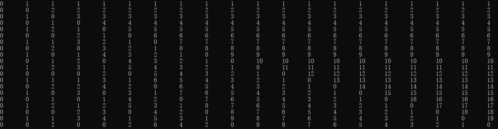

# 美团 2021 校招笔试-编程题(通用编程试题,第 5 场)

## 1

在小美的国家，任何一篇由英文字母组成的文章中，如果大小写字母的数量不相同会被认为文章不优雅。

现在，小美写了一篇文章，并且交给小团来修改。小美希望文章中的大小写字母数量相同，所以她想让小团帮她把某些小写字母改成对应的大写字母，或者把某些大写字母改成对应的小写字母，使得文章变得优雅。

小美给出的文章一定是由偶数长度组成的，她想知道最少修改多少个字母，才能让文章优雅。

本题知识点

Java 工程师 C++工程师 前端工程师 安卓工程师 iOS 工程师 算法工程师 大数据开发工程师 美团 2021

讨论

[零葬](https://www.nowcoder.com/profile/75718849)

统计一下大写字母的个数，文章长度-大写字母的个数=小写字母的个数。假设大写字母比小写字母多，每修改一个大写字母为小写字母，大写字母与小写字母的数量差距就减小了 2，因此 修改次数=(大写字母个数-小写字母个数)/2；如果小写字母比大写字母多，那 修改次数=(小写字母个数-大写字母个数)/2。统一一下就可以写成 修改次数=abs(大写字母个数-小写字母个数)/2。当然，统计小写字母的个数也可以~ ```cpp
import java.io.BufferedReader;
import java.io.InputStreamReader;
import java.io.IOException;

public class Main {
    public static void main(String[] args) throws IOException {
        BufferedReader br = new BufferedReader(new InputStreamReader(System.in));
        String paper = br.readLine().trim();
        int n = paper.length();
        int countUpper = 0;
        for(int i = 0; i < n; i++){
            char c = paper.charAt(i);
            if(c >= 65 && c <= 90) countUpper ++;
        }
        System.out.println(Math.abs(2*countUpper - n)/2);
    }
}
``` 

发表于 2021-03-02 16:37:52

* * *

[柠致](https://www.nowcoder.com/profile/449516875)

```cpp
function level(s) {
    let low = 0
    let up = 0
    for(let i=0; i<s.length; i++) {
        if(s.charCodeAt(i) >= 97 && s.charCodeAt(i) <= 122) {
            low += 1
        } else {
            up += 1
        }
    }
    // 核心式子
    return Math.abs(low - up) / 2
}

var str = readline()

console.log( level(str) )
```

发表于 2021-08-15 21:05:09

* * *

[牛客 213998571 号](https://www.nowcoder.com/profile/213998571)

```cpp
#全都转换成小写，数数变了几个就行啦。反正字符串没多长。
a = input()
b = str.lower(a)
count = 0
for i in range(len(a)):
    if a[i] == b[i]:
        count +=1
print(int(abs((len(a)/2)-count)))
```

发表于 2021-03-23 18:54:49

* * *

## 2

小团有一个序列 a  ，下标从 1  开始直到 n  ，分别为  。现在，小团定义了以下式子： 

现在小团想让小美回答

的值

其中， 代表异或运算

请你帮助小美。

小提示：

  本题知识点

Java 工程师 C++工程师 前端工程师 安卓工程师 iOS 工程师 算法工程师 大数据开发工程师 美团 2021

讨论

[零葬](https://www.nowcoder.com/profile/75718849)

首先我们要明白一个事实，一个数和**0**进行异或就是它本身，而一个数和自己异或就是**0**。很显然，异或操作是满***换律的，题目要求我们计算的式子一定包含所有的***a***[***i***]进行异或，那不妨在输入数组 ***a ***的时候先把这个值算出来，这样我们就只剩下一堆余数要异或了。写一个遍历程序看一下这些余数 ***i % j*** 有什么规律：
主对角线及其以上的规律很明显，我们再观察一下主对角线及其以上的这个模式在一列中能重复多少遍。对于第**i**列，主对角线及其以上的元素有**i**个，所以这个模式能重复**n/i**次。如果这个值为偶数，那这些**0~i-1**的循环异或完肯定就为**0**了，剩下的**n%i**个数再异或就得到这一列的异或结果；假如这个值为奇数，那么之前出现的偶数次**0~i-1**的循环异或完就为**0**了，还余下一次**0~i-1**的异或和**1~****n%i**的异或，它两再异或就得到了这一列的异或结果。因此得到如下规律：(1) 如果 **n / i** 为偶数，异或结果为**1²^...^(n%i)**。(2) 如果 **n / i** 为奇数，异或结果为**1²^...^(n%i)⁰^****1²^...^(i-1)**。 ```cpp
import java.io.BufferedReader;
import java.io.InputStreamReader;
import java.io.IOException;

public class Main {
    public static void main(String[] args) throws IOException {
        BufferedReader br = new BufferedReader(new InputStreamReader(System.in));
        int n = Integer.parseInt(br.readLine().trim());
        String[] strA = br.readLine().trim().split(" ");
        int[] a = new int[n + 1];
        int[] multi = new int[n + 1];    // multi[i]表示 0¹²^...^i
        int res = 0;
        // 先把所有的 a[i]进行异或
        for(int i = 1; i <= n; i++) {
            a[i] = Integer.parseInt(strA[i - 1]);
            res ^= a[i];
            multi[i] = multi[i - 1]^i;
        }
        for(int i = 1; i <= n; i++){
            if((n/i) % 2 == 0)
                res ^= multi[n % i];
            else
                res ^= multi[n % i] ^ multi[i - 1];
        }
        System.out.println(res);
    }
}
``` 

编辑于 2021-03-03 00:01:08

* * *

[柠致](https://www.nowcoder.com/profile/449516875)

js 版本，不知道为啥只通过一个测试用例，有大佬看看没

```cpp
var str = readline()
var str1 = readline()
var n = parseInt(str.trim())
var a = str1.trim().split(' ')
var res = 0
var multi = [0]  // multi[i]表示 0¹²^...^i

for(var i=1; i<=n; i++) {
    res = res ^ parseInt(a[i-1])
    multi[i] = multi[i-1] ^ i
}

// 找出（i%j）这个方形矩阵（N * N）的规律
for(var i=1; i<=n; i++) {
    if((n/i)%2 == 0) {
        res = res ^ multi[n%i]
    } else {
        res = res ^ multi[i-1] ^ multi[n%i]
    }
}

console.log( res )
```

发表于 2021-08-15 21:03:03

* * *

[DownUp 子](https://www.nowcoder.com/profile/202242673)

根据 [零葬](https://www.nowcoder.com/profile/75718849)题解给出 Python 版本
重点在于：

> 因此得到如下规律：
> (1) 如果 n / i 为偶数，异或结果为 1²^...^(n%i)。
> (2) 如果 n / i 为奇数，异或结果为 1²^...^(n%i)⁰¹²^...^(i-1)。

然后预先计算出前缀和就可以降低时间复杂度。

```cpp
while True:
    try:
        n = int(input())
        nums = [int(i) for i in input().split()]
        ans = 0

        # 计算前缀和
        pre = [0] * (n + 1)
        for i in range(1, n + 1):
            pre[i] = pre[i - 1] ^ i

        for i in range(1, n + 1):
            ans ^= nums[i - 1] # ai 部分计算进去
            if (n / i) % 2 == 0: # 异或结果规律的运用
                ans ^= pre[n % i]
            else:
                ans ^= pre[n % i] ^ pre[i - 1]

        print(ans)
    except:
        break

```

发表于 2021-08-14 15:48:56

* * *

## 3

A 国和 B 国正在打仗，他们的目的是 n 块土地。现在，A 国和 B 国暂时休战，为了能合理分配这一些土地，AB 国开始协商。

A 国希望得到这 n 块土地中的 p 块土地，B 国希望得到这 n 块土地中的 q 块土地。每个国家都将自己希望得到的土地编号告诉了小团和小美——两位战争调和人。

你需要帮小团和小美计算，有多少块土地是只有 A 国想要的，有多少块土地是只有 B 国想要的，有多少块土地是两个国家都想要的。

本题知识点

Java 工程师 C++工程师 前端工程师 安卓工程师 iOS 工程师 算法工程师 大数据开发工程师 美团 2021

讨论

[零葬](https://www.nowcoder.com/profile/75718849)

分别将 A 国和 B 国想要的土地编号存入两个集合中，然后计算交集的数量，就是两个国家都想要的土地数量。A 集合的大小减去交集数量就是只有 A 想要的土地数量，B 集合的大小减去交集数量就是只有 B 想要的土地数量。

```cpp
import java.io.BufferedReader;
import java.io.InputStreamReader;
import java.io.IOException;
import java.util.HashSet;

public class Main {
    public static void main(String[] args) throws IOException {
        BufferedReader br = new BufferedReader(new InputStreamReader(System.in));
        String[] params = br.readLine().trim().split(" ");
        int n = Integer.parseInt(params[0]);
        int p = Integer.parseInt(params[1]);
        int q = Integer.parseInt(params[2]);
        HashSet<Integer> wantedA = new HashSet<>();
        HashSet<Integer> wantedB = new HashSet<>();
        params = br.readLine().trim().split(" ");
        for(int i = 0; i < params.length; i++)
            wantedA.add(Integer.parseInt(params[i]));
        // 计算交集的数量
        int commonCount = 0;
        params = br.readLine().trim().split(" ");
        for(int i = 0; i < params.length; i++){
            wantedB.add(Integer.parseInt(params[i]));
            if(wantedA.contains(Integer.parseInt(params[i]))) commonCount ++;
        }
        System.out.println(wantedA.size() - commonCount + " " + (wantedB.size() - commonCount) + " " + commonCount);
    }
}
```

发表于 2021-03-02 18:01:15

* * *

[柠致](https://www.nowcoder.com/profile/449516875)

JS 版本，使用双指针，降低时间复杂度

```cpp
var str1 = readline()
var str2 = readline()
var str3 = readline()

let p = parseInt( str1.split(' ')[1] ) - 1
let q = parseInt( str1.split(' ')[2] ) - 1

const A = str2.split(' ').map(v => parseInt(v))
const B = str3.split(' ').map(v => parseInt(v))
A.sort((a,b) => a-b)
B.sort((a,b) => a-b)

let a = 0, b = 0, c = 0
while(p>=0 && q>=0) {
    if(A[p] === B[q]) {
        c++
        p--
        q--
    } else if(A[p] > B[q]) {
        p--
        a++
    } else {
        q--
        b++
    }
}
if(p>=0) {
    a += p+1
} else if(q>=0) {
    b += q+1
}

console.log(a, b, c)

```

发表于 2021-08-15 21:06:37

* * *

[knight/](https://www.nowcoder.com/profile/854181130)

**思路**：只需要统计两者都要的地的数量，然后做减法就可得到只有 A/B 要的地。

```cpp
import java.util.*;
import java.lang.*;
import java.io.*;

public class Main{
    public static void main(String[] args) throws IOException{
        BufferedReader br = new BufferedReader(new InputStreamReader(System.in));
        String[] params = br.readLine().trim().split(" ");
        int n = Integer.parseInt(params[0]);
        int p = Integer.parseInt(params[1]);
        int q = Integer.parseInt(params[2]);
        // 记录 A 是否要某块地
        boolean[] wanted = new boolean[n+1];
        int[] a = new int[p+1];
        int[] b = new int[q+1];
        params = br.readLine().trim().split(" ");
        for(int i=1;i<=p;++i){
            a[i] = Integer.parseInt(params[i-1]);
            wanted[a[i]] = true;
        }
        params = br.readLine().trim().split(" ");
        int both=0;
        for(int i=1;i<=q;++i){
            b[i] = Integer.parseInt(params[i-1]);
            // 如果 B 要的 A 也要，就是两者都想要
            if(wanted[b[i]]){
                both++;
            }
        }
        // onlyA = p-both
        // onlyB = q-both
        System.out.println((p-both)+" "+(q-both)+" "+both);
    }
}
```

发表于 2022-03-07 10:58:06

* * *

## 4

在小团的公司中，有 n 位员工。除了最高领导——小团外，每位员工有且仅有一位直接领导。所以，公司内从属关系可以看成一棵树。

现在，公司接到一个项目，需要重新划分这 n 位员工的从属关系。新的划分描述如下：

1.每个人要么没有下属，要么有至少两个直接下属（即至少有两人的直接领导为这个人）

2.第 i 个人的下属（包括自己）有恰好个。

请注意，直接下属和下属（包括自己）可分别看做树上点的"儿子"和"子树"。

请问是否存在这么一种关系？注意，输入不会给出最高领导的编号。

本题知识点

Java 工程师 C++工程师 前端工程师 安卓工程师 iOS 工程师 算法工程师 大数据开发工程师 美团 2021

讨论

[knight/](https://www.nowcoder.com/profile/854181130)

根据前面这位朋友[牛客 633068805](https://www.nowcoder.com/profile/633068805) 的 C++版本而来的 java 版本。（写注释是个好习惯啊）
简单说下我理解的**思路**：
（1）先用一些值的范围条件过滤一下输入的数，代码注释中的 1,2,3，但是 3 我没想明白为什么（去掉也不影响最终结果）;
（2）对节点从小到大排序，最前面的一定是为 1 的叶子节点；
（3）从第一个非叶子节点开始，从前面的节点中寻找是否存在它的子节点组合（子节点个数 cnt>=2）；

> **难点**：我觉得这题的难点就在于**如何回溯**，因为这里的回溯不是简单的单层回溯，涉及到两层：
> （1）对于单个节点来说，寻找可能的子节点组合会回溯；
> （2）对于整个节点数组来说，也涉及到一层回溯：假如前面的节点 A 找到了第一个满足条件的子节点组合，但是后面遍历到节点 B 时找不到了，但其实对于节点 A 除了找到的第一个还有另外的子节点组合，从这个组合遍历下去可达到最终所有都满足。那么如何从 B 不满足的状态回溯到 A 可以继续寻找下一个可能满足组合的状态？

> **解决办法**：我称之为**“双环递归”**(自己瞎取的名字)，我们一般见到的递归都是一个函数，自己调用自己，画个图就是一个环，这里使用了两个函数，dfs 可以调用 findSum,findSum 可以调用调用自身和 dfs，画图出来就有两个环。就很好地解决了上面的难点。（这种我也是第一次见，学到了！）

> 其他细节：
> 其实 findSum 就是回溯算法的模板写法，但是这里加了个“树层”去重用来**剪枝**，如果不加的话会超时。
> 例子：
> [1,1,1,1,3,3,4,8]
> 找节点 4 的子节点时，前面第一个 3 遍历完后不符合，然后遍历到第二个 3 的时候，前面的 3 肯定遍历过了，如果相等且 used[i-1]=false，说明这个数不能组成有效组合，直接跳过（递归树的同一层去重，这里的作用是剪枝）

ps:关于回溯算法和去重不太熟练的同学可以看[这位大佬的题解](https://leetcode-cn.com/problems/combinations/solution/dai-ma-sui-xiang-lu-dai-ni-xue-tou-hui-s-0uql/)

```cpp
import java.io.IOException;
import java.util.ArrayList;
import java.util.Arrays;
import java.util.List;
import java.util.Scanner;

public class Main{
    // 节点是否已经被使用，即是否成为了某个节点的子节点
    static boolean[] used;
    static boolean flag;
    static int n;
    static int[] arr;
    public static void main(String[] args) throws IOException {
        Scanner sc = new Scanner(System.in);
        while(sc.hasNext()){
            n = sc.nextInt();
            arr = new int[n];
            used = new boolean[n];
            flag = true;
            for(int i=0;i<n;++i){
                arr[i] = sc.nextInt();
                // 1.不能有<1 或 2 存在
                if(arr[i] < 1 || arr[i]==2){
                    flag = false;
                }
            }
            Arrays.sort(arr);
            // 2.最大的一个数必须为 n
            if (!flag || arr[n-1]!=n){
                System.out.println("NO");
                continue;
            }
            int idx=0;
            // 找到第一个非叶子节点的下标
            while(idx<n && arr[idx]==1){
                ++idx;
            }
            // 3.第一个非叶子节点的小标 idx>=n/2
            if(idx < n/2){
                System.out.println("NO");
                continue;
            }
            flag = false;
            // 4.如果输入满足以上条件，则可能存在这种关系
            dfs(idx);
            if(flag){
                System.out.println("YES");
            }else{
                System.out.println("NO");
            }

        }
    }

    // idx 为当前遍历节点下标，需要找它的子节点
    public static void dfs(int idx){
        if(idx >= n){
            flag = true;
            return;
        }
        // arr[idx]-1 是去掉本身
        findSum(0,idx,0,arr[idx]-1);
    }

    // 从[start,end),未使用的节点节点中寻找是否有和为 target 的且个数 cnt>=2 的（因为子节点个数>=2）
    public static void findSum(int start,int end,int cnt,int target){
        if(target == 0){
            // 当前节点找到符合条件的子节点，遍历下一个节点
            if(cnt >= 2){
                dfs(end+1);
            }
            return;
        }

        for(int i=start;i<end && arr[i]<=target;++i){
            if(used[i]){
                continue;
            }
            // 剪枝
            if(i>0 && arr[i]==arr[i-1] && !used[i-1]){
                continue;
            }
            used[i] = true;
            // 回溯
            findSum(i+1,end,cnt+1,target-arr[i]);
            used[i] = false;
        }
    }
}
```

发表于 2022-03-07 17:22:41

* * *

[牛客 633068805 号](https://www.nowcoder.com/profile/633068805)

```cpp
#include <stdio.h>
#include <algorithm>
#include <string.h>

using namespace std;

const int maxn = 30;

int n, a[maxn];

bool ans, used[maxn];

void dfs(int t);

void solve(int s, int e, int c, int aa)
{
	if (aa == 1)
	{
		if (c > 1) dfs(e + 1);
		return;
	}
	for (int i = s; i < e; ++i)
	{
		if (a[i] + 1 > aa) break;
		if (used[i]) continue;
		if (i > 0 && a[i] == a[i - 1] && !used[i - 1]) continue;
		used[i] = true;
		solve(i + 1, e, c + 1, aa - a[i]);
		if (ans) return;
		used[i] = false;
	}
}

void dfs(int t)
{
	if (t >= n) 
	{
		ans = true;
		return;
	}
	solve(0, t, 0, a[t]);
}

int main()
{
	while (scanf("%d", &n) != EOF)
	{
		ans = true;
		for (int i = 0; i < n; ++i)
		{
			scanf("%d", &a[i]);
			if (a[i] < 1)
				ans = false;
		}
		sort(a, a + n);
		if (!ans || a[n - 1] != n) 
		{
			printf("NO\n");
			continue;
		}
		int i = 0;
		for (; i < n; ++i)
			if (a[i] > 1) break;
		if (i < n / 2)
		{
			printf("NO\n");
			continue;
		}
		memset(used, false, sizeof(used));
		ans = false;
		dfs(i);
		if (ans) printf("YES\n");
			else printf("NO\n");
	}
	return 0;	
} 
```

发表于 2021-03-26 23:32:53

* * *

[1024coder](https://www.nowcoder.com/profile/4024311)

```cpp
import java.util.Scanner;
import java.util.Arrays;
public class Main {
    public static void main(String[] args) {
        Scanner scanner = new Scanner(System.in);
        while (scanner.hasNext()) {
            int n = scanner.nextInt();
            int[] arr = new int[n];
            boolean flag = true;
            int sum = 0;
            for (int i = 0; i < n; i++) {
                arr[i] = scanner.nextInt();
                sum += arr[i];
                if (arr[i] == 2) {
                    flag = false;
                }
            }
            if (!flag) {
                System.out.println("NO");
                continue;
            }
            sum -= n;
            if (sum == n - 1) {
                System.out.println("YES");
            } else {
                System.out.println("NO");
            }
        }
    }
}
```

简单说下思路，满足条件 1，则每组数据中，不能有值为 2（要么没有下属-值为 1， 要么 2 个及以上- 大于 2）满足条件 2，则每棵树一共有（a1+a2+...+an-n）条边，由于是一棵树，所以边的个数 = 节点的个数 -1 

发表于 2021-03-09 11:48:13

* * *