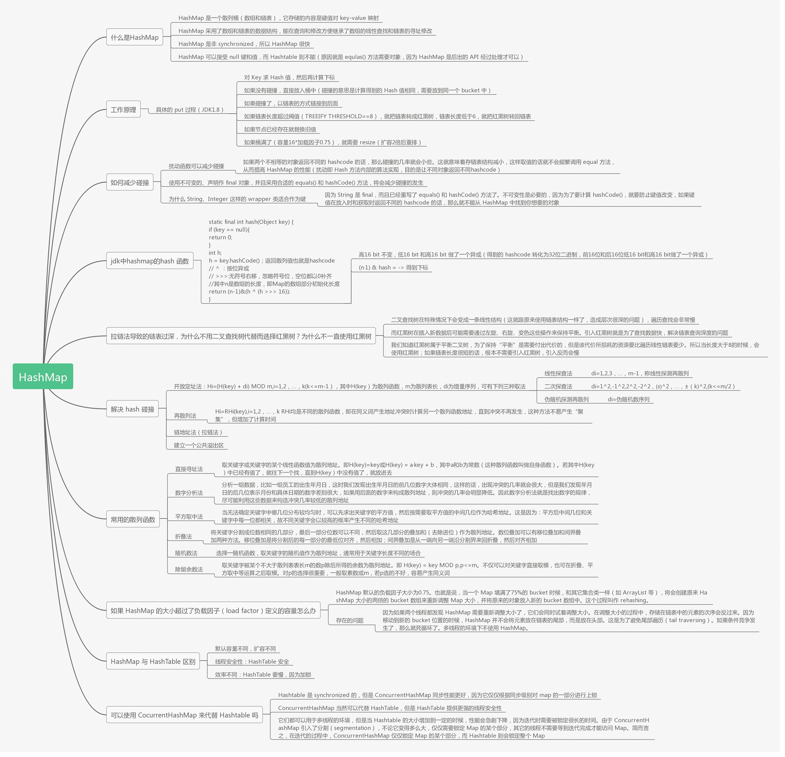
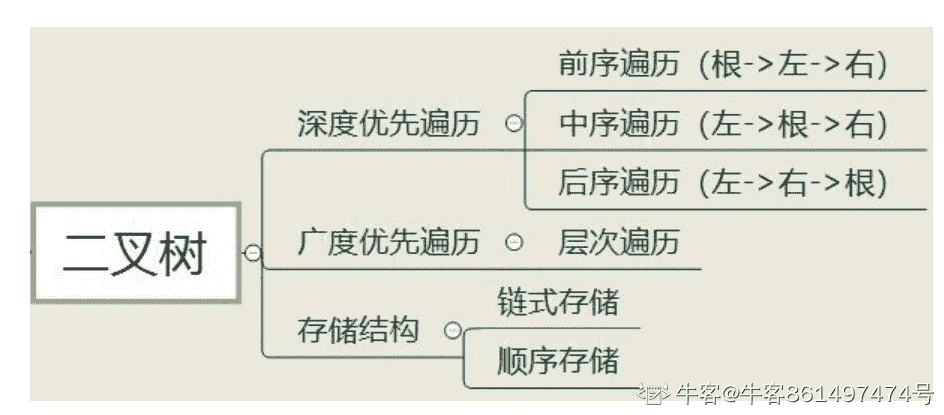

# 远景智能-2021 秋季招聘软件技术笔试题（第一批）

## 1

下列哪两个数据结构，同时具有较高的查找和删除性能？（）

正确答案: C D   你的答案: 空 (错误)

```cpp
有序数组
```

```cpp
有序链表
```

```cpp
AVL 树
```

```cpp
Hash 表
```

本题知识点

哈希 *链表 *树 数组 腾讯 Java 工程师 C++工程师 PHP 工程师 golang 工程师 前端工程师 安卓工程师 iOS 工程师 算法工程师 大数据开发工程师 运维工程师 安全工程师 数据库工程师 游戏研发工程师 测试开发工程师 测试工程师 2021 远景能源有限公司** **讨论

[金珠翠](https://www.nowcoder.com/profile/294561)

解析：几种常见的数据结构的操

  查看全部)

编辑于 2015-02-04 21:39:10

* * *

[nagashi](https://www.nowcoder.com/profile/515581920)

AVL 又叫平衡的二叉查找树，因为平衡所以二叉树树高被严格限制，从而使得查找高效，但是一旦插入或者删除元素就可能会破坏平衡结构，要把树调整回平衡状态的复杂度不低。另外一种就是红黑树，红黑树对树高没有严格限制，红黑树的成树规则使得插入和删除后调整树的复杂度变低。红黑树应该可以说是 AVL 的改良版吧(个人理解)。

编辑于 2019-10-17 13:44:23

* * *

[淡如水](https://www.nowcoder.com/profile/276565)

avl 平衡二叉树

发表于 2015-08-29 16:00:54

* * *

## 2

下面属于构造散列（hash）函数的方法是

正确答案: A B C D   你的答案: 空 (错误)

```cpp
直接定址法
```

```cpp
数字分析法
```

```cpp
乘余取整法
```

```cpp
平方取中法
```

本题知识点

哈希 *迅雷 Java 工程师 C++工程师 PHP 工程师 golang 工程师 前端工程师 安卓工程师 iOS 工程师 算法工程师 大数据开发工程师 运维工程师 安全工程师 数据库工程师 游戏研发工程师 测试开发工程师 测试工程师 2021 远景能源有限公司* *讨论

[MyGoodHelper](https://www.nowcoder.com/profile/644326)

ABCDHash，一般  查看全部)

编辑于 2015-02-04 16:11:56

* * *

[程序猿 Go 师傅](https://www.nowcoder.com/profile/242025553)

请看常用的散列函数部分

编辑于 2019-10-21 16:58:39

* * *

[牛客-007](https://www.nowcoder.com/profile/394118)

答案：ABCD 常用构造散列函数的方法有：直接定址法，数字分析法，折叠法，平方取中法，乘余取整法
减去法，基数转换法，除留余数法，随机乘数法，字符串数值哈希法，旋转法，伪随机数法

发表于 2015-01-15 18:22:51

* * *

## 3

ArrayLists 和 LinkedList 的区别，下述说法正确的有？

正确答案: A B C D   你的答案: 空 (错误)

```cpp
ArrayList 是实现了基于动态数组的数据结构，LinkedList 基于链表的数据结构。
```

```cpp
对于随机访问 get 和 set，ArrayList 觉得优于 LinkedList，因为 LinkedList 要迭代器。
```

```cpp
对于新增和删除操作 add 和 remove，LinkedList 比较占优势，因为 ArrayList 要移动数据。
```

```cpp
ArrayList 的空间浪费主要体现在在 list 列表的结尾预留一定的容量空间，而 LinkedList 的空间花费则体现在它的每一个元素都需要消耗相当的空间。
```

本题知识点

Java

讨论

[StrongYoung](https://www.nowcoder.com/profile/649626)

我来说几句：A. ArrayList 是实现了基于动态数组的数据结构，LinkedList 基于链表的数据结构。  //**正确**，这里的所谓动态数组并不是那个“ 有多少元素就申请多少空间 ”的意思，通过查看源码，可以发现，这个动态数组是这样实现的，如果没指定数组大小，则申请默认大小为 10 的数组，当元素个数增加，数组无法存储时，系统会另个申请一个长度为当前长度 1.5 倍的数组，然后，把之前的数据拷贝到新建的数组。- ---------------------------------------------------------------------B. 对于随机访问 get 和 set，ArrayList 觉得优于 LinkedList，因为 LinkedList 要移动指针。//**正确**，ArrayList 是数组，所以，直接定位到相应位置取元素，LinkedLIst 是链表，所以需要从前往后遍历。-----------------------------------------------------------------------C. 对于新增和删除操作 add 和 remove，LinedList 比较占优势，因为 ArrayList 要移动数据。//**正确**，ArrayList 的新增和删除就是数组的新增和删除，LinkedList 与链表一致。-------------------------------------------------------------------------D. ArrayList 的空间浪费主要体现在在 list 列表的结尾预留一定的容量空间，而 LinkedList 的空间花费则体现在它的每一个元素都需要消耗相当的空间。//**正确**，因为 ArrayList 空间的增长率为 1.5 倍，所以，最后很可能留下一部分空间是没有用到的，因此，会造成浪费的情况。对于 LInkedList 的话，由于每个节点都需要额外的指针，所以，你懂的。--------------------------码字不易，如果您觉得对，请点个赞，如果不对，随便批^_^--------------------------

编辑于 2015-08-21 16:54:27

* * *

[闪客 sun](https://www.nowcoder.com/profile/7795730)

set 不是 add，不需要改变整个数组位置

发表于 2017-05-24 13:53:22

* * *

[肉肉的亲王](https://www.nowcoder.com/profile/8349783)

从实现角度来讲 C 是是错误的，对于 ArrayList 来说 add 是直接插入队尾的并不需要移动元素，就算加上扩容的代价，平均 add 效率也远高于 LinkedList，所以 LinkedList 只在中间元素的插入和删除效率上有优势。

发表于 2017-03-18 19:11:57

* * *

## 4

下面关于 ISO 网络参考模型分层及每一层功能描述错误的有？

正确答案: A B   你的答案: 空 (错误)

```cpp
物理层，在此层将数据分帧，并处理流控制
```

```cpp
数据链路层，为物理层提供连接，以便透明的传送比特流
```

```cpp
网络层，本层通过寻址来建立两个节点之间的连接，为源端的运输层送来的分组，选择合适的路由和交换节点
```

```cpp
运输层，常规数据递送－面向连接或无连接
```

```cpp
会话层，建立、管理和终止会话。
```

```cpp
表示层，主要用于处理两个通信系统中交换信息的表示方式。
```

本题知识点

网络基础 Java 工程师

讨论

[牛客-007](https://www.nowcoder.com/profile/394118)

  查看全部)

编辑于 2015-01-26 15:40:54

* * *

[yayamma](https://www.nowcoder.com/profile/270051)

**    物理层：**通过媒介传输比特,确定机械及电气规范（比特 Bit）

**    数据链路层**：将比特组装成帧和点到点的传递（帧 Frame）

**    网络层**：负责数据包从源到宿的传递和网际互连（包 PackeT）

**    传输层**：提供端到端的可靠报文传递和错误恢复（段 Segment）

**    会话层**：建立、管理和终止会话（会话协议数据单元 SPDU）

**    表示层**：对数据进行翻译、加密和压缩（表示协议数据单元 PPDU）

**    应用层**：允许访问 OSI 环境的手段（应用协议数据单元 APDU）

发表于 2015-09-16 14:26:40

* * *

[sweetsmile225](https://www.nowcoder.com/profile/4591450)

D 不对啊，OSI 在传输层提供的只有面向连接的服务，TCP/IP 模型在传输层才提供了两种

发表于 2018-04-05 15:04:01

* * *

## 5

JAVA 反射机制主要提供了以下哪些功能？

正确答案: A B C D   你的答案: 空 (错误)

```cpp
在运行时判断一个对象所属的类
```

```cpp
在运行时构造一个类的对象
```

```cpp
在运行时判断一个类所具有的成员变量和方法
```

```cpp
在运行时调用一个对象的方法
```

本题知识点

Java 2021 远景能源有限公司

讨论

[linko 解万](https://www.nowcoder.com/profile/225090)

Java 反射机制主要提供了以  查看全部)

编辑于 2014-12-30 20:30:20

* * *

[牛客-007](https://www.nowcoder.com/profile/394118)

ABCD 普通的 java 对象是通过 new 关键字把对应类的字节码文件加载到内存，然后创建该对象的。反射是通过一个名为 Class 的特殊类，用 Class.forName("className");得到类的字节码对象，然后用 newInstance()方法在虚拟机内部构造这个对象（针对无参构造函数）。也就是说反射机制让我们可以先拿到 java 类对应的字节码对象，然后动态的进行任何可能的操作，包括

*   在运行时判断任意一个对象所属的类
*   在运行时构造任意一个类的对象
*   在运行时判断任意一个类所具有的成员变量和方法
*   在运行时调用任意一个对象的方法

这些都是反射的功能。使用反射的主要作用是方便程序的扩展。

发表于 2015-01-09 10:23:50

* * *

[八岛栗子](https://www.nowcoder.com/profile/887525)

答案：A B C DJAVA 反射机制概念：JAVA 反射机制是在[运行状态](http://baike.baidu.com/view/627351.htm)中，对于任意一个类，都能够知道这个类的所有属性和方法；对于任意一个对象，都能够调用它的任意一个方法和属性；这种动态获取的信息以及动态调用对象的方法的功能称为 java 语言的反射机制。Java 反射机制主要提供了以下功能：     在运行时判断任意一个对象所属的类；    在运行时构造任意一个类的对象；    在运行时判断任意一个类所具有的[成员变量](http://baike.baidu.com/view/684821.htm)和方法；    在运行时调用任意一个对象的方法；    生成动态***。

发表于 2016-07-08 10:56:19

* * *

## 6

堆的形状是一棵（）。

正确答案: A   你的答案: 空 (错误)

```cpp
完全二叉树
```

```cpp
满二叉树
```

```cpp
二叉排序树
```

```cpp
平衡二叉树
```

本题知识点

树 堆 欢聚集团 2021 远景能源有限公司

讨论

[牛客-007](https://www.nowcoder.com/profile/394118)

答案：A 以最小堆为例，  查看全部)

编辑于 2015-01-12 15:47:54

* * *

[王俊超](https://www.nowcoder.com/profile/317978)

**A****完全二叉树**（深度为 k ，有 n 个结点的二叉树当且仅当其每一个结点都与深度为 k 的满二叉树中编号从 1 至 n 的结点一一对应时，称为完全二叉树。）

**满二叉树**（堆不保证节点的个数正好能构成满二叉树）

**二叉排序树**（最小堆只保证父节点比孩子节点小，并不是二叉排序树）

**平衡二叉树**（二叉平衡树肯定是一颗二叉排序树，堆不是二叉排序树）

编辑于 2015-07-30 16:01:30

* * *

[美团到店招聘](https://www.nowcoder.com/profile/3472441)

mark。平衡二叉树，就是 AVL 树，它是二叉搜索树的一个升级版。记住就好，不能想当然。

发表于 2017-02-21 19:39:25

* * *

## 7

在 Linux 系统，关于硬链接的描述正确的是（）

正确答案: B D   你的答案: 空 (错误)

```cpp
跨文件系统
```

```cpp
不可以跨文件系统
```

```cpp
为链接文件创建新的 i 节点
```

```cpp
链接文件的 i 节点与被链接文件的 i 节点相同
```

本题知识点

Linux

讨论

[牛客-007](https://www.nowcoder.com/profile/394118)

  查看全部)

编辑于 2015-01-30 11:01:08

* * *

[知莫若行](https://www.nowcoder.com/profile/846467)

硬链接与软链接的区别  From: http://baike.baidu.com/view/4328569.htm 在 Linux 的文件系统中，保存在磁盘分区中的文件不管是什么类型都给它分配一个编号，称为索引节点号 inode 。**软连接，其实就是新建立一个文件**，这个文件就是专门用来指向别的文件的（那就和 windows 下的快捷方式的那个文件有很接近的意味）。软链接产生的是一个新的文件，但这个文件的作用就是专门指向某个文件的，删了这个软连接文件，那就等于不需要这个连接，和原来的存在的实体原文件没有任何关系，但删除原来的文件，则相应的软连接不可用（cat 那个软链接文件，则提示“没有该文件或目录“）**硬连接是不会建立 inode 的**，他只是在文件原来的 inode link count 域再增加 1 而已，也因此**硬链接是不可以跨越文件系统的**。相反都是软连接会重新建立一个 inode，当然 inode 的结构跟其他的不一样，他只是一个指明源文件的字符串信息。一旦删除源文件，那么软连接将变得毫无意义。而硬链接删除的时候，系统调用会检查 inode link count 的数值，如果他大于等于 1，那么 inode 不会被回收。因此文件的内容不会被删除。**硬链接实际上是为文件建一个别名**，链接文件和原文件实际上是同一个文件。可以通过 ls -i 来查看一下，这**两个文件的 inode 号是同一个**，说明它们是同一个文件；而软链接建立的是一个指向，即链接文件内的内容是指向原文件的指针，它们是两个文件。软链接可以跨文件系统，硬链接不可以；软链接可以对一个不存在的文件名(filename)进行链接（当然此时如果你 vi 这个软链接文件，linux 会自动新建一个文件名为 filename 的文件）,硬链接不可以（其文件必须存在，inode 必须存在）；软链接可以对目录进行连接，硬链接不可以。两种链接都可以通过命令 ln 来创建。ln 默认创建的是硬链接。使用 -s 开关可以创建软链接。

发表于 2015-09-15 17:48:29

* * *

[路人甲要找到好工作](https://www.nowcoder.com/profile/955706)

B 和 D。 硬连接实际上是为文件建一个别名，链接文件和源文件实际上同一个文件。使用 ls -i 就可以得到两个文件的 inode 号是同一个。

发表于 2015-01-22 13:39:58

* * *

## 8

下面代码的输出结果是什么？

```cpp
public class ZeroTest {
    public static void main(String[] args) {
     try{
       int i = 100 / 0;
       System.out.print(i);
      }catch(Exception e){
       System.out.print(1);
       throw new RuntimeException();
      }finally{
       System.out.print(2);
      }
      System.out.print(3);
     }
 }
```

正确答案: D   你的答案: 空 (错误)

```cpp
3
```

```cpp
123
```

```cpp
1
```

```cpp
12
```

本题知识点

Java C++工程师 前端工程师 iOS 工程师 算法工程师 运维工程师 数据库工程师 游戏研发工程师 测试开发工程师 2021 远景能源有限公司

讨论

[sky_boy](https://www.nowcoder.com/profile/673248)

1、int i = 100 /   查看全部)

编辑于 2015-12-29 14:35:20

* * *

[重塑辉煌](https://www.nowcoder.com/profile/554149)

还是需要理解 Try...catch...finally 与直接 throw 的区别：try catch 是直接处理，处理完成之后程序继续往下执行，throw 则是将异常抛给它的上一级处理，程序便不往下执行了。本题的 catch 语句块里面，打印完 1 之后，又抛出了一个 RuntimeException，程序并没有处理它，而是直接抛出，因此执行完 finally 语句块之后，程序终止了

发表于 2015-09-05 20:07:32

* * *

[波儿胖](https://www.nowcoder.com/profile/124777)

首先执行 try，遇到算术异常，抛出，执行 catch，打印 1，然后抛出 RuntimeException，缓存异常，执行 finally，打印 2，然后抛出 RuntimeException。如果 catch 中没有抛出 RuntimeException，则执行结果为 123。

发表于 2015-09-04 11:22:49

* * *

## 9

在多级存储体系中，“cache——主存”结构的作用是解决什么问题

正确答案: D   你的答案: 空 (错误)

```cpp
主存容量不足
```

```cpp
主存与辅存速度不匹配
```

```cpp
辅存与 CPU 速度不匹配
```

```cpp
主存与 CPU 速度不匹配
```

本题知识点

Java 工程师 C++工程师 PHP 工程师 golang 工程师 前端工程师 安卓工程师 iOS 工程师 算法工程师 大数据开发工程师 运维工程师 安全工程师 数据库工程师 游戏研发工程师 测试开发工程师 测试工程师 2021 远景能源有限公司

讨论

[斯坦尼斯苏夫斯基](https://www.nowcoder.com/profile/157350398)

高速缓冲存储器

发表于 2021-03-08 19:16:51

* * *

## 10

交换机工作在 OSI 七层的哪一层？（ ）

正确答案: B   你的答案: 空 (错误)

```cpp
一层
```

```cpp
二层
```

```cpp
三层
```

```cpp
三层以上
```

本题知识点

网络基础 Java 工程师 C++工程师 PHP 工程师 golang 工程师 前端工程师 安卓工程师 iOS 工程师 算法工程师 大数据开发工程师 运维工程师 安全工程师 数据库工程师 游戏研发工程师 测试开发工程师 测试工程师 2021 远景能源有限公司

讨论

[lock-free](https://www.nowcoder.com/profile/113156)

物理层：中继器，集线器，双绞线数据链路层：网桥，以太网交换机，网卡（一半物理层，一半数据链路层）网络层：路由器，三层交换机传输层：四层交换机（常用作负载均衡），网关：对高层协议（包括传输层及更高层次）进行转换的网间连接器参考：http://www.yacer.cn/jishu/doc-147.html

编辑于 2015-10-05 13:59:14

* * *

[夏雨天](https://www.nowcoder.com/profile/710633)

选择 B：各网络设备工作的层：网络设备有中继器、网桥、路由器和网关等。中继器（Repeater)  中继器是局域网互连的最简单设备，它工作在 OSI 体系结构的物理层，它接收并识别网络信号，然后再生信号并将其发送到网络的其他分支上。网桥（Birdge)  网桥工作于 OSI 体系的数据链路层。所以 OSI 模型数据链路层以上各层的信息对网桥来说是毫无作用的。路由器（Router)  路由器工作在 OSI 体系结构中的网络层，这意味着它可以在多个网络上交换和路由数据数据包。桥由器（Brouter)  Brouter 是网桥和路由器的合并。网关（Gatway)  网关把信息重新包装的目的是适应目标环境的要求。 网关能互连异类的网络，  网关从一个环境中读取数据，剥去数据的老协议，然后用目标网络的协议进行重新包装。 网关的典型应用是网络专用服务器。交换机（switch） 2 层和 3 层都有，但多为链路层设备（二层交换机），采用存储转发的形式来交换报文。

发表于 2015-08-29 09:44:07

* * *

[chenchenchen](https://www.nowcoder.com/profile/894679)

B,交换机多为链路层设备（二层交换机），采用存储转发的形式来交换报文。

发表于 2015-08-28 10:56:52

* * *

## 11

同一进程的各个线程可以共享哪个内容？

正确答案: B   你的答案: 空 (错误)

```cpp
寄存器内容
```

```cpp
堆
```

```cpp
栈
```

```cpp
线程私有数据
```

本题知识点

操作系统

讨论

[小鱼也要飞](https://www.nowcoder.com/profile/898983)

线程和进程资源比较

| 进程占有的资源 | 线程占有的资源 |
| 地址空间   全局变量   打开的文件   子进程   信号量   账户信息 | 栈   寄存器   状态   程序计数器 |

发表于 2015-09-07 22:04:09

* * *

[NorainsLee](https://www.nowcoder.com/profile/395264)

线程占有的都是不共享的：栈   、 寄存器、 状态、 程序计数器

发表于 2015-09-07 22:09:23

* * *

[牛客 943974 号](https://www.nowcoder.com/profile/943974)

**堆：　是大家共有的空间，分全局堆和局部堆。全局堆就是所有没有分配的空间，局部堆就是用户分配的空间。堆在操作系统对进程初始化的时候分配，运行过程中也可以向系统要额外的堆，但是记得用完了要还给操作系统，要不然就是内存泄漏。****栈：是个线程独有的，保存其运行状态和局部自动变量的。栈在线程开始的时候初始化，每个线程的栈互相独立，因此，栈是　thread safe 的。操作系统在切换线程的时候会自动的切换栈，就是切换　ＳＳ／ＥＳＰ寄存器。栈空间不需要在高级语言里面显式的分配和释放。**

发表于 2016-01-04 22:55:15

* * *

## 12

使用一个长度最大为 150 的队列，对满二叉树进行广度优先遍历时，能够容纳的二叉树的最大深度（第一层深度为 1）为（）

正确答案: A   你的答案: 空 (错误)

```cpp
8
```

```cpp
10
```

```cpp
9
```

```cpp
7
```

本题知识点

树 搜狗 2021 远景能源有限公司

讨论

[crisy1991](https://www.nowcoder.com/profile/851211)

满二叉树每一层的结点个数为（第一层深度为 1）第 n 层的节点数：2^(n-1),如果使用 150 的队列进行广度优先遍历，则每一层的节点数不大于 150，2^(n-1)≤150，2⁷=128,2⁸=256，n-1 最多为 7，所以最大深度 n=8.

发表于 2016-06-20 11:18:06

* * *

[DiWei](https://www.nowcoder.com/profile/996358)

广度优先遍历满二叉树，队列中最多会容纳满二叉树的最后一层即 2^(n-1)个。2⁷=128,所以是 8 层。

发表于 2015-11-27 10:57:37

* * *

[凌梦初辰](https://www.nowcoder.com/profile/9808981)

注意到题目中是广度优先遍历，出去一个进入其子节点，最大是最后一层，即 2^（n-1）那么多个节点。2^(n-1)<=150,n=7,所以最大是 n+1=8 层

发表于 2017-09-06 09:05:45

* * *

## 13

冯诺依曼工作方式的基本特点是 ____

正确答案: B   你的答案: 空 (错误)

```cpp
多指令流单数据流
```

```cpp
按地址访问并顺序执行指令
```

```cpp
堆栈操作
```

```cpp
存储器按内部选择地址
```

本题知识点

Java 工程师 C++工程师 PHP 工程师 golang 工程师 前端工程师 安卓工程师 iOS 工程师 算法工程师 大数据开发工程师 运维工程师 安全工程师 数据库工程师 游戏研发工程师 测试开发工程师 测试工程师 2021 远景能源有限公司

讨论

[小慕.](https://www.nowcoder.com/profile/6382640)

这太偏了把  哪个公司这么扯啊

发表于 2021-03-05 12:22:25

* * *

[牛客 106847388 号](https://www.nowcoder.com/profile/106847388)

无语

发表于 2021-03-13 16:24:28

* * *

## 14

数据库中存在学生表 S、课程表 C 和学生选课表 SC 三个表，它们的结构如下：S(S#，SN，SEX，AGE，DEPT)C(C#，CN)SC(S#，C#，GRADE)其中：S#为学号，SN 为姓名，SEX 为性别，AGE 为年龄，DEPT 为系别，C#为课程号，CN 为课程名，GRADE 为成绩。请检索选修课程号为 C2 的学生中成绩最高的学号。( )

正确答案: D   你的答案: 空 (错误)

```cpp
SELECT S#，SUM(GRADE)FROM SC WHERE GRADE＞=60 GROUP BY S# ORDER BY 2 DESC HAVING COUNT(*)＞＝4 WHERE C#=“C2” AND GRADE ＞=(SELECT GRADE FORM SC WHERE C#=“C2”)
```

```cpp
SELECT S# FORM SC WHERE C#=“C2” AND GRADE IN (SELECT GRADE FORM SC WHERE C#=“C2”)
```

```cpp
SELECT S# FORM SC WHERE C#=“C2” AND GRADE NOT IN (SELECT GRADE FORM SC WHERE C#=“C2”)
```

```cpp
SELECT S# FORM SC WHERE C#=“C2” AND GRADE＞＝ALL (SELECT GRADE FORM SC WHERE C#=“C2”)
```

本题知识点

数据库 Java 工程师 C++工程师 PHP 工程师 golang 工程师 前端工程师 安卓工程师 iOS 工程师 算法工程师 大数据开发工程师 运维工程师 安全工程师 数据库工程师 游戏研发工程师 测试开发工程师 测试工程师 2021 远景能源有限公司

讨论

[Circle&Z](https://www.nowcoder.com/profile/476805)

SQL 常用语句积累：

一、 SQL 基本语句

SQL 分类：

DDL —数据定义语言 (Create ， Alter ， Drop ， DECLARE)

DML —数据操纵语言 (Select ， Delete ， Update ， Insert)

DCL —数据控制语言 (GRANT ， REVOKE ， COMMIT ， ROLLBACK)

首先 , 简要介绍基础语句：

1 、说明：创建数据库

Create DATABASE database-name

2 、说明：删除数据库

drop database dbname

3 、说明：备份 sql server

--- 创建 备份数据的 device

USE master

EXEC sp_addumpdevice 'disk', 'testBack', 'c:\mssql7backup\MyNwind_1.dat'

--- 开始 备份

BACKUP DATABASE pubs TO testBack

4 、说明：创建新表

create table tabname(col1 type1 [not null] [primary key],col2 type2 [not null],..)

根据已有的表创建新表：

A ： create table tab_new like tab_old ( 使用旧表创建新表 )

B ： create table tab_new as select col1,col2 … from tab_old definition only

5 、说明：删除新表 drop table tabname

6 、说明：增加一个列

Alter table tabname add column col type

注：列增加后将不能删除。 DB2 中列加上后数据类型也不能改变，唯一能改变的是增加 varchar 类型的长度。

7 、说明：添加主键： Alter table tabname add primary key(col)

说明：删除主键： Alter table tabname drop primary key(col)

8 、说明：创建索引： create [unique] index idxname on tabname(col … .)

删除索引： drop index idxname

注：索引是不可更改的，想更改必须删除重新建。

9 、说明：创建视图： create view viewname as select statement

删除视图： drop view viewname

10 、说明：几个简单的基本的 sql 语句

选择： select * from table1 where 范围

插入： insert into table1(field1,field2) values(value1,value2)

删除： delete from table1 where 范围

更新： update table1 set field1=value1 where 范围

查找： select * from table1 where field1 like ’ %value1% ’ ---like 的语法很精妙，查资料 !

排序： select * from table1 order by field1,field2 [desc]

总数： select count * as totalcount from table1

求和： select sum(field1) as sumvalue from table1

平均： select avg(field1) as avgvalue from table1

最大： select max(field1) as maxvalue from table1

最小： select min(field1) as minvalue from table1

11 、说明：几个高级查询运算词

A ： UNION 运算符

UNION 运算符通过组合其他两个结果表（例如 TABLE1 和 TABLE2 ）并消去表中任何重复行而派生出一个结果表。当 ALL 随 UNION 一起使用时（即 UNION ALL ），不消除重复行。两种情况下，派生表的每一行不是来自 TABLE1 就是来自 TABLE2 。

B ： EXCEPT 运算符

EXCEPT 运算符通过包括所有在 TABLE1 中但不在 TABLE2 中的行并消除所有重复行而派生出一个结果表。当 ALL 随 EXCEPT 一起使用时 (EXCEPT ALL) ，不消除重复行。

C ： INTERSECT 运算符

INTERSECT 运算符通过只包括 TABLE1 和 TABLE2 中都有的行并消除所有重复行而派生出一个结果表。当 ALL 随 INTERSECT 一起使用时 (INTERSECT ALL) ，不消除重复行。

注：使用运算词的几个查询结果行必须是一致的。

12 、说明：使用外连接

A 、 left outer join ：

左外连接（左连接）：结果集几包括连接表的匹配行，也包括左连接表的所有行。

SQL: select a.a, a.b, a.c, b.c, b.d, b.f from a LEFT OUT JOIN b ON a.a = b.c

B ： right outer join:

右外连接 ( 右连接 ) ：结果集既包括连接表的匹配连接行，也包括右连接表的所有行。

C ： full outer join ：

全外连接：不仅包括符号连接表的匹配行，还包括两个连接表中的所有记录。

二、 SQL 子查询语句

1 、单行子查询

select ename,deptno,sal

from emp

where deptno=(select deptno from dept where loc='NEW YORK') ；

2 、多行子查询

SELECT ename,job,sal

FROM EMP

WHERE deptno in ( SELECT deptno FROM dept WHERE dname LIKE 'A%') ；

3 、多列子查询

SELECT deptno,ename,job,sal

FROM EMP

WHERE (deptno,sal) IN (SELECT deptno,MAX(sal) FROM EMP GROUP BY deptno) ；

4 、内联视图子查询

(1)SELECT ename,job,sal,rownum

FROM (SELECT ename,job,sal FROM EMP ORDER BY sal) ；

(2)SELECT ename,job,sal,rownum

FROM ( SELECT ename,job,sal FROM EMP ORDER BY sal)

WHERE rownum<=5 ；

5 、在 HAVING 子句中使用子查询

SELECT deptno,job,AVG(sal) FROM EMP GROUP BY deptno,job HAVING AVG(sal)>(SELECT sal FROM EMP WHERE ename='MARTIN') ；

6 、内连接 左连接 右连接举例；

select sys_user.user_id ,sys_user.user_code  from  sys_user inner join XZFW_BANJIE onsys_user.user_id=XZFW_BANJIE.userid

小例子：

select top 10 * from sys_user  where user_code not in (select  user_code  from sys_user where user_code like '%yzj%')

select top 2 * from (select top 2 *  from td.users order by us_username desc) users order by us_username desc

7 、删除约束语句：

alter   table   dbo.XZFW_SYS_USER   drop   CONSTRAINT  FK1772E1891324F678

8 、记录数查询

select count(user_pass) from sys_user

select count(*) from sys_user where user_code!='admin'

9 、在范围之间取值 ( between ... and .. 用法 )

select sys_user.user_id,sys_user.user_name,xzfw_shoujian.caseid from sys_user inner join xzfw_shoujian on sys_user.user_id=xzfw_shoujian.userid where user_id between 5 and 100

或 select * from sys_user  where user_id<10 and user_id>1

10 、 三表查询实例：（三张表为： USER_DETAILS ， Subject ， Score ）

select USER_DETAILS.USER_NAME,Subject.SubjectName,Score.Score from USER_DETAILS inner join Scoreon USER_DETAILS.USER_ID=Score.USER_ID inner join Subject on Score.SubjectID=Subject.SubjectIDwhere USER_DETAILS.USER_ID=1

常用查询举例：

select * from dbo.USER_DETAILS where USER_NAME='Cheers Li' and USER_POSITION='SQE'

select * from dbo.USER_DEPT

select * from dbo.USER_DETAILS

select top 3* from dbo.USER_DETAILS inner join dbo.USER_DEPT onUSER_DETAILS.USER_DEPT_ID=dbo.USER_DEPT.USER_DEPT_ID

insert into dbo.USER_DEPT (USER_DEPT_ID,USER_DEPT_NAME)values('QE_01','Software quality engineer')

update USER_DEPT set USER_DEPT_ID='QE_02' where USER_DEPT_NAME='Quality Control'

delete from dbo.USER_DEPT where USER_DEPT_ID='QE_01'

select dbo.USER_DETAILS.USER_NAME,dbo.USER_DETAILS.USER_AGE,dbo.USER_DEPT.USER_DEPT_NAME,USER_DEPT.USER_DEPT_ID fromdbo.USER_DETAILS right join dbo.USER_DEPT onUSER_DETAILS.USER_DEPT_ID=dbo.USER_DEPT.USER_DEPT_ID

select count(USER_NAME)from dbo.USER_DETAILS where USER_NAME='Cheers Li'

alter table USER_DEPT add Testcolumn char

alter table USER_DEPT drop column Testcolumn

select top 3* from(select top 3* from dbo.USER_DETAILS where USER_DEPT_ID='DEV_01' order byUSER_AGE desc)aa order by USER_ID desc

select * from dbo.USER_DETAILS where USER_NAME=(select max(USER_NAME) fromdbo.USER_DETAILS)

三、补充常用语句。

1\. select employees.employee_id,employees.first_name,employees.last_name,salary*(1+0.1) new_salary from hr.employees;

2\. select employee_id,first_name from hr.employees where first_name like 'B%';

3\. select count(*) from hr.employees where first_name like 'B%';

4\. select job_id,avg(salary),sum(salary),max(salary),count(*) from hr.employees group by job_id;

其次，大家来看一些不错的 sql 语句

1 、说明：复制表 ( 只复制结构 , 源表名： a 新表名： b) (Access 可用 )

法一： select * into b from a where 1<>1

法二： select top 0 * into b from a

2 、说明：拷贝表 ( 拷贝数据 , 源表名： a 目标表名： b) (Access 可用 )

insert into b(a, b, c) select d,e,f from b;

3 、说明：跨数据库之间表的拷贝 ( 具体数据使用绝对路径 ) (Access 可用 )

insert into b(a, b, c) select d,e,f from b in ‘具体数据库’ where 条件

例子： ..from b in '"&Server.MapPath(".")&"\data.mdb" &"' where..

4 、说明：子查询 ( 表名 1 ： a 表名 2 ： b)

select a,b,c from a where a IN (select d from b ) 或者 : select a,b,c from a where a IN (1,2,3)

5 、说明：显示文章、提交人和最后回复时间

select a.title,a.username,b.adddate from table a,(select max(adddate) adddate from table where table.title=a.title) b

6 、说明：外连接查询 ( 表名 1 ： a 表名 2 ： b)

select a.a, a.b, a.c, b.c, b.d, b.f from a LEFT OUT JOIN b ON a.a = b.c

7 、说明：在线视图查询 ( 表名 1 ： a )

select * from (Select a,b,c FROM a) T where t.a > 1;

8 、说明： between 的用法 ,between 限制查询数据范围时包括了边界值 ,not between 不包括

select * from table1 where time between time1 and time2

select a,b,c, from table1 where a not between 数值 1 and 数值 2

9 、说明： in 的使用方法

select * from table1 where a [not] in ( ‘值 1 ’ , ’值 2 ’ , ’值 4 ’ , ’值 6 ’ )

10 、说明：两张关联表，删除主表中已经在副表中没有的信息

delete from table1 where not exists ( select * from table2 where table1.field1=table2.field1 )

11 、说明：四表联查问题：

select * from a left inner join b on a.a=b.b right inner join c on a.a=c.c inner join d on a.a=d.d where .....

12 、说明：日程安排提前五分钟提醒

SQL: select * from 日程安排 where datediff('minute',f 开始时间 ,getdate())>5

13 、说明：一条 sql 语句搞定数据库分页

select top 10 b.* from (select top 20 主键字段 , 排序字段 from 表名 order by 排序字段 desc) a, 表名 b where b. 主键字段 = a. 主键字段 order by a. 排序字段

14 、说明：前 10 条记录

select top 10 * form table1 where 范围

15 、说明：选择在每一组 b 值相同的数据中对应的 a 最大的记录的所有信息 ( 类似这样的用法可以用于论坛每月排行榜 , 每月热销产品分析 , 按科目成绩排名 , 等等 .)

select a,b,c from tablename ta where a=(select max(a) from tablename tb where tb.b=ta.b)

16 、说明：包括所有在 TableA 中但不在 TableB 和 TableC 中的行并消除所有重复行而派生出一个结果表

(select a from tableA ) except (select a from tableB) except (select a from tableC)

17 、说明：随机取出 10 条数据

select top 10 * from tablename order by newid()

18 、说明：随机选择记录

select newid()

19 、说明：删除重复记录

Delete from tablename where id not in (select max(id) from tablename group by col1,col2,...)

20 、说明：列出数据库里所有的表名

select name from sysobjects where type='U'

21 、说明：列出表里的所有的

select name from syscolumns where id=object_id('TableName')

22 、说明：列示 type 、 vender 、 pcs 字段，以 type 字段排列， case 可以方便地实现多重选择，类似 select 中的 case 。

select type,sum(case vender when 'A' then pcs else 0 end),sum(case vender when 'C' then pcs else 0 end),sum(case vender when 'B' then pcs else 0 end) FROM tablename group by type

显示结果：

type vender pcs

电脑 A 1

电脑 A 1

光盘 B 2

光盘 A 2

手机 B 3

手机 C 3

23 、说明：初始化表 table1

TRUNCATE TABLE table1

24 、说明：选择从 10 到 15 的记录

select top 5 * from (select top 15 * from table order by id asc) table_ 别名 order by id desc

数据库基本理论整理：

通俗地理解三个范式

通俗地理解三个范式，对于数据库设计大有好处。在数据库设计中，为了更好地应用三个范式，就必须通俗地理解三个范式 ( 通俗地理解是够用的理解，并不是最科学最准确的理解 ) ：

第一范式： 1NF 是对属性的原子性约束，要求属性具有原子性，不可再分解；

第二范式： 2NF 是对记录的惟一性约束，要求记录有惟一标识，即实体的惟一性；

第三范式： 3NF 是对字段冗余性的约束，即任何字段不能由其他字段派生出来，它要求字段没有冗余。

没有冗余的数据库设计可以做到。但是，没有冗余的数据库未必是最好的数据库，有时为了提高运行效率，就必须降低范式标准，适当保留冗余数据。具体做法是：在概念数据模型设计时遵守第三范式，降低范式标准的工作放到物理数据模型设计时考虑。降低范式就是增加字段，允许冗余。

基本表及其字段之间的关系 , 应尽量满足第三范式。但是，满足第三范式的数据库设计，往往不是最好的设计。为了提高数据库的运行效率，常常需要降低范式标准：适当增加冗余，达到以空间换时间的目的。

〖例 2 〗：有一张存放商品的基本表，如表 1 所示。“金额”这个字段的存在，表明该表的设计不满足第三范式，因为“金额”可以由“单价”乘以“数量”得到，说明“金额”是冗余字段。但是，增加“金额”这个冗余字段，可以提高查询统计的速度，这就是以空间换时间的作法。

在 Rose 中，规定列有两种类型：数据列和计算列。“金额”这样的列被称为“计算列”，而“单价”和“数量”这样的列被称为“数据列”。

表 1 商品表的表结构

商品名称 商品型号 单价 数量 金额

电视机 29 吋 2500 40 100,000 我的 Github ^_^ (欢迎 follow): [`github.com/CircleZ3791117`](https://github.com/CircleZ3791117) 

编辑于 2018-02-09 15:43:55

* * *

[AimSteel](https://www.nowcoder.com/profile/204221)

SC 表：课程号 C#，S#学号，GRADE 成绩，找出课程号为 C2 中成绩 最高的学号 All：对所有数据都满足条件，整个条件才成立。All 方法中查询了 C2 课程号的所有成绩，对于 SC 表中 GRADE 全满足的条件就是最高成绩相等，所以查询出来的结果就是 C2 课程号中成绩最高的那一条数据。选择 DSELECT S# FORM SC WHERE C#=“C2” AND GRADE＞＝ALL (SELECT GRADE FORM SC WHERE C#=“C2”

发表于 2016-04-22 17:20:05

* * *

[omg1992](https://www.nowcoder.com/profile/110376)

这个题目没有错么？

发表于 2016-04-08 08:55:29

* * *

## 15

下面哪个不是线性表?

正确答案: D   你的答案: 空 (错误)

```cpp
循环链表
```

```cpp
队列
```

```cpp
栈
```

```cpp
关联数组
```

```cpp
空字符串数组
```

```cpp
双向链表
```

本题知识点

Java 工程师 C++工程师 PHP 工程师 golang 工程师 前端工程师 安卓工程师 iOS 工程师 算法工程师 大数据开发工程师 运维工程师 安全工程师 数据库工程师 游戏研发工程师 测试开发工程师 测试工程师 2021 远景能源有限公司

讨论

[岸似](https://www.nowcoder.com/profile/450031364)

1.  关联数组和数组类似，由以名称作为键的字段和方法组成。它包含标量数据，可用索引值来单独选择这些数据，和数组不同的是， 关联数组的**索引值**不是非负的整数而是**任意的标量**。
2.  这些标量称为 Keys，可以在以后用于检索数组中的数值。
3.  关联数组的元素**没有特定的顺序**，你可以把它们想象为一组卡片。每张卡片上半部分是索引而下半部分是数值。

编辑于 2021-03-08 22:39:09

* * *

## 16

假设某一虚拟存储系统采用先进先出（FIFO）页面淘汰算法，有一个进程在内存中占 3 页（开始时内存为空），当访问如下页面序号（1,2,3,1,2,4,2,3,5,3,4,5）后，会产生几次缺页？

正确答案: B   你的答案: 空 (错误)

```cpp
4
```

```cpp
5
```

```cpp
6
```

```cpp
7
```

本题知识点

Java 工程师 C++工程师 PHP 工程师 golang 工程师 前端工程师 安卓工程师 iOS 工程师 算法工程师 大数据开发工程师 运维工程师 安全工程师 数据库工程师 游戏研发工程师 测试开发工程师 测试工程师 2021 远景能源有限公司

讨论

[高 1999](https://www.nowcoder.com/profile/733686660)

初始内存为空访问 1，内存没有，缺页，添加，此时内存有 1 访问 2，内存没有，缺页，添加，此时内存有 1，2 访问 3，内存没有，缺页，添加，此时内存有 1，2，3 访问 1，内存有访问 2.   内存有访问 4，内存没有，缺页，根据 FIFO 原则，1 出 4 进，此时内存有 4，2，3 访问 2，内存有访问 3，内存有访问 5，内存没有，缺页，根据 FIFO 原则，2 出 5 进，此时内存有 4，5，3 访问 3，内存有访问 4，内存有访问 5，内存有综上所述，缺页次数为 5

发表于 2021-03-11 15:17:34

* * *

[是啊陈呐](https://www.nowcoder.com/profile/479713267)

| 页面走向 | 1 | 2 | 3 | 1 | 2 | 4 | 2 | 3 | 5 | 3 | 4 | 5 |
| 物理页 0 | 1 | 1 | 1 | 1 | 1 | 4 | 4 | 4 | 4 | 4 | 4 | 4 |
| 物理页 1  |   | 2 | 2 | 2 | 2 | 2 | 2 | 2 | 5 | 5 | 5 | 5 |
| 物理页 02  |   |   | 3 | 3 | 3 | 3 | 3 | 3 | 3 | 3 | 3 | 3 |
| 缺页与否 | y | y | y | n | n | y | n | n | y | n | n | n |

利用先进先出置换页面,共 5 次 y，5 次缺页，用 FIFO，前面 1,2,3 页进来的时候，分别产生一次缺页，在第 6 列，页面 4 来的时候替换掉第一进来的页面 1，一次缺页，在第 9 列，页面 5 进来时，替换掉第二进来的 2，一次缺页。

发表于 2021-03-14 17:41:28

* * *

## 17

若一棵完全二叉树有 768 个结点，则该二叉树中叶结点的个数是（ ）。

正确答案: C   你的答案: 空 (错误)

```cpp
257
```

```cpp
258
```

```cpp
384
```

```cpp
385
```

本题知识点

Java 工程师 C++工程师 PHP 工程师 golang 工程师 前端工程师 安卓工程师 iOS 工程师 算法工程师 大数据开发工程师 运维工程师 安全工程师 数据库工程师 游戏研发工程师 测试开发工程师 测试工程师 2021 远景能源有限公司

讨论

[Eclipse0827](https://www.nowcoder.com/profile/6072926)

倒数第二层最后一个有子节点的节点编号=768/2=384 也就是说，编号为 385~768 的节点都是叶子节点所以 总叶子节点个数=768-384=384

编辑于 2021-03-09 18:43:40

* * *

[不会真有人不僵硬吧](https://www.nowcoder.com/profile/572092048)

使用三元一次方程：

设：
有两个孩子的节点个数为 a；
有一个孩子的节点个数为 b；
没有孩子（即叶子结点）的节点个数为 c；
**由条件知：**
1\. a + b + c = 768；
2\. 由**完全二叉树**定义，可以知道只有一个孩子的节点**b 个数为 0 或 1，由于总节点个数为 768**，所以可以知道**b=1**；
3\. 除了叶子结点，**所有节点的个数**都对应一条边的个数，而边的个数，又是 **两个孩子的节点个数×2+一个孩子的节点个数×1**，即为 768-1 = a * 2 + b;

所以：

*   768-1 = a * 2 + b;
*   a + b + c = 768；
*   b = 1;

得到  **c = 384。**

编辑于 2021-03-04 10:46:41

* * *

[billows2929](https://www.nowcoder.com/profile/313440527)

最后一层的叶子节点数：768 - 511 = 257 倒数第二层的叶子节点数：256 - (257+1) / 2 = 127 总共叶子节点个数：257 + 127 = 384

发表于 2021-04-04 12:40:17

* * *

## 18

内部异常（内中断）可分为故障（fault）、陷阱（trap）和终止（abort）三类。下列有关内部异常的叙述中，错误的是（）。

正确答案: D   你的答案: 空 (错误)

```cpp
内部异常的产生与当前执行指令相关
```

```cpp
内部异常的检测由 CPU 内部逻辑实现
```

```cpp
内部异常的响应发生在指令执行过程中
```

```cpp
内部异常处理后返回到发生异常的指令继续执行
```

本题知识点

Java 工程师 C++工程师 PHP 工程师 golang 工程师 前端工程师 安卓工程师 iOS 工程师 算法工程师 大数据开发工程师 运维工程师 安全工程师 数据库工程师 游戏研发工程师 测试开发工程师 测试工程师 2021 远景能源有限公司

讨论

[zzzzz_zou](https://www.nowcoder.com/profile/131127443)

内中断不能屏蔽，必须立刻处理，但不一定是处理了跳回原位再次执行，也可能会跳过该指令

发表于 2021-03-13 16:31:05

* * *

## 19

对于顺序存储的线性表，访问结点和增加结点的时间复杂度为（）。

正确答案: C   你的答案: 空 (错误)

```cpp
O(n) O(n)
```

```cpp
O(n) O(1)
```

```cpp
O(1) O(n)
```

```cpp
O(1) O(1)
```

本题知识点

Java 工程师 C++工程师 PHP 工程师 golang 工程师 前端工程师 安卓工程师 iOS 工程师 算法工程师 大数据开发工程师 运维工程师 安全工程师 数据库工程师 游戏研发工程师 测试开发工程师 测试工程师 2021 远景能源有限公司

讨论

[Tryubest7](https://www.nowcoder.com/profile/698785589)

顺序存储可以实现“随机存取”，因此访问结点的时间复杂度为 O(1)，而插入、删除结点由于涉及到大量移动元素，故其时间复杂度为 O(n)。

发表于 2021-03-13 18:41:24

* * *

## 20

```cpp
创建对象时，对象的内存和指向对象的指针分别分配在（）
```

正确答案: B   你的答案: 空 (错误)

```cpp
栈区,堆区
```

```cpp
堆区,栈区
```

```cpp
全局区,栈区
```

```cpp
常量区,堆区
```

本题知识点

Java 工程师 C++工程师 PHP 工程师 golang 工程师 前端工程师 安卓工程师 iOS 工程师 算法工程师 大数据开发工程师 运维工程师 安全工程师 数据库工程师 游戏研发工程师 测试开发工程师 测试工程师 2021 远景能源有限公司

## 21

```cpp
下列叙述中，哪些是死锁出现的条件（）
```

正确答案: B C   你的答案: 空 (错误)

```cpp
已得到资源的进程不可再申请新的资源
```

```cpp
互斥条件
```

```cpp
已分配给一个进程的资源不能被剥夺掉，它只能被占有着它的进程显式地释放出来
```

```cpp
循环非等待条件
```

本题知识点

操作系统

讨论

[已注销此帐号](https://www.nowcoder.com/profile/3997041)

产生死锁的四个必要条件： （1） 互斥条件：一个资源每次只能被一个进程使用。 （2） 请求与保持条件：一个进程因请求资源而阻塞时，对已获得的资源保持不放。 （3） 不剥夺条件:进程已获得的资源，在末使用完之前，不能强行剥夺。 （4） 循环等待条件:若干进程之间形成一种头尾相接的循环等待资源关系

发表于 2017-07-24 08:07:50

* * *

[dragonlogin](https://www.nowcoder.com/profile/2071677)

**死锁的 4 个必要条件**

* * *

*   1.互斥
*   2.占有并等待
*   3.非抢占
*   4.循环等待

* * *

发表于 2019-11-08 21:08:39

* * *

[cancer 大魔王](https://www.nowcoder.com/profile/7941730)

产生死锁的四个必要条件：
（1） 互斥条件：一个资源每次只能被一个进程使用。
（2） 请求与保持条件：一个进程因请求资源而阻塞时，对已获得的资源保持不放。
（3） 不剥夺条件:进程已获得的资源，在末使用完之前，不能强行剥夺。
（4） 循环等待条件:若干进程之间形成一种头尾相接的循环等待资源关系

发表于 2017-04-13 10:50:41

* * *

## 22

```cpp
下面的网络协议中，面向连接的协议是（）
```

正确答案: A   你的答案: 空 (错误)

```cpp
传输控制协议
```

```cpp
用户数据报协议
```

```cpp
网际协议
```

```cpp
网际控制报文介意
```

本题知识点

网络基础

讨论

[我只想好好做技术](https://www.nowcoder.com/profile/5741446)

传输控制协议 TCP：提供的是面向连接、可靠的字节流服务。当客户端和服务器彼此交换数据前，必须在双方之间建立一个 TCP 连接，之后才能传输数据。提供超时重发，丢弃重复数据，检验数据，流量控制等功能。
用户数据报协议 UDP：简单的面向数据报的运输层协议，不提供可靠性，只是把应用程序传给 IP 层的数据发出去，并不能保证他们能到达目的地。
网际协议 IP：不可靠的、无连接的传送机制。
网际控制报文协议 ICMP：用于在 IP 主机、路由器之间传递控制协议。所以选 A。

发表于 2017-05-02 16:47:55

* * *

[雪雪大宝贝](https://www.nowcoder.com/profile/1335384)

答案：A.传输控制协议 TCP
传输控制协议 TCP：提供的是面向连接、可靠的字节流服务。当客户端和服务器彼此交换数据前，必须在双方之间建立一个 TCP 连接，之后才能传输数据。提供超时重发，丢弃重复数据，检验数据，流量控制等功能。
用户数据报协议 UDP：简单的面向数据报的运输层协议，不提供可靠性，只是把应用程序传给 IP 层的数据发出去，并不能保证他们能到达目的地。
网际协议 IP：不可靠的、无连接的传送机制。
网际控制报文协议 ICMP：用于在 IP 主机、路由器之间传递控制协议。

发表于 2017-02-18 14:02:36

* * *

[舒意意 123](https://www.nowcoder.com/profile/1973064)

ATCP 传输控制协议是面向连接的

发表于 2017-04-09 15:31:50

* * *

## 23

```cpp
在 HTTP1.0 中，状态码 302 的含义是（）？
```

正确答案: D   你的答案: 空 (错误)

```cpp
成功
```

```cpp
内部错误
```

```cpp
网页未找到
```

```cpp
文件被转移
```

本题知识点

Java 工程师 C++工程师 PHP 工程师 golang 工程师 前端工程师 安卓工程师 iOS 工程师 算法工程师 大数据开发工程师 运维工程师 安全工程师 数据库工程师 游戏研发工程师 测试开发工程师 测试工程师 2021 远景能源有限公司

讨论

[霍青铜](https://www.nowcoder.com/profile/8319428)

一般人只需要了解以下常见的状态码就够了

| 200 OK 服务器成功处理了请求（这个是我们见到最多的） |
| 301/302 Moved Permanently（重定向）请求的 URL 已移走。Response 中应该包含一个 Location URL, 说明资源现在所处的位置 |
| 304 Not Modified（未修改）客户的缓存资源是最新的， 要客户端使用缓存 |
| 404 Not Found 未找到资源 |
| 501 Internal Server Error 服务器遇到一个错误，使其无法对请求提供服务 |

发表于 2021-03-05 22:23:58

* * *

## 24

数据库事务的 4 个特性是：原子性、一致性、（）、隔离性。

正确答案: C   你的答案: 空 (错误)

```cpp
只读性
```

```cpp
封装性
```

```cpp
持续性
```

```cpp
恢复性
```

本题知识点

Java 工程师 C++工程师 PHP 工程师 golang 工程师 前端工程师 安卓工程师 iOS 工程师 算法工程师 大数据开发工程师 运维工程师 安全工程师 数据库工程师 游戏研发工程师 测试开发工程师 测试工程师 2021 远景能源有限公司

讨论

[Hayle](https://www.nowcoder.com/profile/416498138)

ACID：Atomicity，Consistency，Isolution，Duration

发表于 2021-06-28 09:44:51

* * *

[岸似](https://www.nowcoder.com/profile/450031364)

数据库事务的四大特性(简称**ACID**)是：

(1) 原子性(Atomicity)
事务的原子性指的是，事务中包含的程序作为数据库的逻辑工作单位，它所做的对数据修改操作**要么全部执行，要么完全不执行**。这种特性称为原子性。

> 例如银行取款事务分为 2 个步骤(1)存折减款(2)提取现金。不可能存折减款，却没有提取现金。2 个步骤必须同时完成或者都不完成。

(2)一致性(Consistency)
事务的一致性指的是在一个事务执行之前和执行之后数据库都必须处于一致性状态。这种特性称为事务的一致性。假如数据库的状态满足所有的完整性约束，就说该数据库是一致的。

> 例如完整性约束 a+b=10，一个事务改变了 a，那么 b 也应随之改变。

(3)分离性(亦称独立性 Isolation)
分离性指**并发的事务是相互隔离**的。即一个事务内部的操作及正在操作的数据必须封锁起来，不被其它企图进行修改的事务看到。假如并发交叉执行的事务没有任何控制，操纵相同的共享对象的多个并发事务的执行可能引起异常情况。

(4)持久性(Durability)
持久性意味着当系统或介质发生故障时，确保已提交事务的更新不能丢失。即一旦一个事务提交，DBMS 保证它对数据库中数据的改变应该是永久性的，即对已提交事务的更新能恢复。持久性通过数据库备份和恢复来保证。

发表于 2021-03-08 23:08:37

* * *

## 25

查找哈希表，解决冲突的方法包括（）

正确答案: A D   你的答案: 空 (错误)

```cpp
链地址法
```

```cpp
除留余数法
```

```cpp
直接地址法
```

```cpp
线性探测再散列法
```

本题知识点

哈希 *Java 工程师 C++工程师 PHP 工程师 golang 工程师 前端工程师 安卓工程师 iOS 工程师 算法工程师 大数据开发工程师 运维工程师 安全工程师 数据库工程师 游戏研发工程师 测试开发工程师 测试工程师 2021 远景能源有限公司* *讨论

[丨太阳与月亮丨](https://www.nowcoder.com/profile/9415270)

答案是 AD。链地址法：  查看全部)

编辑于 2017-02-13 11:01:30

* * *

[公众号「我不是匠人」](https://www.nowcoder.com/profile/936070)

哈希函数的构造方法：①数字分析法                                     ②平方取中法                                     ③除留取余法                                     ④分段叠加法处理冲突的方法：①开放地址法（包括线性探测法、二次探测法、伪随机探测法）                              ②链地址法

发表于 2017-01-11 12:44:44

* * *

[YoJay](https://www.nowcoder.com/profile/3444207)

散列函数构造方法：1.直接定址法：H(key) = a*key + b2.除留余数法：H(key) = key % p(p 为不大于散列表表长，但最接近或等于表长的质数 p)3.数字分析法：选取 r 进制数数码分布较为均匀的若干位作为散列地址 4.平方取中法：取关键字的平方值的中间几位作为散列地址 5.折叠法：将关键字分割成位数相同的几部分，然后取这几部份的叠加和作为散列地址处理冲突的方法：1.开放定址法(闭哈希表)    H[i] = (H(key)+d[i]) % m(m 表示散列表表长，d[i]为增量序列)
    1）线性探测法    2）平方探测法
    3）再散列法
    4）伪随机数法
    注：在开放定址的情形下，不能随便物理删除表中已有元素，若删除元素将会截断其他具有相同散列地址的元素的查找地址。若想删除一个元素，给它做一个删除标记，进行逻辑删除。
2.拉链法(开哈希表)    把所有的同义词存储在一个线性链表中，线性链表由其散列地址唯一标识。拉链法适用于经常进行插入和删除的情况

发表于 2018-06-17 22:17:49

* * *

## 26

linux 创建文件的命令有（）

正确答案: B D E   你的答案: 空 (错误)

```cpp
ls
```

```cpp
touch
```

```cpp
cat
```

```cpp
vi/vim
```

```cpp
>
```

本题知识点

Linux 前端工程师 4399 游戏 2017 Java 工程师 C++工程师 PHP 工程师 golang 工程师 安卓工程师 iOS 工程师 算法工程师 大数据开发工程师 运维工程师 安全工程师 数据库工程师 游戏研发工程师 测试开发工程师 测试工程师 2021 远景能源有限公司

讨论

[qq_w](https://www.nowcoder.com/profile/557377)

ls -查看当前目录下的文件
touch filename 新建文件 cat : 三个功能：1.一次显示整个文件 -----cat filename                         2.创建新文件，不能 编辑已有文件 -----cat > filename                         3.将几个文件合并为一个文件 -----cat file1 file2 > filevi/vim filename 表示用 vi 或 vim 打开文件，如果不存在该文件则新建文件

发表于 2017-01-02 09:21:08

* * *

[爱运动的肖大叔天天敲代码](https://www.nowcoder.com/profile/4819107)

ls 用来显示目标列表
当前位置：首页 » 文件和目录管理 » ls ls 命令 目录基本操作 ls 命令用来显示目标列表

来自: [`man.linuxde.net/ls`](http://man.linuxde.net/ls)当前位置：首页 » 文件和目录管理 » ls ls 命令 目录基本操作 ls 命令用来显示目标列表

来自: [`man.linuxde.net/ls`](http://man.linuxde.net/ls) touch 命令
创建空白文件或修改文件时间

cat 主要有三大功能：1.一次显示整个文件。
2.从键盘创建一个文件。
   只能创建新文件,不能编辑已有文件. 3.将几个文件合并为一个文件

vi/vim 可用来创建文件编辑文件并保存 > 是定向输出到文件，如果文件不存在，就创建文件；如果文件存在，就将其清空；

答案：BCDE

编辑于 2018-06-19 15:32:45

* * *

[happylearnlife](https://www.nowcoder.com/profile/9120875)

个人感觉 cat 不算。如果说 cat 借助>也算的话，那么只要是有输出的命令都算了?_?

发表于 2017-10-04 19:13:36

* * *

## 27

下列四种存储器中，存取速度最快的是（ ）

正确答案: B   你的答案: 空 (错误)

```cpp
硬盘
```

```cpp
RAM
```

```cpp
U 盘
```

```cpp
CD-ROM
```

本题知识点

Java 工程师 C++工程师 PHP 工程师 golang 工程师 前端工程师 安卓工程师 iOS 工程师 算法工程师 大数据开发工程师 运维工程师 安全工程师 数据库工程师 游戏研发工程师 测试开发工程师 测试工程师 2021 远景能源有限公司

## 28

某二叉树的中序遍历序列为 CBADE ，后序遍历序列为 CBADE ，则前序遍历序列为（ ）

正确答案: A   你的答案: 空 (错误)

```cpp
EDABC
```

```cpp
CBEDA
```

```cpp
CBADE
```

```cpp
EDCBA
```

本题知识点

Java 工程师 C++工程师 PHP 工程师 golang 工程师 前端工程师 安卓工程师 iOS 工程师 算法工程师 大数据开发工程师 运维工程师 安全工程师 数据库工程师 游戏研发工程师 测试开发工程师 测试工程师 2021 远景能源有限公司

讨论

[牛客 861497474 号](https://www.nowcoder.com/profile/861497474)

 后序的最后一个节点就是根节点，

中序中找到根节点的位置，根节点之前是其左子树，之后是右子树

  按此顺序，依次在左子树部分遍历，右子树部分遍历

发表于 2021-09-04 15:17:31

* * *

[小慕.](https://www.nowcoder.com/profile/6382640)

那就是一条线啦

发表于 2021-03-05 13:17:16

* * *

## 29

在一个具有 n 个结点的有序单链表中插入一个新结点并仍然保持有序的时间复杂度是 。

正确答案: B   你的答案: 空 (错误)

```cpp
O（1）
```

```cpp
O（n）
```

```cpp
O（n2）
```

```cpp
O（nlog2n）
```

本题知识点

链表 *Java 工程师 C++工程师 PHP 工程师 golang 工程师 前端工程师 安卓工程师 iOS 工程师 算法工程师 大数据开发工程师 运维工程师 安全工程师 数据库工程师 游戏研发工程师 测试开发工程师 测试工程师 2021 远景能源有限公司* *讨论

[jranzjm](https://www.nowcoder.com/profile/9624625)

单链表插入时间应该是 O（1），但要维持有序状态，就应该从头结点开始逐个进行比较扫描，最好情况 O（1），最坏 O（N），平均情况~N/2 个人浅见，不知道是否正确。

发表于 2017-12-07 23:38:42

* * *

[karaysn](https://www.nowcoder.com/profile/7759354)

我觉得是应该先要查找，这里花的时间比较多，o(n),然后插入这个是 0(1),总的就是 o(n)吧

发表于 2017-10-28 10:29:02

* * *

[XXXX.RYJ](https://www.nowcoder.com/profile/238426791)

插入的这个过程时间复杂度虽然是 O（1），但是遍历的这个过程时间复杂度为 O（n）。

发表于 2020-06-13 00:19:53

* * *

## 30

IP 地址分为 A,B,C,D,E 5 类地址其中，B 类地址起始范围（   ）

正确答案: B   你的答案: 空 (错误)

```cpp
1.0---126.0
```

```cpp
128.0—191.255
```

```cpp
192.0---223.255
```

```cpp
224.0---239.255
```

本题知识点

软件测试 Java 工程师 C++工程师 PHP 工程师 golang 工程师 前端工程师 安卓工程师 iOS 工程师 算法工程师 大数据开发工程师 运维工程师 安全工程师 数据库工程师 游戏研发工程师 测试开发工程师 测试工程师 2021 远景能源有限公司

讨论

[陈永成](https://www.nowcoder.com/profile/4062952)

A 类：0.0.0.0 到 127.255.255.255 B 类：128.0.0.0-191.255.255.255 C 类：192.0.0.0-223.255.255.255 D 类：224.0.0.0-239.255.255.255 E 类：240.0.0.0-247.255.255.255

发表于 2019-04-17 22:36:31

* * *

[卖萌小伙张三](https://www.nowcoder.com/profile/757599774)

A 类地址


B 类地址


C 类地址


D 类地址


E 类地址


编辑于 2021-03-09 14:56:51

* * *

[美战](https://www.nowcoder.com/profile/102174101)

A 类：0.0.0.0 -127.255.255.255 B 类：128.0.0.0-191.255.255.255 C 类：192.0.0.0-223.255.255.255 D 类：224.0.0.0-239.255.255.255 E 类：240.0.0.0-247.255.255.255

发表于 2019-08-03 20:46:58

* * *

## 31

输入任意一个正整数，计算出它的阶乘得数尾部有几个连续的 0.  题目编写完毕需要计算出 1000 的阶乘得数尾部有几个连续的 0，需要把这个统计数字打印输出例如：3！= 6， 程序输出 0 5！=120， 程序输出 1\.

本题知识点

Java 工程师 C++工程师 PHP 工程师 golang 工程师 前端工程师 安卓工程师 iOS 工程师 算法工程师 大数据开发工程师 运维工程师 安全工程师 数据库工程师 游戏研发工程师 测试开发工程师 测试工程师 2021 远景能源有限公司

讨论

[不偷不抢安度因 _](https://www.nowcoder.com/profile/275523507)

```cpp
#include <bits/stdc++.h>

using namespace std;

int main() {
    int n;
    cin >> n;
    int cnt = 0;
    while (n) {
        cnt += (n / 5);
        n /= 5;
    }

    cout << cnt;

    return 0;
}
```

发表于 2021-03-05 10:21:04

* * *

[zxcv0112358](https://www.nowcoder.com/profile/473856205)

```cpp
n=int(input())
if n<5 :
    ans=0
elif n==5 :
    ans=1
else:    
    i=5
    ans=0
    while i<n :
        ans=ans+(n//i)
        i=i*5 
print(ans)
```

发表于 2021-04-10 22:27:28

* * *

[Gzw 丶](https://www.nowcoder.com/profile/597893268)

import sys
line=sys.stdin.readlines()
for lines in line:
    a=int(lines)
    ans=0
    while a>=5:
        a//=5
        ans+=a
    print(ans)

发表于 2021-04-08 17:09:49

* * *

## 32

在英文中，有一些标点符号需要成对使用，达到闭合的效果。例如双引号("") 大括号({}) 方括号([])现在我们需要检测指定文本中的 双引号,大括号, 方括号是否闭合

本题知识点

Java 工程师 C++工程师 PHP 工程师 golang 工程师 前端工程师 安卓工程师 iOS 工程师 算法工程师 大数据开发工程师 运维工程师 安全工程师 数据库工程师 游戏研发工程师 测试开发工程师 测试工程师 2021 远景能源有限公司

讨论

[暖暖 1997](https://www.nowcoder.com/profile/58489995)

```cpp
let input = readline();

let num1 = input.match(/\"/g)==null?0:input.match(/\"/g).length;
let num2 = input.match(/\[/g)==null?0:input.match(/\[/g).length;
let num3 = input.match(/\]/g)==null?0:input.match(/\]/g).length;
let num4 = input.match(/\{/g)==null?0:input.match(/\{/g).length;
let num5 = input.match(/\}/g)==null?0:input.match(/\}/g).length;

console.log((num2==num3)&&(num4==num5)&&!(num1%2)); 
```

发表于 2021-09-12 23:48:35

* * *

[maoxiaomao](https://www.nowcoder.com/profile/230303195)

```cpp
s=input().strip()
t=[]
for i in range(len(s)):
    f=0
    if s[i]!=')' or s[i]!='}' or s[i]!=']':
        t.append(s[i])
    elif s[i]==')':
        while t[-1]!='(' and len(t)>0:
            if t[-1]=='{' or t[-1]=='[':
                f=1
                break 
            t.pop()
        t.pop()
    elif s[i]=='}':
        while t[-1]!='{' and len(t)>0:
            if t[-1]=='(' or t[-1]=='[':
                f=1
                break 
            t.pop()
        t.pop()
    else:
        while t[-1]!='[' and len(t)>0:
            if t[-1]=='(' or t[-1]=='{':
                f=1
                break 
            t.pop()
        t.pop()
    if f==1:break
if '"' in t:
    if t.count('"')%2 !=0:f=1 
if f==1 or ('[' in t) or ('{' in t) or ('(' in t):print('false')
else:print('true')

```

编辑于 2021-06-04 15:34:53

* * *

[Clannad 丶 Fan](https://www.nowcoder.com/profile/636713593)

```cpp
#include<iostream>
#include<string>
#include<stack>

using namespace std;

int main()
{
    string str;
    getline(cin, str);
    int i = 0, num = 0;
    stack<char> st;
    while(i < str.size())
    {
        if(str[i] == '[' || str[i] == '{')
            st.push(str[i]);
        else if(str[i] == '"')
        {
            ++num;
        }
        else if(str[i] == ']')
        {
            if(st.top() != '[')
                break;
            else
                st.pop();
        }
        else if(str[i] == '}')
        {
            if(st.top() != '{')
                break;
            else
                st.pop();
        }
        ++i;
    }
    bool res = st.empty() && !(num % 2);
    cout << boolalpha << res << endl;
    return 0;
}
```

发表于 2021-03-27 11:01:40

* * ******