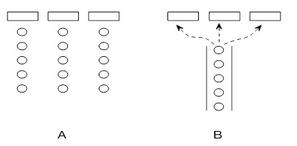
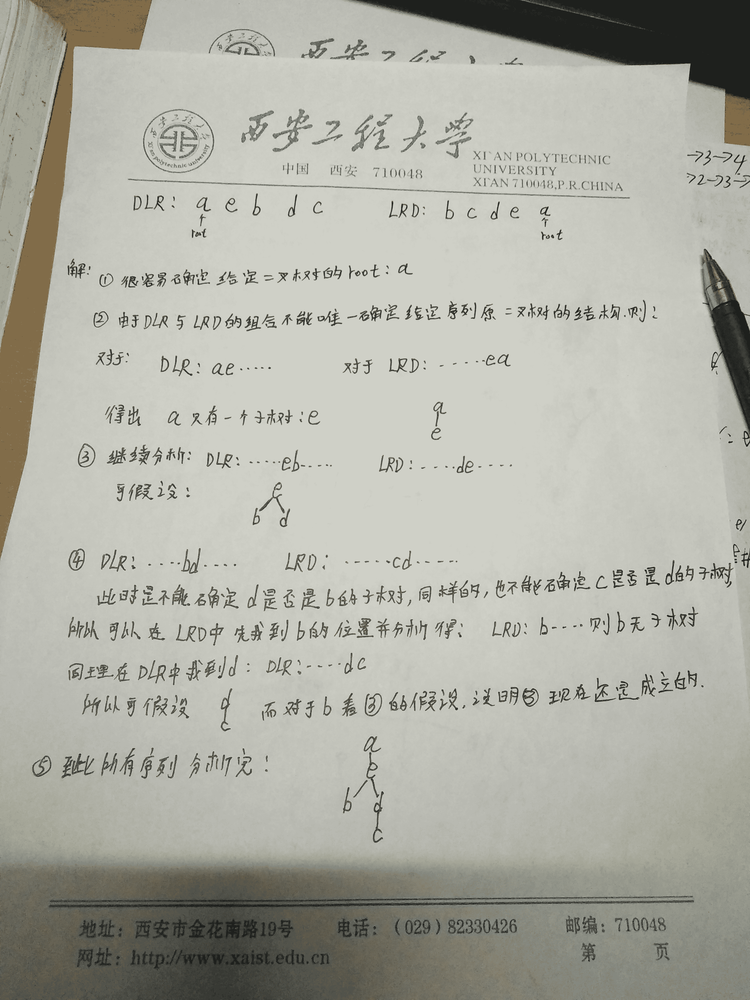
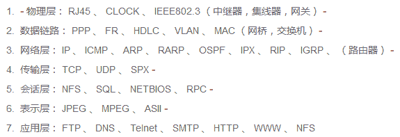
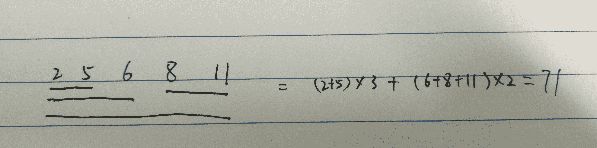
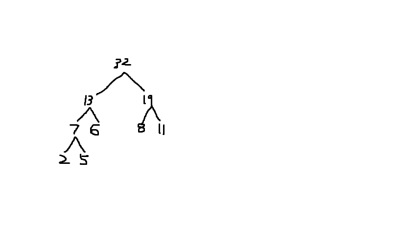
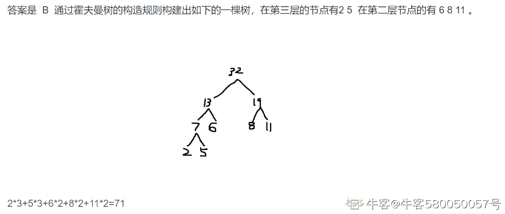
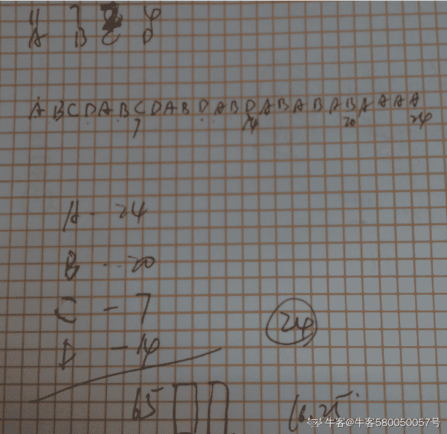
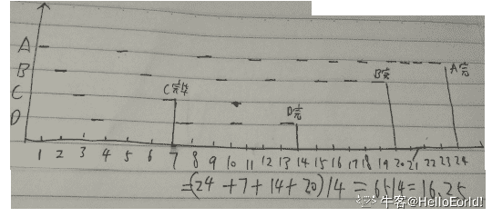

# 远景智能-2021 秋季招聘软件技术笔试题（第二批）

## 1

同步机制应该遵循哪些基本准则？

正确答案: A B C D   你的答案: 空 (错误)

```cpp
空闲让进
```

```cpp
忙则等待
```

```cpp
有限等待
```

```cpp
让权等待
```

本题知识点

并发 腾讯 Java 工程师 C++工程师 PHP 工程师 golang 工程师 前端工程师 安卓工程师 iOS 工程师 算法工程师 大数据开发工程师 运维工程师 安全工程师 数据库工程师 游戏研发工程师 测试开发工程师 测试工程师 2021 远景能源有限公司

讨论

[akueisara](https://www.nowcoder.com/profile/396156)

同步机制应该遵循的基本准则 

  查看全部)

编辑于 2015-02-04 21:20:25

* * *

[内推小哥](https://www.nowcoder.com/profile/344195610)

吧

发表于 2020-03-20 00:25:32

* * *

## 2

关于进程和线程，下面说法正确的是

正确答案: B C D   你的答案: 空 (错误)

```cpp
线程是资源分配和拥有的单位
```

```cpp
线程和进程都可并发执行
```

```cpp
在 linux 系统中，线程是处理器调度的基本单位
```

```cpp
线程的粒度小于进程，通常多线程比多进程并发性更高
```

```cpp
不同的线程共享相同的栈空间
```

本题知识点

操作系统 并发 阿里巴巴 Java 工程师 C++工程师 PHP 工程师 golang 工程师 前端工程师 安卓工程师 iOS 工程师 算法工程师 大数据开发工程师 运维工程师 安全工程师 数据库工程师 游戏研发工程师 测试开发工程师 测试工程师 2021 远景能源有限公司

讨论

[牛客 444334 号](https://www.nowcoder.com/profile/444334)

BCD

A 错误，进程是资  查看全部)

编辑于 2015-02-09 21:16:46

* * *

[一阶小民](https://www.nowcoder.com/profile/350280)

牛客 444334 号这位解释的不对吧，E 错在：即便是同一进程里的多个线程，每个线程也有自己独立的栈空间，其他资源是共享的。

发表于 2015-10-05 17:10:57

* * *

[舒意意 123](https://www.nowcoder.com/profile/1973064)

BCD

A 错误，进程是资源分配和拥有的单位,同一个进程内的线程共享进程的资源
B 正确，二者均可并发执行。
C 正确，线程作为调度和分配的基本单位，进程作为拥有资源的基本单位
D 正确， 线程的划分尺度小于进程，使得多线程程序的并发性高
E 错在：即便是同一进程里的多个线程，每个线程也有自己独立的栈空间，其他资源是共享的。

发表于 2017-04-20 14:49:44

* * *

## 3

下面算法的时间复杂度是

```cpp
int f ( unsigned int n )
{
If ( n == 0|| n == 1)
     return 1;
else return n*f (n-1);
}
```

正确答案: B   你的答案: 空 (错误)

```cpp
0(1)
```

```cpp
0(n)
```

```cpp
0(n²)
```

```cpp
0(n!)
```

本题知识点

Java 工程师 C++工程师 PHP 工程师 golang 工程师 前端工程师 安卓工程师 iOS 工程师 算法工程师 大数据开发工程师 运维工程师 安全工程师 数据库工程师 游戏研发工程师 测试开发工程师 测试工程师 2021 远景能源有限公司

讨论

[黑暗火焰领主](https://www.nowcoder.com/profile/469871858)

if 和 return 那行算作 1step 从 recursion 那行我们知道每次 input 都会-1 那么每次 recurse 从第一次时间为 n 变成第二次 n-1 第三次 n-2……第 n 次时 n-（n-1）全部相加得到 n*n-（（n-1）*n/2）约等于（n²）/2 其中每次 recurse 都只有 1 步 所以最后答案是 C

发表于 2021-04-15 05:39:48

* * *

[牛客 580050057 号](https://www.nowcoder.com/profile/580050057)

循环的时间复杂度=循环体的复杂度*循环运行的次数。

发表于 2021-03-12 21:45:08

* * *

[5sy](https://www.nowcoder.com/profile/973986382)

循环的时间复杂度=循环体的复杂度*循环运行次数

发表于 2021-03-09 15:00:08

* * *

## 4

对于 A、B 两种排队方式，说法正确的是


正确答案: C   你的答案: 空 (错误)

```cpp
方式 A 效率更高
```

```cpp
方式 B 效率更高
```

```cpp
当排队的任务中有长耗时任务且比例较低时，方式 B 更具优势
```

```cpp
都不正确
```

本题知识点

并发 阿里巴巴 Java 工程师 C++工程师 PHP 工程师 golang 工程师 前端工程师 安卓工程师 iOS 工程师 算法工程师 大数据开发工程师 运维工程师 安全工程师 数据库工程师 游戏研发工程师 测试开发工程师 测试工程师 2021 远景能源有限公司

讨论

[AndrewZJ](https://www.nowcoder.com/profile/953175)

C 因为当方式 A 中出现了  查看全部)

编辑于 2015-02-06 15:15:10

* * *

[我有切糕](https://www.nowcoder.com/profile/903466)

在***排队和银行排队的区别

发表于 2016-01-27 15:07:09

* * *

[黄汉韬](https://www.nowcoder.com/profile/7252447)

把第一种模型理解为单任务的。如果我们遇到了一个需要等待的 IO 操作，可能会让此进程阻塞，其他的进程得不到执行。如果其他进程等待时间很长的话，可能会导致其他进程饿死。把第二种模型理解为并发的。举个例子，当我们设计一款类似于 wps 这样的文字处理软件的时候，我们可以开一个线程来与用户进行交互，开第二个线程来对读取进内存中的数据进行计算，当我们计算完了之后，可能需要把这些数据保存进磁盘中，这时候，我们可以开第三个线程来负责把数据写入磁盘中，我们知道，对于磁盘的读写操作是毫秒级别的（而对于内存的读写是纳秒级别的。不要觉得毫秒级别的时间很短，对于计算机来说已经很长了。对于大量数据排序都不一定需要毫秒），所以非常的慢，所以，如果我们把这个耗时比较长的操作专门交给一个线程来处理的话，就可以充分利用 CPU。

编辑于 2017-11-04 21:33:15

* * *

## 5

下列对 MD5 的叙述不正确的是：

正确答案: C   你的答案: 空 (错误)

```cpp
是一种散列算法
```

```cpp
指纹(摘要)的长度为 128 位
```

```cpp
是一种对称加密算法
```

```cpp
可用来校验数据的完整性
```

本题知识点

加密和安全 阿里巴巴 Java 工程师 C++工程师 PHP 工程师 golang 工程师 前端工程师 安卓工程师 iOS 工程师 算法工程师 大数据开发工程师 运维工程师 安全工程师 数据库工程师 游戏研发工程师 测试开发工程师 测试工程师 2021 远景能源有限公司

讨论

[甫艾蒽廷](https://www.nowcoder.com/profile/7698448)

**MD5 是摘要算法不是加密算法，两者的本质区别是：摘要算法是单向的，即明文可以通过摘要算法生成摘要结果，但反之则不能通过摘要结果还原成明文。而加密算法是双向的，即可以从明文通过加密算法生成密文，反之也可以通过解密算法将密文还原成明文。**
**所以，摘要算法主要用来检查明文是否发生过变动，而加密算法则用来传递不能让第三方知晓的内容。**

发表于 2016-11-16 10:58:52

* * *

[zhisheng_blog](https://www.nowcoder.com/profile/616717)

MD5 算法不是加密算法，是 Message Digest Algorithm 报文摘要算法。

发表于 2016-08-17 08:48:53

* * *

[huixieqingchun](https://www.nowcoder.com/profile/551201)

**MD5 是数据摘要算法，不是加密算法。**

发表于 2016-07-13 14:10:02

* * *

## 6

以下哪个选项中可能应用到栈。

正确答案: A B C D   你的答案: 空 (错误)

```cpp
递归
```

```cpp
快速排序（非递归程序用栈实现）
```

```cpp
表达式求值
```

```cpp
树的遍历
```

本题知识点

栈 *华为 Java 工程师 C++工程师 PHP 工程师 golang 工程师 前端工程师 安卓工程师 iOS 工程师 算法工程师 大数据开发工程师 运维工程师 安全工程师 数据库工程师 游戏研发工程师 测试开发工程师 测试工程师 2021 远景能源有限公司* *讨论

[L.K.](https://www.nowcoder.com/profile/217196)

答案：ABCD。A，递归肯定用到栈的，存放局部变量，返回地址等，不过该栈是操作系统提供的栈。B，快速排序的非递归实现，栈中存放要进行一遍快排的起始位置，利用栈先进后出的方式，模拟递归的过程。C，表达式求值，将中序表达式转换为前序或后序时，需要用栈存放符号。D，树的深度优先遍历，用栈记录遍历过的元素，以便进行回溯。

发表于 2015-08-11 11:25:08

* * *

[Radar](https://www.nowcoder.com/profile/312842)

**这道题目出的本身就有问题吧？！****应该说：** 以下哪个选项中可以应用来实现栈（）这样答案才会是 ABCD**试问：**递归一定要用栈来实现吗？不是一定要用栈实现吧？

发表于 2015-09-09 10:43:46

* * *

[SIDNEY](https://www.nowcoder.com/profile/350417)

树的深度优先遍历是用到栈的，树的广度优先遍历用到队列。D 没说树采用哪种遍历方式，不应该选。

发表于 2015-09-02 14:49:26

* * *

## 7

若一棵二叉树的前序遍历为 a, e, b, d, c，后序遍历为 b, c, d, e, a，则根节点的孩子节点为（）

正确答案: A   你的答案: 空 (错误)

```cpp
只有 e
```

```cpp
有 e、b
```

```cpp
有 e、c
```

```cpp
无法确定
```

本题知识点

树 腾讯 2021 远景能源有限公司

讨论

[kuring](https://www.nowcoder.com/profile/462306)

通过前序遍历序列和后序遍历序  查看全部)

编辑于 2015-06-19 20:49:07

* * *

[codelife](https://www.nowcoder.com/profile/997126)



发表于 2016-07-27 16:26:54

* * *

[养兔子的熊](https://www.nowcoder.com/profile/365665)

答案为 A。根据前序或后续序列，可以确定 a 必定有一个子结点 e，假设 e 为左孩子，a 右孩子不为空，则后续遍历序列中与 a 相邻的应该为 a 的右孩子。同理，假设 e 为右孩子，a 的左孩子不为空，则先序遍历时与 a 相邻的为 a 的左孩子。故 a 有且只有 e 这一个孩子，左右无法确定。

发表于 2015-08-19 16:55:37

* * *

## 8

对手机软件的压力测试通常可以包括【多选】（ ）

正确答案: A B C   你的答案: 空 (错误)

```cpp
存储压力
```

```cpp
响应能力压力
```

```cpp
网络流量压力
```

```cpp
并发压力
```

本题知识点

软件测试 搜狐 Java 工程师 C++工程师 PHP 工程师 golang 工程师 前端工程师 安卓工程师 iOS 工程师 算法工程师 大数据开发工程师 运维工程师 安全工程师 数据库工程师 游戏研发工程师 测试开发工程师 测试工程师 2021 远景能源有限公司

讨论

[牛客 444334 号](https://www.nowcoder.com/profile/444334)

ABC

针对手机应用软件  查看全部)

编辑于 2015-02-06 10:30:11

* * *

[Simple11111](https://www.nowcoder.com/profile/236217)

并发压力是针对服务器的，因为每次并发是一个客户端

编辑于 2015-03-31 10:59:35

* * *

[是饭勺不是饭桶](https://www.nowcoder.com/profile/9382249)

针对手机软件的系统测试，通常包含以下角度：
<1>功能模块测试：首先分析功能模块的功能项，测试每一个功能项是否能够实现对应功能。一般根据测试用例和软件本身的流程就可以完成基本功能测试。
<2>交叉事件测试：又叫做事件或者冲突测试，是指一个功能正在执行过程中，同时另外一个事件或者操作对该过程进行干扰的测试。例如通话过程中接收到短信或者闹铃触发，应用软件运行过程中插拔充电器等。执行干扰的冲突事件不能导致应用软件异常、手机死机、花屏等严重问题。
<3>压力测试：又叫做边界值容错测试或极限负载测试。即测试过程中，已经达到某一软件功*能[存储、网络、响应能力]的最大容量、边界或者最大承受极限，仍然对其进行相关操作*。例如连续接收或者发送短信，超过收信箱和 SIM 卡所能存储的最大条数，仍然进行接收或者发送，依次来检测软件在超常态下的表现，进而进行评估用户能否接受。
对手机可以施加的压力测试类型主要包括：
->存储压力：由于手机采用的是栈式存储，所以当一个存储块满了之后，程序员不做相应处理的话，就会导致其他存储区被删除。
->边界压力:边界处理问题一直是容易被忽略的地方
->响应能力压力：有时 某些操作可能处理的时间较长，如果在处理期间，继续进行其他操作时候就会出现问题。
->网络流量压力：执行较大数据流量的功能同时，在进行其他操作，使得网络流量始终处于很高的状态，检验各个功能是否依然正常工作，是否存在因为网络流量瓶颈引起的某功能异常。
<4>容量测试：即存储空间已满时候的测试，包括用户可用内存/SIM 卡所有空间被完全使用的测试。此时在对可编辑模块和存储空间进行操作，如果软件在极容状态下处理不好，将会导致死机或者花屏等问题。
<5>兼容性测试：不同品牌、型号手机，不同网络，不同容量大小的 SIM 卡之间的兼容性测试。例如：中国电信的小灵通接收到中国移动或者中国联通 GSM 发来的短消息，需要验证显示和回复是否正常。
<6>易用性、用户体验测试：在指定条件下，软件产品被理解、学习、使用和吸引用户的能力，是交互的适应性、功能性和有效性的集中体现。

发表于 2019-03-06 14:45:37

* * *

## 9

数据库以及线程发生死锁的主要原因是什么？

正确答案: A B C   你的答案: 空 (错误)

```cpp
资源分配不当
```

```cpp
进程运行推进的顺序不合适
```

```cpp
系统资源不足
```

```cpp
进程过多
```

本题知识点

并发 百度 Java 工程师 C++工程师 PHP 工程师 golang 工程师 前端工程师 安卓工程师 iOS 工程师 算法工程师 大数据开发工程师 运维工程师 安全工程师 数据库工程师 游戏研发工程师 测试开发工程师 测试工程师 2021 远景能源有限公司 操作系统

讨论

[牛客 574425 号](https://www.nowcoder.com/profile/574425)

产生死锁的原因主要是： 
（

  查看全部)

编辑于 2015-01-05 10:35:50

* * *

[selfboot](https://www.nowcoder.com/profile/509)

死锁的规范定义如下：如果一个进程集合中的每个进程都在等待只能由该进程集合中其他进程才能引发的事件，那么该进程集合就是死锁的。

产生死锁的原因主要是：

- 因为系统资源不足。

- 进程运行推进的顺序不合适。

- 资源分配不当等。

产生死锁的四个必要条件：

1. 互斥条件：每个资源要么已经分配给了一个进程，要么就是可用的。

2. 占有和等待条件：已经得到了某个资源的进程可以再请求新的资源。

3. 不可抢占条件：已经分配给一个进程的资源不能强制性地被抢占，只能被占有它的进程显式地释放；

4. 环路等待条件：死锁发生时，系统中一定有两个或者两个以上的进程组成的一条环路，该环路中的每个进程都在等待着下一个进程所占有的资源。

这四个条件是死锁的必要条件，只要系统发生死锁，这些条件必然成立，而只要上述条件之一不满足，就不会发生死锁。

四种处理死锁的策略：

1. 鸵鸟策略（忽略死锁）；

2. 检测死锁并恢复；

3. 仔细对资源进行分配，动态地避免死锁；

4. 通过破坏引起死锁的四个必要条件之一，防止死锁的产生。

避免死锁的主要算法是基于一个` 安全状态 `的概念。在任何时刻，如果没有死锁发生，并且即使所有进程忽然请求对资源的最大请求，也仍然存在某种调度次序能够使得每一个进程运行完毕，则称该状态是安全的。从安全状态出发，系统能够保证所有进程都能完成，而从不安全状态出发，就没有这样的保证。

` 银行家算法 `：判断对请求的满足是否会进入不安全状态，如果是，就拒绝请求，如果满足请求后系统仍然是安全的，就予以分配。不安全状态不一定引起死锁，因为客户不一定需要其最大贷款额度。

发表于 2016-05-04 09:06:51

* * *

[Kennel](https://www.nowcoder.com/profile/838454)

ABC**产生死锁的原因**主要是：
（1） 因为系统资源不足。
（2） 进程运行推进的顺序不合适。
（3） 资源分配不当等。
**产生死锁的四个必要条件**：
（1）互斥条件：一个资源每次只能被一个进程使用。
（2）请求与保持条件：一个进程因请求资源而阻塞时，对已获得的资源保持不放。
（3）不剥夺条件:进程已获得的资源，在末使用完之前，不能强行剥夺。
（4）循环等待条件:若干进程之间形成一种头尾相接的循环等待资源关系。
**避免死锁：**死锁的预防是通过破坏产生条件来阻止死锁的产生，但这种方法破坏了系统的并行性和并发性。
死锁产生的前三个条件是死锁产生的必要条件，也就是说要产生死锁必须具备的条件，而不是存在这 3 个条件就一定产生死锁，那么只要在逻辑上回避了第四个条件就可以避免死锁。
避免死锁采用的是允许前三个条件存在，但通过合理的资源分配算法来确保永远不会形成环形等待的封闭进程链，从而避免死锁。该方法支持多个进程的并行执行，为了避免死锁，系统动态的确定是否分配一个资源给请求的进程。**预防死锁** ：具体的做法是破坏产生死锁的四个必要条件之一

发表于 2015-04-17 21:27:21

* * *

## 10

一个包含 n 个节点的四叉树，每个节点都有四个指向孩子节点的指针，这 4n 个指针中有多少个空指针？

正确答案: D   你的答案: 空 (错误)

```cpp
2n+1
```

```cpp
3n-1
```

```cpp
3n
```

```cpp
3n+1
```

本题知识点

树 Java 工程师 C++工程师 PHP 工程师 golang 工程师 前端工程师 安卓工程师 iOS 工程师 算法工程师 大数据开发工程师 运维工程师 安全工程师 数据库工程师 游戏研发工程师 测试开发工程师 测试工程师 2021 远景能源有限公司

讨论

[丨太阳与月亮丨](https://www.nowcoder.com/profile/9415270)

Dn 个结点为一棵树则有 n-1 条边，因此有 n-1 个非空指针空指针个数 4*n-(n-1)=3*n+1

发表于 2017-01-26 19:59:09

* * *

[向宇冋桌](https://www.nowcoder.com/profile/9567428)

假设 n=5，那么有四个叶子节点，空指针为 4*4=16；3n+1=3*5+1=16，选 D

发表于 2016-12-19 20:50:19

* * *

[softwareGxy](https://www.nowcoder.com/profile/560840485)

**方法一：**  n 个节点，共有 4n 个指针。n 个节点有 n-1 条边相连，即非空指针有 n-1 个，所以空指针为 4n-(n-1)=3n+1**方法二：**1.总结点数 n=4*x+1（x 为非叶节点数，加 1 个根节点）,x=(n-1)/42.空指针数 m=叶子节点数*4   m=(n-(n-1)/4)*4=3n+1

发表于 2020-03-27 11:57:12

* * *

## 11

下面关于并行和并发的区别，说法错误的是？

正确答案: C   你的答案: 空 (错误)

```cpp
并发计算是一种程序计算的形式，在系统中，至少有两个以上的计算在同时运作，计算结果可能同时发生
```

```cpp
并行计算指许多指令得以同时进行的计算模式。在同时进行的前提下，可以将计算的过程分解成小部份，之后以并发方式来加以解决
```

```cpp
并行是同时发生的多个并发事件，并发事件之间一定要同一时刻发生
```

```cpp
并发是逻辑上的同时发生（simultaneous），而并行是物理上的同时发生
```

本题知识点

并发 网易 Java 工程师 C++工程师 PHP 工程师 golang 工程师 前端工程师 安卓工程师 iOS 工程师 算法工程师 大数据开发工程师 运维工程师 安全工程师 数据库工程师 游戏研发工程师 测试开发工程师 测试工程师 2021 远景能源有限公司

讨论

[eagle](https://www.nowcoder.com/profile/603476)

C 不一定同时发生  查看全部)

编辑于 2015-02-03 14:42:38

* * *

[昱磊](https://www.nowcoder.com/profile/633465)

C 你吃饭吃到一半，电话来了，你一直到吃完了以后才去接，这就说明你不支持并发也不支持并行。你吃饭吃到一半，电话来了，你停了下来接了电话，接完后继续吃饭，这说明你支持并发。  你吃饭吃到一半，电话来了，你一边打电话一边吃饭，这说明你支持并行。  并发的关键是你有处理多个任务的能力，不一定要同时。  并行的关键是你有同时处理多个任务的能力。  所以我认为它们最关键的点就是：是否是『同时』。

编辑于 2016-08-31 15:14:25

* * *

[Tau_woo](https://www.nowcoder.com/profile/311328)

并行的概念往往适用于多 CPU 情况下。同一时刻，不用 CPU 之间的事件是并行的。

发表于 2015-09-06 17:03:43

* * *

## 12

算法一般都可以用哪几种控制结构组合而成？

正确答案: A B D   你的答案: 空 (错误)

```cpp
顺序
```

```cpp
选择
```

```cpp
递归
```

```cpp
循环
```

本题知识点

复杂度 2021 远景能源有限公司

讨论

[Jerry 威](https://www.nowcoder.com/profile/262955)

顺序、选择、循环

编辑于 2015-02-03 11:28:35

* * *

[武汉孙一峰](https://www.nowcoder.com/profile/6638059)

算法的基本控制结构： **顺序、选择、循环****递归不属于基本控制结构**

发表于 2016-11-27 19:50:49

* * *

[大星星和小猩猩](https://www.nowcoder.com/profile/9374535)

程序的结构有 3 种：顺序结构，分支结构，循环结构。所以对应的是顺序，选择，循环，递归不属于基本控制结构

发表于 2018-03-21 08:31:05

* * *

## 13

下列不属于 hash 碰撞解决方法的是（）。

正确答案: B   你的答案: 空 (错误)

```cpp
线性探测
```

```cpp
单旋转法
```

```cpp
二次探测
```

```cpp
拉链法
```

```cpp
双重散列
```

```cpp
多重散列
```

本题知识点

哈希 *阿里巴巴 Java 工程师 C++工程师 PHP 工程师 golang 工程师 前端工程师 安卓工程师 iOS 工程师 算法工程师 大数据开发工程师 运维工程师 安全工程师 数据库工程师 游戏研发工程师 测试开发工程师 测试工程师 2021 远景能源有限公司* *讨论

[牛客-007](https://www.nowcoder.com/profile/394118)

答案：B 旋转法是将数据  查看全部)

编辑于 2015-01-30 15:56:26

* * *

[转角遇到你](https://www.nowcoder.com/profile/214168)

常见哈希冲突解决办法：1.开放地址法 2.线性探测法 3.链地址法（拉链法） 4.二次探测法 5.伪随机探测法 6.再散列（双重散列，多重散列） 7.建立一个公共溢出区单旋转法是建立散列函数的一种方法， ，将最后一位数，旋转放置到第一位常见的散列函数有，直接定址法，数字分析法，平法取中法，取余法，折叠法，随机法

发表于 2015-08-22 10:42:00

* * *

[JNYM](https://www.nowcoder.com/profile/397040)

单旋转法是一种 hash 函数的构造方法，将最后一位数，旋转放置到第一位，其余的往右移。如 5062101 旋转之后得到 1506210，

编辑于 2015-08-17 17:17:37

* * *

## 14

高内聚和低耦合，下面哪个耦合度最高？

正确答案: B   你的答案: 空 (错误)

```cpp
通过函数参数传递
```

```cpp
一个函数修改另外一个函数中的数据
```

```cpp
通过全局变量
```

```cpp
通过指示器
```

本题知识点

软件工程 Java 工程师 C++工程师 PHP 工程师 golang 工程师 前端工程师 安卓工程师 iOS 工程师 算法工程师 大数据开发工程师 运维工程师 安全工程师 数据库工程师 游戏研发工程师 测试开发工程师 测试工程师 2021 远景能源有限公司

讨论

[程序媛](https://www.nowcoder.com/profile/303893)

耦合可以分为以下几种，它们之间的耦合度由高到低排列如下：（1） 内容耦合：有下列情形之一，两个模块就发生了内容耦合：*一个模块访问另一个模块的内部数据*一个模块不通过正常入口而转到另一个模块的内部*一个模块有多个入口（2） 公共耦合：当两个或多个模块通过公共数据环境相互作用时，他们之间的耦合称为公共环境耦合。（3） 控制耦合：如果两个模块通过参数交换信息，交换的信息有控制信息，那么这种耦合就是控制耦合。（4） 特征耦合：如果被调用的模块需要使用作为参数传递进来的数据结构中的所有数据时，那么把这个数据结构作为参数整体传送是完全正确的。但是，当把整个数据结构作为参数传递而使用其中一部分数据元素时，就出现了特征耦合。在这种情况下，被调用的模块可以使用的数据多于它确实需要的数据，这将导致对数据的访问失去控制，从而给计算机犯错误提供机会。（5） 数据耦合：如果两个模块通过参数交换信息，而且交换的信息仅仅是数据，那么这种耦合就是数据耦合。内聚有如下的种类，它们之间的内聚度由弱到强排列如下：（1） 偶然内聚：模块中的代码无法定义其不同功能的调用。但它使该模块能执行不同的功能，这种模块称为巧合强度模块。（2） 逻辑内聚。这种模块把几种相关的功能组合在一起， 每次被调用时，由传送给模块参数来确定该模块应完成哪一种功能 （3） 时间内聚：把需要同时执行的动作组合在一起形成的模块为时间内聚模块。 （4） 过程内聚：构件或者操作的组合方式是，允许在调用前面的构件或操作之后，马上调用后面的构件或操作，即使两者之间没有数据进行传递。 （5） 通信内聚：指模块内所有处理元素都在同一个数据结构上操作（有时称之为信息内聚），或者指各处理使用相同的输入数据或者产生相同的输出数据。 （6） 顺序内聚：指一个模块中各个处理元素都密切相关于同一功能且必须顺序执行，前一功能元素输出就是下一功能元素的输入。（7） 功能内聚：共同完成同一功能，缺一不可，模块不可再分割

发表于 2015-09-05 16:55:58

* * *

[团子吃蛋挞](https://www.nowcoder.com/profile/963600)

“最”字竟然有多个答案...虽然是不定项

发表于 2016-02-02 23:42:23

* * *

[kou](https://www.nowcoder.com/profile/6942592)

b 应该是内容耦合，c 是公共耦合吧，所以最高不应该是 b 吗？ 知识点: 耦合可以分为以下几种，它们之间的耦合度由高到低排列如下： （1） 内容耦合：有下列情形之一，两个模块就发生了内容耦合： *一个模块访问另一个模块的内部数据 *一个模块不通过正常入口而转到另一个模块的内部 *一个模块有多个入口 （2） 公共耦合：当两个或多个模块通过公共数据环境相互作用时，他们之间的耦合称为公共环境耦合。 （3） 控制耦合：如果两个模块通过参数交换信息，交换的信息有控制信息，那么这种耦合就是控制耦合。 （4） 特征耦合：如果被调用的模块需要使用作为参数传递进来的数据结构中的所有数据时，那么把这个数据结构作为参数整体传送是完全正确的。但是，当把整个数据结构作为参数传递而使用其中一部分数据元素时，就出现了特征耦合。在这种情况下，被调用的模块可以使用的数据多于它确实需要的数据，这将导致对数据的访问失去控制，从而给计算机犯错误提供机会。 （5） 数据耦合：如果两个模块通过参数交换信息，而且交换的信息仅仅是数据，那么这种耦合就是数据耦合。 内聚有如下的种类，它们之间的内聚度由弱到强排列如下： （1） 偶然内聚：模块中的代码无法定义其不同功能的调用。但它使该模块能执行不同的功能，这种模块称为巧合强度模块。 （2） 逻辑内聚。这种模块把几种相关的功能组合在一起， 每次被调用时，由传送给模块参数来确定该模块应完成哪一种功能  （3） 时间内聚：把需要同时执行的动作组合在一起形成的模块为时间内聚模块。  （4） 过程内聚：构件或者操作的组合方式是，允许在调用前面的构件或操作之后，马上调用后面的构件或操作，即使两者之间没有数据进行传递。  （5） 通信内聚：指模块内所有处理元素都在同一个数据结构上操作（有时称之为信息内聚），或者指各处理使用相同的输入数据或者产生相同的输出数据。  （6） 顺序内聚：指一个模块中各个处理元素都密切相关于同一功能且必须顺序执行，前一功能元素输出就是下一功能元素的输入。 （7） 功能内聚：共同完成同一功能，缺一不可，模块不可再分割

编辑于 2016-08-17 17:44:06

* * *

## 15

一个长度为 100 的循环链表，指针 A 和指针 B 都指向了链表中的同一个节点，A 以步长为 1 向前移动，B 以步长为 3 向前移动，一共需要同时移动多少步 A 和 B 才能再次指向同一个节点 ____。

正确答案: E   你的答案: 空 (错误)

```cpp
99
```

```cpp
100
```

```cpp
101
```

```cpp
49
```

```cpp
50
```

```cpp
51
```

本题知识点

链表 *Java 工程师 C++工程师 PHP 工程师 golang 工程师 前端工程师 安卓工程师 iOS 工程师 算法工程师 大数据开发工程师 运维工程师 安全工程师 数据库工程师 游戏研发工程师 测试开发工程师 测试工程师 2021 远景能源有限公司* *讨论

[SunburstRun](https://www.nowcoder.com/profile/557336)

  查看全部)

编辑于 2015-08-25 00:17:20

* * *

[Miss_Wendy](https://www.nowcoder.com/profile/822078)

A B 一快一慢，当二者差一圈时，刚好指向同一节点，3*x-1*x=100   x=50

发表于 2015-08-25 10:39:00

* * *

[shellshell](https://www.nowcoder.com/profile/199809)

这个题从物理角度分析一下就好理解了。A 向前移动 1 步，B 向前移动 3 步。假设 A，B 都在起点，那么把 A 看做静止，B 相对于 A 就是以 2 两步移动了。所以这个题可以这么说：在长度为 100 的循环链表中，A,B 均在起点，A 不移动，B 每次移动 2 步，问啥时候能回到起点？

发表于 2016-03-22 08:55:39

* * *

## 16

Internet 的网络层含有的协议是？

正确答案: A B C D   你的答案: 空 (错误)

```cpp
IP
```

```cpp
ICMP
```

```cpp
ARP
```

```cpp
RARP
```

本题知识点

网络基础

讨论

[莫笑☁️輕狂](https://www.nowcoder.com/profile/152216)

ip 不用说了肯定是网络层协议  查看全部)

编辑于 2016-05-07 15:49:51

* * *

[WHUTdq](https://www.nowcoder.com/profile/9172499)



发表于 2016-08-28 16:27:18

* * *

[youyouhuo](https://www.nowcoder.com/profile/468667)

arp 和 rarp 应该是数据链路层吧

发表于 2015-09-10 14:17:38

* * *

## 17

下面算法中可以判断出一个有向图是否有环的是：（）

正确答案: B D   你的答案: 空 (错误)

```cpp
求最短路径
```

```cpp
深度优先遍历
```

```cpp
广度优先遍历
```

```cpp
拓扑排序
```

本题知识点

图 Java 工程师 C++工程师 PHP 工程师 golang 工程师 前端工程师 安卓工程师 iOS 工程师 算法工程师 大数据开发工程师 运维工程师 安全工程师 数据库工程师 游戏研发工程师 测试开发工程师 测试工程师 2021 远景能源有限公司

讨论

[codersong](https://www.nowcoder.com/profile/365974)

深度优先搜索和拓扑排序就不说了，广度优先搜索过程中如果访问到一个已经访问过的节点，可能是多个节点指向这个节点，不一定是存在环

发表于 2015-10-08 21:26:31

* * *

[webary](https://www.nowcoder.com/profile/581261)

判断 **无向图** 中是否存在回路（环）的算法描述

如果存在回路，则必存在一个子图，是一个环路。环路中所有顶点的度>=2。

算法：

     第一步：删除所有度<=1 的顶点及相关的边，并将另外与这些边相关的其它顶点的度减一。

     第二步：将度数变为 1 的顶点排入队列，并从该队列中取出一个顶点重复步骤一。

     如果最后还有未删除顶点，则存在环，否则没有环。

**有向图**是否有环的判定算法，主要有**深度优先和拓扑排序**两种方法。所以答案选 **BD**

编辑于 2016-08-30 18:25:13

* * *

[不负时光](https://www.nowcoder.com/profile/317111)

```cpp
其实你画个图比划一下就很清楚了。通常处理图结构的时候是转换成树结构，通常也就是按照深度遍历的方式转换，
转换的时候是从起始节点开始，找节点的孩子，找到了就保存下来，然后找孩子的孩子，每次找到之后都保存下来，
这就是深度遍历，如果有向图中存在圈圈，那么就必然会出现这种情况“某个节点的孩子已经存在于你保存的节点里了”，
一旦出现就表示有圈圈。
 广度遍历就不行了，因为有向图与树最大的区别之一是两个图的节点可能会有公共的孩子，所以用广度遍历的方式，即使出现了重复，
也不能证明有圈圈。
```

发表于 2016-03-22 22:07:06

* * *

## 18

以下那一些算法对执行时间短的进程有利（    ）

正确答案: A E   你的答案: 空 (错误)

```cpp
时间片轮转法
```

```cpp
系统调用
```

```cpp
抢占式调度算法
```

```cpp
FCFS（先来先服务）调度算法
```

```cpp
高响应比优先调度算法
```

本题知识点

操作系统

讨论

[Hinly](https://www.nowcoder.com/profile/616604987)

对短进程有利：时间片、多级反馈队列、高响应比

编辑于 2019-11-30 15:50:04

* * *

[我只是想求一个 offer，给个机会面试](https://www.nowcoder.com/profile/200333)

我觉得 A 真的说不上 有没有利，我只能说这道题保留。毕竟公平的东西你怎么能说就有利了？

发表于 2019-10-07 10:20:25

* * *

[牛客 5313474 号](https://www.nowcoder.com/profile/5313474)

A 选项，如果单个时间片长度大于短进程所需的运行时间的话，那么在单个时间片内，短进程就可以执行完；即使短进程的运行需要若干时间片，但使用时间片轮转算法来调度的话，也只需较少的时间片，因此，时间片轮转调度对短进程也是有利的。E 选项：高响应比优先调度算法是兼顾了短进程与等待时间长的进程的一种调度算法，每当调度作业的时候，都要计算各个进程的响应比，总是选择响应比高的进程运行。在通常情况下，优先运行短作业，当长进程等待时间足够长时，它也就变为可优先运行的进程了，从而克服了两者的缺点。

编辑于 2017-08-27 20:38:17

* * *

## 19

对有 n 个顶点、 e 条边且使用邻接表存储的有向图进行广度优先遍历，其算法的时间复杂度是（ ）。  

正确答案: C   你的答案: 空 (错误)

```cpp
O(n)
```

```cpp
O(e)
```

```cpp
O(n+e)
```

```cpp
O(n×e)
```

本题知识点

Java 工程师 C++工程师 PHP 工程师 golang 工程师 前端工程师 安卓工程师 iOS 工程师 算法工程师 大数据开发工程师 运维工程师 安全工程师 数据库工程师 游戏研发工程师 测试开发工程师 测试工程师 2021 远景能源有限公司

讨论

[牛客 580050057 号](https://www.nowcoder.com/profile/580050057)

如果是有向图则为 O(n+e) 无向图 O(n+2e) 邻接表图则为 O(n*n)

发表于 2021-03-13 08:57:27

* * *

[牛客 867941589 号](https://www.nowcoder.com/profile/867941589)

广度有限遍历是先遍历与当前节点所相连的节点，后再转到下一节点。题中提供了邻接表，结合邻接表的算法复杂度为 O(节点数+边数)。

发表于 2021-03-09 16:16:30

* * *

[xixa](https://www.nowcoder.com/profile/343736172)

如果是有向图则为 O(n+e)，无向图为 O(n+2e)，邻接表存图则为 O(n*n)

发表于 2021-03-09 18:00:01

* * *

## 20

以下不是 DNS 服务的作用的是：

正确答案: D   你的答案: 空 (错误)

```cpp
将主机名翻译到指定的 IP 地址
```

```cpp
将 IP 地址反解成主机名
```

```cpp
解析特定类型的服务的地址，如 MX,NS
```

```cpp
将 IP 解析成 MAC 地址
```

本题知识点

网络基础

讨论

[舒意意 123](https://www.nowcoder.com/profile/1973064)

选择 DDNS 是域名解析协议 IP 地址转换成 MAC 地址是 ARP 协议的作用

发表于 2017-04-06 16:22:28

* * *

[我也支持](https://www.nowcoder.com/profile/6206174)

**MARK：DNS 解析域名到 IP 地址为双向的，此外还可以解析特定类型的服务的地址。**

发表于 2017-06-19 17:26:15

* * *

[这个好玩吗？](https://www.nowcoder.com/profile/864589)

选择 DDNS 是域名解析协议 IP 地址转换成 MAC 地址是 ARP 协议的作用

发表于 2017-03-14 15:51:04

* * *

## 21

查找哈希表，解决冲突的方法包括（）

正确答案: A D   你的答案: 空 (错误)

```cpp
链地址法
```

```cpp
除留余数法
```

```cpp
直接地址法
```

```cpp
线性探测再散列法
```

本题知识点

哈希 *Java 工程师 C++工程师 PHP 工程师 golang 工程师 前端工程师 安卓工程师 iOS 工程师 算法工程师 大数据开发工程师 运维工程师 安全工程师 数据库工程师 游戏研发工程师 测试开发工程师 测试工程师 2021 远景能源有限公司* *讨论

[丨太阳与月亮丨](https://www.nowcoder.com/profile/9415270)

答案是 AD。链地址法：  查看全部)

编辑于 2017-02-13 11:01:30

* * *

[公众号「我不是匠人」](https://www.nowcoder.com/profile/936070)

哈希函数的构造方法：①数字分析法                                     ②平方取中法                                     ③除留取余法                                     ④分段叠加法处理冲突的方法：①开放地址法（包括线性探测法、二次探测法、伪随机探测法）                              ②链地址法

发表于 2017-01-11 12:44:44

* * *

[YoJay](https://www.nowcoder.com/profile/3444207)

散列函数构造方法：1.直接定址法：H(key) = a*key + b2.除留余数法：H(key) = key % p(p 为不大于散列表表长，但最接近或等于表长的质数 p)3.数字分析法：选取 r 进制数数码分布较为均匀的若干位作为散列地址 4.平方取中法：取关键字的平方值的中间几位作为散列地址 5.折叠法：将关键字分割成位数相同的几部分，然后取这几部份的叠加和作为散列地址处理冲突的方法：1.开放定址法(闭哈希表)    H[i] = (H(key)+d[i]) % m(m 表示散列表表长，d[i]为增量序列)
    1）线性探测法    2）平方探测法
    3）再散列法
    4）伪随机数法
    注：在开放定址的情形下，不能随便物理删除表中已有元素，若删除元素将会截断其他具有相同散列地址的元素的查找地址。若想删除一个元素，给它做一个删除标记，进行逻辑删除。
2.拉链法(开哈希表)    把所有的同义词存储在一个线性链表中，线性链表由其散列地址唯一标识。拉链法适用于经常进行插入和删除的情况

发表于 2018-06-17 22:17:49

* * *

## 22

建立和关闭一个 tcp ，一共会产生的握手次数是（）

正确答案: A   你的答案: 空 (错误)

```cpp
7
```

```cpp
6
```

```cpp
3
```

```cpp
5
```

本题知识点

网络基础

讨论

[满哥的世界任务树](https://www.nowcoder.com/profile/177127094)

补充一下，三次握手，四次挥手。这里的握手和挥手都是形象表述。TCP 是全双工通信，握手很好理解，至于四次挥手分别代表的是：1，客户端不想连接了，则主动发送报文段如“FIN=1，seq=a” 2，服务器端收到这个信号，同意不再连接。“ACK=1,seq=b”并将客户端发来的 a 加 1 即“ack=a+1”，此时全双工解决了一半。 3.服务器端再发“FIN=1，ACK=1，seq=c”代表想要释放另一半连接。此时由于客户端还没响应，仍然有“ack=a+1” 4，客户端同意释放，“ACK=1，seq=a+1”并根据服务器端第三次挥手的“seq=c”响应为“ack=c+1”.全双工的另外一半也解决了。 整个过程交互了四次，称为四次挥手。题目中的握手改成交互更容易理解一些。

发表于 2018-12-13 16:27:17

* * *

[繁鑫](https://www.nowcoder.com/profile/7938209)

建立的三次握手加关闭的四次握手

发表于 2016-12-19 20:59:09

* * *

[一横一竖一撇一捺再一遍](https://www.nowcoder.com/profile/114883)

1、TCP 连接建立时的三次握手。握手双方分为主动打开端（调用 connect 系统调用）、被动打开端（bind 系统调用后通过 listen 系统调用）。
第一次握手：
主动打开端会随机生成一个序号，并给被动打开端发送一个同步分节。
第二次握手：
被动打开端收到同步分节后将回复确认分节，并告诉本端希望下一个的分节序号，同时也随机生成一个序号发送一个同步分节给主动打开端。
第三次握手：
主动端回复被动端发送的同步分节，告诉下一个期望收到的分节序号。
2、TCP 连接建立时的三次握手
主动关闭端调用系统调用 close，等数据发送发送完毕将向被动关闭端发送 FIN 分节。此时被动关闭端将回复 ACK，如果被动端收到 FIN 以后再调用 read，将返回 0，此时应该也调用 close。
一共七次，选 A。

发表于 2017-03-15 14:00:42

* * *

## 23

http 协议中，状态码 500 的意思为（）

正确答案: D   你的答案: 空 (错误)

```cpp
重定向
```

```cpp
访问被拒绝
```

```cpp
未找到请求的内容
```

```cpp
服务器内部有错误
```

本题知识点

网络基础

讨论

[晓晓幽](https://www.nowcoder.com/profile/5793656)

D   服务器内部有错误  查看全部)

编辑于 2017-03-18 09:27:58

* * *

[GooZy](https://www.nowcoder.com/profile/874739)

*   http 状态码

    *   1xx：表示通知信息，如请求收到了或正在进行处理

    *   2xx：表示成功，如接收或知道了

    *   3xx：表示重定向，如要完成请求还必须采取进一步行动

    *   4xx：表示客户的差错，如请求中有错误的语法或不能完成

    *   5xx：表示服务器的差错，如服务器失效无法完成请求

发表于 2017-03-07 14:40:31

* * *

[舒意意 123](https://www.nowcoder.com/profile/1973064)

重定向的状态码为 301 ,302
访问被拒绝 的状态码为 403;
未找到请求的内容的状态码 为 404;
服务器内部错误的状态码为  500。所以答案选 D。

发表于 2017-04-12 14:57:37

* * *

## 24

有权值分别为 11，8，6，2，5 的叶子结点生成一棵哈夫曼树，它的带权路径长度为 _______。

正确答案: B   你的答案: 空 (错误)

```cpp
24
```

```cpp
71
```

```cpp
48
```

```cpp
53
```

本题知识点

树 Java 工程师 C++工程师 PHP 工程师 golang 工程师 前端工程师 安卓工程师 iOS 工程师 算法工程师 大数据开发工程师 运维工程师 安全工程师 数据库工程师 游戏研发工程师 测试开发工程师 测试工程师 2021 远景能源有限公司

讨论

[josan](https://www.nowcoder.com/profile/1505899)

教大家一个快速解题的方法。自创的，特点：不需要画出哈夫曼树就能直接出答案首先：将权值从小到大排序，然后像下图一样，每次合并的两个节点下面画一个横线，（期间可能要适当的调整结点）
权值的话，就等于所有的结点权值*横线个数   之和。

发表于 2017-07-11 19:14:00

* * *

[larrysea](https://www.nowcoder.com/profile/5430709)

答案是  B  通过霍夫曼树的构造规则构建出如下的一棵树，在第三层的节点有 2 5  在第二层节点的有 6 8 11 。2*3+5*3+6*2+8*2+11*2=71   

发表于 2017-02-01 20:50:11

* * *

[牛客 580050057 号](https://www.nowcoder.com/profile/580050057)



发表于 2021-03-13 09:16:39

* * *

## 25

若有 4 个进程 ABCD 。设他们一次进入就绪队列。因相差时间很短可视为同时间到达。每个进程的轮转法分包运行 11,7,2 和 4 ，设时间片为 1。  四个进程的平均周转时间为（）

正确答案: B   你的答案: 空 (错误)

```cpp
15.25
```

```cpp
16.25
```

```cpp
17.25
```

```cpp
18.25
```

本题知识点

Java 工程师 C++工程师 PHP 工程师 golang 工程师 前端工程师 安卓工程师 iOS 工程师 算法工程师 大数据开发工程师 运维工程师 安全工程师 数据库工程师 游戏研发工程师 测试开发工程师 测试工程师 2021 远景能源有限公司

讨论

[是啊陈呐](https://www.nowcoder.com/profile/479713267)

都是同时发生，那么起始时间都为 0，时间片为 1，那么就从第一个进程开始轮，每一个进程运行 1，就停止给后面的继续运行，比如 a1 运行 1 个时间片后就停止，给 b1，b1 运行 1 个时间片就停止，给 c1，轮完后循环进行。

| 起始时间 | 运行时间 | 终止时间 | 周转时间 |
| 0 | 11 | 24 | 24 |
| 0 | 7 | 20 | 20 |
| 0 | 2 | 7 | 7 |
| 0 | 4 | 14 | 14 |

（24+20+7+14）/4=16.25

发表于 2021-03-01 17:01:44

* * *

[牛客 580050057 号](https://www.nowcoder.com/profile/580050057)

[`blog.csdn.net/hyqsong/article/details/51878374`](http://blog.csdn.net/hyqsong/article/details/51878374)

发表于 2021-03-13 10:31:19

* * *

[404 我不爱你](https://www.nowcoder.com/profile/570716403)



发表于 2021-09-20 10:49:13

* * *

## 26

下列各排序法中，最坏情况下的时间复杂度最低的是（ ）

正确答案: C   你的答案: 空 (错误)

```cpp
希尔排序
```

```cpp
快速排序
```

```cpp
堆排序
```

```cpp
冒泡排序
```

本题知识点

复杂度 2021 远景能源有限公司

讨论

[牛 100](https://www.nowcoder.com/profile/5918115)

堆排序最坏情况时间下的时间复杂度为 O(nlog2n) ；希尔排序最坏情况时间下的时间复杂度为 O(n1.5) ；快速排序、冒泡排序最坏情况时间下的时间复杂度为 O(n2) 。故本题答案为 C 选项。

发表于 2017-02-13 10:27:52

* * *

[今天和明天](https://www.nowcoder.com/profile/187083494)

堆排序最坏的时间复杂度为 O(nlog2n)希尔排序最坏的时间复杂度为 O(n1.5)快排和冒泡最坏的时间复杂度为 O(n2)

发表于 2021-03-14 17:24:38

* * *

[牛客 580050057 号](https://www.nowcoder.com/profile/580050057)

堆排序最坏情况时间下的时间复杂度位 O(nlog2n)希尔排序最坏情况下的时间复杂度 O(n1.5)快速排序，冒泡排序最坏情况时间下的时间复杂度为 O(n2)

发表于 2021-03-13 10:39:50

* * *

## 27

一个关系数据库文件中的各条记录   （） 。

正确答案: B   你的答案: 空 (错误)

```cpp
前后顺序不能任意颠倒，一定要按照输入的顺序排列
```

```cpp
前后顺序可以任意颠倒，不影响库中的数据关系
```

```cpp
前后顺序可以任意颠倒，但排列顺序不同，统计处理的结果就可能不同
```

```cpp
前后顺序不能任意颠倒，一定要按照关键字字段值的顺序排列
```

本题知识点

Java 工程师 C++工程师 PHP 工程师 golang 工程师 前端工程师 安卓工程师 iOS 工程师 算法工程师 大数据开发工程师 运维工程师 安全工程师 数据库工程师 游戏研发工程师 测试开发工程师 测试工程师 2021 远景能源有限公司

## 28

经过以下栈运算后， x 的值是（ ）。

InitStack(s); Push(s,a); Push(s,b); Pop(s,x); GetTop(s,x);

正确答案: A   你的答案: 空 (错误)

```cpp
a
```

```cpp
b
```

```cpp
1
```

```cpp
0
```

本题知识点

栈 *2021 远景能源有限公司* *讨论

[是曹啊远呀](https://www.nowcoder.com/profile/2015113)

InitStack(s);     初始化栈，将栈置空 Push(s,a);     将元素 a 压入 s 所指的栈空间的栈顶 Push(s,b);     将元素 b 压入 s 所指的栈空间的栈顶 Pop(s,x);       把元素 b 从 s 所指的栈空间中移出 GetTop(s,x);  获取此时的栈顶元素 a，但 a 不出栈 

发表于 2018-01-05 17:08:26

* * *

[侯卿](https://www.nowcoder.com/profile/8037781)

InitStack(s)——初始化栈，s 作为其引用。 pop(s,x)——将 s 出栈，出来的元素赋值给 x。 getTop(s,x)——获取当前栈顶，赋值给 x。。其他应该不用解释了

编辑于 2018-01-17 01:35:58

* * *

[星鸿一柱](https://www.nowcoder.com/profile/639764672)

难道 x 可以不一致吗

发表于 2019-06-10 12:47:10

* * *

## 29

为了提高测试的效率，正确的做法是（  ）。

正确答案: A   你的答案: 空 (错误)

```cpp
选择发现错误可能性大的数据作为测试用例
```

```cpp
在完成程序的编码之后再制定软件的测试计划
```

```cpp
随机选取测试用例
```

```cpp
使用测试用例测试是为了检查程序是否做了应该做的事
```

本题知识点

软件测试 Java 工程师 C++工程师 PHP 工程师 golang 工程师 前端工程师 安卓工程师 iOS 工程师 算法工程师 大数据开发工程师 运维工程师 安全工程师 数据库工程师 游戏研发工程师 测试开发工程师 测试工程师 2021 远景能源有限公司

讨论

[脏文靖](https://www.nowcoder.com/profile/766391401)

对于一个软件，可能输入的数据量一般是惊人的，所以想要全部将其作为测试用例是不现实的，应当采取发现错误可能性大的数据作为测试用例，不能随机选取测试用例，测试也应该贯穿整个开发的各个阶段。

发表于 2019-03-03 11:04:21

* * *

[牛客 580050057 号](https://www.nowcoder.com/profile/580050057)

对于一个软件，可能输入的数据量一般是惊人的，所以想要全部将其作为测试用例是不现实的，应该采取发生错误可能性大的数据作为测试用例。不能随机选取测试用例，测试也应该贯穿整个开发的各个阶段。

发表于 2021-03-13 10:43:24

* * *

[一只会飞的鱼](https://www.nowcoder.com/profile/876269285)

a

发表于 2019-07-20 05:02:08

* * *

## 30

大多数实际情况下，性能测试的实现方法是（  ）。

正确答案: A   你的答案: 空 (错误)

```cpp
黑盒测试
```

```cpp
白盒测试
```

```cpp
静态分析
```

```cpp
可靠性测试
```

本题知识点

软件测试 Java 工程师 C++工程师 PHP 工程师 golang 工程师 前端工程师 安卓工程师 iOS 工程师 算法工程师 大数据开发工程师 运维工程师 安全工程师 数据库工程师 游戏研发工程师 测试开发工程师 测试工程师 2021 远景能源有限公司

讨论

[来吧 offerliuyang](https://www.nowcoder.com/profile/558705263)

大多数实际情况下，性能测试的实现方法是黑盒测试。

发表于 2019-07-21 16:51:39

* * *

[龙驹寨镇做题家](https://www.nowcoder.com/profile/1822559)

这个答案真是 离谱。恶心死了这破题，没一点技术含量

发表于 2022-03-21 18:57:12

* * *

[今天和明天](https://www.nowcoder.com/profile/187083494)

大多数实际情况下，性能测试的实现方法黑盒测试：功能测试和性能测试

发表于 2021-03-14 17:27:07

* * *

## 31

某风电场每台风机的发电量和距离升压站的距离各不相同，如风机 1：发电量 30，距离 20；风机 2：发电量 35，距离 25；风机 3：发电量 25，距离 18……，要求在输电总距离限定（如小于 100）的前提下，选择风机向升压站输电，使得输送的电量最大。

本题知识点

Java 工程师 C++工程师 PHP 工程师 golang 工程师 前端工程师 安卓工程师 iOS 工程师 算法工程师 大数据开发工程师 运维工程师 安全工程师 数据库工程师 游戏研发工程师 测试开发工程师 测试工程师 2021 远景能源有限公司

讨论

[牛客 685342718 号](https://www.nowcoder.com/profile/685342718)

普通背包问题（我被这个输入搞死

```cpp
#include 
#include 
using namespace std;
int main(){
    vector values,costs;
    int limits;
    int num;
    while(cin >> num){
        costs.push_back(num);
        if(cin.get()=='\n') break;
    }
    while(cin >> num){
        values.push_back(num);
        if(cin.get()=='\n') break;
    }
    cin >> limits;
    int n=costs.size();
    vector> dp(n,vector(limits+1,0));
    for(int i=0; i<n; i++){
        for(int j=0; j<limits+1; j++){
            if(i==0){
                if(j-costs[i]>=0){
                    dp[i][j]=values[i];
                }
                continue;
            }
            if(j-costs[i]>=0){
                dp[i][j]=max(dp[i-1][j],values[i]+dp[i-1][j-costs[i]]);
            }else{
                dp[i][j]=dp[i-1][j];
            }
        }
    }
    cout<< dp[n-1][limits] << endl;
    return 0;
}
```

发表于 2021-03-03 10:58:36

* * *

[loveling](https://www.nowcoder.com/profile/7237115)

```cpp
#include<iostream>
#include<stdio.h>
#include<vector>
using namespace std;

int max(int p,int q)
{
    return p>q?p:q;
}

int main()
{
    vector<int> v;
    int m=0,n=0,*dp,p,q;
    while(scanf("%d",&m)!=EOF)
        v.push_back(m);
    m = v.size()/2;
    n = v[v.size()-1];
    dp = new int[2*n+2]{0};
    for(int i=0;i<m;i++)
    {
        int p = i%2,q = p?0:1;
        for(int j=0;j<=n;j++)
        {
            if(j>=v[i])
                dp[p*(n+1)+j]=max(dp[q*(n+1)+j],dp[q*(n+1)+j-v[i]]+v[m+i]);
            else
                dp[p*(n+1)+j] = dp[q*(n+1)+j];
        }
    }
    cout<<dp[((m-1)%2)*(n+1)+n]<<endl;
    delete dp;
    return 0;
}
```

发表于 2021-03-02 11:33:06

* * *

[康斯坦丁 _s](https://www.nowcoder.com/profile/959653)

```cpp

```
#include <bits/stdc++.h>
#include <iostream>
using namespace std;
int main(){
    vector<int> values,costs;
    int limits;
    int num;
    while(cin >> num){
        costs.push_back(num);
        if(getchar()=='\n') break;
    }
    while(cin >> num){
        values.push_back(num);
        if(cin.get()=='\n') break;
    }
    cin >> limits;
    int n=costs.size();
    int dp[10000];
    dp[0]=0;
    for(int i=0;i<n;i++)
    {
        for(int j=limits;j>=costs[i];j--)
        {
            dp[j]=max(dp[j],dp[j-costs[i]]+values[i]);
        }
    }
    cout<<dp[limits];
    return 0;
}
```cpp

```

编辑于 2021-05-13 11:24:42

* * *

## 32

给定一个排序好的数组，两个整数 k 和 x，从数组中找到最靠近 x（两数之差最小）的 k 个数。返回的结果必须要是按升序排好的。如果有两个数与 x 的差值一样，优先选择数值较小的那个数。

本题知识点

Java 工程师 C++工程师 PHP 工程师 golang 工程师 前端工程师 安卓工程师 iOS 工程师 算法工程师 大数据开发工程师 运维工程师 安全工程师 数据库工程师 游戏研发工程师 测试开发工程师 测试工程师 2021 远景能源有限公司

讨论

[loveling](https://www.nowcoder.com/profile/7237115)

```cpp
#include<iostream>
#include<stdio.h>
#include<string.h>
#include<vector>
#include<algorithm>
using namespace std;

void dealStr(vector<int>& v, string s)
{
    int t=0;
    for(auto c:s)
    {
        if(c!=',')
        {
            t=t*10+c-'0';
        }
        else
        {
            v.push_back(t);
            t=0;
        }
    }
    v.push_back(t);
}

int main()
{
    vector<int> v;
    int m=0,n=0,k=0,l,r;
    string s1="";
    cin>>s1;
    cin>>k;
    cin>>n;
    dealStr(v, s1);
    m=v.size();
    auto it = lower_bound(v.begin(), v.end()-1, n);
    l = it - v.begin();
    if(l>=m)
        l--;
    r=l;
    while(r-l+1<k)
    {
        if(l==0)
            r++;
        else
        if(r==m-1)
        {
            l--;
        }
        else
        {
            if(v[r+1]-k<v[l-1]-k)
                r++;
            else
                l--;
        }
    }
    cout<<v[l];
    for(int i=l+1;i<=r;i++)
    {
        cout<<',';
        cout<<v[i];
    }
    cout<<endl;
    return 0;
}
```

 发表于 2021-03-02 11:32:26

* * *

[牛客 904188674 号](https://www.nowcoder.com/profile/904188674)

```cpp
s=list(map(int,input().split(",")))
ls=[]
k=int(input())
x=int(input())
for i in range(len(s)):
  ls.append((i,s[i]-x))
ls.sort(key=lambda x:x[1])
for i in range(k-1):
    print(s[i],end=",")
print(s[k-1])
```

发表于 2021-03-01 21:08:22

* * *

[MALK](https://www.nowcoder.com/profile/836312713)

```cpp
#include<bits/stdc++.h>
using namespace std;
typedef long long ll;
#define IOS ios_base::sync_with_stdio(0),cin.tie(0),cout.tie(0)
#define pb push_back
#define all(x) (x).begin(),(x).end()

int a,x,k;
vector<int> v,ans;
int main()
{
    while(1)
    {
        cin>>a;
        v.pb(a);
        if(getchar()!=',') break;
    }
    cin>>k>>x;
    vector<pair<int,int>> num;
    for(int i:v)
        num.pb({abs(i-x),i});
    sort(all(num));
    for(int i=0;i<k;i++) ans.pb(num[i].second);
    sort(all(ans));
    for(int i=0;i<ans.size();i++)
    {
        if(i) cout<<',';
        cout<<ans[i];
    }
}

```

发表于 2021-03-12 15:25:11

* * ******