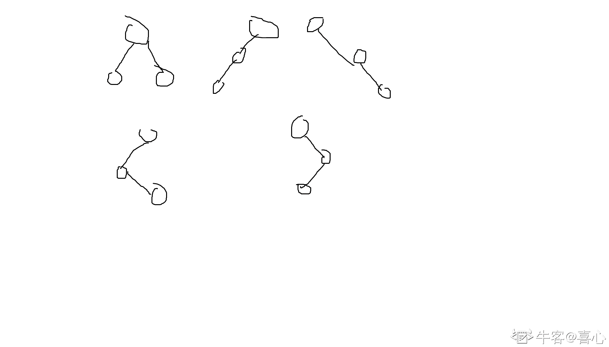

# 奇安信 2020web 前端开发工程师（成都）-4 月 21 日

## 1

已知，1000 个硬币里有 10 个金币。随机的取出 n 个硬币，则取出硬币里有金币的概率是多少？

本题知识点

前端工程师 奇安信 2020 Java 工程师 C++工程师 PHP 工程师 golang 工程师 安卓工程师 iOS 工程师 安全工程师 测试开发工程师 测试工程师 运维工程师 大数据开发工程师

讨论

[不打游戏不熬夜](https://www.nowcoder.com/profile/281737645)

等一个满分答案🤣, 这难道是考概率论? 

发表于 2021-03-22 18:20:19

* * *

[牛客 941666686 号](https://www.nowcoder.com/profile/941666686)

case 通过率只有 10%~呜呜呜

```cpp
function gl(n){
    var p_top=1.0,p_buttom=1.0,p;
    if(n<=0){
        p=0.000000;
    }
    if(n>=990){
        p=1.000000;
    }
    if(n<=10){
        for(var i=0;i<n;i++){
            p_top=p_top*(990*(990-i));
            p_buttom=p_buttom*(1000*(1000-i));
        }
    }
    else{
        for(var i=0;i<10;i++){
            p_top=p_top*(990*(990-n+i));
            // p_top.toFixed(6);
            p_buttom=p_buttom*(1000*(1000-i));
            // p_buttom.toFixed(6);
        }
    }
    p=p_top/p_buttom;
    p.toFixed(6);
    return 1-p;
}
console.log(gl(999));
```

发表于 2021-03-20 10:36:40

* * *

[牛客 444311396 号](https://www.nowcoder.com/profile/444311396)

使用递归函数 10 行之内就能解决

发表于 2022-02-25 21:51:03

* * *

## 2

有一对兔子，从出生后的第五个月起每月生出一对小兔子（即满 4 月就开始生小兔），小兔子也会出生从第五个月起每月生一对小免子。假如兔子不会死，第 n 个月时，兔群有多少对兔子。

本题知识点

前端工程师 奇安信 2020 Java 工程师 C++工程师 PHP 工程师 golang 工程师 安卓工程师 iOS 工程师 安全工程师 测试开发工程师 测试工程师 运维工程师 大数据开发工程师

讨论

[0xl1tmu2](https://www.nowcoder.com/profile/875480121)

#include <cstdio>int main()
{
    int n;
    scanf("%d",&n);
    long long c1 = 1,c2 = 0, c3 = 0, c4 = 0, c5 = 0;
    //分年龄统计,c1 到 c4 为不能繁殖的兔子（1-4 月），c5 表示当月可以繁殖的兔子
    for(int i=1;i<n;i++)
    {
        c5 += c4;
        c4 = c3;
        c3 = c2;
        c2 = c1;
        c1 = c5;
    }
    printf("%ld",c1+c2+c3+c4+c5);
    return 0;
}

发表于 2021-09-07 15:15:10

* * *

[一大岐](https://www.nowcoder.com/profile/269456880)

```cpp
import java.util.*;
public class Main{
    public static void main(String[] args){
        Scanner in = new Scanner(System.in);
        int n = in.nextInt();
        long[] dp = new long[n];
        dp[0] = 1;
        for(int i = 1; i < n; i++){
            if(i-4 < 0)
                dp[i] = dp[i-1];
            else
                dp[i] = dp[i-1]+dp[i-4];
        }
        System.out.println(dp[n-1]);
    }

}
```

发表于 2021-08-12 10:54:45

* * *

[我想叫 BruceWayne](https://www.nowcoder.com/profile/477288155)

我写的是 c 语言的，还是有点麻烦。主要是动态数组那里比较麻烦，后边就是分类。最坑的是数组越界的警告，后来将 arr 定义为 n+1 就好了，我忘了\0 是最后一个。以及数组类型，换为 longint 就好

发表于 2021-03-29 18:52:15

* * *

## 3

#080 是什么颜色

正确答案: B   你的答案: 空 (错误)

```cpp
蓝
```

```cpp
绿
```

```cpp
黄
```

```cpp
深蓝
```

本题知识点

前端工程师 奇安信 2020

讨论

[luckingmei](https://www.nowcoder.com/profile/815224596)

这道题很狗呀

发表于 2022-02-11 10:20:40

* * *

[牛客 391019934 号](https://www.nowcoder.com/profile/391019934)

考这个题多少沾点

发表于 2021-05-06 16:57:50

* * *

[JJJenny0607](https://www.nowcoder.com/profile/575589073)

颜色除了黑白其他还要考。。

发表于 2021-03-23 21:53:27

* * *

## 4

下列代码中 padding-top 的最终值是多少？
.parent { width: 200px; height: 100px; }  
.parent  > .child { height: inherit; padding-top: 50%; }

正确答案: A   你的答案: 空 (错误)

```cpp
100px
```

```cpp
50px
```

```cpp
200px
```

```cpp
150px
```

本题知识点

前端工程师 奇安信 2020

讨论

[牛客 66810791 号](https://www.nowcoder.com/profile/66810791)

height:inhert  表示继承父类高度当 padding/margin 为百分比时，无论 top/bottom 还是 left/right，对应的都是父类的 width

发表于 2021-03-23 13:00:12

* * *

## 5

下列 CSS 优先级描述正确的是？

正确答案: C   你的答案: 空 (错误)

```cpp
id > !important > class > tag > *
```

```cpp
!important > id   > class > tag > *
```

```cpp
!important > id > class > tag
```

```cpp
内联 > !important > id > class > tag
```

本题知识点

前端工程师 奇安信 2020

讨论

[牛客 656747940 号](https://www.nowcoder.com/profile/656747940)

不是通配符的优先级最低嘛，为啥 B 不能选

发表于 2021-03-24 13:48:46

* * *

[牛薄膜](https://www.nowcoder.com/profile/223303633)

B id 后面多了个空格，这也算错误？

发表于 2021-09-12 16:47:46

* * *

[牛客 481296161 号](https://www.nowcoder.com/profile/481296161)

为啥不能选 B？我还想了老半天决定还是选长点的结果选 C

发表于 2021-04-24 15:45:59

* * *

## 6

以下哪些值当作的 type 属性是有效的

正确答案: A   你的答案: 空 (错误)

```cpp
radio
```

```cpp
select
```

```cpp
option
```

```cpp
textarea
```

本题知识点

前端工程师 奇安信 2020

讨论

[夜寻极光。](https://www.nowcoder.com/profile/868966489)

input 的 type 属性如下：

*   button
*   checkbox
*   file
*   hidden
*   image
*   password
*   radio
*   reset
*   submit
*   text

发表于 2021-08-27 10:28:28

* * *

## 7

以下哪个不是 window.document 的方法

正确答案: D   你的答案: 空 (错误)

```cpp
createElement
```

```cpp
write
```

```cpp
querySelector
```

```cpp
print
```

本题知识点

前端工程师 奇安信 2020

讨论

[夜寻极光。](https://www.nowcoder.com/profile/868966489)

print 是 window.print  用于打印当前窗口的内容。

发表于 2021-08-27 10:29:30

* * *

## 8

以下方法，哪个是字符串对象的方法 

正确答案: A   你的答案: 空 (错误)

```cpp
match
```

```cpp
test
```

```cpp
jion
```

```cpp
exec
```

本题知识点

前端工程师 奇安信 2020

讨论

[柯南 YY](https://www.nowcoder.com/profile/521389335)

摘自[`www.cnblogs.com/zona/p/5851413.html`](https://www.cnblogs.com/zona/p/5851413.html)1.匹配相关：与正则表达式配合使用

（1）str.match(RegExp):匹配指定字符串

（2）str.replace(RegExp):替换指定字符

（3）str.search(RegExp):查找字符

2.索引相关：

（1）charAt(index):通过索引值查找，返回指定字符

（2）indexOf(val):返回指定字符首次出现的位置

（3）lastIndexOf(val):返回指定字符最后出现的位置

（4）charCodeAt(index):返回指定字符的 Unicode 编码，介于 0 - 65535 的数字

3.操作字符相关：

（1）str1.concat(str2,...,strn) :连接字符串

（2）str.slice(start,end):传入两个索引值，截取两个值之间的字符串，不包括 end 值。返回新字符串。若 start 为负数，从最后一位开始数起。

（3）str.substr(start,length):传入截取的其实索引值和截取的长度，返回新字符串，若 start 为负数，从最后一位开始数起。

（4）str.substring(from,to):传入两个索引值，截取两个值之间的字符串，不包括 to 值。返回新字符串，若 start 为负数，默认 start 为 0\.

（5）str.split(spearator,limit):分割字符串，以数组形式返回。spearator 指定切割的地方，limit 设置返回字符串的最大长度.

4.不需要传参：

（1）str.valueOf():返回字符串原始值

（2）str.toUpperCase():字符串大写

（3）str.toLowerCase():字符串小写

（4）str.trim():去掉字符串两边空白

发表于 2021-10-08 22:21:45

* * *

## 9

当 r 为以下哪个值时，r.test('www.a.com') != r.test('he.llo@world')

正确答案: B   你的答案: 空 (错误)

```cpp
/\w+(\.\w+)+/
```

```cpp
/\w+(\.\w+)+$/
```

```cpp
/$\w+(\.\w+)/
```

```cpp
/\W/
```

本题知识点

前端工程师 奇安信 2020

讨论

[牛客 589890733 号](https://www.nowcoder.com/profile/589890733)

\w 匹配数字字母下划线，\W 匹配非\w，也就是说他们是互补的，\w 匹配不上的，\W 能匹配上，反之亦然。$表示匹配结尾。+表示匹配前面的字符 1 次或多次，如果+前面是个小括号，那就是匹配括号的模式一次或多次，而*表示匹配 0 次或多次，这个很容易记，+表示正数嘛。\w+(\.\w+)+$不能匹配 he.llo@world，因为虽然 he.llo 能匹配\w+(\.\w+)+，但是@不能匹配$；虽然 world 能匹配$，但是 world 不能匹配\w+(\.\w+)+

发表于 2022-01-28 12:30:53

* * *

## 10

以下代码运行结果是什么
console.log(true||false&&false, true&&false||true)

正确答案: A   你的答案: 空 (错误)

```cpp
true true
```

```cpp
true false
```

```cpp
false true
```

```cpp
false false
```

本题知识点

前端工程师 奇安信 2020

讨论

[牛客 66810791 号](https://www.nowcoder.com/profile/66810791)

&&优先级高于||

发表于 2021-03-23 14:27:46

* * *

## 11

以下代码，运行结果是什么：
var arr=[1,2,3];
arr.push(arr.shift())
console.log(arr[1],arr[2])

正确答案: C   你的答案: 空 (错误)

```cpp
1 2
```

```cpp
2 3
```

```cpp
3 1
```

```cpp
运行抛错
```

本题知识点

前端工程师 奇安信 2020

讨论

[czw9527](https://www.nowcoder.com/profile/641565986)

shift()操作从数组头部删除一个元素，返回删除的元素，改变原数组，push()操作从数组尾部添加一个元素，改变原数组，
先执行 arr.shift()操作，返回值为 1.arr 从头部删除一个元素变成[2 ,3]；
在执行 arr.push()操作，从尾部添加 1 这个元素, arr 变成[2, 3, 1]所有 console.log(arr[1],arr[2])  // 打印 3 ，1

编辑于 2021-03-19 22:12:42

* * *

## 12

以下代码，运行结果是什么：
var s='12ab3cd', arr=s.split(/\d/);
console.log(arr[3],arr[4])

正确答案: B   你的答案: 空 (错误)

```cpp
3 cd
```

```cpp
cd undefined
```

```cpp
undefined undefined
```

```cpp
运行抛错
```

本题知识点

前端工程师 奇安信 2020

讨论

[czw9527](https://www.nowcoder.com/profile/641565986)

split()函数用于指定字符两边分割字符串，分割后的元素（包括空白符）依次放入[ ]得到一个数组。/\d/为匹配数字 s.split(/\d/);   就是从 1，2，3 的两边处分割 s 字符串，分割后得到的数组为[ , , 'ab', 'cd']所以 console.log(arr[3],arr[4])  // 打印 cd  undefined 

发表于 2021-03-19 22:17:36

* * *

## 13

在 linux 系统中获取帮助信息的命令是？

正确答案: B   你的答案: 空 (错误)

```cpp
help
```

```cpp
man
```

```cpp
cat
```

```cpp
display
```

本题知识点

前端工程师 奇安信 2020 安卓工程师 iOS 工程师 安全工程师 运维工程师 C++工程师

讨论

[Active_Waylon](https://www.nowcoder.com/profile/983229690)

```cpp
命令 --help
man 命令
```

发表于 2021-09-08 20:44:56

* * *

## 14

设两个进程共用一个临界段的互斥信号量 mutex，当 mutex=-1 时表示？

正确答案: C   你的答案: 空 (错误)

```cpp
没有一个进程进入了临界段
```

```cpp
两个进程进入了临界段
```

```cpp
一个进程入了临界段，另一个进程等待
```

```cpp
两个进程都在等待
```

本题知识点

前端工程师 奇安信 2020 Java 工程师 C++工程师 PHP 工程师 golang 工程师 安全工程师 运维工程师

讨论

[我要上岸🙏🙏🙏🙏🙏](https://www.nowcoder.com/profile/81398270)

信号量分为**互斥量**和**信号量**，**互斥量的初始值一般为 1，表示临界区只允许一个进程进入**，从而实现互斥；**互斥量等于 0**时，表示**临界区已经有 1 个进程进入**，**临界区外无进程等待**；**互斥量小于 0**时，表示**临界区****已经有 1 个进程进入**，**互斥量的绝对值表示在临界区外等待进入的进程数**。资源信号量的初值可以是任意整数，**表示可用的资源数**，**资源数小于 0 时，表示所有资源全部用完**，**而且还有进程正在等待使用该资源**，**等待的进程数就是资源量的绝对值。**

发表于 2021-03-24 22:00:43

* * *

[陌上*花*开](https://www.nowcoder.com/profile/594946438)

互斥信号量，初始值为 1，取值范围为（-1， 0，1）。当信号量为 1 时，表示两个进程皆未进入需要互斥的临界区；当信号量为 0 时，表示有一个进程进入临界区运行，另一个必须等待；当信号量为-1 时，表示有一个进程正在临界区运行，另一个进程因等待而阻塞在信号量队列中，需要当前已在临界区运行的进程退出时唤醒。

发表于 2021-08-22 17:25:49

* * *

## 15

按照二叉树的定义,具有 3 个结点的二叉树有（）种。

正确答案: A   你的答案: 空 (错误)

```cpp
3
```

```cpp
4
```

```cpp
5
```

```cpp
6
```

本题知识点

前端工程师 奇安信 2020 Java 工程师 C++工程师 PHP 工程师 golang 工程师 测试开发工程师 测试工程师 运维工程师 安卓工程师 iOS 工程师 大数据开发工程师

讨论

[喜心](https://www.nowcoder.com/profile/161809437)

为什么不是五种

发表于 2021-06-20 17:16:23

* * *

[某不知名一牛客](https://www.nowcoder.com/profile/663498326)

这个题应该出错了 就是五种，画出来是五种，用公式也是五种:(2n)!/n!*(n+1)!  其中 n 为节点数

发表于 2021-08-02 21:57:19

* * *

[牛客 993774460 号](https://www.nowcoder.com/profile/993774460)

这题想表达什么，没有看懂

发表于 2021-03-29 14:48:29

* * *

## 16

下列叙述中，正确的是

正确答案: D   你的答案: 空 (错误)

```cpp
线性表的线性存贮结构优于链表存贮结构
```

```cpp
队列的操作方式是先进后出
```

```cpp
栈的操作方式是先进先出
```

```cpp
二维数组是指它的每个数据元素为一个线性表的线性表
```

本题知识点

前端工程师 奇安信 2020 Java 工程师 C++工程师 PHP 工程师 golang 工程师 测试开发工程师 测试工程师 安卓工程师 iOS 工程师 运维工程师 大数据开发工程师

讨论

[陌上*花*开](https://www.nowcoder.com/profile/594946438)

A: 线性表查找复杂度为 O(1),添加删除元素复杂度为 O(n)，而链表查找复杂度为 O(n)，添加删除元素时空复杂度为 O(1)，所以二者无法直接比较，在不同***作下各有优缺点
B：队列是先进先出
C：栈是先进后出
D：二维数组可以看多一个一维数组，而一维数组的每一个元素都是另一个一位数组，所以是一个相对的二维数组，B 选项正确。

发表于 2021-08-22 17:33:22

* * *

## 17

表达式(1+34)*5-56/7 的后缀表达式为

正确答案: C   你的答案: 空 (错误)

```cpp
1+34*5-56/7
```

```cpp
-*+1 34 5/56 7
```

```cpp
1 34 +5*56 7/-
```

```cpp
1 34 5* +56 7/-
```

本题知识点

前端工程师 奇安信 2020 Java 工程师 C++工程师 PHP 工程师 golang 工程师 测试开发工程师 测试工程师 运维工程师 大数据开发工程师

讨论

[牛客 222494146 号](https://www.nowcoder.com/profile/222494146)

只说解题技巧，按四则运算来算，运算符放后面，详细的看编译原理 1\. 带括号的先算（1+34） =>  1 34+2\. 算乘法 *5 =>   1 34+5* = A3\. 算除法 56/7 =>  56 7/ = B4\. 算减法 A-B => AB- =>  1 34+5* 56 7 / -

发表于 2022-02-18 15:16:37

* * *

[来自星空的问候](https://www.nowcoder.com/profile/414875103)

[(3 条消息) 前 _ 中 _ 后缀表达式的相互转化与计算 _Yore_999 的博客-CSDN 博客 _ 前中后缀表达式转换](https://blog.csdn.net/qq_35284646/article/details/115472711?spm=1001.2014.3001.5501)

发表于 2021-06-16 23:42:09

* * *

[牛客 928575466 号](https://www.nowcoder.com/profile/928575466)

要入栈的*优先级不是高于已经在栈顶的+吗，不就直接入栈了吗，+怎么先出栈了

发表于 2021-04-10 00:23:53

* * *

## 18

设有一个含有 13 个元素的 Hash 表(0~12),Hash 函数是:H(key)=key % 13,其中% 是求余数运算。用线性探查法解决冲突,则对于序列(2、８、31、20、19、18、53、27),18 应放在第几号格中

正确答案: B   你的答案: 空 (错误)

```cpp
5
```

```cpp
9
```

```cpp
4
```

```cpp
0
```

本题知识点

前端工程师 奇安信 2020 Java 工程师 C++工程师 PHP 工程师 golang 工程师 测试开发工程师 测试工程师 运维工程师 大数据开发工程师

讨论

[寻宝 i](https://www.nowcoder.com/profile/852504222)

2、8、31、20、19 对 13 的余数为 2,8，5,7,6 依此放在在第 2，8，5,7,6 号格中 18%13=5,第 5 号格已经有数，冲突。
因为用线性探查法解决冲突，所以往后移，第 6,7,8 号格中都已经有数了，所以放在第 9 号格中

发表于 2021-09-01 16:01:28

* * *

[牛客 _s.j.l](https://www.nowcoder.com/profile/427273944)

线性探查解决 hash 冲突是从冲突位置向后找到不冲突的位置然后，将值放到这个位置

发表于 2021-03-21 07:17:33

* * *

## 19

以下对布隆过滤器的描述中哪个选项是错误的

正确答案: A   你的答案: 空 (错误)

```cpp
能使用 Hashtable 的场景都可以用布隆过滤器代替
```

```cpp
本质上布隆过滤器是一种数据结构
```

```cpp
布隆过滤器特点是高效地插入和查询，可以用来告诉你 “某样东西一定不存在或者可能存在"
```

```cpp
相比于传统的 List、Set、Map 等数据结构，它更高效、占用空间更少，但是缺点是其返回的结果是概率性的，而不是确切的。
```

本题知识点

前端工程师 奇安信 2020 Java 工程师 C++工程师 PHP 工程师 golang 工程师 安卓工程师 iOS 工程师 测试开发工程师 测试工程师 运维工程师 大数据开发工程师

## 20

线性表若采用链表存贮结构，要求内存中可用存贮单元地址

正确答案: D   你的答案: 空 (错误)

```cpp
必须连续
```

```cpp
部分地址必须连续
```

```cpp
一定不连续
```

```cpp
连续不连续均可
```

本题知识点

前端工程师 奇安信 2020 Java 工程师 C++工程师 PHP 工程师 golang 工程师 安卓工程师 iOS 工程师 测试开发工程师 测试工程师 运维工程师 大数据开发工程师

## 21

关于 Ipsec 协议描述正确的是：

正确答案: C   你的答案: 空 (错误)

```cpp
可以根据 IP 报头中的协议字段判定工作模式
```

```cpp
传输层为 ICMP 协议的为隧道模式
```

```cpp
IP 报头协议字段为 50，表示使用 ESP 协议
```

```cpp
IP 报头协议字段为 4500，表示使用 AH 协议
```

本题知识点

前端工程师 奇安信 2020 Java 工程师 C++工程师 PHP 工程师 golang 工程师 安卓工程师 iOS 工程师 运维工程师

## 22

下列功能不是 ICMPv4 报文完成的功能？

正确答案: D   你的答案: 空 (错误)

```cpp
差错报告
```

```cpp
主机存活诊断
```

```cpp
路由重定向
```

```cpp
物理地址解析
```

本题知识点

前端工程师 奇安信 2020 Java 工程师 C++工程师 PHP 工程师 golang 工程师 安卓工程师 iOS 工程师 安全工程师 运维工程师

讨论

[xsjsjxbdj](https://www.nowcoder.com/profile/176075581)

D 啊，物理地址解析不是 ARP 干的事吗

发表于 2022-01-28 14:46:25

* * *

[牛客 589890733 号](https://www.nowcoder.com/profile/589890733)

ping 就是基于 ICMP 的

发表于 2022-01-28 13:34:43

* * *

## 23

在谷歌浏览器中，以下哪些是有效的 style.color 值

正确答案: C D   你的答案: 空 (错误)

```cpp
#red
```

```cpp
#EFG
```

```cpp
#9AB
```

```cpp
#ABCD
```

本题知识点

前端工程师 奇安信 2020

讨论

[牛客 589890733 号](https://www.nowcoder.com/profile/589890733)

第二次看到这种题了，无语了，感觉没啥意义啊，算了总结一下吧。颜色代码可以用#RRGGBB[AA]表示，R 表示红，G 表示绿，B 表示蓝，A 是透明度，透明度可以省略，默认是 FF。除了这种完整版，还有一种缩减版，用#RGB[A]表示，#f098 相当于#ff009988。这两种使用的都是 16 进制编码，所以只会出现 0-9a-f。A 选项多加了个#，B 选项出现了 G，C 是缩减的版本不含透明度，D 是缩减的版本，含透明度。

发表于 2022-01-28 13:45:03

* * *

## 24

以下哪些 HTML 元素可以有 target 属性

正确答案: A C   你的答案: 空 (错误)

```cpp
A
```

```cpp
IFRAME
```

```cpp
FORM
```

```cpp
SCRIPT
```

本题知识点

前端工程师 奇安信 2020

## 25

光标已在输入框。这时用户键入一个字母"a"，过程中会触发哪些事件（事件交互）

正确答案: B C   你的答案: 空 (错误)

```cpp
mouseenter
```

```cpp
keydown
```

```cpp
keypress
```

```cpp
blur
```

本题知识点

前端工程师 奇安信 2020

## 26

当 r 为以下哪些值时，r.test('aBc') != r.test('bCd')

正确答案: A C   你的答案: 空 (错误)

```cpp
/b/
```

```cpp
/c/i
```

```cpp
/d/i
```

```cpp
/[abc]/
```

本题知识点

前端工程师 奇安信 2020

讨论

[Active_Waylon](https://www.nowcoder.com/profile/983229690)

```cpp
let regex = /[abc]/;
console.log(regex.test('aBc') != regex.test('bCd'));
// false
regex.test('aBc')
//true
regex.test('bCd')
//true
```

发表于 2021-09-08 21:04:34

* * *

## 27

以下代码，能正常执行的有：

正确答案: C D   你的答案: 空 (错误)

```cpp
JSON.parse('{"age":1+2}')
```

```cpp
JSON.parse('{"age":new Date("2019/01/01")}')
```

```cpp
JSON.parse('{"age":["a",23]}')
```

```cpp
JSON.parse('"abc"')
```

本题知识点

前端工程师 奇安信 2020

## 28

以下代码，哪些圆括号可以省略

正确答案: A C D   你的答案: 空 (错误)

```cpp
void (0);
```

```cpp
alert (3);
```

```cpp
var a={name:'Tom'}; delete (a.name);
```

```cpp
typeof (window.document);
```

本题知识点

前端工程师 奇安信 2020

## 29

以下容易造成缓冲区溢出的函数是（）

正确答案: A C   你的答案: 空 (错误)

```cpp
strcpy
```

```cpp
strncat
```

```cpp
sprintf
```

```cpp
strcmp
```

本题知识点

小米 C++工程师 C++ C 语言 奇安信

讨论

[Lee124](https://www.nowcoder.com/profile/957365898)

A. strcpy     没限制长度可能导致溢出（安全版本 strncpy）B. strncat    限制了 copy 的长度就没问题，strcat 可能导致溢出 C. sprintf     和 printf()一样，有格式化字符串攻击的可能 D. strcmp    比较两个 string 长度，无危害

发表于 2020-09-01 20:35:31

* * *

[MonkeyH](https://www.nowcoder.com/profile/8391276)

1.  strcpy() :函数将源字符串复制到缓冲区。没有指定要复制字符的具体数目！如果源字符串碰巧来自用户输入，且没有专门限制其大小，则有可能会造成缓冲区溢出！
2.  strcat() :函数非常类似于 strcpy()，它可以将一个字符串合并到缓冲区末尾。
3.  sprintf()、vsprintf() : 用来格式化文本和将其存入缓冲区的通用函数

        可以看出来在对缓冲区进行写操作的时候都有可能导致内存溢出。

发表于 2019-03-20 09:21:09

* * *

[牛客 135416480 号](https://www.nowcoder.com/profile/135416480)

一脸茫然，，，

发表于 2020-11-03 19:11:33

* * *

## 30

下列排序算法中，哪些时间复杂度不会超过 nlogn？

正确答案: B C   你的答案: 空 (错误)

```cpp
快速排序
```

```cpp
堆排序
```

```cpp
归并排序
```

```cpp
冒泡排序
```

本题知识点

复杂度 排序 *腾讯 前端工程师 奇安信 2020 安卓工程师 iOS 工程师 C++工程师 大数据开发工程师* *讨论

[企 _ 企](https://www.nowcoder.com/profile/209898)

解析：几种常见的排序算法对比

  查看全部)

编辑于 2015-02-04 21:38:53

* * *

[好学上进](https://www.nowcoder.com/profile/708096)


发表于 2016-09-05 10:12:09

* * *

[￥shell](https://www.nowcoder.com/profile/5026412)

快排理想状态下 nlogn，但是最坏情况下 n2，
对于堆排序无论什么情况都为 nlogn，但是空间也存在额外的开支 O(logn）
归并 nlogn
冒泡最优 O(n)平均 O(n2）

 BC

发表于 2016-08-06 14:48:16

* * *

## 31

下列关于队列的叙述中错误的是？

正确答案: A B D   你的答案: 空 (错误)

```cpp
在队列中只能插入数据
```

```cpp
在队列中只能删除数据
```

```cpp
队列是先进先出的线性表
```

```cpp
队列是先进后出的线性表
```

本题知识点

测试开发工程师 酷家乐 2020 前端工程师 奇安信 安卓工程师 iOS 工程师 C++工程师 大数据开发工程师

讨论

[崔立涵](https://www.nowcoder.com/profile/635134273)

abd

编辑于 2021-09-21 15:56:20

* * *

[不知道用啥好](https://www.nowcoder.com/profile/539549113)

abd

发表于 2021-09-20 20:51:33

* * *

[牛客 519559859 号](https://www.nowcoder.com/profile/519559859)

ABD

发表于 2021-09-20 20:37:20

* * *

## 32

对于 TCP 的拥塞控制的描述正确的是?

正确答案: B C   你的答案: 空 (错误)

```cpp
拥塞控制算法也同样适用于 UDP
```

```cpp
TCP 拥塞控制算法一般以丢包为网络进入拥塞状态的信号
```

```cpp
Vegas，Reno，Cubic，BBR 都是拥塞控制算法
```

```cpp
拥塞控制算法的状态机包括以下几个状态：Open，Slow Start，Disorder，Recovery，Loss
```

本题知识点

前端工程师 奇安信 2020 Java 工程师 C++工程师 PHP 工程师 golang 工程师 安全工程师 运维工程师

讨论

[zzzzz_zou](https://www.nowcoder.com/profile/131127443)

拥塞控制状态机的状态有五种，分别是 Open，Disorder，CWR，Recovery 和 Loss 状态

发表于 2021-03-29 15:54:09

* * **</cstdio>