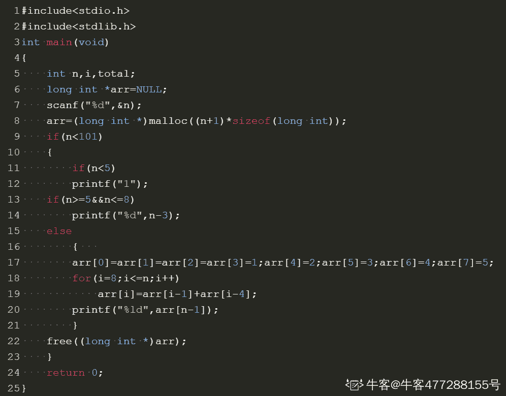
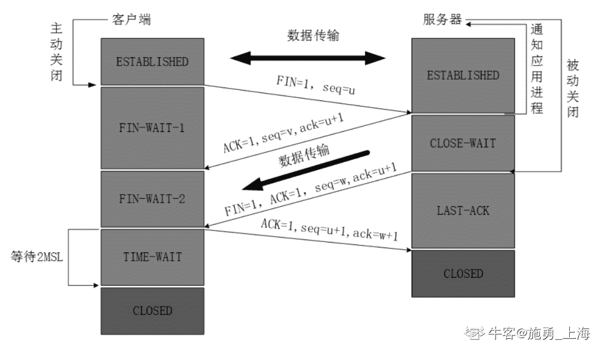

# 奇安信 2020 春招运维开发工程师（一）

## 1

已知，1000 个硬币里有 10 个金币。随机的取出 n 个硬币，则取出硬币里有金币的概率是多少？

本题知识点

前端工程师 奇安信 2020 Java 工程师 C++工程师 PHP 工程师 golang 工程师 安卓工程师 iOS 工程师 安全工程师 测试开发工程师 测试工程师 运维工程师 大数据开发工程师

讨论

[不打游戏不熬夜](https://www.nowcoder.com/profile/281737645)

等一个满分答案🤣, 这难道是考概率论? 

发表于 2021-03-22 18:20:19

* * *

[牛客 941666686 号](https://www.nowcoder.com/profile/941666686)

case 通过率只有 10%~呜呜呜

```cpp
function gl(n){
    var p_top=1.0,p_buttom=1.0,p;
    if(n<=0){
        p=0.000000;
    }
    if(n>=990){
        p=1.000000;
    }
    if(n<=10){
        for(var i=0;i<n;i++){
            p_top=p_top*(990*(990-i));
            p_buttom=p_buttom*(1000*(1000-i));
        }
    }
    else{
        for(var i=0;i<10;i++){
            p_top=p_top*(990*(990-n+i));
            // p_top.toFixed(6);
            p_buttom=p_buttom*(1000*(1000-i));
            // p_buttom.toFixed(6);
        }
    }
    p=p_top/p_buttom;
    p.toFixed(6);
    return 1-p;
}
console.log(gl(999));
```

发表于 2021-03-20 10:36:40

* * *

[牛客 444311396 号](https://www.nowcoder.com/profile/444311396)

使用递归函数 10 行之内就能解决

发表于 2022-02-25 21:51:03

* * *

## 2

有一对兔子，从出生后的第五个月起每月生出一对小兔子（即满 4 月就开始生小兔），小兔子也会出生从第五个月起每月生一对小免子。假如兔子不会死，第 n 个月时，兔群有多少对兔子。

本题知识点

前端工程师 奇安信 2020 Java 工程师 C++工程师 PHP 工程师 golang 工程师 安卓工程师 iOS 工程师 安全工程师 测试开发工程师 测试工程师 运维工程师 大数据开发工程师

讨论

[0xl1tmu2](https://www.nowcoder.com/profile/875480121)

#include <cstdio>int main()
{
    int n;
    scanf("%d",&n);
    long long c1 = 1,c2 = 0, c3 = 0, c4 = 0, c5 = 0;
    //分年龄统计,c1 到 c4 为不能繁殖的兔子（1-4 月），c5 表示当月可以繁殖的兔子
    for(int i=1;i<n;i++)
    {
        c5 += c4;
        c4 = c3;
        c3 = c2;
        c2 = c1;
        c1 = c5;
    }
    printf("%ld",c1+c2+c3+c4+c5);
    return 0;
}

发表于 2021-09-07 15:15:10

* * *

[一大岐](https://www.nowcoder.com/profile/269456880)

```cpp
import java.util.*;
public class Main{
    public static void main(String[] args){
        Scanner in = new Scanner(System.in);
        int n = in.nextInt();
        long[] dp = new long[n];
        dp[0] = 1;
        for(int i = 1; i < n; i++){
            if(i-4 < 0)
                dp[i] = dp[i-1];
            else
                dp[i] = dp[i-1]+dp[i-4];
        }
        System.out.println(dp[n-1]);
    }

}
```

发表于 2021-08-12 10:54:45

* * *

[我想叫 BruceWayne](https://www.nowcoder.com/profile/477288155)

我写的是 c 语言的，还是有点麻烦。主要是动态数组那里比较麻烦，后边就是分类。最坑的是数组越界的警告，后来将 arr 定义为 n+1 就好了，我忘了\0 是最后一个。以及数组类型，换为 longint 就好

发表于 2021-03-29 18:52:15

* * *

## 3

关于 Http 状态码，下面说法正确的是？

正确答案: A   你的答案: 空 (错误)

```cpp
2XX 表示成功
```

```cpp
3XX 表示客户端采取进一步的操作才能完成请求
```

```cpp
4XX 表示服务端错误
```

```cpp
5XX 表示客户端错误
```

本题知识点

Java 工程师 C++工程师 PHP 工程师 golang 工程师 奇安信 2020 运维工程师 安卓工程师 iOS 工程师

讨论

[folkman](https://www.nowcoder.com/profile/1152252)

A2XX 表示请求成功 3XX 表示服务器端重定向请求资源以完成请求 4XX 表示客户端错误，或者请求的服务端资源不存在 5XX 表示服务端错误

发表于 2021-08-08 11:37:37

* * *

[to_sia](https://www.nowcoder.com/profile/649988010)

| 1** | 信息，服务器收到请求，需要请求者继续执行操作 |
| 2** | 成功，操作被成功接收并处理 |
| 3** | 重定向，需要进一步的操作以完成请求 |
| 4** | 客户端错误，请求包含语法错误或无法完成请求 |
| 5** | 服务器错误，服务器在处理请求的过程中发生了错误 |

发表于 2021-08-06 16:55:56

* * *

## 4

监听下面哪些端口需要 root 权限?

正确答案: A   你的答案: 空 (错误)

```cpp
80
```

```cpp
8080
```

```cpp
1008
```

```cpp
443
```

本题知识点

Java 工程师 C++工程师 PHP 工程师 golang 工程师 奇安信 2020 运维工程师 安卓工程师 iOS 工程师

讨论

[陌上*花*开](https://www.nowcoder.com/profile/594946438)

不是监听 1024 以下的端口都要 root 权限嘛？？？？

发表于 2021-08-22 17:23:17

* * *

## 5

关于 UTF-8 编码，下面说法正确的是？

正确答案: A   你的答案: 空 (错误)

```cpp
可以向下兼容 ASCII 编码
```

```cpp
固定使用 4 个字节表示
```

```cpp
与字节顺序无关
```

```cpp
与 unicode 是相互替代关系
```

本题知识点

Java 工程师 C++工程师 PHP 工程师 golang 工程师 奇安信 2020 运维工程师 安卓工程师 iOS 工程师 大数据开发工程师

讨论

[常平 wudi](https://www.nowcoder.com/profile/5045524)

ASCII 码是一代目 GB2312 等是二代目 unicode 是三代目 UTF-8 是四代目所以 d 中 unicode1 不是互补，更像是继承其中 UTF-8 本身就是可变长码，1-6 字节都有，用的多的用短字节编码，用的少的用多字节编码，所以 b 错

发表于 2021-09-14 10:51:08

* * *

## 6

关于 Python 语言的特点，以下选项描述正确的是

正确答案: B   你的答案: 空 (错误)

```cpp
Python 语言不支持面向对象
```

```cpp
Python 语言是解释型语言
```

```cpp
Python 语言是编译型语言
```

```cpp
Python 语言是非跨平台语言
```

本题知识点

测试开发工程师 测试工程师 奇安信 2020 运维工程师

## 7

下面代码的输出结果是: print( 0.1 + 0.2 == 0.3)

正确答案: A   你的答案: 空 (错误)

```cpp
FALSE
```

```cpp
0.1
```

```cpp
-1
```

```cpp
0
```

本题知识点

Java 工程师 C++工程师 PHP 工程师 golang 工程师 奇安信 2020 测试开发工程师 测试工程师 运维工程师

讨论

[国宾山城乐堡](https://www.nowcoder.com/profile/68784008)

0.1+0.2=0.30000000000000004 所以为 false

发表于 2021-03-23 14:52:19

* * *

[牛客 _s.j.l](https://www.nowcoder.com/profile/427273944)

算数运算符+的优先级高于比较运算符==

发表于 2021-03-21 07:15:46

* * *

[牛客 968167863 号](https://www.nowcoder.com/profile/968167863)

答案错了吧

发表于 2022-01-25 23:50:05

* * *

## 8

如果 Python 程序执行时，产生了 “unexpected indent” 的错误，其原因是：

正确答案: D   你的答案: 空 (错误)

```cpp
代码中使用了错误的关键字
```

```cpp
代码中缺少“：”符号
```

```cpp
代码里的语句嵌套层次太多
```

```cpp
代码中出现了缩进不匹配的问题
```

本题知识点

Java 工程师 C++工程师 PHP 工程师 golang 工程师 奇安信 2020 测试开发工程师 测试工程师 运维工程师

## 9

在 linux 系统中获取帮助信息的命令是？

正确答案: B   你的答案: 空 (错误)

```cpp
help
```

```cpp
man
```

```cpp
cat
```

```cpp
display
```

本题知识点

前端工程师 奇安信 2020 安卓工程师 iOS 工程师 安全工程师 运维工程师 C++工程师

讨论

[Active_Waylon](https://www.nowcoder.com/profile/983229690)

```cpp
命令 --help
man 命令
```

发表于 2021-09-08 20:44:56

* * *

## 10

设两个进程共用一个临界段的互斥信号量 mutex，当 mutex=-1 时表示？

正确答案: C   你的答案: 空 (错误)

```cpp
没有一个进程进入了临界段
```

```cpp
两个进程进入了临界段
```

```cpp
一个进程入了临界段，另一个进程等待
```

```cpp
两个进程都在等待
```

本题知识点

前端工程师 奇安信 2020 Java 工程师 C++工程师 PHP 工程师 golang 工程师 安全工程师 运维工程师

讨论

[我要上岸🙏🙏🙏🙏🙏](https://www.nowcoder.com/profile/81398270)

信号量分为**互斥量**和**信号量**，**互斥量的初始值一般为 1，表示临界区只允许一个进程进入**，从而实现互斥；**互斥量等于 0**时，表示**临界区已经有 1 个进程进入**，**临界区外无进程等待**；**互斥量小于 0**时，表示**临界区****已经有 1 个进程进入**，**互斥量的绝对值表示在临界区外等待进入的进程数**。资源信号量的初值可以是任意整数，**表示可用的资源数**，**资源数小于 0 时，表示所有资源全部用完**，**而且还有进程正在等待使用该资源**，**等待的进程数就是资源量的绝对值。**

发表于 2021-03-24 22:00:43

* * *

[陌上*花*开](https://www.nowcoder.com/profile/594946438)

互斥信号量，初始值为 1，取值范围为（-1， 0，1）。当信号量为 1 时，表示两个进程皆未进入需要互斥的临界区；当信号量为 0 时，表示有一个进程进入临界区运行，另一个必须等待；当信号量为-1 时，表示有一个进程正在临界区运行，另一个进程因等待而阻塞在信号量队列中，需要当前已在临界区运行的进程退出时唤醒。

发表于 2021-08-22 17:25:49

* * *

## 11

设栈 S 的初始状态为空，元素 a, b, c, d, e, f, g 依次入栈，以下出栈序列不可能出现的是

正确答案: D   你的答案: 空 (错误)

```cpp
a, b, c, e, d, f, g
```

```cpp
b, c, a, f, e, g, d
```

```cpp
a, e, d, c, b, f, g
```

```cpp
g, e, f, d, c, b, a
```

本题知识点

安卓工程师 iOS 工程师 奇安信 2020 安全工程师 测试开发工程师 测试工程师 运维工程师 C++工程师 大数据开发工程师

讨论

[牛客 574435187 号](https://www.nowcoder.com/profile/574435187)

后进先出，D 选项第一个出栈的是 g，说明全部入栈，下一个出栈的只能是在它前一个进栈的 f。

发表于 2021-03-22 10:25:23

* * *

[夫差斗战](https://www.nowcoder.com/profile/890490121)

栈遵循【先进后出】的原则

发表于 2021-03-21 22:46:36

* * *

## 12

完全二叉树的结点个数为 4 * N + 3，则它的叶结点个数为

正确答案: A   你的答案: 空 (错误)

```cpp
2 * N + 2
```

```cpp
2 * N
```

```cpp
2 * N - 1
```

```cpp
2 * N + 1
```

本题知识点

安卓工程师 iOS 工程师 奇安信 2020 安全工程师 测试开发工程师 测试工程师 运维工程师 C++工程师 大数据开发工程师

讨论

[牛客 548058099 号](https://www.nowcoder.com/profile/548058099)

设叶结点数为 M，结点数为 N，有 M=（N+1）/2 代入题目已知条件，叶结点数=（4*N+3+1）/2=2*N+2

发表于 2021-10-13 13:10:40

* * *

## 13

按照二叉树的定义,具有 3 个结点的二叉树有（）种。

正确答案: A   你的答案: 空 (错误)

```cpp
3
```

```cpp
4
```

```cpp
5
```

```cpp
6
```

本题知识点

前端工程师 奇安信 2020 Java 工程师 C++工程师 PHP 工程师 golang 工程师 测试开发工程师 测试工程师 运维工程师 安卓工程师 iOS 工程师 大数据开发工程师

讨论

[喜心](https://www.nowcoder.com/profile/161809437)

为什么不是五种

发表于 2021-06-20 17:16:23

* * *

[某不知名一牛客](https://www.nowcoder.com/profile/663498326)

这个题应该出错了 就是五种，画出来是五种，用公式也是五种:(2n)!/n!*(n+1)!  其中 n 为节点数

发表于 2021-08-02 21:57:19

* * *

[牛客 993774460 号](https://www.nowcoder.com/profile/993774460)

这题想表达什么，没有看懂

发表于 2021-03-29 14:48:29

* * *

## 14

表达式(1+34)*5-56/7 的后缀表达式为

正确答案: C   你的答案: 空 (错误)

```cpp
1+34*5-56/7
```

```cpp
-*+1 34 5/56 7
```

```cpp
1 34 +5*56 7/-
```

```cpp
1 34 5* +56 7/-
```

本题知识点

前端工程师 奇安信 2020 Java 工程师 C++工程师 PHP 工程师 golang 工程师 测试开发工程师 测试工程师 运维工程师 大数据开发工程师

讨论

[牛客 222494146 号](https://www.nowcoder.com/profile/222494146)

只说解题技巧，按四则运算来算，运算符放后面，详细的看编译原理 1\. 带括号的先算（1+34） =>  1 34+2\. 算乘法 *5 =>   1 34+5* = A3\. 算除法 56/7 =>  56 7/ = B4\. 算减法 A-B => AB- =>  1 34+5* 56 7 / -

发表于 2022-02-18 15:16:37

* * *

[来自星空的问候](https://www.nowcoder.com/profile/414875103)

[(3 条消息) 前 _ 中 _ 后缀表达式的相互转化与计算 _Yore_999 的博客-CSDN 博客 _ 前中后缀表达式转换](https://blog.csdn.net/qq_35284646/article/details/115472711?spm=1001.2014.3001.5501)

发表于 2021-06-16 23:42:09

* * *

[牛客 928575466 号](https://www.nowcoder.com/profile/928575466)

要入栈的*优先级不是高于已经在栈顶的+吗，不就直接入栈了吗，+怎么先出栈了

发表于 2021-04-10 00:23:53

* * *

## 15

设有一个含有 13 个元素的 Hash 表(0~12),Hash 函数是:H(key)=key % 13,其中% 是求余数运算。用线性探查法解决冲突,则对于序列(2、８、31、20、19、18、53、27),18 应放在第几号格中

正确答案: B   你的答案: 空 (错误)

```cpp
5
```

```cpp
9
```

```cpp
4
```

```cpp
0
```

本题知识点

前端工程师 奇安信 2020 Java 工程师 C++工程师 PHP 工程师 golang 工程师 测试开发工程师 测试工程师 运维工程师 大数据开发工程师

讨论

[寻宝 i](https://www.nowcoder.com/profile/852504222)

2、8、31、20、19 对 13 的余数为 2,8，5,7,6 依此放在在第 2，8，5,7,6 号格中 18%13=5,第 5 号格已经有数，冲突。
因为用线性探查法解决冲突，所以往后移，第 6,7,8 号格中都已经有数了，所以放在第 9 号格中

发表于 2021-09-01 16:01:28

* * *

[牛客 _s.j.l](https://www.nowcoder.com/profile/427273944)

线性探查解决 hash 冲突是从冲突位置向后找到不冲突的位置然后，将值放到这个位置

发表于 2021-03-21 07:17:33

* * *

## 16

线性表若采用链表存贮结构，要求内存中可用存贮单元地址

正确答案: D   你的答案: 空 (错误)

```cpp
必须连续
```

```cpp
部分地址必须连续
```

```cpp
一定不连续
```

```cpp
连续不连续均可
```

本题知识点

前端工程师 奇安信 2020 Java 工程师 C++工程师 PHP 工程师 golang 工程师 安卓工程师 iOS 工程师 测试开发工程师 测试工程师 运维工程师 大数据开发工程师

## 17

如用下列 SQL 语句创建一个 student 表：
CREATE TABLE student(STUDENT_NO int NOT NULL,
NAME char(2) NOT NULL,
SEX char(1),
AGE int);
下列那些关于 NULL 的写法是错误的

正确答案: A   你的答案: 空 (错误)

```cpp
select * from student where SEX=NULL
```

```cpp
select * from student where SEX IS NOT NULL
```

```cpp
SELECT * from student where SEX<>'M'
```

```cpp
SELECT * from student where SEX='M'
```

本题知识点

安卓工程师 iOS 工程师 奇安信 2020 安全工程师 Java 工程师 C++工程师 PHP 工程师 golang 工程师 运维工程师

## 18

假设 student 表有以下记录
STUDENT_NO     SEX
---------------------------- 
1       M
2       F
3       NULL
查询语句 select STUDENT_NO from student where SEX<>'F'; 的结果是

正确答案: A   你的答案: 空 (错误)

```cpp
1
```

```cpp
1   2
```

```cpp
3
```

```cpp
1  3
```

本题知识点

安卓工程师 iOS 工程师 奇安信 2020 安全工程师 Java 工程师 C++工程师 PHP 工程师 golang 工程师 测试开发工程师 测试工程师 运维工程师 大数据开发工程师

讨论

[牛客 230587610 号](https://www.nowcoder.com/profile/230587610)

SQL 中使用不等于运算符时，会自动过滤掉 null 值。

发表于 2021-03-31 00:12:49

* * *

## 19

假设 student 表有以下记录
STUDENT_NO     SEX  AGE
---------------------------- 
1       M   20
2       F     30 
3       NULL  NULL
查询语句 select COUNT(*),COUNT(AGE),AVG(AGE) from student; 的结果是

正确答案: D   你的答案: 空 (错误)

```cpp
3 2 NULL
```

```cpp
2 2 25
```

```cpp
3 3 16.666667
```

```cpp
3 2 25
```

本题知识点

Java 工程师 C++工程师 PHP 工程师 golang 工程师 奇安信 2020 安全工程师 测试开发工程师 测试工程师 运维工程师 大数据开发工程师

讨论

[风雨孤剑客](https://www.nowcoder.com/profile/4455961)

**AVG()、SUM()：运算时忽略 NULL 值**

**COUNT()：**

**COUNT(*)或 COUNT(1)：对表中的行数进行统计，不管某一行是否有 NULL 值**

**COUNT(字段名)：对特定列进行统计，会忽略 NULL 值进行统计**

发表于 2021-04-07 00:28:22

* * *

## 20

关于 Ipsec 协议描述正确的是：

正确答案: C   你的答案: 空 (错误)

```cpp
可以根据 IP 报头中的协议字段判定工作模式
```

```cpp
传输层为 ICMP 协议的为隧道模式
```

```cpp
IP 报头协议字段为 50，表示使用 ESP 协议
```

```cpp
IP 报头协议字段为 4500，表示使用 AH 协议
```

本题知识点

前端工程师 奇安信 2020 Java 工程师 C++工程师 PHP 工程师 golang 工程师 安卓工程师 iOS 工程师 运维工程师

## 21

下列功能不是 ICMPv4 报文完成的功能？

正确答案: D   你的答案: 空 (错误)

```cpp
差错报告
```

```cpp
主机存活诊断
```

```cpp
路由重定向
```

```cpp
物理地址解析
```

本题知识点

前端工程师 奇安信 2020 Java 工程师 C++工程师 PHP 工程师 golang 工程师 安卓工程师 iOS 工程师 安全工程师 运维工程师

讨论

[xsjsjxbdj](https://www.nowcoder.com/profile/176075581)

D 啊，物理地址解析不是 ARP 干的事吗

发表于 2022-01-28 14:46:25

* * *

[牛客 589890733 号](https://www.nowcoder.com/profile/589890733)

ping 就是基于 ICMP 的

发表于 2022-01-28 13:34:43

* * *

## 22

下面哪个地址是 IPv6 链路本地址？

正确答案: B   你的答案: 空 (错误)

```cpp
FF02::3
```

```cpp
FE91::ffff
```

```cpp
FEf0::4
```

```cpp
FF01::ff00
```

本题知识点

Java 工程师 C++工程师 PHP 工程师 golang 工程师 奇安信 2020 安全工程师 运维工程师

讨论

[捞一下吧](https://www.nowcoder.com/profile/5465511)

本地链路地址 具有前缀 1111 1110  10。

发表于 2021-03-23 16:42:42

* * *

## 23

对于进程间通信的匿名管道，下面说法正确的是？

正确答案: B   你的答案: 空 (错误)

```cpp
支持双向数据流
```

```cpp
只支持单向数据流
```

```cpp
只可用于具有亲缘关系的进程之间
```

```cpp
以一种特殊设备文件形式存在于文件系统中
```

本题知识点

Java 工程师 C++工程师 PHP 工程师 golang 工程师 奇安信 2020 运维工程师 安卓工程师 iOS 工程师 大数据开发工程师

讨论

[寻宝 i](https://www.nowcoder.com/profile/852504222)

只能用于具有血缘关系的[进程间通信](https://baike.baidu.com/item/%E8%BF%9B%E7%A8%8B%E9%97%B4%E9%80%9A%E4%BF%A1/1235923)，通常用于父子进程建通信，题目不严谨，BC 应该都是正确的

发表于 2021-09-22 19:55:51

* * *

[不打游戏不熬夜](https://www.nowcoder.com/profile/281737645)

C 选项错在哪了? 兄弟们

发表于 2021-03-22 19:44:07

* * *

## 5

关于 UTF-8 编码，下面说法正确的是？

正确答案: A   你的答案: 空 (错误)

```cpp
可以向下兼容 ASCII 编码
```

```cpp
固定使用 4 个字节表示
```

```cpp
与字节顺序无关
```

```cpp
与 unicode 是相互替代关系
```

本题知识点

Java 工程师 C++工程师 PHP 工程师 golang 工程师 奇安信 2020 运维工程师 安卓工程师 iOS 工程师 大数据开发工程师

讨论

[常平 wudi](https://www.nowcoder.com/profile/5045524)

ASCII 码是一代目 GB2312 等是二代目 unicode 是三代目 UTF-8 是四代目所以 d 中 unicode1 不是互补，更像是继承其中 UTF-8 本身就是可变长码，1-6 字节都有，用的多的用短字节编码，用的少的用多字节编码，所以 b 错

发表于 2021-09-14 10:51:08

* * *

## 25

以下哪些是正确的字符串？

正确答案: B D   你的答案: 空 (错误)

```cpp
‘abc”ab”
```

```cpp
‘abc”ab’
```

```cpp
“abc”ab”
```

```cpp
“abc\”ab”
```

本题知识点

Java 工程师 C++工程师 PHP 工程师 golang 工程师 奇安信 2020 运维工程师

## 26

Python 中用于接受参数的传递的可变参数有？

正确答案: B C   你的答案: 空 (错误)

```cpp
*kv
```

```cpp
*arg
```

```cpp
**kwargs
```

```cpp
*var
```

本题知识点

Java 工程师 C++工程师 PHP 工程师 golang 工程师 奇安信 2020 运维工程师

讨论

[尹骏](https://www.nowcoder.com/profile/755174108)

个人理解，A 和 D 本质上和 B 是一样的，感觉这个题目本身有问题，答案也不如人意，感觉应该选 ABD+C

发表于 2021-11-22 11:48:31

* * *

## 27

关于 truncate table 以下描述是正确的

正确答案: C D   你的答案: 空 (错误)

```cpp
Truncate table 可跟 Where 从句，根据条件进行删除
```

```cpp
触发器对 Truncate table 有效
```

```cpp
Truncate table 可义删除全部记录
```

```cpp
truncate 比 delete 快
```

本题知识点

测试开发工程师 测试工程师 奇安信 2020 运维工程师

讨论

[牛客 504104551 号](https://www.nowcoder.com/profile/504104551)

truncate table ：截断表，用于清空一个表，是一个 DDL 语言，效率高，比 Delete 快。

发表于 2021-03-22 21:22:40

* * *

[牛客 _s.j.l](https://www.nowcoder.com/profile/427273944)

数据库–关于 truncate 和 delete 的区别 1.truncate 删除表中的内容，不删除表结构，释放空间； 2.delete 删除内容，不删除表结构，但不释放空间 3.区别 3.1 内存空间 truncate 删除数据后重新写数据会从 1 开始，而 delete 删除数据后只会从删除前的最后一行续写；内存空间上，truncate 省空间 3.2 处理速度 因为，truncate 是直接从 1 开始，即全部清空开始，而 delete 需要先得到当前行数，从而进行续写；所以 truncate 删除速度比 delete 快；

发表于 2021-03-21 07:22:00

* * *

## 28

数据库常见约束有

正确答案: A B D   你的答案: 空 (错误)

```cpp
主键约束
```

```cpp
外键约束
```

```cpp
内键约束
```

```cpp
空值约束
```

本题知识点

Java 工程师 C++工程师 PHP 工程师 golang 工程师 奇安信 2020 测试开发工程师 测试工程师 运维工程师

讨论

[牛客 111722557 号](https://www.nowcoder.com/profile/111722557)

数据库常见约束有空值约束，主键约束，唯一约束，外键约束和参照约束，缺省值约束，检查约束

发表于 2021-03-27 18:33:40

* * *

## 29

下面哪些为正确 IPV6 地址格式

正确答案: A B D   你的答案: 空 (错误)

```cpp
::
```

```cpp
::/1
```

```cpp
0001::f301::0534:2201
```

```cpp
::FFFF:192.168.99.1
```

本题知识点

Java 工程师 C++工程师 PHP 工程师 golang 工程师 奇安信 2020 安全工程师 运维工程师

## 30

对于 TCP 的拥塞控制的描述正确的是?

正确答案: B C   你的答案: 空 (错误)

```cpp
拥塞控制算法也同样适用于 UDP
```

```cpp
TCP 拥塞控制算法一般以丢包为网络进入拥塞状态的信号
```

```cpp
Vegas，Reno，Cubic，BBR 都是拥塞控制算法
```

```cpp
拥塞控制算法的状态机包括以下几个状态：Open，Slow Start，Disorder，Recovery，Loss
```

本题知识点

前端工程师 奇安信 2020 Java 工程师 C++工程师 PHP 工程师 golang 工程师 安全工程师 运维工程师

讨论

[zzzzz_zou](https://www.nowcoder.com/profile/131127443)

拥塞控制状态机的状态有五种，分别是 Open，Disorder，CWR，Recovery 和 Loss 状态

发表于 2021-03-29 15:54:09

* * *

## 31

以下关于符号连接与硬连接的说法， 正确的是

正确答案: A D   你的答案: 空 (错误)

```cpp
创建符号连接时，将创建一个 inode
```

```cpp
创建硬连接时，将创建一个 inode
```

```cpp
删除符号连接源文件后， 连接文件还可继续访问
```

```cpp
删除硬连接源文件后， 连接文件还可继续访问
```

本题知识点

Java 工程师 C++工程师 PHP 工程师 golang 工程师 奇安信 2020 运维工程师 安卓工程师 iOS 工程师 大数据开发工程师

讨论

[初级炼丹师 Yiky](https://www.nowcoder.com/profile/342467844)

**Linux 中包括两种链接：硬链接(Hard Link)和软链接(Soft Link),软链接又称为符号链接（Symbolic link）。**

**硬链接** 

硬链接是文件的别名。从技术上讲,他们公用一个 inode(inode 中包含了一个文件的所有必要的信息，说 inode 就是文件也是没有问题的)。 

由于 linux 下的文件是通过索引节点（Inode）来识别文件，硬链接也可以认为是一个指向文件索引节点的指针，系统并不为它重新分配 inode, 

每添加一个一个硬链接，文件的链接数就加 1, 删除一个则链接数减 1。

大多数系统不允许创建一个目录的硬链接。在允许创建目录硬链接的系统上，只有超级用户才能才能这样做。

不能创建跨文件系统(分区)的硬链接（这些限制在 POSIX 中都不是强制性的）。 **软链接（符号链接）**

 软链接是一种特殊的文件类型,其中包含对另一个 文件/目录 以 绝对/相对 路径形式的引用.

 软链接可以看做是对一个文件的间接指针,相当于 windows 下的快捷方式。

软链接没有任何文件系统的限制，任何用户可以创建指向  文件/目录 的符号链接。甚至可以跨越不同机器、不同网络对文件进行链接。

创建文件的软链接时，软链接会使用一个新的 inode，所以软链接的 inode 号和文件的 inode 号不同(表明他们是两个不同的文件)，

软链接的 inode 里存放着指向文件的路径，删除源文件，软链接也无法使用了，因为文件的路径不存在了；删除软链接对原文件没有任何影响。

当我们再次创建这个文件时（文件名与之前的相同），软链接又会重新指向这个文件（inode 号与之前的不同了），而硬链接不会受其影响.

当然软链接也有硬链接没有的缺点，因为链接文件包含有原文件的路径信息，所以当原文件从一个目录下移到其他目录中，再访问链接文件，系统就找不到了，

而硬链接就没有这个缺陷，你想怎么移就怎么移；还有它要系统分配额外的空间用于建立新的索引节点和保存原文件的路径。 

发表于 2022-02-26 10:34:41

* * *

## 32

以下哪些是在 TCP 四次挥手里会出现的报文

正确答案: B C   你的答案: 空 (错误)

```cpp
SYN
```

```cpp
ACK
```

```cpp
FIN
```

```cpp
CLOSE
```

本题知识点

Java 工程师 C++工程师 PHP 工程师 golang 工程师 奇安信 2020 运维工程师 大数据开发工程师

讨论

[某不知名一牛客](https://www.nowcoder.com/profile/663498326)

淦这题我下意识当成三次握手了

发表于 2021-08-02 22:10:50

* * *

[施勇 _ 上海](https://www.nowcoder.com/profile/228323617)

TCP 连接四次挥手中使用 FIN 和 ACK 报文

发表于 2022-02-13 18:24:26

* * *

[牛客 180248781 号](https://www.nowcoder.com/profile/180248781)

Ack 应答，fin 是啥？

发表于 2021-04-08 16:09:07

* * *</cstdio>