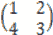

# 奇安信 2020 数据分析及应用工程师（一）

## 1

SELECT username, count(username) FROM user_name WHERE username>10 GROUP BY username HAVING ORDER BY username，其执行的顺序应该为

正确答案: A   你的答案: 空 (错误)

```cpp
FROM->WHERE->GROUP BY->HAVING->SELECT->ORDER BY
```

```cpp
FROM->GROUP BY->WHERE->HAVING->SELECT->ORDER BY
```

```cpp
FROM->WHERE->GROUP BY->HAVING->ORDER BY->SELECT
```

```cpp
FROM->WHERE->ORDER BY->GROUP BY->HAVING->SELECT
```

本题知识点

数据分析师 奇安信 2020

## 2

设置表 ts_score 中的 score 列为非空，那么可以使用哪个语句

正确答案: B   你的答案: 空 (错误)

```cpp
alter table ts_score add score not null
```

```cpp
alter table ts_score modify score not null
```

```cpp
alter table ts_score alter score not null
```

```cpp
alter table ts_score drop score not null
```

本题知识点

数据分析师 奇安信 2020

## 3

对下面的查询语句描述正确的是：Select StudentID,Name,(select count(*) from StudentExam where StudentExam.StudentID = Student.StudentID) as ExamsTaken from Student order by ExamsTaken desc

正确答案: D   你的答案: 空 (错误)

```cpp
从 Student 表中查找 StudentID 和 Name，并按照升序排列
```

```cpp
从 Student 表中查找 StudentID 和 Name，并按照降序排列
```

```cpp
从 Student 表中查找 StudentID、Name 和考试次数
```

```cpp
从 Student 表中查找 StudentID、Name，并从 StudentExam 表中查找与 StudentID 一致的学生考试次数，并按照降序排列
```

本题知识点

数据分析师 奇安信 2020

## 4

查询选修了 3 门以上课程的学生的学生号，正确的 SQL 语句是

正确答案: B   你的答案: 空 (错误)

```cpp
SELECT Sno FROM SC GROUP BY Sno WHERE COUNT（*）> 3
```

```cpp
SELECT Sno FROM SC GROUP BY Sno HAVING( COUNT（*）> 3)
```

```cpp
SELECT Sno FROM SC ORDER BY Sno WHERE COUNT（*）> 3
```

```cpp
SELECT Sno FROM SC ORDER BY Sno HAVING COUNT（*）>= 3
```

本题知识点

数据分析师 奇安信 2020

## 5

有 3 个表，表中分别有记录 12 行，5 行，6 行，三表进行交叉连接后，结果集中共有多少行数据

正确答案: D   你的答案: 空 (错误)

```cpp
231
```

```cpp
23
```

```cpp
77
```

```cpp
360
```

本题知识点

数据分析师 奇安信 2020

讨论

[牛各](https://www.nowcoder.com/profile/479414011)

没有 WHERE 条件约束时产生行数为表的笛卡尔积，即表 A 行数*表 B 行数*表 C 行数...12*5*6=360

发表于 2021-04-26 16:35:50

* * *

## 6

关于左外连接查询的说法不正确的是

正确答案: D   你的答案: 空 (错误)

```cpp
左外连接查询是以左侧的表为主表
```

```cpp
右外连接查询可以和左外连接查询相互转换
```

```cpp
右外连接查询查询时右表中的记录会全部显示
```

```cpp
两表进行左外连接查询和右外连接查询查询出的结果都是一样的
```

本题知识点

数据分析师 奇安信 2020

## 7

spark streaming 与 spark core 的关系是

正确答案: A   你的答案: 空 (错误)

```cpp
spark streaming 的计算逻辑运行在 spark core 中的
```

```cpp
两者无关
```

```cpp
spark streaming 是 spark core 的一部分
```

```cpp
spark core 是 spark streaming 的一部分
```

本题知识点

数据分析师 奇安信 2020

## 8

echo 10+10 && echo "1+1" 输出结果

正确答案: A   你的答案: 空 (错误)

```cpp
10+10 1+1
```

```cpp
20   2
```

```cpp
20 1+1
```

```cpp
10+10 2
```

本题知识点

数据分析师 奇安信 2020

## 9

fsimage 和 edit 的出现在哪个系统

正确答案: A   你的答案: 空 (错误)

```cpp
HDFS 系统
```

```cpp
NTFS 系统
```

```cpp
Linux 系统
```

```cpp
Windos 系统
```

本题知识点

数据分析师 奇安信 2020

## 10

如何快速的停止一个 MRjob

正确答案: A   你的答案: 空 (错误)

```cpp
hadoop job kill hadoop-id
```

```cpp
Hadoop job kill -9 hadoop-id
```

```cpp
hdfs job kill hadoop-id
```

```cpp
hdfs job kill -9 hadoop-id
```

本题知识点

数据分析师 奇安信 2020

## 11

下面哪个负责 HDFS 数据存储

正确答案: C   你的答案: 空 (错误)

```cpp
NameNode
```

```cpp
Jobtracker
```

```cpp
Datanode
```

```cpp
secondaryNameNode
```

本题知识点

数据分析师 奇安信 2020

## 12

下面关于 Hive，说法错误的是

正确答案: A   你的答案: 空 (错误)

```cpp
Hive 支持所有标准 SQL 语法
```

```cpp
Hives 底层采用的计算引擎可以是 MapReduc
```

```cpp
Hives 提供的 HQL 语法，与传统 SQL 很类似
```

```cpp
Hive Server 可采用 Mysql 存储元数据信息
```

本题知识点

数据分析师 奇安信 2020

## 13

通常而言，一个标准的生产环境（考虑成本，效益等）中，Zookeeper 实例个数不可能是

正确答案: A   你的答案: 空 (错误)

```cpp
4
```

```cpp
5
```

```cpp
7
```

```cpp
3
```

本题知识点

数据分析师 奇安信 2020

## 14

关于 HDFS 和 Hbase，说法错误的是

正确答案: A   你的答案: 空 (错误)

```cpp
HDFS 和 Hbase 无直接关系
```

```cpp
HDFS 不能随机读写，HBase 可以
```

```cpp
HDFS 适合存储大文件，Hbase 可以存储小文件数据
```

```cpp
Hbase 底层采用了 HDFS
```

本题知识点

数据分析师 奇安信 2020

## 15

SNN 的作用

正确答案: C   你的答案: 空 (错误)

```cpp
对 NN 的热备
```

```cpp
对内存没有要求
```

```cpp
帮助 NN 合并编辑日志，减少 NN 启动时间
```

```cpp
SNN 应与 NN 部署到一个节点
```

本题知识点

数据分析师 奇安信 2020

## 16

reduceByKey 与 groupByKey 的描述正确的是

正确答案: A   你的答案: 空 (错误)

```cpp
reduceByKey 性能高于 groupByKey
```

```cpp
groupByKey 性能高于 reduceByKey
```

```cpp
两者性能无差别
```

```cpp
其他说法均不正确
```

本题知识点

数据分析师 奇安信 2020

## 17

大数据文件系统默认块的大小

正确答案: C   你的答案: 空 (错误)

```cpp
与物理磁盘一致
```

```cpp
68M
```

```cpp
128M
```

```cpp
8M
```

本题知识点

数据分析师 奇安信 2020

讨论

[程前 1808024143](https://www.nowcoder.com/profile/141531967)

c

发表于 2021-04-28 15:01:14

* * *

[bossCD](https://www.nowcoder.com/profile/439321416)

C

发表于 2021-04-20 14:59:41

* * *

[博乐毅](https://www.nowcoder.com/profile/963832793)

c

发表于 2021-04-01 19:50:08

* * *

## 18

以下描述 oracle、hive，正确的是

正确答案: C   你的答案: 空 (错误)

```cpp
oracle 性能高于 hive
```

```cpp
hive 性能高于 oracle
```

```cpp
hive 为数据仓库，oracle 为数据库
```

```cpp
oracle 能够存储海量数据，hive 能快速查找某条数据
```

本题知识点

数据分析师 奇安信 2020

讨论

[一生白色](https://www.nowcoder.com/profile/92661346)

oracle 单点，hive 分布式且可选 mr、spark 等多种计算框架，存储可以使用 textfile 也可以使用 parquet 等压缩格式，不好评估性能。D 选项描述是反的

发表于 2021-08-10 10:55:33

* * *

## 19

选出不同类型的算子

正确答案: C   你的答案: 空 (错误)

```cpp
exp
```

```cpp
dblink
```

```cpp
delete
```

```cpp
sqlloader
```

本题知识点

数据分析师 奇安信 2020

## 20

下列哪个选项描述 select 正确的是

正确答案: C   你的答案: 空 (错误)

```cpp
可以改变数据表
```

```cpp
可以删除数据表中的某条数据
```

```cpp
可以和另一个表的内容生成新的结果集
```

```cpp
可以对表进行截断
```

本题知识点

数据分析师 奇安信 2020

## 21

下列与 "id NOT IN（"1","2"）"功能相同的表达式是

正确答案: D   你的答案: 空 (错误)

```cpp
id="1" AND id="2"
```

```cpp
id!="1" OR id！= "2"
```

```cpp
id="1" OR id="2"
```

```cpp
id!="1" AND id!="2"
```

本题知识点

数据分析师 奇安信 2020

## 22

下列说法错误的是

正确答案: A   你的答案: 空 (错误)

```cpp
用户只能锁定一个特定的表
```

```cpp
DML 产生的锁可以将锁归类为行级锁和表级锁
```

```cpp
锁用于在用户之间控制对数据的并发访问
```

```cpp
INSERT、UPDATE、DELETE 语句自动获得锁
```

本题知识点

数据分析师 奇安信 2020

## 23

执行分组查询时，为了去掉不满足条件的分组，下列正确是

正确答案: A   你的答案: 空 (错误)

```cpp
在 GROUP BY 后面使用 HAVING 子句
```

```cpp
使用 WHERE 子句
```

```cpp
先使用 WHERE 子句，再使用 HAVING 子句
```

```cpp
先使用 HAVING 子句，再使用 WHERE 子句
```

本题知识点

数据分析师 奇安信 2020

## 24

修改表结构的命令是

正确答案: C   你的答案: 空 (错误)

```cpp
MODIFY TABLE
```

```cpp
MODIFY STRUCTURE
```

```cpp
ALTER TABLE
```

```cpp
ALTER STRUCTURE
```

本题知识点

数据分析师 奇安信 2020

## 25

在关系模型中，实现"关系中不允许出现相同的元组"的约束是通过

正确答案: B   你的答案: 空 (错误)

```cpp
候选键
```

```cpp
主键
```

```cpp
外键
```

```cpp
超键
```

本题知识点

数据分析师 奇安信 2020

## 26

只有满足联接条件的记录才包含在查询结果中，这种联接为

正确答案: C   你的答案: 空 (错误)

```cpp
左联接
```

```cpp
右联接
```

```cpp
内部联接
```

```cpp
完全联接
```

本题知识点

数据分析师 奇安信 2020

## 27

索引字段值不唯一，应该选择的索引类型为

正确答案: B   你的答案: 空 (错误)

```cpp
主索引
```

```cpp
普通索引
```

```cpp
候选索引
```

```cpp
唯一索引
```

本题知识点

数据分析师 奇安信 2020

## 28

下列函数中函数值为字符型的是

正确答案: C   你的答案: 空 (错误)

```cpp
DATE()
```

```cpp
YEAR()
```

```cpp
TIME()
```

```cpp
DATETIME()
```

本题知识点

数据分析师 奇安信 2020

## 29

oracle 将查询结果放在数组中应使用

正确答案: A   你的答案: 空 (错误)

```cpp
INTO CURSOR
```

```cpp
TO ARRAY
```

```cpp
INTO TABLE
```

```cpp
INTO ARRAY
```

本题知识点

数据分析师 奇安信 2020

## 30

like 查询时使用索引是

正确答案: A   你的答案: 空 (错误)

```cpp
like 'a%'
```

```cpp
like'%a'
```

```cpp
like'%a%'
```

```cpp
模糊查询不走索引
```

本题知识点

数据分析师 奇安信 2020

## 31

检测基本网络连接命令

正确答案: D   你的答案: 空 (错误)

```cpp
route
```

```cpp
netstat
```

```cpp
ifconfig
```

```cpp
ping
```

本题知识点

数据分析师 奇安信 2020

## 32

以下文件系统应该分配最大的存储是

正确答案: A   你的答案: 空 (错误)

```cpp
usr
```

```cpp
tmp
```

```cpp
bin
```

```cpp
root
```

本题知识点

数据分析师 奇安信 2020

## 33

以下哪一步需要 root 权限执行安装

正确答案: D   你的答案: 空 (错误)

```cpp
make
```

```cpp
make deps
```

```cpp
make config
```

```cpp
make install
```

本题知识点

数据分析师 奇安信 2020

## 34

定义用户环境的文件是

正确答案: D   你的答案: 空 (错误)

```cpp
bash &.bashrc
```

```cpp
bashrc & .bash_conf
```

```cpp
bashrc & bash_profile
```

```cpp
.bashrc & .bash_profile
```

本题知识点

数据分析师 奇安信 2020

## 35

mkdir 命令创建新的目录时,在其父目录不存在时先创建父目录的选项

正确答案: D   你的答案: 空 (错误)

```cpp
m
```

```cpp
d
```

```cpp
f
```

```cpp
p
```

本题知识点

数据分析师 奇安信 2020

## 36

具有很多 C 语言的功能,又称过滤器的

正确答案: C   你的答案: 空 (错误)

```cpp
csh
```

```cpp
tcsh
```

```cpp
awk
```

```cpp
sed
```

本题知识点

数据分析师 奇安信 2020

## 37

vi 编辑中,在光标当前所在行下添加一新行的命令是

正确答案: B   你的答案: 空 (错误)

```cpp
a
```

```cpp
o
```

```cpp
I
```

```cpp
A
```

本题知识点

数据分析师 奇安信 2020

## 38

删除数据文件 holiday.txt,大小为 10T,性能最快的是

正确答案: C   你的答案: 空 (错误)

```cpp
rm -rf *
```

```cpp
rm
```

```cpp
mv
```

```cpp
rmr
```

本题知识点

数据分析师 奇安信 2020

## 39

通过某分类器对样本数据进行判断，其中对于正样本预测准确的为 50 个，预测错误为 150 个；对于负样本，预测准确的为 100 个，预测错误为 100 个。由此我们可知，此模型的查准率和查全率分别是：

正确答案: D   你的答案: 空 (错误)

```cpp
25%，33.3%
```

```cpp
25%，37.5%
```

```cpp
33.3%，26%
```

```cpp
33.3%，25%
```

本题知识点

数据分析师 奇安信 2020

讨论

[牛客 980934327 号](https://www.nowcoder.com/profile/980934327)

*   TP：被模型预测为正类的正样本（TP=50）
*   TN：被模型预测为负类的负样本（TN=100）
*   FP：被模型预测为正类的负样本（FP=100）
*   FN：被模型预测为负类的正样本（FN=150）
*   P=TP/（TP+FP）
*   R=TP/（TP+FN）

发表于 2021-04-18 11:58:46

* * *

[牛各](https://www.nowcoder.com/profile/479414011)

查准率 Precision=TP/(TP+FP)=50/(50+100)=33.3%查全率 Recall=TP/(TP+FN)=50/(50+150)=25%

发表于 2021-04-26 16:30:00

* * *

## 40

分析某一样本，其中正样本为 40 个，负样本为 20 个。针对样本的某个特征 X，当其为 A 时对应 20 个正样本，12 个负样本；当其为 B 时对应 20 个正样本，8 个负样本。请计算基于特征 X 分类的信息增益是：

正确答案: C   你的答案: 空 (错误)

```cpp
2.33E-3
```

```cpp
1.67E-3
```

```cpp
6.3699999999999998E-3
```

```cpp
0.23400000000000001
```

本题知识点

数据分析师 奇安信 2020

## 41

一个图 14 条边，4 个度数为 4 的定点，其它顶点度数不超过 2，则此图中至少有多少个顶点？

正确答案: D   你的答案: 空 (错误)

```cpp
7
```

```cpp
8
```

```cpp
9
```

```cpp
10
```

```cpp
11
```

本题知识点

数据分析师 奇安信 2020

讨论

[Sacura](https://www.nowcoder.com/profile/843177898)

4+6=10 个顶点
14 条边,每条边会给两个顶点带来 1 度,顶点度数之和=14*2=28
度数为 4 的顶点：4*4=16
28-16=12
设剩下都为 2 度的顶点：12/2=6 发表于 2021-04-14 16:08:04

* * *

## 42

A 事件在一次实验中出现的概率是 2/3，三次独立实验中，A 出现至少一次的概率是

正确答案: A   你的答案: 空 (错误)

```cpp
26/27
```

```cpp
19/27
```

```cpp
3.7037037037037035E-2
```

```cpp
0.29629629629629628
```

本题知识点

数据分析师 奇安信 2020

## 43

 A=     求特征值为

正确答案: B   你的答案: 空 (错误)

```cpp
λ1=1  λ2=5
```

```cpp
λ1=-1  λ2=5
```

```cpp
λ1=1   λ2=-5
```

```cpp
λ1=-1   λ2=-5
```

本题知识点

数据分析师 奇安信 2020

讨论

[牛各](https://www.nowcoder.com/profile/479414011)

=(1-λ)(3-λ)-2*4=0λ=-1 或 5

发表于 2021-04-26 16:21:49

* * *

## 44

判断该偏微分方程为什么类型
5(∂² u)/(∂x² )+4 (∂² u)/∂x∂y+5 (∂² u)/(∂y² )+2 ∂u/∂x-4 ∂u/∂y+5=0

正确答案: A   你的答案: 空 (错误)

```cpp
椭圆型
```

```cpp
双曲型
```

```cpp
抛物型
```

```cpp
其他不是
```

本题知识点

数据分析师 奇安信 2020

## 45

设 f(4x)=lnx 求 f(x)的导数

正确答案: D   你的答案: 空 (错误)

```cpp
x
```

```cpp
x²
```

```cpp
1/x²
```

```cpp
1/x
```

本题知识点

数据分析师 奇安信 2020

讨论

[牛各](https://www.nowcoder.com/profile/479414011)

换元法 f(4x)=lnx 设 y=4x  则 f(y)=ln(y/4)=lny-ln4f'(y)=(lny-ln4)'=(lny)'-(ln4)'=(lny)'=1/y 所以 f'(x)=1/x

发表于 2021-04-26 16:15:17

* * *

## 46

关于 MapReduce，说法正确的是

正确答案: A B C D   你的答案: 空 (错误)

```cpp
MapRduce 具有容错性，一台节点挂掉不会导致整个应用程序运行停止
```

```cpp
所有 MapReduce 程序共用一个 ApplicationMaster
```

```cpp
MapReduce 程序可以运行在 YARN 上
```

```cpp
MapReduce 是 Hive 默认的计算引擎
```

本题知识点

数据分析师 奇安信 2020

## 47

用户可使用哪几种语言开发 MapReduce 应用程序

正确答案: A B C D   你的答案: 空 (错误)

```cpp
C++
```

```cpp
JAVA
```

```cpp
SCALA
```

```cpp
GO
```

本题知识点

数据分析师 奇安信 2020

## 48

下面哪个属于 YARN 自带的资源调度器

正确答案: A B C   你的答案: 空 (错误)

```cpp
FIFO
```

```cpp
Capacity Scheduler
```

```cpp
Fair Scheduler
```

```cpp
Deadline Scheduler
```

本题知识点

数据分析师 奇安信 2020

## 49

于使用 AlTER TABLE …MODIFY 进行修改表的定义，下列描述正确的是

正确答案: A B C   你的答案: 空 (错误)

```cpp
使用该命令可以修改列的名称
```

```cpp
使用该命令可以修改列的数据类型
```

```cpp
使用该命令可以修改列的精度
```

```cpp
使用该命令可以修改表的名称
```

本题知识点

数据分析师 奇安信 2020

## 50

mysql 数据库支持在线备份，在备份过程中,不允许哪些操作

正确答案: A B C D   你的答案: 空 (错误)

```cpp
创建或删除数据库文件
```

```cpp
创建索引
```

```cpp
执行非日志操作
```

```cpp
自动或者手工缩小数据库或者数据库的文件大小
```

本题知识点

数据分析师 奇安信 2020

## 51

下面有关 tablespace 和 datafile 的描述，说法错误的是

正确答案: A B   你的答案: 空 (错误)

```cpp
datafile 是逻辑上的概念，每个 datafile 只能在一个 tablespace 内
```

```cpp
tablespace 则在物理上储存了数据库的种种
```

```cpp
一个 tablespace 可以有一个或多个 datafile
```

```cpp
table 中的数据，通过 hash 算法分布在 tablespace 中的各个 datafile 中
```

本题知识点

数据分析师 奇安信 2020

## 52

以下哪个 SQL 语句能够返回-15 的绝对值并且显示别名为 Alias

正确答案: A B   你的答案: 空 (错误)

```cpp
SELECT ABS('-15') Alias   FROM DUAL
```

```cpp
SELECT ABS(-15) Alias   FROM DUAL
```

```cpp
SELECT ABS("-1 5") Alias  FROM DUAL
```

```cpp
SELECT ABS(-15 Alias  FROM DUAL
```

本题知识点

数据分析师 奇安信 2020

## 53

下面哪些 SQL 命令是正确的

正确答案: A B   你的答案: 空 (错误)

```cpp
ALTER TABLE TableName ADD COLUMN ColumnName Type
```

```cpp
ALTER TABLE TableName ADD ColumnName Type
```

```cpp
MODIFY TABLE TableName ADD COLUMN ColumnName
```

```cpp
MODIFY TABLE TableName ADD ColumnName
```

本题知识点

数据分析师 奇安信 2020

讨论

[聆风醉](https://www.nowcoder.com/profile/3280874)

A

发表于 2021-10-10 02:08:59

* * *

[小泽玛丽恩](https://www.nowcoder.com/profile/5168972)

modidy 是修改字段的属性
只是 alter 的一个功能

发表于 2021-04-04 23:34:19

* * *

[牛客 776116518 号](https://www.nowcoder.com/profile/776116518)

B 更新表语法 ALTER TableName ADD ColumnName DataType

发表于 2021-04-04 18:41:32

* * *

## 54

hdfs-site.xml 主要属性

正确答案: A C D   你的答案: 空 (错误)

```cpp
dfs.name.dir
```

```cpp
mapred.reduce.tasks
```

```cpp
fs.checkpoint.dir
```

```cpp
dfs.data.dir
```

本题知识点

数据分析师 奇安信 2020

## 55

客户端上传数据文件，正确的是

正确答案: B C   你的答案: 空 (错误)

```cpp
数据经过 NameNode 传递 DataNode
```

```cpp
客户端将文件切分为 Block，依次上传
```

```cpp
客户端 只上传数据到一台 DataNode，然后由 NameNode 负责 Block 复制工作
```

```cpp
其他说法均正确
```

本题知识点

数据分析师 奇安信 2020

## 56

哪些算子会有 shuffle

正确答案: A B C   你的答案: 空 (错误)

```cpp
distinct
```

```cpp
reducebykey
```

```cpp
join
```

```cpp
filter
```

本题知识点

数据分析师 奇安信 2020

## 57

运行 hadoop 集群需要哪些守护进程

正确答案: A B C   你的答案: 空 (错误)

```cpp
datanode
```

```cpp
namenode
```

```cpp
tasktracker
```

```cpp
job
```

本题知识点

数据分析师 奇安信 2020

讨论

[羽翼散](https://www.nowcoder.com/profile/733436322)

DataNode,NameNode,TaskTracker 和 JobTracker 都是运行 Hadoop 集群需要的守护进程。

发表于 2021-06-10 14:36:52

* * *

## 58

针对高阶回归的过拟合问题，解决方法包括：

正确答案: A C D   你的答案: 空 (错误)

```cpp
降低回归阶数
```

```cpp
减少样本数据量
```

```cpp
减少迭代次数
```

```cpp
减少特征数量
```

本题知识点

数据分析师 奇安信 2020

## 59

对于 k-means 描述正确的是

正确答案: B C   你的答案: 空 (错误)

```cpp
需要对样本进行标准化
```

```cpp
可以用欧式距离
```

```cpp
可以用余弦相似度
```

```cpp
样本分类质量对结果影响较大
```

本题知识点

数据分析师 奇安信 2020

讨论

[Jamesxiang11](https://www.nowcoder.com/profile/789162113)

D 怎么理解，为什么是错的？

发表于 2021-03-25 08:24:52

* * *

## 60

以下概念正确的是

正确答案: C D   你的答案: 空 (错误)

```cpp
分类正确的样本数 与 样本总数之比是查准率
```

```cpp
被正确检索的样本数 与 被检索到样本总数之比是准确率
```

```cpp
被正确检索的样本数 与 应当被检索到的样本数之比是查全率
```

```cpp
查全率又被称为召回率，追求高查全率通俗来讲就是宁可错杀不可漏掉
```

本题知识点

数据分析师 奇安信 2020

## 61

使用 HQL 查找每个部门分数最高的 ID

你的答案

本题知识点

数据分析师 奇安信 2020

讨论

[AlexMusk](https://www.nowcoder.com/profile/223944976)

select a.department_idfrom( select department_id,row_number() over(partition by department_id order by score desc) as rnfrom table) awhere a.rn = 1

发表于 2021-07-24 22:10:10

* * *

## 62

HIVE 中 HQL 执行过程

你的答案

本题知识点

数据分析师 奇安信 2020

讨论

[牛客 750611974 号](https://www.nowcoder.com/profile/750611974)

1.将 HQL 转成一组操作符 2、每个操作符代表的是一个 hdfs 操作或者是 mapreduce 任务 3、Hive 通过 ExecMapper 和 ExecReducer 执行 mapReduce 程序

发表于 2021-03-29 18:04:53

* * *

## 63

简单概括 mysql 主从配置

你的答案

本题知识点

数据分析师 奇安信 2020