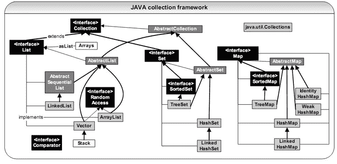
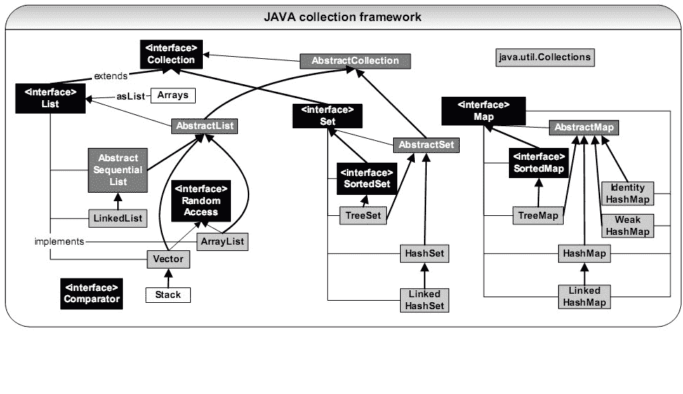

# 奇安信 2020 大数据开发方向试题（一）

## 1

已知，1000 个硬币里有 10 个金币。随机的取出 n 个硬币，则取出硬币里有金币的概率是多少？

本题知识点

前端工程师 奇安信 2020 Java 工程师 C++工程师 PHP 工程师 golang 工程师 安卓工程师 iOS 工程师 安全工程师 测试开发工程师 测试工程师 运维工程师 大数据开发工程师

讨论

[不打游戏不熬夜](https://www.nowcoder.com/profile/281737645)

等一个满分答案🤣, 这难道是考概率论? 

发表于 2021-03-22 18:20:19

* * *

[牛客 941666686 号](https://www.nowcoder.com/profile/941666686)

case 通过率只有 10%~呜呜呜

```cpp
function gl(n){
    var p_top=1.0,p_buttom=1.0,p;
    if(n<=0){
        p=0.000000;
    }
    if(n>=990){
        p=1.000000;
    }
    if(n<=10){
        for(var i=0;i<n;i++){
            p_top=p_top*(990*(990-i));
            p_buttom=p_buttom*(1000*(1000-i));
        }
    }
    else{
        for(var i=0;i<10;i++){
            p_top=p_top*(990*(990-n+i));
            // p_top.toFixed(6);
            p_buttom=p_buttom*(1000*(1000-i));
            // p_buttom.toFixed(6);
        }
    }
    p=p_top/p_buttom;
    p.toFixed(6);
    return 1-p;
}
console.log(gl(999));
```

发表于 2021-03-20 10:36:40

* * *

[牛客 444311396 号](https://www.nowcoder.com/profile/444311396)

使用递归函数 10 行之内就能解决

发表于 2022-02-25 21:51:03

* * *

## 2

有一对兔子，从出生后的第五个月起每月生出一对小兔子（即满 4 月就开始生小兔），小兔子也会出生从第五个月起每月生一对小免子。假如兔子不会死，第 n 个月时，兔群有多少对兔子。

本题知识点

前端工程师 奇安信 2020 Java 工程师 C++工程师 PHP 工程师 golang 工程师 安卓工程师 iOS 工程师 安全工程师 测试开发工程师 测试工程师 运维工程师 大数据开发工程师

讨论

[0xl1tmu2](https://www.nowcoder.com/profile/875480121)

#include <cstdio>int main()
{
    int n;
    scanf("%d",&n);
    long long c1 = 1,c2 = 0, c3 = 0, c4 = 0, c5 = 0;
    //分年龄统计,c1 到 c4 为不能繁殖的兔子（1-4 月），c5 表示当月可以繁殖的兔子
    for(int i=1;i<n;i++)
    {
        c5 += c4;
        c4 = c3;
        c3 = c2;
        c2 = c1;
        c1 = c5;
    }
    printf("%ld",c1+c2+c3+c4+c5);
    return 0;
}

发表于 2021-09-07 15:15:10

* * *

[一大岐](https://www.nowcoder.com/profile/269456880)

```cpp
import java.util.*;
public class Main{
    public static void main(String[] args){
        Scanner in = new Scanner(System.in);
        int n = in.nextInt();
        long[] dp = new long[n];
        dp[0] = 1;
        for(int i = 1; i < n; i++){
            if(i-4 < 0)
                dp[i] = dp[i-1];
            else
                dp[i] = dp[i-1]+dp[i-4];
        }
        System.out.println(dp[n-1]);
    }

}
```

发表于 2021-08-12 10:54:45

* * *

[我想叫 BruceWayne](https://www.nowcoder.com/profile/477288155)

我写的是 c 语言的，还是有点麻烦。主要是动态数组那里比较麻烦，后边就是分类。最坑的是数组越界的警告，后来将 arr 定义为 n+1 就好了，我忘了\0 是最后一个。以及数组类型，换为 longint 就好

发表于 2021-03-29 18:52:15

* * *

## 3

下列类型中，不是 java 语言基本数据类型的是

正确答案: C   你的答案: 空 (错误)

```cpp
long
```

```cpp
double
```

```cpp
String
```

```cpp
float
```

本题知识点

大数据开发工程师 奇安信 2020

讨论

[-13579](https://www.nowcoder.com/profile/654584696)

string 是引用类型

发表于 2021-04-06 13:17:36

* * *

## 4

在调用方法时，若要使方法改变实参的值，可以:

正确答案: B   你的答案: 空 (错误)

```cpp
用基本数据类型作为参数
```

```cpp
用对象作为参数
```

```cpp
“用基本数据类型作为参数”和“用对象作为参数”都对
```

```cpp
“用基本数据类型作为参数”和“用对象作为参数”都不对
```

本题知识点

测试开发工程师 测试工程师 奇安信 2020 大数据开发工程师

讨论

[常平 wudi](https://www.nowcoder.com/profile/5045524)

如果做错请复习数据类型和引用数据类型的区别**传递基本数据类型，栈里新开辟空间复制一个副本 age。修改的 age 是副本，不会修改主函数里栈的 age 的值。**
**修改引用数据类型，修改的是堆里的数据，而主函数里栈和副本里的 arr 都是指针，都指向堆里同一个数据域，副本改完了，主函数里的数也会变。**特别注意的是 String 中的底层实现是 char[],所以针对 String 的操作体现了部分基本数据类型的特点。

发表于 2021-09-14 10:44:06

* * *

## 5

下面是关于类以及其修饰符的一些描述，不正确的是

正确答案: A   你的答案: 空 (错误)

```cpp
final 类不但可以用来派生子类，也可以用来创建 final 类的对象
```

```cpp
abstract 类只能用来派生子类，不能用来创建 abstract 类的对象
```

```cpp
abstract 不能与 final 同时修饰一个类
```

```cpp
abstract 方法必须在 abstract 类中声明，但 abstract 类定义中可以没有 abstract 方法
```

本题知识点

Java 工程师 C++工程师 PHP 工程师 golang 工程师 奇安信 2020 测试开发工程师 测试工程师 大数据开发工程师

讨论

[牛客 504104551 号](https://www.nowcoder.com/profile/504104551)

final 修饰的变量不能改变，方法不能被重写，类不能被继承

发表于 2021-03-22 20:29:19

* * *

[牛客 72864520 号](https://www.nowcoder.com/profile/72864520)

final 类不能被继承，也就无法派生子类；abstract 类设计的目的就是代码复用，给与子类实现。

发表于 2021-08-26 20:13:53

* * *

## 6

设 Test 类为 Base 类的子类，下列语句错误的是

正确答案: B   你的答案: 空 (错误)

```cpp
Base obj = new Test();
```

```cpp
Test obj = new Base();
```

```cpp
Base obj = new Base();
```

```cpp
Test obj = new Test();
```

本题知识点

Java 工程师 C++工程师 PHP 工程师 golang 工程师 奇安信 2020 测试开发工程师 测试工程师 大数据开发工程师

讨论

[牛客 504104551 号](https://www.nowcoder.com/profile/504104551)

多态的向上转型：父类可以 new 子类 = 隐藏了子类的特有方法。向下转型就是强制类型转换，不安全。

发表于 2021-03-22 20:32:58

* * *

## 7

下列关于容器集合类的说法正确的是？

正确答案: C   你的答案: 空 (错误)

```cpp
LinkedList 继承自 List
```

```cpp
AbstractSet 继承自 Set
```

```cpp
HashSet 继承自 AbstractSet
```

```cpp
WeakMap 继承自 HashMap
```

本题知识点

Java 奇安信 2020

讨论

[W0-懂-緈-諨](https://www.nowcoder.com/profile/963857)

选 ca 选项 linked  查看全部)

编辑于 2015-04-07 09:57:34

* * *

[修也 2015](https://www.nowcoder.com/profile/403938)



编辑于 2015-11-09 22:32:56

* * *

[Boooobby](https://www.nowcoder.com/profile/740942)

这道题其实只要把 java 集合框架给看了，就一目了然了。首先这道题很多人都对接口以及抽象实现类认识混乱。A.LinkedList 是继承自 AbstractSequentialList（抽象类，实现了 List 接口）的，并且实现了 List 接口。所以 A 错误。B.AbstractSet 是实现了 Set 接口的，本身是一个抽象类。继承自 AbstractCollection（抽象类，实现了 Collection 接口）。所以 B 错误。C.HashSet 是继承自 AbstractSet，实现了 Set 接口。所以 C 正确。D.WeakMap 不存在于 java 集合框架的。只有一个叫做 WeakHashMap（继承自 AbstractMap）。最后附上 java 集合框架图。

发表于 2016-08-01 17:07:07

* * *

## 8

下面哪些命令可以查看磁盘 IO 状况？

正确答案: A   你的答案: 空 (错误)

```cpp
vmstat
```

```cpp
iostat
```

```cpp
iftop
```

```cpp
sar
```

本题知识点

Java 工程师 C++工程师 PHP 工程师 golang 工程师 奇安信 2020 安卓工程师 iOS 工程师 运维工程师 大数据开发工程师

讨论

[某不知名一牛客](https://www.nowcoder.com/profile/663498326)

  top 命令、vmstat 命令、iostat 命令、iotop 命令、pt-ioprofile 命令，这道题是不是出错了

发表于 2021-08-02 21:49:04

* * *

[牛客 895488737 号](https://www.nowcoder.com/profile/895488737)

确定不是 iostat 么

发表于 2022-01-19 10:30:25

* * *

[我要上岸🙏🙏🙏🙏🙏](https://www.nowcoder.com/profile/81398270)

？？？？有人可以给我解释一下吗

发表于 2021-03-24 21:38:52

* * *

## 9

对于进程间通信的匿名管道，下面说法正确的是？

正确答案: B   你的答案: 空 (错误)

```cpp
支持双向数据流
```

```cpp
只支持单向数据流
```

```cpp
只可用于具有亲缘关系的进程之间
```

```cpp
以一种特殊设备文件形式存在于文件系统中
```

本题知识点

Java 工程师 C++工程师 PHP 工程师 golang 工程师 奇安信 2020 运维工程师 安卓工程师 iOS 工程师 大数据开发工程师

讨论

[寻宝 i](https://www.nowcoder.com/profile/852504222)

只能用于具有血缘关系的[进程间通信](https://baike.baidu.com/item/%E8%BF%9B%E7%A8%8B%E9%97%B4%E9%80%9A%E4%BF%A1/1235923)，通常用于父子进程建通信，题目不严谨，BC 应该都是正确的

发表于 2021-09-22 19:55:51

* * *

[不打游戏不熬夜](https://www.nowcoder.com/profile/281737645)

C 选项错在哪了? 兄弟们

发表于 2021-03-22 19:44:07

* * *

## 10

关于 UTF-8 编码，下面说法正确的是？

正确答案: A   你的答案: 空 (错误)

```cpp
可以向下兼容 ASCII 编码
```

```cpp
固定使用 4 个字节表示
```

```cpp
与字节顺序无关
```

```cpp
与 unicode 是相互替代关系
```

本题知识点

Java 工程师 C++工程师 PHP 工程师 golang 工程师 奇安信 2020 运维工程师 安卓工程师 iOS 工程师 大数据开发工程师

讨论

[常平 wudi](https://www.nowcoder.com/profile/5045524)

ASCII 码是一代目 GB2312 等是二代目 unicode 是三代目 UTF-8 是四代目所以 d 中 unicode1 不是互补，更像是继承其中 UTF-8 本身就是可变长码，1-6 字节都有，用的多的用短字节编码，用的少的用多字节编码，所以 b 错

发表于 2021-09-14 10:51:08

* * *

## 11

在 HBase 中 LSM 含义是?

正确答案: A   你的答案: 空 (错误)

```cpp
日志结构合并树
```

```cpp
二叉树
```

```cpp
平衡二叉树
```

```cpp
长平衡二叉树
```

本题知识点

大数据开发工程师 奇安信 2020

## 12

关于分布式系统中的一些常用算法，下列说法错误的是?

正确答案: C   你的答案: 空 (错误)

```cpp
如果某个元素不属于集合，但 Boolfilter 有可能会误认为他属于这个集合
```

```cpp
如果 Boolfilter 认为某个元素不属于集合，那么该元素一定不属于集合
```

```cpp
CAP 理论指一致性，可用性，分区容错性可以同时满足
```

```cpp
两阶段提交协议（2PC）常用于实现分布式事务
```

本题知识点

大数据开发工程师 奇安信 2020

讨论

[爱搞事的黄先森](https://www.nowcoder.com/profile/37715963)

CAP 理论：对于一致性、可用性、分区容错性，一个系统最多只能同时满足两个

发表于 2021-07-03 20:29:53

* * *

## 13

设栈 S 的初始状态为空，元素 a, b, c, d, e, f, g 依次入栈，以下出栈序列不可能出现的是

正确答案: D   你的答案: 空 (错误)

```cpp
a, b, c, e, d, f, g
```

```cpp
b, c, a, f, e, g, d
```

```cpp
a, e, d, c, b, f, g
```

```cpp
g, e, f, d, c, b, a
```

本题知识点

安卓工程师 iOS 工程师 奇安信 2020 安全工程师 测试开发工程师 测试工程师 运维工程师 C++工程师 大数据开发工程师

讨论

[牛客 574435187 号](https://www.nowcoder.com/profile/574435187)

后进先出，D 选项第一个出栈的是 g，说明全部入栈，下一个出栈的只能是在它前一个进栈的 f。

发表于 2021-03-22 10:25:23

* * *

[夫差斗战](https://www.nowcoder.com/profile/890490121)

栈遵循【先进后出】的原则

发表于 2021-03-21 22:46:36

* * *

## 14

完全二叉树的结点个数为 4 * N + 3，则它的叶结点个数为

正确答案: A   你的答案: 空 (错误)

```cpp
2 * N + 2
```

```cpp
2 * N
```

```cpp
2 * N - 1
```

```cpp
2 * N + 1
```

本题知识点

安卓工程师 iOS 工程师 奇安信 2020 安全工程师 测试开发工程师 测试工程师 运维工程师 C++工程师 大数据开发工程师

讨论

[牛客 548058099 号](https://www.nowcoder.com/profile/548058099)

设叶结点数为 M，结点数为 N，有 M=（N+1）/2 代入题目已知条件，叶结点数=（4*N+3+1）/2=2*N+2

发表于 2021-10-13 13:10:40

* * *

## 15

按照二叉树的定义,具有 3 个结点的二叉树有（）种。

正确答案: A   你的答案: 空 (错误)

```cpp
3
```

```cpp
4
```

```cpp
5
```

```cpp
6
```

本题知识点

前端工程师 奇安信 2020 Java 工程师 C++工程师 PHP 工程师 golang 工程师 测试开发工程师 测试工程师 运维工程师 安卓工程师 iOS 工程师 大数据开发工程师

讨论

[喜心](https://www.nowcoder.com/profile/161809437)

为什么不是五种

发表于 2021-06-20 17:16:23

* * *

[某不知名一牛客](https://www.nowcoder.com/profile/663498326)

这个题应该出错了 就是五种，画出来是五种，用公式也是五种:(2n)!/n!*(n+1)!  其中 n 为节点数

发表于 2021-08-02 21:57:19

* * *

[牛客 993774460 号](https://www.nowcoder.com/profile/993774460)

这题想表达什么，没有看懂

发表于 2021-03-29 14:48:29

* * *

## 16

下列叙述中，正确的是

正确答案: D   你的答案: 空 (错误)

```cpp
线性表的线性存贮结构优于链表存贮结构
```

```cpp
队列的操作方式是先进后出
```

```cpp
栈的操作方式是先进先出
```

```cpp
二维数组是指它的每个数据元素为一个线性表的线性表
```

本题知识点

前端工程师 奇安信 2020 Java 工程师 C++工程师 PHP 工程师 golang 工程师 测试开发工程师 测试工程师 安卓工程师 iOS 工程师 运维工程师 大数据开发工程师

讨论

[陌上*花*开](https://www.nowcoder.com/profile/594946438)

A: 线性表查找复杂度为 O(1),添加删除元素复杂度为 O(n)，而链表查找复杂度为 O(n)，添加删除元素时空复杂度为 O(1)，所以二者无法直接比较，在不同***作下各有优缺点
B：队列是先进先出
C：栈是先进后出
D：二维数组可以看多一个一维数组，而一维数组的每一个元素都是另一个一位数组，所以是一个相对的二维数组，B 选项正确。

发表于 2021-08-22 17:33:22

* * *

## 17

表达式(1+34)*5-56/7 的后缀表达式为

正确答案: C   你的答案: 空 (错误)

```cpp
1+34*5-56/7
```

```cpp
-*+1 34 5/56 7
```

```cpp
1 34 +5*56 7/-
```

```cpp
1 34 5* +56 7/-
```

本题知识点

前端工程师 奇安信 2020 Java 工程师 C++工程师 PHP 工程师 golang 工程师 测试开发工程师 测试工程师 运维工程师 大数据开发工程师

讨论

[牛客 222494146 号](https://www.nowcoder.com/profile/222494146)

只说解题技巧，按四则运算来算，运算符放后面，详细的看编译原理 1\. 带括号的先算（1+34） =>  1 34+2\. 算乘法 *5 =>   1 34+5* = A3\. 算除法 56/7 =>  56 7/ = B4\. 算减法 A-B => AB- =>  1 34+5* 56 7 / -

发表于 2022-02-18 15:16:37

* * *

[来自星空的问候](https://www.nowcoder.com/profile/414875103)

[(3 条消息) 前 _ 中 _ 后缀表达式的相互转化与计算 _Yore_999 的博客-CSDN 博客 _ 前中后缀表达式转换](https://blog.csdn.net/qq_35284646/article/details/115472711?spm=1001.2014.3001.5501)

发表于 2021-06-16 23:42:09

* * *

[牛客 928575466 号](https://www.nowcoder.com/profile/928575466)

要入栈的*优先级不是高于已经在栈顶的+吗，不就直接入栈了吗，+怎么先出栈了

发表于 2021-04-10 00:23:53

* * *

## 18

设有一个含有 13 个元素的 Hash 表(0~12),Hash 函数是:H(key)=key % 13,其中% 是求余数运算。用线性探查法解决冲突,则对于序列(2、８、31、20、19、18、53、27),18 应放在第几号格中

正确答案: B   你的答案: 空 (错误)

```cpp
5
```

```cpp
9
```

```cpp
4
```

```cpp
0
```

本题知识点

前端工程师 奇安信 2020 Java 工程师 C++工程师 PHP 工程师 golang 工程师 测试开发工程师 测试工程师 运维工程师 大数据开发工程师

讨论

[寻宝 i](https://www.nowcoder.com/profile/852504222)

2、8、31、20、19 对 13 的余数为 2,8，5,7,6 依此放在在第 2，8，5,7,6 号格中 18%13=5,第 5 号格已经有数，冲突。
因为用线性探查法解决冲突，所以往后移，第 6,7,8 号格中都已经有数了，所以放在第 9 号格中

发表于 2021-09-01 16:01:28

* * *

[牛客 _s.j.l](https://www.nowcoder.com/profile/427273944)

线性探查解决 hash 冲突是从冲突位置向后找到不冲突的位置然后，将值放到这个位置

发表于 2021-03-21 07:17:33

* * *

## 19

以下对布隆过滤器的描述中哪个选项是错误的

正确答案: A   你的答案: 空 (错误)

```cpp
能使用 Hashtable 的场景都可以用布隆过滤器代替
```

```cpp
本质上布隆过滤器是一种数据结构
```

```cpp
布隆过滤器特点是高效地插入和查询，可以用来告诉你 “某样东西一定不存在或者可能存在"
```

```cpp
相比于传统的 List、Set、Map 等数据结构，它更高效、占用空间更少，但是缺点是其返回的结果是概率性的，而不是确切的。
```

本题知识点

前端工程师 奇安信 2020 Java 工程师 C++工程师 PHP 工程师 golang 工程师 安卓工程师 iOS 工程师 测试开发工程师 测试工程师 运维工程师 大数据开发工程师

## 20

线性表若采用链表存贮结构，要求内存中可用存贮单元地址

正确答案: D   你的答案: 空 (错误)

```cpp
必须连续
```

```cpp
部分地址必须连续
```

```cpp
一定不连续
```

```cpp
连续不连续均可
```

本题知识点

前端工程师 奇安信 2020 Java 工程师 C++工程师 PHP 工程师 golang 工程师 安卓工程师 iOS 工程师 测试开发工程师 测试工程师 运维工程师 大数据开发工程师

## 21

假设 student 表有以下记录
STUDENT_NO     SEX
---------------------------- 
1       M
2       F
3       NULL
查询语句 select STUDENT_NO from student where SEX<>'F'; 的结果是

正确答案: A   你的答案: 空 (错误)

```cpp
1
```

```cpp
1   2
```

```cpp
3
```

```cpp
1  3
```

本题知识点

安卓工程师 iOS 工程师 奇安信 2020 安全工程师 Java 工程师 C++工程师 PHP 工程师 golang 工程师 测试开发工程师 测试工程师 运维工程师 大数据开发工程师

讨论

[牛客 230587610 号](https://www.nowcoder.com/profile/230587610)

SQL 中使用不等于运算符时，会自动过滤掉 null 值。

发表于 2021-03-31 00:12:49

* * *

## 22

假设 student 表有以下记录
STUDENT_NO     SEX  AGE
---------------------------- 
1       M   20
2       F     30 
3       NULL  NULL
查询语句 select COUNT(*),COUNT(AGE),AVG(AGE) from student; 的结果是

正确答案: D   你的答案: 空 (错误)

```cpp
3 2 NULL
```

```cpp
2 2 25
```

```cpp
3 3 16.666667
```

```cpp
3 2 25
```

本题知识点

Java 工程师 C++工程师 PHP 工程师 golang 工程师 奇安信 2020 安全工程师 测试开发工程师 测试工程师 运维工程师 大数据开发工程师

讨论

[风雨孤剑客](https://www.nowcoder.com/profile/4455961)

**AVG()、SUM()：运算时忽略 NULL 值**

**COUNT()：**

**COUNT(*)或 COUNT(1)：对表中的行数进行统计，不管某一行是否有 NULL 值**

**COUNT(字段名)：对特定列进行统计，会忽略 NULL 值进行统计**

发表于 2021-04-07 00:28:22

* * *

## 23

下面关于 Java 反射的描述，正确的是

正确答案: A C D   你的答案: 空 (错误)

```cpp
利用反射可以访问类的私有属性及方法
```

```cpp
通过反射可以动态的实现一个接口，形成一个新的类
```

```cpp
反射会降低效率
```

```cpp
禁止安全检查，可以提高反射的运行速度
```

本题知识点

Java 工程师 C++工程师 PHP 工程师 golang 工程师 奇安信 2020 大数据开发工程师

讨论

[微风那么绚烂](https://www.nowcoder.com/profile/395775192)

为啥 B 不对啊

发表于 2021-10-24 16:54:34

* * *

## 24

下面关于 Java 中 ClassLoader 中的描述，正确的是

正确答案: B C   你的答案: 空 (错误)

```cpp
AppClassLoader 负责加载 JVM 运行时核心类
```

```cpp
ExtensionClassLoader 负责加载 JVM 扩展类
```

```cpp
双亲委派模型可以被破坏
```

```cpp
JVM 通过包名和类名即可判定两个 class 是否相同
```

本题知识点

Java 工程师 C++工程师 PHP 工程师 golang 工程师 奇安信 2020 大数据开发工程师

## 25

下面对 HBase 的描述哪些是正确的？

正确答案: B C D   你的答案: 空 (错误)

```cpp
适用于基于列值的多维查询场景
```

```cpp
是面向列的
```

```cpp
rowkey 按照字典序排序
```

```cpp
建议的 CF 数量不超过 3 个
```

本题知识点

大数据开发工程师 奇安信 2020

## 26

在 HBase 中，正确地设计 rowkey 是基本前提，关于 HBase 的 rowkey 设计，下列说法正确的有

正确答案: A B C D   你的答案: 空 (错误)

```cpp
使用日期作为 rowkey 前缀适合基于日期的 scan
```

```cpp
使用 MD5 字符串作为 rowkey 可以让 region 分裂的时候切分点更准
```

```cpp
对 rowkey 加盐可以避免数据热点，但不利于 scan
```

```cpp
使用手机号码作为 rowkey 时，反转 rowkey 有利于避免热点，但不利于号码段查询
```

本题知识点

大数据开发工程师 奇安信 2020

## 27

下列排序算法中，哪些时间复杂度不会超过 nlogn？

正确答案: B C   你的答案: 空 (错误)

```cpp
快速排序
```

```cpp
堆排序
```

```cpp
归并排序
```

```cpp
冒泡排序
```

本题知识点

复杂度 排序 *腾讯 前端工程师 奇安信 2020 安卓工程师 iOS 工程师 C++工程师 大数据开发工程师* *讨论

[企 _ 企](https://www.nowcoder.com/profile/209898)

解析：几种常见的排序算法对比

  查看全部)

编辑于 2015-02-04 21:38:53

* * *

[好学上进](https://www.nowcoder.com/profile/708096)


发表于 2016-09-05 10:12:09

* * *

[￥shell](https://www.nowcoder.com/profile/5026412)

快排理想状态下 nlogn，但是最坏情况下 n2，
对于堆排序无论什么情况都为 nlogn，但是空间也存在额外的开支 O(logn）
归并 nlogn
冒泡最优 O(n)平均 O(n2）

 BC

发表于 2016-08-06 14:48:16

* * *

## 28

下列关于队列的叙述中错误的是？

正确答案: A B D   你的答案: 空 (错误)

```cpp
在队列中只能插入数据
```

```cpp
在队列中只能删除数据
```

```cpp
队列是先进先出的线性表
```

```cpp
队列是先进后出的线性表
```

本题知识点

测试开发工程师 酷家乐 2020 前端工程师 奇安信 安卓工程师 iOS 工程师 C++工程师 大数据开发工程师

讨论

[崔立涵](https://www.nowcoder.com/profile/635134273)

abd

编辑于 2021-09-21 15:56:20

* * *

[不知道用啥好](https://www.nowcoder.com/profile/539549113)

abd

发表于 2021-09-20 20:51:33

* * *

[牛客 519559859 号](https://www.nowcoder.com/profile/519559859)

ABD

发表于 2021-09-20 20:37:20

* * *

## 29

下列哪两个数据结构，同时具有较高的查找和删除性能

正确答案: C D   你的答案: 空 (错误)

```cpp
有序数组
```

```cpp
有序链表
```

```cpp
AVL 树
```

```cpp
Hash 表
```

本题知识点

安卓工程师 iOS 工程师 奇安信 2020 测试开发工程师 测试工程师 C++工程师 大数据开发工程师

## 30

一个栈的入栈序列为 ABCDE，则不可能的出栈序列为

正确答案: A B   你的答案: 空 (错误)

```cpp
ECDBA
```

```cpp
DCEAB
```

```cpp
DECBA
```

```cpp
ABCDE
```

本题知识点

安卓工程师 iOS 工程师 奇安信 2020 测试开发工程师 测试工程师 C++工程师 大数据开发工程师

讨论

[牛客 277976410 号](https://www.nowcoder.com/profile/277976410)

d

发表于 2021-07-15 18:37:37

* * *

## 31

以下关于符号连接与硬连接的说法， 正确的是

正确答案: A D   你的答案: 空 (错误)

```cpp
创建符号连接时，将创建一个 inode
```

```cpp
创建硬连接时，将创建一个 inode
```

```cpp
删除符号连接源文件后， 连接文件还可继续访问
```

```cpp
删除硬连接源文件后， 连接文件还可继续访问
```

本题知识点

Java 工程师 C++工程师 PHP 工程师 golang 工程师 奇安信 2020 运维工程师 安卓工程师 iOS 工程师 大数据开发工程师

讨论

[初级炼丹师 Yiky](https://www.nowcoder.com/profile/342467844)

**Linux 中包括两种链接：硬链接(Hard Link)和软链接(Soft Link),软链接又称为符号链接（Symbolic link）。**

**硬链接** 

硬链接是文件的别名。从技术上讲,他们公用一个 inode(inode 中包含了一个文件的所有必要的信息，说 inode 就是文件也是没有问题的)。 

由于 linux 下的文件是通过索引节点（Inode）来识别文件，硬链接也可以认为是一个指向文件索引节点的指针，系统并不为它重新分配 inode, 

每添加一个一个硬链接，文件的链接数就加 1, 删除一个则链接数减 1。

大多数系统不允许创建一个目录的硬链接。在允许创建目录硬链接的系统上，只有超级用户才能才能这样做。

不能创建跨文件系统(分区)的硬链接（这些限制在 POSIX 中都不是强制性的）。 **软链接（符号链接）**

 软链接是一种特殊的文件类型,其中包含对另一个 文件/目录 以 绝对/相对 路径形式的引用.

 软链接可以看做是对一个文件的间接指针,相当于 windows 下的快捷方式。

软链接没有任何文件系统的限制，任何用户可以创建指向  文件/目录 的符号链接。甚至可以跨越不同机器、不同网络对文件进行链接。

创建文件的软链接时，软链接会使用一个新的 inode，所以软链接的 inode 号和文件的 inode 号不同(表明他们是两个不同的文件)，

软链接的 inode 里存放着指向文件的路径，删除源文件，软链接也无法使用了，因为文件的路径不存在了；删除软链接对原文件没有任何影响。

当我们再次创建这个文件时（文件名与之前的相同），软链接又会重新指向这个文件（inode 号与之前的不同了），而硬链接不会受其影响.

当然软链接也有硬链接没有的缺点，因为链接文件包含有原文件的路径信息，所以当原文件从一个目录下移到其他目录中，再访问链接文件，系统就找不到了，

而硬链接就没有这个缺陷，你想怎么移就怎么移；还有它要系统分配额外的空间用于建立新的索引节点和保存原文件的路径。 

发表于 2022-02-26 10:34:41

* * *

## 32

以下哪些是在 TCP 四次挥手里会出现的报文

正确答案: B C   你的答案: 空 (错误)

```cpp
SYN
```

```cpp
ACK
```

```cpp
FIN
```

```cpp
CLOSE
```

本题知识点

Java 工程师 C++工程师 PHP 工程师 golang 工程师 奇安信 2020 运维工程师 大数据开发工程师

讨论

[某不知名一牛客](https://www.nowcoder.com/profile/663498326)

淦这题我下意识当成三次握手了

发表于 2021-08-02 22:10:50

* * *

[施勇 _ 上海](https://www.nowcoder.com/profile/228323617)

TCP 连接四次挥手中使用 FIN 和 ACK 报文

发表于 2022-02-13 18:24:26

* * *

[牛客 180248781 号](https://www.nowcoder.com/profile/180248781)

Ack 应答，fin 是啥？

发表于 2021-04-08 16:09:07

* * **</cstdio>