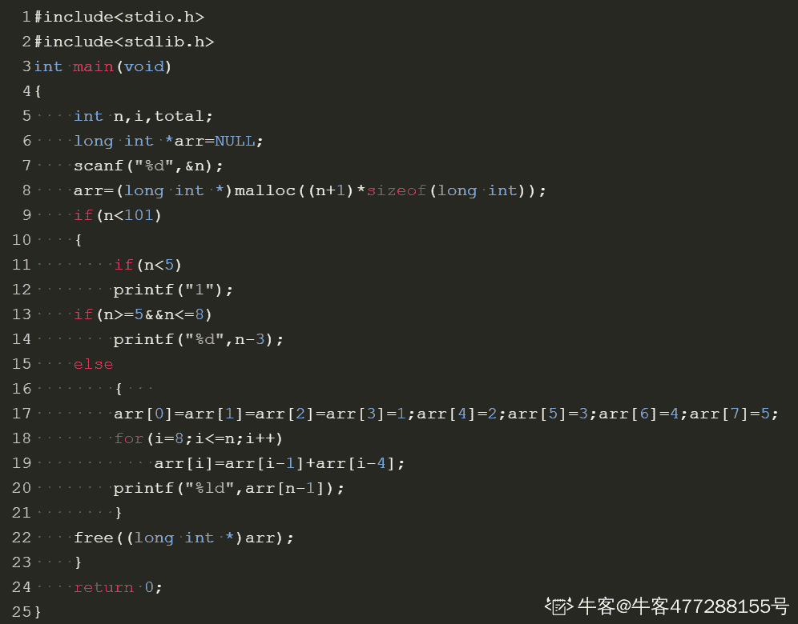

# 奇安信 2020 安全开发工程师（一）

## 1

已知，1000 个硬币里有 10 个金币。随机的取出 n 个硬币，则取出硬币里有金币的概率是多少？

本题知识点

前端工程师 奇安信 2020 Java 工程师 C++工程师 PHP 工程师 golang 工程师 安卓工程师 iOS 工程师 安全工程师 测试开发工程师 测试工程师 运维工程师 大数据开发工程师

讨论

[不打游戏不熬夜](https://www.nowcoder.com/profile/281737645)

等一个满分答案🤣, 这难道是考概率论? 

发表于 2021-03-22 18:20:19

* * *

[牛客 941666686 号](https://www.nowcoder.com/profile/941666686)

case 通过率只有 10%~呜呜呜

```cpp
function gl(n){
    var p_top=1.0,p_buttom=1.0,p;
    if(n<=0){
        p=0.000000;
    }
    if(n>=990){
        p=1.000000;
    }
    if(n<=10){
        for(var i=0;i<n;i++){
            p_top=p_top*(990*(990-i));
            p_buttom=p_buttom*(1000*(1000-i));
        }
    }
    else{
        for(var i=0;i<10;i++){
            p_top=p_top*(990*(990-n+i));
            // p_top.toFixed(6);
            p_buttom=p_buttom*(1000*(1000-i));
            // p_buttom.toFixed(6);
        }
    }
    p=p_top/p_buttom;
    p.toFixed(6);
    return 1-p;
}
console.log(gl(999));
```

发表于 2021-03-20 10:36:40

* * *

[牛客 444311396 号](https://www.nowcoder.com/profile/444311396)

使用递归函数 10 行之内就能解决

发表于 2022-02-25 21:51:03

* * *

## 2

有一对兔子，从出生后的第五个月起每月生出一对小兔子（即满 4 月就开始生小兔），小兔子也会出生从第五个月起每月生一对小免子。假如兔子不会死，第 n 个月时，兔群有多少对兔子。

本题知识点

前端工程师 奇安信 2020 Java 工程师 C++工程师 PHP 工程师 golang 工程师 安卓工程师 iOS 工程师 安全工程师 测试开发工程师 测试工程师 运维工程师 大数据开发工程师

讨论

[0xl1tmu2](https://www.nowcoder.com/profile/875480121)

#include <cstdio>int main()
{
    int n;
    scanf("%d",&n);
    long long c1 = 1,c2 = 0, c3 = 0, c4 = 0, c5 = 0;
    //分年龄统计,c1 到 c4 为不能繁殖的兔子（1-4 月），c5 表示当月可以繁殖的兔子
    for(int i=1;i<n;i++)
    {
        c5 += c4;
        c4 = c3;
        c3 = c2;
        c2 = c1;
        c1 = c5;
    }
    printf("%ld",c1+c2+c3+c4+c5);
    return 0;
}

发表于 2021-09-07 15:15:10

* * *

[一大岐](https://www.nowcoder.com/profile/269456880)

```cpp
import java.util.*;
public class Main{
    public static void main(String[] args){
        Scanner in = new Scanner(System.in);
        int n = in.nextInt();
        long[] dp = new long[n];
        dp[0] = 1;
        for(int i = 1; i < n; i++){
            if(i-4 < 0)
                dp[i] = dp[i-1];
            else
                dp[i] = dp[i-1]+dp[i-4];
        }
        System.out.println(dp[n-1]);
    }

}
```

发表于 2021-08-12 10:54:45

* * *

[我想叫 BruceWayne](https://www.nowcoder.com/profile/477288155)

我写的是 c 语言的，还是有点麻烦。主要是动态数组那里比较麻烦，后边就是分类。最坑的是数组越界的警告，后来将 arr 定义为 n+1 就好了，我忘了\0 是最后一个。以及数组类型，换为 longint 就好

发表于 2021-03-29 18:52:15

* * *

## 3

char ch[] = "abcd", *pch;
pch = ch;
printf("%c\n", *pch+5);

正确答案: A   你的答案: 空 (错误)

```cpp
e
```

```cpp
 0
```

```cpp
\0
```

```cpp
Segmentation fault
```

本题知识点

安卓工程师 iOS 工程师 奇安信 2020 安全工程师 C++工程师

讨论

[Minxin](https://www.nowcoder.com/profile/559080752)

是 f 吧？

发表于 2021-09-05 11:28:06

* * *

## 4

以下程序的输出是：
int i = 0;
void func(int i)
{
    printf("%d", i++);
}

int main()
{
    func(i);
    printf("%d\n", i++);

    return 0;
}

正确答案: B   你的答案: 空 (错误)

```cpp
01
```

```cpp
00
```

```cpp
12
```

```cpp
11
```

本题知识点

安卓工程师 iOS 工程师 奇安信 2020 安全工程师 测试开发工程师 测试工程师 C++工程师

讨论

[丷丷要开心](https://www.nowcoder.com/profile/5834026)

我的理解是 int i=0;这句说明 i 是全局变量，下面的这个函数 void func(int i)中的 i 是形参，在心里把它改成 j 这样就不会混淆了。在 C 语言中,数据传递方式有值传递和引用传递,值传递:传值,实际是把实参的值赋值给行参,相当于 copy。 那么对行参的修改,不会影响实参的值 。因此在 main 函数中，调用了 func 函数，是把实参 i=0 传给上面的虚函数，输出的就是 0，但是 i++不会对实参的值有影响，所以在打印的话还是 0

发表于 2021-03-25 20:48:11

* * *

## 5

在 linux 系统中获取帮助信息的命令是？

正确答案: B   你的答案: 空 (错误)

```cpp
help
```

```cpp
man
```

```cpp
cat
```

```cpp
display
```

本题知识点

前端工程师 奇安信 2020 安卓工程师 iOS 工程师 安全工程师 运维工程师 C++工程师

讨论

[Active_Waylon](https://www.nowcoder.com/profile/983229690)

```cpp
命令 --help
man 命令
```

发表于 2021-09-08 20:44:56

* * *

## 6

设两个进程共用一个临界段的互斥信号量 mutex，当 mutex=-1 时表示？

正确答案: C   你的答案: 空 (错误)

```cpp
没有一个进程进入了临界段
```

```cpp
两个进程进入了临界段
```

```cpp
一个进程入了临界段，另一个进程等待
```

```cpp
两个进程都在等待
```

本题知识点

前端工程师 奇安信 2020 Java 工程师 C++工程师 PHP 工程师 golang 工程师 安全工程师 运维工程师

讨论

[我要上岸🙏🙏🙏🙏🙏](https://www.nowcoder.com/profile/81398270)

信号量分为**互斥量**和**信号量**，**互斥量的初始值一般为 1，表示临界区只允许一个进程进入**，从而实现互斥；**互斥量等于 0**时，表示**临界区已经有 1 个进程进入**，**临界区外无进程等待**；**互斥量小于 0**时，表示**临界区****已经有 1 个进程进入**，**互斥量的绝对值表示在临界区外等待进入的进程数**。资源信号量的初值可以是任意整数，**表示可用的资源数**，**资源数小于 0 时，表示所有资源全部用完**，**而且还有进程正在等待使用该资源**，**等待的进程数就是资源量的绝对值。**

发表于 2021-03-24 22:00:43

* * *

[陌上*花*开](https://www.nowcoder.com/profile/594946438)

互斥信号量，初始值为 1，取值范围为（-1， 0，1）。当信号量为 1 时，表示两个进程皆未进入需要互斥的临界区；当信号量为 0 时，表示有一个进程进入临界区运行，另一个必须等待；当信号量为-1 时，表示有一个进程正在临界区运行，另一个进程因等待而阻塞在信号量队列中，需要当前已在临界区运行的进程退出时唤醒。

发表于 2021-08-22 17:25:49

* * *

## 7

若一个系统内存有 64MB，处理器是 32 位地址，则它的虚拟地址空间为多少字节？

正确答案: B   你的答案: 空 (错误)

```cpp
2GB
```

```cpp
4GB
```

```cpp
100KB
```

```cpp
64MB
```

本题知识点

Java 工程师 C++工程师 PHP 工程师 golang 工程师 奇安信 2020 安卓工程师 iOS 工程师 安全工程师

讨论

[陌上*花*开](https://www.nowcoder.com/profile/594946438)

32 位 cpu 寻址能力为 2 的 32 次方,2 的 32 次方等于 4G,所以答案为 4G

发表于 2021-08-22 17:27:19

* * *

## 8

下列哪个攻击不在网络层？（）

正确答案: D   你的答案: 空 (错误)

```cpp
IP 欺诈
```

```cpp
Teardrop
```

```cpp
Smurf
```

```cpp
SQL 注入
```

本题知识点

安全工程师 奇安信 2020

## 9

Man-in-the-middle 攻击，简称 MITM，即？（）

正确答案: C   你的答案: 空 (错误)

```cpp
重放攻击
```

```cpp
拒绝服务攻击
```

```cpp
中间人攻击
```

```cpp
后门漏洞攻击
```

本题知识点

安全工程师 奇安信 2020

## 10

TCP 会话劫持除了 SYN Flood 攻击，还需要？（）

正确答案: B   你的答案: 空 (错误)

```cpp
SYN 扫描
```

```cpp
序列号预测
```

```cpp
TCP 扫描
```

```cpp
SYN/ACK 扫描
```

本题知识点

安全工程师 奇安信 2020

## 11

下列选项中不是 API 攻击的特点？（）

正确答案: D   你的答案: 空 (错误)

```cpp
目标明确
```

```cpp
持续性强
```

```cpp
手段多样
```

```cpp
攻击少见
```

本题知识点

安全工程师 奇安信 2020

## 12

下列哪一个选项不属于 XSS 跨站脚本漏洞危害？（）

正确答案: C   你的答案: 空 (错误)

```cpp
钓鱼欺骗
```

```cpp
身份盗用
```

```cpp
SQL 数据泄露
```

```cpp
网站挂马
```

本题知识点

安全工程师 奇安信 2020

## 13

以下哪个选项是 exp 的定义

正确答案: D   你的答案: 空 (错误)

```cpp
漏洞验证程序
```

```cpp
漏洞扫描程序
```

```cpp
攻击载荷
```

```cpp
漏洞利用程序
```

本题知识点

安全工程师 奇安信 2020

讨论

[牛客 548058099 号](https://www.nowcoder.com/profile/548058099)

exp=exploit 利用

发表于 2021-10-13 13:02:42

* * *

## 14

漏洞利用中最终需要控制的寄存器为

正确答案: B   你的答案: 空 (错误)

```cpp
esp
```

```cpp
eip
```

```cpp
ebp
```

```cpp
esi
```

本题知识点

安全工程师 奇安信 2020

## 15

设栈 S 的初始状态为空，元素 a, b, c, d, e, f, g 依次入栈，以下出栈序列不可能出现的是

正确答案: D   你的答案: 空 (错误)

```cpp
a, b, c, e, d, f, g
```

```cpp
b, c, a, f, e, g, d
```

```cpp
a, e, d, c, b, f, g
```

```cpp
g, e, f, d, c, b, a
```

本题知识点

安卓工程师 iOS 工程师 奇安信 2020 安全工程师 测试开发工程师 测试工程师 运维工程师 C++工程师 大数据开发工程师

讨论

[牛客 574435187 号](https://www.nowcoder.com/profile/574435187)

后进先出，D 选项第一个出栈的是 g，说明全部入栈，下一个出栈的只能是在它前一个进栈的 f。

发表于 2021-03-22 10:25:23

* * *

[夫差斗战](https://www.nowcoder.com/profile/890490121)

栈遵循【先进后出】的原则

发表于 2021-03-21 22:46:36

* * *

## 16

完全二叉树的结点个数为 4 * N + 3，则它的叶结点个数为

正确答案: A   你的答案: 空 (错误)

```cpp
2 * N + 2
```

```cpp
2 * N
```

```cpp
2 * N - 1
```

```cpp
2 * N + 1
```

本题知识点

安卓工程师 iOS 工程师 奇安信 2020 安全工程师 测试开发工程师 测试工程师 运维工程师 C++工程师 大数据开发工程师

讨论

[牛客 548058099 号](https://www.nowcoder.com/profile/548058099)

设叶结点数为 M，结点数为 N，有 M=（N+1）/2 代入题目已知条件，叶结点数=（4*N+3+1）/2=2*N+2

发表于 2021-10-13 13:10:40

* * *

## 17

下面哪个地址是 IPv6 链路本地址？

正确答案: B   你的答案: 空 (错误)

```cpp
FF02::3
```

```cpp
FE91::ffff
```

```cpp
FEf0::4
```

```cpp
FF01::ff00
```

本题知识点

Java 工程师 C++工程师 PHP 工程师 golang 工程师 奇安信 2020 安全工程师 运维工程师

讨论

[捞一下吧](https://www.nowcoder.com/profile/5465511)

本地链路地址 具有前缀 1111 1110  10。

发表于 2021-03-23 16:42:42

* * *

## 18

不使用面向连接传输服务的应用层协议是：

正确答案: D   你的答案: 空 (错误)

```cpp
SMTP
```

```cpp
FTP
```

```cpp
HTTP
```

```cpp
SNMP
```

本题知识点

Java 工程师 C++工程师 PHP 工程师 golang 工程师 奇安信 2020 安全工程师 测试开发工程师 测试工程师

讨论

[牛客 504104551 号](https://www.nowcoder.com/profile/504104551)

SNMP 协议：简单网络管理协议，工作在 UDP161 端口
FTP：用于文件传输 SMTP：由于邮件传输

发表于 2021-03-22 20:56:42

* * *

## 19

下列哪个不是 vlan 的主要作用？

正确答案: C   你的答案: 空 (错误)

```cpp
提高网络设计灵活性
```

```cpp
简化网络管理
```

```cpp
抑制广播风暴
```

```cpp
保证网络安全
```

本题知识点

Java 工程师 C++工程师 PHP 工程师 golang 工程师 奇安信 2020 安全工程师 安卓工程师 iOS 工程师

## 20

协议对应的缺省端口，以下正确的是

正确答案: D   你的答案: 空 (错误)

```cpp
SSH:21
```

```cpp
IMAP:444
```

```cpp
TELNET:53
```

```cpp
POP3:110
```

本题知识点

安全工程师 奇安信 2020

讨论

[zzzzz_zou](https://www.nowcoder.com/profile/131127443)

SSH 22IMAP 143TELNET 23

发表于 2021-03-29 23:23:08

* * *

## 21

xserver、openldap、redis 等服务器默认监听端口号，正确的是？（）

正确答案: C   你的答案: 空 (错误)

```cpp
6379、6000、389
```

```cpp
6379、389、6000
```

```cpp
6000、389、6379
```

```cpp
389、6000、6379
```

本题知识点

安全工程师 奇安信 2020

## 22

以下那个属于 HTTP 的传输编码

正确答案: B   你的答案: 空 (错误)

```cpp
compress
```

```cpp
chunked
```

```cpp
file
```

```cpp
blocked
```

本题知识点

安全工程师 奇安信 2020

讨论

[冰糕块块](https://www.nowcoder.com/profile/788223833)

B

发表于 2022-02-13 16:01:53

* * *

## 23

关于指针以下说法错误的是

正确答案: A B D   你的答案: 空 (错误)

```cpp
指针为物理内存地址
```

```cpp
程序 A 向 0x7fffff0A 地址写入，程序 B 可从这个地址读取此值
```

```cpp
栈变量指针>堆变量指针
```

```cpp
堆变量指针 > 栈变量指针
```

本题知识点

安卓工程师 iOS 工程师 奇安信 2020 安全工程师 Java 工程师 C++工程师 PHP 工程师 golang 工程师

讨论

[不打游戏不熬夜](https://www.nowcoder.com/profile/281737645)

栈在高地址处, 向下增长, 堆在低地址处, 向上增长

发表于 2021-03-22 19:50:53

* * *

## 24

以下说法正确的是？

正确答案: A B C D   你的答案: 空 (错误)

```cpp
static 局部变量只被初始化一次，下一次依据上一次结果值；
```

```cpp
static 全局变量只初使化一次，防止在其他文件单元中被引用; 
```

```cpp
static 函数仅在当前源文件中使用;
```

```cpp
对于可在当前源文件以外使用的函数，应该在一个头文件中声明;
```

本题知识点

Java 工程师 C++工程师 PHP 工程师 golang 工程师 奇安信 2020 安卓工程师 iOS 工程师 安全工程师

## 25

ping 不通某个主机 ip，可能的原因有

正确答案: A B C   你的答案: 空 (错误)

```cpp
网络不可用
```

```cpp
防火墙隔断
```

```cpp
主机停机
```

```cpp
22 端口被禁用
```

本题知识点

安全工程师 奇安信 2020

## 26

以下容易造成缓冲区溢出的函数是（）

正确答案: A C   你的答案: 空 (错误)

```cpp
strcpy
```

```cpp
strncat
```

```cpp
sprintf
```

```cpp
strcmp
```

本题知识点

小米 C++工程师 C++ C 语言 奇安信

讨论

[Lee124](https://www.nowcoder.com/profile/957365898)

A. strcpy     没限制长度可能导致溢出（安全版本 strncpy）B. strncat    限制了 copy 的长度就没问题，strcat 可能导致溢出 C. sprintf     和 printf()一样，有格式化字符串攻击的可能 D. strcmp    比较两个 string 长度，无危害

发表于 2020-09-01 20:35:31

* * *

[MonkeyH](https://www.nowcoder.com/profile/8391276)

1.  strcpy() :函数将源字符串复制到缓冲区。没有指定要复制字符的具体数目！如果源字符串碰巧来自用户输入，且没有专门限制其大小，则有可能会造成缓冲区溢出！
2.  strcat() :函数非常类似于 strcpy()，它可以将一个字符串合并到缓冲区末尾。
3.  sprintf()、vsprintf() : 用来格式化文本和将其存入缓冲区的通用函数

        可以看出来在对缓冲区进行写操作的时候都有可能导致内存溢出。

发表于 2019-03-20 09:21:09

* * *

[牛客 135416480 号](https://www.nowcoder.com/profile/135416480)

一脸茫然，，，

发表于 2020-11-03 19:11:33

* * *

## 27

恶意攻击行为中，属于被动攻击的有？（）

正确答案: A B   你的答案: 空 (错误)

```cpp
窃听
```

```cpp
流量分析
```

```cpp
SQL 注入攻击
```

```cpp
暴力破解
```

本题知识点

安全工程师 奇安信 2020

## 28

以下哪种方式可以有效提升 CSRF 攻击的门槛？

正确答案: B D   你的答案: 空 (错误)

```cpp
过滤尖括号、script 等特殊字符
```

```cpp
添加图片验证码、短信验证码
```

```cpp
使用 https 协议
```

```cpp
进行 referer 与 token 校验
```

本题知识点

前端工程师 乐信 安全工程师 奇安信 2020

讨论

[deefre](https://www.nowcoder.com/profile/36503303)

CSRF（Cross-site request forgery）跨站请求伪造

发表于 2019-08-05 00:06:37

* * *

[Mr~](https://www.nowcoder.com/profile/5046346)

**CSRF 工具的防御手段**

**1\. 尽量使用 POST，限制 GET**

GET 接口太容易被拿来做 CSRF 攻击，看第一个示例就知道，只要构造一个 img 标签，而 img 标签又是不能过滤的数据。接口最好限制为 POST 使用，GET 则无效，降低攻击风险。

当然 POST 并不是万无一失，攻击者只要构造一个 form 就可以，但需要在第三方页面做，这样就增加暴露的可能性。

**2\. 浏览器 Cookie 策略**

IE6、7、8、Safari 会默认拦截第三方本地 Cookie（Third-party Cookie）的发送。但是 Firefox2、3、Opera、Chrome、Android 等不会拦截，所以通过浏览器 Cookie 策略来防御 CSRF 攻击不靠谱，只能说是降低了风险。

PS：Cookie 分为两种，Session Cookie（在浏览器关闭后，就会失效，保存到内存里），Third-party Cookie（即只有到了 Exprie 时间后才会失效的 Cookie，这种 Cookie 会保存到本地）。

PS：另外如果网站返回 HTTP 头包含 P3P Header，那么将允许浏览器发送第三方 Cookie。

**3\. 加验证码**

验证码，强制用户必须与应用进行交互，才能完成最终请求。在通常情况下，验证码能很好遏制 CSRF 攻击。但是出于用户体验考虑，网站不能给所有的操作都加上验证码。因此验证码只能作为一种辅助手段，不能作为主要解决方案。

**4\. Referer Check**

Referer Check 在 Web 最常见的应用就是“防止图片盗链”。同理，Referer Check 也可以被用于检查请求是否来自合法的“源”（Referer 值是否是指定页面，或者网站的域），如果都不是，那么就极可能是 CSRF 攻击。

但是因为服务器并不是什么时候都能取到 Referer，所以也无法作为 CSRF 防御的主要手段。但是用 Referer Check 来监控 CSRF 攻击的发生，倒是一种可行的方法。

**5\. Anti CSRF Token**

现在业界对 CSRF 的防御，一致的做法是使用一个 Token（Anti CSRF Token）。

发表于 2019-01-10 20:57:23

* * *

## 29

以下哪些服务器曾被发现文件解析漏洞？（）

正确答案: A B C   你的答案: 空 (错误)

```cpp
Apache
```

```cpp
IIS
```

```cpp
nginx
```

```cpp
squid
```

本题知识点

安全工程师 奇安信 2020

## 30

对于 TCP 的拥塞控制的描述正确的是?

正确答案: B C   你的答案: 空 (错误)

```cpp
拥塞控制算法也同样适用于 UDP
```

```cpp
TCP 拥塞控制算法一般以丢包为网络进入拥塞状态的信号
```

```cpp
Vegas，Reno，Cubic，BBR 都是拥塞控制算法
```

```cpp
拥塞控制算法的状态机包括以下几个状态：Open，Slow Start，Disorder，Recovery，Loss
```

本题知识点

前端工程师 奇安信 2020 Java 工程师 C++工程师 PHP 工程师 golang 工程师 安全工程师 运维工程师

讨论

[zzzzz_zou](https://www.nowcoder.com/profile/131127443)

拥塞控制状态机的状态有五种，分别是 Open，Disorder，CWR，Recovery 和 Loss 状态

发表于 2021-03-29 15:54:09

* * *

## 31

以下哪些协议属于邮件协议

正确答案: B D   你的答案: 空 (错误)

```cpp
SNMP
```

```cpp
POP3
```

```cpp
ICMP
```

```cpp
SMTP
```

本题知识点

安全工程师 奇安信 2020

## 32

在浏览器地址栏中输入访问的 web 站点 www.xx.com 地址，到最终显示出具体页面信息，这个过程涉及到哪些协议

正确答案: A B C D   你的答案: 空 (错误)

```cpp
HTTP
```

```cpp
DNS
```

```cpp
TCP
```

```cpp
ARP
```

本题知识点

安全工程师 奇安信 2020</cstdio>