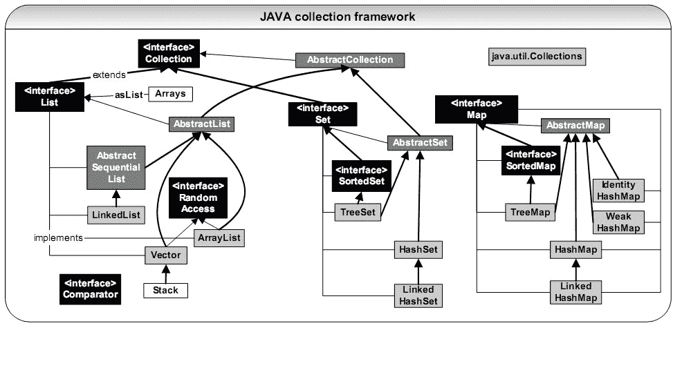

# 奇安信 2020 测试工程师（一）

## 1

已知，1000 个硬币里有 10 个金币。随机的取出 n 个硬币，则取出硬币里有金币的概率是多少？

本题知识点

前端工程师 奇安信 2020 Java 工程师 C++工程师 PHP 工程师 golang 工程师 安卓工程师 iOS 工程师 安全工程师 测试开发工程师 测试工程师 运维工程师 大数据开发工程师

讨论

[不打游戏不熬夜](https://www.nowcoder.com/profile/281737645)

等一个满分答案🤣, 这难道是考概率论? 

发表于 2021-03-22 18:20:19

* * *

[牛客 941666686 号](https://www.nowcoder.com/profile/941666686)

case 通过率只有 10%~呜呜呜

```cpp
function gl(n){
    var p_top=1.0,p_buttom=1.0,p;
    if(n<=0){
        p=0.000000;
    }
    if(n>=990){
        p=1.000000;
    }
    if(n<=10){
        for(var i=0;i<n;i++){
            p_top=p_top*(990*(990-i));
            p_buttom=p_buttom*(1000*(1000-i));
        }
    }
    else{
        for(var i=0;i<10;i++){
            p_top=p_top*(990*(990-n+i));
            // p_top.toFixed(6);
            p_buttom=p_buttom*(1000*(1000-i));
            // p_buttom.toFixed(6);
        }
    }
    p=p_top/p_buttom;
    p.toFixed(6);
    return 1-p;
}
console.log(gl(999));
```

发表于 2021-03-20 10:36:40

* * *

[牛客 444311396 号](https://www.nowcoder.com/profile/444311396)

使用递归函数 10 行之内就能解决

发表于 2022-02-25 21:51:03

* * *

## 2

有一对兔子，从出生后的第五个月起每月生出一对小兔子（即满 4 月就开始生小兔），小兔子也会出生从第五个月起每月生一对小免子。假如兔子不会死，第 n 个月时，兔群有多少对兔子。

本题知识点

前端工程师 奇安信 2020 Java 工程师 C++工程师 PHP 工程师 golang 工程师 安卓工程师 iOS 工程师 安全工程师 测试开发工程师 测试工程师 运维工程师 大数据开发工程师

讨论

[0xl1tmu2](https://www.nowcoder.com/profile/875480121)

#include <cstdio>int main()
{
    int n;
    scanf("%d",&n);
    long long c1 = 1,c2 = 0, c3 = 0, c4 = 0, c5 = 0;
    //分年龄统计,c1 到 c4 为不能繁殖的兔子（1-4 月），c5 表示当月可以繁殖的兔子
    for(int i=1;i<n;i++)
    {
        c5 += c4;
        c4 = c3;
        c3 = c2;
        c2 = c1;
        c1 = c5;
    }
    printf("%ld",c1+c2+c3+c4+c5);
    return 0;
}

发表于 2021-09-07 15:15:10

* * *

[一大岐](https://www.nowcoder.com/profile/269456880)

```cpp
import java.util.*;
public class Main{
    public static void main(String[] args){
        Scanner in = new Scanner(System.in);
        int n = in.nextInt();
        long[] dp = new long[n];
        dp[0] = 1;
        for(int i = 1; i < n; i++){
            if(i-4 < 0)
                dp[i] = dp[i-1];
            else
                dp[i] = dp[i-1]+dp[i-4];
        }
        System.out.println(dp[n-1]);
    }

}
```

发表于 2021-08-12 10:54:45

* * *

[我想叫 BruceWayne](https://www.nowcoder.com/profile/477288155)

我写的是 c 语言的，还是有点麻烦。主要是动态数组那里比较麻烦，后边就是分类。最坑的是数组越界的警告，后来将 arr 定义为 n+1 就好了，我忘了\0 是最后一个。以及数组类型，换为 longint 就好

发表于 2021-03-29 18:52:15

* * *

## 3

以下程序的输出是：
int i = 0;
void func(int i)
{
    printf("%d", i++);
}

int main()
{
    func(i);
    printf("%d\n", i++);

    return 0;
}

正确答案: B   你的答案: 空 (错误)

```cpp
01
```

```cpp
00
```

```cpp
12
```

```cpp
11
```

本题知识点

安卓工程师 iOS 工程师 奇安信 2020 安全工程师 测试开发工程师 测试工程师 C++工程师

讨论

[丷丷要开心](https://www.nowcoder.com/profile/5834026)

我的理解是 int i=0;这句说明 i 是全局变量，下面的这个函数 void func(int i)中的 i 是形参，在心里把它改成 j 这样就不会混淆了。在 C 语言中,数据传递方式有值传递和引用传递,值传递:传值,实际是把实参的值赋值给行参,相当于 copy。 那么对行参的修改,不会影响实参的值 。因此在 main 函数中，调用了 func 函数，是把实参 i=0 传给上面的虚函数，输出的就是 0，但是 i++不会对实参的值有影响，所以在打印的话还是 0

发表于 2021-03-25 20:48:11

* * *

## 4

若有以下类型的 char a = 5;int  b = 10; float c = 22; double d = 18;long long e = 15;则表达式 a*b + c - d- e 的类型为（）

正确答案: D   你的答案: 空 (错误)

```cpp
float
```

```cpp
int
```

```cpp
long long
```

```cpp
double
```

本题知识点

Java 工程师 C++工程师 PHP 工程师 golang 工程师 奇安信 2020 安卓工程师 iOS 工程师 测试开发工程师 测试工程师

讨论

[杨昊蓝](https://www.nowcoder.com/profile/847453398)

有多种类型的数据混合运算时，系统首先自动将所有数据转换成容量最大的 那种数据类型，然后再进行计算（来源百度）

发表于 2021-03-24 12:58:56

* * *

## 5

int main(int argc, char *argv[])
{
    char str[][10]={"China","Beijing"},*p=str;
    printf("%s\n",p+10);
    return 0;
}
程序运行后的输出结果是?

正确答案: B   你的答案: 空 (错误)

```cpp
China
```

```cpp
Beijing
```

```cpp
ng
```

```cpp
ing
```

本题知识点

Java 工程师 C++工程师 PHP 工程师 golang 工程师 奇安信 2020 安卓工程师 iOS 工程师 测试开发工程师 测试工程师

讨论

[to_sia](https://www.nowcoder.com/profile/649988010)

二维数组初始化，china 在第一行，BeiJing 在第二行，指针加十刚好指向第二行第一个字符

发表于 2021-08-06 16:48:45

* * *

[牛客 867941589 号](https://www.nowcoder.com/profile/867941589)

p 指针指向数组第一个元素，每个字符占 2 个字节，“china”数量为 5，刚好 10 个字节。

发表于 2021-03-24 17:11:24

* * *

## 6

void func() {
  static int val;
}
变量 val 的内存地址位于?

正确答案: B   你的答案: 空 (错误)

```cpp
data
```

```cpp
bss
```

```cpp
堆
```

```cpp
栈
```

本题知识点

Java 工程师 C++工程师 PHP 工程师 golang 工程师 奇安信 2020 安卓工程师 iOS 工程师 测试开发工程师 测试工程师

讨论

[牛客 230587610 号](https://www.nowcoder.com/profile/230587610)

**BSS 段**:（bss segment）通常是指用来存放程序中 **未初始化的 全局变量**的一块内存区域。BSS 是英文 Block Started by Symbol 的简称。BSS 段属于静态内存分配。

**数据（DATA）段**：数据段（data segment）通常是指用来存放程序中 **已初始化的 全局变量**的一块内存区域。数据段属于静态内存分配。

**堆（heap）**：堆是用于存放**进程运行中被动态分配的内存段**，它的大小并不固定，可动态扩张或缩减。当进程调用 malloc/free 等函数分配内存时，新分配的内存就被动态添加到堆上（堆被扩张）/释放的内存从堆中被剔除（堆被缩减）

**栈(stack)**：栈又称堆栈， 存放程序的 **局部变量（但不包括 static 声明的变量**， static 意味着 在数据段中存放变量）。除此以外，在函数被调用时，栈用来传递参数和返回值。由于栈的先进先出特点，所以栈特别方便用来保存/恢复调用现场。

发表于 2021-03-24 15:39:01

* * *

[SdV](https://www.nowcoder.com/profile/902082580)

还挺新颖的

发表于 2021-03-19 15:01:08

* * *

## 7

在调用方法时，若要使方法改变实参的值，可以:

正确答案: B   你的答案: 空 (错误)

```cpp
用基本数据类型作为参数
```

```cpp
用对象作为参数
```

```cpp
“用基本数据类型作为参数”和“用对象作为参数”都对
```

```cpp
“用基本数据类型作为参数”和“用对象作为参数”都不对
```

本题知识点

测试开发工程师 测试工程师 奇安信 2020 大数据开发工程师

讨论

[常平 wudi](https://www.nowcoder.com/profile/5045524)

如果做错请复习数据类型和引用数据类型的区别**传递基本数据类型，栈里新开辟空间复制一个副本 age。修改的 age 是副本，不会修改主函数里栈的 age 的值。**
**修改引用数据类型，修改的是堆里的数据，而主函数里栈和副本里的 arr 都是指针，都指向堆里同一个数据域，副本改完了，主函数里的数也会变。**特别注意的是 String 中的底层实现是 char[],所以针对 String 的操作体现了部分基本数据类型的特点。

发表于 2021-09-14 10:44:06

* * *

## 8

下面是关于类以及其修饰符的一些描述，不正确的是

正确答案: A   你的答案: 空 (错误)

```cpp
final 类不但可以用来派生子类，也可以用来创建 final 类的对象
```

```cpp
abstract 类只能用来派生子类，不能用来创建 abstract 类的对象
```

```cpp
abstract 不能与 final 同时修饰一个类
```

```cpp
abstract 方法必须在 abstract 类中声明，但 abstract 类定义中可以没有 abstract 方法
```

本题知识点

Java 工程师 C++工程师 PHP 工程师 golang 工程师 奇安信 2020 测试开发工程师 测试工程师 大数据开发工程师

讨论

[牛客 504104551 号](https://www.nowcoder.com/profile/504104551)

final 修饰的变量不能改变，方法不能被重写，类不能被继承

发表于 2021-03-22 20:29:19

* * *

[牛客 72864520 号](https://www.nowcoder.com/profile/72864520)

final 类不能被继承，也就无法派生子类；abstract 类设计的目的就是代码复用，给与子类实现。

发表于 2021-08-26 20:13:53

* * *

## 9

设 Test 类为 Base 类的子类，下列语句错误的是

正确答案: B   你的答案: 空 (错误)

```cpp
Base obj = new Test();
```

```cpp
Test obj = new Base();
```

```cpp
Base obj = new Base();
```

```cpp
Test obj = new Test();
```

本题知识点

Java 工程师 C++工程师 PHP 工程师 golang 工程师 奇安信 2020 测试开发工程师 测试工程师 大数据开发工程师

讨论

[牛客 504104551 号](https://www.nowcoder.com/profile/504104551)

多态的向上转型：父类可以 new 子类 = 隐藏了子类的特有方法。向下转型就是强制类型转换，不安全。

发表于 2021-03-22 20:32:58

* * *

## 10

下列关于容器集合类的说法正确的是？

正确答案: C   你的答案: 空 (错误)

```cpp
LinkedList 继承自 List
```

```cpp
AbstractSet 继承自 Set
```

```cpp
HashSet 继承自 AbstractSet
```

```cpp
WeakMap 继承自 HashMap
```

本题知识点

Java 奇安信 2020

讨论

[W0-懂-緈-諨](https://www.nowcoder.com/profile/963857)

选 ca 选项 linked  查看全部)

编辑于 2015-04-07 09:57:34

* * *

[修也 2015](https://www.nowcoder.com/profile/403938)


编辑于 2015-11-09 22:32:56

* * *

[Boooobby](https://www.nowcoder.com/profile/740942)

这道题其实只要把 java 集合框架给看了，就一目了然了。首先这道题很多人都对接口以及抽象实现类认识混乱。A.LinkedList 是继承自 AbstractSequentialList（抽象类，实现了 List 接口）的，并且实现了 List 接口。所以 A 错误。B.AbstractSet 是实现了 Set 接口的，本身是一个抽象类。继承自 AbstractCollection（抽象类，实现了 Collection 接口）。所以 B 错误。C.HashSet 是继承自 AbstractSet，实现了 Set 接口。所以 C 正确。D.WeakMap 不存在于 java 集合框架的。只有一个叫做 WeakHashMap（继承自 AbstractMap）。最后附上 java 集合框架图。

发表于 2016-08-01 17:07:07

* * *

## 11

关于 Python 语言的特点，以下选项描述正确的是

正确答案: B   你的答案: 空 (错误)

```cpp
Python 语言不支持面向对象
```

```cpp
Python 语言是解释型语言
```

```cpp
Python 语言是编译型语言
```

```cpp
Python 语言是非跨平台语言
```

本题知识点

测试开发工程师 测试工程师 奇安信 2020 运维工程师

## 12

下面代码的输出结果是: print( 0.1 + 0.2 == 0.3)

正确答案: A   你的答案: 空 (错误)

```cpp
FALSE
```

```cpp
0.1
```

```cpp
-1
```

```cpp
0
```

本题知识点

Java 工程师 C++工程师 PHP 工程师 golang 工程师 奇安信 2020 测试开发工程师 测试工程师 运维工程师

讨论

[国宾山城乐堡](https://www.nowcoder.com/profile/68784008)

0.1+0.2=0.30000000000000004 所以为 false

发表于 2021-03-23 14:52:19

* * *

[牛客 _s.j.l](https://www.nowcoder.com/profile/427273944)

算数运算符+的优先级高于比较运算符==

发表于 2021-03-21 07:15:46

* * *

[牛客 968167863 号](https://www.nowcoder.com/profile/968167863)

答案错了吧

发表于 2022-01-25 23:50:05

* * *

## 13

如果 Python 程序执行时，产生了 “unexpected indent” 的错误，其原因是：

正确答案: D   你的答案: 空 (错误)

```cpp
代码中使用了错误的关键字
```

```cpp
代码中缺少“：”符号
```

```cpp
代码里的语句嵌套层次太多
```

```cpp
代码中出现了缩进不匹配的问题
```

本题知识点

Java 工程师 C++工程师 PHP 工程师 golang 工程师 奇安信 2020 测试开发工程师 测试工程师 运维工程师

## 14

以下关于字符串类型的操作的描述，错误的是：

正确答案: C   你的答案: 空 (错误)

```cpp
str.replace(x,y)方法把字符串 str 中所有的 x 子串都替换成 y
```

```cpp
想把一个字符串 str 所有的字符都大写，用 str.upper()
```

```cpp
想获取字符串 str 的长度，用字符串处理函数 str.len()
```

```cpp
设 x = ’aa’ ，则执行 x*3 的结果是‘aaaaaa’
```

本题知识点

Java 工程师 C++工程师 PHP 工程师 golang 工程师 奇安信 2020 测试开发工程师 测试工程师

## 15

假设指令字长为 16 位，操作数的地址码为 6 位，设操作码固定，零地址指令有 512 种，则一地址指令最多有几种（）

正确答案: C   你的答案: 空 (错误)

```cpp
128
```

```cpp
256
```

```cpp
512
```

```cpp
1024
```

本题知识点

测试开发工程师 测试工程师 奇安信 2020

讨论

[ppzhang0929](https://www.nowcoder.com/profile/451169990)

还剩下 16-6=10 位，可以存储 2 的 10 次方=1024 1024-512=512

发表于 2021-09-07 15:25:15

* * *

## 16

以下哪种测试需要考察模块间的接口和各模块之间的联系

正确答案: B   你的答案: 空 (错误)

```cpp
单元测试
```

```cpp
集成测试
```

```cpp
确认测试
```

```cpp
系统测试
```

本题知识点

测试开发工程师 测试工程师 奇安信 2020

## 17

下面哪种方法能够有效地检测输入条件的各种组合可能引起的错误。

正确答案: D   你的答案: 空 (错误)

```cpp
等价类划分
```

```cpp
错误推测
```

```cpp
边界值分析
```

```cpp
因果图
```

本题知识点

测试开发工程师 测试工程师 奇安信 2020

## 18

为了提高软件测试的效率，应该

正确答案: C   你的答案: 空 (错误)

```cpp
随机地选取测试数据
```

```cpp
在完成编码以后制定软件的测试计划
```

```cpp
选择发现错误可能性最大的数据作为测试用例
```

```cpp
取一切可能的输入数据作为测试数据
```

本题知识点

测试开发工程师 测试工程师 奇安信 2020

讨论

[牛客 567637732 号](https://www.nowcoder.com/profile/567637732)

d

发表于 2021-07-15 18:14:00

* * *

## 19

软件测试用例主要由输入数据和 __ 两部分组成

正确答案: C   你的答案: 空 (错误)

```cpp
测试计划
```

```cpp
测试规范
```

```cpp
预期输出结果
```

```cpp
异网测试记录分析
```

本题知识点

测试开发工程师 测试工程师 奇安信 2020

讨论

[呜呜呜嗷呜](https://www.nowcoder.com/profile/453102189)

测试用例就是模拟人的操作，有输入就有结果。

发表于 2021-06-20 21:11:34

* * *

## 20

设栈 S 的初始状态为空，元素 a, b, c, d, e, f, g 依次入栈，以下出栈序列不可能出现的是

正确答案: D   你的答案: 空 (错误)

```cpp
a, b, c, e, d, f, g
```

```cpp
b, c, a, f, e, g, d
```

```cpp
a, e, d, c, b, f, g
```

```cpp
g, e, f, d, c, b, a
```

本题知识点

安卓工程师 iOS 工程师 奇安信 2020 安全工程师 测试开发工程师 测试工程师 运维工程师 C++工程师 大数据开发工程师

讨论

[牛客 574435187 号](https://www.nowcoder.com/profile/574435187)

后进先出，D 选项第一个出栈的是 g，说明全部入栈，下一个出栈的只能是在它前一个进栈的 f。

发表于 2021-03-22 10:25:23

* * *

[夫差斗战](https://www.nowcoder.com/profile/890490121)

栈遵循【先进后出】的原则

发表于 2021-03-21 22:46:36

* * *

## 21

完全二叉树的结点个数为 4 * N + 3，则它的叶结点个数为

正确答案: A   你的答案: 空 (错误)

```cpp
2 * N + 2
```

```cpp
2 * N
```

```cpp
2 * N - 1
```

```cpp
2 * N + 1
```

本题知识点

安卓工程师 iOS 工程师 奇安信 2020 安全工程师 测试开发工程师 测试工程师 运维工程师 C++工程师 大数据开发工程师

讨论

[牛客 548058099 号](https://www.nowcoder.com/profile/548058099)

设叶结点数为 M，结点数为 N，有 M=（N+1）/2 代入题目已知条件，叶结点数=（4*N+3+1）/2=2*N+2

发表于 2021-10-13 13:10:40

* * *

## 22

按照二叉树的定义,具有 3 个结点的二叉树有（）种。

正确答案: A   你的答案: 空 (错误)

```cpp
3
```

```cpp
4
```

```cpp
5
```

```cpp
6
```

本题知识点

前端工程师 奇安信 2020 Java 工程师 C++工程师 PHP 工程师 golang 工程师 测试开发工程师 测试工程师 运维工程师 安卓工程师 iOS 工程师 大数据开发工程师

讨论

[喜心](https://www.nowcoder.com/profile/161809437)

为什么不是五种

发表于 2021-06-20 17:16:23

* * *

[某不知名一牛客](https://www.nowcoder.com/profile/663498326)

这个题应该出错了 就是五种，画出来是五种，用公式也是五种:(2n)!/n!*(n+1)!  其中 n 为节点数

发表于 2021-08-02 21:57:19

* * *

[牛客 993774460 号](https://www.nowcoder.com/profile/993774460)

这题想表达什么，没有看懂

发表于 2021-03-29 14:48:29

* * *

## 23

下列叙述中，正确的是

正确答案: D   你的答案: 空 (错误)

```cpp
线性表的线性存贮结构优于链表存贮结构
```

```cpp
队列的操作方式是先进后出
```

```cpp
栈的操作方式是先进先出
```

```cpp
二维数组是指它的每个数据元素为一个线性表的线性表
```

本题知识点

前端工程师 奇安信 2020 Java 工程师 C++工程师 PHP 工程师 golang 工程师 测试开发工程师 测试工程师 安卓工程师 iOS 工程师 运维工程师 大数据开发工程师

讨论

[陌上*花*开](https://www.nowcoder.com/profile/594946438)

A: 线性表查找复杂度为 O(1),添加删除元素复杂度为 O(n)，而链表查找复杂度为 O(n)，添加删除元素时空复杂度为 O(1)，所以二者无法直接比较，在不同***作下各有优缺点
B：队列是先进先出
C：栈是先进后出
D：二维数组可以看多一个一维数组，而一维数组的每一个元素都是另一个一位数组，所以是一个相对的二维数组，B 选项正确。

发表于 2021-08-22 17:33:22

* * *

## 24

表达式(1+34)*5-56/7 的后缀表达式为

正确答案: C   你的答案: 空 (错误)

```cpp
1+34*5-56/7
```

```cpp
-*+1 34 5/56 7
```

```cpp
1 34 +5*56 7/-
```

```cpp
1 34 5* +56 7/-
```

本题知识点

前端工程师 奇安信 2020 Java 工程师 C++工程师 PHP 工程师 golang 工程师 测试开发工程师 测试工程师 运维工程师 大数据开发工程师

讨论

[牛客 222494146 号](https://www.nowcoder.com/profile/222494146)

只说解题技巧，按四则运算来算，运算符放后面，详细的看编译原理 1\. 带括号的先算（1+34） =>  1 34+2\. 算乘法 *5 =>   1 34+5* = A3\. 算除法 56/7 =>  56 7/ = B4\. 算减法 A-B => AB- =>  1 34+5* 56 7 / -

发表于 2022-02-18 15:16:37

* * *

[来自星空的问候](https://www.nowcoder.com/profile/414875103)

[(3 条消息) 前 _ 中 _ 后缀表达式的相互转化与计算 _Yore_999 的博客-CSDN 博客 _ 前中后缀表达式转换](https://blog.csdn.net/qq_35284646/article/details/115472711?spm=1001.2014.3001.5501)

发表于 2021-06-16 23:42:09

* * *

[牛客 928575466 号](https://www.nowcoder.com/profile/928575466)

要入栈的*优先级不是高于已经在栈顶的+吗，不就直接入栈了吗，+怎么先出栈了

发表于 2021-04-10 00:23:53

* * *

## 25

设有一个含有 13 个元素的 Hash 表(0~12),Hash 函数是:H(key)=key % 13,其中% 是求余数运算。用线性探查法解决冲突,则对于序列(2、８、31、20、19、18、53、27),18 应放在第几号格中

正确答案: B   你的答案: 空 (错误)

```cpp
5
```

```cpp
9
```

```cpp
4
```

```cpp
0
```

本题知识点

前端工程师 奇安信 2020 Java 工程师 C++工程师 PHP 工程师 golang 工程师 测试开发工程师 测试工程师 运维工程师 大数据开发工程师

讨论

[寻宝 i](https://www.nowcoder.com/profile/852504222)

2、8、31、20、19 对 13 的余数为 2,8，5,7,6 依此放在在第 2，8，5,7,6 号格中 18%13=5,第 5 号格已经有数，冲突。
因为用线性探查法解决冲突，所以往后移，第 6,7,8 号格中都已经有数了，所以放在第 9 号格中

发表于 2021-09-01 16:01:28

* * *

[牛客 _s.j.l](https://www.nowcoder.com/profile/427273944)

线性探查解决 hash 冲突是从冲突位置向后找到不冲突的位置然后，将值放到这个位置

发表于 2021-03-21 07:17:33

* * *

## 26

以下对布隆过滤器的描述中哪个选项是错误的

正确答案: A   你的答案: 空 (错误)

```cpp
能使用 Hashtable 的场景都可以用布隆过滤器代替
```

```cpp
本质上布隆过滤器是一种数据结构
```

```cpp
布隆过滤器特点是高效地插入和查询，可以用来告诉你 “某样东西一定不存在或者可能存在"
```

```cpp
相比于传统的 List、Set、Map 等数据结构，它更高效、占用空间更少，但是缺点是其返回的结果是概率性的，而不是确切的。
```

本题知识点

前端工程师 奇安信 2020 Java 工程师 C++工程师 PHP 工程师 golang 工程师 安卓工程师 iOS 工程师 测试开发工程师 测试工程师 运维工程师 大数据开发工程师

## 27

线性表若采用链表存贮结构，要求内存中可用存贮单元地址

正确答案: D   你的答案: 空 (错误)

```cpp
必须连续
```

```cpp
部分地址必须连续
```

```cpp
一定不连续
```

```cpp
连续不连续均可
```

本题知识点

前端工程师 奇安信 2020 Java 工程师 C++工程师 PHP 工程师 golang 工程师 安卓工程师 iOS 工程师 测试开发工程师 测试工程师 运维工程师 大数据开发工程师

## 28

假设 student 表有以下记录
STUDENT_NO     SEX
---------------------------- 
1       M
2       F
3       NULL
查询语句 select STUDENT_NO from student where SEX<>'F'; 的结果是

正确答案: A   你的答案: 空 (错误)

```cpp
1
```

```cpp
1   2
```

```cpp
3
```

```cpp
1  3
```

本题知识点

安卓工程师 iOS 工程师 奇安信 2020 安全工程师 Java 工程师 C++工程师 PHP 工程师 golang 工程师 测试开发工程师 测试工程师 运维工程师 大数据开发工程师

讨论

[牛客 230587610 号](https://www.nowcoder.com/profile/230587610)

SQL 中使用不等于运算符时，会自动过滤掉 null 值。

发表于 2021-03-31 00:12:49

* * *

## 29

假设 student 表有以下记录
STUDENT_NO     SEX  AGE
---------------------------- 
1       M   20
2       F     30 
3       NULL  NULL
查询语句 select COUNT(*),COUNT(AGE),AVG(AGE) from student; 的结果是

正确答案: D   你的答案: 空 (错误)

```cpp
3 2 NULL
```

```cpp
2 2 25
```

```cpp
3 3 16.666667
```

```cpp
3 2 25
```

本题知识点

Java 工程师 C++工程师 PHP 工程师 golang 工程师 奇安信 2020 安全工程师 测试开发工程师 测试工程师 运维工程师 大数据开发工程师

讨论

[风雨孤剑客](https://www.nowcoder.com/profile/4455961)

**AVG()、SUM()：运算时忽略 NULL 值**

**COUNT()：**

**COUNT(*)或 COUNT(1)：对表中的行数进行统计，不管某一行是否有 NULL 值**

**COUNT(字段名)：对特定列进行统计，会忽略 NULL 值进行统计**

发表于 2021-04-07 00:28:22

* * *

## 30

不使用面向连接传输服务的应用层协议是：

正确答案: D   你的答案: 空 (错误)

```cpp
SMTP
```

```cpp
FTP
```

```cpp
HTTP
```

```cpp
SNMP
```

本题知识点

Java 工程师 C++工程师 PHP 工程师 golang 工程师 奇安信 2020 安全工程师 测试开发工程师 测试工程师

讨论

[牛客 504104551 号](https://www.nowcoder.com/profile/504104551)

SNMP 协议：简单网络管理协议，工作在 UDP161 端口
FTP：用于文件传输 SMTP：由于邮件传输

发表于 2021-03-22 20:56:42

* * *

## 31

OSPF 协议中 ASBR 汇总 LSA 由哪种类型路由器产生？

正确答案: B   你的答案: 空 (错误)

```cpp
ASBR
```

```cpp
ABR
```

```cpp
Internal Router
```

```cpp
Backbone Router
```

本题知识点

测试开发工程师 测试工程师 奇安信 2020

讨论

[牛客 504104551 号](https://www.nowcoder.com/profile/504104551)

OSPF 协议：动态路由协议。属于链路状态路由协议。

发表于 2021-03-22 21:02:12

* * *

## 32

以下属于黑盒测试方法的有

正确答案: B C   你的答案: 空 (错误)

```cpp
分支覆盖
```

```cpp
测试用例覆盖
```

```cpp
输入覆盖
```

```cpp
语句覆盖
```

本题知识点

测试开发工程师 测试工程师 奇安信 2020

## 33

以下不是软件的六大质量特性的有

正确答案: C   你的答案: 空 (错误)

```cpp
可移植
```

```cpp
可靠性
```

```cpp
稳定性
```

```cpp
效率
```

本题知识点

测试开发工程师 测试工程师 奇安信 2020

讨论

[牛客 504104551 号](https://www.nowcoder.com/profile/504104551)

6 大特性：功能性、可靠性、易用性、可移植性、可维护性、效率

发表于 2021-03-22 21:06:08

* * *

## 34

使用白盒测试方法时，确定测试数据应根据

正确答案: A B   你的答案: 空 (错误)

```cpp
指定的覆盖标准
```

```cpp
程序内部逻辑
```

```cpp
程序的复杂度
```

```cpp
程序的功能
```

本题知识点

测试开发工程师 测试工程师 奇安信 2020

讨论

[牛客 335764864 号](https://www.nowcoder.com/profile/335764864)

B

发表于 2022-02-10 13:01:34

* * *

## 35

编写测试计划的目的是

正确答案: A C D   你的答案: 空 (错误)

```cpp
使测试工作顺利进行
```

```cpp
软件工程及软件过程需要
```

```cpp
使项目参与人员沟通更顺畅
```

```cpp
使测试工作更加系统化
```

本题知识点

测试开发工程师 测试工程师 奇安信 2020

## 36

下列哪两个数据结构，同时具有较高的查找和删除性能

正确答案: C D   你的答案: 空 (错误)

```cpp
有序数组
```

```cpp
有序链表
```

```cpp
AVL 树
```

```cpp
Hash 表
```

本题知识点

安卓工程师 iOS 工程师 奇安信 2020 测试开发工程师 测试工程师 C++工程师 大数据开发工程师

## 37

一个栈的入栈序列为 ABCDE，则不可能的出栈序列为

正确答案: A B   你的答案: 空 (错误)

```cpp
ECDBA
```

```cpp
DCEAB
```

```cpp
DECBA
```

```cpp
ABCDE
```

本题知识点

安卓工程师 iOS 工程师 奇安信 2020 测试开发工程师 测试工程师 C++工程师 大数据开发工程师

讨论

[牛客 277976410 号](https://www.nowcoder.com/profile/277976410)

d

发表于 2021-07-15 18:37:37

* * *

## 38

关于 truncate table 以下描述是正确的

正确答案: C D   你的答案: 空 (错误)

```cpp
Truncate table 可跟 Where 从句，根据条件进行删除
```

```cpp
触发器对 Truncate table 有效
```

```cpp
Truncate table 可义删除全部记录
```

```cpp
truncate 比 delete 快
```

本题知识点

测试开发工程师 测试工程师 奇安信 2020 运维工程师

讨论

[牛客 504104551 号](https://www.nowcoder.com/profile/504104551)

truncate table ：截断表，用于清空一个表，是一个 DDL 语言，效率高，比 Delete 快。

发表于 2021-03-22 21:22:40

* * *

[牛客 _s.j.l](https://www.nowcoder.com/profile/427273944)

数据库–关于 truncate 和 delete 的区别 1.truncate 删除表中的内容，不删除表结构，释放空间； 2.delete 删除内容，不删除表结构，但不释放空间 3.区别 3.1 内存空间 truncate 删除数据后重新写数据会从 1 开始，而 delete 删除数据后只会从删除前的最后一行续写；内存空间上，truncate 省空间 3.2 处理速度 因为，truncate 是直接从 1 开始，即全部清空开始，而 delete 需要先得到当前行数，从而进行续写；所以 truncate 删除速度比 delete 快；

发表于 2021-03-21 07:22:00

* * *

## 39

数据库常见约束有

正确答案: A B D   你的答案: 空 (错误)

```cpp
主键约束
```

```cpp
外键约束
```

```cpp
内键约束
```

```cpp
空值约束
```

本题知识点

Java 工程师 C++工程师 PHP 工程师 golang 工程师 奇安信 2020 测试开发工程师 测试工程师 运维工程师

讨论

[牛客 111722557 号](https://www.nowcoder.com/profile/111722557)

数据库常见约束有空值约束，主键约束，唯一约束，外键约束和参照约束，缺省值约束，检查约束

发表于 2021-03-27 18:33:40

* * *

## 40

已知数据库的排序规则是默认设置。在 northwind 数据库中有一个表[order details]，表示所有定单的详情，该表中有一列 quantity，表示定单中某产品的数量。你想实现按照产品数量从小到大排序来查询定单，使用 order by 子句为（ ）

正确答案: B C   你的答案: 空 (错误)

```cpp
Select * from [order details] Order by quantity desc
```

```cpp
Select * from [order details] Order by quantity asc
```

```cpp
Select * from [order details] Order by quantity
```

```cpp
Select * from [order details] Order by desc quantity
```

本题知识点

Java 工程师 C++工程师 PHP 工程师 golang 工程师 奇安信 2020 安全工程师 测试开发工程师 测试工程师

讨论

[牛客 111722557 号](https://www.nowcoder.com/profile/111722557)

orade by  asc 表示升序（从小到大） desc 表示为降序（从大到小）

发表于 2021-03-27 18:31:58

* * *

[寻宝 i](https://www.nowcoder.com/profile/852504222)

order by 默认升序

发表于 2021-09-01 16:10:53

* * *</cstdio>