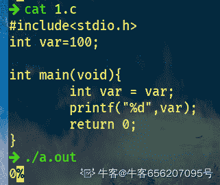

# 奇安信 2020 服务端开发工程师-系统开发（两个方向）

## 1

小明有 N 元钱去药店买口罩，药店里有 6 个品牌的口罩，A 品牌 2 个装（2 元），B 品牌 3 个装（2 元）、C 品牌 1 个装（3 元）、D 品牌 5 个装（1 元），E 品牌 4 个装（5 元），F 品牌 3 个装（2 元），由于限购每个品牌最多只能买一个，小明最多能买多少口罩？

本题知识点

安卓工程师 iOS 工程师 奇安信 2020 运维工程师 Java 工程师 C++工程师 golang 工程师 PHP 工程师 测试工程师 前端工程师 大数据开发工程师 安全工程师 测试开发工程师

讨论

[你都不肯叫我一声教父](https://www.nowcoder.com/profile/144264450)

```cpp
import java.util.*;
public class Main{
    public static void main(String[]args){
        Scanner in = new Scanner(System.in);
        int n = in.nextInt();
        int [] a = new int [] {0,2,3,1,5,4,3}; //个数
        int [] b = new int [] {0,2,2,3,1,5,2};// 钱 
        int [][]dp = new int [7][n+1];

        dp[0][0] = 0;

        for(int i = 1; i <=6; i++){
            for(int j = 1; j<=n;j++){
                if(j<b[i]){
                    dp[i][j] = dp[i-1][j];//钱不够用了
                }
                else{
                    //不装第 i 个，和装了第 I 个比较
                    dp[i][j] = Math.max(dp[i-1][j],dp[i-1][j-b[i]]+a[i]);
                }

            }
        }
        System.out.println(dp[6][n]);

    }
}
```

典型的 01 背包问题

发表于 2021-03-30 22:11:23

* * *

[theyi](https://www.nowcoder.com/profile/6143310)

n=int(input())
res=0
dp=[[0 for i in range(n+1)] for j in range(7)]
mask=[(2,2),(3,2),(1,3),(5,1),(4,5),(3,2)]
for i in range(1,7):
    for j in range(1,n+1):
        if j>=mask[i-1][1]:

            dp[i][j]=max(dp[i-1][j],mask[i-1][0]+dp[i-1][j-mask[i-1][1]])
        else:
            dp[i][j]=dp[i-1][j]
print(dp[-1][-1])

发表于 2021-09-04 23:28:29

* * *

[_ 雾里](https://www.nowcoder.com/profile/174374052)

01 背包问题 import java.util.Scanner;
public class Main{
    public static void main(String[] args) {
        Scanner in =new Scanner(System.in);
        int n= in.nextInt();//输入 N 元钱，相当于背包总容量
        int[] prices={0,2,2,3,1,5,2};//每种口罩的价格，相当于每个占用背包的容量
        int[] number={0,2,3,1,5,4,3};//买一份有多少个口罩，相当于背包问题的价值
        int[][] dp=new int[7][n+1];//初始化一个二维数组 dp，用来存放最大价值。int[7][n+1] 7 表示的是 0-6 六种口罩，n+1 表示的是一共有 0-n 元钱（背包容量）
        int max=0;
        for (int i = 0; i <n+1 ; i++) {//当一种口罩不买时，不管钱多少，口罩数量均为 0
            dp[0][i]=0;
        }
        for (int i = 1; i <7 ; i++) {//控制遍历口罩的序号（商品序号）
            for (int j = 0; j <n+1; j++) {//控制遍历钱数（空间大小）
                if (j>=prices[i]){
                    //如果当前的钱数 j 买得起当前的口罩 i，那么有两种选择，
                    // 1：不买当前的口罩（不装入背包），此时的最大数量和第 i-1 种口罩的数量一致
                    // 2：购买当前的口罩（装入背包），此时的最大数量时第 i-1 种口罩的数量加上第 i 种口罩的数量，
                    dp[i][j]=Math.max(dp[i-1][j],dp[i-1][j-prices[i]]+number[i]);
                }else { //如果当前的钱数 j 买不起当前的口罩 i，那么最大数量和第 i-1 种口罩一致
                    dp[i][j]=dp[i-1][j];
                }
                max=dp[i][j];
            }
        }
        System.out.println(max);
    }
}具体思路：
[`blog.csdn.net/Supremey/article/details/120785736`](https://blog.csdn.net/Supremey/article/details/120785736)

发表于 2021-10-16 11:13:04

* * *

## 2

```cpp
如下图所示的三角形，有三个边 s1,s2,s3,边 s1 有四个圆圈⭕️1，2，3，4，边 s2 有四个圆圈⭕️4，5，6，7，边 s3 有四个圆圈⭕️7，8，9，1
把 1-9 这 9 个数字，分别填写到下图所示的 9 个圆圈圆圈里， 使每条边上的 4 个圆圈⭕️的和相等（9 个圆圈里的数字不能重复)
例如：s1=[1=>9,2=>8,3=>1,4=>3]=9+8+1+3=21,s2=[4=>3,5=>5,6=>7,7=>6]=3+5+7+6=21,s3=[7=>6,8=>2,9=>4, 1=>9]=6+2+4+9=21
```


本题知识点

安卓工程师 iOS 工程师 奇安信 2020 运维工程师 Java 工程师 C++工程师 golang 工程师 PHP 工程师 测试工程师 前端工程师 大数据开发工程师 安全工程师 测试开发工程师

讨论

[牛客 476036690 号](https://www.nowcoder.com/profile/476036690)

```cpp
import java.util.*;
public class Main {
       public static void main(String[] args) {
        Scanner scanner = new Scanner(System.in);
        String i = scanner.next();
        String[] str = i.split(",");
        ArrayList<Integer> list = new ArrayList<>();
        for (String s : str) {
            list.add(Integer.parseInt(s));
        }

        int n1 = list.get(0) + list.get(1) + list.get(2) + list.get(3);
        int n2 = list.get(3) + list.get(4) + list.get(5) + list.get(6);
        int n3 = list.get(6) + list.get(7) + list.get(8) + list.get(0);

        if (n1 == n2 && n2 == n3) {
            System.out.println("yes");
        } else {
            System.out.println("no");
        }
        }

}

```

编辑于 2022-03-18 12:12:29

* * *

[ʚfairyɞ](https://www.nowcoder.com/profile/441012983)

c++可以增加一个字符变量接收逗号，不过要注意最后一个没有逗号#include<stdio.h>#include<iostream>usingnamespacestd;intmain(){    inta[9], sum1, sum2, sum3;    chart;    for(inti = 0; i < 9; i++)    {        cin >> a[i];        if(i!=8)            cin >> t;    }    sum1 = a[0] + a[1] + a[2] + a[3];    sum2 = a[3] + a[4] + a[5] + a[6];    sum3 = a[6] + a[7] + a[8] + a[0];    if(sum1 == sum2 && sum2 == sum3)        printf("yes");    else        printf("no");}

发表于 2022-03-16 16:22:33

* * *

[能休息一下吗](https://www.nowcoder.com/profile/556032778)

while(line = readline())
    {
        let arr = line.split(',')
        let a = parseInt(arr[0])+parseInt(arr[1])+parseInt(arr[2])+parseInt(arr[3])
        let b = parseInt(arr[3])+parseInt(arr[4])+parseInt(arr[5])+parseInt(arr[6])
        let c = parseInt(arr[6])+parseInt(arr[7])+parseInt(arr[8])+parseInt(arr[0])
        if(a == b && b == c){
            console.log('yes')
        }
        else{
            console.log('no')
        }

    }

发表于 2021-09-06 23:03:34

* * *

## 3

下列有关 const 限定符说法错误的是：

正确答案: D   你的答案: 空 (错误)

```cpp
可以将一个非 const 对象的地址赋给一个指向 const 对象的指针
```

```cpp
可以将一个非 const 对象的地址赋给一个指向非 const 对象的指针
```

```cpp
一个 const 对象不可以被多次赋值
```

```cpp
通过 const 对象指针可以改变全局 const 对象内容
```

本题知识点

安卓工程师 iOS 工程师 奇安信 2020 Java 工程师 C++工程师 golang 工程师 PHP 工程师 测试工程师 测试开发工程师

讨论

[丷丷要开心](https://www.nowcoder.com/profile/5834026)

D：const 全局变量存储在全局存储空间，其值只有可读性，不能修改；const 局部变量存储在堆栈中，可通过指针修改其值。

发表于 2021-03-28 13:42:11

* * *

## 4

以下程序的输出是：
int var = 100;
int main()
{
    int var = var;
    printf("%d\n", var);
    return 0;
}

正确答案: A   你的答案: 空 (错误)

```cpp
随机数
```

```cpp
100
```

```cpp
0
```

```cpp
编译失败
```

本题知识点

安卓工程师 iOS 工程师 奇安信 2020 Java 工程师 C++工程师 golang 工程师 PHP 工程师 测试工程师 测试开发工程师

讨论

[牛客 656207095 号](https://www.nowcoder.com/profile/656207095)

这题答案应该是错误的，正确答案是输出 0。

发表于 2021-03-27 15:50:31

* * *

[pipiKun](https://www.nowcoder.com/profile/332780420)

不是未初始化吗，vs2019 编译

发表于 2021-04-14 00:43:03

* * *

## 5

以下程序在 big-endial 架构处理器下的输出是：
int i = 1;
char *pc = &i;
printf("%02x%02x%02x%02x\n", pc[0], pc[1], pc[2], pc[3]);

正确答案: C   你的答案: 空 (错误)

```cpp
1000
```

```cpp
0001
```

```cpp
01000000
```

```cpp
00000001
```

本题知识点

安卓工程师 iOS 工程师 奇安信 2020 Java 工程师 C++工程师 golang 工程师 PHP 工程师 测试工程师 测试开发工程师

讨论

[自渡、201909121854927](https://www.nowcoder.com/profile/909002509)

是 0 默认值

发表于 2022-01-10 03:48:21

* * *

[桀桀桀](https://www.nowcoder.com/profile/552082183)

下面以 unsigned int value = 0x12345678 为例，分别看看在两种字节序下其存储情况，我们可以用 unsigned char buf[4]来表示 valueBig-Endian: 低地址存放高位，如下：低地址---------------buf[0] (0x12) -- 高位字节 buf[1] (0x34)buf[2] (0x56)buf[3] (0x78) -- 低位字节---------------高地址引用自百度百科

发表于 2021-08-27 16:13:10

* * *

[pipiKun](https://www.nowcoder.com/profile/332780420)

这不是大端系统吗，那么 i 不是 0x 00 00 00 01 吗

发表于 2021-04-14 00:50:25

* * *

## 6

关于 linux 文件操作，下面说法正确的是？

正确答案: A   你的答案: 空 (错误)

```cpp
一个文件的权限为-rwxr-xr-- ，用数字表示是：754
```

```cpp
chown -R root:root dir，可以将 dir 下所有文件的所有者和所属组变为 root
```

```cpp
mkdir -p dir，若 dir 目录已存在，shell 命令执行时会报错
```

```cpp
chmod u+x file1，会给 file1 的所有者增加可执行权限
```

本题知识点

安卓工程师 iOS 工程师 奇安信 2020 运维工程师 Java 工程师 C++工程师 golang 工程师 PHP 工程师 大数据开发工程师

讨论

[牛客 705503055 号](https://www.nowcoder.com/profile/705503055)

a 选项：r=4，w=2，x=1
若要 rwx 属性则 4+2+1=7；
若要 rw-属性则 4+2=6；
若要 r-x 属性则 4+1=5。
c 选项：是递归创建文件 d 选项：该档案的拥有者增加执行权限，a 才是所有者

发表于 2021-04-07 23:08:03

* * *

[土娃](https://www.nowcoder.com/profile/661717914)

这个题真是一点都不严谨，B 选项我在 root 用户下执行，一点毛病也没有。D 还玩文字游戏，

发表于 2021-04-26 15:46:55

* * *

[psychowo](https://www.nowcoder.com/profile/980213287)

A 哪里错了- rwx r-x r-- 不是 7，5，4 么

发表于 2021-05-27 21:21:15

* * *

## 7

关于 TCP 和 UDP 协议，下面说法正确的是？

正确答案: A   你的答案: 空 (错误)

```cpp
TCP 基于连接，UDP 是无连接的
```

```cpp
TCP 面向报文传输，UDP 面向字节流传输
```

```cpp
TCP 拥有拥塞控制机制，UDP 没有
```

```cpp
TCP 和 UDP 都支持多对多通信
```

本题知识点

安卓工程师 iOS 工程师 奇安信 2020 Java 工程师 C++工程师 golang 工程师 PHP 工程师 大数据开发工程师

讨论

[Ideals6](https://www.nowcoder.com/profile/709296402)

c 答案也是对的吧

发表于 2021-04-01 19:31:27

* * *

[初级炼丹师 Yiky](https://www.nowcoder.com/profile/342467844)

TCP 作为面向流的协议，提供可靠的、面向连接的运输服务，并且提供点对点通信 UDP 作为面向报文的协议，不提供可靠交付，并且不需要连接，不仅仅对点对点，也支持多播和广播

编辑于 2022-02-24 13:08:20

* * *

[牛客 992602310 号](https://www.nowcoder.com/profile/992602310)

可以参考《计算机网络自顶向下方法》中第三章 3.3 的描述：“很多研究人员已经提出一种新机制，以促使数据源(包括 UDP)执行自适应的拥塞控制”

发表于 2021-10-16 10:22:23

* * *

## 8

LINUX 中关于僵尸进程的说法正确的是

正确答案: B   你的答案: 空 (错误)

```cpp
僵尸进程是由于父进程异常退出造成的
```

```cpp
僵尸进程是由于父进程未回收子进程造成的
```

```cpp
父进程在创建子进程时，调用 2 次 fork，可以预防僵尸进程
```

```cpp
僵尸进程可以使用 kill -9 杀掉
```

本题知识点

安卓工程师 iOS 工程师 奇安信 2020 Java 工程师 C++工程师 golang 工程师 PHP 工程师 大数据开发工程师

讨论

[开高达的史莱姆](https://www.nowcoder.com/profile/8805731)

一个进程在调用 exit 命令结束自己的生命的时候，其实它并没有真正的被销毁，而是留下一个称为[僵尸进程](http://www.nowamagic.net/librarys/veda/tag/%E5%83%B5%E5%B0%B8%E8%BF%9B%E7%A8%8B)（Zombie）的数据结构（系统调用 exit， 它的作用是使进程退出，但也仅仅限于将一个正常的进程变成一个僵尸进程，并不能将其完全销毁）。

在 Linux 进程的状态中，僵尸进程是非常特殊的一种，它已经放弃了几乎所有内存空间，没有任何可执行代码，也不能被调度，仅仅在进程列表中保留一个位 置，记载该进程的退出状态等信息供其他进程收集。除此之外，僵尸进程不再占有任何内存空间。它需要它的父进程来为它收尸，如果他的父进程没安装 SIGCHLD 信号处理函数调用 wait 或 waitpid()等待子进程结束，又没有显式忽略该信号，那么它就一直保持僵尸状态，如果这时父进程结束了， 那么 init 进程自动会接手这个子进程，为它收尸，它还是能被清除的。但是如果如果父进程是一个循环，不会结束，那么子进程就会一直保持僵尸状态，这就是 为什么系统中有时会有很多的僵尸进程。

怎么查看僵尸进程

利用命令 ps，可以看到有父进程 ID 为 1 的进程是孤儿[进程](http://www.nowamagic.net/librarys/veda/tag/%E8%BF%9B%E7%A8%8B)；s(state)状态为 Z 的是僵尸进程。

注意：孤儿进程(orphan process)是尚未终止但已停止(相当于前台挂起)的进程，但其父进程已经终止，由 init 收养；而僵尸进程则是已终止的进程，其父进程不一定终止。

发表于 2021-04-22 18:16:21

* * *

[牛客 642216036 号](https://www.nowcoder.com/profile/642216036)

调用两次 fork()不是可以防止僵尸进程吗？为什么 C 不对？

发表于 2021-12-15 12:05:39

* * *

[真爱是蓝色](https://www.nowcoder.com/profile/677031938)

如果子进程先于父进程退出， 同时父进程又没有调用 wait/waitpid，则该子进程将成为僵尸进程。一般，为了防止产生僵尸进程，在 fork 子进程之后我们都要 wait 它们；同时，当子进程退出的时候，内核都会给父进程一个 SIGCHLD 信号，所以我们可以建立一个捕获 SIGCHLD 信号的信号处理函数，在函数体中调用 wait（或 waitpid），就可以清理退出的子进程以达到防止僵尸进程的目的。

发表于 2021-03-27 13:51:44

* * *

## 9

关于 shell 脚本，下面说法正确的是？

正确答案: A   你的答案: 空 (错误)

```cpp
$#表示传入的参数个数
```

```cpp
$0 可以获取脚本名称
```

```cpp
$?可以检查命令运行后的返回值
```

```cpp
set -x 可以开启脚本调试
```

本题知识点

安卓工程师 iOS 工程师 奇安信 2020 运维工程师 Java 工程师 C++工程师 golang 工程师 PHP 工程师

讨论

[Y1ah](https://www.nowcoder.com/profile/191533980)

        $0    脚本启动名(包括路径)
        $n    第 n 个参数,n=1,2,…9
        $*     所有参数列表(不包括脚本本身)
        $[@   ](https://www.nowcoder.com/profile/9553624)所有参数列表(独立字符串)
        $#    参数个数(不包括脚本本身)
        $$    当前程式的 PID
        $!     执行上一个指令的 PID
        $?    执行上一个指令的返回值

发表于 2021-03-28 21:18:28

* * *

[psychowo](https://www.nowcoder.com/profile/980213287)

set -x 与 set +x 指令用于脚本调试。set 是把它下面的命令打印到屏幕 set -x 是开启 set +x 是关闭 set -o 是查看 (xtrace)，set 去追中一段代码的显示情况。

发表于 2021-05-27 21:23:26

* * *

## 10

以下哪些标识可在 LINUX 系统用于管理用户权限

正确答案: A   你的答案: 空 (错误)

```cpp
用户 ID
```

```cpp
附加用户 ID
```

```cpp
组 ID
```

```cpp
附加组 ID
```

本题知识点

安卓工程师 iOS 工程师 奇安信 2020 运维工程师 Java 工程师 C++工程师 golang 工程师 PHP 工程师 大数据开发工程师

## 11

以下哪个不是一个运行进程可能出现的状态？

正确答案: B   你的答案: 空 (错误)

```cpp
就绪状态
```

```cpp
创建状态
```

```cpp
执行状态
```

```cpp
等待状态
```

本题知识点

安卓工程师 iOS 工程师 奇安信 2020 运维工程师 Java 工程师 C++工程师 golang 工程师 PHP 工程师 前端工程师 安全工程师

## 12

假设就绪队列中有 10 个进程，系统将时间片设为 200ms，CPU 进行进程切换要花费 10ms。则系统开销所占的比率约为？

正确答案: A   你的答案: 空 (错误)

```cpp
0.005
```

```cpp
0.01
```

```cpp
0.05
```

```cpp
0.1
```

本题知识点

安卓工程师 iOS 工程师 奇安信 2020 运维工程师 Java 工程师 C++工程师 golang 工程师 PHP 工程师 安全工程师

讨论

[辰 J](https://www.nowcoder.com/profile/733146889)

10 个进程全部执行一边，有 9 个切换，是 90，10 个进程需要 2000，90/2000 约等 0.005

发表于 2021-10-12 18:33:05

* * *

[psychowo](https://www.nowcoder.com/profile/980213287)

就绪队列中有 10 个进程，时间片设置为 200ms，CPU 进程切换要花费 10ms，则系统开销所占比率是多少？
系统开销比率=调度消耗/时间片长度
时钟中断 时钟中断
|-操作系统调度 10ms->|----任务执行(200-10)ms---->|-…

也就是说，操作系统调度耗时本身要算到时钟的时间片里的。
因为操作系统的调度逻辑是：发生中断->处理调度->发生中断->处理调度…
一个时间片长度就是两次中断的时间长度。
所以，调度耗时/时间片长度：10/200 = 5%
————————————————
版权声明：本文为 CSDN 博主「西红柿爱喝番茄汤」的原创文章，遵循 CC 4.0 BY-SA 版权协议，转载请附上原文出处链接及本声明。
原文链接：[`blog.csdn.net/qq_42804657/article/details/90078038`](https://blog.csdn.net/qq_42804657/article/details/90078038)

发表于 2021-05-29 15:16:09

* * *

[杨昊蓝](https://www.nowcoder.com/profile/847453398)

不是 1/20 吗，为什么选 A? 不懂 就解惑

发表于 2021-03-23 12:08:40

* * *

## 13

一个向量第一个元素的存储地址是 30，每个元素的长度为 2，则第 5 个元素的地址是（）

正确答案: C   你的答案: 空 (错误)

```cpp
35
```

```cpp
40
```

```cpp
38
```

```cpp
30
```

本题知识点

安卓工程师 iOS 工程师 奇安信 2020 运维工程师 Java 工程师 C++工程师 golang 工程师 PHP 工程师 测试工程师 前端工程师 大数据开发工程师 测试开发工程师

## 14

栈中元素的进出原则是

正确答案: A   你的答案: 空 (错误)

```cpp
先进后出
```

```cpp
先出后进
```

```cpp
先进先出
```

```cpp
同进同出
```

本题知识点

安卓工程师 iOS 工程师 奇安信 2020 运维工程师 Java 工程师 C++工程师 golang 工程师 PHP 工程师 测试工程师 前端工程师 大数据开发工程师 测试开发工程师

讨论

[demo065](https://www.nowcoder.com/profile/239481568)

啊这..

发表于 2021-04-11 13:27:09

* * *

[Ideals6](https://www.nowcoder.com/profile/709296402)

额。。这套试卷很多题都是错的

发表于 2021-04-01 20:32:39

* * *

[牛客 993774460 号](https://www.nowcoder.com/profile/993774460)

这答案就离谱

发表于 2021-03-28 14:17:06

* * *

## 15

在无序的情况下对ｎ个不同的数字进行冒泡排序，比较的次数为

正确答案: D   你的答案: 空 (错误)

```cpp
2n-1
```

```cpp
n
```

```cpp
n-1
```

```cpp
n(n-2)/3
```

本题知识点

安卓工程师 iOS 工程师 奇安信 2020 Java 工程师 C++工程师 golang 工程师 PHP 工程师 测试工程师 前端工程师 大数据开发工程师 测试开发工程师

讨论

[邢玉](https://www.nowcoder.com/profile/408499885)

有人能讲讲吗？？为什么答案不是 n*（n-1）/2

发表于 2021-10-10 14:57:48

* * *

[康宁汉姆有颗树](https://www.nowcoder.com/profile/185438902)

答案显然错了啊……应该 n(n-1)/2

发表于 2022-03-16 12:04:30

* * *

[牛客 867941589 号](https://www.nowcoder.com/profile/867941589)

先排除前三个选项😎

发表于 2021-03-26 16:07:53

* * *

## 16

在（）中只要指出其中任何一个结点的位置，就可以从它出发依次访问到其他所有结点

正确答案: C   你的答案: 空 (错误)

```cpp
双向链表
```

```cpp
完全二叉树
```

```cpp
循环链表
```

```cpp
有向无环图
```

本题知识点

安卓工程师 iOS 工程师 奇安信 2020 Java 工程师 C++工程师 golang 工程师 PHP 工程师 测试工程师 前端工程师 大数据开发工程师 测试开发工程师

讨论

[踏实的做每一件事](https://www.nowcoder.com/profile/9112342)

为什么双向链表不行？

发表于 2021-04-18 11:07:54

* * *

[牛客 867941589 号](https://www.nowcoder.com/profile/867941589)

循环链表可以实现从一个点出发，在不重复遍历的情况下，遍历所有的点。

发表于 2021-03-26 16:09:18

* * *

## 17

以下数据结构属于非线性数据结构的是

正确答案: B   你的答案: 空 (错误)

```cpp
线性单链表
```

```cpp
图
```

```cpp
栈
```

```cpp
队列
```

本题知识点

运维工程师 奇安信 2020 Java 工程师 C++工程师 golang 工程师 PHP 工程师 测试工程师 前端工程师 大数据开发工程师 测试开发工程师

讨论

[牛客 908925603 号](https://www.nowcoder.com/profile/908925603)

B

发表于 2021-09-22 17:07:09

* * *

[Daryl1997](https://www.nowcoder.com/profile/530933609)

树、图、堆、散列表属于非线性数据结构

发表于 2021-06-08 15:37:59

* * *

[牛客 335157866 号](https://www.nowcoder.com/profile/335157866)

图是非线性的结构，是一种分支层次结构

发表于 2021-05-10 15:34:29

* * *

## 18

如果在马路上 20 分钟内看到一个人走过的几率是 0.91，那么在 10 分钟内看到一个人走过的几率是多少？(假设常概率条件下)

正确答案: B   你的答案: 空 (错误)

```cpp
0.8
```

```cpp
0.7
```

```cpp
0.6
```

```cpp
0.5
```

本题知识点

运维工程师 奇安信 2020 Java 工程师 C++工程师 golang 工程师 PHP 工程师 测试工程师 前端工程师 大数据开发工程师 测试开发工程师

讨论

[牛雪碧](https://www.nowcoder.com/profile/569802555)

20 分钟内看不到人的概率 p 是 1-0.91=0.09，该事件可理解为 2 个事件 b(10 分钟内看不到人)同时发生，那么事件 b 的概率 p(b)*p(b)=0.09,可得 p(b)=0.3,因此求得 10 分钟内看到人的概率为 1-0.3=0.7.

发表于 2021-03-27 09:22:55

* * *

## 19

假设您需要存储从三个到 30 个字符不等的产品名称，您还需要将使用的存储空间量降到最低，选择哪种字段类型

正确答案: D   你的答案: 空 (错误)

```cpp
CHAR(3,30)
```

```cpp
CHAR(30)
```

```cpp
VARCHAR(3,30)
```

```cpp
VARCHAR(30)
```

本题知识点

安卓工程师 iOS 工程师 奇安信 2020 运维工程师 Java 工程师 C++工程师 golang 工程师 PHP 工程师 安全工程师

讨论

[psychowo](https://www.nowcoder.com/profile/980213287)

char 是一种固定长度的类型，无论储存的数据有多少都会固定长度，如果插入的长度小于定义长度，则可以用空格进行填充。而 varchar 是一种可变长度的类型，当插入的长度小于定义长度时，插入多长就存多长。

char 和 varchar 区别

1、最大长度：

char 最大长度是 255 字符，varchar 最大长度是 65535 个字节。

2、定长：

char 是定长的，不足的部分用隐藏空格填充，varchar 是不定长的。

3、空间使用：

char 会浪费空间，varchar 会更加节省空间。

4、查找效率：

char 查找效率会很高，varchar 查找效率会更低。

5、尾部空格：

char 插入时可省略，vaechar 插入时不会省略，查找时省略。

区别一，定长和变长

char 表示定长，长度固定，varchar 表示变长，即长度可变。char 如果插入的长度小于定义长度时，则用空格填充；varchar 小于定义长度时，还是按实际长度存储，插入多长就存多长。

因为其长度固定，char 的存取速度还是要比 varchar 要快得多，方便程序的存储与查找；但是 char 也为此付出的是空间的代价，因为其长度固定，所以会占据多余的空间，可谓是以空间换取时间效率。varchar 则刚好相反，以时间换空间。

区别之二，存储的容量不同
对 char 来说，最多能存放的字符个数 255，和编码无关。
而 varchar 呢，最多能存放 65532 个字符。varchar 的最大有效长度由最大行大小和使用的字符集确定。整体最大长度是 65,532 字节。

发表于 2021-05-29 15:31:04

* * *

[牛客 867941589 号](https://www.nowcoder.com/profile/867941589)

题目的要求是仅考虑存储空间。varcharx(30)为可变长字符类型，长度限制为 30。

发表于 2021-03-26 16:10:43

* * *

## 20

交换机收到目的 MAC 为组播 MAC 的数据包将会

正确答案: C   你的答案: 空 (错误)

```cpp
广播
```

```cpp
丢包
```

```cpp
学习源 MAC
```

```cpp
所有答案均不正确
```

本题知识点

安卓工程师 iOS 工程师 奇安信 2020 Java 工程师 C++工程师 golang 工程师 PHP 工程师 测试工程师 前端工程师 安全工程师 测试开发工程师

讨论

[丶 awesome](https://www.nowcoder.com/profile/718974418)

交换机里有一个 mac 地址缓存表，里面记录端口号和 mac 地址，收到地址后先查表，也就是学习 mac 地址，如果表里没有，再进行广播

发表于 2021-09-22 12:38:33

* * *

## 21

下列 TCP 连接建立过程描述正确的是?

正确答案: C   你的答案: 空 (错误)

```cpp
服务端收到客户端的 SYN 包后等待 2*ml 时间后就会进入 SYN_SENT 状态
```

```cpp
服务端收到客户端的 ACK 包后会进入 SYN_RCVD 状态
```

```cpp
当客户端处于 ESTABLISHED 状态时，服务端可能仍处于 SYN_RCVD 状态
```

```cpp
服务端未收到客户端确认包，等待 2*ml 时间后会直接关闭连接
```

本题知识点

Java 工程师 C++工程师 golang 工程师 奇安信 PHP 工程师 2020 前端工程师 安全工程师

讨论

[牛客 546590565 号](https://www.nowcoder.com/profile/546590565)

考察知识点：TCP 建立连接断开连接（三次握手四次挥手），客户端与服务端状态变化
A：SYN_SENT 是客户端发送 SYN 包之后的立即进入的状态，不用等待 2ml
B：服务端收到客户端的 SYN 包后会进入 SYN_RCVD 状态，服务端收到 ACK 包后会进入 established 状态。
C： 当客户端处于 ESTABLISHED 状态时，服务端等待接收客户端的 ACK，所以可能处于 SYN_RCVD 状态。
D： 客户端收到服务端确认包后，等待 2*ml 时间后会直接关闭连接。若没有收到，则不会关闭连接。

发表于 2021-08-22 09:54:54

* * *

## 22

ARP 协议的主要功能是

正确答案: A   你的答案: 空 (错误)

```cpp
将 IP 地址解析为物理地址
```

```cpp
将物理地址解析为 IP 地址
```

```cpp
将主机域名解析为 IP 地址
```

```cpp
将 IP 地址解析为主机域名
```

本题知识点

安卓工程师 iOS 工程师 奇安信 2020 运维工程师 Java 工程师 C++工程师 golang 工程师 PHP 工程师 安全工程师

## 23

以下哪些 IP 地址不是保留地址?

正确答案: D   你的答案: 空 (错误)

```cpp
192.168.1.23
```

```cpp
172.17.51.50
```

```cpp
10.206.1.2
```

```cpp
220.181.38.150
```

本题知识点

安卓工程师 iOS 工程师 奇安信 2020 运维工程师 Java 工程师 C++工程师 golang 工程师 PHP 工程师 安全工程师

讨论

[psychowo](https://www.nowcoder.com/profile/980213287)

A 类地址范围：10.0.0.0—10.255.255.255；

B 类地址范围：172.16.0.0---172.31.255.555；

C 类地址范围：192.168.0.0---192.168.255.255

发表于 2021-05-29 15:34:52

* * *

## 24

下面哪些不属于 IPV6 地址分类?

正确答案: B   你的答案: 空 (错误)

```cpp
单播地址
```

```cpp
广播地址
```

```cpp
组播地址
```

```cpp
任播地址
```

本题知识点

安卓工程师 iOS 工程师 奇安信 2020 运维工程师 Java 工程师 C++工程师 golang 工程师 PHP 工程师 安全工程师

讨论

[逆天怪](https://www.nowcoder.com/profile/684957807)

[IPV6](https://www.baidu.com/s?wd=IPV6&tn=SE_PcZhidaonwhc_ngpagmjz&rsv_dl=gh_pc_zhidao)的地址编制打破分类概念，所以没有广播。[IPV6](https://www.baidu.com/s?wd=IPV6&tn=SE_PcZhidaonwhc_ngpagmjz&rsv_dl=gh_pc_zhidao)的地址编制打破分类概念，所以没有广播。

发表于 2021-09-26 15:34:34

* * *

## 25

char c; 以下对 c 的赋值错误的是：

正确答案: A B D   你的答案: 空 (错误)

```cpp
c = "a";
```

```cpp
c = 'a';
```

```cpp
c = '\086';
```

```cpp
c = '\031';
```

本题知识点

安卓工程师 iOS 工程师 奇安信 2020 Java 工程师 C++工程师 golang 工程师 PHP 工程师

讨论

[Jiang 锋](https://www.nowcoder.com/profile/961788916)

难道不是 AC???

发表于 2021-08-07 11:28:29

* * *

[一口三头猪](https://www.nowcoder.com/profile/343822756)

ACD?

发表于 2021-08-23 21:19:00

* * *

[园园有 offer](https://www.nowcoder.com/profile/475945585)

八进制中有 8???c 一定是错的吧

发表于 2021-08-06 13:14:53

* * *

## 26

已知 int a[4][3] = {1,2,3,4,5,6,7,8,9,10,11,12};
 int (*ptr)[3] = a;
 int *p = a[0];那么值和 a[3][2]相同的表达式是()

正确答案: A D   你的答案: 空 (错误)

```cpp
*(*(ptr+3)+2)
```

```cpp
*(*(a+2)+3)
```

```cpp
*((a+3)[2])
```

```cpp
*(p+11)
```

本题知识点

安卓工程师 iOS 工程师 奇安信 2020 Java 工程师 C++工程师 golang 工程师 PHP 工程师 安全工程师

## 27

学生成绩表 grade 中有字段 score（float）,现在要把所有在 55 分至 60 之间的分数提高 5 分，以下 sql 语句正确的是（ ）

正确答案: C D   你的答案: 空 (错误)

```cpp
Update grade set score=score+5
```

```cpp
Update grade set score=score+5 where score>=55 or score <=60
```

```cpp
Update grade set score=score+5 where score between 55 and 60
```

```cpp
Update grade set score=score+5 where score >=55 and score <=60
```

本题知识点

运维工程师 奇安信 2020 Java 工程师 C++工程师 golang 工程师 PHP 工程师 测试工程师 测试开发工程师

## 28

假定有一个用户表，表中包含字段：userid (int)、username (varchar)、 password(varchar)、等，该表需要设置主键，以下说法正确的是（ ）

正确答案: A B   你的答案: 空 (错误)

```cpp
如果不能有同时重复的 username 和 password，那么 username 和 password 可以组合在一起作为主键
```

```cpp
此表设计主键时，根据选择主键的最小性原则，最好采用 userid 作为主键
```

```cpp
此表设计主键时，根据选择主键的最小性原则，最好采用 username 和 password 作为组合键
```

```cpp
如果采用 userid 作为主键，那么在 userid 列输入的数值，允许为空。
```

本题知识点

Java 工程师 C++工程师 golang 工程师 奇安信 PHP 工程师 2020 测试工程师 安全工程师 测试开发工程师

## 29

下列属于 ipv6 报文头中的字段的是

正确答案: A B C   你的答案: 空 (错误)

```cpp
版本号
```

```cpp
留标签（flow label）
```

```cpp
跳数限制
```

```cpp
服务类型（Type of Service）
```

本题知识点

运维工程师 奇安信 2020 Java 工程师 C++工程师 golang 工程师 PHP 工程师 前端工程师 安全工程师

讨论

[jiet07](https://www.nowcoder.com/profile/382060089)

留标签（flow label)写错啦，应该为流标签（flow label).

发表于 2021-07-30 20:16:16

* * *

[psychowo](https://www.nowcoder.com/profile/980213287)

[`blog.csdn.net/qq_34127958/article/details/70143280`](https://blog.csdn.net/qq_34127958/article/details/70143280)

发表于 2021-05-29 15:55:01

* * *

## 30

以下协议中哪些属于路由协议？

正确答案: A C D   你的答案: 空 (错误)

```cpp
BGP
```

```cpp
IGMP
```

```cpp
OSPF
```

```cpp
RIP
```

本题知识点

运维工程师 奇安信 2020 Java 工程师 C++工程师 golang 工程师 PHP 工程师 安全工程师

讨论

[Djade](https://www.nowcoder.com/profile/350401756)

**网路群组管理协议**（英语：**I**nternet **G**roup **M**anagement **P**rotocol，缩写：**IGMP**）是用于管理网路协议[多播](https://zh.wikipedia.org/wiki/%E5%A4%9A%E6%92%AD)组成员的一种通信协议。IP 主机和相邻的路由器利用 IGMP 来创建多播组的组成员。像[ICMP](https://zh.wikipedia.org/wiki/ICMP)用于单播连接一样，IGMP 也是 IP 多播说明的一个完整部分。 IGMP 为互联网协议的一种，属于开放系统链接(OSI) 模块的第三层协议，IP 主机用它将主机的多点发送成员人数报告给临近的多点发送路由器。

发表于 2021-03-30 20:57:31

* * *

## 31

以下哪些上下文的切换是由 cpu 来执行的

正确答案: A B D   你的答案: 空 (错误)

```cpp
进程上下文切换
```

```cpp
线程上下文切换
```

```cpp
协程上下文切换
```

```cpp
中断上下文切换
```

本题知识点

安卓工程师 iOS 工程师 奇安信 2020 运维工程师 Java 工程师 C++工程师 golang 工程师 PHP 工程师

讨论

[psychowo](https://www.nowcoder.com/profile/980213287)

[`blog.51cto.com/u_12924846/2406421`](https://blog.51cto.com/u_12924846/2406421)

发表于 2021-05-29 15:58:11

* * *

## 32

以下哪些命令可用于检查远端服务器端口

正确答案: A D   你的答案: 空 (错误)

```cpp
nc
```

```cpp
netstat
```

```cpp
ping
```

```cpp
telnet
```

本题知识点

安卓工程师 iOS 工程师 奇安信 2020 运维工程师 Java 工程师 C++工程师 golang 工程师 PHP 工程师

讨论

[木曰一](https://www.nowcoder.com/profile/660532458)

telnetncnmap

发表于 2021-09-05 22:54:49

* * *

[psychowo](https://www.nowcoder.com/profile/980213287)

[`www.cnblogs.com/pizitai/p/6519872.html`](https://www.cnblogs.com/pizitai/p/6519872.html)

发表于 2021-05-29 16:45:04

* * *

## 33

LINUX 中进程在运行时的基本状态包括

正确答案: A B D   你的答案: 空 (错误)

```cpp
就绪状态
```

```cpp
执行状态
```

```cpp
睡眠状态
```

```cpp
阻塞状态
```

本题知识点

运维工程师 奇安信 2020 Java 工程师 C++工程师 golang 工程师 PHP 工程师 大数据开发工程师

讨论

[wyn_365](https://www.nowcoder.com/profile/518029179)

**注意：进程没有睡眠状态，有睡眠状态的是线程**

发表于 2021-09-20 18:16:30

* * *

## 10

以下哪些标识可在 LINUX 系统用于管理用户权限

正确答案: A   你的答案: 空 (错误)

```cpp
用户 ID
```

```cpp
附加用户 ID
```

```cpp
组 ID
```

```cpp
附加组 ID
```

本题知识点

安卓工程师 iOS 工程师 奇安信 2020 运维工程师 Java 工程师 C++工程师 golang 工程师 PHP 工程师 大数据开发工程师