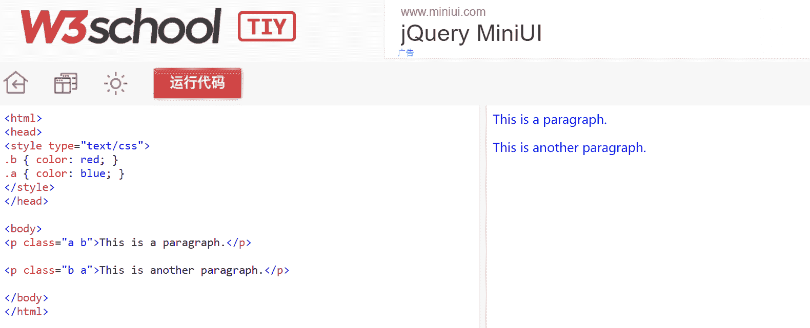
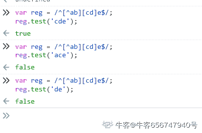

# 奇安信 2020web 前端开发工程师（二）

## 1

小明有 N 元钱去药店买口罩，药店里有 6 个品牌的口罩，A 品牌 2 个装（2 元），B 品牌 3 个装（2 元）、C 品牌 1 个装（3 元）、D 品牌 5 个装（1 元），E 品牌 4 个装（5 元），F 品牌 3 个装（2 元），由于限购每个品牌最多只能买一个，小明最多能买多少口罩？

本题知识点

安卓工程师 iOS 工程师 奇安信 2020 运维工程师 Java 工程师 C++工程师 golang 工程师 PHP 工程师 测试工程师 前端工程师 大数据开发工程师 安全工程师 测试开发工程师

讨论

[你都不肯叫我一声教父](https://www.nowcoder.com/profile/144264450)

```cpp
import java.util.*;
public class Main{
    public static void main(String[]args){
        Scanner in = new Scanner(System.in);
        int n = in.nextInt();
        int [] a = new int [] {0,2,3,1,5,4,3}; //个数
        int [] b = new int [] {0,2,2,3,1,5,2};// 钱 
        int [][]dp = new int [7][n+1];

        dp[0][0] = 0;

        for(int i = 1; i <=6; i++){
            for(int j = 1; j<=n;j++){
                if(j<b[i]){
                    dp[i][j] = dp[i-1][j];//钱不够用了
                }
                else{
                    //不装第 i 个，和装了第 I 个比较
                    dp[i][j] = Math.max(dp[i-1][j],dp[i-1][j-b[i]]+a[i]);
                }

            }
        }
        System.out.println(dp[6][n]);

    }
}
```

典型的 01 背包问题

发表于 2021-03-30 22:11:23

* * *

[theyi](https://www.nowcoder.com/profile/6143310)

n=int(input())
res=0
dp=[[0 for i in range(n+1)] for j in range(7)]
mask=[(2,2),(3,2),(1,3),(5,1),(4,5),(3,2)]
for i in range(1,7):
    for j in range(1,n+1):
        if j>=mask[i-1][1]:

            dp[i][j]=max(dp[i-1][j],mask[i-1][0]+dp[i-1][j-mask[i-1][1]])
        else:
            dp[i][j]=dp[i-1][j]
print(dp[-1][-1])

发表于 2021-09-04 23:28:29

* * *

[_ 雾里](https://www.nowcoder.com/profile/174374052)

01 背包问题 import java.util.Scanner;
public class Main{
    public static void main(String[] args) {
        Scanner in =new Scanner(System.in);
        int n= in.nextInt();//输入 N 元钱，相当于背包总容量
        int[] prices={0,2,2,3,1,5,2};//每种口罩的价格，相当于每个占用背包的容量
        int[] number={0,2,3,1,5,4,3};//买一份有多少个口罩，相当于背包问题的价值
        int[][] dp=new int[7][n+1];//初始化一个二维数组 dp，用来存放最大价值。int[7][n+1] 7 表示的是 0-6 六种口罩，n+1 表示的是一共有 0-n 元钱（背包容量）
        int max=0;
        for (int i = 0; i <n+1 ; i++) {//当一种口罩不买时，不管钱多少，口罩数量均为 0
            dp[0][i]=0;
        }
        for (int i = 1; i <7 ; i++) {//控制遍历口罩的序号（商品序号）
            for (int j = 0; j <n+1; j++) {//控制遍历钱数（空间大小）
                if (j>=prices[i]){
                    //如果当前的钱数 j 买得起当前的口罩 i，那么有两种选择，
                    // 1：不买当前的口罩（不装入背包），此时的最大数量和第 i-1 种口罩的数量一致
                    // 2：购买当前的口罩（装入背包），此时的最大数量时第 i-1 种口罩的数量加上第 i 种口罩的数量，
                    dp[i][j]=Math.max(dp[i-1][j],dp[i-1][j-prices[i]]+number[i]);
                }else { //如果当前的钱数 j 买不起当前的口罩 i，那么最大数量和第 i-1 种口罩一致
                    dp[i][j]=dp[i-1][j];
                }
                max=dp[i][j];
            }
        }
        System.out.println(max);
    }
}具体思路：
[`blog.csdn.net/Supremey/article/details/120785736`](https://blog.csdn.net/Supremey/article/details/120785736)

发表于 2021-10-16 11:13:04

* * *

## 2

```cpp
如下图所示的三角形，有三个边 s1,s2,s3,边 s1 有四个圆圈⭕️1，2，3，4，边 s2 有四个圆圈⭕️4，5，6，7，边 s3 有四个圆圈⭕️7，8，9，1
把 1-9 这 9 个数字，分别填写到下图所示的 9 个圆圈圆圈里， 使每条边上的 4 个圆圈⭕️的和相等（9 个圆圈里的数字不能重复)
例如：s1=[1=>9,2=>8,3=>1,4=>3]=9+8+1+3=21,s2=[4=>3,5=>5,6=>7,7=>6]=3+5+7+6=21,s3=[7=>6,8=>2,9=>4, 1=>9]=6+2+4+9=21
```


本题知识点

安卓工程师 iOS 工程师 奇安信 2020 运维工程师 Java 工程师 C++工程师 golang 工程师 PHP 工程师 测试工程师 前端工程师 大数据开发工程师 安全工程师 测试开发工程师

讨论

[牛客 476036690 号](https://www.nowcoder.com/profile/476036690)

```cpp
import java.util.*;
public class Main {
       public static void main(String[] args) {
        Scanner scanner = new Scanner(System.in);
        String i = scanner.next();
        String[] str = i.split(",");
        ArrayList<Integer> list = new ArrayList<>();
        for (String s : str) {
            list.add(Integer.parseInt(s));
        }

        int n1 = list.get(0) + list.get(1) + list.get(2) + list.get(3);
        int n2 = list.get(3) + list.get(4) + list.get(5) + list.get(6);
        int n3 = list.get(6) + list.get(7) + list.get(8) + list.get(0);

        if (n1 == n2 && n2 == n3) {
            System.out.println("yes");
        } else {
            System.out.println("no");
        }
        }

}

```

编辑于 2022-03-18 12:12:29

* * *

[ʚfairyɞ](https://www.nowcoder.com/profile/441012983)

c++可以增加一个字符变量接收逗号，不过要注意最后一个没有逗号#include<stdio.h>#include<iostream>usingnamespacestd;intmain(){    inta[9], sum1, sum2, sum3;    chart;    for(inti = 0; i < 9; i++)    {        cin >> a[i];        if(i!=8)            cin >> t;    }    sum1 = a[0] + a[1] + a[2] + a[3];    sum2 = a[3] + a[4] + a[5] + a[6];    sum3 = a[6] + a[7] + a[8] + a[0];    if(sum1 == sum2 && sum2 == sum3)        printf("yes");    else        printf("no");}

发表于 2022-03-16 16:22:33

* * *

[能休息一下吗](https://www.nowcoder.com/profile/556032778)

while(line = readline())
    {
        let arr = line.split(',')
        let a = parseInt(arr[0])+parseInt(arr[1])+parseInt(arr[2])+parseInt(arr[3])
        let b = parseInt(arr[3])+parseInt(arr[4])+parseInt(arr[5])+parseInt(arr[6])
        let c = parseInt(arr[6])+parseInt(arr[7])+parseInt(arr[8])+parseInt(arr[0])
        if(a == b && b == c){
            console.log('yes')
        }
        else{
            console.log('no')
        }

    }

发表于 2021-09-06 23:03:34

* * *

## 3

参照以下 HTML 结构，找出 P 标签文本颜色正确的项：
<p class="a b">hello world</p >
p { color: gray; } .b { color: red; } .a { color: blue; }

正确答案: C   你的答案: 空 (错误)

```cpp
gray
```

```cpp
red
```

```cpp
blue
```

```cpp
black
```

本题知识点

前端工程师 奇安信 2020

讨论

[一只敲代码的猿](https://www.nowcoder.com/profile/575405432)

css 样式的优先级顺序:!important > 行内样式 > ID 选择器 > 类选择器 > 标签 > 通配符 > 继承 > 浏览器默认样式

发表于 2021-04-02 10:03:17

* * *

[neptoo](https://www.nowcoder.com/profile/870928103)

重点是 CSS 中类的顺序，在 HTML 中 多个 class 的前后顺序无关紧要

发表于 2021-04-03 21:09:17

* * *

[牛客 581195540 号](https://www.nowcoder.com/profile/581195540)

真的会有人这么写吗？

发表于 2021-04-07 20:18:14

* * *

## 4

SPAN 元素的默认 display 样式是什么

正确答案: B   你的答案: 空 (错误)

```cpp
visible
```

```cpp
inline
```

```cpp
block
```

```cpp
inline-block
```

本题知识点

前端工程师 奇安信 2020

## 5

标准模式下，设置块元素的 width=100px，这 100px 在盒模型中组成部分是（）

正确答案: A   你的答案: 空 (错误)

```cpp
content
```

```cpp
padding(left、right)+content
```

```cpp
padding(left、right)+content+border(left、right)
```

```cpp
padding(left、right)+content+border(left、right)+margin(left、right)
```

本题知识点

前端工程师 奇安信 2020

讨论

[油纸伞🌂](https://www.nowcoder.com/profile/81078884)

标准盒模型: content IE 盒模型: content+ padding+ border

发表于 2021-09-05 00:28:47

* * *

## 6

以下哪个当作 TR 的属性是合理的

正确答案: C   你的答案: 空 (错误)

```cpp
rowspan=3
```

```cpp
cellspan=3
```

```cpp
tabindex=3
```

```cpp
rows=3
```

本题知识点

前端工程师 奇安信 2020

## 7

el 是一个 id="id1"的 div 元素，以下哪行代码会执行失败

正确答案: B   你的答案: 空 (错误)

```cpp
el.className='aaa'
```

```cpp
el.tagName='p'
```

```cpp
el.innerHTML=''
```

```cpp
el.id='id2'
```

本题知识点

前端工程师 奇安信 2020 Javascript

讨论

[coldflies](https://www.nowcoder.com/profile/325956810)

tagName()是用来获取当前标签名的方法,  而非设置标签

发表于 2021-03-30 23:10:16

* * *

[ruideliu](https://www.nowcoder.com/profile/564194120)

A.  className 属性**设置或返回**元素的 class 属性。获取属性值：HTMLElementObject.className；设置属性值：HTMLElementObject.className=*classname***B. ** **tag****Name 属性返回元素的标签名**。HTML 返回 tagName 属性的值是大写的。element.tagNameC.  innerHTML 属性**设置或返回**表格行的开始和结束标签之间的 HTML。HTMLElementObject.innerHTML=textD.  id 属性**设****置或者返回**元素的 id。HTMLElementObject.id=id

编辑于 2021-04-01 00:06:33

* * *

[超大型小熊软糖](https://www.nowcoder.com/profile/207072958)

classname id innerHTML 都是可读可写的 tagname 只可读不可写

发表于 2021-09-07 09:33:36

* * *

## 8

代码 11/4 对应的结果是：

正确答案: D   你的答案: 空 (错误)

```cpp
2
```

```cpp
3
```

```cpp
2.7489560000000002
```

```cpp
2.75
```

本题知识点

前端工程师 奇安信 2020

## 9

var reg = /^[^ab][cd]e$/; 那么，以下为 true 的是

正确答案: B   你的答案: 空 (错误)

```cpp
reg.test('abcde')
```

```cpp
reg.test('cde')
```

```cpp
reg.test('ace')
```

```cpp
reg.test('de')
```

本题知识点

前端工程师 奇安信 2020

讨论

[vvrecord](https://www.nowcoder.com/profile/35994454)

答案有毒吧

发表于 2021-03-25 00:12:13

* * *

[牛客 656747940 号](https://www.nowcoder.com/profile/656747940)

[^ ]不是非[ ]内的字符嘛？

编辑于 2021-03-24 23:15:44

* * *

[牛客 444587633 号](https://www.nowcoder.com/profile/444587633)

中括号里面添加^表示取反 选 B

发表于 2021-10-10 16:02:07

* * *

## 10

代码 new Date(2020,3,8)对应的日期是：

正确答案: C   你的答案: 空 (错误)

```cpp
三月八日
```

```cpp
三月九日
```

```cpp
四月八日
```

```cpp
四月九日
```

本题知识点

前端工程师 奇安信 2020

讨论

[夜寻极光。](https://www.nowcoder.com/profile/868966489)

myDate.getYear(); //获取当前年份(2 位)  
    myDate.getFullYear(); //获取完整的年份(4 位,1970-????)  
    myDate.getMonth(); //获取当前月份(0-11,0 代表 1 月) 所以获取当前月份是 myDate.getMonth()+1;   
    myDate.getDate(); //获取当前日(1-31)  
    myDate.getDay(); //获取当前星期 X(0-6,0 代表星期天)  
    myDate.getTime(); //获取当前时间(从 1970.1.1 开始的毫秒数)  
    myDate.getHours(); //获取当前小时数(0-23)  
    myDate.getMinutes(); //获取当前分钟数(0-59)  
    myDate.getSeconds(); //获取当前秒数(0-59)  
    myDate.getMilliseconds(); //获取当前毫秒数(0-999)  
    myDate.toLocaleDateString(); //获取当前日期  
    var mytime = myDate.toLocaleTimeString(); //获取当前时间  
    myDate.toLocaleString( ); //获取日期与时间  

发表于 2021-08-31 22:46:54

* * *

[阡陌丶扶苏](https://www.nowcoder.com/profile/796075517)

月份需要+1

发表于 2021-08-23 11:38:13

* * *

## 11

var a = []; 下以哪一个不是 a 的方法：

正确答案: B   你的答案: 空 (错误)

```cpp
join
```

```cpp
split
```

```cpp
sort
```

```cpp
reverse
```

本题知识点

前端工程师 奇安信 2020

讨论

[小白爱吃鱼](https://www.nowcoder.com/profile/7262329)

split 是字符串的方法

发表于 2021-03-25 11:26:35

* * *

[一只敲代码的猿](https://www.nowcoder.com/profile/575405432)

split 把字符串分割成字符串数组 join  把数组拼接成以其他形式分割的字符串 sort 数组排序 reverse 数组翻转 ,返回值是翻转后的新数组,原数组发生改变

发表于 2021-04-02 10:18:17

* * *

## 12

以下代码执行后，result 的值变成什么？
var val='a', result='';
switch (val) {
  case 'a':
   result += 'a';
  case 'b':
    result += 'b';
  default:
    result += 'c';
    break;
}

正确答案: D   你的答案: 空 (错误)

```cpp
a
```

```cpp
c
```

```cpp
ac
```

```cpp
abc
```

本题知识点

前端工程师 奇安信 2020

讨论

[许莹](https://www.nowcoder.com/profile/6810825)

没有 break 会无条件执行后面的代码

发表于 2021-03-27 22:23:05

* * *

## 13

批处理系统的主要缺点是？

正确答案: C   你的答案: 空 (错误)

```cpp
CPU 利用率不高
```

```cpp
不具备并行性
```

```cpp
失去了交互性
```

```cpp
其他答案均不正确
```

本题知识点

安卓工程师 iOS 工程师 奇安信 2020 Java 工程师 C++工程师 PHP 工程师 golang 工程师 前端工程师 安全工程师

## 14

以下哪个不是一个运行进程可能出现的状态？

正确答案: B   你的答案: 空 (错误)

```cpp
就绪状态
```

```cpp
创建状态
```

```cpp
执行状态
```

```cpp
等待状态
```

本题知识点

安卓工程师 iOS 工程师 奇安信 2020 运维工程师 Java 工程师 C++工程师 golang 工程师 PHP 工程师 前端工程师 安全工程师

## 15

一个向量第一个元素的存储地址是 30，每个元素的长度为 2，则第 5 个元素的地址是（）

正确答案: C   你的答案: 空 (错误)

```cpp
35
```

```cpp
40
```

```cpp
38
```

```cpp
30
```

本题知识点

安卓工程师 iOS 工程师 奇安信 2020 运维工程师 Java 工程师 C++工程师 golang 工程师 PHP 工程师 测试工程师 前端工程师 大数据开发工程师 测试开发工程师

## 16

栈中元素的进出原则是

正确答案: A   你的答案: 空 (错误)

```cpp
先进后出
```

```cpp
先出后进
```

```cpp
先进先出
```

```cpp
同进同出
```

本题知识点

安卓工程师 iOS 工程师 奇安信 2020 运维工程师 Java 工程师 C++工程师 golang 工程师 PHP 工程师 测试工程师 前端工程师 大数据开发工程师 测试开发工程师

讨论

[demo065](https://www.nowcoder.com/profile/239481568)

啊这..

发表于 2021-04-11 13:27:09

* * *

[Ideals6](https://www.nowcoder.com/profile/709296402)

额。。这套试卷很多题都是错的

发表于 2021-04-01 20:32:39

* * *

[牛客 993774460 号](https://www.nowcoder.com/profile/993774460)

这答案就离谱

发表于 2021-03-28 14:17:06

* * *

## 17

在无序的情况下对ｎ个不同的数字进行冒泡排序，比较的次数为

正确答案: D   你的答案: 空 (错误)

```cpp
2n-1
```

```cpp
n
```

```cpp
n-1
```

```cpp
n(n-2)/3
```

本题知识点

安卓工程师 iOS 工程师 奇安信 2020 Java 工程师 C++工程师 golang 工程师 PHP 工程师 测试工程师 前端工程师 大数据开发工程师 测试开发工程师

讨论

[邢玉](https://www.nowcoder.com/profile/408499885)

有人能讲讲吗？？为什么答案不是 n*（n-1）/2

发表于 2021-10-10 14:57:48

* * *

[康宁汉姆有颗树](https://www.nowcoder.com/profile/185438902)

答案显然错了啊……应该 n(n-1)/2

发表于 2022-03-16 12:04:30

* * *

[牛客 867941589 号](https://www.nowcoder.com/profile/867941589)

先排除前三个选项😎

发表于 2021-03-26 16:07:53

* * *

## 18

在（）中只要指出其中任何一个结点的位置，就可以从它出发依次访问到其他所有结点

正确答案: C   你的答案: 空 (错误)

```cpp
双向链表
```

```cpp
完全二叉树
```

```cpp
循环链表
```

```cpp
有向无环图
```

本题知识点

安卓工程师 iOS 工程师 奇安信 2020 Java 工程师 C++工程师 golang 工程师 PHP 工程师 测试工程师 前端工程师 大数据开发工程师 测试开发工程师

讨论

[踏实的做每一件事](https://www.nowcoder.com/profile/9112342)

为什么双向链表不行？

发表于 2021-04-18 11:07:54

* * *

[牛客 867941589 号](https://www.nowcoder.com/profile/867941589)

循环链表可以实现从一个点出发，在不重复遍历的情况下，遍历所有的点。

发表于 2021-03-26 16:09:18

* * *

## 19

以下数据结构属于非线性数据结构的是

正确答案: B   你的答案: 空 (错误)

```cpp
线性单链表
```

```cpp
图
```

```cpp
栈
```

```cpp
队列
```

本题知识点

运维工程师 奇安信 2020 Java 工程师 C++工程师 golang 工程师 PHP 工程师 测试工程师 前端工程师 大数据开发工程师 测试开发工程师

讨论

[牛客 908925603 号](https://www.nowcoder.com/profile/908925603)

B

发表于 2021-09-22 17:07:09

* * *

[Daryl1997](https://www.nowcoder.com/profile/530933609)

树、图、堆、散列表属于非线性数据结构

发表于 2021-06-08 15:37:59

* * *

[牛客 335157866 号](https://www.nowcoder.com/profile/335157866)

图是非线性的结构，是一种分支层次结构

发表于 2021-05-10 15:34:29

* * *

## 20

如果在马路上 20 分钟内看到一个人走过的几率是 0.91，那么在 10 分钟内看到一个人走过的几率是多少？(假设常概率条件下)

正确答案: B   你的答案: 空 (错误)

```cpp
0.8
```

```cpp
0.7
```

```cpp
0.6
```

```cpp
0.5
```

本题知识点

运维工程师 奇安信 2020 Java 工程师 C++工程师 golang 工程师 PHP 工程师 测试工程师 前端工程师 大数据开发工程师 测试开发工程师

讨论

[牛雪碧](https://www.nowcoder.com/profile/569802555)

20 分钟内看不到人的概率 p 是 1-0.91=0.09，该事件可理解为 2 个事件 b(10 分钟内看不到人)同时发生，那么事件 b 的概率 p(b)*p(b)=0.09,可得 p(b)=0.3,因此求得 10 分钟内看到人的概率为 1-0.3=0.7.

发表于 2021-03-27 09:22:55

* * *

## 21

交换机收到目的 MAC 为组播 MAC 的数据包将会

正确答案: C   你的答案: 空 (错误)

```cpp
广播
```

```cpp
丢包
```

```cpp
学习源 MAC
```

```cpp
所有答案均不正确
```

本题知识点

安卓工程师 iOS 工程师 奇安信 2020 Java 工程师 C++工程师 golang 工程师 PHP 工程师 测试工程师 前端工程师 安全工程师 测试开发工程师

讨论

[丶 awesome](https://www.nowcoder.com/profile/718974418)

交换机里有一个 mac 地址缓存表，里面记录端口号和 mac 地址，收到地址后先查表，也就是学习 mac 地址，如果表里没有，再进行广播

发表于 2021-09-22 12:38:33

* * *

## 22

下列 TCP 连接建立过程描述正确的是?

正确答案: C   你的答案: 空 (错误)

```cpp
服务端收到客户端的 SYN 包后等待 2*ml 时间后就会进入 SYN_SENT 状态
```

```cpp
服务端收到客户端的 ACK 包后会进入 SYN_RCVD 状态
```

```cpp
当客户端处于 ESTABLISHED 状态时，服务端可能仍处于 SYN_RCVD 状态
```

```cpp
服务端未收到客户端确认包，等待 2*ml 时间后会直接关闭连接
```

本题知识点

Java 工程师 C++工程师 golang 工程师 奇安信 PHP 工程师 2020 前端工程师 安全工程师

讨论

[牛客 546590565 号](https://www.nowcoder.com/profile/546590565)

考察知识点：TCP 建立连接断开连接（三次握手四次挥手），客户端与服务端状态变化
A：SYN_SENT 是客户端发送 SYN 包之后的立即进入的状态，不用等待 2ml
B：服务端收到客户端的 SYN 包后会进入 SYN_RCVD 状态，服务端收到 ACK 包后会进入 established 状态。
C： 当客户端处于 ESTABLISHED 状态时，服务端等待接收客户端的 ACK，所以可能处于 SYN_RCVD 状态。
D： 客户端收到服务端确认包后，等待 2*ml 时间后会直接关闭连接。若没有收到，则不会关闭连接。

发表于 2021-08-22 09:54:54

* * *

## 23

以下说法正确的是：.parent { font-size: 16px } .child { font-size: 2em; height: 3em }

正确答案: B D   你的答案: 空 (错误)

```cpp
.child 的字号是 16px
```

```cpp
.child 的字号是 32px
```

```cpp
.child 的高度是 48px
```

```cpp
.child 的高度是 96px
```

本题知识点

前端工程师 奇安信 2020

讨论

[vvrecord](https://www.nowcoder.com/profile/35994454)

font-size 根据 parent，height 根据自己 font-size

发表于 2021-03-25 00:13:54

* * *

[牛客 591067951 号](https://www.nowcoder.com/profile/591067951)

父元素是 16，子元素继承，由于 font-size 根据 parent 元素改变，font-size 为 2x16 = 32，而 height 属性根据自己 font-size 改变，所以应该是 32 x 3 = 96

发表于 2022-01-23 04:22:55

* * *

[PingWo](https://www.nowcoder.com/profile/514784482)

不太理解，父元素是 16px，子元素继承了，2*16=32，3*16=48 啊为啥是 BD

发表于 2022-01-20 00:58:04

* * *

## 24

以下标签组合,哪些可以当作直接父子

正确答案: B D   你的答案: 空 (错误)

```cpp
TABLE>TD
```

```cpp
DIV>DIV
```

```cpp
P>P
```

```cpp
LI>UL
```

本题知识点

前端工程师 奇安信 2020

讨论

[夜寻极光。](https://www.nowcoder.com/profile/868966489)

p 标签不能嵌套块级标签

发表于 2021-08-31 22:52:23

* * *

## 25

当 abc 分别为什么值时，(a&&b||c) == (a?b:c)

正确答案: A B D   你的答案: 空 (错误)

```cpp
false,false,true
```

```cpp
false,true,false
```

```cpp
true,false,true
```

```cpp
true,true,false
```

本题知识点

前端工程师 奇安信 2020

讨论

[牛客 591067951 号](https://www.nowcoder.com/profile/591067951)

1\.(false&&false||true) == (false?false:true)(false||true) == (true)(true) == (true)2.(false&&true||false) == (false?true:false)(false||false) == (false)(false) == (false)3.(true&&false||true) == (true?false:true)(false||true) == (false)(true) == (false)4\.(true&&true||false) == (true?true:false)(true||false) == (true)(true) == (true) 

发表于 2022-01-23 04:28:44

* * *

## 26

以下哪些字符串方法的参数支持正则表达式

正确答案: A B C   你的答案: 空 (错误)

```cpp
split
```

```cpp
match
```

```cpp
replace
```

```cpp
indexOf
```

本题知识点

前端工程师 奇安信 2020

讨论

[夜寻极光。](https://www.nowcoder.com/profile/868966489)

indexOf 不支持正则表达式

发表于 2021-08-31 22:53:53

* * *

## 27

var reg = /^[^a][bc]\de/; 那么，以下为 true 的有

正确答案: B C D   你的答案: 空 (错误)

```cpp
reg.test('ac\de')
```

```cpp
reg.test('bc1e')
```

```cpp
reg.test('bc1ef')
```

```cpp
reg.test('db1efg')
```

本题知识点

前端工程师 奇安信 2020

## 28

变量 el 为一个 form 元素，哪些方法可以调用

正确答案: A B D   你的答案: 空 (错误)

```cpp
submit
```

```cpp
reset
```

```cpp
empty
```

```cpp
insertBefore
```

本题知识点

前端工程师 奇安信 2020

讨论

[牛雪碧](https://www.nowcoder.com/profile/569802555)

这题 w3c 上只有 reset 和 submit 方法

发表于 2021-03-27 10:49:14

* * *

## 29

下列描述正确的是

正确答案: A B C   你的答案: 空 (错误)

```cpp
进程拥有自己独立的堆和栈，既不共享堆，也不共享栈
```

```cpp
线程是 CPU 独立运行和独立调度的基本单位
```

```cpp
协程是一种用户态的轻量级线程
```

```cpp
进程，线程，协程的调度都由操作系统完成
```

本题知识点

前端工程师 奇安信 2020 安全工程师

讨论

[夜寻极光。](https://www.nowcoder.com/profile/868966489)

线程作为调度和分配的基本单位,进程作为拥有资源的基本单位;

发表于 2021-08-31 22:57:03

* * *

[zzzzz_zou](https://www.nowcoder.com/profile/131127443)

协程，英文 Coroutines，是一种基于线程之上，但又比线程更加轻量级的存在，这种由程序员自己写程序来管理的轻量级线程叫做『用户空间线程』，**具有对内核来说不可见的特性。**

发表于 2021-03-28 15:37:23

* * *

## 30

已知二叉树的先序遍历结果为 ABCDEF，后序遍历结果为 CDBFEA，那么，中序遍历结果可以是（）

正确答案: A C   你的答案: 空 (错误)

```cpp
CBDAEF
```

```cpp
DCAEFB
```

```cpp
CBDAFE
```

```cpp
CBADFE
```

本题知识点

安卓工程师 iOS 工程师 奇安信 2020 前端工程师 大数据开发工程师 Java 工程师 C++工程师 PHP 工程师 golang 工程师

讨论

[小夏不饿](https://www.nowcoder.com/profile/373455833)

有下面两种情况的二叉树

发表于 2021-08-27 16:27:38

* * *

## 31

同时具有较高的插入和删除性能的数据结构有？

正确答案: C D   你的答案: 空 (错误)

```cpp
单链表
```

```cpp
数组
```

```cpp
二叉树
```

```cpp
哈希表
```

本题知识点

安卓工程师 iOS 工程师 奇安信 2020 前端工程师 大数据开发工程师 Java 工程师 C++工程师 PHP 工程师 golang 工程师

讨论

[牛客 993774460 号](https://www.nowcoder.com/profile/993774460)

单链表的插入和删除不都是 O(1)吗？

发表于 2021-03-28 14:23:49

* * *

## 32

下列属于 ipv6 报文头中的字段的是

正确答案: A B C   你的答案: 空 (错误)

```cpp
版本号
```

```cpp
留标签（flow label）
```

```cpp
跳数限制
```

```cpp
服务类型（Type of Service）
```

本题知识点

运维工程师 奇安信 2020 Java 工程师 C++工程师 golang 工程师 PHP 工程师 前端工程师 安全工程师

讨论

[jiet07](https://www.nowcoder.com/profile/382060089)

留标签（flow label)写错啦，应该为流标签（flow label).

发表于 2021-07-30 20:16:16

* * *

[psychowo](https://www.nowcoder.com/profile/980213287)

[`blog.csdn.net/qq_34127958/article/details/70143280`](https://blog.csdn.net/qq_34127958/article/details/70143280)

发表于 2021-05-29 15:55:01

* * *