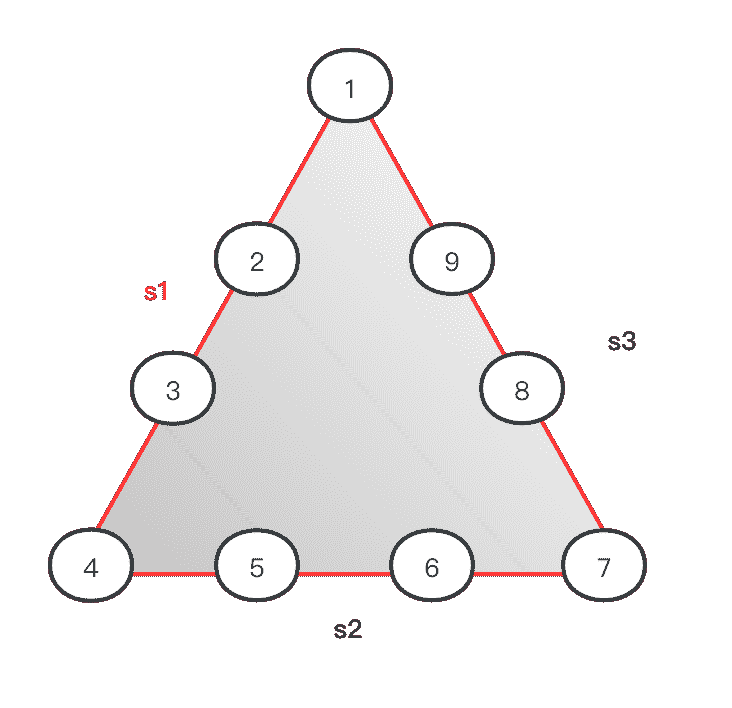
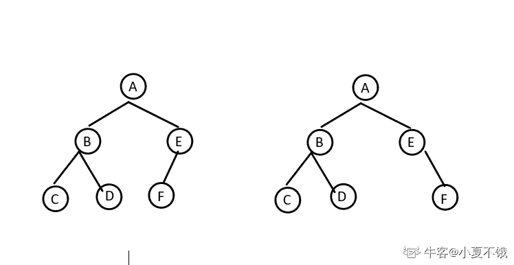

# 奇安信 2020 大数据开发工程师（二）

## 1

小明有 N 元钱去药店买口罩，药店里有 6 个品牌的口罩，A 品牌 2 个装（2 元），B 品牌 3 个装（2 元）、C 品牌 1 个装（3 元）、D 品牌 5 个装（1 元），E 品牌 4 个装（5 元），F 品牌 3 个装（2 元），由于限购每个品牌最多只能买一个，小明最多能买多少口罩？

本题知识点

安卓工程师 iOS 工程师 奇安信 2020 运维工程师 Java 工程师 C++工程师 golang 工程师 PHP 工程师 测试工程师 前端工程师 大数据开发工程师 安全工程师 测试开发工程师

讨论

[你都不肯叫我一声教父](https://www.nowcoder.com/profile/144264450)

```cpp
import java.util.*;
public class Main{
    public static void main(String[]args){
        Scanner in = new Scanner(System.in);
        int n = in.nextInt();
        int [] a = new int [] {0,2,3,1,5,4,3}; //个数
        int [] b = new int [] {0,2,2,3,1,5,2};// 钱 
        int [][]dp = new int [7][n+1];

        dp[0][0] = 0;

        for(int i = 1; i <=6; i++){
            for(int j = 1; j<=n;j++){
                if(j<b[i]){
                    dp[i][j] = dp[i-1][j];//钱不够用了
                }
                else{
                    //不装第 i 个，和装了第 I 个比较
                    dp[i][j] = Math.max(dp[i-1][j],dp[i-1][j-b[i]]+a[i]);
                }

            }
        }
        System.out.println(dp[6][n]);

    }
}
```

典型的 01 背包问题

发表于 2021-03-30 22:11:23

* * *

[theyi](https://www.nowcoder.com/profile/6143310)

n=int(input())
res=0
dp=[[0 for i in range(n+1)] for j in range(7)]
mask=[(2,2),(3,2),(1,3),(5,1),(4,5),(3,2)]
for i in range(1,7):
    for j in range(1,n+1):
        if j>=mask[i-1][1]:

            dp[i][j]=max(dp[i-1][j],mask[i-1][0]+dp[i-1][j-mask[i-1][1]])
        else:
            dp[i][j]=dp[i-1][j]
print(dp[-1][-1])

发表于 2021-09-04 23:28:29

* * *

[_ 雾里](https://www.nowcoder.com/profile/174374052)

01 背包问题 import java.util.Scanner;
public class Main{
    public static void main(String[] args) {
        Scanner in =new Scanner(System.in);
        int n= in.nextInt();//输入 N 元钱，相当于背包总容量
        int[] prices={0,2,2,3,1,5,2};//每种口罩的价格，相当于每个占用背包的容量
        int[] number={0,2,3,1,5,4,3};//买一份有多少个口罩，相当于背包问题的价值
        int[][] dp=new int[7][n+1];//初始化一个二维数组 dp，用来存放最大价值。int[7][n+1] 7 表示的是 0-6 六种口罩，n+1 表示的是一共有 0-n 元钱（背包容量）
        int max=0;
        for (int i = 0; i <n+1 ; i++) {//当一种口罩不买时，不管钱多少，口罩数量均为 0
            dp[0][i]=0;
        }
        for (int i = 1; i <7 ; i++) {//控制遍历口罩的序号（商品序号）
            for (int j = 0; j <n+1; j++) {//控制遍历钱数（空间大小）
                if (j>=prices[i]){
                    //如果当前的钱数 j 买得起当前的口罩 i，那么有两种选择，
                    // 1：不买当前的口罩（不装入背包），此时的最大数量和第 i-1 种口罩的数量一致
                    // 2：购买当前的口罩（装入背包），此时的最大数量时第 i-1 种口罩的数量加上第 i 种口罩的数量，
                    dp[i][j]=Math.max(dp[i-1][j],dp[i-1][j-prices[i]]+number[i]);
                }else { //如果当前的钱数 j 买不起当前的口罩 i，那么最大数量和第 i-1 种口罩一致
                    dp[i][j]=dp[i-1][j];
                }
                max=dp[i][j];
            }
        }
        System.out.println(max);
    }
}具体思路：
[`blog.csdn.net/Supremey/article/details/120785736`](https://blog.csdn.net/Supremey/article/details/120785736)

发表于 2021-10-16 11:13:04

* * *

## 2

```cpp
如下图所示的三角形，有三个边 s1,s2,s3,边 s1 有四个圆圈⭕️1，2，3，4，边 s2 有四个圆圈⭕️4，5，6，7，边 s3 有四个圆圈⭕️7，8，9，1
把 1-9 这 9 个数字，分别填写到下图所示的 9 个圆圈圆圈里， 使每条边上的 4 个圆圈⭕️的和相等（9 个圆圈里的数字不能重复)
例如：s1=[1=>9,2=>8,3=>1,4=>3]=9+8+1+3=21,s2=[4=>3,5=>5,6=>7,7=>6]=3+5+7+6=21,s3=[7=>6,8=>2,9=>4, 1=>9]=6+2+4+9=21
```



本题知识点

安卓工程师 iOS 工程师 奇安信 2020 运维工程师 Java 工程师 C++工程师 golang 工程师 PHP 工程师 测试工程师 前端工程师 大数据开发工程师 安全工程师 测试开发工程师

讨论

[牛客 476036690 号](https://www.nowcoder.com/profile/476036690)

```cpp
import java.util.*;
public class Main {
       public static void main(String[] args) {
        Scanner scanner = new Scanner(System.in);
        String i = scanner.next();
        String[] str = i.split(",");
        ArrayList<Integer> list = new ArrayList<>();
        for (String s : str) {
            list.add(Integer.parseInt(s));
        }

        int n1 = list.get(0) + list.get(1) + list.get(2) + list.get(3);
        int n2 = list.get(3) + list.get(4) + list.get(5) + list.get(6);
        int n3 = list.get(6) + list.get(7) + list.get(8) + list.get(0);

        if (n1 == n2 && n2 == n3) {
            System.out.println("yes");
        } else {
            System.out.println("no");
        }
        }

}

```

编辑于 2022-03-18 12:12:29

* * *

[ʚfairyɞ](https://www.nowcoder.com/profile/441012983)

c++可以增加一个字符变量接收逗号，不过要注意最后一个没有逗号#include<stdio.h>#include<iostream>usingnamespacestd;intmain(){    inta[9], sum1, sum2, sum3;    chart;    for(inti = 0; i < 9; i++)    {        cin >> a[i];        if(i!=8)            cin >> t;    }    sum1 = a[0] + a[1] + a[2] + a[3];    sum2 = a[3] + a[4] + a[5] + a[6];    sum3 = a[6] + a[7] + a[8] + a[0];    if(sum1 == sum2 && sum2 == sum3)        printf("yes");    else        printf("no");}

发表于 2022-03-16 16:22:33

* * *

[能休息一下吗](https://www.nowcoder.com/profile/556032778)

while(line = readline())
    {
        let arr = line.split(',')
        let a = parseInt(arr[0])+parseInt(arr[1])+parseInt(arr[2])+parseInt(arr[3])
        let b = parseInt(arr[3])+parseInt(arr[4])+parseInt(arr[5])+parseInt(arr[6])
        let c = parseInt(arr[6])+parseInt(arr[7])+parseInt(arr[8])+parseInt(arr[0])
        if(a == b && b == c){
            console.log('yes')
        }
        else{
            console.log('no')
        }

    }

发表于 2021-09-06 23:03:34

* * *

## 3

下列修饰符不是访问权限控制符的是

正确答案: C   你的答案: 空 (错误)

```cpp
public
```

```cpp
protected
```

```cpp
static
```

```cpp
private
```

本题知识点

测试工程师 奇安信 2020 大数据开发工程师 测试开发工程师

## 4

Java 命令中，哪一个可以编译 HelloWorld.java 文件

正确答案: B   你的答案: 空 (错误)

```cpp
java HelloWorld
```

```cpp
javac HelloWorld.java
```

```cpp
javac HelloWorld
```

```cpp
java HelloWorld.java
```

本题知识点

测试工程师 奇安信 2020 大数据开发工程师 测试开发工程师

讨论

[魇澞](https://www.nowcoder.com/profile/292873506)

B (记事本) 1.将文件后缀名修改为 HelloWorld.java(如果没有显示后缀名就打开计算机->查看->显示隐藏文件名)【名称尽量满足全英文，驼峰模式】 2.打开记事本，输入以下代码 public class HelloWorld{ public static voud main(String[] args){ System.out.println("Hello World"); } } 并按 Ctrl+s 保存 3.打开 cmd 命令控制符，进入到当前 HelloWorld.java 文件存放的文件夹，输入 javac HelloWorld.java(编译 java 文件，并要带.java 后缀名） 4.此时存放 HelloWorld.java 文件夹里会出现一个名为 HelloWorld.class 的 class 文件(是编译后的文件) 5.在命令控制符中输入 java HelloWorld(不要带后缀，否则会报错)【执行文件】 6.若是显示 HelloWorld 也代表成功

发表于 2022-02-23 23:48:24

* * *

[牛 18370306532 号](https://www.nowcoder.com/profile/173932132)

b javac HelloWorld.java java HelloWorld

发表于 2021-10-19 14:13:33

* * *

[抱羊](https://www.nowcoder.com/profile/644716205)

B javac 命令将.java 编译成.class

发表于 2021-09-02 11:48:56

* * *

## 5

下面关于抽象类和接口的说法，不正确的是

正确答案: B   你的答案: 空 (错误)

```cpp
抽象类里可以有非抽象方法
```

```cpp
接口不可以被实例化，抽象类可以实例化
```

```cpp
类可以实现多个接口，但只能继承一个抽象类
```

```cpp
类可以不实现抽象类和接口声明的所有方法
```

本题知识点

Java 工程师 C++工程师 PHP 工程师 golang 工程师 2020 奇安信 测试工程师 大数据开发工程师 测试开发工程师

讨论

[牛客 140194495 号](https://www.nowcoder.com/profile/140194495)

 接口的子类必须实现接口中所有的方法吗？答案：不是。缘由以下：
编 若是子类是非抽象类，则必须实现接口中的全部方法；ide

     若是子类是抽象类，则能够不实现接口中的全部方法，由于抽象类中容许有抽象方法的存在！

发表于 2022-03-08 17:08:05

* * *

[牛客 72864520 号](https://www.nowcoder.com/profile/72864520)

类可以不实现抽象类和接口声明的所有方法，前提是这个类是抽象类。但是接口应该是说实现吧，而不是说实例化。。。。 发表于 2021-08-18 14:58:12

* * *

## 6

关于抽象方法的说法正确的是

正确答案: D   你的答案: 空 (错误)

```cpp
抽象类中一定有抽象方法
```

```cpp
抽象方法可以出现在非抽象类中
```

```cpp
抽象类不能被继承
```

```cpp
接口中的方法都是抽象方法
```

本题知识点

Java 工程师 C++工程师 PHP 工程师 golang 工程师 2020 奇安信 测试工程师 大数据开发工程师 测试开发工程师

## 7

下面论述正确的是

正确答案: D   你的答案: 空 (错误)

```cpp
如果两个对象的 hashcode 相同，那么它们作为同一个 HashMap 的 key 时，必然返回同样的值
```

```cpp
如果 a,b 的 hashcode 相同，那么 a.equals(b)必须返回 true
```

```cpp
对于一个类，其所有对象的 hashcode 必须不同
```

```cpp
如果 a.equals(b)返回 true，那么 a,b 两个对象的 hashcode 必须相同
```

本题知识点

Java 工程师 C++工程师 PHP 工程师 golang 工程师 2020 奇安信 大数据开发工程师

讨论

[开高达的史莱姆](https://www.nowcoder.com/profile/8805731)

hashCode()方法和 equals()方法的作用其实是一样的，在 Java 里都是用来对比两个对象是否相等一致。
那么 equals()既然已经能实现对比的功能了，为什么还要 hashCode()呢？因为重写的 equals()里一般比较的比较全面比较复杂，这样效率就比较低，而利用 hashCode()进行对比，则只要生成一个 hash 值进行比较就可以了，效率很高。
那么 hashCode()既然效率这么高为什么还要 equals()呢？ 因为 hashCode()并不是完全可靠，有时候不同的对象他们生成的 hashcode 也会一样（生成 hash 值得公式可能存在的问题），所以 hashCode()只能说是大部分时候可靠，并不是绝对可靠，
所以我们可以得出：
1.equals()相等的两个对象他们的 hashCode()肯定相等，也就是用 equals()对比是绝对可靠的。
2.hashCode()相等的两个对象他们的 equal()不一定相等，也就是 hashCode()不是绝对可靠的。
所有对于需要大量并且快速的对比的话如果都用 equals()去做显然效率太低，所以解决方式是，每当需要对比的时候，首先用 hashCode()去对比，如果 hashCode()不一样，则表示这两个对象肯定不相等（也就是不必再用 equal()去再对比了）,如果 hashCode()相同，此时再对比他们的 equals()，如果 equals()也相同，则表示这两个对象是真的相同了，这样既能大大提高了效率也保证了对比的绝对正确性！

发表于 2021-04-22 18:09:21

* * *

## 8

关于 linux 文件操作，下面说法正确的是？

正确答案: A   你的答案: 空 (错误)

```cpp
一个文件的权限为-rwxr-xr-- ，用数字表示是：754
```

```cpp
chown -R root:root dir，可以将 dir 下所有文件的所有者和所属组变为 root
```

```cpp
mkdir -p dir，若 dir 目录已存在，shell 命令执行时会报错
```

```cpp
chmod u+x file1，会给 file1 的所有者增加可执行权限
```

本题知识点

安卓工程师 iOS 工程师 奇安信 2020 运维工程师 Java 工程师 C++工程师 golang 工程师 PHP 工程师 大数据开发工程师

讨论

[牛客 705503055 号](https://www.nowcoder.com/profile/705503055)

a 选项：r=4，w=2，x=1
若要 rwx 属性则 4+2+1=7；
若要 rw-属性则 4+2=6；
若要 r-x 属性则 4+1=5。
c 选项：是递归创建文件 d 选项：该档案的拥有者增加执行权限，a 才是所有者

发表于 2021-04-07 23:08:03

* * *

[土娃](https://www.nowcoder.com/profile/661717914)

这个题真是一点都不严谨，B 选项我在 root 用户下执行，一点毛病也没有。D 还玩文字游戏，

发表于 2021-04-26 15:46:55

* * *

[psychowo](https://www.nowcoder.com/profile/980213287)

A 哪里错了- rwx r-x r-- 不是 7，5，4 么

发表于 2021-05-27 21:21:15

* * *

## 9

关于 TCP 和 UDP 协议，下面说法正确的是？

正确答案: A   你的答案: 空 (错误)

```cpp
TCP 基于连接，UDP 是无连接的
```

```cpp
TCP 面向报文传输，UDP 面向字节流传输
```

```cpp
TCP 拥有拥塞控制机制，UDP 没有
```

```cpp
TCP 和 UDP 都支持多对多通信
```

本题知识点

安卓工程师 iOS 工程师 奇安信 2020 Java 工程师 C++工程师 golang 工程师 PHP 工程师 大数据开发工程师

讨论

[Ideals6](https://www.nowcoder.com/profile/709296402)

c 答案也是对的吧

发表于 2021-04-01 19:31:27

* * *

[初级炼丹师 Yiky](https://www.nowcoder.com/profile/342467844)

TCP 作为面向流的协议，提供可靠的、面向连接的运输服务，并且提供点对点通信 UDP 作为面向报文的协议，不提供可靠交付，并且不需要连接，不仅仅对点对点，也支持多播和广播

编辑于 2022-02-24 13:08:20

* * *

[牛客 992602310 号](https://www.nowcoder.com/profile/992602310)

可以参考《计算机网络自顶向下方法》中第三章 3.3 的描述：“很多研究人员已经提出一种新机制，以促使数据源(包括 UDP)执行自适应的拥塞控制”

发表于 2021-10-16 10:22:23

* * *

## 10

LINUX 中关于僵尸进程的说法正确的是

正确答案: B   你的答案: 空 (错误)

```cpp
僵尸进程是由于父进程异常退出造成的
```

```cpp
僵尸进程是由于父进程未回收子进程造成的
```

```cpp
父进程在创建子进程时，调用 2 次 fork，可以预防僵尸进程
```

```cpp
僵尸进程可以使用 kill -9 杀掉
```

本题知识点

安卓工程师 iOS 工程师 奇安信 2020 Java 工程师 C++工程师 golang 工程师 PHP 工程师 大数据开发工程师

讨论

[开高达的史莱姆](https://www.nowcoder.com/profile/8805731)

一个进程在调用 exit 命令结束自己的生命的时候，其实它并没有真正的被销毁，而是留下一个称为[僵尸进程](http://www.nowamagic.net/librarys/veda/tag/%E5%83%B5%E5%B0%B8%E8%BF%9B%E7%A8%8B)（Zombie）的数据结构（系统调用 exit， 它的作用是使进程退出，但也仅仅限于将一个正常的进程变成一个僵尸进程，并不能将其完全销毁）。

在 Linux 进程的状态中，僵尸进程是非常特殊的一种，它已经放弃了几乎所有内存空间，没有任何可执行代码，也不能被调度，仅仅在进程列表中保留一个位 置，记载该进程的退出状态等信息供其他进程收集。除此之外，僵尸进程不再占有任何内存空间。它需要它的父进程来为它收尸，如果他的父进程没安装 SIGCHLD 信号处理函数调用 wait 或 waitpid()等待子进程结束，又没有显式忽略该信号，那么它就一直保持僵尸状态，如果这时父进程结束了， 那么 init 进程自动会接手这个子进程，为它收尸，它还是能被清除的。但是如果如果父进程是一个循环，不会结束，那么子进程就会一直保持僵尸状态，这就是 为什么系统中有时会有很多的僵尸进程。

怎么查看僵尸进程

利用命令 ps，可以看到有父进程 ID 为 1 的进程是孤儿[进程](http://www.nowamagic.net/librarys/veda/tag/%E8%BF%9B%E7%A8%8B)；s(state)状态为 Z 的是僵尸进程。

注意：孤儿进程(orphan process)是尚未终止但已停止(相当于前台挂起)的进程，但其父进程已经终止，由 init 收养；而僵尸进程则是已终止的进程，其父进程不一定终止。

发表于 2021-04-22 18:16:21

* * *

[牛客 642216036 号](https://www.nowcoder.com/profile/642216036)

调用两次 fork()不是可以防止僵尸进程吗？为什么 C 不对？

发表于 2021-12-15 12:05:39

* * *

[真爱是蓝色](https://www.nowcoder.com/profile/677031938)

如果子进程先于父进程退出， 同时父进程又没有调用 wait/waitpid，则该子进程将成为僵尸进程。一般，为了防止产生僵尸进程，在 fork 子进程之后我们都要 wait 它们；同时，当子进程退出的时候，内核都会给父进程一个 SIGCHLD 信号，所以我们可以建立一个捕获 SIGCHLD 信号的信号处理函数，在函数体中调用 wait（或 waitpid），就可以清理退出的子进程以达到防止僵尸进程的目的。

发表于 2021-03-27 13:51:44

* * *

## 11

关于 zookeeper，下列说法错误的是?

正确答案: A   你的答案: 空 (错误)

```cpp
适合存储大量数据
```

```cpp
集群节点个数通常为奇数
```

```cpp
可以用于实现主备服务切换
```

```cpp
在分布式系统中可以用于元数据管理
```

本题知识点

大数据开发工程师 奇安信 2020

## 12

Spark 中 Task 的数量是由什么决定的？

正确答案: C   你的答案: 空 (错误)

```cpp
Stage
```

```cpp
Job
```

```cpp
Partition
```

```cpp
TaskScheduler
```

本题知识点

大数据开发工程师 奇安信 2020

讨论

[牛客 72864520 号](https://www.nowcoder.com/profile/72864520)

spark 阶段划分：job:以行动算子划分，一个行动算子触发一个 jobstage：是 job 的子集，以 RDD 宽依赖划分，遇到 shuffle 做一次划分 task：是 stage 的子集，以并行度（分区数）划分

发表于 2021-08-18 15:27:44

* * *

## 13

一个向量第一个元素的存储地址是 30，每个元素的长度为 2，则第 5 个元素的地址是（）

正确答案: C   你的答案: 空 (错误)

```cpp
35
```

```cpp
40
```

```cpp
38
```

```cpp
30
```

本题知识点

安卓工程师 iOS 工程师 奇安信 2020 运维工程师 Java 工程师 C++工程师 golang 工程师 PHP 工程师 测试工程师 前端工程师 大数据开发工程师 测试开发工程师

## 14

栈中元素的进出原则是

正确答案: A   你的答案: 空 (错误)

```cpp
先进后出
```

```cpp
先出后进
```

```cpp
先进先出
```

```cpp
同进同出
```

本题知识点

安卓工程师 iOS 工程师 奇安信 2020 运维工程师 Java 工程师 C++工程师 golang 工程师 PHP 工程师 测试工程师 前端工程师 大数据开发工程师 测试开发工程师

讨论

[demo065](https://www.nowcoder.com/profile/239481568)

啊这..

发表于 2021-04-11 13:27:09

* * *

[Ideals6](https://www.nowcoder.com/profile/709296402)

额。。这套试卷很多题都是错的

发表于 2021-04-01 20:32:39

* * *

[牛客 993774460 号](https://www.nowcoder.com/profile/993774460)

这答案就离谱

发表于 2021-03-28 14:17:06

* * *

## 15

在无序的情况下对ｎ个不同的数字进行冒泡排序，比较的次数为

正确答案: D   你的答案: 空 (错误)

```cpp
2n-1
```

```cpp
n
```

```cpp
n-1
```

```cpp
n(n-2)/3
```

本题知识点

安卓工程师 iOS 工程师 奇安信 2020 Java 工程师 C++工程师 golang 工程师 PHP 工程师 测试工程师 前端工程师 大数据开发工程师 测试开发工程师

讨论

[邢玉](https://www.nowcoder.com/profile/408499885)

有人能讲讲吗？？为什么答案不是 n*（n-1）/2

发表于 2021-10-10 14:57:48

* * *

[康宁汉姆有颗树](https://www.nowcoder.com/profile/185438902)

答案显然错了啊……应该 n(n-1)/2

发表于 2022-03-16 12:04:30

* * *

[牛客 867941589 号](https://www.nowcoder.com/profile/867941589)

先排除前三个选项😎

发表于 2021-03-26 16:07:53

* * *

## 16

在（）中只要指出其中任何一个结点的位置，就可以从它出发依次访问到其他所有结点

正确答案: C   你的答案: 空 (错误)

```cpp
双向链表
```

```cpp
完全二叉树
```

```cpp
循环链表
```

```cpp
有向无环图
```

本题知识点

安卓工程师 iOS 工程师 奇安信 2020 Java 工程师 C++工程师 golang 工程师 PHP 工程师 测试工程师 前端工程师 大数据开发工程师 测试开发工程师

讨论

[踏实的做每一件事](https://www.nowcoder.com/profile/9112342)

为什么双向链表不行？

发表于 2021-04-18 11:07:54

* * *

[牛客 867941589 号](https://www.nowcoder.com/profile/867941589)

循环链表可以实现从一个点出发，在不重复遍历的情况下，遍历所有的点。

发表于 2021-03-26 16:09:18

* * *

## 17

以下数据结构属于非线性数据结构的是

正确答案: B   你的答案: 空 (错误)

```cpp
线性单链表
```

```cpp
图
```

```cpp
栈
```

```cpp
队列
```

本题知识点

运维工程师 奇安信 2020 Java 工程师 C++工程师 golang 工程师 PHP 工程师 测试工程师 前端工程师 大数据开发工程师 测试开发工程师

讨论

[牛客 908925603 号](https://www.nowcoder.com/profile/908925603)

B

发表于 2021-09-22 17:07:09

* * *

[Daryl1997](https://www.nowcoder.com/profile/530933609)

树、图、堆、散列表属于非线性数据结构

发表于 2021-06-08 15:37:59

* * *

[牛客 335157866 号](https://www.nowcoder.com/profile/335157866)

图是非线性的结构，是一种分支层次结构

发表于 2021-05-10 15:34:29

* * *

## 18

如果在马路上 20 分钟内看到一个人走过的几率是 0.91，那么在 10 分钟内看到一个人走过的几率是多少？(假设常概率条件下)

正确答案: B   你的答案: 空 (错误)

```cpp
0.8
```

```cpp
0.7
```

```cpp
0.6
```

```cpp
0.5
```

本题知识点

运维工程师 奇安信 2020 Java 工程师 C++工程师 golang 工程师 PHP 工程师 测试工程师 前端工程师 大数据开发工程师 测试开发工程师

讨论

[牛雪碧](https://www.nowcoder.com/profile/569802555)

20 分钟内看不到人的概率 p 是 1-0.91=0.09，该事件可理解为 2 个事件 b(10 分钟内看不到人)同时发生，那么事件 b 的概率 p(b)*p(b)=0.09,可得 p(b)=0.3,因此求得 10 分钟内看到人的概率为 1-0.3=0.7.

发表于 2021-03-27 09:22:55

* * *

## 19

设循环队列中数组的下标范围是 1～n，其头尾指针分别为 f 和 r，则其元素个数为

正确答案: D   你的答案: 空 (错误)

```cpp
r-f
```

```cpp
r-f+1
```

```cpp
(r-f)%n
```

```cpp
(r-f+n)%n
```

本题知识点

安卓工程师 iOS 工程师 奇安信 2020 运维工程师 Java 工程师 C++工程师 PHP 工程师 golang 工程师 测试工程师 大数据开发工程师 安全工程师 测试开发工程师

讨论

[牛客 624977387 号](https://www.nowcoder.com/profile/624977387)

没错

发表于 2022-03-05 10:35:26

* * *

[牛客 813344376 号](https://www.nowcoder.com/profile/813344376)

d 是不是错了啊+1 吧应该

发表于 2022-01-21 22:25:47

* * *

## 20

甲，乙，丙三人各自独立地破解密码，三人的成功破解的概率分别是 0.5，0.6，0.7，则密码被破解的概率为

正确答案: A   你的答案: 空 (错误)

```cpp
0.94
```

```cpp
0.92
```

```cpp
0.95
```

```cpp
0.9
```

本题知识点

安卓工程师 iOS 工程师 奇安信 2020 运维工程师 Java 工程师 C++工程师 PHP 工程师 golang 工程师 测试工程师 大数据开发工程师 安全工程师 测试开发工程师

讨论

[牛客 928575466 号](https://www.nowcoder.com/profile/928575466)

三人分别破解不出来的概率为 0.5，0.4，0.3，那么同时破解不出来的概率为 0.5*0.4*0.3=0.06，能破解出来的概率为 1-0.06=0.94

发表于 2021-04-10 08:14:37

* * *

## 21

假设 student 表有以下记录
STUDENT_NO     SEX  AGE
---------------------------- 
1       M   20
2       F     30 
3       NULL  NULL
TEACHER 表有以下记录
STUDENT_NO     TEACHER
--------------------------
1       Tim
1       Jack
2       Tim
查询语句 select count(*) from student S LEFT JOIN TEACHER T on S.STUDENT_NO=T.STUDENT_NO; 的结果是

正确答案: C   你的答案: 空 (错误)

```cpp
2
```

```cpp
3
```

```cpp
4
```

```cpp
5
```

本题知识点

安卓工程师 iOS 工程师 奇安信 2020 运维工程师 Java 工程师 C++工程师 PHP 工程师 golang 工程师 测试工程师 大数据开发工程师 安全工程师 测试开发工程师

讨论

[土娃](https://www.nowcoder.com/profile/661717914)

左连接，统计完展示的 student 表，即使在 teacher 表中没有匹配到也会展示 1       M     20      Tim1       M     20      Jack2       F     30       Tim
3       NULL  NULL

发表于 2021-04-26 15:59:55

* * *

[psychowo](https://www.nowcoder.com/profile/980213287)

[`blog.csdn.net/u014204541/article/details/79739980`](https://blog.csdn.net/u014204541/article/details/79739980)

发表于 2021-05-29 15:23:58

* * *

## 22

将事务写入数据库的命令是

正确答案: B   你的答案: 空 (错误)

```cpp
insert
```

```cpp
commit
```

```cpp
rollback
```

```cpp
delete
```

本题知识点

安卓工程师 iOS 工程师 奇安信 2020 运维工程师 Java 工程师 C++工程师 PHP 工程师 golang 工程师 测试工程师 大数据开发工程师 安全工程师 测试开发工程师

## 23

下列哪些类是线程安全的

正确答案: A B   你的答案: 空 (错误)

```cpp
Vector
```

```cpp
HashTable
```

```cpp
HashMap
```

```cpp
StringBuilder
```

本题知识点

Java 工程师 C++工程师 PHP 工程师 golang 工程师 2020 奇安信 大数据开发工程师

## 24

下面关于 Java 泛型的描述，错误的是

正确答案: C D   你的答案: 空 (错误)

```cpp
List 为可以接受任何继承自 T 类型的 List
```

```cpp
泛型的三种使用是泛型类，泛型接口、泛型方法
```

```cpp
可以把 List<string>传递给一个接受 List<object>参数的方法</object></string>
```

```cpp
泛型方法和非泛型方法,都满足条件时,会执行泛型方法
```

本题知识点

Java 工程师 C++工程师 PHP 工程师 golang 工程师 2020 奇安信 大数据开发工程师

讨论

[东 201803301729810](https://www.nowcoder.com/profile/2631298)

C 选项不对，因为 Java 规定泛型类容器没有协变性，数组才具有协变性。具体知识百度一下就知道了。

发表于 2021-04-02 17:23:33

* * *

## 25

下列协议中，常用于分布式系统中选举算的有：

正确答案: A B   你的答案: 空 (错误)

```cpp
Raft
```

```cpp
Paxos
```

```cpp
2PC
```

```cpp
RWN
```

本题知识点

大数据开发工程师 奇安信 2020

## 26

以下哪些选项是 Spark RDD 的特点？

正确答案: A C D   你的答案: 空 (错误)

```cpp
可容错
```

```cpp
可修改性
```

```cpp
可序列化
```

```cpp
可分区
```

本题知识点

大数据开发工程师 奇安信 2020

## 27

链表具有的特点是

正确答案: A C D   你的答案: 空 (错误)

```cpp
不必事先估计存储空间
```

```cpp
可随机访问任一元素
```

```cpp
插入删除不需要移动元素
```

```cpp
所需空间与线性表长度成正比
```

本题知识点

安卓工程师 iOS 工程师 奇安信 2020 测试工程师 大数据开发工程师 测试开发工程师 Java 工程师 C++工程师 PHP 工程师 golang 工程师

讨论

[牛客 360864472 号](https://www.nowcoder.com/profile/360864472)

随机访问任一元素是顺序表的特点，不是链表的特点

发表于 2021-09-03 11:20:24

* * *

## 28

关二叉树下列说法不正确的是

正确答案: A C D   你的答案: 空 (错误)

```cpp
二叉树的度为 2
```

```cpp
一棵二叉树的度可以小于 2
```

```cpp
二叉树中至少有一个结点的度为 2
```

```cpp
二叉树中任何一个结点的度都为 2
```

本题知识点

安卓工程师 iOS 工程师 奇安信 2020 测试工程师 大数据开发工程师 测试开发工程师 Java 工程师 C++工程师 PHP 工程师 golang 工程师

讨论

[康宁汉姆有颗树](https://www.nowcoder.com/profile/185438902)

答案不应该是    AC 吗？？？

发表于 2022-03-16 14:09:59

* * *

[牛客 360864472 号](https://www.nowcoder.com/profile/360864472)

在树结构中，一个节点所拥有的后件个数称为该节点的度，所有节点中最大的度称为树的度。二叉树中不存在度大于 2 的节点。

发表于 2021-09-03 11:28:39

* * *

## 29

已知二叉树的先序遍历结果为 ABCDEF，后序遍历结果为 CDBFEA，那么，中序遍历结果可以是（）

正确答案: A C   你的答案: 空 (错误)

```cpp
CBDAEF
```

```cpp
DCAEFB
```

```cpp
CBDAFE
```

```cpp
CBADFE
```

本题知识点

安卓工程师 iOS 工程师 奇安信 2020 前端工程师 大数据开发工程师 Java 工程师 C++工程师 PHP 工程师 golang 工程师

讨论

[小夏不饿](https://www.nowcoder.com/profile/373455833)

有下面两种情况的二叉树

发表于 2021-08-27 16:27:38

* * *

## 30

同时具有较高的插入和删除性能的数据结构有？

正确答案: C D   你的答案: 空 (错误)

```cpp
单链表
```

```cpp
数组
```

```cpp
二叉树
```

```cpp
哈希表
```

本题知识点

安卓工程师 iOS 工程师 奇安信 2020 前端工程师 大数据开发工程师 Java 工程师 C++工程师 PHP 工程师 golang 工程师

讨论

[牛客 993774460 号](https://www.nowcoder.com/profile/993774460)

单链表的插入和删除不都是 O(1)吗？

发表于 2021-03-28 14:23:49

* * *

## 31

LINUX 中进程在运行时的基本状态包括

正确答案: A B D   你的答案: 空 (错误)

```cpp
就绪状态
```

```cpp
执行状态
```

```cpp
睡眠状态
```

```cpp
阻塞状态
```

本题知识点

运维工程师 奇安信 2020 Java 工程师 C++工程师 golang 工程师 PHP 工程师 大数据开发工程师

讨论

[wyn_365](https://www.nowcoder.com/profile/518029179)

**注意：进程没有睡眠状态，有睡眠状态的是线程**

发表于 2021-09-20 18:16:30

* * *

## 32

以下哪些标识可在 LINUX 系统用于管理用户权限

正确答案: A   你的答案: 空 (错误)

```cpp
用户 ID
```

```cpp
附加用户 ID
```

```cpp
组 ID
```

```cpp
附加组 ID
```

本题知识点

安卓工程师 iOS 工程师 奇安信 2020 运维工程师 Java 工程师 C++工程师 golang 工程师 PHP 工程师 大数据开发工程师