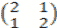

# 奇安信 2020 数据分析及应用（二）

## 1

Mapreduce 擅长哪个领域的计算

正确答案: A   你的答案: 空 (错误)

```cpp
离线批计算
```

```cpp
DAG 计算
```

```cpp
流式计算
```

```cpp
实时计算
```

本题知识点

数据分析师 奇安信 2020

## 2

哪个不属于 HDFS 架构组成部分

正确答案: D   你的答案: 空 (错误)

```cpp
NameNode
```

```cpp
Secondary NameNode
```

```cpp
DataNode
```

```cpp
TaskTracker
```

本题知识点

数据分析师 奇安信 2020

## 3

关于 Mapduce 原理，下面说法错误的是

正确答案: D   你的答案: 空 (错误)

```cpp
分为 Map 和 Reduce 两个阶段
```

```cpp
Map 阶段由一系统 Map 任务组成
```

```cpp
Reduce 阶段由一系统 Reduce 任务组成
```

```cpp
Map 阶段与 Reduce 阶段没有任何依赖关系
```

本题知识点

数据分析师 奇安信 2020

## 4

关于 Block 和 Split 两个概念，下面说话错误的是

正确答案: C   你的答案: 空 (错误)

```cpp
Block 是 HDFS 中最小的数据存储单位
```

```cpp
Split 是 MapReduce 中最小的计算单元
```

```cpp
Block 是 Split 是一一对应关系
```

```cpp
Block 和 Split 之间对应关系是任意的，可由用户控制
```

本题知识点

数据分析师 奇安信 2020

## 5

哪个属于大数据中 Hadoop 的组成部分

正确答案: B   你的答案: 空 (错误)

```cpp
Storm
```

```cpp
MapReduce
```

```cpp
Spark
```

```cpp
Flink
```

本题知识点

数据分析师 奇安信 2020

讨论

[程前 1808024143](https://www.nowcoder.com/profile/141531967)

B

发表于 2021-04-28 15:00:20

* * *

[bossCD](https://www.nowcoder.com/profile/439321416)

B

发表于 2021-04-20 14:50:22

* * *

[博乐毅](https://www.nowcoder.com/profile/963832793)

b

发表于 2021-04-01 19:49:33

* * *

## 6

哪个不属于 HBase 中的术语

正确答案: D   你的答案: 空 (错误)

```cpp
Column
```

```cpp
Column Family
```

```cpp
RowKey
```

```cpp
Meta
```

本题知识点

数据分析师 奇安信 2020

## 7

与 NN 在一个节点启动

正确答案: D   你的答案: 空 (错误)

```cpp
SecondaryNameNode
```

```cpp
DataNode
```

```cpp
TaskTracker
```

```cpp
Jobtracker
```

本题知识点

数据分析师 奇安信 2020

## 8

与 HDFS 类似是

正确答案: C   你的答案: 空 (错误)

```cpp
NTFS
```

```cpp
FAT32
```

```cpp
GFS
```

```cpp
EXT3
```

本题知识点

数据分析师 奇安信 2020

讨论

[Sacura](https://www.nowcoder.com/profile/843177898)

GFS 是一个可扩展的分布式文件系统，用于大型的、分布式的、对大量数据进行访问的应用。和 HDFS 同属于分布式文件系统

发表于 2021-04-14 15:03:57

* * *

## 9

cluster 的最主要瓶颈

正确答案: C   你的答案: 空 (错误)

```cpp
CPU
```

```cpp
network
```

```cpp
disk  IO
```

```cpp
memory
```

本题知识点

数据分析师 奇安信 2020

## 10

下列正确的去重语句是

正确答案: D   你的答案: 空 (错误)

```cpp
delete from tableName where tableName.key  not in (select max(key) from tableName group by field_1,field_2 having count(1) > 1)
```

```cpp
delete from tableName where tableName.key   in (select max(key) from tableName group by field_1,field_2 having count(1) > 1)
```

```cpp
delete from tableName where tableName.key   not in (select min(key) from tableName group by field_1,field_2 having count(1) > 1)
```

```cpp
delete from tableName  t1 where t1.key  not in (select max(key) from tableName group by field_1,field_2 having count(1) > 1)  and  exists ( select  1 from tableName where tableName.key=t1.key  group by field_1,field_2 having count(1) > 1)
```

本题知识点

数据分析师 奇安信 2020

## 11

delete 与 truncate 语句，下列说法正确是

正确答案: A   你的答案: 空 (错误)

```cpp
其余说法都不正确
```

```cpp
都是删除语句，无区别
```

```cpp
delete 语句需要提交，truncate 语句不一定需要
```

```cpp
truncate 可以指定条件删除，delete 不可以
```

本题知识点

数据分析师 奇安信 2020

## 12

假如 tableName_2 表有 30 亿条数据，下列哪条语句执行效率最快

正确答案: C   你的答案: 空 (错误)

```cpp
以下回答都正确
```

```cpp
insert into tableName_1 select * from tableName_2，tableName_1 表 ID 字段为主键
```

```cpp
create table tableName_1 select * from tableName_2
```

```cpp
delete from tableName_2
```

本题知识点

数据分析师 奇安信 2020

## 13

表 1 有 5 亿条数据，给 ID 字段增加索引，对下列产生负面影响较大的是

正确答案: A   你的答案: 空 (错误)

```cpp
insert into 表 1 select * from  表 2
```

```cpp
select * from 表 1 where id = '1'
```

```cpp
create table 表 2 select * from 表 1 where id = '1'
```

```cpp
所有回答都不正确
```

本题知识点

数据分析师 奇安信 2020

## 14

以下语句错误的是

正确答案: A   你的答案: 空 (错误)

```cpp
select * from tableName1 join tableName2
```

```cpp
select * from tableName1 join tableName2 on 1=2
```

```cpp
select * from tableName1 join tableName2 on tableName1.id=3
```

```cpp
select * from tableName1 join tableName2 on tableName2.id=3
```

本题知识点

数据分析师 奇安信 2020

## 15

以下对象哪些不能使用 plsql 批量导出

正确答案: C   你的答案: 空 (错误)

```cpp
view
```

```cpp
table
```

```cpp
job
```

```cpp
所有说法均不正确
```

本题知识点

数据分析师 奇安信 2020

## 16

以下对象不能直接从 select 语句引用的是

正确答案: D   你的答案: 空 (错误)

```cpp
table
```

```cpp
sequence
```

```cpp
view
```

```cpp
index
```

本题知识点

数据分析师 奇安信 2020

## 17

以下描述正确的是

正确答案: D   你的答案: 空 (错误)

```cpp
数据库是一个独立的系统，不需要操作系统的支持
```

```cpp
数据库设计是指设计数据库管理系统
```

```cpp
数据库系统中，数据的物理结构必须与逻辑结构一致
```

```cpp
数据库技术的根本目标是要解决数据共享的问题
```

本题知识点

数据分析师 奇安信 2020

## 18

以下语句错误的是

正确答案: B   你的答案: 空 (错误)

```cpp
alter table tableName add column addcolumn int
```

```cpp
alter table tableName delete column addcolumn char(10)
```

```cpp
alter table tableName modify column addcolumn char(10)
```

```cpp
alter table tableName change addcolumn  addcolumn int
```

本题知识点

数据分析师 奇安信 2020

## 19

事务中途执行失败，下列说法正确的

正确答案: C   你的答案: 空 (错误)

```cpp
提交执行成功的部分
```

```cpp
部分数据丢失
```

```cpp
数据状态不变
```

```cpp
数据状态丢失
```

本题知识点

数据分析师 奇安信 2020

## 20

YARN 和 MapReduce 的关系是

正确答案: D   你的答案: 空 (错误)

```cpp
YARN 依赖 MapReduce 执行任务
```

```cpp
YARN 是一个计算框架，可运行在 MapReduce 之上
```

```cpp
MapReduce 和 YARN 无直接关系
```

```cpp
所有回答均不正确
```

本题知识点

数据分析师 奇安信 2020

讨论

[牛客 399388246 号](https://www.nowcoder.com/profile/399388246)

D

发表于 2021-06-25 16:22:24

* * *

## 21

Presto 与 Hive 相比主要优势是

正确答案: A   你的答案: 空 (错误)

```cpp
MPP 架构，全内存计算
```

```cpp
利用 MapReduce 进行分布式计算，更加高效
```

```cpp
完全分布式计算，可以充分利用集群资源
```

```cpp
有很强的容错性
```

本题知识点

数据分析师 奇安信 2020

## 22

HDFS(配置的 block 大小为 128MB)，上有一个目录/home/data，其下有三个文本文件大小分别为：1MB,100MB,和 150MB，如果采用 MapReduce 处理该目录，默认会启动几个 Map Task

正确答案: D   你的答案: 空 (错误)

```cpp
1
```

```cpp
2
```

```cpp
3
```

```cpp
4
```

本题知识点

数据分析师 奇安信 2020

## 23

关于 Spark 与 MapReuce 的性能，说法正确的是

正确答案: D   你的答案: 空 (错误)

```cpp
Spark 性能一定比 MapReduce 高
```

```cpp
Spark 与 MapReudce 的性能是一样的
```

```cpp
MapReduce 一定比 Spark 高效
```

```cpp
以上说法均不正确
```

本题知识点

数据分析师 奇安信 2020

## 24

关于 RDD，说法错误的是

正确答案: D   你的答案: 空 (错误)

```cpp
每个 RDD 是由若干个 partition 构成的
```

```cpp
RDD 是只读的，不可修改
```

```cpp
RDD 是分布式
```

```cpp
所有说法均不正确
```

本题知识点

数据分析师 奇安信 2020

## 25

下面哪个 RDD 的算子与其他算子不同

正确答案: D   你的答案: 空 (错误)

```cpp
map
```

```cpp
reduce
```

```cpp
filter
```

```cpp
reduceByKey
```

本题知识点

数据分析师 奇安信 2020

讨论

[Win_Cheer](https://www.nowcoder.com/profile/146167361)

个人觉得答案有误，正确选项是 B

发表于 2021-04-17 10:17:17

* * *

## 26

下面哪个不属于 Spark 的运行模式

正确答案: D   你的答案: 空 (错误)

```cpp
YARN
```

```cpp
local
```

```cpp
standalone
```

```cpp
HDFS
```

本题知识点

数据分析师 奇安信 2020

## 27

数据库 DB、数据库系统 DBS 和数据库管理系统 DBMS 三者之间的关系

正确答案: D   你的答案: 空 (错误)

```cpp
DBMS 包括 DB 和 DBS
```

```cpp
DB 包括 DBS 和 DBMS
```

```cpp
DBS 就是 DB，也就是 DBMS
```

```cpp
DBS 包括 DB 和 DBMS
```

本题知识点

数据分析师 奇安信 2020

## 28

设 mysql 数据库中一个表 t_score 的结构为：t_score(SN,CN,grade)，其中 SN 为学生名，CN 为课程名.若要更正王二的化学成绩为 85 分，则可用

正确答案: D   你的答案: 空 (错误)

```cpp
UPDATE t_score MODIFY grade=85 WHERE SN='王二'AND CN='化学'
```

```cpp
UPDATE t_score SET grade='85' WHERE SN='王二'AND CN='化学'
```

```cpp
UPDATE t_score SET grade='85 WHERE SN='王二'AND CN='化学'
```

```cpp
UPDATE t_score SET grade=85 WHERE SN='王二'AND CN='化学'
```

本题知识点

数据分析师 奇安信 2020

## 29

流水表（流水号，账号，商品，地区代号，日期）中流水号为主键，删除流水表中前 五年以前的信息

正确答案: D   你的答案: 空 (错误)

```cpp
delete from 流水表 where 日期<DATEADD(yy,5,getdate())
```

```cpp
delete from 流水表 where 日期<getdate()-5
```

```cpp
elete from 流水表 where 日期<getdate()+5
```

```cpp
delete from 流水表 where 日期<DATEADD(yy,-5,getdate())
```

本题知识点

数据分析师 奇安信 2020

## 30

查询"学号 char(10)"尾字符是 1 的错误命令是

正确答案: B   你的答案: 空 (错误)

```cpp
SELECT * FROM 学生 WHERE 学号 LIKE '%[1]'
```

```cpp
SELECT * FROM 学生 WHERE 学号 LIKE '?1'
```

```cpp
SELECT * FROM 学生 WHERE 学号 LIKE '%1'
```

```cpp
SELECT * FROM 学生 WHERE RIGHT(学号,1)='1'
```

本题知识点

数据分析师 奇安信 2020

## 31

一次显示一页的内容，命令是

正确答案: D   你的答案: 空 (错误)

```cpp
pause
```

```cpp
cat
```

```cpp
grep
```

```cpp
more
```

本题知识点

数据分析师 奇安信 2020

## 32

修改文件权限

正确答案: D   你的答案: 空 (错误)

```cpp
attrib
```

```cpp
change
```

```cpp
file
```

```cpp
chmod
```

本题知识点

数据分析师 奇安信 2020

## 33

export 命令在 bash 中使用是

正确答案: C   你的答案: 空 (错误)

```cpp
在子 shell 中运行命令
```

```cpp
使在子 shell 中可以使用命令历史记录
```

```cpp
为其它应用程序设置环境变量
```

```cpp
提供 NFS 分区给网络中的其它系统使用
```

本题知识点

数据分析师 奇安信 2020

## 34

删除用户与用户主目录

正确答案: C   你的答案: 空 (错误)

```cpp
rmuser -r
```

```cpp
deluer -r
```

```cpp
userdel -r
```

```cpp
usermgr -r
```

本题知识点

数据分析师 奇安信 2020

## 35

查找所有以 * 开头的行

正确答案: A   你的答案: 空 (错误)

```cpp
grep '^\*' file
```

```cpp
grep -n * file
```

```cpp
find \* file
```

```cpp
grep * file
```

本题知识点

数据分析师 奇安信 2020

## 36

ps 命令显示所有用户的进程参数是

正确答案: B   你的答案: 空 (错误)

```cpp
b
```

```cpp
a
```

```cpp
u
```

```cpp
x
```

本题知识点

数据分析师 奇安信 2020

## 37

快速查找 linux 注册的用户数

正确答案: A   你的答案: 空 (错误)

```cpp
wc --lines /etc/passwd
```

```cpp
account -l
```

```cpp
nl /etc/passwd | head
```

```cpp
wc --users /etc/passwd | head
```

本题知识点

数据分析师 奇安信 2020

## 38

删除 非空子目录/tmp

正确答案: A   你的答案: 空 (错误)

```cpp
rm -rf /tmp
```

```cpp
del /tmp/*
```

```cpp
rmr -rf /tmp
```

```cpp
rm -rf /tmp/*
```

本题知识点

数据分析师 奇安信 2020

## 39

通过某分类器对样本数据进行判断，其中对于正样本预测准确的为 90 个，预测错误为 30 个；对于负样本，预测准确的为 60 个，预测错误为 60 个。由此我们可知，此模型的查准率和查全率分别是：

正确答案: B   你的答案: 空 (错误)

```cpp
75%，60%
```

```cpp
60%，75%
```

```cpp
75%，62.5%
```

```cpp
62.5%，75%
```

本题知识点

数据分析师 奇安信 2020

讨论

[想要好几个 offer](https://www.nowcoder.com/profile/231409656)

查准率=TP/（TP+FP）=90/(90+30)=0.75 查全率=TP/(TP+FN)=90/(90+60)=0.6 这样不对吗？

发表于 2021-03-30 19:14:02

* * *

## 40

分析某一样本，其中正样本为 60 个，负样本为 30 个。针对样本的某个特征 X，当其为 A 时对应 36 个正样本，18 个负样本；当其为 B 时对应 24 个正样本，12 个负样本。请计算基于特征 X 分类的信息增益是：

正确答案: C   你的答案: 空 (错误)

```cpp
0.23300000000000001
```

```cpp
0.76700000000000002
```

```cpp
0
```

```cpp
1
```

```cpp
0.2
```

本题知识点

数据分析师 奇安信 2020

讨论

[四季平安](https://www.nowcoder.com/profile/424061247)

先算信息熵:-2/3log(2/3)-1/3log(1/3)再算条件熵:H(Y|X=A)=-2/3log(2/3)-1/3log(1/3)H(Y|X=B)=-2/3log(2/3)-1/3log(1/3)P(X=A)=3/5P(X=B)=2/5 条件熵=H(Y|X=A)*P(X=A)+H(Y|X=B)*P(X=B)=-2/3log(2/3)-1/3log(1/3)所以信息增益=信息熵-条件熵=0

发表于 2021-05-19 21:02:25

* * *

[Jamesxiang11](https://www.nowcoder.com/profile/789162113)

求解这里信息增益怎么算

发表于 2021-03-25 04:33:45

* * *

## 41

一个图 14 条边，4 个度数为 4 的定点，其它顶点度数不超过 2，则此图中至少有多少个顶点？

正确答案: D   你的答案: 空 (错误)

```cpp
7
```

```cpp
8
```

```cpp
9
```

```cpp
10
```

```cpp
11
```

本题知识点

数据分析师 奇安信 2020

讨论

[Sacura](https://www.nowcoder.com/profile/843177898)

4+6=10 个顶点
14 条边,每条边会给两个顶点带来 1 度,顶点度数之和=14*2=28
度数为 4 的顶点：4*4=16
28-16=12
设剩下都为 2 度的顶点：12/2=6 发表于 2021-04-14 16:08:04

* * *

## 42

设事件 A 在一次实验中出现的概率 1/3,请问三次独立实验，A 至少出现一次的概率是

正确答案: B   你的答案: 空 (错误)

```cpp
26/27
```

```cpp
19/27
```

```cpp
3.7037037037037035E-2
```

```cpp
0.29629629629629628
```

本题知识点

数据分析师 奇安信 2020

讨论

[BBLL 的 B](https://www.nowcoder.com/profile/524193106)

事件 A 在一次实验中出现的概率 1/3,因此不出现的概率是 2/3 。三次独立实验，A 至少出现一次的概率等价于（1 - A 1 次都不出现的概率）= 1-（2/3*2/3*2/3）=19/27B

发表于 2021-04-01 19:05:46

* * *

[Dame、CX](https://www.nowcoder.com/profile/255407225)

 

发表于 2021-04-11 12:23:30

* * *

## 43

为 A=求特征值

正确答案: A   你的答案: 空 (错误)

```cpp
λ1=3  λ2=1
```

```cpp
λ1=3  λ2=-1
```

```cpp
λ1=-3   λ2=1
```

```cpp
λ1=-3   λ2=-1
```

本题知识点

数据分析师 奇安信 2020

## 44

判断该偏微分方程为什么类型
3(∂² u)/(∂x² )+4(∂² u)/∂x∂y+1 (∂² u)/(∂y² )+2 ∂u/∂x-4 ∂u/∂y+5=0

正确答案: B   你的答案: 空 (错误)

```cpp
椭圆型
```

```cpp
双曲型
```

```cpp
抛物型
```

```cpp
其余答案均不正确
```

本题知识点

数据分析师 奇安信 2020

## 45

f(x+y)=f(x)f(y),且 f`(0)=1,求 f`(x)

正确答案: A   你的答案: 空 (错误)

```cpp
e^x
```

```cpp
cos(x)
```

```cpp
sin(x)
```

```cpp
ln（x²)
```

本题知识点

数据分析师 奇安信 2020

## 46

关于 SparkContext，说法正确的是

正确答案: A C D   你的答案: 空 (错误)

```cpp
它内部包含了调度器，容错机制等实现
```

```cpp
它运行在 Driver 中
```

```cpp
它运行在 Executor 中
```

```cpp
每个应用程序有且仅有一个
```

本题知识点

数据分析师 奇安信 2020

## 47

关于以下代码，说法错误的是:
line1: val rdd  = sc.textFile("hdfs:///home/data")
line2: rdd.count()
line3: rdd.reduce(_+_)
line4: rdd.collect()

正确答案: A B C D   你的答案: 空 (错误)

```cpp
语法存在错误，没有结束符
```

```cpp
整个应用程序仅会生成 1 个 Job
```

```cpp
如果/home/data 大小为 10TB，该程序不会导致内存溢出
```

```cpp
这段代码不可以分布式执行的
```

本题知识点

数据分析师 奇安信 2020

## 48

spark sql 支持哪些数据格式的读写

正确答案: B C D   你的答案: 空 (错误)

```cpp
csv
```

```cpp
parquet
```

```cpp
josn
```

```cpp
text
```

本题知识点

数据分析师 奇安信 2020

## 49

下面关于 spark streaming 的原理，说法正确的是

正确答案: A C D   你的答案: 空 (错误)

```cpp
spark streaming 是将流式计算转移为微批处理
```

```cpp
spark streaming 能够很容易实现毫秒级数据处理延迟
```

```cpp
spark streaming 中每个批处理作用运行在 Driver/Executor 构成的分布式环境中
```

```cpp
spark streaming 对数据流的抽象是 DStream
```

本题知识点

数据分析师 奇安信 2020

## 50

Hive 底层计算框架有哪些

正确答案: A D   你的答案: 空 (错误)

```cpp
MR
```

```cpp
YARN
```

```cpp
HDFS
```

```cpp
Spark
```

本题知识点

数据分析师 奇安信 2020

讨论

[芝麻十三香](https://www.nowcoder.com/profile/293972376)

A 和 DMR 就是 MapReduceyarn 是资源调度器,不是计算框架 HDFS 是分布式存储框架 D spark 是第三代计算框架,Facebook 开源框架

发表于 2021-06-18 16:43:10

* * *

## 51

存储元数据，下列哪些适合

正确答案: D   你的答案: 空 (错误)

```cpp
Hbase
```

```cpp
Hive
```

```cpp
Green plum
```

```cpp
Mysql
```

本题知识点

数据分析师 奇安信 2020

## 52

下列语句错误的是

正确答案: A B   你的答案: 空 (错误)

```cpp
select * from tableName where ordername !<>null
```

```cpp
select * from tableName where ordername not  is null
```

```cpp
select * from tableName where ordername is null
```

```cpp
select * from tableName where ordername is not null
```

本题知识点

数据分析师 奇安信 2020

## 53

以下可正确的执行是

正确答案: A B D   你的答案: 空 (错误)

```cpp
drop table holiday
```

```cpp
delete from holiday
```

```cpp
drop databases holiday
```

```cpp
truncate table test2
```

本题知识点

数据分析师 奇安信 2020

## 54

下面哪些不适合 OLAP 操作

正确答案: A C   你的答案: 空 (错误)

```cpp
Oracle
```

```cpp
Green plum
```

```cpp
Mysql
```

```cpp
Hive
```

本题知识点

数据分析师 奇安信 2020

## 55

SQL 语言数据定义包括

正确答案: B C D   你的答案: 空 (错误)

```cpp
TPL
```

```cpp
DML
```

```cpp
DDL
```

```cpp
DCL
```

本题知识点

数据分析师 奇安信 2020

讨论

[南星.](https://www.nowcoder.com/profile/195619174)

BCD

发表于 2022-03-08 17:40:26

* * *

[聆风醉](https://www.nowcoder.com/profile/3280874)

BCD

发表于 2021-10-10 02:08:02

* * *

[牛客 546024064 号](https://www.nowcoder.com/profile/546024064)

C

发表于 2021-08-08 16:05:09

* * *

## 56

关于 HDFS，说法正确是

正确答案: A B   你的答案: 空 (错误)

```cpp
一个集群可存在多个 NameNode 对外提供服务
```

```cpp
HDFS HA 和 Federation 是它的两大特色
```

```cpp
NameNode 不是单点，不存在单点问题
```

```cpp
不能存储小文件
```

本题知识点

数据分析师 奇安信 2020

讨论

[羽翼散](https://www.nowcoder.com/profile/733436322)

正如大家所知，NameNode 在 Hadoop 系统中存在单点故障问题，这个对于标榜高可用性的 Hadoop 来说一直是个软肋。本文讨论一下为了解决这个问题而存在的几个 solution。 1\. Secondary NameNode 原理：Secondary NN 会定期的从 NN 中读取 editlog，与自己存储的 Image 进行合并形成新的 metadata image 优点：Hadoop 较早的版本都自带，配置简单，基本不需要额外资源（可以与 datanode 共享机器） 缺点：恢复时间慢，会有部分数据丢失 2\. Backup NameNode 原理：backup NN 实时得到 editlog，当 NN 宕掉后，手动切换到 Backup NN； 优点：从 hadoop0.21 开始提供这种方案，不会有数据的丢失 缺点：因为需要从 DataNode 中得到 Block 的 location 信息，在切换到 Backup NN 的时候比较慢（依赖于数据量） 3\. Avatar NameNode 原理：这是 Facebook 提供的一种 HA 方案，将 client 访问 hadoop 的 editlog 放在 NFS 中，Standby NN 能够实时拿到 editlog；DataNode 需要同时与 Active NN 和 Standby NN report block 信息；  优点：信息不会丢失，恢复快（秒级） 缺点：Facebook 基于 Hadoop0.2 开发的，部署起来稍微麻烦；需要额外的机器资源，NFS 成为又一个单点（不过故障率低） 4\. Hadoop2.0 直接支持 StandBy NN，借鉴 Facebook 的 Avatar，然后做了点改进  优点：信息不会丢失，恢复快（秒级），部署简单 详细介绍 Hadoop NameNode 单点问题解决方案之一 AvatarNode 需求： 实现 namenode 元数据的备份，解决 namenode 单点宕机导致集群不可用的问题。 方案描述： 当 namenode 所在服务器宕机的时候，我们可以利用 namenode 备份的元数据迅速重构新的 namenode 来投入使用。 1\. Hadoop 本身提供了可利用 secondarynamenode 的备份数据来恢复 namenode 的元数据的方案，但因为 checkpoint(在每次 checkpoint 的时候 secondarynamenode 才会合并并同步 namenode 的数据)的问题，secondarynamenode 的备份数据并不能时刻保持与 namenode 同步，也就是说在 namenode 宕机的时候 secondarynamenode 可能会丢失一段时间的数据，这段 时间取决于 checkpoint 的周期。我们可以减小 checkpoint 的周期来减少数据的丢失量，但由于每次 checkpoint 很耗性能，而且这种方案也不能从根本上解决数据丢失的问题。所以如果需求上不允许这种数据的丢失，这种方案可直接不予考虑。 2\. Hadoop 提供的另一种方案就是 NFS，一种即时备份 namenode 元数据的方案，设置多个 data 目录（包括 NFS 目录），让 namenode 在持 久化元数据的时候同时写入多个目录，这种方案较第一种方案的优势是能避免数据的丢失（这里我们暂时不讨论 NFS 本身会丢失数据的可能性，毕竟这种几率很小 很小）。既然可以解决数据丢失的问题，说明这套方案在原理上是可行的 下载源码 https://github.com/facebook/hadoop-20 部署环境 机器 4 台 hadoop1-192.168.64.41 AvatarNode(primary) hadoop2-192.168.64.42 AvataDataNode hadoop3-192.168.64.43 AvataDataNode hadoop4- 192.168.64.67 AvatarNode(standby) 相关资源及描述 以下是 Avatar 方案部署相关的简单介绍。 1.首先关于 Avatar 方案对于 Hadoop 的备份是对 Dfs 的的单点备份，并不包括 Mapred，因为 Hadoop 本身就不存在处理 jobtracker 单点故障的机制。 2.AvatarNode 继承自 Namenode，而并非对 Namenode 的修改，AvatarDataNode 同样亦如此。故 Avatar 的启动机制是独立于 Hadoop 本身的启动机制。 3.在 Avatar 方案中，SecondaryNamenode 的职责已包括在 Standby 节点中，故不需要再独立启动一个 SecondaryNamenode。 4.AvatarNode 必须有 NFS 的支持，用以实现两个节点间事务日志(editlog)的共享。 5.FB 提供的 Avatar 源码中暂时并不能实现 Primary 和 Standby 之间的自动切换，可以借助于 Zookeeper 的 lease 机制来实现自动切换。 6.Primary 和 Standby 之间的切换只包括从 Standby 切换到 Primary，并不支持从 Primary 状态切换到 Standby 状态。 7.AvatarDataNode 并不使用 VIP 和 AvatarNode 通信，而是直接与 Primary 及 Standby 通信，故需要使用 VIP 漂移方案来屏蔽两个节点间切换过程中的 IP 变换问题。有关与 Zookeeper 的整合，官方称将在之后的版本发布。 关于 AvatarNode 更详细的介绍，请参考 http://blog.csdn.net/rzhzhz/article/details/7235789， 三、编译 1\. 首先修改 hadoop 根目录下 build.xml，注释掉 996 行和 1000 行。如下： <targetname></targetname><target name="java5.check" unless="java5.home"></target>2\. 在根目录下输入 ant jar（对于编译 package 可以参考 build.xml 的代码）编译 hadoop，编译后的 jar 包会在 build 目录下（hadoop-0.20.3-dev-core.jar）， 拷贝该 jar 包到 hadoop 根目录下替换到原有的 jar （啰嗦一句，hadoop 启动时会先加载 build 目录下的 class，所以当通过替换 class 修改 jar 包时请先把 build 目录暂时移除掉） 。 3\. 进入 src/contrib/highavailability 目录下编译 Avatar，编译后的 jar 包会在 build/contrib/highavailability 目录下(hadoop-${version}-highavailability.jar)，拷贝该 jar 包到 lib 目录下。 4\. 把 2,3 步中编译好的 jar 包分发到集群中所有机器的相应目录。 四、配置 1\. 配置 hdfs-site.xml <configuration><property><name>dfs.name.dir</name> <value>/data/hadoop/hdfs/name</value> <description>Determineswhereon the local filesystem the DFS name node shouldstore the name table. Ifthis is a comma-delimited list ofdirectories then the name tableis replicated in all of thedirectories, for redundancy</description></property> <property><name>dfs.data.dir</name> <value>/data/hadoop/facebook_hadoop_data/hdfs/data</value></property> <property><name>dfs.datanode.address</name> <value>0.0.0.0:50011</value> <description>默认为 50010, 是 datanode 的监听端口</description></property> <property><name>dfs.datanode.http.address</name> <value>0.0.0.0:50076</value> <description>默认为 50075，为 datanode 的 http server 端口</description></property> <property><name>dfs.datanode.ipc.address</name> <value>0.0.0.0:50021</value> <description>默认为 50020, 为 datanode 的 ipc server 端口</description></property> <property><name>dfs.http.address0</name> <value>192.168.64.41:50070</value></property> <property><name>dfs.http.address1</name> <value>192.168.64.67:50070</value></property> <property><name>dfs.name.dir.shared0</name> <value>/data/hadoop/share/shared0</value></property> <property><name>dfs.name.dir.shared1</name> <value>/data/hadoop/share/shared1</value></property> <property><name>dfs.name.edits.dir.shared0</name> <value>/data/hadoop/share/shared0</value></property> <property><name>dfs.name.edits.dir.shared1</name> <value>/data/hadoop/share/shared1</value></property> <property><name>dfs.replication</name> <value>2</value> <description>Defaultblock replication. The actual number of replicationscan bespecified when the file is created. The default isused ifreplicationis not specified in create time</description></property></configuration> 参数说明： 1) dfs.name.dir.shared0 AvatarNode(Primary)元数据存储目录,注意不能和 dfs.name.dir 目录相同 2) dfs.name.dir.shared1 AvatarNode(Standby)元数据存储目录,注意不能和 dfs.name.dir 目录相同 3) dfs.name.edits.dir.shared0 AvatarNode(Primary) edits 文件存储目录，默认与 dfs.name.dir.shared0 一致 4) dfs.name.edits.dir.shared1 AvatarNode(Standby) edits 文件存储目录，默认与 dfs.name.dir.shared1 一致 5) dfs.http.address0 AvatarNode(Primary) HTTP 的监控地址 6) dfs.http.address1 AvatarNode(Standby) HTTP 的监控地址 7) dfs.namenode.dn-address0/dfs.namenode.dn-address1 虽然在 Avatar 源码中有所涉及，但暂时并未用到 2\. 配置 core-site.xml <configuration><property><name>hadoop.tmp.dir</name> <value>/home/hadoop/tmp</value> <description>A baseforother temporary directories.</description></property> <property><name>fs.default.name</name> <value>hdfs://192.168.64.41:9600</value> <description>The name ofthedefault file system. Eitherthe literal string"local" or a host:port for DFS.</description></property> <property><name>fs.default.name0</name> <value>hdfs://192.168.64.41:9600</value> <description>The name ofthedefault file system. Eitherthe literal string"local" or a host:port for DFS.</description></property> <property><name>fs.default.name1</name> <value>hdfs://192.168.64.67:9600</value> <description>The name ofthedefault file system. Eitherthe literal string"local" or a host:port for DFS.</description></property></configuration> 参数说明： 1) fs.default.name 当前 AvatarNode IP 地址和端口号，即 Primary 和 Standby 的配置为各自的 IP 地址和端口号。 2) fs.default.name0 AvatarNode(Primary) IP 地址和端口号 3) fs.default.name1 AvatarNode(Standby) IP 地址和端口号 3\. 因为不涉及到 mapred，故 mapred-site.xml 不用作修改，为原有集群配置即可。 4\. 分发修改后的配置文件到集群节点并在 Primary 和 Standby 节点上建立好配置文件中相应目录。 5\. 建立 NFS，实现 Primary 与 Standby shared0 目录的数据共享。有关 NFS 的配置请参考 http://blog.csdn.net/rzhzhz/article/details/7056732 6\. 格式化 Primary 与 Standby，这里可以采用 hadoop 本身的格式化命令，也可以采用 AvatarNode 的格式化命令（bin/hadooporg.apache.hadoop.hdfs.AvatarShell -format），但此时 shared1 目录不能为空，此处有点多余。建议采用 hadoop 本身的格式化命令在 Primary 上格式化后，并且把 name 目录下的文件复制到 shared0 目录下。然后再在 Standby 上复制 shared0 目录下的文件到 shared1 目录下。 五、启动 1\. 由于不涉及 jobtracker 的单点，在这里我们只启动 hdfs 相关线程。Primary，Standby 两个 namenode（此处 Standby 包括 SecondaryNamenode 的职责）和 3 个 AvatarDataNode 数据节点。 2\. 在 Primary 节点 hadoop 根目录下启动 AvatarNode（Primary） bin/hadooporg.apache.hadoop.hdfs.server.namenode.AvatarNode–zero 3\. 在 Standby 节点 hadoop 根目录下启动 AvatarNode（Standby） bin/hadooporg.apache.hadoop.hdfs.server.namenode.AvatarNode-one–standby 4\. 依次在数据节点 hadoop 根目录下启动 AvatarDataNode bin/hadooporg.apache.hadoop.hdfs.server.datanode.AvatarDataNode 5\. 其他相关命令 bin/hadoop org.apache.hadoop.hdfs.server.namenode.AvatarNode，后面可 选参数有 [-standby] | [-sync] |[-zero] | [-one] | [-format] | [-upgrade] | [-rollback] |[-finalize] | [-importCheckpoint] ##查看当前 AvatarNode 的状态 1) bin/hadoop org.apache.hadoop.hdfs.AvatarShell –showAvatar ##primary 把当前 Standby 节点升级 Primary 节点 2) bin/hadooporg.apache.hadoop.hdfs.AvatarShell -setAvatar 3) bin/hadooporg.apache.hadoop.hdfs.AvatarShell -setAvatar standby 集群测试 1\. 访问集群的 web 页 (Primary)http://hadoop1-virtual-machine:50070 (Standby)http://hadoop5-virtual-machine:50070 可见所有的 AvatarDataNode 都已注册到两个 namenode，Primary 处于正常状态，而 Standby 处于 Safemode 状态，只可读不可写。可通过 AvatarShell 命令查看当前 AvatarNode 的状态（Primary 或 Standby）。 2\. 存储相关数据到集群，集群正常工作。 3\. Kill 掉 Primary 节点的 AvatartNode 线程，在 Standby 把当前升级为 Prirmary,数据并未丢失，集群正常工作（此时 web 端不能正常访问文件系统，通过 shell 命令可查看集群数据）。但由于 Avatar 有转换限制，只能由 Standby 转换成 Primary，故一次故障后,由 Standby 上升为 Primary 的节点并不能重新降级为 Standby，所以不能实现像 Master/Slave 那种自由切换。

发表于 2021-09-22 23:39:46

* * *

## 57

关于 Kafka，说法正确的是

正确答案: A B C   你的答案: 空 (错误)

```cpp
由 produce、broker 和 consumer 等角色构成
```

```cpp
通过 zookeeper 进行服务协调
```

```cpp
消息可以存成多个副本以达到容错的目标
```

```cpp
是一个分布式 key/value 存储系统
```

本题知识点

数据分析师 奇安信 2020

## 58

对于 PCA 说法正确的是：

正确答案: B C D   你的答案: 空 (错误)

```cpp
变量表示成各公因子的线性组合
```

```cpp
可以解决多重共线性
```

```cpp
业务不可解释性
```

```cpp
基于主元方向的样本方差最大
```

本题知识点

数据分析师 奇安信 2020

讨论

[Jamesxiang11](https://www.nowcoder.com/profile/789162113)

为什么 C 是对的？

发表于 2021-03-25 04:35:11

* * *

## 59

根据医疗记录构建癌症预测模型，说法正确的是

正确答案: A B   你的答案: 空 (错误)

```cpp
可通过 penalized-SVM 解决类不平衡问题
```

```cpp
可通过 SMOTE 解决类不平衡问题
```

```cpp
梯度下降法将不适用
```

```cpp
模型优先考虑其查准率
```

本题知识点

数据分析师 奇安信 2020

## 60

以下概念正确的是

正确答案: C D   你的答案: 空 (错误)

```cpp
分类正确的样本数 与 样本总数之比是查准率
```

```cpp
被正确检索的样本数 与 被检索到样本总数之比是准确率
```

```cpp
被正确检索的样本数 与 应当被检索到的样本数之比是查全率
```

```cpp
查全率又被称为召回率，追求高查全率通俗来讲就是宁可错杀不可漏掉
```

本题知识点

数据分析师 奇安信 2020

## 61

简单概括安装 hadoop 的步骤

你的答案

本题知识点

数据分析师 奇安信 2020

## 62

现有 access.log 文件，内容格式如下：
503,66,c.html
404,17,a.html
503,56,c.html
200,14,d.html
503,11,c.html
503,48,c.html
要求：使用 Spark-core 完整的编码实现以下要求：
要求：1）计算 404、200 出现的数次；
2）计算 503、200、404 三类出现总次数，最终打印出来；

你的答案

本题知识点

数据分析师 奇安信 2020

讨论

[牛客 886986514 号](https://www.nowcoder.com/profile/886986514)

1

发表于 2021-08-24 18:01:04

* * *

## 63

统计 1 千张表数据量，并打印出对应表的数据量

你的答案

本题知识点

数据分析师 奇安信 2020