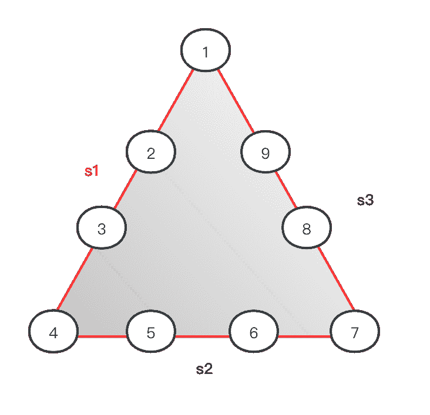
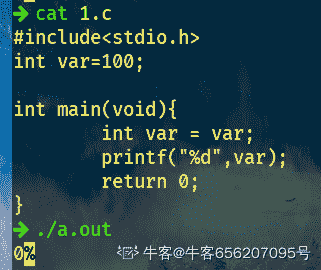

# 奇安信 2020 测试工程师（5 月 31 日）

## 1

小明有 N 元钱去药店买口罩，药店里有 6 个品牌的口罩，A 品牌 2 个装（2 元），B 品牌 3 个装（2 元）、C 品牌 1 个装（3 元）、D 品牌 5 个装（1 元），E 品牌 4 个装（5 元），F 品牌 3 个装（2 元），由于限购每个品牌最多只能买一个，小明最多能买多少口罩？

本题知识点

安卓工程师 iOS 工程师 奇安信 2020 运维工程师 Java 工程师 C++工程师 golang 工程师 PHP 工程师 测试工程师 前端工程师 大数据开发工程师 安全工程师 测试开发工程师

讨论

[你都不肯叫我一声教父](https://www.nowcoder.com/profile/144264450)

```cpp
import java.util.*;
public class Main{
    public static void main(String[]args){
        Scanner in = new Scanner(System.in);
        int n = in.nextInt();
        int [] a = new int [] {0,2,3,1,5,4,3}; //个数
        int [] b = new int [] {0,2,2,3,1,5,2};// 钱 
        int [][]dp = new int [7][n+1];

        dp[0][0] = 0;

        for(int i = 1; i <=6; i++){
            for(int j = 1; j<=n;j++){
                if(j<b[i]){
                    dp[i][j] = dp[i-1][j];//钱不够用了
                }
                else{
                    //不装第 i 个，和装了第 I 个比较
                    dp[i][j] = Math.max(dp[i-1][j],dp[i-1][j-b[i]]+a[i]);
                }

            }
        }
        System.out.println(dp[6][n]);

    }
}
```

典型的 01 背包问题

发表于 2021-03-30 22:11:23

* * *

[theyi](https://www.nowcoder.com/profile/6143310)

n=int(input())
res=0
dp=[[0 for i in range(n+1)] for j in range(7)]
mask=[(2,2),(3,2),(1,3),(5,1),(4,5),(3,2)]
for i in range(1,7):
    for j in range(1,n+1):
        if j>=mask[i-1][1]:

            dp[i][j]=max(dp[i-1][j],mask[i-1][0]+dp[i-1][j-mask[i-1][1]])
        else:
            dp[i][j]=dp[i-1][j]
print(dp[-1][-1])

发表于 2021-09-04 23:28:29

* * *

[_ 雾里](https://www.nowcoder.com/profile/174374052)

01 背包问题 import java.util.Scanner;
public class Main{
    public static void main(String[] args) {
        Scanner in =new Scanner(System.in);
        int n= in.nextInt();//输入 N 元钱，相当于背包总容量
        int[] prices={0,2,2,3,1,5,2};//每种口罩的价格，相当于每个占用背包的容量
        int[] number={0,2,3,1,5,4,3};//买一份有多少个口罩，相当于背包问题的价值
        int[][] dp=new int[7][n+1];//初始化一个二维数组 dp，用来存放最大价值。int[7][n+1] 7 表示的是 0-6 六种口罩，n+1 表示的是一共有 0-n 元钱（背包容量）
        int max=0;
        for (int i = 0; i <n+1 ; i++) {//当一种口罩不买时，不管钱多少，口罩数量均为 0
            dp[0][i]=0;
        }
        for (int i = 1; i <7 ; i++) {//控制遍历口罩的序号（商品序号）
            for (int j = 0; j <n+1; j++) {//控制遍历钱数（空间大小）
                if (j>=prices[i]){
                    //如果当前的钱数 j 买得起当前的口罩 i，那么有两种选择，
                    // 1：不买当前的口罩（不装入背包），此时的最大数量和第 i-1 种口罩的数量一致
                    // 2：购买当前的口罩（装入背包），此时的最大数量时第 i-1 种口罩的数量加上第 i 种口罩的数量，
                    dp[i][j]=Math.max(dp[i-1][j],dp[i-1][j-prices[i]]+number[i]);
                }else { //如果当前的钱数 j 买不起当前的口罩 i，那么最大数量和第 i-1 种口罩一致
                    dp[i][j]=dp[i-1][j];
                }
                max=dp[i][j];
            }
        }
        System.out.println(max);
    }
}具体思路：
[`blog.csdn.net/Supremey/article/details/120785736`](https://blog.csdn.net/Supremey/article/details/120785736)

发表于 2021-10-16 11:13:04

* * *

## 2

```cpp
如下图所示的三角形，有三个边 s1,s2,s3,边 s1 有四个圆圈⭕️1，2，3，4，边 s2 有四个圆圈⭕️4，5，6，7，边 s3 有四个圆圈⭕️7，8，9，1
把 1-9 这 9 个数字，分别填写到下图所示的 9 个圆圈圆圈里， 使每条边上的 4 个圆圈⭕️的和相等（9 个圆圈里的数字不能重复)
例如：s1=[1=>9,2=>8,3=>1,4=>3]=9+8+1+3=21,s2=[4=>3,5=>5,6=>7,7=>6]=3+5+7+6=21,s3=[7=>6,8=>2,9=>4, 1=>9]=6+2+4+9=21
```



本题知识点

安卓工程师 iOS 工程师 奇安信 2020 运维工程师 Java 工程师 C++工程师 golang 工程师 PHP 工程师 测试工程师 前端工程师 大数据开发工程师 安全工程师 测试开发工程师

讨论

[牛客 476036690 号](https://www.nowcoder.com/profile/476036690)

```cpp
import java.util.*;
public class Main {
       public static void main(String[] args) {
        Scanner scanner = new Scanner(System.in);
        String i = scanner.next();
        String[] str = i.split(",");
        ArrayList<Integer> list = new ArrayList<>();
        for (String s : str) {
            list.add(Integer.parseInt(s));
        }

        int n1 = list.get(0) + list.get(1) + list.get(2) + list.get(3);
        int n2 = list.get(3) + list.get(4) + list.get(5) + list.get(6);
        int n3 = list.get(6) + list.get(7) + list.get(8) + list.get(0);

        if (n1 == n2 && n2 == n3) {
            System.out.println("yes");
        } else {
            System.out.println("no");
        }
        }

}

```

编辑于 2022-03-18 12:12:29

* * *

[ʚfairyɞ](https://www.nowcoder.com/profile/441012983)

c++可以增加一个字符变量接收逗号，不过要注意最后一个没有逗号#include<stdio.h>#include<iostream>usingnamespacestd;intmain(){    inta[9], sum1, sum2, sum3;    chart;    for(inti = 0; i < 9; i++)    {        cin >> a[i];        if(i!=8)            cin >> t;    }    sum1 = a[0] + a[1] + a[2] + a[3];    sum2 = a[3] + a[4] + a[5] + a[6];    sum3 = a[6] + a[7] + a[8] + a[0];    if(sum1 == sum2 && sum2 == sum3)        printf("yes");    else        printf("no");}

发表于 2022-03-16 16:22:33

* * *

[能休息一下吗](https://www.nowcoder.com/profile/556032778)

while(line = readline())
    {
        let arr = line.split(',')
        let a = parseInt(arr[0])+parseInt(arr[1])+parseInt(arr[2])+parseInt(arr[3])
        let b = parseInt(arr[3])+parseInt(arr[4])+parseInt(arr[5])+parseInt(arr[6])
        let c = parseInt(arr[6])+parseInt(arr[7])+parseInt(arr[8])+parseInt(arr[0])
        if(a == b && b == c){
            console.log('yes')
        }
        else{
            console.log('no')
        }

    }

发表于 2021-09-06 23:03:34

* * *

## 3

下列有关 const 限定符说法错误的是：

正确答案: D   你的答案: 空 (错误)

```cpp
可以将一个非 const 对象的地址赋给一个指向 const 对象的指针
```

```cpp
可以将一个非 const 对象的地址赋给一个指向非 const 对象的指针
```

```cpp
一个 const 对象不可以被多次赋值
```

```cpp
通过 const 对象指针可以改变全局 const 对象内容
```

本题知识点

安卓工程师 iOS 工程师 奇安信 2020 Java 工程师 C++工程师 golang 工程师 PHP 工程师 测试工程师 测试开发工程师

讨论

[丷丷要开心](https://www.nowcoder.com/profile/5834026)

D：const 全局变量存储在全局存储空间，其值只有可读性，不能修改；const 局部变量存储在堆栈中，可通过指针修改其值。

发表于 2021-03-28 13:42:11

* * *

## 4

以下程序的输出是：
int var = 100;
int main()
{
    int var = var;
    printf("%d\n", var);
    return 0;
}

正确答案: A   你的答案: 空 (错误)

```cpp
随机数
```

```cpp
100
```

```cpp
0
```

```cpp
编译失败
```

本题知识点

安卓工程师 iOS 工程师 奇安信 2020 Java 工程师 C++工程师 golang 工程师 PHP 工程师 测试工程师 测试开发工程师

讨论

[牛客 656207095 号](https://www.nowcoder.com/profile/656207095)

这题答案应该是错误的，正确答案是输出 0。

发表于 2021-03-27 15:50:31

* * *

[pipiKun](https://www.nowcoder.com/profile/332780420)

不是未初始化吗，vs2019 编译

发表于 2021-04-14 00:43:03

* * *

## 5

以下程序在 big-endial 架构处理器下的输出是：
int i = 1;
char *pc = &i;
printf("%02x%02x%02x%02x\n", pc[0], pc[1], pc[2], pc[3]);

正确答案: C   你的答案: 空 (错误)

```cpp
1000
```

```cpp
0001
```

```cpp
01000000
```

```cpp
00000001
```

本题知识点

安卓工程师 iOS 工程师 奇安信 2020 Java 工程师 C++工程师 golang 工程师 PHP 工程师 测试工程师 测试开发工程师

讨论

[自渡、201909121854927](https://www.nowcoder.com/profile/909002509)

是 0 默认值

发表于 2022-01-10 03:48:21

* * *

[桀桀桀](https://www.nowcoder.com/profile/552082183)

下面以 unsigned int value = 0x12345678 为例，分别看看在两种字节序下其存储情况，我们可以用 unsigned char buf[4]来表示 valueBig-Endian: 低地址存放高位，如下：低地址---------------buf[0] (0x12) -- 高位字节 buf[1] (0x34)buf[2] (0x56)buf[3] (0x78) -- 低位字节---------------高地址引用自百度百科

发表于 2021-08-27 16:13:10

* * *

[pipiKun](https://www.nowcoder.com/profile/332780420)

这不是大端系统吗，那么 i 不是 0x 00 00 00 01 吗

发表于 2021-04-14 00:50:25

* * *

## 6

若入栈顺序为 e,f,g,h，则以下不可能的出栈顺序为：

正确答案: C   你的答案: 空 (错误)

```cpp
e,f,g,h
```

```cpp
f,e,h,g
```

```cpp
f,h,e,g
```

```cpp
g,f,h,e
```

本题知识点

安卓工程师 iOS 工程师 奇安信 2020 Java 工程师 C++工程师 PHP 工程师 golang 工程师 测试工程师 安全工程师 测试开发工程师

讨论

[牛客 546590565 号](https://www.nowcoder.com/profile/546590565)

A.e 进栈，然后出栈 f 进出，g 进出，h 进出(e,f,g,h)B.ef 进，fe 出，gh 进，hg 出(f,e,h,g)C.ef 进，f 出,gh 进，hg 出，e 出（f,h,g,e）D.efg 进，gf 出，h 进，h 出，e 出（g,f,h,e）

发表于 2021-08-22 15:15:56

* * *

[牛客 525059003 号](https://www.nowcoder.com/profile/525059003)

栈之根本——后进先出（Last In First Out , LIFO）。初次接触到这个问题的人，或许会认为入栈 abcde，出栈就只能是 edcba。

      其实是这个问题描述有歧义，应该是分段入栈的顺序，也就是说，可能先入栈 a，再取出 a，入栈 b，再取出 b……，所以 D 也是可能的，也就是说，并不是等所有元素都入栈了，才开始出栈。
————————————————
版权声明：本文为 CSDN 博主「Keep_Moving2030」的原创文章，遵循 CC 4.0 BY-SA 版权协议，转载请附上原文出处链接及本声明。
原文链接：[`blog.csdn.net/u011982340/article/details/39249651`](https://blog.csdn.net/u011982340/article/details/39249651)

发表于 2022-03-16 20:20:41

* * *

[璇玄](https://www.nowcoder.com/profile/905349867)

栈是后进先出的数据结构。A: e 先进栈然后出栈 ，f 先进栈再出栈，g 先进栈再出栈，h 先进栈再出栈 B: e、f 进栈，f 出栈，e 出栈。g、h 进栈，h 出栈，g 最后出栈 D: efg 进栈，g 出栈，f 出栈，h 进栈，h 出栈，e 出栈

发表于 2021-04-16 16:13:23

* * *

## 7

下列修饰符不是访问权限控制符的是

正确答案: C   你的答案: 空 (错误)

```cpp
public
```

```cpp
protected
```

```cpp
static
```

```cpp
private
```

本题知识点

测试工程师 奇安信 2020 大数据开发工程师 测试开发工程师

## 8

Java 命令中，哪一个可以编译 HelloWorld.java 文件

正确答案: B   你的答案: 空 (错误)

```cpp
java HelloWorld
```

```cpp
javac HelloWorld.java
```

```cpp
javac HelloWorld
```

```cpp
java HelloWorld.java
```

本题知识点

测试工程师 奇安信 2020 大数据开发工程师 测试开发工程师

讨论

[魇澞](https://www.nowcoder.com/profile/292873506)

B (记事本) 1.将文件后缀名修改为 HelloWorld.java(如果没有显示后缀名就打开计算机->查看->显示隐藏文件名)【名称尽量满足全英文，驼峰模式】 2.打开记事本，输入以下代码 public class HelloWorld{ public static voud main(String[] args){ System.out.println("Hello World"); } } 并按 Ctrl+s 保存 3.打开 cmd 命令控制符，进入到当前 HelloWorld.java 文件存放的文件夹，输入 javac HelloWorld.java(编译 java 文件，并要带.java 后缀名） 4.此时存放 HelloWorld.java 文件夹里会出现一个名为 HelloWorld.class 的 class 文件(是编译后的文件) 5.在命令控制符中输入 java HelloWorld(不要带后缀，否则会报错)【执行文件】 6.若是显示 HelloWorld 也代表成功

发表于 2022-02-23 23:48:24

* * *

[牛 18370306532 号](https://www.nowcoder.com/profile/173932132)

b javac HelloWorld.java java HelloWorld

发表于 2021-10-19 14:13:33

* * *

[抱羊](https://www.nowcoder.com/profile/644716205)

B javac 命令将.java 编译成.class

发表于 2021-09-02 11:48:56

* * *

## 9

下面关于抽象类和接口的说法，不正确的是

正确答案: B   你的答案: 空 (错误)

```cpp
抽象类里可以有非抽象方法
```

```cpp
接口不可以被实例化，抽象类可以实例化
```

```cpp
类可以实现多个接口，但只能继承一个抽象类
```

```cpp
类可以不实现抽象类和接口声明的所有方法
```

本题知识点

Java 工程师 C++工程师 PHP 工程师 golang 工程师 2020 奇安信 测试工程师 大数据开发工程师 测试开发工程师

讨论

[牛客 140194495 号](https://www.nowcoder.com/profile/140194495)

 接口的子类必须实现接口中所有的方法吗？答案：不是。缘由以下：
编 若是子类是非抽象类，则必须实现接口中的全部方法；ide

     若是子类是抽象类，则能够不实现接口中的全部方法，由于抽象类中容许有抽象方法的存在！

发表于 2022-03-08 17:08:05

* * *

[牛客 72864520 号](https://www.nowcoder.com/profile/72864520)

类可以不实现抽象类和接口声明的所有方法，前提是这个类是抽象类。但是接口应该是说实现吧，而不是说实例化。。。。 发表于 2021-08-18 14:58:12

* * *

## 10

关于抽象方法的说法正确的是

正确答案: D   你的答案: 空 (错误)

```cpp
抽象类中一定有抽象方法
```

```cpp
抽象方法可以出现在非抽象类中
```

```cpp
抽象类不能被继承
```

```cpp
接口中的方法都是抽象方法
```

本题知识点

Java 工程师 C++工程师 PHP 工程师 golang 工程师 2020 奇安信 测试工程师 大数据开发工程师 测试开发工程师

## 11

以下选项中不是 Python 语言的保留字的是

正确答案: A   你的答案: 空 (错误)

```cpp
do
```

```cpp
except
```

```cpp
pass
```

```cpp
while
```

本题知识点

运维工程师 奇安信 2020 测试工程师 测试开发工程师

讨论

[psychowo](https://www.nowcoder.com/profile/980213287)

表 1 Python 保留字一览表

| and | as | assert | break | class | continue |
| def | del | elif | else | except | finally |
| for | from | False | global | if | import |
| in | is | lambda | nonlocal | not | None |
| or | pass | raise | return | try | True |
| while | with | yield |   |   |   |

发表于 2021-05-29 14:36:57

* * *

## 12

以下选项中，不符合 Python 语言变量命名规则的是

正确答案: C   你的答案: 空 (错误)

```cpp
keyword33_
```

```cpp
_33keyword
```

```cpp
33_keyword
```

```cpp
keyword_33
```

本题知识点

运维工程师 奇安信 2020 Java 工程师 C++工程师 PHP 工程师 golang 工程师 测试工程师 测试开发工程师

讨论

[psychowo](https://www.nowcoder.com/profile/980213287)

1.变量名的长度不受限制,但其中的字符必须是字母、数字、或者下划线( ) ,而不能使用空格、连字符、标点符号、引号或其他字符。2.变量名的第一个字符不能是数字,必须是字母或下划线。3.Python 区分大小写。4.不能将 Python 关键字用作变量名

发表于 2021-05-29 14:43:01

* * *

## 13

设 str = ‘python’，想把字符串的第一个字母大写，其他字母还是小写，正确的选项是：

正确答案: A   你的答案: 空 (错误)

```cpp
print(str[0].upper()+str[1:])
```

```cpp
print(str[1].upper()+str[-1:1])
```

```cpp
print(str[0].upper()+str[1:-1])
```

```cpp
print(str[1].upper()+str[2:])
```

本题知识点

运维工程师 奇安信 2020 Java 工程师 C++工程师 PHP 工程师 golang 工程师 测试工程师 测试开发工程师

讨论

[psychowo](https://www.nowcoder.com/profile/980213287)

四个选项对应输出 Python
Y
Pytho
Ython

1、截取指定位置字符串 Python 字符串可以理解为一个数组，获取某一部分的可以使用 str[beginIndex:endPosition],其中 str 为需要截取的字符串，beginIndex 为需要截取的第一个字符的下标，endPosition 为截取字符最后一个的位置，注意是下标和位置(下面示例)，下标+1=位置；beginIndex，endPosition 都可以不写，不写的情况默认第一个或者最后一个；
正常示例:a = "Hello"
print "a[1:4] 输出结果：", a[1:4] #结果 ell
print "a[:4] 输出结果：", a[:4] #结果 Hell
print "a[1:] 输出结果：", a[1:] #结果 ello
当然 beginIndex，endPosition 也可以为负数，表示截取方向从右到左，如 a = "Hello"
print a[:-1] #截取从第一个字符开始到倒数第 1 个字符(不含最后一个) 结果 Hell
print a[-3:-1] #截取倒数第三位字符与 倒数第一位之间的字符(注意不包含最后一个字符)结果 ll
print a[-3:] #截取倒数第三位到结尾 结果 llo
————————————————
版权声明：本文为 CSDN 博主「大学士 66」的原创文章，遵循 CC 4.0 BY-SA 版权协议，转载请附上原文出处链接及本声明。
原文链接：[`blog.csdn.net/weixin_30814159/article/details/111982219`](https://blog.csdn.net/weixin_30814159/article/details/111982219)

发表于 2021-05-29 15:01:27

* * *

## 14

一台计算机的主存容量为 1MB，字长为 64 位，Cache 的容量为 1024 字，组相联映像的 Cache，块长 4 字，组内 4 块，请问主存的标记、组号、块内地址分别是多少位（）

正确答案: D   你的答案: 空 (错误)

```cpp
11、5、2
```

```cpp
8、6、2
```

```cpp
12、5、2
```

```cpp
9、6、2
```

本题知识点

测试工程师 奇安信 2020 测试开发工程师

## 15

单元测试主要针对模块的几个基本特征进行测试，该阶段不能完成的测试是

正确答案: B   你的答案: 空 (错误)

```cpp
局部数据结构
```

```cpp
系统功能
```

```cpp
重要的执行路径
```

```cpp
错误处理
```

本题知识点

测试工程师 奇安信 2020 测试开发工程师

讨论

[牛客 57405344 号](https://www.nowcoder.com/profile/57405344)

B

发表于 2022-03-02 14:05:23

* * *

## 16

侧重于观察资源耗尽情况下的软件表现的系统测试称为？

正确答案: B   你的答案: 空 (错误)

```cpp
强度测试
```

```cpp
压力测试
```

```cpp
容量测试
```

```cpp
性能测试
```

本题知识点

测试工程师 京东 Java 工程师 C++工程师 软件测试 测试开发工程师 2019 奇安信 2020

讨论

[达克文](https://www.nowcoder.com/profile/175330967)

**强度测试**：为了确定系统在**最差环境下**的工作能力，在非标准工作环境下，不断人为降低系统工作所需要的资源，以测试系统在**资源不足的情况**下的工作状态。**压力测试：高负荷下的负载测试**
**负载测试**：**模拟实际软件系统所承受的系统负荷**，通过模拟增加用户量，观察响应时间，数据吞吐量，CPU 占用，发现系统存在的性能瓶颈、内存泄漏、不能实时同步等问题。**容量测试**：是性能测试的一种，**测试系统的最大容量**，为系统扩容，为性能优化提供参考。**性能测试**—疲劳强度测试通过**增加短时间的交易量**，而缩短测试时间来达到既定的测试目标，尽可能在短时间内完成规定的所有交易量。

发表于 2020-05-24 09:31:47

* * *

[fruitdrops](https://www.nowcoder.com/profile/924052678)

压力测试是通过逐步增加系统负载的方式来测试系统性能的变化，最终确定在什么负载条件下系统性能处于失效状态，并以此来获得系统能提供的最大服务级别的测试。

发表于 2019-07-23 17:55:23

* * *

[牛客 887282447 号](https://www.nowcoder.com/profile/887282447)

压力测试：在一定的软硬件和网络环境下，在一定的并发用户数下长时间运行（使系统长时间工作在极限情况下），找到系统出问题的点和出现问题的表现负载测试：在一定的软硬件和网络环境下，不断的增加系统的负载（并发用户），查看系统的运行情况（得到系统的各项性能指标）

编辑于 2020-01-04 16:32:05

* * *

## 17

对网站进行的测试中，属于功能测试的是

正确答案: D   你的答案: 空 (错误)

```cpp
响应时间测试
```

```cpp
平台测试
```

```cpp
安全测试
```

```cpp
链接测试
```

本题知识点

测试工程师 奇安信 2020 测试开发工程师

讨论

[牛客 335764864 号](https://www.nowcoder.com/profile/335764864)

D

发表于 2022-02-10 13:02:11

* * *

## 18

以下属于静态测试的是

正确答案: D   你的答案: 空 (错误)

```cpp
单元测试
```

```cpp
系统测试
```

```cpp
性能测试
```

```cpp
代码审查
```

本题知识点

测试工程师 奇安信 2020 测试开发工程师

讨论

[文吇冰冰](https://www.nowcoder.com/profile/144950994)

代码审查

发表于 2021-09-25 23:42:47

* * *

## 19

一个向量第一个元素的存储地址是 30，每个元素的长度为 2，则第 5 个元素的地址是（）

正确答案: C   你的答案: 空 (错误)

```cpp
35
```

```cpp
40
```

```cpp
38
```

```cpp
30
```

本题知识点

安卓工程师 iOS 工程师 奇安信 2020 运维工程师 Java 工程师 C++工程师 golang 工程师 PHP 工程师 测试工程师 前端工程师 大数据开发工程师 测试开发工程师

## 20

栈中元素的进出原则是

正确答案: A   你的答案: 空 (错误)

```cpp
先进后出
```

```cpp
先出后进
```

```cpp
先进先出
```

```cpp
同进同出
```

本题知识点

安卓工程师 iOS 工程师 奇安信 2020 运维工程师 Java 工程师 C++工程师 golang 工程师 PHP 工程师 测试工程师 前端工程师 大数据开发工程师 测试开发工程师

讨论

[demo065](https://www.nowcoder.com/profile/239481568)

啊这..

发表于 2021-04-11 13:27:09

* * *

[Ideals6](https://www.nowcoder.com/profile/709296402)

额。。这套试卷很多题都是错的

发表于 2021-04-01 20:32:39

* * *

[牛客 993774460 号](https://www.nowcoder.com/profile/993774460)

这答案就离谱

发表于 2021-03-28 14:17:06

* * *

## 21

在无序的情况下对ｎ个不同的数字进行冒泡排序，比较的次数为

正确答案: D   你的答案: 空 (错误)

```cpp
2n-1
```

```cpp
n
```

```cpp
n-1
```

```cpp
n(n-2)/3
```

本题知识点

安卓工程师 iOS 工程师 奇安信 2020 Java 工程师 C++工程师 golang 工程师 PHP 工程师 测试工程师 前端工程师 大数据开发工程师 测试开发工程师

讨论

[邢玉](https://www.nowcoder.com/profile/408499885)

有人能讲讲吗？？为什么答案不是 n*（n-1）/2

发表于 2021-10-10 14:57:48

* * *

[康宁汉姆有颗树](https://www.nowcoder.com/profile/185438902)

答案显然错了啊……应该 n(n-1)/2

发表于 2022-03-16 12:04:30

* * *

[牛客 867941589 号](https://www.nowcoder.com/profile/867941589)

先排除前三个选项😎

发表于 2021-03-26 16:07:53

* * *

## 22

在（）中只要指出其中任何一个结点的位置，就可以从它出发依次访问到其他所有结点

正确答案: C   你的答案: 空 (错误)

```cpp
双向链表
```

```cpp
完全二叉树
```

```cpp
循环链表
```

```cpp
有向无环图
```

本题知识点

安卓工程师 iOS 工程师 奇安信 2020 Java 工程师 C++工程师 golang 工程师 PHP 工程师 测试工程师 前端工程师 大数据开发工程师 测试开发工程师

讨论

[踏实的做每一件事](https://www.nowcoder.com/profile/9112342)

为什么双向链表不行？

发表于 2021-04-18 11:07:54

* * *

[牛客 867941589 号](https://www.nowcoder.com/profile/867941589)

循环链表可以实现从一个点出发，在不重复遍历的情况下，遍历所有的点。

发表于 2021-03-26 16:09:18

* * *

## 23

以下数据结构属于非线性数据结构的是

正确答案: B   你的答案: 空 (错误)

```cpp
线性单链表
```

```cpp
图
```

```cpp
栈
```

```cpp
队列
```

本题知识点

运维工程师 奇安信 2020 Java 工程师 C++工程师 golang 工程师 PHP 工程师 测试工程师 前端工程师 大数据开发工程师 测试开发工程师

讨论

[牛客 908925603 号](https://www.nowcoder.com/profile/908925603)

B

发表于 2021-09-22 17:07:09

* * *

[Daryl1997](https://www.nowcoder.com/profile/530933609)

树、图、堆、散列表属于非线性数据结构

发表于 2021-06-08 15:37:59

* * *

[牛客 335157866 号](https://www.nowcoder.com/profile/335157866)

图是非线性的结构，是一种分支层次结构

发表于 2021-05-10 15:34:29

* * *

## 24

如果在马路上 20 分钟内看到一个人走过的几率是 0.91，那么在 10 分钟内看到一个人走过的几率是多少？(假设常概率条件下)

正确答案: B   你的答案: 空 (错误)

```cpp
0.8
```

```cpp
0.7
```

```cpp
0.6
```

```cpp
0.5
```

本题知识点

运维工程师 奇安信 2020 Java 工程师 C++工程师 golang 工程师 PHP 工程师 测试工程师 前端工程师 大数据开发工程师 测试开发工程师

讨论

[牛雪碧](https://www.nowcoder.com/profile/569802555)

20 分钟内看不到人的概率 p 是 1-0.91=0.09，该事件可理解为 2 个事件 b(10 分钟内看不到人)同时发生，那么事件 b 的概率 p(b)*p(b)=0.09,可得 p(b)=0.3,因此求得 10 分钟内看到人的概率为 1-0.3=0.7.

发表于 2021-03-27 09:22:55

* * *

## 25

设循环队列中数组的下标范围是 1～n，其头尾指针分别为 f 和 r，则其元素个数为

正确答案: D   你的答案: 空 (错误)

```cpp
r-f
```

```cpp
r-f+1
```

```cpp
(r-f)%n
```

```cpp
(r-f+n)%n
```

本题知识点

安卓工程师 iOS 工程师 奇安信 2020 运维工程师 Java 工程师 C++工程师 PHP 工程师 golang 工程师 测试工程师 大数据开发工程师 安全工程师 测试开发工程师

讨论

[牛客 624977387 号](https://www.nowcoder.com/profile/624977387)

没错

发表于 2022-03-05 10:35:26

* * *

[牛客 813344376 号](https://www.nowcoder.com/profile/813344376)

d 是不是错了啊+1 吧应该

发表于 2022-01-21 22:25:47

* * *

## 26

甲，乙，丙三人各自独立地破解密码，三人的成功破解的概率分别是 0.5，0.6，0.7，则密码被破解的概率为

正确答案: A   你的答案: 空 (错误)

```cpp
0.94
```

```cpp
0.92
```

```cpp
0.95
```

```cpp
0.9
```

本题知识点

安卓工程师 iOS 工程师 奇安信 2020 运维工程师 Java 工程师 C++工程师 PHP 工程师 golang 工程师 测试工程师 大数据开发工程师 安全工程师 测试开发工程师

讨论

[牛客 928575466 号](https://www.nowcoder.com/profile/928575466)

三人分别破解不出来的概率为 0.5，0.4，0.3，那么同时破解不出来的概率为 0.5*0.4*0.3=0.06，能破解出来的概率为 1-0.06=0.94

发表于 2021-04-10 08:14:37

* * *

## 27

假设 student 表有以下记录
STUDENT_NO     SEX  AGE
---------------------------- 
1       M   20
2       F     30 
3       NULL  NULL
TEACHER 表有以下记录
STUDENT_NO     TEACHER
--------------------------
1       Tim
1       Jack
2       Tim
查询语句 select count(*) from student S LEFT JOIN TEACHER T on S.STUDENT_NO=T.STUDENT_NO; 的结果是

正确答案: C   你的答案: 空 (错误)

```cpp
2
```

```cpp
3
```

```cpp
4
```

```cpp
5
```

本题知识点

安卓工程师 iOS 工程师 奇安信 2020 运维工程师 Java 工程师 C++工程师 PHP 工程师 golang 工程师 测试工程师 大数据开发工程师 安全工程师 测试开发工程师

讨论

[土娃](https://www.nowcoder.com/profile/661717914)

左连接，统计完展示的 student 表，即使在 teacher 表中没有匹配到也会展示 1       M     20      Tim1       M     20      Jack2       F     30       Tim
3       NULL  NULL

发表于 2021-04-26 15:59:55

* * *

[psychowo](https://www.nowcoder.com/profile/980213287)

[`blog.csdn.net/u014204541/article/details/79739980`](https://blog.csdn.net/u014204541/article/details/79739980)

发表于 2021-05-29 15:23:58

* * *

## 28

将事务写入数据库的命令是

正确答案: B   你的答案: 空 (错误)

```cpp
insert
```

```cpp
commit
```

```cpp
rollback
```

```cpp
delete
```

本题知识点

安卓工程师 iOS 工程师 奇安信 2020 运维工程师 Java 工程师 C++工程师 PHP 工程师 golang 工程师 测试工程师 大数据开发工程师 安全工程师 测试开发工程师

## 29

交换机收到目的 MAC 为组播 MAC 的数据包将会

正确答案: C   你的答案: 空 (错误)

```cpp
广播
```

```cpp
丢包
```

```cpp
学习源 MAC
```

```cpp
所有答案均不正确
```

本题知识点

安卓工程师 iOS 工程师 奇安信 2020 Java 工程师 C++工程师 golang 工程师 PHP 工程师 测试工程师 前端工程师 安全工程师 测试开发工程师

讨论

[丶 awesome](https://www.nowcoder.com/profile/718974418)

交换机里有一个 mac 地址缓存表，里面记录端口号和 mac 地址，收到地址后先查表，也就是学习 mac 地址，如果表里没有，再进行广播

发表于 2021-09-22 12:38:33

* * *

## 30

在 TCP 建立连接过程中传输最大 MSS 值如何确定？

正确答案: C   你的答案: 空 (错误)

```cpp
客户端和服务器端二者平均值确定
```

```cpp
根据服务器端 MSS 值确定
```

```cpp
客户端和服务器端二者最小值确定
```

```cpp
客户端和服务器端二者随机
```

本题知识点

测试工程师 奇安信 2020 测试开发工程师

## 31

从下列关于软件测试的叙述中，选出正确的叙述

正确答案: A B   你的答案: 空 (错误)

```cpp
发现错误多的程序块，残留在模块中的错误也多
```

```cpp
测试设计时，应充分考虑异常的输入情况
```

```cpp
用黑盒法测试时，测试用例是根据程序内部逻辑设计的
```

```cpp
测试的目的是验证该软件已正确的实现了用户的要求
```

本题知识点

测试工程师 奇安信 2020 测试开发工程师

## 32

软件验收测试的合格通过准则是

正确答案: A B C D   你的答案: 空 (错误)

```cpp
软件需求分析说明书中定义的所有功能已全部实现，性能指标全部达到要求。
```

```cpp
所有测试项没有残余严重问题。
```

```cpp
立项审批表、需求分析文档、设计文档和编码实现一致。
```

```cpp
验收测试工件齐全。
```

本题知识点

测试工程师 奇安信 2020 测试开发工程师

讨论

[cLiquor](https://www.nowcoder.com/profile/129498647)

ABCD

发表于 2021-10-10 01:52:05

* * *

## 33

软件验收测试包括

正确答案: B C D   你的答案: 空 (错误)

```cpp
功能测试
```

```cpp
正式验收测试
```

```cpp
alpha 测试
```

```cpp
beta 测试
```

本题知识点

测试工程师 奇安信 2020 测试开发工程师

讨论

[牛客 57405344 号](https://www.nowcoder.com/profile/57405344)

功能测试属于系统测试

发表于 2022-03-02 14:03:48

* * *

[牛客 021799 牛哇牛哇](https://www.nowcoder.com/profile/777910122)

为什么不包含功能测试呢？求解答

发表于 2021-09-27 18:57:55

* * *

[呜呜呜嗷呜](https://www.nowcoder.com/profile/453102189)

客户检验，然后内测，然后公测。

发表于 2021-06-20 21:09:43

* * *

## 34

对面向过程的系统采用的集成策略有

正确答案: A B   你的答案: 空 (错误)

```cpp
自顶向下
```

```cpp
自底向上
```

```cpp
自内向外
```

```cpp
自外向内
```

本题知识点

测试工程师 奇安信 2020 测试开发工程师

## 35

链表具有的特点是

正确答案: A C D   你的答案: 空 (错误)

```cpp
不必事先估计存储空间
```

```cpp
可随机访问任一元素
```

```cpp
插入删除不需要移动元素
```

```cpp
所需空间与线性表长度成正比
```

本题知识点

安卓工程师 iOS 工程师 奇安信 2020 测试工程师 大数据开发工程师 测试开发工程师 Java 工程师 C++工程师 PHP 工程师 golang 工程师

讨论

[牛客 360864472 号](https://www.nowcoder.com/profile/360864472)

随机访问任一元素是顺序表的特点，不是链表的特点

发表于 2021-09-03 11:20:24

* * *

## 36

关二叉树下列说法不正确的是

正确答案: A C D   你的答案: 空 (错误)

```cpp
二叉树的度为 2
```

```cpp
一棵二叉树的度可以小于 2
```

```cpp
二叉树中至少有一个结点的度为 2
```

```cpp
二叉树中任何一个结点的度都为 2
```

本题知识点

安卓工程师 iOS 工程师 奇安信 2020 测试工程师 大数据开发工程师 测试开发工程师 Java 工程师 C++工程师 PHP 工程师 golang 工程师

讨论

[康宁汉姆有颗树](https://www.nowcoder.com/profile/185438902)

答案不应该是    AC 吗？？？

发表于 2022-03-16 14:09:59

* * *

[牛客 360864472 号](https://www.nowcoder.com/profile/360864472)

在树结构中，一个节点所拥有的后件个数称为该节点的度，所有节点中最大的度称为树的度。二叉树中不存在度大于 2 的节点。

发表于 2021-09-03 11:28:39

* * *

## 37

下面对于关系数据库中表的主键描述正确的是（ ）

正确答案: A D   你的答案: 空 (错误)

```cpp
使用主键可以唯一地标识表中的一行数据
```

```cpp
主键的值可以为空值
```

```cpp
能唯一标识一行记录的列只有主键
```

```cpp
在一个表中主键列的值是唯一的
```

本题知识点

运维工程师 奇安信 2020 Java 工程师 C++工程师 PHP 工程师 golang 工程师 测试工程师 测试开发工程师

讨论

[196514583](https://www.nowcoder.com/profile/196514583)

主键能标识一行记录能表示一行记录的列可以不作为主键

发表于 2021-09-06 23:18:52

* * *

## 38

学生成绩表 grade 中有字段 score（float）,现在要把所有在 55 分至 60 之间的分数提高 5 分，以下 sql 语句正确的是（ ）

正确答案: C D   你的答案: 空 (错误)

```cpp
Update grade set score=score+5
```

```cpp
Update grade set score=score+5 where score>=55 or score <=60
```

```cpp
Update grade set score=score+5 where score between 55 and 60
```

```cpp
Update grade set score=score+5 where score >=55 and score <=60
```

本题知识点

运维工程师 奇安信 2020 Java 工程师 C++工程师 golang 工程师 PHP 工程师 测试工程师 测试开发工程师

## 39

假定有一个用户表，表中包含字段：userid (int)、username (varchar)、 password(varchar)、等，该表需要设置主键，以下说法正确的是（ ）

正确答案: A B   你的答案: 空 (错误)

```cpp
如果不能有同时重复的 username 和 password，那么 username 和 password 可以组合在一起作为主键
```

```cpp
此表设计主键时，根据选择主键的最小性原则，最好采用 userid 作为主键
```

```cpp
此表设计主键时，根据选择主键的最小性原则，最好采用 username 和 password 作为组合键
```

```cpp
如果采用 userid 作为主键，那么在 userid 列输入的数值，允许为空。
```

本题知识点

Java 工程师 C++工程师 golang 工程师 奇安信 PHP 工程师 2020 测试工程师 安全工程师 测试开发工程师

## 12

以下选项中，不符合 Python 语言变量命名规则的是

正确答案: C   你的答案: 空 (错误)

```cpp
keyword33_
```

```cpp
_33keyword
```

```cpp
33_keyword
```

```cpp
keyword_33
```

本题知识点

运维工程师 奇安信 2020 Java 工程师 C++工程师 PHP 工程师 golang 工程师 测试工程师 测试开发工程师

讨论

[psychowo](https://www.nowcoder.com/profile/980213287)

1.变量名的长度不受限制,但其中的字符必须是字母、数字、或者下划线( ) ,而不能使用空格、连字符、标点符号、引号或其他字符。2.变量名的第一个字符不能是数字,必须是字母或下划线。3.Python 区分大小写。4.不能将 Python 关键字用作变量名

发表于 2021-05-29 14:43:01

* * *