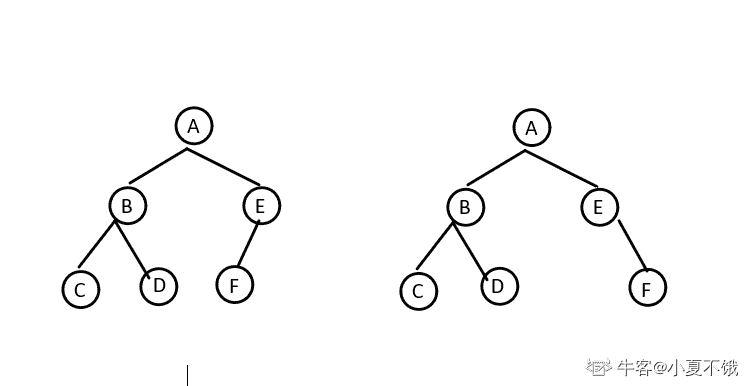

# 奇安信 2020 客户端开发工程师-Windows 开发（5 月 31 日）

## 1

小明有 N 元钱去药店买口罩，药店里有 6 个品牌的口罩，A 品牌 2 个装（2 元），B 品牌 3 个装（2 元）、C 品牌 1 个装（3 元）、D 品牌 5 个装（1 元），E 品牌 4 个装（5 元），F 品牌 3 个装（2 元），由于限购每个品牌最多只能买一个，小明最多能买多少口罩？

本题知识点

安卓工程师 iOS 工程师 奇安信 2020 运维工程师 Java 工程师 C++工程师 golang 工程师 PHP 工程师 测试工程师 前端工程师 大数据开发工程师 安全工程师 测试开发工程师

讨论

[你都不肯叫我一声教父](https://www.nowcoder.com/profile/144264450)

```cpp
import java.util.*;
public class Main{
    public static void main(String[]args){
        Scanner in = new Scanner(System.in);
        int n = in.nextInt();
        int [] a = new int [] {0,2,3,1,5,4,3}; //个数
        int [] b = new int [] {0,2,2,3,1,5,2};// 钱 
        int [][]dp = new int [7][n+1];

        dp[0][0] = 0;

        for(int i = 1; i <=6; i++){
            for(int j = 1; j<=n;j++){
                if(j<b[i]){
                    dp[i][j] = dp[i-1][j];//钱不够用了
                }
                else{
                    //不装第 i 个，和装了第 I 个比较
                    dp[i][j] = Math.max(dp[i-1][j],dp[i-1][j-b[i]]+a[i]);
                }

            }
        }
        System.out.println(dp[6][n]);

    }
}
```

典型的 01 背包问题

发表于 2021-03-30 22:11:23

* * *

[theyi](https://www.nowcoder.com/profile/6143310)

n=int(input())
res=0
dp=[[0 for i in range(n+1)] for j in range(7)]
mask=[(2,2),(3,2),(1,3),(5,1),(4,5),(3,2)]
for i in range(1,7):
    for j in range(1,n+1):
        if j>=mask[i-1][1]:

            dp[i][j]=max(dp[i-1][j],mask[i-1][0]+dp[i-1][j-mask[i-1][1]])
        else:
            dp[i][j]=dp[i-1][j]
print(dp[-1][-1])

发表于 2021-09-04 23:28:29

* * *

[_ 雾里](https://www.nowcoder.com/profile/174374052)

01 背包问题 import java.util.Scanner;
public class Main{
    public static void main(String[] args) {
        Scanner in =new Scanner(System.in);
        int n= in.nextInt();//输入 N 元钱，相当于背包总容量
        int[] prices={0,2,2,3,1,5,2};//每种口罩的价格，相当于每个占用背包的容量
        int[] number={0,2,3,1,5,4,3};//买一份有多少个口罩，相当于背包问题的价值
        int[][] dp=new int[7][n+1];//初始化一个二维数组 dp，用来存放最大价值。int[7][n+1] 7 表示的是 0-6 六种口罩，n+1 表示的是一共有 0-n 元钱（背包容量）
        int max=0;
        for (int i = 0; i <n+1 ; i++) {//当一种口罩不买时，不管钱多少，口罩数量均为 0
            dp[0][i]=0;
        }
        for (int i = 1; i <7 ; i++) {//控制遍历口罩的序号（商品序号）
            for (int j = 0; j <n+1; j++) {//控制遍历钱数（空间大小）
                if (j>=prices[i]){
                    //如果当前的钱数 j 买得起当前的口罩 i，那么有两种选择，
                    // 1：不买当前的口罩（不装入背包），此时的最大数量和第 i-1 种口罩的数量一致
                    // 2：购买当前的口罩（装入背包），此时的最大数量时第 i-1 种口罩的数量加上第 i 种口罩的数量，
                    dp[i][j]=Math.max(dp[i-1][j],dp[i-1][j-prices[i]]+number[i]);
                }else { //如果当前的钱数 j 买不起当前的口罩 i，那么最大数量和第 i-1 种口罩一致
                    dp[i][j]=dp[i-1][j];
                }
                max=dp[i][j];
            }
        }
        System.out.println(max);
    }
}具体思路：
[`blog.csdn.net/Supremey/article/details/120785736`](https://blog.csdn.net/Supremey/article/details/120785736)

发表于 2021-10-16 11:13:04

* * *

## 2

```cpp
如下图所示的三角形，有三个边 s1,s2,s3,边 s1 有四个圆圈⭕️1，2，3，4，边 s2 有四个圆圈⭕️4，5，6，7，边 s3 有四个圆圈⭕️7，8，9，1
把 1-9 这 9 个数字，分别填写到下图所示的 9 个圆圈圆圈里， 使每条边上的 4 个圆圈⭕️的和相等（9 个圆圈里的数字不能重复)
例如：s1=[1=>9,2=>8,3=>1,4=>3]=9+8+1+3=21,s2=[4=>3,5=>5,6=>7,7=>6]=3+5+7+6=21,s3=[7=>6,8=>2,9=>4, 1=>9]=6+2+4+9=21
```


本题知识点

安卓工程师 iOS 工程师 奇安信 2020 运维工程师 Java 工程师 C++工程师 golang 工程师 PHP 工程师 测试工程师 前端工程师 大数据开发工程师 安全工程师 测试开发工程师

讨论

[牛客 476036690 号](https://www.nowcoder.com/profile/476036690)

```cpp
import java.util.*;
public class Main {
       public static void main(String[] args) {
        Scanner scanner = new Scanner(System.in);
        String i = scanner.next();
        String[] str = i.split(",");
        ArrayList<Integer> list = new ArrayList<>();
        for (String s : str) {
            list.add(Integer.parseInt(s));
        }

        int n1 = list.get(0) + list.get(1) + list.get(2) + list.get(3);
        int n2 = list.get(3) + list.get(4) + list.get(5) + list.get(6);
        int n3 = list.get(6) + list.get(7) + list.get(8) + list.get(0);

        if (n1 == n2 && n2 == n3) {
            System.out.println("yes");
        } else {
            System.out.println("no");
        }
        }

}

```

编辑于 2022-03-18 12:12:29

* * *

[ʚfairyɞ](https://www.nowcoder.com/profile/441012983)

c++可以增加一个字符变量接收逗号，不过要注意最后一个没有逗号#include<stdio.h>#include<iostream>usingnamespacestd;intmain(){    inta[9], sum1, sum2, sum3;    chart;    for(inti = 0; i < 9; i++)    {        cin >> a[i];        if(i!=8)            cin >> t;    }    sum1 = a[0] + a[1] + a[2] + a[3];    sum2 = a[3] + a[4] + a[5] + a[6];    sum3 = a[6] + a[7] + a[8] + a[0];    if(sum1 == sum2 && sum2 == sum3)        printf("yes");    else        printf("no");}

发表于 2022-03-16 16:22:33

* * *

[能休息一下吗](https://www.nowcoder.com/profile/556032778)

while(line = readline())
    {
        let arr = line.split(',')
        let a = parseInt(arr[0])+parseInt(arr[1])+parseInt(arr[2])+parseInt(arr[3])
        let b = parseInt(arr[3])+parseInt(arr[4])+parseInt(arr[5])+parseInt(arr[6])
        let c = parseInt(arr[6])+parseInt(arr[7])+parseInt(arr[8])+parseInt(arr[0])
        if(a == b && b == c){
            console.log('yes')
        }
        else{
            console.log('no')
        }

    }

发表于 2021-09-06 23:03:34

* * *

## 3

下列有关 const 限定符说法错误的是：

正确答案: D   你的答案: 空 (错误)

```cpp
可以将一个非 const 对象的地址赋给一个指向 const 对象的指针
```

```cpp
可以将一个非 const 对象的地址赋给一个指向非 const 对象的指针
```

```cpp
一个 const 对象不可以被多次赋值
```

```cpp
通过 const 对象指针可以改变全局 const 对象内容
```

本题知识点

安卓工程师 iOS 工程师 奇安信 2020 Java 工程师 C++工程师 golang 工程师 PHP 工程师 测试工程师 测试开发工程师

讨论

[丷丷要开心](https://www.nowcoder.com/profile/5834026)

D：const 全局变量存储在全局存储空间，其值只有可读性，不能修改；const 局部变量存储在堆栈中，可通过指针修改其值。

发表于 2021-03-28 13:42:11

* * *

## 4

以下程序的输出是：
int var = 100;
int main()
{
    int var = var;
    printf("%d\n", var);
    return 0;
}

正确答案: A   你的答案: 空 (错误)

```cpp
随机数
```

```cpp
100
```

```cpp
0
```

```cpp
编译失败
```

本题知识点

安卓工程师 iOS 工程师 奇安信 2020 Java 工程师 C++工程师 golang 工程师 PHP 工程师 测试工程师 测试开发工程师

讨论

[牛客 656207095 号](https://www.nowcoder.com/profile/656207095)

这题答案应该是错误的，正确答案是输出 0。

发表于 2021-03-27 15:50:31

* * *

[pipiKun](https://www.nowcoder.com/profile/332780420)

不是未初始化吗，vs2019 编译

发表于 2021-04-14 00:43:03

* * *

## 5

以下程序在 big-endial 架构处理器下的输出是：
int i = 1;
char *pc = &i;
printf("%02x%02x%02x%02x\n", pc[0], pc[1], pc[2], pc[3]);

正确答案: C   你的答案: 空 (错误)

```cpp
1000
```

```cpp
0001
```

```cpp
01000000
```

```cpp
00000001
```

本题知识点

安卓工程师 iOS 工程师 奇安信 2020 Java 工程师 C++工程师 golang 工程师 PHP 工程师 测试工程师 测试开发工程师

讨论

[自渡、201909121854927](https://www.nowcoder.com/profile/909002509)

是 0 默认值

发表于 2022-01-10 03:48:21

* * *

[桀桀桀](https://www.nowcoder.com/profile/552082183)

下面以 unsigned int value = 0x12345678 为例，分别看看在两种字节序下其存储情况，我们可以用 unsigned char buf[4]来表示 valueBig-Endian: 低地址存放高位，如下：低地址---------------buf[0] (0x12) -- 高位字节 buf[1] (0x34)buf[2] (0x56)buf[3] (0x78) -- 低位字节---------------高地址引用自百度百科

发表于 2021-08-27 16:13:10

* * *

[pipiKun](https://www.nowcoder.com/profile/332780420)

这不是大端系统吗，那么 i 不是 0x 00 00 00 01 吗

发表于 2021-04-14 00:50:25

* * *

## 6

若入栈顺序为 e,f,g,h，则以下不可能的出栈顺序为：

正确答案: C   你的答案: 空 (错误)

```cpp
e,f,g,h
```

```cpp
f,e,h,g
```

```cpp
f,h,e,g
```

```cpp
g,f,h,e
```

本题知识点

安卓工程师 iOS 工程师 奇安信 2020 Java 工程师 C++工程师 PHP 工程师 golang 工程师 测试工程师 安全工程师 测试开发工程师

讨论

[牛客 546590565 号](https://www.nowcoder.com/profile/546590565)

A.e 进栈，然后出栈 f 进出，g 进出，h 进出(e,f,g,h)B.ef 进，fe 出，gh 进，hg 出(f,e,h,g)C.ef 进，f 出,gh 进，hg 出，e 出（f,h,g,e）D.efg 进，gf 出，h 进，h 出，e 出（g,f,h,e）

发表于 2021-08-22 15:15:56

* * *

[牛客 525059003 号](https://www.nowcoder.com/profile/525059003)

栈之根本——后进先出（Last In First Out , LIFO）。初次接触到这个问题的人，或许会认为入栈 abcde，出栈就只能是 edcba。

      其实是这个问题描述有歧义，应该是分段入栈的顺序，也就是说，可能先入栈 a，再取出 a，入栈 b，再取出 b……，所以 D 也是可能的，也就是说，并不是等所有元素都入栈了，才开始出栈。
————————————————
版权声明：本文为 CSDN 博主「Keep_Moving2030」的原创文章，遵循 CC 4.0 BY-SA 版权协议，转载请附上原文出处链接及本声明。
原文链接：[`blog.csdn.net/u011982340/article/details/39249651`](https://blog.csdn.net/u011982340/article/details/39249651)

发表于 2022-03-16 20:20:41

* * *

[璇玄](https://www.nowcoder.com/profile/905349867)

栈是后进先出的数据结构。A: e 先进栈然后出栈 ，f 先进栈再出栈，g 先进栈再出栈，h 先进栈再出栈 B: e、f 进栈，f 出栈，e 出栈。g、h 进栈，h 出栈，g 最后出栈 D: efg 进栈，g 出栈，f 出栈，h 进栈，h 出栈，e 出栈

发表于 2021-04-16 16:13:23

* * *

## 7

int (*p)[10]，则 p 是一个

正确答案: B   你的答案: 空 (错误)

```cpp
数组
```

```cpp
指针
```

```cpp
函数
```

```cpp
其他答案均不正确
```

本题知识点

安卓工程师 iOS 工程师 奇安信 2020 Java 工程师 C++工程师 PHP 工程师 golang 工程师 安全工程师

讨论

[牛客 729047582 号](https://www.nowcoder.com/profile/729047582)

int *p[10]表示一个有十个指针的数组，这 10 个指针是指向整型数的（指针数组）int (*p)[10]表示一个指向 10 个整型数数组的指针（数组指针）答案选 B，为指针

发表于 2021-10-04 20:33:28

* * *

## 8

struct Itest
{
  void* itestpt1;
  void* itestpt2;
};

#define __defineXXX(Name) ((DWORD)(&((Itest*)NULL)->(Name))/sizeof(void*))
int main(){
  cout<<__defineXXX(itestpt2)<  return 0;
}
 请问上述程序输出结果是（）

正确答案: C   你的答案: 空 (错误)

```cpp
空指针引用，程序崩溃
```

```cpp
0
```

```cpp
1
```

```cpp
2
```

本题知识点

安卓工程师 iOS 工程师 奇安信 2020 Java 工程师 C++工程师 PHP 工程师 golang 工程师

## 9

int i =1;
int inc()
{ 
  return ++i;
}         
void main() 
{   
  printf("%d,%d",inc(),inc()*inc());
} 
请问上述程序输出结果是（）

正确答案: B   你的答案: 空 (错误)

```cpp
2,12
```

```cpp
4,6
```

```cpp
2,6
```

```cpp
2,4
```

本题知识点

安卓工程师 iOS 工程师 奇安信 2020 Java 工程师 C++工程师 PHP 工程师 golang 工程师

## 10

char g_string_digis[]="01234556789";
void main()
{
    printf("%d\n", sizeof(g_string_digis));
}
这段代码的输出结果是（）

正确答案: D   你的答案: 空 (错误)

```cpp
4
```

```cpp
10
```

```cpp
11
```

```cpp
12
```

本题知识点

安卓工程师 iOS 工程师 奇安信 2020 Java 工程师 C++工程师 PHP 工程师 golang 工程师

讨论

[幽悠](https://www.nowcoder.com/profile/463942470)

好家伙，两个 5，只能说是明显在误导吧，没啥大意义

发表于 2021-03-31 13:31:31

* * *

## 11

对于 int *pa[5];的描述中,正确的是（）

正确答案: D   你的答案: 空 (错误)

```cpp
pa 是一个指向数组的指针，所指向的数组是 5 个 int 型元素
```

```cpp
pa 是一个指向某数组中第 5 个元素的指针，该元素是 int 型变量
```

```cpp
pa[5]表示数组的第 5 个元素的值，是 int 型的值
```

```cpp
pa 是一个具有 5 个元素的指针数组，每个元素是一个 int 型指针
```

本题知识点

安卓工程师 iOS 工程师 奇安信 2020 Java 工程师 C++工程师 PHP 工程师 golang 工程师

## 12

假定 AB 为一个类，则执行“AB a(2), b[3],*p[4];”语句时调用该类构造函数的次数为（）

正确答案: B   你的答案: 空 (错误)

```cpp
3
```

```cpp
4
```

```cpp
5
```

```cpp
9
```

本题知识点

安卓工程师 iOS 工程师 奇安信 2020 Java 工程师 C++工程师 PHP 工程师 golang 工程师

讨论

[YMWM](https://www.nowcoder.com/profile/962711393)

AB a(2), b[3],*p[4];AB a(2)调用构造函数 1 次，4 表示设置成员变量为 4，注意是()AB b[3]调用构造函数 3 次 AB *p[4]调用构造函数 0 次，只是声明了 4 个指针，不分配空间故总共调用了 4 次构造函数！ 

发表于 2021-09-12 23:00:48

* * *

## 13

批处理系统的主要缺点是？

正确答案: C   你的答案: 空 (错误)

```cpp
CPU 利用率不高
```

```cpp
不具备并行性
```

```cpp
失去了交互性
```

```cpp
其他答案均不正确
```

本题知识点

安卓工程师 iOS 工程师 奇安信 2020 Java 工程师 C++工程师 PHP 工程师 golang 工程师 前端工程师 安全工程师

## 14

以下哪个不是一个运行进程可能出现的状态？

正确答案: B   你的答案: 空 (错误)

```cpp
就绪状态
```

```cpp
创建状态
```

```cpp
执行状态
```

```cpp
等待状态
```

本题知识点

安卓工程师 iOS 工程师 奇安信 2020 运维工程师 Java 工程师 C++工程师 golang 工程师 PHP 工程师 前端工程师 安全工程师

## 15

一个向量第一个元素的存储地址是 30，每个元素的长度为 2，则第 5 个元素的地址是（）

正确答案: C   你的答案: 空 (错误)

```cpp
35
```

```cpp
40
```

```cpp
38
```

```cpp
30
```

本题知识点

安卓工程师 iOS 工程师 奇安信 2020 运维工程师 Java 工程师 C++工程师 golang 工程师 PHP 工程师 测试工程师 前端工程师 大数据开发工程师 测试开发工程师

## 16

栈中元素的进出原则是

正确答案: A   你的答案: 空 (错误)

```cpp
先进后出
```

```cpp
先出后进
```

```cpp
先进先出
```

```cpp
同进同出
```

本题知识点

安卓工程师 iOS 工程师 奇安信 2020 运维工程师 Java 工程师 C++工程师 golang 工程师 PHP 工程师 测试工程师 前端工程师 大数据开发工程师 测试开发工程师

讨论

[demo065](https://www.nowcoder.com/profile/239481568)

啊这..

发表于 2021-04-11 13:27:09

* * *

[Ideals6](https://www.nowcoder.com/profile/709296402)

额。。这套试卷很多题都是错的

发表于 2021-04-01 20:32:39

* * *

[牛客 993774460 号](https://www.nowcoder.com/profile/993774460)

这答案就离谱

发表于 2021-03-28 14:17:06

* * *

## 17

在无序的情况下对ｎ个不同的数字进行冒泡排序，比较的次数为

正确答案: D   你的答案: 空 (错误)

```cpp
2n-1
```

```cpp
n
```

```cpp
n-1
```

```cpp
n(n-2)/3
```

本题知识点

安卓工程师 iOS 工程师 奇安信 2020 Java 工程师 C++工程师 golang 工程师 PHP 工程师 测试工程师 前端工程师 大数据开发工程师 测试开发工程师

讨论

[邢玉](https://www.nowcoder.com/profile/408499885)

有人能讲讲吗？？为什么答案不是 n*（n-1）/2

发表于 2021-10-10 14:57:48

* * *

[康宁汉姆有颗树](https://www.nowcoder.com/profile/185438902)

答案显然错了啊……应该 n(n-1)/2

发表于 2022-03-16 12:04:30

* * *

[牛客 867941589 号](https://www.nowcoder.com/profile/867941589)

先排除前三个选项😎

发表于 2021-03-26 16:07:53

* * *

## 18

在（）中只要指出其中任何一个结点的位置，就可以从它出发依次访问到其他所有结点

正确答案: C   你的答案: 空 (错误)

```cpp
双向链表
```

```cpp
完全二叉树
```

```cpp
循环链表
```

```cpp
有向无环图
```

本题知识点

安卓工程师 iOS 工程师 奇安信 2020 Java 工程师 C++工程师 golang 工程师 PHP 工程师 测试工程师 前端工程师 大数据开发工程师 测试开发工程师

讨论

[踏实的做每一件事](https://www.nowcoder.com/profile/9112342)

为什么双向链表不行？

发表于 2021-04-18 11:07:54

* * *

[牛客 867941589 号](https://www.nowcoder.com/profile/867941589)

循环链表可以实现从一个点出发，在不重复遍历的情况下，遍历所有的点。

发表于 2021-03-26 16:09:18

* * *

## 19

假设 student 表有以下记录
STUDENT_NO     SEX  AGE
---------------------------- 
1       M   20
2       F     30 
3       NULL  NULL
TEACHER 表有以下记录
STUDENT_NO     TEACHER
--------------------------
1       Tim
1       Jack
2       Tim
查询语句 select count(*) from student S LEFT JOIN TEACHER T on S.STUDENT_NO=T.STUDENT_NO; 的结果是

正确答案: C   你的答案: 空 (错误)

```cpp
2
```

```cpp
3
```

```cpp
4
```

```cpp
5
```

本题知识点

安卓工程师 iOS 工程师 奇安信 2020 运维工程师 Java 工程师 C++工程师 PHP 工程师 golang 工程师 测试工程师 大数据开发工程师 安全工程师 测试开发工程师

讨论

[土娃](https://www.nowcoder.com/profile/661717914)

左连接，统计完展示的 student 表，即使在 teacher 表中没有匹配到也会展示 1       M     20      Tim1       M     20      Jack2       F     30       Tim
3       NULL  NULL

发表于 2021-04-26 15:59:55

* * *

[psychowo](https://www.nowcoder.com/profile/980213287)

[`blog.csdn.net/u014204541/article/details/79739980`](https://blog.csdn.net/u014204541/article/details/79739980)

发表于 2021-05-29 15:23:58

* * *

## 20

假设您需要存储从三个到 30 个字符不等的产品名称，您还需要将使用的存储空间量降到最低，选择哪种字段类型

正确答案: D   你的答案: 空 (错误)

```cpp
CHAR(3,30)
```

```cpp
CHAR(30)
```

```cpp
VARCHAR(3,30)
```

```cpp
VARCHAR(30)
```

本题知识点

安卓工程师 iOS 工程师 奇安信 2020 运维工程师 Java 工程师 C++工程师 golang 工程师 PHP 工程师 安全工程师

讨论

[psychowo](https://www.nowcoder.com/profile/980213287)

char 是一种固定长度的类型，无论储存的数据有多少都会固定长度，如果插入的长度小于定义长度，则可以用空格进行填充。而 varchar 是一种可变长度的类型，当插入的长度小于定义长度时，插入多长就存多长。

char 和 varchar 区别

1、最大长度：

char 最大长度是 255 字符，varchar 最大长度是 65535 个字节。

2、定长：

char 是定长的，不足的部分用隐藏空格填充，varchar 是不定长的。

3、空间使用：

char 会浪费空间，varchar 会更加节省空间。

4、查找效率：

char 查找效率会很高，varchar 查找效率会更低。

5、尾部空格：

char 插入时可省略，vaechar 插入时不会省略，查找时省略。

区别一，定长和变长

char 表示定长，长度固定，varchar 表示变长，即长度可变。char 如果插入的长度小于定义长度时，则用空格填充；varchar 小于定义长度时，还是按实际长度存储，插入多长就存多长。

因为其长度固定，char 的存取速度还是要比 varchar 要快得多，方便程序的存储与查找；但是 char 也为此付出的是空间的代价，因为其长度固定，所以会占据多余的空间，可谓是以空间换取时间效率。varchar 则刚好相反，以时间换空间。

区别之二，存储的容量不同
对 char 来说，最多能存放的字符个数 255，和编码无关。
而 varchar 呢，最多能存放 65532 个字符。varchar 的最大有效长度由最大行大小和使用的字符集确定。整体最大长度是 65,532 字节。

发表于 2021-05-29 15:31:04

* * *

[牛客 867941589 号](https://www.nowcoder.com/profile/867941589)

题目的要求是仅考虑存储空间。varcharx(30)为可变长字符类型，长度限制为 30。

发表于 2021-03-26 16:10:43

* * *

## 21

ARP 协议的主要功能是

正确答案: A   你的答案: 空 (错误)

```cpp
将 IP 地址解析为物理地址
```

```cpp
将物理地址解析为 IP 地址
```

```cpp
将主机域名解析为 IP 地址
```

```cpp
将 IP 地址解析为主机域名
```

本题知识点

安卓工程师 iOS 工程师 奇安信 2020 运维工程师 Java 工程师 C++工程师 golang 工程师 PHP 工程师 安全工程师

## 22

以下哪些 IP 地址不是保留地址?

正确答案: D   你的答案: 空 (错误)

```cpp
192.168.1.23
```

```cpp
172.17.51.50
```

```cpp
10.206.1.2
```

```cpp
220.181.38.150
```

本题知识点

安卓工程师 iOS 工程师 奇安信 2020 运维工程师 Java 工程师 C++工程师 golang 工程师 PHP 工程师 安全工程师

讨论

[psychowo](https://www.nowcoder.com/profile/980213287)

A 类地址范围：10.0.0.0—10.255.255.255；

B 类地址范围：172.16.0.0---172.31.255.555；

C 类地址范围：192.168.0.0---192.168.255.255

发表于 2021-05-29 15:34:52

* * *

## 23

char c; 以下对 c 的赋值错误的是：

正确答案: A B D   你的答案: 空 (错误)

```cpp
c = "a";
```

```cpp
c = 'a';
```

```cpp
c = '\086';
```

```cpp
c = '\031';
```

本题知识点

安卓工程师 iOS 工程师 奇安信 2020 Java 工程师 C++工程师 golang 工程师 PHP 工程师

讨论

[Jiang 锋](https://www.nowcoder.com/profile/961788916)

难道不是 AC???

发表于 2021-08-07 11:28:29

* * *

[一口三头猪](https://www.nowcoder.com/profile/343822756)

ACD?

发表于 2021-08-23 21:19:00

* * *

[园园有 offer](https://www.nowcoder.com/profile/475945585)

八进制中有 8???c 一定是错的吧

发表于 2021-08-06 13:14:53

* * *

## 24

已知 int a[4][3] = {1,2,3,4,5,6,7,8,9,10,11,12};
 int (*ptr)[3] = a;
 int *p = a[0];那么值和 a[3][2]相同的表达式是()

正确答案: A D   你的答案: 空 (错误)

```cpp
*(*(ptr+3)+2)
```

```cpp
*(*(a+2)+3)
```

```cpp
*((a+3)[2])
```

```cpp
*(p+11)
```

本题知识点

安卓工程师 iOS 工程师 奇安信 2020 Java 工程师 C++工程师 golang 工程师 PHP 工程师 安全工程师

## 25

以下语句可以看作为 1 条语句的有：

正确答案: A B C D   你的答案: 空 (错误)

```cpp
i++;
```

```cpp
int a=0, b=0, c=0;
```

```cpp
for (i=0; i<10; i++);
```

```cpp
i>0? a=1: b=1;
```

本题知识点

安卓工程师 iOS 工程师 奇安信 2020 Java 工程师 C++工程师 PHP 工程师 golang 工程师 安全工程师

## 26

考虑函数原型
void test(int a,int b=7,char ch='*')
下面的函数调用中，属于不合法调用的是（）

正确答案: C D   你的答案: 空 (错误)

```cpp
test(5)
```

```cpp
test(5,'8')
```

```cpp
test(6,"#")
```

```cpp
test(0,0,"*")
```

本题知识点

安卓工程师 iOS 工程师 奇安信 2020 Java 工程师 C++工程师 PHP 工程师 golang 工程师

## 27

给出下面定义：
char a[]="abcd";
char b[]={'a','b','c','d'};
则下列说法错误的是（）

正确答案: A B D   你的答案: 空 (错误)

```cpp
数组 a 与数组 b 等价
```

```cpp
数组 a 和数组 b 的长度相同
```

```cpp
数组 a 的长度大于数组 b 的长度
```

```cpp
数组 a 的长度小于数组 b 的长度
```

本题知识点

安卓工程师 iOS 工程师 奇安信 2020 Java 工程师 C++工程师 PHP 工程师 golang 工程师

## 28

下面说法不正确的是（）

正确答案: A D   你的答案: 空 (错误)

```cpp
应该使用 Windows API 函数 CreateThread 来创建一个线程，而不是使用 VC++自带的库函数 _ beginthreadex
```

```cpp
一个动态库要被卸载时，为了退出线程，编写程序时要尽量避免使用 TerminateThread 终止别的线程运行
```

```cpp
每个线程都有自己特有的栈和虚拟寄存器
```

```cpp
使用 Windows API 函数 CreateFile 创建文件失败时，该函数返回 0
```

本题知识点

安卓工程师 iOS 工程师 奇安信 2020 Java 工程师 C++工程师 PHP 工程师 golang 工程师

## 29

链表具有的特点是

正确答案: A C D   你的答案: 空 (错误)

```cpp
不必事先估计存储空间
```

```cpp
可随机访问任一元素
```

```cpp
插入删除不需要移动元素
```

```cpp
所需空间与线性表长度成正比
```

本题知识点

安卓工程师 iOS 工程师 奇安信 2020 测试工程师 大数据开发工程师 测试开发工程师 Java 工程师 C++工程师 PHP 工程师 golang 工程师

讨论

[牛客 360864472 号](https://www.nowcoder.com/profile/360864472)

随机访问任一元素是顺序表的特点，不是链表的特点

发表于 2021-09-03 11:20:24

* * *

## 30

关二叉树下列说法不正确的是

正确答案: A C D   你的答案: 空 (错误)

```cpp
二叉树的度为 2
```

```cpp
一棵二叉树的度可以小于 2
```

```cpp
二叉树中至少有一个结点的度为 2
```

```cpp
二叉树中任何一个结点的度都为 2
```

本题知识点

安卓工程师 iOS 工程师 奇安信 2020 测试工程师 大数据开发工程师 测试开发工程师 Java 工程师 C++工程师 PHP 工程师 golang 工程师

讨论

[康宁汉姆有颗树](https://www.nowcoder.com/profile/185438902)

答案不应该是    AC 吗？？？

发表于 2022-03-16 14:09:59

* * *

[牛客 360864472 号](https://www.nowcoder.com/profile/360864472)

在树结构中，一个节点所拥有的后件个数称为该节点的度，所有节点中最大的度称为树的度。二叉树中不存在度大于 2 的节点。

发表于 2021-09-03 11:28:39

* * *

## 31

已知二叉树的先序遍历结果为 ABCDEF，后序遍历结果为 CDBFEA，那么，中序遍历结果可以是（）

正确答案: A C   你的答案: 空 (错误)

```cpp
CBDAEF
```

```cpp
DCAEFB
```

```cpp
CBDAFE
```

```cpp
CBADFE
```

本题知识点

安卓工程师 iOS 工程师 奇安信 2020 前端工程师 大数据开发工程师 Java 工程师 C++工程师 PHP 工程师 golang 工程师

讨论

[小夏不饿](https://www.nowcoder.com/profile/373455833)

有下面两种情况的二叉树

发表于 2021-08-27 16:27:38

* * *

## 32

同时具有较高的插入和删除性能的数据结构有？

正确答案: C D   你的答案: 空 (错误)

```cpp
单链表
```

```cpp
数组
```

```cpp
二叉树
```

```cpp
哈希表
```

本题知识点

安卓工程师 iOS 工程师 奇安信 2020 前端工程师 大数据开发工程师 Java 工程师 C++工程师 PHP 工程师 golang 工程师

讨论

[牛客 993774460 号](https://www.nowcoder.com/profile/993774460)

单链表的插入和删除不都是 O(1)吗？

发表于 2021-03-28 14:23:49

* * *