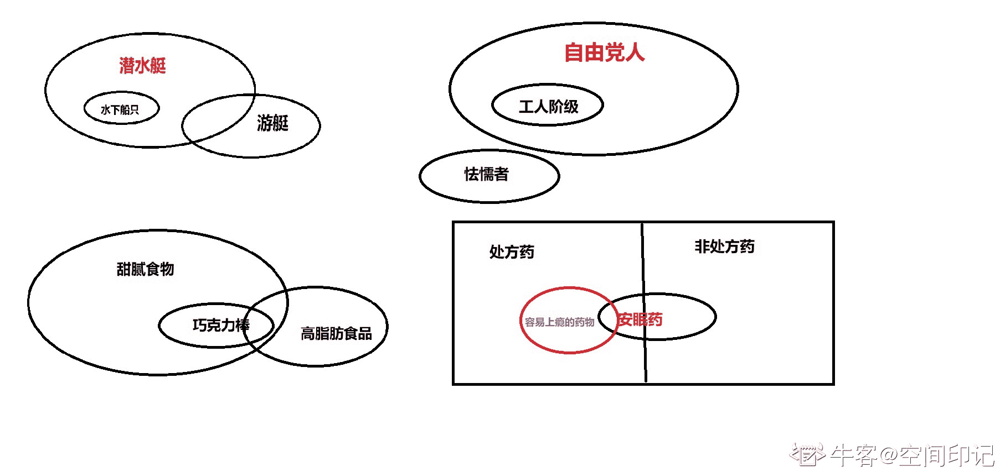

# 猿辅导 2021 校园招聘技术类笔试（一）

## 1

给定初始序列 1、2、3、4、5、6，对空栈进行入栈、出栈操作，以下哪种序列不能得到

正确答案: B   你的答案: 空 (错误)

```cpp
2 3 4 1 5 6
```

```cpp
4 5 3 1 2 6
```

```cpp
5 4 3 6 2 1
```

```cpp
3 4 6 5 2 1 
```

本题知识点

Java 工程师 C++工程师 PHP 工程师 golang 工程师 前端工程师 安卓工程师 iOS 工程师 算法工程师 大数据开发工程师 信息技术岗 运维工程师 安全工程师 数据分析师 数据库工程师 测试开发工程师 测试工程师 猿辅导 2021

讨论

[顺手牵 yang](https://www.nowcoder.com/profile/554240174)

A: 1 入 2 入 2 出 3 入 3 出 4 入 4 出 1 出 5 入 5 出 6 入 6 出 C: 1 入 2 入 3 入 4 入 5 入 5 出 4 出 3 出 6 入 6 出 2 出 1 出 D:1 入 2 入 3 入 3 出 4 入 4 出 5 入 6 入 6 出 5 出 2 出 1 出

发表于 2021-04-08 21:15:41

* * *

[多的是，你不知道的公司](https://www.nowcoder.com/profile/260323305)

正常情况如果先一个个压栈，再一个个出栈，顺序一定是从大到小，出栈顺序先小后大，只有一种可能性，就是小的出的时候，大的还没有入栈，而且此时，比小的序列更小的（之前没有出栈的）出栈必定得按照从大到小

发表于 2021-07-31 11:26:23

* * *

## 2

用递归算法实现 n 个不同元素的有序序列的二分查找，递归工作栈的最小容量应为:

正确答案: D   你的答案: 空 (错误)

```cpp
n + 1

```

```cpp
floor((n / 2) + 1)

```

```cpp
floor(log2n+1) 

```

```cpp
floor(log2n)  + 1
```

本题知识点

Java 工程师 C++工程师 PHP 工程师 golang 工程师 前端工程师 安卓工程师 iOS 工程师 算法工程师 大数据开发工程师 信息技术岗 运维工程师 安全工程师 数据分析师 数据库工程师 测试开发工程师 测试工程师 猿辅导 2021

## 3

DNS 服务器解析域名的正确查询顺序为：

正确答案: C   你的答案: 空 (错误)

```cpp
本地缓存记录  区域记录  转发域名服务器  根域名服务器

```

```cpp
区域记录  本地缓存记录  转发域名服务器  根域名服务器
```

```cpp
本地缓存记录  区域记录  根域名服务器  转发域名服务器
```

```cpp
区域记录  本地缓存记录  根域名服务器  转发域名服务器
```

本题知识点

Java 工程师 C++工程师 PHP 工程师 golang 工程师 前端工程师 安卓工程师 iOS 工程师 算法工程师 大数据开发工程师 信息技术岗 运维工程师 安全工程师 数据分析师 数据库工程师 测试开发工程师 测试工程师 猿辅导 2021

## 4

在以下各种寻址方式中，获取操作数最快的是：

正确答案: B   你的答案: 空 (错误)

```cpp
直接寻址

```

```cpp
立即数寻址 
```

```cpp
寄存器寻址
```

```cpp
间接寻址
```

本题知识点

Java 工程师 C++工程师 PHP 工程师 golang 工程师 前端工程师 安卓工程师 iOS 工程师 算法工程师 大数据开发工程师 信息技术岗 运维工程师 安全工程师 数据分析师 数据库工程师 测试开发工程师 测试工程师 猿辅导 2021

讨论

[空间印记](https://www.nowcoder.com/profile/503024001)

1、立即寻址方式:
操作数就包含在指令中。作为指令的一部分，跟在操作码后存放在代码段。

这种操作数成为立即数。立即数可以是 8 位的，也可以是 16 位的。

例如:

    指令: MOV AX,1234H

      则: AX = 1234H

 在汇编语言中,规定:立即数不能作为指令中的第一操作数(目的操作数)。

2、寄存器寻址方式:
操作数在 CPU 内部的寄存器中，指令指定寄存器号。

对于 16 位操作数，寄存器可以是:AX、BX、CX、DX、SI、DI、SP 和 BP 等。

对于 8 位操作数，寄存器可以是 AL 、AH、BL、BH、CL、CH、DL、DH。

这种寻址方式由于操作数就在寄存器中，不需要访问存储器（比如内存）来取得操作数，因而可以取得较高的运算速度。

3、直接寻址方式:
[`www.cnblogs.com/lilongjiang/archive/2011/06/14/2080551.html`](http://www.cnblogs.com/lilongjiang/archive/2011/06/14/2080551.html)

指令所要的操作数存放在内存中，在指令中直接给出该操作数的有效地址，这种寻址方式为直接寻址方式。

在通常情况下，操作数存放在数据段 DS 中，所以，其物理地址将由数据段寄存器 DS 和指令中给出的有效地址直接形成，但如果使用段超越前缀，那么，操作数可存放在其它段。

例：假设有指令：MOV BX, [1234H]，在执行时，(DS)=2000H，内存单元 21234H 的值为 5213H。问该指令执行后，BX 的值是什么？

解：根据直接寻址方式的寻址规则，把该指令的具体执行过程用下图来表示。

从图中，可看出执行该指令要分三部分：

由于 1234H 是一个直接地址，它紧跟在指令的操作码之后，随取指令而被读出；

访问数据段的段寄存器是 DS，所以，用 DS 的值和偏移量 1234H 相加，得存储单元的物理地址：21234H；

取单元 21234H 的值 5213H，并按“高高低低”的原则存入寄存器 BX 中。

所以，在执行该指令后，BX 的值就为 5213H。

由于数据段的段寄存器默认为 DS，如果要指定访问其它段内的数据，可在指令中用段前缀的方式显式地书写出来。

下面指令的目标操作数就是带有段前缀的直接寻址方式。

MOV　ES:[1000H], AX

直接寻址方式常用于处理内存单元的数据，其操作数是内存变量的值，该寻址方式可在 64K 字节的段内进行寻址。

注意：立即寻址方式和直接寻址方式的书写格式的不同，直接寻址的地址要写在括号“[”，“]”内。在程序中，直接地址通常用内存变量名来表示，如：MOV BX, VARW，其中，VARW 是内存字变量。

试比较下列指令中源操作数的寻址方式(VARW 是内存字变量)：
MOV　AX, 1234H            MOV　AX, [1234H] ;                前者是立即寻址，后者是直接寻址 
MOV　AX, VARW           MOV　AX, [VARW] ;                两者是等效的，均为直接寻址

在汇编语言指令中，可以用符号地址代替数值地址

如:MOV AX,VALUE

此时 VALUE 为存放操作数单元的符号地址。

如写成:MOV AX,[VALUE]也是可以的，两者是等效的。

如 VALUE 在附加段中，则应指定段超越前缀如下：

MOV AX,ES:VALUE 或 MOV AX,ES:[VALUE]

4、寄存器间接寻址方式:
操作数在寄存器中，操作数有效地址在 SI、DI、BX、BP 这四个寄存器之一中。在不使用段超越前缀的情况下，如果有效地址在 SI、DI 和 BX 中，则以 DS 段寄存器中的内容为段值。如果有效地址在 BP 中，则以 SS 段寄存器中的内容为段值。该寻址方式物理地址的计算方法如下：

寄存器间接寻址方式读取存储单元的原理如图所示：

例如：

MOV AX, [DI]

如果(DS) = 1000H            (DI) = 2345H

则物理地址 =  1000H * 16 + 2345H = 12345H

12345H 地址中的内容为:4354H

执行该指令后,(AX) = 4354H

如图所示：

5、寄存器相对寻址方式:
操作数在存储器中，操作数的有效地址是一个基址寄存器(BX、BP)或变址寄存器(SI、DI)的内容加上指令中给定的 8 位或 16 位位移量之和。

    BX    8 位    位移量

EA(有效地址) =  BP  + 

    SI    16 位    位移量

    DI

在一般情况下，如果 SI、DI、或 BX 中的内容作为有效地址的一部分，那么引用的段寄存器是 DS；如果 BP 中的内容作为有效地址的一部分，那么引用的段寄存器是 SS。

物理地址 = 16d × (DS) + (BX) + 8

           或(SI)或 16 位位移量

           或(DI)

物理地址 = 16d × (SS) + (BP) + 8 位位移量

                       或 16 位位移量

在指令中给定的 8 位或 16 位位移量采用补码形式表示。在计算有效地址时，如位移量是 8 位，则被带符号扩展成 16 位。

例如:

MOV AX,[DI+1223H]

假设，(DS) = 5000H，(DI) = 3678H

则物理地址 = 50000 + 3678 + 1233 = 5489BH

5489BH 地址中的内容:55AAH

执行该指令后 AX = 55AAH

下面指令中，源操作数采用寄存器相对寻址，引用的段寄存器是 SS: MOV BX,[BP-4]

下面指令中，目的操作数采用寄存器相对寻址，引用的段寄存器是 ES: MOV ES:[BX+5],AL

指令:MOV AX,[SI+3]与 MOV AX,3[SI]是等价的

6、基址加变址寻址方式:
操作数在寄存器中，操作数的有效地址由:

基址寄存器之一的内容与变址寄存器之一的内容相加

   BX   SI

即: EA =    + 

   BP   DI

在一般情况下，如果 BP 之内容作为有效地址的一部分，则以 SS 之内容为段值，否则已 DS

为段值。

例如：

MOV AX,[BX][DI]

如:(DS)=2100H,

   (BX)=0158H,

   (DI)=10A5H

则 EA=0158 + 10A5 = 11FD

物理地址=21000 + 11FD = 221FDH

221FDH 地址中的内容:1234H

执行该指令后 AX = 1234H

下面指令中，目的操作数采用基址加变址寻址，

引用的段寄存器是 DS: MOV DS:[BP+SI],AL

下面指令中，源操作数采用基址加变址寻址，

引用的段寄存器 ES: MOV AX,ES:[BX+SI]

这种寻址方式使用与数组或表格处理。用基址寄存器存放数组首地址，而用变地寄存器

来定位数组中的各元素，或反之。由于两个寄存器都可改变，所以能更加灵活地访问数

组或表格中的元素。

下面的两种表示方法是等价的:

MOV AX,[BX+DI]

MOV AX,[DI][BX]

7、相对基址加变址寻址方式：
操作数在存储器中，操作数的有效地址由于基址寄存器之一的内容与变址寄存器之一的

内容及指令中给定的 8 位或 16 位位移量相加得到。

         BX    SI    8 位

即: EA =     +     +      位移量

   BP    DI    16 位

在一般情况下，如果 BP 中的内容作为有效地址的一部分，则以 SS 段寄存器中的内容为段

值，否则以 DS 段寄存器中的内容为段值。

在指令中给定的 8 位或 16 位位移量采用补码形式表示。

在计算有效地址时，如果位移量是 8 位，那么被带符号扩展成 16 位。

当所得的有效地址操作 FFFFH 时，就取其 64K 的模

例如:

MOV AX,[BX+DI-2]

假设，(DS) = 5000H, (BX) = 1223H, DI = 54H, (51275) = 54H, (51276) = 76H

物理地址= 50000 + 1223 + 0054 + FFFE(-2 各位取反末位加一) = 51275H

执行该指令后 (AX) = 7654H

相对基址加变址这种寻址方式的表示方法多种多样，以下四种方法均是等价的：

MOV AX,[BX+DI+1234H], MOV AX,1234H[BX][DI]

MOV AX 1234H[BX+DI],  MOV AX,1234H[DI][BX]
————————————————
版权声明：本文为 CSDN 博主「bytxl」的原创文章，遵循 CC 4.0 BY-SA 版权协议，转载请附上原文出处链接及本声明。
原文链接：[`blog.csdn.net/bytxl/article/details/48462987`](https://blog.csdn.net/bytxl/article/details/48462987)

发表于 2021-04-06 10:11:20

* * *

## 5

有一苹果两个人抛硬币来决定谁吃这个苹果，先抛到正面者吃。问先抛者吃到苹果的概率是多少？

正确答案: C   你的答案: 空 (错误)

```cpp
1/2
```

```cpp
3/4   
```

```cpp
2/3
```

```cpp
9/16
```

本题知识点

Java 工程师 C++工程师 PHP 工程师 golang 工程师 前端工程师 安卓工程师 iOS 工程师 算法工程师 大数据开发工程师 信息技术岗 运维工程师 安全工程师 数据分析师 数据库工程师 测试开发工程师 测试工程师 猿辅导 2021

讨论

[牛客 440033491 号](https://www.nowcoder.com/profile/440033491)

1.  先抛者第 1 次扔就扔到了正面吃到苹果，概率为 1/2
2.  先抛者第 2 次及以后扔到了正面吃到苹果，概率为(1/2 * 1/2 * p) = 1/4 * p
    怎么理解呢？先抛者第 1 次扔到反面*后抛者第 1 次扔到反面*先抛者扔到正面的总概率
3.  所以 p = 1/2 + 1/4 * p，解这个方程式，得 p= 2/3

发表于 2021-04-06 11:09:52

* * *

[多的是，你不知道的公司](https://www.nowcoder.com/profile/260323305)

p(先抛者得正面)=p(先抛者第 1 次得正面)+p(先抛者第 2 次得正面)+....+p(先抛者第 n 次得正面)=1/2+(1/2)³+...=(1/2（1-（1/2)²n）)/1-(1/2)²   n->∞=2/3

发表于 2021-07-31 12:38:26

* * *

[JianHuaZou](https://www.nowcoder.com/profile/31501944)

假设一共抛三次：一、先抛者抛到正面的概率为 1/2；二、后抛者抛到正面的概率为 1/2；三、又到先抛者抛到正面的概率为 1/2。所以 依题意得，先抛者抛到正面的概率为 2/3！

编辑于 2021-04-09 15:40:31

* * *

## 6

有一长度为 3000B 的 IP 数据报，IP 头部长度为 20B，如果在最大帧长为 1518B 的以太网传输，需要将其拆分为（）个数据报：

正确答案: B   你的答案: 空 (错误)

```cpp
2
```

```cpp
3
```

```cpp
4
```

```cpp
不需要拆分
```

本题知识点

Java 工程师 C++工程师 PHP 工程师 golang 工程师 前端工程师 安卓工程师 iOS 工程师 算法工程师 大数据开发工程师 信息技术岗 运维工程师 安全工程师 数据分析师 数据库工程师 测试开发工程师 测试工程师 猿辅导 2021

讨论

[JianHuaZou](https://www.nowcoder.com/profile/31501944)

每次发送都要加报头吗，那分两次发送则  3000/2+20=1520  >>  1518，所以分两次发送不可行。

发表于 2021-04-09 15:44:07

* * *

[小团月](https://www.nowcoder.com/profile/938104850)

3000B 的 ip 数据报=20B（IP 首部） + 2980（数据）MAC 帧最大长度=18B（首部+尾部）+ 1500（ip 数据报）MAC 帧的最大数据=1500B=20B(ip 首部)+1480B（数据）2980B=1480B*2+20B*1 所以要拆分成 3 个数据报，用 3 个 mac 帧发送

发表于 2021-04-29 15:50:05

* * *

[竹影夜迷离](https://www.nowcoder.com/profile/195085)

以太网 MAC 帧首部加尾部 6(目的地址)+6(源地址)+2(类型)+4(FCS)为 18B，IP 头为 20B(每次都要发送)，因此最大数据载荷是 1480B，3000B 的数据必须进行分片，3000=1480+1480+40 共 3 片，因此答案是 B。

发表于 2021-06-23 12:37:23

* * *

## 7

若二叉树的先序和后序序列正好相反，则该二叉树一定：

正确答案: B   你的答案: 空 (错误)

```cpp
空或者只有一个结点   
```

```cpp
高度等于结点数
```

```cpp
左右子树高度相同
```

```cpp
左右子树高度差为 1
```

本题知识点

Java 工程师 C++工程师 PHP 工程师 golang 工程师 前端工程师 安卓工程师 iOS 工程师 算法工程师 大数据开发工程师 信息技术岗 运维工程师 安全工程师 数据分析师 数据库工程师 测试开发工程师 测试工程师 猿辅导 2021

讨论

[游戏王二代](https://www.nowcoder.com/profile/528917559)

先序是 ［ 根节点→左节点→右节点］ 后序是 ［左节点→右节点→根节点］ ； 既然说是完全相反的，那只可能是没有左或者没有右，就像 先序 ［根节点→左节点］ 后序 ［左节点→根节点］ 这个时候说明二叉树变成一条木棍了，完全不开叉， 那木棍的高度不就是节点数了么

编辑于 2021-05-01 20:38:09

* * *

[喝烈酒去忧愁](https://www.nowcoder.com/profile/343322911)

假设二叉树只有三个节点，且没有左子树或者没有右子树。

发表于 2021-04-12 08:24:19

* * *

## 8

小猿非常热爱学习，所以他在猿辅导上购买了 N 节课来提升自己，每节课有一个开始时间 S 和结束时间 E（S 和 E 均用正整数表示）。买完课程后，粗心的小猿发现这些课程之间有些时间冲突，幸好小猿有一种“一心多用”的超能力，能同时兼顾 K 节课上课。当然是 K 越大，使用这种能力就越累。请问小猿最少需要一心几用，才能上完所有他买的课程呢？

本题知识点

Java 工程师 C++工程师 PHP 工程师 golang 工程师 前端工程师 安卓工程师 iOS 工程师 算法工程师 大数据开发工程师 信息技术岗 运维工程师 安全工程师 数据分析师 数据库工程师 测试开发工程师 测试工程师 猿辅导 2021

讨论

[Wakkana](https://www.nowcoder.com/profile/988204485)

```cpp
利用 map 记录变化量 暴力不可过

#include<bits/stdc++.h>

using namespace std;
int main(){
    //freopen("in.dat", "r", stdin);
    int n; cin >> n;
    map<int,int> idx;
    for(int i = 0; i < n; i++){
        int s,e; cin >> s >> e;
        idx[s]++;
        idx[e]--;
    }
    vector<int> t;
    for(auto x:idx){
        t.push_back(x.second);
    }
    int cur = 0;
    int ans = 0;
    for(int i = 0; i < idx.size(); i++){
        cur += t[i];
        ans = max(ans,cur);
    }
    cout << ans << endl;
    return 0;

```

发表于 2021-04-06 11:45:35

* * *

[kyzheng](https://www.nowcoder.com/profile/67331839)

Python 版本，复杂度过高，供参考

```cpp
n = int(input())
a = [[] for i in range(n)]
max_cnt = 0

for i in range(n):
    a[i] = list(map(int, input().split()))

min1 = a[0][0]
max1 = a[0][1]

for i in range(n):
    min1 = min(min1, a[i][0])
    max1 = max(max1, a[i][1])

for i in range(min1, max1+1):
    cnt = 0
    for j in range(n):
        if i >= a[j][0] and i+1 <= a[j][1]:
            cnt += 1
    max_cnt = max(max_cnt, cnt)

print(max_cnt)
```

发表于 2022-03-22 09:32:28

* * *

[零葬](https://www.nowcoder.com/profile/75718849)

遍历每门课窗口的端点，遇到一个起点就增加一个窗口，遇到一个终点就减少一个窗口，这样就可以求得每个时刻窗口的增量。然后遍历每个时间点累加增量，同时求取最大的重叠窗口数。以题中所给示例为例进行算法的说明：根据题中所给的四个窗口，我们可以画出如下时间轴，时间坐标下为出现次数，正数表示窗口开始，负数表示窗口关闭。1 时刻出现了两次，分别是[1,4]和[1,2]两个窗口的开启；2 时刻出现了两次，但一次是[2,3]窗口的开启，一次是[1,2]窗口的关闭，因此合计为 0，并没有增加新的窗口；3 时刻同理；4 时刻均为关闭窗口，因此为-2。1------------2------------3------------42              0               0              -2 最后遍历每个时刻，遇到时刻 1，在这个时刻开了两个窗口，从 1~2 一直是同时开着两个窗口，从 2~3 也一样，直到最后的 4 时刻两个窗口都关闭，同时开启的窗口数量 2-2=0 回归到 0。

```cpp
import java.io.BufferedReader;
import java.io.InputStreamReader;
import java.io.IOException;
import java.util.TreeMap;

public class Main {
    public static void main(String[] args) throws IOException {
        BufferedReader br = new BufferedReader(new InputStreamReader(System.in));
        int n = Integer.parseInt(br.readLine());
        TreeMap<Integer, Integer> map = new TreeMap<>();
        for(int i = 0; i < n; i++){
            String[] params = br.readLine().split(" ");
            int start = Integer.parseInt(params[0]);
            int end = Integer.parseInt(params[1]);
            map.put(start, map.getOrDefault(start, 0) + 1);
            map.put(end, map.getOrDefault(end, 0) - 1);
        }
        int overLapCount = 0;
        int maxOverLapCount = 0;
        for(int time: map.keySet()){
            overLapCount += map.get(time);
            maxOverLapCount = Math.max(maxOverLapCount, overLapCount);
        }
        System.out.println(maxOverLapCount);
    }
}
```

发表于 2021-08-18 15:18:06

* * *

## 9

以下哪些协议是属于同一层的协议？

正确答案: C   你的答案: 空 (错误)

```cpp
HTTP SMTP TCP
```

```cpp
TCP UDP FTP
```

```cpp
ARP ICMP IS-IS
```

```cpp
ARQ SSH DHCP
```

本题知识点

Java 工程师 C++工程师 PHP 工程师 golang 工程师 前端工程师 安卓工程师 iOS 工程师 算法工程师 大数据开发工程师 信息技术岗 运维工程师 安全工程师 数据分析师 数据库工程师 测试开发工程师 测试工程师 猿辅导 2021

讨论

[竹影夜迷离](https://www.nowcoder.com/profile/195085)

网际层负责网络间的寻址、数据传输，对应 OSI 参考模型的第三层（网络层）包含 - IP（网际协议） - ICMP（网际控制消息协议） - ARP（地址解析协议） - RARP（反向地址解析协议） - ISIS（链路状态路由协议）， HTTP SMTP FTP SSH DHCP 属于应用层 ， TCP UDP 属于传输层 ， ARQ 网络接口层（数据链路层）和传输层都用了

编辑于 2021-06-23 13:20:57

* * *

## 10

小猿开展暑期课程，如下哪些 sql 语句能查询出参加了暑期课（表 A）但是没有参加夏令营（表 B）的学生呢？表 A： | id |
| 10001 |
| 10003 |
| ... |

表 B： | id |
| 10002 |
| 10003 |
| ... | 

正确答案: A   你的答案: 空 (错误)

```cpp
select user.* from A left outer join B on A.id=B.id where B.id is null
```

```cpp
select user.* from A join B on A.id=B.id where B.id is null
```

```cpp
select user.* from A right outer join B on A.id=B.id where B.id is null
```

```cpp
select user.* from A inner join B on A.id=B.id where B.id is null
```

本题知识点

Java 工程师 C++工程师 PHP 工程师 golang 工程师 前端工程师 安卓工程师 iOS 工程师 算法工程师 大数据开发工程师 信息技术岗 运维工程师 安全工程师 数据分析师 数据库工程师 测试开发工程师 测试工程师 猿辅导 2021

讨论

[超级小兵](https://www.nowcoder.com/profile/99752319)

A left outer join B on A.id=B.id 是将 AB 两表进行连接，其中 A 表中有数据，但是 B 表中无匹配的数据变为 NULL，本题为了得出参加 A 但是未参加 B 的学生，仅需要查询连接之后表中 B 为 NULL 的数据即可.

发表于 2021-07-19 16:28:59

* * *

## 11

假如有两个线程，都需要申请锁 m1、m2，并且都执行以下操作时，请问哪种操作可能带来死锁？

正确答案: C   你的答案: 空 (错误)

```cpp
lock(m1) lock(m2) unlock(m1) unlock(m2)
```

```cpp
lock(m1) lock(m2) unlock(m2) lock(m2) unlock(m1) unlock(m2)
```

```cpp
lock(m1) lock(m2) unlock(m1) lock(m1) unlock(m2) unlock(m1)
```

```cpp
lock(m1) lock(m2) unlock(m1) unlock(m2) lock(m1) unlock(m1)
```

本题知识点

Java 工程师 C++工程师 PHP 工程师 golang 工程师 前端工程师 安卓工程师 iOS 工程师 算法工程师 大数据开发工程师 信息技术岗 运维工程师 安全工程师 数据分析师 数据库工程师 测试开发工程师 测试工程师 猿辅导 2021

## 12

 用某种排序方法对序列（25、84、21、47、15、27、68、35、20）从小到大进行排序时，序列的某几次变化情况如下：20、15、21、25、47、27、68、35、84
15、20、21、25、35、27、47、68、84
15、20、21、25、27、35、47、68、84
注：变化是有序的则采用的排序方法是 

正确答案: B   你的答案: 空 (错误)

```cpp
插入排序
```

```cpp
快速排序
```

```cpp
冒泡排序    
```

```cpp
归并排序
```

本题知识点

Java 工程师 C++工程师 PHP 工程师 golang 工程师 前端工程师 安卓工程师 iOS 工程师 算法工程师 大数据开发工程师 信息技术岗 运维工程师 安全工程师 数据分析师 数据库工程师 测试开发工程师 测试工程师 猿辅导 2021

## 13

猿辅导组织一次抽奖活动，奖券的发放方式是：某个同学拿到全部的奖券，然后自己留一张，其他的分发给他周边的同学；其他同学收到奖券后，自己留一张，再分发给周边还未收到过奖券的其他同学，以此类推，直到每个同学都收到一张奖券为止。开奖时，每张奖券会得到一个奖励值，每个同学最终奖励值除了要包含自己奖券的奖励值外，还可以额外加上从经由自己发出去的奖券中选择出一部分奖券的奖励值。但是如果不选择某张奖券，那么经由持有这张没被选择奖券的同学发出去的所有奖券都不能再选了。比如 A 把 BCD 的奖券发给了 B，B 再把 CD 的奖券分发给了 CD，A 可以只选择自己的奖券，可以选择 ABCD 的奖券，也可以选择 AB 或 ABC 或 ABD 的奖券，但是不能只选择 AC 或者 AD 的奖券。奖励值当然是越大越好，大家一定也想知道最终大奖是多少，请你帮大家算一下吧。

本题知识点

Java 工程师 C++工程师 PHP 工程师 golang 工程师 前端工程师 安卓工程师 iOS 工程师 算法工程师 大数据开发工程师 信息技术岗 运维工程师 安全工程师 数据分析师 数据库工程师 测试开发工程师 测试工程师 猿辅导 2021

讨论

[牛客 624048537 号](https://www.nowcoder.com/profile/624048537)

只通过了一半的测试用例，一个需要注意的地方是并不一定是第二行的 B 为 0

```cpp
#include<iostream>
#include<unordered_map>
#include<vector>
using namespace std;
int m;
unordered_map<int,vector<int>>mp;
int dfs(vector<int>& value,int i){
    int result=value[i-2]%1000000003;
    for(auto p:mp[i]){
        int res=dfs(value,p)%1000000003;
       // cout<<res<<endl;
        result=max(result,result%1000000003+res)%1000000003;
    }
    m=max(m,result)%1000000003;
    return result;
}
int main(){
    int n;
    cin>>n;
    vector<int>value(n);
    int num;
    vector<int>f;
    for(int i=2;i<n+2;++i){
        cin>>value[i-2]>>num;
        if(num==0)
            f.push_back(i);
        mp[num].push_back(i);
        //cout<<value[i-2]<<" ";
    }
    m=value[0];
    for(int i=0;i<f.size();++i)
    dfs(value,f[i]);
    cout<<m<<endl;
    return 0;

}
```

发表于 2021-07-31 16:59:12

* * *

[励志要变胖的人](https://www.nowcoder.com/profile/230127193)

解法 1：拓扑排序，抽象为有向图，收到奖券的同学指向分发给他奖券的同学，也就是从底向上去计算

```cpp
#include<bits/stdc++.h>
using namespace std;
#define ll long long
int main(){
    int n;
    cin>>n;
    vector<vector<ll>> e(n);
    vector<ll> money(n);
    vector<int> r(n,0);
    ll ans=0;
    for(int i=0;i<n;i++){
        ll x,y;
        cin>>x>>y;
        money[i]=x;
        ans=max(ans,money[i]);
        if(y!=0){
            e[i].push_back(y-2);
            r[y-2]++;
        }
    }
    queue<int> q;
    for(int i=0;i<n;i++){
        if(r[i]==0)
            q.push(i);
    }
    while(!q.empty()){
        int t=q.front();
        q.pop();
        //cout<<t<<" "<<money[t]<<endl;
        for(int i=0;i<e[t].size();i++){
            if(money[t]>0){
                money[e[t][i]]+=money[t];
                //money[e[t][i]]%=1000000003;
                ans=max(ans, money[e[t][i]]);
            }
            r[e[t][i]]--;
            if(r[e[t][i]]==0)
                q.push(e[t][i]);
        }
    }
    cout<<ans%1000000003;
}
```

发表于 2021-04-03 17:25:45

* * *

## 14

小猿参加了猿辅导的编程培训课程，课后老师给大家留了作业，要求写一个简化版的模版解析器。需要具备的功能是：给一个模版字符串注入数据，输出模版解析后的字符串，保证了模版中的变量一定存在于注入的对象数据中。

注入的数据是一个对象，表现形式是{key1: value2，key2: value2, key3: value3}, key 是一个字符串，value 可以是对象、布尔值、字符串和包含相同元素的数组，【key：value】对数为正整数。

模版字符串由一系列标签元素和普通元素组成，标签元素的形态是：<标签名字 aaa=“vvv” bbb="ttt" ccc="ppp">xxxxx</标签名字>，其中标签名字是一个由小写字母组成的长度大于等于 1 的字符串，比如示例模版中的 div、button、ul、li 等，并且成对出现，比如<div>和</div>、<button>和</button>。标签元素上有 0 个或多个属性，诸如 aaa、bbb、ccc，每个属性都有一个取值, 属性可以是下述解析规则 1 和 2。xxxxx 是该标签元素的内容，可以是标签元素、也可以是普通元素。普通元素是一个常量或下述解析规则的动态值，常量是字符串、数字、空格、换行符和可视化的符号。

解析规则如下：

1.解析指令 【y-if="{{xxx}}"】，根据双大括号中变量值判断当前标签元素是否存在，取值范围如下：   -- true，类型 boolean，保留标签元素及其子元素；   -- false，类型 boolean，移除标签元素及其子元素；   -- undefined，表达式 xxx 对应的变量不存在，移除标签元素及其子元素；2.解析指令 【y-for="xxx, yyy in zzz"】，对当前标签元素做 for 循环输出，每个输出元素用换行符‘\n’分隔。指令的值域格式，如示例中的 lesson, index in list, 其中，变量 list 是一个数组，可以在注入的数据中找到，数组中的每个元素类型一致。变量 index 表示数组的索引，变量 lesson 表示这个数组中对应索引 index 的元素，二者顺序固定。数组索引和元素的变量名（index 和 lesson）可以是一个任意的由小写字母组成的长度大于等于 1 的字符串。注：y-for 和 y-if 不会同时出现在一个标签中。
3.注入动态值 {{xxx.yyy}}，双括号表示获取注入数据中的变量值，xxx.yyy 是注入数据 data 的 xxx 属性对应的对象的 yyy 属性的值，该变量值是一个 string，比如示例中的{{lesson.teacher}}，输出 lesson 对象的 teacher 属性的值。如果注入的变量值不存在，则输出空字符串。4.删除注释所在的一行，注释以<!--开头、以-->结尾，独占一行，如示例中的<!-- 卡片区域 -->。
5.除了注释以外，标签元素、解析指令 y-if、解析指令 y-for 都存在嵌套的情况。

本题知识点

Java 工程师 C++工程师 PHP 工程师 golang 工程师 前端工程师 安卓工程师 iOS 工程师 算法工程师 大数据开发工程师 信息技术岗 运维工程师 安全工程师 数据分析师 数据库工程师 测试开发工程师 测试工程师 猿辅导 2021

## 15

在 http1.1 的各种请求操作中，不具有操作幂等性的是：

正确答案: B   你的答案: 空 (错误)

```cpp
GET

```

```cpp
POST

```

```cpp
PUT

```

```cpp
DELETE

```

本题知识点

Java 工程师 C++工程师 PHP 工程师 golang 工程师 前端工程师 安卓工程师 iOS 工程师 算法工程师 大数据开发工程师 信息技术岗 运维工程师 安全工程师 数据分析师 数据库工程师 测试开发工程师 测试工程师 猿辅导 2021

讨论

[小新要继续加油鸭！！！](https://www.nowcoder.com/profile/337093032)

题目问的是 HTTP1.1，PUT 和 DELETE 是 HTTP2.0 引入的

发表于 2021-07-27 20:55:18

* * *

[last、kiss](https://www.nowcoder.com/profile/482456741)

幂等性要求 一次操作和多次操作产生的副作用相同 get 为获取数据操作 一次获取和多次获区无区别 post 为创建数据 多次创建会产生多份数据 不具备 delete put 也是此思路

发表于 2021-08-31 19:55:54

* * *

## 16

以下 C 代码在 32 位计算机上运行结果为：

```cpp
#include <stdio.h>
int fun1(int i) {
 return i < 10 ? i
    : (5 * fun1(i-1) + 2 * fun1(i-2) + fun1(i-3) + fun1(i-4)) & 0x5fff;
}

int fun2(unsigned int i) {
 unsigned int f = 2020;
 return (f & i) / 2;
}

int main(int argc, const char* argv[]) {
  printf("%d\n", fun2(fun1(101)) % 4);
  return 0;
}
```

正确答案: C   你的答案: 空 (错误)

```cpp
0
```

```cpp
1
```

```cpp
2
```

```cpp
3
```

本题知识点

Java 工程师 C++工程师 PHP 工程师 golang 工程师 前端工程师 安卓工程师 iOS 工程师 算法工程师 大数据开发工程师 信息技术岗 运维工程师 安全工程师 数据分析师 数据库工程师 测试开发工程师 测试工程师 猿辅导 2021

## 17

不考虑推理中所涉及名词的常识性知识，仅根据推理内容判断，以下逻辑推理中正确的是：

正确答案: B   你的答案: 空 (错误)

```cpp
因为所有的水下船只都是潜水艇，并且没有游艇是水下船只，所以，没有潜水艇是游艇
```

```cpp
因为没有怯弱者是真正的自由党人，并且所有的工人领导都是真正的自由党人，所以，没有怯弱者是工人领导
```

```cpp
因为所有的巧克力棒都是甜腻食物，并且有的高脂肪食品不是甜腻食物，所以，所有的巧克力棒都不是高脂肪食品
```

```cpp
因为有些安眠药是非处方药，并且没有非处方药是容易上瘾的药物，所以，安眠药不是容易上瘾的药物
```

本题知识点

Java 工程师 C++工程师 PHP 工程师 golang 工程师 前端工程师 安卓工程师 iOS 工程师 算法工程师 大数据开发工程师 信息技术岗 运维工程师 安全工程师 数据分析师 数据库工程师 测试开发工程师 测试工程师 猿辅导 2021

讨论

[空间印记](https://www.nowcoder.com/profile/503024001)

A：因为所有的水下船只都是潜水艇，：水下船只潜水艇并且没有游艇是水下船只：游艇和水下船只无交集，游艇水下船只=所以，没有潜水艇是游艇：不能推断出 游艇潜水艇=自己画一下韦恩图就能出来了。B：因为没有怯弱者是真正的自由党人，：怯弱者真正的自由党人=并且所有的工人领导都是真正的自由党人：工人领导真正的自由党人所以，没有怯弱者是工人领导：正确后面就不解释了，自己看韦恩图吧。 

编辑于 2021-04-06 10:01:53

* * *

## 18

有 40 个人随机的排队去买票，每张票 5 圆，每人买一张。其中 30 人每人带了一张 5 圆纸币，10 人每人带了一张 10 圆纸币，假设售票处一开始没有零钱，问所有人都不需要等待找零就能完成购票的概率最接近以下哪个值？

正确答案: D   你的答案: 空 (错误)

```cpp
4/5
```

```cpp
3/5
```

```cpp
3/4
```

```cpp
2/3
```

本题知识点

Java 工程师 C++工程师 PHP 工程师 golang 工程师 前端工程师 安卓工程师 iOS 工程师 算法工程师 大数据开发工程师 信息技术岗 运维工程师 安全工程师 数据分析师 数据库工程师 测试开发工程师 测试工程师 猿辅导 2021

讨论

[超级小兵](https://www.nowcoder.com/profile/99752319)

这个算是一个经典例题吧，用全排列算法算出一共多少种情况，然后除去所有情况#include<stdio.h>int paidui(int m,int n){
    int result;
    if(n==0)return 1;
    else if(m<n)return 0;
        else result=paidui(m,n-1)+paidui(m-1,n);
        return result;
}
int main(){
    int m,n;
    printf("please input m&n:");
    scanf("%d %d",&m,&n);
    printf("paidui number:%d",paidui(30,10));
    return 0;
}
please input m&n:paidui number:574221648
得出一共有 574221648 种排列组合一共有 C(40,10) = 847660528 种组合方法所以不排队的概率为 574221648/847660528=0.677 =2/3

发表于 2021-07-19 17:47:01

* * *