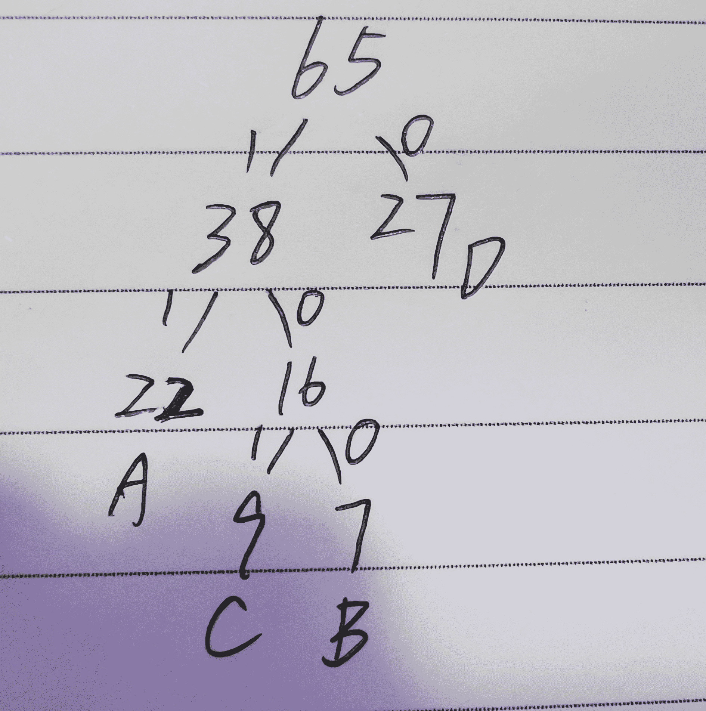
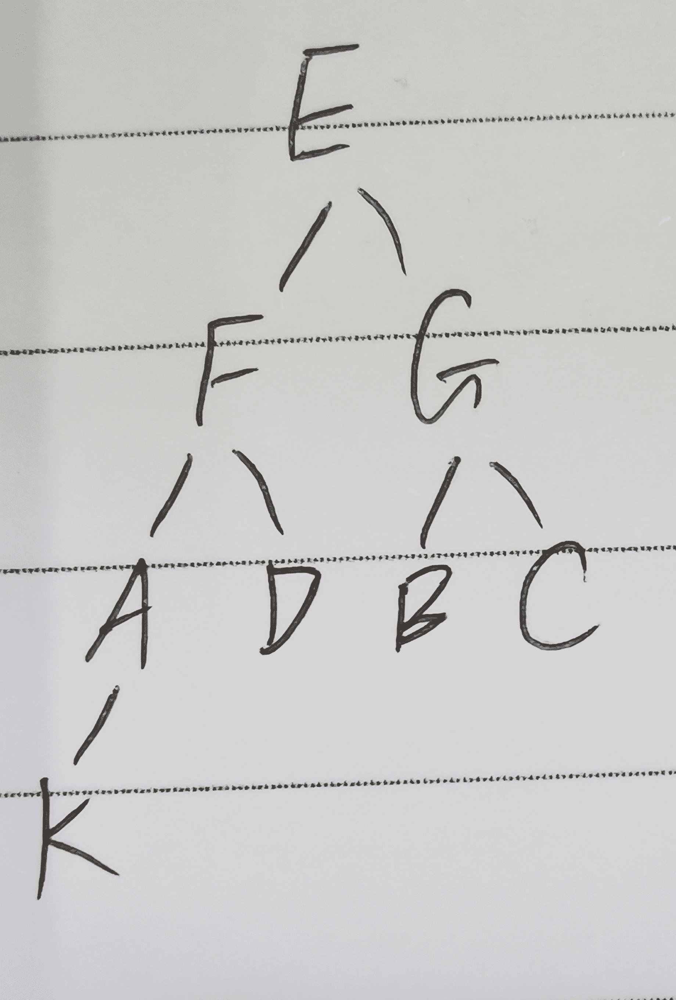

# 猿辅导 2021 校园招聘笔试（算法一）

## 1

小猿非常热爱学习，所以他在猿辅导上购买了 N 节课来提升自己，每节课有一个开始时间 S 和结束时间 E（S 和 E 均用正整数表示）。买完课程后，粗心的小猿发现这些课程之间有些时间冲突，幸好小猿有一种“一心多用”的超能力，能同时兼顾 K 节课上课。当然是 K 越大，使用这种能力就越累。请问小猿最少需要一心几用，才能上完所有他买的课程呢？

本题知识点

Java 工程师 C++工程师 PHP 工程师 golang 工程师 前端工程师 安卓工程师 iOS 工程师 算法工程师 大数据开发工程师 信息技术岗 运维工程师 安全工程师 数据分析师 数据库工程师 测试开发工程师 测试工程师 猿辅导 2021

讨论

[Wakkana](https://www.nowcoder.com/profile/988204485)

```cpp
利用 map 记录变化量 暴力不可过

#include<bits/stdc++.h>

using namespace std;
int main(){
    //freopen("in.dat", "r", stdin);
    int n; cin >> n;
    map<int,int> idx;
    for(int i = 0; i < n; i++){
        int s,e; cin >> s >> e;
        idx[s]++;
        idx[e]--;
    }
    vector<int> t;
    for(auto x:idx){
        t.push_back(x.second);
    }
    int cur = 0;
    int ans = 0;
    for(int i = 0; i < idx.size(); i++){
        cur += t[i];
        ans = max(ans,cur);
    }
    cout << ans << endl;
    return 0;

```

发表于 2021-04-06 11:45:35

* * *

[kyzheng](https://www.nowcoder.com/profile/67331839)

Python 版本，复杂度过高，供参考

```cpp
n = int(input())
a = [[] for i in range(n)]
max_cnt = 0

for i in range(n):
    a[i] = list(map(int, input().split()))

min1 = a[0][0]
max1 = a[0][1]

for i in range(n):
    min1 = min(min1, a[i][0])
    max1 = max(max1, a[i][1])

for i in range(min1, max1+1):
    cnt = 0
    for j in range(n):
        if i >= a[j][0] and i+1 <= a[j][1]:
            cnt += 1
    max_cnt = max(max_cnt, cnt)

print(max_cnt)
```

发表于 2022-03-22 09:32:28

* * *

[零葬](https://www.nowcoder.com/profile/75718849)

遍历每门课窗口的端点，遇到一个起点就增加一个窗口，遇到一个终点就减少一个窗口，这样就可以求得每个时刻窗口的增量。然后遍历每个时间点累加增量，同时求取最大的重叠窗口数。以题中所给示例为例进行算法的说明：根据题中所给的四个窗口，我们可以画出如下时间轴，时间坐标下为出现次数，正数表示窗口开始，负数表示窗口关闭。1 时刻出现了两次，分别是[1,4]和[1,2]两个窗口的开启；2 时刻出现了两次，但一次是[2,3]窗口的开启，一次是[1,2]窗口的关闭，因此合计为 0，并没有增加新的窗口；3 时刻同理；4 时刻均为关闭窗口，因此为-2。1------------2------------3------------42              0               0              -2 最后遍历每个时刻，遇到时刻 1，在这个时刻开了两个窗口，从 1~2 一直是同时开着两个窗口，从 2~3 也一样，直到最后的 4 时刻两个窗口都关闭，同时开启的窗口数量 2-2=0 回归到 0。

```cpp
import java.io.BufferedReader;
import java.io.InputStreamReader;
import java.io.IOException;
import java.util.TreeMap;

public class Main {
    public static void main(String[] args) throws IOException {
        BufferedReader br = new BufferedReader(new InputStreamReader(System.in));
        int n = Integer.parseInt(br.readLine());
        TreeMap<Integer, Integer> map = new TreeMap<>();
        for(int i = 0; i < n; i++){
            String[] params = br.readLine().split(" ");
            int start = Integer.parseInt(params[0]);
            int end = Integer.parseInt(params[1]);
            map.put(start, map.getOrDefault(start, 0) + 1);
            map.put(end, map.getOrDefault(end, 0) - 1);
        }
        int overLapCount = 0;
        int maxOverLapCount = 0;
        for(int time: map.keySet()){
            overLapCount += map.get(time);
            maxOverLapCount = Math.max(maxOverLapCount, overLapCount);
        }
        System.out.println(maxOverLapCount);
    }
}
```

发表于 2021-08-18 15:18:06

* * *

## 2

猿辅导组织一次抽奖活动，奖券的发放方式是：某个同学拿到全部的奖券，然后自己留一张，其他的分发给他周边的同学；其他同学收到奖券后，自己留一张，再分发给周边还未收到过奖券的其他同学，以此类推，直到每个同学都收到一张奖券为止。开奖时，每张奖券会得到一个奖励值，每个同学最终奖励值除了要包含自己奖券的奖励值外，还可以额外加上从经由自己发出去的奖券中选择出一部分奖券的奖励值。但是如果不选择某张奖券，那么经由持有这张没被选择奖券的同学发出去的所有奖券都不能再选了。比如 A 把 BCD 的奖券发给了 B，B 再把 CD 的奖券分发给了 CD，A 可以只选择自己的奖券，可以选择 ABCD 的奖券，也可以选择 AB 或 ABC 或 ABD 的奖券，但是不能只选择 AC 或者 AD 的奖券。奖励值当然是越大越好，大家一定也想知道最终大奖是多少，请你帮大家算一下吧。

本题知识点

Java 工程师 C++工程师 PHP 工程师 golang 工程师 前端工程师 安卓工程师 iOS 工程师 算法工程师 大数据开发工程师 信息技术岗 运维工程师 安全工程师 数据分析师 数据库工程师 测试开发工程师 测试工程师 猿辅导 2021

讨论

[牛客 624048537 号](https://www.nowcoder.com/profile/624048537)

只通过了一半的测试用例，一个需要注意的地方是并不一定是第二行的 B 为 0

```cpp
#include<iostream>
#include<unordered_map>
#include<vector>
using namespace std;
int m;
unordered_map<int,vector<int>>mp;
int dfs(vector<int>& value,int i){
    int result=value[i-2]%1000000003;
    for(auto p:mp[i]){
        int res=dfs(value,p)%1000000003;
       // cout<<res<<endl;
        result=max(result,result%1000000003+res)%1000000003;
    }
    m=max(m,result)%1000000003;
    return result;
}
int main(){
    int n;
    cin>>n;
    vector<int>value(n);
    int num;
    vector<int>f;
    for(int i=2;i<n+2;++i){
        cin>>value[i-2]>>num;
        if(num==0)
            f.push_back(i);
        mp[num].push_back(i);
        //cout<<value[i-2]<<" ";
    }
    m=value[0];
    for(int i=0;i<f.size();++i)
    dfs(value,f[i]);
    cout<<m<<endl;
    return 0;

}
```

发表于 2021-07-31 16:59:12

* * *

[励志要变胖的人](https://www.nowcoder.com/profile/230127193)

解法 1：拓扑排序，抽象为有向图，收到奖券的同学指向分发给他奖券的同学，也就是从底向上去计算

```cpp
#include<bits/stdc++.h>
using namespace std;
#define ll long long
int main(){
    int n;
    cin>>n;
    vector<vector<ll>> e(n);
    vector<ll> money(n);
    vector<int> r(n,0);
    ll ans=0;
    for(int i=0;i<n;i++){
        ll x,y;
        cin>>x>>y;
        money[i]=x;
        ans=max(ans,money[i]);
        if(y!=0){
            e[i].push_back(y-2);
            r[y-2]++;
        }
    }
    queue<int> q;
    for(int i=0;i<n;i++){
        if(r[i]==0)
            q.push(i);
    }
    while(!q.empty()){
        int t=q.front();
        q.pop();
        //cout<<t<<" "<<money[t]<<endl;
        for(int i=0;i<e[t].size();i++){
            if(money[t]>0){
                money[e[t][i]]+=money[t];
                //money[e[t][i]]%=1000000003;
                ans=max(ans, money[e[t][i]]);
            }
            r[e[t][i]]--;
            if(r[e[t][i]]==0)
                q.push(e[t][i]);
        }
    }
    cout<<ans%1000000003;
}
```

发表于 2021-04-03 17:25:45

* * *

## 3

小猿参加了猿辅导的编程培训课程，课后老师给大家留了作业，要求写一个简化版的模版解析器。需要具备的功能是：给一个模版字符串注入数据，输出模版解析后的字符串，保证了模版中的变量一定存在于注入的对象数据中。

注入的数据是一个对象，表现形式是{key1: value2，key2: value2, key3: value3}, key 是一个字符串，value 可以是对象、布尔值、字符串和包含相同元素的数组，【key：value】对数为正整数。

模版字符串由一系列标签元素和普通元素组成，标签元素的形态是：<标签名字 aaa=“vvv” bbb="ttt" ccc="ppp">xxxxx</标签名字>，其中标签名字是一个由小写字母组成的长度大于等于 1 的字符串，比如示例模版中的 div、button、ul、li 等，并且成对出现，比如<div>和</div>、<button>和</button>。标签元素上有 0 个或多个属性，诸如 aaa、bbb、ccc，每个属性都有一个取值, 属性可以是下述解析规则 1 和 2。xxxxx 是该标签元素的内容，可以是标签元素、也可以是普通元素。普通元素是一个常量或下述解析规则的动态值，常量是字符串、数字、空格、换行符和可视化的符号。

解析规则如下：

1.解析指令 【y-if="{{xxx}}"】，根据双大括号中变量值判断当前标签元素是否存在，取值范围如下：   -- true，类型 boolean，保留标签元素及其子元素；   -- false，类型 boolean，移除标签元素及其子元素；   -- undefined，表达式 xxx 对应的变量不存在，移除标签元素及其子元素；2.解析指令 【y-for="xxx, yyy in zzz"】，对当前标签元素做 for 循环输出，每个输出元素用换行符‘\n’分隔。指令的值域格式，如示例中的 lesson, index in list, 其中，变量 list 是一个数组，可以在注入的数据中找到，数组中的每个元素类型一致。变量 index 表示数组的索引，变量 lesson 表示这个数组中对应索引 index 的元素，二者顺序固定。数组索引和元素的变量名（index 和 lesson）可以是一个任意的由小写字母组成的长度大于等于 1 的字符串。注：y-for 和 y-if 不会同时出现在一个标签中。
3.注入动态值 {{xxx.yyy}}，双括号表示获取注入数据中的变量值，xxx.yyy 是注入数据 data 的 xxx 属性对应的对象的 yyy 属性的值，该变量值是一个 string，比如示例中的{{lesson.teacher}}，输出 lesson 对象的 teacher 属性的值。如果注入的变量值不存在，则输出空字符串。4.删除注释所在的一行，注释以<!--开头、以-->结尾，独占一行，如示例中的<!-- 卡片区域 -->。
5.除了注释以外，标签元素、解析指令 y-if、解析指令 y-for 都存在嵌套的情况。

本题知识点

Java 工程师 C++工程师 PHP 工程师 golang 工程师 前端工程师 安卓工程师 iOS 工程师 算法工程师 大数据开发工程师 信息技术岗 运维工程师 安全工程师 数据分析师 数据库工程师 测试开发工程师 测试工程师 猿辅导 2021

## 4

下列模型属于生成模型的是（ ）

正确答案: D   你的答案: 空 (错误)

```cpp
SVM
```

```cpp
逻辑回归
```

```cpp
CRF
```

```cpp
HMM
```

本题知识点

算法工程师 猿辅导 2021

讨论

[狐七寳](https://www.nowcoder.com/profile/1393150)

[概率生成模型，简称生成模型（Generative Model），是概率统计和](https://baike.baidu.com/item/%E6%9C%B4%E7%B4%A0%E8%B4%9D%E5%8F%B6%E6%96%AF%E5%88%86%E7%B1%BB%E5%99%A8/22657525)[机器学习](https://baike.baidu.com/item/%E6%9C%BA%E5%99%A8%E5%AD%A6%E4%B9%A0/217599)中的一类重要模型，指一系列用于随机生成可观测数据的模型。包括：高斯混合模型（Gaussian Mixture Model），隐马尔可夫模型，朴素贝叶斯分类器

发表于 2021-04-17 22:41:32

* * *

## 5

已知：某日是否有雨只和前一日是否有雨相关；昨日有雨，则今日有雨的概率是 0.7；昨日无雨，则今日有雨的概率是 0.5。如果周一有雨，则周三有雨的概率是：（）

正确答案: B   你的答案: 空 (错误)

```cpp
0.5
```

```cpp
0.64
```

```cpp
0.72
```

```cpp
0.81
```

本题知识点

算法工程师 猿辅导 2021

讨论

[零葬](https://www.nowcoder.com/profile/75718849)

分为周二下雨与不下雨两种情况：周一下雨，周二下雨的概率为 0.7，周二下雨，周三下雨的概率为 0.7，于是 0.7*0.7=0.49 周一下雨，周二不下雨的概率为 1-0.7=0.3，周二不下雨，周三下雨的概率为 0.5，于是 0.3*0.5=0.15 综上，周一下雨，周三也下雨的概率为 0.49+0.15=0.64

发表于 2021-08-18 16:48:23

* * *

## 6

已知字符 A、B、C、D 的使用频率分别为 22、7、9、27。下列编码属于 HUFFMAN 编码的是（）

正确答案: C   你的答案: 空 (错误)

```cpp
A（001）B（100）C（110）D（0）
```

```cpp
A（100）B（101）C（0）D（11）
```

```cpp
A（11） B（100）C（101）D（0）
```

```cpp
A（100）B（1011）C（11）D（0）
```

本题知识点

算法工程师 猿辅导 2021

讨论

[零葬](https://www.nowcoder.com/profile/75718849)

一种可能的编码方式为
此时 A 的编码为 11，B 的编码为 100，C 的编码为 101，D 的编码为 0

发表于 2021-08-18 16:35:04

* * *

## 7

有一个箱子和 N 把钥匙，只有一把钥匙能打开箱子。依次拿钥匙去开箱子，问恰好第 k 把钥匙打开箱子的概率是（ ）

正确答案: B   你的答案: 空 (错误)

本题知识点

算法工程师 猿辅导 2021

讨论

[零葬](https://www.nowcoder.com/profile/75718849)

第 1 把钥匙能打开的概率为 1/n 第 2 把钥匙能打开的概率为(1-1/n)*1/(n-1)=1/n 第 3 把钥匙能打开的概率为(1-1/n)*(1-1/(n-1))*1/(n-2)=1/n……以此类推，第 k 把钥匙恰能打开的概率还是 1/n

发表于 2021-08-18 16:42:37

* * *

## 8

两个人轮流抛硬币，规定第一个抛出正面的人可以吃到苹果。请问先抛的人吃到苹果的概率是（）

正确答案: B   你的答案: 空 (错误)

本题知识点

算法工程师 猿辅导 2021

讨论

[零葬](https://www.nowcoder.com/profile/75718849)

第一轮： 1/2 (1 直接抛出正面)
第二轮： 1/2 *  1/2 * 1/2   (1 抛出反面 *  2 抛出反面  * 1 抛出正面)第三轮： 1/2 * 1/2 * 1/2 * 1/2 * 1/2 (1 抛出反面 * 2 抛出反面 * 1 抛出反面 * 2 抛出反面  * 1 抛出正面)……以此类推，这是个公比为 1/4 的等比数列，轮数趋于无穷时就是个首项为 1/2 的等比级数，根据等比级数的公式，和为 a1/(1-q)=1/2/(1-1/4)=2/3

编辑于 2021-08-18 17:02:57

* * *

[狐七寳](https://www.nowcoder.com/profile/1393150)

A 先，B 后

P(A) = 1/2 +      //A 直接取胜 
       1/2 * 1/2 * 1/2 +      // A1 失败 B1 失败 A2 取胜
       1/2 * 1/2 * 1/2 * 1/2 *1/2  +    //A1 失败 B1 失败 A2 失败 B2 失败 A3 取胜
#######################
p = 1/2 + (1/2)³ + (1/2)⁵ + (1/2)⁷ + ...
等比数列求和
p = 1/2 * (1 - (1/4)^n) / (1 - 1/4) = 2/3 取极限的情况下得到的值/////////////////////////////////////////////////////////////////////////////////////////////////////////////////////////////////////////////////////P(B） = 1/2 * 1/2 +     // A1 失败 B1 取胜
        1/2 * 1/2 * 1/2 * 1/2 +     // A1 失败 B1 失败 A2 失败 B2 取胜
        1/2 * 1/2 * 1/2 * 1/2 * 1/2 * 1/2 +  //A1 失败 B1 失败 A2 失败 B2 失败 A3 失败 B3 取胜、
#######################
p = (1/2)² + (1/2)⁴ + (1/2)⁶ + ..

p = 1/4 * (1 - (1/4)^n) / (1 - 1/4)

发表于 2021-04-17 22:52:30

* * *

[Last 丶🐖tt🐖丶嘉然乐](https://www.nowcoder.com/profile/482713925)

等比数列求和罢了。

第一次要吃到苹果的概率是
第二次则是，因为第一次没吃到，且下一轮的那个人也没吃到，这两个事件同时发生的概率是。
最后求首项为 0.5，公比为 0.25 的数列和就行，最后取个极限就是 C 了

发表于 2021-04-09 17:35:33

* * *

## 9

关于如何防止模型过拟合，下列做法错误的是（）

正确答案: D   你的答案: 空 (错误)

```cpp
增加训练集的数据量
```

```cpp
使用 dropout
```

```cpp
使用 weightNoise
```

```cpp
增加训练迭代的次数
```

本题知识点

算法工程师 猿辅导 2021

## 10

一个无向图中包含 10 个顶点，其中 4 个顶点的度为 2，4 个顶点的度为 3，2 个顶点的度为 4，请问这个图有（）条边。

正确答案: A   你的答案: 空 (错误)

```cpp
14
```

```cpp
16
```

```cpp
18
```

```cpp
28
```

本题知识点

算法工程师 猿辅导 2021

讨论

[零葬](https://www.nowcoder.com/profile/75718849)

无向图总度数为边数的两倍，由题可知，总度数为 2*4+3*4+2*4=28，因此总共有边 14 条

发表于 2021-08-18 16:21:49

* * *

[Aecu.py](https://www.nowcoder.com/profile/180312177)

4*2+4*3+2*4 = 28 / 每边重复两次   28/2

发表于 2021-04-19 19:32:36

* * *

## 11

 四个男生和两个女生排成一队，两个女生必须站在一起，且不能站在最边上，那么共有（ ）种排列方法？

正确答案: D   你的答案: 空 (错误)

```cpp
72
```

```cpp
36
```

```cpp
96
```

```cpp
144
```

本题知识点

算法工程师 猿辅导 2021

讨论

[零葬](https://www.nowcoder.com/profile/75718849)

两个女生先用捆绑法绑在一起，有 A²[2]种排列，她两不能站在边上，所以要从 4 个男生中选出两个排在边上，一共有 A²[4]种排列，最终剩下的两个男生和两个捆绑在一起的女生形成 3 个整体进行全排列，有 A³[3]种排列。总共有排列数 A²[2]*A²[4]*A³[3]=144 种。

发表于 2021-08-18 16:19:05

* * *

[Last 丶🐖tt🐖丶嘉然乐](https://www.nowcoder.com/profile/482713925)

简单隔板法，把女生当成一个整体，然后在男生中当隔板就行。注意男生和女生的站位也要用 Axx 求一下

发表于 2021-04-09 17:37:32

* * *

## 12

给定数据集 X=[x1,x2,x3,x4,x5],label Y=[0,1,1,0,1]。把 X 输入到模型 M 进行二分类预测，预测结果为 P=[1,0,0,0,1], 模型 M 在 label=1 的标签上的召回率和精度分别为（）

正确答案: A   你的答案: 空 (错误)

本题知识点

算法工程师 猿辅导 2021

讨论

[零葬](https://www.nowcoder.com/profile/75718849)

不用想那么多公式，直观点理解 precision 和 recall 预测了 2 个正样本，对了 1 个，所以 precision=1/2 一共 3 个正样本，找出了一个（即召回了一个），所以 recall=1/3

发表于 2021-08-18 16:45:16

* * *

[狐七寳](https://www.nowcoder.com/profile/1393150)

召回率是针对我们原来的样本而言的，它表示的是样本中的正例有多少被预测正确了。那也有两种可能，一种是把原来的正类预测成正类(TP)，另一种就是把原来的正类预测为负类(FN)     p=TP/(TP+FN)

发表于 2021-04-17 22:54:13

* * *

## 13

树的高度是指根到叶子节点的最长路径的边数(根的高度为 0)。一个二叉树的中序遍历序列为 KAFDEBGC，前序遍历序列为 EFAKDGBC，则该二叉树的高度为 （  ）

正确答案: B   你的答案: 空 (错误)

```cpp
2
```

```cpp
3
```

```cpp
4
```

```cpp
5
```

本题知识点

算法工程师 猿辅导 2021

讨论

[零葬](https://www.nowcoder.com/profile/75718849)

重构后的二叉树如下
高度为 3

发表于 2021-08-18 16:28:25

* * *

## 14

以下说法中正确的是

正确答案: B   你的答案: 空 (错误)

```cpp
相比于 L1 正则，L2 正则会使更多的参数值为 0
```

```cpp
softmax(X+c)的结果与 softmax(X)的结果一致(其中 X 是向量，c 是常量)
```

```cpp
Boosting 和 Bagging 都是组合多个分类器投票的方法,二者都是根据单个分类器的正确率决定其权重
```

```cpp
给定 n 个数据点,如果其中一半用于训练,一半用于测试,则训练误差和测试误差之间的差别会随着 n 的增加而增加
```

本题知识点

算法工程师 猿辅导 2021

讨论

[零葬](https://www.nowcoder.com/profile/75718849)

向量中每个元素加上同一个常数后并不影响最大值，因此不会改变 softmax 的结果

发表于 2021-08-18 16:56:11

* * *

[就是这个光](https://www.nowcoder.com/profile/910692584)

虽然用过 softmax，但还真没发现向量加常数实际上最终结果不变，涨知识了。

发表于 2021-07-10 12:53:24

* * *

## 15

下面哪一个不是行列式的特征值（）：

正确答案: B   你的答案: 空 (错误)

```cpp
-1
```

```cpp
1
```

```cpp
2
```

```cpp
8
```

本题知识点

算法工程师 猿辅导 2021

讨论

[零葬](https://www.nowcoder.com/profile/75718849)

这个题咋说呢，行列式哪来的特征值？当然是矩阵的特征值记题中的矩阵为 A，则有 Ax=λx，于是得到方程组(A-λE)x=0，因此有行列式|A-λE|=0，得(2-λ)(1+λ)(8-λ)=0，3 个特征值分别为-1，2，8

编辑于 2021-08-18 17:05:35

* * *

[nlp_rookie](https://www.nowcoder.com/profile/2361170)

矩阵特征值求解 相当于 其中为单位矩阵，进而,所以将选项中的值代入矩阵特征求解，值不为 0 即为答案

发表于 2021-08-15 20:24:04

* * *