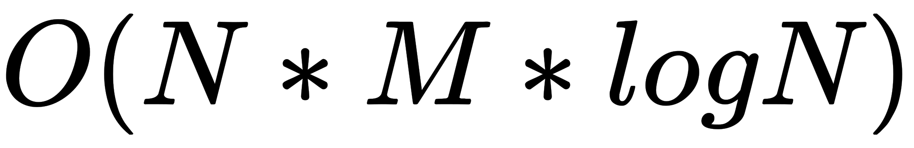
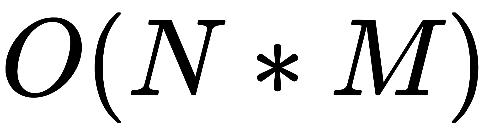
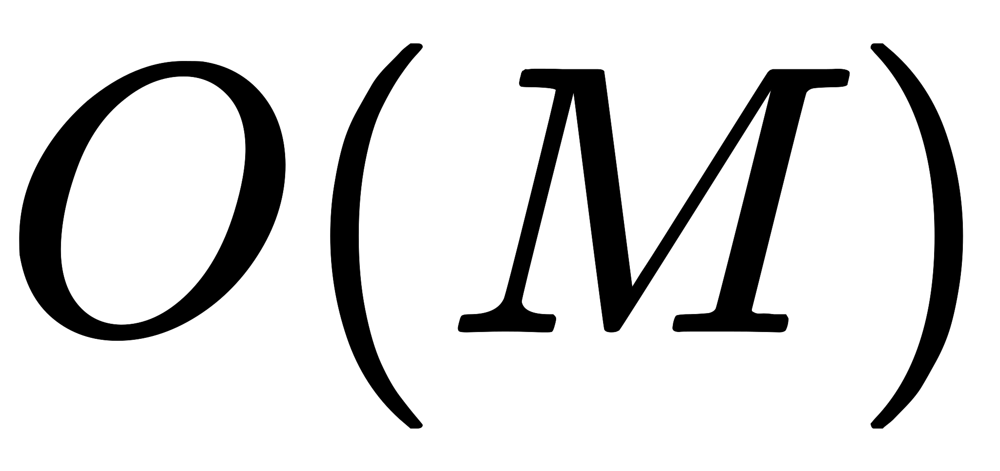
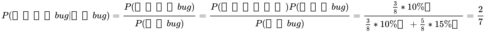
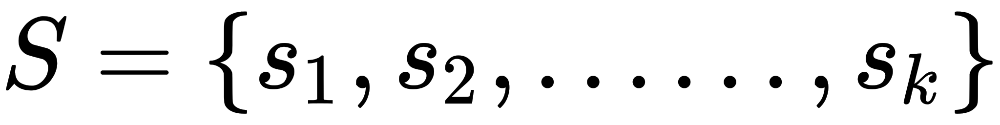
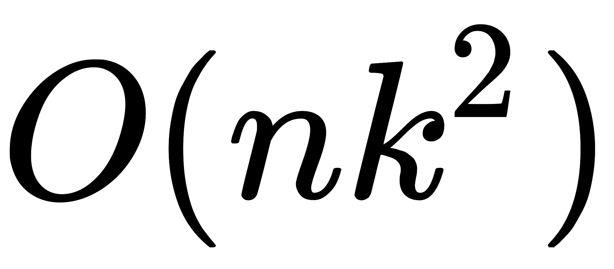
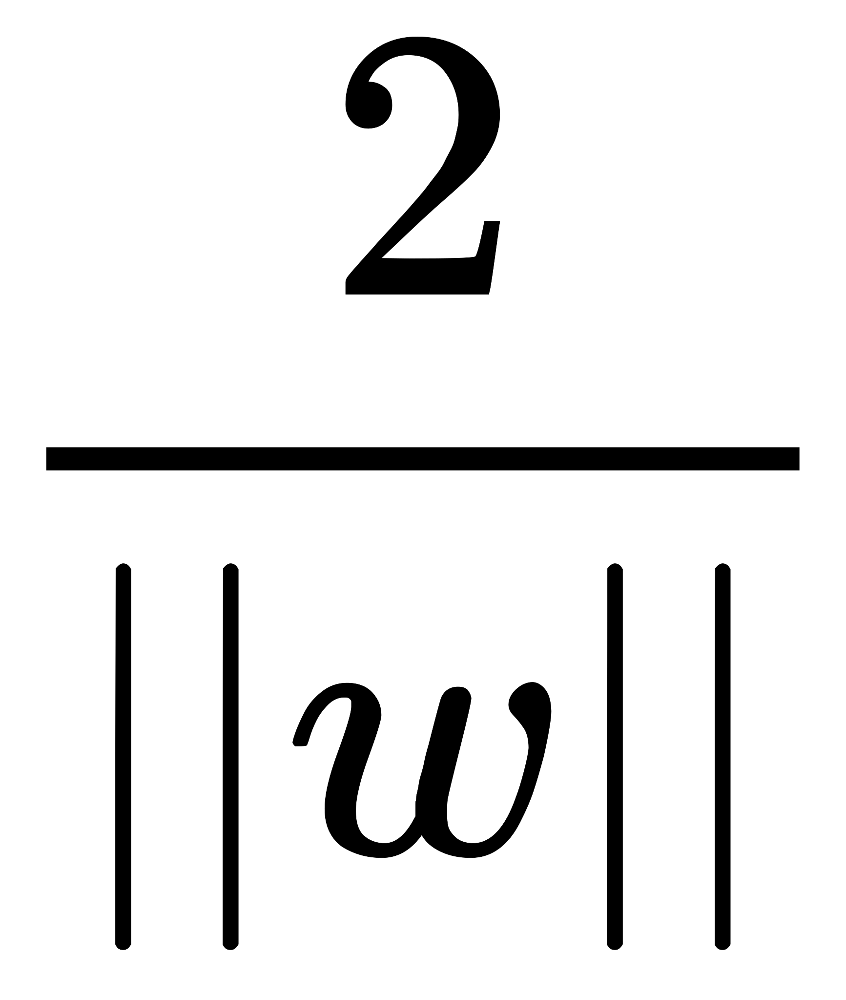

# 猿辅导 2021 校园招聘笔试（算法二）

## 1

用全部 N(N<=10)个 0-9 的数字组成一个“有效”整数（即没有前置 0 的整数），求这些组成的数中能被 K(0<K<10¹⁰)整除的最小数字。

本题知识点

算法工程师 猿辅导 2021

讨论

[零葬](https://www.nowcoder.com/profile/75718849)

回溯法求解，为了得到的数最小，要先对候选的 n 个数进行升序排列，从而保证从小的数进行尝试。注意：为了将前导 0 排除掉，我们需要考虑几点：(1) n 不为 1，否则一个 0 其实也是个有效的数；(2) 当前数 nums[i]为 0 时，需要保证之前没有累加过任何数，这样 nums[i]才是前导 0，否则高位已经有数了，nums[i]=0 是个中间位，不能忽略。

```cpp
import java.io.BufferedReader;
import java.io.InputStreamReader;
import java.io.IOException;
import java.util.Arrays;

public class Main {
    public static int n;
    public static long k;
    public static int[] nums;

    public static void main(String[] args) throws IOException {
        BufferedReader br = new BufferedReader(new InputStreamReader(System.in));
        String[] params = br.readLine().split(" ");
        n = Integer.parseInt(params[0]);
        k = Long.parseLong(params[1]);
        params = br.readLine().split(" ");
        nums = new int[n];
        for(int i = 0; i < n; i++) nums[i] = Integer.parseInt(params[i]);
        Arrays.sort(nums);
        boolean[] used = new boolean[n];
        System.out.println(dfs(used, 0, 0L));
    }

    public static long dfs(boolean[] used, int depth, long num) {
        if(depth == n)
            return num % k == 0? num: -1;
        for(int i = 0; i < n; i++) {
            // 数字用过，跳过
            if(used[i] == true) continue;
            // 前导 0 跳过
            if(n != 1 && num == 0 && nums[i] == 0) continue;
            used[i] = true;
            long res = dfs(used, depth + 1, num * 10 + nums[i]);
            used[i] = false;
            // 有一个满足就马上返回，保证最小
            if(res != -1) return res;
        }
        return -1;
    }
}
```

编辑于 2021-08-15 21:19:36

* * *

[和兆姜](https://www.nowcoder.com/profile/490704707)

```cpp
#include <iostream>
#include <vector>
#include <algorithm>
using namespace std;

typedef long long ll;
ll n, k;
vector<int> nums;
vector<bool> vis;

ll dfs(int use, ll num) {
    if (use == n) {
        if (num % k == 0) return num;
        else return -1;
    }
    for (int i = 0; i < n; i++) {
        if (vis[i] == true) continue;
        if (n != 1 && num == 0 && nums[i] == 0) continue;
        vis[i] = true;
        ll res = dfs(use + 1, num * 10 + nums[i]);
        vis[i] = false;
        if (res != -1) return res;
    }
    return -1;
}

void solve() {
    cin >> n >> k;
    nums.assign(n, 0);
    vis.assign(n, false);
    for (auto& num : nums) cin >> num;
    sort(nums.begin(), nums.end());
    ll res = dfs(0, 0);
    cout << res << endl;
}

int main() {
    int n = 1;
    // cin >> n
    while(n--) solve();
    return 0;
}
```

发表于 2021-04-11 17:35:24

* * *

[莫里 Mori](https://www.nowcoder.com/profile/650072188)

今天刷到这题，因为 N <= 10 所有可以 DFS 解决，注意 0<k<=10¹⁰，所以 k 要开 long。

```cpp
import java.util.*;

public class Main{
    static int N = 15;
    static boolean[] st = new boolean[N];
    static int[] nums = new int[N];
    static int n;
    static long ans = -1, k;
    public static boolean dfs(int u, long path){
        if(u == n){
            if(path % k == 0){
                ans = path;
                return true;
            }
            return false;
        }
        for(int i = 0; i < n; i ++){
            if(st[i]){
                continue;
            }
            if(u == 0 && n != 1 && nums[i] == 0){
                continue;
            }
            st[i] = true;
            boolean flag = dfs(u + 1, path * 10 + nums[i]);
            st[i] = false;
            if(flag){
                return true;
            }
        }
        return false;
    }
    public static void main(String[] args){
        Scanner sc = new Scanner(System.in);
        n = sc.nextInt();
        k = sc.nextLong();
        for(int i = 0; i < n; i ++){
            nums[i] = sc.nextInt();
        }
        Arrays.sort(nums, 0, n);
        dfs(0, 0);
        System.out.println(ans);
    }
}
```

发表于 2021-06-23 09:24:18

* * *

## 2

小猿在加载一个网页，这个网页共需要 N 个相关资源，这些资源之间有一些依赖关系。如果这些资源中存在**循环依赖**，我们认为这个网页不能加载成功，否则可以加载成功。存在循环依赖是指，这些资源中存在资源 X，X 依赖的资源 Y 直接或间接依赖于 X。你能帮助小猿判断一下这个网页能否加载成功吗？

本题知识点

算法工程师 猿辅导 2021

讨论

[零葬](https://www.nowcoder.com/profile/75718849)

利用节点的度判断图中是否有环

```cpp
import java.util.*;
import java.io.BufferedReader;
import java.io.InputStreamReader;
import java.io.IOException;

public class Main {
    public static void main(String[] args) throws IOException {
        BufferedReader br = new BufferedReader(new InputStreamReader(System.in));
        int T = Integer.parseInt(br.readLine());
        while(T-- > 0){
            // 构建邻接矩阵
            int n = Integer.parseInt(br.readLine());
            int[][] graph = new int[n][n];
            for(int i = 0; i < n; i++){
                String[] row = br.readLine().split(" ");
                for(int j = 0; j < row.length; j++)
                    graph[i][j] = Integer.parseInt(row[j]);
            }
            // 判断是否是有向无环图
            System.out.println(isDag(graph)? 1: 0);
        }
    }

    public static boolean isDag(int[][] graph) {
        int nodeNum = graph.length;
        // 记录每个有入度的节点，及其所有的前序节点
        Map<Integer, List<Integer>> inEdge = new HashMap<>(nodeNum);
        // 记录每个节点的出度个数
        int[] outEdgeNum = new int[nodeNum];
        // 初始化数据
        for(int i = 0; i < nodeNum; i++){
            for(int j = 0; j < nodeNum; j++){
                if(graph[i][j] != 0){
                    outEdgeNum[i]++;
                    if(inEdge.get(j) == null){
                        List<Integer> list = new ArrayList<>();
                        list.add(i);
                        inEdge.put(j, list);
                    }else
                        inEdge.get(j).add(i);
                }
            }
        }
        // 已访问的节点
        Set<Integer> visitedSet = new HashSet<>(nodeNum);
        // 循环遍历所有节点的出度
        while(visitedSet.size() < nodeNum){
            for(int i = 0; i < nodeNum; i++){
                if(outEdgeNum[i] == 0 && !visitedSet.contains(i)){
                    visitedSet.add(i);
                    for(int temp = 0; inEdge.get(i) != null && temp < inEdge.get(i).size(); temp++)
                        outEdgeNum[inEdge.get(i).get(temp)]--;
                    break;
                }
                // 节点遍历一遍后，判断是否访问了过所有节点
                if((i == nodeNum - 1) && visitedSet.size() != nodeNum)
                    return true;
            }
        }
        return false;
    }
}

```

发表于 2021-08-15 21:11:31

* * *

[有一个地方.](https://www.nowcoder.com/profile/559851324)

依赖关系可以构成一个有向图。检查其中是否存在环

```cpp
T = int(input())
from collections import deque
def help(arr):
    N = len(arr)
    adj = [[] for _ in range(N)]
    degree = [0] * N
    for i in range(N):
        for j in range(N):
            if arr[i][j]:
                degree[i] += 1
                adj[j].append(i)
    queue = deque()
    for i in range(N):
        if not degree[i]:
            queue.append(i)
    while queue:
        node = queue.popleft()
        for x in adj[node]:
            degree[x] -= 1
            if degree[x] == 0:
                queue.append(x)
    if sum(degree) == 0:
        return 1
    else:
        return 0
for _ in range(T):
    N = int(input())
    arr = []
    for i in range(N):
        arr.append(list(map(int, input().split())))
        print(help(arr))
```

发表于 2021-07-26 21:33:08

* * *

[imcl](https://www.nowcoder.com/profile/1941942)

思路： 深度优先搜索（dfs），以每个资源为起始点进行 dfs。（对已出现的资源可以跳过

```cpp
def dfs(arr, visit, idx, ht):
    if sum(arr[idx]) == 0:
        return False 
    #print(ht)
    ht[idx] = 1
    for i in range(len(arr[idx])):
        if arr[idx][i] == 1:
            if ht[i] == 1: #already visit => loop 
                return True 
            else:
                ht[i] = 1 
                visit[i] = 1 
                if dfs(arr, visit, i, ht):
                    return True 
                ht[i] = 0 
    ht[idx] = 0
    return False 

T = input() 
while T > 0:
    N = input()
    arr = []
    while N > 0:
        arr.append(map(int, raw_input().strip().split(' ')))
        N -= 1 
    visit = [0] * len(arr) 
    ht = [0] * len(arr) 
    flag = 0
    for i in range(len(arr)):
        if visit[i] == 0:
            if dfs(arr, visit, i, ht):
                print(1)
                flag = 1
                break 
    if flag == 0:
        print(0)
    T-= 1

```

）dfs： 终止条件 1: 全为 0； 单层操作： 判断当前资源是否已经出现，已出现，则表示有环，未出现，则继续。

发表于 2021-07-06 11:43:17

* * *

## 3

将 N 条长度均为 M 的有序链表进行合并，合并后的链表也保持有序，时间复杂度为( )

正确答案: A   你的答案: 空 (错误)

```cpp

```

```cpp

```

```cpp

```

本题知识点

算法工程师 猿辅导 2021

讨论

[禁止你发言](https://www.nowcoder.com/profile/170708016)

1\. 在每一个链表中取出第一个值，然后把它们放在一个大小为 N 的数组里，然后把这个数组当成 heap 建成小(大)根堆。此步骤的时间复杂度为 O(N)：N 个数构建一个堆的复杂度是 O(N)

2\. 取出堆中的最小值(也是数组的第一个值), 然后把该最小值所处的链表的下一个值放在数组的第一个位置。如果链表中有一个已经为空（元素已经都被取出），则改变 heap 的大小。此步骤的时间复杂度为 O(lg N)。

3\. 不断的重复步骤二，直到所有的链表都为空。

建堆只建一次，复杂度为 O(N)；调整堆 MN-1 次（构建的时候抽走了根结点，剩下的数目是 MN-1 个数），复杂度为(MN-1)*O(lg N)。

4.复杂度是 O(N)+(MN-1)*O(lg N)，所以复杂度为 O(MN*lg N)

在堆排序中也是一样的，总共 n 个数，需要得到 n 个有序的数，那么构建堆需要 O(n)，重建堆需要（n-1)*O(lgn)，所以总共复杂度 O(nlgn)；如果我只需要前面 k 个数有序的，那么重构堆需要 k*O(lgn)，那么总共复杂度就是 O(klgn)

原文链接：[`blog.csdn.net/zz2230633069/article/details/103298915`](https://blog.csdn.net/zz2230633069/article/details/103298915)

发表于 2021-04-08 21:50:11

* * *

## 4

按照二叉树的定义，不考虑节点值，仅考虑树结构情况下，4 个节点的二叉树有多少种？

正确答案: B   你的答案: 空 (错误)

```cpp
12
```

```cpp
14
```

```cpp
21
```

```cpp
24
```

本题知识点

算法工程师 猿辅导 2021

讨论

[Eoogle](https://www.nowcoder.com/profile/873342302)

卡特兰数 c (n, 2n) / (n + 1)

发表于 2021-07-27 11:39:15

* * *

[零葬](https://www.nowcoder.com/profile/75718849)

看到这种二叉树结构还有排队找零的题就是考卡特兰数

发表于 2021-08-15 21:09:03

* * *

## 5

每天 9 点到 10 点，小明和小红在同一个车站乘坐公交车上班。小明坐 101 路公交车，每 5 分钟一班{9:00, 9:05, 9:10, …}；小红坐 102 路公交车，每 10 分钟一班{9:00, 9:10, 9:20, …}，问小明和小红每天相遇的概率是多少？

正确答案: A   你的答案: 空 (错误)

```cpp
1/8
```

```cpp
11/360
```

```cpp
1/12
```

```cpp
1/36
```

本题知识点

算法工程师 猿辅导 2021

讨论

[黑白相间](https://www.nowcoder.com/profile/222788347)

这个方式：((1/12 * 1/12)+(1/12 * 1/6))*6。两个人做的不是同一个车，小红分为 6 段的话，小红段时间初始到可以偶遇小明两车次

发表于 2021-04-09 13:59:41

* * *

[牛客 756295169 号](https://www.nowcoder.com/profile/756295169)

假设两人到达站台的时间在 9-10 点之间均匀分布。P(相遇) = 1-P(不相遇)             = 1- P(小明到的时候小红已经走了) - P(小红到的时候小明已经走了)
             = 1- [P(小红 9：10 走，小明 9：10 后到)+P(小红 9：20 走，小明 9：20 后到)+...+P(小红 9：50 走，小明 9：50 后到)] - [P(小明 9：05 走，小红 9：05 后到)+P(小明 9：10 走，小红 9：10 后到)+...+P(小明 9：15 走，小红 9：15 后到)]              = 1-[1/6*5/6+1/6*4/6+...+1/6*1/6] - [1/12*11/12+1/12*10/12+...+1/12*1/12]
            = 1-10/24-11/24
            =1/8

发表于 2021-06-11 14:38:20

* * *

[牛 Coding](https://www.nowcoder.com/profile/753880715)

为啥不是 1/12 啊

发表于 2021-04-08 16:10:21

* * *

## 6

小明和小红结对编程完成了一个项目。在整个项目中，他们贡献的代码比例是 3:5。据往常的统计，小明的 bug 率为 10‰ ，小红的 bug 率为 15‰ 。今天小猿在项目中发现了一个 bug，那么该 bug 是小明编写的概率为多少？

正确答案: A   你的答案: 空 (错误)

```cpp
28.6%
```

```cpp
37.5%
```

```cpp
40.0%
```

```cpp
52.6%
```

本题知识点

算法工程师 猿辅导 2021

讨论

[零葬](https://www.nowcoder.com/profile/75718849)

已知：P(小明编程) = 3/8P(小红编程) = 5/8P(有 bug|小明编程) = 0.1P(有 bug|小红编程) = 0.15 于是根据贝叶斯公式：P(小明编程|有 bug)=P(有 bug|小明编程)*P(小明编程)/(P(有 bug|小明编程)*P(小明编程)+P(有 bug|小红编程)*P(小红编程))=0.2857

发表于 2021-08-17 19:04:15

* * *

[牛客 756295169 号](https://www.nowcoder.com/profile/756295169)

P()

发表于 2021-06-11 14:50:30

* * *

## 7

小明来猿辅导参加现场面试，他选择地铁、骑自行车、骑电动车三种交通工具方式的概率分别为 0.3，0.2，0.5，从各个交通工具迟到的概率分别为 0.3，0.1，0.15。下列说法正确的是()

正确答案: D   你的答案: 空 (错误)

```cpp
如果他迟到，坐地铁来的概率为 0.5。
```

```cpp
如果他迟到，骑自行车的概率为 0.1。
```

```cpp
如果他准时到，坐地铁或骑自行车的概率等于骑电动车来的概率。
```

```cpp
如果他准时到，骑电动车的概率大于等于 0.5。
```

本题知识点

算法工程师 猿辅导 2021

讨论

[零葬](https://www.nowcoder.com/profile/75718849)

已知：P(地铁)=0.3，P(迟到|地铁)=0.3P(自行车)=0.2，P(迟到|自行车)=0.1P(电动车)=0.5，P(迟到|电动车)=0.15 于是根据贝叶斯公式：A 选项错误 P(地铁|迟到) = P(迟到|地铁)P(地铁)/(P(迟到|地铁)*P(地铁)+P(迟到|自行车)*P(自行车)+P(迟到|电动车)*P(电动车))=0.4864B.选项错误 P(自行车|迟到) = P(迟到|自行车)P(自行车)/(P(迟到|地铁)*P(地铁)+P(迟到|自行车)*P(自行车)+P(迟到|电动车)*P(电动车))=0.0022C 选项错误 P(准时到|交通工具)=1-P(迟到|交通工具)P(准时到|地铁或自行车)=(P(准时到|自行车)P(自行车)+P(准时到|地铁)P(地铁))/(P(准时到|地铁)*P(地铁)+P(准时|自行车)*P(自行车)+P(准时|电动车)*P(电动车))=0.4785P(准时到|电动车)=P(准时到|电动车)P(电动车)/(P(准时到|地铁)*P(地铁)+P(准时|自行车)*P(自行车)+P(准时|电动车)*P(电动车))=0.5215D 选项由 C 可知正确

编辑于 2021-08-17 19:04:44

* * *

[Eoogle](https://www.nowcoder.com/profile/873342302)

贝叶斯公式

发表于 2021-07-27 17:24:26

* * *

## 8

有 5 本不同的书，其中语文书 2 本，数学书 2 本，英语书 1 本，将它们随机地摆放到书架上，则同一科目的书都不相邻的概率为（）

正确答案: B   你的答案: 空 (错误)

```cpp
1/5
```

```cpp
2/5
```

```cpp
3/5
```

```cpp
4/5
```

本题知识点

算法工程师 猿辅导 2021

讨论

[零葬](https://www.nowcoder.com/profile/75718849)

把两本语文书先绑定在一起有 A²[2]种排列方法，两本语文书形成 1 个整体与剩下的 3 本书一共有 A⁴[4]种排列，因此一共有 A²[2]A⁴[4]=48 种排列方法；同理，将两本数学书先绑定在一起，两本数学书形成 1 个整体与剩下的 3 本书也有 48 种排列。以上两种情况共有 96 种排列，但是其中两本语文书绑在一起且两本数学书也绑在一起的情况计算了两次，因此要减去一次这样的情况（A∪B=A+B-A∩B），一共有 A²[2]A²[2]A³[3]=24 种排列。综上，有同一科目的书相邻的排列有 48*2-24=72 种，其对立事件的排列有 A⁵[5]-72=48 种，概率为 48/A⁵[5]=48/120=2/5

发表于 2021-08-18 11:21:19

* * *

[wwwwwizkd](https://www.nowcoder.com/profile/582749707)

英语书最后放 语文数学有两种大方式

*   ABab  这时英语书有五种方式 2×2×2×5
*   ABbA 这时英语书只能放在 Bb 中间 2×2×2

最后（2×2×2×5+2×2×2）/A(5,5)=2/5

发表于 2021-07-07 13:16:44

* * *

## 9

有 6 块完全相同的瓷砖（大小为 1*2），用它们铺满 2*6 的地面，一共有（）种不同的铺法。

正确答案: A   你的答案: 空 (错误)

```cpp
13
```

```cpp
15
```

```cpp
22
```

```cpp
24
```

本题知识点

算法工程师 猿辅导 2021

讨论

[零葬](https://www.nowcoder.com/profile/75718849)

斐波那契数列 2*1 只有 1 种铺法 2*2 有两块砖横铺和竖铺 2 种 2*3 可以看作 2*1+2*2，是前面两种的和，一共 3 种……因此，2*4 有 5 种，2*5 有 8 种，2*6 有 13 种

发表于 2021-08-15 21:07:31

* * *

## 10

在训练神经网络时，损失函数下降得很慢，下列说法中不可能的是（）

正确答案: D   你的答案: 空 (错误)

```cpp
学习率太低
```

```cpp
正则参数太高
```

```cpp
陷入局部最小值
```

```cpp
训练数据太少
```

本题知识点

算法工程师 猿辅导 2021

讨论

[零葬](https://www.nowcoder.com/profile/75718849)

训练数据太少对于模型来说反而更容易学习，loss 很快就下降得非常低了，模型极度容易过拟合

发表于 2021-08-15 21:04:28

* * *

[飞~201909231422576](https://www.nowcoder.com/profile/628375899)

数据集太少，loss 下降很快，因为模型很容易就学习完了，然后 loss 就不会再下降了。

发表于 2021-07-30 10:58:57

* * *

## 11

下列说法不正确的是( )

正确答案: D   你的答案: 空 (错误)

```cpp
和 Adaboost 相比，随机森林对异常值更鲁棒。
```

```cpp
Adaboost 初始时每个训练元组被赋予相等的权重。
```

```cpp
组成随机森林的树可以并行生成，而 GBDT 是串行生成。
```

```cpp
GBDT 是通过减少模型方差提高性能，随机森林是通过减少模型偏差提高性能。
```

本题知识点

算法工程师 猿辅导 2021

讨论

[零葬](https://www.nowcoder.com/profile/75718849)

D 刚好说反了

发表于 2021-08-15 21:03:29

* * *

## 12

减小深度学习模型的过拟合问题，下列的哪种方法是不正确的？

正确答案: D   你的答案: 空 (错误)

```cpp
增加训练数据。
```

```cpp
使用数据扩增技术(data augmentation)。
```

```cpp
降低模型的复杂度。
```

```cpp
归一化训练数据，使数据更加统一。
```

本题知识点

算法工程师 猿辅导 2021

讨论

[零葬](https://www.nowcoder.com/profile/75718849)

归一化数据应该只是为了使得梯度正常下降，不受特征量纲的影响

发表于 2021-08-15 21:03:07

* * *

## 13

下面说法正确的是

正确答案: A   你的答案: 空 (错误)

```cpp
在 HMM 模型中，如果已知观察序列和状态序列，可以使用极大似然估计算法进行参数估计。
```

```cpp
CRF 模型是局部最优，而 HMM 模型是全局最优。
```

```cpp
HMM 模型，设其观察值空间为，设其状态空间为: ，用维特比算法进行解码，其时间复杂度为 。
```

```cpp
CRF 模型和 HMM 模型都是生成式模型。
```

本题知识点

算法工程师 猿辅导 2021

## 14

关于逻辑回归 LR 和 SVM，下面说法不正确的是()

正确答案: A   你的答案: 空 (错误)

```cpp
SVM 的目标是结构风险最小化，逻辑回归目标函数是最小化后验概率。
```

```cpp
SVM 中当参数 C 越小时，分类间隔越大，分类错误越多，趋于欠学习。
```

```cpp
SVM 的分类间隔为，||w||代表向量的模。
```

```cpp
与 SVM 相比， LR 对异常数据更加敏感。
```

本题知识点

算法工程师 猿辅导 2021

讨论

[飞~201909231422576](https://www.nowcoder.com/profile/628375899)

逻辑回归是为了目标函数最小化先验概率。

发表于 2021-07-30 11:06:30

* * *