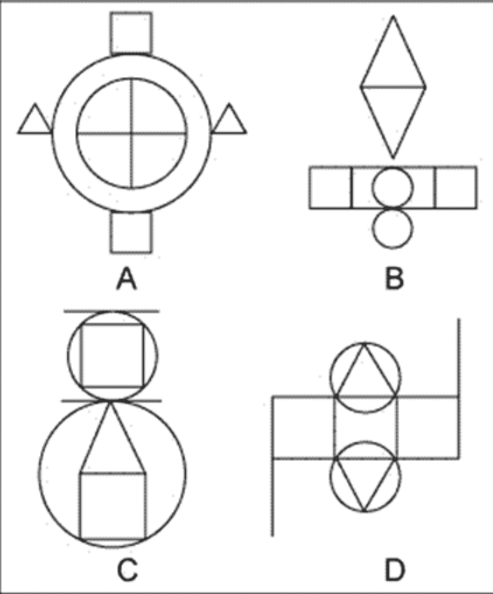
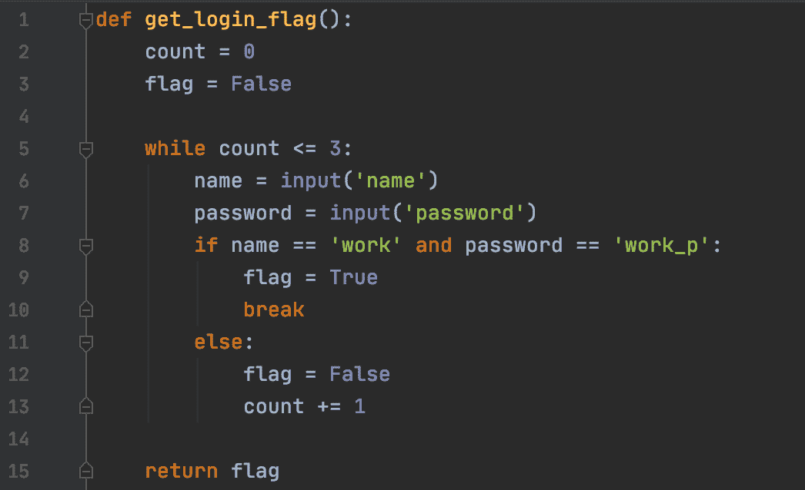
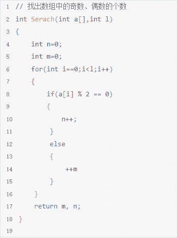

# 哔哩哔哩 2021 校园招聘测试开发方向笔试卷 A

## 1

下面的语句，哪个与其他的执行次数不一样？（  ）

正确答案: C   你的答案: 空 (错误)

```cpp
for(i=0;i<10;i++){cout<<i<<””;}
```

```cpp
for(i=10;i>=1;i--){cout<<i<<””;}
```

```cpp
i=10;do {cout<<i<<””;}while(i-->0);
```

```cpp
i=0;while(++i<=10) {cout<<i<<””;}
```

本题知识点

测试开发工程师 哔哩哔哩 2021

讨论

[咸鱼努力翻身](https://www.nowcoder.com/profile/530278766)

A：0 1 2 3 4 5 6 7 8 9  共 10 个数 B：10 9 8 7 6 5 4 3 2 1 共 10 个数 C：10 9 8 7 6 5 4 3 2 1 0 共 11 个数（i--先使用整体，再减 1）D：1 2 3 4 5 6 7 8 9 10 共 10 个数（++i 先自增 1，再使用整体）C 执行了 11 次，所以选择 C

发表于 2021-07-03 09:53:03

* * *

## 2

对下列递归函数 int f(int n){ return ((n==0)?1:f(n-1)+3);}, f(3)的返回值是（  ）

正确答案: B   你的答案: 空 (错误)

```cpp
6
```

```cpp
10
```

```cpp
7
```

```cpp
15
```

本题知识点

测试开发工程师 哔哩哔哩 2021

讨论

[咸鱼努力翻身](https://www.nowcoder.com/profile/530278766)

f(3)=f(2)+3;f(2)=f(1)+3;f(1)=f(0)+3;f(0)=1;所以 f(3)=10,选择 B

发表于 2021-07-03 09:57:29

* * *

## 3

int a[100]，sizeof(a) 返回什么？（  ）

正确答案: D   你的答案: 空 (错误)

```cpp
2
```

```cpp
4
```

```cpp
200
```

```cpp
400
```

本题知识点

测试开发工程师 哔哩哔哩 2021

讨论

[牛客 413061194 号](https://www.nowcoder.com/profile/413061194)

数组中的每个元素以 int 形式存储， int 占 4 个字节

发表于 2021-07-26 20:40:42

* * *

## 4

下列程序的执行结果是（  ）int num = 15;while(num>0){System.out.print(num++ %5 + “\t”);num /=5;}

正确答案: B   你的答案: 空 (错误)

```cpp
2  4
```

```cpp
3  3
```

```cpp
2
```

```cpp
2  3
```

本题知识点

测试开发工程师 哔哩哔哩 2021

讨论

[天鹅湖](https://www.nowcoder.com/profile/819932535)

我不理解，不是 0 和 3 吗？？？？

发表于 2022-03-22 14:40:17

* * *

[牛客 515822042 号](https://www.nowcoder.com/profile/515822042)

不应该是 0 3 吗？15%5=0 啊？

发表于 2022-03-22 11:26:46

* * *

[牛客 953827787 号](https://www.nowcoder.com/profile/953827787)

这题放在编译器李运行出来是 0 3

发表于 2021-10-13 09:58:37

* * *

## 5

以下哪些不属于测试用例设计方法 （  ）

正确答案: E   你的答案: 空 (错误)

```cpp
等价类
```

```cpp
边界值
```

```cpp
错误推测
```

```cpp
判定表
```

```cpp
二分查找
```

本题知识点

测试开发工程师 哔哩哔哩 2021

讨论

[风吹三里](https://www.nowcoder.com/profile/7655907)

是 E

发表于 2021-04-21 09:04:07

* * *

## 6

下面属于 Linux 系统进程间通信机制的有（  ）

正确答案: D   你的答案: 空 (错误)

```cpp
堆内变量
```

```cpp
信号量
```

```cpp
信号
```

```cpp
套接字
```

本题知识点

测试开发工程师 哔哩哔哩 2021

讨论

[牛客 846726127 号](https://www.nowcoder.com/profile/846726127)

机制与方式的区别吗

发表于 2021-08-16 20:53:28

* * *

## 7

某操作系统在进程中引入了多个线程，那么下列叙述中，哪个是不正确的？（  ）

正确答案: D   你的答案: 空 (错误)

```cpp
进程是资源分配的基本单位
```

```cpp
线程是处理器调度的基本单位
```

```cpp
同一个进程中的多个线程之间可以并发执行
```

```cpp
线程可以独立于进程而存在
```

本题知识点

测试开发工程师 哔哩哔哩 2021

## 8

下列选项中同一个进程中的线程不能共享的部分是 （  ）

正确答案: D   你的答案: 空 (错误)

```cpp
信号
```

```cpp
堆
```

```cpp
文件描述符
```

```cpp
栈空间
```

本题知识点

测试开发工程师 哔哩哔哩 2021

## 9

在 TCP/IP 网络中，TCP 协议工作在（  ） ，FTP 协议工作在 （  ）

正确答案: C   你的答案: 空 (错误)

```cpp
应用层,运输层
```

```cpp
运输层,链路层
```

```cpp
网络层,应用层
```

```cpp
链路层,网络层
```

本题知识点

测试开发工程师 哔哩哔哩 2021

讨论

[牛客 175292883 号](https://www.nowcoder.com/profile/175292883)

tcp 工作在传输层吧,答案错了

发表于 2021-10-24 11:01:01

* * *

[能奈](https://www.nowcoder.com/profile/464733651)

tcp 运输层 ftp 应用层

发表于 2021-10-13 11:51:02

* * *

[呵呵一笑倾家荡产](https://www.nowcoder.com/profile/5782362)

这个答案有误吧

发表于 2021-10-10 23:00:54

* * *

## 10

建立 TCP 连接时，“第一次握手”主要做了什么操作（  ）

正确答案: C   你的答案: 空 (错误)

```cpp
客户端向服务端发送一个 SYN-ACK 段
```

```cpp
服务端向客户端发送一个 SYN-ACK 段
```

```cpp
客户端向服务端的 TCP 进程发送一个 SYN 段
```

```cpp
服务端向客户端的 TCP 进程发送一个 SYN 段作为应答
```

本题知识点

测试开发工程师 哔哩哔哩 2021

## 11

在 SQL 查询中，如果要去掉查询结果中的重复组，需使用(  )参数

正确答案: B   你的答案: 空 (错误)

```cpp
duplicate
```

```cpp
distinct
```

```cpp
uniq
```

```cpp
sorted
```

本题知识点

测试开发工程师 哔哩哔哩 2021

讨论

[义晨](https://www.nowcoder.com/profile/781546251)

B

发表于 2021-09-16 00:36:04

* * *

## 12

以下哪些不是关系型数据库？ （  ）

正确答案: D   你的答案: 空 (错误)

```cpp
mysql
```

```cpp
sql server
```

```cpp
oracle
```

```cpp
hbase
```

本题知识点

测试开发工程师 哔哩哔哩 2021

## 13

设指针 q 指向单链表中结点 A，指针 p 指向单链表中结点 A 的后继结点 B，指针 s 指向被插入的结点 X，则在结点 A 和结点 B 插入结点 X 的操作序列为（  ）

正确答案: A   你的答案: 空 (错误)

```cpp
s->next =p; q->next=s;
```

```cpp
p->next=s->next; s->next=p;
```

```cpp
p->next=s;s->next=q;
```

```cpp
s->next=p->next;p->next=s;
```

本题知识点

测试开发工程师 哔哩哔哩 2021

## 14

长度为 n 的非空顺序表，删除表中的第 i 个元素，需要移动表中的几个元素？（  ）

正确答案: C   你的答案: 空 (错误)

```cpp
n-i+1
```

```cpp
n+i
```

```cpp
n-i
```

```cpp
n-i-1
```

本题知识点

测试开发工程师 哔哩哔哩 2021

## 15

假设以行序为主序存储二维数组 A=array[1..100， 1..100]， 设每个数据元素占 2 个存储单元， 基地址为 10，则 LOC[6， 6]=（ ）。

正确答案: D   你的答案: 空 (错误)

```cpp
808
```

```cpp
818
```

```cpp
1010
```

```cpp
1020
```

本题知识点

测试开发工程师 哔哩哔哩 2021

讨论

[祈愿🍃](https://www.nowcoder.com/profile/452508538)

index 从 0 开始，LOC(5, 100)的位置相对于基址偏移了 499 个存储单元，LOC(6, 6)相对于基址则便宜了 505 个存储单元,。

基址是 10，每个元素占 2 个存储单元，则最后的公式为：
LOC = 基址 + 单个元素占用的存储单元 * 偏移量
LOC(6, 6) = 10 + 2 * 505 = 1020

发表于 2022-02-02 15:21:15

* * *

## 16

某堆栈的输入序列是 J Q K A，则下列序列中不可能是它的输出序列的是（）

正确答案: D   你的答案: 空 (错误)

```cpp
JKQA
```

```cpp
QKAJ
```

```cpp
KAQJ
```

```cpp
AKJQ
```

本题知识点

测试开发工程师 哔哩哔哩 2021

## 17

下面图形中，哪一个和其他的不一样？（  ）

正确答案: D   你的答案: 空 (错误)

```cpp
A
```

```cpp
B
```

```cpp
C
```

```cpp
D
```

本题知识点

测试开发工程师 哔哩哔哩 2021

讨论

[牛客 349286377 号](https://www.nowcoder.com/profile/349286377)

个人猜测：A、B、C 是对称的，D 不是

发表于 2021-04-11 23:20:11

* * *

## 18

若用一个大小为 10 的数组来实现循环队列， 且当前 rear 和 front 的值分别为 2 和 7， 当从队列中删除两个元素，再加入一个元素后， rear 和 front 的值分别为多少？ (   )

正确答案: D   你的答案: 空 (错误)

```cpp
1 和 5
```

```cpp
2 和 9
```

```cpp
4 和 2
```

```cpp
3 和 9
```

本题知识点

测试开发工程师 哔哩哔哩 2021

## 19

用冒泡排序对 20，25，30，15，10，6 进行从小到达排序，第三趟排序后的状态是：（  ）

正确答案: C   你的答案: 空 (错误)

```cpp
20 25 15 10 6 30
```

```cpp
20 15 10 6 25 30
```

```cpp
15 10 6 20 25 30
```

```cpp
10 6 15 20 25 30
```

本题知识点

测试开发工程师 哔哩哔哩 2021

讨论

[至死方休，久久](https://www.nowcoder.com/profile/797804216)

进行三趟后倒数一二三为从大到小排了，前面的数不变

发表于 2021-10-17 16:33:04

* * *

## 20

下面哪种排序算法在算复杂度平均不是 O(nlogn) （  ）

正确答案: B   你的答案: 空 (错误)

```cpp
快速排序
```

```cpp
桶排序
```

```cpp
合并排序
```

```cpp
堆排序
```

本题知识点

测试开发工程师 哔哩哔哩 2021

讨论

[一只花花牛](https://www.nowcoder.com/profile/172285675)

桶排序的时间复杂度：O(n+k)

发表于 2021-07-26 19:13:39

* * *

## 21

已知一个有序表为（8，18，28，38，48，58，68，78，88，98，108），当二分检索值为 78 的元素时，检索成功需比较的次数是？（  ）

正确答案: B   你的答案: 空 (错误)

```cpp
3
```

```cpp
4
```

```cpp
5
```

```cpp
6
```

本题知识点

测试开发工程师 哔哩哔哩 2021

讨论

[祈愿🍃](https://www.nowcoder.com/profile/452508538)

midIndex = start + (end - start) / 2;

1\. start=0, end=10, midIndex = 5, mid = 58

2\. start=6, end=10, midIndex = 8, mid = 88

3\. start=6, end=7, midIndex = 6, mid = 68

4\. start=7, end=7, midIndex = 7, mid = 78

发表于 2022-02-02 15:34:24

* * *

[牛客 604033156 号](https://www.nowcoder.com/profile/604033156)

应该是 3 吧。。。

发表于 2021-10-13 13:07:39

* * *

[呵呵一笑倾家荡产](https://www.nowcoder.com/profile/5782362)

为啥不是 3

发表于 2021-10-10 23:06:39

* * *

## 22

顺序查找适合于数据结构为（  ）

正确答案: A   你的答案: 空 (错误)

```cpp
List 数组
```

```cpp
Hash 表
```

```cpp
二叉树
```

```cpp
图库
```

本题知识点

测试开发工程师 哔哩哔哩 2021

## 23

深度为 k 的二叉树至多有几个结点（  ）

正确答案: D   你的答案: 空 (错误)

```cpp
2^k
```

```cpp
2^(k-1)
```

```cpp
2^k+1
```

```cpp
2^k-1
```

本题知识点

测试开发工程师 哔哩哔哩 2021

讨论

[呵呵一笑倾家荡产](https://www.nowcoder.com/profile/5782362)

这题答案有误吧

发表于 2021-10-10 23:07:17

* * *

## 24

有 5 个数，取其每 4 个而相加，则其和分别为 15、22、24、19 和 28。求这五个数各是多少（  ）

正确答案: C   你的答案: 空 (错误)

```cpp
11 6 2 9 0
```

```cpp
10 5 6 7 -1
```

```cpp
12 5 3 8 -1
```

```cpp
15 4 8 2
```

本题知识点

测试开发工程师 哔哩哔哩 2021

## 25

一个完全二叉树有 124 个叶子节点，则该完全二叉树最多有多少个节点？（  ）

正确答案: C   你的答案: 空 (错误)

```cpp
246
```

```cpp
247
```

```cpp
248
```

```cpp
249
```

本题知识点

测试开发工程师 哔哩哔哩 2021

讨论

[呵呵一笑倾家荡产](https://www.nowcoder.com/profile/5782362)

根节点算不算

发表于 2021-10-10 23:09:54

* * *

[呱呱太先生](https://www.nowcoder.com/profile/190807472)

全满的情况是 128 个，现在是 124，所以肯定两种情况，一种可能上一层有 4 个叶子结点，另一种可能上一层 3 个叶子结点加有一个只有左节点，而他的层数是 8，所以最多 255 - 3×2 - 1 = 248

发表于 2021-08-05 13:41:40

* * *

## 26

部门考核后要选 2 位同学分别担任技术 leader 和管理 leader，A\B\C3 位同学是候选人，其他同学预测同学 X：A 为技术 leader，B 为管理 leader 同学 Y：C 为技术 leader，A 为管理 leader 同学 Z：B 为技术 leader，A 都不是结果公布后，发现 X/Y/Z 各预测对了一半。请问技术 leader 是哪位担任（  ）

正确答案: C   你的答案: 空 (错误)

```cpp
同学 A
```

```cpp
同学 B
```

```cpp
同学 C
```

```cpp
都不是
```

本题知识点

测试开发工程师 哔哩哔哩 2021

## 27

对一批编号为 1-50，全部开关朝上（开着）的的灯进行以下操作：凡是 1 的倍数反方向拨一次开关；2 的倍数反方向拨一次开关；3 的倍数反方向又拨一次开关；… 50 的倍数反方向又拨一次开关。问最后关灭状态的灯有（  ）个

正确答案: D   你的答案: 空 (错误)

```cpp
10
```

```cpp
9
```

```cpp
8
```

```cpp
7
```

本题知识点

测试开发工程师 哔哩哔哩 2021

## 28

1，9，13，15，16，（  ）

正确答案: A   你的答案: 空 (错误)

```cpp
16.5
```

```cpp
17
```

```cpp
17.5
```

```cpp
18
```

本题知识点

测试开发工程师 哔哩哔哩 2021

讨论

[牛客 846726127 号](https://www.nowcoder.com/profile/846726127)

+2 的次方

发表于 2021-08-16 21:22:21

* * *

## 29

设计一个登录程序，判断用户名和密码是否正确。输入为用户名、密码，输出为成功与否，正确的用户名密码为 work/work_p，最多重试三次，以下代码中哪一行是错误的？（  ）

正确答案: A   你的答案: 空 (错误)

```cpp
5
```

```cpp
8
```

```cpp
10
```

```cpp
11
```

本题知识点

测试开发工程师 哔哩哔哩 2021

## 30

找出以下程序的 bug（  ）

正确答案: A   你的答案: 空 (错误)

```cpp
第 6 行有错误
```

```cpp
第 8 行有错误
```

```cpp
第 10 行有错误
```

```cpp
第 14 行有错误
```

本题知识点

测试开发工程师 哔哩哔哩 2021

讨论

[牛客 561301343 号](https://www.nowcoder.com/profile/561301343)

为什么 14 行没分号结尾也不错？

发表于 2021-09-25 09:45:42

* * *

## 31

一口井深 len 米,蜗牛白天爬 m 米,晚上滑下去 n 米，几天到井口？实现爬井函数 climb 输出答案，简单起见 len，m，n 都是整数。例如：一口井深 10 米，蜗牛白天爬 4 米，晚上滑下去 3 米，最终应该是 7 天到达井口。

本题知识点

测试开发工程师 哔哩哔哩 2021

讨论

[一只花花牛](https://www.nowcoder.com/profile/172285675)

[Python3] 分享一个普通方法

```cpp
class Solution:
    def daycost(self , len , m , n ):
        if n >= m and len > m:  # 需注意处理 len<=m 时的特殊情况
            return -1
        c = 0
        while len > 0:
            c += 1
            len -= m
            if len <= 0:
                return c
            len += n
        return -1
```

发表于 2021-07-26 17:34:59

* * *

[牛客 515822042 号](https://www.nowcoder.com/profile/515822042)

```cpp
import java.util.*;

public class Solution {

    public int daycost (int len, int m, int n) {
        if((n>=m && m<len) || len<0) return -1;
        else if(m>=len || len==0) return 1;
        else{
            int res;
            res = (len-m)/(m-n);
            return res+1;
        }
    }
}

```

请帮我看看哪里出错了，只通过了 3/5😥

发表于 2022-03-22 11:33:18

* * *

[acechen15](https://www.nowcoder.com/profile/803270483)

```cpp
class Solution:
    def daycost(self , len , m , n ):
        # write code here
        if len <= m:
            return 1
        if m <= n:
            return -1
        offset = m - n
        sum_path = 0
        limit1 = len - m
        day = 0
        while sum_path < limit1:
            sum_path += offset
            day += 1
        return day + 1
```

发表于 2021-08-22 15:20:14

* * *

## 32

有两个数组 a、b，数组 a 的元素是升序排列（从小到大），数组 b 的元素是降序排列（从大到小），请写出算法，将这两个数组合并成升序排列的数组。

本题知识点

测试开发工程师 哔哩哔哩 2021

讨论

[一只花花牛](https://www.nowcoder.com/profile/172285675)

[Python3] 用 sort()不怕把面试官气岔气吗？🤣🤣🤣  

```cpp
class Solution:
    def sort(self , a , b ):
        a, c = a[::-1], []
        while a and b:
            if a[-1] < b[-1]:
                c.append(a.pop())
            else:
                c.append(b.pop())
        if not a:
            c.extend(b)
        else:
            c.extend(a)
        return c
```

发表于 2021-07-26 17:30:47

* * *

[maoxiaomao](https://www.nowcoder.com/profile/230303195)

投机取巧

```cpp
#
# 数组排序
# @param a int 整型一维数组 数组 a 升序
# @param b int 整型一维数组 数组 b 降序
# @return int 整型一维数组
#
class Solution:
    def sort(self , a , b ):
        # write code here
        a.extend(b) 
        a.sort()
        return a
```

发表于 2021-06-02 19:26:29

* * *

[牛客 800418741 号](https://www.nowcoder.com/profile/800418741)

```cpp
import java.util.*;

public class Solution {
    /**
     * 数组排序
     * @param a int 整型一维数组 数组 a 升序
     * @param b int 整型一维数组 数组 b 降序
     * @return int 整型一维数组
     */
    public int[] sort (int[] a, int[] b) {
        // write code here
        String str="";
        for(int i = 0;i< a.length;i++){
            str+=String.valueOf(a[i])+",";
        }
        for(int j =0;j<b.length;j++){
            str+=String.valueOf(b[j])+",";
        }
        String [] c = str.split(",");
        int [] d = new int [c.length];
        for(int k =0;k<c.length;k++){
            d[k]= Integer.parseInt(c[k]);
        }

        Arrays.sort(d);
        return d;

    }
}

```

发表于 2021-11-13 00:23:31

* * *

## 33

```cpp

	给定英文句子 S 和字符串 x，判断 x 是否为 S 中某些单词的前缀，若匹配到则输出第 1 个匹配单词的位置，否则输出-1。  

	例如：输入"this is an easy problem."和"eas"，输出 4

	例如：输入"In love folly is always sweet"和"like"，输出-1

	例如：输入"Whatever is worth doing is worth doing well."和"wor"，输出 3

```

本题知识点

测试开发工程师 哔哩哔哩 2021

讨论

[PasGuito](https://www.nowcoder.com/profile/603888839)

class Solution:
    def match_str_in_sentence(self , s , x ):
        # write code here、
        strs = s.split()
        count = 0
        for s in strs:
            count += 1
            if len(s) < len(x):
                continue
            else:
                if s[:len(x)] == x:
                    return count
                else:
                    continue
        return -1

编辑于 2021-04-18 21:10:19

* * *

[牛客 800418741 号](https://www.nowcoder.com/profile/800418741)

```cpp
import java.util.*;

public class Solution {
    /**
     * 在句子中找到前缀是 str 的首个单词位置
     * @param s string 字符串 英文句子
     * @param x string 字符串 字符串
     * @return int 整型
     */
    public int match_str_in_sentence (String s, String x) {
        // write code here

        if (s.indexOf(x) >= 1) {
            String[] str = s.split(" ");
            for (int i = 0; i < str.length; i++) {
                if(str[i].contains(x)){
                    return i+1;
                }

            }
        } else {
            return -1;
        }

      return 0;
    }
}

```

发表于 2021-11-13 00:24:30

* * *

[幻翳如犹](https://www.nowcoder.com/profile/122539634)

    int match_str_in_sentence(string s, string x) {
        // write code here
        int lens=s.size();
        int lenx=x.size();
        int a=0,res=1;
        while(a<lens-lenx){
            int count=0;
            if(s[a]==' ') res++;
            for(int i=0;i<lenx;i++){
                if(s[a+i]==x[i]) count++;
            }
            if(count==lenx) return res;
            a++;
        }
        return -1;
    }

发表于 2021-08-30 16:36:08

* * *