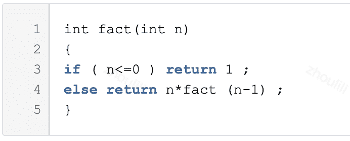
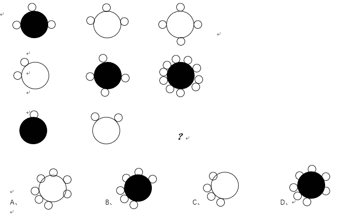
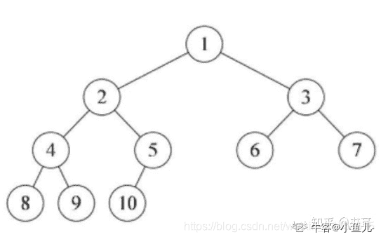
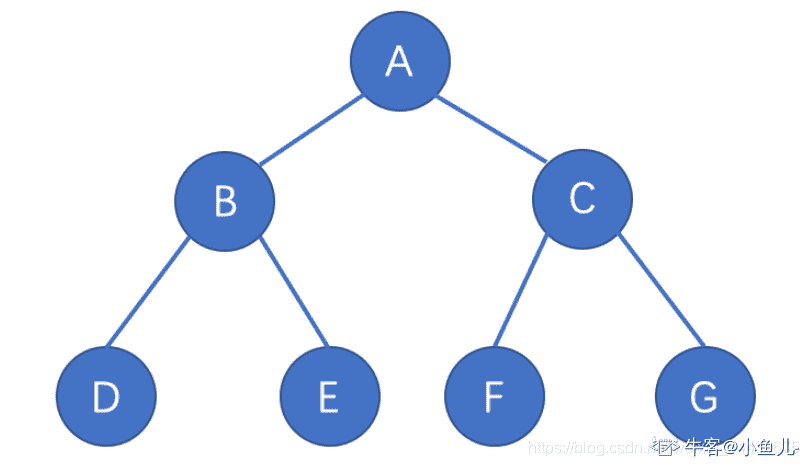
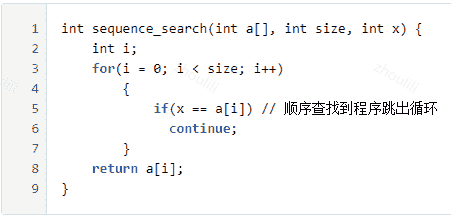
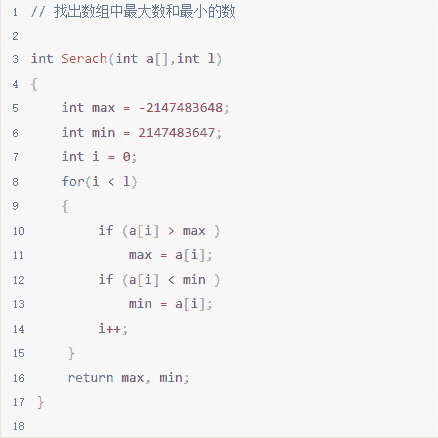
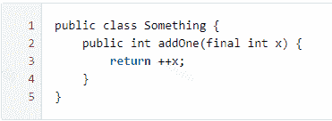

# 哔哩哔哩 2021 校园招聘测试开发方向笔试卷 B

## 1

设有一个递归算法如下：
则计算 fact(99)需要调用该函数的次数为（  ）。

正确答案: B   你的答案: 空 (错误)

```cpp
99
```

```cpp
100
```

```cpp
102
```

```cpp
98
```

本题知识点

测试开发工程师 哔哩哔哩 2021

讨论

[初见 201812241227328](https://www.nowcoder.com/profile/671411009)

fact（99） fact（98） ... fact（0） 0-99，共 100 次

发表于 2021-04-22 01:52:56

* * *

## 2

若串 S1=‘ ABCDEFG’ , S2=‘ 9898’ ,S3=‘ ###’ ,S4=‘ 12345’ ,执行 concat(replace(S1,substr(S1,length(S2),length(S3)),S3),substr(S4,index(S2,‘ 8’ ),length(S2)))其结果为（  ）

正确答案: C   你的答案: 空 (错误)

```cpp
ABC###G0123
```

```cpp
ABCD###2345
```

```cpp
ABC###G2345
```

```cpp
ABC###G1234
```

本题知识点

测试开发工程师 哔哩哔哩 2021

讨论

[牛客 561301343 号](https://www.nowcoder.com/profile/561301343)

substr(S1,length(S2),length(S3)，代表的是从第 4 位开始取三个，计数方式从 1 开始所以是取了'DEF'换成了'###'后面也一样 substr(S4,index(S2,‘ 8’ ),length(S2))，从 S4 的第二位开始取，取 4 个

发表于 2021-09-23 19:53:22

* * *

## 3

对 A *p 使用 new 或者 malloc 赋值，以下描述正确的是（  ）

正确答案: B   你的答案: 空 (错误)

```cpp
malloc 分配内存后会调用构造函数初始化,但 new 函数不会
```

```cpp
new 分配内存后会调用构造函数初始化,但 malloc 函数不会
```

```cpp
new 和 malloc 分配内存后都会调用构造函数初始化
```

```cpp
new 和 malloc 分配内存后都不会调用构造函数初始化
```

本题知识点

测试开发工程师 哔哩哔哩 2021

## 4

系统将数据从磁盘读到内存的过程包括以下操作：（  ）① DMA 控制器发出中断请求② 初始化 DMA 控制器并启动磁盘③ 执行 DMA 结束中断服务程序④ 从磁盘传输一块数据到内存缓冲区

正确答案: D   你的答案: 空 (错误)

```cpp
④①②③
```

```cpp
②③①④
```

```cpp
②①③④
```

```cpp
②④①③
```

本题知识点

测试开发工程师 哔哩哔哩 2021

## 5

在一个请求分页系统中，采用 NUR（最近未使用算法）页面置换算法时，假如一个作业的页面走向为 1,2,2,5,4,2,4,3,2,4。当分配给该作业的物理块数为 3 时，访问过程中命中的次数为（  ）

正确答案: C   你的答案: 空 (错误)

```cpp
3
```

```cpp
4
```

```cpp
5
```

```cpp
6
```

本题知识点

测试开发工程师 哔哩哔哩 2021

讨论

[Smile*Yu](https://www.nowcoder.com/profile/353957287)

（LRU）:最近最久未使用更新算法

以“最近的过去”作为“不久的将来”的近似，选择最近一段时间内最久没有使用的页面淘汰。
它的实质是：当需要更新一页时，选择在最近一段时间内最久没有被使用的页面予以淘汰

 | 页面访问 | 1 | 2 | 2 | 5 | 4 | 3 | 2 | 4 |
| 物理块一 | 1 | 1 | 1 | 5 | 5 | 5 | 2 | 2 |
| 物理块二 |  | 2 | 2 | 2 | 4 | 4 | 5 | 4 |
| 物理块三 |  |  | 2 | 2 | 2 | 3 | 3 | 3 |
| 是否缺页 | × | × | × | × | × | × | × | × |

所以访问过程中命中的次数为（  ）

发表于 2021-04-17 16:45:56

* * *

## 6

Linux 下，下列哪些途径不会让程序由用户态切换到内核态（  ）

正确答案: D   你的答案: 空 (错误)

```cpp
中断
```

```cpp
异常
```

```cpp
系统调用
```

```cpp
磁盘访问
```

本题知识点

测试开发工程师 哔哩哔哩 2021

讨论

[whreris](https://www.nowcoder.com/profile/4855555)

用户态到内核态的三种方式：

*   异常：如果当前进程运行在用户态，如果这个时候发生了异常事件，就会触发切换。例如：缺页异常。

*   系统调用：Linux 内核中设置了一组用于实现各种系统功能的子程序，称为系统调用。用户可以通过系统调用命令在自己的应用程序中调用它们。

*   外部访问中断：当外设完成用户的请求时，会向 CPU 发送中断信号。

发表于 2021-08-12 14:55:52

* * *

## 7

磁盘与主机之间的数据传送方式是（  ）

正确答案: B   你的答案: 空 (错误)

```cpp
中断方式
```

```cpp
DMA 方式
```

```cpp
无条件
```

```cpp
程序查询
```

本题知识点

测试开发工程师 哔哩哔哩 2021

讨论

[木李子](https://www.nowcoder.com/profile/457206613)

DMA（Direct Memory Access）直接存储器访问，允许不同速度的硬件装置沟通，而不需要依赖于 CPU 的大量负载。

发表于 2021-08-20 19:18:36

* * *

## 8

TCP/IP 应用层协议中，可以使用传输层无连接服务的是（  ）

正确答案: C   你的答案: 空 (错误)

```cpp
SMTP
```

```cpp
FTP
```

```cpp
DNS
```

```cpp
HTTP
```

本题知识点

测试开发工程师 哔哩哔哩 2021

讨论

[zxcv0112358](https://www.nowcoder.com/profile/473856205)

DNS 默认使用 UDP 的 53 端口

发表于 2021-08-22 13:27:29

* * *

[木李子](https://www.nowcoder.com/profile/457206613)

应用层：HTTP、FTP、SMTP、POP3、I MAP4、MNTP、TELENT 表示层：LPP、NBSSN、XDP 会话层：SSL、TLS、DAP、LDAP、RPC 传输层：TCP、UDP 网络层：AH、ESP、EGP、GGP、IGRP 数据链路层：MPLS、XTP、DCAP 物理层：

发表于 2021-08-20 19:45:05

* * *

## 9

路由器不具有哪项功能？（  ）

正确答案: D   你的答案: 空 (错误)

```cpp
网络的互联
```

```cpp
网络的隔离
```

```cpp
流量的控制
```

```cpp
数据的计算
```

本题知识点

测试开发工程师 哔哩哔哩 2021

讨论

[木李子](https://www.nowcoder.com/profile/457206613)

路由器（网络层）有网络互连、数据处理、网络管理等功能

发表于 2021-08-20 19:47:12

* * *

## 10

http 请求的方式 get 和 post 的描述正确的是（  ）

正确答案: D   你的答案: 空 (错误)

```cpp
get 和 post 的可传输内容都没限制
```

```cpp
get 请求可以跨域，post 请求不可以跨域
```

```cpp
get 请求 content-type 只能是 text/html
```

```cpp
get 和 post 都能传输字符串
```

本题知识点

测试开发工程师 哔哩哔哩 2021

## 11

数据库事务正确执行的四个基本要素不包括? （  ）

正确答案: B   你的答案: 空 (错误)

```cpp
隔离性
```

```cpp
强制性
```

```cpp
持久性
```

```cpp
原子性
```

本题知识点

测试开发工程师 哔哩哔哩 2021

讨论

[木李子](https://www.nowcoder.com/profile/457206613)

原子性：是指事务包含的所有的操作要么全部成功要么全部失败回滚。一致性：是指事务必须使数据库从一个一致性状态转换到另一个状态。隔离性：是当多个用户并发访问数据库时，不能被其他事务所干扰，多个并发事务之间要相互隔离。持久性：是指一个事务被提交了，那么对数据库中的改变就是永久的。

发表于 2021-08-20 19:54:15

* * *

## 12

观察如下图形的规律，”?”里符合规律的图形是（  ）

正确答案: D   你的答案: 空 (错误)

```cpp
A
```

```cpp
B
```

```cpp
C
```

```cpp
D
```

本题知识点

测试开发工程师 哔哩哔哩 2021

讨论

[十三流哲学家](https://www.nowcoder.com/profile/111659090)

求思路

发表于 2022-02-04 20:45:47

* * *

[牛客 982555902 号](https://www.nowcoder.com/profile/982555902)

求思路

发表于 2021-09-19 08:02:02

* * *

## 13

在双向链表指针 p1 的结点前插入一个指针 p2 的结点操作是（  ）。

正确答案: D   你的答案: 空 (错误)

```cpp
p1->Llink=p2;p2->Rlink=p1;p1->Llink->Rlink=p2;p2->Llink=p2；
```

```cpp
p1->Llink=p2;p1->Llink->Rlink=p2;p2->Rlink=p1;p2->Llink=p1->Llink;
```

```cpp
p2->Llink=p1->Llink;p2->Rlink=p2;p1->Llink=p2;p1->Llink=p2;
```

```cpp
p2->Rlink=p1;p2->Llink=p1->Llink;p1->Llink->Rlink=p2;p1->Llink=p2;
```

本题知识点

测试开发工程师 哔哩哔哩 2021

## 14

输入序列为 m-1000…m 的栈， 如果第一个输出的是 m， 输出第 j（ m-1000<=j<=m） 个元素是（  ）。

正确答案: D   你的答案: 空 (错误)

```cpp
不确定
```

```cpp
m-j
```

```cpp
j
```

```cpp
m-j+1
```

本题知识点

测试开发工程师 哔哩哔哩 2021

## 15

若进栈序列为 1，2，3，4，5，6，且进栈和出栈可以穿插进行，则不可能出现的出栈序列是(   )。

正确答案: D   你的答案: 空 (错误)

```cpp
2，4，3，1，5，6
```

```cpp
3，2，4，1，6，5
```

```cpp
4，3，2，1，5，6
```

```cpp
2，3，5，1，6，4
```

本题知识点

测试开发工程师 哔哩哔哩 2021

## 16

假设使用 100Mb 内存要对 1Gb 的数据进行排序，最合适的算法是（    ）

正确答案: A   你的答案: 空 (错误)

```cpp
归并排序
```

```cpp
插入排序
```

```cpp
快速排序
```

```cpp
冒泡排序
```

本题知识点

测试开发工程师 哔哩哔哩 2021

## 17

n 个数值选出最大 m 个数（3<m>正确答案: A   你的答案: 空 (错误)

```cpp
O(n)
```

```cpp
O(nlogn)
```

```cpp
O(logn)
```

```cpp
O(mlogn)
```

本题知识点

测试开发工程师 哔哩哔哩 2021

## 18

用某种排序方法对关键字序列{135,184,121,147,115,127,168,125,120}进行排序时，序列的变化情况如下：120,115,121,125,147,127,168,135,184115,120,121,125,135,127,147,168,184115,120,121,125,127,135,147,168,184 则采用的方法是？（  ）

正确答案: D   你的答案: 空 (错误)

```cpp
直接选择排序
```

```cpp
希尔排序
```

```cpp
堆排序
```

```cpp
快速排序
```

本题知识点

测试开发工程师 哔哩哔哩 2021

## 19

具有 15 个关键字的有序表， 折半查找的平均查找长度（  ）

正确答案: D   你的答案: 空 (错误)

```cpp
3.1
```

```cpp
3.2
```

```cpp
2.5
```

```cpp
3.3
```

本题知识点

测试开发工程师 哔哩哔哩 2021

讨论

[牛客 583956626 号](https://www.nowcoder.com/profile/583956626)

在折半查找判定树中，某结点所在的层数即是查找该结点的比较次数，整个判定树代表的有序表的平均查找长度即为查找每个结点的比较次数之和除以有序表的长度。例如，长度为 10 的有序表的平均查找长度为：

ASL=(1×1+2×2+3×4+4×3)/10=29/10 长度为 15 的有序表的平均查找长度为：（1*1+2*2+3*4+4*8）/15=3.26666

编辑于 2021-04-20 21:01:47

* * *

[gengduc](https://www.nowcoder.com/profile/972944395)

(1*16+2*2+4*3+8*46)/15=49/15

发表于 2021-04-27 10:39:05

* * *

## 20

25 匹马，5 个跑道，每次只能跑 5 匹，用最少的次数选出最快的前 3 匹？（  ）

正确答案: B   你的答案: 空 (错误)

```cpp
6
```

```cpp
7
```

```cpp
8
```

```cpp
9
```

本题知识点

测试开发工程师 哔哩哔哩 2021

讨论

[fafar](https://www.nowcoder.com/profile/539385625)

每五匹跑一次共五次每批的第一名共五匹跑一次。 获得第一名第一名所在批次的二三名和上一轮的二三名和第二名所在批次的第二名共五匹跑一次。 获得二三名共七次

发表于 2021-08-25 16:15:02

* * *

## 21

将一株有 100 个节点的完全二叉树从上到下，从左到右依次进行编号，根节点的编号为 1，则编号为 35 的节点的右孩子编号为（  ）。

正确答案: C   你的答案: 空 (错误)

```cpp
69
```

```cpp
70
```

```cpp
71
```

```cpp
没有孩子
```

本题知识点

测试开发工程师 哔哩哔哩 2021

## 22

以下关于二叉树描述正确的是（   ）

正确答案: D   你的答案: 空 (错误)

```cpp
完全二叉树的叶子节点只能出现在最下面一层
```

```cpp
完全二叉树中每个结点的两棵子树的高度差可能等于 1
```

```cpp
满二叉树可以有偶数个节点
```

```cpp
满二叉树的每个结点有两棵非空子树或有两棵空子树
```

本题知识点

测试开发工程师 哔哩哔哩 2021

讨论

[小鱼儿-](https://www.nowcoder.com/profile/93621998)

1，eg：完全二叉树叶节点只能出现在最下层和次下层，并且最下面一层的结点都集中在该层最左边的若干位置的二叉树
2.满二叉树：

1、一个层数为 k 的满二叉树总结点数为：(2^k)-1。因此满二叉树的结点树一定是奇数个。

2、第 i 层上的结点数为：2^(i-1)

3、一个层数为 k 的满二叉树的叶子结点个数（也就是最后一层）：2^(k-1)

发表于 2021-08-09 15:06:59

* * *

## 23

设无向图 G 中的边的集合 E={（a,b），（a,e），（a,c），（b,e），（e,d），（d,f），（f,c）},则顶点 a 出发进行深度优先遍历可以得到的一种顶点序列为（  ）

正确答案: D   你的答案: 空 (错误)

```cpp
aedfbc
```

```cpp
aebcfd
```

```cpp
acfebd
```

```cpp
aedfcb
```

本题知识点

测试开发工程师 哔哩哔哩 2021

## 24

B 站有三个知名产品同学：小露、小蓝、小虫，一个出生在北京，一个出生在上海，一个出生在广州。他们中一个负责游戏，一个负责直播，一个负责主站。其中（1）小露不是负责游戏的，小蓝不是负责主站的；（2）负责游戏的不出生在上海；（3）负责主站的出生在北京；（4）小蓝不出生在广州。请根据上述条件，判断小露负责的方向（ ）

正确答案: C   你的答案: 空 (错误)

```cpp
游戏
```

```cpp
直播
```

```cpp
主站
```

```cpp
3 种都可能
```

本题知识点

测试开发工程师 哔哩哔哩 2021

讨论

[运气用光了](https://www.nowcoder.com/profile/761828865)

好家伙，行测的推理题呀

发表于 2021-04-20 00:23:54

* * *

[牛客 413061194 号](https://www.nowcoder.com/profile/413061194)

小虫--游戏--广州小露--主站--北京小蓝--直播--上海

发表于 2021-07-26 11:04:54

* * *

## 25

小张读一本书，如果每天分别读 2 页、3 页、4 页和 5 页时，最后一天都只能读 1 页；当每天读 19 页时，则最后一天刚好读 19 页。已知此书不足 400 页，那么此书共有多少页？ (  )

正确答案: D   你的答案: 空 (错误)

```cpp
121
```

```cpp
181
```

```cpp
301
```

```cpp
361
```

本题知识点

测试开发工程师 哔哩哔哩 2021

## 26

两个杯子，一个可以装 9 升，一个可以装 4 升，可以量出多少升水？（  ）

正确答案: D   你的答案: 空 (错误)

```cpp
7
```

```cpp
6
```

```cpp
5
```

```cpp
其他都可以
```

本题知识点

测试开发工程师 哔哩哔哩 2021

## 27

16 个相同的糖果，分给三个人，每个人至少要得一个。有多少种不同分法（  ）

正确答案: C   你的答案: 空 (错误)

```cpp
100
```

```cpp
104
```

```cpp
105
```

```cpp
106
```

本题知识点

测试开发工程师 哔哩哔哩 2021

讨论

[小鱼儿-](https://www.nowcoder.com/profile/93621998)

插空法：16 个糖果依次排开，中间有 15 个**空挡** ，依次编号为空挡 1-15，从这 9 个空挡中任意取出**2** 个作为分割点 ，正好能把糖果分为 3 份，并且保证每一份中至少有一个糖果。因为分割点并没有顺序，所以可以使用组合公式 C(15,2)计算。

发表于 2021-08-09 15:08:19

* * *

## 28

如下图所示查找程序，运行过程中，哪段代码存在错误？（  ）

正确答案: C   你的答案: 空 (错误)

```cpp
1～2 行
```

```cpp
3～5 行
```

```cpp
第 6 行
```

```cpp
第 8 行
```

本题知识点

测试开发工程师 哔哩哔哩 2021

## 29

阅读以下程序，找出描述正确的选项（  ）

正确答案: C   你的答案: 空 (错误)

```cpp
第 12 行有错误
```

```cpp
第 16 行有错误
```

```cpp
第 8 行有错误
```

```cpp
其他全错
```

本题知识点

测试开发工程师 哔哩哔哩 2021

## 30

以下代码块中存在缺陷，修改第几行可以让程序成功运行？（  ）

正确答案: B   你的答案: 空 (错误)

```cpp
第 1 行
```

```cpp
第 3 行
```

```cpp
第 4 行
```

```cpp
都不行
```

本题知识点

测试开发工程师 哔哩哔哩 2021

## 31

给你一个数组 candies 和一个整数 candiesNeed ，其中 candies[i] 代表第 i 个孩子拥有的糖果数目，编写一个函数求是否存在两个孩子的糖果数之和等于 candiesNeed ，并输出两个孩子的编号。
注意：若存在多种组合，则输出下标较小的。例如满足条件的孩子有 0 和 1、0 和 2，则输出 0 和 1；满足条件的孩子有 0 和 3、1 和 2，则输出 0 和 3。

本题知识点

测试开发工程师 哔哩哔哩 2021

讨论

[一只花花牛](https://www.nowcoder.com/profile/172285675)

[Python3] 不要想复杂了，直接嵌套遍历！

```cpp
class Solution:
    def find_children(self , candiesNeed , candies ):
        for i in range(len(candies)):
            for j in range(i+1, len(candies)):
                if candies[i] + candies[j] == candiesNeed:
                    return [i, j]
        return [-1, -1]
```

发表于 2021-07-29 22:23:36

* * *

## 32

```cpp

	几个数公有的因数叫做这几个数的公因数，公因数中最大的叫做这几个数的最大公因数。例如 6 和 15 的最大公因数为 3，4 和 8 的最大公因数为 4。
现在给出一个长度为 n 的数组[n1,n2…nn]，求计算出他们的最大公因数。

```

本题知识点

测试开发工程师 哔哩哔哩 2021

讨论

[橙蓝～](https://www.nowcoder.com/profile/479190689)

class Solution:    def cal_max_common_factor(self, L ):        if len(L)==0:            return-1        minimum=min(L)        for i in range(minimum,0,-1):            flag=True            for each in L:                if each%i !=0:                    flag=False                    break            if  flag==True:                return i

发表于 2021-08-22 16:07:28

* * *

## 33

请使用任意语言在屏幕上打印出一个 n 行 n 列的菱形。（输入参数为 n，使用递增和递减数字填充输出）请注意需要对异常情况进行处理。 
例如 N=5 时输出屏幕为

**1** 
*121* 
12321 
*121* 
**1** 

本题知识点

测试开发工程师 哔哩哔哩 2021

讨论

[一只花花牛](https://www.nowcoder.com/profile/172285675)

【Python3】目前能想到的最简洁的方法

```cpp
class Solution:
    def print_diamond(self , n ):
        if not n % 2:  # 处理特殊情况
            return ""
        res = ""
        for i in range(n//2, -1, -1):
            left = "*" * ((n-2*i-1)//2) + "".join(list(map(str, [j for j in range(1, i+1)])))
            # 每一行的输出 = 左字符串 + 中间的一个数字 + 翻转后的左字符串
            temp = left + str(i+1) + left[::-1]
            if i == n//2:
                res = res + temp
            else:
                res = temp + "|" + res + "|" + temp  # 利用对称，简化运算
        return res
```

发表于 2021-07-30 09:26:39

* * *</m>