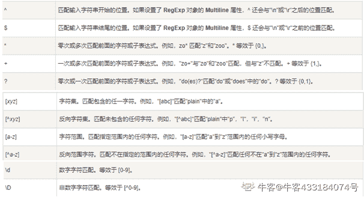
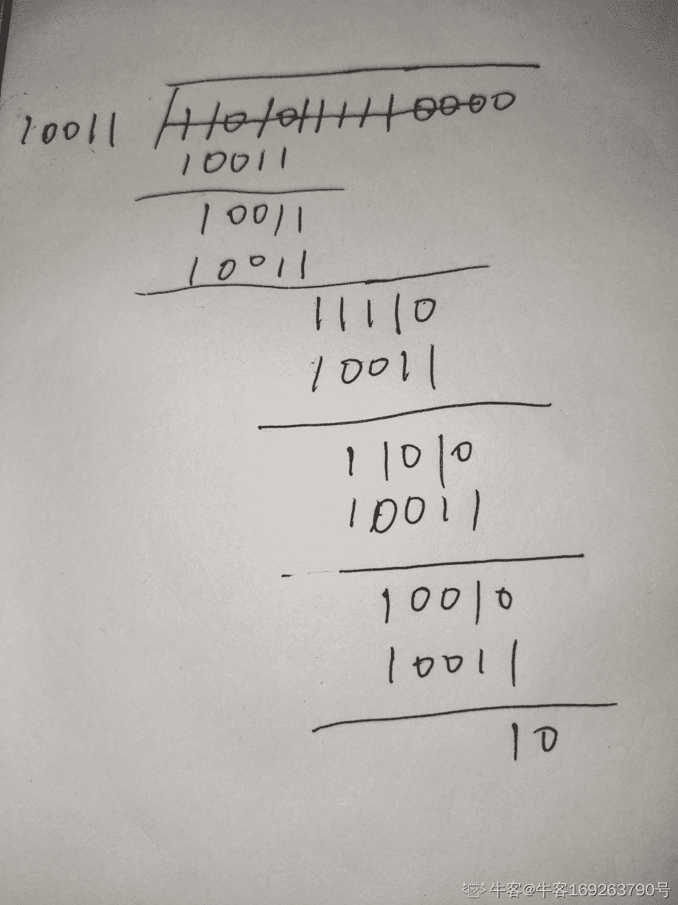
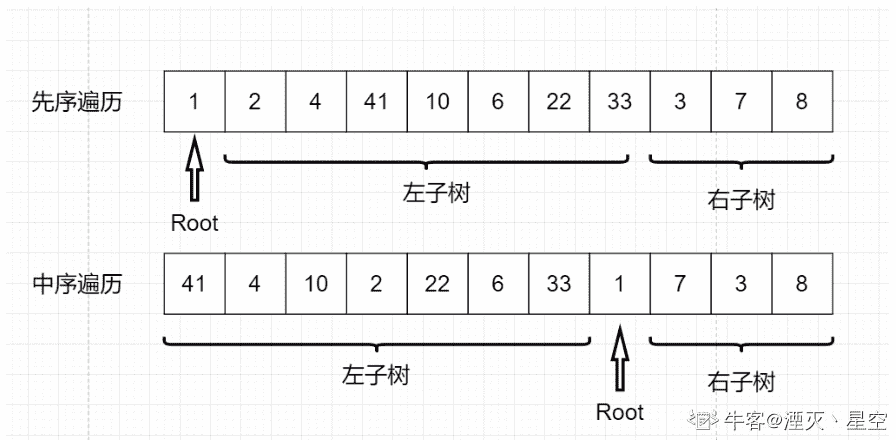

# 哔哩哔哩 2021 校园招聘后端开发方向笔试卷 A

## 1

采用递归方式对顺序表进行快速排序，下列关于递归次数的叙述中，正确的是

正确答案: D   你的答案: 空 (错误)

```cpp
递归次数与初始数据的排列次序无关
```

```cpp
每次划分后，先处理较长的分区可以减少递归次数
```

```cpp
每次划分后，先处理较短的分区可以减少递归次数
```

```cpp
递归次数与每次划分后得到的分区处理顺序无关
```

本题知识点

Java 工程师 C++工程师 PHP 工程师 golang 工程师 哔哩哔哩 2021

讨论

[Trigger333](https://www.nowcoder.com/profile/145757931)

原始快速排序的其中一步是选取第一位数字作为分界线，把当前数组中小于它的放到左边，大于它的放到右边。 如果初始数据是降序排列，要通过快排生成升序序列，那么递归次数会大大增加，就是**O(n)**，如果每次选取的恰好是中位数，递归次数就是**O(logn)**。所以一般都会对原始的快速排序加上随机选择“分界线”，就避免了初始数据对时间复杂度的影响。**那么递归次序就和分区处理顺序无关。**

发表于 2022-01-03 11:06:13

* * *

## 2

下列排序算法中，平均时间复杂度为 O(n²)的排序算法有哪些

正确答案: B   你的答案: 空 (错误)

```cpp
堆排序
```

```cpp
冒泡排序
```

```cpp
归并排序
```

```cpp
快速排序
```

本题知识点

Java 工程师 C++工程师 PHP 工程师 golang 工程师 哔哩哔哩 2021

## 3

以下哪种设备工作在数据链路层？

正确答案: C   你的答案: 空 (错误)

```cpp
中继器
```

```cpp
集线器
```

```cpp
交换机
```

```cpp
路由器
```

本题知识点

前端工程师 京东 2019 Java 工程师 C++工程师 PHP 工程师 golang 工程师 哔哩哔哩 2021

讨论

[路鸿 1996](https://www.nowcoder.com/profile/493252524)

物理层主要设备：中继器、集线器；数据链路层主要设备：二层交换机、网桥；网络层主要设备：路由器。

发表于 2019-02-18 17:34:50

* * *

[怎么这么多哈哈](https://www.nowcoder.com/profile/3404125)

物理层主要设备：中继器 集线器 调制器 具有机械特性、电器特性、功能特性、规格特性数据链路层主要设备 ：交换机、网桥、网卡网络层主要设备：路由器

发表于 2019-04-08 10:56:12

* * *

[尽心小白](https://www.nowcoder.com/profile/416447923)

集线器，中继器工作于物理层，二层交换机数据链路层

发表于 2019-02-15 19:55:08

* * *

## 4

在 Linux 内核中，创建一个文件操作可以使用

正确答案: A   你的答案: 空 (错误)

```cpp
Fopen
```

```cpp
Open
```

```cpp
Write
```

```cpp
Create
```

本题知识点

Java 工程师 C++工程师 PHP 工程师 golang 工程师 哔哩哔哩 2021

讨论

[张达麟](https://www.nowcoder.com/profile/952512414)

不应该是 Open 吗？？

发表于 2022-01-27 21:20:07

* * *

[轩衅 inc 氵氺](https://www.nowcoder.com/profile/170990596)

Write 命令不是会新建文件再写入吗，如果是写入为空不就相当于新建一个文件了吗？

发表于 2021-10-12 16:08:14

* * *

## 5

面值 1 元、4 元、16 元、64 元共计 4 种硬币，以及面值 1024 元的纸币。现在小 Y 使用 1024 元的纸币购买了一件价值为 N(0<N≤1024)的商品，请问最少他会收到多少硬币

本题知识点

Java 工程师 C++工程师 PHP 工程师 golang 工程师 哔哩哔哩 2021

讨论

[湛蓝之吻](https://www.nowcoder.com/profile/513164294)

```cpp
public class Solution {
    /**
     *
     * @param N int 整型
     * @return int 整型
     */
    public int GetCoinCount (int N) {
        int money = 1024 - N;
        int count = money / 64 + (money % 64) / 16 + (money % 16) / 4 + money % 4;
        return count;
    }
}
```

发表于 2021-05-25 02:02:20

* * *

[一包薯条呸呸](https://www.nowcoder.com/profile/7008609)

```cpp
package main

/**
 * 
 * @param N int 整型 
 * @return int 整型
*/
func GetCoinCount( N int ) int {
    // write code here
    dp := make([]int, 1025)
    coins := []int{1, 4, 16, 64}
    for i := 1; i < 1025; i++ {
        for _, c := range coins {
            if c <= i {
                dp[i] = 1 + dp[i - c]
            }
        }
    }

    return dp[1024-N]
}

```

编辑于 2021-05-03 23:09:49

* * *

[元气森林打气水](https://www.nowcoder.com/profile/467924585)

```cpp
class Solution:
    def GetCoinCount(self , N ):
        # write code here
        num64 = (1024-N)//64
        num16 = (1024 - N - num64*64) // 16
        num4 = (1024 - N  - num64*64 - num16*16) // 4
        num1 = 1024- N  - num64*64 - num16*16 - num4*4
        return num64 + num16 + num4 + num1
```

 发表于 2021-06-28 20:35:11

* * *

## 6

关于 Redis 的概念，下列描述错误的是

正确答案: B   你的答案: 空 (错误)

```cpp
NoSQL 是关系型数据库之外的数据库的统称，Redis 就是一个 NoSQL 数据库
```

```cpp
Redis 以键值对的形式，将数据存储于硬盘中，其所有的 key 都是字符串类型
```

```cpp
Redis 的值支持多种数据类型，包括字符串、哈希、列表、集合、有序集合等
```

```cpp
Redis 提供了对值进行运算的命令，如对集合求交集、并集、差集等
```

本题知识点

Java 工程师 C++工程师 PHP 工程师 golang 工程师 哔哩哔哩 2021

讨论

[互联网打工人 m](https://www.nowcoder.com/profile/756082493)

redis 数据存于内存

发表于 2021-07-15 09:53:40

* * *

[诗风雅韵](https://www.nowcoder.com/profile/509160165)

redis 是内存数据库，所以是存在内存上的

发表于 2022-03-13 18:30:25

* * *

## 7

给定一个只包含括号的字符串，判断字符串是否有效。其中，括号种类包含： ‘(’，’)’，’{’，’}’，’[’，’]'。有效字符串需满足：1) 左括号必须用相同类型的右括号闭合；2）左括号必须以正确的顺序闭合。注意空字符串可被认为是有效字符串

本题知识点

Java 工程师 C++工程师 PHP 工程师 golang 工程师 哔哩哔哩 2021

讨论

[苏沐沐橙](https://www.nowcoder.com/profile/714908993)

```cpp
import java.util.*;

public class Solution {
    /**
     * 
     * @param s string 字符串 
     * @return bool 布尔型
     */
    public boolean IsValidExp (String s) {
        // write code here
        Stack<Character> stack = new Stack<>();
        for(char ch : s.toCharArray()){
            if(ch == '[') stack.push(']');
            else if(ch == '(') stack.push(')');
            else if(ch == '{') stack.push('}');
            else if(stack.isEmpty() || !stack.pop().equals(ch)) return false;
        }
        return stack.isEmpty();
    }
}
```

发表于 2021-08-25 17:42:55

* * *

[湮灭丶星空](https://www.nowcoder.com/profile/256159168)

这题考察栈，遇见( [ {  入栈，遇见) ] }  就出栈然后判断是否跟左括号相应的匹配，匹配就继续，不匹配直接返回

```cpp
import java.util.*;

public class Solution {
    /**
     * 
     * @param s string 字符串 
     * @return bool 布尔型
     */
    public boolean IsValidExp (String s) {
        if(s.length()==1)return false;
        LinkedList list=new LinkedList();
        for(int i=0;i<s.length();i++){
            if(s.charAt(i)=='('||s.charAt(i)=='['||s.charAt(i)=='{')
                list.add(s.charAt(i));
            if(s.charAt(i)==')'){
                 if(list.size()==0)return false;
                    char a=(char)list.pollLast();
                    if(a!='(')return false;          
            }
             if(s.charAt(i)==']'){
                 if(list.size()==0)return false;
                    char a=(char)list.pollLast();
                    if(a!='[')return false;          
            }
             if(s.charAt(i)=='}'){
                 if(list.size()==0)return false;
                    char a=(char)list.pollLast();
                    if(a!='{')return false;          
            }

        }
        return true;

    }
}
```

发表于 2021-04-17 16:29:14

* * *

[scaler7](https://www.nowcoder.com/profile/526454231)

```cpp
public boolean IsValidExp (String s) {
         String left = "{[(";
        Stack<Character> stack = new Stack<>();
        for (int i = 0; i < s.length(); i++) {

            char c2 = s.charAt(i);
            if(stack.isEmpty() || left.contains(c2+"")){
                stack.push(c2);
                continue;
            }else{
                Character c1 = stack.peek();
                if(c2=='}' && c1=='{'){
                    stack.pop();
                }
                if(c2==']' && c1=='['){
                    stack.pop();
                }
                if(c2==')' && c1=='('){
                    stack.pop();
                }
            }
        }
        return stack.isEmpty();
    }
```

发表于 2022-01-14 10:40:53

* * *

## 8

以下哪个是可以执行的 CSRF 漏洞的修复方案

正确答案: A   你的答案: 空 (错误)

```cpp
检测 HTTP referer 字段同域
```

```cpp
过滤单引号或尖括号
```

```cpp
在每个请求里面都添加验证码校验
```

```cpp
cookie 关键字段设置 HttpOnly 属性
```

本题知识点

Java 工程师 C++工程师 PHP 工程师 golang 工程师 哔哩哔哩 2021

讨论

[菜鸡一条](https://www.nowcoder.com/profile/746544449)

CSRF（Cross-site request forgery），中文名称：跨站请求伪造，也被称为：one click attack/session riding，缩写为：CSRF/XSRF。你这可以这么理解 CSRF 攻击：攻击者盗用了你的身份，以你的名义发送恶意请求。其原理是攻击者构造网站后台某个功能接口的请求地址，诱导用户去点击或者用特殊方法让该请求地址自动加载。用户在登录状态下这个请求被服务端接收后会被误以为是用户合法的操作。对于 GET 形式的接口地址可轻易被攻击，对于 POST 形式的接口地址也不是百分百安全，攻击者可诱导用户进入带 Form 表单可用 POST 方式提交参数的页面。HTTP Referer 是 header 的一部分，当**浏览器向 web 服务器发送请求的时候，会带上 Referer，通过验证 Referer，可以判断请求的合法性**，如果 Referer 是其他网站的话，就有可能是 CSRF 攻击，则拒绝该请求。

2 和 4 好像是防止 XSS 注入攻击的。（纯百度，无原创）

发表于 2021-05-27 18:46:00

* * *

## 9

给出 4 个 1-10 的数字，通过加减乘除，得到数字为 24 就算胜利。

本题知识点

Java 工程师 C++工程师 PHP 工程师 golang 工程师 哔哩哔哩 2021

讨论

[清香的茉莉](https://www.nowcoder.com/profile/934893715)

```cpp
    public boolean judgePoint24(int[] cards) {
        double[] tempArr = new double[]{cards[0],cards[1],cards[2],cards[3]};
        return dfs(tempArr);
    }
    private boolean dfs(double[] tempArr){
        if(tempArr.length==1){
            return Math.abs(tempArr[0]-24)<0.00001;
        }
        //选择两个需要被计算的数，最终这两个数会变成一个数字
        for (int i = 0; i < tempArr.length; i++) {
            for(int j=i+1;j<tempArr.length;j++){
                double[] newArr = new double[tempArr.length-1];
                //将剩下的数字放入数组
                int index=0;
                for (int k = 0; k < tempArr.length; k++) {
                    if(i==k||j==k)continue;
                    newArr[index++]=tempArr[k];
                }
                //对两个数进行四种运算
                double[] compute = new double[]{tempArr[i]+tempArr[j],
                        tempArr[i]-tempArr[j],
                        tempArr[j]-tempArr[i],
                        tempArr[i]*tempArr[j],
                        tempArr[i]/tempArr[j],
                        tempArr[j]/tempArr[i]
                };
                for(double last:compute){
                    newArr[newArr.length-1]=last;
                    if(dfs(newArr))return true;
                }
            }
        }
        return false;
    }
```

发表于 2021-07-19 12:40:05

* * *

[MechaVX](https://www.nowcoder.com/profile/689786709)

```cpp
class Solution {
public:
    Solution() :judge(0), flag{ 1,1,1,1 } {};
    bool Game24Points(int* arr, int arrLen) {
        for (int i = 0; i < 4; ++i)
            A[i] = arr[i];
        for (int i = 0; i < 4 && !judge; ++i)
        {
            flag[i] = 0;
            Calculate(A[i]);
            flag[i] = 1;
        }
        return judge;
    }
private:
    void Calculate(int res)
    {
        if (judge)
            return;
        if (res == 24 && !(flag[0] || flag[1] || flag[2] || flag[3]))
            judge = 1;
        for (int i = 0; i < 4; ++i)
            if (flag[i])
            {
                flag[i] = 0;
                Calculate(res + A[i]);
                Calculate(res - A[i]);
                Calculate(res * A[i]);
                if (A[i])
                    Calculate(res / A[i]);
                flag[i] = 1;
            }
    }
    bool judge;
    bool flag[4];
    int A[4];
};
```

发表于 2021-10-27 19:50:35

* * *

[牛客 900532020 号](https://www.nowcoder.com/profile/900532020)

来个更直观一点的答案，由于 4 个数字的所有顺序都会被计算，因此不用管优先级的问题。有啥改进的地方欢迎提出

```cpp
import java.util.*;

interface Operator {
  double opt(double a, double b);
}

public class Solution {
    /**
     * 
     * @param arr int 整型一维数组 
     * @return bool 布尔型
     */

    public boolean Game24Points (int[] arr) {
        // write code here
        HashMap<Character,Operator> ohm = new HashMap<>();

        ohm.put('+',new Operator(){
            @Override
            public double opt(double a, double b){
                return a+b;
            }
        });
        ohm.put('-',new Operator(){
            @Override
            public double opt(double a, double b){
                return a-b;
            }
        });
        ohm.put('*',new Operator(){
            @Override
            public double opt(double a, double b){
                return a*b;
            }
        });
        ohm.put('/',new Operator(){
            @Override
            public double opt(double a, double b){

                return a/b;
            }
        });
        char[] ty = {'+','-','*','/'};
        int[][] arrs = {
            {arr[0],arr[1],arr[2],arr[3]},
            {arr[0],arr[1],arr[3],arr[2]},
            {arr[0],arr[2],arr[1],arr[3]},
            {arr[0],arr[2],arr[3],arr[1]},
            {arr[0],arr[3],arr[1],arr[2]},
            {arr[0],arr[3],arr[2],arr[1]},
            {arr[1],arr[0],arr[2],arr[3]},
            {arr[1],arr[0],arr[3],arr[2]},
            {arr[1],arr[2],arr[0],arr[3]},
            {arr[1],arr[2],arr[3],arr[0]},
            {arr[1],arr[3],arr[0],arr[2]},
            {arr[1],arr[3],arr[2],arr[0]},
            {arr[2],arr[0],arr[1],arr[3]},
            {arr[2],arr[0],arr[3],arr[1]},
            {arr[2],arr[1],arr[0],arr[3]},
            {arr[2],arr[1],arr[3],arr[0]},
            {arr[2],arr[3],arr[0],arr[1]},
            {arr[2],arr[3],arr[1],arr[0]},
            {arr[3],arr[0],arr[1],arr[2]},
            {arr[3],arr[0],arr[2],arr[1]},
            {arr[3],arr[1],arr[0],arr[2]},
            {arr[3],arr[1],arr[2],arr[0]},
            {arr[3],arr[2],arr[0],arr[1]},
            {arr[3],arr[2],arr[1],arr[0]}
        };
        for(int t = 0;t<24;t++){
            int[] ar = arrs[t];
            for(int i = 0;i<4;i++){
                for(int j = 0;j<4;j++){
                    for(int k = 0;k<4;k++){
                        char ic = ty[i];
                        char jc = ty[j];
                        char kc = ty[k];
                        double t3 = 0;
                         double t1 = ohm.get(ic).opt(ar[0],ar[1]);
                         double t2 = ohm.get(jc).opt(t1,ar[2]);
                         t3 = ohm.get(kc).opt(t2,ar[3]);
                        if(Math.abs(24-t3)<0.00001){
                            return true;
                        }
                    }
                }
            }
        }
        return false;
    }
}
```

发表于 2021-09-14 20:16:55

* * *

## 10

一个 16 位的整数，值为 12，则在一个小端系统中，低位字节存储的值是

正确答案: A   你的答案: 空 (错误)

```cpp
0x0C
```

```cpp
0x00
```

```cpp
0xC0
```

```cpp
0x0B
```

本题知识点

Java 工程师 C++工程师 PHP 工程师 golang 工程师 哔哩哔哩 2021

讨论

[斩代码之光](https://www.nowcoder.com/profile/464104377)

小端字节序：高位数据放高内存地址处，低位数据放低内存地址出

发表于 2021-08-16 15:45:47

* * *

## 11

以下协议中，属于分布式系统一致性协议的是

正确答案: C   你的答案: 空 (错误)

```cpp
OSPF
```

```cpp
ICMP
```

```cpp
RAFT
```

```cpp
SCSI
```

本题知识点

Java 工程师 C++工程师 PHP 工程师 golang 工程师 哔哩哔哩 2021

讨论

[For-See](https://www.nowcoder.com/profile/210618686)

*   OSPF：开放式最短路径优先（英语：Open Shortest Path First，缩写为 OSPF）是一种基于 IP 协议的**路由协议**
*   ICMP：互联网控制消息协议（英语：Internet Control Message Protocol，缩写：ICMP）。它**用于网际协议（IP）**中发送控制消息，提供可能发生在通信环境中的各种问题反馈。
*   RAFT：RAFT 是一种更为简单方便易于理解的**分布式算法**，主要解决了分布式中的一致性问题。
*   SCSI：小型计算机系统接口（SCSI，Small Computer System Interface）是一种用于计算机及其周边设备之间（硬盘、软驱、光驱、打印机、扫描仪等）系统级接口的**独立处理器标准**。

发表于 2021-08-12 12:45:26

* * *

## 12

在 64 位的机器上，如下所示的 c 代码中， sizeof(a) 和 sizeof(b)大小分别是多少 char a[10];char *b = (char*)malloc(10 * sizeof(char));

正确答案: A   你的答案: 空 (错误)

```cpp
10  8
```

```cpp
20  4
```

```cpp
8   8
```

```cpp
10  4
```

本题知识点

Java 工程师 C++工程师 PHP 工程师 golang 工程师 哔哩哔哩 2021

讨论

[清香的茉莉](https://www.nowcoder.com/profile/934893715)

指针指向地址，操作系统是 64 位的，底层管理的硬件 CPU 也应该是 64 位的，那么 CPU 寄存器能够放入的地址值长度也就是 64 位的，对应 8 字节

发表于 2021-07-19 13:03:16

* * *

[Oxine](https://www.nowcoder.com/profile/787950287)

数组 10 指针 8

发表于 2021-05-22 10:26:29

* * *

## 13

下列正则表达式不能完全匹配字符串 aabbb 的是

正确答案: A   你的答案: 空 (错误)

```cpp
a+b?
```

```cpp
a{2}b{3}
```

```cpp
a+b+c*
```

```cpp
[a-z]*
```

本题知识点

Java 工程师 C++工程师 PHP 工程师 golang 工程师 哔哩哔哩 2021

讨论

[牛客 433184074 号](https://www.nowcoder.com/profile/433184074)



发表于 2021-04-15 10:03:00

* * *

## 14

不属于进程间通信的是

正确答案: C   你的答案: 空 (错误)

```cpp
共享内存
```

```cpp
信号量 
```

```cpp
线程局部存储 
```

```cpp
消息队列
```

本题知识点

Java 工程师 C++工程师 PHP 工程师 golang 工程师 哔哩哔哩 2021

讨论

[瞳影 165](https://www.nowcoder.com/profile/332308506)

常见进程通信方式：管道 pipe 命名管道 FIFO
消息队列 MessageQueue
共享存储 SharedMemory
信号量 Semaphore
套接字 Socket
信号 ( sinal )

发表于 2021-09-28 11:17:20

* * *

## 15

Docker 底层采用的 linux 隔离技术为

正确答案: B   你的答案: 空 (错误)

```cpp
epoll
```

```cpp
cgroup
```

```cpp
inotify
```

```cpp
socket
```

本题知识点

Java 工程师 C++工程师 PHP 工程师 golang 工程师 哔哩哔哩 2021

## 16

数据结构中，在逻辑上可以把数据结构分成

正确答案: D   你的答案: 空 (错误)

```cpp
动态结构和静态结构
```

```cpp
紧凑结构和非紧凑结构
```

```cpp
内部结构和外部结构
```

```cpp
线性结构和非线性结构
```

本题知识点

Java 工程师 C++工程师 PHP 工程师 golang 工程师 哔哩哔哩 2021

讨论

[Daryl1997](https://www.nowcoder.com/profile/530933609)

从逻辑上可以将数据结构分为线性结构、非线性结构

发表于 2021-06-08 15:37:05

* * *

[牛客 335157866 号](https://www.nowcoder.com/profile/335157866)

逻辑结构分线性结构和非线性结构 物理结构主要分为顺序结构和链式结构

发表于 2021-05-10 15:37:19

* * *

## 17

以下 http 状态码描述错误的是？

正确答案: B   你的答案: 空 (错误)

```cpp
200 正常响应
```

```cpp
304 重定向
```

```cpp
403 无权限
```

```cpp
505 服务端错误
```

本题知识点

网络基础 Java 工程师 C++工程师 PHP 工程师 golang 工程师 哔哩哔哩 2021

讨论

[四月 hope](https://www.nowcoder.com/profile/147110072)

这种烂题能别传吗一点不准确和严禁 505 是 http 版本，403 是禁止访问，虽然上边可以这么理解但是就是感觉这题垃圾

发表于 2020-05-29 20:47:00

* * *

[牛客 467832653 号](https://www.nowcoder.com/profile/467832653)

 2\. 100~199 信息性状态码

*   100 Continue：**客户端想向服务器发送实体，但不确定服务器能不能接受**，所以首先会向服务器发送一个携带了 100 continue 的 Except，服务器受到这个请求之后如果能接收客户端发来的实体，那就返回一个 100 Continue 响应，如果不能就返回一个错误码。
*   101 Switching Protocols：服务器正在根据客户端的指定，将协议切换成 Update 首部所列的协议。

3\. 200~299 成功

服务器有一组用来表示成功的状态码，分别对应于不同类型的请求。

*   200 OK：**从客户端发来的请求在服务器端被正常处理了**，实体的主体部分包含了所请求的资源。 **表示正常返回信息**
*   201 Created：用于**创建服务器对象的请求**(比如：PUT)，响应的实体主体部分中应该包含各种引用了已经创建好的资源的 URL，Location 首部包含的则是具体的引用。
*   202 Accepted：**请求已经被接收**，但服务器还没有执行任何操作。并不意味着服务器会完成这个请求。
*   203 Non-Authoritative-Information：实体首部包含的信息不是来自于源端服务器，而是来自资源的一份副本
*   **204 No Content：**服务器成功处理了请求**，但没有返回任何内容。主要用于在浏览器不转为显示新文档的情况下，对其进行更新(比如刷新表单页面)。
*   205 Reset Content：用于浏览器的代码，**告诉浏览器清除当前页面中所有 HTML 表单元素**。
*   **206 Partial Content：**成功执行了一个部分或者 Range 请求**，因为客户端可以通过一些特殊的首部来获取部分或者范围内的文档。响应报文中包含由 Content-Range 指定范围的实体内容。

4\. 300~399 重定向

重定向状态码要么告诉客户端使用代替位置来访问他们所感兴趣的资源，要么就提供一个替代的响应而不是资源的内容。如果资源已被移动，可以发送一个重定向状态码和一个可选的 Location 首部来告知客户端资源已被移走。以及现在可以在那里找到它。这样浏览器就可以自己转向新的位置了。

*   300 Multiple Choise：**客户端请求一个世纪指向多个资源的 URL 时**会返回这个状态码，比如服务器上有某个 HTML 文档的英语和发育版本，返回这个状态码时会有一个选项列表，这样客户端就可以选择了。
*   301 Moved Permanently：**永久性重定向**。该状态码表示请求的资源已被分配了新的 URI（该 URL 存在 Location 首部中），以后应使用资源现在所指的 URI。
*   302 Found：**临时性重定向**。该状态码表示请求的资源已被分配了新的 URI（该 URL 存在 Location 首部中），**希望用户（本次）能使用新的 URL 访问，将来的请求还应使用老的 URL**。注意：刚开始客户端发送 POST 请求，在收到 302 状态码后，使用 GET 请求访问新给的 URL。在 HTTP1.0 生效。
*   303 See Other：告知客户端应该用另一个 URL（该 URL 存在 Location 首部中）来获取资源，其**主要目的是允许 POST 请求的响应将客户端定向到某个资源上去**。在 HTTP1.1 生效。
*   304 Not Modified：此状态码适用于客户端发送了一个有条件的请求（ If-Match，If-ModifiedSince，If-None-Match，If-Range，If-Unmodified-Since ）。比如客户端想获取某个资源，并且是在 XXX 时间修改过的新的资源，**如果这个资源没有修改**，服务端就返回 304 给客户端。
*   305 Use Proxy：用来告诉客户端必须通过一个代理来访问资源，代理的位置在 Location 里。
*   306：还没用这个状态码
*   307 Temporary Redirect：**临时重定向。该状态码与 302 Found 有着相同的含义。307 会遵照浏览器标准，不会从 POST 变成 GET。**

5\. 400~499 客户端错误

4XX 的响应结果表明客户端是发生错误的原因所在。但很多 4xx 错误都被浏览器解决了，所以用户经常看到的也就是 404 了。

*   400 Bad Request：该状态码表示请求报文中存在**语法**错误。
*   401 Unauthorized：告诉客户端，要想获取资源的访问权，**首先要对自己认证**。
*   402 Payment Required：此状态码还未被使用，保留中。
*   403 Forbidden：**表明服务器拒绝了这个来自客户端的请求**。一般不会说明缘由。
*   404 Not Found：**表明服务器上无法找到请求的资源。一般还会包含一个实体（比如 404 页面），以便客户端给用户看**。
*   405 Method Not Allowed：客户端发起的请求中**带有所有请求的 URL 不支持的方法**。同时应该在响应中包含 Allow 首部，**以告诉客户端可以使用什么方法。**
*   406 Not Accepted：客户端可以在请求首部中指明自己愿意接收什么类型的实体，但是**当服务器没有这种类型实体的时候**，会发送 406\.
*   407 proxy Authentication Required：**与 401 类似，但是用于要求对资源进行认证的代理服务器**。
*   408 Request TImeout：**如果客户端完成请求所话的时间太长**，服务器返回此代码**并关闭连接**。
*   409 Conflict：用于说明**请求可能在资源上引发一些冲突**。服务器担心请求会引发冲突时，发送此代码。并在响应的主体中描述冲突。
*   410 Gone：与 404 类似，只是服务器曾经拥有过此资源。
*   411 Length Required：服务器要求客户端发请求的时候包含 Content-Length 首部的时候发送此代码。
*   412 Precondition Failed：客户端发起了条件请求，且其中一个条件失败了的时候会收到此状态码。
*   413 Request Entity Too large：客户端发送的实体主体比服务器所能希望处理的要大时，使用此代码。
*   414 Request URL Too Long：客户端发送的请求 URL 比服务器所能希望处理的要长时，使用此代码。
*   415 Unsupported Media Type：**服务器无法理解或无法支持客户端所发实体内容类型时**，使用此状态码。
*   416 Request Range Not Satisfiable：请求报文所请求的是指**定资源的某个范围，而此范围无效或者无法满足时**，使用此状态码
*   417 Expectation Failed：请求的 Expect 请求首部包含了一个期望，但是服务器无法满足此期望时，使用此状态码。

6\. 500~599 服务器错误

5XX 的响应结果表明服务器本身发生错误。

*   500 Internal Server Error：该状态码表明**服务器端在执行请求时遇到了一个妨碍它为请求提供服务的错误**，也有可能是 **Web 应用存在的 bug 或某些临时的故障**。
*   501 Not Implemented：客户端发起的请求超出服务器的能力范围(比如**使用了服务器不支持的请求方法**)
*   502 Bad Gateway：作为代理或网关使用的服务器从请求响应链的下一条链路上受到了一条**伪响应(**比如，它无法连接到其他父网关)时，使用此码。
*   503 Service Unavailable：该状态码表明服务器暂时处于**超负载或正在进行停机维护**，现在无法处理请求，但是将来可以。**如果服务器知道什么时候能回复，可以在响应首部中添加 Retry-After**
*   504 Gateway Timeout：与 408 类似，只是这里的响应来自一个网关或者代理，**他们等待另一个服务器对齐请求进行响应超时**了。
*   505HTTP Version Not Supported：**服务器收的请求使用了它无法或者不愿支持的协议版本时**，使用此状态码。 

发表于 2021-09-01 15:51:48

* * *

[信恒一斧](https://www.nowcoder.com/profile/231659730)

304 （未修改） 自从上次请求后，请求的网页未修改过。 服务器返回此响应时，不会返回网页内容。 

发表于 2019-08-28 17:04:42

* * *

## 18

下列各进制数中最大的数为

正确答案: B   你的答案: 空 (错误)

```cpp
(10010101)2
```

```cpp
(227)8
```

```cpp
(96)8
```

```cpp
(143)5
```

本题知识点

Java 工程师 C++工程师 PHP 工程师 golang 工程师 哔哩哔哩 2021

## 19

下列功能中，哪一个最好地描述了 OSI 模型的数据链路层

正确答案: A   你的答案: 空 (错误)

```cpp
保证数据的正确顺序、无错和完整
```

```cpp
处理信号通过介质的传输
```

```cpp
提供用户与网络的接口
```

```cpp
控制报文通过网络的路由选择
```

本题知识点

Java 工程师 C++工程师 PHP 工程师 golang 工程师 哔哩哔哩 2021

## 20

已知生成多项为;G(X)=X⁴+X+1.则信息为 1101011111 的 CRC 码为

正确答案: A   你的答案: 空 (错误)

```cpp
10
```

```cpp
111
```

```cpp
11
```

```cpp
101
```

本题知识点

Java 工程师 C++工程师 PHP 工程师 golang 工程师 哔哩哔哩 2021

讨论

[学习永远在路上](https://www.nowcoder.com/profile/169263790)



发表于 2021-10-24 21:18:29

* * *

## 21

假设一个 list 初始化为{2，9，5，4，8，1}。 在第一次冒泡排序后，list 变成了

正确答案: D   你的答案: 空 (错误)

```cpp
2, 9, 5, 4, 8, 1
```

```cpp
2, 9, 5, 4, 1, 8
```

```cpp
2, 5, 9, 4, 8, 1
```

```cpp
2, 5, 4, 8, 1, 9
```

本题知识点

Java 工程师 C++工程师 PHP 工程师 golang 工程师 哔哩哔哩 2021

讨论

[牛妹](https://www.nowcoder.com/profile/826546)

难度：2

知识点：数据结构与算法

解析:一轮排序之后，最大值在最后面

编辑于 2021-08-30 11:47:41

* * *

## 22

以下函数的时间复杂度是

```cpp
void func(int x,int y, int z) {
    if (x <= 0)
        printf("%d, %d\n", y, z);
    else {
        func(x-1, y+1, z);
        func(x-1, y, z+1);
    }
}

```

正确答案: C   你的答案: 空 (错误)

```cpp
O(x*y*z)
```

```cpp
O(x²*y²)
```

```cpp
O(2^x)
```

```cpp
O(2^x*2^y*2^z)
```

本题知识点

Java 工程师 C++工程师 PHP 工程师 golang 工程师 哔哩哔哩 2021

讨论

[小布点猫](https://www.nowcoder.com/profile/257739550)

只判断 x 的递归

发表于 2021-09-11 16:48:36

* * *

## 23

对某二叉树进行先序遍历的结果为 ABDEFC，中序遍历的结果为 DBEFAC，则后序遍历的结果是

正确答案: B   你的答案: 空 (错误)

```cpp
BDEFAC
```

```cpp
DFEBCA
```

```cpp
BDFECA
```

```cpp
DBFEAC
```

本题知识点

Java 工程师 C++工程师 PHP 工程师 golang 工程师 哔哩哔哩 2021

讨论

[湮灭丶星空](https://www.nowcoder.com/profile/256159168)



发表于 2021-04-17 16:34:47

* * *

## 24

下列关于 linux 中 kernel space 和 user space 描述错误的是

正确答案: B   你的答案: 空 (错误)

```cpp
user space 不能直接对文件进行写操作
```

```cpp
程序代码能手动指定在哪个 space 中运行
```

```cpp
user space 不能直接创建进程
```

```cpp
user space 和 kernel space 的运行空间是相互隔离的
```

本题知识点

Java 工程师 C++工程师 PHP 工程师 golang 工程师 哔哩哔哩 2021

讨论

[宜乐](https://www.nowcoder.com/profile/300822629)

AC：写与创建线程都需要从用户态进入内核态，所以在 user space 里不能直接进行。D：对的

发表于 2021-04-13 19:08:49

* * *

## 25

TCP 套接字函数中不会产生阻塞的是

正确答案: B   你的答案: 空 (错误)

```cpp
Accept
```

```cpp
Bind
```

```cpp
Write
```

```cpp
Read
```

本题知识点

Java 工程师 C++工程师 PHP 工程师 golang 工程师 哔哩哔哩 2021

## 26

咖啡店销售系统具体需求为：咖啡店店员在卖咖啡时，可以根据顾客的要求加入各种配料，并根据加入配料价格的不同来计算总价。若要设计该系统可以应该采用哪种设计模式进行设计

正确答案: A   你的答案: 空 (错误)

```cpp
装饰模式
```

```cpp
单例模式
```

```cpp
原型模式
```

```cpp
组合模式
```

本题知识点

Java 工程师 C++工程师 PHP 工程师 golang 工程师 哔哩哔哩 2021

## 27

数据库事务正确执行的四个基本要素不包括?

正确答案: C   你的答案: 空 (错误)

```cpp
隔离性
```

```cpp
持久性
```

```cpp
强制性
```

```cpp
一致性
```

本题知识点

数据库 人人网 Java 工程师 C++工程师 PHP 工程师 golang 工程师 哔哩哔哩 2021

讨论

[data_poper](https://www.nowcoder.com/profile/340257)

ACID，指数据库事务正确执行的四个基本要素的缩写。包含：原子性（Atomicity）、一致性（Consistency）、隔离性（Isolation）、持久性（Durability）。一个支持事务（Transaction）的，必需要具有这四种特性，否则在事务过程（Transaction processing）当中无法保证数据的正确性，交易过程极可能达不到交易方的要求。

发表于 2015-08-25 16:43:24

* * *

[聪 201908071135217](https://www.nowcoder.com/profile/268624921)

ACID 数据库事务的四大特性：原子性（Atomicity）：事务中包含的操作被看做一个逻辑单元，这个逻辑单元中的操 作要么全部成功，要么全部失败。一致性（Consistency）：事务完成时，数据必须处于一致状态，数据的完整性约束没有被破坏，事务在执行过程中发生错误，会被回滚（Rollback）到事务开始前的状态，就像这个事务从来没有执行过一样。隔离性（Isolation）：事务允许多个用户对同一个数据进行并发访问，而不破坏数据 的正确性和完整性。同时，并行事务的修改必须与其他并行事务的修改相互独立。持久性（Durability）：事务结束后，事务处理的结果必须能够得到固化。

发表于 2019-11-06 10:11:06

* * *

[张佃鹏](https://www.nowcoder.com/profile/851149)

事务的定义，特性，并发问题：[`blog.csdn.net/zdplife/article/details/48032141`](http://blog.csdn.net/zdplife/article/details/48032141)

发表于 2015-08-30 16:20:04

* * *

## 28

以下说法正确的是

正确答案: A   你的答案: 空 (错误)

```cpp
由先序序列、中序序列可以还原出树的原貌
```

```cpp
200，190，150，170，180，140，155，160，165，120 是一个最大堆
```

```cpp
排序之前必须把所有待排数据加载到内存
```

```cpp
给定一组输入，可以输出一颗唯一的哈夫曼树
```

本题知识点

Java 工程师 C++工程师 PHP 工程师 golang 工程师 哔哩哔哩 2021

讨论

[牛客 529691597 号](https://www.nowcoder.com/profile/529691597)

不是这个二叉树才可以嘛，怎么树也可以？

发表于 2022-03-10 21:45:24

* * *

## 29

现有 1G 数据需要排序，计算资源只有 1G 内存可用，下列排序方法中最可能出现性能问题的是

正确答案: C   你的答案: 空 (错误)

```cpp
堆排序
```

```cpp
插入排序
```

```cpp
归并排序
```

```cpp
快速排序
```

本题知识点

Java 工程师 C++工程师 PHP 工程师 golang 工程师 哔哩哔哩 2021

讨论

[犬灵](https://www.nowcoder.com/profile/4465992)

虽说可以实现原地归并排序……这题很迷……

发表于 2021-08-14 17:23:42

* * *

[牛客 648378935 号](https://www.nowcoder.com/profile/648378935)

这道题问的就是哪一种排序使用的空间复杂度最高

发表于 2022-03-17 16:14:32

* * *

[Gallium](https://www.nowcoder.com/profile/468745993)

归并不是外部排序吗，不要 1G 内存吧

发表于 2022-03-08 14:13:07

* * *

## 30

关于下面的 sql 语句，描述正确的是有两张表 Area 和 City 的数据分别为：
Area

| ID | Name |
| 1 | North  |
| 2 | South |
| 3 | East |
| 4 | West |

City

| ID | Name | AreaID |
| 1 | 北京 | 1 |
| 2 | 上海 | 2 |
| 3 | 广州 | 3 |
| 4 | 深圳 | 4 |

执行如下 sql：

select * from City left join Area on City.AreaID = Area.ID where Area.ID>0 group by Area.ID having count(Region)>0 order by count(Region) desc limit 1;

正确答案: B   你的答案: 空 (错误)

```cpp
该 SQL 执行会形成 City 和 Area 两表的笛卡尔积
```

```cpp
该语句执行顺序上，会先执行 where 再执行 having 再执行 order by 最后执行 limit
```

```cpp
该语句执行顺序上，会先执行 from，再执行 join，再执行 where
```

```cpp
select * from City left join Area on City.AreaID = Area.ID 和 select * from City inner join Area on City.AreaID = Area.ID 这两条 SQL 语句执行的结果是不同的
```

本题知识点

Java 工程师 C++工程师 PHP 工程师 golang 工程师 哔哩哔哩 2021

讨论

[清香的茉莉](https://www.nowcoder.com/profile/934893715)

C 为什么不对？因为选项写的不是 left join?

发表于 2021-07-19 13:16:48

* * *

[牛客 386255703 号](https://www.nowcoder.com/profile/386255703)

(1)from 
(3) join 
(2) on 
(4) where 
(5)group by(开始使用 select 中的别名，后面的语句中都可以使用)
(6) avg,sum.... 
(7)having 
(8) select 
(9) distinct 
(10) order by 

从这个顺序中我们不难发现，所有的 查询语句都是从 from 开始执行的，在执行过程中，每个步骤都会为下一个步骤生成一个虚拟表，这个虚拟表将作为下一个执行步骤的输入。 
第一步：首先对 from 子句中的前两个表执行一个笛卡尔乘积，此时生成虚拟表 vt1（选择相对小的表做基础表） 
第二步：接下来便是应用 on 筛选器，on 中的逻辑表达式将应用到 vt1 中的各个行，筛选出满足 on 逻辑表达式的行，生成虚拟表 vt2 
第三步：如果是 outer join 那么这一步就将添加外部行，left outer jion 就把左表在第二步中过滤的添加进来，如果是 right outer join 那么就将右表在第二步中过滤掉的行添加进来，这样生成虚拟表 vt3
原博客：[`www.cnblogs.com/yyjie/p/7788428.html`](https://www.cnblogs.com/yyjie/p/7788428.html)

发表于 2022-01-24 11:12:34

* * *

[张达麟](https://www.nowcoder.com/profile/952512414)

不该是用 from 把表选出来再 where 吗？

发表于 2021-08-19 10:56:55

* * *

## 31

在公司局域网上 ping www.bilibili.com 一定不涉及的网络协议是

正确答案: A   你的答案: 空 (错误)

```cpp
UDP
```

```cpp
DNS
```

```cpp
ICMP
```

```cpp
RARP
```

本题知识点

Java 工程师 C++工程师 PHP 工程师 golang 工程师 哔哩哔哩 2021

讨论

[猫头鹰啊猫头鹰](https://www.nowcoder.com/profile/985211380)

DNS 不是基于 UDP 的吗？有 DNS 必定有 UDP 啊

发表于 2021-07-30 21:08:57

* * *

[钛极](https://www.nowcoder.com/profile/368375489)

这题有问题，DNS 基于 UDP 的

发表于 2021-09-13 14:42:27

* * *

[Soarkey](https://www.nowcoder.com/profile/7587015)

RARP（Reverse Address Resolution Protocol）：RARP 以与 ARP 相反的方式工作，允许局域网的物理机器从网关服务器的 ARP 表或者缓存上请求其 IP 地址。

发表于 2021-06-01 21:53:11

* * *

## 32

客户端 C 和服务器 S 之间建立了一个 TCP 连接，TCP 最大段长度为 2KB，客户端 C 当前的拥塞窗口是 16KB，向服务器 S 连续发送 2 个最大段之后，成功接收到服务器 S 发送的第一段确认段，确认段中通告的接收窗口大小是 8KB，那么此时客户端 C 还可以向服务器 S 发送最大字节数是

正确答案: D   你的答案: 空 (错误)

```cpp
16KB
```

```cpp
14KB
```

```cpp
8KB
```

```cpp
6KB
```

本题知识点

Java 工程师 C++工程师 PHP 工程师 golang 工程师 哔哩哔哩 2021

讨论

[For-See](https://www.nowcoder.com/profile/210618686)

问“此时客户端 C 还可以向服务器 S 发送最大字节数”即是求客户端 C 此时的发送窗口大小。
发送窗口大小取接收窗口（rwnd）与拥塞窗口（cwnd）中的较小值。本题中的拥塞窗口大小为 16KB，接收窗口大小为 8KB，因此发送窗口取 8KB；又因为发送方 C 接收到了 S 发送的第一段确认段，表明 S 已经接收到了第一段 TCP 报文段，所以接收窗口大小为（8KB-2KB）=6KB。

发表于 2021-04-19 18:21:48

* * *

## 33

请选择正确的描述

正确答案: A   你的答案: 空 (错误)

```cpp
静态变量和全局变量是在程序一开始时分配内存的，这部分内存无法回收，直至程序结束
```

```cpp
通常来说，在堆上分配内存比在栈上分配内存效率更高
```

```cpp
当预先知道待分配内存大小时，就可以直接在栈上分配内存，只要不超过当前操作系统的可用内存大小，就永远会成功
```

```cpp
内存泄漏就是指当 A 程序申请一块内存时，有可能操作系统把 B 程序的一块内存先交给 A 程序使用，等 A 程序结束后再返回给 B 程序，在内存借用的这段时间内，B 程序就产生了内存泄漏
```

本题知识点

Java 工程师 C++工程师 PHP 工程师 golang 工程师 哔哩哔哩 2021

讨论

[一眼账目不见泰山](https://www.nowcoder.com/profile/999047196)

栈上分配效率更高栈上申请内存并不是总是成功内存泄露是使用完成后未回收又无法使用的区域

发表于 2021-06-22 11:01:13

* * *