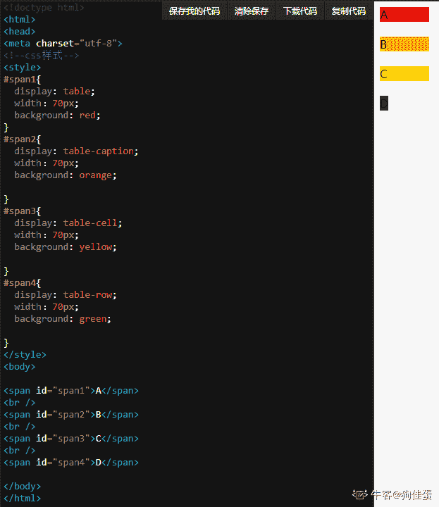
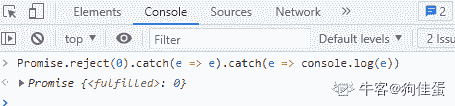
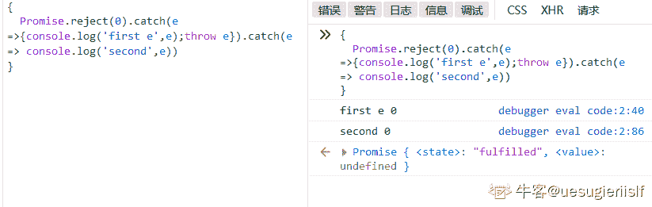
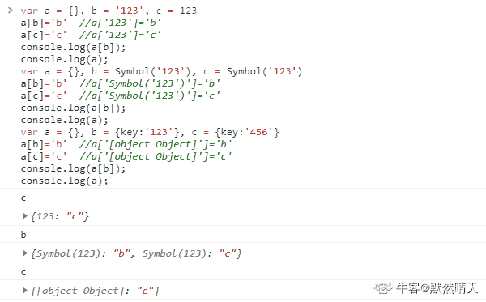
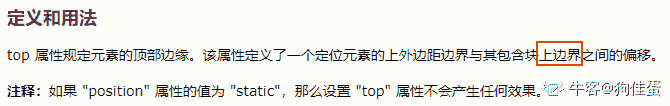
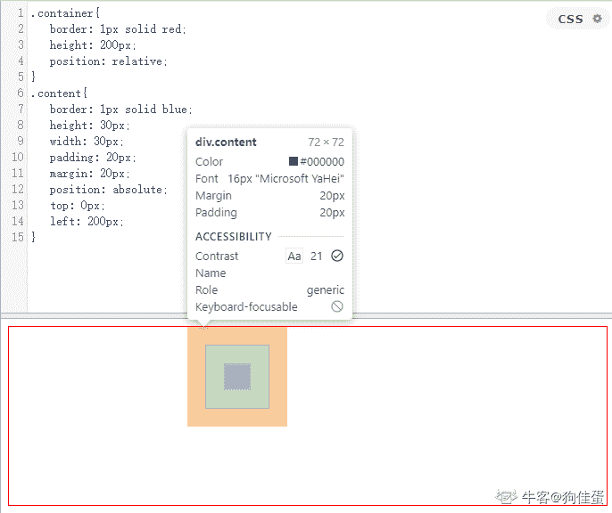
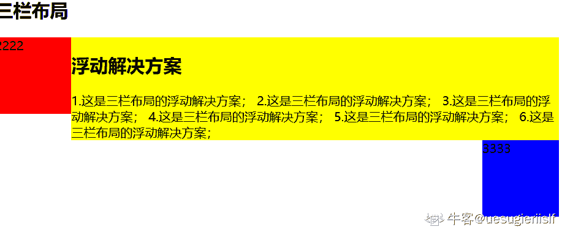
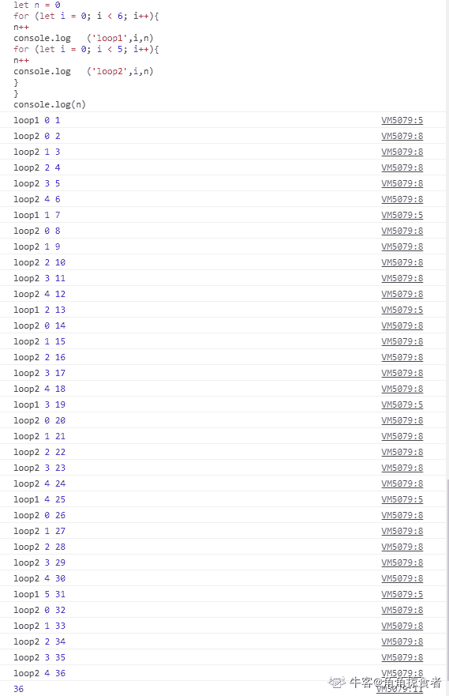

# 哔哩哔哩 2021 校园招聘前端开发方向笔试卷 A

## 1

HTML 的 script 标签，按规范 defer 和 async 属性说法正确的是？

正确答案: C   你的答案: 空 (错误)

```cpp
async 属性的脚本加载和执行不会阻塞页面的渲染
```

```cpp
defer 属性无法保证多脚本的执行顺序
```

```cpp
async 属性的脚本会在加载完毕后立即执行
```

```cpp
defer 属性脚本会在 DOMContentLoaded 事件触发后立即执行
```

本题知识点

Java 工程师 C++工程师 PHP 工程师 golang 工程师 哔哩哔哩 2021

讨论

[uesugieriislf](https://www.nowcoder.com/profile/34068835)

defer

defer 特性告诉浏览器不要等待脚本。相反，浏览器将继续处理 HTML，构建 DOM。脚本会“在后台”下载，然后等 DOM 构建完成后，脚本才会执行。

换句话说：

*   具有 defer 特性的脚本不会阻塞页面。

*   具有 defer 特性的脚本总是要等到 DOM 解析完毕，但在 DOMContentLoaded 事件之前执行。

1.  页面内容立即显示。

2.  DOMContentLoaded 事件处理程序等待具有 defer 特性的脚本执行完成。它仅在脚本下载且执行结束后才会被触发。

3.  defer 特性除了告诉浏览器“不要阻塞页面”之外，还可以确保脚本执行的相对顺序。因此，即使 small.js 先加载完成，它也需要等到 long.js 执行结束才会被执行。

    当我们需要先加载 JavaScript 库，然后再加载依赖于它的脚本时，这可能会很有用。

    如果 <script> 脚本没有 src，则会忽略 defer 特性。

sync

async 特性意味着脚本是完全独立的：

*   浏览器不会因 async 脚本而阻塞（与 defer 类似）。

*   其他脚本不会等待 async 脚本加载完成，同样，async 脚本也不会等待其他脚本。

*   ```cpp
    DOMContentLoaded
    ```

    和异步脚本不会彼此等待：

    *   DOMContentLoaded 可能会发生在异步脚本之前（如果异步脚本在页面完成后才加载完成）

    *   DOMContentLoaded 也可能发生在异步脚本之后（如果异步脚本很短，或者是从 HTTP 缓存中加载的）

我个人认为 defer 和 async 的区别在于前者加载的脚本的顺序是同步的，后者则是异步的。A 选项中执行是有可能阻塞页面的渲染的，加载不会（应该是这样的）

编辑于 2021-06-24 16:01:25

* * *

[last、kiss](https://www.nowcoder.com/profile/482456741)

1 async 脚本下载完成后会立即执行 并且是无序的 2 defer 脚本的执行是可以保证顺序的 3 defer 在 domcontentload 前执行 构建 dom 树完成 出发此事件 页面文档加载完成 出发 load 事件

发表于 2021-08-31 13:14:09

* * *

[MaDic6](https://www.nowcoder.com/profile/988227632)

在浏览器加载 HTML 过程中，HTML 解析器运行于主线程之中，并且在遇到 </script> 标签后会被阻塞，直到脚本从网络中被获取和执行。也就是说<script>标签中的脚本会阻塞浏览器的渲染，这样也被称为“渲染阻塞”。要等 JavaScript 代码加载并执行完毕后才能渲染页面结构。但是不同的是，HTML 解析过程与外部 JS 代码的解析过程分离开来了 Async 是在外部 JS 加载完成后，浏览器空闲时，Load 事件触发前执行；而 Defer 是在 JS 加载完成后，整个文档解析完成后执行。Defer 更像是将<script>标签放在</body>之后的效果，但是它由于是异步加载 JS 文件，所以可以节省时间。

发表于 2021-04-20 15:40:00

* * *

## 2

var p1 = new Promise(function(resolve, reject){resolve("2")})setTimeout(function(){console.log("1")},10)p1.then(function(value){console.log(value)})setTimeout(function(){console.log("3")},0)上例代码执行的输出顺序是？

正确答案: D   你的答案: 空 (错误)

```cpp
  1   2   3 
```

```cpp
  3   1   2 
```

```cpp
  2   1   3 
```

```cpp
  2   3   1 
```

本题知识点

Java 工程师 C++工程师 PHP 工程师 golang 工程师 哔哩哔哩 2021

讨论

[last、kiss](https://www.nowcoder.com/profile/482456741)

Promise.then 属于微任务，而 settimeout 属于宏任务 微任务 优先于 宏任务

发表于 2021-08-31 13:16:18

* * *

## 3

已知节点 foo, 以下哪个样式在现代浏览器默认样式下设置宽度后不会生效？

正确答案: D   你的答案: 空 (错误)

```cpp
display: table
```

```cpp
display: table-caption
```

```cpp
display: table-cell
```

```cpp
display: table-row
```

本题知识点

Java 工程师 C++工程师 PHP 工程师 golang 工程师 哔哩哔哩 2021

讨论

[狗佳蛋](https://www.nowcoder.com/profile/296981211)

| 值 | 描述 |
| table | 此元素会作为块级表格来显示（类似 <table>），表格前后带有换行符。  |
| table-caption | 此元素会作为一个表格标题显示（类似 <caption>）  |
| table-cell | 此元素会作为一个表格单元格显示（类似 <td> 和 <th>）  |
| table-row | 此元素会作为一个表格行显示（类似 <tr>）。       |


 发表于 2021-12-03 14:37:58

* * *

[uesugieriislf](https://www.nowcoder.com/profile/34068835)

这问题哪里有参考啊？为什么我都没有找到？

发表于 2021-06-24 16:25:59

* * *

## 4

在 JavaScript 中，要实现遍历一个数组并在满足特定条件时中止遍历，可以使用哪种方法？

正确答案: B   你的答案: 空 (错误)

```cpp
filter
```

```cpp
some
```

```cpp
forEach
```

```cpp
reduce
```

本题知识点

Java 工程师 C++工程师 PHP 工程师 golang 工程师 哔哩哔哩 2021

讨论

[忘魂儿](https://www.nowcoder.com/profile/107947914)

emm,那我 forEach 加个 return;是不是也可以终止呢？

发表于 2021-10-06 17:27:44

* * *

[uesugieriislf](https://www.nowcoder.com/profile/34068835)

[arr.some(fn)](https://developer.mozilla.org/zh/docs/Web/JavaScript/Reference/Global_Objects/Array/some)/[arr.every(fn)](https://developer.mozilla.org/zh/docs/Web/JavaScript/Reference/Global_Objects/Array/every) 检查数组。

与 map 类似，对数组的每个元素调用函数 fn。如果任何/所有结果为 true，则返回 true，否则返回 false。

这两个方法的行为类似于||和&&运算符：如果 fn 返回一个真值，arr.some()立即返回 true 并停止迭代其余数组项；如果 fn 返回一个假值，arr.every()立即返回 false 并停止对其余数组项的迭代。

发表于 2021-06-24 16:28:38

* * *

## 5

以下表达式，正确的是

正确答案: D   你的答案: 空 (错误)

```cpp
Number('a') == Number('a')
```

```cpp
-1 == true
```

```cpp
3 + '2' === 5
```

```cpp
![] == ''
```

本题知识点

Java 工程师 C++工程师 PHP 工程师 golang 工程师 哔哩哔哩 2021

讨论

[陈文杰 0913](https://www.nowcoder.com/profile/446233848)

相等和不相等——先转换再比较      （==）对于相等和不相等操作符：在 JS 高程中一书中给出如下的基本转换规则
    ①、如果有一个操作数是布尔值，则在比较相等性之前先将其转换为数值——false 转换为 0，而 true 转换为 1；     
    ②、如果一个操作数是字符串，另一个操作数是数值，在比较相等性之前先将字符串转换为数值
    ③、如果一个操作数是对象，另一个操作数不是，则调用对象的 valueOf()方法，用得到的基本类型值按照前面的规则进行比较 这两个操作符在进行比较时则要遵循下列规则。
    ①、null 和 undefined 是相等的
    ②、要比较相等性之前，不能将 null 和 undefined 转换成其他任何值
    ③、如果有一个操作数是 NaN，则相等操作符返回 false ，而不相等操作符返回 true。重要提示：即使两个操作数都是 NaN，相等操作符也返回 false 了；**因为按照规则， NaN 不等于 NaN**
    ④、如果两个操作数都是对象，则比较它们是不是同一个对象，如果两个操作数都指向同一个对象，则相等操作符返回 true；否则， 返回 false  ```cpp
Number('a') == Number('a')
```

Number('a') //NaN    ****NaN 不等于 NaN   故为 false**** **！可将变量转换成 boolean 类型，null、undefined、NaN 以及空字符串('')取反都为 true，其余都为 false。**  ```cpp
-1 == true
```

     true 转换为 1   -1==1  明显错误，为 false  ```cpp
![] == ''
```

![] 转换为 false    也就是 false == ‘’   再转换为 0 == ''    将空字符串转换为数值   Number('')   返回的是 0   也就是 0==0   明显返回值为 true

全等和不全等——仅比较而不转换  （===）

发表于 2021-09-03 17:27:07

* * *

[last、kiss](https://www.nowcoder.com/profile/482456741)

-1 == true 比较之前先把 true 转换为 1 -1 == 1 明显 false

发表于 2021-08-31 13:22:23

* * *

[uesugieriislf](https://www.nowcoder.com/profile/34068835)

Number('a')//NaNNaN==NaN//false [`blog.csdn.net/magic_xiang/article/details/83686224`](https://blog.csdn.net/magic_xiang/article/details/83686224)D 选项比较复杂，详细看链接。简单来说，就是

```cpp
![] ==false
''==false
所以![]==''
```

！可将变量转换成 boolean 类型，null、undefined、NaN 以及空字符串('')取反都为 true，其余都为 false。如果一个操作数是对象，另一个操作数不是，则调用对象的 valueOf()方法，用得到的基本类型值按照前面的规则进行比较，如果对象没有 valueOf()方法，则调用 toString()）

而对于空数组，[].toString() ->  '' (返回的是空字符串)

也就是  [] == 0 相当于 '' == 0

发表于 2021-06-24 16:45:04

* * *

## 6

设置下列哪个请求头信息，跨域时不会触发 OPTIONS 请求?

正确答案: B   你的答案: 空 (错误)

```cpp
X-Request-FROM: bilibili
```

```cpp
Accept: application/json
```

```cpp
Content-Type: application/json
```

```cpp
Range: 0-
```

本题知识点

Java 工程师 C++工程师 PHP 工程师 golang 工程师 哔哩哔哩 2021

讨论

[uesugieriislf](https://www.nowcoder.com/profile/34068835)

[`developer.mozilla.org/zh-CN/docs/Web/HTTP/CORS#%E7%AE%80%E5%8D%95%E8%AF%B7%E6%B1%82`](https://developer.mozilla.org/zh-CN/docs/Web/HTTP/CORS#%E7%AE%80%E5%8D%95%E8%AF%B7%E6%B1%82)

单请求

某些请求不会触发 [CORS 预检请求](https://developer.mozilla.org/zh-CN/docs/Web/HTTP/CORS#preflighted_requests)。本文称这样的请求为“简单请求”，请注意，该术语并不属于 [Fetch](https://fetch.spec.whatwg.org/) （其中定义了 CORS）规范。若请求满足所有下述条件，则该请求可视为“简单请求”：

*   使用下列方法之一：

    *   [GET](https://developer.mozilla.org/zh-CN/docs/Web/HTTP/Methods/GET)

    *   [HEAD](https://developer.mozilla.org/zh-CN/docs/Web/HTTP/Methods/HEAD)

    *   [POST](https://developer.mozilla.org/zh-CN/docs/Web/HTTP/Methods/POST)

*   除了被用户代理自动设置的首部字段（例如

    Connection

    ，

    User-Agent

    ）和在 Fetch 规范中定义为

    禁用首部名称

    的其他首部，允许人为设置的字段为 Fetch 规范定义的

    对 CORS 安全的首部字段集合

    。该集合为：

    *   [Accept](https://developer.mozilla.org/zh-CN/docs/Web/HTTP/Headers/Accept)

    *   [Accept-Language](https://developer.mozilla.org/zh-CN/docs/Web/HTTP/Headers/Accept-Language)

    *   [Content-Language](https://developer.mozilla.org/zh-CN/docs/Web/HTTP/Headers/Content-Language)

    *   [Content-Type](https://developer.mozilla.org/zh-CN/docs/Web/HTTP/Headers/Content-Type) （需要注意额外的限制）

    *   DPR

    *   Downlink

    *   Save-Data

    *   Viewport-Width

    *   Width

*   Content-Type

    的值仅限于下列三者之一：

    *   text/plain

    *   multipart/form-data

    *   application/x-www-form-urlencoded

*   请求中的任意 XMLHttpRequestUpload 对象均没有注册任何事件监听器；XMLHttpRequestUpload 对象可以使用 [XMLHttpRequest.upload](https://developer.mozilla.org/zh-CN/docs/Web/API/XMLHttpRequest/upload) 属性访问。

*   请求中没有使用 [ReadableStream](https://developer.mozilla.org/zh-CN/docs/Web/API/ReadableStream) 对象。

发表于 2021-06-24 16:52:37

* * *

[有没有人要我啊](https://www.nowcoder.com/profile/261802183)

Accept 属于请求头，表示客户端希望接收那种数据类型
    Accept:text/xml:表示客户端希望接受 xml 类型
Content-Type:实体头，表示发送端发送的实体数据的类型
    Content-Type:text/html：表示请求发送的数据是类型是 html

发表于 2021-05-31 21:19:55

* * *

## 7

```cpp
比较一组版本号，将其按从小到大顺序排列
```

本题知识点

Java 工程师 C++工程师 PHP 工程师 golang 工程师 哔哩哔哩 2021

讨论

[忘魂儿](https://www.nowcoder.com/profile/107947914)

这个对输入输出有严格要求，每次结果自测看下，好好看好好学

```cpp
var s=readline().slice(1,-1).replace(/'\'/g,'').split(', ')
s.sort()
var news=s.join(', ')
console.log(`[${news}]`)
```

发表于 2021-10-06 17:35:32

* * *

[狗佳蛋](https://www.nowcoder.com/profile/296981211)

输入描述都说了是字符串数组 合着最后运行检测的是“数组字符串”

发表于 2021-12-03 15:11:43

* * *

[牛客 63469396 号](https://www.nowcoder.com/profile/63469396)

这个咋输入啊？

发表于 2021-09-15 19:24:09

* * *

## 8

有以下 ES6 代码 function * gen() {yield 1;yield 2;yield 3;}以下说法正确的是：

正确答案: C   你的答案: 空 (错误)

```cpp
gen()执行后返回 2
```

```cpp
gen()执行后返回 undefined
```

```cpp
gen()执行后返回一个 Generator 对象
```

```cpp
gen()执行后返回 1
```

本题知识点

Java 工程师 C++工程师 PHP 工程师 golang 工程师 哔哩哔哩 2021

## 9

给定正整数 n，找到最少数量的完全平方数使得他们的和等于 n

本题知识点

Java 工程师 C++工程师 PHP 工程师 golang 工程师 哔哩哔哩 2021

讨论

[天行 43](https://www.nowcoder.com/profile/4378118)

此题数据集有问题

发表于 2021-04-13 21:07:16

* * *

[娴七紫](https://www.nowcoder.com/profile/788209154)

[`leetcode-cn.com/problems/perfect-squares/`](https://leetcode-cn.com/problems/perfect-squares/)

发表于 2022-03-22 11:14:48

* * *

[狗佳蛋](https://www.nowcoder.com/profile/296981211)

```cpp
let temp = 0
function sqrtNum(target){
    temp++
    const num1 = Math.sqrt(target)

    if(Math.floor(num1) !== num1){
        sqrtNum(target - Math.pow(Math.floor(num1), 2))
    }else{
        console.log(temp)
        temp = 0
        return
    }
}
sqrtNum(readline())
```

 发表于 2021-12-03 14:55:33

* * *

## 10

执行以下代码，正确的输出结果是：console.log(Object.prototype.toString.call(undefined))

正确答案: C   你的答案: 空 (错误)

```cpp
[Object Undefined]
```

```cpp
"[object Undefined]"
```

```cpp
[object Undefined]
```

```cpp
[object undefined]
```

本题知识点

Java 工程师 C++工程师 PHP 工程师 golang 工程师 哔哩哔哩 2021

讨论

[MaDic6](https://www.nowcoder.com/profile/988227632)

用 typeof 是否能准确判断一个对象变量，答案是否定的，null 的结果也是 object，数组的结果也是 object，有时候我们需要的是 "纯粹" 的 object 对象。如何避免呢？比较好的方式是：
console.log(Object.prototype.toString.call("jerry"));//[object String]console.log(Object.prototype.toString.call(12));//[object Number]
console.log(Object.prototype.toString.call(true));//[object Boolean]
console.log(Object.prototype.toString.call(undefined));//[object Undefined]
console.log(Object.prototype.toString.call(null));//[object Null]
console.log(Object.prototype.toString.call({name: "jerry"}));//[object Object]
console.log(Object.prototype.toString.call(function(){}));//[object Function]
console.log(Object.prototype.toString.call([]));//[object Array]
console.log(Object.prototype.toString.call(new Date));//[object Date]
console.log(Object.prototype.toString.call(/\d/));//[object RegExp]
function Person(){};
console.log(Object.prototype.toString.call(new Person));//[object Object]

发表于 2021-04-20 17:27:39

* * *

[uesugieriislf](https://www.nowcoder.com/profile/34068835)

[`zh.javascript.info/instanceof#fu-li-shi-yong-objectprototypetostring-fang-fa-lai-jie-shi-lei-xing`](https://zh.javascript.info/instanceof#fu-li-shi-yong-objectprototypetostring-fang-fa-lai-jie-shi-lei-xing)

发表于 2021-06-24 17:03:37

* * *

## 11

输入一个 long 类型的数值, 求该数值的 8 进制表示中的 7 的个数

本题知识点

Java 工程师 C++工程师 PHP 工程师 golang 工程师 哔哩哔哩 2021

讨论

[谷随谷](https://www.nowcoder.com/profile/456068871)

//toString 转进制，split 转数组，forEach 做遍历，item 代表遍历元素而不是遍历索引 var num=parseInt(readline());var str=num.toString(8);var arr=str.split("");var n=0;arr.forEach(function(item){    if(item=='7'){        n++;    }});console.log(n); 发表于 2021-10-12 21:43:08

* * *

[罗德岛的刀客塔](https://www.nowcoder.com/profile/192260697)

可以使用 toString(8)将数字转换为 8 进制表示的字符串，并以 split('')分割为单个字符，遍历判断是否有"7"，有计数加 1，没有计数不变。

```cpp
let line, count = 0,
    linesNum, linesString;
    while (line = readline()) {
        let lines = line.split(' ');
        linesNum = +lines[0];
        linesString = linesNum.toString(8).split('');
        linesString.map((a) => a === "7" ? ++count : count);
    }
    print(count);
```

编辑于 2021-08-19 11:16:52

* * *

[Ye11ow](https://www.nowcoder.com/profile/473629031)

怎没人

发表于 2021-04-16 18:06:18

* * *

## 12

执行以下代码，正确的输出结果是：let obj1 = {a: 1,foo: () => {console.log(this.a)}}// log1obj1.foo()const obj2 = obj1.foo// log2obj2()

正确答案: A   你的答案: 空 (错误)

```cpp
  log1: undefined   log2: undefined 
```

```cpp
  log1: 1   log2: undefined 
```

```cpp
  log1: 1   log2: 1 
```

```cpp
  log1: undefined   log2: 1 
```

本题知识点

Java 工程师 C++工程师 PHP 工程师 golang 工程师 哔哩哔哩 2021

讨论

[MaDic6](https://www.nowcoder.com/profile/988227632)

箭头函数没有 this 则箭头函数里的上下为 obj 的上下文 则是 windows 所以第一个是 undefined

发表于 2021-04-20 17:29:23

* * *

## 13

以下哪个不是 元素的输入类型

正确答案: B   你的答案: 空 (错误)

```cpp
email
```

```cpp
telphone
```

```cpp
time
```

```cpp
datetime
```

本题知识点

Java 工程师 C++工程师 PHP 工程师 golang 工程师 哔哩哔哩 2021

讨论

[娴七紫](https://www.nowcoder.com/profile/788209154)

[`www.runoob.com/tags/att-input-type.html`](https://www.runoob.com/tags/att-input-type.html)

发表于 2022-03-22 15:31:56

* * *

[小海 hoese](https://www.nowcoder.com/profile/200284168)

input 的输入类型：color，date，datetime，datetime-local，email，month，number，range，search，tel，time，url，week

发表于 2021-09-14 19:30:10

* * *

## 14

执行以下代码，错误的输出结果是

正确答案: C   你的答案: 空 (错误)

```cpp
  输入：typeof {"x":1}   输出："object" 
```

```cpp
  输入：typeof 1   输出："number" 
```

```cpp
  输入：typeof [{x:1}]   输出："array" 
```

```cpp
  输入：typeof NaN   输出："number" 
```

本题知识点

Java 工程师 C++工程师 PHP 工程师 golang 工程师 哔哩哔哩 2021

讨论

[Jimmy0.0](https://www.nowcoder.com/profile/285822030)

typeof 关键字只能检测基本的数据类型，对于函数返回"function" , NaN 返回"number"，对于其他引用数据类型，统一返回"object" 。

```cpp
const typeofPrint = {
    obj:typeof {},
    Func:typeof function(){},
    string: typeof "",
    number: typeof 0,
    boolean: typeof true,
    NaN:typeof NaN,
    null:typeof null,
    undefined:typeof undefined,
}

console.group(typeofPrint);
```

发表于 2022-03-20 12:46:22

* * *

[陈文杰 0913](https://www.nowcoder.com/profile/446233848)

NaN 是 ‘not a number’ 的缩写，表示 “不是一个数字”通常会在一个数字和其他类型运算过程中产生：虽然它 “不是一个数字”，但是 NaN 的 typeof 结果却是 numberNaN 和任何变量都不相等，包括 NaN 自己 console.log(NaN === NaN); // false 判断一个变量是不是 NaN 可以用 isNaN()函数但是这并不是一个完美的函数，有些时候用 value !== value 似乎更准确，ES6 中呢已经有 Number.isNaN()方法，将比 isNaN()准确的多。

编辑于 2021-09-05 16:22:37

* * *

## 15

以下关于 HTTP Status Code 描述错误的是

正确答案: B   你的答案: 空 (错误)

```cpp
200 请求成功
```

```cpp
302 服务器拒绝处理该请求
```

```cpp
500 服务器出错
```

```cpp
405 请求中的方法不被允许使用
```

本题知识点

Java 工程师 C++工程师 PHP 工程师 golang 工程师 哔哩哔哩 2021

讨论

[MaDic6](https://www.nowcoder.com/profile/988227632)

比较常见的 HTTP 状态码吧！

2 开头 （请求成功）表示成功处理了请求的状态代码。

200   （成功）  服务器已成功处理了请求。 通常，这表示服务器提供了请求的网页。 
201   （已创建）  请求成功并且服务器创建了新的资源。 
202   （已接受）  服务器已接受请求，但尚未处理。 
203   （非授权信息）  服务器已成功处理了请求，但返回的信息可能来自另一来源。 
204   （无内容）  服务器成功处理了请求，但没有返回任何内容。 
205   （重置内容） 服务器成功处理了请求，但没有返回任何内容。
206   （部分内容）  服务器成功处理了部分 GET 请求。

3 开头 （请求被重定向）表示要完成请求，需要进一步操作。 通常，这些状态代码用来重定向。

300   （多种选择）  针对请求，服务器可执行多种操作。 服务器可根据请求者 (user agent) 选择一项操作，或提供操作列表供请求者选择。 
301   （永久移动）  请求的网页已永久移动到新位置。 服务器返回此响应（对 GET 或 HEAD 请求的响应）时，会自动将请求者转到新位置。
302   （临时移动）  服务器目前从不同位置的网页响应请求，但请求者应继续使用原有位置来进行以后的请求。
303   （查看其他位置） 请求者应当对不同的位置使用单独的 GET 请求来检索响应时，服务器返回此代码。
304   （未修改） 自从上次请求后，请求的网页未修改过。 服务器返回此响应时，不会返回网页内容。 
305   （使用代理） 请求者只能使用代理访问请求的网页。 如果服务器返回此响应，还表示请求者应使用代理。 
307   （临时重定向）  服务器目前从不同位置的网页响应请求，但请求者应继续使用原有位置来进行以后的请求。

4 开头 （请求错误）这些状态代码表示请求可能出错，妨碍了服务器的处理。

400   （错误请求） 服务器不理解请求的语法。 
401   （未授权） 请求要求身份验证。 对于需要登录的网页，服务器可能返回此响应。 
403   （禁止） 服务器拒绝请求。
404   （未找到） 服务器找不到请求的网页。
405   （方法禁用） 禁用请求中指定的方法。 
406   （不接受） 无法使用请求的内容特性响应请求的网页。 
407   （需要代理授权） 此状态代码与 401（未授权）类似，但指定请求者应当授权使用代理。
408   （请求超时）  服务器等候请求时发生超时。 
409   （冲突）  服务器在完成请求时发生冲突。 服务器必须在响应中包含有关冲突的信息。 
410   （已删除）  如果请求的资源已永久删除，服务器就会返回此响应。 
411   （需要有效长度） 服务器不接受不含有效内容长度标头字段的请求。 
412   （未满足前提条件） 服务器未满足请求者在请求中设置的其中一个前提条件。 
413   （请求实体过大） 服务器无法处理请求，因为请求实体过大，超出服务器的处理能力。 
414   （请求的 URI 过长） 请求的 URI（通常为网址）过长，服务器无法处理。 
415   （不支持的媒体类型） 请求的格式不受请求页面的支持。 
416   （请求范围不符合要求） 如果页面无法提供请求的范围，则服务器会返回此状态代码。 
417   （未满足期望值） 服务器未满足"期望"请求标头字段的要求。

5 开头（服务器错误）这些状态代码表示服务器在尝试处理请求时发生内部错误。 这些错误可能是服务器本身的错误，而不是请求出错。

500   （服务器内部错误）  服务器遇到错误，无法完成请求。 
501   （尚未实施） 服务器不具备完成请求的功能。 例如，服务器无法识别请求方法时可能会返回此代码。 
502   （错误网关） 服务器作为网关或代理，从上游服务器收到无效响应。 
503   （服务不可用） 服务器目前无法使用（由于超载或停机维护）。 通常，这只是暂时状态。 
504   （网关超时）  服务器作为网关或代理，但是没有及时从上游服务器收到请求。 
505   （HTTP 版本不受支持） 服务器不支持请求中所用的 HTTP 协议版本。

发表于 2021-04-20 17:49:49

* * *

[娴七紫](https://www.nowcoder.com/profile/788209154)

**100** Continue 继续。客户端应继续其请求**101** Switching Protocols 切换协议。服务器根据客户端的请求切换协议。只能切换到更高级的协议，例如，切换到 HTTP 的新版本协议**200** OK 请求成功。一般用于 GET 与 POST 请求**201** Created 已创建。成功请求并创建了新的资源**202** Accepted 已接受。已经接受请求，但未处理完成**203** Non-Authoritative Information 非授权信息。请求成功。但返回的 meta 信息不在原始的服务器，而是一个副本**204** No Content 无内容。服务器成功处理，但未返回内容。在未更新网页的情况下，可确保浏览器继续显示当前文档**205** Reset Content 重置内容。服务器处理成功，用户终端（例如：浏览器）应重置文档视图。可通过此返回码清除浏览器的表单域**206** Partial Content 部分内容。服务器成功处理了部分 GET 请求**300** Multiple Choices 多种选择。请求的资源可包括多个位置，相应可返回一个资源特征与地址的列表用于用户终端（例如：浏览器）选择**301** Moved Permanently 永久移动。请求的资源已被永久的移动到新 URI，返回信息会包括新的 URI，浏览器会自动定向到新 URI。今后任何新的请求都应使用新的 URI 代替**302** Found 临时移动。与 301 类似。但资源只是临时被移动。客户端应继续使用原有 URI**303** See Other 查看其它地址。与 301 类似。使用 GET 和 POST 请求查看**304** Not Modified 未修改。所请求的资源未修改，服务器返回此状态码时，不会返回任何资源。客户端通常会缓存访问过的资源，通过提供一个头信息指出客户端希望只返回在指定日期之后修改的资源**305** Use Proxy 使用代理。所请求的资源必须通过代理访问**306** Unused 已经被废弃的 HTTP 状态码**307** Temporary Redirect 临时重定向。与 302 类似。使用 GET 请求重定向**400** Bad Request 客户端请求的语法错误，服务器无法理解**401** Unauthorized 请求要求用户的身份认证**402** Payment Required 保留，将来使用**403** Forbidden 服务器理解请求客户端的请求，但是拒绝执行此请求**404** Not Found 服务器无法根据客户端的请求找到资源（网页）。通过此代码，网站设计人员可设置"您所请求的资源无法找到"的个性页面**405** Method Not Allowed 客户端请求中的方法被禁止**406** Not Acceptable 服务器无法根据客户端请求的内容特性完成请求**407** Proxy Authentication Required 请求要求代理的身份认证，与 401 类似，但请求者应当使用代理进行授权**408** Request Time-out 服务器等待客户端发送的请求时间过长，超时**409** Conflict 服务器完成客户端的 PUT 请求是可能返回此代码，服务器处理请求时发生了冲突**410** Gone 客户端请求的资源已经不存在。410 不同于 404，如果资源以前有现在被永久删除了可使用 410 代码，网站设计人员可通过 301 代码指定资源的新位置**411** Length Required 服务器无法处理客户端发送的不带 Content-Length 的请求信息**412** Precondition Failed 客户端请求信息的先决条件错误**413** Request Entity Too Large 由于请求的实体过大，服务器无法处理，因此拒绝请求。为防止客户端的连续请求，服务器可能会关闭连接。如果只是服务器暂时无法处理，则会包含一个 Retry-After 的响应信息**414** Request-URI Too Large 请求的 URI 过长（URI 通常为网址），服务器无法处理**415** Unsupported Media Type 服务器无法处理请求附带的媒体格式**416** Requested range not satisfiable 客户端请求的范围无效**417** Expectation Failed 服务器无法满足 Expect 的请求头信息**500** Internal Server Error 服务器内部错误，无法完成请求**501** Not Implemented 服务器不支持请求的功能，无法完成请求**502** Bad Gateway 作为网关或者代理工作的服务器尝试执行请求时，从远程服务器接收到了一个无效的响应**503** Service Unavailable 由于超载或系统维护，服务器暂时的无法处理客户端的请求。延时的长度可包含在服务器的 Retry-After 头信息中**504** Gateway Time-out 充当网关或代理的服务器，未及时从远端服务器获取请求**505** HTTP Version not supported 服务器不支持请求的 HTTP 协议的版本，无法完成处理

发表于 2022-03-22 16:48:03

* * *

## 16

样式权重的优先级下面正确的是？

正确答案: A   你的答案: 空 (错误)

```cpp
!important > 行内样式(style) > id > class > tag
```

```cpp
行内样式(style) > !important > id > tag > class 
```

```cpp
id > 行内样式(style) > !important > class > tag
```

```cpp
id > !important > 行内样式(style) > tag > class
```

本题知识点

Java 工程师 C++工程师 PHP 工程师 golang 工程师 哔哩哔哩 2021

## 17

数组以下哪个方法会影响原数组？

正确答案: B   你的答案: 空 (错误)

```cpp
concat
```

```cpp
splice
```

```cpp
slice
```

```cpp
join
```

本题知识点

Java 工程师 C++工程师 iOS 工程师 安卓工程师 运维工程师 前端工程师 算法工程师 PHP 工程师 测试工程师 安全工程师 c#工程师 数据库工程师 大数据开发工程师 数据分析工程师 数据挖掘工程师 测试开发工程师 哔哩哔哩 2020 golang 工程师 2021

讨论

[last、kiss](https://www.nowcoder.com/profile/482456741)

slice 截取数组的一部分 返回新数组 splice 直接操作原数组

发表于 2021-08-31 13:41:49

* * *

[uesugieriislf](https://www.nowcoder.com/profile/34068835)

concat：concat() 连接两个或者更多地数组，并返回结果。不改变原数组。 splice：可以删除、添加、替换原数组的元素。直接操作原数组。slice：复制出一个新数组 split：它通过给定的分隔符 delim 将字符串分割成一个数组。
join：与 split 相反。它会在它们之间创建一串由 glue 粘合的 arr 项。

发表于 2021-06-25 08:51:24

* * *

[可口 coco](https://www.nowcoder.com/profile/263662460)

*请注意，该方法并不会修改数组，而是返回一个子数组。如果想删除数组中的一段元素，应该使用方法 Array.splice()。* 发表于 2019-12-24 10:54:18

* * *

## 18

对一个宽高相等，仅有 background 为纯色的 div 新增或修改如下其中一个 css 属性，不可以得到圆形图案的是？

正确答案: A   你的答案: 空 (错误)

```cpp
transform
```

```cpp
border-radius
```

```cpp
clip-path
```

```cpp
background
```

本题知识点

Java 工程师 C++工程师 PHP 工程师 golang 工程师 哔哩哔哩 2021

讨论

[uesugieriislf](https://www.nowcoder.com/profile/34068835)

[`tiaocaoer.com/blog/css_circle.html`](http://tiaocaoer.com/blog/css_circle.html)

目前主要有四种方法：

border-radius

SVG

clip-path

radial-gradient：radial-gradient()` CSS 函数创建了一个图像，该图像是由从原点发出的两种或者多种颜色之间的逐步过渡组成。它的形状可以是圆形（circle）或椭圆形（ellipse）。

径向渐变。

发表于 2021-06-25 09:24:17

* * *

## 19

const a = 10function runFunction() {const a = 20console.log('inside', a)}runFunction()console.log('outside', a)

正确答案: B   你的答案: 空 (错误)

```cpp
  inside 20   outside 20 
```

```cpp
  inside 20   outside 10 
```

```cpp
  inside 10   outside 20 
```

```cpp
程序报错
```

本题知识点

Java 工程师 C++工程师 PHP 工程师 golang 工程师 哔哩哔哩 2021

## 20

.rect {width: 100px;height: 100px;background: #91B493;text-align: center;font-size: 20px;color: #FEDFE1;transition: all 1s;}.rect:hover {transform: rotate(0.5turn) scale(0.5);background: #81C7D4;}当鼠标 经过会产生什么效果

正确答案: C   你的答案: 空 (错误)

```cpp
  改变文字颜色   改变背景颜色   宽度变大一倍 
```

```cpp
  整体放大一倍   整体旋转 360 度   改变背景颜色 
```

```cpp
  整体缩小一半   整体旋转 180 度   改变背景颜色 
```

```cpp
  文字缩小一半   改变背景颜色   整体旋转 360 度 
```

本题知识点

Java 工程师 C++工程师 PHP 工程师 golang 工程师 哔哩哔哩 2021

## 21

执行以下代码，正确的输出结果是：Promise.reject(0).catch(e => e).catch(e => console.log(e))

正确答案: D   你的答案: 空 (错误)

```cpp
0
```

```cpp
Promise 对象
```

```cpp
undefined
```

```cpp
无
```

本题知识点

Java 工程师 C++工程师 PHP 工程师 golang 工程师 哔哩哔哩 2021

讨论

[狗佳蛋](https://www.nowcoder.com/profile/296981211)



发表于 2021-12-03 15:34:09

* * *

[羽齐](https://www.nowcoder.com/profile/327882672)

第一个 catch 执行后返回的已经是一个成功的 Promise 对象了，所以不会执行第二个 catch 的回调

发表于 2021-06-30 16:30:31

* * *

[uesugieriislf](https://www.nowcoder.com/profile/34068835)

做到一道异常的题目，但是我对异常处理不太了解，所以做错了。

```cpp
Promise.reject(0).catch(e => e).catch(e => console.log(e)) 
```

我以为这是和 then 一样的，e 会被传递到最后，所以会被输出。但是其实错误处理是只执行最近的一个 catch 的。所以只有第一个 catch 被执行了。

但是其实 catch 也是可以写成链的。那就是其中一个 catch 没能处理掉 error，则抛出这个错误给下一个 catch。这样子就能传递下去了。

 

所以这道题目的结果就是无，因为第一个 catch 并没有输出什么内容，只是返回了 e。

发表于 2021-06-25 09:42:28

* * *

## 22

var a={}, b='123', c=123;a[b]='b';a[c]='c';console.log(a[b]);// example 2var a={}, b=Symbol('123'), c=Symbol('123');a[b]='b';a[c]='c';console.log(a[b]);// example 3var a={}, b={key:'123'}, c={key:'456'};a[b]='b';a[c]='c';console.log(a[b]);

正确答案: D   你的答案: 空 (错误)

```cpp
  b   b   b 
```

```cpp
  c   b   b 
```

```cpp
  c   c   b 
```

```cpp
  c   b   c 
```

本题知识点

Java 工程师 C++工程师 PHP 工程师 golang 工程师 哔哩哔哩 2021

讨论

[默然晴天](https://www.nowcoder.com/profile/525842577)

对象的属性名可是字符串和 Symbol 值，对象中的键名是字符串却可以不用引号，但是如果以 a[b]的形式调用对象属性名的时候，此时 b 一定得是有引号的。其他类型会被自动转换成字符串。其他类型的值转为字符串，会调用 toString()方法。对于第一个和第三个，由于键名相同，所以，相当于重复赋值，后面的值覆盖了前面的值，而 Symbol 的值是唯一的，所以有两个不同的键名，故答案为字符串 c、b、c。有关详解见[`www.cnblogs.com/bryanfu/p/15139555.html`](https://www.cnblogs.com/bryanfu/p/15139555.html)

发表于 2021-08-13 23:58:14

* * *

[last、kiss](https://www.nowcoder.com/profile/482456741)

1 symbol 的值都各不相同 唯一 所以不会被覆盖 2 对象的键名如果不是字符串的话 会调用 tostring 方法 转换为 [object type] 相同 会进行覆盖

发表于 2021-08-31 14:01:11

* * *

[uesugieriislf](https://www.nowcoder.com/profile/34068835)

对象的属性名没有保留字的限制，可以是任意的字符串或 Symbol。其它类型会被自动转换成字符串。比如数字 0 会被转换成’0‘。

```cpp
 var a={}, b='123', c=123; a[b]='b'; a[c]='c'; console.log(a[b]);//c 会被转换成字符串‘123’，所以 a[b]=a[c] // example 2 var a={}, b=Symbol('123'), c=Symbol('123'); a[b]='b'; a[c]='c'; console.log(a[b]);//Symbol 不用说，b 不会等于 c // example 3 var a={}, b={key:'123'}, c={key:'456'}; a[b]='b'; a[c]='c'; console.log(a[b]); 
```

e3 的情况比较复杂。因为键名称只能是字符串，b/c 单做键会调用 toString 得到的都是[object Object]，a[b],a[c]都等价于 a["[object Object]"]，那不就是更新[object Object]这个键的值了

[`blog.csdn.net/namechenfl/article/details/80945150`](https://blog.csdn.net/namechenfl/article/details/80945150)

发表于 2021-06-25 10:03:54

* * *

## 23

以下哪种 CSS 样式会尝试开启硬件加速 ？

正确答案: B   你的答案: 空 (错误)

```cpp
transform: translateY(0);
```

```cpp
transform: translateZ(0);
```

```cpp
transform: scale(1.1);
```

```cpp
transform: translateX(0);
```

本题知识点

Java 工程师 C++工程师 PHP 工程师 golang 工程师 哔哩哔哩 2021

讨论

[uesugieriislf](https://www.nowcoder.com/profile/34068835)

[`blog.csdn.net/apzlm9110/article/details/101811941`](https://blog.csdn.net/apzlm9110/article/details/101811941)

可是在一些情况下，我们并不需要对元素应用 3D 变换的效果，那怎么办呢？这时候我们可以使用个小技巧“欺骗”浏览器来开启硬件加速。

虽然我们可能不想对元素应用 3D 变换，可我们一样可以开启 3D 引擎。例如我们可以用 transform: translateZ(0); 来开启硬件加速 。

.cube {

-webkit-transform: translateZ(0);

-moz-transform: translateZ(0);

-ms-transform: translateZ(0);

-o-transform: translateZ(0);

transform: translateZ(0);

/* Other transform properties here */

}

原生的移动端应用(Native mobile applications)总是可以很好的运用 GPU，这是为什么它比网页应用(Web apps)表现更好的原因。硬件加速在移动端尤其有用，因为它可以有效的减少资源的利用(移动端本身资源有限)。

发表于 2021-06-25 10:16:04

* * *

## 24

执行以下代码，正确的输出结果是：for(let i = 0; i < 3; i++) {setTimeout(function() {console.log(i);}, 1000);}

正确答案: B   你的答案: 空 (错误)

```cpp
0，0，0
```

```cpp
0，1，2
```

```cpp
3，3，3
```

```cpp
1，2，3
```

本题知识点

Java 工程师 C++工程师 PHP 工程师 golang 工程师 哔哩哔哩 2021

讨论

[iknyea](https://www.nowcoder.com/profile/458413434)

let 块级作用域

发表于 2021-09-11 19:15:32

* * *

## 25

<style type="text/css">.area {height: 100px;}.box {transition: height 1s;background: #000;}</style><div class="area"><div class="box"></div></div><script>document.querySelector('.area').addEventListener('click', () => {document.querySelector('.box').style.height = '100px';});</script>点击 area，box 高度的表现是？

正确答案: D   你的答案: 空 (错误)

```cpp
高度保持 100 不变
```

```cpp
高度保持 0 不变
```

```cpp
高度从 0 渐变为 100
```

```cpp
高度从 0 瞬变为 100
```

本题知识点

Java 工程师 C++工程师 PHP 工程师 golang 工程师 哔哩哔哩 2021

讨论

[uesugieriislf](https://www.nowcoder.com/profile/34068835)

[`www.cnblogs.com/xiaohuochai/p/5347930.html`](https://www.cnblogs.com/xiaohuochai/p/5347930.html)

若过渡起始值或过渡开始值为 auto，则浏览器不会自己计算成具体数字值，而是不发生过渡效果。所以要过渡某些属性，首先需要将其重置成具体数字值

[`my.oschina.net/u/560237/blog/4436456`](https://my.oschina.net/u/560237/blog/4436456)

解决方法则是设置 max-height

发表于 2021-06-25 10:47:36

* * *

## 26

关于 change 事件和 input 事件描述最准确的是？

正确答案: C   你的答案: 空 (错误)

```cpp
用户键入内容改变时，会触发 input,change 事件
```

```cpp
用户键入内容改变时，会触发 change 事件
```

```cpp
用户键入内容改变时，触发 input 事件，且在当标签失焦后，触发 change 事件
```

```cpp
用户键入内容改变时，触发 change 事件，且在标签失焦后，触发 input 事件
```

本题知识点

Java 工程师 C++工程师 PHP 工程师 golang 工程师 哔哩哔哩 2021

## 27

CSS 中，top 属性规定元素的顶部边缘。该属性定义了一个定位元素的上外边距边界与其包含块上哪个边距的距离？

正确答案: C   你的答案: 空 (错误)

```cpp
外边距
```

```cpp
边框
```

```cpp
内边距
```

```cpp
内容
```

本题知识点

Java 工程师 C++工程师 PHP 工程师 golang 工程师 哔哩哔哩 2021

讨论

[狗佳蛋](https://www.nowcoder.com/profile/296981211)

外边距

编辑于 2021-12-03 15:51:24

* * *

## 28

以下 js 表达式返回 false 的是

正确答案: C   你的答案: 空 (错误)

```cpp
1 == true
```

```cpp
"" == false
```

```cpp
false == null
```

```cpp
null == undefined
```

本题知识点

Java 工程师 C++工程师 PHP 工程师 golang 工程师 哔哩哔哩 2021

## 29

let i = 6, j = 6;for (let i = 0; i < 6; i++){j = i % 6;}console.log(i + j);

正确答案: C   你的答案: 空 (错误)

```cpp
5
```

```cpp
10
```

```cpp
11
```

```cpp
12
```

本题知识点

Java 工程师 C++工程师 PHP 工程师 golang 工程师 哔哩哔哩 2021

## 30

一棵二叉树的先序遍历结果为'ABCDEF'，中序遍历结果为'BADCFE'，则其后序遍历结果为？

正确答案: A   你的答案: 空 (错误)

```cpp
BDFECA
```

```cpp
BFDECA
```

```cpp
BDCFEA
```

```cpp
DFEBCA
```

本题知识点

Java 工程师 C++工程师 PHP 工程师 golang 工程师 哔哩哔哩 2021

## 31

下列那个选项可以完美实现左右定宽，section 自适应尺寸的布局

正确答案: A   你的答案: 空 (错误)

```cpp
  <div>   <div style="float:left" />   <div style="float:right" />   <div class="section" style="overflow:hidden" />   </div> 
```

```cpp
  <div>   <div style="float:left" />   <div class="section" style="overflow:hidden" />   <div style="float:right" />   </div> 
```

```cpp
  <div style="display:flex">   <div />   <div class="section" style="flex:1" />   <div />   </div> 
```

```cpp
  <div style="display:flex">   <div />   <div class="section" style="flex-grow:1" />   <div />   </div> 
```

本题知识点

Java 工程师 C++工程师 PHP 工程师 golang 工程师 哔哩哔哩 2021

讨论

[uesugieriislf](https://www.nowcoder.com/profile/34068835)

[`blog.csdn.net/qq_43477721/article/details/105436611`](https://blog.csdn.net/qq_43477721/article/details/105436611)第二种写法达不到预期效果：
flexbox 布局应该在父元素设置 flex

发表于 2021-06-25 11:16:47

* * *

## 32

let n = 0for (let i = 0; i < 6; i++){n++for (let i = 0; i < 5; i++){n++}}console.log(n)

正确答案: D   你的答案: 空 (错误)

```cpp
5
```

```cpp
6
```

```cpp
30
```

```cpp
36
```

本题知识点

Java 工程师 C++工程师 PHP 工程师 golang 工程师 哔哩哔哩 2021

讨论

[uesugieriislf](https://www.nowcoder.com/profile/34068835)

这题的确是 36.因为外层循环有 6 次，然后每次外循环都有内循环 5 次，但是记住一点：每次外循环也会让 n 的值加一。所以一次大循环 n 的值加 6.一共六次大循环，所以为 6*6=36。这题容易把外循环使 n+1 给忘记了。然后算成内循环的次数。

发表于 2021-06-25 11:31:36

* * *

[角角掠食者](https://www.nowcoder.com/profile/714907091)



发表于 2021-04-16 17:44:30

* * *

## 33

执行以下代码，输出结果是 setTimeout(function() {  console.log('setTimeout');}, 0);Promise.resolve().then(function() {  console.log('promise1');}).then(function() {  console.log('promise2');});

正确答案: A   你的答案: 空 (错误)

```cpp
promise1promise2setTimeout
```

```cpp
promise2promise1setTimeout
```

```cpp
promise2setTimeoutpromise1
```

```cpp
setTimeoutpromise1promise2
```

本题知识点

Java 工程师 C++工程师 PHP 工程师 golang 工程师 哔哩哔哩 2021