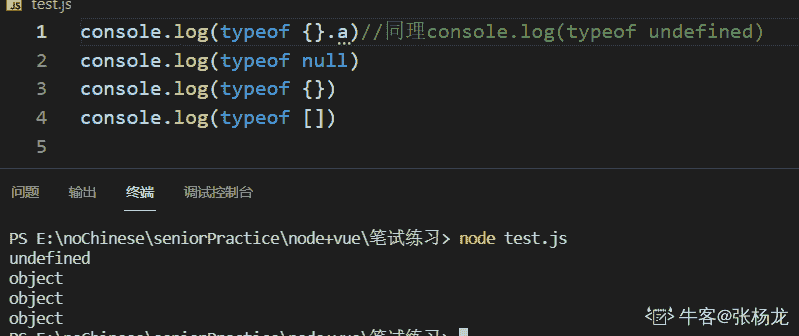
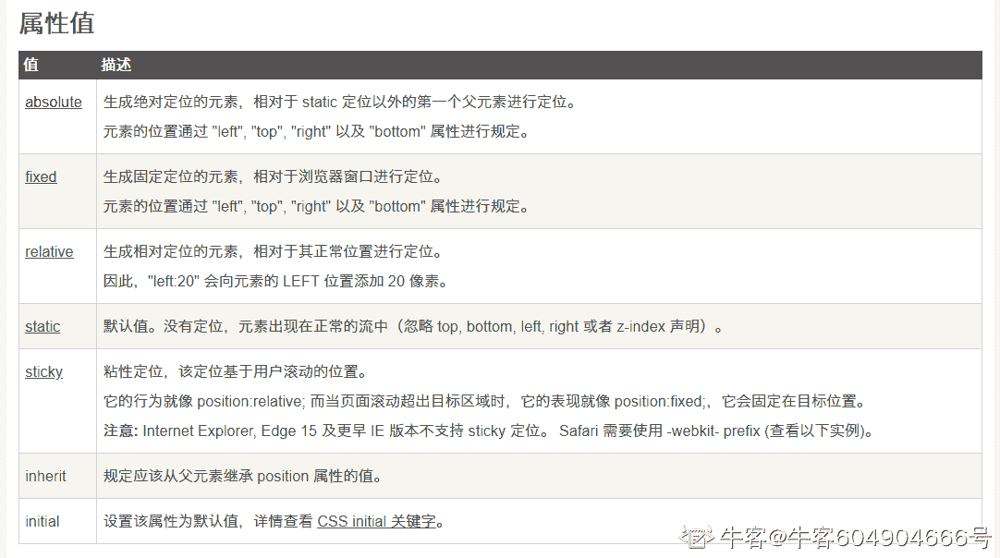
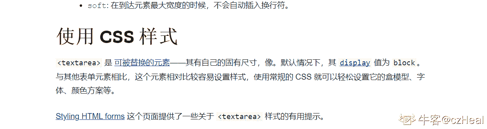
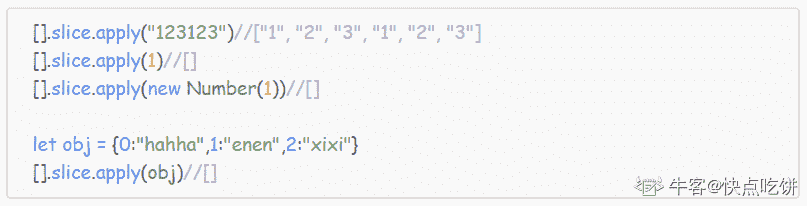
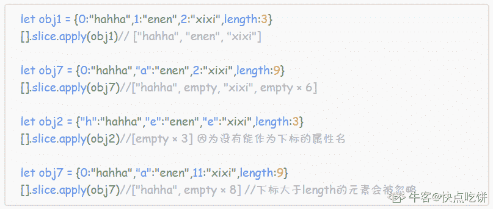
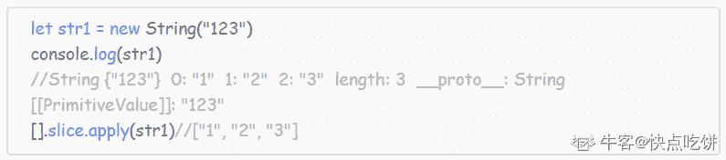
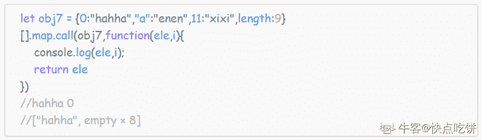

# 哔哩哔哩 2021 校园招聘前端开发方向笔试卷 B

## 1

可以用 typeof 来判断的基本类型有

正确答案: A   你的答案: 空 (错误)

```cpp
undefined
```

```cpp
null
```

```cpp
array
```

```cpp
object
```

本题知识点

Java 工程师 C++工程师 PHP 工程师 golang 工程师 哔哩哔哩 2021

讨论

[张杨龙](https://www.nowcoder.com/profile/224992377)

b,c,d    全都输出的是 object 就 a 输出的是 undefined 所以答案选 B？？你能根据结果判断是 null?明明 a undefined 才能用 typeof 判断

发表于 2021-10-29 18:09:24

* * *

[last、kiss](https://www.nowcoder.com/profile/482456741)

array 和 object 不是基本类型 typeof null 由于 js 设计的问题 会返回 Object 所以选择 undefined

发表于 2021-08-30 14:57:33

* * *

## 2

下段代码打印结果为（）const Person = (name="wang",age=10) => {this.name = name;this.age = age;return this.name +' is '+ this.age + 'years old'}let result = new Person('zhang',11)console.log(result)

正确答案: D   你的答案: 空 (错误)

```cpp
wang is 10 years old
```

```cpp
zhang is 11 years old
```

```cpp
{name:’zhang’,age:11}
```

```cpp
报错
```

本题知识点

Java 工程师 C++工程师 PHP 工程师 golang 工程师 哔哩哔哩 2021

讨论

[忘魂儿](https://www.nowcoder.com/profile/107947914)

箭头函数不能用作构造函数，使用会报错！！！

发表于 2021-10-07 20:23:44

* * *

[牛客 47169427 号](https://www.nowcoder.com/profile/47169427)

箭头函数不能用作构造函数 new Person() 报错

发表于 2021-05-21 20:19:03

* * *

## 3

相对 http1，以下哪个是 http2 新特性

正确答案: D   你的答案: 空 (错误)

```cpp
无状态协议
```

```cpp
无连接无状态
```

```cpp
客户/服务模式
```

```cpp
支出服务端主动推送
```

本题知识点

Java 工程师 C++工程师 PHP 工程师 golang 工程师 哔哩哔哩 2021

讨论

[冰糕块块](https://www.nowcoder.com/profile/788223833)

D

发表于 2022-02-13 16:00:28

* * *

## 4

css 中，position 属性不包括下面哪一个

正确答案: B   你的答案: 空 (错误)

```cpp
sticky
```

```cpp
auto
```

```cpp
static
```

```cpp
initial
```

本题知识点

Java 工程师 C++工程师 PHP 工程师 golang 工程师 哔哩哔哩 2021

讨论

[牛客 604904666 号](https://www.nowcoder.com/profile/604904666)



发表于 2021-07-15 15:06:11

* * *

## 5

关于跨域下列说法错误的是

正确答案: B   你的答案: 空 (错误)

```cpp
跨域问题主要是收到了同源（协议、域名、端口）策略的限制
```

```cpp
cors 只需服务端支持即可解决跨域问题
```

```cpp
script 标签加载资源不受跨域影响
```

```cpp
同源策略主要是为了避免浏览器受到 xss、csrf 等攻击
```

本题知识点

Java 工程师 C++工程师 PHP 工程师 golang 工程师 哔哩哔哩 2021

讨论

[忘魂儿](https://www.nowcoder.com/profile/107947914)

服务端：CORS 通信与 AJAX 没有任何差别，因此你不需要改变以前的业务逻辑。只不过，浏览器会在请求中携带一些头信息，我们需要以此判断是否运行其跨域，然后在响应头中加入一些信息即可，所以也需要浏览器（客户端）支持

发表于 2021-10-07 20:22:58

* * *

## 6

若以{4,5,6,7,8}作为叶子结点的权值构造哈夫曼树，则其带权路径长度是（）。

正确答案: D   你的答案: 空 (错误)

```cpp
24
```

```cpp
30
```

```cpp
53
```

```cpp
69
```

本题知识点

Java 工程师 C++工程师 PHP 工程师 golang 工程师 哔哩哔哩 2021

讨论

[忘魂儿](https://www.nowcoder.com/profile/107947914)

考察：哈夫曼树，权值的运算{4,5,6,7,8}
正序排列，然后从中选取两个最选的作为开端这里选择 4，5 距离根节点距离 0         30
1     13     17
2   6    7  8    9
3                 4  5
W=(4+5)*3+(6+7+8)*2=69

发表于 2021-10-07 20:28:19

* * *

[牛客 604904666 号](https://www.nowcoder.com/profile/604904666)

WPL=（6+7+8）*2+（4+5）*3=69

发表于 2021-07-15 15:13:09

* * *

## 7

下边与 http 缓存无关的头字段是

正确答案: C   你的答案: 空 (错误)

```cpp
Expires
```

```cpp
Last-Modified
```

```cpp
Content-Length
```

```cpp
Etag
```

本题知识点

Java 工程师 C++工程师 PHP 工程师 golang 工程师 哔哩哔哩 2021

讨论

[忘魂儿](https://www.nowcoder.com/profile/107947914)

If-Modified-Since

对应 Last-modified。服务器返回资源时，会携带 Last-modified，表示该资源最后修改的时间。客户端如果缓存数据，就需要把这个时间保存起来，在下一次请求的时候用 If-Modified-Since 带上，让服务器判断资源的最后修改时间是否一致。如果一致，就返回 304，让客户端直接使用本地缓存。否则说明资源被修改，返回新资源和新的 Last-modified。

Last-modified

资源最后修改时间，配合 If-Modified-Since 使用。属于响应头字段。

ETag

资源的特定版本标识符，可以类比软件的版本号，需要配合 If-None-Match 使用。另外，这个 E 是 Entity（实体）的意思。

If-None-Match

效果类似 If-Modified-Since，客户端第一次请求资源时会拿到响应头里的 ETag 字段，将其保存起来。下次请求时，就作为 If-None-Match 头字段的值进行请求。

Cache-Control

通用消息头字段，在请求头和响应头中有不同的语义，用于实现**缓存控制** **Expire

资源无效的时间节点**  **Vary

主要用于 **代理服务器实现缓存服务**，属于响应头字段** **Via

通用字段，记录经过的代理节点的信息** **X-Forwarded-For** 该字段记录的是当前节点的请求方的 IP 地址

X-Real-IP

只记录客户端的 IP 地址

发表于 2021-10-07 20:31:24

* * *

[牛客 604904666 号](https://www.nowcoder.com/profile/604904666)

Expires、Cache-Control、Last-Modified、 ETag 是 RFC 2616（HTTP/1.1）协议中和网页缓存相关的几个字段。前两个用来控制缓存的失效日期，后两个用来验证网页的有效性。Expires 字段声明了一个网页或 URL 地址不再被浏览器缓存的时间，一旦超过了这个时间，浏览器都应该联系原始服务器。
Last-Modified 和 ETag 是条件请求(Conditional Request)相关的两个字段。如果一个缓存收到了针对一个页面的请求，它发送一个验证请求询问服务器页面是否已经更改，在 HTTP 头里面带上” ETag”和”If Modify Since”头。服务器根据这些信息判断是否有更新信息，如果没有，就返回 HTTP 304（NotModify）；如果有更新，返回 HTTP 200 和更新的页面内容，并且携带新的”ETag”和”LastModified”。
既然有了 Last-Modified，为什么还要用 ETag 字段呢？因为如果在一秒钟之内对一个文件进行两次更改，Last-Modified 就会不正确。因此，HTTP/1.1 利用 Entity Tag 头提供了更加严格的验证。
 发表于 2021-07-15 15:17:03

* * *

## 8

设某二叉树的先序遍历序列为 ABDGCEFH，中序遍历序列为 DGBAECHF，则其后序遍历 序列是

正确答案: C   你的答案: 空 (错误)

```cpp
GDBEFHCA
```

```cpp
GDEFHBCA
```

```cpp
GDBEHFCA
```

```cpp
GBDEFCHA
```

本题知识点

Java 工程师 C++工程师 PHP 工程师 golang 工程师 哔哩哔哩 2021

讨论

[忘魂儿](https://www.nowcoder.com/profile/107947914)

先序 ABDGCEFH 中序 DGB|A|ECHF 个人习惯：根两边划分先序：根左右中序：左根右后序：左右根 A 为根，B，D，G 都在 A 的左侧，ECHF 都在 A 的右侧
            A     B           C  D            E      H     G                    F 后序：DGBEFHCA

发表于 2021-10-07 20:47:24

* * *

## 9

以下描述正确的是：

正确答案: A   你的答案: 空 (错误)

```cpp
flutter 技术实现的 APP，不是 hybrid app；
```

```cpp
PWA 其实就是在 hybrid app 模式下，通过缓存加快原生 APP 里面的 H5 页面加载；
```

```cpp
severless 是指完全不需要服务器，当前页面通过本地的 index DB 技术支持页面完全离线加载；
```

```cpp
typescript 是 JS 的超集，本质上向这个语言添加了可选的静态类型和基于类的面向对象编程；
```

本题知识点

Java 工程师 C++工程师 PHP 工程师 golang 工程师 哔哩哔哩 2021

讨论

[忘魂儿](https://www.nowcoder.com/profile/107947914)

```cpp
typescript 是 JS 的超集，本质是增加了类型约束，类型推导
```

发表于 2021-10-07 20:52:58

* * *

## 10

下面有关 csrf 的描述，说法错误的是？

正确答案: D   你的答案: 空 (错误)

```cpp
CSRF 则通过伪装来自受信任用户的请求来利用受信任的网站
```

```cpp
xss 是实现 csrf 的诸多途径中的一条
```

```cpp
在客户端页面增加伪随机数可以阻挡 csrf
```

```cpp
过滤用户输入的内容也可以阻挡 csrf
```

本题知识点

网络基础 加密和安全 Java 工程师 C++工程师 PHP 工程师 golang 工程师 哔哩哔哩 2021

讨论

[MyGoodHelper](https://www.nowcoder.com/profile/644326)

D**1.**XSS  查看全部)

编辑于 2015-02-02 14:34:31

* * *

[Miner_Sty](https://www.nowcoder.com/profile/512761)

D；1.XSS 全称“跨站脚本”，是注入攻击的一种。其特点是不对服务器端造成任何伤害，而是通过一些正常的站内交互途径，例如发布评论，提交含有 JavaScript 的内容文本。这时服务器端如果没有过滤或转义掉这些脚本，作为内容发布到了页面上，其他用户访问这个页面的时候就会运行这些脚本。2.CSRF 的全称是“跨站请求伪造”，而 XSS 的全称是“跨站脚本”。看起来有点相似，它们都是属于跨站攻击——不攻击服务器端而攻击正常访问网站的用户，但前面说了，它们的攻击类型是不同维度上的分 类。CSRF 顾名思义，是伪造请求，冒充用户在站内的正常操作。我们知道，绝大多数网站是通过 cookie 等方式辨识用户身份（包括使用服务器端 Session 的网站，因为 Session ID 也是大多保存在 cookie 里面的），再予以授权的。所以要伪造用户的正常操作，最好的方法是通过 XSS 或链接欺骗等途径，让用户在本机（即拥有身份 cookie 的浏览器端）发起用户所不知道的请求。3.XSS 是实现 CSRF 的诸多途径中的一条，但绝对不是唯一的一条。一般习惯上把通过 XSS 来实现的 CSRF 称为 XSRF。

发表于 2015-04-06 16:36:33

* * *

[九千里](https://www.nowcoder.com/profile/2048509)

D 犹豫了两秒，考虑到大多数人（包括安全工程师）对 xss 和 csrf 概念的混淆，选择了 D。xss 通过对 html 的注入，用带有 src 属性的标签<script>、等绕过同源策略，加载其他页面的 js，实现攻击。CSRF 通过构造 url 为正常请求，诱使用户点击，使服务器相信请求合法，从而达到目的。相似点在哪？可能仅仅在于 csrf 和某些 csrf 都需要用到用户的 cookies~

发表于 2017-09-22 11:11:56

* * *

## 11

下面哪一个不是 ES6 的新特性

正确答案: C   你的答案: 空 (错误)

```cpp
箭头函数
```

```cpp
模板字符串
```

```cpp
async/await
```

```cpp
延展操作符
```

本题知识点

Java 工程师 C++工程师 PHP 工程师 golang 工程师 哔哩哔哩 2021

讨论

[牛客 570787528 号](https://www.nowcoder.com/profile/570787528)

async/await 是 ES7 才有的

发表于 2021-05-11 21:22:54

* * *

## 12

下列对加密算法的描述，哪一项是对的

正确答案: D   你的答案: 空 (错误)

```cpp
MD5 是一种非对称加密算法
```

```cpp
MD5 生成 16 位的字符串
```

```cpp
RSA 算法是一种对称加密算法
```

```cpp
RSA 允许选择公钥的大小
```

本题知识点

Java 工程师 C++工程师 PHP 工程师 golang 工程师 哔哩哔哩 2021

讨论

[忘魂儿](https://www.nowcoder.com/profile/107947914)

MD5 对称加密算法  它生成 128 位的字符串 目前已被某人破解，支付中建议使用 RSA 加密
RSA 非对称加密算法 它允许选择公钥的大小

发表于 2021-10-07 20:59:38

* * *

## 13

JavaScript 中，下列哪一个 Array 的方法的返回值类型和其他不同

正确答案: B   你的答案: 空 (错误)

```cpp
concat
```

```cpp
shift
```

```cpp
filter
```

```cpp
map
```

本题知识点

Java 工程师 C++工程师 PHP 工程师 golang 工程师 哔哩哔哩 2021

讨论

[忘魂儿](https://www.nowcoder.com/profile/107947914)

shift 见名知意移除，它移除第一个元素,并将其作为返回值

发表于 2021-10-07 21:00:59

* * *

[swallowblank](https://www.nowcoder.com/profile/8147847)

shift 见的比较少，它的作用是弹出数组中的第一个元素，因此返回值是一个值，其他的返回值是数组

发表于 2021-06-22 21:53:20

* * *

## 14

已知一棵完全二叉树的节点总数为 11 个， 则最后一层的节点数为

正确答案: A   你的答案: 空 (错误)

```cpp
4
```

```cpp
3
```

```cpp
2
```

```cpp
1
```

本题知识点

Java 工程师 C++工程师 PHP 工程师 golang 工程师 哔哩哔哩 2021

讨论

[忘魂儿](https://www.nowcoder.com/profile/107947914)

完全二叉树最大结点数是 2 的 k 次方 - 1，k 表示深度，所以，总数 11 的结点数，深度应该是 4，前 3 层共结点数 2 的 3 次方 -1 = 7， 11 - 7 等于 4，所以最后一层结点数是 4

发表于 2021-10-07 21:02:25

* * *

[牛客 879485554 号](https://www.nowcoder.com/profile/879485554)

完全二叉树每一层都是紧凑靠左排列。第一层到第四层各对应 1、2、4、4 个节点。所以选 A

发表于 2021-07-11 14:23:26

* * *

[牛客 628469948 号](https://www.nowcoder.com/profile/628469948)

a

发表于 2021-07-07 23:20:03

* * *

## 15

下列哪一个不属于数据结构的基本类型

正确答案: A   你的答案: 空 (错误)

```cpp
栈型结构
```

```cpp
线性结构
```

```cpp
树型结构
```

```cpp
图型结构
```

本题知识点

Java 工程师 C++工程师 PHP 工程师 golang 工程师 哔哩哔哩 2021

讨论

[忘魂儿](https://www.nowcoder.com/profile/107947914)

数据结构的基本类型：线，树，图

发表于 2021-10-07 21:09:26

* * *

## 16

Linux 操作系统发布于

正确答案: C   你的答案: 空 (错误)

```cpp
1971
```

```cpp
1974
```

```cpp
1991
```

```cpp
1994
```

本题知识点

Java 工程师 C++工程师 PHP 工程师 golang 工程师 哔哩哔哩 2021

讨论

[前端 HAN11](https://www.nowcoder.com/profile/962856789)

Linux，全称 GNU/Linux，是一种免费使用和自由传播的[类 UNIX](https://baike.baidu.com/item/%E7%B1%BBUNIX/9032872)操作系统，其内核由[林纳斯·本纳第克特·托瓦兹](https://baike.baidu.com/item/%E6%9E%97%E7%BA%B3%E6%96%AF%C2%B7%E6%9C%AC%E7%BA%B3%E7%AC%AC%E5%85%8B%E7%89%B9%C2%B7%E6%89%98%E7%93%A6%E5%85%B9/1034429)于 1991 年 10 月 5 日首次发布，它主要受到[Minix](https://baike.baidu.com/item/Minix/7106045)和 Unix 思想的启发，是一个基于[POSIX](https://baike.baidu.com/item/POSIX)的多用户、[多任务](https://baike.baidu.com/item/%E5%A4%9A%E4%BB%BB%E5%8A%A1/1011764)、支持[多线程](https://baike.baidu.com/item/%E5%A4%9A%E7%BA%BF%E7%A8%8B/1190404)和多[CPU](https://baike.baidu.com/item/CPU)的操作系统。它能运行主要的[Unix](https://baike.baidu.com/item/Unix/219943)工具软件、应用程序和网络协议。它支持[32 位](https://baike.baidu.com/item/32%E4%BD%8D/5812218)和[64 位](https://baike.baidu.com/item/64%E4%BD%8D)硬件。Linux 继承了 Unix 以网络为核心的设计思想，是一个性能稳定的多用户网络操作系统。Linux 有上百种不同的发行版，如基于社区开发的[debian](https://baike.baidu.com/item/debian/748667)、[archlinux](https://baike.baidu.com/item/archlinux/10857530)，和基于商业开发的[Red Hat Enterprise Linux](https://baike.baidu.com/item/Red%20Hat%20Enterprise%20Linux/10770503)、[SUSE](https://baike.baidu.com/item/SUSE/60409)、[Oracle Linux](https://baike.baidu.com/item/Oracle%20Linux/6876458)等。

发表于 2021-04-12 12:37:05

* * *

## 17

CSS 中，display 的属性不包括哪一个

正确答案: B   你的答案: 空 (错误)

```cpp
inline
```

```cpp
flex-start
```

```cpp
none
```

```cpp
inherit
```

本题知识点

Java 工程师 C++工程师 PHP 工程师 golang 工程师 哔哩哔哩 2021

讨论

[起名困难症的切图仔](https://www.nowcoder.com/profile/750131811)

display: inline;  // 设置为行内元素 display: none; // 隐藏元素，并不会存在 dom 树中 display： inherit；// 继承父级的 display flex-satrt  是弹性盒里面的 justify-content,align-items 的属性值

发表于 2021-09-11 15:18:28

* * *

[宇乔](https://www.nowcoder.com/profile/592822261)

Flex-start 是 flex 布局的

发表于 2021-09-10 11:47:55

* * *

## 18

正则表达式中，以下哪一个特殊字符可以匹配前面的子表达式一次或多次

正确答案: A   你的答案: 空 (错误)

```cpp
+
```

```cpp
*
```

```cpp
$
```

```cpp
^
```

本题知识点

Java 工程师 C++工程师 PHP 工程师 golang 工程师 哔哩哔哩 2021

讨论

[忘魂儿](https://www.nowcoder.com/profile/107947914)

* ：出现零到多次 

+： 出现一到多次 

？：出现零次或者一次$：结尾^：开头

发表于 2021-10-07 21:11:50

* * *

## 19

给定一组权值 w={9, 12, 6, 3, 5, 15}，其构成的哈夫曼树带权路径为

正确答案: B   你的答案: 空 (错误)

```cpp
96
```

```cpp
122
```

```cpp
134
```

```cpp
138
```

本题知识点

Java 工程师 C++工程师 PHP 工程师 golang 工程师 哔哩哔哩 2021

讨论

[牛客 136568685 号](https://www.nowcoder.com/profile/136568685)

               o        o           o    o   15.    9   12 o    63 515*2 + 9*2 + 12*2 + 3*6 + 3*4 + 5*4 =122

发表于 2021-08-13 10:16:42

* * *

[牛客 570787528 号](https://www.nowcoder.com/profile/570787528)

我算的是                      o                  o     o               o   o   12  15            9  6 3 5
加起来 123？哪里错了😥

发表于 2021-04-22 12:53:43

* * *

## 20

JavaScript 中，字符串与数组有许多相同的方法，以下不属于的是

正确答案: C   你的答案: 空 (错误)

```cpp
slice
```

```cpp
indexOf
```

```cpp
reverse
```

```cpp
concat
```

本题知识点

Java 工程师 C++工程师 PHP 工程师 golang 工程师 哔哩哔哩 2021

讨论

[前端 HAN11](https://www.nowcoder.com/profile/962856789)

```cpp
//字符串反转
str.split("").reverse().join("");
```

发表于 2021-04-12 12:36:11

* * *

## 21

十六进制颜色值为#FB7299，那么其在 RGB 色彩模式下的值为

正确答案: D   你的答案: 空 (错误)

```cpp
(251, 78, 43)
```

```cpp
(255, 56, 43)
```

```cpp
(245, 90, 133)
```

```cpp
(251, 114, 153)
```

本题知识点

Java 工程师 C++工程师 PHP 工程师 golang 工程师 哔哩哔哩 2021

讨论

[时先生](https://www.nowcoder.com/profile/395773797)

两位拆解，最后两位大于中间两位

发表于 2021-10-13 17:45:43

* * *

[忘魂儿](https://www.nowcoder.com/profile/107947914)

两位两位拆解（A 为 10，F 为 15）FB  B*16 的 0 次幂+F*16 的 1 次幂
72   2*16 的 0 次幂+7*16 的 1 次幂
99   9*16 的 0 次幂+9*16 的 1 次幂

发表于 2021-10-07 21:15:26

* * *

[swallowblank](https://www.nowcoder.com/profile/8147847)

72 转换为 2 进制 0111 0010，再转换为 10 进制 114

发表于 2021-06-22 21:57:15

* * *

## 22

以下表达式，正确的是

正确答案: D   你的答案: 空 (错误)

```cpp
JavaScript 是单线程，所以不支持异步
```

```cpp
建立 UDP 连接需要 3 次握手
```

```cpp
一个 HTML 无法渲染多个 body 标签
```

```cpp
function 声明的优先级大于 var
```

本题知识点

Java 工程师 C++工程师 PHP 工程师 golang 工程师 哔哩哔哩 2021

讨论

[忘魂儿](https://www.nowcoder.com/profile/107947914)

首先函数提升大于变量提升其次按规范来讲只允许有一个 body 标签，但是写了多个也可以渲染，有的浏览器只按第一个 body 处理，有的全都处理

发表于 2021-10-07 21:17:55

* * *

## 23

以下关于浏览器缓存的说法，错误的是

正确答案: C   你的答案: 空 (错误)

```cpp
localStorage 存储的数据是永久的
```

```cpp
localStorage 中存储的是字符串
```

```cpp
同一个浏览器下，多个同源页面可以共享 sessionStorage 的数据
```

```cpp
浏览器关闭，sessionStorage 的数据会被清空
```

本题知识点

Java 工程师 C++工程师 PHP 工程师 golang 工程师 哔哩哔哩 2021

讨论

[秃头 100 号](https://www.nowcoder.com/profile/320372450)

通过点击链接（或者用了 window.open）打开的新标签页之间是属于同一个 session 的，但新开一个标签页总是会初始化一个新的 session，即使网站是一样的，它们也不属于同一个 session。

发表于 2021-10-11 17:50:28

* * *

## 24

下列哪些属于 document 对象的方法?

正确答案: A B C   你的答案: 空 (错误)

```cpp
focus() 
```

```cpp
getElementById() 
```

```cpp
getElementsByName() 
```

```cpp
bgColor() 
```

本题知识点

Java 工程师 C++工程师 PHP 工程师 golang 工程师 哔哩哔哩 2021

讨论

[牛客 622880578 号](https://www.nowcoder.com/profile/622880578)

1.document.write() //动态向页面添加内容
2.document.createElement(Tag) //创建一个 html 标签对象
3.document.getElementById(ID) //获得指定 Id 的对象
4.document.getElementByClassName(className) //获得指定 class 值的对象（数组）
5.document.getElementByTagName（TagName） //获得指定的 tag 对象
6.document.body.appendChild(Tag) //向 body 中添加创建的新的标签对象
7.document.getElementByName(Name) //获得指定的 Name 值的对象
不知道为什么选 A

发表于 2021-05-07 16:07:30

* * *

## 25

以下哪些元素是行内元素

正确答案: A B C D   你的答案: 空 (错误)

```cpp
textarea
```

```cpp
img
```

```cpp
button
```

```cpp
em
```

本题知识点

Java 工程师 C++工程师 PHP 工程师 golang 工程师 哔哩哔哩 2021

讨论

[czHeal](https://www.nowcoder.com/profile/550285132)

mdn 上写着默认为 block，不知道为什么选 A

发表于 2021-10-06 20:58:45

* * *

## 26

以下哪些 ul 的 height 不是 0

正确答案: A B   你的答案: 空 (错误)

```cpp
  <ul style="overflow: hidden;">     <li style="float: left">1</li>   </ul> 
```

```cpp
  <ul style="float: left;">     <li style="float:left;">1</li>   </ul> 
```

```cpp
  <ul style="clear: both;">     <li style="float: left">1</li>    </ul> 
```

本题知识点

Java 工程师 C++工程师 PHP 工程师 golang 工程师 哔哩哔哩 2021

## 27

以下关于 css 中 position 的值说法错误的是

正确答案: A C   你的答案: 空 (错误)

```cpp
staic 元素出现在正常的文档流中，但设置 top, right, bottom, left 和 z-index 有效
```

```cpp
relative 元素相对于默认位置（即元素 position 为 static 时的位置）定位
```

```cpp
absolute 元素相对于最近的 relative 定位的祖先元素定位
```

```cpp
fixed 元素相对于屏幕视口（viewport）的位置定位，元素的位置在屏幕滚动时不会改变
```

本题知识点

Java 工程师 C++工程师 PHP 工程师 golang 工程师 哔哩哔哩 2021

讨论

[swallowblank](https://www.nowcoder.com/profile/8147847)

不考虑没有父元素为 relative 的情况下，C 有错么？

发表于 2021-06-22 22:02:52

* * *

## 28

以下哪些选项可以将集合 A 转化为数组？

正确答案: A B C D   你的答案: 空 (错误)

```cpp
Array.from(A)
```

```cpp
[].slice.apply(A)
```

```cpp
[…A]
```

```cpp
[].map.call(A, o => o)
```

本题知识点

运维工程师 360 公司 Javascript 系统工程师 2019 Java 工程师 C++工程师 PHP 工程师 golang 工程师 哔哩哔哩 2021

讨论

[旺仔大馒头](https://www.nowcoder.com/profile/8019634)

1.  Array.from(arr, mapfn,thisArg)方法，用于将两类可以把对象转换为真正的数组：类似数组的对象和可遍历的对象（部署了 Iterator 接口的，String，ES6 新增的 Map 和 Set）。可以传 3 个参数，其中第一个是数组，必传；第二个是一个函数（类似 map 函数），对数组元素进行操作后再返回数组，可选；第三个是对于 this 关键字的指向，可选。
2.  slice() 方法可从已有的数组中返回选定的元素。
    返回值：返回一个新的数组，包含从 start 到 end （不包括该元素）的 arrayObject 中的元素。
    说明
    请注意，该方法并不会修改数组，而是返回一个子数组。如果想删除数组中的一段元素，应该使用方法 Array.splice()。
    所以在这里就是对集合 A 应用 slice，返回一个新的数组，不对数组做任何改变。
3.  展开运算符，把 A 集合的元素展开后，用数组[]承载，返回新的数组。
4.  map() 方法返回一个新数组，数组中的元素为原始数组元素调用函数处理后的值。
    map() 方法按照原始数组元素顺序依次处理元素。
    注意： map() 不会对空数组进行检测。
    注意： map() 不会改变原始数组。
    所以 map 方法返回了一个新的数组，并且数组中每个元素是 A 里面的元素。

综上，选择 ABCD。

编辑于 2019-08-20 10:30:20

* * *

[快点吃饼](https://www.nowcoder.com/profile/575261407)

ac 就不说了 高赞说的很清楚了 说下 bd 下面都是自己的实验和猜测 嫌长可以只看最后的结论( ͡° ͜ʖ ͡°)✧ 有不对的地方希望可以提出~ 我会及时改正的使用[].slice.apply(A),[].map.call(A)可以转为数组 但是无法把 A 中的元素放在数组里面首先:只要使用[].slice.apply()不管里面的第一个参数是什么 这个对象都会返回一个数组 但是当参数中含有 length 属性的时候 会返回一个长度为属性值的数组 并且会把对象中下标<length 的元素放到数组里面对应的下标位置中去 对于字符串:在执行[].slice.apply()的时候会把它包装成 String 对象 可以推测 number 类型和 boolean 类型也都会被包装 对于可迭代对象:与 slice 方法无关 太长了这里就不写了..大家可以自己试试 ```cpp
//下面是创建一个可迭代对象
var obj3 = {  
    a: 1,  
    b: 2,   
    [Symbol.iterator](){}//里面是创建可迭代对象的代码
[].slice.apply(obj3)//[] 可见这个方法和可迭代对象无关
``` 

**得出结论**:slice 方法的工作原理是根据上下文对象中的 length 属性建立一个 length 长度的数组 然后寻找对象中 key 值为数字的属性并且添加到数组里面 对于没有 length 属性的对象 默认 length=undefined 返回的数组为空

对于 map:上面的代码 使用[].map.call()和[].slice.apply()的结果是一样的 

可以推测 map 的工作原理和 slice 类似 大概是是根据上下文对象中的 length 属性建立一个 length 长度的数组 然后只遍历下标为数字的数组并且放到数组中对应下标的位置里 而且下标大于 length 的元素是不会被遍历的

编辑于 2020-03-01 16:10:54

* * *

[one154](https://www.nowcoder.com/profile/8495710)

题目明明是 form。。。

牛客：我写了错别字，有时是考你语文。有时不是，我只是写错了而已

我：操！

发表于 2019-12-29 12:29:20

* * *

## 29

以下哪些选项可以获取 Id 为 test 的 DOM 元素

正确答案: A D   你的答案: 空 (错误)

```cpp
document.getElementById('test')
```

```cpp
document.getElementById('#test')
```

```cpp
document.querySelector('test')
```

```cpp
document.querySelector(‘#test')
```

本题知识点

Java 工程师 C++工程师 PHP 工程师 golang 工程师 哔哩哔哩 2021

## 30

下面关于进程和线程说法正确的是

正确答案: B C D   你的答案: 空 (错误)

```cpp
进程是 CPU 调度的基本单位
```

```cpp
线程是 CPU 调度的基本单位
```

```cpp
进程中多个线程可并发执行
```

```cpp
一个线程可以创建另一个线程
```

本题知识点

Java 工程师 C++工程师 PHP 工程师 golang 工程师 哔哩哔哩 2021

## 31

输入一个小于 100 的正整数 n,输出一个最小正整数 m，使得 m 的各位平方之和等于 n。

本题知识点

Java 工程师 C++工程师 PHP 工程师 golang 工程师 哔哩哔哩 2021

讨论

[Ye11ow](https://www.nowcoder.com/profile/473629031)

怎没人

发表于 2021-04-16 18:04:03

* * *

## 32

一只乌鸦来到一片浅滩向右行走寻坑喝水，若它想喝 x 单位的水量，嘴长为 y，假定一个一维数组代表浅滩的坑，每个深度的坑都蓄满了水，浅滩足够大，总蓄水量>x，试计算位置 z，使它落到该处向右行走的步数最少便可喝足水量，如果步数相同，取小的那一个。

本题知识点

Java 工程师 C++工程师 PHP 工程师 golang 工程师 哔哩哔哩 2021

讨论

[offer 审批必过](https://www.nowcoder.com/profile/419917980)

前缀和 ac

```cpp
import java.util.*;

public class Solution {
    /**
     * 代码中的类名、方法名、参数名已经指定，请勿修改，直接返回方法规定的值即可
     * 乌鸦找水
     * @param s int 整型一维数组 浅滩
     * @param x int 整型 水量
     * @param y int 整型 嘴长
     * @return int 整型
     */
    public int drink (int[] s, int x, int y) {
        // write code here
        int[] sum = new int[s.length];
        sum[0] = s[0] > y ? y : s[0];
        for(int i = 1; i < s.length; i++){
            sum[i] = s[i] > y ? sum[i - 1] + y : sum[i - 1] + s[i];
        }
        int min = Integer.MAX_VALUE, res = 0;
        for(int i = s.length - 1; i > 0; i--){
            for(int j = i - 1; j > 0; j--){
                if(sum[i] - sum[j - 1] >= x) {
                    min = Math.min(min, i - j);
                    if(min == i - j) res = j;
                }
            }
            if(sum[i] >= x) {
                min = Math.min(min, i);
                if(min == i) res = 0;
            }
        }
        return res;
    }
}
```

发表于 2021-09-13 15:21:34

* * *

[swallowblank](https://www.nowcoder.com/profile/8147847)

我都没看懂这个例子是什么意思

发表于 2021-06-22 22:05:42

* * *

[Ye11ow](https://www.nowcoder.com/profile/473629031)

我

发表于 2021-04-16 18:04:20

* * *

## 33

给定两个整数，分别表示分数的分子 numerator 和分母 denominator，以字符串形式返回小数。如果小数部分为循环小数，则将循环的部分括在括号内。 

本题知识点

Java 工程师 C++工程师 PHP 工程师 golang 工程师 哔哩哔哩 2021

讨论

[y 一条咸鱼](https://www.nowcoder.com/profile/198208137)

```cpp
function fractionToDecimal(numerator, denominator) {
    // write code here
    var s = numerator / denominator + '';
    var rex = /(\d)\1+$/g;
    s = s.replace(rex, `(${"$1"})`);
    console.log(s);
}
```

发表于 2021-04-16 18:41:33

* * *

[忘魂儿](https://www.nowcoder.com/profile/107947914)

```cpp
//小循环体(123123 这种)没写，正常单个循环的都可以运行正确
function fractionToDecimal( numerator ,  denominator ) {
    // write code here
    var res=(numerator/denominator).toString()
    var test1=res.split('.')[0]
    var test2=res.split('.')[1]
    var arr=[]
    if(test2){
       arr.push(...test2)
        if(arr.length>1){
            var flag=arr.every((item)=>{
            return item==arr[1]
            })

            if(flag){
               return test1+'.'+`(${arr[0]})`
            }

        }else{
            return res
        }
        return res
    }
    return res

}
module.exports = {
    fractionToDecimal : fractionToDecimal
};
```

发表于 2021-10-07 21:40:34

* * *

[Ye11ow](https://www.nowcoder.com/profile/473629031)

咋没人写呢

发表于 2021-04-16 18:03:04

* * *