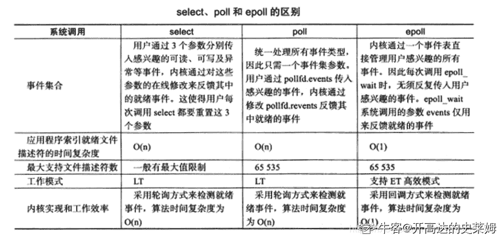

# 哔哩哔哩 2021 校园招聘数据仓库方向笔试卷

## 1

下列关于引用和指针的解释错误的是？

正确答案: D   你的答案: 空 (错误)

```cpp
引用不能为空，指针可以为空
```

```cpp
sizeof 计算引用得到的是所指向的变量大小
```

```cpp
程序为指针变量分配内存区域，而引用不需要分配内存区域
```

```cpp
引用是值传递，指针是地址传递
```

本题知识点

大数据开发工程师 数据分析师 数据库工程师 哔哩哔哩 2021

讨论

[再吹一下下晚风](https://www.nowcoder.com/profile/539256087)

指针和引用的区别：1.指针是一个实体，而引用仅是个别名；2.引用必须被初始化，指针不必；3.引用只能在定义时被初始化一次，之后不可变；指针可以改变所指的对象；4.可以有 const 指针，但是没有 const 引用；5.不存在指向空值的引用，但是存在指向空值的指针，即引用不能为空，指针可以为空;6.“sizeof 引用”得到的是所指向的变量（对象）的大小，而“sizeof 指针”得到的是指针本身（所指向的变量或对象的地址）的大小；7.指针和引用的自增（++）运算意义不一样； 指针自增指向下一个地址，而引用是对变量本身的值的增加。8.程序为指针变量分配内存区域，而引用不需要分配内存区域；9.指针可以有多级，但是引用只能是一级，例如 int **p 是合法的，而 int &&a 是不合法的； 10.指针和引用作为函数参数进行传递时也不同。用指针传递参数，可以实现对实参进行改变的目的；在将引用作为函数参数进行传递时，实质上传递的是实参本身，而不是实参的一个拷贝，因此对形参的修改其实是对实参的修改。

发表于 2021-08-25 10:43:54

* * *

## 2

下面程序段的运行结果是 ( ) ，char *s="abcde"; s+=2;printf （ "%d",s ）

正确答案: C   你的答案: 空 (错误)

```cpp
cde
```

```cpp
字符′c′
```

```cpp
字符′c′的地址
```

```cpp
无确定的输出结果
```

本题知识点

大数据开发工程师 数据分析师 数据库工程师 哔哩哔哩 2021

## 3

以下代码打印的结果是（假设运行在 64 位计算机上）： struct st_t {         int status;          short *pdata;          char errstr[32];          };         st_t st[16];         char *p=(char *)( str[2].errstr + 32 );        printf("%d", (p-(char *)(str)));  }

正确答案: D   你的答案: 空 (错误)

```cpp
32
```

```cpp
120
```

```cpp
114
```

```cpp
144
```

本题知识点

大数据开发工程师 数据分析师 数据库工程师 哔哩哔哩 2021

## 4

将一个递归算法改为对应的非递归算法时，通常需要使用？

正确答案: D   你的答案: 空 (错误)

```cpp
优先队列
```

```cpp
循环队列
```

```cpp
队列
```

```cpp
栈
```

本题知识点

大数据开发工程师 数据分析师 数据库工程师 哔哩哔哩 2021

讨论

[陈 jw](https://www.nowcoder.com/profile/5057094)

递归之所以可以采用非递归方法实现是因为可以用栈的方式 
如果你采用递归时 是由系统管理函数栈 
而要写成非递归时必须由你自已来管理一个栈.递归的本质就是栈

发表于 2021-04-13 10:58:54

* * *

## 5

下面关于完全二叉树中的叙述中，错误的是（）

正确答案: B   你的答案: 空 (错误)

```cpp
除了最后一层外，每一层上的结点数均达到最大值
```

```cpp
一个结点可能只缺少了左孩子
```

```cpp
完全二叉树一般不是满二叉树
```

```cpp
具有 n 个结点的完全二叉树的深度为[log2n]+1
```

本题知识点

大数据开发工程师 数据分析师 数据库工程师 哔哩哔哩 2021

讨论

[零葬](https://www.nowcoder.com/profile/75718849)

完全二叉树的节点是从左往右加的，要缺一定是缺右孩子

发表于 2021-04-12 16:07:32

* * *

## 6

下列算法段中，时间复杂度为（） for(i=1;i<=n-1;i++){    for(j=1;j<=i;j++)    {        x=0;        for(k=1;k<=n;k++)            x+=(a+b);    }}

正确答案: D   你的答案: 空 (错误)

```cpp
O(n²)
```

```cpp
O(n²*(n+1))
```

```cpp
O(n*(n+1))
```

```cpp
O(n³)
```

本题知识点

大数据开发工程师 数据分析师 数据库工程师 哔哩哔哩 2021

讨论

[零葬](https://www.nowcoder.com/profile/75718849)

最内层循环每次都是 n 的操作数，最外层会循环 n 次，次外层在最外层的约束下，每次的操作数为 1,2,3,...,n，一共为(1+n)*n/2，再算上最内层的循环，操作数为(1+n)*n*n/2 是 O(n³)的时间复杂度。

发表于 2021-04-12 16:11:24

* * *

## 7

以 30 为基准,设一组初始记录关键字序列为 (30,15,44,25,50,10,70), 则第一趟快速排序结果为（）

正确答案: A   你的答案: 空 (错误)

```cpp
10，15，25，30,50，44，70
```

```cpp
10，25，15，30，50，44，70
```

```cpp
10，25，15，30，44，50，70
```

```cpp
10，15，25，30，44，50，70
```

本题知识点

大数据开发工程师 数据分析师 数据库工程师 哔哩哔哩 2021

讨论

[零葬](https://www.nowcoder.com/profile/75718849)

初始化左指针为 1，右指针为 6 从右指针开始比较，右指针自减，到 10 的时候发现比 30 小，两者交换得到：10,15,44,25,50,30,70 从左指针开始比较，左指针自增，到 44 的时候发现比 30 大，两者交换得到：10,15,30,25,50,44,70 从右指针开始比较，右指针自减，到 25 的时候发现比 30 小，两者交换得到：10,15,25,30,50,44,70 此时完成第一趟排序，已经满足 30 的左边都比 30 小，右边都比 30 大

编辑于 2021-04-12 16:20:24

* * *

## 8

输入若已经是排好序的（升序），下列排序算法最快的是（）

正确答案: B   你的答案: 空 (错误)

```cpp
Shell 排序
```

```cpp
插入排序
```

```cpp
合并排序
```

```cpp
快速排序
```

本题知识点

大数据开发工程师 数据分析师 数据库工程师 哔哩哔哩 2021

讨论

[零葬](https://www.nowcoder.com/profile/75718849)

本来有序的话快排会退化到 O(n²)，归并仍然是 O(nlogn)，而插排是 O(n)，遍历完数组就行，不会进行往有序段插入元素的操作。

发表于 2021-04-12 16:15:30

* * *

## 9

假设栈的输入序列是 7,6,2,1,4，则以下不可能是其出栈序列（ ）？

正确答案: A   你的答案: 空 (错误)

```cpp
6,7,4,2,1
```

```cpp
7,6,2,1,4
```

```cpp
其它都不是
```

```cpp
6,7,4,1,2
```

本题知识点

大数据开发工程师 数据分析师 数据库工程师 哔哩哔哩 2021

讨论

[零葬](https://www.nowcoder.com/profile/75718849)

栈是先进后出，除非 2 入栈后马上出栈，否则 2 不可能先于 1 出栈，而 4 在 1 和 2 之前出栈，那根据入栈顺序，它出栈后栈顶应该为 1，因此 2 不可能紧跟着 4 出栈。

发表于 2021-04-12 16:24:30

* * *

## 10

关于 linux 的 I/O 复用接口 select 和 epoll,下列说法错误的是()

正确答案: B   你的答案: 空 (错误)

```cpp
select 调用时会进行线性遍历,epoll 采用回调函数机制,不需要线性遍历
```

```cpp
select 较适合于高并发连接,且活跃链接较多的场景
```

```cpp
epoll 的效率不随 FD 数目增加而线性下降
```

```cpp
epoll 通过共享存储实现内核和用户的数据交互
```

本题知识点

大数据开发工程师 数据分析师 数据库工程师 哔哩哔哩 2021

讨论

[开高达的史莱姆](https://www.nowcoder.com/profile/8805731)



发表于 2021-04-27 22:02:45

* * *

## 11

下列不属于 linux 创建文件的命令有（）？

正确答案: A   你的答案: 空 (错误)

```cpp
in
```

```cpp
touch
```

```cpp
cat
```

```cpp
vi/vim
```

本题知识点

大数据开发工程师 数据分析师 数据库工程师 哔哩哔哩 2021

## 12

如果将固定块大小的文件系统中的块大小设置大一些，会造成（）。

正确答案: A   你的答案: 空 (错误)

```cpp
更好的磁盘吞吐量和更差的磁盘空间利用率
```

```cpp
更好的磁盘吞吐量和更好的磁盘空间利用率
```

```cpp
更差的磁盘吞吐量和更好的磁盘空间利用率
```

```cpp
更差的磁盘吞吐量和更差的磁盘空间利用率
```

本题知识点

操作系统 京东 大数据开发工程师 数据分析师 数据库工程师 哔哩哔哩 2021

讨论

[牛客 444334 号](https://www.nowcoder.com/profile/444334)

A

使用多大的块大小，需要  查看全部)

编辑于 2015-01-31 11:30:35

* * *

[牛客-007](https://www.nowcoder.com/profile/394118)

答案：A
文件是按块存储的，如果块大小设置的大一些，读取的时候一次性读取的就更多，磁盘吞吐量提升，但是文件可能不能占满整个块，导致利用率下降。

发表于 2015-01-28 17:26:47

* * *

[huixieqingchun](https://www.nowcoder.com/profile/551201)

**文件是按块存储的，如果取更大的块，一次读取时会得到更多的数据，即磁盘吞吐率提高；但大块也会导致有时数据装不满，从而磁盘利用率下降** 。

发表于 2016-07-11 10:08:16

* * *

## 13

假设就绪队列中有 10 个线程，系统将时间片设置为 200ms，CPU 进行线程切换要花费 20ms。则系统开销所占的比例约为（）

正确答案: C   你的答案: 空 (错误)

```cpp
0.01
```

```cpp
0.05
```

```cpp
0.1
```

```cpp
0.2
```

本题知识点

大数据开发工程师 数据分析师 数据库工程师 哔哩哔哩 2021

## 14

在 linux 编程中，以下哪个 TCP 的套接字选项与 nagle 算法的开启和关闭有关？

正确答案: B   你的答案: 空 (错误)

```cpp
TCP_MAXSEG
```

```cpp
TCP_NODELAY
```

```cpp
TCP_SYNCNT
```

```cpp
TCP_KEEPALIVE
```

本题知识点

Linux 大数据开发工程师 数据分析师 数据库工程师 哔哩哔哩 2021

讨论

[guanjian](https://www.nowcoder.com/profile/564796)

当有一个 TCP 数据段不足 MS  查看全部)

编辑于 2016-05-06 10:53:32

* * *

[youloveme](https://www.nowcoder.com/profile/706834)

Nagle 算法的规则：（1）如果包长度达到 MSS，则允许发送；（2）如果该包含有 FIN，则允许发送；（3）设置了 TCP_NODELAY 选项，则允许发送；（4）未设置 TCP_CORK 选项时，若所有发出去的小数据包（包长度小于 MSS）均被确认，则允许发送；（5）上述条件都未满足，但发生了超时（一般为 200ms），则立即发送。
Nagle 算法只允许一个未被 ACK 的包存在于网络，它并不管包的大小，因此它事实上就是一个扩展的停-等协议，只不过它是基于包停-等的，而不是基于字节停-等的。Nagle 算法完全由 TCP 协议的 ACK 机制决定，这会带来一些问题，比如如果对端 ACK 回复很快的话，Nagle 事实上不会拼接太多的数据包，虽然避免了网络拥塞，网络总体的利用率依然很低。Nagle 算法是 silly window syndrome(SWS)预防算法的一个半集。SWS 算法预防发送少量的数据，Nagle 算法是其在发送方的实现，而接收方要做的是不要通告缓冲空间的很小增长，不通知小窗口，除非缓冲区空间有显著的增长。这里显著的增长定义为完全大小的段（MSS）或增长到大于最大窗口的一半。
注意：BSD 的实现是允许在空闲链接上发送大的写操作剩下的最后的小段，也就是说，当超过 1 个 MSS 数据发送时，内核先依次发送完 n 个 MSS 的数据包，然后再发送尾部的小数据包，其间不再延时等待。（假设网络不阻塞且接收窗口足够大）举个例子，比如之前的 blog 中的实验，一开始 client 端调用 socket 的 write 操作将一个 int 型数据（称为 A 块）写入到网络中，由于此时连接是空闲的（也就是说还没有未被确认的小段），因此这个 int 型数据会被马上发送到 server 端，接着，client 端又调用 write 操作写入‘\r\n’（简称 B 块），这个时候，A 块的 ACK 没有返回，所以可以认为已经存在了一个未被确认的小段，所以 B 块没有立即被发送，一直等待 A 块的 ACK 收到（大概 40ms 之后），B 块才被发送。整个过程如图所示：这里还隐藏了一个问题，就是 A 块数据的 ACK 为什么 40ms 之后才收到？这是因为 TCP/IP 中不仅仅有 nagle 算法，还有一个 TCP 确认延迟机制 。当 Server 端收到数据之后，它并不会马上向 client 端发送 ACK，而是会将 ACK 的发送延迟一段时间（假设为 t），它希望在 t 时间内 server 端会向 client 端发送应答数据，这样 ACK 就能够和应答数据一起发送，就像是应答数据捎带着 ACK 过去。在我之前的时间中，t 大概就是 40ms。这就解释了为什么'\r\n'（B 块）总是在 A 块之后 40ms 才发出。
当然，TCP 确认延迟 40ms 并不是一直不变的，TCP 连接的延迟确认时间一般初始化为最小值 40ms，随后根据连接的重传超时时间（RTO）、上次收到数据包与本次接收数据包的时间间隔等参数进行不断调整。另外可以通过设置 TCP_QUICKACK 选项来取消确认延迟。

发表于 2016-01-21 14:57:38

* * *

[噼里啪啦酱](https://www.nowcoder.com/profile/486089)

答案 B，这个主要是为了解决大量的小报文对通信造成的影响，提高传输效率

发表于 2015-09-10 11:06:03

* * *

## 15

Linux 下两个进程可以同时打开同一个文件，这时如下描述错误的是：

正确答案: D   你的答案: 空 (错误)

```cpp
两个进程中分别产生生成两个独立的 fd
```

```cpp
两个进程可以任意对文件进行读写操作，操作系统并不保证写的原子性
```

```cpp
进程可以通过系统调用对文件加锁，从而实现对文件内容的保护
```

```cpp
任何一个进程删除该文件时，另外一个进程会立即出现读写失败
```

本题知识点

大数据开发工程师 数据分析师 数据库工程师 哔哩哔哩 2021

讨论

[开高达的史莱姆](https://www.nowcoder.com/profile/8805731)

一：结论

1.两个进程中分别产生生成两个独立的 fd

2.两个进程可以任意对文件进行读写操作，操作系统并不保证写的原子性
3.进程可以通过系统调用对文件加锁，从而实现对文件内容的保护
4.
任何一个进程删除该文件时，另外一个进程不会立即出现读写失败

5.两个进程可以分别读取文件的不同部分而不会相互影响

6.一个进程对文件长度和内容的修改另外一个进程可以立即感知
————————————————
版权声明：本文为 CSDN 博主「魏波-」的原创文章
原文链接：[`blog.csdn.net/weibo1230123/article/details/83045458`](https://blog.csdn.net/weibo1230123/article/details/83045458)

编辑于 2021-04-27 22:13:48

* * *

## 16

下面哪种机制可以用来进行进程间通信？

正确答案: D   你的答案: 空 (错误)

```cpp
Socket
```

```cpp
PIPE
```

```cpp
SHARED MEMORY
```

```cpp
以上皆可
```

本题知识点

大数据开发工程师 数据分析师 数据库工程师 哔哩哔哩 2021

## 17

ARP 协议实现的功能是()

正确答案: D   你的答案: 空 (错误)

```cpp
物理地址到 IP 地址的解析
```

```cpp
IP 地址到域名地址的解析
```

```cpp
域名地址到 IP 地址的解析
```

```cpp
IP 地址到物理地址的解析
```

本题知识点

大数据开发工程师 数据分析师 数据库工程师 哔哩哔哩 2021

讨论

[牛客 113693586 号](https://www.nowcoder.com/profile/113693586)

地址解析协议，即 ARP (Address Resolution Protoco)] ，是根据 IP 地址获取物理地址的一个 TCP/IP 协议。
 发表于 2021-08-10 15:07:57

* * *

## 18

能保证数据端到端可靠传输能力的是相应 OSI 的？

正确答案: B   你的答案: 空 (错误)

```cpp
网络层
```

```cpp
传输层
```

```cpp
会话层
```

```cpp
表示层
```

本题知识点

大数据开发工程师 数据分析师 数据库工程师 哔哩哔哩 2021

## 19

以下不属于 tcp 连接断开的状态是

正确答案: C   你的答案: 空 (错误)

```cpp
TIME_WAIT
```

```cpp
FIN_WAIT_1
```

```cpp
SYNC_SENT
```

```cpp
FIN_WAIT_2
```

本题知识点

大数据开发工程师 数据分析师 数据库工程师 哔哩哔哩 2021

## 20

下列关于数据库说法（）是不正确的是？

正确答案: A   你的答案: 空 (错误)

```cpp
数据库的上层是数据仓库
```

```cpp
若系统是完全可以控制的，则系统可确保更新时的一致性
```

```cpp
数据库中的数据可以共享
```

```cpp
数据库减少了数据冗余
```

本题知识点

大数据开发工程师 数据分析师 数据库工程师 哔哩哔哩 2021

## 21

下列关于数据仓库说法（）是不正确的是？

正确答案: B   你的答案: 空 (错误)

```cpp
数据仓库在内部都以一种称为快照的数据结构为中心来组织
```

```cpp
数据仓库中的数据不支持频繁的修改
```

```cpp
数据的访问和查询速度快
```

```cpp
数据分区一般在应用层进行
```

本题知识点

大数据开发工程师 数据分析师 数据库工程师 哔哩哔哩 2021

讨论

[零葬](https://www.nowcoder.com/profile/75718849)

为什么不选 C🙃

发表于 2021-04-12 16:27:32

* * *

[Na_tsuu](https://www.nowcoder.com/profile/424592759)

为啥不选 D,分区不是一般在贴源层 ods 么

发表于 2022-02-07 16:45:02

* * *

## 22

下列不属于非关系型数据库的是（）？

正确答案: B   你的答案: 空 (错误)

```cpp
NoSql
```

```cpp
Hive
```

```cpp
Cloudant
```

```cpp
Redis
```

本题知识点

大数据开发工程师 数据分析师 数据库工程师 哔哩哔哩 2021

## 23

关系数据库表中任意两行不能相同”的约束是靠（）来实现的?

正确答案: A   你的答案: 空 (错误)

```cpp
主键
```

```cpp
外键
```

```cpp
属性
```

```cpp
字段
```

本题知识点

大数据开发工程师 数据分析师 数据库工程师 哔哩哔哩 2021

## 24

SQL 语句中修改表结构的命令是（）?

正确答案: C   你的答案: 空 (错误)

```cpp
MODIFY TABLE
```

```cpp
MODIFY TABLE STRUCTURE
```

```cpp
ALTER TABLE
```

```cpp
ALTER TABLE STRUCTURE
```

本题知识点

大数据开发工程师 数据分析师 数据库工程师 哔哩哔哩 2021

## 25

数据库系统与文件系统的主要区别是（）?

正确答案: C   你的答案: 空 (错误)

```cpp
文件系统管理的数据量较少，而数据库系统可以管理庞大的数据量
```

```cpp
文件系统只能管理程序文件，而数据库系统能够管理各种类型的文件
```

```cpp
文件系统不能解决数据冗余和数据独立性问题，而数据库系统可以解决
```

```cpp
数据库系统复杂，而文件系统简单
```

本题知识点

大数据开发工程师 数据分析师 数据库工程师 哔哩哔哩 2021

讨论

[零葬](https://www.nowcoder.com/profile/75718849)

数据库有三范式，第三范式要求一个数据库表中不包含已在其它表中已包含的非主关键字信息，所以会解决数据冗余问题

发表于 2021-04-12 16:31:11

* * *

## 26

mysql 数据库有选课表 learn(student_id int,course_id int),字段分别表示学号和课程编号，现在想获取每个学生所选课程的个数信息，请问如下的 sql 语句正确的是

正确答案: B   你的答案: 空 (错误)

```cpp
select student_id,sum(course_id)from learn
```

```cpp
select student_id,count(course_id)from learn group by student_id
```

```cpp
select student_id,count(course_id)from learn
```

```cpp
select student_id,sum(course_id)from learn group by student_id
```

本题知识点

数据库 大数据开发工程师 数据分析师 数据库工程师 哔哩哔哩 2021

讨论

[JKisme](https://www.nowcoder.com/profile/208120)

count 是对元组个数进行计数，sum 是对属性数值进行求和

发表于 2016-03-31 17:38:42

* * *

[zhuomuniao](https://www.nowcoder.com/profile/327643)

```cpp
group by student_id 是按学生号分组，每个编号的学生可能有多门课程，但不可能课程编号会重复，所以直接使用 count(course_id)，否则就要使用 count(disctinct(course_id))
```

发表于 2015-09-11 10:11:13

* * *

[yayamma](https://www.nowcoder.com/profile/270051)

sum 是求和
group by student_id  是根据 student_id 进行分组，然后对没有学生的 course_id 进行统计计数。
选 B

发表于 2015-09-06 16:38:45

* * *

## 27

事务的原子性是指？

正确答案: B   你的答案: 空 (错误)

```cpp
事务一旦提交，对数据库的改变是永久的
```

```cpp
事务中包括的所有操作要么都做，要么都不做
```

```cpp
一个事务内部的操作及使用的数据对并发的其他事务是隔离的
```

```cpp
事务必须使数据库从一个一致性状态变到另一个一致性状态
```

本题知识点

大数据开发工程师 数据分析师 数据库工程师 哔哩哔哩 2021

讨论

[luo199](https://www.nowcoder.com/profile/39691335)

事务的四大特性（ACID）**原子性（Atomicity****）**指事务要么全部成功，要么全部失败**一致性（Consistency）**事务执行前后数据完整性保持一致**隔离性（Isolation）**事务执行过程不受其他事务干扰**持久性（durability）**事务完成数据永久改变到数据库四个选项正是事务的特性，但题目问的是原子性含义，所以 B 答案正确

发表于 2021-10-13 15:10:48

* * *

## 28

关于回滚段的使用，下列哪种分配方法比较合适?

正确答案: C   你的答案: 空 (错误)

```cpp
给系统中每个事务分配回滚段
```

```cpp
给短事务分配小回滚段
```

```cpp
给长事务分配大回滚段
```

```cpp
给长事务分配小回滚段
```

本题知识点

数据库 阿里巴巴 大数据开发工程师 数据分析师 数据库工程师 哔哩哔哩 2021

讨论

[星痕 sky](https://www.nowcoder.com/profile/625230)

回滚段用于存放数据修改之前的值（包括数据修改之前的位置和值）。回滚段的头部包含正在使用的该回滚段事务的信息。一个事务只能使用一个回滚段来存放它的回滚信息，而一个回滚段可以存放多个事务的回滚信息。 回滚段的数量规划 　　对于 OLTP 系统，存在大量的小事务处理，一般建议： 　　数量多的小回滚段；每四个事务一个回滚段；每个回滚段不要超过十个事务。 　　对于批处理，一般建议： 　　少的大回滚段；每个事务一个回滚段。

发表于 2016-01-21 09:44:05

* * *

[达芬奇伯爵](https://www.nowcoder.com/profile/378400)

一个事务只能使用一个回滚段来存放它的回滚信息，而一个回滚段可以存放多个事务的回滚信息。 短事务应该不是一个事务占用一个段，应该是多个事务在一个段。C 就是对的

发表于 2016-09-20 23:29:34

* * *

[洛洛](https://www.nowcoder.com/profile/635539)

事务回滚：当事务修改表中数据的时候，该数据修改前的值(即前影像)会存放在回滚段中，当用户回滚事务(ROLLBACK)时，ORACLE 将会利用回滚段中的数据前影像来将修改的数据恢复到原来的值。 事务恢复：当事务正在处理的时候，例程失败，回滚段的信息保存在 undo 表空间中，ORACLE 将在下次打开数据库时利用回滚来恢复未提交的数据。 读一致性：当一个会话正在修改数据时，其他的会话将看不到该会话未提交的修改。 当一个语句正在执行时，该语句将看不到从该语句开始执行后的未提交的修改(语句级读一致性)。 当 ORACLE 执行 SELECT 语句时，ORACLE 依照当前的系统改变号(SYSTEM CHANGE NUMBER-SCN)来保证任何前于当前 SCN 的未提交的改变不被该语句处理。可以想象：当一个长时间的查询正在执行时，若其他会话改变了该查询要查询的某个数据块，ORACLE 将利用回滚段的数据前影像来构造一个读一致性视图。

发表于 2014-10-25 00:26:16

* * *

## 29

下面哪个 SQL 命令可以高效的删除表 table1 中的数据？

正确答案: B   你的答案: 空 (错误)

```cpp
DELETE FROM table1
```

```cpp
TRUNCATE TABLE table1
```

```cpp
DELETE TABLE table1
```

```cpp
DROP TABLE table1
```

本题知识点

大数据开发工程师 数据分析师 数据库工程师 哔哩哔哩 2021

讨论

[Kk_yyy](https://www.nowcoder.com/profile/540353050)

delete 是一次删除一行 方便回滚 truncate 是一次性删掉 drop 删除表结构及所有数据，并将表所占用的空间全部释放。

发表于 2021-04-16 01:44:25

* * *

## 30

数据库事务隔离级别中，最高级别的是？

正确答案: D   你的答案: 空 (错误)

```cpp
Read uncommitted
```

```cpp
Read committed
```

```cpp
Repeatable read
```

```cpp
Serializable
```

本题知识点

大数据开发工程师 数据分析师 数据库工程师 哔哩哔哩 2021

## 31

归一数字的定义过程如下：

给定一个正整数，计算它每一位数的平方和生成一个新的数字，重复这个过程，当生成的新数字等于 1 时，则认定该正整数为归一数字。

输入描述

Int 型正整数

输出描述

布尔型 true/false

例子: 82 是一个归一数字

8² + 2² = 68

6² + 8² = 100

1² + 0² + 0² = 1

本题知识点

大数据开发工程师 数据分析师 数据库工程师 哔哩哔哩 2021

讨论

[零葬](https://www.nowcoder.com/profile/75718849)

使用快慢指针法求解，如果在操作过程中出现循环且相遇点不为 1，则 n 肯定不是归一数字

```cpp
import java.util.*;

public class Solution {
    /**
     * 是否归一数字
     * @param n int 整型 数字
     * @return bool 布尔型
     */
    public boolean isHappy(int n) {
        // 快慢指针法
        int fast = n, slow = n;
        do{
            slow = squareSum(slow);
            fast = squareSum(fast);
            fast = squareSum(fast);
        }while(slow != fast);
        if(fast == 1)
            return true;      // 如果相遇的时候是 1，就是快乐数
        else
            return false;     // 否则不是快乐数，陷入了无限循环
    }

    private int squareSum(int m){
        int squaresum = 0;
        while(m != 0){
           squaresum += (m % 10)*(m % 10);
            m /= 10;
        }
        return squaresum;
    }
}
```

编辑于 2021-04-12 13:23:37

* * *

[kyzheng](https://www.nowcoder.com/profile/67331839)

Python 版本，供参考

```cpp
class Solution:
    def isHappy(self, n):
        n = str(n)
        sum1 = 0
        for i in range(len(n)):
            sum1 += pow(int(n[i]), 2)

        if sum1 == 1:
            return True
        else:
            return False

    def trans(self, n):
        n = str(n)
        sum1 = 0
        for i in range(len(n)):
            sum1 += pow(int(n[i]), 2)

        return sum1

n = int(input())
list1 = []

aa = Solution()

while aa.isHappy(n) == False:
    if n in list1:
        print("false")
    else:
        list1.append(n)

    n = aa.trans(n)
    if aa.isHappy(n) == True:
        print("true")

```

发表于 2022-03-21 11:26:46

* * *

[牛客 220143609 号](https://www.nowcoder.com/profile/220143609)

```cpp
 ```
import org.testng.annotations.Test;

import java.util.*;

public class Solution {

    public static void main(String[] args) {
        boolean b = isHappy(82);
        System.out.println(b);
    }
    /**
     * 是否归一数字
     * @param n int 整型 数字
     * @return bool 布尔型
     */
    public static boolean isHappy(int n) {
        // write code here
        boolean b = true;
        if (n == 1) {
            return b;
        }

        ArrayList<Integer> arr = new ArrayList<>();
        for (int i = 0; n > 0; i++) {
            arr.add(n % 10);
            n /= 10;
        }
        if (arr.size() == 1) {
           b= false;
        }else {
            for (Integer num : arr) {
                n += num * num;
            }
            arr.clear();
         return  isHappy(n);
        }
        return b;
    }
}
```cpp 
```

发表于 2021-10-09 18:24:05

* * *

## 32

给定一个数组表示黄金的每天价格走势，数组中第 i 个元素表示第 i+1 天黄金的价格。

设计一个算法找到投资黄金的最大利润。你最多只能完成两笔交易（两次买入和卖出）。

例子: price = [1, 2, 8, 3, 5, 7]

如：黄金第一天的价格为 1，第六天的价格为 7

第一次交易：第一天买入，第三天卖出，赚取利润为 7

第二次交易：第四天买入，第六天卖出，赚取利润为 4

两笔交易共赚取利润为 11

注意：在你再次购买黄金时，必须卖出所有黄金

因此：

第一次交易：第一天买，第三天卖

第二次交易：第二天买，第六天卖是不允许的，因为第二天还没卖出所有黄金

输入描述

Int 型的数组

输出描述

Int 型的最大利润

输入例子

[1, 2, 8, 3, 5, 7]

输出例子

11

本题知识点

大数据开发工程师 数据分析师 数据库工程师 哔哩哔哩 2021 安卓工程师 iOS 工程师

讨论

[kyzheng](https://www.nowcoder.com/profile/67331839)

Python 版本，复杂度爆炸，供参考

```cpp
class Solution:
    def maxProfit(self, prices):
        n = len(prices)
        max_sum = 0

        for i in range(n-3):
            for j in range(i+1, n-2):
                sum1 = 0
                sum1 = prices[j] - prices[i]

                for k in range(j+1, n-1):
                    for l in range(k+1, n):
                        sum2 = 0
                        sum2 = prices[l] - prices[k]

                        max_sum = max(sum1+sum2, max_sum)
                    l = 0
            j = 0

        return max_sum

list1 = eval(input())

aa = Solution()
print(aa.maxProfit(list1))

```

发表于 2022-03-21 11:27:58

* * *

[有一个地方.](https://www.nowcoder.com/profile/559851324)

很简单的题目，不知道为什么没有人抄近道。
最多买卖两次且两次买卖没有交集，因此维护前缀最大差，后缀最大差，并枚举分割点即可。复杂度 O(n)。

```cpp
class Solution:
    def maxProfit(self , prices ):
        n = len(prices)
        prices = [0] + prices
        pred = [0] * (n + 5)
        suff = [0] * (n + 5)
        MiN = 100000000
        for i in range(1, n + 1) :
            pred[i] = max(pred[i - 1], prices[i] - MiN)
            MiN = min(MiN, prices[i])
        MaX = -100000000
        for i in range(n, 0, -1) :
            suff[i] = max(suff[i + 1], MaX - prices[i])
            MaX = max(MaX, prices[i])
        ans = 0
        for i in range(1, n + 1) :
            ans = max(ans, pred[i] + suff[i + 1])
        return ans

```

发表于 2021-05-18 20:27:31

* * *

[零葬](https://www.nowcoder.com/profile/75718849)

找到所有上升区间，极差最大的两个区间就是我们两次需要买入和卖出的时间。当然，一个数组中最大和次大的两个数可以在 O(n)的复杂度求出来，但是笔试题懒得写了😂 ```cpp
class Solution:
    def maxProfit(self , prices):
        # write code here
        n = len(prices)
        start_points = []
        for i in range(n - 1):
            if i == 0:
                start_points.append(i)
            if prices[i] > prices[i + 1]:
                start_points.append(i + 1)
        start_points.append(n)
        diff = []
        for i in range(len(start_points) - 1):
            if start_points[i] < start_points[i + 1]:
                diff.append(prices[start_points[i + 1] - 1] - prices[start_points[i]])
        return sum(sorted(diff, reverse=True)[:2]) if diff else 0
``` 

发表于 2021-04-12 13:17:40

* * *

## 33

SQL 编程(不限定何种数据库，可使用 mysql,oracle,sqlserver,hive 等任何一种语法)已知有以下 3 个表的结构信息：
订单表 O（订单号 orderid, 用户 userid, 日期 date）   -- 订单明细表，10 亿条（近 3 年数据）
用户表 U（用户 userid, 身份证 sid，用户等级 level，性别 sex）     -- 用户基本信息，1 亿条 
身份证 S（身份证 sid , 城市 cityid）      --居民身份证信息表，5000W 条

说明：
1. 一个用户有可能不会下订单；
2. 一个用户有可能没有身份证信息；不同用户可能会使用同一个身份证信息；
3. 实名用户：有身份证的信息的用户

要求在一个 SQL 语句完成，统计每个用户等级的以下数据统计

  用户等级

用户数 c1

居民数 c2

苏州实名用户的订单数 c3

有下订单的用户数 c4

非实名用户所下的订单数 c5

2017 年的有下订单的居民数 c6

结果示例：

| 用户等级 | c1 | c2 | c3 | c4 | c5 | c6 |
| Level0 | 100 | 101 | 102 | 103 | 104 | 105 |
| Level1 | 200 | 201 | 202 | 203 | 204 | 205 |
| ... |  |  |  |  |  |  |

你的答案

本题知识点

大数据开发工程师 数据分析师 数据库工程师 哔哩哔哩 2021

讨论

[牛客 638996702 号](https://www.nowcoder.com/profile/638996702)

```cpp
select
      level
      ,count(distinct U.userid) as c1
      ,count(distinct U.sid) as c2
      ,count(distinct case when cityid='苏州'  then orderid else null) as c3
      ,count(distinct case when orderid is not null then U.userid else null) as c4
      ,count(distinct case when U.sid is null then orderid else null) as c5
      ,count(distinct case when substr(date,1,4)='2017' and  orderid is not null then U.sid else null) as c5
from U 
left join O on U.userid = O.userid 
left join S on U.sid = S.sid
group by level
```

发表于 2021-08-13 14:08:12

* * *

[我真的要进大厂](https://www.nowcoder.com/profile/2327148)

Select u.level,count(u.userid)

, count(distinct sid)

,sum(case when s.cityid=苏州 and sid is not null then o. ordercnt end) as suzhoucnt

,sum(case when o.ordercnt >0 then 1 else 0 end) as orderusercnt

,sum(case when s.sid is null then ordercnt else 0 end) as nonameusercnt

,count( distnct case when 0.2017cnt>0 then sid end ) as 2017ordersid

from U u  

left join (

Select

userid

,count(orderid) as ordercnt

, sum(case when date between 20170101 and 20171231 then 1 else 0) as 2017cnt

from O group by userid

) o on u.userid=o.userid

Left join S s on u.sid=s.sidgroup by u.level

发表于 2022-03-09 22:20:42

* * *

[bx805105](https://www.nowcoder.com/profile/994632678)

select a.level, a.c1,a.c2,c.c3,d.c4,e.c5,f.c6 from (select level ,count(1)  c2, count(distinct sid) c1  from U group by level) a join(select b.level , count(1) c3 from O left join (select U.userid, U.sid, U.level from U left join S on U.sid=S.sid where U.sid is not null and S.cityid=='苏州') bon O.userid=b.userid group by b.level where b.sid is not null )c  on a.level=c.level join (select U.level，count(distinct U.sid) c4 from O left join U on O.userid=U.userid group by U.level) d on a.level=d.level join (select U.level，count(1) c5 from O left join U on O.userid=U.userid group by U.level where U.userid is null ) e on a.level=e.level join (select U.level ,count(distinct O.userid) c6 from  O left join U on O.userid=U.userid  group by O.level where to_year(O.date)=='2017' )f on a.level=f.level 

发表于 2021-07-30 11:36:56

* * *