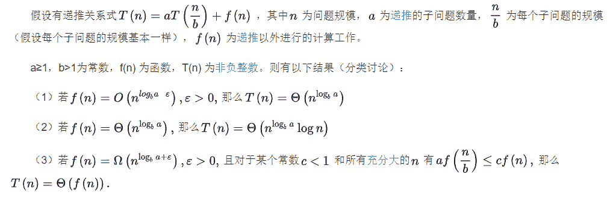

# 哔哩哔哩 2021 校园招聘算法方向笔试卷 A

## 1

对于两个字符串 A 和 B，如果 A 和 B 中出现的字符种类相同且每种字符出现的次数相同，则 A 和 B 互为变形词，请设计一个高效算法，检查两给定串是否互为变形词。

给定两个字符串 A 和 B，请返回一个 bool 值，代表他们是否互为变形词。

本题知识点

算法工程师 哔哩哔哩 2021

讨论

[零葬](https://www.nowcoder.com/profile/75718849)

检查两个字符串每种字符的计数是否相同就行

```cpp
from collections import defaultdict
s1 = input().strip()
s2 = input().strip()
counter1 = defaultdict(lambda: 0)
counter2 = defaultdict(lambda: 0)
if len(s1) != len(s2):
    print(0)
else:
    for i in range(len(s1)):
        counter1[s1[i]] += 1
        counter2[s2[i]] += 1
    flag = 1
    for alpha in counter1:
        if counter1[alpha] != counter2[alpha]:
            flag = 0
            break
    print(flag)
```

发表于 2021-04-11 18:43:37

* * *

[Uiney](https://www.nowcoder.com/profile/293826004)

```cpp
//将字符串排序比较是否相同即可。
#include<iostream>
#include<algorithm>
#include<map>
using namespace std;
int main()
{
    int flag=0;
    string s1,s2;
    cin>>s1>>s2;
    if(s1.size()!=s2.size()) flag=1;
    else
    {
        sort(s1.begin(),s1.end());
        sort(s2.begin(),s2.end());
        if(s1!=s2)flag=1;
    }
    if(flag==1)cout<<0;
    if(flag==0)cout<<1;
    return 0;
}

```

发表于 2021-08-02 16:23:39

* * *

[maoxiaomao](https://www.nowcoder.com/profile/230303195)

```cpp
s1=input().strip()
s2=input().strip()
us1=[]
us2=[]
for i in range(len(s1)):   #s1 独立字符
    if s1[i] not in us1:
        us1.append(s1[i])
for j in range(len(s2)):   #s2 独立字符
    if s2[j] not in us2:
        us2.append(s2[j])
flag=0
for k in range(len(us1)):  
    if s1.count(us1[k])!=s2.count(us1[k]):
        flag=1
        print(0)
        break
if flag==0:
    print(1)
```

发表于 2021-05-19 20:21:56

* * *

## 2

某次漫展，已知有 n 个打卡点，每个打卡点的活动需要 m_i 分钟完成，完成后获得奖励点 r_i，已经打卡过的点不能再去。

需要在规定 m 分钟内完成，尽可能多的收获奖励点，求获得最多的奖励点数。

本题知识点

算法工程师 哔哩哔哩 2021

讨论

[零葬](https://www.nowcoder.com/profile/75718849)

01 背包问题的模板，**dp[i][j]**表示在剩余时间为**j**分钟的情况下，考虑漫展**0~i**的最大奖励点，那么它有两种情况进行状态转移。(1) 如果已经不够时间去漫展**i**进行打卡，则有**dp[i][j] = dp[i-1][j]**，这个展不去了。(2) 否则可以选择去与不去，如果去则应该加上这个展的奖励点，**dp[i][j] = dp[i - 1][j-m[i]]+r[i]**，否则与情况(1)相同，应该选择这两种策略中能让奖励点更多的策略：**            dp[i][j] = max(****dp[i-1][j]****, dp[i - 1][j-mi]+ri)**

```cpp
n, m = map(int, input().strip().split())
ms, rs = [], []
for _ in range(n):
    mi, ri = map(int, input().strip().split())
    ms.append(mi)
    rs.append(ri)
maxScore = 0
dp = [[0]*(m + 1) for _ in range(n)]
for i in range(n):
    for j in range(m + 1):
        if j >= ms[i]:
            dp[i][j] = max(dp[i - 1][j], dp[i - 1][j - ms[i]] + rs[i])     # 能看的情况下，选择看与不看中收益大的策略
        else:
            dp[i][j] = dp[i - 1][j]      # 时间受限，第 i 个展看不了
print(dp[-1][-1])
```

编辑于 2021-04-11 19:35:15

* * *

[gcchacker](https://www.nowcoder.com/profile/470012742)

```cpp
# include <stdio.h>
int dp[105][125];
int my_max(int x, int y)
{
    if(x >= y)
        return x;
    else
        return y;
}
int fun(int t[], int r[], int n, int m)
{
    for(int i = 1; i <= n; i++)
    {
        for(int j = 1; j <= m; j++)
        {
            if(t[i] > j)
                dp[i][j] = dp[i-1][j];
            else 
                dp[i][j] = my_max(dp[i-1][j], dp[i-1][j - t[i]] + r[i]);
        }
    }
    return dp[n][m];
}
int main()
{
    int n, m;
    int t[105];
    int r[105];
    scanf("%d %d", &n, &m);
    for(int i = 1; i <= n; i++)
    {
        scanf("%d %d", &t[i], &r[i]);
    }
    int res = fun(t, r, n, m);
    printf("%d", res);
    return 0;
}
```

 发表于 2021-10-12 20:12:42

* * *

[啥时候才能有 match 的 offer](https://www.nowcoder.com/profile/4735840)

01 背包问题

```cpp
import sys
n, m = map(int, sys.stdin.readline().strip().split(" "))
points = []
for i in range(n):
    m_i, r_i = map(int, sys.stdin.readline().strip().split(" "))
    points.append([m_i, r_i])
#print(points)    
# dp[i][j]: 当前已考虑 i 之前的所有点，剩余时间为 j 时的得分
dp = [[0]*(m+1) for _ in range(n+1)]
for i in range(1, n+1):
    for j in range(1, m+1):
        # 剩余时间不足
        m_i, r_i = points[i-1][0], points[i-1][1]
        if j < m_i:
            dp[i][j] = dp[i-1][j]
        else:
            dp[i][j] = max(dp[i-1][j], dp[i-1][j - m_i] + r_i)
print(dp[n][m])
```

发表于 2021-04-10 14:08:45

* * *

## 3

一些正数能被表示成一个或者多个连续质数的和。那一个数会有多少种这样的表示方式呢？比如说数字 41 能有 3 种表示方式：2+3+5+7+11+13，11+13+17，和 41；数字 3 只有本身这一种表示方式；而 20 没有这样的表示方式。写一个程序生成给定数字的表示方式数量吧。数字大小范围从 2 到 10，000。

本题知识点

算法工程师 哔哩哔哩 2021

讨论

[零葬](https://www.nowcoder.com/profile/75718849)

先求取不超过 n 的素数表，然后穷举素数表的连续子数组和，找出满足和为 n 的即可

```cpp
def isPrime(num):
    for factor in range(2, num):
        if num % factor == 0:
            return False
    return True

if __name__ == "__main__":
    n = int(input())
    prime_list = []
    # 先生成不超过 n 的质数表
    for i in range(2, n + 1):
        if isPrime(i):
            prime_list.append(i)
    count, start, prime_num = 0, 0, len(prime_list)
    while start <= prime_num - 1:
        for L in range(1, prime_num - start + 1):
            temp = sum(prime_list[start:start + L])
            if temp > n:
                break
            if temp == n:
                count += 1
        start += 1
    print(count)
```

发表于 2021-04-11 20:41:17

* * *

[Zaneking](https://www.nowcoder.com/profile/544940433)

```cpp
#include<iostream>
#include<cstring>
#include<vector>
using namespace std;
int main()
{
    int n;
    cin>>n;
    int prime[n+1];
    memset(prime,0,sizeof(prime));
    vector<int> m;
    for(int i=2;i<=n;i++)
    {
        if(prime[i]==0)
        {
            m.push_back(i);
        }
        for(int j=i+i;j<=n;j=j+i)
        {
            prime[j]=1;
        }
        //cout<<"hello"<<endl;
    }
    //cout<<"***"<<endl;
    //cout<<m.size()<<endl;
    int result=0;
    int cnt=0;
    int from=0;
    int to=0;
    while(to<m.size() && from<=to)
    {
        //cout<<m[to]<<endl;
        if(m[to]+result<n)
        {
            result=result+m[to];
            to++;
            continue;
        }
        else if(m[to]+result==n)
        {
            result=result+m[to]-m[from];
            from++;
            to++;
            cnt++;
            continue;
        }
        else
        {
            result=result-m[from];
            from++;
            continue;
        }
    }
    cout<<cnt<<endl;

}
```

发表于 2022-01-03 12:40:02

* * *

[maoxiaomao](https://www.nowcoder.com/profile/230303195)

```cpp
def isPrime(n):        #判断一个数是否为素数
    if n<=1:
        return False
    i=2
    while i*i<=n:
        if n%i==0:
            return False
        i+=1
    return True
num=int(input().strip())
p=[]
for i in range(num+1):   #生成素数列表
    if isPrime(i):
        p.append(i)
c=0
for i in range(len(p)):  #遍历素数列表
    j=i                   #从第 i 个加起
    tmp=[]
    tmp.append(p[j])
    while j+1<len(p) and sum(tmp)< num:
        j=j+1
        tmp.append(p[j])
    if sum(tmp)==num:
        c=c+1
print(c)
```

1.生成素数列表 2.累加素数列表

编辑于 2021-05-19 20:27:01

* * *

## 4

下列对于激活函数说法错误的是

正确答案: B   你的答案: 空 (错误)

```cpp
激活函数将非线性引入了神经网络
```

```cpp
激活函数的值域在 0-1 之间
```

```cpp
激活函数的选取会影响梯度消失和梯度爆炸问题
```

```cpp
RELU 可能会导致某些神经元永远不更新
```

本题知识点

算法工程师 哔哩哔哩 2021

讨论

[零葬](https://www.nowcoder.com/profile/75718849)

只有 sigmoid 激活函数的值域才在 0-1 之间

发表于 2021-04-11 20:43:20

* * *

[勇敢牛牛不怕面试](https://www.nowcoder.com/profile/664019504)

ReLU 在训练的时候很”脆弱”，一不小心有可能导致神经元”坏死”。举个例子：由于 ReLU 在 x<0 时梯度为 0，这样就导致负的梯度在这个 ReLU 被置零，而且这个神经元有可能再也不会被任何数据激活。如果这个情况发生了，那么这个神经元之后的梯度就永远是 0 了，也就是 ReLU 神经元坏死了，不再对任何数据有所响应。ReLU 的值域上边界大于 1

编辑于 2021-08-24 09:53:11

* * *

## 5

三个标注员独立对同一数据进行标注。假设三个标注员标注正确的概率都是 80%，请问在最终结果是少数服从多数的情况下，三个标注员的最终结果标注正确的概率是

正确答案: B   你的答案: 空 (错误)

```cpp
0.8
```

```cpp
0.896
```

```cpp
0.868
```

```cpp
0\. 992
```

本题知识点

算法工程师 哔哩哔哩 2021

讨论

[零葬](https://www.nowcoder.com/profile/75718849)

有两种情况：A.三个人都标注对，概率为 0.8³B.有两个人标注对，概率为 C[3]²*0.8²*0.2P(A)+P(B)=0.896

发表于 2021-04-11 20:46:28

* * *

## 6

有两个样本点，第一个点为正样本,它的特征向量是(0,-1);第二个点为负样本,它的特征向量是(2,3),从这两个样本点组成的训练集构建一个线性 SVM 分类器的分类面方程是

正确答案: C   你的答案: 空 (错误)

```cpp
2x+y=4
```

```cpp
x+2y=5
```

```cpp
x+2y=3
```

```cpp
其他都不对
```

本题知识点

算法工程师 哔哩哔哩 2021

讨论

[零葬](https://www.nowcoder.com/profile/75718849)

只要验证一下两个样本点离分割超平面是不是一样远的就行

发表于 2021-04-11 20:47:13

* * *

## 7

当我们使用线性分类器对样本进行分类，得到一个 base 模型后，在样本中新增一个特征重新训练，得到了一个新模型。此时新模型一定：

正确答案: B   你的答案: 空 (错误)

```cpp
在训练集上准确率会降低
```

```cpp
在训练集上准确率会增加或保持不变
```

```cpp
在测试集上准确率会降低
```

```cpp
在测试集上准确率增加或保持不变
```

本题知识点

算法工程师 哔哩哔哩 2021

## 8

对于一颗有 19 个节点的二叉树，最多可能存在多少个叶子节点？

正确答案: A   你的答案: 空 (错误)

```cpp
10
```

```cpp
11
```

```cpp
12
```

```cpp
13
```

本题知识点

算法工程师 哔哩哔哩 2021

讨论

[零葬](https://www.nowcoder.com/profile/75718849)

完全二叉树就是一种符合题意的情况，数一下就知道有 10 个叶子节点

发表于 2021-04-11 20:49:57

* * *

## 9

使用二分查找法在区间[0,1]搜索 x，若经过 10 次查找还需继续搜索，则第 11 次搜索区间的长度为多少？

正确答案: B   你的答案: 空 (错误)

```cpp
1/2.
```

```cpp
1/2¹⁰
```

```cpp
1/2¹¹
```

```cpp
1/2¹²
```

本题知识点

算法工程师 哔哩哔哩 2021

讨论

[零葬](https://www.nowcoder.com/profile/75718849)

第 2 次查找的时候区间长度为 1/2¹，以此类推，第 11 次查找区间长度为 1/2¹⁰

发表于 2021-04-11 20:50:24

* * *

## 10

某算法的计算时间递推关系式为 T(1) = 1，T(n) = 2T(n/4) + √n，那么算法的时间复杂度为？

正确答案: C   你的答案: 空 (错误)

```cpp
O(n)
```

```cpp
O(√n)
```

```cpp
O(√n * log(n))
```

```cpp
O(n²)
```

本题知识点

算法工程师 哔哩哔哩 2021

讨论

[零葬](https://www.nowcoder.com/profile/75718849)

主定理第二种情况

发表于 2021-04-11 20:13:06

* * *

## 11

下列关于决策树的说法中，错误的是

正确答案: A   你的答案: 空 (错误)

```cpp
C4.5 算法是根据最大信息熵增益进行分裂的
```

```cpp
gbdt 中的树是回归树
```

```cpp
随机森林运用了 bagging 的思想
```

```cpp
xgboost 在目标函数中加入了正则项来避免过拟合
```

本题知识点

算法工程师 哔哩哔哩 2021

讨论

[零葬](https://www.nowcoder.com/profile/75718849)

C4.5 是信息增益率最大，信息增益最大是 ID3

发表于 2021-04-11 20:51:22

* * *

## 12

下列关于 optimizer 的说法中，错误的是

正确答案: D   你的答案: 空 (错误)

```cpp
当目标函数为凸函数时，使用梯度下降法可以得到全局最优解
```

```cpp
AdaGrad 会随着时间的推移使得学习率越来越小
```

```cpp
Adam 本质上是带有动量项的 RMSprop
```

```cpp
RMSprop 不需要设置全局的学习率
```

本题知识点

算法工程师 哔哩哔哩 2021

讨论

[勇敢牛牛不怕面试](https://www.nowcoder.com/profile/664019504)

RMSProp 通过引入一个衰减系数，让 r 每回合都衰减一定比例，类似于 Momentum 中的做法。 需要:全局学习速率 ϵ , 初始参数 θ, 数值稳定量δ，衰减速率ρ 

发表于 2021-08-24 10:00:00

* * *

## 13

下面哪个是稳定排序？

正确答案: A   你的答案: 空 (错误)

```cpp
冒泡排序
```

```cpp
快速排序
```

```cpp
堆排序
```

```cpp
选择排序
```

本题知识点

算法工程师 哔哩哔哩 2021

讨论

[蹇之途](https://www.nowcoder.com/profile/230063737)

冒泡排序只会进行两两交换

发表于 2021-06-22 18:16:09

* * *

## 14

下面哪个模型不是判别模型？

正确答案: D   你的答案: 空 (错误)

```cpp
逻辑回归
```

```cpp
条件随机场
```

```cpp
支持向量机
```

```cpp
深度信念网络
```

本题知识点

算法工程师 哔哩哔哩 2021

讨论

[零葬](https://www.nowcoder.com/profile/75718849)

常见的生成模型有：隐马尔科夫模型，混合高斯模型，朴素贝叶斯模型和深度信念网络

发表于 2021-04-11 20:53:04

* * *

## 15

对于 c++中的如下 lambda 函数：[=] (int x) mutable -> int{    int n = x+y;      return n;}下列说法错误的是

正确答案: D   你的答案: 空 (错误)

```cpp
此函数需要传入一个 int 类型的参数
```

```cpp
变量 n 的生命周期在赋给返回值后即结束
```

```cpp
[=]表示对所有外部变量采用值捕获
```

```cpp
在此函数中不可以对捕获的外部变量进行修改
```

本题知识点

算法工程师 哔哩哔哩 2021

## 16

下面 Python 代码的输出结果为：r=1for i in range(5, 10, 2):    r += r * iprint (r)

正确答案: A   你的答案: 空 (错误)

```cpp
480
```

```cpp
472
```

```cpp
450
```

```cpp
436
```

本题知识点

算法工程师 哔哩哔哩 2021

讨论

[牛客 227325592 号](https://www.nowcoder.com/profile/227325592)

 r += r * i 即  r =r+( r * i)for i in range(5, 10, 2):即从 5 到 10 以步长为 2 提取出“5，7，9”带入运算三次可得到 480

编辑于 2021-05-06 12:30:07

* * *

## 17

下列关于字典树的叙述错误的是：

正确答案: B   你的答案: 空 (错误)

```cpp
每个节点的所有子节点包含的字符都不相同
```

```cpp
查询时间复杂度是 O(L)，L 是字符串长度
```

```cpp
字典树利用字符串的公共前缀来提高查询效率
```

```cpp
根节点不包含字符
```

本题知识点

算法工程师 哔哩哔哩 2021

讨论

[勇敢牛牛不怕面试](https://www.nowcoder.com/profile/664019504)

在字典树中查找字符串的时间复杂度只跟树的深度有关而跟究竟有多少个字符串无关，而树的深度只跟字符串的长度有关，超过 30 个拉丁字母的英文单词基本没有，所以在该问题中查找字符串的时间复杂度只有 O(1)

发表于 2021-08-24 10:01:23

* * *

[食堂在逃干饭王](https://www.nowcoder.com/profile/5786634)

时间复杂度是 O(1)！！！

发表于 2021-08-10 16:05:01

* * *

[零葬](https://www.nowcoder.com/profile/75718849)

为什么 B 的叙述是错的😑

编辑于 2021-04-11 21:01:21

* * *

## 18

小明对内容非常挑剔，如果连续三刷没有想点的视频就会流失。已知小明一刷有点击的概率是 20%，请问小明刷数的期望值最接近以下哪个整数？

正确答案: C   你的答案: 空 (错误)

```cpp
3
```

```cpp
4
```

```cpp
5
```

```cpp
6
```

本题知识点

算法工程师 哔哩哔哩 2021

讨论

[勇敢牛牛不怕面试](https://www.nowcoder.com/profile/664019504)

这题怎么算啊？1+0.8*2+0.8*0.8*3=4.52？

发表于 2021-08-24 10:17:56

* * *

## 19

下列选项中，不可能是快速排序第 2 趟排序结果的是（）。

正确答案: C   你的答案: 空 (错误)

```cpp
2，3，5，4，6，7，9
```

```cpp
2，7，5，6，4，3，9
```

```cpp
3，2，5，4，7，6，9
```

```cpp
4，2，3，5，7，6，9
```

本题知识点

算法工程师 哔哩哔哩 2021

讨论

[零葬](https://www.nowcoder.com/profile/75718849)

只有 C 找不出一个数是左边都比它小，右边都比它大的

编辑于 2021-04-11 20:53:46

* * *

[VanChilly](https://www.nowcoder.com/profile/35524123)

快速排序每一次排序都能确定一个数的最终位置，所以我们只要看看是否至少有排序次数个数在最终位置上

发表于 2022-03-07 16:14:17

* * *

[就是这个光](https://www.nowcoder.com/profile/910692584)

快速排序第 2 趟排序结果肯定满足至少有 2 个数字其左边比它小右边比它大。

发表于 2021-07-05 16:52:23

* * *

## 20

以下概率分布中，哪一个是离散分布

正确答案: B   你的答案: 空 (错误)

```cpp
柯西分布
```

```cpp
柏松分布
```

```cpp
狄利克雷分布
```

```cpp
正态分布
```

本题知识点

算法工程师 哔哩哔哩 2021

## 21

以下哪一个算法一般不能用来解决分类问题?

正确答案: A   你的答案: 空 (错误)

```cpp
K-Means
```

```cpp
逻辑回归
```

```cpp
支持向量机
```

```cpp
K 近邻
```

本题知识点

算法工程师 哔哩哔哩 2021

讨论

[零葬](https://www.nowcoder.com/profile/75718849)

K-Means 是聚类算法

发表于 2021-04-11 20:54:10

* * *

## 22

在 MySQL 中，对两张各有 10 行数据的表进行一次 FULL JOIN，返回的表最多能有多少行?

正确答案: C   你的答案: 空 (错误)

```cpp
10
```

```cpp
20
```

```cpp
100
```

```cpp
无限多
```

本题知识点

算法工程师 哔哩哔哩 2021

讨论

[CharmsGraker](https://www.nowcoder.com/profile/671970057)

额，这是指笛卡尔积吗

发表于 2021-09-28 18:55:48

* * *

[就是这个光](https://www.nowcoder.com/profile/910692584)

[`www.w3school.com.cn/sql/sql_join_full.asp`](https://www.w3school.com.cn/sql/sql_join_full.asp)

发表于 2021-07-05 17:04:23

* * *

[零葬](https://www.nowcoder.com/profile/75718849)

mysql 有 full join 吗？题目中指的笛卡尔积吧

发表于 2021-04-11 20:14:58

* * *

## 23

假设给定一个分类器它的混淆矩阵如下: True Positive = 5, False Positive = 2, False Negative = 3, True Nagative = 17, 则该分类器的精度(Precision)为多少? 

正确答案: C   你的答案: 空 (错误)

```cpp
5/8
```

```cpp
5/22
```

```cpp
5/7
```

```cpp
22/27
```

本题知识点

算法工程师 哔哩哔哩 2021

讨论

[零葬](https://www.nowcoder.com/profile/75718849)

Precision=TP/(TP+FP)

发表于 2021-04-11 20:54:45

* * *

## 24

struct Test {int a;int b;Test() : a(b), b(3) {} };Test g_obj;int main() {Test obj;obj = g_obj;cout << obj.a << " " << obj.b << endl;return 0;}给定以上程序片段, 描述正确的是: ( ). 备注: 随机值表示该变量的值不能确定, 未定义

正确答案: D   你的答案: 空 (错误)

```cpp
程序编译出错
```

```cpp
程序输出为: "<随机值> 3"
```

```cpp
程序输出为: "3 3"
```

```cpp
程序输出为: "0 3"
```

本题知识点

算法工程师 哔哩哔哩 2021

讨论

[零葬](https://www.nowcoder.com/profile/75718849)

结构体未被初始化的属性是有初始值的，int 类型的初值为 0

发表于 2021-04-11 20:55:22

* * *

## 25

在神经网络中，以下哪些方法用于解决过拟合？1.减少网络层 2.增加网络层 3.正则化 4.增加学习率 5. 减小学习率 

正确答案: A   你的答案: 空 (错误)

```cpp
1, 3
```

```cpp
1, 5
```

```cpp
2, 4
```

```cpp
1, 3, 5
```

本题知识点

算法工程师 哔哩哔哩 2021

讨论

[哈斯塔 Hastur](https://www.nowcoder.com/profile/311171438)

在深度学习中，几乎没有减少网络层能缓解过拟合的情况出现。在传统机器学习模型中，也有 double descent 的情况，随着模型变复杂，先会导致过拟合，然后又会逐步缓解。

编辑于 2021-06-11 21:10:30

* * *

## 26

在相同样本量下，不重复抽样和重复抽样的抽样平均误差大小关系是怎样的？

正确答案: B   你的答案: 空 (错误)

```cpp
不重复抽样误差大
```

```cpp
重复抽样误差大
```

```cpp
一样大
```

```cpp
视具体情况而定
```

本题知识点

算法工程师 哔哩哔哩 2021

讨论

[零葬](https://www.nowcoder.com/profile/75718849)


发表于 2021-04-11 20:04:52

* * *