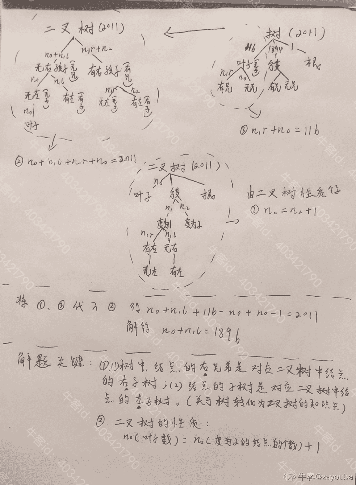

# 哔哩哔哩 2021 校园招聘算法方向笔试卷 B

## 1

小明最近喜欢上了俄罗斯套娃、大鱼吃小鱼这些大的包住小的类型的游戏。

于是小明爸爸给小明做了一个特别版的大鱼吃小鱼游戏，他希望通过这个游戏

能够近一步提高牛牛的智商。

游戏规则如下：

现在有 N 条鱼，每条鱼的体积为 Ai，从左到右排成一排。

A 数组是一个排列。

小明每轮可以执行一次大鱼吃小鱼的操作

一次大鱼吃小鱼的操作：对于每条鱼，它在每一次操作时会吃掉右边比自己小的第一条鱼

值得注意的时，在一次操作中，每条鱼吃比自己小的鱼的时候是同时发生的。

举一个例子，假设现在有三条鱼,体积为分别[5，4，3]，5 吃 4，4 吃 3，一次操作后就剩下[5]一条鱼。

爸爸问小明，你知道要多少次操作，鱼的数量就不会变了嘛？

本题知识点

算法工程师 哔哩哔哩 2021

讨论

[maoxiaomao](https://www.nowcoder.com/profile/230303195)

循环提取非递增数组(提取一次非递增数组实际上就是模拟一次吃鱼过程)，计算器加 1 直到不能提取非递增数组为止(实际上就是不能吃鱼了)，跳出循环，程序结束

```cpp
N=input().strip().split()
A=list(map(int,input().strip().split()))
c=0
i=0
while(1):
    t=[]
    while i<len(A):
        t.append(A[i])
        while i+1<len(A) and A[i+1]<A[i]:
            i=i+1
        i=i+1
    if len(A)!=len(t):
        c=c+1
    else:break
    i=0
    A=t
print(c)
```

编辑于 2021-05-24 14:53:41

* * *

[零葬](https://www.nowcoder.com/profile/75718849)

直接模拟，其实就是进行操作：每次保留整个数组中所有递减序列的第一个元素。直到数组的长度不再改变为止。

```cpp
import java.io.BufferedReader;
import java.io.InputStreamReader;
import java.io.IOException;
import java.util.ArrayList;

public class Main {
    public static void main(String[] args) throws IOException {
        BufferedReader br = new BufferedReader(new InputStreamReader(System.in));
        int n = Integer.parseInt(br.readLine().trim());
        String[] strFish = br.readLine().trim().split(" ");
        ArrayList<Integer> fish = new ArrayList<>();
        for(int i = 0; i < strFish.length; i++)
            fish.add(Integer.parseInt(strFish[i]));
        ArrayList<Integer> newFish = descSize(fish);
        int count = 0;
        while(!newFish.isEmpty() && newFish.size() < fish.size()){
            count ++;
            fish = new ArrayList<Integer>(newFish);
            newFish = descSize(fish);
        }
        System.out.println(count);
    }

    private static ArrayList<Integer> descSize(ArrayList<Integer> list) {
        ArrayList<Integer> newList = new ArrayList<Integer>();
        int i = 0;
        for(; i < list.size() - 1; i++){
            if(i == 0)
                newList.add(list.get(i));
            if(list.get(i) <= list.get(i + 1))
                newList.add(list.get(i + 1));
        }
        return newList;
    }
}
```

发表于 2021-04-11 22:53:34

* * *

[在即](https://www.nowcoder.com/profile/5150366)

双数组

```cpp
#include 
using namespace std;
const int N = 1e5 + 5;
int pre[N], aft[N];
int n, m;

int main() {

    int n;
    cin >> n;
    for (int i = 0; i < n; i++) {
        scanf("%d", &pre[i]);
    }

    int ans = 0;
    while(n > 1) {
        aft[m++] = pre[0];
        for (int i = 1; i < n; i++)
            if (pre[i] > pre[i - 1])
                    aft[m++] = pre[i];

        if (m == n) break;
        ans++;
        n = m;
        m = 0;
        memcpy(pre, aft, sizeof aft);
    }
    printf("%d\n", ans);
    return 0;
}
```

发表于 2022-01-16 23:08:33

* * *

## 2

给一个长度为 N 的序列 a1,a2,...,an,求最大连续和。也即，寻找 1<=i<=j<=N,使得 ai+...+aj 尽量大。

本题知识点

算法工程师 哔哩哔哩 2021

讨论

[凪咲](https://www.nowcoder.com/profile/726948972)

使用滑动窗口求解，如果保存最大连续和，如果当前子序列和为负数，则该子序列对后续获得更大的和起副作用，抛弃该部分，重新开始求和。最大的坑在于明明说用逗号分隔，最后一个用例来了一个先空格再逗号的分隔，这也太阴了。

```cpp
#include <iostream>
#include <limits.h>

using namespace std;

int main(){
    int cur = 0, ans = INT_MIN, cursum = 0;
    char c='0';
    do{
        while(c == ' '){
            c = getchar();
        }
        cin >> cur;
        cursum += cur;
        ans = max(ans, cursum);
        if(cursum < 0){
            cursum = 0;
        }
        c = getchar();
    }while(c != '\n');
    cout << ans << endl;
    return 0;
}
```

发表于 2021-09-07 10:32:48

* * *

[零葬](https://www.nowcoder.com/profile/75718849)

动规求解，记 dp[i]为 arr[0:i]的最大连续和，则有状态转移方程**dp[i] = max(dp[i-1]+arr[i], arr[i])**表示如果前面的和对**arr[i]**做的是负贡献，那就从**arr[i]**开始重新计算连续和，否则继续累加**arr[i]**。

```cpp
import java.io.BufferedReader;
import java.io.InputStreamReader;
import java.io.IOException;

public class Main {
    public static void main(String[] args) throws IOException {
        BufferedReader br = new BufferedReader(new InputStreamReader(System.in));
        String[] strArr = br.readLine().trim().split(",");
        int[] arr = new int[strArr.length];
        for(int i = 0; i < arr.length; i++) arr[i] = Integer.parseInt(strArr[i].trim());
        int[] dp = new int[arr.length];
        dp[0] = arr[0];
        int max = dp[0];
        for(int i = 1; i < arr.length; i++){
            dp[i] = Math.max(dp[i - 1] + arr[i], arr[i]);
            max = Math.max(max, dp[i]);
        }
        System.out.println(max);
    }
}
```

编辑于 2021-04-12 11:31:30

* * *

[牛客 575394749 号](https://www.nowcoder.com/profile/575394749)

num =list(map(int,input().strip().split(',')))
maxn = 0
i = 1
dp = []
dp.append(num[0])
while i < len(num):
    dp.append(max(dp[i-1]+num[i], num[i]))
    maxn = max(maxn, dp[i])
    i = i + 1
print(maxn)想知道错在哪，有测试用例没通过

发表于 2022-02-11 21:48:08

* * *

## 3

回文串是指字符串无论从左读还是从右读，所读的顺序是一样的；简而言之，回文串是左右对称的。

现给定一个字符串，求出它的最长回文子串。你可以假定只有一个满足条件的最长回文串。

本题知识点

算法工程师 哔哩哔哩 2021

讨论

[零葬](https://www.nowcoder.com/profile/75718849)

从最长的开始，穷举所有子串，并验证其回文性即可

```cpp
import java.io.BufferedReader;
import java.io.InputStreamReader;
import java.io.IOException;

public class Main {
    public static void main(String[] args) throws IOException {
        BufferedReader br = new BufferedReader(new InputStreamReader(System.in));
        String str = br.readLine().trim();
        for(int len = str.length(); len >= 1; len--){
            for(int i = 0; i <= str.length() - len; i++){
                String substr = str.substring(i, i + len);
                if(isPalindrome(substr)){
                    System.out.println(substr);
                    return;
                }
            }
        }
    }

    private static boolean isPalindrome(String str){
        int left = 0, right = str.length() - 1;
        while(left < right){
            if(str.charAt(left) != str.charAt(right))
                return false;
            left ++;
            right --;
        }
        return true;
    }
}
```

发表于 2021-04-11 21:52:05

* * *

[在即](https://www.nowcoder.com/profile/5150366)

枚举中心，注意 0 和 n-1 也要枚举，为了应付长度为 1 的字符串

```cpp
#include <bits/stdc++.h>
using namespace std;
string s;
int main() {
    cin >> s;
    int n = s.size();
    string ans;
    for (int i = 0; i < n; i++) {
        int j, k;
        for (j = i, k = i; j - 1 >= 0 && k + 1 < n && s[j - 1] == s[k + 1]; j--, k++){}
        if (ans.size() < k - j + 1) ans = s.substr(j, k - j + 1);
        for (j = i + 1, k = i; j - 1 >= 0 && k + 1 < n && s[j - 1] == s[k + 1]; j--, k++) {}
        if (ans.size() < k - j + 1) ans = s.substr(j, k - j + 1);
        //printf("%c %d %d\n", s[i], j, k);
    }
    cout << ans << endl;
    return 0;
}

```

发表于 2022-01-16 23:11:14

* * *

[maoxiaomao](https://www.nowcoder.com/profile/230303195)

```cpp
s=input().strip()
t=[]
for i in range(len(s)):
    j=i-1
    k=i+1
    tmp=[]
    tmp.append(s[i])
    while j>=0 and k<len(s) and s[j]==s[k]: 
        tmp.insert(0,s[j])
        tmp.append(s[k])
        j=j-1
        k=k+1
    if len(tmp)>len(t):t=tmp
    j=i
    k=i+1
    tmp=[]    
    while j>=0 and k<len(s) and s[j]==s[k]:
        tmp.insert(0,s[j])
        tmp.append(s[k])
        j=j-1
        k=k+1
    if len(tmp)>len(t):t=tmp
tt=""
for i in range(len(t)):
    tt+=t[i]
print(tt)
```

发表于 2021-05-24 19:20:29

* * *

## 4

在一个空闲的多核环境下，以下 c++代码运行时间为？（精确到秒） #include <iostream>#include <future>#include <thread>using namespace std::literals::chrono_literals;void foo(int n) { std::this_thread::sleep_for(n * 1s); }int main(){std::async( std::launch::async, foo, 10 );std::async( std::launch::async, foo, 5 );return 0;}

正确答案: C   你的答案: 空 (错误)

```cpp
5s
```

```cpp
10s
```

```cpp
15s
```

```cpp
10s 或者 15s
```

本题知识点

算法工程师 哔哩哔哩 2021

## 5

C++中，下面哪个容器不提供 resize()操作：

正确答案: A   你的答案: 空 (错误)

```cpp
std::array
```

```cpp
std::deque
```

```cpp
std::list
```

```cpp
std::vector
```

本题知识点

算法工程师 哔哩哔哩 2021

讨论

[零葬](https://www.nowcoder.com/profile/75718849)

array 属于定长容器，不能 resize

发表于 2021-04-12 11:28:36

* * *

## 6

对 k-means 算法以下说法正确是: 

正确答案: C   你的答案: 空 (错误)

```cpp
是层次聚类
```

```cpp
对确定的 K 可以得到最优解
```

```cpp
是划分方法聚类
```

```cpp
有可能不收敛
```

本题知识点

算法工程师 哔哩哔哩 2021

讨论

[零葬](https://www.nowcoder.com/profile/75718849)

KMeans 属于划分聚类，层次聚类是另一种聚类方法。KMeans 是一种在 EM 算法框架下的聚类算法，它是一定会收敛的，但是通常收敛于局部最优。

编辑于 2021-04-12 11:33:53

* * *

## 7

以下哪种方式通常不能帮助解决决策树过拟合: 

正确答案: D   你的答案: 空 (错误)

```cpp
限制最大树深度
```

```cpp
后剪枝
```

```cpp
样本抽样
```

```cpp
增加新特征
```

本题知识点

算法工程师 哔哩哔哩 2021

讨论

[maoxiaomao](https://www.nowcoder.com/profile/230303195)

过拟合：指模型在训练集表现良好，测试集表现一般；解决方案：限制模型复杂度、正则化、数据集扩增、DropOut；A、B 都属于降低模型复杂度肯定能能帮助解决过拟合； C 中的样本抽样属于在过拟合数据中减少样本数据，D 中的增加新特征属于进一步增加模型复杂度...

发表于 2021-09-13 15:19:54

* * *

## 8

ROC 曲线和 AUC 常被用来评价一个二值分类器（binary classifier）的优劣。对于模型的 ROC 曲线，与哪一点越接近，表明该分类器的性能越好？

正确答案: B   你的答案: 空 (错误)

```cpp
左上，即 TPR=0, FPR=1
```

```cpp
左上，即 FPR=0, TPR=1
```

```cpp
右下，即 TPR=0, FPR=1
```

```cpp
右下，即 FPR=0, TPR=1
```

本题知识点

算法工程师 哔哩哔哩 2021

## 9

下面哪个优化算法避免了长期累积梯度所导致的学习率趋向于 0 的问题

正确答案: B   你的答案: 空 (错误)

```cpp
Momentum SGD
```

```cpp
RMSProp
```

```cpp
AdaGrad
```

```cpp
Batch SGD
```

本题知识点

算法工程师 哔哩哔哩 2021

讨论

[minux_sufe](https://www.nowcoder.com/profile/756006068)

RMSprop 可以缓解 AdaGrad 学习率下降速度过快的问题

发表于 2021-09-13 16:34:10

* * *

## 10

有一楼梯共 10 级，若每次只能跨上一级或二级，要走上第 10 级，共有多少走法？

正确答案: D   你的答案: 空 (错误)

```cpp
83
```

```cpp
85
```

```cpp
87
```

```cpp
89
```

本题知识点

算法工程师 哔哩哔哩 2021

讨论

[零葬](https://www.nowcoder.com/profile/75718849)

第一项为 1，第二项为 2 的斐波那契数列。对于 3 级阶梯，可以分解为一个一级和一个二级，这样总的走法就是 1 级的走法+2 级的走法，以此类推可求得 10 级阶梯的情况有多少种走法。

编辑于 2021-04-12 11:37:44

* * *

[SilentAssassin](https://www.nowcoder.com/profile/896617885)

```cpp
from scipy.misc import comb
n = 10
s = 0
for i in range(n//2+1):
    s += comb(n-i, i)
print(s)
```

编辑于 2021-04-21 19:01:02

* * *

## 11

已知一颗由 2011 个结点的树，其叶节点个数为 116，该树对应的二叉树无右孩子的结点个数为（）。

正确答案: D   你的答案: 空 (错误)

```cpp
115
```

```cpp
116
```

```cpp
1895
```

```cpp
1896
```

本题知识点

算法工程师 哔哩哔哩 2021

讨论

[ZEROSPACE](https://www.nowcoder.com/profile/891393457)

参考：[`www.nowcoder.com/questionTerminal/614dcc92913e4b13922c19cd06727cd4`](https://www.nowcoder.com/questionTerminal/614dcc92913e4b13922c19cd06727cd4)

发表于 2021-08-25 14:32:52

* * *

[zayouba](https://www.nowcoder.com/profile/403421790)



发表于 2021-04-17 12:39:04

* * *

## 12

100 个人编号为 1 到 100，按从小到大的顺序排队上飞机，每个人都应该坐到自己编号对应的座位上。不巧的是，第一个人是个疯子，会随机找一个座位坐下。对于后面的第二个人到第一百个人，若这个人编号对应的座位已经被别人给坐了，那这个人就会在剩下的座位中随机找一个座位坐下；若这个人编号对应的座位还是空的，那这个人就会正常地对号入座。最后一个人能坐上自己座位的概率是多少？

正确答案: D   你的答案: 空 (错误)

```cpp
1/100
```

```cpp
1/50
```

```cpp
1/4950
```

```cpp
0.5
```

本题知识点

算法工程师 哔哩哔哩 2021

讨论

[零葬](https://www.nowcoder.com/profile/75718849)

设 f(k)为第 k 个位置被占的概率即 f(2)=1/n 为第一个人坐在第 2 个位子上的概率，则 f(k+1)为第 k+1 个位置被占的概率有两种情况：(1) 第 k 个座位被占，编号为 k 的乘客从剩下的 n-k+1 个位置中选中 k+1 号座位的概率为 f(k)*1/(n-k+1)；(2) 编号为 k 的乘客坐了 k 号座位，第 k+1 个乘客选座位时，k+1 个乘客中只有第 k 个乘客的位置是确定的，其他 k 个是不确定的。因此第 k+1 个乘客选座位就相当于 第 k 个乘客选座位时，第 k 个座位被占的概率，即 f(k)。f(k+1) = f(k) + f(k) * 1/(n - k + 1) = f(k)*(n - k + 2)/(n - k + 1)f(n) = f(n - 1)*[n - (n - 1) + 2]/[n - (n - 1) + 1] = f(n - 2)*[n - (n - 1) + 2]/[n - (n - 1) + 1] *[n - (n - 2) + 2]/[n - (n - 2) + 1]       = ... = 1/n*n/(n- 1)*(n-1)/(n-2)*...*4/3*3/2      = 1/2 不管有多少个座位，这个概率都是 1/2

发表于 2021-04-12 11:18:48

* * *

## 13

b 站有 100 万个 up 主 ,今天有 100 万用户随机且独立的给 up 主们投币,普通 up 主小明得到至少一枚硬币的概率和下面哪个值更接近?

正确答案: C   你的答案: 空 (错误)

```cpp
0.2
```

```cpp
0.4
```

```cpp
0.6
```

```cpp
0.8
```

本题知识点

算法工程师 哔哩哔哩 2021

讨论

[零葬](https://www.nowcoder.com/profile/75718849)

求取对立事件的概率，如果每个用户都不投币给小明，则概率为 P=(999999/1000000)¹⁰⁰⁰⁰⁰⁰因此 up 主小明得到至少一枚硬币的概率为 1-P，大概是 0.6 出头

编辑于 2021-04-12 11:15:05

* * *

## 14

一副扑克 54 张，平均分成三份，两张王在同一个人手中的概率是多大?

正确答案: B   你的答案: 空 (错误)

```cpp
43833
```

```cpp
17/53
```

```cpp
17/54
```

```cpp
18/53
```

本题知识点

算法工程师 哔哩哔哩 2021

讨论

[零葬](https://www.nowcoder.com/profile/75718849)

3 个人中先选一个人领取大小王两张牌，然后从剩下的 52 张牌中再分 16 张给他，还剩下 36 张牌，选择 18 张给第二个人，总共有事件数：3*C[52]¹⁶C[36]¹⁸将 54 张牌分给三个人包含的事件数为：C[54]¹⁸C[36]¹⁸根据古典概型，概率为：3*C[52]¹⁶C[36]¹⁸/C[54]¹⁸C[36]¹⁸=17/53

发表于 2021-04-12 11:10:37

* * *

[牛客 388602585 号](https://www.nowcoder.com/profile/388602585)

先发给一个人一张王，总牌数剩 53 张，该人手牌差 17 张，其中一张为王，即 17/53

发表于 2021-09-05 01:16:44

* * *

## 15

以下任务中，正则表达式无法做到的是

正确答案: B   你的答案: 空 (错误)

```cpp
提取 IP 地址
```

```cpp
判断括号串是否成对
```

```cpp
去除所有 emoji
```

```cpp
其他选项均错误
```

本题知识点

算法工程师 哔哩哔哩 2021

讨论

[maoxiaomao](https://www.nowcoder.com/profile/230303195)

正则表达式 ==用 if 条件组合能够做成的事情很明显 A、C 都可以通过简单 if 条件来定义，比如 C 项限定合法字符为数字或者字母对于 B 项，if 条件组合无法完成，需要借组栈结构。

发表于 2021-09-13 15:39:26

* * *

## 16

任何一个二叉树中，如果结点 a 有左孩子 b/右孩子 c，则在结点的先序序列、中序序列、后序序列中，（）

正确答案: C   你的答案: 空 (错误)

```cpp
结点 b 一定在结点 a 的前面
```

```cpp
结点 a 一定在结点 c 的前面
```

```cpp
结点 b 一定在结点 c 的前面
```

```cpp
结点 a 一定在结点 b 的前面
```

本题知识点

算法工程师 哔哩哔哩 2021

讨论

[零葬](https://www.nowcoder.com/profile/75718849)

先序遍历：根左右中序遍历：左根右后序遍历：左右根不管哪种，左孩子都在右孩子前面

发表于 2021-04-12 11:06:57

* * *

## 17

计算变量 [0,0,1,1,1,1] 的信息熵

正确答案: C   你的答案: 空 (错误)

```cpp
2/6 log(4/6) + 4/6 log(2/6)
```

```cpp
4/6 log(4/6) + 2/6 log(2/6)
```

```cpp
-(4/6 log(4/6) + 2/5 log(2/6))
```

```cpp
4/6 log(2/6) – 2/6 log(4/6)
```

本题知识点

算法工程师 哔哩哔哩 2021

讨论

[零葬](https://www.nowcoder.com/profile/75718849)

没懂 C 选项的分母 5 是怎么蹦出来的，反正信息熵的计算是-p*log(p)

发表于 2021-04-12 11:05:34

* * *

## 18

线性表与链表的区别不包括

正确答案: B   你的答案: 空 (错误)

```cpp
物理存储方式
```

```cpp
顺序读取时间复杂度
```

```cpp
随机读取时间复杂度
```

```cpp
插入操作时间复杂度
```

本题知识点

算法工程师 哔哩哔哩 2021

讨论

[零葬](https://www.nowcoder.com/profile/75718849)

顺序访问都是一样的，需要从头开始遍历，随机访问的情况下线性表才能通过索引在常数复杂度下定位到要访问的元素

发表于 2021-04-12 11:04:23

* * *

## 19

分布式系统的 CAP 原则指分布式系统在三个要素中只能兼顾两点。下列不属于三要素中的是

正确答案: C   你的答案: 空 (错误)

```cpp
一致性
```

```cpp
分区容错
```

```cpp
事务性
```

```cpp
可用性
```

本题知识点

算法工程师 哔哩哔哩 2021

讨论

[零葬](https://www.nowcoder.com/profile/75718849)

分布式系统的 CAP 原则指：一致性(Consistency)、可用性(Availability)、分区容错性(Partition tolerance)，且通常会在一致性上进行折中，选择最终一致性。

发表于 2021-04-12 11:02:33

* * *

## 20

对于 n 个带权样本的随机有放回带权采样，采样 m 次。最优时间复杂度为？

正确答案: B   你的答案: 空 (错误)

```cpp
O(m)
```

```cpp
O(n+m)
```

```cpp
O(mlogn)
```

```cpp
O(n*m)
```

本题知识点

算法工程师 哔哩哔哩 2021

讨论

[YwandungLyou](https://www.nowcoder.com/profile/166919250)

没想明白，谁知道请分享思路。

发表于 2021-07-31 21:59:48

* * *

[wwwwwizkd](https://www.nowcoder.com/profile/582749707)

自己的思路 不知道对不对统计 n 个样本的权，排序 ，存在哈希表里，O(n)之后每次生成一个随机数，通过哈希表直接得到指定权重位次的样本。一共 m 次 O(m)所以最后 O(m+n)

发表于 2021-08-05 16:52:52

* * *

## 21

关于机器学习中 FM 算法(Factorization Machines) 与 MF 算法(Matrix Factorization)，以下说法正确的是?

正确答案: C   你的答案: 空 (错误)

```cpp
FM 算法可以被理解为 MF 算法的特例
```

```cpp
FM 算法引入了二阶交叉特征，相比 MF，将在数据样本教稀疏时欠拟合
```

```cpp
MF 与 FM 算法都可以被理解为 embedding 的雏形
```

```cpp
其他说法均错误
```

本题知识点

算法工程师 哔哩哔哩 2021

## 22

下面哪一方法可以判断出一个有向图是否有环（回路)

正确答案: B   你的答案: 空 (错误)

```cpp
求节点的度
```

```cpp
拓扑排序
```

```cpp
求最短路径
```

```cpp
求关键路径
```

本题知识点

算法工程师 哔哩哔哩 2021

讨论

[零葬](https://www.nowcoder.com/profile/75718849)

如果有环，拓扑排序是不存在的

发表于 2021-04-12 11:40:04

* * *

## 23

机器学习训练时，Mini-Batch 的大小优选为 2 个的幂，如 256 或 512。它背后的原因是什么？

正确答案: B   你的答案: 空 (错误)

```cpp
Mini-Batch 为偶数的时候，梯度下降算法训练的更快
```

```cpp
Mini-Batch 设为 2 的 幂，是为了符合 CPU、GPU 的内存要求，利于并行化处理
```

```cpp
不使用偶数时，损失函数是不稳定的
```

```cpp
其他说法都不对
```

本题知识点

算法工程师 哔哩哔哩 2021

讨论

[maoxiaomao](https://www.nowcoder.com/profile/230303195)

Mini-Batch 设为 2 的 幂，是为了符合 CPU、GPU 的内存要求，利于并行化处理

```cpp
Mini-Batch 设为 2 的 幂，是为了符合 CPU、GPU 的内存要求，利于并行化处理
```

```cpp
Mini-Batch 设为 2 的 幂，是为了符合 CPU、GPU 的内存要求，利于并行化处理
```

发表于 2021-09-13 15:44:22

* * *

## 24

以下哪些是 bert 预训练时学习的任务？ 1. Masked LM 2. NER 3. NSP 4. Capitalization Prediction Task

正确答案: C   你的答案: 空 (错误)

```cpp
1 2
```

```cpp
1 3 4
```

```cpp
1 3
```

```cpp
1 4
```

本题知识点

算法工程师 哔哩哔哩 2021

## 25

在以下的哪一个数据集上，一般不使用 Hidden markov model?

正确答案: B   你的答案: 空 (错误)

```cpp
股票价格数据集
```

```cpp
电影评分数据集
```

```cpp
网站每日访问用户数数据集
```

```cpp
中文分词数据集
```

本题知识点

算法工程师 哔哩哔哩 2021

讨论

[wwwwwizkd](https://www.nowcoder.com/profile/582749707)

股票、网站：连续时间的结果存在依赖关系中文：每个字之间存在语义依赖关系

发表于 2021-08-05 16:54:51

* * *

## 26

假设数据集的输入 x 和输出 y 均为实数，数据集中有三个数据点如下: {(x,y)}={(0,1), (1,1), (2,0)}。在线性回归模型(y=a+bx+noise)下, 使用留一法(Leave One Out)交叉验证得到的均方误差是多少？

正确答案: C   你的答案: 空 (错误)

```cpp
1/4
```

```cpp
1/2
```

```cpp
3/4
```

```cpp
1
```

本题知识点

算法工程师 哔哩哔哩 2021

讨论

[零葬](https://www.nowcoder.com/profile/75718849)

用(0,1)和(1,1)训练线性模型，由最小二乘法得到模型：y=0*x+1，此时用数据点(2,0)验证得到误差为 1 用(1,1)和(2,0)训练线性模型，由最小二乘法得到模型：y=-x+2，此时用数据点(0,1)验证得到误差为 1 用(0,1)和(2,0)训练线性模型，由最小二乘法得到模型：y=-x/2+1，此时用数据点(1,1)验证得到误差为 0.5
综上，均方误差为(1²+1²+0.5²)/3=3/4

编辑于 2021-04-12 10:56:10

* * *

[牛客 123286882 号](https://www.nowcoder.com/profile/123286882)

线性回归方法的最小二乘法

发表于 2021-10-31 23:12:35

* * *