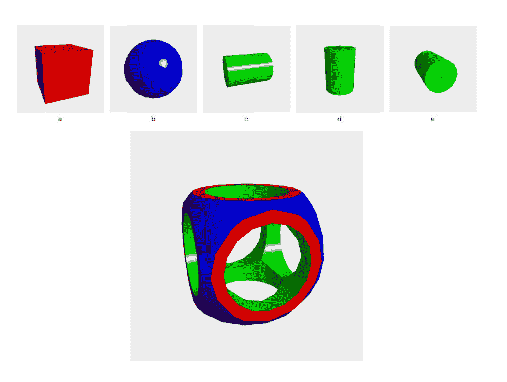

# 哔哩哔哩 2021 校园招聘图像引擎方向笔试卷

## 1

什么是高通滤波？什么是低通滤波？分别列举一种它们在图像处理中的应用。

你的答案

本题知识点

算法工程师 哔哩哔哩 2021

讨论

[哒哒哒，冲呀](https://www.nowcoder.com/profile/995874969)

高通滤波：将低频信息滤除，高频信息保留低通滤波：将高频信息滤除，低频信息保留应用：高通：锐化边缘，提高对比度低通：去除噪声，平滑边缘

发表于 2021-07-29 20:01:02

* * *

## 2

什么是光栅化？什么是光线追踪？它们各自的优缺点/适用场景？

你的答案

本题知识点

算法工程师 哔哩哔哩 2021

## 3

什么是固定管线？什么是可编程管线？后者的优势？

你的答案

本题知识点

算法工程师 哔哩哔哩 2021

## 4

列举可编程管线中四种着色器，并说明它们的执行顺序，各自的功能。

你的答案

本题知识点

算法工程师 哔哩哔哩 2021

## 5

列举三种样条（Spline），并说明为什么我们需要这么多种样条（他们各自优缺点）。

你的答案

本题知识点

算法工程师 哔哩哔哩 2021

## 6

列举三种插值的类型，并说明它们是如何插值的。

你的答案

本题知识点

算法工程师 哔哩哔哩 2021

## 7

现实世界是三维的，为什么计算机图形学的典型矩阵是 4*4 而不是 3*3（考虑到 4*4 需要更多的存储和运算，它的优势是什么）？

你的答案

本题知识点

算法工程师 哔哩哔哩 2021

讨论

[starboycn](https://www.nowcoder.com/profile/512227589)

matrix4 可以将旋转矩阵与平移矩阵同时放进一个矩阵中，在一次左乘运算中就完成顶点的旋转与平移，并且兼容齐次坐标系

发表于 2021-06-24 20:11:33

* * *

## 8

变换（Transformation）包括哪三种类型？

你的答案

本题知识点

算法工程师 哔哩哔哩 2021

## 9

分别列举一种几何图形的显式表示和隐式表示，后者的优点是什么（写两条即可）？

你的答案

本题知识点

算法工程师 哔哩哔哩 2021

## 10

如图所示是一个有孔的对称图形，由图片中的五种基本图形构成。1\. 这种建模技术叫什么？2\. 写出 a/b/c/d/e 是怎么构成这个模型的。

你的答案

本题知识点

算法工程师 哔哩哔哩 2021

## 11

什么是走样（aliasing）？它产生的原因？列出两种走样表现（类型）。

你的答案

本题知识点

算法工程师 哔哩哔哩 2021

## 12

列举两种反走样的技术，它们的优缺点。

你的答案

本题知识点

算法工程师 哔哩哔哩 2021

## 13

什么是硬阴影（hard shadow）？什么是软阴影（soft shadow）？

你的答案

本题知识点

算法工程师 哔哩哔哩 2021

## 14

如何计算一个顶点的法线（法向量）？

你的答案

本题知识点

算法工程师 哔哩哔哩 2021

## 15

什么是自碰撞（self-collision）？列举一种现实中自碰撞的物体的例子。

你的答案

本题知识点

算法工程师 哔哩哔哩 2021

## 16

什么是粒子系统（particle system）？列举两种它的应用（图形学中用它绘制什么）？

你的答案

本题知识点

算法工程师 哔哩哔哩 2021

## 17

什么是分形几何？它的难点是什么？

你的答案

本题知识点

算法工程师 哔哩哔哩 2021

## 18

列举四种光源类型，它们的区别。

你的答案

本题知识点

算法工程师 哔哩哔哩 2021

## 19

什么是自发光？什么是漫反射？什么是镜面反射？什么是透射？

你的答案

本题知识点

算法工程师 哔哩哔哩 2021

## 20

简单解释 Mipmap 技术，举出一种它的应用。

你的答案

本题知识点

算法工程师 哔哩哔哩 2021

## 21

什么是凹凸贴图（Bump Map）？为什么要使用它？

你的答案

本题知识点

算法工程师 哔哩哔哩 2021

## 22

什么是高度贴图（height map）？它与凹凸贴图的区别？

你的答案

本题知识点

算法工程师 哔哩哔哩 2021

## 23

OpenGL Core Profile 和 Compatibility Profile 的区别。

你的答案

本题知识点

算法工程师 哔哩哔哩 2021

## 24

举出两种着色（shading）技术，简述不同点。

你的答案

本题知识点

算法工程师 哔哩哔哩 2021

## 25

什么是逆向动力学（Inverse Kinematics）？为什么我们不使用正向动力学（Forward Kinematics）？举出一种逆向动力学在图形学中的应用。

你的答案

本题知识点

算法工程师 哔哩哔哩 2021

## 26

[给出一个 32 位的有符号整数，你需要将这个整数中每位上的数字进行反转。](https://leetcode-cn.com/problems/reverse-integer/)

本题知识点

安卓工程师 阅文集团 2021 算法工程师 哔哩哔哩

讨论

[零葬](https://www.nowcoder.com/profile/75718849)

先记录是正数还是负数，然后统一按正数处理，反转完成后再将符号添加回去

```cpp
import java.util.*;

public class Solution {
    /**
     * 代码中的类名、方法名、参数名已经指定，请勿修改，直接返回方法规定的值即可
     * 
     * @param number int 整型 
     * @return int 整型
     */
    public int reverse (int number) {
        // write code here
        boolean flag = number < 0? true: false;
        if(flag) number *= -1;
        int res = 0;
        while(number > 0){
            res = res*10 + number % 10;
            number /= 10;
        }
        return flag? -res: res;
    }
}
```

发表于 2021-04-12 09:13:43

* * *

[皮卡皮卡 01001！](https://www.nowcoder.com/profile/208976584)

需要先判断一下正负就好了

```cpp
import java.util.*;
import java.util.Stack;

public class Solution {
    /**
     * 代码中的类名、方法名、参数名已经指定，请勿修改，直接返回方法规定的值即可
     * 
     * @param number int 整型 
     * @return int 整型
     */
    public int reverse (int number) {
        // write code here
        int count=0;
        Stack<Character> sk1 = new Stack<Character>();
        String str="";
        if(number<0){
            str="-";
            number=Math.abs(number);
        }
        String s1 = String.valueOf(number);
        for(char add:s1.toCharArray()){
            sk1.add(add);
        }
        String s2 ="";
        while(!sk1.isEmpty()){
            s2+=sk1.pop();
        }
        int cha = Integer.parseInt(str+s2);
        return cha;
    }
}

```

 发表于 2021-10-11 15:21:55

* * *

[ryan～sysu](https://www.nowcoder.com/profile/295335664)

/* Stack s = new Stack();
        Queue<Integer> q = new LinkedList();
       int flag = number<0?-1:1;
        number*=flag;
        int tmp = 0;
        int tmp2 = 0;
        while(number>0){
            s.push(number%10);
            q.offer(number%10);
            number /= 10;
        }
        while (!s.isEmpty()||!q.isEmpty()){
            tmp=tmp*10+(int)s.pop();
            tmp2=tmp2*10+q.poll().intValue();
        }
        return flag*tmp2;
        */

发表于 2021-08-12 00:36:02

* * *

## 27

罗马数字包含以下七种字符： I， V， X， L，C，D 和 M。

字符          数值
I             1
V             5
X             10
L             50
C             100
D             500
M             1000
例如， 罗马数字 2 写做 II ，即为两个并列的 1。12 写做 XII ，即为 X + II 。 27 写做  XXVII, 即为 XX + V + II 。

通常情况下，罗马数字中小的数字在大的数字的右边。但也存在特例，例如 4 不写做 IIII，而是 IV。数字 1 在数字 5 的左边，所表示的数等于大数 5 减小数 1 得到的数值 4 。同样地，数字 9 表示为 IX。这个特殊的规则只适用于以下六种情况：

I 可以放在 V (5) 和 X (10) 的左边，来表示 4 和 9。
X 可以放在 L (50) 和 C (100) 的左边，来表示 40 和 90。 
C 可以放在 D (500) 和 M (1000) 的左边，来表示 400 和 900。
给定一个整数，将其转为罗马数字。输入确保在 1 到 3999 的范围内。

本题知识点

算法工程师 哔哩哔哩 2021

讨论

[零葬](https://www.nowcoder.com/profile/75718849)

按照题意分情况讨论，对特殊情况进行单独处理就行

```cpp
num = int(input())
# 将数字按个十百千拆开
digit = []
i = 0
while num:
    digit.append((num % 10)*10**i)
    num //= 10
    i += 1
n = len(digit)
res = ""
for i in range(n - 1, -1, -1):
    if i == 3:
        numOf1000 = digit[i] // 10**i
        res += 'M'*numOf1000
    elif i == 2:
        numOf100 = digit[i] // 10**i
        if numOf100 <= 3:
            res += 'C'*numOf100
        elif numOf100 <= 5:
            res += 'C'*(5 - numOf100) + 'D'
        elif numOf100 <= 8:
            res += 'D' + 'C'*(numOf100 - 5)
        elif numOf100 <= 9:
            res += "CM"
    elif i == 1:
        numOf10 = digit[i] // 10**i
        if numOf10 <= 3:
            res += 'X'*numOf10
        elif numOf10 <= 5:
            res += 'X'*(5 - numOf10) + 'L'
        elif numOf10 <= 8:
            res += 'L' + 'X'*(numOf10 - 5)
        elif numOf10 <= 9:
            res += "XC"
    else:
        numOf1 = digit[i] // 10**i
        if numOf1 <= 3:
            res += 'I'*numOf1
        elif numOf1 <= 5:
            res += 'I'*(5 - numOf1) + 'V'
        elif numOf1 <= 8:
            res += 'V' + 'I'*(numOf1 - 5)
        elif numOf1 <= 9:
            res += "IX"
print(res)
```

编辑于 2021-04-12 12:06:26

* * *

[半里 121](https://www.nowcoder.com/profile/153925069)

```cpp
#include <iostream>

#define REG(x,entry)\
    x("M",1000,entry)\
    x("CM",900,entry)\
    x("D",500,entry)\
    x("CD",400,entry)\
    x("C",100,entry)\
    x("XC",90,entry)\
    x("L",50,entry)\
    x("XL",40,entry)\
    x("X",10,entry)\
    x("IX",9,entry)\
    x("V",5,entry)\
    x("IV",4,entry)\
    x("I",1,entry)
#define CODE_PRE(LUO,num,entry)\
    while(entry>=num)\
    {\
        std::cout << LUO;\
        entry=entry-num;\
    }
#define TURN(entry)\
    REG(CODE_PRE,entry)

int main()
{
    int num;
    while(std::cin>>num)
    {
        TURN(num)
        std::cout<<std::endl;
    }
}
```

发表于 2021-05-17 18:02:00

* * *