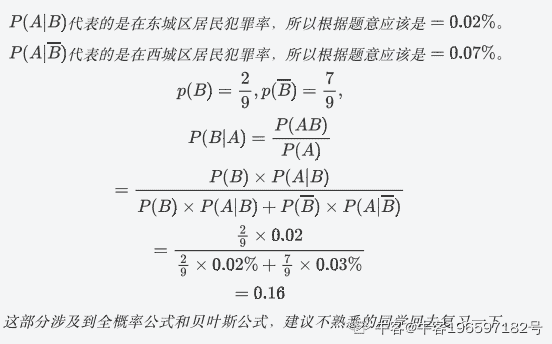

# 哔哩哔哩 2021 校园招聘移动端方向笔试卷

## 1

给定一个数组表示黄金的每天价格走势，数组中第 i 个元素表示第 i+1 天黄金的价格。

设计一个算法找到投资黄金的最大利润。你最多只能完成两笔交易（两次买入和卖出）。

例子: price = [1, 2, 8, 3, 5, 7]

如：黄金第一天的价格为 1，第六天的价格为 7

第一次交易：第一天买入，第三天卖出，赚取利润为 7

第二次交易：第四天买入，第六天卖出，赚取利润为 4

两笔交易共赚取利润为 11

注意：在你再次购买黄金时，必须卖出所有黄金

因此：

第一次交易：第一天买，第三天卖

第二次交易：第二天买，第六天卖是不允许的，因为第二天还没卖出所有黄金

输入描述

Int 型的数组

输出描述

Int 型的最大利润

输入例子

[1, 2, 8, 3, 5, 7]

输出例子

11

本题知识点

大数据开发工程师 数据分析师 数据库工程师 哔哩哔哩 2021 安卓工程师 iOS 工程师

讨论

[kyzheng](https://www.nowcoder.com/profile/67331839)

Python 版本，复杂度爆炸，供参考

```cpp
class Solution:
    def maxProfit(self, prices):
        n = len(prices)
        max_sum = 0

        for i in range(n-3):
            for j in range(i+1, n-2):
                sum1 = 0
                sum1 = prices[j] - prices[i]

                for k in range(j+1, n-1):
                    for l in range(k+1, n):
                        sum2 = 0
                        sum2 = prices[l] - prices[k]

                        max_sum = max(sum1+sum2, max_sum)
                    l = 0
            j = 0

        return max_sum

list1 = eval(input())

aa = Solution()
print(aa.maxProfit(list1))

```

发表于 2022-03-21 11:27:58

* * *

[有一个地方.](https://www.nowcoder.com/profile/559851324)

很简单的题目，不知道为什么没有人抄近道。
最多买卖两次且两次买卖没有交集，因此维护前缀最大差，后缀最大差，并枚举分割点即可。复杂度 O(n)。

```cpp
class Solution:
    def maxProfit(self , prices ):
        n = len(prices)
        prices = [0] + prices
        pred = [0] * (n + 5)
        suff = [0] * (n + 5)
        MiN = 100000000
        for i in range(1, n + 1) :
            pred[i] = max(pred[i - 1], prices[i] - MiN)
            MiN = min(MiN, prices[i])
        MaX = -100000000
        for i in range(n, 0, -1) :
            suff[i] = max(suff[i + 1], MaX - prices[i])
            MaX = max(MaX, prices[i])
        ans = 0
        for i in range(1, n + 1) :
            ans = max(ans, pred[i] + suff[i + 1])
        return ans

```

发表于 2021-05-18 20:27:31

* * *

[零葬](https://www.nowcoder.com/profile/75718849)

找到所有上升区间，极差最大的两个区间就是我们两次需要买入和卖出的时间。当然，一个数组中最大和次大的两个数可以在 O(n)的复杂度求出来，但是笔试题懒得写了😂 ```cpp
class Solution:
    def maxProfit(self , prices):
        # write code here
        n = len(prices)
        start_points = []
        for i in range(n - 1):
            if i == 0:
                start_points.append(i)
            if prices[i] > prices[i + 1]:
                start_points.append(i + 1)
        start_points.append(n)
        diff = []
        for i in range(len(start_points) - 1):
            if start_points[i] < start_points[i + 1]:
                diff.append(prices[start_points[i + 1] - 1] - prices[start_points[i]])
        return sum(sorted(diff, reverse=True)[:2]) if diff else 0
``` 

发表于 2021-04-12 13:17:40

* * *

## 2

以下对于 TCP 协议描述不正确的是？

正确答案: A C D   你的答案: 空 (错误)

```cpp
TCP 提供无连接的服务
```

```cpp
TCP 提供端对端可靠的传输服务
```

```cpp
采用 TCP 协议的报文段在传输过程中不会丢失
```

```cpp
TCP 协议通过时间戳来识别报文段的顺序
```

本题知识点

安卓工程师 iOS 工程师 哔哩哔哩 2021

讨论

[hzy1721](https://www.nowcoder.com/profile/5376314)

A. TCP 提供面向连接的服务，传输数据前必须建立连接。
B. TCP 只支持一对一的端到端通信；TCP 提供可靠交付的服务，使用 TCP 传输的数据无差错、不丢失、不重复、按序到达。
C. 采用 TCP 传输的报文同样可能因为网络拥塞等原因丢失，但是 TCP 会对未到达的报文进行超时重传。
D. TCP 报文首部有一个 4 字节的 “序号” 字段，表示本报文发送数据的第一个字节的序号，可以根据这个字段来识别报文段的顺序。

发表于 2022-01-17 22:30:35

* * *

## 3

以下对于 HTTP/2 协议描述正确的是：

正确答案: A B C D   你的答案: 空 (错误)

```cpp
所有 HTTP 请求都建立在一个 TCP 请求上，实现多路复用
```

```cpp
可以给请求添加优先级
```

```cpp
服务器主动推送
```

```cpp
头部压缩，从而减少流量传输
```

本题知识点

安卓工程师 iOS 工程师 哔哩哔哩 2021

## 4

一副扑克牌 52 张牌（已去除大小王）随机抽取 5 张牌，组成顺子的概率是多少？说明：顺子是 12345, 23456,...,10JQKA

正确答案: B   你的答案: 空 (错误)

```cpp
0.00294
```

```cpp
0.00394
```

```cpp
0.00494
```

```cpp
0.00594
```

本题知识点

安卓工程师 iOS 工程师 哔哩哔哩 2021

讨论

[讨厌精](https://www.nowcoder.com/profile/148554085)

抽取 5 张牌，共有 C（5，52）=52*51*50*49*48/(5*4*3*2*1)=2,598,960 种

发表于 2022-02-19 10:31:25

* * *

## 5

下列各排序法中，最坏情况下的时间复杂度最低的是（ ）

正确答案: C   你的答案: 空 (错误)

```cpp
希尔排序
```

```cpp
快速排序
```

```cpp
堆排序
```

```cpp
冒泡排序
```

本题知识点

安卓工程师 iOS 工程师 哔哩哔哩 2021

讨论

[yozusoft](https://www.nowcoder.com/profile/143946763)

堆排序最坏情况时间下的时间复杂度为 O(nlog2n) ；希尔排序最坏情况时间下的时间复杂度为 O(n1.5) ；快速排序、冒泡排序最坏情况时间下的时间复杂度为 O(n2) 。

发表于 2021-06-12 21:24:43

* * *

## 6

某保险柜是四位数密码，每位数字是 0-9 这十个数字中的一个，则该四位数密码中，有且仅有两位数字相同的概率是（）

正确答案: A   你的答案: 空 (错误)

```cpp
0.432
```

```cpp
0.433
```

```cpp
0.434
```

```cpp
0.435
```

本题知识点

安卓工程师 iOS 工程师 哔哩哔哩 2021

讨论

[早早早早早早](https://www.nowcoder.com/profile/678470508)

首先确定分母 ，分母是 10*10*10*10，再确定分子，位置没有固定说是哪一个的因此有一个 C（4,2），对于任意俩个数相等有十种情况因此分子*10，同时另外俩个其中一个只能从剩下九个选一个 C（9,1），最后一个只能从 8 个选 C（8,1），因此分子是 10*9*8*1*6=4320 ，因此答案为 0.432

发表于 2021-08-25 17:29:04

* * *

## 7

给定一个二维网格，每次只能向下或者向右走，请找出一条从左上角到右下角的最短路径。

本题知识点

安卓工程师 iOS 工程师 哔哩哔哩 2021

讨论

[1983 年小巷](https://www.nowcoder.com/profile/353577695)

```cpp
    int[][] grid;
    int m, n;
    int res = Integer.MAX_VALUE;

    /**
     * @param grid int 整型二维数组
     * @return int 整型
     */
    public int minPathSum(int[][] grid) {
        // write code here
        this.grid = grid;
        m = grid.length;
        n = grid[0].length;
        go(0, 0, 0, new int[m][n]);
        return res;
    }

    public void go(int x, int y, int t, int[][] vis) {
        if (x == m - 1 && y == n - 1) {
            res = Math.min(res, t + grid[x][y]);
            return;
        }

        vis[x][y] = 1;
        if (x < m - 1 && vis[x + 1][y] == 0) {
            go(x + 1, y, t + grid[x][y], vis);
        }
        if (y < n - 1 && vis[x][y + 1] == 0) {
            go(x, y + 1, t + grid[x][y], vis);
        }
        if (x > 0 && vis[x - 1][y] == 0) {
            go(x - 1, y, t + grid[x][y], vis);
        }
        if (y > 0 && vis[x][y - 1] == 0) {
            go(x, y - 1, t + grid[x][y], vis);
        }
        vis[x][y] = 0;

    }
```

 发表于 2021-09-13 22:09:38

* * *

## 8-1

考虑以下 C 语言代码:
unsigned short usi=65535 ;
short si=usi ;
执行 _ 上述程序段后，si 的值是（ ）

正确答案: A   你的答案: 空 (错误)

```cpp
-1
```

```cpp
-32767
```

```cpp
-32768
```

```cpp
-65535
```

本题知识点

安卓工程师 iOS 工程师 哔哩哔哩 2021

讨论

[望天学不会](https://www.nowcoder.com/profile/412481476)

c 语言补码保存，所以是 10000...1 =-1

发表于 2021-07-15 22:10:16

* * *

## 8-2

设 x = 1 , y = 2 , z = 3，则表达式 y＋＝z－－/＋＋x 的值是（  ）

正确答案: A   你的答案: 空 (错误)

```cpp
3
```

```cpp
3.5
```

```cpp
4
```

```cpp
5
```

本题知识点

安卓工程师 iOS 工程师 哔哩哔哩 2021

## 8-3

一个栈的输入序列为 A B C D E，则下列序列中不可能是栈的输出序列的是（  ）

正确答案: A   你的答案: 空 (错误)

```cpp
E D A C B
```

```cpp
B C D A E
```

```cpp
A E D C B
```

```cpp
B C A D E
```

本题知识点

安卓工程师 iOS 工程师 哔哩哔哩 2021

## 8-4

以下关于进程和线程说法不正确的是（ ）

正确答案: D   你的答案: 空 (错误)

```cpp
进程是操作系统分配资源的最小单元
```

```cpp
每个进程对应一个实例，多个线程共享线程实例里的堆
```

```cpp
线程不能看做独立应用，而进程可以
```

```cpp
线程有独立的地址空间，互不影响
```

本题知识点

安卓工程师 iOS 工程师 哔哩哔哩 2021

讨论

[北岛 201909192127738](https://www.nowcoder.com/profile/981105703)

每个进程都拥有自己的地址空间，但线程没有自己独立的地址空间，而是运行在一个进程里的所有线程共享该进程的整个虚拟地址空间。

发表于 2021-08-26 10:54:19

* * *

## 8-5

以下关于哈希（Hash，散列）的叙述中，错误的是（ ）

正确答案: D   你的答案: 空 (错误)

```cpp
MD5（消息摘要算法） 是一种哈希算法
```

```cpp
构造哈希函数时应尽量使关键字的所有组成部分都能起作用
```

```cpp
哈希表的装填因子（负载因子）等于表中填入的记录数除以哈希表的长度
```

```cpp
从哈希表中删除一个元素的时间复杂度是 log(n)
```

本题知识点

安卓工程师 iOS 工程师 哔哩哔哩 2021

## 8-6

以下整形数据类型中需要内存空间最少的是（  ）

正确答案: D   你的答案: 空 (错误)

```cpp
short
```

```cpp
long
```

```cpp
int
```

```cpp
byte
```

本题知识点

安卓工程师 iOS 工程师 哔哩哔哩 2021

讨论

[牛客 293938718 号](https://www.nowcoder.com/profile/293938718)

| 1234567 | 类型              存储需求        bit 数                  取值范围     byte              1 字节           1*8      （-2 的 31 次方到 2 的 31 次方-1）short             2 字节           2*8             －32768～32767int               4 字节           4*8      （-2 的 63 次方到 2 的 63 次方-1）long              8 字节           8*8                 －128～127 |

发表于 2021-04-09 16:43:50

* * *

## 8-7

下列排序算法中，元素的移动次数与关键字的初始排列次序无关的是（ ）

正确答案: C   你的答案: 空 (错误)

```cpp
直接插入排序
```

```cpp
起泡排序
```

```cpp
基数排序
```

```cpp
快速排序
```

本题知识点

安卓工程师 iOS 工程师 哔哩哔哩 2021

讨论

[yozusoft](https://www.nowcoder.com/profile/143946763)

基数排序是一种非比较型整数排序算法，其原理是将整数按位数切割成不同的数字，然后按每个位数分别比较。原理为根据键值的每位数字来分配桶；

发表于 2021-06-12 21:28:19

* * *

[牛客 293938718 号](https://www.nowcoder.com/profile/293938718)

不懂

发表于 2021-04-09 16:47:46

* * *

## 15

给定一个未排序的整数数组, 需要给数组里每个元素一个整数权重值，权重值最小为 1，相邻元素数字大的权重值也必须较大，那么整个数组的权重值总和最小为多少

本题知识点

安卓工程师 iOS 工程师 哔哩哔哩 2021

讨论

[Foer](https://www.nowcoder.com/profile/568297505)

参考 lc135 题 分糖果`leetcode-cn.com/problems/candy/solution/fen-fa-tang-guo-by-powcai/`;) 可在 o(n)完成

```cpp
import java.util.*;
public class Main{
    public static void main(String[] args){
        Scanner sc = new Scanner(System.in);
        String[] n = sc.nextLine().split(" ");
        int len = n.length;
        int[] l_r = new int[len];
        int[] r_l = new int[len];
        Arrays.fill(l_r,1);
        Arrays.fill(r_l,1);
        for(int i = 1;i< len;i++){
            if(Integer.parseInt(n[i])>Integer.parseInt(n[i-1])){
                l_r[i] = l_r[i-1]+1;
            }
        }
        for(int i = len-2;i>=0;i--){
            if(Integer.parseInt(n[i])>Integer.parseInt(n[i+1])){
                r_l[i] = r_l[i+1]+1;
            }
        }
        int res = 0;
        for(int i = 0; i < len;i++){
            res+=Math.max(l_r[i],r_l[i]);
        }
        System.out.print(res);
    }
}
```

 发表于 2021-05-12 14:33:20

* * *

[牛客 12312341](https://www.nowcoder.com/profile/51182139)

```cpp
#include<bits/stdc++.h>

using namespace std;

const int N=1e5+100;

int a[N];
int n;

#define pii pair<int,int>
int ans[N];
int main(){
    int x;
    while(cin>>x){
        a[++n]=x;
    }
    a[0]=a[n+1]=99999999;//为了方便操作把两边改成较为大的值
    priority_queue<pii> q;
    for(int i=1;i<=n;i++){
        q.push({-a[i],i});

```
//优先队列从小到大
```cpp

    }

    while(!q.empty()){
        int i=q.top().second;q.pop();//获取最小的 a[i]的下标
        if(a[i]>a[i+1]||a[i]>a[i-1]){
            if(a[i]>a[i+1]&&a[i]>a[i-1]) ans[i]=max(ans[i-1],ans[i+1])+1; //如果同时大于两边那么从数较大的更新
            else if(a[i]>a[i-1]) ans[i]=ans[i-1]+1;//如果旁边有数和 a[i]相同则另一半更新就可以了
            else ans[i]=ans[i+1]+1;//同理
        }
        else ans[i]=1;//贪心直接最小
    }
    int res=0;
    for(int i=1;i<=n;i++) {
        res+=ans[i];//加起来
       // cout<<ans[i]<<" ";
    }
    cout<<res<<endl;
    return 0;
}
```

编辑于 2021-04-23 01:51:30

* * *

[我才不是游客](https://www.nowcoder.com/profile/541757543)

可以注意到每个数值的权值仅受其左右两侧的数值限制，而且很自然想到数组中最小的值权值一定是 1。进一步想到，一个数字 ai，如果它左右两侧数字都比它大，那么它的权值也可以设为 1。因此，将数组元素按值升序排序，并记录下标。枚举排序后的这些元素，更新这个元素和相邻元素的权值。

```cpp
#include <bits/stdc++.h>
typedef long long ll;
using namespace std;
struct node
{
    int id,v;
    bool operator <(const node B)const
    {
        return v<B.v;
    }
} a[100005];
int n,b[100005],v[100005],ans;
int main()
{
    ios::sync_with_stdio(0),cin.tie(0);
    int i,j;
    while(cin>>a[n+1].v) /**< a 用来排序，b 用来记录原始的数值 */
        a[n+1].id=n+1,n++,b[n]=a[n].v;
    sort(a+1,a+n+1);
    for(i=1; i<=n; i++)
    {
        int id=a[i].id;
        if(v[id]==0) /**< 如果 id 这个元素权值没给定过，那么它一定比它左右两端的小，可以置为 1 */
            v[id]=1;
        if(id-1>0&&b[id]<b[id-1])/**< 检查下 id 这个元素能否更新其左右两侧的权值 */
            v[id-1]=max(v[id-1],v[id]+1);
        if(id+1<=n&&b[id]<b[id+1])
            v[id+1]=max(v[id+1],v[id]+1);
    }
    for(i=1; i<=n; i++)
        ans+=v[i];
    cout<<ans;
    return 0;
}

```

发表于 2021-04-17 11:38:49

* * *

## 10

一些图形相关的工作，在 GPU 上比 CPU 上运行更快的原因是

正确答案: D   你的答案: 空 (错误)

```cpp
GPU 更擅长做浮点运算 (单次浮点运算用时更短)
```

```cpp
GPU 更擅长做分支逻辑 (条件跳转效率更高)
```

```cpp
GPU 中预制了常用图形算法的硬件实现
```

```cpp
GPU 中有众多计算单元，多更适合并行计算
```

本题知识点

安卓工程师 iOS 工程师 哔哩哔哩 2021

讨论

[牛客 293938718 号](https://www.nowcoder.com/profile/293938718)

CPU 是电脑的中央处理器 GPU 是电脑的图形处理器 发表于 2021-04-09 16:50:49

* * *

## 11

目前主流 PC，读取 50G 内存需要的时间大概量级是

正确答案: C   你的答案: 空 (错误)

```cpp
10 微秒
```

```cpp
10 毫秒
```

```cpp
10 秒
```

```cpp
10 分钟
```

本题知识点

安卓工程师 iOS 工程师 哔哩哔哩 2021

## 12

下列工作哪些可以在线性时间复杂度 O(n) 下完成

正确答案: B   你的答案: 空 (错误)

```cpp
字符串匹配 (长字符串中寻找短字符串出现的位置)
```

```cpp
找出数组中第 k 大的数
```

```cpp
背包问题
```

```cpp
基于比较的排序
```

本题知识点

安卓工程师 iOS 工程师 哔哩哔哩 2021

## 13

对 100 万个不同的邮件地址，使用 32bit 的 hash 算法 (如 CRC32)，发生碰撞的概率几率约是

正确答案: D   你的答案: 空 (错误)

```cpp
0.00000001  (几乎不可能碰撞)
```

```cpp
0.001 (小概率碰撞)
```

```cpp
0.5 (有一半几率碰撞)
```

```cpp
0.99 (几乎一定碰撞)
```

本题知识点

安卓工程师 iOS 工程师 哔哩哔哩 2021

## 14-1

静态变量通常存储在进程哪个区？

正确答案: C   你的答案: 空 (错误)

```cpp
**栈区**
```

```cpp
堆区
```

```cpp
**全局区**
```

```cpp
**代码区**
```

本题知识点

安卓工程师 iOS 工程师 哔哩哔哩 2021

讨论

[牛客 293938718 号](https://www.nowcoder.com/profile/293938718)

1.栈内存: 存储的局部变量,局部变量指的是定义在方法中的变量在变量使用完毕编译器会自动释放内存,操作方式类似于数据结果的栈,先进后出.

2.堆内存: 存储的是 new 出来的对象,也可以叫实体,由程序员释放内存,如果程序员不释放,程序结束时可能由垃圾回收器回收.

3.静态区: 全局变量和静态变量的存储是放在一起的,初始化的全局变量和静态变量在一块区域,未初始化的全局变量和未初始化的静态变量在相邻的另外一块区域(BSS).程序结束后由系统释放.

4.常量池: 字符串存储的区域.程序结束后由系统释放

5.程序代码区: 存放函数体的二进制代码

发表于 2021-04-09 16:53:32

* * *

## 14-2

定义： int a[9] ， *p = a; 并在以后的语句中未改变 p 的值，不能表示 a[1] 地址的表达式是（）

正确答案: D   你的答案: 空 (错误)

```cpp
**++p**
```

```cpp
**a+1**
```

```cpp
**p+1**
```

```cpp
**a++**
```

本题知识点

安卓工程师 iOS 工程师 哔哩哔哩 2021

## 14-3

A 市分为东西两个城区，根据统计东城区的犯罪率为 0.02%，西城区为 0.03%，东西城区的人口比例是 2:7，现有一起新案件发生在 A 市，那么案件发生在东城区的可能性有多大？

正确答案: A   你的答案: 空 (错误)

```cpp
**16%**
```

```cpp
**18%**
```

```cpp
**19%**
```

```cpp
**21%**
```

本题知识点

安卓工程师 iOS 工程师 哔哩哔哩 2021

讨论

[牛客 196597182 号](https://www.nowcoder.com/profile/196597182)

解：假设事件 A 为有案件发生，事件 B 为人是在东城区的居民。

编辑于 2021-11-24 17:00:19

* * *

## 14-4

某公司有 2 个部门，A 部门有 12 人，B 部门有 20 人。现在 A 部门 4 个人转岗到 B 部门，则 B 部门的平均年龄增加了 1 岁，A 部门的平均年龄增加了 3 岁。问在调动之前，两个部门的平均年龄相差多少岁？

正确答案: B   你的答案: 空 (错误)

```cpp
8
```

```cpp
12
```

```cpp
14
```

```cpp
16
```

本题知识点

安卓工程师 iOS 工程师 哔哩哔哩 2021

## 14-5

下列数中最大的数为

正确答案: A   你的答案: 空 (错误)

```cpp
2 进制 10010101
```

```cpp
8 进制 221
```

```cpp
16 进制 92
```

```cpp
5 进制 143
```

本题知识点

安卓工程师 iOS 工程师 哔哩哔哩 2021

## 15

如果将固定块大小的文件系统中的块大小设置得比较大会导致

正确答案: A   你的答案: 空 (错误)

```cpp
更好的磁盘吞吐量和更差的磁盘空间利用率
```

```cpp
更好的磁盘吞吐量和更好的磁盘空间利用率
```

```cpp
更差的磁盘吞吐量和更好的磁盘空间利用率
```

```cpp
更差的磁盘吞吐量和更差的磁盘空间利用率
```

本题知识点

安卓工程师 iOS 工程师 哔哩哔哩 2021

## 16

以 10 为基准, 设一组初始记录关键字序列为 (10,5,14,8,16,3,20), 则第一趟快速排序结果为

正确答案: C   你的答案: 空 (错误)

```cpp
3,8,5,10,16,14,20
```

```cpp
3,8,5,10,14,16,20
```

```cpp
3,5,8,10,16,14,20
```

```cpp
3,5,8,10,14,16,20
```

本题知识点

安卓工程师 iOS 工程师 哔哩哔哩 2021

## 17

将一个递归算法改为对应的非递归算法时，通常需要使用

正确答案: D   你的答案: 空 (错误)

```cpp
字符串
```

```cpp
二叉树
```

```cpp
队列
```

```cpp
栈
```

本题知识点

安卓工程师 iOS 工程师 哔哩哔哩 2021

## 18

二叉树的先序遍历顺序为：ABDHECFIJG，中序遍历顺序为：HDBEAIJFCG，此二叉树的后序遍历顺序为?

正确答案: A   你的答案: 空 (错误)

```cpp
HDEBJIFGCA
```

```cpp
HDEJBIFGCA
```

```cpp
HDEBJIFCGA 
```

```cpp
HDBJIFEGCA
```

本题知识点

安卓工程师 iOS 工程师 哔哩哔哩 2021

## 19

5 个盒子中有 2 个小球，依次打开盒子，在第 3 个盒子第一次发现小球的概率为多少

正确答案: C   你的答案: 空 (错误)

```cpp
1/3
```

```cpp
1/4
```

```cpp
1/5
```

```cpp
2/5
```

本题知识点

安卓工程师 iOS 工程师 哔哩哔哩 2021

## 20

以下哪个不是 bilibili 吉祥物

正确答案: B   你的答案: 空 (错误)

```cpp
小电视
```

```cpp
AC 娘
```

```cpp
22 娘
```

```cpp
33 娘
```

本题知识点

安卓工程师 iOS 工程师 哔哩哔哩 2021

## 21

用 0-6 的数字组成没有重复数字的 4 位数，可以组成多少种数字

正确答案: B   你的答案: 空 (错误)

```cpp
300
```

```cpp
720
```

```cpp
360
```

```cpp
120
```

本题知识点

安卓工程师 iOS 工程师 哔哩哔哩 2021

## 22

用正则表达式 a+?b 来尝试匹配 aaabbb 可以匹配到的结果是

正确答案: C   你的答案: 空 (错误)

```cpp
aaabbb
```

```cpp
ab
```

```cpp
aaab
```

```cpp
b
```

本题知识点

安卓工程师 iOS 工程师 哔哩哔哩 2021

## 23

以下编译原理相关概念中错误的是

正确答案: D   你的答案: 空 (错误)

```cpp
词法分析器负责将字符序列转换为词法单元
```

```cpp
语法分析器根据某种给定的形式文法对输入进行分析并确定其语法结构
```

```cpp
逆波兰表示法表示表达式是不需要使用括号
```

```cpp
语法分析时需要先消除文法中的左递归
```

本题知识点

安卓工程师 iOS 工程师 哔哩哔哩 2021