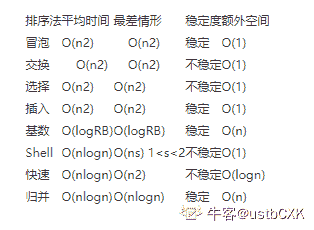

# 浩鲸科技 2020 届-C++-2

## 1

C++是类型安全的

正确答案: B   你的答案: 空 (错误)

```cpp
T
```

```cpp
F
```

本题知识点

C++工程师 浩鲸云 2020

讨论

[派大星 starya](https://www.nowcoder.com/profile/740836872)

C++不是类型安全的，两个不同类型的指针间可以使用强制转换

发表于 2021-04-18 15:23:27

* * *

## 2

float a,b,c , 那么可以如下判断 (a+b)+c==(b+a)+c 和 (a+b)+c==(a+c)+b

正确答案: B   你的答案: 空 (错误)

```cpp
T
```

```cpp
F
```

本题知识点

C++工程师 浩鲸云 2020

讨论

[牛客 499253788 号](https://www.nowcoder.com/profile/499253788)

float a,b,c，浮点数不要直接判断相等

发表于 2021-04-16 16:29:09

* * *

[牛客 181494722 号](https://www.nowcoder.com/profile/181494722)

浮点数是不满足结合律的

发表于 2021-04-21 21:48:26

* * *

## 3

C++里面所有的动作都是 main()引起的

正确答案: B   你的答案: 空 (错误)

```cpp
T
```

```cpp
F
```

本题知识点

C++工程师 浩鲸云 2020

讨论

[superwhite24](https://www.nowcoder.com/profile/121195267)

全局变量不是

发表于 2021-08-06 10:31:16

* * *

[牛客 181494722 号](https://www.nowcoder.com/profile/181494722)

原因如下：

1.  main 函数只是程序的入口，也就是程序通过 main 函数开始运行，后续动作就取决于用户了。

2.  特别是 Windows 下的窗口的程序，它们不仅没有 main 函数（有 WinMain 函数），而且动作都是由消息引起的（可以理解成用户的键盘鼠标等消息）。

3.  Windows 中的 DLL 和 COM 组件同样没有 main 函数，但是他们也能被调用和执行特定的工作。

发表于 2021-04-21 21:50:19

* * *

## 4

内联函数在编译时做参数类型检查

正确答案: A   你的答案: 空 (错误)

```cpp
T
```

```cpp
F
```

本题知识点

C++工程师 浩鲸云 2020

## 5

C++对调用的虚函数和模板类都进行迟后编译

正确答案: A   你的答案: 空 (错误)

```cpp
T
```

```cpp
F
```

本题知识点

C++工程师 浩鲸云 2020

讨论

[夜雨寄北 i](https://www.nowcoder.com/profile/341387748)

模板在编译器展开会增长编译时间，虚函数是运行时调用也会延长编译时间吗？

发表于 2021-08-19 14:21:23

* * *

## 6

在 C++中有纯虚构造函数

正确答案: B   你的答案: 空 (错误)

```cpp
T
```

```cpp
F
```

本题知识点

C++工程师 浩鲸云 2020

讨论

[牛客 368007909 号](https://www.nowcoder.com/profile/368007909)

构造函数是先于虚函数的，因为只有有构造函数，才能创建虚表，所以构造函数不可能是虚函数，自然也不能是纯虚函数

发表于 2021-04-21 20:43:04

* * *

## 7

所有的运算符都能重载

正确答案: B   你的答案: 空 (错误)

```cpp
T
```

```cpp
F
```

本题知识点

C++工程师 浩鲸云 2020

讨论

[牛客 181494722 号](https://www.nowcoder.com/profile/181494722)

一下运算符是不能重载的：分量运算符 点号 （.）
成员对象选择 点星号(.*)
作用域解析 双冒号(:)
条件运算符 问号冒号(?:)

发表于 2021-04-22 10:14:13

* * *

## 8

值返回的函数（如：double sqrt(double);）的调用表达式，如：sqrt(2.0)）代表一个无名的临时变量（或对象），一般不将其用作左值

正确答案: A   你的答案: 空 (错误)

```cpp
T
```

```cpp
F
```

本题知识点

C++工程师 浩鲸云 2020

## 9

任何类都有构造函数、复制构造函数、析构函数、赋值运算符函数。

正确答案: A   你的答案: 空 (错误)

```cpp
T
```

```cpp
F
```

本题知识点

C++工程师 浩鲸云 2020

讨论

[山海意明](https://www.nowcoder.com/profile/703161016)

有些函数不是可以禁用吗？……

发表于 2021-04-24 15:29:13

* * *

[老菜了-](https://www.nowcoder.com/profile/82612986)

当用户自己写了拷贝构造，不就没有默认构造了吗

发表于 2021-09-08 21:14:58

* * *

[牛客 181494722 号](https://www.nowcoder.com/profile/181494722)

在类中，赋值运算符函数和复制构造函数如果没有定义，会默认生成的。

发表于 2021-04-22 10:44:12

* * *

## 10

将用于输出的插入运算符函数 operator<正确答案: B   你的答案: 空 (错误)

```cpp
T
```

```cpp
F
```

本题知识点

C++工程师 浩鲸云 2020

## 11

已知：int a=1;下列表示引用的方法中，正确的是（   ）

正确答案: C   你的答案: 空 (错误)

```cpp
int &amp;b;
```

```cpp
int &amp;b=1;
```

```cpp
int &amp;b=a;
```

```cpp
int &amp;b=&amp;a;
```

本题知识点

C++工程师 浩鲸云 2020

讨论

[牛客 893205341 号](https://www.nowcoder.com/profile/893205341)

&amp;表示&符号。翻译过来就是：
**A. **int &b;B. int &b=1;C. int &b=a;D. int &b=&a;  

发表于 2021-04-19 14:46:22

* * *

## 12

有关析构函数的说法不正确的是（   ）

正确答案: B   你的答案: 空 (错误)

```cpp
析构函数有且仅有一个
```

```cpp
析构函数可以有参数
```

```cpp
析构函数的功能是用来释放对象
```

```cpp
析构函数无任何函数类型
```

本题知识点

C++工程师 浩鲸云 2020

讨论

[牛客 181494722 号](https://www.nowcoder.com/profile/181494722)

析构函数没有返回类型，没有参数，没有重载，不能随意的调用，它是由系统自动调用的

发表于 2021-04-22 10:53:55

* * *

## 13

在创建派生类对象时，构造函数的执行顺序是 (   ）

正确答案: D   你的答案: 空 (错误)

```cpp
对象成员构造函数、基类构造函数、派生类本身的构造函数
```

```cpp
派生类本身的构造函数、基类构造函数、对象成员构造函数
```

```cpp
基类构造函数、派生类本身的构造函数、对象成员构造函数
```

```cpp
基类构造函数、对象成员构造函数、派生类本身的构造函数
```

本题知识点

C++工程师 浩鲸云 2020

## 14

一个函数功能不太复杂，但要求被频繁调用，则应把它定义为（   ）

正确答案: A   你的答案: 空 (错误)

```cpp
内联函数
```

```cpp
重载函数
```

```cpp
递归函数
```

```cpp
嵌套函数
```

本题知识点

C++工程师 浩鲸云 2020

## 15

在一个单链表中，若删除 p 所指结点的后继结点，则执行

正确答案: D   你的答案: 空 (错误)

```cpp
p-&gt;next=p-&gt;next
```

```cpp
p=p-&gt;next-&gt;next
```

```cpp
p=p-&gt;next;p-&gt;next=p-&gt;next-&gt;next
```

```cpp
p-&gt;next=p-&gt;next-&gt;next
```

本题知识点

C++工程师 浩鲸云 2020

讨论

[牛客 893205341 号](https://www.nowcoder.com/profile/893205341)

服了。。&gt;是>号，看了半天没看懂。。。A. p->next=p->nextB. p=p->next->nextC. p=p->next;p->next=p->next->nextD. p->next=p->next->next 这样就清晰多了

编辑于 2021-04-19 14:38:31

* * *

## 16

以下伪代码，通过选择法对数组的数据进行从小到大排序，进行程序空缺补充(   )
INPUT n, a[n]
i = 0
WHILE i < n - 1
    k = i
    j = i + 1
WHILE j <= n – 1
    IF ______ 空缺 _______
        k = j
    END IF
    j = j + 1
END WHILE
IF i != k
   t = a[i]
   a[i] = a[k]
   a[k] = t
END IF
i ++
END WHILE

正确答案: A   你的答案: 空 (错误)

```cpp
a[j] &lt; a[k]
```

```cpp
a[k] &lt; a[j]
```

```cpp
j &lt; k
```

```cpp
j &gt; k
```

本题知识点

C++工程师 浩鲸云 2020

讨论

[fortunely2020](https://www.nowcoder.com/profile/970754952)

&lt; 是小于号（<），&gt; 是大于号（>）。利用 a[j] < a[k]，从下面 while 循环， 选出的是 a[j..n-1]中最小的值，用 k 记录下标。  ```cpp
k = i
j = i + 1
WHILE j <= n – 1
    IF a[j] < a[k]
        k = j
    END IF
    j = j + 1
END WHILE
``` 

发表于 2022-01-14 11:23:22

* * *

[Your_Julia](https://www.nowcoder.com/profile/620065884)

```cpp
&lt;是小于号
由后序代码得知，k 不指向 i 时进行交换
那么令 k 不指向 i，是前面的代码 k 指向了 j
a[j]<a[k]代表数组逆序，即需要交换，将 k 指向 j
```

发表于 2021-04-23 11:36:27

* * *

## 17

已知某二叉树的后序遍历序列是 DABEC，中序遍历序列是 DEBAC，它的前序遍历是

正确答案: D   你的答案: 空 (错误)

```cpp
ACBED
```

```cpp
DECAB
```

```cpp
DEABC
```

```cpp
CEDBA
```

本题知识点

C++工程师 浩鲸云 2020

讨论

[小鹏同学哟](https://www.nowcoder.com/profile/399856313)

通过后序可知 C 是根节点，只有 D 选项符合

发表于 2021-11-14 17:45:11

* * *

[园园有 offer](https://www.nowcoder.com/profile/475945585)

①用后序遍历的末尾元素(就是中间节点)②对中序遍历遍历进行切割，变成左右子树，按①②步，对左右子树进行切割

发表于 2021-04-25 19:57:34

* * *

## 18

根据以下 伪代码 输出 的 结果是
x
= 11 & 9 // 二进制与 运算
y = x ^ 15
二进制异或 运算
z = y | 12
// 二进制或 运算
PRINT
z

正确答案: B   你的答案: 空 (错误)

```cpp
13
```

```cpp
14
```

```cpp
15
```

```cpp
16
```

本题知识点

C++工程师 浩鲸云 2020

讨论

[fortunely2020](https://www.nowcoder.com/profile/970754952)

14x = 11 & 9 = 0b1011 & 0b1001 = 0b1001 = 9，按位与 y = x ^ 15 = 0b1001 ^ 0b1111 = 0b0110 = 6，按位异或 z = y | 12 = 0b0110 | 0b1100 = 0b1110 = 14，按位或

发表于 2022-01-14 11:34:51

* * *

[牛客 181494722 号](https://www.nowcoder.com/profile/181494722)

异或：相同为 0，不同为 1

发表于 2021-04-22 11:00:30

* * *

## 19

下面说法正确的是：（）

正确答案: A   你的答案: 空 (错误)

```cpp
static 成员函数没有 this 形参
```

```cpp
static 成员函数既能访问所属类的 static 成员也能使用非 static 成员
```

```cpp
每个类对象都有自己的 static 数据成员
```

```cpp
static 成员可以使用类名加作用域操作符来使用
```

本题知识点

C++工程师 浩鲸云 2020

讨论

[。初心。](https://www.nowcoder.com/profile/617206382)

d 哪里错了？

发表于 2021-04-23 09:27:42

* * *

[牛客 181494722 号](https://www.nowcoder.com/profile/181494722)

static 成员函数只能访问 static 的变量

发表于 2021-04-22 11:13:26

* * *

## 20

下面哪些运算符可以被重载？

正确答案: C   你的答案: 空 (错误)

```cpp
做用域运算符“::”
```

```cpp
对象成员运算符“.”
```

```cpp
指针成员运算符“-&gt;”
```

```cpp
三目运算符“? :”
```

本题知识点

C++工程师 浩鲸云 2020

讨论

[谢天辞](https://www.nowcoder.com/profile/857401865)

C++中不能被重载的运算符有 :: .* . ? :

发表于 2021-11-20 20:23:38

* * *

## 21

下面那个特征不是面相对象的三个特征之一

正确答案: C   你的答案: 空 (错误)

```cpp
封装
```

```cpp
继承
```

```cpp
异常
```

```cpp
多态
```

本题知识点

C++工程师 浩鲸云 2020

## 22

const char *ptr;   ptr 应该是

正确答案: C   你的答案: 空 (错误)

```cpp
指向字符常量的指针
```

```cpp
指向字符的常量指针
```

```cpp
指向字符串常量的指针
```

```cpp
指向字符串的常量指针
```

本题知识点

C++工程师 浩鲸云 2020

讨论

[牛客 368007909 号](https://www.nowcoder.com/profile/368007909)

为什么不选择 A 那，

发表于 2021-04-21 20:22:36

* * *

## 23

设关系数据库中一个表 S 的结构为 S（SN，CN，grade），其中 SN 为学生名，CN 为课程名，二者均为字符型；grade 为成绩，数值型，取值范围 0－100。若要把“张三的化学成绩 80 分”插入 S 中，则可用

正确答案: D   你的答案: 空 (错误)

```cpp
A. ADD INTO  S  VALUES（’张三’，’化学’，’80’）
```

```cpp
B. INSERT INTO  S  VALUES（’张三’，’化学’，’80’）
```

```cpp
C. ADD INTO  S  VALUES（’张三’，’化学’，80）
```

```cpp
D. INSERT INTO  S  VALUES（’张三’，’化学’，80）
```

本题知识点

C++工程师 浩鲸云 2020

## 24

产生系统死锁的原因可能是由于（   ）

正确答案: C   你的答案: 空 (错误)

```cpp
进程释放资源
```

```cpp
一个进程进入死循环
```

```cpp
多个进程竞争，资源出现了循环等待
```

```cpp
多个进程竞争共享型设备
```

本题知识点

C++工程师 浩鲸云 2020

## 25

现有 2G 数据需要排序，计算资源只有 2G 内存可用，下列排序方法中最可能出现性能问题的是

正确答案: C   你的答案: 空 (错误)

```cpp
堆排序
```

```cpp
插入排序
```

```cpp
归并排序
```

```cpp
快速排序
```

本题知识点

C++工程师 浩鲸云 2020

讨论

[dll 阿木木](https://www.nowcoder.com/profile/568486017)



发表于 2021-04-22 20:05:53

* * *

## 26

下列程序段的时间复杂度为（   ）
i=0，s=0； 
while (s<n) {
s=s+i；
i++；
}

正确答案: A   你的答案: 空 (错误)

```cpp
O(n1/2)
```

```cpp
O(n1/3)
```

```cpp
O(n)
```

```cpp
O(n2)
```

本题知识点

C++工程师 浩鲸云 2020

讨论

[RichardoQ](https://www.nowcoder.com/profile/64762243)

1+2+..+x=nx=n^(1/2)

发表于 2021-04-26 13:24:28

* * *

## 27

下面哪个不是一种负载均衡算法（   ）

正确答案: B   你的答案: 空 (错误)

```cpp
一致性哈希
```

```cpp
直连
```

```cpp
随机
```

```cpp
轮询
```

本题知识点

C++工程师 浩鲸云 2020

## 28

使用地址作为实参传给形参，下列说法正确的是（   ）

正确答案: D   你的答案: 空 (错误)

```cpp
实参是形参的备份
```

```cpp
实参与形参无联系
```

```cpp
形参是实参的备份
```

```cpp
实参与形参是同一对象
```

本题知识点

C++工程师 浩鲸云 2020

## 29

下面哪个不是关系型数据库(   )

正确答案: C   你的答案: 空 (错误)

```cpp
Oracle
```

```cpp
Mysql
```

```cpp
MongoDB
```

```cpp
SQL Server
```

本题知识点

C++工程师 浩鲸云 2020

## 30

OSI 参考模型将网络体系结构划分为七层，其中（   ）的主要功能是将网络地址翻译成对应的物理地址，并决定路由

正确答案: B   你的答案: 空 (错误)

```cpp
数据链路层
```

```cpp
网络层
```

```cpp
传输层
```

```cpp
会话层
```

本题知识点

C++工程师 浩鲸云 2020

讨论

[dll 阿木木](https://www.nowcoder.com/profile/568486017)

1 物理层,2 数据链路层,3 网络层,4 传输层,5 会话层,6 表示层,7 应用层
其中，网络层的主要功能是找对应的 MAC 地址，决定路由

发表于 2021-04-22 20:16:40

* * *

## 31

如果 C 概念是 A 与 B 两个的属概念，并且所有 A 不是 B，A 与 B 的外延之和等于 C 的外延，则 A 与 B 之间的关系是（   ）

正确答案: D   你的答案: 空 (错误)

```cpp
交叉关系
```

```cpp
反对关系
```

```cpp
矛盾关系
```

```cpp
真包含于关系
```

本题知识点

C++工程师 浩鲸云 2020

## 32

十进制数 123 变换为等值的二进制数是（   ）

正确答案: C   你的答案: 空 (错误)

```cpp
1110101
```

```cpp
1110110
```

```cpp
1111011
```

```cpp
1110011
```

本题知识点

C++工程师 浩鲸云 2020

## 33

下列四组 SQL 命令，全部属于数据定义语句的命令是（   ）

正确答案: A   你的答案: 空 (错误)

```cpp
CREATE，DROP，ALTER
```

```cpp
CREATE，DROP，UPDATE
```

```cpp
CREATE，DROP，GRANT
```

```cpp
CREATE，DROP，SELECT
```

本题知识点

C++工程师 浩鲸云 2020

## 34

关于数据库索引，以下表述正确的是（）
①如果对表创建了索引，那么更新、插入和删除表中的记录都将导致额外的系统开销；②全表扫描一定比使用索引的执行效率低；③在字段选择性很低的情况下适用索引；④一个表创建的索引越多，对系统的性能提升越大。

正确答案: A   你的答案: 空 (错误)

```cpp
①②③
```

```cpp
①③
```

```cpp
①②③④
```

```cpp
①③④
```

本题知识点

C++工程师 浩鲸云 2020

## 35

异常是足够重要的、使程序不能继续正常执行的事件。如果找不到匹配的 catch，程序就调用库函数(      )

正确答案: A   你的答案: 空 (错误)

```cpp
terminate
```

```cpp
exit
```

```cpp
_exit
```

```cpp
return
```

本题知识点

C++工程师 浩鲸云 2020

讨论

[牛客 740220475 号](https://www.nowcoder.com/profile/740220475)

```cpp
terminate 的意思是终止

```

发表于 2022-03-07 22:37:17

* * *