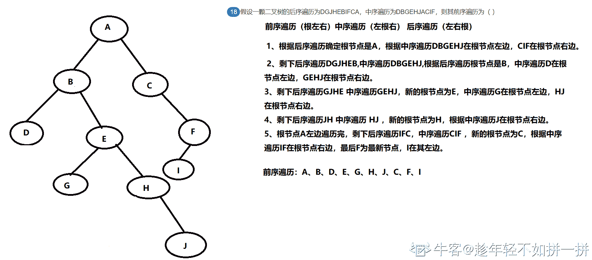
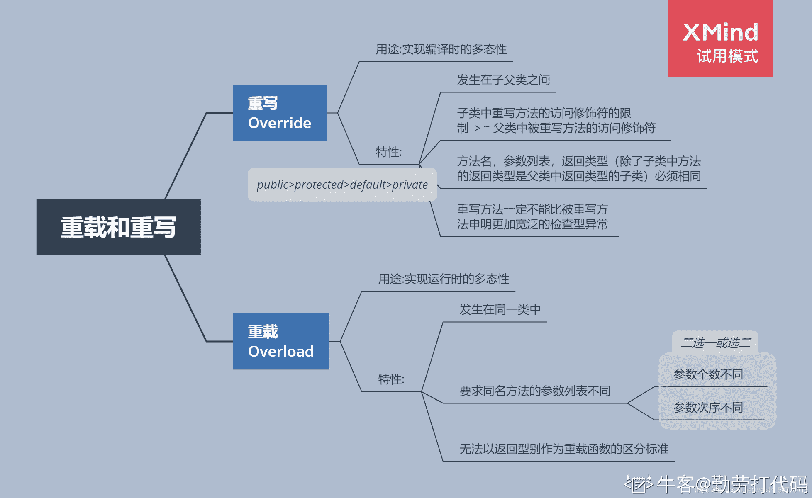

# 浩鲸科技 2020 届 JavaB 卷

## 1

下列标示符合法的是（ ）

正确答案: C   你的答案: 空 (错误)

```cpp
new
```

```cpp
12road
```

```cpp
$UsDollars
```

```cpp
my.name
```

本题知识点

Java 工程师 浩鲸云 2020

讨论

[openmind.](https://www.nowcoder.com/profile/539390139)

**1\. 标识符必须以【字母】【下划线(_)】或【美元符号($)】开头，****不能以数字开头。**
**2\. 标识符不能是 true、false、null****3\. 标识符的组成： 【字母】【数字】【下划线】【美元符号】****4\. 标识符可以是任意长度**

编辑于 2021-09-03 08:13:49

* * *

## 2

下列数组初始化正确的是（ ）

正确答案: C   你的答案: 空 (错误)

```cpp
int[5] a= {1,2,3,4,5};
```

```cpp
Integer[2][2] a = {{new Integer(1), new Integer(2)},{new Integer(3),new Interger(4)}};
```

```cpp
char[][] a = {{‘2’,’3’,’4’,’5’},new char[3]};
```

```cpp
Float[][] a = new Float[][5];
```

本题知识点

Java 工程师 浩鲸云 2020

讨论

[openmind.](https://www.nowcoder.com/profile/539390139)


发表于 2021-09-03 08:21:21

* * *

[季步一诺](https://www.nowcoder.com/profile/624131132)

数组的行在初始化的时候必须指定行，可选指定列

发表于 2021-07-08 17:40:34

* * *

## 3

Java 中访问控制符说法错误的是（ ）

正确答案: D   你的答案: 空 (错误)

```cpp
protected 声明的，在同一 package 中其他类可以访问。
```

```cpp
private 声明，继承类中可以访问。
```

```cpp
public 声明的，非同一个 package 也能访问。
```

```cpp
Java 中未声明控制符的，默认为 public。
```

本题知识点

Java 工程师 浩鲸云 2020

讨论

[季步一诺](https://www.nowcoder.com/profile/624131132)

未声明控制符不就是默认的 default 吗？怎么会是 public

发表于 2021-07-08 17:43:41

* * *

[牛客 306576171 号](https://www.nowcoder.com/profile/306576171)

B 错的原因我觉得是：子类直接访问肯定是不可以的，但如果父类中有个公有的 get 方法，在方法里 return this.属性，然后在子类中调用父类的 get 方法，是能够得到父类里用 private 声明的属性。

发表于 2021-04-11 13:43:26

* * *

## 4

下列关于垃圾回收的描述正确的是（ ）

正确答案: D   你的答案: 空 (错误)

```cpp
finalize 方法只能被垃圾回收器调用。
```

```cpp
一个对象的 finalize 方法可能被垃圾回收器多次调用。
```

```cpp
只有当对象没有任何引用指向时，该对象才能被回收。
```

```cpp
当对象不可到达时，该对象可以被垃圾回收器回收。
```

本题知识点

Java 工程师 浩鲸云 2020

讨论

[季步一诺](https://www.nowcoder.com/profile/624131132)

1.引用计数算法(已被淘汰的算法)
给对象中添加一个引用计数器,每当有一个地方引用它时,计数器值就加 1;当引用失效时,计数器值就减 1;任何时刻计数器为 0 的对象就是不可能再被使用的。

目前主流的 java 虚拟机都摒弃掉了这种算法，最主要的原因是它很难解决对象
之间相互循环引用的问题。尽管该算法执行效率很高。

2.可达性分析算法
目前主流的编程语言(java,C#等)的主流实现中,都是称通过可达性分析(Reachability Analysis)来判定对象是否存活的。这个算法的基本思路就是通过一系列的称为“GC Roots”的对象作为起始点,从这些节点开始向下搜索,搜索所走过的路径称为引用链(Reference Chain),当一个对象到 GC Roots 没有任何引用链相连(用图论的话来说,就是从 GC Roots 到这个对象不可达)时,则证明此对象是不可用的。如下图所示，对象 object 5、object 6、object 7 虽然互相有关联,但是它们到 GC Roots 是不可达的,所以它们将会被判定为是可回收的对象。

发表于 2021-07-08 17:45:35

* * *

## 5

关于 sleep()方法和 wait()方法，正确的是（ ）

正确答案: D   你的答案: 空 (错误)

```cpp
两个方法的作用是完全一样的。
```

```cpp
sleep()会释放对象的锁，但 wait()方法不会。
```

```cpp
两个方法都不会释放对象的锁。
```

```cpp
wait()方法是 Object 类的方法。
```

本题知识点

Java 工程师 浩鲸云 2020

讨论

[季步一诺](https://www.nowcoder.com/profile/624131132)

在调用 sleep()方法的过程中，线程不会释放对象锁。

而当调用 wait()方法的时候，线程会放弃对象锁，进入等待此对象的等待锁定池，只有针对此对象调用 notify()方法后本线程才进入对象锁定池准备

发表于 2021-07-08 17:46:32

* * *

## 6

下列关于线程的描述正确的是（ ）

正确答案: C   你的答案: 空 (错误)

```cpp
当一个线程因为抢占机制而停止运行，它会被放在可运行队列的前面。
```

```cpp
使用 start()方法可以使一个线程立即开始运行。
```

```cpp
一个线程可能因为不同的原因而停止执行并进入就绪状态。
```

```cpp
一旦一个线程被创建，它就会立即开始运行。
```

本题知识点

Java 工程师 浩鲸云 2020

讨论

[勤劳打代码](https://www.nowcoder.com/profile/205970515)

A 线程运行过过程中由于缺少资源或者其他原因将中途被迫退出 ，即进入等待状态。当满足资源条件的时候，线程由等待状态进行就绪状态，重新等待 CPU 的调度（就绪状态不能回到等待状态； 总结就是如果是因为缺少资源退出那么会进入等待状态而不是进入就绪（可运行态）B** *使用 start()方法可以使一个线程成为可运行的，但是它不一定立即开始运行***D 线程一旦被创建，等待 CPU 的调用—形成就绪队列线程有五个状态：
创建状态：线程被创建
就绪状态：线程一旦被创建，等待 CPU 的调用—形成就绪队列
运行状态：就绪状态的线程被 CPU 选中被执行，当时间片轮转调度到期后 线程由运行状态进行就绪状态
等待状态：线程运行过过程中由于缺少资源或者其他原因将中途被迫退出 ，即进入等待状态。当满足资源条件的时候，线程由等待状态进行就绪状态，重新等待 CPU 的调度（就绪状态不能回到等待状态）
结束状态：线程正常执行完毕，进入结束状态(等待状态可以直接进入结束状态 如果发生死锁，计算机不加与干预，系统根据策略将等待状态的进程直接转到结束状态 —非正常结束) 

发表于 2021-07-26 09:29:23

* * *

## 7

下面两个类, 想在第二个类里面启动第一个类的线程，在第 15 行应该怎样做？（ ）1public class Century implements Runnable {
2public void run () {
3for (int year = 1900;year < 2000;year++) {
4System.out.println(year);
5try {Thread.sleep(1000);
6} catch(InterruptedException e) {}
7}
8System.out.println("Happy new millenium!");
9}
10}
11
12class CountUp {
13public static void main (String [] args) {
14Century ourCentury = new Century();
15
16   }
17 }

正确答案: D   你的答案: 空 (错误)

```cpp
Thread t = new Thread(this);  t.start();
```

```cpp
Thread t = new Thread(this);        t.start(ourCentury);
```

```cpp
Thread t = new Thread(this);        ourCentury.run();
```

```cpp
Thread t = new Thread(ourCentury);        t.start();
```

本题知识点

Java 工程师 浩鲸云 2020

讨论

[openmind.](https://www.nowcoder.com/profile/539390139)

Java 提供了三种创建线程的方法：

*   **通过实现 Runnable 接口；**
*   **通过继承 Thread 类本身；**
*   **通过 Callable 和 Future 创建线程。**

介绍 Runable 使用

Thread 定义了几个构造方法，下面的这个是我们经常使用的：

```cpp
Thread(Runnable threadObj,String threadName);
```

这里，threadOb 是一个实现 Runnable 接口的类的实例，并且 threadName 指定新线程的名字。 

编辑于 2021-09-03 08:30:27

* * *

## 8

下列有关 JAVA 异常类的描述，说法错误的是（ ）

正确答案: D   你的答案: 空 (错误)

```cpp
异常的继承结构：基类为 Throwable，Error 和 Exception 继承 Throwable，RuntimeException 和 IOException 等继承 Exception。
```

```cpp
非 RuntimeException 一般是外部错误(非 Error)，其必须被 try{}catch 语句块所捕获。
```

```cpp
Error 类体系描述了 Java 运行系统中的内部错误以及资源耗尽的情形，Error 不需要捕捉。
```

```cpp
RuntimeException 体系包括错误的类型转换、数组越界访问和试图访问空指针等等，必须被 try{}catch 语句块所捕获。
```

本题知识点

Java 工程师 浩鲸云 2020

讨论

[openmind.](https://www.nowcoder.com/profile/539390139)

运行时异常有：

1\. ArithmeticException
2\. ArrayIndexOutOfBoundsException
3\. NullPointerException
4\. ClassCastException
5\. illegalArgumentException......


编辑于 2021-09-03 08:35:18

* * *

[勤劳打代码](https://www.nowcoder.com/profile/205970515)

RunTimeException 不受检查！；因为不受检查，所以在代码中可能会有 RunTimeException 时 Java 编译检查时不会告诉你有这个异常，但是在实际运行代码时则会暴露出来，比如经典的 1/0，空指针等。如果不处理也会被 Java 自己处理。
 发表于 2021-07-26 10:22:02

* * *

## 9

下列对 Java 中对象的创建、使用和生命周期说法不正确的是（ ）

正确答案: B   你的答案: 空 (错误)

```cpp
当你想要创建新对象时，要使用 new 关键字来构建此对象的动态实例。
```

```cpp
对象的存储空间和生命周期必须在它被创建时确定。
```

```cpp
存储空间是在运行时刻被动态管理的，所以需要大量的时间在堆中分配存储空间。
```

```cpp
Java 的“垃圾回收器”机制，可以自动发现对象何时不再被使用，继而销毁它。
```

本题知识点

Java 工程师 浩鲸云 2020

讨论

[openmind.](https://www.nowcoder.com/profile/539390139)

换句话说只要改类被加载了则该类要生成的实例对象所占的内存空间已经确定了；不一定是在创建(new)该类对象的时候确定也有可能是其他需要加载该类的时候确定；

-------**--------    《深入理解 Java 虚拟机》**

编辑于 2021-09-03 08:44:08

* * *

## 10

下列哪个对象不是继承了 Collection 接口（ ）

正确答案: C   你的答案: 空 (错误)

```cpp
ArrayList
```

```cpp
HashSet
```

```cpp
HashMap
```

```cpp
Vector
```

本题知识点

Java 工程师 浩鲸云 2020

讨论

[勤劳打代码](https://www.nowcoder.com/profile/205970515)

collection 类包含|—java.util.List [I]

    |—java.util.ArrayList [C]

    |—java.util.LinkedList [C]

    |—java.util.Vector [C]

        |—java.util.Stack [C]

|—java.util.Set [I]

    |—java.util.HashSet [C]

    |—java.util.SortedSet [I]

        |—java.util.TreeSet [C]

发表于 2021-07-26 10:41:00

* * *

## 11

下列这段代码的返回值是（ ）public class Cup 
{
  public Cup() 
  { 
    System.out.print("Cup()"); 
  } 
} 

public class Cups extends Cup 
{ 
  public Cups () 
  { 
    System.out.print("Cups()"); 
  } 

  public static void main(String[] args) 
  { 
    Cups t1 = new Cups(); 
  } 
}

正确答案: B   你的答案: 空 (错误)

```cpp
Cups()
```

```cpp
Cup() Cups()
```

```cpp
Cups() Cup()
```

```cpp
编译出错
```

本题知识点

Java 工程师 浩鲸云 2020

讨论

[勤劳打代码](https://www.nowcoder.com/profile/205970515)

只要是考继承的问题，记住那个典例的顺序父类的静态代码块
子类的静态代码块
执行父类的构造代码块
执行父类的构造方法
执行子类的构造代码块
执行子类的构造方法
执行子类的 A 方法

发表于 2021-07-26 10:49:19

* * *

## 12

关于抽象类叙述正确的是（ ）

正确答案: B   你的答案: 空 (错误)

```cpp
抽象类不能实现接口。
```

```cpp
抽象类必须有“abstract class”修饰。
```

```cpp
抽象类必须包含抽象方法。
```

```cpp
抽象类也有类的特性，可以被实例化。
```

本题知识点

Java 工程师 浩鲸云 2020

讨论

[openmind.](https://www.nowcoder.com/profile/539390139)

这段代码推翻题目中两点：
1\. 抽象类不能实现接口。❌ 【抽象类既可以实现多个接口也可以继承一个父类】
2\. 抽象类必须包含抽象方法。  ❌     【抽象类中既可以包含抽象方法也可以有非抽象方法】
  

编辑于 2021-09-03 08:56:38

* * *

## 13

关于 ArrayList，初始化指定容量为 10，在添加第 11 个元素时，会发生什么

正确答案: C   你的答案: 空 (错误)

```cpp
通过新建一个数组（容量是原来的 1.5 倍），再将旧数组的数据循环拷贝至新数组中。
```

```cpp
可以直接将元素添加到容器中，因为它实现的是 List 接口。
```

```cpp
通过新建一个数组，再通过 System.arrayCopy 的方式将就数据移植新数组中。
```

```cpp
抛出异常，容量是不允许变化的。
```

本题知识点

Java 工程师 浩鲸云 2020

讨论

[OneLone](https://www.nowcoder.com/profile/451226727)

我选的是 A，答案是 D，查了一下扩容机制就是 Arrays.copyOf(elementData, newCapacity);

发表于 2021-04-17 18:01:36

* * *

[牛客 642584120 号](https://www.nowcoder.com/profile/642584120)

A 咋错了？

发表于 2021-04-25 12:44:02

* * *

[季步一诺](https://www.nowcoder.com/profile/624131132)

这是源码的添加方法，这一层跟循环没啥关系：

```cpp
public void add(int index, E element) {
    rangeCheckForAdd(index);
    ensureCapacityInternal(size + 1); // Increments modCount!!  System.arraycopy(elementData, index, elementData, index + 1, size - index); elementData[index] = element; size++;
}
```

编辑于 2021-07-08 17:51:50

* * *

## 14

关于内部类说法错误的是（ ）

正确答案: D   你的答案: 空 (错误)

```cpp
内部类可以被定义为抽象类。
```

```cpp
一个内部类的对象能够访问创建它的外部类对象的所有属性及方法（包括私有部分）。
```

```cpp
内部类可定义在方法中。
```

```cpp
非静态内部类能声明本类的 static 成员。
```

本题知识点

Java 工程师 浩鲸云 2020

讨论

[春梦了无痕 321](https://www.nowcoder.com/profile/865336496)

静态内部类不是只能访问外部类的静态变量吗？B 怎么就对了

发表于 2021-04-10 21:21:30

* * *

[季步一诺](https://www.nowcoder.com/profile/624131132)

内部类可以访问外部类的属性，而外部类不能访问内部类的属性

发表于 2021-07-08 17:56:06

* * *

## 15

下列关于重载和重写的说法，不正确的是（ ）

正确答案: D   你的答案: 空 (错误)

```cpp
重写，英文名是 overriding，是指在继承情况下，子类中定义了与其基类中方法具有相同型构的新方法。
```

```cpp
重载，英文名是 overloading，是指在同一个类中定义了一个以上具有相同名称，但是参数不同的方法。
```

```cpp
构造器可以被重载。
```

```cpp
构造器可以被子类重写。
```

本题知识点

Java 工程师 浩鲸云 2020

讨论

[娜么爱你 66](https://www.nowcoder.com/profile/536605863)

构造器就不能被继承，何来重写只说呢？

发表于 2022-01-07 22:15:21

* * *

## 16

创建一个 tcp 服务程序的顺序是（ ）1）创建一个服务线程处理新的连接 
2）创建一个服务线 socket 
3）从服务器 socket 接受客户连接请求 
4）在服务线程中，从 socket 中获得 I/O 流 
5）对 I/O 流进行读写操作，完成与客户的交互 
6）关闭 socket 
7）关闭 I/O 流

正确答案: B   你的答案: 空 (错误)

```cpp
1） 2） 4） 3） 5） 7） 6）
```

```cpp
2） 1） 3） 4） 5） 7） 6）
```

```cpp
2） 1） 3） 4） 7） 5） 6）
```

```cpp
1） 2） 3） 4） 7） 5） 6）
```

本题知识点

Java 工程师 浩鲸云 2020

讨论

[季步一诺](https://www.nowcoder.com/profile/624131132)

好吧！我是蒙对了

发表于 2021-07-08 20:25:32

* * *

## 17

关于 HTTP 协议的说法，以下哪些说法是正确的（ ）

正确答案: C   你的答案: 空 (错误)

```cpp
有状态，前后请求有关联关系。
```

```cpp
FTP 也可以使用 HTTP 协议。
```

```cpp
HTTP 响应包括数字状态码，202 表示服务器已接受了请求，但尚未对其进行处理。
```

```cpp
HTTP 和 TCP、UDP 是在网络分层里是同一层次的协议。
```

本题知识点

Java 工程师 浩鲸云 2020

讨论

[openmind.](https://www.nowcoder.com/profile/539390139)

**1\. HTTP 是应用层无状态协议借助于 Cookie、Session 来维持客户端和服务端的会话。****2\. 使用 TCP 协议的有：FTP 文件传输协议、SMTP 简单邮件传输协议、Telnet****远程登录****、****SSH 协议：安全外壳协议，用于加密安全登陆，替代安全性差的 Telent 协议****（HTTP 协议不是传输层协议是应用层协议是用来保证文件的传输格式符合 HTTP 协议规范让通信双方的浏览器和服务器都能读懂）****3\. 常见状态码【200 - OK】【201 - Created】【202 - Accepted】【204 - No Content】****4.  应用层： HTTP、FTP、SMTP、DNS  传输层协议：TCP、UDP 网络层协议： IP、ICMP、ARP、RARP**

编辑于 2021-09-03 09:07:41

* * *

[相别离时](https://www.nowcoder.com/profile/545373909)

都没有答案吗

发表于 2021-07-07 21:34:13

* * *

## 18

假设一颗二叉树的后序遍历为 DGJHEBIFCA，中序遍历为 DBGEHJACIF，则其前序遍历为（ ）

正确答案: B   你的答案: 空 (错误)

```cpp
ABCDEFGHIJ
```

```cpp
ABDEGHJCFI
```

```cpp
ABDEGHJFIC
```

```cpp
ABDEGJHCFI
```

本题知识点

Java 工程师 浩鲸云 2020

讨论

[趁年轻不如拼一拼](https://www.nowcoder.com/profile/76247111)



发表于 2022-01-06 13:30:01

* * *

## 19

下列排序算法中，初始数据集的排列顺序对算法的性能无影响的是（ ）

正确答案: A   你的答案: 空 (错误)

```cpp
堆排序
```

```cpp
希尔排序
```

```cpp
冒泡排序
```

```cpp
快速排序
```

本题知识点

Java 工程师 浩鲸云 2020

讨论

[勤劳打代码](https://www.nowcoder.com/profile/205970515)

平均 == 最好 == 最坏     堆排序满足

编辑于 2021-07-26 12:29:03

* * *

## 20

设一组初始关键字序列为(31，65，82，76，13，27，10)，则第 4 趟冒泡排序结束后的结果为（ ）

正确答案: A   你的答案: 空 (错误)

```cpp
(13，27，10，31，65，76，82)
```

```cpp
(10，13，27，31，65，76，82)
```

```cpp
(31，13，27，10，65，76，82)
```

```cpp
(31，27，13， 65，10，76，82)
```

本题知识点

Java 工程师 浩鲸云 2020

## 21

以下哪种排序算法在最坏情况下的时间复杂度最小（ ）

正确答案: C   你的答案: 空 (错误)

```cpp
冒泡排序
```

```cpp
选择排序
```

```cpp
归并排序
```

```cpp
插入排序
```

本题知识点

Java 工程师 浩鲸云 2020

讨论

[牛客 152955065 号](https://www.nowcoder.com/profile/152955065)


发表于 2021-10-20 14:31:36

* * *

[勤劳打代码](https://www.nowcoder.com/profile/205970515)

最坏情况下有堆排序 归并排序 时间复杂度 n*log(2)n

发表于 2021-07-26 13:48:06

* * *

[季步一诺](https://www.nowcoder.com/profile/624131132)

冒泡、选择、插入最坏的情况都是 n² 次，归并是 nlog2n

发表于 2021-07-09 11:20:54

* * *

## 22

前缀表达式为-+a*b-cd/ef，后缀表达式为 abcd-*+ef/-，对应二叉树的中序遍历序列是（ ）

正确答案: B   你的答案: 空 (错误)

```cpp
a+b*-e/fc-d
```

```cpp
a+b*(c-d)-e/f
```

```cpp
a+b*-e/fcd-
```

```cpp
a+b-*e/fc-d
```

本题知识点

Java 工程师 浩鲸云 2020

## 23

下列 LINUX 系统的键盘命令中，显示当前工作目录的命令是（ ）

正确答案: C   你的答案: 空 (错误)

```cpp
ls 命令
```

```cpp
cd 命令
```

```cpp
pwd 命令
```

```cpp
cat 命令
```

本题知识点

Java 工程师 浩鲸云 2020

讨论

[若人生只如初见 QAQ](https://www.nowcoder.com/profile/721461118)

我竟然把 pwd 看成是密码！！！实则是 present work directory

编辑于 2022-02-26 22:31:52

* * *

## 24

下列 LINUX 系统的键盘命令中，在给定文件中查找与设定条件相符字符串的命令为（ ）

正确答案: B   你的答案: 空 (错误)

```cpp
gzip
```

```cpp
grep
```

```cpp
sort
```

```cpp
find
```

本题知识点

Java 工程师 浩鲸云 2020

讨论

[宜乐](https://www.nowcoder.com/profile/300822629)

grep 是根据文件的内容进行查找，会对文件的每一行按照给定的模式进行匹配查找。

find 是根据文件的属性进行查找，如文件名，文件大小，所有者，所属组，是否为空，访问时间，修改时间。

发表于 2021-04-14 11:07:24

* * *

## 25

下列 LINUX 系统的键盘命令中，vi 中哪条命令是不保存强制退出（ ）

正确答案: C   你的答案: 空 (错误)

```cpp
:wq
```

```cpp
:wq!
```

```cpp
:q!
```

```cpp
:quit
```

本题知识点

Java 工程师 浩鲸云 2020

## 26

主键和唯一索引的区别，下面说法正确的是（ ）

正确答案: A   你的答案: 空 (错误)

```cpp
主键值是唯一的，切不能为空。
```

```cpp
唯一索引可以为空，可以不是唯一的。
```

```cpp
一个表的主键可以有多个，唯一索引只能有一个。
```

```cpp
主键只能由一个字段组成，唯一索引可以有多个字段组成。
```

本题知识点

Java 工程师 浩鲸云 2020

讨论

[牛客 769743757 号](https://www.nowcoder.com/profile/769743757)

B 选项，唯一索引难道不可以创建多个吗？  不是唯一的 不对吗

发表于 2021-11-24 13:16:09

* * *

[阳向花开](https://www.nowcoder.com/profile/483336010)

  B. 唯一性索引列允许空值， 而主键列不允许为空值。    C.一个表最多只能创建一个主键，但是可以创建多个唯一索引。D.联合索引 好几个字段联合起来建立的索引；唯一索引 业务中唯一的字段适合建立唯一索引

发表于 2021-08-15 16:35:08

* * *

## 27

下列哪个聚合函数不忽略空值 NULL（ ）

正确答案: A   你的答案: 空 (错误)

```cpp
COUNT(*)
```

```cpp
SUM(列名)
```

```cpp
MAX(列名)
```

```cpp
AVG(列名)
```

本题知识点

Java 工程师 浩鲸云 2020

讨论

[荒唐 hh](https://www.nowcoder.com/profile/955192949)

count(*)不会忽略 NULL，count(列名)会忽略

发表于 2021-10-12 18:52:37

* * *

## 28

下面关于视图说法正确的是

正确答案: A   你的答案: 空 (错误)

```cpp
可以创建只读视图 A view can be created as read only.
```

```cpp
视图中的 select 语句可以有 ORDER BY
```

```cpp
视图中的 select 语句不能有 GROUP BY.
```

```cpp
视图中的 SELECT 语句必须为每列定义别名
```

本题知识点

Java 工程师 浩鲸云 2020

讨论

[剑来 4396](https://www.nowcoder.com/profile/258842383)

题目含糊不清，mysql 里没有只读视图，select 语句可以有 order by。

发表于 2021-07-06 23:27:19

* * *

[洛理巴菲特](https://www.nowcoder.com/profile/154152918)

select * from (

select ... from A? union ?select ...from B order by B.xx

) as Tmp

SQL 查询分析器中老是报错：The ORDER BY clause is invalid in views, inline functions, derived tables, and subqueries, unless TOP is also specified.

而单独执行 select ... from A? union ?select ...from B order by B.xx 语句时是可以的。

后来分析原因如下：

sql 中建 view 是不能用 order by 字句的，即：

如果把该查询语句建成视图
? create view v_test
? as
? select * from sysobjects order by name
? 会提示出错:
The ORDER BY clause is invalid in views, inline functions, derived tables, and subqueries, unless TOP is also specified.

而在嵌套查询中，系统会自动为 select ... from A? union ?select ...from B order by B.xx 语句建一个 view，里面有 order by 字句，当然会报错了，去掉 order by 后，运行成功！

发表于 2021-04-26 22:50:41

* * *

## 29

try { //Code } catch(IOException e) { //请填充 } 再次抛出异常，并将异常进行转换，到上一层处理,并能保证异常信息不丢失（ ）

正确答案: D   你的答案: 空 (错误)

```cpp
throw new UserDefineException(e);
```

```cpp
throws new UserDefineException(e);
```

```cpp
Throwable se = new UserDefineException(e);throw se;
```

```cpp
Throwable se = new UserDefineException();se.setCause(e);throw se;
```

本题知识点

Java 工程师 浩鲸云 2020

## 30

有关系 S（S＃，SNAME，SAGE），C（C＃，CNAME），SC（S＃，C＃，GRADE）。其    中 S＃是学生号，SNAME 是学生姓名，SAGE 是学生年龄， C＃是课程号，CNAME 是    课程名称。要查询选修“ACCESS”课的年龄不小于 20 的全体学生姓名的 SQL 语句是    SELECT SNAME FROM S，C，SC WHERE 子句。这里的 WHERE 子句的内容是（ ）

正确答案: D   你的答案: 空 (错误)

```cpp
SAGE&gt;=20 and CNAME= ‘ACCESS’
```

```cpp
S.S# = SC.S# and C.C# = SC.C# and SAGE in&gt;=20 and CNAME in ‘ACCESS’
```

```cpp
SAGE in&gt;=20 and CNAME in ‘ACCESS’
```

```cpp
S.S# = SC.S# and C.C# = SC.C# and SAGE&gt;=20 and CNAME=‘ACCESS’
```

本题知识点

Java 工程师 浩鲸云 2020

讨论

[勤劳打代码](https://www.nowcoder.com/profile/205970515)


发表于 2021-07-26 15:48:50

* * *

[747257914](https://www.nowcoder.com/profile/868400777)

SAGE in&gt 和 SAGE&gt 是什么意思？

发表于 2021-07-23 10:25:49

* * *

## 31

若 x=5，则表达式(x+5)/3 的值是 3

正确答案: A   你的答案: 空 (错误)

```cpp
T
```

```cpp
F
```

本题知识点

Java 工程师 浩鲸云 2020

讨论

[勤劳打代码](https://www.nowcoder.com/profile/205970515)

这题没定义 int 类型啊

发表于 2021-07-26 15:50:23

* * *

## 32

当 intx=3,y=4 时，表达式 boolean b=x==y?true:false 的结果是 false

正确答案: A   你的答案: 空 (错误)

```cpp
T
```

```cpp
F
```

本题知识点

Java 工程师 浩鲸云 2020

讨论

[牛客 656207095 号](https://www.nowcoder.com/profile/656207095)

？

发表于 2021-04-10 13:47:26

* * *

[杜老汉](https://www.nowcoder.com/profile/609639197)

这道题有点脑筋急转弯的意思，表达式的结果是 false,那么可以证明问题的结果是正确的表达式的结果和问题的结果是两个结果

发表于 2022-01-09 11:40:57

* * *

## 33

阅读下列的代码
public class Demo{
    public Demo(){

    }
    public void Demo(intx){

    }
}
上述代码中，构造方法 Demo 重载了。

正确答案: B   你的答案: 空 (错误)

```cpp
T
```

```cpp
F
```

本题知识点

Java 工程师 浩鲸云 2020

讨论

[勤劳打代码](https://www.nowcoder.com/profile/205970515)

这个题考查的可能并不只是重载，重载要求同一类下，相同方法名参数列表不同（个数，次序）；但此题问的是构造方法重载，构造方法特点是：构造方法是没有返回值的,但这与普通方法没有返回值是不一样的。普通没有返回值的方法使用  public void methodEx(){}  这种形式来定义
,但构造方法并不需要 void 关键字来修饰.所以应该是重载 Demo 前使用了 void 导致错误，如果分析不对还请大佬指出正确方向；我是 2022 届双非软件工程应届生，目前在准备秋招，总结了一篇不错的八股文，如果你正好需要可以关注一下，共同学习；超链接如下：[Java 后端八股文](https://blog.csdn.net/weixin_50776418/article/details/118722981?spm=1001.2014.3001.5501)

发表于 2021-07-26 16:03:53

* * *

[♞か_ 醉夢紅塵](https://www.nowcoder.com/profile/3334069)

方法名相同，参数列表不同，返回值类型不作为判定重载的标志，有啥问题呢。😯

发表于 2021-07-03 19:03:55

* * *

## 34

垃圾回收机制保证了 Java 程序不会出现内存溢出

正确答案: B   你的答案: 空 (错误)

```cpp
T
```

```cpp
F
```

本题知识点

Java 工程师 浩鲸云 2020

讨论

[勤劳打代码](https://www.nowcoder.com/profile/205970515)

垃圾回收机制只是回收不再使用的 JVM 内存，如果程序有严重 BUG，照样内存溢出

发表于 2021-07-26 16:13:50

* * *

## 35

有时候为了避免引起混淆，构造方法的方法名可以不与所属类名同名

正确答案: B   你的答案: 空 (错误)

```cpp
T
```

```cpp
F
```

本题知识点

Java 工程师 浩鲸云 2020

## 36

final 类中的属性和方法都必须是 final 的

正确答案: B   你的答案: 空 (错误)

```cpp
T
```

```cpp
F
```

本题知识点

Java 工程师 浩鲸云 2020

讨论

[江上老渔](https://www.nowcoder.com/profile/595384861)

final 修饰类只是说明该类无法被继承，和类中的属性方法没关系

发表于 2021-08-31 14:21:26

* * *

## 37

程序块
Session session = null;
    try {
        session = SessionContext.currentSession();
        session.beginTrans();
        //do something to db
        session.commitTrans();
    } catch (Exception ex) {
        //deal exception
        if (session != null)
            session.releaseTrans();
        }
    }可以正确控制数据库事务

正确答案: B   你的答案: 空 (错误)

```cpp
T
```

```cpp
F
```

本题知识点

Java 工程师 浩鲸云 2020

讨论

[牛客 656207095 号](https://www.nowcoder.com/profile/656207095)

异常后需要进行 rollback。

发表于 2021-04-10 13:48:27

* * *

## 38

已知表 T1 和 T2 的字段定义完全相同，T1,T2 中各有 5 条不同的数据，其中 T1 有    2    条数据存在于表 T2 中，语句“select * from T1 union select * from T2”，返回的行数为 8

正确答案: A   你的答案: 空 (错误)

```cpp
T
```

```cpp
F
```

本题知识点

Java 工程师 浩鲸云 2020

讨论

[勤劳打代码](https://www.nowcoder.com/profile/205970515)

union 对两个表进行并集操作，并删除重复的行，因此结果行数为 5+5-2=8

发表于 2021-07-26 16:16:17

* * *

## 39

索引扫描未必优于全表扫描

正确答案: A   你的答案: 空 (错误)

```cpp
T
```

```cpp
F
```

本题知识点

Java 工程师 浩鲸云 2020

讨论

[阳向花开](https://www.nowcoder.com/profile/483336010)

只有一两行的表全盘更快。索引针对的是中大型的表

发表于 2021-08-15 16:37:39

* * *

## 40

方法重写时，子类抛出的异常类型大于等于父类抛出的异常类型

正确答案: B   你的答案: 空 (错误)

```cpp
T
```

```cpp
F
```

本题知识点

Java 工程师 浩鲸云 2020

讨论

[雷 c](https://www.nowcoder.com/profile/790704073)

父类可以捕获子类异常，所以父类必须大

发表于 2021-04-11 09:35:05

* * *

[勤劳打代码](https://www.nowcoder.com/profile/205970515)



我是 2022 届双非软件工程应届生，目前在准备秋招，总结了一篇不错的八股文，如果你正好需要可以关注一下，共同学习；超链接如下：

[Java 后端八股文](https://blog.csdn.net/weixin_50776418/article/details/118722981?spm=1001.2014.3001.5501)

发表于 2021-07-26 16:17:10

* * *