# 浩鲸科技 2020 届 2020-前端 B 卷

## 1

以下不属于 JavaScript 基本数据类型的是

正确答案: D   你的答案: 空 (错误)

```cpp
Boolean
```

```cpp
undefined
```

```cpp
Symbol
```

```cpp
Array
```

本题知识点

前端工程师 浩鲸云 2020

讨论

[牛客 973162693 号](https://www.nowcoder.com/profile/973162693)

Array 不是基本数据类型 引用数据类型:Function，Array，Date

发表于 2021-08-22 11:35:43

* * *

[小 hu 同学](https://www.nowcoder.com/profile/807281855)

基本数据类型中没有 Array 这个数据类型

发表于 2021-07-27 19:31:30

* * *

[前端 HAN11](https://www.nowcoder.com/profile/962856789)

**javascript 基本数据类型**

1.  **null(空)**
2.  **number(数字)**
3.  **string(字符串)**
4.  **boolean(布尔)**
5.  **object(对象)**
6.  **undefined(未定义/未初始化)     **

编辑于 2021-04-12 12:33:15

* * *

## 2

[typeof null, null instanceof Object]的结果是什么

正确答案: A   你的答案: 空 (错误)

```cpp
[&quot;object&quot;, false]
```

```cpp
[null, false]
```

```cpp
[&quot;object&quot;, true]
```

```cpp
[object, false]
```

本题知识点

前端工程师 浩鲸云 2020

讨论

[hai_rui](https://www.nowcoder.com/profile/275843009)

a 和 d 是什么区别

发表于 2021-05-21 17:40:31

* * *

[难搞啊](https://www.nowcoder.com/profile/433326923)

```cpp
&quot 是什么
```

发表于 2021-09-28 17:06:45

* * *

[可乐小怪](https://www.nowcoder.com/profile/568783762)

（1）typeof A 返回结果是 A 的类型。主要是由 6 种（number、string、undefined、boolean、function、object）instanceof 用于判断构造函数的 prototype 属性是否在对象的原型链上

[] instanceof Array //true
{} instanceof Object //true
new Date() instanceof Date //true
//因为 null 为原型链顶端，而"Object.prototype"有值(表示 Object 的原型对象)，null 值并不是以 Object 为原型创建出来的，显然"null instanceof Object"返回 false。
Object.prototype == null //false
null instanceof Object //false 

发表于 2021-04-22 11:14:04

* * *

## 3

在 JavaScript 中下面选项关于 this 描述正确的是

正确答案: A   你的答案: 空 (错误)

```cpp
在使用 new 实例化对象时,  this 指向这个实例对象
```

```cpp
将对象的方法赋值给变量 A。执行 A()时 该方法中的 this 指向这个对象。 eg:   var name='test' var a = {    name: 'ass',    getName: function() {    return this.name;   } } var b = a.getName; b();
```

```cpp
在函数定义时,this 指向全局变量
```

```cpp
在浏览器下的全局范围内， this 指向全局对象
```

本题知识点

前端工程师 浩鲸云 2020

讨论

[小 hu 同学](https://www.nowcoder.com/profile/807281855)

在当前实例的时候 指向的是当前这个实例对象
在浏览器全局范围的时候  指向的是 Windows

发表于 2021-07-27 19:46:28

* * *

[知府松](https://www.nowcoder.com/profile/191818295)

B，当方法中存在 this，this 指向调用方法的对象。当执行 b()的时候，b 是 window 的方法，所以 this 指向了 window，而不是对象 a；C，对于普通函数来说，this 指向 window；对于方法来说，调用 this 指向调用该方法的对象；D，在浏览器下的全局范围内， this 指向 window    

发表于 2021-04-16 22:51:30

* * *

## 4

for (var i = 0; i   setTimeout(() => console.log(i), 1);
}

for (let i = 0; i < 3; i++) {
  setTimeout(() => console.log(i), 1);
}
上面代码的输出结果是什么

正确答案: C   你的答案: 空 (错误)

```cpp
0 1 2 and 0 1 2
```

```cpp
0 1 2 and 3 3 3
```

```cpp
3 3 3 and 0 1 2
```

```cpp
3 3 3 and 3 3 3
```

本题知识点

前端工程师 浩鲸云 2020

讨论

[感伤系](https://www.nowcoder.com/profile/925622209)

为什么是先输出后面的 setTimeout，而不是前面的？

发表于 2021-10-09 20:45:01

* * *

[牛客 219787648 号](https://www.nowcoder.com/profile/219787648)

setTimeout 是异步执行的，1000 毫秒后向任务队列里添加一个任务，只有主线上的全部执行完才会执行任务队列里的任务，所以当主线程 for 循环执行完之后 i 的值为 3，这个时候再去任务队列中执行任务，i 全部为 5；

每次 for 循环的时候 setTimeout 都会执行，但是里面的 function 则不会执行被放入任务队列，因此放了 3 次；for 循环的 3 次执行完之后不到 1000 毫秒；

1000 毫秒后全部执行任务队列中的函数，所以就是输出 3 个 3 啦

假如把 var 换成 let，那么输出结果为 0,1,2,；

因为 let  i  的是区块变量，每个 i 只能存活到大括号结束，并不会把后面的 for 循环的  i  值赋给前面的 setTimeout 中的 i；而 var i  则是局部变量，这个 i 的生命周期不受 for 循环的大括号限制；

发表于 2021-04-22 08:49:18

* * *

## 5

正则表达式 ^d+[^d]+ 能匹配下列哪个字符串？

正确答案: C   你的答案: 空 (错误)

```cpp
123
```

```cpp
123a
```

```cpp
d123
```

```cpp
123def
```

本题知识点

前端工程师 浩鲸云 2020

讨论

[牛客 219787648 号](https://www.nowcoder.com/profile/219787648)

^：匹配字符串的起始位置 d：表示字母 d，\d 匹配一个数组，即 [0-9]；\D，匹配一个非数字字符。+ ：前一项重复 1 次或多次。* 重复 0 次或多次。[^d]：中括号内的^表示非

发表于 2021-04-22 08:51:37

* * *

## 6

下面哪个不是 RegExp 对象的方法

正确答案: B   你的答案: 空 (错误)

```cpp
test
```

```cpp
match
```

```cpp
exec
```

```cpp
compile
```

本题知识点

前端工程师 浩鲸云 2020

讨论

[可乐小怪](https://www.nowcoder.com/profile/568783762)

RegExp 对象的方法

test()：判断某个字符串是否匹配指定的模式 exec()：返回一个数组，数组中的第一个条目是第一个匹配，其他的是反向引用
match()：返回一个包含在字符串中的所有匹配的数组
search()：返回在字符串中出现的第一个匹配的位置
replace()：用另一个字符串来替换某个字符串中的所有匹配
split()：将字符串分割成一系列子串并通过一个数组将它们返回
global：表示 g 是否被设置
ignoreCase：表示 i 是否被设置
multiline：表示 m 是否被设置
lastIndex：代表下次匹配将会从哪个字符位置开始
source：正则表达式的源字符串形式
input：表示测试用的字符串
lastMatch：最后匹配的字符
lastParen：最后匹配的分组
leftContext：在上次匹配的前面的子串
rightContext：在上次匹配的后面的子串
multiline：指定是否所有的表达式都使用多行模式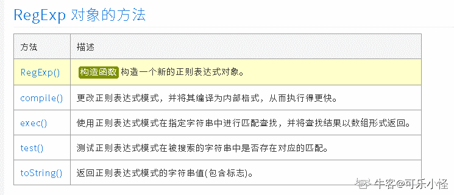  编辑于 2021-04-22 11:19:39

* * *

## 7

var a = 3;
var b = new Number(3);
var c = 3;

console.log(a == b);
console.log(a === b);
console.log(b === c);
上面代码的输出结果是什么

正确答案: C   你的答案: 空 (错误)

```cpp
true false true
```

```cpp
false false true
```

```cpp
true false false
```

```cpp
false true true
```

本题知识点

前端工程师 浩鲸云 2020

讨论

[cuit-farmer](https://www.nowcoder.com/profile/630872883)

注意 Number 的不同用法 1\. Number 被用作构造函数

```cpp
1 === new Number(1) // false
```

2\. Number 被用作类型转换

```cpp
1 === Number(1) // true
```

发表于 2021-10-09 18:44:09

* * *

## 8

关于箭头函数下列说法错误的一项是：

正确答案: D   你的答案: 空 (错误)

```cpp
函数体内 this 的指向是定义时所在的对象，而不是使用时所在的对象
```

```cpp
箭头函数内不能使用 arguments 对象
```

```cpp
箭头函数不能使用 yield 命令
```

```cpp
可以使用 new 创建一个箭头函数的实例
```

本题知识点

前端工程师 浩鲸云 2020

讨论

[夜寻极光。](https://www.nowcoder.com/profile/868966489)

箭头函数的 this 是定义时继承父级作用域的 this。同时，它没有 arguments，也不能 new，也不能使用 call、apply 改变指向。 发表于 2021-08-23 19:34:53

* * *

## 9

下面结果为真的表达式是

正确答案: C   你的答案: 空 (错误)

```cpp
null instanceof Object
```

```cpp
null === undefined
```

```cpp
null == undefined
```

```cpp
NaN == NaN
```

本题知识点

前端工程师 浩鲸云 2020

讨论

[星宙](https://www.nowcoder.com/profile/494943201)

ECMAScript 规范认为，既然 null 和  undefined 的行为很相似，并且都表示 一个无效的值，那么它们所表示的内容也具有相似性，即有

```cpp
undefined == null; //true
```

发表于 2021-07-15 16:18:57

* * *

## 10

下列哪种数组的方法不会修改数组本身

正确答案: A   你的答案: 空 (错误)

```cpp
slice
```

```cpp
splice
```

```cpp
sort
```

```cpp
unshift
```

本题知识点

前端工程师 浩鲸云 2020

讨论

[可乐小怪](https://www.nowcoder.com/profile/568783762)

[数组中的方法 --- 不改变原数组的方法](https://www.cnblogs.com/buxiugangzi/p/12079003.html)

1.concat（）把元素衔接到数组中。

concat() 方法用于连接两个或多个数组。

该方法不会改变现有的数组，而仅仅会返回被连接数组的一个副本。

2.every() 方法使用指定函数检测数组中的所有元素：

*   如果数组中检测到有一个元素不满足，则整个表达式返回 *false* ，且剩余的元素不会再进行检测。
*   如果所有元素都满足条件，则返回 true

3.filter（）返回满足断言函数的数组元素。

4.forEach（）为数组的每一个元素调用指定函数。

5indexOf（）在数组中查找指定元素。  如果找到的话返回该元素的索引  没找到 返回-1

6.join（）将数组的所有元素转化为字符串。


```cpp
var fruits = ["Banana", "Orange", "Apple", "Mango"]; var energy = fruits.join();
console.log(fruits)
console.log(energy)

[ 'Banana', 'Orange', 'Apple', 'Mango' ]
Banana,Orange,Apple,Mango
```


7.lastIndexOf（）在数组中反向查找。

8.map()从数组的元素中，计算出新的数组。

9.some（）测试是否至少有一个数组元素能让断言函数为真。

10.slice（）返回数组的一部分。

```cpp
var fruits = ["Banana", "Orange", "Lemon", "Apple", "Mango"]; var citrus = fruits.slice(1,3);
结果输出  Orange,Lemon
```

11.reduce（）从数组的元素中，计算出一个值。

参数接收一个函数  函数中接收两个参数  第一个是数组的值，第二个是初始值，不传的话就是 0 循环调用该函数 前一个的返回值是后面的第二个参数

12.reduceRight（）从右往左计算数组

发表于 2021-04-22 11:22:29

* * *

[牛客 219787648 号](https://www.nowcoder.com/profile/219787648)

slice 返回查找的内容

发表于 2021-04-22 08:53:40

* * *

## 11

JavaScript 中 document.getElementById()返回值的类型为？

正确答案: B   你的答案: 空 (错误)

```cpp
Array
```

```cpp
Object
```

```cpp
String
```

```cpp
Function
```

本题知识点

Javascript 微博 前端工程师 浩鲸云 2020

讨论

[Cainia](https://www.nowcoder.com/profile/4385013)

document.getElementById 的返回值是 Functiondocument.getElementById(" ")的返回值是 Object 

发表于 2019-02-21 11:08:25

* * *

[Amour1018](https://www.nowcoder.com/profile/306342)

document.getElementById 根据元素 ID 值返回元素节点对象，通过该对象可以获取结点的属性和内容

发表于 2015-09-20 16:04:08

* * *

[旧时光 111](https://www.nowcoder.com/profile/8035243)

by id 获取的是单个 DOM 节点，by tagname 和 class 是数组

编辑于 2018-01-12 22:15:14

* * *

## 12

在 javascript 中，用于阻止默认事件的默认操作的方法是

正确答案: C   你的答案: 空 (错误)

```cpp
stopDeafault()
```

```cpp
stopPropagation()
```

```cpp
preventDefault()
```

```cpp
preventDefaultEven()
```

本题知识点

前端工程师 浩鲸云 2020

## 13

事件传播的三个阶段是什么

正确答案: D   你的答案: 空 (错误)

```cpp
目标 -&gt; 捕获 -&gt; 冒泡
```

```cpp
冒泡 -&gt; 目标 -&gt; 捕获
```

```cpp
目标 -&gt; 冒泡 -&gt; 捕获
```

```cpp
捕获 -&gt; 目标 -&gt; 冒泡
```

本题知识点

前端工程师 浩鲸云 2020

讨论

[可乐小怪](https://www.nowcoder.com/profile/568783762)

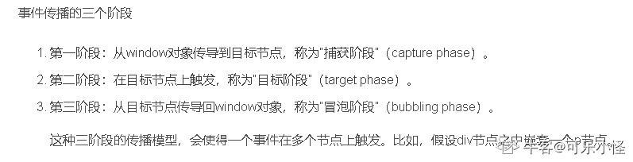

发表于 2021-04-22 11:23:48

* * *

## 14

根据如下变量，下列表达式中返回值为 true 的是
var a = 1;
var b = [];
var c = '';
var d = true;

正确答案: D   你的答案: 空 (错误)

```cpp
(a || b) === true
```

```cpp
(b &amp;&amp; c) === true
```

```cpp
(c &amp;&amp; d) === true
```

```cpp
(d || a) === true
```

本题知识点

前端工程师 浩鲸云 2020

讨论

[cuit-farmer](https://www.nowcoder.com/profile/630872883)

在 JavaScript 的逻辑或”||“中，若左边的值为逻辑真，则返回左边的值，否则，返回的是右边的值

```cpp
"a" || 0 // "a"
false || false // false
NaN || {} // {}
```

发表于 2021-10-09 18:53:05

* * *

[可乐小怪](https://www.nowcoder.com/profile/568783762)

0 == false 1==true 但是不能全等(===)

发表于 2021-04-22 11:26:12

* * *

## 15

JavaScript 中需要往数组末尾处添加一个元素，应该使用以下哪个方法：

正确答案: A   你的答案: 空 (错误)

```cpp
push
```

```cpp
pop
```

```cpp
shift
```

```cpp
unshift
```

本题知识点

Java 工程师 C++工程师 iOS 工程师 安卓工程师 运维工程师 前端工程师 算法工程师 PHP 工程师 京东 2018 浩鲸云 2020

讨论

[若即若离 2524](https://www.nowcoder.com/profile/4038639)

push 是从数组尾部插入元素并返回新的数组长度 pop 是从数组尾部弹出元素并返回该元素 shift 是从数组头部移除元素并返回该元素 unshift 是从数组头部插入若干元素并返回新长度

发表于 2018-07-18 17:34:04

* * *

## 16

如何把 7.25 四舍五入为最接近的整数

正确答案: A   你的答案: 空 (错误)

```cpp
Math.round(7.25)
```

```cpp
Math.ceil(7.25)
```

```cpp
Math.floor(7.25)
```

```cpp
Math.rnd(7.25)
```

本题知识点

前端工程师 浩鲸云 2020

讨论

[杯具杀手](https://www.nowcoder.com/profile/321639238)

注意是“四舍五入为”

发表于 2021-10-27 18:45:40

* * *

[可乐小怪](https://www.nowcoder.com/profile/568783762)

round() 方法可把一个数字舍入为最接近的整数： | [ceil(x)](https://www.runoob.com/jsref/jsref-ceil.html) | 对数进行上舍入。 |

| [floor(x)](https://www.runoob.com/jsref/jsref-floor.html) | 对 x 进行下舍入。 |

| [random()](https://www.runoob.com/jsref/jsref-random.html) | 返回 0 ~ 1 之间的随机数。 |

| [round(x)](https://www.runoob.com/jsref/jsref-round.html) | 四舍五入。 | 

发表于 2021-04-22 11:32:34

* * *

## 17

下列函数哪个不是 JavaScript 的全局函数

正确答案: C   你的答案: 空 (错误)

```cpp
encodeURI
```

```cpp
parseFloat
```

```cpp
round
```

```cpp
eval
```

本题知识点

前端工程师 浩鲸云 2020

讨论

[可乐小怪](https://www.nowcoder.com/profile/568783762)

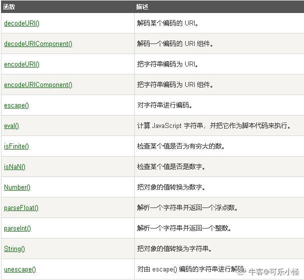

发表于 2021-04-22 11:38:13

* * *

## 18

typeof typeof 0 的执行结果是什么

正确答案: B   你的答案: 空 (错误)

```cpp
&quot;number&quot;
```

```cpp
&quot;string&quot;
```

```cpp
&quot;boolean&quot;
```

```cpp
&quot;object&quot;
```

本题知识点

前端工程师 浩鲸云 2020

讨论

[可乐小怪](https://www.nowcoder.com/profile/568783762)

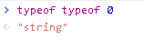

发表于 2021-04-22 11:41:36

* * *

## 19

下面哪个选项可以产生 0<=num<=10 的随机整数

正确答案: C   你的答案: 空 (错误)

```cpp
Math.floor(Math.random()*6)
```

```cpp
Math.floor(Math.random()*10)
```

```cpp
Math.floor(Math.random()*11)
```

```cpp
Math.ceil(Math.random()*10)
```

本题知识点

百度 Java 工程师 C++工程师 iOS 工程师 安卓工程师 运维工程师 前端工程师 算法工程师 PHP 工程师 2018 浩鲸云 2020

讨论

[杯具杀手](https://www.nowcoder.com/profile/321639238)

C floor 函数参数范围为[0,11)

发表于 2021-10-27 18:48:06

* * *

[牛客 665705143 号](https://www.nowcoder.com/profile/665705143)

Math.random()方法返回指 0 到指定数之间的随机数,默认值为 1，Math.random()*4 返回 0 到 4 之间的随机数; 注意不是整数
Math.floor()方法返回一个整数，向下取值，例如：Math.floor(5.2232)，取值为 5;
Math.ceil()方法返回一个整数，向上取值，例如：Math.ceil(5.2232)，取值为 6;
 发表于 2022-01-13 15:17:14

* * *

[youngPeng](https://www.nowcoder.com/profile/226251611)

[0 1)

发表于 2018-12-18 11:08:42

* * *

## 20

下面哪一个是 JSON 数据？

正确答案: B   你的答案: 空 (错误)

```cpp
｛name:"xiaoming",age,"student"｝
```

```cpp
｛"name":"xiaoming","age":"student"｝
```

```cpp
｛"xiaoming","student"｝
```

```cpp
["xiaoming","student"]
```

本题知识点

Javascript 前端工程师 浩鲸云 2020

讨论

[CharleyWong](https://www.nowcoder.com/profile/6385359)

JSON 可以是对象：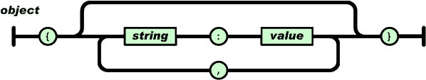也可以是数组：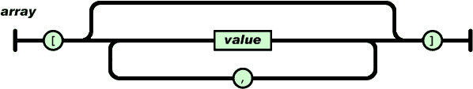
JSON 的值可以是一下几种形式：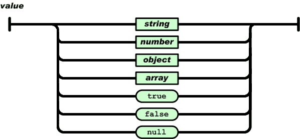
JSON 对字符串格式的要求：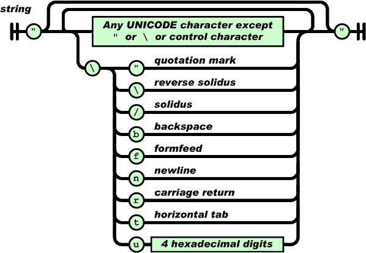
JSON 对数字格式的要求：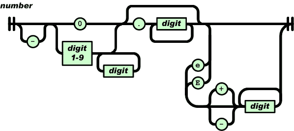

发表于 2017-03-06 09:25:08

* * *

[Amour1018](https://www.nowcoder.com/profile/306342)

json 中 key 也是个字符串，要加引号。key 和 value 之间是用：号来表示的

发表于 2015-09-20 16:06:09

* * *

[LinEE](https://www.nowcoder.com/profile/6566026)

键与值都需要用引号括起来  “键”键值之间用冒号   “键”：“值”键值对之间用逗号隔开     “键”：“值”  ， “键”：“值”

发表于 2017-01-08 21:23:09

* * *

## 21

var number = 0;
console.log(number++);
console.log(++number);
console.log(number);
上面代码的输出结果是什么

正确答案: C   你的答案: 空 (错误)

```cpp
1 1 2
```

```cpp
1 2 2
```

```cpp
0 2 2
```

```cpp
0 1 2
```

本题知识点

前端工程师 浩鲸云 2020

讨论

[可乐小怪](https://www.nowcoder.com/profile/568783762)

后置自增 a++  ，先输出结果再自增。此时输出结果 0，然后自增+1 前置自增++a,先自增再输出结果。此时 a 为 1，先+1，然后书出结果。最后一个 number 引用++a 的结果输出

发表于 2021-04-22 11:49:02

* * *

## 22

下列选项中，不属于 JavaScript 继承的方式的一项是（）

正确答案: D   你的答案: 空 (错误)

```cpp
原型链继承
```

```cpp
构造函数继承
```

```cpp
组合继承
```

```cpp
关联继承
```

本题知识点

前端工程师 京东 Javascript 2019 浩鲸云 2020

讨论

[惜兮 0122](https://www.nowcoder.com/profile/4838030)

JavaScript 实现继承共 6 种方式：原型链继承、借用构造函数继承、组合继承、原型式继承、寄生式继承、寄生组合式继承。

发表于 2019-06-29 21:54:32

* * *

[Leophen](https://www.nowcoder.com/profile/118061608)

[`www.cnblogs.com/Leophen/p/11401734.html`](https://www.cnblogs.com/Leophen/p/11401734.html)

发表于 2019-08-23 18:02:18

* * *

[喵呜 201805101431943](https://www.nowcoder.com/profile/1453160)

构造函数继承是每次继承都会把父类的所有属性方法全部拷贝一份，而对于公用的方法重复拷贝会浪费内存原型链继承所有对象都公用一份原型属性和方法，对一个类的修改回影响的其他类组合继承是结合两种继承方式，用构造函数方式继承属性，原型链方式继承方法

发表于 2019-08-06 14:08:23

* * *

## 23

执行下列语句后，a.length 的值为
var a = [];
a.push(1, 2);
a.shift(3, 4);
a.concat([5, 6]);
a.splice(0, 1, 2);

正确答案: A   你的答案: 空 (错误)

```cpp
1
```

```cpp
2
```

```cpp
3
```

```cpp
4
```

本题知识点

前端工程师 浩鲸云 2020

讨论

[夜寻极光。](https://www.nowcoder.com/profile/868966489)

var a = [];                // [ ]
a.push(1, 2);        // [1,2]  数组末尾添加 1,2
a.shift(3, 4);      //  [ 2 ]   shift（）会删除数组的第一个元素，里面写啥都没用
a.concat([5, 6]);  // [2]      拼接数组，会返回新的数组，这里没接收返回的新数组 ，a 没变
a.splice(0, 1, 2);   //  [2]     删除下标为 0 的元素，同时替换为 2 

发表于 2021-08-23 19:42:34

* * *

[Ak4℃hill](https://www.nowcoder.com/profile/268943378)

push: a=[1,2] shift: a=[2] concat: a=[2] 不改变原数组 splice: a=[2] 删除第一个元素，再插入 2

发表于 2021-04-21 23:45:22

* * *

[jumpshot-cxy](https://www.nowcoder.com/profile/372922050)

前三步之后 a 中剩下一个 1，然后拼接变成[1,5,6]  然后最后一步操作截取第一位数字 删除  然后删除被截取的这个数字   返回的是被删除的这个数字   所以 a  就是一个数组中只剩下 1  所以长度为 1

发表于 2021-04-21 16:51:17

* * *

## 24

下面哪种操作不属于跨域

正确答案: D   你的答案: 空 (错误)

```cpp
http://www.123.com/index.html 调用 http://www.456.com/server.php
```

```cpp
http://www.123.com/index.html  调用  https://www.123.com/server.php
```

```cpp
http://www.123.com:8080/index.html  调用  http://www.123.com:8081/server.php
```

```cpp
http://www.123.com/index.html  调用  http://www.123.com/server.PHP
```

本题知识点

前端工程师 浩鲸云 2020

讨论

[可乐小怪](https://www.nowcoder.com/profile/568783762)

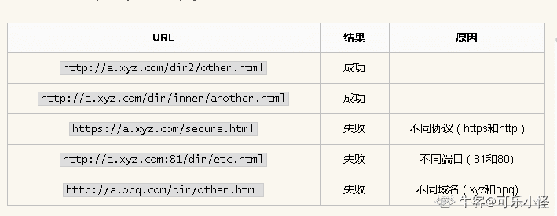同源策略

发表于 2021-04-22 11:54:39

* * *

## 25

下列表达式中结果为 true 的是

正确答案: C   你的答案: 空 (错误)

```cpp
/^a[xyz]\d*/.test('^axd')
```

```cpp
/^a[xyz]\d*/.test('^axyz')
```

```cpp
/^a[xyz]\d*/.test('ax')
```

```cpp
/^a[xyz]\d*/.test('axyz123')
```

本题知识点

前端工程师 百度 2019 浩鲸云 2020

讨论

[Chihiro201901292026207](https://www.nowcoder.com/profile/417824451)

应该选 CD

发表于 2019-08-27 16:42:08

* * *

[zhouqctech](https://www.nowcoder.com/profile/1468715)

/^a[xyz]\d*/：匹配以字符"a"开头(/^a/)，"a"后面紧跟字符"x"或"y"或"z"(/^a[xyz]/)，然后紧跟 0 个或多个数字的字符串(/^a[xyz]\d*/)

编辑于 2019-05-13 18:32:45

* * *

[-LLLjr_](https://www.nowcoder.com/profile/886845118)

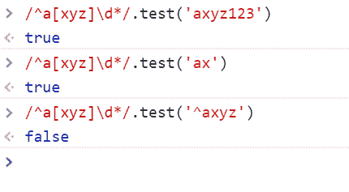就感觉 D 也正确嘛

发表于 2019-05-02 17:21:53

* * *

## 26

以下 js 操作 Array 的方法中不能添加元素的是：

正确答案: B   你的答案: 空 (错误)

```cpp
push
```

```cpp
pop
```

```cpp
unshift
```

```cpp
splice
```

本题知识点

前端工程师 浩鲸云 2020

讨论

[可乐小怪](https://www.nowcoder.com/profile/568783762)

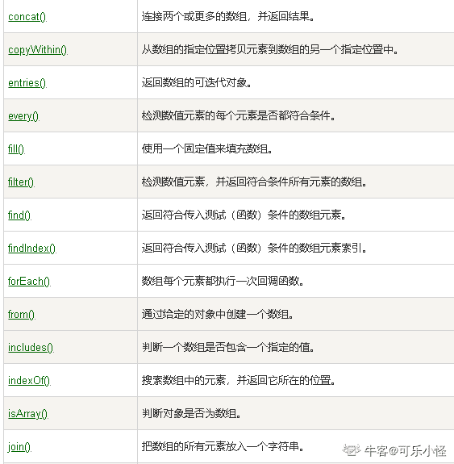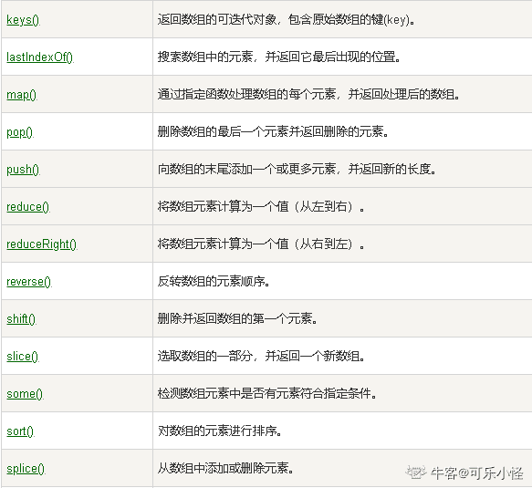
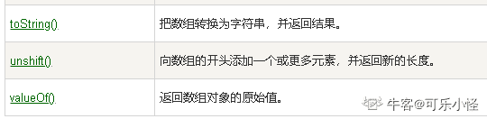

发表于 2021-04-22 13:43:48

* * *

## 27

function getAge(...args) {
  console.log(typeof args);
}

getAge(21);
上面代码的输出结果是什么

正确答案: C   你的答案: 空 (错误)

```cpp
&quot;number&quot;
```

```cpp
&quot;array&quot;
```

```cpp
&quot;object&quot;
```

```cpp
&quot;NaN&quot;
```

本题知识点

前端工程师 浩鲸云 2020

讨论

[jumpshot-cxy](https://www.nowcoder.com/profile/372922050)

展开运算符   得到结果应该是【21】   所以是个对象

发表于 2021-04-21 16:36:11

* * *

## 28

表达式 ”2”+3+4 的值为

正确答案: C   你的答案: 空 (错误)

```cpp
&quot;27&quot;
```

```cpp
9
```

```cpp
&quot;234&quot;
```

```cpp
&quot;9&quot;
```

本题知识点

前端工程师 浩鲸云 2020

讨论

[牛客 331988342 号](https://www.nowcoder.com/profile/331988342)

前面第一个是字符串，后面的也是字符串

发表于 2021-10-03 17:08:25

* * *

## 29

下面有关 JavaScript 常见事件触发情况的描述错误的是？

正确答案: D   你的答案: 空 (错误)

```cpp
onchange：用户改变域的内容
```

```cpp
onkeypress：某个键盘的键被按下或按住
```

```cpp
onmousedown：某个鼠标按键被按下
```

```cpp
onblur：元素获得焦点
```

本题知识点

前端工程师 用友 Javascript 2019 浩鲸云 2020

讨论

[楠楠南南](https://www.nowcoder.com/profile/207271028)

onblur 事件会在对象失去焦点时发生。 Onblur 经常用于 Javascript 验证代码，一般用于表单输入框。

发表于 2019-07-11 13:48:40

* * *

[嚼不烂的野草](https://www.nowcoder.com/profile/253184420)

onfocus 才是获取焦点时触发

发表于 2019-10-12 15:44:05

* * *

[于指缝间慢慢流逝](https://www.nowcoder.com/profile/9091941)

onkeypress 事件会在键盘按键被按下并释放一个键时发生。按下不是[onkeydown](https://www.runoob.com/jsref/event-onkeydown.html)么

发表于 2020-01-03 11:06:17

* * *

## 30

var a = 10;
(function () {
    console.log(a)
    a = 5
    console.log(window.a)
    var a = 20;
    console.log(a)
})()
上面代码的输出结果是什么

正确答案: B   你的答案: 空 (错误)

```cpp
10 5 20
```

```cpp
undefined 10 20
```

```cpp
undefined 5 20
```

```cpp
10 10 20
```

本题知识点

前端工程师 浩鲸云 2020

讨论

[杯具杀手](https://www.nowcoder.com/profile/321639238)

声明提升

发表于 2021-10-27 19:06:56

* * *

[牛客 219787648 号](https://www.nowcoder.com/profile/219787648)

| var a = 10;(function(){    console.log(a);    var a = 100;})(); |

结果：输出 undefined

解释：

function 中有 var a = 100;

声明会提升到 function 最开头，但赋值发生在最后。

上面的代码等价于：

| 123456 | var a = 10;(function(){    var a;    console.log(a);    a = 100;})(); |

打印 a 的时候，a 并没有在 function 内赋值，所以是 undefined

发表于 2021-04-22 09:05:17

* * *

## 31

所有对象都有原型

正确答案: B   你的答案: 空 (错误)

```cpp
T
```

```cpp
F
```

本题知识点

前端工程师 浩鲸云 2020

讨论

[jumpshot-cxy](https://www.nowcoder.com/profile/372922050)

顶级对象 window 没有原型

发表于 2021-04-21 16:30:36

* * *

[牛客 589890733 号](https://www.nowcoder.com/profile/589890733)

x instanceof A，判断 A.prototype 是否在 x 的原型链上，一个通常方法创建的对象 x，x instanceof Object 都是 true，那么能不能构造一个对象 y，使得 y instanceof Object 为 false 呢，是可以的，Object.create(null)。

发表于 2022-01-29 11:39:10

* * *

## 32

alert()不属于异步操作

正确答案: A   你的答案: 空 (错误)

```cpp
T
```

```cpp
F
```

本题知识点

前端工程师 浩鲸云 2020

讨论

[牛客 665705143 号](https://www.nowcoder.com/profile/665705143)

alert() 是 window 的内置函数，被认为是同步 CPU 代码，所以 JavaScript 引擎会优先执行同步代码，alert 弹窗先出现；alert 有特殊的阻塞性质，JavaScript 引擎的执行被阻塞住；点击 alert 的“确定”，JavaScript 没有了阻塞，执行完同步代码后，又读取事件队列里的异步任务。

发表于 2022-02-19 11:03:33

* * *

## 33

1==true 的返回值是 true，这句话是否正确？

正确答案: A   你的答案: 空 (错误)

```cpp
T
```

```cpp
F
```

本题知识点

前端工程师 浩鲸云 2020

## 34

split() 方法用于把一个字符串分割成字符串数组。

正确答案: A   你的答案: 空 (错误)

```cpp
T
```

```cpp
F
```

本题知识点

前端工程师 浩鲸云 2020

讨论

[星宙](https://www.nowcoder.com/profile/494943201)

split() 方法不是用于把一个字符串分割成数组吗？

发表于 2021-07-15 16:30:49

* * *

## 35

变量的命名时应该注意以字母或数字作为首字母。

正确答案: B   你的答案: 空 (错误)

```cpp
T
```

```cpp
F
```

本题知识点

前端工程师 浩鲸云 2020

## 36

(2<3)||(3<2)表达式将返回值为

正确答案: A   你的答案: 空 (错误)

```cpp
True
```

```cpp
False
```

本题知识点

前端工程师 浩鲸云 2020

讨论

[前端-初级](https://www.nowcoder.com/profile/420181037)

2<3 为 ture,3<2 为 false.    ||是或，有一个为真，则为真

发表于 2021-04-16 16:36:02

* * *

## 37

setInterval(fn1,1000) 只会调用一次 fn1 方法

正确答案: B   你的答案: 空 (错误)

```cpp
T
```

```cpp
F
```

本题知识点

前端工程师 浩鲸云 2020

讨论

[酒剑喵](https://www.nowcoder.com/profile/87090279)

setInterval("alert('welcome');",1000)以这句话为例，每隔一秒弹出一个窗口

发表于 2021-04-21 21:08:51

* * *

## 38

对数组里数据的排序可以用 sort 函数，如果排序效果非预期，可以给 sort 函数加一个排序函数的参数

正确答案: A   你的答案: 空 (错误)

```cpp
T
```

```cpp
F
```

本题知识点

前端工程师 浩鲸云 2020

## 39

服务器错误的 HTTP 状态码是 200

正确答案: B   你的答案: 空 (错误)

```cpp
T
```

```cpp
F
```

本题知识点

前端工程师 浩鲸云 2020

讨论

[小 hu 同学](https://www.nowcoder.com/profile/807281855)

服务器错误是 5 开头的

发表于 2021-05-05 17:33:27

* * *

[瞻星揆地](https://www.nowcoder.com/profile/465590006)

2 开头都是请求成功的 code

发表于 2021-04-19 21:22:31

* * *

## 40

==' 在比较过程中，不但会比较两边的值，还会比较两边的数据类型

正确答案: B   你的答案: 空 (错误)

```cpp
T
```

```cpp
F
```

本题知识点

前端工程师 浩鲸云 2020