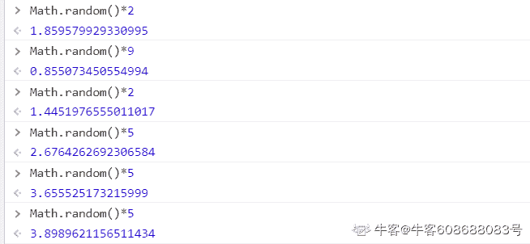
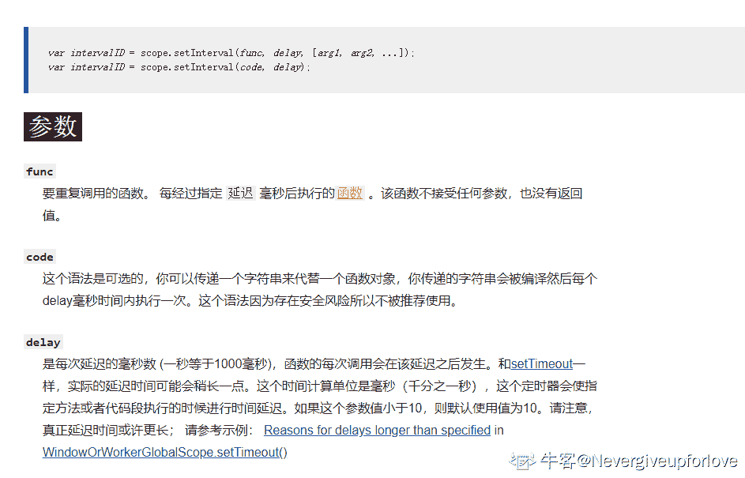
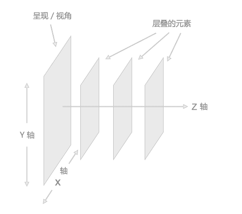

# 浩鲸科技 2020 届前端类 A 卷

## 1

下列选项中，那个不是 js 的基本数据类型

正确答案: D   你的答案: 空 (错误)

```cpp
Boolean
```

```cpp
String
```

```cpp
Symbol
```

```cpp
RegExp
```

本题知识点

前端工程师 浩鲸云 2020

讨论

[知府松](https://www.nowcoder.com/profile/191818295)

简单数据类型(基本类型)：字符串（String）、数字(Number)、布尔(Boolean)、对空（Null）、未定义（Undefined）、Symbol(ES6 新增), 复杂数据类型(引用数据类型)：对象(Object)、数组(Array)、函数(Function)

发表于 2021-04-16 21:49:14

* * *

## 2

下列选项中，那个不是 HTTP 的请求方法

正确答案: D   你的答案: 空 (错误)

```cpp
Get
```

```cpp
Post
```

```cpp
PUT
```

```cpp
DEL
```

本题知识点

前端工程师 浩鲸云 2020

讨论

[知府松](https://www.nowcoder.com/profile/191818295)

D 选项中，应该是 DELETE，没有 DEL 这种请求方法

发表于 2021-04-16 21:51:11

* * *

## 3

下列选项中，服务器错误的 HTTP 状态码是？

正确答案: A   你的答案: 空 (错误)

```cpp
500
```

```cpp
304
```

```cpp
404
```

```cpp
200
```

本题知识点

前端工程师 浩鲸云 2020

讨论

[知府松](https://www.nowcoder.com/profile/191818295)

服务器类的都是 5 开头的

发表于 2021-04-16 21:51:32

* * *

[矜持的微笑](https://www.nowcoder.com/profile/788113274)

HTTP 状态码由三个十进制数字组成，第一个十进制数字定义了状态码的类型。响应分为五类：信息响应(100–199)，成功响应(200–299)，重定向(300–399)，客户端错误(400–499)和服务器错误 (500–599)： | 1** | 信息，服务器收到请求，需要请求者继续执行操作 |
| 2** | 成功，操作被成功接收并处理 |
| 3** | 重定向，需要进一步的操作以完成请求 |
| 4** | 客户端错误，请求包含语法错误或无法完成请求 |
| 5** | 服务器错误，服务器在处理请求的过程中发生了错误 | 

发表于 2022-02-19 20:50:54

* * *

## 4

下列选项中，块级元素是？

正确答案: B   你的答案: 空 (错误)

```cpp
span
```

```cpp
li
```

```cpp
canvas
```

```cpp
input
```

本题知识点

前端工程师 浩鲸云 2020

讨论

[大明*](https://www.nowcoder.com/profile/412542823)

块状元素：div h dt dd li p

行内元素：a b span i input img label u var

行内块元素：canvas

发表于 2021-12-02 15:30:11

* * *

## 5

下列选项中，不是 CSS display 属性的是

正确答案: C   你的答案: 空 (错误)

```cpp
block
```

```cpp
none
```

```cpp
hidden
```

```cpp
inline-block
```

本题知识点

前端工程师 浩鲸云 2020

讨论

[大明*](https://www.nowcoder.com/profile/412542823)

| CSS display 属性 |   |

| none | 此元素不会被显示。 |
| block | 此元素将显示为块级元素，此元素前后会带有换行符。 |
| inline | 默认。此元素会被显示为内联元素，元素前后没有换行符。 |
| inline-block | 行内块元素。（CSS2.1 新增的值） |
| list-item | 此元素会作为列表显示。 |
| run-in | 此元素会根据上下文作为块级元素或内联元素显示。 |
| compact | CSS 中有值 compact，不过由于缺乏广泛支持，已经从 CSS2.1 中删除。 |
| marker | CSS 中有值 marker，不过由于缺乏广泛支持，已经从 CSS2.1 中删除。 |
| table | 此元素会作为块级表格来显示（类似 <table>），表格前后带有换行符。 |
| inline-table | 此元素会作为内联表格来显示（类似 <table>），表格前后没有换行符。 |
| table-row-group | 此元素会作为一个或多个行的分组来显示（类似 <tbody>）。 |
| table-header-group | 此元素会作为一个或多个行的分组来显示（类似 <thead>）。 |
| table-footer-group | 此元素会作为一个或多个行的分组来显示（类似 <tfoot>）。 |
| table-row | 此元素会作为一个表格行显示（类似 <tr>）。 |
| table-column-group | 此元素会作为一个或多个列的分组来显示（类似 <colgroup>）。 |
| table-column | 此元素会作为一个单元格列显示（类似 <col>） |
| table-cell | 此元素会作为一个表格单元格显示（类似 <td> 和 <th>） |
| table-caption | 此元素会作为一个表格标题显示（类似 <caption>） |
| inherit | 规定应该从父元素继承 display 属性的值。 |

 发表于 2021-12-02 15:34:28

* * *

## 6

Bootstrap 使用的 CSS 的盒子模型是

正确答案: B   你的答案: 空 (错误)

```cpp
content-box
```

```cpp
border-box
```

```cpp
默认
```

```cpp
inherit
```

本题知识点

前端工程师 浩鲸云 2020

讨论

[知府松](https://www.nowcoder.com/profile/191818295)

bootstrap 框架，页面是采用的 IE 盒模型的方式呈现的。content-box 指定盒子模型为 W3C（标准盒模型），border-box 为 IE 盒子模型（怪异盒模型）  

发表于 2021-04-16 21:56:54

* * *

[牛客 956243309 号](https://www.nowcoder.com/profile/956243309)

content-box 是 w3c 盒模型 border-box 是 ie 盒模型 bootstrap 采用 ie 盒模型

发表于 2021-04-20 15:48:38

* * *

## 7

那个操作不会造成内存泄露

正确答案: D   你的答案: 空 (错误)

```cpp
没有清理的 DOM 元素引用
```

```cpp
被遗忘的定时器
```

```cpp
事件侦听没有移除
```

```cpp
局部变量不用时，没有设为 null
```

本题知识点

前端工程师 浩鲸云 2020

讨论

[牛客 65403886 号](https://www.nowcoder.com/profile/65403886)

练习题

发表于 2021-04-12 17:31:44

* * *

[Binet](https://www.nowcoder.com/profile/720296123)

函数内的局部变量再函数执行完成后被垃圾回收机制回收，不造成内存泄漏

发表于 2021-08-31 17:19:14

* * *

## 8

下列选项中,( )不是网页中的事件

正确答案: D   你的答案: 空 (错误)

```cpp
onclick
```

```cpp
onmouseover
```

```cpp
onsubmit
```

```cpp
onpressbutton
```

本题知识点

前端工程师 浩鲸云 2020

讨论

[swallowblank](https://www.nowcoder.com/profile/8147847)

好像有 onpress 但是没有 pressbtn

发表于 2021-06-20 22:14:40

* * *

## 9

以下( )表达式产生一个 0~7 之间(含 0,7)的随机整数

正确答案: C   你的答案: 空 (错误)

```cpp
Math.floor(Math.random()*6)
```

```cpp
Math.floor(Math.random()*7)
```

```cpp
Math. floor(Math.random()*8)
```

```cpp
Math.ceil(Math.random()*8)
```

本题知识点

前端工程师 浩鲸云 2020

讨论

[矜持的微笑](https://www.nowcoder.com/profile/788113274)

从 min~max 之间取随机整数: 
   Math.floor(Math.random()*(max-min+1)+min)

发表于 2022-02-19 20:55:40

* * *

[记得呼吸](https://www.nowcoder.com/profile/608688083)

Math.random()方法返回指 0 到指定数之间的随机数,默认值为 1，Math.random()*4 返回 0 到 4 之间的随机数;Math.floor()方法返回一个整数，向下取值，例如：Math.floor(5.2232)，取值为 5;Math.ceil()方法返回一个整数，向上取值，例如：Math.ceil(5.2232)，取值为 6; 

发表于 2021-04-18 18:33:21

* * *

## 10

String 对象的哪个方法可以寻找子字符串并返回该子字符串位置

正确答案: B   你的答案: 空 (错误)

```cpp
match()
```

```cpp
indexOf()
```

```cpp
search()
```

```cpp
concat()
```

本题知识点

前端工程师 浩鲸云 2020

讨论

[牛客 665705143 号](https://www.nowcoder.com/profile/665705143)

1.match() 在字符串内检索指定的值，或找到一个或多个正则表达式的匹配。它返回指定的值，而不是字符串的位置。如果没有找到任何匹配的文本， match() 将返回 null。否则，它将返回一个数组，其中存放了与它找到的匹配文本有关的信息。2.indexOf()返回字符串参数在调用它的字符串对象中第一次出现的位置。3.search() 用于检索字符串中指定的子字符串，或检索与正则表达式相匹配的子字符串。如果没有找到任何匹配的子串，则返回 -1。4.用于连接两个或多个字符串。concat() 方法将把它的所有参数转换成字符串，然后按顺序连接到字符串 stringObject 的尾部，并返回连接后

发表于 2022-01-13 09:53:08

* * *

[Binet](https://www.nowcoder.com/profile/720296123)

indexOf()返回字符串参数在调用它的字符串对象中第一次出现的位置。

发表于 2021-08-31 17:22:40

* * *

## 11

setInterval("alert('welcome');",1000);这段代码的意思是

正确答案: C   你的答案: 空 (错误)

```cpp
等待 1000 秒后，再弹出一个对话框
```

```cpp
等待 1 秒钟后弹出一个对话框
```

```cpp
每隔一秒钟弹出一个对话框
```

```cpp
语句报错,语法有问题
```

本题知识点

前端工程师 浩鲸云 2020

讨论

[Nevergiveupforlove](https://www.nowcoder.com/profile/515351402)

这题估计有小伙伴会比较疑惑，setInterval 第一个参数不是应该是一个回调函数么？其实不是的，MDN 解释如下： 

发表于 2021-04-19 23:39:01

* * *

[牛客 191621956 号](https://www.nowcoder.com/profile/191621956)

alert 是定义函数

发表于 2021-07-12 15:58:47

* * *

[伊尔三四五](https://www.nowcoder.com/profile/516676848)

alert()不是会阻断主线程的任务吗？为什么不是选 C？

发表于 2021-04-21 22:17:08

* * *

## 12

下列哪个样式定义后，内联(非块状)元素可以定义宽度和高度

正确答案: C   你的答案: 空 (错误)

```cpp
display:inline
```

```cpp
display:none
```

```cpp
display:block
```

```cpp
display:inherit
```

本题知识点

CSS 前端工程师 浩鲸云 2020

讨论

[记得呼吸](https://www.nowcoder.com/profile/608688083)

内联元素默认是不可以设置宽高的，定义了 dsiplay=block 后，内联元素变成块状元素

发表于 2021-04-18 18:23:56

* * *

[一叶知秋 Lee.](https://www.nowcoder.com/profile/112910856)

题目说：内联(非块状)元素可以定义宽度和高度显然，就是让其转换为块元素记住关键字：block(块)

发表于 2022-01-26 09:23:27

* * *

[牛客 583086424 号](https://www.nowcoder.com/profile/583086424)

非块状和块级元素不同吗？

发表于 2020-08-02 08:18:28

* * *

## 13

新窗口打开网页，用到以下哪个值

正确答案: B   你的答案: 空 (错误)

```cpp
_self
```

```cpp
_blank
```

```cpp
_top
```

```cpp
_parent
```

本题知识点

前端工程师 浩鲸云 2020

讨论

[牛客 665705143 号](https://www.nowcoder.com/profile/665705143)

_self 在当前窗口打开网页 _blank 在新窗口打开网页 _top 在当前窗口打开网页，并且替换当前窗口的整个网页 _parent 在父窗口中打开网页

发表于 2022-01-13 17:07:01

* * *

## 14

下面有关 jquery 事件的响应，描述错误的是？

正确答案: B   你的答案: 空 (错误)

```cpp
click 鼠标点击某个对象
```

```cpp
focus 元素失去焦点
```

```cpp
load 是某个页面的 css js html 文档结构和图像被完全加载
```

```cpp
mousedown 某个鼠标按键被按下
```

本题知识点

搜狐 前端工程师 浩鲸云 2020

讨论

[ZYY](https://www.nowcoder.com/profile/304490)

onfocus 获得焦点 onblur 失去焦点

发表于 2015-03-09 11:02:09

* * *

[樱为柚你](https://www.nowcoder.com/profile/168385)

w3cshool 中 jQuery 事件手册中，有很清晰的说明：blur()方法是当元素失去焦点时，发生 blur 事件；
而 focus()方法是当元素获得焦点时发生 focus 事件；

发表于 2015-07-13 18:07:08

* * *

[站在前端门前的人](https://www.nowcoder.com/profile/641120)

jq 有 on 么？

发表于 2016-04-17 11:12:28

* * *

## 15

元素的 alt 和 title 属性有什么异同，选出正确的说法？

正确答案: B   你的答案: 空 (错误)

```cpp
不同的浏览器，表现一样
```

```cpp
alt 和 title 同时设置的时候，alt 作为图片的替代文字出现，title 是图片的解释文字
```

```cpp
alt 和 title 同时设置的时候，title 作为图片的替代文字出现，alt 是图片的解释文字
```

```cpp
以上说法都不正确
```

本题知识点

HTML 百度 前端工程师 浩鲸云 2020

讨论

[lemon123456789qwert](https://www.nowcoder.com/profile/920396)

alt 是 html 标签的  查看全部)

编辑于 2021-08-18 15:50:28

* * *

[牛客-007](https://www.nowcoder.com/profile/394118)

答案：B
同时设置时，alt 是在图片未加载完成的时候做完图片的替代文字线性，title 是图片的解释文字
图片加载完成后是看不到 alt 的

发表于 2015-01-26 12:07:17

* * *

[我的大学](https://www.nowcoder.com/profile/601234)

B         这两个属性是有些重复了。在不同浏览器里面表现有些不同。在 alt 和 title 同时设置的时候，alt 作为图片的替代文字出现，title 是图片的解释文字。

编辑于 2021-08-18 15:50:28

* * *

## 16

下列 js 可以让一个 input 的背景颜色变成红色的是？

正确答案: A   你的答案: 空 (错误)

```cpp
inputElement.style.backgroundColor = 'red';
```

```cpp
inputElement.backgroundColor = 'red';
```

```cpp
inputElement.style.backgroundColor = '#0000';
```

```cpp
inputElement.backgroundColor = '#0000';
```

本题知识点

前端工程师 浩鲸云 2020

## 17

下列关于 CSS 属性 position 的属性值的描述，说法错误的是？

正确答案: B   你的答案: 空 (错误)

```cpp
static：没有定位，元素出现在正常的流中
```

```cpp
fixed：生成绝对定位的元素，相对于父元素进行定位
```

```cpp
relative：生成相对定位的元素，相对于元素本身正常位置进行定位。
```

```cpp
absolute：生成绝对定位的元素，相对于 static 定位以外的第一个祖先元素进行定位。
```

本题知识点

百度 CSS 前端工程师 浩鲸云 2020

讨论

[hardy](https://www.nowcoder.com/profile/641341)

在 html 中网页可以看成一个立体的空间，一个完整的页面是由很多个页面堆积形成的，如下图所示
CSS 中 Position 属性有四个可选值，它们分别是：static、absolute、fixed、relative。◆position:static　无定位该属性值是所有元素定位的默认情况，在一般情况下，我们不需要特别的去声明它，但有时候遇到继承的情况，我们不愿意见到元素所继承的属性影响本身，从而可以用 position:static 取消继承，即还原元素定位的默认值。◆position:absolute　绝对定位使用 position:absolute，能够很准确的将元素移动到你想要的位置，◆position:fixed　相对于窗口的固定定位这个定位属性值是什么意思呢？元素的定位方式同 absolute 类似，但它的包含块是视区本身。在屏幕媒体如 WEB 浏览器中，元素在文档滚动时不会在浏览器视察中移动。例如，它允许框架样式布局。在页式媒体如打印输出中，一个固定元素会出现于第一页的相同位置。这一点可用于生成流动标题或脚注。我们也见过相似的效果，但大都数效果不是通过 CSS 来实现了，而是应用了 JS 脚本。请特别注意，IE6 不支持 CSS 中的 position:fixed 属性。真的非常遗憾，要不然我们就可以试试这种酷酷的效果了。◆position:relative　相对定位所谓相对定位到底是什么意思呢，是基于哪里的相对呢？我们需要明确一个概念，相对定位是相对于元素默认的位置的定位。既然是相对的，我们就需要设置不同的值来声明定位在哪里，top、bottom、left、right 四个数值配合，来明确元素的位置。

发表于 2016-06-22 16:35:33

* * *

[可可的](https://www.nowcoder.com/profile/1198739)

B

| absolute | 生成绝对定位的元素，相对于 static 定位以外的第一个父元素进行定位。元素的位置通过 "left", "top", "right" 以及 "bottom" 属性进行规定。 |
| fixed | 生成绝对定位的元素，相对于浏览器窗口进行定位。元素的位置通过 "left", "top", "right" 以及 "bottom" 属性进行规定。 |
| relative | 生成相对定位的元素，相对于其正常位置进行定位。因此，"left:20" 会向元素的 LEFT 位置添加 20 像素。 |
| static | 默认值。没有定位，元素出现在正常的流中（忽略 top, bottom, left, right 或者 z-index 声明）。 |
| inherit | 规定应该从父元素继承 position 属性的值。 |

发表于 2016-08-15 11:23:21

* * *

[胡原](https://www.nowcoder.com/profile/80)

Bstatic    元素框正常生成。块级元素生成一个矩形框，作为文档流的一部分，行内元素则会创建一个或多个行框，置于其父元素中。relative    元素框偏移某个距离。元素仍保持其未定位前的形状，它原本所占的空间仍保留。absolute    元素框从文档流完全删除，并相对于其包含块定位。包含块可能是文档中的另一个元素或者是初始包含块。元素原先在正常文档流中所占的空间会关闭，就好像元素原来不存在一样。元素定位后生成一个块级框，而不论原来它在正常流中生成何种类型的框。fixed    元素框的表现类似于将 position 设置为 absolute，不过其包含块是视窗本身。

发表于 2015-01-15 15:04:50

* * *

## 18

下面有关浏览器中使用 js 跨域获取数据的描述，说法错误的是？

正确答案: A   你的答案: 空 (错误)

```cpp
域名、端口相同，协议不同，属于相同的域
```

```cpp
js 可以使用 jsonp 进行跨域
```

```cpp
通过修改 document.domain 来跨子域
```

```cpp
使用 window.name 来进行跨域
```

本题知识点

Javascript 阿里巴巴 前端工程师 浩鲸云 2020

讨论

[完颜科子](https://www.nowcoder.com/profile/798189)

只要 协议 、 域名 、 端口  查看全部)

编辑于 2015-12-27 18:47:36

* * *

[Mr.Apple](https://www.nowcoder.com/profile/213669)

**1.CORS**CORS（Corss-Origin Resource Sharing,跨资源共享），基本思想是使用自定义的 HTTP 头部让浏览器与服务器进行沟通，从而决定请求或响应的成功或失败。即给请求附加一个额外的 Origin 头部，其中包含请求页面的源信息（协议、域名和端口），以便服务器根据这个头部决定是否给予响应。**2.document.domain**将页面的 document.domain 设置为相同的值，页面间可以互相访问对方的 JavaScript 对象。注意：不能将值设置为 URL 中不包含的域；松散的域名不能再设置为紧绷的域名。**3.图像 Ping**var img=new Image();img.onload=img.onerror=function(){... ...}img.src="url?name=value";请求数据通过查询字符串的形式发送，响应可以是任意内容，通常是像素图或 204 响应。图像 Ping 最常用于跟踪用户点击页面或动态广告曝光次数。缺点：只能发送 GET 请求；无法访问服务器的响应文本，只能用于浏览器与服务器间的单向通信。**4.Jsonp**var script=document.createElement("script");script.src="url?callback=handleResponse";document.body.insertBefore(script,document.body.firstChild);JSONP 由两部分组成：回调函数和数据回调函数是接收到响应时应该在页面中调用的函数，其名字一般在请求中指定。数据是传入回调函数中的 JSON 数据。优点：能够直接访问响应文本，可用于浏览器与服务器间的双向通信。缺点：JSONP 从其他域中加载代码执行，其他域可能不安全；难以确定 JSONP 请求是否失败。**5.Comet**Comet 可实现服务器向浏览器推送数据。Comet 是实现方式：长轮询和流短轮询即浏览器定时向服务器发送请求，看有没有数据更新。长轮询即浏览器向服务器发送一个请求，然后服务器一直保持连接打开，直到有数据可发送。发送完数据后，浏览器关闭连接，随即又向服务器发起一个新请求。其优点是所有浏览器都支持，使用 XHR 对象和 setTimeout()即可实现。流即浏览器向服务器发送一个请求，而服务器保持连接打开，然后周期性地向浏览器发送数据，页面的整个生命周期内只使用一个 HTTP 连接。**6.WebSocket**WebSocket 可在一个单独的持久连接上提供全双工、双向通信。
WebSocket 使用自定义协议，未加密的连接时 ws://；加密的链接是 wss://。var webSocket=new WebSocket("ws://");webSocket.send(message);webSocket.onmessage=function(event){var data=event.data;... ....}注意：必须给 WebSocket 构造函数传入绝对 URL；WebSocket 可以打开任何站点的连接，是否会与某个域中的页面通信，完全取决于服务器；WebSocket 只能发送纯文本数据，对于复杂的数据结构，在发送之前必须进行序列化 JSON.stringify(message))。优点：在客户端和服务器之间发送非常少的数据，减少字节开销。

发表于 2016-07-27 10:52:01

* * *

[ultimanecat](https://www.nowcoder.com/profile/6649832)

完全一致的意思是，域名要相同（www.example.com 和 example.com 不同），协议要相同（http 和 https 不同），端口号要相同（默认是:80 端口，它和:8080 就不同）。有的浏览器口子松一点，允许端口不同，大多数浏览器都会严格遵守这个限制。廖雪峰的教程

发表于 2017-03-28 10:20:18

* * *

## 19

下面符合 javascript 变量定义规则的是？

正确答案: A   你的答案: 空 (错误)

```cpp
_$te$t2
```

```cpp
with
```

```cpp
a bc
```

```cpp
2a
```

本题知识点

Javascript 前端工程师 浩鲸云 2020

讨论

[丶微笑](https://www.nowcoder.com/profile/877549)

A 正确;B 是关键字；C 有空格；D 开头为数字；第一个字符必须是一个 ASCII 字母（大小写均可），或一个下划线(_)。注意第一个字符不能是数字。 后续的字符必须是字母、数字或下划线。 
变量名称一定不能是 保留字。 

编辑于 2015-04-01 16:36:02

* * *

[Tiny 涛](https://www.nowcoder.com/profile/627433)

第一个字符必须是一个字母、下划线（_）或一个美元符号（$）；其他字符可以是字母、下划线、美元符号或数字。

发表于 2015-09-06 21:02:44

* * *

[周锦](https://www.nowcoder.com/profile/324418)

JavaScript 的命名规则：
1.必须以字母或者下划线开头，中间可以是.。数字、字母、下划线。
2.变量名不能包含空格、加号、减号等符号。
3.不能使用 JavaScriot 中的关键字。
4.JavaScript 的变量名是严格区分大小写的。

发表于 2016-06-08 17:15:35

* * *

## 20

下面有关 JavaScript 中系统方法的描述，错误的是？

正确答案: B   你的答案: 空 (错误)

```cpp
parseFloat 方法：该方法将一个字符串转换成对应的小数
```

```cpp
isNaN 方法：该方法用于检测参数是否为数值型，如果是，返回 true，否则，返回 false。
```

```cpp
escape 方法： 该方法返回对一个字符串编码后的结果字符串
```

```cpp
eval 方法：该方法将某个参数字符串作为一个 JavaScript 执行
```

本题知识点

Javascript 前端工程师 浩鲸云 2020

讨论

[Tomhu](https://www.nowcoder.com/profile/282690)

B;NaN,即非数值（  查看全部)

编辑于 2015-12-27 18:44:41

* * *

[Henecia](https://www.nowcoder.com/profile/960096)

如果不是数字，才返回 true

发表于 2015-07-30 16:32:05

* * *

[一个拥抱](https://www.nowcoder.com/profile/391289)

eval：返回字符串表达式中的值

unEscape：返回字符串 ASCI 码

escape：返回字符的编码

parseFloat：返回实数

发表于 2014-11-21 18:06:30

* * *

## 21

下面有关 JavaScript 常见事件触发情况的描述错误的是？

正确答案: D   你的答案: 空 (错误)

```cpp
onchange：用户改变域的内容
```

```cpp
onkeypress：某个键盘的键被按下或按住
```

```cpp
onmousedown：某个鼠标按键被按下
```

```cpp
onblur：元素获得焦点
```

本题知识点

前端工程师 用友 Javascript 2019 浩鲸云 2020

讨论

[楠楠南南](https://www.nowcoder.com/profile/207271028)

onblur 事件会在对象失去焦点时发生。 Onblur 经常用于 Javascript 验证代码，一般用于表单输入框。

发表于 2019-07-11 13:48:40

* * *

[嚼不烂的野草](https://www.nowcoder.com/profile/253184420)

onfocus 才是获取焦点时触发

发表于 2019-10-12 15:44:05

* * *

[于指缝间慢慢流逝](https://www.nowcoder.com/profile/9091941)

onkeypress 事件会在键盘按键被按下并释放一个键时发生。按下不是[onkeydown](https://www.runoob.com/jsref/event-onkeydown.html)么

发表于 2020-01-03 11:06:17

* * *

## 22

下面有关 JavaScript 中 call 和 apply 方法的描述，错误的是？

正确答案: B   你的答案: 空 (错误)

```cpp
call 与 apply 都属于 Function.prototype 的一个方法，所以每个 function 实例都有 call、apply 属性
```

```cpp
两者传递的参数不同，call 函数第一个参数都是要传入给当前对象的对象，apply 不是
```

```cpp
apply 传入的是一个参数数组，也就是将多个参数组合成为一个数组传入
```

```cpp
call 传入的则是直接的参数列表。call 方法可将一个函数的对象上下文从初始的上下文改变为由 thisObj 指定的新对象。
```

本题知识点

Javascript 前端工程师 浩鲸云 2020

讨论

[Tomhu](https://www.nowcoder.com/profile/282690)

**B；****call（）方法和**  查看全部)

编辑于 2016-07-03 09:21:39

* * *

[airWendy](https://www.nowcoder.com/profile/351267)

B

**相同点:两个方法产生的** **作用是完全一样的**

**不同点:方法传递的参数不同**

call, apply 方法它们除了第一个参数,即执行时上下文对象相同外,call 方法的其它参数将依次传递给借用的方法作参数,而 apply 就两个参数,第二个参数为一个数组传递。

发表于 2015-06-03 10:20:32

* * *

[Mr.Apple](https://www.nowcoder.com/profile/213669)

1.作用在特定的作用域总调用函数，等于设置函数体内 this 对象的值，以扩充函数赖以运行的作用域。window.color="red";var o={color:"blue"};function getColor(){console.log(this.color); }getColor.call(this);getColor.call(window);getColor.call(o);2.区别接收参数的方式不同：对于 call（），第一个参数是运行函数的作用域，其余参数都直接传递给函数即传递给函数的参数必须逐个列举出来。对于 apply（），第一个参数是 运行函数的作用域 ，另一个参数是参数数组,可以是 Array 实例或 arguments 对象。function sum(num1,num2){**return num1+num2;****}**function callSum(num1,num2){**return sum.call(this,num1,num2);****}**function callSum(num1,num2){**return sum.apply(this,arguments);****}**function callSum(num1,num2){**return sum.apply(this,[num1,num2]);****}**

编辑于 2016-05-03 21:19:29

* * *

## 23

下面列出的浏览器，无 webkit 内核的是（）

正确答案: D   你的答案: 空 (错误)

```cpp
chrome
```

```cpp
Safari
```

```cpp
搜狗浏览器
```

```cpp
firefox
```

本题知识点

前端工程师 浩鲸云 2020

讨论

[MaDic6](https://www.nowcoder.com/profile/988227632)

1、IE 浏览器内核：Trident 内核，也是俗称的 IE 内核； 
2、Chrome 浏览器内核：统称为 Chromium 内核或 Chrome 内核，以前是 Webkit 内核，现在是 Blink 内核； 
3、Firefox 浏览器内核：Gecko 内核，俗称 Firefox 内核； 
4、Safari 浏览器内核：Webkit 内核； 
5、Opera 浏览器内核：最初是自己的 Presto 内核，后来是 Webkit，现在是 Blink 内核； 
6、360 浏览器、猎豹浏览器内核：IE+Chrome 双内核； 
7、搜狗、遨游、QQ 浏览器内核：Trident（兼容模式）+Webkit（高速模式）； 
8、百度浏览器、世界之窗内核：IE 内核； 
9、2345 浏览器内核：以前是 IE 内核，现在也是 IE+Chrome 双内核；

发表于 2021-04-17 01:12:16

* * *

## 24

CSS 盒子模型中（）是透明的，并且这部分可以显示背景。

正确答案: C   你的答案: 空 (错误)

```cpp
border
```

```cpp
margin
```

```cpp
padding
```

```cpp
content
```

本题知识点

CSS 前端工程师 浩鲸云 2020

讨论

[破晓 z](https://www.nowcoder.com/profile/2475492)

  查看全部)

编辑于 2017-03-19 10:11:18

* * *

[￣￣)σ](https://www.nowcoder.com/profile/1686617)

不严谨，margin 也可以透明，也可以显示背景，它显示的背景是父元素的背景。而 padding 是显示当前元素的背景。出题有问题！！同样可以显示背景！！

发表于 2017-09-05 08:46:55

* * *

[菜鸟腾飞](https://www.nowcoder.com/profile/8242197)

我觉得问题出的不够严谨,外边距也可以是透明的,父容器的内边距,是子容器的外边距

发表于 2017-08-26 17:23:13

* * *

## 25

下面哪个属性不会让 div 脱离文档流（normal flow）？

正确答案: C   你的答案: 空 (错误)

```cpp
position: absolute;
```

```cpp
position: fixed;
```

```cpp
position: relative;
```

```cpp
float: left;
```

本题知识点

前端工程师 浩鲸云 2020

讨论

[牛客 665705143 号](https://www.nowcoder.com/profile/665705143)

浮动（float）、固定定位（fixed）和绝对定位（absolute）都会使元素脱离文档流
position: absolute; // 绝对定位,脱离文档流,相对浏览器来进行定位
float: right; // 右浮动,脱离文档流
position: fixed; // 固定定位,脱离文档流
position: relative; // 相对定位,根据自身原来所在位置来进行定位,不脱离文档流

发表于 2022-01-13 15:14:29

* * *

## 26

typeof typeof 0 的执行结果是什么

正确答案: B   你的答案: 空 (错误)

```cpp
"number"
```

```cpp
"string"
```

```cpp
"boolean"
```

```cpp
"object"
```

本题知识点

前端工程师 浩鲸云 2020

讨论

[牛客 479678700 号](https://www.nowcoder.com/profile/479678700)

typeof 0 得出"number"，type ""是字符串

发表于 2021-04-09 20:05:31

* * *

[李 Koko](https://www.nowcoder.com/profile/390043865)

原来 typeof 0 == 'number',typeof 'number' = string

发表于 2022-03-22 14:03:28

* * *

## 27

下面哪个选项可以产生 0<=num<=10 的随机整数

正确答案: C   你的答案: 空 (错误)

```cpp
Math.floor(Math.random()*6)
```

```cpp
Math.floor(Math.random()*10)
```

```cpp
Math.floor(Math.random()*11)
```

```cpp
Math.ceil(Math.random()*10)
```

本题知识点

百度 Java 工程师 C++工程师 iOS 工程师 安卓工程师 运维工程师 前端工程师 算法工程师 PHP 工程师 2018 浩鲸云 2020

讨论

[杯具杀手](https://www.nowcoder.com/profile/321639238)

C floor 函数参数范围为[0,11)

发表于 2021-10-27 18:48:06

* * *

[牛客 665705143 号](https://www.nowcoder.com/profile/665705143)

Math.random()方法返回指 0 到指定数之间的随机数,默认值为 1，Math.random()*4 返回 0 到 4 之间的随机数; 注意不是整数
Math.floor()方法返回一个整数，向下取值，例如：Math.floor(5.2232)，取值为 5;
Math.ceil()方法返回一个整数，向上取值，例如：Math.ceil(5.2232)，取值为 6;
 发表于 2022-01-13 15:17:14

* * *

[youngPeng](https://www.nowcoder.com/profile/226251611)

[0 1)

发表于 2018-12-18 11:08:42

* * *

## 28

下面哪一个是 JSON 数据？

正确答案: B   你的答案: 空 (错误)

```cpp
｛name:"xiaoming",age,"student"｝
```

```cpp
｛"name":"xiaoming","age":"student"｝
```

```cpp
｛"xiaoming","student"｝
```

```cpp
["xiaoming","student"]
```

本题知识点

Javascript 前端工程师 浩鲸云 2020

讨论

[CharleyWong](https://www.nowcoder.com/profile/6385359)

JSON 可以是对象：也可以是数组：
JSON 的值可以是一下几种形式：
JSON 对字符串格式的要求：
JSON 对数字格式的要求：

发表于 2017-03-06 09:25:08

* * *

[Amour1018](https://www.nowcoder.com/profile/306342)

json 中 key 也是个字符串，要加引号。key 和 value 之间是用：号来表示的

发表于 2015-09-20 16:06:09

* * *

[LinEE](https://www.nowcoder.com/profile/6566026)

键与值都需要用引号括起来  “键”键值之间用冒号   “键”：“值”键值对之间用逗号隔开     “键”：“值”  ， “键”：“值”

发表于 2017-01-08 21:23:09

* * *

## 29

下列哪行代码正确的引入了 myScript.js？

正确答案: C   你的答案: 空 (错误)

```cpp
<script href="myScript.js">
```

```cpp
<script name="myScript.js">
```

```cpp
<script src="myScript.js">
```

```cpp
<script root="myScript.js">
```

本题知识点

Javascript 前端工程师 浩鲸云 2020

讨论

[Hunter21](https://www.nowcoder.com/profile/2781254)

<link> 和 href 配合 加载 css，hypertext reference 超文本引用，页面加载到 href 时不会停下来<script>和 src 配合 加载 script 文件，source 资源，页面会停下来等待资源加载完毕（并执行完），所以一般 js 放在 body 的最下面

发表于 2016-09-10 23:29:53

* * *

[小子琳](https://www.nowcoder.com/profile/6318677)

href 加载的是网络外部资源，src 引入加载的资源会下载到本地进行编译执行，.如 js 文件要下载下来编译执行

发表于 2018-11-20 09:58:39

* * *

[MrAi](https://www.nowcoder.com/profile/543275)

src 即 source 的意思，选择 C

发表于 2015-12-04 21:19:22

* * *

## 30

如果想为 id 值为 button1 的元素设置背景色为红色，下列选项中，做法正确的一项是（）

正确答案: A   你的答案: 空 (错误)

```cpp
document.getElementById('button1').style.backgroundColor="red";
```

```cpp
document.getElementById('button1').style.backgroundcolor="red";
```

```cpp
document.getElementById('button1').style.backGroundColor="red";
```

```cpp
document.getElementById('button1').style.bgcolor="red";
```

本题知识点

Javascript 前端工程师 字节跳动 2017 浩鲸云 2020

讨论

[快乐的 coder](https://www.nowcoder.com/profile/750058)

A，js 里样式设置直接把 css 写法的的“-”去掉，再改写为驼峰写法即可。

发表于 2016-06-01 08:42:11

* * *

[Bestbud](https://www.nowcoder.com/profile/384606)

bgcolor 是标签属性，只有 body 和 table tr td 元素有该属性，可以设置背景颜色，其他标签使用 bgcolor 没有效果使用 js 改变 bgcolor 的语句为 document.body.bgColor="red"; 或 document.getElementById(“table tr td 元素的 id”).bgColor="red";D 选项有三个地方错了：1.button 没有 bgcolor 属性；2.不应该用 style ；3.bgcolor 中的 c 应该大写。在 HTML 4.01 中，不赞成使用 body 元素的 bgcolor 属性；在 XHTML 1.0 Strict DTD 中，不支持 body 元素的 bgcolor 属性。

请使用 CSS 代替。

发表于 2016-08-18 12:29:50

* * *

[谁从微毫见参天](https://www.nowcoder.com/profile/790543109)

链接：[`www.nowcoder.com/questionTerminal/7ba96072758343de9f363b33d8275081`](https://www.nowcoder.com/questionTerminal/7ba96072758343de9f363b33d8275081)
来源：牛客网

HTML

```cpp
<body bgcolor="#E6E6FA">

```

1、bgcolor 是标签属性，用于设置背景颜色，只有 body  table  tr  td 元素有该属性。 
2、使用 js 改变 bgcolor 的语句（没有 style）：    document.body.bgColor="red"; 或    document.getElementById(“table tr td 元素的 id”).bgColor="red";

```cpp
h1{background-color:#00ff00;}
```

3、background-color 是标签属性，填充除外边距 margin 以外的元素范围。
4、使用 js 改变 background-color 的语句（有 style）：    document.getElementById(“元素的 id”).backgroundColor="red";(驼峰式命名)5、动态改变 HTML 元素的样式：     object.style.property="new style";

发表于 2019-03-11 10:16:02

* * *

## 31

数组的 length 既可以获取，也可以修改

正确答案: A   你的答案: 空 (错误)

```cpp
对
```

```cpp
错
```

本题知识点

前端工程师 浩鲸云 2020

讨论

[李 Koko](https://www.nowcoder.com/profile/390043865)

大意了，做个笔记，可以对数组的长度进行修改

发表于 2022-03-22 14:06:08

* * *

[牛客 572179084 号](https://www.nowcoder.com/profile/572179084)

js 中可以修改数组长度，java 不能修改，其他语言应该不能修改的居多 var a=[1,2,3,4,5];a.length=2;最终数组 a 变成了 a=[1,2]

发表于 2021-05-07 14:58:36

* * *

[牛客 416909228 号](https://www.nowcoder.com/profile/416909228)

怎么修改

发表于 2021-05-06 15:55:03

* * *

## 32

使用 shift() 方法的返回值是新数组的长度

正确答案: B   你的答案: 空 (错误)

```cpp
对
```

```cpp
错
```

本题知识点

前端工程师 浩鲸云 2020

讨论

[牛客 667937914 号](https://www.nowcoder.com/profile/667937914)

返回的是删除的元素

发表于 2021-04-17 16:37:06

* * *

## 33

$().each 既可以便用 JS 原生对象和数组，又能遍历 DOM 对象

正确答案: B   你的答案: 空 (错误)

```cpp
对
```

```cpp
错
```

本题知识点

前端工程师 浩鲸云 2020

讨论

[知府松](https://www.nowcoder.com/profile/191818295)

each 遍历 dom 对象；$.each 遍历数据源（数组或对象）

发表于 2021-04-16 21:59:04

* * *

## 34

对象函数调用时，this 指向当前对象

正确答案: A   你的答案: 空 (错误)

```cpp
对
```

```cpp
错
```

本题知识点

前端工程师 浩鲸云 2020

讨论

[牛客 847003510 号](https://www.nowcoder.com/profile/847003510)

如果是加了 apply 和 call 调用呢

发表于 2021-04-16 11:18:45

* * *

## 35

JavaScript 的 typeof 运算符的可能结果为 array

正确答案: B   你的答案: 空 (错误)

```cpp
对
```

```cpp
错
```

本题知识点

前端工程师 浩鲸云 2020

讨论

[牛客 667937914 号](https://www.nowcoder.com/profile/667937914)

检测是否为数组用 instanceof，typeof 用来检测基本类型

发表于 2021-04-17 16:39:06

* * *

## 36

Date 不属于 javascript 基本类型的是

正确答案: A   你的答案: 空 (错误)

```cpp
对
```

```cpp
错
```

本题知识点

前端工程师 浩鲸云 2020

## 37

(2<3)||(3<2)表达式将返回值为

正确答案: A   你的答案: 空 (错误)

```cpp
True
```

```cpp
False
```

本题知识点

前端工程师 浩鲸云 2020

讨论

[前端-初级](https://www.nowcoder.com/profile/420181037)

2<3 为 ture,3<2 为 false.    ||是或，有一个为真，则为真

发表于 2021-04-16 16:36:02

* * *

## 38

setInterval(fn1,1000) 只会调用一次 fn1 方法

正确答案: B   你的答案: 空 (错误)

```cpp
T
```

```cpp
F
```

本题知识点

前端工程师 浩鲸云 2020

讨论

[酒剑喵](https://www.nowcoder.com/profile/87090279)

setInterval("alert('welcome');",1000)以这句话为例，每隔一秒弹出一个窗口

发表于 2021-04-21 21:08:51

* * *

## 39

对数组里数据的排序可以用 sort 函数，如果排序效果非预期，可以给 sort 函数加一个排序函数的参数

正确答案: A   你的答案: 空 (错误)

```cpp
T
```

```cpp
F
```

本题知识点

前端工程师 浩鲸云 2020

## 40

服务器错误的 HTTP 状态码是 200

正确答案: B   你的答案: 空 (错误)

```cpp
T
```

```cpp
F
```

本题知识点

前端工程师 浩鲸云 2020

讨论

[小 hu 同学](https://www.nowcoder.com/profile/807281855)

服务器错误是 5 开头的

发表于 2021-05-05 17:33:27

* * *

[瞻星揆地](https://www.nowcoder.com/profile/465590006)

2 开头都是请求成功的 code

发表于 2021-04-19 21:22:31

* * *

## 41

    var array = ["first","second","third","fourth"];

    // 执行到第 3 次，结束循环
    array.forEach(function(item,index){
        if (item == "third") {
           //等于 third 时跳出这个循环，如何实现
        }
        alert(item);// first,sencond
    });
} 

你的答案

本题知识点

前端工程师 浩鲸云 2020

讨论

[牛客 231249211 号](https://www.nowcoder.com/profile/231249211)

throw new Error("跳出循环")

发表于 2021-04-14 16:22:56

* * *

[boovana](https://www.nowcoder.com/profile/574789816)

    var array = ["first","second","third","fourth"];

    // 执行到第 3 次，结束循环
    try{
        array.forEach(function(item,index){
        if (item == "third") {
           //等于 third 时跳出这个循环，如何实现
            new Error('跳出');
        }
        alert(item);// first,sencond
    });
    }catch(err){

    }
} 
 发表于 2022-01-12 21:47:37

* * *

[忘魂儿](https://www.nowcoder.com/profile/107947914)

return ;

发表于 2021-10-05 10:42:19

* * *

## 42

行内元素 和 块级元素 的区别？ 行内元素有那些？块级元素有那些？

你的答案

本题知识点

前端工程师 浩鲸云 2020

讨论

[牛客 231249211 号](https://www.nowcoder.com/profile/231249211)

行内元素 不能设置宽高，多为文本标签 如 span,strong,em 块级元素 可以设置宽高，独占一行文档流 如 p div 

发表于 2021-04-14 16:24:19

* * *

[忘魂儿](https://www.nowcoder.com/profile/107947914)

1 块级元素独占一行，行内元素在同一行显示
2 块级元素可以设置宽高，行内元素设置宽高不生效
3 块级元素默认宽度为 100%，行内元素默认宽度由内容撑开
4 块级元素可以设置 margin 和 padding 的四周，行内元素只能设置 margin 和 padding 的左右
5 块级元素默认 display:block;行 内元素默认 display:inline;
6 布局时，块级元素可以包含块级元素和行内元素，行内元素一般不要 包含块级元素

行内元素：input img  a abbr acronym b bdo - bidi override big br cite code dfn em font i kbd label q s samp select small span strike strong sub sup textarea tt u var
块级元素：div p ul li ol table  h1-h6 address blockquote center dir dl fieldset - form form hr isindex - input prompt menu noframes - frames noscript pre

发表于 2021-10-05 10:42:28

* * *

## 43

position 的几个属性？

你的答案

本题知识点

前端工程师 浩鲸云 2020

讨论

[牛客 231249211 号](https://www.nowcoder.com/profile/231249211)

static 默认值 relative 相对定位，主要用于子孙元素定位的基准，不脱离文档流 absolute 绝对定位  基于父级设置过 relative 定位，层层向上寻找，找不到就基于根节点定位 fixed  固定定位      基于屏幕定位

发表于 2021-04-14 16:27:47

* * *

[牛客 829853329 号](https://www.nowcoder.com/profile/829853329)

static 默认定位，无定位，它始终会处于文档流给予的位置
absolute 绝对定位,相对于最近的已定位父级元素的绝对定位，浮出、脱离布局流，它不占据空间
relative 相对定位,相对于默认位置的相对定位
sticky 粘性定位,position:relative 和 position:fixed 的结合体——当元素在屏幕内，表现为 relative，当要滚出显示器屏幕的时候，表现为 fixed。
fixed 固定定位

发表于 2022-01-22 12:05:14

* * *

[忘魂儿](https://www.nowcoder.com/profile/107947914)

static 默认定位，无定位，它始终会处于文档流给予的位置
absolute 绝对定位,相对于最近的已定位父级元素的绝对定位，浮出、脱离布局流，它不占据空间
relative 相对定位,相对于默认位置的相对定位
sticky 粘性定位,position:relative 和 position:fixed 的结合体——当元素在屏幕内，表现为 relative，当要滚出显示器屏幕的时候，表现为 fixed。
fixed 固定定位，相对浏览器的绝对定位，始终都是相对于浏览器窗口的指定坐标进行定位

发表于 2021-10-05 10:46:29

* * *

## 44

统计某一字符或字符串在另一个字符串中出现的次数

本题知识点

前端工程师 浩鲸云 2020

讨论

[菜鸡大作战](https://www.nowcoder.com/profile/114027931)

var str = 'sddadasdsaec'var str1 = 'dda'console.log(str.split(str1).length-1);

发表于 2021-04-19 09:32:18

* * *

[牛客 97122061 号](https://www.nowcoder.com/profile/97122061)

```cpp
let input = readline().split(' ')
let word = input[0]
let str = input[1]

let reg = newRegExp(`${word}`,'g')

console.log(str.match(reg)?str.match(reg).length:0)
```

发表于 2022-03-22 21:24:31

* * *

[牛客 216662836 号](https://www.nowcoder.com/profile/216662836)

function stringNums(s1, s2) {    returns2.split(s1).length - 1}要怎样输入才对啊

发表于 2022-03-14 17:39:23

* * *

## 45

对 [49, 38, 65, 97, 76, 13, 27, 49]进行冒泡排序

本题知识点

前端工程师 浩鲸云 2020

讨论

[bittersweets](https://www.nowcoder.com/profile/741108509)

```cpp
function bubbleSort(arr) {
    for(let i = 0; i < arr.length; i++) {
        for(let j = 0; j < arr.length - 1 - i; j++) {
            if(arr[j] > arr[j + 1]) {
                let temp = arr[j];
                arr[j] = arr[j + 1];
                arr[j + 1] = temp;
            }
        }
    }
    return arr;
}
let arr1 = [49, 38, 65, 97, 76, 13, 27, 49];
let arrSort = bubbleSort(arr1);
console.log(arrSort);
```

发表于 2021-12-30 21:31:01

* * *

[牛客 652281724 号](https://www.nowcoder.com/profile/652281724)

let res = (function(arr){
    for(let i = 0; i < arr.length-1; i++){
        for(let j = 0; j < arr.length-1-i; j++){
            if(arr[j] > arr[j+1]){
                [arr[j], arr[j+1]] = [arr[j+1], arr[j]]
            }
        }
    }
    return arr

})([49, 38, 65, 97, 76, 13, 27, 49])
print(res)

发表于 2021-11-04 17:49:44

* * *

[忘魂儿](https://www.nowcoder.com/profile/107947914)

```cpp
var a=readline().slice(1,-1).split(',').map(Number)
var temp
var n=a.length
for(var i=0;i<n;i++){
    for(var j=0;j<n-i;j++){
        if(a[j]>a[j+1]){
            temp=a[j]
            a[j]=a[j+1]
            a[j+1]=temp
        }
    }
}

console.log(a.toString())
//我想知道我结果这块哪错了，烦请大家解答
```

发表于 2021-10-05 21:33:30

* * *

## 46

给定一个数组，求它的最大值/最小值

本题知识点

前端工程师 浩鲸云 2020

讨论

[牛客 329143693 号](https://www.nowcoder.com/profile/329143693)

```cpp
Math.max.apply(this,[1,2,3])
Math.min.apply(this,[1,2,3])
```

发表于 2021-08-02 12:03:04

* * *

[lukeyyyy](https://www.nowcoder.com/profile/699622479)

什么垃圾题目啊  输出的明明对  输入值怎么老是自己变啊

发表于 2021-04-19 16:10:51

* * *

[lipei18xinyi](https://www.nowcoder.com/profile/703704130)

arr=eval(input())
print(max(arr))
print(min(arr))

发表于 2021-04-19 20:45:30

* * *