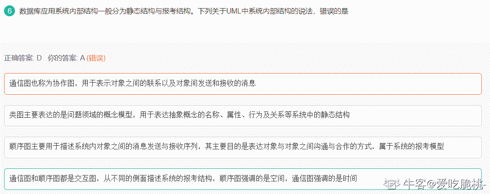

# 浩鲸科技 2020 届数据库 A 卷

## 1

数据库设计的根本目标是要解决

正确答案: A   你的答案: 空 (错误)

```cpp
数据共享问题
```

```cpp
数据安全问题
```

```cpp
大量数据存储问题
```

```cpp
简化数据维护
```

本题知识点

数据库工程师 浩鲸云 2020

讨论

[爱吃脆桃-](https://www.nowcoder.com/profile/448444725)

数据库设计的根本目标是要解决 数据共享问题

发表于 2021-12-18 15:08:54

* * *

## 2

Access 数据库的类型是

正确答案: C   你的答案: 空 (错误)

```cpp
层次数据库
```

```cpp
网状数据库
```

```cpp
关系数据库
```

```cpp
面向对象数据库
```

本题知识点

数据库工程师 浩鲸云 2020

## 3

在数据库视图中，不能

正确答案: D   你的答案: 空 (错误)

```cpp
修改字段的类型
```

```cpp
修改字段的名称
```

```cpp
删除一个字段
```

```cpp
删除一天记录
```

本题知识点

数据库工程师 浩鲸云 2020

讨论

[牛客 361652190 号](https://www.nowcoder.com/profile/361652190)

这题目的答案有问题，视图是可以删除一天的记录的。例如：
DELETE FROM `sname` WHERE  `date` < 开始日期   and `date` > 结束日期正确答案应该是：

```cpp
A  修改字段的类型 这个是无法执行修改字段类型的，

B 和 C D 都可以操作，

```

发表于 2021-04-26 02:18:18

* * *

## 4

关于商场的 DBAS，设有如下数据内容：
Ⅰ.数据库结构说明    Ⅱ.顾客名单
Ⅲ.数据清洗规则      Ⅳ.订单细节数据
V.商品分类销售汇总数据
上述选项中是元数据的是

正确答案: C   你的答案: 空 (错误)

```cpp
仅Ⅰ、Ⅱ、Ⅲ和Ⅳ
```

```cpp
仅Ⅰ、Ⅱ、Ⅲ和 V
```

```cpp
仅Ⅰ和Ⅲ
```

```cpp
全部都是
```

本题知识点

数据库工程师 浩鲸云 2020

讨论

[牛客 280427523 号](https://www.nowcoder.com/profile/280427523)

元数据（MetaData），是指定义数据结构的数据。那么数据库元数据就是指定义数据库各类对象结构的数据。 例如数据库中的数据库名，表明， 列名、用户名、版本名以及从 SQL 语句得到的结果中的大部分字符串是元数据

发表于 2021-08-31 21:25:50

* * *

## 5

在进行事务设计时，如果使用行级锁来代替表级锁，则下列关于这种做法所带来的影响的叙述，正确的是

正确答案: A   你的答案: 空 (错误)

```cpp
降低了发生死锁的可能性
```

```cpp
降低了发生活锁的可能性
```

```cpp
降低了事务的并发度
```

```cpp
降低了出现不一致现象的可能性
```

本题知识点

数据库工程师 浩鲸云 2020

讨论

[牛客 712307950 号](https://www.nowcoder.com/profile/712307950)

表级锁不是不会产生死锁么，行级锁会产生死锁

发表于 2022-02-23 19:26:44

* * *

[牛客 486342890 号](https://www.nowcoder.com/profile/486342890)

事务中为了降低死锁的发生，通常考虑以下法则：按同一顺序访问资源、避免事务中的用户交互、采用小事务模式，尽量缩短事务的长度，减少占有锁的时间、尽量使用记录级别的锁(行锁)，少使用表级别的锁、使用绑定连接，使同一应用程序所打开的两个或多个连接可以相互合作。故答案为 A 项。

发表于 2021-09-10 10:51:35

* * *

## 6

数据库应用系统内部结构一般分为静态结构与报考结构。下列关于 UML 中系统内部结构的说法，错误的是

正确答案: D   你的答案: 空 (错误)

```cpp
通信图也称为协作图，用于表示对象之间的联系以及对象间发送和接收的消息
```

```cpp
类图主要表达的是问题领域的概念模型，用于表达抽象概念的名称、属性、行为及关系等系统中的静态结构
```

```cpp
顺序图主要用于描述系统内对象之间的消息发送与接收序列，其主要目的是表达对象与对象之间沟通与合作的方式，属于系统的报考模型
```

```cpp
通信图和顺序图都是交互图，从不同的侧面描述系统的报考结构，顺序图强调的是空间，通信图强调的是时间
```

本题知识点

数据库工程师 浩鲸云 2020

讨论

[爱吃脆桃-](https://www.nowcoder.com/profile/448444725)



发表于 2021-12-18 15:11:21

* * *

## 7

数据库管理员是数据库的主要维护者，设有如下针对数据库的工作：
Ⅰ.数据库的转储和恢复
Ⅱ.数据库的安全性、完整性控制
Ⅲ.数据库性能的监控分析和改进
Ⅳ.数据库的重组和重构
以上工作属于数据库管理员职责的是

正确答案: D   你的答案: 空 (错误)

```cpp
仅Ⅰ和Ⅱ
```

```cpp
仅Ⅰ和Ⅲ
```

```cpp
仅Ⅱ和Ⅳ
```

```cpp
Ⅰ、Ⅱ、Ⅲ和Ⅳ
```

本题知识点

数据库工程师 浩鲸云 2020

## 8

设在 SQL Server 2008 中，有如下创建分区函数的语句：
CREATE PARTITION FUNCTlON PF1(int)
AS RANGE LEFT FOR VALUES(1，100，200)
该语句的作用是

正确答案: B   你的答案: 空 (错误)

```cpp
创建了 2 个分区，各分区的取值范围分别是： 分区 1：大于等于 1 且小于 100 分区 2：大于等于 100 且小于 200
```

```cpp
创建了 4 个分区，各分区的取值范围分别是： 分区 1：小于等于 1 分区 2：大于 1 且小于等于 100 分区 3：大于 100 且小于等于 200 分区 4：大于 200
```

```cpp
创建了 2 个分区，各分区的取值范围分别是： 分区 1：大于 1 且小于等于 100 分区 2：大于 100 且小于等于 200
```

```cpp
创建了 4 个分区，各分区的取值范围分别是： 分区 1：小于 1 分区 2：大于等于 1 且小于 100 分区 3：大于等于 100 且小于 200 分区 4：大于等于 200
```

本题知识点

数据库工程师 浩鲸云 2020

## 9

关于优化查询说法正确的是

正确答案: A   你的答案: 空 (错误)

```cpp
避免或简化排序的目的是实现查询优化
```

```cpp
在保证数据库一致性的前提下，将频繁操作的多个可以分割的处理过程放在一个存储过程中，这样可以大大提高系统的响应速度
```

```cpp
使用临时表会占用较多的系统资源，尤其对于大规模并发量的情况下，很容易使得系统资源耗尽而崩溃
```

```cpp
相关子查询的使用可以加速查询
```

本题知识点

数据库工程师 浩鲸云 2020

讨论

[wj9](https://www.nowcoder.com/profile/351585011)

在保证数据库一致性的前提下，将频繁操作的多个可以分割的处理过程放在***多个***存储过程中，这样可以大大提高系统的响应速度，B 错。使用游标会占用较多的系统资源，尤其对于大规模并发量的情况下，很容易使得系统资源耗尽而崩溃，而使用临时表能够加速查询。C 错相关子查询的不可以加速查询。D 错

发表于 2021-09-18 11:19:48

* * *

## 10

现有课程表(课程号，课程名，学分，开课学期，课程性质)，课程号为主码。该表数据量较大。设经常要对该表执行类似下面的查询：
SELECT 丰 FROM 课程表 WHERE 课程名=′数据库原理′
为提高这类查询的执行效率，下列物理设计方案中，正确且为合理的是

正确答案: C   你的答案: 空 (错误)

```cpp
为课程名列建立一个主索引
```

```cpp
为课程名列建立一个位图索引
```

```cpp
为课程名列建立一个辅索引
```

```cpp
此表上不需要建任何索引
```

本题知识点

数据库工程师 浩鲸云 2020

## 11

下列关于 SQL Server 2008 游标中@@FETCH_STATUS 的说法，正确的是

正确答案: D   你的答案: 空 (错误)

```cpp
每当对游标执行一次 FETCH 语句，系统都会自动对@@FETCH_STATUS 赋一次值
```

```cpp
用户可以对@@FETCH_STATUS 变量进行赋值
```

```cpp
用户可以在游标中声明@@FETCH_STATUS 变量
```

```cpp
游标读取下一条数据是否成功。
```

本题知识点

数据库工程师 浩鲸云 2020

## 12

Oracle 什么函数用来计算累计排名、移动平均数等

正确答案: B   你的答案: 空 (错误)

```cpp
汇总
```

```cpp
分析
```

```cpp
分组
```

```cpp
单行
```

本题知识点

数据库工程师 浩鲸云 2020

讨论

[橙成 i](https://www.nowcoder.com/profile/132374936)

分析函数

发表于 2021-07-21 09:31:34

* * *

## 13

在列的取值重复率比较高的列上，适合创建（  ）索引

正确答案: D   你的答案: 空 (错误)

```cpp
标准
```

```cpp
唯一
```

```cpp
分区
```

```cpp
位图
```

本题知识点

数据库工程师 浩鲸云 2020

## 14

设有一个关系：DEPT（DNO，DNAME,LOC），如果要找出倒数第三个字母为 W，并且至少包含 4 个字母的 DNAME，则查询条件子句应写成 WHERE DNAME LIKE （ ） 

正确答案: C   你的答案: 空 (错误)

```cpp
‘_ _ W _ %’
```

```cpp
‘_ % W _ _’
```

```cpp
‘%_ W _ _’
```

```cpp
‘_ W _ %’
```

本题知识点

数据库工程师 浩鲸云 2020

讨论

[默尘！](https://www.nowcoder.com/profile/678435231)

C 答案的最左边应该还差个%吧……

发表于 2021-04-10 14:05:54

* * *

[牛客 873261577 号](https://www.nowcoder.com/profile/873261577)

B 为什么不对呢

发表于 2021-07-21 19:03:42

* * *

## 15

分析下面两个 SQL 语句，选项中说法正确的有( )
SELECT last_name, salary , hire_date
FROM EMPLOYEES
ORDER BY salary DESC;

SELECT last_name, salary , hire_date
FROM EMPLOYEES
ORDER BY 2 DESC;

正确答案: A   你的答案: 空 (错误)

```cpp
两个 SQL 语句的结果完全相同
```

```cpp
第二个 SQL 语句产生语法错误
```

```cpp
没有必要指定排序方式为 desc，因为默认的排序方式是降序排序
```

```cpp
可以通过为第二个 SQL 语句的 salary 列添加列别名来使两个 SQL 语句得到相同的结果
```

本题知识点

数据库工程师 浩鲸云 2020

讨论

[牛客 48890213 号](https://www.nowcoder.com/profile/48890213)

对查询字段中的第二个字段排序

发表于 2021-04-12 16:28:20

* * *

## 16

在 PL/SQL 代码段的异常处理块中，捕获所有异常的关键词是

正确答案: C   你的答案: 空 (错误)

```cpp
OTHERS 
```

```cpp
ALL  
```

```cpp
Exception 
```

```cpp
ERRORS
```

本题知识点

数据库工程师 浩鲸云 2020

## 17

MySql 中查找姓名不为空的记录

正确答案: C   你的答案: 空 (错误)

```cpp
WHERE NAME ! NULL
```

```cpp
WHERE NAME NOT NULL
```

```cpp
WHERE NAME IS NOT NULL
```

```cpp
WHERE NAME!= NULL
```

本题知识点

数据库工程师 浩鲸云 2020

讨论

[△ABC.](https://www.nowcoder.com/profile/885910839)

查找属性值为空（NULL）的元组用 IS，查找值不为空的元组用 IS NOT NULL，NULL 不可以用=或!=查询

发表于 2021-04-14 09:30:35

* * *

## 18

ORACLE 下面哪个 sql 语句显示 1890.55 as $1,1890.55?(    )[多选]

正确答案: A   你的答案: 空 (错误)

```cpp
SELECT TO_CHAR(1890.55,'$0G000D00') FROM DUAL;
```

```cpp
SELECT TO_CHAR(1890.55,'$9,999V99') FROM DUAL;
```

```cpp
SELECT TO_CHAR(1890.55,'$99,999D99') FROM DUAL;
```

本题知识点

数据库工程师 浩鲸云 2020

## 19

MySql 支持哪些逻辑运算符（   ）【多选】

正确答案: C   你的答案: 空 (错误)

```cpp
&&
```

```cpp
||
```

```cpp
NOT
```

本题知识点

数据库工程师 浩鲸云 2020

## 20

试说出数据库设计的基本步骤。

你的答案

本题知识点

数据库工程师 浩鲸云 2020

讨论

[牛客 48890213 号](https://www.nowcoder.com/profile/48890213)

需求分析阶段概念结构设计阶段 逻辑结构设计阶段 数据库物理设计阶段 数据库实施阶段 数据运行和维护阶段

发表于 2021-04-12 16:30:08

* * *

[brtant](https://www.nowcoder.com/profile/916461397)

数据库设计通常分为 6 个阶段 1（需求分析：分析用户的需求，包括数据、功能和性能需求；2 概念结构设计：主要采用 E-R 模型进行设计，包括画 E-R 图；3 逻辑结构设计：通过将 E-R 图转换成表，实现从 E-R 模型到关系模型的转换；4 数据库物理设计：主要是为所设计的数据库选择合适的存储结构和存取路径；5 数据库的实施：包括编程、测试和试运行；6 数据库运行与维护：系统的运行与数据库的日常维护。）

发表于 2022-02-17 17:15:39

* * *

## 21

简述事务所具有的 ACID 特性

你的答案

本题知识点

数据库工程师 浩鲸云 2020

讨论

[brtant](https://www.nowcoder.com/profile/916461397)

原子性（atomicity）：事务的所有操作在数据库中要么全部反映出来，要么完全不反映。

一致性（consistency）：隔离执行事务时（换言之，在没有其他事务并发执行的情况下）保持数据库的一致性。

隔离性（isolation）：尽管多个事务可能并发执行，但系统保证，对于任何一对事务 Ti 和 Tj，在 Ti 看来，Tj 或者在 Ti 开始之前已经完成执行，或者在 Ti 完成之后开始执行。因此，每个事务都感觉不到系统中有其他事务在并发执行。

持久性（durability）：一个事物成功完成后，它对数据库的改变必须是持久的，即使出现系统故障。

发表于 2022-02-17 17:16:06

* * *

[牛客 48890213 号](https://www.nowcoder.com/profile/48890213)

Atomic(原子性)、Consistency(一致性)、Isolation(隔离性)和 Durability(持久性) 1、原子性--事务是一个不可分割的单位 2、一致性--事务对数据库操作的结果是将数据库从一个一致性状态变为另一个一致性状态 3、隔离性--多个事务的并发执行不互相干扰 4、持续性--事务一旦提交，它对数据库中的数据的改变就是永久性的

编辑于 2021-04-12 16:32:25

* * *

## 22

怎么优化 Oracle 数据库，有几种方式？

你的答案

本题知识点

数据库工程师 浩鲸云 2020

讨论

[牛客 362355634 号](https://www.nowcoder.com/profile/362355634)

物理优化的一些原则：
1). Oracle 的运行环境（网络，硬件等）

2). 使用合适的优化器

3). 合理配置 oracle 实例参数

修改最大连接数：alter system set processes=2000 scope = spfile;

禁止回收站功能：alter system set recyclebin=off scope=spfile;

4). 建立合适的索引（减少 IO）

5). 将索引数据和表数据分开在不同的表空间上（降低 IO 冲突）

6). 建立表分区，将数据分别存储在不同的分区上（以空间换取时间，减少 IO）

逻辑上优化(开发有关)：
1). 可以对表进行逻辑分割，如中国移动用户表，可以根据手机尾数分成 10 个表，这样对性能会有一定的作用

sql 语句上的优化

2). Sql 语句使用占位符语句，并且开发时候必须按照规定编写 sql 语句（如全部大写，全部小写等）oracle 解析语句后会放置到共享池中

发表于 2021-06-30 10:48:48

* * *

## 23

ORACLE 数据库中某个表的数据被误删除做了 delete 操作，如何恢复？

你的答案

本题知识点

数据库工程师 浩鲸云 2020

讨论

[橙成 i](https://www.nowcoder.com/profile/132374936)

一：根据时间来恢复：

1、查询数据库当前时间（）

select  to_char(sysdate,'yyyy-mm-dd hh24:mi:ss') from dual;

2、查询删除数据时间点之前的数据

select * from 表名 as of timestamp to_timestamp('2020-08-06 10:12:11','yyyy-mm-dd hh24:mi:ss')；

（若没有数据 ，将时间继续提前）

3、恢复数据

flashback table 表名 to timestamp to_timestamp('2020-08-06 10:12:11','yyyy-mm-dd hh24:mi:ss');

数据恢复成功；

但是也可能会出现问题，比如报错：ORA-08189：未启用行移动功能，不能闪回表；

执行下面操作；

alter table 表名 enable row movement;

然后再次执行上面 SQL 即可；

二：根据数据库 SCN 恢复数据

1、查询当前数据库 SCN 号

select current_scn from v$database;(若不能执行，切换到 sys 用户或 system 用户查询)    

查询到的当前值为：91792986

2、缩小 SCN 号查询被删除表数据（若无数据继续缩小 SCN，由于数据库操作不止一人，SCN 号变化比较多，可以多缩小几个号）

select * from 表名 as of scn 91792986;

3、恢复数据

flashback table 表名 to scn 91792986;

恢复完成。若报错：ORA-08189：未启用行移动功能，不能闪回表；结果方案同上。

发表于 2021-07-21 09:24:03

* * *

## 24

使用 SQL 语言完成下列操作
1) 创建基本表 S，要求：S#为 6 位字符，且不能有重复或者空缺；性别为“男”或者“女”；年龄必须在 15 至 30 岁之间；该关系的主码为 S#。

2) 按学号从小到大为关系 S 建立索引文件'ISS'。

你的答案

本题知识点

数据库工程师 浩鲸云 2020

## 25

输出倒置的九九乘法表
9*9=81  9*8=72 9*7=63.....................

你的答案

本题知识点

数据库工程师 浩鲸云 2020

## 26

写一个存储过程，使 employee(name,age,emp_no,salary)表中的 salary 值在 0-1000 之间的员工的工资上涨 20%，（提示：要求用到游标）

你的答案

本题知识点

数据库工程师 浩鲸云 2020

讨论

[牛客 84701662 号](https://www.nowcoder.com/profile/84701662)

用了自己的表 DROP PROCEDURE IF EXISTS add_salary;CREATE PROCEDURE add_salary(IN num1 INT,IN num2 INT)
BEGIN
DECLARE ids INT;
DECLARE sal INT;
DECLARE add_sal INT;
DECLARE yy INT DEFAULT 0;
DECLARE salary_csr CURSOR FOR SELECT id,salary FROM em_salary WHERE salary BETWEEN num1 AND num2;
DECLARE CONTINUE HANDLER FOR NOT found SET yy = 1;
OPEN salary_csr;
    WHILE yy != 1 DO
        FETCH salary_csr INTO ids,sal;
        SET add_sal= sal+sal*0.2;
        UPDATE em_salary SET salary = add_sal WHERE id = ids;
    END WHILE;
CLOSE salary_csr;

END;

发表于 2021-05-18 14:18:19

* * *