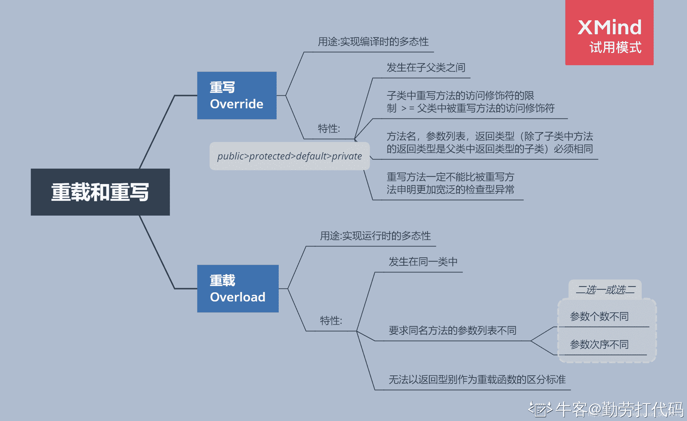

# 浩鲸科技 2020 届 java 笔试

## 1

编写 Java  Application 程序，查找出字符串 str 中字符 A，替换成字符 B，并统计替换的次数。【注】不可以使用 Java 的内置函数，如 index()、replace()等。

本题知识点

Java 工程师 浩鲸云 2020

讨论

[牛客 876260660 号](https://www.nowcoder.com/profile/876260660)

```cpp
public class Main {
    public static void main(String[] args) {
        String str = "dsafanfvapdifiaiogfa";
        char A = 'a';
        char B = 'b';
        String s = "";
        int count = 0;
        for (int i = 0; i < str.length(); i++) {
            if (str.charAt(i) == A) {
                s = s + B;
                count++;
            } else {
                s = s + str.charAt(i);
            }
        }
        System.out.println("String:" + s);
        System.out.println("count:" + count);
    }
}
```

发表于 2021-04-30 14:36:29

* * *

[牛客 471114419 号](https://www.nowcoder.com/profile/471114419)

只有一个测试实例所以用简单的方法 public class Main{

    public static void main(String[] args){

        StringBuilder sb=new StringBuilder("Result String:dsbfbnfvbpdifibiogfb");

        sb.append("\nA count:5");
        System.out.println(sb.toString());
    }
}

发表于 2022-02-13 09:03:57

* * *

[牛客 937147598 号](https://www.nowcoder.com/profile/937147598)

```cpp
public class Main { public static void main(String[] args){
        String str = "dsafanfvapdifiaiogfa"; char A = 'a'; char B = 'b'; int count = 0;  char[] chars = str.toCharArray();  for(int i=0;i<chars.length;i++){ if(chars[i]==A){
                chars[i] = B;  count++;  }
            System.out.print(chars[i]);  }
        System.out.println();  System.out.println("A count:" + count);   }
}
```

发表于 2021-08-13 10:21:04

* * *

## 2

输入一个 int 型整数，按照从右向左的阅读顺序，返回一个不含重复数字的新的整数。

本题知识点

Java 工程师 C++工程师 浩鲸云 2019 2020

讨论

[郫县男子计院](https://www.nowcoder.com/profile/328790495)

```cpp
import java.util.*;
public class Main{
    public static void main(String[] arsg){
        Scanner s = new Scanner(System.in);
        int a = s.nextInt();
        StringBuilder sb = new StringBuilder();
        int[] used = new int[10];
        while(a != 0){
            int t = a % 10;
            a = a / 10;
            if(used[t] != 1){
                sb.append(t);
                used[t] = 1;
            }
        }
        System.out.println(sb);
    }
}

```

 发表于 2020-02-27 11:47:24

* * *

[夏已离去](https://www.nowcoder.com/profile/7131397)

#include <iostream>using namespace std;
int main(){
    int number,result=0;
    int temp[10]={0};//标记数组，保证数字只出现一次
    cin>>number;
    while(number>0){
        if(temp[number%10]==0){
            temp[number%10] = 1;
            result = result*10+number%10;
        }
        number = number/10;
    }
    cout<<result;
    return 0;
}

发表于 2020-03-01 12:56:09

* * *

[牛客 199026547 号](https://www.nowcoder.com/profile/199026547)

```cpp
import java.util.*;
public class Main{
    public static void main(String[] args){
        Scanner sc = new Scanner(System.in);
        int i = sc.nextInt();
        String j = i+"";
        Set<String> set = new HashSet<String>();
        for(int t = j.length()-1;t>=0;t--){
            char tmp = j.charAt(t);
            if(!set.contains(tmp+"")){
                System.out.print(tmp);
                set.add(tmp+"");
            }

        }

    }
}
```

发表于 2020-02-27 17:40:52

* * *

## 3

下列 LINUX 系统的键盘命令中，显示当前工作目录的命令是

正确答案: C   你的答案: 空 (错误)

```cpp
ls 命令
```

```cpp
cd 命令
```

```cpp
pwd 命令
```

```cpp
cat 命令
```

本题知识点

Java 工程师 浩鲸云 2020

讨论

[默尘！](https://www.nowcoder.com/profile/678435231)

ls 查看当前目录下的文件与文件夹列表 cd 进入文件夹命令 pwd 查看当前目录路径 cat 查看当前文件

发表于 2021-04-10 13:12:11

* * *

[修狗](https://www.nowcoder.com/profile/434913473)

cat：看最后一屏

发表于 2022-03-17 00:37:11

* * *

## 4

下面哪种方式不可以实现数据约束

正确答案: D   你的答案: 空 (错误)

```cpp
NOT NULL
```

```cpp
UNIQUE INDEX
```

```cpp
PRIMARY KEY
```

```cpp
非唯一索引 INDEX
```

本题知识点

Java 工程师 浩鲸云 2020

讨论

[倔强小头](https://www.nowcoder.com/profile/650880653)

a 非空 b 唯一 c 唯一且非空

发表于 2021-04-20 09:13:28

* * *

## 5

在往个表插入记录时，有 10 条成功，5 条失败，数据还没有提交，需要把所有数据回退，选择下面的命令

正确答案: B   你的答案: 空 (错误)

```cpp
DELETE
```

```cpp
ROLLBACK
```

```cpp
UNCOMMIT
```

```cpp
TRUNCATE TABLE
```

本题知识点

Java 工程师 浩鲸云 2020

讨论

[蜡笔侠](https://www.nowcoder.com/profile/164659106)

答案选对了，给我自动报错

发表于 2021-06-23 10:29:29

* * *

[Xld01](https://www.nowcoder.com/profile/7509418)

ROLLBACK 命令撤消当前事务期间执行的所有数据库更新，并结束当前事务。

发表于 2021-04-11 00:06:29

* * *

## 6

下列语句与事务控制无关的是

正确答案: D   你的答案: 空 (错误)

```cpp
COMMIT
```

```cpp
SAVEPOINT
```

```cpp
ROLLBACK
```

```cpp
SAVEBACK
```

本题知识点

Java 工程师 浩鲸云 2020

讨论

[songlan2017](https://www.nowcoder.com/profile/434324074)

b 是回退点 d 在事物中没有 中文意思回存

编辑于 2021-04-15 11:13:58

* * *

## 7

下面关于视图说法正确的是

正确答案: A   你的答案: 空 (错误)

```cpp
可以创建只读视图 A view can be created as read only.
```

```cpp
视图中的 select 语句可以有 ORDER BY
```

```cpp
视图中的 select 语句不能有 GROUP BY.
```

```cpp
视图中的 SELECT 语句必须为每列定义别名
```

本题知识点

Java 工程师 浩鲸云 2020

讨论

[剑来 4396](https://www.nowcoder.com/profile/258842383)

题目含糊不清，mysql 里没有只读视图，select 语句可以有 order by。

发表于 2021-07-06 23:27:19

* * *

[洛理巴菲特](https://www.nowcoder.com/profile/154152918)

select * from (

select ... from A? union ?select ...from B order by B.xx

) as Tmp

SQL 查询分析器中老是报错：The ORDER BY clause is invalid in views, inline functions, derived tables, and subqueries, unless TOP is also specified.

而单独执行 select ... from A? union ?select ...from B order by B.xx 语句时是可以的。

后来分析原因如下：

sql 中建 view 是不能用 order by 字句的，即：

如果把该查询语句建成视图
? create view v_test
? as
? select * from sysobjects order by name
? 会提示出错:
The ORDER BY clause is invalid in views, inline functions, derived tables, and subqueries, unless TOP is also specified.

而在嵌套查询中，系统会自动为 select ... from A? union ?select ...from B order by B.xx 语句建一个 view，里面有 order by 字句，当然会报错了，去掉 order by 后，运行成功！

发表于 2021-04-26 22:50:41

* * *

## 8

已知表 T1 和 T2 的字段定义完全相同，T1 中有 2 行不同数据，T2 中有 3 行不同数据，其中 T1 中 2 条数据存在于表 T2 中，语句”select * from T1 union select * from T2”，返回的行数为

正确答案: B   你的答案: 空 (错误)

```cpp
2
```

```cpp
3
```

```cpp
5
```

```cpp
6
```

本题知识点

Java 工程师 浩鲸云 2020

讨论

[ziqia](https://www.nowcoder.com/profile/402785638)

UNION ALL 不去重，UNION 去重

发表于 2021-04-23 19:41:17

* * *

[修狗](https://www.nowcoder.com/profile/434913473)

[union](https://so.csdn.net/so/search?q=union&spm=1001.2101.3001.7020)和 union all 的区别是,union 会自动压缩多个结果集合中的重复结果，而 union all 则将所有的结果全部显示出来，不管是不是重复。

发表于 2022-03-20 11:04:23

* * *

[Dwjun](https://www.nowcoder.com/profile/940879653)

UNION 操作符：合并两个或多个 SELECT 语句的结果。

发表于 2021-12-07 16:13:04

* * *

## 9

要计算表 student 中 score*0.8 的值，并生成别名 ScoreA 的 SQL 语句是

正确答案: C   你的答案: 空 (错误)

```cpp
SELECT SCORE*0.8 ‘ScoreA’FROM student
```

```cpp
SELECT SCORE*0.8 “ScoreA”FROM student
```

```cpp
SELECT SCORE*0.8  AS ScoreA FROM student
```

```cpp
SELECT SCORE*0.8  AS‘ScoreA’FROM student
```

本题知识点

Java 工程师 浩鲸云 2020

讨论

[牛客 163562670 号](https://www.nowcoder.com/profile/163562670)

```cpp
1 别名不可以用''引起来
2 别名可以用""引起来
3 别名前面用不用 as 都可以
 oracle 中 BC 都正确
以下写法均正确
SELECT SCORE*0.8  AS ScoreA FROM student
SELECT SCORE*0.8  ScoreA FROM student
SELECT SCORE*0.8  AS "ScoreA" FROM student
SELECT SCORE*0.8  "ScoreA" FROM student
至于前面有人说的空格问题
AS 和别名之间需不需要空格都可以，不管别名有没有被引起来
别名和 from 之间，如果有引号就可以省略空格，没引号则不能省略，别名和 from 必须用空格隔开

```

发表于 2021-04-28 17:18:00

* * *

[sias 杰](https://www.nowcoder.com/profile/125424054)

注意一下空格

发表于 2021-04-18 20:54:59

* * *

[深大打工人](https://www.nowcoder.com/profile/762032692)

少空格是真的没想到🙃

发表于 2021-04-18 11:12:51

* * *

## 10

下列哪个数据库对象不能直接从 select 语句中引用

正确答案: C   你的答案: 空 (错误)

```cpp
表
```

```cpp
序列
```

```cpp
索引
```

```cpp
视图
```

本题知识点

Java 工程师 浩鲸云 2020

讨论

[Faith_](https://www.nowcoder.com/profile/111283386)

索引是记录文件位置的特殊文件结构,他是保存在磁盘上的,所以不能直接被 sql 引用,其他如视图,表和序列都是数据库对象,可以直接引用.

发表于 2021-04-11 13:42:41

* * *

[村雨遥](https://www.nowcoder.com/profile/806383223)

答案：索引

理由如下：

数据库执行 SQ L 的时候不用指定索引，我们查询的是表或者视图，索引是建立在对应的表上的，我们去查询这个表时，数据库会通过内部优化器去判断是否要用索引，如果执行计划觉得索引不好就不会用到。

发表于 2021-04-11 16:59:22

* * *

## 11

以下哪个命令是隐式提交事务的

正确答案: D   你的答案: 空 (错误)

```cpp
COMMIT
```

```cpp
UPDATE
```

```cpp
DELETE
```

```cpp
CREATE
```

本题知识点

Java 工程师 浩鲸云 2020

讨论

[songlan2017](https://www.nowcoder.com/profile/434324074)

1、正常执行完 DDL 语句。包括 create，alter，drop，truncate，rename。 2、正常执行完 DCL 语句。包括 grant，revoke。 3、正常退出数据库管理软件，没有明确发出 commit 或者 rollback。 除了基本的查询语句与增删改的对表的操纵语句外基本都是隐式提交的，使用时要注意。

发表于 2021-04-15 11:24:27

* * *

## 12

下列数组初始化正确的是

正确答案: C   你的答案: 空 (错误)

```cpp
int[5] a= {1,2,3,4,5};
```

```cpp
Integer[2][2] a =  {{new Integer(1), new Integer(2)},{new Integer(3),new Interger(4)}};
```

```cpp
char[][] a = {{‘2’,’3’,’4’,’5’},new char[3]};
```

```cpp
Float[][] a = new Float[][5];
```

本题知识点

Java 工程师 浩鲸云 2020

讨论

[宜乐](https://www.nowcoder.com/profile/300822629)

AB，左半部分不应该指定大小 D，右半部分应该制定所有维度的大小

发表于 2021-04-13 15:52:49

* * *

## 13

在 Java 中，下面关于构造函数的描述正确的是

正确答案: D   你的答案: 空 (错误)

```cpp
类必须有显式构造函数
```

```cpp
它的返回类型是 void
```

```cpp
它和类有相同的名称，但它不能带任何参数
```

```cpp
以上描述全不对
```

本题知识点

Java 工程师 浩鲸云 2020

讨论

[牛客 589226075 号](https://www.nowcoder.com/profile/589226075)

忘了，构造方法没有返回类型。void 也没有，，，

发表于 2021-04-15 19:16:46

* * *

[goodgoodStudy12308](https://www.nowcoder.com/profile/252733296)

构造函数没有返回类型？

发表于 2021-04-11 17:27:09

* * *

## 14

提供 Java 存取数据库能力的包是

正确答案: A   你的答案: 空 (错误)

```cpp
java.sql
```

```cpp
java.awt
```

```cpp
java.lang
```

```cpp
java.swing
```

本题知识点

Java 工程师 浩鲸云 2020

## 15

下面关于 finally 子句正确的说法是

正确答案: D   你的答案: 空 (错误)

```cpp
finally 子句执行是在出现异常后执行的，若是没有出现异常将不执行
```

```cpp
A） finally 子句一般用来释放资源的，但是不能再次去占用资源
```

```cpp
A） finally 子句中不能再抛出异常
```

```cpp
A） finally 字句无论出现异常已否，都将被执行
```

本题知识点

Java 工程师 浩鲸云 2020

讨论

[牛客 254296252 号](https://www.nowcoder.com/profile/254296252)

```cpp
public static void main(String []args){
        try {
            System.exit(0);
        }finally {
            System.out.println("finally 执行");
        }
    }
```

这种代码 D 怎么解释呢？
 发表于 2021-06-27 20:33:13

* * *

## 16

下列哪个语句关于内存回收的说明是正确的

正确答案: B   你的答案: 空 (错误)

```cpp
程序员必须创建一个线程来释放内存
```

```cpp
内存回收程序负责释放无用内存
```

```cpp
内存回收程序允许程序员直接释放内存
```

```cpp
内存回收程序可以在指定的时间释放内存对象
```

本题知识点

产品运营 乐信 Java 工程师 C++工程师 浩鲸云 2020 2019

讨论

[柠檬精-.-](https://www.nowcoder.com/profile/103073577)

B 正确，A：有 GC 线程，无需创建 C：java 当中，内存的回收由 GC 完成，程序员不能直接释放内存，只能通过 System.gc()提醒 GC 进行垃圾回收，GC 不一定会回收 D；只能 System.gc()提醒，不能指定时间

发表于 2019-09-15 17:01:10

* * *

[胤泣](https://www.nowcoder.com/profile/85692392)

多选可以只选一个？

发表于 2022-03-15 18:29:58

* * *

[Java 后端练习生](https://www.nowcoder.com/profile/534037268)

B 正确，A：有 GC 线程，无需创建 C：java 当中，内存的回收由 GC 完成，程序员不能直接释放内存，只能通过 System.gc()提醒 GC 进行垃圾回收，GC 不一定会回收 D；只能 System.gc()提醒，不能指定时间

发表于 2021-04-15 13:05:48

* * *

## 17

“导入一个类”表示

正确答案: D   你的答案: 空 (错误)

```cpp
这个类成为本地包的一个成员，可以访问它的所有包级、保护级、公开级成员
```

```cpp
这个类成为本地包的一个成员，但只能访问它的公开级成员
```

```cpp
这个类成为本地包的一个成员，可以访问它的全部成员
```

```cpp
这个类依然属于其它包，只能访问它的公开级成员
```

本题知识点

Java 工程师 浩鲸云 2020

讨论

[清风陪我度良辰](https://www.nowcoder.com/profile/72442967)

如果这个类是其他包的类，只能访问 public 修饰的成员，其他的访问修饰符有 protected ,default,private

发表于 2021-04-18 14:48:34

* * *

## 18

对字节进行输入操作一般继承与以下的哪个选项是

正确答案: D   你的答案: 空 (错误)

```cpp
Reader
```

```cpp
Writer
```

```cpp
OutputStream
```

```cpp
InputStream
```

本题知识点

Java 工程师 浩鲸云 2020

讨论

[Java 后端练习生](https://www.nowcoder.com/profile/534037268)

InputStream 字节输入流 OutputStream 字节输出流 Reader 字符输入流 Writer 字符输出流

发表于 2021-04-15 13:30:01

* * *

## 19

代码 int[] arr = new int[5]执行后，关于数组 arr 描述正确的是

正确答案: A   你的答案: 空 (错误)

```cpp
arr[4]为 0
```

```cpp
arr[4]未定义
```

```cpp
arr[5]为 0
```

```cpp
arr[5]为空
```

本题知识点

Java 工程师 浩鲸云 2020

讨论

[清风陪我度良辰](https://www.nowcoder.com/profile/72442967)

遍历数组，默认都为 0，下标最大是 4

发表于 2021-04-18 14:51:35

* * *

## 20

声明成员变量时，如果不适用任何访问控制符（publiC）protecteD）private），则一下哪种类型的类不能对该成员进行直接访问

正确答案: D   你的答案: 空 (错误)

```cpp
同一个类
```

```cpp
同一包中子类
```

```cpp
同一个包中的非子类
```

```cpp
不同包中的子类
```

本题知识点

Java 工程师 浩鲸云 2020

讨论

[Xld01](https://www.nowcoder.com/profile/7509418)

默认为 default，只有同一包内可见

发表于 2021-04-11 00:29:16

* * *

[孙笑川川子](https://www.nowcoder.com/profile/924859209)

补充， 跨包子类:protected 可见，缺省不可见 跨包非子类:protected 不可见

发表于 2022-02-15 16:47:55

* * *

[趁年轻不如拼一拼](https://www.nowcoder.com/profile/76247111)

饶了一大圈，无非就是想问【缺省的】访问权限修饰符。

发表于 2022-01-05 12:44:18

* * *

## 21

要保证数据库逻辑数据独立性，需要的是

正确答案: C   你的答案: 空 (错误)

```cpp
模式
```

```cpp
模式与内模式的映射
```

```cpp
模式与外模式的映射
```

```cpp
外模式
```

本题知识点

Java 工程师 浩鲸云 2020

讨论

[修狗](https://www.nowcoder.com/profile/434913473)

数据独立性是指应用程序和[数据结构](https://so.csdn.net/so/search?q=%E6%95%B0%E6%8D%AE%E7%BB%93%E6%9E%84&spm=1001.2101.3001.7020)之间相互独立，互不影响

发表于 2022-03-20 17:19:38

* * *

[Java 后端练习生](https://www.nowcoder.com/profile/534037268)

要保证数据库逻辑数据独立性，需要的是模式与外模式的映射。

发表于 2021-04-15 13:33:09

* * *

[yulinet](https://www.nowcoder.com/profile/480112312)

这题没有问题吗。。。？

发表于 2021-04-13 16:10:12

* * *

## 22

Java 的整数数据类型中，需要内存空间最少的是

正确答案: D   你的答案: 空 (错误)

```cpp
long
```

```cpp
int
```

```cpp
short
```

```cpp
byte
```

本题知识点

Java 工程师 浩鲸云 2020

讨论

[小刀配](https://www.nowcoder.com/profile/79115458)

byte 是整数吗

发表于 2021-04-09 20:16:06

* * *

[修狗](https://www.nowcoder.com/profile/434913473)

1\. 位(bit)
来自英文 bit，音译为“比特”，表示二进制位。位是计算机内部数据储存的最小单位，11010100 是一个 8 位二进制数。一个二进制位只可以表示 0 和 1 两种状态；两个二进制位可以表示 00、01、10、11 四种状态；三位二进制数可表示八种状态……。

2\. 字节(byte)
字节来自英文 Byte，音译为“拜特”，习惯上用大写的“B”表示。

字节是计算机中数据处理的基本单位。计算机中以字节为单位存储和解释信息，规定一个字节由八个二进制位构成，即 1 个字节等于 8 个比特（1Byte=8bit）。八位二进制数最小为 00000000，最大为 11111111；通常 1 个字节可以存入一个 ASCII 码，2 个字节可以存放一个汉字国标码。
————————————————
版权声明：本文为 CSDN 博主「—叶丶知秋」的原创文章，遵循 CC 4.0 BY-SA 版权协议，转载请附上原文出处链接及本声明。
原文链接：[`blog.csdn.net/fanxueya1322/article/details/87193568`](https://blog.csdn.net/fanxueya1322/article/details/87193568)

发表于 2022-03-20 17:24:10

* * *

[牛客 903711123 号](https://www.nowcoder.com/profile/903711123)

整型：byte（一个字节 8 位） short（两个字节 16 位）int（四字节 32 位）long（八个字节 64 位）

编辑于 2021-10-10 14:30:15

* * *

## 23

如果一个关系 R 中的所有非主属性都完全函数依赖于键码，则称关系 R 属于

正确答案: B   你的答案: 空 (错误)

```cpp
1NF
```

```cpp
2NF
```

```cpp
3NF
```

```cpp
BCNF
```

本题知识点

Java 工程师 浩鲸云 2020

讨论

[OneLone](https://www.nowcoder.com/profile/451226727)

2NF 是关系中存在传递依赖，但不存在部分依赖的关系，3NF 是关系中既不存在部分依赖，也不存在传递依赖的关系.

发表于 2021-04-17 17:57:49

* * *

## 24

软件测试的目的是

正确答案: C   你的答案: 空 (错误)

```cpp
证明软件中没有错误
```

```cpp
改正软件中的错误
```

```cpp
发现软件中的错误
```

```cpp
优化程序结构
```

本题知识点

Java 工程师 浩鲸云 2020

讨论

[牛客 737615082 号](https://www.nowcoder.com/profile/737615082)

C

发表于 2021-07-08 20:00:15

* * *

[禅与摩托车维修艺术](https://www.nowcoder.com/profile/855669662)

发现错误保证产品质量

发表于 2021-04-21 13:44:44

* * *

[牛客 583086424 号](https://www.nowcoder.com/profile/583086424)

测试的目的当然是发现错误

发表于 2021-04-10 10:30:46

* * *

## 25

设内存按字节编址，若 8K×8bit 存储空间的起始地址为 7000H，则该存储空间的最大地址编码为

正确答案: B   你的答案: 空 (错误)

```cpp
7FFF
```

```cpp
8FFF
```

```cpp
9FFF
```

```cpp
AFFF
```

本题知识点

Java 工程师 浩鲸云 2020

讨论

[舞卷](https://www.nowcoder.com/profile/6664791)

7000H=    0111 0000 0000 00008K=2¹³=0010 0000 0000 0000 初始地址为 7000H，则其 8K 长度的地址的终点为 7000H + 8K - 1= 0111 0000 0000 0000 + 0010 0000 0000 0000 - 1=0111 0000 0000 0000 +0001 1111 1111 1111 =1000 1111 1111 1111=8FFFF(十六进制)

发表于 2021-04-12 19:34:42

* * *

[goodgoodStudy12308](https://www.nowcoder.com/profile/252733296)

地址从 0 开始，8k 最多编码到 8191 而不是 8192

发表于 2021-04-11 17:45:34

* * *

## 26

避免死锁的一个著名的算法是

正确答案: B   你的答案: 空 (错误)

```cpp
先入先出法
```

```cpp
银行家算法
```

```cpp
优先级算法
```

```cpp
资源按序分配法
```

本题知识点

Java 工程师 浩鲸云 2020

讨论

[lianghl_ace](https://www.nowcoder.com/profile/920467973)

银行家算法的基本思想是分配资源之前，判断系统是否是安全的；若是，才分配。

发表于 2021-07-12 16:55:51

* * *

## 27

有关线程的哪些叙述是对的

正确答案: B D   你的答案: 空 (错误)

```cpp
一旦一个线程被创建，它就立即开始运行。
```

```cpp
一个线程可能因为不同的原因停止并进入就绪状态。
```

```cpp
当一个线程因为抢先机制而停止运行，它被放在可运行队列的前面。
```

```cpp
使用 start()方法可以使一个线程成为可运行的，但是它不一定立即开始运行。
```

本题知识点

操作系统 C++工程师 Java 工程师 vivo 2018 浩鲸云 2020

讨论

[c++爱上 java](https://www.nowcoder.com/profile/9128621)

C 选项错误是，因为抢先机制而停止运行，说明该线程的优先级比较低，不可能排到可运行队列的前面。

发表于 2018-09-20 09:42:00

* * *

[一叶之秋~](https://www.nowcoder.com/profile/1319299)

本题答案应该是 B、DB 选项中有可能是时间片用完进入就绪状态，有可能是被优先级高的线程抢占而进入就绪状态！

发表于 2018-09-19 14:57:29

* * *

[对不起该昵称已存在](https://www.nowcoder.com/profile/873254639)

A、进程被创建首先进入就绪队列，之后根据调度算法进行运行 C、进程被抢占，其在队列的队首还是队尾位置取决于具体的调度算法；例如最短剩余时间调度算法，采用的是抢占，每次执行的是就绪队列中剩余执行时间最短的进程，那么被抢占的不一定就是在队列头部，但是这种调度算***产生饥饿。

编辑于 2019-08-11 22:07:51

* * *

## 28

设一组初始关键字序列为(31，65，82，76，13，27，10)，则第 4 趟冒泡排序结束后的结果为

正确答案: A   你的答案: 空 (错误)

```cpp
(13，27，10，31，65，76，82)
```

```cpp
(10，13，27，31，65，76，82)
```

```cpp
(31，13，27，10，65，76，82)
```

```cpp
A. (31，27，13, 65, 10，76，82)
```

本题知识点

Java 工程师 浩鲸云 2020

讨论

[牛客 432505919 号](https://www.nowcoder.com/profile/432505919)

最右边为最大值第一轮: 31 65 76 13 27 10 82  //0~6 序号内从左往右相邻两两排序,左边小右边大第二轮:31 65 13 27 10 76 82 //0~5 序号内从左往右相邻两两排序第三轮:31 13 27 10 65 76 82//0~4 序号内从左往右相邻两两排序第四轮:13 27 10 31 65 76 82//0~3 序号内从左往右相邻两两排序

发表于 2021-04-21 12:36:56

* * *

[清风陪我度良辰](https://www.nowcoder.com/profile/72442967)

31  65  82  76  13  27 10   
31  65  76  13  27  10  82   1
31  65  13  27 10  76   82   2
31  13  27  10  65  76  82   3
13  27  10  31  65  76  82   4

发表于 2021-04-18 16:50:00

* * *

[牛客用户 6324](https://www.nowcoder.com/profile/9092522)

冒泡排序从前往后还是从后往前

发表于 2021-04-14 15:59:01

* * *

## 29

关于 ArrayList，初始化指定容量为 10，在添加第 11 个元素时，会发生什么

正确答案: C   你的答案: 空 (错误)

```cpp
通过新建一个数组（容量是原来的 1.5 倍），再将旧数组的数据循环拷贝至新数组中。
```

```cpp
可以直接将元素添加到容器中，因为它实现的是 List 接口。
```

```cpp
通过新建一个数组，再通过 System.arrayCopy 的方式将就数据移植新数组中。
```

```cpp
抛出异常，容量是不允许变化的。
```

本题知识点

Java 工程师 浩鲸云 2020

讨论

[OneLone](https://www.nowcoder.com/profile/451226727)

我选的是 A，答案是 D，查了一下扩容机制就是 Arrays.copyOf(elementData, newCapacity);

发表于 2021-04-17 18:01:36

* * *

[牛客 642584120 号](https://www.nowcoder.com/profile/642584120)

A 咋错了？

发表于 2021-04-25 12:44:02

* * *

[季步一诺](https://www.nowcoder.com/profile/624131132)

这是源码的添加方法，这一层跟循环没啥关系：

```cpp
public void add(int index, E element) {
    rangeCheckForAdd(index);
    ensureCapacityInternal(size + 1); // Increments modCount!!  System.arraycopy(elementData, index, elementData, index + 1, size - index); elementData[index] = element; size++;
}
```

编辑于 2021-07-08 17:51:50

* * *

## 30

关于抽象类叙述正确的是？

正确答案: B   你的答案: 空 (错误)

```cpp
抽象类不能实现接口
```

```cpp
抽象类必须有“abstract class”修饰
```

```cpp
抽象类必须包含抽象方法
```

```cpp
抽象类也有类的特性，可以被实例化
```

本题知识点

Java 工程师 浩鲸云 2020

讨论

[牛客 642584120 号](https://www.nowcoder.com/profile/642584120)

A.抽象类可以实现接口，用来使用接口中的某一种抽象方法而不是全部。实现方式:抽象类 implements 接口，实现类 extends 抽象类，实现类里面对此抽象方法重写。 C.可以没有方法，也可以有抽象方法+具体方法 D.抽象类和接口不能实例化。

发表于 2021-04-25 12:41:55

* * *

## 31

下面哪个垃圾回收策略可以统管新生代和旧生代

正确答案: B   你的答案: 空 (错误)

```cpp
CMS
```

```cpp
G1
```

```cpp
Serial
```

```cpp
Parallel Scavenge
```

本题知识点

Java 工程师 浩鲸云 2020

讨论

[牛客 801927056 号](https://www.nowcoder.com/profile/801927056)

*   新生代收集器： Serial、 ParNeW、Parallel Scavenge；

*   老年代收集器： Serial Old、 Parallel Old、 CMS；

*   整堆收集器： G1；

发表于 2021-04-12 09:56:26

* * *

## 32

关于 TCP 可靠数据传输服务的论述，正确的是

正确答案: D   你的答案: 空 (错误)

```cpp
只有当超时事件发生，TCP 才会执行重传
```

```cpp
每次 TCP 重传时，都重新为定时器设置一个固定时间间隔
```

```cpp
TCP 接收方不需要对乱序到达的分组进行确认
```

```cpp
一旦收到 3 个冗余 ACK，TCP 就执行快速重传
```

本题知识点

Java 工程师 浩鲸云 2020

讨论

[牛客 851946294 号](https://www.nowcoder.com/profile/851946294)

D 没说连续三个冗余 ACK,感觉题目有点问题

发表于 2022-03-15 21:19:21

* * *

[源始人生](https://www.nowcoder.com/profile/905504283)

*   A.错误。不一定需要超时才重传，**出错**了也可以重传；*   B.错误。错在于这个时间间隔不是固定的。超时时间间隔 RTO，如果太短可能导致大量不必要的重传，如果太长则会导致性能下降；所以超时时间间隔 RTO 是通过往返时间 RTT 算出来的。TCP 采用了一个高度动态的算法，来不断的调整时间间隔，总之**超时时间间隔不是固定的**~*   C.错误。TCP 是面向连接的，提供可靠服务的，所以需要对乱序到达的分组**进行确认以及重排**。*   D.正确。如果发送方收到连续 3 条的同一个序列号的 ACK，那么就会**启动快速重传机制**，不需要等到 timeout，把这个 ACK 对应的发送包重新发送一次。

发表于 2022-02-25 14:59:06

* * *

## 33

Java 语言具体跨平台的特性

正确答案: A   你的答案: 空 (错误)

```cpp
对
```

```cpp
错
```

本题知识点

Java 工程师 浩鲸云 2020

讨论

[牛客 49209232 号](https://www.nowcoder.com/profile/49209232)

A

发表于 2022-02-23 23:20:17

* * *

[牛客 80089621 号](https://www.nowcoder.com/profile/80089621)

1.虚拟机运行:cpu 可移植性 2.虚拟操作系统和图形用户界面: 操作系统可移植 3.源代码可移植

发表于 2021-12-14 13:55:20

* * *

[抱羊](https://www.nowcoder.com/profile/644716205)

A   通过 jvm 实现的跨平台

发表于 2021-09-02 11:47:03

* * *

## 34

continue 语句只用于循环语句中，它的作用是跳出循环。

正确答案: B   你的答案: 空 (错误)

```cpp
对
```

```cpp
错
```

本题知识点

Java 工程师 浩鲸云 2020

讨论

[牛客 501452283 号](https://www.nowcoder.com/profile/501452283)

应该是结束本次循环，重新进入下次循环 break 才是跳出整个循环

发表于 2021-08-13 14:39:21

* * *

[clairelove](https://www.nowcoder.com/profile/539876526)

break 跳整个循环 continue 跳当前循环 进入下一循环

发表于 2021-04-16 23:35:13

* * *

## 35

在 Java 中，小数会被默认是 double 类型的值

正确答案: A   你的答案: 空 (错误)

```cpp
对
```

```cpp
错
```

本题知识点

Java 工程师 浩鲸云 2020

讨论

[Leon_D](https://www.nowcoder.com/profile/123171609)

小数可以是 double 或者 float，默认是 double

发表于 2021-06-02 11:29:08

* * *

[牛客 729448027 号](https://www.nowcoder.com/profile/729448027)

a

发表于 2021-04-10 22:39:05

* * *

## 36

单例设计模式，构造方法的权限修饰符是 private。

正确答案: A   你的答案: 空 (错误)

```cpp
对
```

```cpp
错
```

本题知识点

Java 工程师 浩鲸云 2020

讨论

[牛客 501452283 号](https://www.nowcoder.com/profile/501452283)

```cpp
public class Singleton_Lazy_DOL {
	//1:提供一个私有的空参构造器
	private Singleton_Lazy_DOL(){};
	//2:指向当前类实例的私有静态引用,使用 volatile 关键字防止重排序
	private static volatile Singleton_Lazy_DOL singleton_Lazy;
	//3:提供一个公共的静态方法，当需要时才创建当前类对象
	public static Singleton_Lazy_DOL getInstance(){
		//进行双重检查，只需在第一次创建时才同步，创建成功后就不再需要获取同步锁
		if(singleton_Lazy==null){
			synchronized (Singleton_Lazy_DOL.class) {
				if(singleton_Lazy==null){
					singleton_Lazy=new Singleton_Lazy_DOL();
				}
			}
		}
		return singleton_Lazy;
	}
}
```

发表于 2021-08-13 14:41:35

* * *

## 37

封装就是隐藏对象的属性和实现细节，仅对外提供公有的方法。

正确答案: A   你的答案: 空 (错误)

```cpp
对
```

```cpp
错
```

本题知识点

Java 工程师 浩鲸云 2020

## 38

Object 类的构造方法第一行是 super()语句

正确答案: B   你的答案: 空 (错误)

```cpp
对
```

```cpp
错
```

本题知识点

Java 工程师 浩鲸云 2020

讨论

[雷 c](https://www.nowcoder.com/profile/790704073)

Object 是所有类的父类，它没有父类

发表于 2021-04-11 09:34:11

* * *

## 39

抽象类中的方法只能定义成抽象的方法

正确答案: B   你的答案: 空 (错误)

```cpp
对
```

```cpp
错
```

本题知识点

Java 工程师 浩鲸云 2020

讨论

[牛客 736692955 号](https://www.nowcoder.com/profile/736692955)

1、接口中可以有非抽象的普通方法，接口中的方法全都是抽象方法，并且默认的 public  abstract 类型的。2、抽象类中和接口中都可以存在静态对象（静态成员变量），但抽象类中的静态对象可以是任意类型的，接口中的类型只能是 public  static   final  类型的。 

发表于 2021-04-20 10:00:58

* * *

## 40

Runtime 类用于表示虚拟机运行时的状态，它用于封装 JVM 虚拟机进程

正确答案: A   你的答案: 空 (错误)

```cpp
对
```

```cpp
错
```

本题知识点

Java 工程师 浩鲸云 2020

## 41

jar 命令的参数 f 可以解压缩 jar 文件

正确答案: B   你的答案: 空 (错误)

```cpp
对
```

```cpp
错
```

本题知识点

Java 工程师 浩鲸云 2020

讨论

[宜乐](https://www.nowcoder.com/profile/300822629)

*   -c **创建一个 jar 包**
*   -t **显示 jar 中的内容列表**
*   -x **解压 jar 包**
*   -u **添加文件到 jar 包中**
*   -f **指定 jar 包的文件名**
*   -v **生成详细的报造，并输出至标准设备**
*   -m **指定 manifest.mf 文件.(manifest.mf 文件中可以对 jar 包及其中的内容作一些一设置)**
*   -0 **产生 jar 包时不对其中的内容进行压缩处理**
*   -M **不产生所有文件的清单文件(Manifest.mf)。这个参数将忽略掉-m 参数的设置**
*   -i **为指定的 jar 文件创建索引文件**
*   -C **表示转到相应的目录下执行 jar 命令**

发表于 2021-04-13 16:19:15

* * *

[goodgoodStudy12308](https://www.nowcoder.com/profile/252733296)

可以压缩解压文件但不是压缩解压 Jar 文件

发表于 2021-04-11 18:49:32

* * *

## 42

方法重写时，子类抛出的异常类型大于等于父类抛出的异常类型

正确答案: B   你的答案: 空 (错误)

```cpp
T
```

```cpp
F
```

本题知识点

Java 工程师 浩鲸云 2020

讨论

[雷 c](https://www.nowcoder.com/profile/790704073)

父类可以捕获子类异常，所以父类必须大

发表于 2021-04-11 09:35:05

* * *

[勤劳打代码](https://www.nowcoder.com/profile/205970515)



我是 2022 届双非软件工程应届生，目前在准备秋招，总结了一篇不错的八股文，如果你正好需要可以关注一下，共同学习；超链接如下：

[Java 后端八股文](https://blog.csdn.net/weixin_50776418/article/details/118722981?spm=1001.2014.3001.5501)

发表于 2021-07-26 16:17:10

* * *</iostream>