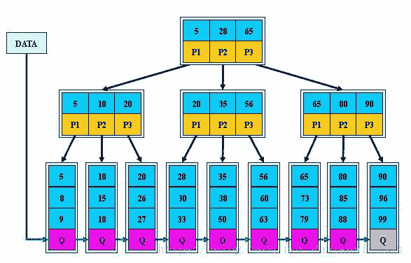
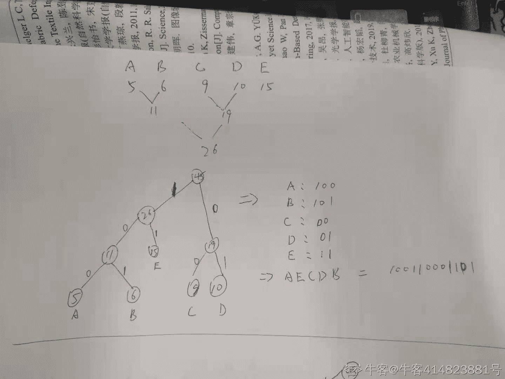

# 五十八、同城 2020 校园招聘笔试-算法

## 1

预测实验里，测试集合的 Label 是[0,0,0,1,1,1]，某个模型的输出值是[0.2,0.8,0.65,0.7,0.9,0.6]，那么这个模型在该测试集合上的 AUC 是（）

正确答案: C   你的答案: 空 (错误)

```cpp
1/2
```

```cpp
3/5
```

```cpp
2/3
```

```cpp
3/4
```

本题知识点

算法工程师 58 集团 2020

讨论

[零葬](https://www.nowcoder.com/profile/75718849)

3 个正样本，3 个负样本，一共有 9 个正负样本对，其中正样本预测概率大于负样本预测概率的有(0.2,0.7)，(0.2,0.9)，(0.2,0.6)，(0.8,0.9)，(0.65,0.7)，(0.65,0.9)一共 6 个，因此 AUC 为 6/9=2/3

发表于 2021-07-20 15:15:00

* * *

[蒙德](https://www.nowcoder.com/profile/756090280)

loss = 2/6,AUC=1-loss=1-2/6=2/3

发表于 2021-04-25 23:08:01

* * *

[就是这个光](https://www.nowcoder.com/profile/910692584)

AUC 是一个概率值，考虑每一对正、反例（M * N），若正例的预测值大于反例，则+1，若相等，则+0.5。用最终的计数/（M * N）即为 AUC 值。

发表于 2021-06-30 14:57:24

* * *

## 2

关于过拟合的说法，不正确的是（）

正确答案: C   你的答案: 空 (错误)

```cpp
判断一个训练好的模型是否过拟合的时间复杂度是 O(N)，N 是样本空间大小
```

```cpp
采样空间过小是引起过拟合问题的原因之一
```

```cpp
调高模型的复杂度是解决过拟合的问题途径之一
```

```cpp
在损失函数中加入正则项是解决过拟合的问题途径之一
```

本题知识点

算法工程师 58 集团 2020

## 3

小明在 58 平台上求职一份销售工作，搜索查看职位后第一次投递简历的概率为 2/5，且发生投递后下次再投递概率均比上一次投递的概率下降 1/2。小明先后搜索查看了 3 个职位，投递了超过一份简历的概率是（）

正确答案: B   你的答案: 空 (错误)

```cpp
18/125
```

```cpp
24/125
```

```cpp
62/125
```

```cpp
2/125
```

本题知识点

算法工程师 58 集团 2020

讨论

[零葬](https://www.nowcoder.com/profile/75718849)

如果一次都没有投：P[0]=(3/5)³=27/125 如果投了一次，有如下三个基本事件：(1) 第一次投：第一次投，概率为 2/5；受第一次影响，第二次投的概率为 1/5，不投的概率为 4/5；第二次没有投，投的概率不变，第三次不投的概率仍然是 4/5。(2) 第二次投：第一次不投，概率为 3/5；第二次投，概率为 2/5；第三次受第二次影响，第二次投的概率为 1/5，不投的概率为 4/5。(3) 第三次投：第一次和第二次都不投，概率均为 3/5，第三次属于首次投递，概率为 2/5。因此 P[1]=2/5*4/5*4/5+3/5*2/5*4/5+3/5*3/5*2/5=74/125 题中要求的是其对立事件：1-27/125-74/125=24/125

发表于 2021-07-20 15:23:14

* * *

[蒙德](https://www.nowcoder.com/profile/756090280)

概率是：三次都投+投了其中两次=2/5*1/5*1/10+2/5*4/5*1/5+2/5*1/5*4/5+3/5*2/5*1/5=24/125

发表于 2021-04-25 23:13:03

* * *

## 4

以下关于 PCA 和 LDA(Linear Discriminant Analysis)
1）PCA 和 LDA 都是线性降维方法
2）LDA 是监督方法而 PCA 是非监督方法
3）PCA 最大化方差而 LDA 最大化类别分离性
说法正确的是（）

正确答案: D   你的答案: 空 (错误)

```cpp
1 和 2
```

```cpp
2 和 3
```

```cpp
1 和 3
```

```cpp
以上所有
```

本题知识点

算法工程师 58 集团 2020

讨论

[以梦为马 ye](https://www.nowcoder.com/profile/277175461)

LDA 与 PCA 都是常用的降维方法，二者的区别在于：
1\. 出发思想不同。PCA 主要是从特征的协方差角度，去找到比较好的投影方式，即选择样本点投影具有最大方差的方向（ 在信号处理中认为信号具有较大的方差，噪声有较小的方差，信噪比就是信号与噪声的方差比，越大越好。）；而 LDA 则更多的是考虑了分类标签信息，寻求投影后不同类别之间数据点距离更大化以及同一类别数据点距离最小化，即选择分类性能最好的方向。

2\. 学习模式不同。PCA 属于无监督式学习，因此大多场景下只作为数据处理过程的一部分，需要与其他算法结合使用，例如将 PCA 与聚类、判别分析、回归分析等组合使用；LDA 是一种监督式学习方法，本身除了可以降维外，还可以进行预测应用，因此既可以组合其他模型一起使用，也可以独立使用。

3\. 降维后可用维度数量不同。LDA 降维后最多可生成 C-1 维子空间（分类标签数-1），因此 LDA 与原始维度 N 数量无关，只有数据标签分类数量有关；而 PCA 最多有 n 维度可用，即最大可以选择全部可用维度。

编辑于 2021-08-06 10:26:57

* * *

## 5

神经网络中的隐藏层中使用激活函数 X。在特定神经元给定任意输入，你会得到输出 -0.01。X 可能是以下哪一个激活函数？

正确答案: B   你的答案: 空 (错误)

```cpp
ReLU
```

```cpp
tanh
```

```cpp
sigmoid
```

```cpp
ReLU、tanh、sigmoid 均有可能
```

本题知识点

算法工程师 58 集团 2020

讨论

[hts1](https://www.nowcoder.com/profile/5081670)

只有 tanh 能输出负数（还有面试题问这些函数的导数）

发表于 2021-06-01 10:40:19

* * *

## 6

如下两组数据 {(-1,0),(-1,2),(1,2)} 和 {(0,0),(1,0),(1,1)}，我们在该数据集上训练一个线性 SVM 模型，该模型中的支持向量是哪些？

正确答案: A   你的答案: 空 (错误)

```cpp
(−1,0),(1,2),(0,0),(1,1)
```

```cpp
(−1,0),(−1,2),(1,1),(1,0)
```

```cpp
(1,2),(-1,2),(1,1),(1,0)
```

```cpp
(−1,0),(-1,2),(0,0),(1,0)
```

本题知识点

算法工程师 58 集团 2020

讨论

[以梦为马 ye](https://www.nowcoder.com/profile/277175461)

这三个点支撑了一个平面，这就是支持向量

发表于 2021-08-06 10:39:04

* * *

[hts1](https://www.nowcoder.com/profile/5081670)

画图 找分割平面 应该是一条斜向右上的线

发表于 2021-06-01 10:43:39

* * *

## 7

以下关于 BatchNorm 的描述不正确的是 （）

正确答案: B   你的答案: 空 (错误)

```cpp
BN 可以加快训练收敛速度
```

```cpp
不同的 Mini-Batch 训练出来的 BN 参数相同
```

```cpp
BN 可以降低模型对初始化的敏感度，可以使用更大的学习率
```

```cpp
如果 input batch 的 shape 为(B, C, H, W)，统计出的 mean 和 variance 的 shape 为  1 * C * 1 * 1
```

本题知识点

算法工程师 58 集团 2020

## 8

关于优化方法描述有误的是（）

正确答案: D   你的答案: 空 (错误)

```cpp
Adam 使用了一阶动量
```

```cpp
Adam 使用了二阶动量
```

```cpp
Adagrad 适合处理稀疏数据
```

```cpp
BGD 虽然计算慢，但对所有函数可收敛到全局极小值
```

本题知识点

算法工程师 58 集团 2020

讨论

[零葬](https://www.nowcoder.com/profile/75718849)

BGD 对于有多个局部极值点的函数，能达到全局最优点的概率几乎为 0

发表于 2021-07-20 15:25:18

* * *

[hts1](https://www.nowcoder.com/profile/5081670)

第四个答案 在凸函数上，能达到全局，在凹函数上，能达到局部

发表于 2021-06-01 11:04:21

* * *

## 9

58 招聘是在线招聘行业的领导者，每年帮助几亿用户在线快捷高效地找到满意的工作、帮助千万公司招到满意的人才。在线招聘系统每天要处理超过 5 千万招聘职位帖子，超过 4 亿次的招聘用户请求，超过 200 亿次的职位展示。
为了提高用户招聘体验质量和招聘的安全性，在线招聘系统在将招聘帖子展现给用户之前，会调用质量识别子系统对每一个候选帖子做质量识别，并过滤低质量招聘帖子。质量识别子系统需要实时将帖子归类成“低质量招聘贴"和”正常招聘贴”。
现在需要您应用机器学习算法，使用帖子质量数据集创建模型，并将模型集成到在线质量识别系统中，提升低质量帖子识别率。请详述您的建模和应用方案。

* 说明:
1\. 帖子质量数据集描述如下：
   （1）单条样本：{帖子描述，质量标签，时间}。其中         质量标签 ：低质量 | 正常,         时间：2019/10/1 | 2019/10/2 | 2019/10/3 | 2019/10/4 | 2019/10/5 | 2019/10/6 | 2019/10/7 | 2019/10/8
    (2) 数据集中单条样本中“帖子描述”不超过 1024 字节，假定每日的样本数据数量相同。

2\. 招聘贴子的“帖子描述"如下：
标题: Java 程序员
薪资: 20000 元/月
福利: 五险一金|房补|话补
人数: 2000 人
学历: 不限
工作地点: 北京市朝阳区亚运村 XX 号
网站:
公司名称: Java 程序员培训中心
电话: 
发布地址:
职位描述:

你的答案

本题知识点

算法工程师 58 集团 2020

讨论

[wywzxxz](https://www.nowcoder.com/profile/653022675)

数据处理：薪酬、人数：float 福利(拆分)、学历：TAG，保留出现概率>1%的，转化为 OneHot 网站、电话、发布地址：舍弃工作地点：Bert-sentence 转句向量，压缩到 8 维(弱化识别能力但是保留识别扯淡内容的能力)
标题、职位描述：拼凑成长文本模型：Transfomer 处理长文本输出与其他合并进入加 Skip link 的 5 层 CNN 训练：使用半监督辅助人工标注训练集。正负比例 1:3，正样本约 100～300 条。Epoch=2，不用冻结 Transformer 权重。

发表于 2021-06-25 14:32:21

* * *

## 10

F，E，D，C，B，A 的顺序进栈，请问下列哪一个出栈顺序是不可能的是（）

正确答案: D   你的答案: 空 (错误)

```cpp
EDCFAB
```

```cpp
DCABEF
```

```cpp
EDCFBA
```

```cpp
CBDFEA
```

本题知识点

算法工程师 58 集团 2020 Java 工程师 C++工程师 PHP 工程师 golang 工程师

讨论

[零葬](https://www.nowcoder.com/profile/75718849)

C 在 B 之前出栈，那一定是 C 进去就出来了，B 也是一样，在这种情况下，刚开始一定是 FED 按顺序连续进栈，无出栈操作，因此 F 不可能在 E 之前出栈。

发表于 2021-07-20 15:27:42

* * *

## 11

一个单向链表上的两个元素，指针 M 和 N 分别指向这两个元素，M 所指元素是 N 所指元素前驱的条件是（）

正确答案: A   你的答案: 空 (错误)

```cpp
M-&gt;next = N
```

```cpp
M-&gt;next = N-&gt;next
```

```cpp
N-&gt;next=M
```

```cpp
M=N
```

本题知识点

算法工程师 58 集团 2020 Java 工程师 C++工程师 PHP 工程师 golang 工程师

讨论

[#疾如风#](https://www.nowcoder.com/profile/688117207)

M-&gt,其中 gt 是个常量（变量）？&在指针中用于取变量地址，M-&gt 是说 M->&gt??如果如此，那么 M->next; next->N!!

发表于 2021-04-23 22:07:09

* * *

[牛客小玮](https://www.nowcoder.com/profile/200045406)

哪个算前驱，哪个算后继？

发表于 2021-09-08 15:30:29

* * *

## 12

现有长度分别为 1,2,3,4,5,6,7,8,9,10 的木棍各一根，现要求用这些木棍（可以多根组合，但组合 A=B=C=D, ABCD、ACDB..等重排列算一种正方形）拼成一个正方形，可以有几种拼法（)

正确答案: B   你的答案: 空 (错误)

```cpp
18 种
```

```cpp
19 种
```

```cpp
20 种
```

```cpp
15 种
```

本题知识点

算法工程师 58 集团 2020 Java 工程师 C++工程师 PHP 工程师 golang 工程师

讨论

[#疾如风#](https://www.nowcoder.com/profile/688117207)

| [`bbs.qzzn.com/thread-10791105-1-1.html`](https://www.zybang.com/question/30ffd635556ed4176c8a759372e01342.html) 【作者:[dilemmaed](https://bbs.qzzn.com/home.php?mod=space&uid=496637)】由于每根长度都不同，所以用若干根就一定要 7 根以上（有一边做标准长度），也就等于说正方形的边长起码要 7 厘米以上，而大于 7 或等于 7 的就有 7、8、9、10、11、12、13、14.....边长为 7 的就只有一种 1+6、2+5、3+4、7；边长为 8 的只有一种 1+7、2+6、3+5、8；边长为 9 的组合法有 1+8、2+7、3+6、4+5、9，5 个组合选 4 个来组合的方法有 5 种；边长为 10 的组合有 1+9、2+8、3+7、4+6、10 都是 5 种，所以都有 5 种，边长为 11 的组合有 1+10、2+9、3+8、4+7、5+6，所以边长为 11 的有 5 种；边长为 12 的组合有 2+10、3+9、4+8、5+7，边长为 12 的就只有一种；边长为 13 的有 3+10、4+9、5+8、6+7，所以这只有一种；边长为 14 的组合有 4+10、5+9、6+8 只有 3 边不能组成正方形，所以就只有：

*   边长 7 的有 1 种
*   边长 8 的有 1 种
*   边长 9 的有 5 种
*   边长 10 的有 5 种
*   边长 11 的有 5 种
*   边长 12 的有 1 种
*   边长 13 的有 1 种

总共 19 种 |

编辑于 2021-04-23 22:21:04

* * *

[半晴半雨](https://www.nowcoder.com/profile/139982068)

**边长为 7 的组合**：1 种 7,1+6,2+5,3+4 **边长为 8 的组合**：1 种 8,1+7,2+6,3+5 **边长为 9 的组合**：5 种 9,1+8,2+7,3+6,4+5 五选四有 5 种**边长为 10 的组合**：7 种 10,1+9,2+8,3+7,4+6 五选四有 5 种,**还有两种情况**10,1+4+5,2+8,3+7 10,1+9,2+3+5,4+6 一共 7 种**边长为 11 的组合**：5 种
1+10,2+9,3+8,4+7,5+6 五选四有 5 种**边长为 12 的组合**：2 种 2+10,3+9,4+8,5+72+10,3+9,4+8,1+5+6 **边长为 13 的组合**：2 种 3+10,4+9,5+8,6+71+2+10,4+9,5+8,6+7 **一共 1+1+5+7+5+2+2 = 22 种**

编辑于 2021-09-14 18:15:26

* * *

[子寒 201810282011410](https://www.nowcoder.com/profile/742186959)

这道题有问题啊

发表于 2022-03-16 17:11:44

* * *

## 13

1+2*(3+8/4)的后缀表达式正确写法是（）

正确答案: A   你的答案: 空 (错误)

```cpp
12384/+*+
```

```cpp
/+*+12384
```

```cpp
12384+*+/
```

```cpp
+*+/12384
```

本题知识点

算法工程师 58 集团 2020 Java 工程师 C++工程师 PHP 工程师 golang 工程师

讨论

[hts1](https://www.nowcoder.com/profile/5081670)

由答案反推结果 看看哪个能对上

发表于 2021-06-01 11:22:04

* * *

## 14

下图是一个 B+树的结构，做 range 操作（26,35），总共需要查找（）次

正确答案: A   你的答案: 空 (错误)

```cpp
8
```

```cpp
9
```

```cpp
10
```

```cpp
11
```

本题知识点

算法工程师 58 集团 2020 Java 工程师 C++工程师 PHP 工程师 golang 工程师

讨论

[1024。](https://www.nowcoder.com/profile/558507659)

讨论，为什么不是九次呢，难道 20 这个元素不需要查两次🤐

发表于 2021-09-25 09:14:42

* * *

[hts1](https://www.nowcoder.com/profile/5081670)

第一次找到根节点 然后第二次找到中间层最左边 第三次找到 20 那个数据 第四次找到 26 那个数据 然后往后走就行

发表于 2021-06-01 11:32:36

* * *

## 15

在采用 LRU 算法的系统中，程序 P 的某次调用依次访问 8、7、6、5、4、3、2、1、2、3 页。假设分配给 P 的最大内存是 4 页。则在该次调用中的缓存命中率是（）

正确答案: D   你的答案: 空 (错误)

```cpp
0.6
```

```cpp
0.5
```

```cpp
0.4
```

```cpp
0.2
```

本题知识点

算法工程师 58 集团 2020 Java 工程师 C++工程师 PHP 工程师 golang 工程师

讨论

[零葬](https://www.nowcoder.com/profile/75718849)

刚开始，访问的 8、7、6、5 这四个页面依次进入缓存。之后根据 LRU 算法，由于接下来访问的 4 个页面并不在缓存中，因此利用不到缓存，无法命中，4、3、2、1 开始进入缓存，8、7、6、5 这四个页面被清除掉。最后两次访问的是 2、3 两个存在于缓存中的页面，因此可以命中。10 次访问缓存命中 2 次，命中率为 0.2。

发表于 2021-07-20 15:32:15

* * *

[一花一世界。🏃](https://www.nowcoder.com/profile/208226156)

一共四个位置，前四个填满后，利用缓存为 0，此时为 8,7,6,5 然后使用 LRU，填入 4，3，2,1  缓冲利用仍为 0，此时再 3,2\.已经有 3,2 页直接使用缓存，一共调用 10 次，有两次是使用缓存 2/10=0.2

发表于 2021-04-24 20:45:42

* * *

## 16

 运维同学通知我们一台服务器（linux）存放日志的磁盘分区快满了，因此我们决定删除一些日志。但该服务器部署了多个服务，我们想优先删除磁盘占用量比较大的服务的日志。已知所有服务都将日志打印到/opt/scf/log/{服务名}/{服务名}.log， 请帮忙选出一个命令来查看各个服务日志占用的空间

正确答案: D   你的答案: 空 (错误)

```cpp
df -h /opt/scf/log
```

```cpp
df -h /opt/scf/log/*
```

```cpp
du -sh /opt/scf/log
```

```cpp
du -sh /opt/scf/log/*
```

本题知识点

算法工程师 58 集团 2020 Java 工程师 C++工程师 PHP 工程师 golang 工程师

讨论

[hts1](https://www.nowcoder.com/profile/5081670)

du h 表示人类可读，s 表示计算总和

发表于 2021-06-01 11:27:00

* * *

[牛客 447268244 号](https://www.nowcoder.com/profile/447268244)

d

发表于 2021-10-06 10:45:03

* * *

## 17

58 连接平台通过号码池来管理虚拟号码，如果每个号池管理 15 个号码，将有 7 个号码池每个号码池多 2 个号码；如果每个号码池管理 12 个号码，则会有 11 个号码没有号码池管理；如果每个号码池管理 18 个号码，将有一个号码池差 1 个号码。 这批虚拟号码数量在 500-600 之间，这批虚拟号码有多少个（）

正确答案: B   你的答案: 空 (错误)

```cpp
559
```

```cpp
539
```

```cpp
540
```

```cpp
541
```

本题知识点

算法工程师 58 集团 2020 Java 工程师 C++工程师 PHP 工程师 golang 工程师

讨论

[青山 1937](https://www.nowcoder.com/profile/414823881)

假设三种情况的号码池个数分别为 x 、y、z，则有 15(x-7)+ 2 * 7 = 12*y+11= 18*z - 1x 、y、z 均为整数，将答案代入，539 满足条件

编辑于 2021-05-05 20:16:39

* * *

[零葬](https://www.nowcoder.com/profile/75718849)

答案代入法

发表于 2021-07-20 15:45:46

* * *

[短尾熊](https://www.nowcoder.com/profile/7697595)

18*30-1=539

发表于 2021-04-26 14:11:31

* * *

## 18

游戏中升级一把武器，假定每使用一个石头，有 50%的概率会成功让武器升一级，50%的概率会失败。如果武器等级大于等于 5 的话，升级失败会使得武器降 1 级。如果武器的级数小于 5 的话，失败没有效果。问：期望用多少个石头可以让一把初始为 1 级的武器升到 9 级？（）

正确答案: C   你的答案: 空 (错误)

```cpp
20
```

```cpp
26
```

```cpp
36
```

```cpp
48
```

本题知识点

算法工程师 58 集团 2020 Java 工程师 C++工程师 PHP 工程师 golang 工程师

## 19

假设电文 A,B,C,D,E 的权值为 5,6,9,10,15;则报文 AECDB 的哈夫曼编码为（）

正确答案: B   你的答案: 空 (错误)

```cpp
101001110010
```

```cpp
100110001101
```

```cpp
110011011010
```

```cpp
100101011010
```

本题知识点

算法工程师 58 集团 2020 Java 工程师 C++工程师 PHP 工程师 golang 工程师

讨论

[青山 1937](https://www.nowcoder.com/profile/414823881)



发表于 2021-05-05 20:09:59

* * *

[牛客 756295169 号](https://www.nowcoder.com/profile/756295169)

哈夫曼编码结果不是唯一的，一个节点的两个子节点位置可以互换。

发表于 2021-06-03 10:10:10

* * *

[#疾如风#](https://www.nowcoder.com/profile/688117207)


发表于 2021-05-05 20:40:18

* * *

## 20

无向图 G=(V,E),E={(a,b),(a,c),(a,e),(b,c),(b,e),(e,d),(d,f),(f,c),(f,b)},DFS 遍历结果为(按字母顺序):

正确答案: B   你的答案: 空 (错误)

```cpp
a b e d f c
```

```cpp
a b c f d e
```

```cpp
a b c e d f
```

```cpp
a c b e d f
```

本题知识点

算法工程师 58 集团 2020 Java 工程师 C++工程师 PHP 工程师 golang 工程师

## 21

采用快排对 3 7 6 9 10 12 1 进行排序(第一个为基准数)，第一轮探测结果为（）

正确答案: A   你的答案: 空 (错误)

```cpp
1 3 6 9 10 12 7
```

```cpp
9 1 6 3 10 12 7
```

```cpp
3 1 6 9 10 12 7
```

```cpp
1 3 6 7 9 10 12
```

本题知识点

算法工程师 58 集团 2020 Java 工程师 C++工程师 PHP 工程师 golang 工程师

## 22

    给定一个字符串，字符串是有序的整数集合，逗号相连，移除相同的数字，使每个数字只出现一次，输出最终的数字个数。

本题知识点

算法工程师 58 集团 2020 Java 工程师 C++工程师 PHP 工程师 golang 工程师

讨论

[零葬](https://www.nowcoder.com/profile/75718849)

因为是有序的序列，所以只要检查到相邻的元素不相等，计数就加 1，数据类型都不用转，也不需要额外的存储空间。

```cpp
import java.io.BufferedReader;
import java.io.InputStreamReader;
import java.io.IOException;

public class Main {
    public static void main(String[] args) throws IOException {
        BufferedReader br = new BufferedReader(new InputStreamReader(System.in));
        String[] seq = br.readLine().trim().split(",");
        int count = 1;
        for(int i = 1; i < seq.length; i++)
            if(!seq[i].equals(seq[i - 1])) count ++;
        System.out.println(count);
    }
}
```

用集合进行去重，python 一行也可以解决

```cpp
print(len(set(input().split(','))))
```

编辑于 2021-07-20 11:47:39

* * *

[勇敢牛牛！！！](https://www.nowcoder.com/profile/858055268)

对这个题拓展了一下，可以输出最后的数（示例如上）。用链表整出来的，指针数组理论上应该也可以，本人是刚入门的小白各位大佬要是有其它更简单有效的方法欢迎讨论分享在下不胜感激，一起学习进步！（C）

```cpp
#include<stdio.h>
#include<string.h>
#include<stdlib.h>
typedef struct node
{
	char crr[32];
	struct node* next;
}link;
link* head()//创建头节点
{
	link*p=(link*)malloc(sizeof(link));
	strcpy(p->crr,"-1");
	p->next=NULL;
	return p;
}
int add(link*p,char* arr)//入表
{
	link*ptem=p;
	while(ptem->next!=NULL)//将指针移动到要最后节点
	{
		ptem=ptem->next;
	}
	   if(strcmp(ptem->crr,arr)==0)//将最后节点数据和传入数据对比，如果相同则不入
	   {
	   return 0;
	   }
	link*pnew=(link*)malloc(sizeof(link));//节点放在链表最后
	strcpy(pnew->crr,arr);
	ptem->next=pnew;
	pnew->next=NULL;
	return 0;
}
int main()
{
	char str[128]={0},arr[32]={0};
		link*p=head();
		 link*ptemp=p;
	scanf("%s",str);

	int i,j,k=0;
	for(i=0;str[i]!='\0';i++)
	{
		j=0;
		while(str[i]!=','&&str[i]!='\0')//将一段数字暂时存放在 arr
		{
			arr[j]=str[i];
			j++;
			i++;
		}
		add(p,arr);
	}
	while(ptemp->next!=NULL)//遍历打印测试(可以遍历输出最后结果，相当于是对这个题的拓展了)
	{
        k++;
		ptemp=ptemp->next;
		//printf("%s\n",ptemp->crr);
	}
    printf("%d\n",k);
	return 0;
}

```

编辑于 2021-10-09 18:38:43

* * *

[#疾如风#](https://www.nowcoder.com/profile/688117207)

看着下面大神的代码不断优化学习！

发表于 2021-04-24 21:00:55

* * *

## 23

     现有一个地图，由横线与竖线组成（参考围棋棋盘），且两点之间有行走距离起点为左上角，终点为右下角在地图上，每次行走只能沿线移动到临近的点，并累加路径计算一个人从地图的起点走到终点的最小路径为多少。

本题知识点

算法工程师 58 集团 2020 Java 工程师 C++工程师 PHP 工程师 golang 工程师

讨论

[零葬](https://www.nowcoder.com/profile/75718849)

动态规划模板题，每个位置都可能是从左边移动过来或上边移动过来，选择路径短的方案进行转移（注意一下左边界和上边界）。

```cpp
import java.io.BufferedReader;
import java.io.InputStreamReader;
import java.io.IOException;

public class Main {
    public static void main(String[] args) throws IOException {
        BufferedReader br = new BufferedReader(new InputStreamReader(System.in));
        int m = Integer.parseInt(br.readLine().trim());
        int n = Integer.parseInt(br.readLine().trim());
        int[][] grid = new int[m][n];
        for(int i = 0; i < m; i++){
            String[] row = br.readLine().trim().split(" ");
            for(int j = 0; j < n; j++) grid[i][j] = Integer.parseInt(row[j]);
        }
        for(int i = 0; i < m; i++){
            for(int j = 0; j < n; j++){
                if(i == 0 && j == 0)
                    grid[i][j] = grid[i][j];
                else if(i == 0)
                    grid[i][j] += grid[i][j - 1];     // 上边界只能从左边过来
                else if(j == 0)
                    grid[i][j] += grid[i - 1][j];     // 左边界只能从上边过来
                else      // 选择两种方案中路径小的
                    grid[i][j] += Math.min(grid[i - 1][j], grid[i][j - 1]);
            }
        }
        System.out.println(grid[m - 1][n - 1]);
    }
}
```

发表于 2021-07-20 11:59:05

* * *

[杂货店的阿猿](https://www.nowcoder.com/profile/440731268)

 ```cpp
import java.util.*;
public class Main {
    public static void main(String[] args){
        Scanner sc = new Scanner(System.in);
        int n = sc.nextInt();
        int m = sc.nextInt();
        int[][] mapp = new int[n][m];

        for(int i = 0; i < n ;i++){
            for(int j = 0; j < m; j++){
                mapp[i][j] = sc.nextInt();
            }
        }
        int[][] dp = new int[n][m];
        dp[0][0] = mapp[0][0];
        for(int i = 0; i < n ;i++){
            for(int j = 0; j < m; j++){
                if(i == 0 && j != 0 ) dp[i][j] = dp[i][j - 1] + mapp[i][j];
                else if(i != 0 && j == 0) dp[i][j] = dp[i - 1][j] + mapp[i][j];
                else if(i != 0 && j != 0) dp[i][j] = Math.min(dp[i - 1][j], dp[i][j - 1])  + mapp[i][j];
            }
        }
        System.out.println(dp[n - 1][m - 1]);

    }

}

```

java 题解 发表于 2022-02-27 23:07:33

* * *

[maoxiaomao](https://www.nowcoder.com/profile/230303195)

动态规划状态更新：dp[i][j]=min(dp(上一个格子)+当前 cost，dp(左边格子)+当前 cost)

```cpp
m=int(input().strip())
n=int(input().strip())
M=[]
for i in range(m):
    M.append(list(map(int,input().strip().split())))
dp=[[0]*(n) for _ in range(m)]
for i in range(m):
    for j in range(n):
        if i-1>=0:
            up=dp[i-1][j]+M[i][j]
        else:up=dp[i][j-1]+M[i][j]
        if j-1>=0:
            left=dp[i][j-1]+M[i][j]
        else:left=dp[i-1][j]+M[i][j]
        dp[i][j]=min(up,left);
print(dp[-1][-1])
```

编辑于 2021-05-31 15:28:25

* * *

## 24

     幼儿园老师想给她班上的孩子分饼干。所有的孩子都坐在一条线上，每个孩子都根据在课堂上的表现得到评分。老师必须给每个孩子至少 1 个饼干。如果两个孩子坐在一起，那么评分较高的孩子必须得到更多的饼干(孩子必须左右都比较)。输出老师购买的饼干总数的最小值。例如，假设她的学生的评分为[3,6,3,5,6,2]。她给学生饼干的数量如下：[1,2,1,2,3,1]。她必须购买至少 10 个饼干。

本题知识点

算法工程师 58 集团 2020 Java 工程师 C++工程师 PHP 工程师 golang 工程师

讨论

[零葬](https://www.nowcoder.com/profile/75718849)

贪心算法：先从左往右遍历，检查每个孩子的左边是否有低分多饼的情况，如果存在，则以最小限度超过他；再从右往左遍历，检查每个孩子的右边是都有低分多饼的情况，如果存在，同样以最小限度超过他，以此保证饼干总数最少。

```cpp
import java.io.BufferedReader;
import java.io.InputStreamReader;
import java.io.IOException;
import java.util.Arrays;

public class Main {
    public static void main(String[] args) throws IOException {
        BufferedReader br = new BufferedReader(new InputStreamReader(System.in));
        int n = Integer.parseInt(br.readLine());
        int[] scores = new int[n];
        for(int i = 0; i < n; i++) scores[i] = Integer.parseInt(br.readLine());
        int[] cookie = new int[n];
        Arrays.fill(cookie, 1);
        for(int i = 1; i < n; i++)
            if(scores[i] > scores[i - 1] && cookie[i] <= cookie[i - 1]) cookie[i] = cookie[i - 1] + 1;
        for(int i = n - 2; i >= 0; i--)
            if(scores[i] > scores[i + 1] && cookie[i] <= cookie[i + 1]) cookie[i] = cookie[i + 1] + 1;
        int totalCookie = 0;
        for(int i = 0; i < n; i++) totalCookie += cookie[i];
        System.out.println(totalCookie);
    }
}
```

发表于 2021-07-20 12:22:43

* * *

[MechaVX](https://www.nowcoder.com/profile/689786709)

用了一种我自己都不知道是什么的方法......

```cpp
#include <iostream>
using namespace std;
int main(){
    int n;
    cin>>n;
    if(!n){
        cout<<0<<endl;
        return 0;
    }
    int*arr=new int[n];
    for(int i=0;i<n;++i)
        cin>>arr[i];
    int last=1,ind=0;
    long long sum=1;
    bool flag=0;
    for(int i=1;i<n;++i){
        if(arr[i]>arr[i-1]){
            if(flag){
                last=2;
                flag=0;
            }
            else
                last++;
            sum+=last;
            ind=i;
        }
        else if(arr[i]==arr[i-1]){
            ind=i;
            last=1;
            sum+=1;
        }
        else{
            flag=1;
            sum+=i-ind;
            if(last==1){
                sum+=1;
            }
            else
                --last;
        }
    }
    delete[]arr;
    cout<<sum<<endl;
    return 0;
}
```

发表于 2021-11-04 21:31:13

* * *

[chenfy2113](https://www.nowcoder.com/profile/7217033)

复杂度 O（n）
**暴力版，正着来一遍，反着来一遍
 ```cpp
n = int(input().strip())
num_list = []
for i in range(n):
    num_list.append(int(input().strip()))
if n == 0:
    print(0)
else:
    weight_list, new_weight_list = [1] * n, [1] * n
    temp_cnt = 1
    for i in range(1, n):
        if num_list[i - 1] < num_list[i]:
            temp_cnt += 1
        else:
            temp_cnt = 1
        weight_list[i] = temp_cnt
    temp_cnt = 1
    for i in range(n - 1, 0, -1):
        if num_list[i - 1] > num_list[i]:
            temp_cnt += 1
        else:
            temp_cnt = 1
        new_weight_list[i - 1] = temp_cnt
    for i in range(n):
        if new_weight_list[i] > weight_list[i]:
            weight_list[i] = new_weight_list[i]

print(sum(weight_list))
``` 

发表于 2021-06-19 18:33:12

* * *