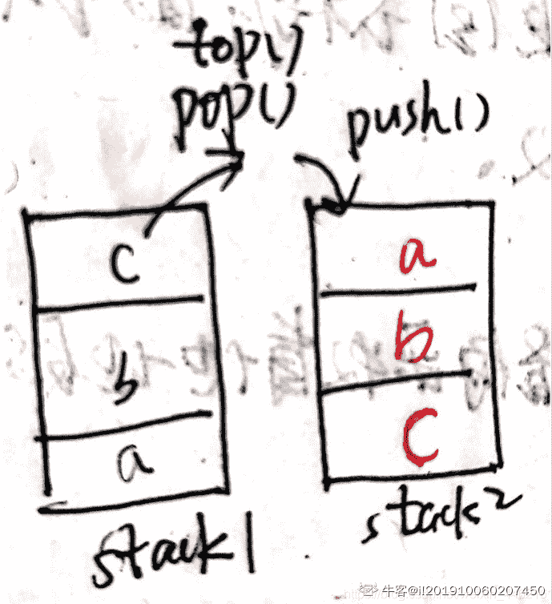

# 五十八、同城 2020 校园招聘笔试-测试

## 1

已知 2<=Y<9，若采用黑盒测试方法中的边界值法，请问 Y 的边界值应该是( )

正确答案: B   你的答案: 空 (错误)

```cpp
Y=2，Y=8
```

```cpp
Y=1，Y=2，Y=8，Y=9
```

```cpp
Y=1，Y=2，Y=8，Y=9，Y=10
```

```cpp
Y=1，Y=2，Y=3，Y=8，Y=9，Y=10
```

本题知识点

测试开发工程师 测试工程师 58 集团 2020

讨论

[DreamTomorrow](https://www.nowcoder.com/profile/995295322)

上点，内点，离点

发表于 2022-02-26 21:25:20

* * *

[小白是不是生来](https://www.nowcoder.com/profile/396214087)

b.上点和离点。

发表于 2021-05-03 01:57:10

* * *

[ShuYY](https://www.nowcoder.com/profile/866131582)

边界附近 1 2 8 9

发表于 2021-04-25 21:05:30

* * *

## 2

有如下一段代码:

#include <unistd.h>

#include <stdio.h>

#define ADD(x,y) x+y

int main() {

 int m=5;

 m -= m*ADD(m,m); // -=为减号等于号

 printf("%d\n", m);

}

则 m 的值为: 

正确答案: A   你的答案: 空 (错误)

```cpp
-25
```

```cpp
-35
```

```cpp
-45
```

```cpp
-55
```

本题知识点

测试开发工程师 测试工程师 58 集团 2020

讨论

[王启越](https://www.nowcoder.com/profile/559111947)

这个是宏定义，宏展开之后，其实就是 x+y。宏定义不带返回值的。

发表于 2021-09-11 10:33:09

* * *

[HCQ1995](https://www.nowcoder.com/profile/69317991)

m = 5 - (5*5+5)

发表于 2021-04-29 17:37:03

* * *

[ShuYY](https://www.nowcoder.com/profile/866131582)

m=m-(m*m+m) define 的边缘效应

发表于 2021-04-25 21:07:19

* * *

## 3

如果 CPU 的使用率过高，以下描述不正确的是（）

正确答案: C   你的答案: 空 (错误)

```cpp
代码可能存在死循环
```

```cpp
可能出现内存泄漏
```

```cpp
用户 CPU 和 NICE CPU 高，说明内核态占用了较多 CPU
```

```cpp
I/O 等待 CPU 高，说明等待 I/O 的时间比较长
```

本题知识点

测试开发工程师 测试工程师 58 集团 2020

讨论

[淼喵](https://www.nowcoder.com/profile/59913966)

用户 CPU 和 Nice CPU 高，说明用户态占据较多 CPU 系统 CPU 高，说明内核态占据较多 CPU

发表于 2021-04-25 14:16:20

* * *

## 4

假设有 N 种不同的食物，每种食物热量不同，分配给 K 个人来吃。为了方便，吃食物要求保持连续，比如 1、2、3 食物 A 来吃，4、5 食物 B 来吃，6，7，8，9 食物 C 来吃。但不能跳跃分配，例如 1、4、2 给 A 吃，3、5、6 给 B 吃，并且同一食物不能分配给两个人吃。食物分配有多种方式，为了公平起见，我们希望分配给 N 个人之后，每个人分配的食物热量总和的最大值（我们称之为最大热量）尽量小。我们用 9 种不同热量的食物和 3 个人来进行举例,例子如下：123,456,789，这种分法，3 份热量分别是 6,15,24，最大热量是 24
1234,567,89，这种分法，3 份热量分别是 10,18,17，最大热量是 18
12345,67,89，这种分法，3 份热量分别是 10,13,17，最大热量是 17 可以看到，这 3 种分配方式中，最后一种分配方式的最大热量值最小。当然我们还有其它很多种分配方式，但事实上，这一种分配方式是所有分配方式中，最大能量值最小的方案。 请设计分配方案，获得最大能量最小的情况，并输出这个最小值即可。

本题知识点

测试开发工程师 测试工程师 58 集团 2020

## 5

一队矿工要挖两个矿场，其中一个矿场是另一个的 2 倍。全队在大矿场中挖矿半天之后，平均分为两小队，一小队继续留在大矿场里，到傍晚时把矿挖完; 另一小队到小矿场挖矿，到傍晚还剩下一小片没挖完。剩下的一小片第二天要 1 个人用 1 整天的时间才能采挖完。请问一共有多少矿工？

正确答案: B   你的答案: 空 (错误)

```cpp
6
```

```cpp
8
```

```cpp
10
```

```cpp
12
```

本题知识点

测试开发工程师 测试工程师 58 集团 2020

讨论

[洛克马](https://www.nowcoder.com/profile/514199399)

什么狗屁题目？ 给个准确时间会死？

发表于 2022-03-11 14:52:30

* * *

[牛客 561301343 号](https://www.nowcoder.com/profile/561301343)

到傍晚时没说是用完剩下的半天啊，题目不严谨，如果是剩下半天选 B 如果是到傍晚，没到半天选 A

发表于 2021-09-21 15:17:48

* * *

[HCQ1995](https://www.nowcoder.com/profile/69317991)

设总共有 x 名矿工，每名矿工每天的工作量为 1，大矿场的总量为 Y = x/2 + x/4   （全队在大矿场中挖矿半天 + 一半在大矿场中挖矿半天）小矿场的总量为 y = x/2 + 1  (一小队到小矿场挖矿半天 + 1 个人用 1 整天)Y = 2y 得 x = 8

发表于 2021-04-29 17:48:08

* * *

## 6

下面关于计算机系统的说法，错误的是：

正确答案: D   你的答案: 空 (错误)

```cpp
在冯诺依曼体系中，计算机由运算器、控制器、存储器、输入设备和输出设备五大部分组成
```

```cpp
计算机的总线可以划分为数据总线、地址总线和控制总线
```

```cpp
-13 的原码为 10001101，其补码为 11110011
```

```cpp
现有一单通道内存，其位宽为 64，频率为 1GHz，则其内存带宽为 64GB/s
```

本题知识点

测试开发工程师 测试工程师 58 集团 2020

讨论

[Hyggek](https://www.nowcoder.com/profile/929898460)

内存带宽总量(MBytes) = 最大时钟速频率(MHz) x 总线宽度(bits) x 每时钟数据段数量/ 8 题目中未给出每时钟通过的数据段数量，进而根本无法确定内存的带宽

编辑于 2021-04-26 16:47:35

* * *

## 7

找出字符串（全部都是小写的英文字母）中的重叠子串，计算各个字母对应的重叠子串的长度之和，并按照出现次数从大到小进行输出（注：若次数相同则 ASCII 值较小的字母先输出）。例: 字符串 : aaabcccaddfffaa

其中字符 a 的重叠子串包括 aaa aa

其中字符 c 的重叠子串包括 ccc

其中字符 d 的重叠子串包括 dd

其中字符 f 的重叠子串包括 fff 那么，最终的输出结果就是：

a:5

c:3

f:3

d:2

本题知识点

测试开发工程师 测试工程师 58 集团 2020

## 8

小明，小强，小亮三人分别喜欢吃三种水果。 以下描述，每项描述都有一半是对的， A：“小亮喜欢吃香蕉，小强喜欢吃桃子”

B：“小亮喜欢吃梨，小明喜欢吃葡萄”

C：“小亮喜欢吃香蕉，小明喜欢吃苹果”

请问，以下 4 个选项中，哪种情况可能出现( )。

正确答案: D   你的答案: 空 (错误)

```cpp
小明喜欢吃梨，小强喜欢吃苹果，小亮喜欢吃桃子
```

```cpp
小明喜欢吃苹果，小强喜欢吃桃子，小亮喜欢吃香蕉
```

```cpp
小明喜欢吃苹果，小强喜欢吃香蕉，小亮喜欢吃梨
```

```cpp
小明喜欢吃苹果，小强喜欢吃桃子，小亮喜欢吃梨
```

本题知识点

测试开发工程师 测试工程师 58 集团 2020

## 9

以下代码输出结果为：

 List<Integer> list=new ArrayList<>();

 list.add(6);

 list.add(5);

 list.add(4);

 list.add(3);

 list.add(2);

 list.add(1);

 for (int i = 1; i <= 3; i++) {

 list.remove(new Integer(i));

 }

 System.out.println(list);

正确答案: A   你的答案: 空 (错误)

```cpp
[6, 5, 4]
```

```cpp
[3, 2, 1]
```

```cpp
[6, 2, 1]
```

```cpp
[1, 5, 6]
```

本题知识点

测试开发工程师 测试工程师 58 集团 2020

讨论

[牛客 561301343 号](https://www.nowcoder.com/profile/561301343)

list 里添加的是<Integer>类型的对象加完是 6，5，4，3，2，1 这样的 remove 的是 new Integer(i)，也就是装箱之后的对象，而不是位置所以删掉的是 1，2，3

发表于 2021-09-21 15:34:28

* * *

## 10

http 请求响应头部里关于缓存的描述是正确的（）

正确答案: B   你的答案: 空 (错误)

```cpp
Cache-Control 为 max-age=0，浏览器不会缓存请求，每次请求从服务端获取最新的内容，返回 200
```

```cpp
Cache-Control 设优先级高于 Expires 设置
```

```cpp
Cache-Control 为 no-store，浏览器会对比资源更新状态，如果没有更新返回 304，否则返回 200
```

```cpp
Cache-Control 为 no-cache，浏览器不会缓存请求，每次请求从服务端获取最新的内容，返回 200
```

本题知识点

测试开发工程师 测试工程师 58 集团 2020

讨论

[Hyggek](https://www.nowcoder.com/profile/929898460)

Cache-Control 设置 max-age=0 等同于设置了 no-cache，意思不是不缓存而是每次不直接使用本地资源而是必须先从服务器那通过 etag 等手段验证本地缓存的资源是否已经改变了；与之相对的 no-store 才是不进行缓存，每次请求都去服务器请求资源 发表于 2021-04-26 17:01:30

* * *

## 11

```cpp
mysql 中 student 表中数据如下,查询表中年龄大于 18 的，不同年龄的人数是多少，正确的查询 sql 是（）
```

+-----+---------+-------+

| id | name | age |

+-----+---------+-------+

| 1 |tom | 18 |

| 2 |jerry | 20 |

| 3 |xiaoming | 45 |

| 4 |sunwu | 18 |

| 5 |liwen | 18 |

+-----+---------+-------+

正确答案: B   你的答案: 空 (错误)

```cpp
SELECT age, count(id) from student GROUP BY age where age>18
```

```cpp
SELECT age, count(id) from student GROUP BY age having age>18
```

```cpp
SELECT age, sum(*) from student GROUP BY age having age>18
```

```cpp
SELECT age, sum(*) from student where age>18 GROUP BY age
```

本题知识点

测试开发工程师 测试工程师 58 集团 2020

讨论

[牛客 217282955 号](https://www.nowcoder.com/profile/217282955)

B

发表于 2021-09-29 01:51:44

* * *

## 12

以下对线程和进程的理解不正确的是（）

正确答案: C   你的答案: 空 (错误)

```cpp
使用 java 命令行运行同一个 jar 包两次，会产生两个进程
```

```cpp
线程的死锁是指多个线程争抢资源造成的线程间互相等待的情况
```

```cpp
java 中 synchronized 关键字修饰的方法或代码块会使线程进入死亡状态
```

```cpp
多线程的上下文切换是指 CPU 控制权由一个已经正在运行的线程切换到另外一个就绪并等待获取 CPU 执行权的线程的过程
```

本题知识点

测试开发工程师 测试工程师 58 集团 2020

讨论

[淼喵](https://www.nowcoder.com/profile/59913966)

不是死亡应该是阻塞状态

发表于 2021-04-25 15:14:57

* * *

## 13

我们的一个任务系统，使用数据库去针对任务执行的情况进行记录。每个任务在执行完成后都会向任务执行结果表中插入一条记录，关联到对应的任务 id（即 taskId），并记录这次任务的执行编号、执行时间和状态，

任务执行结果表的结构如下:

TABLE `eo_task_report` (

 `id` bigint(10) NOT NULL AUTO_INCREMENT,

 `taskId` bigint(10) NOT NULL COMMENT '任务 id,关联任务表 id',

 `executeNo` bigint(20) NOT NULL COMMENT '执行编号，每次生成后，加 1',

 `executeTime` datetime NOT NULL COMMENT '执行时间',

 `isValid` tinyint(3) NOT NULL DEFAULT '1' COMMENT '是否有效，1-有效；0-无效。默认为 0'

 PRIMARY KEY (`id`),

)任务执行结果表的样例内容如下：

| id  | taskId  | executeNo  | executeTime  | isValid  |
|  1 |  1001 |  1 |  2019-05-08 19:05:12 |  1 |
|  2 |  1001 |  2 |  2019-05-08 20:05:12 |  1 |
|  3 |  1002 |  1 |  2019-05-08 19:05:12 |  1 |
|  4 |  1001 |  3 |  2019-05-08 21:05:12 |  1 |
|  5 |  1003 |  1 |  2019-05-09 10:28:20 | 1  |
|  6 |  1003 |  2 |  2019-05-09 19:28:20 |  1 |

请问以下 SQL 语句中哪条（或哪几条）可以获得每个任务最后一次的执行结果？执行 SQL:

1： select * from eo_task_report ORDER BY executeTime desc GROUP BY taskId

2： select a.* from eo_task_report a where executeTime = (select max(executeTime) from eo_task_report where taskId = a.taskId ) GROUP BY a.taskId order by a.taskId

3： select * from eo_task_report GROUP BY taskId ORDER BY executeTime desc

4： select * from (select * from eo_task_report ORDER BY executeTime desc)a GROUP BY a.taskID

正确答案: C   你的答案: 空 (错误)

```cpp
1
```

```cpp
1,3
```

```cpp
2,4
```

```cpp
都不对
```

本题知识点

测试开发工程师 测试工程师 58 集团 2020

讨论

[牛客 4062775 号](https://www.nowcoder.com/profile/4062775)

mysql 5.7 版本之后默认打开 only_full_group_by 模式，即 select 的字段必须是 groupBy 的字段或能够用函数唯一确定值的字段。select A.* from eo_task_report A join (select max(executeTime) as executeTime,taskId from eo_task_report group by taskId) B on A.taskId = B.taskId and A.executeTime = B.executeTime;

发表于 2022-01-22 22:14:16

* * *

[十木 201904221656395](https://www.nowcoder.com/profile/731651529)

提供的答案选项 C 错误，只有第 2 条 sql 是正确的，第 4 条 sql 错误。

发表于 2021-09-26 11:19:28

* * *

[王启越](https://www.nowcoder.com/profile/559111947)

```cpp
 select a.* from eo_task_report a where executeTime = (select max(b.executeTime) from eo_task_report b where b.taskId = a.taskId ) GROUP BY a.taskId   order by a.taskId

```

这段代码，先给要查询的表起了别名 a，然后按行查询一张新表 b，每次查询的范围是 b.taskId=a.taskId 的组，查询组中表 b 中 execute 列值等于 a.executeTime 最大值的一行，这样的组有 3 个，所以这样的 executeTime 也有 3 个。最后再根据 taskId 进行排序。

发表于 2021-09-11 12:04:58

* * *

## 14

关于 Java 中的 String 及其相关类型，以下说法错误的是：

正确答案: D   你的答案: 空 (错误)

```cpp
String 是 final 类型，subtring 后产生的是新的 String 对象
```

```cpp
String 类型中的 indexOf 方法如果获取不到目标字符串，返回-1
```

```cpp
StringBuilder 与 StringBuffer 相比，StringBuilder 是线程不安全的
```

```cpp
将字符串对象 str 按照“*”号分割的方式是，String[] strArray=str.split("*")
```

本题知识点

测试开发工程师 测试工程师 58 集团 2020

讨论

[ShuYY](https://www.nowcoder.com/profile/866131582)

split("\\*")、 split("\\:")、 split("\\|") 、split("\\.")、split("\\^")、split("@")、split(",") 

发表于 2021-04-25 21:14:23

* * *

## 15

被拷贝的对象的内容发生改变后，下面关于深拷贝和浅拷贝的描述正确的是

1：浅拷贝的对象的内存地址发生了改变

2：深拷贝的对象的内存地址发生了改变

3：浅拷贝的对象的值等于原对象的值

4：深拷贝的对象的值等于原对象的值

正确答案: C   你的答案: 空 (错误)

```cpp
1,3
```

```cpp
2,4
```

```cpp
2,3
```

```cpp
1,4
```

本题知识点

测试开发工程师 测试工程师 58 集团 2020

## 16

分析从某 android 手机上取得 app 的日志 log.txt，若日志出现“error，warning，crash”其中任一个单词，则将该行日志输出，正确的语句是：

正确答案: B   你的答案: 空 (错误)

```cpp
cat log.txt|grep -E "error" -E "warning" -E "crash"
```

```cpp
grep -E "error|warning|crash" log.txt
```

```cpp
grep "error" log.txt|grep "warning" log.txt|grep "crash" log.txt
```

```cpp
grep   "error|warning|crash" log.txt
```

本题知识点

测试开发工程师 测试工程师 58 集团 2020

## 17

以下代码共创建多少个进程？

#include <unistd.h>

#include <stdio.h>

int main()

{

        fork();

        fork() || fork();

        fork();

        sleep(1);

        return 0;

}

正确答案: D   你的答案: 空 (错误)

```cpp
11
```

```cpp
12
```

```cpp
13
```

```cpp
14
```

本题知识点

测试开发工程师 测试工程师 58 集团 2020

## 18

队列 queue 由两个栈 stack1、stack2 模拟而成，入队先进入 stack1，出队从 stack2 出，在进行以下操作后，

queue.add(1);

queue.add(2);

queue.add(3);

queue.remove();

queue.add(4);

queue.remove();

总共调用了几次 stack1 和 stack2 的 push 和 pop 方法

正确答案: A   你的答案: 空 (错误)

```cpp
共调用 push 方法(包括 stack1 和 stack2) 7 次，pop 方法 5 次
```

```cpp
共调用 push 方法(包括 stack1 和 stack2) 8 次，pop 方法 4 次
```

```cpp
共调用 push 方法(包括 stack1 和 stack2) 7 次，pop 方法 4 次
```

```cpp
共调用 push 方法(包括 stack1 和 stack2) 8 次，pop 方法 5 次
```

本题知识点

测试开发工程师 测试工程师 58 集团 2020

讨论

[i!201910060207450](https://www.nowcoder.com/profile/156685821)

如图，从 1 进，从 2 出。当需要 remove()的时候分三步，把 1 里面的元素 pop 出来，push 到 2 中，再从 2 中 pop。

queue.add(1); //push 到栈 1

queue.add(2);//push 栈 1

queue.add(3);//push 栈 1

queue.remove();//3 从栈 1 pop 后 push 到栈 2，2 从栈 1 pop 后 push 到栈 2,1 从栈 1 pop 后 push 到栈 2。最后 1 从 2 的顶部 pop

queue.add(4);//push 到栈 1

queue.remove();//2 从 2 的顶部 pop 以上，共 7 次 push 5 次 pop

发表于 2021-04-30 11:30:07

* * *

## 19

以下代码标准输出结果为

public class ClassA{

 public static void main(String[] args) {

 try {

 int i = 100 / 0;

 System.out.print(i);

 } catch (Exception e) {

 System.out.print(1);

 throw new RuntimeException();

 } finally {

 System.out.print(2);

 }

 System.out.print(3);

 }

}

正确答案: D   你的答案: 空 (错误)

```cpp
3
```

```cpp
123
```

```cpp
1
```

```cpp
12
```

本题知识点

测试开发工程师 测试工程师 58 集团 2020

## 20

40 个小朋友和 Josephus 围成一个圈，从 1 开始报数，报 3 的小朋友可以得到一个棒棒糖（得到棒棒糖的小朋友退出报数），然后下一个接着从 1 开始报数，如此反复，问 Josephus 排在第几个，会最后一个分到棒棒糖

正确答案: C   你的答案: 空 (错误)

```cpp
8
```

```cpp
16
```

```cpp
31
```

```cpp
34
```

本题知识点

测试开发工程师 测试工程师 58 集团 2020

## 21

有如下两张表，其中 table2 为一张大表，另有如下 sql，为了提升 sql 性能，我们可以

CREATE TABLE `table1` (

    `id` int NOT NULL ,

    `name` varchar(255) NULL ,

    `age` int NULL ,

    PRIMARY KEY (`id`)

);

CREATE TABLE `table2` (

    `id` int NOT NULL ,

    `t1_name` varchar(255) NULL ,

    `info` varchar(255) NULL ,

    PRIMARY KEY (`id`)

);

SELECT

 *

FROM

 table1 t1

LEFT JOIN

 table2 t2

on t1.name = t2.t1_name

WHERE t1.id = 1;

正确答案: B   你的答案: 空 (错误)

```cpp
在 table1 的 name 字段添加索引
```

```cpp
在 table2 的 t1_name 字段添加索引
```

```cpp
分别在 table1 的 name 和 table2 的 t1_name 字段添加索引
```

```cpp
无需添加索引
```

本题知识点

测试开发工程师 测试工程师 58 集团 2020

## 22

已知某二叉树的中序遍历和后序遍历分别为 BMQVLMOJNPRKDXM 和 BVQMOMJLRDKPMXN，则以下哪个是其前序遍历？

正确答案: B   你的答案: 空 (错误)

```cpp
NLBMQVJMOXPKRDM
```

```cpp
NLMBQVJMOXPKRDM
```

```cpp
NLBMQVJMOPXKRDM
```

```cpp
NLMBQVJMOXPDKRM
```

本题知识点

测试开发工程师 测试工程师 58 集团 2020

讨论

[i!201910060207450](https://www.nowcoder.com/profile/156685821)

前序：中左右中序：左中右后序：左右中分析 B 和 M 的的相对位置，再分析 X 和 P 的相对位置，排除法选出 b

发表于 2021-04-30 11:38:54

* * *

## 23

给出一组字符串，找出其中以小写的 d 或 e 字母结尾的单词出现的次数，结果以字典格式打印。其中不以 d 或 e 结尾的单词，不在结果统计中出现

本题知识点

测试开发工程师 测试工程师 58 集团 2020

讨论

[aoutom](https://www.nowcoder.com/profile/396012519)

我不知道别的语言怎么样，用 python 直接打印，格式不对；把格式配好，顺序不对。。。题目最好写一下按什么顺序输出..字母顺序不对，次数多少也不对

编辑于 2021-05-13 20:02:36

* * *

## 24

在 58app 里有一个“微聊”的功能，支持用户之间的在线聊天。例如在房产业务线中，租房用户和房管员就可以利用微聊进行在线的沟通。微聊的功能与我们常用的微信、QQ 比较类似，支持发送文字、图片、语音、表情等不同的信息，此外，为了适应房产业务线的场景，微聊中还可以发送房源卡片、看房相关的快捷用语等，并且可以看到消息是否已读的状态。

问题一

请针对微聊这部分功能，根据题干中的描述，列出你考虑到的所有测试点。（5 分）

问题二

我们的工程师在系统的设计上做了各种优化升级，以避免消息延迟、丢失的情况发生。假如让你来参与我们的系统设计，你会从哪些方面来考虑呢？（5 分）

你的答案

本题知识点

测试开发工程师 测试工程师 58 集团 2020