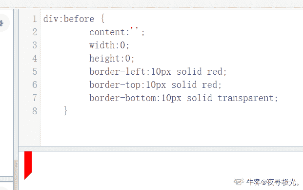

# 五十八、同城 2020 校园招聘笔试-前端

## 1

以下代码实现的图形对应正确是？  :before {
      content:'';
      width:0;
      height:0;
      border-left:10px solid red;
      border-top:10px solid red;
      border-bottom:10px solid transparent;
   }

正确答案: A   你的答案: 空 (错误)

```cpp
上直角梯形
```

```cpp
扇形
```

```cpp
下直角梯形
```

```cpp
三角形
```

本题知识点

前端工程师 58 集团 2020

讨论

[夜寻极光。](https://www.nowcoder.com/profile/868966489)



发表于 2021-08-25 12:01:17

* * *

## 2

请给出[5<6<3,3<2<4]代码的运行结果

正确答案: A   你的答案: 空 (错误)

```cpp
[true,true]
```

```cpp
[false,true]
```

```cpp
[true,false]
```

```cpp
[false,false]
```

本题知识点

前端工程师 58 集团 2020

讨论

[kris_glw](https://www.nowcoder.com/profile/860148385)

以下仅代表个人观点，可能有误：js 运算符是从左到右计算 5<6 为 true    true =1 ， 所以 1<3 为 true3<2 为 false    false=0， 所以 0<3 为 true

发表于 2021-04-27 15:51:21

* * *

## 3

下面代码输出为 true 的是?

正确答案: D   你的答案: 空 (错误)

```cpp
console.log([] === []);
```

```cpp
console.log(undefined == 0);
```

```cpp
console.log(undefined == false);
```

```cpp
console.log(false == '');
```

本题知识点

前端工程师 58 集团 2020

讨论

[uesugieriislf](https://www.nowcoder.com/profile/34068835)

false==' '//true

false==' '//true

console.log(false == '11 ');//false

false==0// true

false == undefined//false

true==1//true  true ==' '//false

[]是引用类型，比较的是地址。两个空数组的地址也不同。undefined==null 只有这一情况为 truenull/undefined 会被转化为数字：null 被转化为 0，undefined 被转化为 NaN。
alert( null > 0 );  // (1) false
alert( null == 0 ); // (2) false
alert( null >= 0 ); // (3) trueundefined 不应该被与其他值进行比较：alert( undefined > 0 ); // false (1)
alert( undefined < 0 ); // false (2)
alert( undefined == 0 ); // false (3)

发表于 2021-06-24 11:26:00

* * *

[【社会人】](https://www.nowcoder.com/profile/630854493)

 console.log([] === []);                                      false
console.log(undefined === 0);                        false
console.log(undefined === false);                    false
console.log(false == '');                                     true

发表于 2022-03-22 23:31:18

* * *

[夜寻极光。](https://www.nowcoder.com/profile/868966489)

```cpp
undefined == 0 相当于隐私转换成了 NAN == 0
```

发表于 2021-08-25 12:02:32

* * *

## 4

以下哪个不是伪类的属性?

正确答案: A   你的答案: 空 (错误)

```cpp
:before
```

```cpp
:active
```

```cpp
:hover
```

```cpp
:focus
```

本题知识点

前端工程师 58 集团 2020

讨论

[栗丸](https://www.nowcoder.com/profile/3995494)

before 是伪元素，其他的是伪类

发表于 2021-04-24 10:59:34

* * *

[【社会人】](https://www.nowcoder.com/profile/630854493)

| [:link](https://www.runoob.com/cssref/sel-link.html) | a:link | 选择所有未访问链接 | 1 |
| [:visited](https://www.runoob.com/cssref/sel-visited.html) | a:visited | 选择所有访问过的链接 | 1 |
| [:active](https://www.runoob.com/cssref/sel-active.html) | a:active | 选择活动链接 | 1 |
| [:hover](https://www.runoob.com/cssref/sel-hover.html) | a:hover | 选择鼠标在链接上面时 | 1 |
| [:focus](https://www.runoob.com/cssref/sel-focus.html) | input:focus | 选择具有焦点的输入元素 | 2 |

发表于 2022-03-22 23:32:55

* * *

[夜寻极光。](https://www.nowcoder.com/profile/868966489)

```cpp
:before 是伪元素
```

发表于 2021-08-25 12:06:42

* * *

## 5

以下哪个方法返回匹配的子字符串？

正确答案: C   你的答案: 空 (错误)

```cpp
contact()
```

```cpp
match()
```

```cpp
indexOf()
```

```cpp
search()
```

本题知识点

前端工程师 58 集团 2020

讨论

[街风晚凉](https://www.nowcoder.com/profile/7767700)

concat() 方法用于连接两个或多个数组。

该方法不会改变现有的数组，而仅仅会返回被连接数组的一个副本。

match() 方法可在字符串内检索指定的值，或找到一个或多个正则表达式的匹配。

该方法类似 indexOf() 和 lastIndexOf()，但是它返回指定的值，而不是字符串的位置。indexOf() 方法可返回某个指定的字符串值在字符串中首次出现的位置。search() 方法用于检索字符串中指定的子字符串，或检索与正则表达式相匹配的子字符串。返回匹配子串的起始位置

发表于 2021-04-24 16:32:36

* * *

[夜寻极光。](https://www.nowcoder.com/profile/868966489)

答案不严谨。 indexOf() 方法可返回某个指定的字符串值在字符串中首次出现的位置。match() 方法可在字符串内检索指定的值，或找到一个或多个正则表达式的匹配。返回的是存放匹配结果的数组。 

发表于 2021-08-25 12:26:05

* * *

[offer 快来砸我吧](https://www.nowcoder.com/profile/227012346)

这题出错了大概 indexof 是返回索引，应该是不是返回

发表于 2021-04-26 19:35:41

* * *

## 6

以下关于 javascript 描述正确的是？

正确答案: D   你的答案: 空 (错误)

```cpp
javascript 是一门面向对象的语言
```

```cpp
变量使用之前必须声明
```

```cpp
javascript 是一种编译性脚本语言
```

```cpp
javascript 是由 LiveScript 语言发展而来
```

本题知识点

前端工程师 58 集团 2020

讨论

[带翅膀的小青蛙](https://www.nowcoder.com/profile/549265154)

JavaScript 可以提升变量作用域，因此变量可以未申明而使用，但是 ES6 严格模式中变量必须先声明在使用。

发表于 2021-05-04 11:38:06

* * *

[夜寻极光。](https://www.nowcoder.com/profile/868966489)

JavaScript 是一种直译型脚本语言

发表于 2021-08-25 12:28:23

* * *

[uesugieriislf](https://www.nowcoder.com/profile/34068835)

js 不是面向对象的语言吗？[`developer.mozilla.org/zh-CN/docs/Learn/JavaScript/Objects`](https://developer.mozilla.org/zh-CN/docs/Learn/JavaScript/Objects)那为何 MDN 要介绍面向对象的知识？难道就因为 js 没有类这个概念？

发表于 2021-06-24 11:30:19

* * *

## 7

以下哪个 nodeType 值对应的是文本节点？

正确答案: C   你的答案: 空 (错误)

```cpp
1
```

```cpp
2
```

```cpp
3
```

```cpp
8
```

本题知识点

前端工程师 58 集团 2020

讨论

[带翅膀的小青蛙](https://www.nowcoder.com/profile/549265154)

1 表示元素节点，2 表示属性节点，3 表示文本节点。

发表于 2021-05-04 11:40:38

* * *

[夜寻极光。](https://www.nowcoder.com/profile/868966489)

如果节点是一个元素节点，nodeType 属性返回 1。

如果节点是属性节点, nodeType 属性返回 2。

如果节点是一个文本节点，nodeType 属性返回 3。

如果节点是一个注释节点，nodeType 属性返回 8。

发表于 2021-08-25 12:29:38

* * *

[李 Koko](https://www.nowcoder.com/profile/390043865)

1 是元素节点，2 是属性节点，3 是文本节点

发表于 2022-03-11 09:32:32

* * *

## 8

下列哪个不是块级元素

正确答案: B   你的答案: 空 (错误)

```cpp
div
```

```cpp
img
```

```cpp
h1
```

```cpp
ol
```

本题知识点

前端工程师 58 集团 2020

讨论

[牛客 991334836 号](https://www.nowcoder.com/profile/991334836)

img 是行内替换元素

发表于 2021-08-17 15:21:55

* * *

## 9

在 javascript 中，下面哪个不属于数组的方法

正确答案: B   你的答案: 空 (错误)

```cpp
sort
```

```cpp
length
```

```cpp
reverse
```

```cpp
concat
```

本题知识点

前端工程师 58 集团 2020

讨论

[牛客 241514279 号](https://www.nowcoder.com/profile/241514279)

length 是属性

发表于 2021-04-27 23:43:40

* * *

[牛客 879886777 号](https://www.nowcoder.com/profile/879886777)

。

发表于 2021-04-24 16:39:14

* * *

## 10

编写高性能 JavaScript，以下描述错误的是

正确答案: B   你的答案: 空 (错误)

```cpp
遵循严格模式："use strict"
```

```cpp
将 js 脚本放在页面顶部，加快渲染页面
```

```cpp
将 js 脚本成组打包，减少请求，尽量减少使用闭包
```

```cpp
使用非阻塞方式下载 js 脚本，最小化重绘(repaint)和回流(reflow)
```

本题知识点

前端工程师 58 集团 2020

讨论

[乐神可以](https://www.nowcoder.com/profile/794244110)

B 选项错误，为了提高页面加载的性能，应将 JS 脚本放在页面结构的底部，以防浏览器在处理 JS 文件时阻塞，影响页面结构其他资源的加载

发表于 2021-05-31 17:38:51

* * *

## 11

如何最小化重绘(repaint)和回流(reflow)

正确答案: D   你的答案: 空 (错误)

```cpp
需要对元素进行复杂的操作时，可以先隐藏(display:"none")，操作完成后再显示
```

```cpp
需要创建多个 DOM 节点时，使用 DocumentFragment 创建完后一次性的加入 document
```

```cpp
尽量避免用 table 布局（table 元素一旦触发回流就会导致 table 里所有的其它元素回流）
```

```cpp
尽量不要使用 css 属性简写，如：用 border-width, border-style, border-color 代替 border
```

本题知识点

前端工程师 58 集团 2020

讨论

[牛客 241514279 号](https://www.nowcoder.com/profile/241514279)

题目错了，应该是问哪个不能

发表于 2021-04-27 23:45:48

* * *

[野猪丶乔治](https://www.nowcoder.com/profile/643841294)

题目错了，应该问的是不能

发表于 2021-06-26 10:06:06

* * *

[uesugieriislf](https://www.nowcoder.com/profile/34068835)

我感觉 1、2、3 都可以啊，题目是不是有问题？

发表于 2021-06-24 14:29:06

* * *

## 12

link 与@import 的区别,描述错误的为

正确答案: B   你的答案: 空 (错误)

```cpp
link 是 HTML 方式， @import 是 CSS 方式
```

```cpp
link 串行下载，@import 最大限度支持并行下载
```

```cpp
link 可以通过 rel="alternate，stylesheet"指定候选样式
```

```cpp
@import 必须在样式规则之前，可以在 css 文件中引用其他文件
```

本题知识点

前端工程师 58 集团 2020

讨论

[uesugieriislf](https://www.nowcoder.com/profile/34068835)

**1.从属关系区别**  @import 是 CSS 提供的语法规则，只有导入样式表的作用；link 是 HTML 提供的标签，不仅可以加载 CSS 文件，还可以定义 RSS、rel 连接属性等。

**2.加载顺序区别**  加载页面时，link 标签引入的 CSS 被同时加载（并行）；@import 引入的 CSS 将在页面加载完毕后被加载（串行）。：当一个页面被加载的时候（就是被浏览者浏览的时候），link 引用的 CSS 会同时被加载，而@import 引用的 CSS 会等到页面全部被下载完再加载。所以有时候浏览@import 加载 CSS 的页面时会没有样式（就是闪烁），网速慢的时候还挺明显。

**3.兼容性区别**  @import 是 CSS2.1 才有的语法，故只可在 IE5+ 才能识别；link 标签作为 HTML 元素，不存在兼容性问题。

**4.DOM 可控性区别**  可以通过 JS 操作 DOM ，插入 link 标签来改变样式；由于 DOM 方法是基于文档的，无法使用@import 的方式插入样式。

5.@import 可以在 css 中再次引入其他样式表，比如创建一个主样式表，在主样式表中再引入其他的样式表，如：

@import “sub1.css”; @import “sub2.css”; sub1.css ———————- p {color:red;} sub2.css ———————- .myclass {color:blue}

这样有利于修改和扩展。

但是：这样做有一个缺点，会对网站服务器产生过多的 HTTP 请求，以前是一个文件，而现在确实两个或更多的文件了，服务器压力增大，浏览量大的网站还是谨慎使用。

发表于 2021-06-24 14:50:34

* * *

[牛客 241514279 号](https://www.nowcoder.com/profile/241514279)

link 最大限度支持并行 impor 串行

编辑于 2021-04-27 23:48:12

* * *

## 13

以下打印结果为 true 的是

正确答案: C   你的答案: 空 (错误)

```cpp
console.log("12" === 12)
```

```cpp
console.log (NaN === NaN)
```

```cpp
console.log (typeof(null) === typeof(window))
```

```cpp
console.log ([1,2,3] === [1,2,3])
```

本题知识点

前端工程师 58 集团 2020

讨论

[uesugieriislf](https://www.nowcoder.com/profile/34068835)

typeof 运算符把类型信息以字符串返回，返回值有六种可能:"number","boolean","string","object","function","undefined"

使用 typeof 检查数组、null 和 function 都会返回 ’ object ‘

发表于 2021-06-24 14:49:57

* * *

[我是土豆土豆](https://www.nowcoder.com/profile/854761076)

=== 是全等，即等号左右两边数值和数据类型都得相同才会返回 true，基本数据类型在存储的时候存储的是值，复杂数据类型（引用数据类型）在存储的时候是存的地址，所以在比较的时候注意即使值相同由于存的是地址，比较的也是地址可能不同。

发表于 2021-07-11 09:27:46

* * *

[一条菜狗](https://www.nowcoder.com/profile/743230950)

D 答案  ：  数组是引用类型， 引用类型比较的是地址

发表于 2021-06-10 15:48:29

* * *

## 14

```cpp
给定两个字符串形式的非负整数 num1 和 num2 ，计算它们的和。
```

本题知识点

前端工程师 58 集团 2020

讨论

[我是一条小咸鱼](https://www.nowcoder.com/profile/692116579)

```cpp
var arr = readline().split(' ')
var s1 = arr[0], s2 = arr[1], i = s1.length-1, j = s2.length -1
var carry = 0,res = []
while(i >= 0 || j >= 0 || carry){
    let num1 = i >= 0 ? parseInt(s1[i]) : 0
    let num2 = j >= 0 ? parseInt(s2[j]) : 0
    let sum = num1 + num2 + carry
    carry = Math.floor(sum / 10)
    res.push(sum % 10)
    i--
    j--
}
console.log(res.reverse().join(''))
```

发表于 2021-09-18 16:00:25

* * *

[Monsters!](https://www.nowcoder.com/profile/518394811)

#include <bits>using namespace std;
void solve(string s,string m){
    int len_i = s.size()-1;
    int len_j = m.size()-1;
    if(len_i<len_j){
        swap(s, m);
        swap(len_i,len_j);
    }
    int t = len_i - len_j;
    int array = 0;
    int temp = 0;
    while(t> 0){
     m = '0' +m;
     t --;
    }
    for(int i =len_i;i>=0;--i){
        temp = s[i] - '0' + m[i] - '0' +array;
        if(temp>=10){
            temp -= 10;
            array = 1;
        }else{
            array = 0;
        }
        s[i] = temp + '0';
    }
    if(array == 1){
        s = '1' +s;
    }
    cout<<s;
}
int main(){
    string s,m;
    cin>>s>>m;
    solve(s,m);
    return 0;
}

发表于 2021-11-02 16:02:34

* * *

[牛客 991334836 号](https://www.nowcoder.com/profile/991334836)

**let test=readline().split(" ")let num1=test[0]let num2=test[1]let carry=0let res=''let i=num1.length-1let j=num2.length-1while(i>=0||j>=0){    let temp=Number(num1[i])+Number(num2[j])+carry    if(i<0){        temp=Number(num2[j])+carry        i=0    }    if(j<0){        temp=Number(num1[i])+carry        j=0    }    carry=temp>=10? 1 : 0    res=(temp%10)+res    i--    j--}print(carry>0? `${carry}${res}`:`${res}`)**

发表于 2021-08-17 15:23:46

* * *

## 15

找出字符串中出现最多的字符和个数

本题知识点

前端工程师 58 集团 2020

讨论

[牛客 460332443 号](https://www.nowcoder.com/profile/460332443)

```cpp
function getStr(str) {
    const s = str.trim().split('');
    const a = {};
    let obj = {text: '', value: 0}
    s.forEach(item => {
        if (!a[item]){
             a[item] = 1;
        } else {
            a[item]++;
        }
        if (a[item] > obj.value) {
            obj = {text:item,value:a[item]}
        }
    })
    console.log(obj.value, obj)
}
```

发表于 2021-04-26 16:57:01

* * *

[TTTT 田](https://www.nowcoder.com/profile/62197939)

```cpp
import java.util.Arrays;
import java.util.Collections;
import java.util.HashMap;
import java.util.Scanner;

public class Main {
    public static void main(String[] args) {
        Scanner in = new Scanner(System.in);
        String str = in.next();
        char[] chars = str.toCharArray();
        HashMap<Character, Integer> map = new HashMap<Character, Integer>();
        for (int i = 0; i < chars.length; i++) {
            if(map.containsKey(chars[i])){

                map.put(chars[i],map.get(chars[i])+1);

            }else {
                map.put(chars[i],1);

            }
        }
        char maxchar = 'a';
        int maxcount = 0;
        for (Character key : map.keySet()) {

            if(map.get(key) > maxcount){
                maxcount = map.get(key);
                maxchar = key;
            }
        }

        System.out.println(maxchar+" "+maxcount);
    }
}
//hhhhufhweuihfwehuhhhhhh
```

 发表于 2021-06-04 10:44:43

* * *

[allbore](https://www.nowcoder.com/profile/2529194)

function maxStr(s){
    var arr = s.split('')
    var newarr = [] 
    arr.forEach(i => {
        const Reg = new RegExp(i, 'g')
        var n = s.match(Reg)
        if(n.length > newarr.length){
            newarr = n
        }
    })
    console.log(newarr[0], newarr.length)
}

发表于 2021-05-07 17:08:30

* * *

## 16

创建一个函数来判断给定的长度为 n 的表达式中的小括号是否闭合。（表达式不完全由括号组成，只要括号合法，就返回 true）

var expression = "(())()()"
var expressionFalse = "()(()";
isBalanced(expression); // true
isBalanced(expressionFalse); // false

isBalanced(""); // true 数据范围：进阶：时间复杂度，空间复杂度

本题知识点

前端工程师 58 集团 2020

讨论

[牛客 460332443 号](https://www.nowcoder.com/profile/460332443)

function fun(str) {
    const fn = b => {
     if (b.length>1) {
        b = b.replace('()','');
        return fn(b);
        } else {
            return b;
        }
    }
    const sss = fn(str)
    console.log(sss.length === 0,sss)

}

发表于 2021-04-26 16:58:40

* * *

[Veagau](https://www.nowcoder.com/profile/824807983)

```cpp
const readline = require('readline');
const rl = readline.createInterface({
    input:process.stdin,
    output:process.stdout
})

rl.on('line',(input:any)=>{
    let opArr = Array.from(input);
    let waitToClose = 0;
    while(opArr.length!=0){
        let tempOp = opArr.shift();
        if(tempOp==='('){
            ++waitToClose;
        }
        if(tempOp===')'){
            --waitToClose;
        }
    }
    console.log((waitToClose === 0));
})
```

发表于 2021-09-14 17:09:38

* * *

[Realdust](https://www.nowcoder.com/profile/7553279)

```cpp
const readline=require('readline');
const rl=readline.createInterface({
    input:process.stdin,
    output:process.stdout
});
rl.on('line',line=>{
   console.log(isBalanced(line));
})

function isBalanced(str){
    str=str||"";
    str=str.trim();
    let left=0;
    for(let i=0;i<str.length;i++){
        if(str[i]==='('){
           left++;
        }
        if(str[i]===')'){
            if(left>0){
                left--;
            }else{
                return false;
            }
        }
    }
    return left===0;
}

```

发表于 2021-05-07 21:18:36

* * *

## 17

1、“58 同城移动端提现业务需要对提现操作进行二次确认，现由你来负责开发这个提现确认弹窗，组件的 UI 设计如下图所示，目前支持微信及银行卡提现。”请用你熟悉的框架或 js 原生代码来设计这个组件，请从各个方面如：布局划分，样式实现，组件结构，组件方法，组件内部细节技术方案等尽量详细的描述（或伪代码）开发思路。      

你的答案

本题知识点

前端工程师 58 集团 2020

## 18

下面哪个属性不会让 div 脱离文档流？

正确答案: C   你的答案: 空 (错误)

```cpp
position: absolute
```

```cpp
position: fixed
```

```cpp
position: relative
```

```cpp
float: left
```

本题知识点

前端工程师 58 集团 2020

讨论

[学 201906062151566](https://www.nowcoder.com/profile/677621683)

根据官方文档所述,脱离文档流的方法有浮动(float)和绝对定位(poistion:absolute/fixed)。

发表于 2021-09-05 22:37:23

* * *

## 19

请给出这段代码的运行结果 var a = 1;
    function fn(a) {
    a = 2;
    alert(a);
    };
    fn(a);
    alert(a);

正确答案: C   你的答案: 空 (错误)

```cpp
1 1
```

```cpp
1 2
```

```cpp
2 1
```

```cpp
2 2
```

本题知识点

前端工程师 58 集团 2020

讨论

[止醉](https://www.nowcoder.com/profile/6518359)

上边好多人给的答案都不对，答主 715 的答案是对的，这题并不是考察声明提升顺序的，而是考察作用域的，，a = 2 并没有修改全局变量 a，函数内的形参会隐式初始化一个变量，函数执行的时候先查找当前函数作用域是否有 a,而当前函数作用域有形参 a,所以不会去修改全局那个变量 a

```cpp
var a = 1;

```
function fn(a) {
  a = 2; // 这个 a = 2 修改的是形参 a,并不是全局的 a
  alert(a);
}
```cpp

fn(a);
alert(a);
```

如果 fn 是下边这样没有这个形参 a,执行的时候在当前函数作用域找不到 a 的话才会去外层找到全局作用域的 a 从而修改全局变量 a，而这样的输出结果会是 2,2，绝不是 2,1

```cpp
function fn() {
    a = 2; // 这个 a = 2 才是修改了全局变量 a
    alert(a);
  }
```

编辑于 2022-02-10 19:13:49

* * *

[715](https://www.nowcoder.com/profile/358388847)

不要被参数 a 迷惑了，我觉得把代码换成以下形式你就看的懂了； var a = 1; function fn(num){ num = 2; console.log(num); } fn(a); console.log(a); 在操作变量的时候，会优先操作自己内部的变量。如果没有，那再去外层里找

发表于 2021-08-23 15:02:35

* * *

[牛客 989601589 号](https://www.nowcoder.com/profile/989601589)

var 声明的全局变量相当于 window.xxx。变量提升先于函数提升，函数内没有关键字直接声明变量相当于 window.a。先执行函数的 window.a 为 2，执行完之后 window.a 赋值为 1。真实执行的代码其实是这个 var a; //window.a = undefined     function fn(1) {     window.a = 2;     alert(a); // 函数体本身没有变量 a 去全局找 a = 2     }; window.a = 1     fn(1);     alert(a); // 1

发表于 2021-08-29 22:04:32

* * *

## 20

下面有关浏览器中使用 js 跨域的描述，说法错误的是

正确答案: A   你的答案: 空 (错误)

```cpp
域名、端口相同，协议不同，属于相同的域
```

```cpp
js 可以使用 jsonp 进行跨域
```

```cpp
通过修改 document.domain 来跨子域
```

```cpp
使用 window.name 来进行跨域
```

本题知识点

前端工程师 58 集团 2020

讨论

[牛客 36420805 号](https://www.nowcoder.com/profile/36420805)

同一协议(Protocol)、域(Domain)、端口(Port)，即为同域

发表于 2021-11-02 16:18:42

* * *

## 21

请求的方式 get 和 post 的描述不正确的是

正确答案: B   你的答案: 空 (错误)

```cpp
GET 请求的 URL 传参有长度限制，而 POST 请求没有长度限制
```

```cpp
GET 比 POST 安全
```

```cpp
GET 使用 URL 或 Cookie 传参。而 POST 将数据放在 BODY 中
```

```cpp
Get 是从服务器上获得数据，而 Post 则是向服务器传递数据的
```

本题知识点

前端工程师 58 集团 2020

讨论

[夜寻极光。](https://www.nowcoder.com/profile/868966489)

get 和 post 哪个更安全无法比较。一般人们说 post 更安全，因为它 url 中不像 get 那样放参数。但是 HTTP 协议中提到 GET 是安全的方法（safe method），其意思是说 GET 方法不会改变服务器端数据。

发表于 2021-08-25 12:58:33

* * *

[刘硕，](https://www.nowcoder.com/profile/60610612)

post 更加安全

发表于 2021-08-19 17:58:02

* * *

## 22

以下不属于 vuex 属性的是

正确答案: C   你的答案: 空 (错误)

```cpp
State
```

```cpp
Mutation
```

```cpp
Mounted
```

```cpp
Action
```

本题知识点

前端工程师 58 集团 2020

讨论

[给西瓜姐姐来个 offer](https://www.nowcoder.com/profile/240980941)

VueX 是一个专门为 Vue.js 应用设计的状态管理构架，统一管理和维护各个 vue 组件的可变化状态(你可以理解成 vue 组件里的某些 data )。

Vuex 有五个核心概念：

state, getters, mutations, actions, modules。

1\. state：vuex 的基本数据，用来存储变量

2\. getters：从基本数据(state)派生的数据，相当于 state 的计算属性

3\. mutation：提交更新数据的方法，必须是同步的(如果需要异步使用 action)。每个 mutation 都有一个字符串的 事件类型 (type) 和 一个 回调函数 (handler)。

回调函数就是我们实际进行状态更改的地方，并且它会接受 state 作为第一个参数，提交载荷作为第二个参数。

4\. action：和 mutation 的功能大致相同，不同之处在于 ==》1. Action 提交的是 mutation，而不是直接变更状态。 2\. Action 可以包含任意异步操作。

  5\. modules：模块化 vuex，可以让每一个模块拥有自己的 state、mutation、action、getters,使得结构非常清晰，方便管理。

发表于 2021-05-30 11:55:22

* * *

## 23

var，let，const 描述不正确的是

正确答案: D   你的答案: 空 (错误)

```cpp
let 和 const 都是块级作用域，var 是函数级作用域
```

```cpp
var 存在变量提升，let 和 const 不存在变量提升
```

```cpp
const 不可修改，声明时，直接初始化，var，let 可修改
```

```cpp
let，var 允许在相同的作用域内声明同一变量
```

本题知识点

前端工程师 58 集团 2020

## 24

下面有关 cookie,localStorage,SessionStorage 三者的描述，错误的是

正确答案: A   你的答案: 空 (错误)

```cpp
localStorage 可设置失效时间
```

```cpp
sessionStorage 仅在当前会话会有效，关闭页面或浏览器后被清除
```

```cpp
Cookie 每次都会携带 HTTP 头中，如果使用 cookie 保存过多数据会带来性能问题
```

```cpp
localStorage 和 sessionStorage 仅在客户端（即浏览器）中保存，不参与和服务器的通信
```

本题知识点

前端工程师 58 集团 2020

讨论

[夜寻极光。](https://www.nowcoder.com/profile/868966489)

a 有点迷惑。localStorage 本身没有提供过期机制。但是我们可以自己手动通过自定义方法设置它的失效。

发表于 2021-08-25 11:21:05

* * *

[山城郴王](https://www.nowcoder.com/profile/462634888)

sessionStorage 是浏览器才有，session 是会话的意思，浏览器和服务器都存在这个概念。

发表于 2021-12-06 01:12:12

* * *

[uesugieriislf](https://www.nowcoder.com/profile/34068835)

| localStorage | sessionStorage |
| 在同源的所有标签页和窗口之间共享数据 | 在当前浏览器标签页中可见，包括同源的 iframe |
| 浏览器重启后数据仍然保留 | 页面刷新后数据仍然保留（但标签页关闭后数据则不再保留） |

我们已经有了 cookie。为什么还要其他存储对象呢？

*   与 cookie 不同，Web 存储对象不会随每个请求被发送到服务器。因此，我们可以保存更多数据。大多数浏览器都允许保存至少 2MB 的数据（或更多），并且具有用于配置数据的设置。

*   还有一点和 cookie 不同，服务器无法通过 HTTP header 操纵存储对象。一切都是在 JavaScript 中完成的。

*   存储绑定到源（域/协议/端口三者）。也就是说，不同协议或子域对应不同的存储对象，它们之间无法访问彼此数据。

发表于 2021-06-24 15:08:52

* * *</bits>