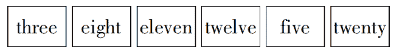

# 五十八、同城 2020 校园招聘笔试-数据分析

## 1

每天有数千万用户使用 58 平台，每个用户在 58 平台上会产生各种行为与数据，而这些行为和数据产生于各个业务与功能模块中，你如何把这些用户细分为有意义的几类？

你的答案

本题知识点

数据分析师 58 集团 2020

讨论

[牛客 61025512 号](https://www.nowcoder.com/profile/61025512)

根据用户最近交易距离当天天数（R），一段时间内用户消费的次数（F），一段时间内用户交易的总金额（M）将用户分为重要价值客户（RFM 都很大，优质客户，需要保持）、重要唤回客户（消费次数和交易总金额都大，但是最近无交易，需要唤回）、重要深耕客户（最近有交易、交易总金额也多，但是消费次数少，需要重点识别）、重要挽留客户（消费金额大，有潜力的价值用户）、潜力客户（最近有交易，交易次数多，需要挖掘）、新客户（最近有交易的，接触的新客户，有推广价值）、一般维持客户（交易次数多，但贡献不大、一般维持）、流失客户（都低，RFM 值均低于均值、相当于流失），可以针对不同的用户分群制定不同的营销策略，实现精细化的运营但是根据数据对用户的相应 R、F、M 进行评分时，很有可能因为异常值的影响造成分类效果不佳，可以采用 K-means 聚类，分别获取 R、F、M 的分类点，基于分类点制作评分卡，在对各用户的相应指标打分。

发表于 2021-09-02 20:56:27

* * *

[牛客 971469428 号](https://www.nowcoder.com/profile/971469428)

信息发布的用户，信息获取的用户

发表于 2021-06-07 15:55:16

* * *

## 2

与 58 同城合作的房产经纪人（隶属于各经纪公司，提供房屋买卖租赁服务等的中介），在合作到期后不再续费（流失），现想找到经纪人流失的原因，可以从哪些角度进行分析？

你的答案

本题知识点

数据分析师 58 集团 2020

讨论

[Dame、CX](https://www.nowcoder.com/profile/255407225)

内部:（1）是否平台的费用增高了（2）平台的签约手续是否较繁琐,分析所有到期后不再续费的经纪人的数据,看看他们在到期前是否有申请过续费等的操作。（3）经纪人在合约期间有没有成交过，如果没有，那么很大可能是经纪人觉得平台的客流不够，所以没有续费（4）这些流失的经纪人，是否有向客服投诉过，如果有，则应该认真去处理这些投诉。（5）有可能只是经纪人转行，所以就不续费。外部：（1）是否近期出现了新的竞品（2）和竞品对比一下费用，是否是因为我们的费用比其他高（3）竞品近期是不是有新活动，吸引了流失的那批经纪人

发表于 2021-08-03 14:31:32

* * *

[华山小乞丐](https://www.nowcoder.com/profile/315050602)

1、直接联系

最有效的分析是和流失的经纪人进行沟通，调查。找出流失的原因

2、自己依据数据进行分析

先从两个大的维度划分，内部原因和外部原因内部原因：产品功能、运营策略、用户构成等计算相应指标计算影响指数外部原因：政策、市场环境（主要考虑竞争对手的竞争）、各个房产经纪公司的的规定等

发表于 2021-08-30 15:39:09

* * *

## 3

最近公司要进行新的工位调整，小张、小李、小姚、小蒋被安排坐在一起，此时他们分别猜了一下座位情况：小张说：“我好像是坐在小李旁边。”小李说：“我的左手边不是小张就是小姚。”小姚说：“我肯定是坐在小蒋旁边”小蒋说：“小张应该是坐在我的左手边”假如他们四人都猜错了，那么他们从左到右的正确座位可能是：

正确答案: A   你的答案: 空 (错误)

```cpp
小蒋、小李、小姚、小张
```

```cpp
小张、小姚、小蒋、小李
```

```cpp
小李、小蒋、小姚、小张
```

```cpp
小姚、小张、小蒋、小李
```

本题知识点

产品 58 集团 2020 数据分析师

讨论

[零葬](https://www.nowcoder.com/profile/75718849)

直接答案代入法，A 刚好能使 4 个描述都为假

发表于 2021-09-08 18:05:09

* * *

[Dame、CX](https://www.nowcoder.com/profile/255407225)

根据题意 以上四个为全假第一点得出：张口李口张第二点得出：张蒋李口张第三点得出：张蒋李姚张第四点得出：蒋李姚张

发表于 2021-05-07 23:33:48

* * *

## 4

1，2，5，29，A，其中 A 是什么？

正确答案: D   你的答案: 空 (错误)

```cpp
31
```

```cpp
47
```

```cpp
841
```

```cpp
866
```

本题知识点

产品 58 集团 2020 数据分析师

讨论

[霍汽水](https://www.nowcoder.com/profile/617846312)

观察题干，数字变化过于迅猛，考虑次方规律。判断为：次方加和的规律。 观察选项，尾数不同。29x29+25 不用直接算，算尾数就行。9x9＝81，1+5＝6。 时间就金钱🐶

发表于 2021-09-25 17:48:01

* * *

[零葬](https://www.nowcoder.com/profile/75718849)

通项公式：a[n]=a[n-1]²+a[n-2]^(2      )(n>2)

发表于 2021-09-08 18:06:27

* * *

[loyiin](https://www.nowcoder.com/profile/337495304)

2=1²+1²⁵=2²+1²²⁹=5²+2²A=29²+5²=866

发表于 2021-04-25 10:41:21

* * *

## 5

把下面的六个图形分为两类，使每一类图形都有各自的共同特征或规律，分类正确的一项是：

正确答案: A   你的答案: 空 (错误)

```cpp
1/3/5，2/4/6
```

```cpp
1/3/4，2/5/6
```

```cpp
1/3/6，2/4/5
```

```cpp
1/4/6，2/3/5
```

本题知识点

产品 58 集团 2020 数据分析师

讨论

[牛各](https://www.nowcoder.com/profile/479414011)

没看懂参考答案。。为什么答案不可以是 1/3/4，2/5/6（按单词含 e 量划分，1/3/4 含 e 两个或以上，2/5/6 只含一个 e）

发表于 2021-04-25 11:36:13

* * *

[零葬](https://www.nowcoder.com/profile/75718849)

按奇偶性分组

发表于 2021-09-08 18:07:02

* * *

[牛客 710082035 号](https://www.nowcoder.com/profile/710082035)

如果聚焦到只看字母，而不看图片代表的英文意思就很难想到按其奇偶排序，一千个人，一千个看法，我的想法更离谱 D，第一类都是 t 开头，另外一类都不是

发表于 2021-04-27 18:36:26

* * *

## 6

（）对于 爬行 相当于 袋鼠 对于（）

正确答案: D   你的答案: 空 (错误)

```cpp
缓慢，澳大利亚
```

```cpp
匍匐，考拉
```

```cpp
运动，动物
```

```cpp
壁虎，跳跃
```

本题知识点

产品 58 集团 2020 数据分析师

讨论

[零葬](https://www.nowcoder.com/profile/75718849)

壁虎的运动方式是爬行，袋鼠的运动方式是跳跃

发表于 2021-09-08 18:08:01

* * *

[鹿比大熊](https://www.nowcoder.com/profile/3083033)

壁虎的行走方式是爬行，袋鼠的行走方式是跳跃

发表于 2021-08-17 10:23:35

* * *

## 7

以下哪家公司的主营业务与 58 同城最相近：

正确答案: A   你的答案: 空 (错误)

```cpp
Craigslist
```

```cpp
Booking
```

```cpp
Airbnb
```

```cpp
Agoda
```

本题知识点

产品 58 集团 2020 数据分析师

讨论

[牛各](https://www.nowcoder.com/profile/479414011)

58 同城：中国的分类信息网站，其服务覆盖生活的各个领域，提供房屋租售、招聘求职、二手买卖、汽车租售、宠物票务、餐饮娱乐、旅游交友等多种生活信息，覆盖中国所有大中城市。 Craigslist：是由 Craig Newmark 于 1995 年在美国创立的一个网上大型免费分类广告网站。Craigslist 上涵盖的分类信息包括了求职招聘、房屋租赁买卖、二手产品交易、家政服务、地区活动指南、寻找罗曼史对象。Booking 缤客：是一家帮您在网上预订世界各地住宿的网站。Airbnb：爱彼迎是一家联系旅游人士和家有空房出租的房主的服务型网站，它可以为用户提供多样的住宿信息。 Agoda：是一家在线酒店预订网站。 ——摘自某度百科

发表于 2021-04-25 11:41:06

* * *

## 8

CPM（Cost Per Mille）千次曝光成本，在互联网广告中常用来衡量广告主的投放费用成本。某次广告投放完成后，获取了部分数据：1）获得 200 万次广告曝光；2）广告点击率为 0.8%；3）每个点击的单价为 1.875 元那么该广告主的千次曝光成本是多少元？

正确答案: A   你的答案: 空 (错误)

```cpp
15
```

```cpp
0.015
```

```cpp
7.5
```

```cpp
0.075
```

本题知识点

产品 58 集团 2020 数据分析师

讨论

[牛各](https://www.nowcoder.com/profile/479414011)

CPM=1000*点击率*单价=1000*0.8%*1.875=15

发表于 2021-04-25 11:42:22

* * *

[零葬](https://www.nowcoder.com/profile/75718849)

200 万次曝光一共花费 2000000*0.8%*1.875=30000 元，因此每千次花了，30000/2000=15 元，即 CPM=15 元

发表于 2021-09-08 18:09:27

* * *

## 9

老板安排了一项任务，小张单独完成要 20 天，小李单独完成要 10 天，如果小张先工作一天然后小李接替一天，再由小张接替小李工作一天，2 人如此交替工作，完成这项任务共用多少天?

正确答案: A   你的答案: 空 (错误)

```cpp
14
```

```cpp
16
```

```cpp
15
```

```cpp
13
```

本题知识点

产品 58 集团 2020 数据分析师

讨论

[零葬](https://www.nowcoder.com/profile/75718849)

设工作量为 20，小张每天能完成 1，小李每天能完成 2，(1+2)*6=18，即两人交替 12 天能完成到 18，第 13 天小张来工作，只能完成 1，因此还需要小李干一天，一共花费 14 天

发表于 2021-09-08 18:11:52

* * *

[努力学习小李子](https://www.nowcoder.com/profile/708056817)

小张一天效率：0.05 ；小李一天效率：0.1 小张一天，小李一天，交替：两天的效率为 0.15 总任务为 1， 1/0.15 = 6.6667...6.6667 * 2 = 13.3334 天，超过 13 天，则需要 14 天完成

发表于 2021-04-26 16:06:11

* * *

[牛客 984348614 号](https://www.nowcoder.com/profile/984348614)

1+2+1+2+1+2+1+2+1+2+1+2+1+2=21

发表于 2021-04-26 14:31:04

* * *

## 10

有三袋不知道具体数量的金币，其中两袋中的金币全部为伪造硬币，每个伪造硬币为 11 克，另外一袋为真硬币，每个真币重为 10 克。现有一个单托盘刻度秤，要确保能找出那两袋伪造硬币需要最少称重几次？

正确答案: A   你的答案: 空 (错误)

```cpp
1 次
```

```cpp
2 次
```

```cpp
3 次
```

```cpp
4 次
```

本题知识点

产品 58 集团 2020 数据分析师

讨论

[牛客 750366915 号](https://www.nowcoder.com/profile/750366915)

从其中一个袋子中拿出来 2 个金币，从其中另一个袋子里拿出 1 个金币，将这三个金币放在秤上面秤重量。如果秤出来 31g，则拿出 2 个金币的袋子里面装的是真币；如果秤出来 32g，则拿出 1 个金币的袋子里面装的是真币；如果秤出来 33g，则没拿出金币的袋子里面装的是真币。

发表于 2021-05-13 19:40:50

* * *

[牛客 998761890 号](https://www.nowcoder.com/profile/998761890)

这个题当真没有问题？三个袋子硬币数量是否相等？袋子本身算不算重量？就算上面的都忽略，如果假的有 10 个假币，称一次能看出来？

发表于 2021-04-23 22:05:44

* * *

[MrGu](https://www.nowcoder.com/profile/638204925)

这题，问的是最少，如果拿到 10g 的金币，称一下就行了

发表于 2021-05-05 17:24:56

* * *

## 11

有一暗号：“金金木金木”对应为数字 26，“金金木金”对应为数字 13，则“木金木金金”对应的数字为

正确答案: D   你的答案: 空 (错误)

```cpp
62
```

```cpp
31
```

```cpp
23
```

```cpp
11
```

本题知识点

产品 58 集团 2020 数据分析师

讨论

[牛各](https://www.nowcoder.com/profile/479414011)

二进制数金金木金木=11010（2）=26（10）金金木金=1101（2）=13（10）木金木金金=01011（2）=11（10）

发表于 2021-04-25 12:00:29

* * *

[零葬](https://www.nowcoder.com/profile/75718849)

金是二进制的 1，木是二进制的 0

发表于 2021-09-08 18:13:32

* * *

## 12

某数千人规模的公司组织全员参加的团建活动分组，分组时发现：

每组分 3 个人，会多余 2 个人；

每组分 5 个人，会多余 4 个人；

每组分 7 个人，会多余 6 个人；

每组分 9 个人，会多余 8 个人；

每组分 11 个人则正好；

那么该公司一共有多少人？

正确答案: D   你的答案: 空 (错误)

```cpp
3149
```

```cpp
5384
```

```cpp
2789
```

```cpp
2519
```

本题知识点

产品 58 集团 2020 数据分析师

讨论

[袁玉麟](https://www.nowcoder.com/profile/752533995)

只有 d 能被 11 整除。。。

发表于 2021-04-25 18:40:58

* * *

[疾风随缘](https://www.nowcoder.com/profile/640489700)

1 只有 D 能被 11 整除 2 仔细观察可以发现每次都少一个人即找到分法的最小公倍数，一定再减少一个人即可。5*7*9（因为能被 9 整除一定能被 3 整除）=315 的倍数所以逆推回去，+1 一定能够被 315 整除。排除 BC 然后根据 11 整除，再排除 A（显得很蠢）（说实话，题没出好，不应该用 11 整除就排除 3 个的）

发表于 2021-06-14 10:12:21

* * *

[零葬](https://www.nowcoder.com/profile/75718849)

答案代入法，但是发现只有 D 能被 11 整除，直接选

发表于 2021-09-08 18:14:02

* * *

## 13

某公司薪酬 HR 向某员工提供了 2 个加薪方案，第一种方案是 12 个月后，在当前 20 万元年薪基础上，每年提高 2 万元薪酬。第二种方案是 6 个月后在当前 20 万年薪基础上，每半年比上个半年薪酬提高 5000 元薪酬。请选择以下哪项为假：

正确答案: C   你的答案: 空 (错误)

```cpp
选择第二种方案将会在第一年内就能得到涨薪。
```

```cpp
假设将全部收入做理财，年利率 8%的情况下，3 年内，第二种方案优于第一种。
```

```cpp
在 36 个月内，第二种方案总收入比第一种方案多 5000 元。
```

```cpp
不考虑通货膨胀的情况下，第二种方案在 6 年内优于第一种。
```

本题知识点

产品 58 集团 2020 数据分析师

讨论

[牛客 775164942 号](https://www.nowcoder.com/profile/775164942)

方案一：第一年年底 200000 第二年年底 220000 第 3 年年底 240000 第 n 年年底 200000+20000*（n-1）方案二：每半年比上个半年薪酬提高 5000 元薪酬重点是半个年薪是 100000 第一年 第 6 个月是 100000，这个时候涨薪 5000，即 105000 第一年年底 105000，这时候也涨薪 5000，到达 110000 第一年的总年薪就是 205000 A.这里可以看到方案二第一年就涨薪了第二年 6 月份的工资就是 110000，涨薪到达 115000 第二年年底工资 115000 ，涨薪 120000 第二年一整年的工资为 110000+115000=225000 第 3 年 6 月份的工资就是 120000，涨薪到达 125000 第 3 年年底工资 125000 ，涨薪到达 13000 第 3 年一整年的工资为 120000+125000=245000C，可以看到每一年都比第一方案都要多 5000，故 36 月内，第二方案总收入比第一方案多 15000BD，方案二比方案一好，故是对的。

发表于 2021-08-01 14:49:00

* * *

[牛客 89545718 号](https://www.nowcoder.com/profile/89545718)

港真，第一种不是更划算吗...第二种每半年加 5000，那一年就是 10000，第一种虽然第一年没有但人家第二年就加 20000 了，赶上了第一年的收入。肯定是我理解有问题

发表于 2021-04-30 14:13:02

* * *

[牛客 148258145 号](https://www.nowcoder.com/profile/148258145)

不是很理解

发表于 2021-04-28 20:23:32

* * *

## 14

有一堆垃圾，规定要由 ZWL 三人清理。Z 因外出没能参加，留下９元钱做代劳费。W 上午起早干了５小时，L 下午接着干了４小时刚好干完。问 W 户和 L 户应怎样分配这９元钱？ 正确答案: A   你的答案: 空 (错误)

```cpp
W 得６元，L 得３元
```

```cpp
W 得 5 元，L 得 4 元
```

```cpp
W 得 4 元，L 得 5 元
```

```cpp
W 得 4.5 元，L 得 4.5 元
```

本题知识点

产品 58 集团 2020 数据分析师

讨论

[牛各](https://www.nowcoder.com/profile/479414011)

题目得知清理完该垃圾用时 4+5=9 小时。原来三个人没报酬时，每个人应免费工作 9/3=3 小时 Z 不干留下 9 元二人分，W 多分担了 Z 的 5-3=2 小时，L 多分担了 4-3=1 小时 Z 的每小时 9/(1+2)=3 元所以 W：2*3=6    L：1*3=3

发表于 2021-04-25 12:05:59

* * *

## 15

有人说："我绝不第二次戒烟”，下面各项含义中，不包含的是：

正确答案: B   你的答案: 空 (错误)

```cpp
在这次戒烟前，从未戒过烟
```

```cpp
以前戒过烟，但失败了
```

```cpp
如果这次戒烟失败，就不再戒烟
```

```cpp
相信这次戒烟一定成功
```

本题知识点

产品 58 集团 2020 数据分析师

讨论

[牛客 48335993 号](https://www.nowcoder.com/profile/48335993)

第一次戒烟失败，当别人建议再次戒烟的时候拒绝了，难道不可以是 B 选项的说法吗？

发表于 2021-04-24 15:56:45

* * *

[Rise1](https://www.nowcoder.com/profile/792116314)

因为无法判断第一次戒烟是否成功，就算第一次成功，还是可能后面出现再次抽烟的情况，形成二次戒烟的场景。

发表于 2021-10-23 18:46:06

* * *

## 16

设有编号为 1、2、3、…、10 的 10 张背面向上的纸牌，现有 10 名游戏者，第 1 名游戏者将所有编号是 1 的倍数的纸牌翻成另一面向上的状态，接着第 2 名游戏者将所有编号是 2 的倍数的纸牌翻成另一面向上的状态，……，第 n 名(n≤10)游戏者，将所有编号是 n 的倍数的纸牌翻成另一面向上的状态，如此下去，当第 10 名游戏者翻完纸牌后，那些纸牌正面向上的最大编号与最小编号的差是： 

正确答案: D   你的答案: 空 (错误)

```cpp
2
```

```cpp
4
```

```cpp
6
```

```cpp
8
```

本题知识点

产品 58 集团 2020 数据分析师

讨论

[牛客 261447977 号](https://www.nowcoder.com/profile/261447977)

原本是背面向上，最后变为正面向上，也就是说翻了奇数次。 也就是找出有奇数个公约数的数字，也就是可以开平方的数，分别是 1，4，9

发表于 2021-08-01 14:26:22

* * *

[牛客 984348614 号](https://www.nowcoder.com/profile/984348614)

第一次 1-10 各一次第二次 2 4 6 8 10 各一次第三次 3 6 9 各一次第四次 4 8 第五次 5 10 第六到十次  6 7 8 9 10 各一次出现次数单数则最后呈现正面  求编号最大跟最小的，从两头看起，9 翻 3 次，1 翻 1 次，差为 8

发表于 2021-04-26 14:35:56

* * *

[零葬](https://www.nowcoder.com/profile/75718849)

模拟一下游戏过程可以知道最终正面朝上的硬币中，编号最小的为 2，编号最大的为 10，因此差值为 8

发表于 2021-09-08 18:16:03

* * *

## 17

下列不能计入当年 GDP 的是：

正确答案: D   你的答案: 空 (错误)

```cpp
在安居客购买 180 万元的新房
```

```cpp
农民当年生产的不是用于自己消费的粮食
```

```cpp
在 58 二手房购买的二手房，其中支付给中介的一万元
```

```cpp
在 58 二手车购买的八万元的二手轿车
```

本题知识点

产品 58 集团 2020 数据分析师

讨论

[伯庸 2020](https://www.nowcoder.com/profile/43845773)

二手车的价值在它作为新车时已经计入了以前的 GDP,

发表于 2021-05-02 19:13:51

* * *

## 18

以下哪款产品的盈利模式与其他的不同：

正确答案: D   你的答案: 空 (错误)

```cpp
58 同城
```

```cpp
淘宝
```

```cpp
马蜂窝
```

```cpp
神州专车
```

本题知识点

产品 58 集团 2020 数据分析师

讨论

[你真牛哇](https://www.nowcoder.com/profile/971990331)

神州专车采用专业车辆、专业司机的 B2C 运营模式。也就是神州的专车都是公司的资产，司机也是公司的员工，由自己向用户提供服务。其他三家都是作为第三方中介平台为客户提供服务。

发表于 2021-08-21 15:08:15

* * *

[SevenSai](https://www.nowcoder.com/profile/561803635)

因为是 58 同城出的题目，所以选 58 同城😂😂😂

发表于 2021-05-28 23:13:19

* * *

## 19

常见的企业运营模式包括大客户模式、直销模式、分销模式、免费模式、会议营销模式、社群模式、体验营销模式等。其中小米、逻辑思维、理财体验金分别属于哪种模式？

正确答案: A   你的答案: 空 (错误)

```cpp
直销模式、社群模式、体验营销
```

```cpp
直销模式、分销模式、免费模式
```

```cpp
分销模式、直销模式、免费模式
```

```cpp
免费模式、分销模式、直销模式
```

本题知识点

产品 58 集团 2020 数据分析师

讨论

[tongtongzhang](https://www.nowcoder.com/profile/411018958)

在不知道选啥的情况下一般看重复选项，有重复的正确答案大概率都藏在里面，因为重复的是干扰项，所以排除 cd，理财体验金肯定是体验营销所以是 a

发表于 2021-08-10 16:53:13

* * *

[牛客 261447977 号](https://www.nowcoder.com/profile/261447977)

排除法，理解体验金肯定是体验营销，所以排除 BCD

发表于 2021-08-01 14:28:25

* * *

## 20

互联网产品在初启动阶段，为了带动用户增长，有以下几种常见方式：邀请奖励、名人效应、打造爆款、媒体公关、免费试用等。其中新浪微博核心方式是：

正确答案: B   你的答案: 空 (错误)

```cpp
邀请奖励
```

```cpp
名人效应
```

```cpp
媒体公关
```

```cpp
免费试用
```

本题知识点

产品 58 集团 2020 数据分析师

## 21

某黑客小组制定了一暗语方便数字与暗码多重加密，已知其数字解码后的文字“金木水”的意思是“周日秘密攻击”，“土火金”的意思是“启动攻击网络”，“日土月星”的意思是“网络隔离防御加固”，那么“月”的意思是

正确答案: B   你的答案: 空 (错误)

```cpp
网络
```

```cpp
隔离
```

```cpp
防御
```

```cpp
加固
```

本题知识点

产品 58 集团 2020 数据分析师

讨论

[牛客 651885493 号](https://www.nowcoder.com/profile/651885493)

我的理解是：一个字代表一个词解出来金：攻击土：网络火：启动组成句子顺序需将第一个字调到最后一位，如：土火金-->火金土那么：日土月星-->土月星日，这样月就是隔离

发表于 2021-05-04 15:24:34

* * *

## 22

下列不属于人工智能研究领域的是

正确答案: D   你的答案: 空 (错误)

```cpp
专家系统
```

```cpp
神经网络
```

```cpp
机器翻译
```

```cpp
数字签名
```

本题知识点

产品 58 集团 2020 数据分析师

讨论

[MrGu](https://www.nowcoder.com/profile/638204925)

```cpp
数字签名是密码学范畴
```

发表于 2021-05-05 17:28:24

* * *

## 23

郊区有一个养猪场和一个马场，其中：猪的总购入价是 1 万元，饲料费 1 千元/月，养殖周期 1 年，售价 4 万元；马的总购入价是 5 万元，饲料费 3 千元/月，养殖周期 2 年，售价 25 万元；请根据以上信息，补充合理的假设和参数，构建经营分析模型，分析养猪和养马哪个赚钱？

你的答案

本题知识点

数据分析师 58 集团 2020

讨论

[Dame、CX](https://www.nowcoder.com/profile/255407225)

和参考答案差很远,我只是写了个 python 来求解已知条件下的收益。经过多次测试，发现无论投资多少万，收益多少年，最终都会是投资猪更赚钱

```cpp
print("请输入可以用于投资的金额(万元):")
amount = int(input())
n_pig = amount
n_horse = amount
print("请输入投资年限:")
year = int(input())

#猪的收益:
for i in range(1,year+1,1):
    n_pig = n_pig//2.2 * 4 + round(n_pig - (n_pig//2.2)*2.2,2)
income_pig = round(n_pig-amount,2) #收入-投资的 100 万元

#马的收益:
if year == 1:  #由于马的投资回报周期为两年,所以投资一年的收益为 0
    imcome_horse = 0
elif year % 2 == 0:
    year_horse = int(year / 2)
    for i in range(1,year_horse+1,1):
        n_horse = n_horse//8.6 * 25 + round(n_horse - (n_horse//8.6)*8.6,2)
elif year % 2 == 1:  #奇数年份,马还未能收益,故与上一年的收益一致
    year_horse = int((year - 1) / 2)
    for i in range(1,year_horse+1,1):
        n_horse = n_horse//8.6 * 25 + round(n_horse - (n_horse//8.6)*8.6,2)
income_horse = round(n_horse - amount,2)

print("投资%d 万元,投资%d 年,投资猪的收益为:%.2f" %(amount,year,income_pig))
print("投资%d 万元,投资%d 年,投资马的收益为:%.2f" %(amount,year,income_horse))
```

编辑于 2021-08-03 14:47:53

* * *

[牛客 151936795 号](https://www.nowcoder.com/profile/151936795)

假设养猪基础设施成本 5 万元，管理和销售成本 1 千元/月，10%可能性卖不出去；假设养马基础设施成本 10 万元，管理和销售成本 2 千元/月，20%可能性卖不出去；利润 = （营业额-饲料费-管理和销售成本-市场风险）/ 周期（年）每年的利润  = （营业额-饲料费-管理和销售成本-市场风险）/ 周期（年）猪的年平均利润 = （4-0.1*12-0.1*12）*（1-0.1）/ 1 = 1.44 马的年平均利润 = （25-0.3*24-0.2*24）*（1-0.2）/ 2 = 5.2 所以总利润 = 养殖年平均利润 * 年 - 养殖基础设施成本 养猪的总利润 = 1.44*年份 -5 养马的总利润 = 5.2*年份 - 10 利润相等时，年份为 1.33，总利润为-3.2 所以，若养殖一年，养猪亏损较少。若养殖 2 年以上，养马赚的更多

发表于 2021-09-04 10:06:27

* * *

[有爱青年](https://www.nowcoder.com/profile/642711261)

**若都养偶数年：**养猪月均利润=（40000-（10000+1000*12））/12= 1500 养马月均利润=（250000-（50000+3000*24））/24=5333 结论：养马赚钱**若养不到养殖**周期，******且不考虑转手手续费**设 X 为养马月数养马月均利润 Y=(250000*X/24-（24-X）*3000-50000)/X 只要保证 Y>1500,则养马赚钱，计算得 X=10.23(月) 即养满 10.23 月则养马赚钱**若养不到养殖**周期，******且不考虑转手手续费（养的越久手续费越少）**设 X 为养马月数,设 24 月手续费为 Z，则每月手续费为 Z/24 养马月均利润 Y=(250000*X/24-（24-X）*3000-50000-Z/24*（24-X）)/X 同样保证 Y>1500,则养马赚钱，具体情况需考虑手续费的多少

发表于 2021-08-30 21:08:41

* * *