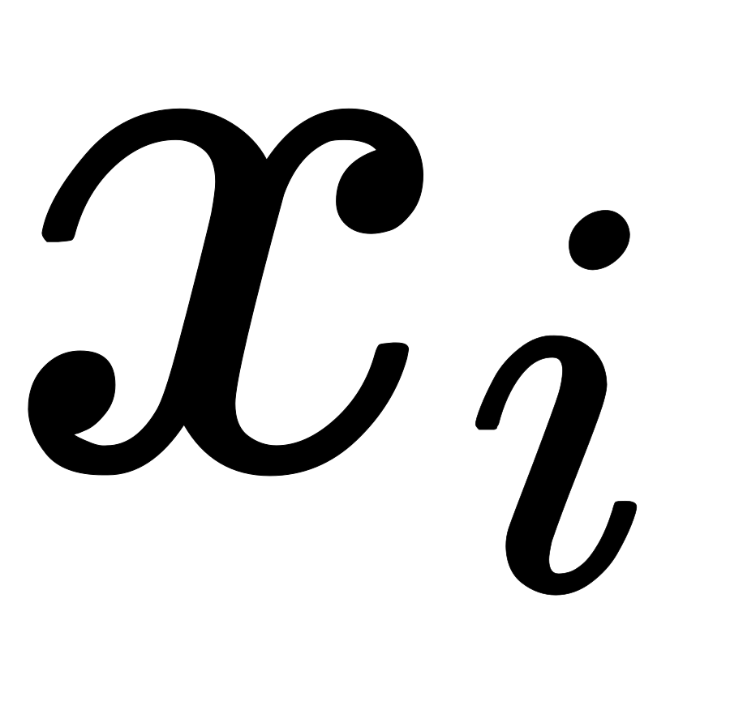
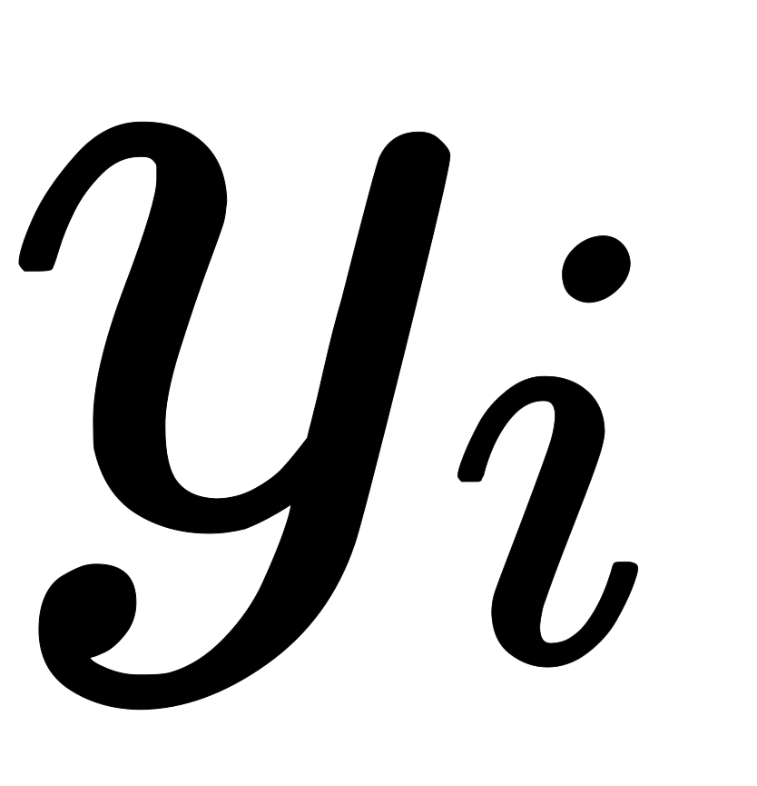
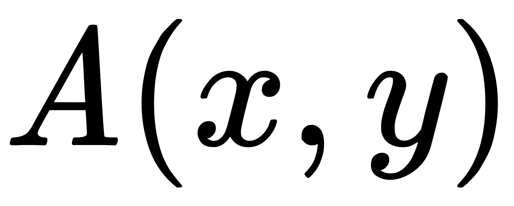
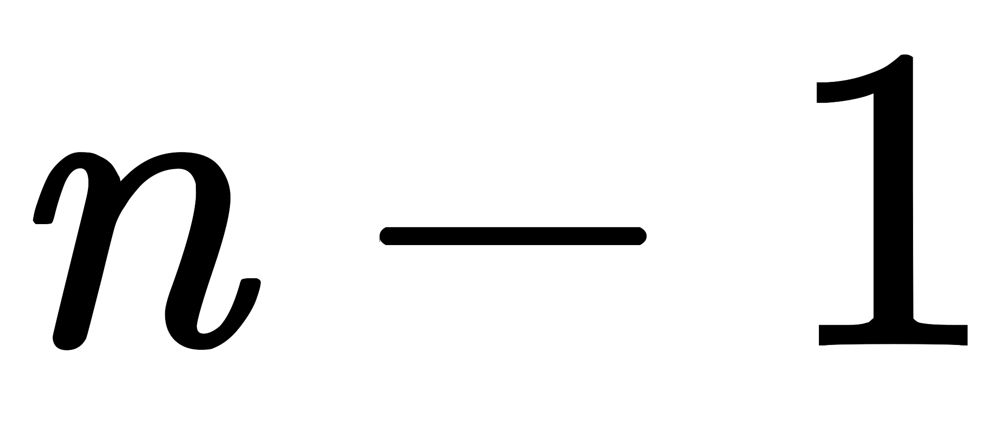
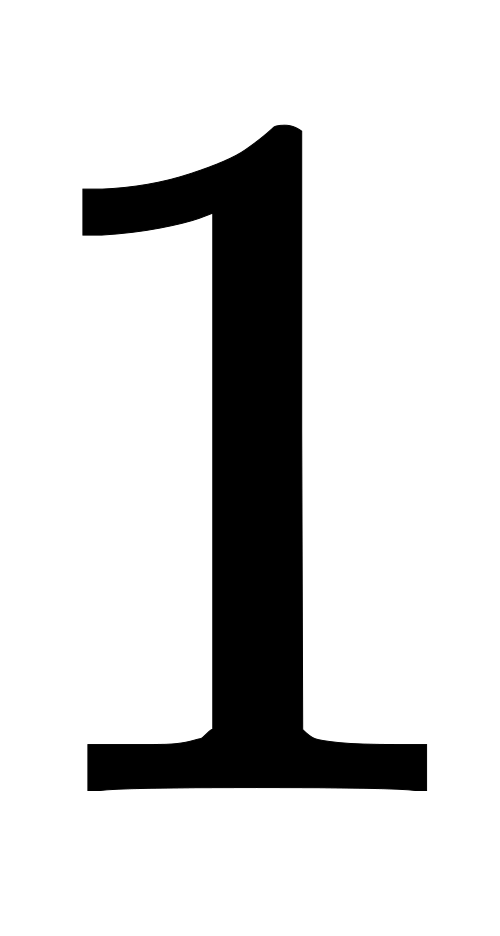

# 【2021】阿里巴巴编程题（4 星）

## 1

小强现在有个物品,每个物品有两种属性和.他想要从中挑出尽可能多的物品满足以下条件:对于任意两个物品和,满足或者.问最多能挑出多少物品.进阶：时间复杂度，空间复杂度

本题知识点

Java 工程师 C++工程师 PHP 工程师 golang 工程师 前端工程师 安卓工程师 iOS 工程师 算法工程师 大数据开发工程师 信息技术岗 运维工程师 安全工程师 数据分析师 数据库工程师 游戏研发工程师 区块链 测试开发工程师 测试工程师 阿里巴巴 2021

讨论

[无敌暴龙战神](https://www.nowcoder.com/profile/965636909)

参考下面大佬的解法我们可以先对 x 排序，x 是上升的，但并不是完全单调上升，因为有相等的 x。若假设我们的 x 是严格单调的的话，这个题就可以转化为，对 y 求严格单调上升子序列的长度问题。对于 x 有相等的情况

```cpp
1    2    2    5 10   19   21   32
这里有两个 2 是相等的，这时候我们对 y 求最长上升子序列的结果是 4，很明显不符合题意，因为要保证 x 也严格单调上升

```
1    2    2    5
10   21   19   32 这里我们对 x 相等的 y 进行从大到小的排序，这时候结果是 3，符合题意，因为 x 相等如果 y 是从小到大的话，
有可能统计重复的 x, 我们让 y 降序排列的话就破坏了 y 单调上升的可能，不会重复统计 x;
```cpp 
```

这样就转化为了对 y 求严格单调上升子序列问题，因为 n=10⁵ , 我们需要一个 nlogn 的做法，不让会超时。

```cpp
#include <iostream>
#include <algorithm>
#include <cstring>
#include <vector>
using namespace std;

const int N = 123456;

int q[N]; 
// q 数组放的是序列长度为 len 结尾的的最小的 y （贪心的做法）
// q[len] = min(y)，显然我们 q[]是一个严格单调上升的数组
// 简单证明一下 假设 q[5] >= q[6],那么以长度为 6 的子序列中的第 5 个数 y < q[6] 因为是严格上升的子序列嘛
// 因为 q[6] <= q[5], 那么 y < q[5]，这与我们假设 q[5]最小矛盾，所以 q[6] > q[5];

// 那么问题来了，对于一个 y,我们应该把它放到哪个位置呢，这里有个贪心的做法，我们可以把它接到小于当前 y 的最大的 q[i]后面
// 因为 q[] 单调上升，q[i]是小于 y 的最大的数，那么 q[i + 1] >= y, 那么 q[i + 1]一定可以被更新, q[i + 1] = y;
// 具体怎么二分可以看下面的代码
struct Node {
    int x, y;
    bool operator< (const Node & t) const {
        if (x == t.x) return y > t.y;
        return x < t.x;
    }
}nodes[N];

int main() {
    int T;
    cin >> T;
    while (T -- ) {
        int n;
        cin >> n;
        for (int i = 0; i < n; i++) cin >> nodes[i].x;
        for (int i = 0; i < n; i++) cin >> nodes[i].y;
        sort(nodes, nodes + n);
        memset(q, 0, sizeof q);
        // 为了结果一定存在，设置一个哨兵
        q[0] = -2e9;
        int len = 0;
        for (int i = 0; i < n; i++) {
            int l = 0, r = len;
            while (l < r) {
                int mid = (l + r + 1) >> 1;
                // 若 mid 符合条件, 那么要找到最大的一定在 mid 的右边,同时 mid 也有可能是答案, l = mid
                if (q[mid] < nodes[i].y) l = mid;
                // 否则 mid 不是答案，答案在 mid 的左边 r = mid - 1; 
                // 边界问题 mid = (l + r + 1) / 2;要上取整，因为有个减一
                else r = mid - 1;
            }
            len = max(len, r + 1);
            q[r + 1] = nodes[i].y;
        }
        cout << len << endl;
    }

    return 0;
}
```

发表于 2021-08-22 14:04:03

* * *

[牛客 777207027 号](https://www.nowcoder.com/profile/777207027)

给个 Python 能过的

```cpp
from bisect import bisect_left
T = int(input())
for _ in range(T):
    n = int(input())
    X = map(int, input().split())
    Y = map(int, input().split())
    a = sorted(zip(X, Y), key=lambda x: (x[0], -x[1]))
    total = 0
    q = [0] * 100005
    for i in range(n):
        t = bisect_left(a=q, x=a[i][1], lo=0, hi=total)
        if t == total:
            total += 1
        q[t] = a[i][1]
    print(total)
```

假如用了 dataclass 会 TLE

```cpp
from __future__ import annotations

from bisect import bisect_left
from dataclasses import dataclass

@dataclass
class node:
    x: int
    y: int

    def __lt__(self, other: node):
        if self.x != other.x:
            return self.x < other.x
        return self.y > other.y

T = int(input())
for _ in range(T):
    n = int(input())
    X = map(int, input().split())
    Y = map(int, input().split())
    a = sorted(node(*x) for x in zip(X, Y))
    total = 0
    q = [0] * 100005
    for i in range(n):
        t = bisect_left(a=q, x=a[i].y, lo=0, hi=total)
        if t == total:
            total += 1
        q[t] = a[i].y
    print(total)
```

编辑于 2021-05-03 03:12:10

* * *

[Soccer,soccer,soccer!](https://www.nowcoder.com/profile/396822396)

```cpp
 ```

```cpp
import java.util.Arrays;
import java.util.Comparator;
import java.util.Scanner;

public class Main {
    public static void main(String[] args)
    {
        Scanner sc = new Scanner(System.in);
        //T 表示有 T 组数据
        int T = sc.nextInt();
        for (int i = 1; i <= T; i++)
        {
            //n 表示有 n 个物品
            int n = sc.nextInt();
            //t[i][0]表示第 i 个物品的 x 属性，t[i][1]表示第 i 个物品的 y 属性，
            int[][] t = new int[n][2];
            int[] nums = new int[n];
            for (int j = 0; j < n; j++)
            {
                t[j][0] = sc.nextInt();
            }
            for (int j = 0; j < n; j++)
            {
                t[j][1] = sc.nextInt();
            }
            //x 相同的情况下 y 更大的排序在前面（不然的话会重复统计相同的 x）
            Arrays.sort(t, new Comparator<int[]>()
            {
                @Override
                public int compare(int[] o1, int[] o2)
                {
                    if(o1[0] > o2[0])
                        return 1;
                    else if(o1[0] < o2[0])
                        return -1;
                    else
                    {
                        if(o1[1] > o2[1])
                            return -1;
                        else if(o1[1] < o2[1])
                            return 1;
                        else
                            return -1;
                    }
                }
            });

            for (int j = 0; j < n; j++)
            {
                nums[j] = t[j][1];
            }
            int result = longestSubArray(nums);
            System.out.println(result);

        }
    }
    public static int longestSubArray(int[] nums)
    {
        //tails[k] 的值代表长度为 k+1 子序列 的尾部元素值
        int[] tails = new int[nums.length];
        // res 为 tails 当前长度
        int res = 0;
        for (int num:nums)
        {
            int l = 0;
            //r 为数组的长度，而不是 length-1，这点要注意
            int r = res;
            while(l < r)
            {
                int m = l + (r - l)/2;
                if(tails[m] < num)
                    l = m + 1;
                else
                    r = m;
            }
            tails[l] = num;
            if(r == res)
                res++;
        }
        return  res;
    }
}

```

```cpp  
```

编辑于 2021-06-20 22:44:58

* * *

## 2

小强发现当已知以及时,能很轻易的算出的值.但小强想请你在已知 和的情况下,计算出的值.因为这个结果可能很大,所以所有的运算都在模 1e9+7 下进行.

本题知识点

Java 工程师 C++工程师 PHP 工程师 golang 工程师 前端工程师 安卓工程师 iOS 工程师 算法工程师 大数据开发工程师 信息技术岗 运维工程师 安全工程师 数据分析师 数据库工程师 游戏研发工程师 区块链 测试开发工程师 测试工程师 阿里巴巴 2021

讨论

[零葬](https://www.nowcoder.com/profile/75718849)

题目避开了 n=0 的说明，其实 n=0 时 x⁰+y⁰=2，假设 f(n)=x^n+y^n，试两个 n 能够发现规律：

*   x²+y²=(x+y)²-2xy=A*(x+y)-B*2，其实就是 f(2)=Af(1)-Bf(0)，接下来强行去凑这个结构
*   x³+y³=(x+y)³-3x²y-3xy² = (x+y)*(x²+y²+2xy)-3x²y-3xy²=(x+y)(x²+y²)+2x²y+2xy²-3x²y-3xy²=A*(x²+y²)-B*(x+y)=A*f(2)-B*f(1)

到这里就可以类似斐波那契数列那么求解了，第**i**项依赖前面两项。但这个数据量给爷整跪了，为了避免思考数据类型溢出用了 python，结果超时。然后改用 java 抠这个溢出的边界

```cpp
import java.io.BufferedReader;
import java.io.InputStreamReader;
import java.io.IOException;

public class Main {
    static final int MOD = 1000000007;
    public static void main(String[] args) throws IOException {
        BufferedReader br = new BufferedReader(new InputStreamReader(System.in));
        int T = Integer.parseInt(br.readLine());
        while(T-- > 0){
            String[] params = br.readLine().split(" ");
            int A = Integer.parseInt(params[0]);
            int B = Integer.parseInt(params[1]);
            int n = Integer.parseInt(params[2]);
            if(n == 1){
                System.out.println(A);
            }else if(n == 2){
                System.out.println(A*A - 2*B);
            }else{
                long dp1 = 2L, dp2 = (long)A, dp = 0L;
                for(int i = 2; i <= n; i++){
                    // 注意相减之后可能越界，加上个 MOD 防止溢出
                    dp = ((A * dp2) % MOD - (B * dp1) % MOD + MOD) % MOD;
                    dp1 = dp2;
                    dp2 = dp;
                }
                System.out.println(dp);
            }
        }
    }
}
```

编辑于 2021-11-23 15:09:07

* * *

[ξ达瓦](https://www.nowcoder.com/profile/7177937)

容易出错的点：1）用 long long 类型数据做运算; 2）数据溢出和输入是负数的情形：
if(f[i] < 0) {
            f[i] += modBase;
        }

发表于 2021-10-27 19:33:56

* * *

[牛客 576990316 号](https://www.nowcoder.com/profile/576990316)

根据规律进行递归，也可以把结果存入数组或变量之中，后面进行更新

发表于 2021-08-04 23:26:54

* * *

## 3

小强现在有个节点,他想请你帮他计算出有多少种不同的二叉树满足节点个数为且树的高度不超过的方案.因为答案很大,所以答案需要模上 1e9+7 后输出.
树的高度: 定义为所有叶子到根路径上节点个数的最大值.
例如: 当 n=3,m=3 时,有如下 5 种方案:数据范围：进阶：时间复杂度，空间复杂度

本题知识点

Java 工程师 C++工程师 PHP 工程师 golang 工程师 前端工程师 安卓工程师 iOS 工程师 算法工程师 大数据开发工程师 信息技术岗 运维工程师 安全工程师 数据分析师 数据库工程师 游戏研发工程师 区块链 测试开发工程师 测试工程师 阿里巴巴 2021

讨论

[HFUTONEPIECE](https://www.nowcoder.com/profile/504069549)

```cpp
import java.util.*;

public class Main{
    public static final int MOD = 1000000007;

    public static void main(String[] args) {
        Scanner in = new Scanner(System.in);
        int n = in.nextInt();
        int m = in.nextInt();
        // dp[i][j]表示 i 个节点最大深度为 j 的树数量
        long[][] dp = new long[n+1][m+1];
        Arrays.fill(dp[0], 1);
        for(int i = 1; i <= n; i++) {
            for(int j = 1; j <= m; j++) {
                for(int k = 0; k < i; k++) {
                    // 左子树节点数为 k，右子树节点数为 i-k-1，且左右子树都要求小于等于 j-1
                    dp[i][j] = (dp[i][j] + dp[k][j-1] * dp[i-k-1][j-1] % MOD) % MOD;
                }
            }
        }
        System.out.println(dp[n][m]);
    }
}
```

发表于 2021-07-04 17:33:37

* * *

[乔木少年](https://www.nowcoder.com/profile/749839858)

```cpp
#include <bits/stdc++.h>

using namespace std;

const int MOD = 1e9 + 7;

int main() {
    int n; // 节点个数
    int m; // 最大高度
    cin >> n >> m;

    // dp[i][j] 表示 i 个节点能够组成的高度不超过 j 的树的个数
    vector<vector<long long>> dp(n + 1, vector<long long>(m + 1));
    for(int i = 0; i <= m; ++i) {
        dp[0][i] = 1;
    }

    for(int i = 1; i <= n; ++i) {
        for(int j = 1; j <= m; ++j) {
            // 选取一个节点作为根节点
            // k 个节点作为左子树，i - k - 1 个节点作为右子树
            for(int k = 0; k < i; ++k) {
                dp[i][j] = (dp[i][j] + dp[k][j - 1] * dp[i - k - 1][j - 1] % MOD) % MOD;
            }
        }
    }

    cout << dp[n][m] << endl;
}
```

发表于 2021-08-11 16:53:27

* * *

[寒冰-侠客](https://www.nowcoder.com/profile/442275737)

N 个结点二叉树的个数是卡特兰数，计算方法可以用递归思想得到，此题目同样如此，但还要增加一个高度限制。因此用二维数组来做 dp。N 个点，高度不大于 M 二叉树，可以由二分为两棵子树，高度不大于 M-1，此时注意子树节点数量不能超过 2^(M-1)-1。

```cpp
#include <bits/stdc++.h>//ASI
typedef long long ll;
using namespace std;
ll n,m,mod=1000000007,f[55][55];
ll dfs(ll n,ll m)
{
    if(n<=1)
        return 1;
    if(f[n][m])
        return f[n][m];
    ll ans=0,i;
    for(i=0; i<n; i++)
    { /**< 易错点，1<<(m-1)当 m 大于 33 时会出错。 */
        if(i<=(1LL<<(m-1))-1&&n-1-i<=(1LL<<(m-1))-1)
            ans=(ans+dfs(i,m-1)*dfs(n-1-i,m-1)%mod)%mod;
    }
    return f[n][m]=ans;
}
int main()
{
    int i,j;
    cin>>n>>m;
    cout<<dfs(n,m)<<endl;
    return 0;
}
```

发表于 2021-05-01 12:42:29

* * *

## 4

小强在玩一个走迷宫的游戏，他操控的人物现在位于迷宫的起点，他的目标是尽快的到达终点。
每一次他可以选择花费一个时间单位向上或向下或向左或向右走一格，或是使用自己的对称飞行器花费一个时间单位瞬移到关于当前自己点中心对称的格子，且每一次移动的目的地不能存在障碍物。
具体来说，设当前迷宫有  行  列，如果当前小强操控的人物位于点 ，那么关于点  中心对称的格子  满足  且  。
需要注意的是，对称飞行器最多使用次。

本题知识点

Java 工程师 C++工程师 PHP 工程师 golang 工程师 前端工程师 安卓工程师 iOS 工程师 算法工程师 大数据开发工程师 信息技术岗 运维工程师 安全工程师 数据分析师 数据库工程师 游戏研发工程师 区块链 测试开发工程师 测试工程师 阿里巴巴 2021

讨论

[春小卷](https://www.nowcoder.com/profile/450022534)

三维广度搜索+位运算优化时间和空间

    这道题我们先分析一下，如果没有对称飞行器，就是一道普通广搜题。但是加了飞行器，如果飞行次数没有限制，也是一道普通广搜题只是除了四个 direction 多了一个分支。可是飞行器有次数限制。那么如果用(x,y)点的状态应该再加一个维度：飞行次数 z。因为当 z1 不等于 z2 时，P(x,y,z1)和 Q(x,y,z2)是两种不同的状态。

    假设 z1<z2，即 P 和 Q 在相同的横纵坐标，但是 P 剩余的飞行次数更多。level1 是 P 已经走的步数， level2 是 Q 走的步数。如果 level1<level2。假设从(x,y,z2)走到终点的最优解是 n 步，容易想到，从(x,y,z1)一定可以走 n 步到达终点。此时 P 状态走到最优点的步数更少。所以在层次遍历的最优解中不该包含 z2\.

    也就是说在向 z 增加转移的过程中，**我们应该看 matrix[x][y][0]...matrix[x][y][z]中是否已经有为 1 的点，如果有就不必再在第 z 层再走 x，y。**

    我们可以用位运算压缩三维数组，matrix[x][y]第 z 位代表是否已经遍历过(x,y,z)点。至于判断该点是否可走，我们应该看当前位置(x，y)小于等于 z 的位是否有 1。类似于子网掩码的算法。高于 z 为置 0，低位置 1，与 matrix[x][y]相与。得到结果大于 0 则说明有 1 不需遍历。等于 0 说明使用更少的飞行器没有走过这一点。可以加入遍历集。

代码：

```cpp
package main

import (

   "fmt"

)

type Obj struct {

   X, Y, Z int

}

func main() {

   var n, m, sx, ex, sy, ey int

   var cur byte

   fmt.Scan(&n, &m)

   matrix := make([][]int, 0, n)

   for i := 0; i < n; i++ {

      matrix = append(matrix, make([]int, m))

      for j := 0; j < m + 1; j++ {

         fmt.Scanf("%c", &cur)

         switch cur {

         case 'S':

            sx = i

            sy = j

         case 'E':

            ex = i

            ey = j

         case '#':

            matrix[i][j] = 1

         }

      }

   }

   fmt.Println(bfs(sx,sy, ex, ey, n, m, matrix))

}

func bfs(sx, sy, ex, ey, n, m int, matrix [][]int) int {

   var direction = [][]int{{-1, 0, 0}, {1, 0, 0}, {0, -1, 0}, {0, 1, 0}, {0, 0, 1}}

   queue := make([]Obj, 1, m*n)

   queue[0] = Obj{sx, sy, 0}

   level := 0

   for len(queue) != 0 {

      level++

      for limit := len(queue); limit > 0; limit-- {

         node := queue[0]

         queue = queue[1:]

         direction[4][0], direction[4][1] = n-1-2*node.X, m-1-2*node.Y

         for _, d := range direction {

            x, y, z := node.X + d[0], node.Y + d[1], node.Z + d[2]

            if x == ex && y == ey {

               return level

            }

            if x >= 0 && y >= 0 && x < n && y < n && z <= 5 && ((1<<(z+1))-1) & matrix[x][y] == 0 {

               matrix[x][y] += 1 << z

               queue = append(queue, Obj{x, y, z})

            }

         }

      }

   }

   return -1

}
```

发表于 2021-09-01 15:42:35

* * *

[乔木少年](https://www.nowcoder.com/profile/749839858)

```cpp
#include <bits/stdc++.h>

using namespace std;

struct Node{
    int x; // 坐标 x
    int y; // 坐标 y
    int t; // 对称飞行器剩余次数
    int s; // 步数
};

int dx[4] = {0, 0, 1, -1};
int dy[4] = {1, -1, 0, 0};

vector<string> board;
vector<vector<int>> vis;
int M, N;

bool check(Node node) {
    return node.x >= 0 && node.x < N && node.y >= 0 && node.y < M
            && board[node.x][node.y] != '#' && vis[node.x][node.y] == 0;
}

int bfs(Node node) {
    queue<Node> q;
    q.push(node);

    while(!q.empty()) {
        Node n = q.front();
        q.pop();
        int x = n.x, y = n.y;
        if(board[x][y] == 'E') {
            return n.s;
        }
        for(int i = 0; i < 5; ++i) {
            Node temp;
            if(i == 4) {
                if(n.t > 0) {
                    // 这里下标从 0 开始，题目中下标从 1 开始
                    temp.x = N - 1 - x;
                    temp.y = M - 1 - y;
                    temp.s = n.s + 1;
                    temp.t = n.t - 1;
                }
            } else {
                temp.x = x + dx[i];
                temp.y = y + dy[i];
                temp.s = n.s + 1;
                temp.t = n.t;
            }

            if(check(temp)) {
                vis[temp.x][temp.y] = 1;
                q.push(temp);
            }
        }
    }

    return -1;
}

int main() {
    cin >> N >> M;
    board = vector<string>(N);
    vis = vector<vector<int>>(N, vector<int>(M));
    for(int i = 0; i < N; ++i) {
        cin >> board[i];
    }
    for(int i = 0; i < N; ++i) {
        for(int j = 0; j < M; ++j) {
            if(board[i][j] == 'S') {
                vis[i][j] = 1;
                Node node = {i, j, 5, 0};
                cout << bfs(node) << endl;
                return 0;
            }
        }
    }
}
```

发表于 2021-08-12 10:38:48

* * *

[寒冰-侠客](https://www.nowcoder.com/profile/442275737)

广搜，不过数组开 3 维。

```cpp
#include <bits/stdc++.h>
typedef long long ll;
using namespace std;
struct node
{
    int x,y,t;
};
int n,m,sx,sy,ex,ey,v[505][505][6];
int dx[4]= {0,0,1,-1},dy[4]= {1,-1,0,0};
char a[505][505];
queue<node>q;
void bfs(int x,int y)
{
    v[x][y][0]=1;
    int i,j,t,nx,ny;
    q.push({x,y,0});
    while(q.size())
    {
        x=q.front().x,y=q.front().y,t=q.front().t;
        q.pop();
        for(i=0; i<5; i++)
        {
            if(i==4)
            {
                if(t<5)
                    nx=n+1-x,ny=m+1-y,t++;
                else
                    continue;
            }
            else
                nx=x+dx[i],ny=y+dy[i];
            if(nx>=1&&nx<=n&&ny>=1&&ny<=m&&a[nx][ny]!='#'&&v[nx][ny][t]==0)
            {
                if(i==4)
                    v[nx][ny][t]=v[x][y][t-1]+1;
                else
                    v[nx][ny][t]=v[x][y][t]+1;
                if(nx==ex&&ny==ey)
                    return;
                q.push({nx,ny,t});
            }
        }
    }
}
int main()
{
    ios::sync_with_stdio(0),cin.tie(0);
    int i,j,ans=-1;
    cin>>n>>m;
    for(i=1; i<=n; i++)
        for(j=1; j<=m; j++)
        {
            cin>>a[i][j];
            if(a[i][j]=='S')
                sx=i,sy=j;
            if(a[i][j]=='E')
                ex=i,ey=j;
        }
    bfs(sx,sy);
    for(i=0; i<6; i++)
        if(v[ex][ey][i])
            ans=v[ex][ey][i]-1;
    cout<<ans;
    return 0;
}

```

 发表于 2021-05-02 18:54:50

* * *

## 5

最近部门要选两个员工去参加一个需要合作的知识竞赛，每个员工均有一个推理能力值 ，以及一个阅读能力值 。如果选择第  个人和第  个人去参加竞赛，那么他们在阅读方面所表现出的能力为 ，他们在推理方面所表现出的能力为 。
现在需要最大化他们表现较差一方面的能力，即让  尽可能大，问这个值最大是多少。进阶：时间复杂度，空间复杂度

本题知识点

Java 工程师 C++工程师 PHP 工程师 golang 工程师 前端工程师 安卓工程师 iOS 工程师 算法工程师 大数据开发工程师 信息技术岗 运维工程师 安全工程师 数据分析师 数据库工程师 游戏研发工程师 区块链 测试开发工程师 测试工程师 阿里巴巴 2021

讨论

[牛客 555793294 号](https://www.nowcoder.com/profile/555793294)

将员工的两项能力值之差的绝对值|ai-bi|由小到大排序，那么较差的能力是 A 还是 B 肯定是由排在后面的员工决定的。用后面员工的较弱能力（A 或者 B）跟当前该项能力的最大值相加，然后和当前记录的最大弱项和值比较就 OK 了。import java.util.*;public class Main
{

    public static int arr[][];
    public static int maxX,maxY;
    public static int maxMin;
    public static double res;
    public static int n;
    public static void main(String[]args)
    {
        Scanner scan=new Scanner(System.in);
        n=scan.nextInt();

        arr=new int[n][2];
        for(int i=0;i<n;i++)
        {
            arr[i][0]=scan.nextInt();
            arr[i][1]=scan.nextInt();
        }
        Arrays.sort(arr,new Comparator<int[]>() {
            @Override
            public int compare(int[]o1,int[]o2) 
            {
                return Math.abs(o1[0]-o1[1])-Math.abs(o2[0]-o2[1]);
            }
        });
        maxX=arr[0][0];
        maxY=arr[0][1];

        for(int i=1;i<n;i++)
        {
             int current;
             if(arr[i][0]>arr[i][1])
                 current=arr[i][1]+maxY;
             else
                 current=arr[i][0]+maxX;
             if(current>maxMin)
                 maxMin=current;
             maxX=Math.max(arr[i][0], maxX);
             maxY=Math.max(arr[i][1], maxY);
        }

        res=maxMin/2.0;

        System.out.println(res);
    }

}

发表于 2021-06-12 19:26:57

* * *

[寒冰-侠客](https://www.nowcoder.com/profile/442275737)

先把数据按 Ai 排序，然后二分答案 mid。依次检查第 i 个元素能否在其后的元素 i+1.....n 之中找到满足条件的组合。先用 lowerbound 找到 A 值满足要求的第一个元素下标 t，检查这个元素之后的所有元素中是否有 B 值能和 Bi 组合满足 mid 条件。此处用一个后缀最大值数组来存储某元素之后的最大值。

```cpp
#include <bits/stdc++.h>
typedef long long ll;
using namespace std;
struct node
{
    int x,y;
    bool operator<(const node B)const
    {
        return x<B.x;
    }
}a[200005];
int n,b[200005],maxv[200005];
bool check(int x)
{
    for(int i=1;i<=n;i++)
    {   /**< 在 i 之后找到能和 a[i].x 的和满足要求的位置 */
        node temp={x-a[i].x,0};
        int t=lower_bound(a+i+1,a+n+1,temp)-a;
        if(t==n+1)
            continue;/**< 显然 t 之后的 x 都满足要求，那么最大的 y 是否满足要求？ */
        if(a[i].y+maxv[t]>=x)
            return true;
    }
    return false;
}
int main()
{
    ios::sync_with_stdio(0),cin.tie(0);
    int i,j;
    cin>>n;
    for(i=1;i<=n;i++)
        cin>>a[i].x>>a[i].y;
    sort(a+1,a+n+1);
    for(i=n;i>=1;i--)/**< 后缀数组存储最大值 */
        maxv[i]=max(maxv[i+1],a[i].y);
    int l=0,r=1e9,mid,best=0;
    while(l<=r)
    {
        mid=l+r>>1;
        if(check(mid))
         best=mid,l=mid+1;
        else
            r=mid-1;
    }
    printf("%.1f",best/2.0);
    return 0;
}

```

发表于 2021-05-02 17:40:17

* * *

[kyzheng](https://www.nowcoder.com/profile/67331839)

Python 版本，算法复杂度过大，供参考

```cpp
n = int(input())
a = [[] for i in range(n)]

for i in range(n):
    a[i] = input().split()

for i in range(n):
    for j in range(len(a[i])):
        a[i][j] = int(a[i][j])

m_min = []

for i in range(n-1):
    for j in range(i+1, n):
        m1 = (a[i][0] + a[j][0]) / 2
        m2 = (a[i][1] + a[j][1]) / 2
        m_min.append(min(m1, m2))

print(max(m_min))

```

发表于 2022-03-19 11:40:50

* * *

## 6

在一个地区有  个城市以及  条无向边，每条边的时间边权都是 ，并且这些城市是联通的，即这个地区形成了一个树状结构。每个城市有一个等级。
现在小强想从一个城市走到另一个不同的城市，并且每条边经过至多一次，同时他还有一个要求，起点和终点城市可以任意选择，但是等级必须是相同的。
但是小强不喜欢走特别远的道路，所以他想知道时间花费最小是多少。进阶：时间复杂度，空间复杂度

本题知识点

Java 工程师 C++工程师 PHP 工程师 golang 工程师 前端工程师 安卓工程师 iOS 工程师 算法工程师 大数据开发工程师 信息技术岗 运维工程师 安全工程师 数据分析师 数据库工程师 游戏研发工程师 区块链 测试开发工程师 测试工程师 阿里巴巴 2021

讨论

[牛客 971135973 号](https://www.nowcoder.com/profile/971135973)

根据 WwSsXx 的解法，换成 BFS，感谢 dalao

```cpp
    import java.util.*;
    import java.math.*;
    public class Main{
        static int[] level;
        static ArrayList<Integer>[] lists;
        static int res = Integer.MAX_VALUE;
        public static void main(String []args){
            Scanner in = new Scanner(System.in);
            int n = in.nextInt();
            level = new int[n];
            lists = new ArrayList[n];
            for(int i=0;i<n;i++){
                level[i] = in.nextInt();
                lists[i] = new ArrayList<Integer>();
            }
            for(int i=0;i<n-1;i++){
                int x = in.nextInt()-1;
                int y = in.nextInt()-1;
                lists[x].add(y);
                lists[y].add(x);
            }
            for(int i=0;i<n;i++){
                Queue<Integer> que = new LinkedList<>();
                boolean []vis = new boolean[n];
                que.offer(i);
                vis[i] = true;
                int length = 0;
                while(!que.isEmpty()){
                    int size = que.size();
                    int flag= 0;
                    for(int j=0;j<size;j++){
                        int temp = que.poll();
                        if(temp!=i&&level[temp]==level[i]){
                            res = Math.min(res,length);
                            flag =1;
                            break;
                        }
                        for(int x:lists[temp]){
                            if(!vis[x]){
                                que.offer(x);
                                vis[x] = true;
                            }
                        }
                    }
                    if(flag==1) break;
                    length++;
                }
            }
            if(res==Integer.MAX_VALUE){
                res = -1;
            }
            System.out.println(res);
        }
    }
```

发表于 2021-06-10 16:48:14

* * *

[yyyywwwwqqqq](https://www.nowcoder.com/profile/941955088)

```cpp
import collections
n = int(input())
edge = [[] for i in range(n)]
a=list(map(int, input().split()))
for i in range(n-1):
    x,y = map(int, input().split())
    edge[x-1].append(y-1)
    edge[y-1].append(x-1)
ans = n
d = collections.defaultdict(list)
for i in range(n):
    d[a[i]].append(i)
if len(d)==len(a):
    print(-1)
else:
    for k,v in d.items():
        if len(v)==1:
            continue
        else:
            for root in v:
                stack = [root]
                deep = 0
                visited=set()
                while stack:
                    tmp = []
                    while stack:
                        node = stack.pop()
                        visited.add(node)
                        if a[node]==a[root] and node!=root:
                            ans = min(ans, deep)
                            break
                        for i in edge[node]:
                            if i not in visited:
                                tmp.append(i)
                    deep+=1
                    stack = tmp.copy()
                    if deep>=ans:
                        break
    print(ans)

```

发表于 2021-08-02 11:05:56

* * *

[牛客小浩](https://www.nowcoder.com/profile/430301100)

```cpp
#include<iostream>
#include<bits/stdc++.h>
using namespace std;
//其实就是求深度（因为节点的长度是 1）图论中的深度
vector<int> g[5005];
int rank_d[5005];
int ans = INT_MAX;
int root = 0;

void dfs(int cur,int before,int deep){

    if(cur!=root&&rank_d[cur]==rank_d[root]){
        ans = min(ans,deep);
    }
    //遍历节点下的所有元素
    for(int i=0;i<g[cur].size();i++){
       if(g[cur][i]!=before){
           //这要保证 不与上一个节点重复即可
           dfs(g[cur][i],cur,deep+1);

       }
    }
}
int main(){
    int n;
    cin>>n;
    //等级
    for(int i=1;i<=n;i++){
        int temp = 0;
        cin>>temp;
        rank_d[i] = temp;
     }
    //处理图
    for(int j=1;j<n;j++){
        int x,y;
        cin>>x>>y;
        g[x].push_back(y);
        g[y].push_back(x);
    }

    //深度遍历图的每一个节点
    for(int i=1;i<=n;i++){
        root  = i;
        dfs(i,0,0);
    }

    cout<<(ans==INT_MAX?-1:ans);

    return 0;
}
```

编辑于 2021-08-15 21:58:29

* * *

## 7

有个牛牛一起去朋友家吃糖果，第个牛牛一定要吃块糖果.

而朋友家一共只有块糖果，可能不会满足所有的牛牛都吃上糖果。

同时牛牛们有个约定，每一个约定为一个牛牛的编号对，表示第个和第个牛牛是好朋友，他俩要么一起都吃到糖果，要么一起都不吃。

**保证每个牛牛最多只出现在一个编号对中。**

您可以安排让一些牛牛吃糖果，一些牛牛不吃。

要求使能吃上糖果的牛牛数量最多（吃掉的糖果总量要小于等于），并要满足不违反牛牛们的个约定。

本题知识点

Java 工程师 C++工程师 PHP 工程师 golang 工程师 前端工程师 安卓工程师 iOS 工程师 算法工程师 大数据开发工程师 信息技术岗 运维工程师 安全工程师 数据分析师 数据库工程师 游戏研发工程师 区块链 测试开发工程师 测试工程师 阿里巴巴 2021

讨论

[liuxing997](https://www.nowcoder.com/profile/182845221)

参考上面大佬们写的代码，改用 java 实现，还可以优化，欢迎指教😄

```cpp
import java.util.*;

public class Main {
    public static void main(String[] args) {
        Scanner sc = new Scanner(System.in);
        // n 个牛牛
        int n = sc.nextInt();
        // m 颗糖果
        int m = sc.nextInt();
        // 每个牛牛吃到的糖果 a[i]
        int[] a = new int[n];
        for (int i = 0; i < a.length; i++) {
            a[i] = sc.nextInt();
            if (a[i] < 1 || a[i] > 1000000) {
                return;
            }
        }
        int[] v = new int[a.length];
        Arrays.fill(v, 1);
        // k 个约定
        int k = sc.nextInt();
        //第 i 个牛牛与第 j 个牛牛有约定  
        for (int i = 0; i < k; i++) {
            int x = sc.nextInt();
            int y = sc.nextInt();
            a[x - 1] += a[y - 1];
            v[x - 1] += 1;
            v[y - 1] = 0;
        }
        int[] opt = new int[m + 1];
        Arrays.fill(opt, 0);
        for (int i = 0; i < n; i++) {
            if (v[i] == 0) {
                continue;
            }
            for (int j = m; j > a[i] - 1; --j) {
                opt[j] = Math.max(opt[j], (opt[j - a[i]] + v[i]));
            }
        }
        //最多能吃到糖果的牛牛个数
        System.out.print(opt[opt.length - 1]);
    }
}
```

编辑于 2021-09-07 00:37:16

* * *

[寒冰-侠客](https://www.nowcoder.com/profile/442275737)

#include <bits>typedef long long ll;
using namespace std;/**< 数据有误，dp 开 10³ 会越界 */
int n,m,a[1005],b[1005],dp[10005];
int main()
{
    ios::sync_with_stdio(0),cin.tie(0);
    int i,j,k,x,y;
    cin>>n>>m;
    for(i=1;i<=n;i++)
        cin>>a[i],b[i]=1;
    cin>>k;/**< 此题目简单合并两个人，如条件无限制则为并查集 */
    while(k--)
    {
        cin>>x>>y;
        a[x]+=a[y],b[x]++;
        b[y]=0;
    }
    for(i=1;i<=n;i++)
    { /**< 01 背包 */
        if(b[i]==0)
            continue;
        for(j=m;j>=a[i];j--)
          dp[j]=max(dp[j],dp[j-a[i]]+b[i]);
    }
    cout<<dp[m];
    return 0;
}

发表于 2021-05-02 18:56:09

* * *

[我一定要考上研](https://www.nowcoder.com/profile/43149712)

```cpp
import java.util.*;
/*
    转换成 01 背包问题，然后利用动态规划
*/
public class Main{
    public static void main(String[] args)
    {
        Scanner in = new Scanner(System.in);
        int n = in.nextInt();
        int m = in.nextInt();
        in.nextLine();
        int[] a = new int[n];
        String[] str = in.nextLine().split(" ");
        for(int i =0;i<n;i++)
        {
            a[i] = Integer.parseInt(str[i]);
        }
        int k = in.nextInt();
        boolean[] visit = new boolean[n];
        List arr = new ArrayList();
        for(int i =0;i<k;i++)
        {
            int b = in.nextInt()-1;
            int c = in.nextInt()-1;
            arr.add(new int[]{a[b]+a[c],2});
            visit[b] = true;
            visit[c] = true;
        }
        for(int i =0;i<n;i++)
        {
            if(!visit[i])
            {
                arr.add(new int[]{a[i],1});
            }
        }
        int[][] dp = new int[arr.size()][m+1];
        for(int i=0;i<=m;i++)
        {
            if(i>=arr.get(0)[0])
            {
                dp[0][i] = arr.get(0)[1];
            }
        }
        for(int i =1;i<arr.size();i++)
        {
            for(int j=0;j<=m;j++)
            {
                if(j>=arr.get(i)[0])
                {
                    dp[i][j] = Math.max(dp[i-1][j],dp[i-1][j-arr.get(i)[0]]+arr.get(i)[1]);
                }
                else{
                    dp[i][j] = dp[i-1][j];
                }
            }
        }
        System.out.println(dp[arr.size()-1][m]);
    }
}
```

发表于 2022-03-08 23:16:05

* * *

## 8

有这样的一个方格游戏：这个游戏是这样的：

1.有个方格，方格内每一个位置都有一个数，代表到达这个点后拥有的能量。

2.初始的时候在左上角，并将左上角的值作为初始能量，终点为右下角的点。

3.每一步只能往下或者往右走，且走一步需要消耗点能量。不能在原地停留，即不会获得中间节点的能量并且能量不累计。

4.当你选择了一条可行的路径（这条路径消耗的能量不超过现有能量），你可以走到终点。

例如：

最开始在点，拥有的是点能量，蓝色的方格代表从起点出发步以内所能走到的点，假设我们第一次走到,则到达后能量变为点，那么接下来可以达到的点为和。

现在想问你有多少条不同的路径（两条路径如果按顺序依次到达的点有一个不同，则认为是不同的路径方式）可以从左上角的点走到右下角的点，由于答案很大，请答案对取余。

本题知识点

Java 工程师 C++工程师 PHP 工程师 golang 工程师 前端工程师 安卓工程师 iOS 工程师 算法工程师 大数据开发工程师 信息技术岗 运维工程师 安全工程师 数据分析师 数据库工程师 游戏研发工程师 区块链 测试开发工程师 测试工程师 阿里巴巴 2021

讨论

[梦里啥都有](https://www.nowcoder.com/profile/893891399)

```cpp
#include<bits/stdc++.h> 
using namespace std;
int n, m;

int dpSolution(vector<vector<int>>& nums) {
    vector<vector<int>> dp(n, vector<int>(m, 0));
    dp[0][0] = 1;  //从 [0, 0]走到 [0, 0]的方案数
    for(int i = 0; i < n; i++) {
        for(int j = 0;j < m; j++) {

            int e = nums[i][j];
            for(int dx = 0;dx <= e; dx++) {
                for(int dy = 0; dy <= e-dx; dy++) {
                    if(dx == 0 && dy == 0) continue;
                    int nx = i+dx, ny = dy+j;
                    if(nx < n && ny < m) {
                        dp[nx][ny] = (dp[i][j] + dp[nx][ny])%10000;
                    }
                }
            }
        }
    }
    return dp[n-1][m-1];
}

int main(){
    int t;
    cin>>t;
    while(t--) {
        cin >> n >> m;
        vector<vector<int>> nums(n, vector<int>(m, 0));
        for(int i = 0; i < n; i++) {
            for(int j = 0; j < m; j++) {
                cin >> nums[i][j];
            }
        }
        int res = dpSolution(nums);
        cout << res << endl;
    }
}
```

编辑于 2022-03-08 21:13:12

* * *

[Syz_cannot](https://www.nowcoder.com/profile/78524149)

```cpp
#include <iostream>
#include <bits/stdc++.h>
using namespace std;
int xi[4]={-1,1,0,0};
int yi[4]={0,0,-1-1};
class node{
public:
    int x;
    int y;
    int z;
    node(int a,int b,int c){ x=a;y=b;z=c;}
};
int f[255][101][101];
int main() {
    memset(f,0,sizeof(f));
    int t;
    cin>>t;
    for (int tt=0;tt<t;tt++){
        int n,m;
        cin>>n>>m;
        vector<vector<int>> ma(n,vector<int>(m));
        for (int i=0;i<n;i++){
            for (int j=0;j<m;j++){
                cin>>ma[i][j];
            }
        }

        int p=ma[0][0];
        int edx=n-1; int edy=m-1;
        node now(0,0,0);
        f[0][0][0]=1;
        queue<node> q;
        q.push(now);
        while (!q.empty()) {
            node tmp = q.front();
            q.pop();
            int k = ma[tmp.x][tmp.y];
            int st=tmp.z;
            for (int i = tmp.x; i <= min(tmp.x + k, n-1); i++) {
                for (int j = tmp.y; j <= min(tmp.y+ k-( i-tmp.x ), m-1); j++) {
                    if ((i + j - tmp.x - tmp.y >= 1) && (i + j - tmp.x - tmp.y <= k)) {
                        q.push(node(i, j,st+1));
                        f[st+1][i][j] = f[st+1][i][j]+f[st][tmp.x][tmp.y];
                        f[st+1][i][j] %= 10000;
                    }
                }
            }
        }
        int ans=0;
        for (int i=0;i<250;i++){
            ans+=f[i][edx][edy];
            ans%=10000;
        }
        cout<<ans<<endl;
    }
    return 0;
}

```

想知道为什么 bfs 不对，有没有大神告诉一下我

发表于 2022-03-18 21:46:17

* * *

[努力才能梦想成真](https://www.nowcoder.com/profile/144428204)

DFS + 记忆化搜索

```cpp
def check(i,j):
    return i>=0 and i<n and j>=0 and j<m

def DFS(x, y):
    if dp[x][y]:
        return dp[x][y]
    else:
        result = 0
        for energy in range(1, arr[x][y]+1):
            sum_ij = (x+y) + energy
            for i in range(x, sum_ij-y+1):
                j = sum_ij - i
                if check(i,j):
                    num_path = DFS(i,j)
                    dp[i][j] = num_path
                    result = (result + num_path) % MOD
        return result

MOD = 10000
T = int(input())
for _ in range(T):
    arr = []
    n,m = list(map(int, input().split()))
    for _ in range(n):
            arr.append(list(map(int, input().split())))

    if n==1 and m==1:
        print(1)
    else:
        dp = [[None]*m for _ in range(n)]
        dp[n-1][m-1] = 1
        print(DFS(0,0))

```

发表于 2022-03-08 16:28:44

* * *

## 9

小强有一个长度为的数组和正整数.
他想请你帮他计算数组中有多少个连续子区间[l,r],其区间内存在某个元素出现的次数不小于次?
例如数组且,那么区间[1,3],[1,4],[1,5],[2,4],[2,5]都是满足条件的区间,但区间[3,4]等都是不满足条件的.

本题知识点

Java 工程师 C++工程师 PHP 工程师 golang 工程师 前端工程师 安卓工程师 iOS 工程师 算法工程师 大数据开发工程师 信息技术岗 运维工程师 安全工程师 数据分析师 数据库工程师 游戏研发工程师 区块链 测试开发工程师 测试工程师 阿里巴巴 2021

讨论

[Thorvalds.D.](https://www.nowcoder.com/profile/324182870)

```cpp
#include <bits/stdc++.h>
using namespace std;
using ll = long long;
int n,m;
int main(){
    ios::sync_with_stdio(false);
    cin.tie(0);
    while(cin >> n >> m){
        vector<int> a(n);
        for(int i = 0;i < n;i++){
            cin >> a[i];
        }
        //先找到刚好只有一个最大重复为 m 的所有区间。每个区间求向后的区间数
        unordered_map<int,int> cnt;
        ll res = 0;
        int l = 0, r = 0;
        while(r < n){
            cnt[a[r]]++;
            while(l<=r && cnt[a[r]] >= m){
                res += (n-r);
                cnt[a[l]]--;
                l++;
            }
            r++;
        }

        printf("%ld\n", res);
    }
}

```

经典滑动窗口。但是我被这题创死了。原因是，结果是长整型，一般的题目不应该提示取模吗？可见出题者不讲武德。然后边界条件 l<=r 错了。

发表于 2022-02-26 11:18:41

* * *

[kyzheng](https://www.nowcoder.com/profile/67331839)

Python 版本，算啊发复杂度过大，供参考

```cpp
def judge(aa, m):
    list1 = []

    for i in range(len(aa)):
        cnt1 = 0
        for j in range(len(aa)):
            if aa[i] == aa[j]:
                cnt1 += 1
        list1.append(cnt1)

    if max(list1) >= m:
        return True
    else:
        return False

inp = input().split()
n = int(inp[0])
m = int(inp[1])

a = input().split()
cnt = 0

for i in range(n-1):
    for j in range(i+1, n):
        if judge(a[i: j+1], m) == True:
            cnt += 1

print(cnt)
```

发表于 2022-03-19 11:42:07

* * *

[寒冰-侠客](https://www.nowcoder.com/profile/442275737)

把每一个值的位置用二维数组 vector 记录下来，当 vector[x]的元素数量达到 m 时，例如 m=3，现在我们在 3,6,9 这三个位置元素都是 x，此时[1,9]、[2,9],[3,9]都是满足条件的区间。我们将 3 从 vector 中删除，这样未来如果再出现 x 时，起始位置就是 6。有 6 个区间满足条件。

```cpp
#include <bits/stdc++.h>
typedef long long ll;
using namespace std;
int n,m,a;
ll ans=0;
vector<int>v[400005];
int main()
{
    ios::sync_with_stdio(0),cin.tie(0);
    int i,j=1,best=0;
    cin>>n>>m;
    for(i=1;i<=n;i++)
    {
        cin>>a;/**< a 值下标存储在 v[a]中 */
        v[a].push_back(i);
        /**< 第 i 个位置时 a 的数量达到了 m，将 i 作为右端点此时 a 的第一个位置及其之前的位置都满足条件 */
        if(v[a].size()==m)
        { /**< 我们取满足条件的数字中下标最靠右的 */
            best=max(best,v[a][0]);
            v[a].erase(v[a].begin());
        }
        ans+=best;
    }
    cout<<ans;
    return 0;
}
```

发表于 2021-05-02 18:41:04

* * *

## 10

小强有两个序列和，这两个序列都是由相同的无重复数字集合组成的，现在小强想把序列变成序列，他只能进行以下的操作：
从序列中选择第一个或者最后一个数字并把它插入中的任意位置。
问小强至少需要几次操作可以将序列变为序列。

本题知识点

Java 工程师 C++工程师 PHP 工程师 golang 工程师 前端工程师 安卓工程师 iOS 工程师 算法工程师 大数据开发工程师 信息技术岗 运维工程师 安全工程师 数据分析师 数据库工程师 游戏研发工程师 区块链 测试开发工程师 测试工程师 阿里巴巴 2021

讨论

[RobertSJTU](https://www.nowcoder.com/profile/888674197)

```cpp
#include <iostream>
#include <vector>
#include <unordered_map>
using namespace std;

int main() {
    int n;
    cin>>n;
    vector<int> a(n, 0);
    vector<int> b(n, 0);
    unordered_map<int, int> mp;
    for(int i=0; i<n; i++) cin>>a[i];
    for(int i=0; i<n; i++) cin>>b[i];
    for(int i=0; i<n; i++) mp[b[i]]=i;
    int cur=0;
    int ans=0;
    int lb=0;
    for(int i=0; i<n; i++) {
        if(mp[a[i]]>=lb) cur++;
        else {
            ans=max(ans, cur);
            cur=1;
        }
        lb=mp[a[i]];
    }
    cout<<n-ans;
    return 0;
}
```

转化成最大连续上升子序列问题，子序列里面的元素可以不移动，子序列之外的元素需要移动插入到子序列中去，所以答案就是序列总长度减去最大连续上升子序列长度。

发表于 2021-05-31 14:37:45

* * *

[狂奔的芒果派](https://www.nowcoder.com/profile/292421150)

```cpp
import java.util.HashMap;
import java.util.Map;
import java.util.Scanner;

/**

 * @date 2021/8/27 - 16:04
 */
public class Main {
    public static void main(String[] args) {
        Scanner cin = new Scanner(System.in);
        int n = cin.nextInt();
        int[] a = new int[n];
        for (int i = 0; i < n; i++) {
            a[i] = cin.nextInt();
        }
        Map<Integer,Integer> map = new HashMap<>();
        for (int i = 0; i < n; i++) {
            map.put(cin.nextInt(),i);
        }
        // 将序列表示成 b 的下标
        for (int i = 0; i < n; i++) {
            a[i] = map.get(a[i]);
        }
        // 求下标最长连续上升序列
        int max = 1;
        int cur = 1;
        // 从第二个开始计算
        for (int i = 1; i < a.length; i++) {
            if(a[i]>a[i-1]) {
                cur++;
                max = Math.max(max,cur);
            }else {
                cur = 1;
            }
        }
        System.out.println(n-max);
    }
}
```

发表于 2021-08-27 16:21:07

* * *

[寒冰-侠客](https://www.nowcoder.com/profile/442275737)

```cpp
#include <bits/stdc++.h>
typedef long long ll;
using namespace std;
int n,a[100005],b;
map<int,int>mp;
int main()
{
    ios::sync_with_stdio(0),cin.tie(0);
    int i,j,ans=0,cnt=0;
    cin>>n;
    for(i=1;i<=n;i++)
        cin>>a[i];
    for(i=1;i<=n;i++)
        cin>>b,mp[b]=i;
    for(i=1;i<=n;i++)
        a[i]=mp[a[i]];
    for(i=1;i<=n;i++)
    { /**< 求最长连续上升子段，其他部分都得移动插入 */
        if(a[i]>a[i-1])
            ans=max(ans,++cnt);
        else
            cnt=1;
    }
    cout<<n-ans;
    return 0;
}

```

发表于 2021-05-02 18:53:13

* * *</bits>