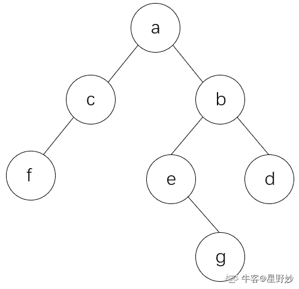

# 二千零二十一、搜狐畅游 U3D 开发工程师笔试-春招

## 1

《十日游戏》中由朱亚文扮演的角色职业是？

正确答案: A   你的答案: 空 (错误)

```cpp
游戏制作人
```

```cpp
作曲家
```

```cpp
商业分析师
```

```cpp
程序员
```

本题知识点

Java 工程师 C++工程师 PHP 工程师 golang 工程师 前端工程师 安卓工程师 iOS 工程师 算法工程师 大数据开发工程师 运维工程师 安全工程师 数据库工程师 游戏研发工程师 测试开发工程师 测试工程师 搜狐畅游 2021

## 2

以下哪个游戏不是由小说改编而来？

正确答案: C   你的答案: 空 (错误)

```cpp
天龙八部
```

```cpp
诛仙
```

```cpp
剑侠情缘
```

```cpp
花千骨
```

本题知识点

Java 工程师 C++工程师 PHP 工程师 golang 工程师 前端工程师 安卓工程师 iOS 工程师 算法工程师 大数据开发工程师 运维工程师 安全工程师 数据库工程师 游戏研发工程师 测试开发工程师 测试工程师 搜狐畅游 2021

## 3

《灵笼》动漫中，幸存者生存的地方是？

正确答案: B   你的答案: 空 (错误)

```cpp
方舟
```

```cpp
灯塔
```

```cpp
基地
```

```cpp
堡垒
```

本题知识点

运营 游戏策划 2021 搜狐畅游 Java 工程师 C++工程师 PHP 工程师 golang 工程师 前端工程师 安卓工程师 iOS 工程师 算法工程师 大数据开发工程师 运维工程师 安全工程师 数据库工程师 游戏研发工程师 测试开发工程师 测试工程师

## 4

游戏行业中的“流水”是指

正确答案: A   你的答案: 空 (错误)

```cpp
玩家充值总金额
```

```cpp
游戏发行商收入
```

```cpp
游戏研发商收入
```

```cpp
渠道商收入
```

本题知识点

Java 工程师 C++工程师 搜狐畅游 运营 测试工程师 游戏工程师 算法工程师 职能 设计 运维工程师 游戏研发工程师 2019 市场 游戏运营 数据库工程师 数据分析师 数据挖掘工程师 网络工程师 系统工程师 商务 游戏策划 2021 PHP 工程师 golang 工程师 前端工程师 安卓工程师 iOS 工程师 大数据开发工程师 安全工程师 测试开发工程师

讨论

[好好学习好好做人](https://www.nowcoder.com/profile/854180677)

流水：充值金额实收：利润

发表于 2021-08-12 01:24:26

* * *

[terrencexy](https://www.nowcoder.com/profile/197324993)

流水就是营业额，不是利润

发表于 2020-03-15 11:20:55

* * *

[牛客 30605549 号](https://www.nowcoder.com/profile/30605549)

猜的，流水肯定是钱。

发表于 2019-12-30 22:16:47

* * *

## 5

以下哪一款游戏机是掌机

正确答案: A   你的答案: 空 (错误)

```cpp
PSV
```

```cpp
XBOX360
```

```cpp
PS4
```

```cpp
Wii
```

本题知识点

运营 搜狐畅游 2021 游戏策划 Java 工程师 C++工程师 PHP 工程师 golang 工程师 前端工程师 安卓工程师 iOS 工程师 算法工程师 大数据开发工程师 运维工程师 安全工程师 数据库工程师 游戏研发工程师 测试开发工程师 测试工程师

## 6

以下哪款游戏是 rts 类？

正确答案: B   你的答案: 空 (错误)

```cpp
古墓丽影
```

```cpp
红色警戒
```

```cpp
彩虹六号
```

```cpp
第五人格
```

本题知识点

游戏策划 搜狐畅游 2021 运营 Java 工程师 C++工程师 PHP 工程师 golang 工程师 前端工程师 安卓工程师 iOS 工程师 算法工程师 大数据开发工程师 运维工程师 安全工程师 数据库工程师 游戏研发工程师 测试开发工程师 测试工程师

## 7

请描述在 C#语言种 Ref，delegate，sealed 这几个关键字的描述和理解。

你的答案

本题知识点

Java 工程师 C++工程师 PHP 工程师 golang 工程师 前端工程师 安卓工程师 iOS 工程师 算法工程师 大数据开发工程师 运维工程师 安全工程师 数据库工程师 游戏研发工程师 测试开发工程师 测试工程师 搜狐畅游 2021

## 8

关于 volatile 说法错误的是:

正确答案: D   你的答案: 空 (错误)

```cpp
指针可以是 volatile
```

```cpp
const 可以是 volatile
```

```cpp
每次访问一定是从内存中取出值
```

```cpp
volatitle 变量线程安全
```

本题知识点

Java 工程师 C++工程师 PHP 工程师 golang 工程师 前端工程师 安卓工程师 iOS 工程师 算法工程师 大数据开发工程师 运维工程师 安全工程师 数据库工程师 游戏研发工程师 测试开发工程师 测试工程师 搜狐畅游 2021

## 9

下面代码错误的是：struct A{ A(int) { } operator bool() const { return true; }};struct B{ explicit B(int) {} explicit operator bool() const { return true; }};A a1(1);B b1(1);

正确答案: C   你的答案: 空 (错误)

```cpp
bool a(a1);
```

```cpp
bool a = a1;
```

```cpp
bool b = b1;
```

```cpp
bool b(b1);
```

本题知识点

Java 工程师 C++工程师 PHP 工程师 golang 工程师 前端工程师 安卓工程师 iOS 工程师 算法工程师 大数据开发工程师 运维工程师 安全工程师 数据库工程师 游戏研发工程师 测试开发工程师 测试工程师 搜狐畅游 2021

讨论

[starboycn](https://www.nowcoder.com/profile/512227589)

显式转换没有复制构造就没法这么写

发表于 2021-07-20 21:17:13

* * *

## 10

描述如下：int ia[] = {0,2,4,6,8,10};int* ip1 = &ia[3];int* ip2 = &ia[1];int diff = ip1-ip2;那么在 32 位平台下 diff 的值是：

正确答案: B   你的答案: 空 (错误)

```cpp
0
```

```cpp
2
```

```cpp
4
```

```cpp
8
```

本题知识点

Java 工程师 C++工程师 PHP 工程师 golang 工程师 前端工程师 安卓工程师 iOS 工程师 算法工程师 大数据开发工程师 运维工程师 安全工程师 数据库工程师 游戏研发工程师 测试开发工程师 测试工程师 搜狐畅游 2021

讨论

[李太白](https://www.nowcoder.com/profile/3228986)

32 位系统下 int 类型的数据占 32 位，所以一个地址正好可以存储一个数据，地址差就为 2

发表于 2022-03-02 16:10:50

* * *

[Klein_SerV](https://www.nowcoder.com/profile/484640068)

地址差 3-1=2

发表于 2021-05-07 11:47:30

* * *

## 11

在下列几种排序算法中，如果当前数据基本有序，_____ 算法比较合适

正确答案: B   你的答案: 空 (错误)

```cpp
归并排序
```

```cpp
插入排序
```

```cpp
选择排序
```

```cpp
快速排序
```

本题知识点

Java 工程师 C++工程师 PHP 工程师 golang 工程师 前端工程师 安卓工程师 iOS 工程师 算法工程师 大数据开发工程师 运维工程师 安全工程师 数据库工程师 游戏研发工程师 测试开发工程师 测试工程师 搜狐畅游 2021

## 12

已知二叉树的中序遍历为 fcaegbd，后序遍历为 fcgedba，前序遍历序列为：

正确答案: A   你的答案: 空 (错误)

```cpp
acfbegd
```

```cpp
abdegcf
```

```cpp
acfbedg
```

```cpp
acbfedg
```

本题知识点

Java 工程师 C++工程师 PHP 工程师 golang 工程师 前端工程师 安卓工程师 iOS 工程师 算法工程师 大数据开发工程师 运维工程师 安全工程师 数据库工程师 游戏研发工程师 测试开发工程师 测试工程师 搜狐畅游 2021

讨论

[星野妙](https://www.nowcoder.com/profile/604099522)

从后序遍历可知，二叉树的根节点为 a，再带入到中序遍历中看，可以将二叉树以根 a 为中心分为左右两个子树，再看后序遍历的倒数第二个结点为 b，b 位于右子树，因此 b 是右子树的根节点，以此类推，可以画出二叉树如下，这样就能根据图写出前序遍历了：acfbegd

发表于 2022-03-18 15:50:28

* * *

[牛客 991561819 号](https://www.nowcoder.com/profile/991561819)

a

发表于 2021-08-24 11:34:02

* * *

## 13

下列排序为稳定排序的是：

正确答案: C   你的答案: 空 (错误)

```cpp
快速排序
```

```cpp
堆排序
```

```cpp
归并排序
```

```cpp
希尔排序
```

本题知识点

Java 工程师 C++工程师 PHP 工程师 golang 工程师 前端工程师 安卓工程师 iOS 工程师 算法工程师 大数据开发工程师 运维工程师 安全工程师 数据库工程师 游戏研发工程师 测试开发工程师 测试工程师 搜狐畅游 2021

## 14

下列说法正确的是：

正确答案: D   你的答案: 空 (错误)

```cpp
std::vector 内存地址是连续的，list 内存地址非连续的，但若只在尾部追加添加元素，他们的效率是一样的
```

```cpp
std::map 是一种 key-value 容器，容器里是 key 值，不做排序，所以遍历时，遍历顺序不保证一致。
```

```cpp
std::set 是一种会排序的容器，添加的元素会自动排序，对于重复元素，相邻排列
```

```cpp
std::map 可以在遍历的时候，插入元素。
```

本题知识点

Java 工程师 C++工程师 PHP 工程师 golang 工程师 前端工程师 安卓工程师 iOS 工程师 算法工程师 大数据开发工程师 运维工程师 安全工程师 数据库工程师 游戏研发工程师 测试开发工程师 测试工程师 搜狐畅游 2021

## 15

如果一个堆栈的入栈顺序为 ABCDE,那么不可能出栈的顺序为：

正确答案: D   你的答案: 空 (错误)

```cpp
ABCDE
```

```cpp
DECBA
```

```cpp
EDCBA
```

```cpp
DCEAB
```

本题知识点

Java 工程师 C++工程师 PHP 工程师 golang 工程师 前端工程师 安卓工程师 iOS 工程师 算法工程师 大数据开发工程师 运维工程师 安全工程师 数据库工程师 游戏研发工程师 测试开发工程师 测试工程师 搜狐畅游 2021

讨论

[好吃就很下饭](https://www.nowcoder.com/profile/755997182)

答案 D，先入 a 再入 b，若 a 不是第一个出栈，b 一定比 a 先出栈

发表于 2021-06-04 05:56:41

* * *

## 16

在单链表中，增加头结点的目的是：

正确答案: D   你的答案: 空 (错误)

```cpp
标识表结点中首结点的位置
```

```cpp
使单链表至少有一个结点
```

```cpp
说明单链表是线性表的链式存储实现
```

```cpp
算法实现上的方便
```

本题知识点

Java 工程师 C++工程师 PHP 工程师 golang 工程师 前端工程师 安卓工程师 iOS 工程师 算法工程师 大数据开发工程师 运维工程师 安全工程师 数据库工程师 游戏研发工程师 测试开发工程师 测试工程师 搜狐畅游 2021

## 17

关于 Mysql 系列描述错误的是

正确答案: C   你的答案: 空 (错误)

```cpp
mysql 语句不区分大小写
```

```cpp
blob 数据类型在比较的时候区分大小写
```

```cpp
需要支持事务，所以选择的引擎是 MyISAM。
```

```cpp
如果某次操作需要执行多次 SQL，使用存储过程比单纯 SQL 语句执行要快。
```

本题知识点

Java 工程师 C++工程师 PHP 工程师 golang 工程师 前端工程师 安卓工程师 iOS 工程师 算法工程师 大数据开发工程师 运维工程师 安全工程师 数据库工程师 游戏研发工程师 测试开发工程师 测试工程师 搜狐畅游 2021

讨论

[牛客 550665582 号](https://www.nowcoder.com/profile/550665582)

C MyISAM 不支持事务，InnoDB 支持事务

发表于 2021-10-12 15:03:42

* * *

[🌝🌝659](https://www.nowcoder.com/profile/1815087)

myisam 引擎不支持事务仅支持表锁，是 mysql5.几的默认引擎；innodb 引擎才支持事务，同时支持行锁和表锁，是 MySQL 的默认引擎

发表于 2021-09-11 18:06:41

* * *

[Zauriel](https://www.nowcoder.com/profile/739991190)

C Myisam 不支持事务

发表于 2021-07-19 11:17:26

* * *

## 18

下列不属于网络应用层的协议是

正确答案: C   你的答案: 空 (错误)

```cpp
http
```

```cpp
websocket
```

```cpp
icmp
```

```cpp
telnet
```

本题知识点

Java 工程师 C++工程师 PHP 工程师 golang 工程师 前端工程师 安卓工程师 iOS 工程师 算法工程师 大数据开发工程师 运维工程师 安全工程师 数据库工程师 游戏研发工程师 测试开发工程师 测试工程师 搜狐畅游 2021

## 19

编译程序大多时间花费在

正确答案: A   你的答案: 空 (错误)

```cpp
表格管理
```

```cpp
目标代码生成
```

```cpp
词法分析
```

```cpp
出错处理
```

本题知识点

Java 工程师 C++工程师 PHP 工程师 golang 工程师 前端工程师 安卓工程师 iOS 工程师 算法工程师 大数据开发工程师 运维工程师 安全工程师 数据库工程师 游戏研发工程师 测试开发工程师 测试工程师 搜狐畅游 2021

## 20

下列说法错误的是

正确答案: B   你的答案: 空 (错误)

```cpp
多线程共同访问某个类的 CONST 变量是线程安全的。
```

```cpp
全局变量 I,多线程进行 I++是线程安全的。
```

```cpp
多线程访问方法中的变量全部是局部变量是线程安全的。
```

```cpp
主线程初始好一个 std::vector 后，多线程使用迭代器只读遍历 vector 是线程安全的。
```

本题知识点

Java 工程师 C++工程师 PHP 工程师 golang 工程师 前端工程师 安卓工程师 iOS 工程师 算法工程师 大数据开发工程师 运维工程师 安全工程师 数据库工程师 游戏研发工程师 测试开发工程师 测试工程师 搜狐畅游 2021

## 21

C++11 实现读写锁一定需要使用到：

正确答案: C   你的答案: 空 (错误)

```cpp
std::timed_mutex
```

```cpp
std::mutex
```

```cpp
std::shared_mutex
```

```cpp
std::recursive_mutex
```

本题知识点

Java 工程师 C++工程师 PHP 工程师 golang 工程师 前端工程师 安卓工程师 iOS 工程师 算法工程师 大数据开发工程师 运维工程师 安全工程师 数据库工程师 游戏研发工程师 测试开发工程师 测试工程师 搜狐畅游 2021

## 22

请描述 yield 在协程(coroutine)中的作用，以下是 Unity 中的协程功能一段代码是否有问题？如果有，如何修改？并写出调用此协程的代码。 
    IEnumerator StartSocketLoop()
    {
        while (true)
        {
            if (ExcuteReceiveBuffer())
                continue;
            // 处理发送队列
            if (ExcuteSenderBuffer())
                continue;
            yield return 0;
        }
    }

你的答案

本题知识点

Java 工程师 C++工程师 PHP 工程师 golang 工程师 前端工程师 安卓工程师 iOS 工程师 算法工程师 大数据开发工程师 运维工程师 安全工程师 数据库工程师 游戏研发工程师 测试开发工程师 测试工程师 搜狐畅游 2021

讨论

[牛客 541700207 号](https://www.nowcoder.com/profile/541700207)

yield 为暂停目前方法，暂停结束后在此处继续执行；没有给出 ExcuteReceiveBuffer()为 false 的情况可以使用 Startcoroutine(StartSocketLoop());或 Startcoroutine(“StartSocketLoop”);以开始该协程

发表于 2022-02-26 20:32:03

* * *

[Kruziikloksu](https://www.nowcoder.com/profile/516200332)

yield return 为暂停此方法并且下一帧从此处执行 可以在此处插入其他方法或返回值此方法将逐帧循环执行 
没有给出 ExcuteReceiveBuffer()为 false 的情况 或许需要 yield break;终止？可使用 StartCoroutine("StartSocketLoop");调用此携程以便提前终止

发表于 2021-10-28 00:43:11

* * *

## 23

已知物体 mTarget，在下面 Update()方法中补全代码实现目标物体屏幕上跟随鼠标移动（相机视角使用在 Camera.main）。
public Transform mTarget;
private void Update()
{
 // TODO
}

你的答案

本题知识点

Java 工程师 C++工程师 PHP 工程师 golang 工程师 前端工程师 安卓工程师 iOS 工程师 算法工程师 大数据开发工程师 运维工程师 安全工程师 数据库工程师 游戏研发工程师 测试开发工程师 测试工程师 搜狐畅游 2021

## 24

请描述在 C#语言种 Ref，delegate，sealed 这几个关键字的描述和理解。

你的答案

本题知识点

Java 工程师 C++工程师 PHP 工程师 golang 工程师 前端工程师 安卓工程师 iOS 工程师 算法工程师 大数据开发工程师 运维工程师 安全工程师 数据库工程师 游戏研发工程师 测试开发工程师 测试工程师 搜狐畅游 2021