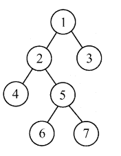
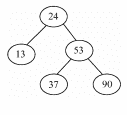
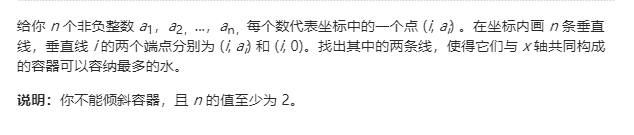

# 百度 2021 校招 C /PHP 研发工程师笔试卷（第一批）

## 1

下面横线上填上哪些选项可以使最后的输出结果为 1?

```cpp
#include <iostream>
class A {
private:
    int m_x;
public:
    void setX(int x)
    {
        m_x = x;
    }
    int getX()
    {
        return m_x;
    }
};
void func(_____)
{
    a[0].setX(1);
}
int main() {
    A a[2];
    a[0].setX(2);
    func(a);
    std::cout << a[0].getX();
    return 0;
}
```

正确答案: A B D   你的答案: 空 (错误)

```cpp
A (&a)[2]
```

```cpp
A *a
```

```cpp
A a
```

```cpp
A a[]
```

```cpp
A &a
```

本题知识点

C++工程师 PHP 工程师 百度 2021

## 2

```cpp
#include<iostream>  
using namespace std;
static int test = 0;
void func(){}
int main()
{
 return 0;
}
```

A 工程下的仅有 a,b 这 2 个 cpp 文件,其中 a.cpp 代码如上，test 变量的作用域是什么?

正确答案: B   你的答案: 空 (错误)

```cpp
a,b2 个 cpp 文件里都能用 test 变量
```

```cpp
仅限在 a.cpp 里面使用
```

```cpp
仅限在 main 函数里使用
```

```cpp
仅限在 func 函数里面使用
```

```cpp
仅限在 b.cpp 里面使用
```

本题知识点

C++工程师 PHP 工程师 百度 2021

## 3

关于以下代码说法正确的有

```cpp
#include<iostream>
using namespace std;
class A {
public:
    virtual void x() = 0;
};
class B :public A {
public:
    virtual void x(int a) {  }
};
int main()
{
    A *a = new B;
    delete a;
    return 0;
}
```

正确答案: A C   你的答案: 空 (错误)

```cpp
B 类没有成功重写 A 类 x 函数，有编译错误
```

```cpp
A 类含有纯虚函数，不能使用 new 关键字，所以 A *a = new B，有编译错误
```

```cpp
A 类没有虚析构函数，会导致 new B 申请的空间得不到释放，可能会有内存泄漏
```

```cpp
运行正常，无错误
```

本题知识点

C++工程师 PHP 工程师 百度 2021

讨论

[Haihuaaa](https://www.nowcoder.com/profile/648537609)

A 答案：纯虚函数是没有函数体的 B 中重写的函数仍为虚函数，所以 B 类没有成功重写 A 类 x 函数，有编译错误 C 答案：如果 A 没有虚析构函数，B 的析构函数不参与多态，析构对象时只会调用基类的析构函数，导致 B 的空间没有完全释放，可能出现内存泄漏

发表于 2022-03-20 13:04:15

* * *

## 4

以下代码会发生什么？

```cpp
#include <iostream>
#include <memory>
using namespace std;
void fun(std::shared_ptr<int> p)
{
    *p = 5;
}
int main()
{
    int arar = 6;
    for (int i = 0; i < 1000000; i++)
    {
        std::shared_ptr<int> p = std::make_shared<int>(arar);
        fun(p);
        std::cout << *p;
    }
    return 0;
}
```

正确答案: D   你的答案: 空 (错误)

```cpp
内存泄漏
```

```cpp
编译出错
```

```cpp
运行出错
```

```cpp
无错，输出 1000000 个 5
```

```cpp
无错，输出 1000000 个 6
```

本题知识点

C++工程师 PHP 工程师 百度 2021

## 5

某主机的 IP 地址为 212.212.77.55，子网掩码为 255.255.252.0。若该主机向其所在子网发送广播分组，则目的地址可以是？

正确答案: D   你的答案: 空 (错误)

```cpp
212.212.76.255
```

```cpp
212.212.77.255
```

```cpp
212.212.78.255
```

```cpp
212.212.79.255
```

```cpp
212.212.80.255
```

本题知识点

C++工程师 PHP 工程师 百度 2021 Java 工程师 前端工程师

讨论

[⊱r=a（1-sinx）♒](https://www.nowcoder.com/profile/646955188)

子网掩码 252，即 11111100，而后两位和第四部分是子网，而广播地址是子网号全为 1，主网号不变。因此 212.212.77.55，即 212.212.（100011-01）.55                广播号：212.212.    100011-11.255 即 212.212.79.255

发表于 2021-09-07 15:21:44

* * *

[oceanao](https://www.nowcoder.com/profile/3461356)

正确答案：D 题目解析：
由子网掩码可知前 22 位为子网号、后 10 位为主机号。IP 地址的第 3 个字节为 010011 01 ，后面 2 位是主机号，将主机号全置为 1，可得广播地址为 180.80.79.255

发表于 2021-09-07 19:00:25

* * *

[vaakian](https://www.nowcoder.com/profile/309934583)

主机号为后 10 为，该 ip 后 10 为广播地址全置 0 即 11.11111111，即得到答案。

发表于 2021-09-12 23:57:16

* * *

## 6

小牛在学习了二叉树三种遍历方式后，自己发明了一直与中序遍历相反的遍历方式，称为"反中序遍历"，中序遍历的遍历方式为左孩子->根节点->右孩子，他发明的"反中序遍历"遍历方式为右孩子->根节点->左孩子，那么使用他发明的"反中序遍历"遍历如下图的二叉树，输出的节点应为? 

正确答案: A   你的答案: 空 (错误)

```cpp
3，1，7，5，6，2，4
```

```cpp
3，1，5，7，2，6，4
```

```cpp
3，1，2，7，5，6，4
```

```cpp
3，1，7，5，2，6，4
```

```cpp
3，1，4，2，6，5，7
```

本题知识点

C++工程师 PHP 工程师 百度 2021 Java 工程师 前端工程师

## 7

若数据元素序列 9，10，11，5，6，7，12，3，4 是采用下列排序方法之一得到的 第二趟升序排序后的结果，则该排序算法只能是? 正确答案: B   你的答案: 空 (错误)

```cpp
冒泡排序
```

```cpp
插入排序
```

```cpp
选择排序
```

```cpp
二路归并排序
```

本题知识点

C++工程师 PHP 工程师 百度 2021 前端工程师

讨论

[牛客 906400277 号](https://www.nowcoder.com/profile/906400277)

咋这个题没大佬分析思路了，哈哈哈

发表于 2021-09-28 15:52:25

* * *

## 8

以下二叉平衡排序树(AVL 树)，插入一个新节点值为 30 后，重平衡调整为一颗 AVL 树。那么请问节点 24 的左右孩子分别为?

正确答案: A   你的答案: 空 (错误)

```cpp
13，30
```

```cpp
13，无右孩子
```

```cpp
13，37
```

```cpp
13，53
```

```cpp
无左孩子，37
```

```cpp
无左孩子，53
```

本题知识点

C++工程师 PHP 工程师 百度 2021 Java 工程师

讨论

[AliceWan](https://www.nowcoder.com/profile/549074977)

A 原题解配图有问题

发表于 2021-06-23 20:39:43

* * *

## 9

当数组 arr= {2,12,17,31,53,69,97,142,150,240,308}，value=53 时，上述函数中 while 循环的次数为：

```cpp
import java.util.Arrays;
public class NowCoder {
    public static void main(String[] args) {
        int[] arr= {2,12,17,31,53,69,97,142,150,240,308};
        System.out.println(BinarySearch(arr,53));
    }
    public static int BinarySearch(int[] arr,int value) {
        int left=0;
        int right=arr.length-1;
        while(left<=right) {
            int mid=(left+right)/2;
            if(value==arr[mid]) {
                return mid;
            }
            if(value>arr[mid]) {
                left=mid+1;
            }
            if(value<arr[mid]) {
                right=mid-1;
            }
        }
        return -1;
    }
}
```

正确答案: C   你的答案: 空 (错误)

```cpp
2
```

```cpp
3
```

```cpp
4
```

```cpp
5
```

本题知识点

C++工程师 PHP 工程师 百度 2021 Java 工程师

## 10

关于网络请求延迟增大的问题，以下哪些描述是正确的()

正确答案: B C D   你的答案: 空 (错误)

```cpp
使用 ping 来测试 TCP 端口是不是可以正常连接
```

```cpp
使用 tcpdump 抓包分析网络请求
```

```cpp
使用 strace 观察进程的网络系统调用
```

```cpp
使用 Wireshark 分析网络报文的收发情况
```

本题知识点

C++工程师 PHP 工程师 百度 2021 Java 工程师 前端工程师

讨论

[响亮亮的名字 1](https://www.nowcoder.com/profile/505661295)

ping 是网络层的，tcp 是传输层的

发表于 2021-08-17 14:25:20

* * *

[va 转行](https://www.nowcoder.com/profile/362513317)

使用 TCP

发表于 2021-07-18 06:03:31

* * *

## 11

对于以下代码分析

```cpp
int test(int N)
{
    int i = 0;
    int cnt = 0;
    while (cnt<N)
    {
        i = i + 2;
        cnt = cnt + i;
    }
    return i;
}

```

以下选项最接近上面程序的时间复杂度是？

正确答案: A   你的答案: 空 (错误)

本题知识点

C++工程师 PHP 工程师 百度 2021 前端工程师

## 12



```cpp
输入：[1,8,6,2,5,4,8,3,7] 输出：49
```

目前某学生用如下 java 代码解决了此问题，设 height 数组长度为 N，且 N 足够大，他的部分代码如下，请你判断他代码(maxArea 函数)的时间复杂的以及额外的空间复杂度(不包括传入的 height 数组)分别为? 

```cpp
int calculateArea(int start, int end, int sHeight, int eHeight) {
    int len = end - start;
    int height = Math.min(sHeight, eHeight);
    return len * height;
}

public int maxArea(int[] height) {
    int maxLen = -1;
    int arrLen = height.length;
    for (int i = 0, j = arrLen - 1; i < arrLen; ) {
        if (i == j) {
            return maxLen;
        }
        int area = calculateArea(i, j, height[i], height[j]);
        maxLen = Math.max(area, maxLen);
        if (height[i] > height[j]) {
            j--;
        } else {
            i++;
        }
    }

    return 0;
}

```

正确答案: A   你的答案: 空 (错误)

```cpp
O(N)，O(1)
```

```cpp
O(N)，O(N)
```

```cpp
O(N)，O(logN)
```

```cpp
O(N2)，O(1)
```

```cpp
O(NlogN)，O(1)
```

本题知识点

C++工程师 PHP 工程师 百度 2021 Java 工程师

## 13

一个算法的时间复杂度由以下递归方程表示(N,M 都是非常大的正整数):(1).T(1)=1(2).T(N)=2T(N/2)+O(M)(递归的过程中 O(M)不变)那么该算法的时间复杂度为哪个级别的?

正确答案: C   你的答案: 空 (错误)

```cpp
O(MlogN)
```

```cpp
O(MN2)
```

```cpp
O(MN)
```

```cpp
O(M+N)
```

```cpp
O(NlogM)
```

本题知识点

C++工程师 PHP 工程师 百度 2021 Java 工程师

讨论

[徐风](https://www.nowcoder.com/profile/503005674)

反正我没看懂

发表于 2022-03-09 10:30:00

* * *

[va 转行](https://www.nowcoder.com/profile/362513317)

主方法

发表于 2021-07-18 06:06:34

* * *

## 14

下面可以按照从小到大顺序排列显示磁盘中各个分区利用率的命令是

正确答案: C   你的答案: 空 (错误)

```cpp
du | grep -o "\<[0-9]*%.*" -o | sort -n
```

```cpp
df | grep -o "\<[0-9]*%.*" -o | sort -r
```

```cpp
df | grep -o "\<[0-9]*%.*" -o | sort -n
```

```cpp
du | grep -o "\<[0-9]*%.*" -o | sort -m
```

本题知识点

C++工程师 PHP 工程师 百度 2021 Java 工程师 前端工程师

讨论

[扶摇可接 999](https://www.nowcoder.com/profile/423269138)

没什么好解释的，df（disk free）查看文件系统磁盘使用情况，多背多用

发表于 2021-12-11 11:55:27

* * *

## 15

下面关于用户级线程和内核级线程的描述，错误的是?

正确答案: E   你的答案: 空 (错误)

```cpp
内核级线程，线程的创建、撤销和切换等，都需要内核直接实现
```

```cpp
内核级线程是操作系统调度器管理和调度
```

```cpp
用户级线程间的切换比内核级线程间的切换效率高
```

```cpp
用户级线程可以在不支持内核级线程的操作系统上实现
```

```cpp
操作系统为每个用户级线程建立一个线程控制块
```

本题知识点

C++工程师 PHP 工程师 百度 2021 Java 工程师

讨论

[va 转行](https://www.nowcoder.com/profile/362513317)

操作系统不知道用户线程的存在。

发表于 2021-07-18 14:46:16

* * *

## 16

生产者与消费者模型是一个非常经典的同步与互斥问题，如下伪码实现了简单的消费者的功能(生产者的功能是往队列里面添加元素，消费者的功能是从队列里面取元素)

```cpp
void consumption() {
    while(____){
         ____;
    }
    P(mutex);
    往队列里面取一个元素;
    V(mutex);
    ————————;
}
```

里面的 P,V 就是指 PV 操作，mutex 是互斥信号量；现有如下方法：isFull() : 表示队列元素满了 isEmpty(): 表示队列元素为空 m_notFull.wait(): 阻塞当前进程，直到队列元素不满 m_notFull.notify(): 队列元素不满了，唤醒某个进程 m_notEmpty.wait()：阻塞当前进程，直到队列元素不为空 m_notEmpty.notify():队列元素不为空了，唤醒某个进程
请你按选好方法，填到上面空行，完成消费者的功能

正确答案: E   你的答案: 空 (错误)

```cpp
isFull()， m_notFull.wait()，  m_notFull.notify()
```

```cpp
isFull()， m_notFull.wait()，  m_notEmpty.notify()
```

```cpp
isFull()， m_notFull.notify()，  m_notEmpty.wait()
```

```cpp
isEmpty()， m_notEmpty.wait()， m_notEmpty.notify()
```

```cpp
isEmpty()， m_notEmpty.wait()， m_notFull.notify()
```

```cpp
isEmpty()， m_notEmpty.notify()，  m_notFull.wait()
```

本题知识点

C++工程师 PHP 工程师 百度 2021 Java 工程师 前端工程师

## 17

下列 php 脚本执行的结果是什么？（）<?php$x = 1;function Test(){echo "a = $x";}Test();?>

正确答案: D   你的答案: 空 (错误)

```cpp
a=1
```

```cpp
a=0
```

```cpp
a=$x
```

```cpp
a=
```

本题知识点

C++工程师 PHP 工程师 百度 2021

讨论

[牛客 142901066 号](https://www.nowcoder.com/profile/142901066)

D

发表于 2021-06-26 23:29:44

* * *

## 18

这里有一张中国高校开设课程信息表（课程名称，高校名称）（只展示了部分数据，其余大量数据形式相同）
+-----------+---------+
|     name     | college |
+-----------+---------+
|   S1      |     ZD    |
|   S2      |     BD    |
|   S2      |     QH    |
|   S5      |     SD    |
|   S3      |     JN    |
+-----------+---------+
查询出哪个高校，开设的课程最多？

正确答案: B   你的答案: 空 (错误)

```cpp
select college,count(*) as count from college group by  college  limit 1;
```

```cpp
select college,count(*) as count from college group by  college order by count desc limit 1;
```

```cpp
select college,count(*) as count from college order by count desc limit 1;
```

```cpp
select college,count(*) as count from college group by  college order by count limit 1;
```

本题知识点

C++工程师 PHP 工程师 百度 2021 Java 工程师

## 19

百度下面有多个部门，包含大搜、凤巢、无人驾驶等等。每个部门每年校招都会招人。在招人过程中就已明确规定，一个学生只能被录取到一个部门，但是一个部门可以录取多个学生。那么，学生和部门之间是 ________ 的关系

正确答案: D   你的答案: 空 (错误)

```cpp
一对多
```

```cpp
多对多
```

```cpp
一对一
```

```cpp
多对一
```

本题知识点

C++工程师 PHP 工程师 百度 2021

讨论

[牛客 115719795 号](https://www.nowcoder.com/profile/115719795)

一对一

发表于 2021-11-17 10:39:19

* * *

## 20

牛牛回到家要走恰好 n 个台阶。

由于牛牛步伐不太大，故单步只能跨最多 m 个台阶，最少跨一个台阶。

牛牛有一个奇怪的习惯，他要求每步和之前两步走的台阶数目不能相同。

牛牛想知道有多少种不同的走法，答案对取模。

本题知识点

C++工程师 PHP 工程师 百度 2021 Java 工程师

讨论

[JCoder](https://www.nowcoder.com/profile/1405380)

好想不好写的一个题，dp 的转移方程很好想：dp[i][j][k] = dp[i-j][k][l] 并且保证 j != k != l

```cpp
#include <bits/stdc++.h>
using namespace std;

int dp[100005][8][8];
int main() {
    int n, m, mod = 1e9 + 7;
    scanf("%d%d", &n, &m);
    memset(dp, 0, sizeof dp);
    dp[0][0][0] = 1;
    for (int i = 1; i <= n; i++) {
        for (int j = 1; j <= m; j++) {
            for (int k = 0; k <= m; k++) {
                for (int l = 0; l <= m; l++) {
                    if (i < j || (j == k && k != 0) || (k == l && k != 0) || (j == l && l != 0)) {
                        continue;
                    }
                    dp[i][j][k] += dp[i - j][k][l];
                    dp[i][j][k] %= mod;
                }
            }
        }
    }
    int ans = 0;
    for (int i = 0; i <= m; i++) {
        for (int j = 0; j <= m; j++) {
            ans += dp[n][i][j];
            ans %= mod;
        }
    }
    printf("%d\n", ans);

    return 0;
}

```

发表于 2021-09-17 12:34:13

* * *

[不入流的小林](https://www.nowcoder.com/profile/36774961)

牛牛事真多

发表于 2021-07-09 16:49:45

* * *

[坚持就是 yes](https://www.nowcoder.com/profile/680211508)

用回溯法尝试了下，通过了 40%，其他的超时了。大家看下如何解决这个超时的问题

```cpp
  public void Baidu(int n,int m){
                //存放前两位台阶数
        Deque<Integer> dq = new LinkedList<>();
        getResult(n,m,0, dq);
    }
    public  void getResult(int n, int m, int count,Deque<Integer> dq){
        if(count==n){
            res++;
            return;
        }
        //走过了
        if(count>n){
            return;
        }
        for(int i=1;i<=m;i++){
            if(dq.size()==0){
                dq.addLast(i);
                getResult(n,m,count+i,dq);
                dq.removeFirst();
            }else if(dq.size()==1) {
                if(!dq.contains(i)){
                    dq.addLast(i);
                    getResult(n,m,count+i,dq);
                    dq.removeLast();
                }
            }else if(dq.size()==2){
                if(!dq.contains(i)){
                    int t = dq.removeFirst();
                    dq.addLast(i);
                    getResult(n,m,count+i,dq);
                    dq.addFirst(t);
                    dq.removeLast();
                }
            }
        }
    }
```

编辑于 2021-07-01 15:42:40

* * *

## 21

如下代码是实现反转链表的一部分代码:反转链表为:输入一个链表的头节点，反转该链表并输出反转后链表的头节点。
示例:
输入: 1->2->3->4->5->NULL
输出: 5->4->3->2->1->NULL

```cpp
ListNode* reverseList(ListNode* head) {
        ListNode* cur = NULL, *pre = head;
        while (pre != NULL) {
            ListNode* temp = pre->next;
            pre->next = cur;
            _________;
            pre = temp;
        }
        return cur;
    }

```

请你选择一个合适的选项填到以上代码，完成这个函数的功能

正确答案: A   你的答案: 空 (错误)

```cpp
cur = pre;
```

```cpp
cur = pre->next;
```

```cpp
pre= cur;
```

```cpp
pre= cur->next;
```

本题知识点

C++工程师 PHP 工程师 百度 2021

讨论

[牛客 442731724 号](https://www.nowcoder.com/profile/442731724)

输入: 1->2->3->4->5->NULL 输出: 5->4->3->2->1->NULL ListNode* reverseList(ListNode* head) { ListNode* cur = NULL, *pre = head; while (pre != NULL) { ListNode* temp = pre->next; pre->next = cur; cur=pre; pre = temp; } return cur; }

发表于 2021-07-21 00:11:29

* * *